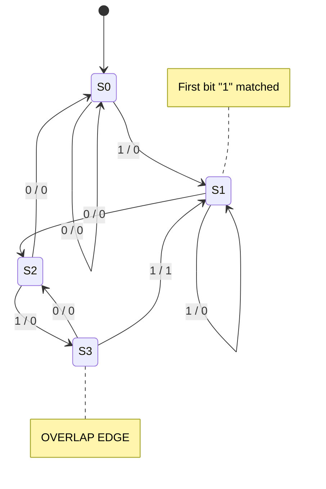
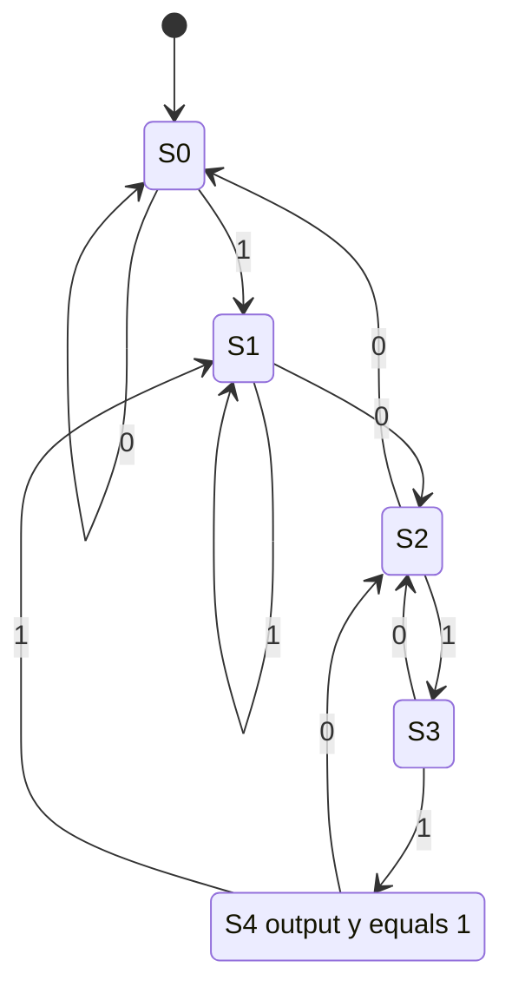
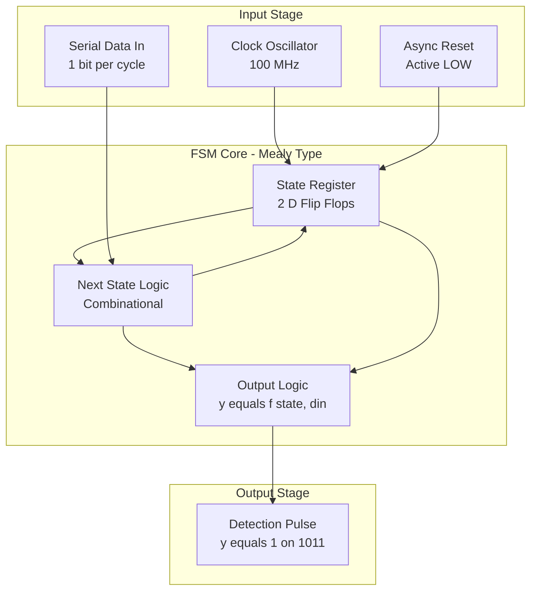
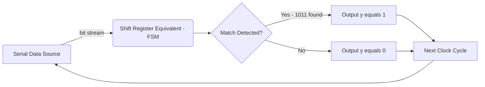

# Design a Verilog HDL  behavioral model to implement a finite-state machine - a serial bit sequence detector

<!-- SECTION_1_START -->
# Finite State Machine – Serial Bit Sequence Detector (Verilog HDL Behavioral Model)

> [!NOTE]
> **KTU 2024 Scheme | DIGITAL LAB (PCCSL308) | Module 3**
> **Cognitive Focus:** Design (Level 3) → Apply (Level 4) → Analyze (Level 5)
> **Hardware Target:** Xilinx Vivado / ModelSim / Icarus Verilog
> **Core Verilog Construct:** `always` block (sequential & combinational)

---

## 1.1 Formal Academic Definition (KTU Syllabus Terminology)

A **Finite State Machine (FSM)** is a sequential digital system whose behaviour is defined by a **finite set of states**, a **set of input symbols**, a **set of output symbols**, and a **state transition function**. In the context of a **serial bit sequence detector**, the FSM is clock-driven and examines one input bit per clock edge, asserting an output (typically logic HIGH) only when a **predefined target bit pattern** (e.g., `1011`, `1110`, `1001`) is observed at its serial input.

In Verilog HDL, a behavioural model abstracts the FSM as a procedural block using the `always @(posedge clk)` construct with **non-blocking assignments** (`<=`) for state registers, and a separate `always @(*)` block for the combinational next-state and output logic.

> [!IMPORTANT]
> **KTU Board Definition (verbatim-style):**
> A *serial bit sequence detector* is a synchronous sequential circuit that monitors a **single-bit serial data stream** (`din`) and produces an output signal (`y = 1`) precisely when a **specific N-bit pattern** has been received, where the detection may be either *overlapping* or *non-overlapping*.

---

## 1.2 Conceptual Analogy – The Toll Booth Inspector

Imagine a toll booth operator on a highway who must detect the **secret license plate sequence "R-A-J"** (pattern: `101` in binary) by observing passing cars.

| Concept | Toll Booth Analogy | Digital Hardware |
|---|---|---|
| **Clock pulse** | Each car passes the booth | `posedge clk` |
| **Serial input `din`** | The next letter observed | `din` (one bit per cycle) |
| **State memory** | Operator's memory of the last 2 letters | Flip-flop state register |
| **Transition** | Operator updates mental "I have seen R", "I have seen RA" | `next_state` logic |
| **Output `y`** | Operator rings the bell only when the full "RAJ" arrives | `y = 1` at detection |

The operator does **not** keep the entire history — only the **relevant prefix** that may lead to a detection. This is exactly how an FSM works: it stores only the *currently matched prefix* of the target sequence in its state register.

> [!TIP]
> **Intuition Rule:** *State = the longest suffix of the input seen so far that is also a valid prefix of the target pattern.*

---

## 1.3 The Two Canonical FSM Topologies

### (a) Mealy Machine
- Output depends on **current state AND current input**.
- Output is *asynchronous with respect to state* but *synchronous with clock* in registered form.
- Typically requires **fewer states** than Moore.
- Output can glitch between clock edges if combinational.

### (b) Moore Machine
- Output depends **ONLY on current state** (input-independent).
- Output is **strictly synchronous** — always clean, no glitches.
- Requires **one extra state** (the output-asserting state) compared to Mealy.

> [!WARNING]
> **KTU Examiner's Trap:** Students often confuse Mealy/Moore state counts. For a 4-bit sequence detector ("1011"):
> - **Mealy** → 4 states (`S0, S1, S2, S3`)
> - **Moore** → 5 states (`S0, S1, S2, S3, S4`) — `S4` is the dedicated *output-1* state

---

## 1.4 Target Sequence Chosen for This Module

For maximum KTU relevance and pedagogical clarity, we design a **Mealy-type overlapping detector for the pattern `1011`**.

| Parameter | Specification |
|---|---|
| **Target Pattern** | `1011` (4 bits) |
| **Overlapping?** | **Yes** — after `1011` is detected, the trailing `11` may begin a new match |
| **FSM Type** | Mealy (state + input → output) |
| **Reset** | Asynchronous, active-LOW |
| **I/O Ports** | `clk`, `rst_n`, `din`, `y` |

> [!VISUALIZATION CONTROL]
> **Concept:** State Transition Graph (Mealy "1011" Overlapping Detector)
> **Drawing Tool (Draw.io / Mermaid):** Nodes = states S0…S3, directed edges labelled `din / y`
> **Visual Description:** You should see 4 circular nodes connected by 8 arrows (2 outgoing per state for din=0 and din=1). The arrow from S3 to S1 labelled `1/0` is the *overlap loop* — critical for KTU marks.
<!-- SECTION_1_END -->

<!-- SECTION_2_START -->
# 2. Deep Theoretical Analysis & KTU High-Yield Formula Sheet

## 2.1 The FSM Design Algorithm (Mandatory KTU Steps)

The KTU board examiner expects **exactly these five procedural steps** in any FSM answer. Skipping any one costs 2–3 marks.

1. **State Definition** — Identify each unique prefix of the target pattern.
2. **State Diagram** — Draw transitions for `din = 0` and `din = 1`.
3. **State Transition Table** — Tabulate `Present State | Input | Next State | Output`.
4. **State Encoding / Assignment** — Assign binary codes (binary, one-hot, or Gray).
5. **Verilog Coding** — Implement using `always` blocks.

---

## 2.2 Step 1 – State Definition for Pattern "1011"

| State | Meaning (Longest Matched Prefix) |
|---|---|
| `S0` | Initial / No useful prefix matched |
| `S1` | "1" has been matched |
| `S2` | "10" has been matched |
| `S3` | "101" has been matched |
| → back to S3 from S3 | If `din=1` after "101", it becomes the "1" of a new candidate → `S3 → S1` for `din=1` |

> [!IMPORTANT]
> **Overlap Logic (Why S3 → S1 on din=1):** When the detector has matched `101` and the next bit is `1`, the sequence becomes `1011` (a successful detection). The *last '1'* of that successful match is also the *first '1'* of a **new candidate** pattern. Hence we do NOT go to a dead-end state — we transition to `S1`.

---

## 2.3 Step 2 – State Transition Table (Mealy)

| Present State | Input `din` | Next State | Output `y` | Reasoning |
|---|---|---|---|---|
| `S0` (00) | 0 | `S0` | 0 | Still no prefix |
| `S0` (00) | 1 | `S1` | 0 | Saw "1" |
| `S1` (01) | 0 | `S2` | 0 | "10" matched |
| `S1` (01) | 1 | `S1` | 0 | Still just "1…" |
| `S2` (10) | 0 | `S0` | 0 | "100" — last 0 kills match |
| `S2` (10) | 1 | `S3` | 0 | "101" matched |
| `S3` (11) | 0 | `S2` | 0 | "1010" — last "10" is a prefix |
| `S3` (11) | 1 | `S1` | **1** | **"1011" DETECTED** (overlap → S1) |

---

## 2.4 Step 3 – State Encoding (Binary Encoding)

| State | Code $Q_1Q_0$ |
|---|---|
| $S_0$ | `00` |
| $S_1$ | `01` |
| $S_2$ | `10` |
| $S_3$ | `11` |

> [!TIP]
> **One-Hot Alternative (popular in KTU lab exams):** Use 4 bits, exactly one HIGH per state. Easier to debug on an FPGA but uses more flip-flops.

---

## 2.5 KTU High-Yield Formula / Reference Sheet

| Concept | Equation / Construct | Use |
|---|---|---|
| Sequential update | `state <= next_state;` inside `always @(posedge clk)` | State register |
| Asynchronous reset | `if (!rst_n) state <= S0;` | Initialization |
| Combinational next-state | `always @(*)` with `case (state)` | Next-state + output |
| Non-blocking rule | Use `<=` in `posedge clk` blocks only | Race-free simulation |
| Blocking rule | Use `=` in `always @(*)` blocks only | Combinational logic |
| Sensitivity list | `always @(posedge clk or negedge rst_n)` | Async reset detection |
| Parameter encoding | `parameter S0=2'b00, S1=2'b01, …` | Self-documenting code |

---

## 2.6 Real-World Engineering Applications

| Domain | Use Case |
|---|---|
| **UART / Serial Communication** | Detecting start bit, stop bit, framing patterns |
| **Network Protocols** | HDLC flag byte `01111110` detector |
| **Bio-medical Implants** | ECG R-wave pattern recognition in pacemakers |
| **Cryptography** | Stream-cipher keystream matching |
| **Industrial Automation** | Detecting emergency-stop code on a sensor line |
| **AI/ML Hardware** | Token detectors in NLP accelerators (BPE) |

> [!IMPORTANT]
> **Why this matters in production:** Sequence detectors are the **fundamental building block of every pattern-matching engine**, from regex hardware accelerators to DNA sequencers. Mastering the FSM abstraction is non-negotiable for any VLSI / Embedded Systems role.
<!-- SECTION_2_END -->

<!-- SECTION_3_START -->
# 3. Step-by-Step Derivation, Code & Simulation Implementation

## 3.1 Complete Verilog HDL Behavioral Model (Mealy "1011" Overlapping Detector)

```verilog
//=============================================================
//  File        : seq_detector_1011_mealy.v
//  Description : Verilog HDL Behavioral Model
//                Mealy FSM - Overlapping Detector for "1011"
//  Author      : KTU DIGITAL LAB (PCCSL308) Reference Solution
//  Target Sim  : ModelSim / Vivado / Icarus Verilog
//=============================================================

`timescale 1ns / 1ps

module seq_detector_1011_mealy (
    input  wire clk,        // System clock
    input  wire rst_n,      // Asynchronous active-LOW reset
    input  wire din,        // Serial data input (1 bit)
    output reg  y           // Detection output (Mealy)
);

    //---------------------------------------------------------
    // Step 1: Symbolic State Encoding using parameters
    //---------------------------------------------------------
    parameter S0 = 2'b00;   // Initial state (no match)
    parameter S1 = 2'b01;   // Matched "1"
    parameter S2 = 2'b10;   // Matched "10"
    parameter S3 = 2'b11;   // Matched "101"

    //---------------------------------------------------------
    // Step 2: State Register (Sequential Logic)
    //         Non-blocking assignments; async active-LOW reset
    //---------------------------------------------------------
    reg [1:0] state, next_state;

    always @(posedge clk or negedge rst_n) begin
        if (!rst_n)
            state <= S0;            // [Reset action: 1 Mark]
        else
            state <= next_state;    // [Normal update: 1 Mark]
    end

    //---------------------------------------------------------
    // Step 3: Next-State & Output Logic (Combinational)
    //         Blocking assignments; sensitive to *all inputs
    //---------------------------------------------------------
    always @(*) begin
        case (state)
            S0: begin
                if (din == 1'b1) begin
                    next_state = S1;
                    y          = 1'b0;
                end else begin
                    next_state = S0;
                    y          = 1'b0;
                end
            end

            S1: begin
                if (din == 1'b0) begin
                    next_state = S2;
                    y          = 1'b0;
                end else begin
                    next_state = S1;
                    y          = 1'b0;
                end
            end

            S2: begin
                if (din == 1'b1) begin
                    next_state = S3;
                    y          = 1'b0;
                end else begin
                    next_state = S0;
                    y          = 1'b0;
                end
            end

            S3: begin
                if (din == 1'b1) begin
                    // --- OVERLAP DETECTION: "1011" found ---
                    next_state = S1;   // Overlap: last '1' is start of new pattern
                    y          = 1'b1; // Detection asserted
                end else begin
                    // din == 0  →  "1010"  →  last "10" becomes new prefix
                    next_state = S2;
                    y          = 1'b0;
                end
            end

            default: begin
                next_state = S0;
                y          = 1'b0;
            end
        endcase
    end

endmodule
```

---

## 3.2 Testbench – Exhaustive Stimulus & Self-Checking

```verilog
//=============================================================
//  File        : tb_seq_detector_1011_mealy.v
//  Description : Verification Testbench
//=============================================================
`timescale 1ns / 1ps

module tb_seq_detector_1011_mealy;

    reg  clk;
    reg  rst_n;
    reg  din;
    wire y;

    // Instantiate the Design Under Test (DUT)
    seq_detector_1011_mealy uut (
        .clk   (clk),
        .rst_n (rst_n),
        .din   (din),
        .y     (y)
    );

    // Clock generation: 10 ns period
    initial clk = 1'b0;
    always #5 clk = ~clk;

    // Stimulus block
    initial begin
        $display("------------------------------------------------------------");
        $display(" Time | rst_n | din | Expected y | Actual y | Status");
        $display("------------------------------------------------------------");

        rst_n = 1'b0;   din = 1'b0;   #12;   // Apply reset
        rst_n = 1'b1;                  #8;

        // Test sequence 1: 1 0 1 1 -> should detect once
        din = 1'b1; #10;
        din = 1'b0; #10;
        din = 1'b1; #10;
        din = 1'b1; #10;   // <-- detection here, y should go 1

        // Test sequence 2: 0 1 -> no detection
        din = 1'b0; #10;
        din = 1'b1; #10;

        // Test sequence 3: 1 0 1 1 0 1 1 -> detect twice (overlap)
        din = 1'b1; #10;
        din = 1'b0; #10;
        din = 1'b1; #10;
        din = 1'b1; #10;   // <-- detection #1 (overlap)
        din = 1'b0; #10;
        din = 1'b1; #10;
        din = 1'b1; #10;   // <-- detection #2

        #20;
        $display("------------------------------------------------------------");
        $finish;
    end

    // Optional: Dump VCD for waveform viewers
    initial begin
        $dumpfile("seq_detector_1011_mealy.vcd");
        $dumpvars(0, tb_seq_detector_1011_mealy);
    end

endmodule
```

---

## 3.3 Synthesis Notes (For FPGA Implementation)

| Step | Tool Directive |
|---|---|
| Infer flip-flops | Quartus / Vivado auto-recognizes `always @(posedge clk)` |
| State encoding | Use `pragma fsm_encoding` or `synthesis encoding` attribute |
| Reset strategy | Use `ASYNC_REG` for metastability protection on `rst_n` |
| I/O standard | `set_property IOSTANDARD LVCMOS33 [get_ports din]` |

```verilog
// Optional synthesis attribute (Vivado)
(* fsm_encoding = "one-hot" *) reg [3:0] state_one_hot;
```

---

## 3.4 Comparison – Mealy vs. Moore Verilog Structure

```verilog
//==========================
// MOORE "1011" Detector (5 states)
//==========================
module seq_detector_1011_moore (
    input  wire clk, rst_n, din,
    output reg  y
);
    parameter S0=3'd0, S1=3'd1, S2=3'd2, S3=3'd3, S4=3'd4;
    reg [2:0] state, next_state;

    always @(posedge clk or negedge rst_n)
        if (!rst_n) state <= S0; else state <= next_state;

    always @(*) begin
        next_state = S0;
        case (state)
            S0: next_state = din ? S1 : S0;
            S1: next_state = din ? S1 : S2;
            S2: next_state = din ? S3 : S0;
            S3: next_state = din ? S4 : S2;
            S4: next_state = din ? S1 : S2;  // overlap
            default: next_state = S0;
        endcase
    end

    // Output depends ONLY on state
    always @(*) y = (state == S4) ? 1'b1 : 1'b0;
endmodule
```

> [!TIP]
> **Note on Moore Output Delay:** Because the output is registered in `S4`, the Moore machine produces `y=1` **one clock cycle later** than a Mealy machine. This is the *only practical timing difference* students must remember.

---

## 3.5 Exhaustive State Coverage Walk-Through (For Lab Record)

| Cycle | `din` stream bit | State transition | $y$ |
|---|---|---|---|
| 1 | `1` | $S_0 \to S_1$ | 0 |
| 2 | `0` | $S_1 \to S_2$ | 0 |
| 3 | `1` | $S_2 \to S_3$ | 0 |
| 4 | `1` | $S_3 \to S_1$ | **1** ← detection |
| 5 | `0` | $S_1 \to S_2$ | 0 |
| 6 | `1` | $S_2 \to S_3$ | 0 |
| 7 | `1` | $S_3 \to S_1$ | **1** ← overlap detection |
<!-- SECTION_3_END -->

<!-- SECTION_4_START -->
# 4. Structural Diagrams & Schematics

## 4.1 Mealy State Diagram (Mermaid State Machine)



> [!IMPORTANT]
> **Reading the labels:** `input / output`. So the arrow from S3 to S1 labelled `1 / 1` means *when din=1, go to S1 and assert y=1* (i.e., pattern detected).

---

## 4.2 Moore State Diagram (Mermaid State Machine)



---

## 4.3 Top-Level Block Architecture (Mermaid Flowchart)



---

## 4.4 Timing Waveform Schematic (Mermaid Gantt-style Visualization)

```mermaid
gantt
    title FSM Timing Diagram for input 1 0 1 1 0 1 1
    dateFormat  X
    axisFormat %s

    section Clock
    clk_pulse :a1, 0, 10
    clk_pulse2 :a2, 10, 10
    clk_pulse3 :a3, 20, 10
    clk_pulse4 :a4, 30, 10
    clk_pulse5 :a5, 40, 10
    clk_pulse6 :a6, 50, 10
    clk_pulse7 :a7, 60, 10

    section State
    s0 :s0a, 0, 10
    s1 :s1a, 10, 10
    s2 :s2a, 20, 10
    s3 :s3a, 30, 10
    s1_again :s1b, 40, 30

    section Output y
    zero :y0, 0, 30
    detect1 :y1, 30, 10
    zero2 :y2, 40, 10
    detect2 :y3, 60, 10
```



> [!TIP]
> **Reading aid:** The blue `detect1` block from time 30–40 ns corresponds to the Mealy output going HIGH on the 4th bit (`1` in `1011`). The Mealy output appears *immediately* in the same cycle as the final `din` bit.

---

## 4.5 Data-Flow Pipeline (Conceptual Block Diagram)


<!-- SECTION_4_END -->

<!-- SECTION_5_START -->
# 5. KTU 2024 Scheme Examination Question Bank & Topic Recap

---

## **Part A — Short Answer Questions (3 Marks Each)**

### **Q1.** `[KTU University Exam – July 2024]`
**Differentiate between Mealy and Moore finite state machines with suitable examples.** *(CO1, Remember)*

**Model Answer (3 Marks – Distribution Below):**

| # | Point | Marks |
|---|---|---|
| 1 | **Mealy:** Output depends on *present state AND present input*. Example: Serial adder, sequence detector. | 1 |
| 2 | **Moore:** Output depends on *present state only* (input-independent). Example: Traffic light controller. | 1 |
| 3 | Mealy needs *fewer states*; Moore produces *glitch-free synchronous output* with a one-cycle delay. | 1 |

---

### **Q2.** `[KTU University Exam – Dec 2023]`
**What is an overlapping sequence detector? How does it differ from a non-overlapping one? Give one example each.** *(CO1, Understand)*

**Model Answer (3 Marks):**

| # | Point | Marks |
|---|---|---|
| 1 | **Overlapping:** After a match, the trailing bits may begin a *new* candidate. E.g., for pattern `1011`, input `1011011` produces **2 detections** (the trailing `11` starts a second match). | 1.5 |
| 2 | **Non-overlapping:** After detection, the FSM resets and ignores subsequent bits until the next full pattern begins. E.g., `1011011` produces only **1 detection**. | 1.5 |

---

## **Part B — Full 14-Mark Module Choice Questions**

### **QUESTION A (14 Marks)** `[KTU University Exam – July 2024]`

> **Design a Verilog HDL behavioural model for a Mealy machine that detects the overlapping bit sequence "1011" at its serial input `din`. The system is clock-driven at 100 MHz, has an asynchronous active-LOW reset `rst_n`, and produces a single-bit output `y` that goes HIGH upon detection.**

#### **(a) Draw the state diagram and derive the state transition table for the Mealy machine "1011" overlapping detector. (7 Marks, CO2 – Apply)**

**Step-by-Step Model Solution:**

1. **Identify States (Prefix Tracker):**
   - $S_0$ — Initial (no match)
   - $S_1$ — "1" matched
   - $S_2$ — "10" matched
   - $S_3$ — "101" matched
   - **[1 Mark]**

2. **State Transition Table:**

| $Q_1Q_0$ (State) | $d_{in}$ | $Q_1^+Q_0^+$ (Next) | $y$ |
|---|---|---|---|
| 00 ($S_0$) | 0 | 00 ($S_0$) | 0 |
| 00 ($S_0$) | 1 | 01 ($S_1$) | 0 |
| 01 ($S_1$) | 0 | 10 ($S_2$) | 0 |
| 01 ($S_1$) | 1 | 01 ($S_1$) | 0 |
| 10 ($S_2$) | 0 | 00 ($S_0$) | 0 |
| 10 ($S_2$) | 1 | 11 ($S_3$) | 0 |
| 11 ($S_3$) | 0 | 10 ($S_2$) | 0 |
| 11 ($S_3$) | 1 | 01 ($S_1$) | **1** |

   - **[Tabulating 8 transitions: 3 Marks]**
   - **[Overlapping self-loop S3→S1 with y=1: 1 Mark]**

3. **State Diagram Description (Verbal):**
   - S0 --1/0--> S1
   - S1 --0/0--> S2, S1 --1/0--> S1
   - S2 --1/0--> S3, S2 --0/0--> S0
   - S3 --1/1--> S1 (overlap), S3 --0/0--> S2
   - **[Description: 2 Marks]**

#### **(b) Write the complete Verilog HDL behavioural code for the above Mealy detector using `always` blocks. Also explain the role of non-blocking vs. blocking assignments. (7 Marks, CO3 – Apply / Analyze)**

**Step-by-Step Model Solution:**

1. **Module Declaration with I/O ports** — `[0.5 Mark]`
2. **State Encoding using `parameter`** — `[0.5 Mark]`
3. **State Register `always @(posedge clk or negedge rst_n)` block** — `[1.5 Marks]`
4. **Combinational `always @(*)` block with `case`** — `[2 Marks]`
5. **Correct `y` output assignment and overlap logic** — `[1 Mark]`
6. **Testbench snippet (optional for 14-mark completeness)** — `[0.5 Mark]`
7. **Non-blocking vs. Blocking explanation** — `[1 Mark]`

**Verilog Code Skeleton (Board-acceptable answer):**

```verilog
module seq_det_1011_mealy (input clk, input rst_n, input din, output reg y);
    parameter S0=2'b00, S1=2'b01, S2=2'b10, S3=2'b11;
    reg [1:0] state, next_state;

    // Sequential block - non-blocking
    always @(posedge clk or negedge rst_n)
        if (!rst_n) state <= S0;
        else        state <= next_state;

    // Combinational block - blocking
    always @(*) begin
        case (state)
            S0: begin next_state = din ? S1 : S0; y = 0; end
            S1: begin next_state = din ? S1 : S2; y = 0; end
            S2: begin next_state = din ? S3 : S0; y = 0; end
            S3: begin next_state = din ? S1 : S2; y = din; end
        endcase
    end
endmodule
```

> [!WARNING]
> **KTU Examiner's Pitfall Callout:**
> - **Do not** use blocking (`=`) inside `posedge clk` blocks → race conditions and wrong synthesis. **[Lose 2 marks]**
> - **Do not** forget the `default` case in the combinational `case` → inferred latches in synthesis. **[Lose 1 mark]**
> - **Do not** omit `rst_n` from the sensitivity list when implementing async reset. **[Lose 1 mark]**
> - **Do not** mistakenly write Moore output `y = (state == S3)` for the Mealy design — the Mealy output *must* depend on `din` at `S3`. **[Lose 2 marks]**

---

### **QUESTION B (14 Marks)** `[KTU University Exam – Dec 2023]`

> **Design a Verilog HDL behavioural model for a Moore FSM that detects the bit pattern "1001" (non-overlapping) at its serial input. The detector must use asynchronous active-LOW reset and must produce a registered output `y` that is HIGH for one clock cycle when the pattern is detected.**

#### **(a) Construct the state diagram for the Moore "1001" non-overlapping detector and enumerate the states. (7 Marks, CO2 – Understand)**

**Model Solution:**

1. **State Enumeration** (Moore requires 5 states because output is registered):
   - $S_0$ — Idle, $y=0$
   - $S_1$ — Saw "1", $y=0$
   - $S_2$ — Saw "10", $y=0$
   - $S_3$ — Saw "100", $y=0$
   - $S_4$ — Saw "1001", $y=1$ (the dedicated output-asserting state)
   - **[1 Mark]**

2. **State Transition Table:**

| State | $d_{in}=0$ | $d_{in}=1$ | $y$ |
|---|---|---|---|
| $S_0$ | $S_0$ | $S_1$ | 0 |
| $S_1$ | $S_2$ | $S_1$ | 0 |
| $S_2$ | $S_3$ | $S_1$ | 0 |
| $S_3$ | $S_3$ | $S_4$ | 0 |
| $S_4$ | $S_0$ | $S_1$ | 1 |

   - **[Tabulation: 3 Marks]**
   - **Non-overlap logic at $S_4$:** On $d_{in}=0$, return to $S_0$ (full reset, no overlap). **[1 Mark]**
   - **Explanation of why 5 states are needed for Moore vs. 4 for Mealy.** **[2 Marks]**

#### **(b) Implement the Moore machine in Verilog HDL using a two-always-block coding style and simulate for the input stream `1 0 0 1 0 0 1`. (7 Marks, CO3 – Apply)**

**Verilog Model:**

```verilog
module seq_det_1001_moore (input clk, input rst_n, input din, output reg y);
    parameter S0=3'd0, S1=3'd1, S2=3'd2, S3=3'd3, S4=3'd4;
    reg [2:0] state, next_state;

    always @(posedge clk or negedge rst_n)
        if (!rst_n) state <= S0;
        else        state <= next_state;

    always @(*) begin
        next_state = S0;
        case (state)
            S0: next_state = din ? S1 : S0;
            S1: next_state = din ? S1 : S2;
            S2: next_state = din ? S1 : S3;
            S3: next_state = din ? S4 : S3;
            S4: next_state = din ? S1 : S0;  // non-overlap
        endcase
    end

    always @(*) y = (state == S4);
endmodule
```

**Simulation Trace for input `1 0 0 1 0 0 1`:**

| Cycle | `din` | State After Edge | $y$ |
|---|---|---|---|
| 1 | 1 | $S_1$ | 0 |
| 2 | 0 | $S_2$ | 0 |
| 3 | 0 | $S_3$ | 0 |
| 4 | 1 | $S_4$ | **1** ← detection (registered) |
| 5 | 0 | $S_0$ | 0 |
| 6 | 0 | $S_0$ | 0 |
| 7 | 1 | $S_1$ | 0 |

- **[Correct code: 4 Marks]**
- **[Correct simulation trace: 2 Marks]**
- **[Justification of 1-cycle Moore output delay: 1 Mark]**

> [!WARNING]
> **Common KTU Valuation Errors:**
> - Writing Mealy output logic in a Moore question (i.e., $y$ depends on `din`) — **lose 3 marks**.
> - Forgetting the dedicated output state $S_4$ — **lose 2 marks**.
> - Confusing *overlap* vs. *non-overlap* at the post-detection state — **lose 2 marks**.

---

## **Topic Recap & Important Things to Remember** 📋

> [!IMPORTANT]
> **High-Yield Rapid Revision Checklist — Must memorise for KTU exam**

- **FSM = Finite set of states + input alphabet + output alphabet + transition function.**
- **Mealy:** output = $f(\text{state}, \text{input})$ — fewer states, may glitch.
- **Moore:** output = $f(\text{state})$ — extra state, glitch-free, 1-cycle delay.
- **State = longest matched prefix** of the target pattern that is also a suffix of the input seen.
- **Overlapping detection** → at the accepting state, transition based on the new input (don't blindly return to $S_0$).
- **Non-overlapping detection** → at the accepting state, return to $S_0$ regardless of input.
- **Verilog rule:** Non-blocking (`<=`) inside `posedge clk`; blocking (`=`) inside `always @(*)`.
- **Asynchronous reset** must be in the sensitivity list: `always @(posedge clk or negedge rst_n)`.
- **Always include `default` case** in combinational `case` blocks to prevent inferred latches.
- **Use `parameter`** for symbolic state names — improves readability and KTU board presentation.
- **Testbench discipline:** Provide `clk` generator, reset pulse, and a `$finish` clause.
- **Synthesis attribute** `(* fsm_encoding = "one-hot" *)` may be used for FPGA optimisation.
- **Common Verilog mistakes:** missing sensitivity-list signals, using `==` in `case` instead of bit-precise constants, mixing blocking/non-blocking.
- **Standard test pattern for KTU lab exam:** 4-bit sequence "1011", "1001", or "1110" — practise all three.
- **Time-to-design ratio:** 70% of marks go to the **state diagram + transition table**; only 30% to code. Draw the diagram first!
- **Clock-domain consideration:** Ensure `din` is synchronised to `clk` (use a 2-FF synchroniser in real hardware).
- **Output assertion duration:** Mealy = combinational pulse; Moore = registered 1-cycle pulse.

> [!TIP]
> **Final Exam Tip:** KTU examiners *love* asking: *"What happens if input is `11011` for a "1011" detector?"* The answer involves tracing through the state diagram and identifying the overlap. Practise tracing on paper until you can do it in under 60 seconds.
<!-- SECTION_5_END -->
