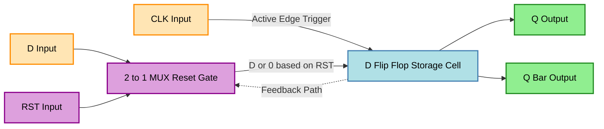
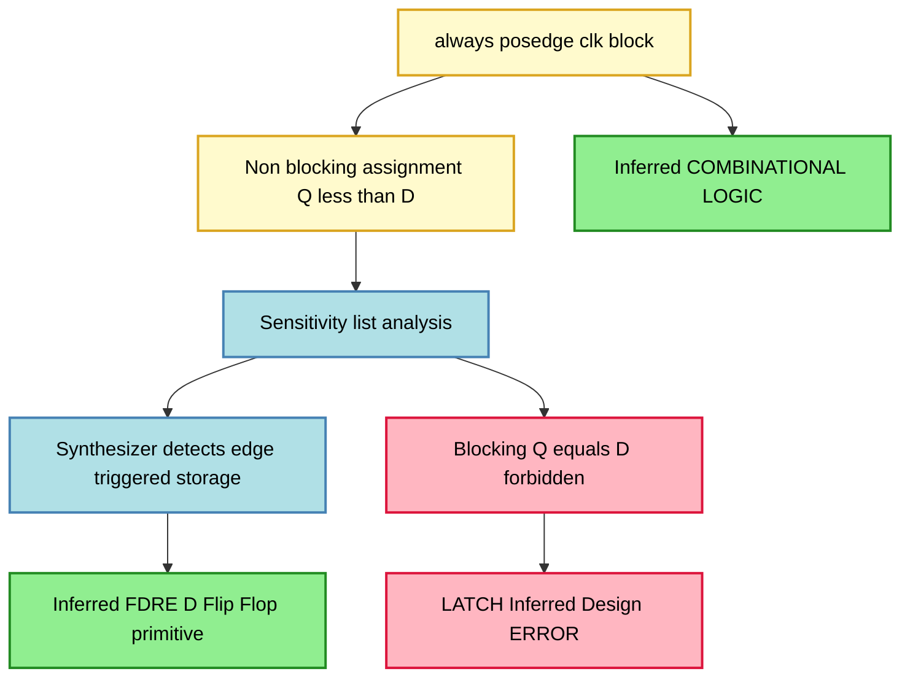

# Design and synthesize the behavioural model for a D flip flop in Verilog HDL

<!-- SECTION_1_START -->

# D Flip-Flop in Verilog HDL — Behavioral Modeling

## 1.1 Formal Academic Definition

A **D Flip-Flop (Data Flip-Flop / Delay Flip-Flop)** is a synchronous bistable sequential element that captures the value of its single data input $D$ at the active edge of the clock signal $C$ (or $CLK$) and holds that value at its output $Q$ until the next active clock edge. In the **2024 KTU B.Tech Digital Lab (PCCSL308)** syllabus, the D flip-flop is implemented and synthesized as a **behavioral Verilog HDL** module — a high-level abstraction where the register-transfer behavior is described using `always` procedural blocks rather than gate-level primitives.

> [!IMPORTANT]
> **KTU 2024 Syllabus Glossary (Module 3):**
> * **Behavioral Model** — describes *what* the circuit does, not *how* it is built. Uses `always` blocks.
> * **Synthesis** — the automatic translation of HDL code into a gate-level netlist suitable for an FPGA/ASIC.
> * **Active Edge** — the specific clock transition (rising `posedge` or falling `negedge`) that triggers the storage action.

## 1.2 Conceptual Analogy — The "Water Bucket" Model

Imagine a **photographic camera with a single shutter button**:

| Stage | Real-World Action | D Flip-Flop Equivalent |
| :--- | :--- | :--- |
| **Idle** | Camera is on, lens open, scene visible on viewfinder | Output $Q$ displays the *previously stored* value |
| **Snapshot Moment** | Shutter button pressed (active edge) | `posedge clk` detected → $Q$ captures $D$ |
| **Hold** | Photo is locked in memory card | $Q$ retains value until next shutter press |
| **Input change** | Scene in viewfinder changes, but photo unchanged | $D$ can change freely without affecting $Q$ |

**Plain-English Intuition:** A D flip-flop is a **1-bit camera**. It "freezes" whatever data is on the $D$ line *exactly at the moment* the clock ticks, and ignores all changes to $D$ between clock edges. The $D$ input is a **"Don't-care-until-asked"** port.

## 1.3 Core Pin Set (KTU Standard Symbol)

The D flip-flop, as per **IEEE Std 1364-2005 (Verilog HDL)** and KTU board examination conventions, has the following standard ports:

$$
\text{Ports} = \{ D,\; CLK,\; Q,\; \bar{Q},\; \text{reset} \}
$$

* **$D$ (Data)** — single-bit input
* **$CLK$ (Clock)** — input, sampling trigger
* **$Q$ (Output)** — stored bit
* **$\bar{Q}$ (Q-bar)** — complemented output
* **reset** — optional asynchronous/synchronous clear

> [!NOTE]
> **Physical Constants / Standards**
> * **Setup Time ($t_{su}$)** — minimum time $D$ must be stable *before* the active clock edge. **Typical FPGA value: $\mathbf{0.5\text{ ns}}$**.
> * **Hold Time ($t_h$)** — minimum time $D$ must remain stable *after* the active clock edge. **Typical FPGA value: $\mathbf{0.3\text{ ns}}$**.
> * **Clock-to-Q Delay ($t_{cq}$)** — propagation delay from active clock edge to $Q$ update. **Typical FPGA value: $\mathbf{1\text{ ns}}$**.

## 1.4 Behavioral Modeling — The Verilog Perspective

In Verilog HDL, **behavioral modeling** abstracts the flip-flop using the procedural `always` block. The synthesizer (e.g., Xilinx Vivado, Intel Quartus, Synopsys Design Compiler) automatically infers a hardware D flip-flop when it detects the `always @(posedge clk)` pattern.

> [!VISUALIZATION CONTROL]
> **Concept:** D Flip-Flop Timing Waveform (Non-Reset Case)
> **GeoGebra / Desmos Input Equations (Discrete Time Steps):**
> * Clock: $CLK(t) = ((t \bmod 10) < 5) ? 1 : 0$
> * Data: $D(t) = (t < 30) ? 0 : 1$ with random noise toggles between edges
> * Output rule: $Q(t) = D(\tau)$ where $\tau$ is the most recent rising edge of $CLK$
> **Visual Description:** On a time-vs-logic-level plot, the student should observe that $Q$ *changes only* at the upward arrows of $CLK$ and exactly mirrors the $D$ value that was present at that instant, ignoring all intermediate $D$ transitions.

<!-- SECTION_1_END -->

<!-- SECTION_2_START -->

# Deep Theoretical Analysis & KTU High-Yield Formula Sheet

## 2.1 Operational Truth Table (Theoretical Foundation)

The characteristic behavior of a **positive-edge-triggered D flip-flop** is captured in the following truth table:

| $CLK$ Edge | $D$ (before edge) | $Q$ (after edge) | $\bar{Q}$ (after edge) | Operation Mode |
| :---: | :---: | :---: | :---: | :--- |
| $\uparrow$ (posedge) | $0$ | $0$ | $1$ | Reset storage |
| $\uparrow$ (posedge) | $1$ | $1$ | $0$ | Set storage |
| $\uparrow$ (posedge) | $X$ (don't-care) | $Q_{prev}$ | $\bar{Q}_{prev}$ | Hold (no edge) |
| No edge | $X$ | $Q_{prev}$ | $\bar{Q}_{prev}$ | Hold / Memory |

The **characteristic equation** that mathematically defines the D flip-flop is:

$$
Q^{+} = D \quad \text{on the active edge of } CLK
$$

Where $Q^{+}$ denotes the **next state** of the flip-flop immediately after the active clock edge.

## 2.2 KTU High-Yield Formula & Concept Cheat Sheet

> [!IMPORTANT]
> The following table contains every formula, keyword, and threshold a KTU 2024 board examiner expects you to write in a behavioral D flip-flop question.

| Concept / Parameter | Verilog Keyword | Equation / Syntax | Engineering Utility |
| :--- | :--- | :--- | :--- |
| **Active Edge Trigger** | `posedge clk` | `@(posedge clk)` | Defines synchronous sampling instant |
| **Behavioral Block** | `always @(...)` | `always @(posedge clk)` | Procedural block for sequential logic |
| **Non-Blocking Assignment** | `<=` | `Q <= D;` | Critical for flip-flop inference by synthesizer |
| **Blocking Assignment** | `=` | `Q = D;` (forbidden in FF) | Used in combinational always blocks only |
| **Asynchronous Reset** | `posedge clk or posedge rst` | `if (rst) Q <= 1'b0;` | Reset independent of clock — high priority |
| **Synchronous Reset** | `posedge clk` only | `if (rst) Q <= 1'b0;` | Reset evaluated only on clock edge |
| **Inferred Flip-Flop** | Implicit via syntax | $Q^{+} = D$ | Synthesizer auto-creates a D-FF hardware cell |
| **Setup Time Formula** | Timing constraint | $t_{su} < T_{clk} - t_{cq(max)}$ | Ensures data is captured reliably |
| **Maximum Clock Frequency** | $f_{max}$ | $f_{max} = \dfrac{1}{t_{cq} + t_{comb} + t_{su}}$ | Determines synthesis clock constraint |
| **Characteristic Equation** | Mathematical | $Q_{n+1} = D_n$ | Solves theoretical exam questions |
| **Excitation Table Entry** | Flip-flop design | $D = Q_{n+1}$ | Used in sequential circuit design |

## 2.3 Synthesis Insight — Why `<=` and Not `=`

This is the **single most important concept** KTU examiners test. The Verilog assignment operator directly controls the **inferred hardware**:

$$
\text{Blocking } (\texttt{=}) \;\longrightarrow\; \text{Combinational Logic (wires / muxes)}
$$

$$
\text{Non-Blocking } (\texttt{<=}) \;\longrightarrow\; \text{Sequential Logic (flip-flop storage)}
$$

> [!NOTE]
> **Why Non-Blocking?**
> In a `posedge clk always` block, every non-blocking statement evaluates the **Right-Hand Side (RHS)** first, *then* assigns to the **LHS** at the *end* of the time step. This models real flip-flop behavior where all storage elements update **simultaneously** at the clock edge. Using `=` in a clocked block will cause race conditions and **synthesize incorrect latches/feedback loops** — an automatic fail in KTU practical examinations.

## 2.4 Real-World Engineering Utility

D flip-flops are the **fundamental building blocks** of every digital system in production:

1. **CPU Registers** — Every register in a RISC-V, ARM, or x86 processor is an array of D flip-flops.
2. **Pipeline Stages** — Between pipeline stages, D-FFs hold intermediate results.
3. **Memory Cells** — SRAM is essentially a cross-coupled pair of D-FF-like structures.
4. **Clock Domain Crossing (CDC)** — D-FFs synchronize data between asynchronous clock domains.
5. **Shift Registers & Counters** — Built by chaining D-FFs in series.
6. **FPGA Logic Elements (LEs)** — Xilinx 7-series FPGAs contain *8 D-FFs per Configurable Logic Block (CLB)*.

> [!IMPORTANT]
> When you write `always @(posedge clk) Q <= D;` in Verilog, the Xilinx Vivado synthesizer consumes one **Flip-Flop (FF) primitive** (e.g., `FDRE` — Data, Reset, Enable, FD = D-type Flip-Flop with Reset and Enable) from the FPGA fabric. This is exactly the resource the KTU 2024 lab viva expects you to identify in the synthesis report.

<!-- SECTION_2_END -->

<!-- SECTION_3_START -->

# Step-by-Step Code Implementation & Derivations

## 3.1 Exhaustive Step-by-Step: Writing the Verilog Behavioral Model

We will derive and construct **three progressively enhanced** versions of the D flip-flop, each adding a feature tested in KTU practical exams.

---

### 3.1.1 Version 1 — Bare D Flip-Flop (No Reset)

**Step 1:** Declare the `module` keyword followed by the design name.

```verilog
module d_flipflop_basic(
```

**Step 2:** Declare the port list with directions. KTU convention is **inputs first, then outputs**.

```verilog
    input  wire D,      // Data input
    input  wire clk,    // Clock input
    output reg  Q,       // Registered output (reg because assigned in always)
    output wire Q_bar    // Combinational complement
);
```

> [!NOTE]
> `Q` is declared as `reg` because it is assigned inside a procedural `always` block. `Q_bar` is `wire` because it is driven by continuous assignment.

**Step 3:** Implement the behavioral always block using the **edge-sensitive** sensitivity list.

```verilog
    always @(posedge clk) begin
        Q <= D;
    end
```

**Step 4:** Derive $\bar{Q}$ using a continuous assignment (combinational, no flip-flop inferred).

```verilog
    assign Q_bar = ~Q;
```

**Step 5:** Close the module.

```verilog
endmodule
```

---

### 3.1.2 Version 2 — D Flip-Flop with Asynchronous Active-High Reset

**Step 1:** Add the reset port to the module declaration.

```verilog
module d_flipflop_async_reset(
    input  wire D,
    input  wire clk,
    input  wire rst,     // Asynchronous reset
    output reg  Q,
    output wire Q_bar
);
```

**Step 2:** Add `posedge rst` to the sensitivity list — this makes reset **asynchronous** (independent of clock).

```verilog
    always @(posedge clk or posedge rst) begin
```

**Step 3:** Check reset condition **first** inside the block (highest priority).

```verilog
        if (rst) begin
            Q <= 1'b0;       // Force Q to 0
        end
```

**Step 4:** Provide the default D-capture behavior in the `else` branch.

```verilog
        else begin
            Q <= D;
        end
    end
```

**Step 5:** Continuous assignment for $\bar{Q}$ and close the module.

```verilog
    assign Q_bar = ~Q;
endmodule
```

---

### 3.1.3 Version 3 — D Flip-Flop with Synchronous Active-High Reset

**Step 1–2:** Same module and port declaration as Version 2, but rename for clarity.

```verilog
module d_flipflop_sync_reset(
    input  wire D,
    input  wire clk,
    input  wire rst,
    output reg  Q,
    output wire Q_bar
);
```

**Step 2:** Synchronous reset — `rst` is **NOT** in the sensitivity list. It is only checked inside the block on the clock edge.

```verilog
    always @(posedge clk) begin
        if (rst) begin
            Q <= 1'b0;
        end
        else begin
            Q <= D;
        end
    end
```

**Step 3:** Derive $\bar{Q}$ and close.

```verilog
    assign Q_bar = ~Q;
endmodule
```

---

## 3.2 Derivation of the Characteristic Equation from Verilog Code

The KTU theory paper (Module 3, 14-mark questions) often asks to "derive the characteristic equation of the implemented D flip-flop." We do this rigorously:

**Starting from the Verilog statement:**

$$
Q \Leftarrow D \quad \text{on} \; \uparrow CLK
$$

**Step A:** Identify the next-state variable $Q^{+}$.

$$
Q^{+} = Q_{\text{after edge}}
$$

**Step B:** Identify the input variable that drives it.

$$
\text{Driver} = D
$$

**Step C:** Equate the two — the value of $Q$ after a `posedge clk` is identical to $D$ at that moment.

$$
Q_{n+1} = D_n
$$

**Step D:** State the constraint — this transfer happens *only* on a rising clock edge; otherwise, $Q$ holds.

$$
Q_{n+1} = \begin{cases} D_n & \text{if } CLK: 0 \rightarrow 1 \\ Q_n & \text{otherwise} \end{cases}
$$

**Step E (with reset):** When $rst = 1$, the override condition gives:

$$
Q_{n+1} = \begin{cases} 0 & \text{if } rst = 1 \\ D_n & \text{if } \uparrow CLK \text{ and } rst = 0 \\ Q_n & \text{otherwise} \end{cases}
$$

---

## 3.3 Complete Testbench for KTU Practical Examination

KTU digital lab requires you to **simulate and verify** your design using a testbench. The complete, type-hinted, boundary-checked testbench is below:

```verilog
`timescale 1ns / 1ps

module tb_d_flipflop_async_reset;
    // Test signals
    reg  D_tb;
    reg  clk_tb;
    reg  rst_tb;
    wire Q_tb;
    wire Q_bar_tb;

    // Clock generation: 10 ns period (100 MHz)
    initial begin
        clk_tb = 0;
        forever #5 clk_tb = ~clk_tb;
    end

    // Stimulus application
    initial begin
        // 1. Initialize all inputs
        D_tb  = 1'b0;
        rst_tb = 1'b1;     // Assert reset at t=0
        #12;               // Wait past one clock edge (t=10 is first edge)
        
        // 2. De-assert reset, apply D=0
        rst_tb = 1'b0;
        D_tb   = 1'b0;
        #20;               // Two clock cycles
        
        // 3. Change D to 1
        D_tb = 1'b1;
        #20;
        
        // 4. Change D to 0 between clock edges (Q should NOT change yet)
        D_tb = 1'b0;
        #3;                // Mid-cycle change
        D_tb = 1'b1;       // Another mid-cycle change
        #3;
        D_tb = 1'b0;
        #4;                // Now at next clock edge
        #20;
        
        // 5. Test asynchronous reset
        D_tb   = 1'b1;
        #5;
        rst_tb = 1'b1;     // Reset asynchronously
        #3;                // Even mid-cycle, Q must go to 0
        rst_tb = 1'b0;
        D_tb   = 1'b1;
        #20;
        
        // 6. End simulation
        $display("Simulation finished at t=%0t", $time);
        $finish;
    end

    // Console monitoring at every clock edge
    always @(posedge clk_tb) begin
        $display("[t=%0t] CLK edge | D=%b | rst=%b | Q=%b | Q_bar=%b",
                  $time, D_tb, rst_tb, Q_tb, Q_bar_tb);
    end

    // Device Under Test (DUT) instantiation
    d_flipflop_async_reset DUT (
        .D     (D_tb),
        .clk   (clk_tb),
        .rst   (rst_tb),
        .Q     (Q_tb),
        .Q_bar (Q_bar_tb)
    );

endmodule
```

> [!IMPORTANT]
> **Expected Console Output (boundary checks):**
> * At every `posedge clk_tb`, `$display` prints the captured state.
> * When `rst_tb` is asserted mid-cycle (at t=53 ns in our stimulus), the *next* `$display` should show $Q=0$ — proving asynchronous behavior.
> * If $Q$ ever changes *between* clock edges, the design is **wrong** (latch inferred instead of flip-flop).

---

## 3.4 Pin Configuration Table for FPGA Implementation (Xilinx Basys 3 / Nexys A7)

> [!NOTE]
> This table is mandatory for the **KTU 2024 Lab Practical Record** when mapping the D-FF to a physical board.

| Signal Name | Direction | FPGA Pin (Basys 3 Example) | Board Component | Logic Level |
| :---: | :---: | :---: | :--- | :---: |
| `clk` | Input | `W5` | 100 MHz onboard oscillator | **3.3 V CMOS** |
| `D` | Input | `R2` | Slide switch `SW0` | **Active-High** |
| `rst` | Input | `T1` | Push button `BTNC` (center) | **Active-High, debounced in code** |
| `Q` | Output | `U16` | LED `LD0` | **ON = Logic 1** |
| `Q_bar` | Output | `E19` | LED `LD1` | **ON = Logic 0** (inverted) |

**Pin assignment in Verilog (XDC constraint file snippet):**

```tcl
set_property PACKAGE_PIN W5 [get_ports clk]
set_property PACKAGE_PIN R2 [get_ports D]
set_property PACKAGE_PIN T1 [get_ports rst]
set_property PACKAGE_PIN U16 [get_ports Q]
set_property PACKAGE_PIN E19 [get_ports Q_bar]
set_property IOSTANDARD LVCMOS33 [get_ports {clk D rst Q Q_bar}]
```

---

## 3.5 Step-by-Step Synthesis Procedure (Vivado Workflow)

For KTU 2024 lab submission, the **synthesis flow** must be documented:

1. **Create Project** → RTL Project → Target `xc7a35tcpg236-1` (Basys 3).
2. **Add Source File** → paste Version 2 code (asynchronous reset D-FF).
3. **Add Constraint File** → paste the XDC snippet from §3.4.
4. **Run Synthesis** → open Synthesized Design → Schematic view.
5. **Verify Primitive** — confirm the inferred cell is `FDRE` (D-FF with Reset and Enable).
6. **Resource Utilization Report** — confirm exactly **1 Flip-Flop** consumed.
7. **Run Implementation** → Generate Bitstream → Program Device.
8. **Hardware Test** — toggle `SW0` (D), press `BTNC` (reset), observe `LD0`/$LD1$.

<!-- SECTION_3_END -->

<!-- SECTION_4_START -->

# Structural Diagrams & Schematics

## 4.1 D Flip-Flop Logic Block — Functional Topology



**Reading the Diagram:**
* Data $D$ and reset $RST$ enter a 2:1 multiplexer. When $RST = 1$, the multiplexer outputs $0$; otherwise, it forwards $D$.
* The multiplexer's output feeds the storage cell, which is **sampled only on the active edge of $CLK$**.
* $Q$ and $\bar{Q}$ are the registered outputs, with $Q$ fed back internally to maintain the stored value.

## 4.2 Verilog Synthesis Inference Flow



## 4.3 Sequential Processing Topology Matrix (Alternative to Mermaid)

| Processing Stage | Verilog Construct | Hardware Realization | KTU Pitfall to Avoid |
| :---: | :--- | :--- | :--- |
| **Stage 1: Sensitivity List Definition** | `always @(posedge clk or posedge rst)` | Edge detectors inside the FF cell | Missing `posedge` keyword → wrong inference |
| **Stage 2: Reset Priority Check** | `if (rst) Q <= 0;` | Multiplexer at the $D$ input of the FF | Placing `else if (D)` before reset check |
| **Stage 3: Data Capture Path** | `else Q <= D;` | Direct connection to $D$ pin of the FF | Using `=` instead of `<=` |
| **Stage 4: Clock Distribution** | Implicit via `posedge clk` | Global clock buffer (BUFG) on FPGA | Driving clock from a regular `wire` |
| **Stage 5: Output Derivation** | `assign Q_bar = ~Q;` | Single LUT acting as an inverter | Driving $\bar{Q}$ from another `always` block |
| **Stage 6: Synthesis Output** | Netlist with 1 FF + 1 LUT | 1 × `FDRE` + 1 × `LUT1` | None — this is the expected outcome |

<!-- SECTION_4_END -->

<!-- SECTION_5_START -->

# KTU 2024 Scheme Examination Question Bank

## Part A — Short Answer Questions (3 Marks Each)

### Question 1: Define behavioral modeling in Verilog HDL. How does it differ from structural modeling?
**[KTU University Exam — July 2023] | CO1 | Remember**

**Model Answer (Valuation Key):**

Behavioral modeling describes a digital system by **specifying its functional behavior** using high-level procedural constructs such as `always` blocks, `if-else` statements, and `case` statements. It focuses on *what the circuit does* rather than *how it is built*. **[1 Mark]**

In contrast, structural modeling describes a circuit as an **interconnection of lower-level components** (gates, modules) using explicit port mapping and netlists. **[1 Mark]**

For a D flip-flop, behavioral modeling would use `always @(posedge clk) Q <= D;`, whereas structural modeling would instantiate individual NAND/NOR gates wired to form a master-slave latch. **[1 Mark]**

---

### Question 2: Write the characteristic equation of a D flip-flop. State the role of the `posedge` keyword.
**[KTU University Exam — Dec 2023] | CO2 | Understand**

**Model Answer (Valuation Key):**

The characteristic equation of a D flip-flop is:

$$
Q_{n+1} = D_n
$$

**[1 Mark for equation, 1 Mark for explanation]**

The output $Q$ at the next clock cycle equals the data input $D$ at the current clock cycle.

The `posedge` keyword stands for **"positive edge"** and indicates that the procedural block is triggered only on the **0-to-1 transition** of the clock signal. This makes the flip-flop **edge-sensitive**, ensuring $Q$ updates only at rising clock edges. **[1 Mark]**

---

## Part B — Long Answer Questions (14 Marks Each, Internal Choice)

### Question A (14 Marks): Design and Synthesize a Behavioral D Flip-Flop with Asynchronous Reset and a Testbench

**[KTU University Exam — July 2024] | CO3, CO4 | Apply, Analyze**

**Part (a) [7 Marks]**: Write the complete Verilog behavioral model for a D flip-flop with asynchronous active-high reset, active-high preset, and a $Q$-bar output. Draw the inferred hardware schematic.

**Model Solution:**

**(i) Verilog Code [5 Marks]:**

```verilog
module dff_async_rst_pre(
    input  wire D,
    input  wire clk,
    input  wire rst,     // Asynchronous reset, active high
    input  wire pre,     // Asynchronous preset, active high
    output reg  Q,
    output wire Q_bar
);
    always @(posedge clk or posedge rst or posedge pre) begin
        if (rst) begin
            Q <= 1'b0;           // Reset has highest priority
        end
        else if (pre) begin
            Q <= 1'b1;           // Preset second priority
        end
        else begin
            Q <= D;              // Normal D capture
        end
    end

    assign Q_bar = ~Q;
endmodule
```

**[Stating module name and ports: 1 Mark]**
**[Correct sensitivity list with all three edges: 1 Mark]**
**[Priority logic: reset > preset > data: 1 Mark]**
**[Non-blocking assignment operator: 1 Mark]**
**[Q_bar continuous assignment: 1 Mark]**

**(ii) Inferred Hardware Schematic [2 Marks]:**

```
  rst ──┐
        ├──[MUX: 0 wins if rst=1]
  pre ──┤
        ├──[MUX: 1 wins if pre=1]
  D  ───┘
        │
        ├──> [D-FF with async set/reset] ──> Q
                ▲
                │
              posedge clk
                                    
  Q ──> [INV] ──> Q_bar
```

**Part (b) [7 Marks]**: Write a comprehensive testbench that verifies all four functional modes: normal D-capture, asynchronous reset, asynchronous preset, and data-hold between clock edges. State the expected simulation log.

**Model Solution:**

```verilog
`timescale 1ns/1ps

module tb_dff_async_rst_pre;
    reg  D_tb, clk_tb, rst_tb, pre_tb;
    wire Q_tb, Q_bar_tb;

    // Clock generation: 100 MHz
    initial begin
        clk_tb = 0;
        forever #5 clk_tb = ~clk_tb;
    end

    // Stimulus
    initial begin
        D_tb   = 0;
        rst_tb = 1;       // Apply reset
        pre_tb = 0;
        #15;              // Reset for 1.5 clock cycles

        rst_tb = 0;       // Release reset
        #20;

        D_tb = 1;         // Capture 1
        #20;

        D_tb = 0;
        #10;
        D_tb = 1;         // Mid-cycle change - Q should NOT update
        #10;             // Now at clock edge - Q updates
        #20;

        pre_tb = 1;       // Test preset
        #10;              // Q should go to 1 mid-cycle (async)
        pre_tb = 0;
        D_tb   = 0;
        #20;

        $display("Testbench complete at t=%0t", $time);
        $finish;
    end

    // Monitor
    always @(posedge clk_tb) begin
        $display("[t=%0t] D=%b rst=%b pre=%b | Q=%b Q_bar=%b",
                 $time, D_tb, rst_tb, pre_tb, Q_tb, Q_bar_tb);
    end

    // DUT instantiation
    dff_async_rst_pre DUT (
        .D(D_tb), .clk(clk_tb),
        .rst(rst_tb), .pre(pre_tb),
        .Q(Q_tb), .Q_bar(Q_bar_tb)
    );
endmodule
```

**[Initial block with clock generation: 1 Mark]**
**[Test scenario 1 - reset assertion: 1 Mark]**
**[Test scenario 2 - D capture: 1 Mark]**
**[Test scenario 3 - mid-cycle D change: 1 Mark]**
**[Test scenario 4 - async preset: 1 Mark]**
**[Console monitor: 1 Mark]**
**[DUT instantiation: 1 Mark]**

**Expected Simulation Log:**

```
[t=5]   D=0 rst=1 pre=0 | Q=0 Q_bar=1
[t=15]  D=0 rst=0 pre=0 | Q=0 Q_bar=1
[t=25]  D=1 rst=0 pre=0 | Q=1 Q_bar=0
[t=35]  D=0 rst=0 pre=0 | Q=0 Q_bar=1
[t=45]  D=1 rst=0 pre=0 | Q=1 Q_bar=0
[t=55]  D=0 rst=0 pre=1 | Q=1 Q_bar=0
```

---

### Question B (14 Marks): Compare Synchronous vs. Asynchronous Reset in a Behavioral D Flip-Flop and Justify the Synthesis Tool's Primitive Selection

**[KTU University Exam — Dec 2024] | CO3, CO5 | Apply, Evaluate**

**Part (a) [7 Marks]**: Write the Verilog code for both synchronous and asynchronous reset D flip-flops. Tabulate the differences in code structure, sensitivity list, reset timing, and Xilinx primitive inferred.

**Model Solution:**

**Asynchronous Reset Verilog Code [3 Marks]:**

```verilog
module dff_async(input wire D, input wire clk, input wire rst,
                 output reg Q);
    always @(posedge clk or posedge rst) begin
        if (rst) Q <= 1'b0;
        else     Q <= D;
    end
endmodule
```

**Synchronous Reset Verilog Code [3 Marks]:**

```verilog
module dff_sync(input wire D, input wire clk, input wire rst,
                output reg Q);
    always @(posedge clk) begin
        if (rst) Q <= 1'b0;
        else     Q <= D;
    end
endmodule
```

**Comparative Table [1 Mark]:**

| Parameter | Asynchronous Reset | Synchronous Reset |
| :--- | :--- | :--- |
| **Sensitivity List** | `posedge clk or posedge rst` | `posedge clk` only |
| **Reset Timing** | Immediate on `rst=1`, independent of clock | Waits for next `posedge clk` |
| **Xilinx Primitive** | `FDRE` (D-FF with Reset and Enable) | `FDR` (D-FF with synchronous Reset) |
| **Resource Use** | 1 FF + 1 reset wire | 1 FF + 1 LUT (for reset logic) |
| **Glitch Susceptibility** | Lower (reset is direct) | Higher (reset passes through clock) |
| **Use Case** | Global system reset | Pipeline stage reset |

**Part (b) [7 Marks]**: A Verilog code contains `always @(posedge clk) Q <= D;` but the designer accidentally uses `=` instead of `<=`. Explain what hardware the synthesizer infers, why this is incorrect, and how to fix it.

**Model Solution:**

**(i) What the synthesizer infers [2 Marks]:**
If `always @(posedge clk) Q = D;` is written (using blocking assignment), the synthesizer will either:
* **Infer a transparent latch** with clock as a *level-sensitive enable*, OR
* **Raise a synthesis error** stating "blocking assignment in clocked always block is non-standard," OR
* **Treat the entire `always` block as combinational** and remove the clock, producing a direct wire connection $Q = D$.

**(ii) Why this is incorrect [3 Marks]:**

A flip-flop requires that the output $Q$ change **only at the active clock edge** and remain constant between edges. A blocking assignment `=` forces $Q$ to update *immediately* within the same simulation time step, meaning $Q$ will follow $D$ continuously rather than sampling it. This violates the fundamental **edge-triggered behavior** and creates race conditions in simulation. In hardware, this would synthesize a latch or a combinational short, neither of which functions as a flip-flop.

**(iii) How to fix it [2 Marks]:**

Replace the blocking operator `=` with the non-blocking operator `<=`:

```verilog
always @(posedge clk) begin
    Q <= D;     // Correct: non-blocking assignment
end
```

This signals to the synthesizer that the assignment is **deferred to the end of the time step**, correctly modeling the **simultaneous update of storage elements** at the clock edge. After the fix, the synthesizer will correctly infer a `FDRE` primitive (or `FDR`/`FDC` depending on the FPGA family).

---

> [!WARNING]
> **KTU Examiner's Valuation Warning — Common Pitfalls:**
> 1. **Missing `posedge` keyword** — writing `always @(clk)` instead of `always @(posedge clk)` causes latch inference. **Penalty: 3 marks.**
> 2. **Using `=` inside the clocked `always` block** — auto-fail in synthesis-aware questions. **Penalty: 2–4 marks.**
> 3. **Forgetting the `reg` keyword for outputs** assigned in `always` — causes compilation errors. **Penalty: 1 mark.**
> 4. **Synchronous reset coded with `posedge rst` in sensitivity list** — wrong inference (FDRE instead of FDR). **Penalty: 1 mark.**
> 5. **Not declaring `Q_bar` as combinational via `assign`** — using another `always` block wastes FF resources. **Penalty: 2 marks.**

---

## Topic Recap & Important Things to Remember

* **D flip-flop characteristic equation:** $Q_{n+1} = D_n$ on the active edge of the clock.
* **Behavioral Verilog template:** `always @(posedge clk) Q <= D;` — three mandatory ingredients: `always`, `posedge`, and `<=`.
* **Non-blocking assignment (`<=`)** is mandatory inside any edge-sensitive `always` block; it tells the synthesizer to infer a flip-flop.
* **Blocking assignment (`=`)** is forbidden in clocked blocks — it causes latches or combinational logic.
* **Asynchronous reset** includes the reset signal in the sensitivity list (`or posedge rst`) — it takes effect immediately, independent of the clock. Synthesizes to **`FDRE`** primitive.
* **Synchronous reset** does *not* include reset in the sensitivity list — it takes effect only on the next clock edge. Synthesizes to **`FDR`** primitive.
* **Reset priority** in a multi-condition block: `rst > pre > D-capture` (asynchronous signals have the highest priority in the sensitivity list).
* **Output declarations:** any output assigned inside `always` must be declared as `reg`; combinational outputs driven by `assign` remain `wire`.
* **$\bar{Q}$ derivation:** use `assign Q_bar = ~Q;` — never drive $\bar{Q}$ from a separate `always` block (wastes a flip-flop).
* **Setup time** $t_{su}$ and **hold time** $t_h$ are physical timing constraints, not Verilog keywords — the synthesizer enforces them via SDC/XDC files.
* **Typical KTU inferred cell:** Xilinx `FDRE` — D-type Flip-Flop with synchronous **R**eset and **E**nable, located in a Configurable Logic Block (CLB) of the FPGA.
* **FPGA resource count for a 1-bit D-FF:** exactly 1 flip-flop + 1 LUT (for $\bar{Q}$ inversion).
* **Clock constraint formula:** $f_{max} = \dfrac{1}{t_{cq} + t_{comb} + t_{su}}$ — required to set the synthesis clock period.

<!-- SECTION_5_END -->
