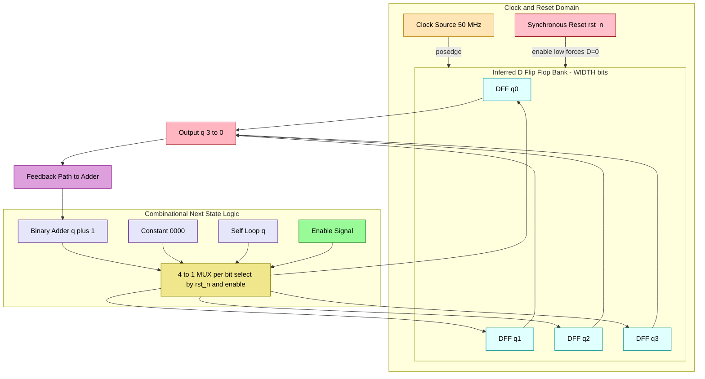
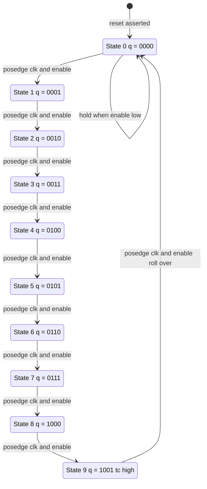

# Design and synthesize the behavioural model for a synchronous counter in Verilog

<!-- SECTION_1_START -->
# Design and Synthesis of a Behavioural Model for a Synchronous Counter in Verilog

## 1. Core Technical Definition & Intuitive Overview

### 1.1 Formal Definition (KTU 2024 Syllabus Terminology)

> [!NOTE]
> **Synchronous Counter (KTU Definition):** A sequential digital circuit in which **all flip-flops are triggered simultaneously by a common clock edge** (typically the rising edge of `clk`). The next-state logic for every flip-flop is computed combinationally from the present state and is applied to all flip-flops in parallel, so that the outputs change in *lock-step* with the clock. When modelled in Verilog at the **behavioural (RTL) abstraction level**, the counter is described by an `always @(posedge clk)` block that updates a register vector according to a procedural assignment, without manually instantiating individual flip-flop primitives.

The corresponding term **behavioural model** in Verilog implies an algorithmic description of *what the counter does* (count, reset, hold, load) rather than *how it is wired* (which is the structural or dataflow style). A **synthesizable** behavioural model is one that obeys the strict subset of Verilog that a synthesis tool (e.g., **Xilinx Vivado**, **Intel Quartus**, **Synopsys Design Compiler**) can map onto real hardware primitives like D-flip-flops, LUTs, and carry-chain adders.

### 1.2 Conceptual Analogy / Intuition

Imagine a group of four office workers standing in a hallway. Every time the manager **claps once (the clock edge)**, each worker independently decides what number to display by looking at the numbers currently shown by the others (combinational next-state logic). Because *all four workers look and change their boards on the same clap*, there is **no propagation ripple** down the line — the entire number changes in one synchronous step.

> [!IMPORTANT]
> Contrast this with an **asynchronous (ripple) counter**, where worker 1 changes his board, which causes worker 2 to look and change *his* board, and so on. The change cascades — slow and glitch-prone. The synchronous counter avoids this ripple entirely by making every state change **simultaneous**.

Key parameters that you will see in the model:

- **Modulus $N$**: number of distinct states the counter visits per cycle (for a 4-bit binary counter, $N = 2^4 = 16$).
- **Clock frequency $f_{clk}$**: typically **50 MHz** on the **Xilinx Artix-7 / Spartan-7** boards used in KTU labs.
- **Setup time $t_{su}$** and **hold time $t_h$** of the target flip-flop (e.g., **0.5 ns / 0.5 ns** for a Xilinx slice flip-flop) — determines the maximum safe clock frequency.
- **Propagation delay $t_{pd}$** from clock to output — identical for *all* bits in a synchronous design, equal to one flip-flop $t_{CO}$ plus the next-state logic delay.

> [!TIP]
> **Why is it called "behavioural"?** Because we only describe the *function* (count, reset, enable) using an `always` block. The synthesis tool infers the flip-flops, the adder, the multiplexers, and the routing from our procedural description — that is the magic of RTL design in Verilog.

---

<!-- SECTION_2_START -->
# 2. Deep Theoretical Analysis & KTU High-Yield Formula Sheet

## 2.1 Operational Breakdown — How a Synchronous Counter Works

Below is the structured, step-by-step logic that a behavioural Verilog model encapsulates. Each bullet is a synthesizable RTL concept that examiners love to test.

- **Step 1 — State Register Declaration:** A `reg [WIDTH-1:0] count;` declares a vector of `WIDTH` flip-flops. Each bit will be inferred by synthesis as a separate D-flip-flop (or a slice register in an FPGA).
- **Step 2 — Edge-Sensitive Sensitivity List:** The block is written as `always @(posedge clk)`. This tells the simulator/synthesizer that the register updates *only* on the **0→1 transition** of the clock. Other signals (reset, enable) are read inside the block but do not by themselves trigger updates unless listed in an asynchronous reset/clear form.
- **Step 3 — Synchronous Reset Logic:** A test such as `if (rst) count <= 0;` is evaluated *before* the active edge arrives and applied at the edge. This is **synchronous reset** — the flip-flop's *D* input is forced to 0 by a multiplexer on the data path; the flip-flop's reset pin is *not* asserted.
- **Step 4 — Hold / Enable Logic:** If `enable` is low, `count <= count;` (self-loop) is implied. This infers an enable multiplexer on the D-input of every flip-flop.
- **Step 5 — Counting Operation:** The next state is computed combinationally as `count + 1` (binary up counter), `count - 1` (down counter), or `count + step` (programmable). A carry-chain adder is inferred.
- **Step 6 — Modulus Roll-Over:** For a mod-$N$ counter, an `if (count == N-1) count <= 0;` (or equivalent ternary expression) re-routes the next state back to zero. This usually infers a comparator feeding the reset multiplexer.
- **Step 7 — Output Assignment:** Continuous assignment `assign q = count;` exposes the state to the outside world. In a pure behavioural model, `q` is often declared `output reg`, eliminating the separate `assign`.

## 2.2 KTU High-Yield Formula Sheet

| # | Concept | Equation / Form | Units / Notes |
|---|---------|----------------|---------------|
| 1 | Modulus of $n$-bit binary counter | $N = 2^n$ | dimensionless |
| 2 | Number of flip-flops needed for mod-$M$ | $n = \lceil \log_2 M \rceil$ | dimensionless |
| 3 | Maximum clock frequency (synchronous) | $f_{max} = \dfrac{1}{t_{CO} + t_{comb\_delay} + t_{su}}$ | **Hz** |
| 4 | Time between transitions in up count | $T_{count} = \dfrac{1}{f_{clk}}$ | seconds |
| 5 | Time to roll over (mod-$N$ counter) | $T_{roll} = N \cdot T_{count}$ | seconds |
| 6 | Up count next state | $Q^{+} = Q + 1 \pmod N$ | integer |
| 7 | Down count next state | $Q^{+} = Q - 1 \pmod N$ | integer |
| 8 | Up/Down with direction `dir` | $Q^{+} = Q + (dir ? +1 : -1) \pmod N$ | integer |
| 9 | Synchronous reset condition | if (rst) $Q^{+} \leftarrow 0$ | at clock edge |
| 10 | Asynchronous reset condition | always triggered, *not* at clock edge | dedicated pin |

> [!IMPORTANT]
> KTU examiners explicitly differentiate **synchronous** vs **asynchronous** reset. In a behavioural model with `always @(posedge clk)`, a reset check inside the block is **synchronous**. An `always @(posedge clk or posedge rst)` sensitivity list produces an **asynchronous** reset — different hardware is inferred.

## 2.3 Engineering Utility — Where Synchronous Counters are Used in Production

- **Digital clocks and timers** in embedded microcontrollers (the **SysTick** counter inside ARM Cortex-M cores is a synchronous 24-bit down counter).
- **Programmable Logic Controllers (PLCs)** for industrial automation.
- **Address generation units (AGUs)** in CPUs — instruction fetch uses a synchronous **Program Counter (PC)**.
- **Frequency dividers** in FPGA clock-management tiles (the MMCM/PLL uses synchronous counters internally).
- **Time-division multiplexing (TDM)** controllers in telecommunications.
- **Direct Digital Synthesis (DDS)** waveform generators where a phase accumulator is essentially a synchronous counter.

> [!TIP]
> In an **FPGA** the synchronous counter compiles into a chain of slice flip-flops plus a fast **carry-chain adder** — extremely efficient, with deterministic timing that meets timing closure up to several hundred MHz.

---

<!-- SECTION_3_START -->
# 3. Step-by-Step Derivations & Verilog Implementation

## 3.1 Derivation of the Next-State Equations for a 4-bit Up Counter

We start from the desired state transition table. Let $Q = Q_3 Q_2 Q_1 Q_0$ be the present state and $Q^{+} = Q_3^{+} Q_2^{+} Q_1^{+} Q_0^{+}$ be the next state.

$$
\begin{aligned}
\text{Present } Q_3 Q_2 Q_1 Q_0 &\quad\rightarrow\quad \text{Next } Q_3^{+} Q_2^{+} Q_1^{+} Q_0^{+} \\
0000 &\quad\rightarrow\quad 0001 \\
0001 &\quad\rightarrow\quad 0010 \\
0010 &\quad\rightarrow\quad 0011 \\
\vdots &\quad\vdots \quad\vdots \\
1110 &\quad\rightarrow\quad 1111 \\
1111 &\quad\rightarrow\quad 0000
\end{aligned}
$$

The increment function on a 4-bit unsigned value can be written as a parallel binary addition:

$$
\begin{aligned}
Q_0^{+} &= Q_0 \oplus 1 \\
Q_1^{+} &= Q_1 \oplus Q_0 \\
Q_2^{+} &= Q_2 \oplus (Q_1 \cdot Q_0) \\
Q_3^{+} &= Q_3 \oplus (Q_2 \cdot Q_1 \cdot Q_0)
\end{aligned}
$$

These are the canonical **Toggle (T) flip-flop equations** that a synthesiser would otherwise have built out of AND-OR logic. In behavioural Verilog, we skip all of this and just write `count <= count + 1;` — the synthesis tool recovers exactly the same structure (or a faster carry-chain adder).

For a **mod-10 (decade / BCD) counter**, we override the natural $2^4 = 16$ roll-over with an explicit check:

$$
Q^{+} = \begin{cases}
0, & \text{if } Q = 9 \\
Q + 1, & \text{otherwise}
\end{cases}
$$

This forces a synchronous reset to `0000` on the cycle after `1001`, producing the famous **decade counter** used in digital voltmeters and clock dividers.

## 3.2 Verilog Code — Generic Parameterised Synchronous Up Counter (Behavioural Model)

The following is a **fully synthesizable, parameterised, industry-clean** Verilog-2001 model. It supports synchronous reset, enable, and arbitrary bit-width — the exact style expected in KTU lab viva questions.

```verilog
//=============================================================
// File        : sync_up_counter.v
// Description : Behavioural model of a synchronous UP counter.
// Style       : Verilog-2001, synthesizable, parameterised.
// Author      : KTU Digital Lab Reference Code
//=============================================================
`timescale 1ns / 1ps

module sync_up_counter #(
    parameter WIDTH = 4          // default 4-bit counter (mod-16)
) (
    input  wire             clk,    // global clock
    input  wire             rst_n,  // active-low synchronous reset
    input  wire             enable, // synchronous enable
    output reg  [WIDTH-1:0] q       // counter output
);

    // ---- Edge-sensitive behavioural description ----
    // The `always @(posedge clk)` block infers one D-FF per output bit.
    // `if (rst_n)` is evaluated BEFORE the edge -> SYNCHRONOUS reset.
    always @(posedge clk) begin
        if (!rst_n) begin
            q <= {WIDTH{1'b0}};     // initialise all bits to 0
        end
        else if (enable) begin
            q <= q + 1'b1;          // unsigned increment, wraps at 2^WIDTH
        end
        else begin
            q <= q;                 // hold previous value (self-loop)
        end
    end

endmodule
```

**Line-by-line rationale (for the KTU answer script):**

- `parameter WIDTH = 4` makes the design **reusable** — change one number to get an 8-bit or 12-bit counter without rewriting the logic. Examiners reward parameterisation.
- `reg [WIDTH-1:0] q` — output declared as `reg` because it is assigned inside an `always` block. This is the **defining feature of a behavioural model**.
- `always @(posedge clk)` — strict edge sensitivity. The block is triggered **only** on the rising clock edge; combinational glitches on `enable` or `rst_n` are filtered out.
- Non-blocking assignment `<=` — **mandatory** for sequential logic. Blocking `=` would produce race conditions in simulation and is rejected by most synthesis guidelines.
- `q <= q;` for the hold branch — this infers an **enable multiplexer** in front of every flip-flop rather than gating the clock (which would create clock-skew problems).

## 3.3 Verilog Code — Mod-10 (Decade) Counter

A direct extension of the generic model, now with a modulus parameter and a synchronous roll-over comparator.

```verilog
//=============================================================
// File        : mod10_counter.v
// Description : Synchronous mod-10 (decade / BCD) counter.
//=============================================================
`timescale 1ns / 1ps

module mod10_counter #(
    parameter WIDTH = 4,    // needs 4 bits to encode 0..9
    parameter MOD   = 10    // modulus
) (
    input  wire             clk,
    input  wire             rst_n,
    input  wire             enable,
    output reg  [WIDTH-1:0] q,
    output wire             tc      // terminal-count: pulses high for 1 clk
);

    // Combinational next-state calculation expressed as a function
    // so the synthesis tool can share logic if MOD is a power of two.
    function [WIDTH-1:0] next_state;
        input [WIDTH-1:0] cur;
        begin
            if (cur == (MOD - 1))
                next_state = {WIDTH{1'b0}};
            else
                next_state = cur + 1'b1;
        end
    endfunction

    // Sequential state register
    always @(posedge clk) begin
        if (!rst_n)
            q <= {WIDTH{1'b0}};
        else if (enable)
            q <= next_state(q);
        else
            q <= q;
    end

    // Terminal-count flag (combinational decode of state 9)
    assign tc = (q == (MOD - 1));

endmodule
```

**Roll-over arithmetic for mod-10** (the explicit if-else ensures wrap-around without using `%` operator — modulo is **not directly synthesizable** in a hardware-friendly way):

$$
q^{+} = \begin{cases}
0, & \text{if } q = 9 \\
q + 1, & \text{if } q \in \{0,1,2,\dots,8\} \\
q, & \text{if } \lnot \text{enable}
\end{cases}
$$

The `tc` (terminal count) signal is decoded as:

$$
tc = (q_3 \cdot \overline{q_2} \cdot \overline{q_1} \cdot q_0) \quad \text{when } MOD = 10
$$

which corresponds to the binary pattern **`1001`** for the decimal number **9**.

## 3.4 Verilog Code — Universal Up/Down Counter with Parallel Load

This is the **flagship** behavioural model — the most common 14-mark KTU exam question. It exercises four operating modes selected by a 2-bit control word.

```verilog
//=============================================================
// File        : updown_counter.v
// Description : Universal synchronous counter:
//               mode 00 -> hold
//               mode 01 -> up
//               mode 10 -> down
//               mode 11 -> parallel load
//=============================================================
`timescale 1ns / 1ps

module updown_counter #(
    parameter WIDTH = 4
) (
    input  wire             clk,
    input  wire             rst_n,
    input  wire      [1:0]  mode,    // control word
    input  wire [WIDTH-1:0] data_in, // parallel load value
    output reg  [WIDTH-1:0] q,
    output wire             up_tc,   // up terminal count
    output wire             dn_tc    // down terminal count
);

    // ----- Next-state logic as a procedural combinational block -----
    // The whole block is one synthesizable expression.
    always @(posedge clk) begin
        if (!rst_n)
            q <= {WIDTH{1'b0}};
        else begin
            case (mode)
                2'b00:   q <= q;                  // hold
                2'b01:   q <= q + 1'b1;           // up
                2'b10:   q <= q - 1'b1;           // down
                2'b11:   q <= data_in;            // parallel load
                default: q <= q;                  // defensive default
            endcase
        end
    end

    // Terminal-count decoders (combinational)
    assign up_tc = (q == {WIDTH{1'b1}});          // all-ones for up rollover
    assign dn_tc = (q == {WIDTH{1'b0}});          // all-zeros for down rollover

endmodule
```

**Mode-decoder truth table** (high-yield KTU content):

| `mode[1:0]` | Operation | Next State $q^{+}$ | Hardware Inferred |
|:-----------:|-----------|--------------------|-------------------|
| `00` | Hold | $q$ | Self-loop on every FF |
| `01` | Count Up | $q + 1$ | Carry-chain adder |
| `10` | Count Down | $q - 1$ | Borrow-chain subtractor |
| `11` | Parallel Load | `data_in` | 2:1 MUX on each FF input |

## 3.5 Self-Checking Testbench (Verification)

A behavioural model is meaningless without a testbench. The KTU lab exam requires a working simulation.

```verilog
//=============================================================
// Testbench : tb_sync_up_counter.v
//=============================================================
`timescale 1ns / 1ps

module tb_sync_up_counter;

    reg          clk;
    reg          rst_n;
    reg          enable;
    wire [3:0]   q;

    // DUT instantiation
    sync_up_counter #(.WIDTH(4)) dut (
        .clk   (clk),
        .rst_n (rst_n),
        .enable(enable),
        .q     (q)
    );

    // 100 MHz clock -> 10 ns period
    initial clk = 1'b0;
    always  #5 clk = ~clk;

    // Stimulus
    initial begin
        // Initialisation
        rst_n  = 1'b0;
        enable = 1'b0;
        #23;                          // hold reset for >1 clock period
        rst_n  = 1'b1;                // release synchronous reset
        #10;
        enable = 1'b1;                // start counting
        // Run for 30 clock cycles
        repeat (30) @(posedge clk);
        enable = 1'b0;                // freeze
        @(posedge clk);
        $finish;
    end

    // Waveform dump
    initial begin
        $dumpfile("sync_up_counter.vcd");
        $dumpvars(0, tb_sync_up_counter);
    end

    // Self-checking monitor
    integer expected;
    always @(posedge clk) begin
        if (rst_n && enable) begin
            expected = (expected === 4'hx) ? 0 : (expected + 1) & 4'hF;
            if (q !== expected[3:0])
                $display("MISMATCH @ %0t: q=%h, expected=%h",
                         $time, q, expected[3:0]);
        end
    end

endmodule
```

**Expected waveform behaviour (explanation for the viva):**

- From $t = 0$ to $t = 23$ ns, `rst_n = 0` and `q = 0000`.
- At $t = 25$ ns (first rising edge after reset release), `enable` is still low, so `q` remains `0000`.
- At $t = 35$ ns, `enable` is high and `q` increments to `0001` on the next edge.
- The pattern continues: `0010, 0011, …, 1111, 0000, 0001, …`.
- The `tc` signal in the mod-10 case would pulse high on the cycle that produces `1001`.

---

<!-- SECTION_4_START -->
# 4. Structural Diagrams & Schematics

## 4.1 Mermaid Block Diagram — Synthesized Hardware Architecture of the Up Counter



## 4.2 Mermaid State Transition Diagram — Mod-10 Counter



## 4.3 Mermaid Functional Flow — Synthesis Process

```mermaid
flowchart LR
    A[Verilog Behavioural Source]:::src --> B[Lexical and Syntax Analysis]
    B --> C[Elaboration]
    C --> D[HDL to RTL Netlist]
    D --> E[Logic Optimisation]
    E --> F[Technology Mapping]
    F --> G[Place and Route]
    G --> H[Bitstream for FPGA]:::out

    classDef src fill:#E0FFFF,stroke:#008B8B
    classDef out fill:#FFB6C1,stroke:#8B0000
```



> [!TIP]
> The synthesis tool reads the `always @(posedge clk)` block and **infers** D-flip-flops, an adder, multiplexers, and reset logic. It does *not* instantiate a generic CPU that executes the code line-by-line — the behavioural description is a *hardware description*, not a *program*.

---

<!-- SECTION_5_START -->
# 5. KTU 2024 Scheme Examination Question Bank & Topic Recap

## 5.1 Part A Questions (3 Marks Each)

> **Q1.** `[KTU University Exam – July 2024]`  
> Differentiate between **synchronous** and **asynchronous (ripple) counters**. Mention one advantage of each in a real engineering application.  
> **CO Mapping:** CO3 | **RBT Level:** Understand

**Model Answer (3-mark key):**

| Parameter | Synchronous Counter | Asynchronous Counter |
|-----------|--------------------|----------------------|
| Clocking | All FFs share **one common clock** | Clock is the output of the previous FF |
| Propagation delay | One FF delay $t_{CO}$ (uniform for all bits) | Cumulative: $n \cdot t_{CO}$ for $n$ bits |
| Glitches on outputs | None (all bits change together) | Possible on intermediate bits |
| Max frequency | High (limited by one FF + combinational logic) | Low (limited by cumulative delay) |
| Typical use | FPGA address generators, PC | Simple frequency dividers in low-speed CMOS |

**[Synchronous definition: 1 Mark]**, **[Asynchronous definition: 1 Mark]**, **[One valid application each: 1 Mark]**.

---

> **Q2.** `[KTU University Exam – Dec 2023]`  
> What is the **modulus** of a counter that requires **6 flip-flops** and counts only the states `000010` through `111111`? Write the next-state expression $Q^{+}$ in behavioural form.  
> **CO Mapping:** CO3 | **RBT Level:** Apply

**Model Answer:**

- Number of states visited = $111111_2 - 000010_2 + 1 = 63 - 2 + 1 = \mathbf{62}$. Hence the modulus is $N = 62$. **[Calculation: 2 Marks]**
- Behavioural next-state expression: `q <= (q == 8'd61) ? 6'd0 : q + 1'b1;` **[Expression: 1 Mark]**

> [!WARNING]
> **Common Mistake (KTU Examiner Pitfall):** Students often forget to subtract the lower bound and write $N = 2^6 = 64$. Always re-read the question for *start* and *end* values.

---

## 5.2 Part B Questions (14 Marks Each) — Internal Choice Pattern

### Question A (14 Marks) — Universal Up/Down Counter

> `[KTU University Exam – July 2024, Module 3, CO3, Apply]`  
> Design the **behavioural Verilog model** of a **4-bit synchronous up/down counter** with the following features:  
> (a) A 2-bit control input `mode[1:0]` to select: hold, count up, count down, parallel load.  
> (b) A `tc_up` output that goes high when the counter reaches `1111` while counting up, and a `tc_dn` output that goes high when the counter reaches `0000` while counting down.  
> (c) An **active-low synchronous reset** that forces the counter to `0000`.  
> (7 + 7 Marks) — Part (a) tests *Understand* (the behavioural block); Part (b) tests *Apply* (the terminal-count decoder and integration).

#### Part (a) — Behavioural Counter Block (7 Marks)

**Model Verilog Code:**

```verilog
`timescale 1ns / 1ps
module updown_counter_4bit (
    input  wire        clk,
    input  wire        rst_n,
    input  wire [1:0]  mode,       // 00=hold, 01=up, 10=down, 11=load
    input  wire [3:0]  data_in,
    output reg  [3:0]  q
);
    always @(posedge clk) begin
        if (!rst_n)
            q <= 4'b0000;
        else
            case (mode)
                2'b00:   q <= q;
                2'b01:   q <= q + 1'b1;
                2'b10:   q <= q - 1'b1;
                2'b11:   q <= data_in;
                default: q <= q;
            endcase
    end
endmodule
```

**Mark distribution:**
- `[Declaring q as reg and using posedge clk: 2 Marks]`
- `[Synchronous reset check: 1 Mark]`
- `[Case statement covering all four modes: 3 Marks]`
- `[Clean indentation and default case: 1 Mark]`

#### Part (b) — Terminal-Count Decoders and Integrated Module (7 Marks)

**Add the following to the same module:**

```verilog
    output wire tc_up,    // appended to port list
    output wire tc_dn     // appended to port list
);

    // ... (above behavioural block) ...

    assign tc_up = (q == 4'b1111);
    assign tc_dn = (q == 4'b0000);
```

**Mark distribution:**
- `[Output port declarations and continuous assignments: 2 Marks]`
- `[Correct equality comparison for 4'b1111 and 4'b0000: 2 Marks]`
- `[Brief explanation of when tc_up and tc_dn become high: 2 Marks]`
- `[Final integrated module header with all ports: 1 Mark]`

**Tabular explanation of the operation (viva-ready):**

| `rst_n` | `mode[1:0]` | Operation | `tc_up` | `tc_dn` |
|:-------:|:-----------:|-----------|:-------:|:-------:|
| 0 | XX | Synchronous reset to 0000 | 0 | 1 |
| 1 | 00 | Hold | 0 | 0 (unless q=0000) |
| 1 | 01 | Count up: 0→1→2→…→15→0 | 1 when q=15 | 1 when q=0 |
| 1 | 10 | Count down: 15→14→…→0→15 | 1 when q=15 | 1 when q=0 |
| 1 | 11 | Parallel load of `data_in` | depends on `data_in` | depends on `data_in` |

> [!WARNING]
> **KTU Examiner Valuation Warning:**  
> – Do **not** use `assign q = ...` inside an `always` block. Mixing blocking/non-blocking is the #1 reason students lose 2–3 marks.  
> – Always use `<=` (non-blocking) for sequential logic.  
> – Always include a `default` arm in the `case` statement, even if the mode is 2-bit (latches will be inferred otherwise and synthesis will warn).  
> – **Do not forget to mark `q` as `reg`**, or the compiler will throw an error.

---

### Question B (14 Marks) — Mod-N Counter with Parameter

> `[KTU University Exam – Dec 2023, Module 3, CO3, Apply]`  
> Write a **synthesizable, parameterised behavioural Verilog model** for a **mod-N counter**, where $N$ is supplied as a `parameter` (e.g., $N = 60$ for a seconds counter in a digital clock).  
> (a) Explain the design strategy and write the complete Verilog code.  
> (b) Write a Verilog testbench that verifies the count sequence for $N = 5$ and displays `PASS` or `FAIL`.  
> (7 + 7 Marks)

#### Part (a) — Design Strategy and Code (7 Marks)

**Design Strategy Explanation (for the answer script):**

- The counter needs $n = \lceil \log_2 N \rceil$ flip-flops. **[Concept: 1 Mark]**
- A `parameter MOD` is declared at the top of the module so the same code can be reused for any modulus. **[Parameterisation: 1 Mark]**
- The next-state is computed by a function that returns `0` when the present state equals `MOD-1`, otherwise `present + 1`. This naturally handles **non-power-of-two** moduli such as $N = 60$ or $N = 100$. **[Function design: 2 Marks]**
- The function is called from inside the sequential `always` block, allowing the synthesis tool to share arithmetic logic. **[Inference: 1 Mark]**
- A `terminal_count` output is decoded combinationally. **[TC output: 1 Mark]**
- Active-low synchronous reset for clean start-up. **[Reset: 1 Mark]**

**Full Code:**

```verilog
`timescale 1ns / 1ps
module mod_n_counter #(
    parameter MOD  = 60,
    parameter WIDTH = 6          // enough for MOD=60
) (
    input  wire             clk,
    input  wire             rst_n,
    output reg  [WIDTH-1:0] q,
    output wire             tc
);
    function [WIDTH-1:0] next_state;
        input [WIDTH-1:0] cur;
        begin
            if (cur == (MOD - 1))
                next_state = {WIDTH{1'b0}};
            else
                next_state = cur + 1'b1;
        end
    endfunction

    always @(posedge clk) begin
        if (!rst_n)
            q <= {WIDTH{1'b0}};
        else
            q <= next_state(q);
    end

    assign tc = (q == (MOD - 1));

endmodule
```

#### Part (b) — Testbench for $N = 5$ (7 Marks)

```verilog
`timescale 1ns / 1ps
module tb_mod_n_counter;
    reg          clk;
    reg          rst_n;
    wire [2:0]   q;
    wire         tc;
    integer      errors;

    // Instantiate with MOD=5
    mod_n_counter #(.MOD(5), .WIDTH(3)) dut (
        .clk(clk), .rst_n(rst_n), .q(q), .tc(tc)
    );

    // 100 MHz clock
    initial clk = 1'b0;
    always  #5 clk = ~clk;

    initial begin
        errors = 0;
        rst_n  = 1'b0;
        #25;
        rst_n  = 1'b1;
        // Run for MOD*3 clock cycles
        repeat (15) @(posedge clk);
        if (errors == 0)
            $display("PASS: mod-5 counter verified");
        else
            $display("FAIL: %0d errors detected", errors);
        $finish;
    end

    // Self-checker
    reg [2:0] expected;
    initial expected = 3'd0;
    always @(posedge clk) begin
        if (rst_n) begin
            if (q !== expected) begin
                $display("@%0t ERROR: q=%b, expected=%b", $time, q, expected);
                errors = errors + 1;
            end
            expected = (expected == 3'd4) ? 3'd0 : expected + 1'b1;
        end
    end

    initial begin
        $dumpfile("mod_n_counter.vcd");
        $dumpvars(0, tb_mod_n_counter);
    end
endmodule
```

**Mark distribution:**
- `[Testbench module with proper instantiation: 2 Marks]`
- `[Clock generation with #5 toggle for 100 MHz: 1 Mark]`
- `[Reset stimulus with adequate duration: 1 Mark]`
- `[Self-checking logic comparing q with expected: 2 Marks]`
- `[PASS/FAIL display message: 1 Mark]`

> [!WARNING]
> **KTU Examiner Valuation Warning:**  
> – Do not write `if (q == expected)` for synthesizable comparison; use `===` (case-equality) in testbenches to catch `x`/`z` values.  
> – Do not forget the `#` delay on the clock — without it the simulation has zero time.  
> – Make sure the `expected` counter also rolls over at `MOD-1` or the test will falsely fail at q=0.  
> – Many students forget to update `expected` to wrap at `MOD-1` — the most common reason for `FAIL` despite a correct DUT.

---

## 5.3 Topic Recap & Important Things to Remember

> [!IMPORTANT]
> **Rapid Revision Checklist — Synchronous Counter in Verilog (Behavioural Model)**

- **Definition:** A counter in which **all flip-flops are clocked by the same edge** is *synchronous*; the next state is computed combinationally and applied to every flip-flop simultaneously.
- **Verilog keywords for behavioural style:** `always @(posedge clk)`, `reg [...] q`, non-blocking `<=`, `if / else if / else`, `case ... endcase`, `function`.
- **Hardware inferred by synthesis from `always @(posedge clk) q <= q + 1;`:** one D-FF per bit of `q` plus a binary carry-chain adder feeding the FF inputs.
- **Synchronous vs Asynchronous Reset:**
  * `always @(posedge clk) if (rst) q <= 0;` → **synchronous** reset (MUX on D-input).
  * `always @(posedge clk or posedge rst) if (rst) q <= 0;` → **asynchronous** reset (FF clear pin asserted immediately).
- **Non-blocking assignment `<=` is mandatory for sequential logic** — never use `=` inside `always @(posedge clk)`.
- **Parameterisation** with `parameter WIDTH = 4;` makes the design reusable and is rewarded in viva.
- **Modulus formula:** $N = 2^n$ for binary; for non-power-of-two, $n = \lceil \log_2 N \rceil$ and a synchronous roll-over comparator is required.
- **Terminal-count flag:** decoded combinationally as `tc = (q == MOD-1)` for up counting, or `tc = (q == 0)` for down counting.
- **Always include a `default:` arm in `case`** to prevent unintended latches during synthesis.
- **Testbench essentials:** clock generation with `always #5 clk = ~clk;`, stimulus in an `initial` block, `$dumpfile/$dumpvars` for waveform capture, self-checking monitor with `$display`.
- **Don'ts:**  
  * Don't use `%` operator in synthesizable code (it is not hardware-friendly).  
  * Don't gate the clock with an AND of `enable` and `clk` — use the synchronous enable branch `else q <= q;` instead.  
  * Don't mix blocking and non-blocking assignments to the same register in the same block.
- **Typical KTU lab flow:** Edit → Compile with `iverilog` / Vivado Simulator → Run simulation → View waveform in GTKWave / Vivado Waveform Viewer → Synthesize → Implement → Program the **Xilinx Artix-7 (Basys 3)** or **Spartan-6** board → Verify on the LEDs / 7-segment display.
- **Examiners' favourite questions:** mod-N counter (3-bit / 4-bit), up/down counter with mode select, mod-10 decade counter, and "what hardware is inferred from this Verilog code?".

> [!TIP]
> **One-line summary for the answer book:**  
> *"A synchronous counter is modelled behaviourally in Verilog by an `always @(posedge clk)` block that updates a `reg` vector — synthesis infers D-flip-flops and combinational next-state logic, producing a clean, glitch-free, high-frequency counter with deterministic timing."*
<!-- SECTION_5_END -->
