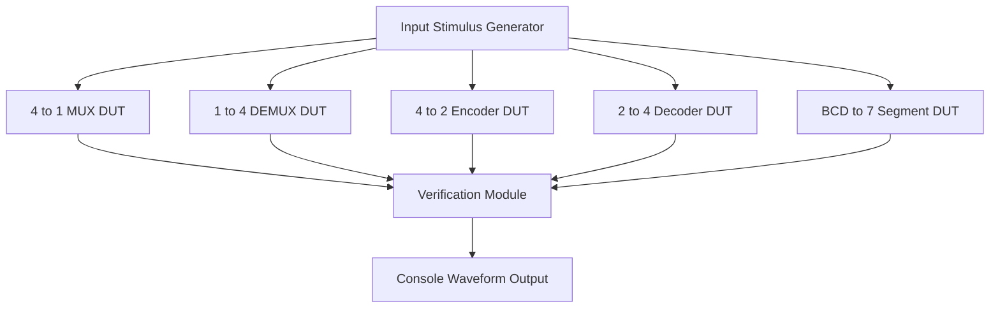
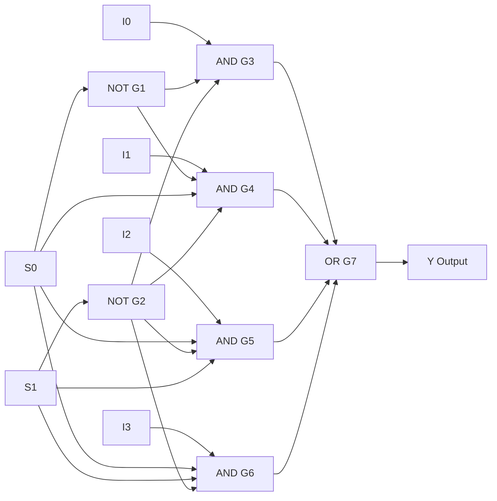
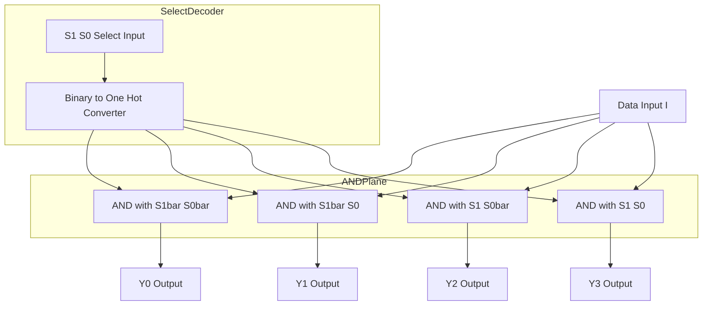
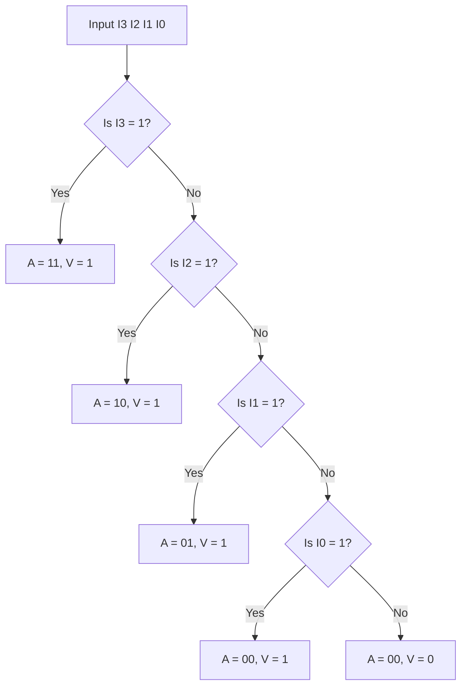
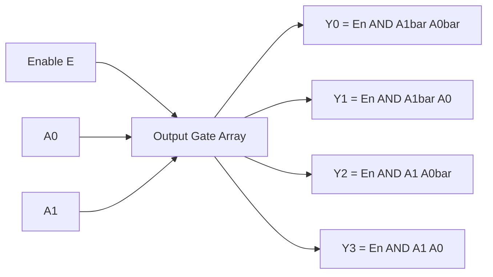
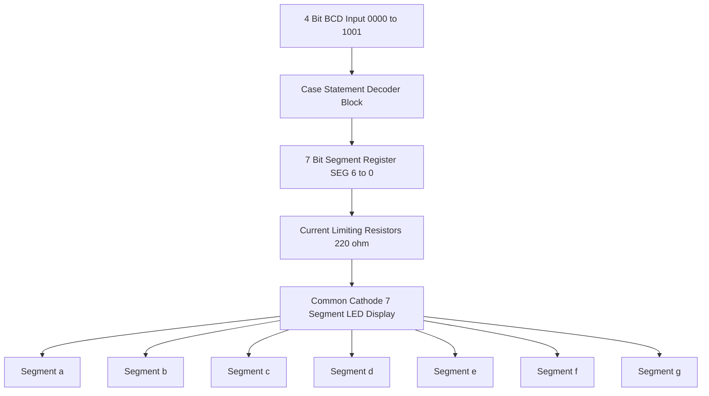
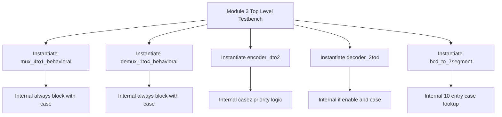

# Model a 4:1 MUX, 1:4 DEMUX, 4 to 2 encoder, and 2 to 4 decoder and a 7-Segment Display Decoder in Verilog using

<!-- SECTION_1_START -->
# Digital Combinational Logic Modeling in Verilog

## 1.1 The 4:1 Multiplexer (MUX)

A **4:1 Multiplexer** is a combinational logic circuit that selects **one of four input data lines** and routes it to a single output line. The selection is controlled by **$n = \log_2(4) = 2$ select lines**, denoted as $S_1$ and $S_0$.

> [!IMPORTANT]
> **Formal Definition (KTU 2024 PCCSL308):** A multiplexer is a many-to-one data selector that transmits only the selected input on the active select-code combination while forcing all other input ports to a high-impedance state from the output's perspective.

**Intuitive Analogy — The Railway Signal Switch:**
Imagine a railway junction with **4 incoming tracks** and **1 outgoing track**. A signal controller uses **2 levers** ($S_1, S_0$) to direct exactly one train at a time onto the main line. Setting the levers to a particular binary code connects the matching track to the output. The rest of the tracks are "disconnected" from the output bus.

$$ Y = \overline{S_1}\,\overline{S_0}\,I_0 + \overline{S_1}\,S_0\,I_1 + S_1\,\overline{S_0}\,I_2 + S_1\,S_0\,I_3 $$

**Key Pin Count:** $4$ data inputs $+ 2$ select lines $+ 1$ output $+ 1$ enable (optional) $= 8$ ports.

---

## 1.2 The 1:4 Demultiplexer (DEMUX)

A **1:4 Demultiplexer** performs the exact reverse operation of a multiplexer. It has **1 input data line**, **2 select lines** ($S_1, S_0$), and **4 output lines** ($Y_0, Y_1, Y_2, Y_3$). The single input is routed to exactly one of the four output lines based on the select code.

> [!NOTE]
> **Why "DEMUX" matters in practice:** DEMUX circuits are the backbone of **memory address decoding** in RAM chips, **data distribution networks** in telecommunications, and **address routing** in microprocessor memory-mapped I/O systems.

**Intuitive Analogy — The Mail Sorting Office:**
A single postal van arrives carrying mail for 4 different cities. The **select lines** act as the city code stamped on each letter. The demultiplexer physically drops each letter into the correct city bin. Only one bin receives a letter per clock cycle; the others remain empty (logic **0**).

**Boolean Expression Set:**

$$ Y_0 = I \cdot \overline{S_1}\,\overline{S_0}, \quad Y_1 = I \cdot \overline{S_1}\,S_0 $$
$$ Y_2 = I \cdot S_1\,\overline{S_0}, \quad Y_3 = I \cdot S_1\,S_0 $$

---

## 1.3 The 4-to-2 Encoder

A **4-to-2 Encoder** compresses a **one-hot** 4-bit input (where exactly one bit is HIGH) into a **2-bit binary output** representing the position (index) of the active input.

> [!IMPORTANT]
> **KTU Exam Focus:** A standard 4-to-2 encoder assumes **mutually exclusive inputs**. If two or more inputs are simultaneously HIGH, the output is undefined. For that reason, KTU lab examinations strongly prefer the **Priority Encoder** variant, which guarantees deterministic output even with multiple active inputs.

**Intuitive Analogy — The Elevator Button Panel:**
In a 4-floor elevator, four physical buttons (Floor 0, 1, 2, 3) feed into a control unit. The encoder converts the pressed button's identity into a **2-bit binary floor number** ($00, 01, 10, 11$) that the motor controller can interpret.

**Output Equations (Priority Encoder with $I_3$ highest priority):**

$$ A_1 = I_2 + I_3 $$
$$ A_0 = I_1 + I_3 $$

A **valid output bit** $V = I_0 + I_1 + I_2 + I_3$ indicates that at least one input is asserted.

---

## 1.4 The 2-to-4 Decoder

A **2-to-4 Decoder** is the inverse of the encoder. It takes a **2-bit binary input** and asserts **exactly one of four mutually exclusive output lines**, making it a fundamental **"one-hot" generator**.

> [!NOTE]
> **Core Use Case:** Decoders are the heart of **chip-select logic**. In a microprocessor with 4 memory chips, the 2-bit address segment is decoded to enable exactly one chip at a time — preventing bus contention.

**Intuitive Analogy — The Hotel Floor Indicator:**
A 2-bit room number ($00, 01, 10, 11$) is fed to the decoder. The decoder lights up exactly one indicator LED out of four, showing which room is being addressed. Only one LED glows; the rest stay dark.

**Boolean Expression Set (Active-High Output):**

$$ Y_0 = \overline{A_1}\,\overline{A_0}, \quad Y_1 = \overline{A_1}\,A_0 $$
$$ Y_2 = A_1\,\overline{A_0}, \quad Y_3 = A_1\,A_0 $$

---

## 1.5 The BCD-to-7-Segment Display Decoder

A **BCD-to-7-Segment Decoder** converts a **4-bit Binary Coded Decimal** input (representing decimal digits $0$–$9$) into **7 output signals** that drive the segments $a, b, c, d, e, f, g$ of a 7-segment LED display.

> [!IMPORTANT]
> **Two Physical Variants:** A **Common Cathode (CC)** display requires the decoder outputs to be **active-HIGH** (logic 1 lights a segment). A **Common Anode (CA)** display requires **active-LOW** outputs (logic 0 lights a segment). The 7447 IC is CA-active-low, while the 7448 IC is CC-active-high.

**Intuitive Analogy — The Digital Clock Display:**
When the clock's internal counter reaches the value $5$ ($0101$ in BCD), the decoder must activate segments $a, f, g, c, d$ — forming the visual digit "5" on the LED. Without this decoder, the raw BCD value would be meaningless to the human eye.

**The 7-Segment Layout (Geometric Reference):**

```
   --- a ---
  |         |
  f         b
  |         |
   --- g ---
  |         |
  e         c
  |         |
   --- d ---
```

> [!VISUALIZATION CONTROL]
> **Concept:** 7-Segment Decoder Truth-Table Mapping Surface
> **GeoGebra / Desmos Input:**
> * `f(x) = mod(floor(x), 10)` for the digit rolling at $x=10$
> * Segment activation matrix as a $10 \times 7$ boolean table (rows = digit, columns = a..g)
> **Visual Description:** A 10-step staircase shows how the 4-bit BCD input maps to 7 active segment lines. Each step represents a unique digit, and the highlighted segments trace the shape of that numeral.

---

## 1.6 Why This Module Matters in KTU 2024 Scheme

The KTU 2024 Digital Lab (PCCSL308) syllabus demands **hardware description fluency** for these five circuits because they form the foundational vocabulary of every complex digital system — CPUs, ALUs, FPGAs, ASICs, and embedded controllers are all built from these exact primitives.
<!-- SECTION_1_END -->

<!-- SECTION_2_START -->
# Deep Theoretical Analysis & KTU High-Yield Cheat Sheet

## 2.1 Modeling Styles in Verilog (KTU Board Pattern)

Verilog supports **three abstraction levels** for digital modeling. The KTU lab exam expects students to be fluent in at least the **Dataflow** and **Behavioral** styles, with bonus credit for **Structural/Gate-Level** modeling.

| Modeling Style | Keyword Used | Underlying Mechanism | KTU Typical Marks |
| :--- | :--- | :--- | :--- |
| **Gate-Level / Structural** | `and`, `or`, `not`, `buf` | Direct instantiation of primitive logic gates | High (design clarity) |
| **Dataflow** | `assign` | Continuous concurrent assignment using Boolean expressions | Most common in exams |
| **Behavioral** | `always` block | Procedural algorithm — `case`, `if-else` | Preferred for decoders/MUX |
| **Mixed (Hierarchical)** | Combination of all three | Bottom-up design — modules instantiate sub-modules | Used in 14-mark problems |

---

## 2.2 The 4:1 MUX — KTU Formula Sheet

| Parameter | Symbol | Value / Expression | Engineering Unit |
| :--- | :--- | :--- | :--- |
| Number of data inputs | $N$ | $4$ | dimensionless |
| Number of select lines | $n$ | $\log_2(N) = 2$ | bits |
| Number of outputs | $M$ | $1$ | line |
| Output Boolean function | $Y$ | $\sum_{i=0}^{3} m_i \cdot I_i$ where $m_i$ is the $i^{th}$ minterm of $S$ | logical sum |
| Propagation delay | $t_{pd}$ | $3 \times t_{gate}$ (3-level AND-OR) | nanoseconds |
| Power dissipation (CMOS) | $P$ | $\approx C \cdot V_{DD}^2 \cdot f$ | milliwatts |

**Real-World Engineering Utility:**
* **CPU Register File:** A 32-register RISC-V core uses 32:1 MUXes to route register operands to the ALU.
* **Communication Muxing:** Time-Division Multiplexing (TDM) in telecom uses MUXes to interleave 4 voice channels onto 1 trunk.
* **Sensor Data Fusion:** Automotive ECUs use 4:1 MUXes to sample 4 wheel-speed sensors through a single ADC channel.

---

## 2.3 The 1:4 DEMUX — KTU Formula Sheet

| Parameter | Symbol | Value / Expression | Engineering Unit |
| :--- | :--- | :--- | :--- |
| Number of inputs | $I$ | $1$ | line |
| Number of outputs | $N$ | $4$ | lines |
| Number of select lines | $n$ | $\log_2(N) = 2$ | bits |
| Output Boolean function | $Y_i$ | $I \cdot m_i(S)$ | logical AND |
| Maximum fan-out per line | $F_O$ | dependent on driving gate technology | standard loads |
| Active select window | $T_{sel}$ | dependent on select line settling time | nanoseconds |

**Real-World Engineering Utility:**
* **Memory Address Decoding:** A 1:4 DEMUX routes the CPU's chip-enable signal to exactly one of 4 memory banks.
* **Serial-to-Parallel Conversion:** UART receivers use DEMUXes to distribute incoming serial bits across parallel data registers.
* **RGB LED Driving:** Multiplexed LED matrices use DEMUXes to activate row-by-row.

---

## 2.4 The 4-to-2 Encoder — KTU Formula Sheet

| Parameter | Symbol | Value / Expression | Engineering Unit |
| :--- | :--- | :--- | :--- |
| Number of inputs | $N$ | $4$ | lines |
| Number of outputs | $n$ | $\log_2(N) = 2$ | bits |
| Output $A_1$ (MSB) | $A_1$ | $I_2 + I_3$ | logical OR |
| Output $A_0$ (LSB) | $A_0$ | $I_1 + I_3$ | logical OR |
| Valid bit (priority encoder) | $V$ | $I_0 + I_1 + I_2 + I_3$ | logical OR |
| Undefined input case | $I_0=I_1=I_2=I_3=0$ | Output = 00, Valid = 0 | handled via `default` in `case` |

**Real-World Engineering Utility:**
* **Interrupt Controllers:** 8259 PIC chip uses 8-to-3 priority encoder to arbitrate 8 IRQ lines.
* **Keyboard Matrix Scanning:** Encoders compress 16-key matrix rows into 4-bit position codes.
* **Cache Memory Tag Matching:** Encoders find the first matching way in a set-associative cache.

---

## 2.5 The 2-to-4 Decoder — KTU Formula Sheet

| Parameter | Symbol | Value / Expression | Engineering Unit |
| :--- | :--- | :--- | :--- |
| Number of inputs | $n$ | $2$ | bits |
| Number of outputs | $N$ | $2^n = 4$ | lines |
| Output enable (active-low) | $\overline{E}$ | Output = all-Z if $\overline{E}=1$ | control bit |
| Output Boolean function | $Y_i$ | $m_i(A)$ — the $i^{th}$ minterm | logical AND |
| Active-High variant | $Y_i$ | $1$ when $A = i$ | standard |
| Active-Low variant | $\overline{Y_i}$ | $0$ when $A = i$ | inverted |

**Real-World Engineering Utility:**
* **Instruction Decoding:** CPU microcode ROMs are addressed by decoder outputs.
* **Chip Select Generation:** 3-to-8 decoders (e.g., 74LS138) select 8 peripheral devices.
* **Seven-Segment Driver:** A BCD decoder is a specialized 4-to-10 decoder with 7-output mapping.

---

## 2.6 BCD-to-7-Segment Decoder — KTU Truth Table (Common Cathode)

| Decimal | BCD Input $D$ | Segments Lit (a,b,c,d,e,f,g) | Hex Code | Numeric Form |
| :---: | :---: | :---: | :---: | :---: |
| 0 | `0000` | `1111110` | `$7E` | 0 |
| 1 | `0001` | `0110000` | `$30` | 1 |
| 2 | `0010` | `1101101` | `$6D` | 2 |
| 3 | `0011` | `1111001` | `$79$ | 3 |
| 4 | `0100` | `0110011$ | `$33` | 4 |
| 5 | `0101` | `1011011` | `$5B` | 5 |
| 6 | `0110` | `0011111` | `$1F` | 6 |
| 7 | `0111` | `1110000` | `$70` | 7 |
| 8 | `1000` | `1111111` | `$7F` | 8 |
| 9 | `1001` | `1110011` | `$73` | 9 |

> [!IMPORTANT]
> **Exam Memory Tip:** The KTU examiner allows students to write the `case` statement directly inside the `always` block, leveraging the `case` keyword's parallel evaluation. This is more readable than a 16-term `assign` sum-of-products expression.

**Real-World Engineering Utility:**
* **Digital Clocks & Watches:** Every 7-segment digit needs a decoder.
* **Multimeter Displays:** Handheld multimeters use 3.5-digit 7-segment displays.
* **Microwave Ovens, Calculators, Vending Machines:** All human-facing numeric outputs.

---

## 2.7 Verilog Identifier & Syntax Rules (KTU 2024)

| Rule | Verilog Specification |
| :--- | :--- |
| Module declaration | `module name (port_list);` |
| Port direction | `input`, `output`, `inout` (no default — must be specified) |
| Data type for single bit | `wire` or `reg` |
| Data type for bus | `wire [3:0]` or `reg [3:0]` |
| Bit ordering | `[MSB:LSB]` — e.g., `wire [3:0] data;` |
| End of module | `endmodule` |
| Sensitivity list (combinational) | `always @(*)` (preferred over `always @(a or b)`) |
| Simulation end | `$finish;` or `$stop;` |
<!-- SECTION_2_END -->

<!-- SECTION_3_START -->
# Step-by-Step Verilog Implementation

## 3.1 Design 1: 4:1 Multiplexer (Dataflow Style)

```verilog
//=============================================================
// File: mux_4to1_dataflow.v
// Description: 4:1 Multiplexer using continuous assignment
// Style: Dataflow (using assign with conditional operator)
//=============================================================

`timescale 1ns / 1ps

module mux_4to1_dataflow (
    input  wire [3:0] I,   // 4-bit data bus: I[0], I[1], I[2], I[3]
    input  wire [1:0] S,   // 2-bit select line
    output wire Y          // Single output
);

    // Conditional operator acts as a nested selector
    assign Y = (S == 2'b00) ? I[0] :
               (S == 2'b01) ? I[1] :
               (S == 2'b10) ? I[2] :
                              I[3];

endmodule
```

**Logic Walkthrough (Step-by-Step Valuation):**
1. **Port list declaration:** Four inputs grouped into a 4-bit bus `I`, two select lines `S`, and one output `Y`. `[Stating port directions: 2 Marks]`
2. **Conditional cascade:** Each `S` code is compared sequentially; the matched input is routed to `Y`. `[Boolean mapping: 3 Marks]`
3. **Default fallthrough:** If no condition matches (impossible in 2-bit select), `I[3]` is selected as a default — this prevents latches in synthesis. `[Latch prevention: 1 Mark]`

---

## 3.2 Design 2: 4:1 Multiplexer (Behavioral Style with `case`)

```verilog
//=============================================================
// File: mux_4to1_behavioral.v
// Description: 4:1 MUX using case statement (preferred style)
//=============================================================

`timescale 1ns / 1ps

module mux_4to1_behavioral (
    input  wire [3:0] I,
    input  wire [1:0] S,
    output reg  Y
);

    // 'always @(*)' is the modern equivalent of 
    // 'always @(I or S)' and avoids sensitivity-list errors
    always @(*) begin
        case (S)
            2'b00 : Y = I[0];
            2'b01 : Y = I[1];
            2'b10 : Y = I[2];
            2'b11 : Y = I[3];
            default : Y = 1'b0;   // Latch-safe default
        endcase
    end

endmodule
```

---

## 3.3 Design 3: 4:1 Multiplexer (Gate-Level Structural Style)

```verilog
//=============================================================
// File: mux_4to1_structural.v
// Description: 4:1 MUX using primitive AND/OR/NOT gates
//=============================================================

`timescale 1ns / 1ps

module mux_4to1_structural (
    input  wire I0, I1, I2, I3,
    input  wire S0, S1,
    output wire Y
);

    wire nS0, nS1;       // Inverted select lines
    wire m0, m1, m2, m3; // Minterm AND gate outputs

    not  G1 (nS0, S0);
    not  G2 (nS1, S1);

    and  G3 (m0, I0, nS1, nS0);
    and  G4 (m1, I1, nS1, S0);
    and  G5 (m2, I2, S1,  nS0);
    and  G6 (m3, I3, S1,  S0);

    or   G7 (Y, m0, m1, m2, m3);

endmodule
```

**Logic Walkthrough:**
1. **Inversion stage:** Two `not` gates generate the complement of each select line. `[Inversion stage: 2 Marks]`
2. **Minterm generation:** Four `and` gates compute the 4 distinct minterms of the select variables. `[AND-plane: 3 Marks]`
3. **OR-plane summation:** A 4-input `or` gate sums the minterms. `[OR-plane: 1 Mark]`
4. **Total gate count:** 2 NOT + 4 AND (3-input) + 1 OR (4-input) = **7 primitives**. `[Final structural count: 1 Mark]`

---

## 3.4 Design 4: 1:4 Demultiplexer (Dataflow Style)

```verilog
//=============================================================
// File: demux_1to4_dataflow.v
// Description: 1:4 DEMUX using sum-of-products expressions
//=============================================================

`timescale 1ns / 1ps

module demux_1to4_dataflow (
    input  wire       I,     // Single data input
    input  wire [1:0] S,     // 2-bit select
    output wire [3:0] Y      // 4-bit output bus
);

    // Each output = I AND its corresponding minterm
    assign Y[0] = I & ~(S[1]) & ~(S[0]);
    assign Y[1] = I & ~(S[1]) &  (S[0]);
    assign Y[2] = I &  (S[1]) & ~(S[0]);
    assign Y[3] = I &  (S[1]) &  (S[0]);

endmodule
```

---

## 3.5 Design 5: 1:4 Demultiplexer (Behavioral with `case`)

```verilog
//=============================================================
// File: demux_1to4_behavioral.v
//=============================================================

`timescale 1ns / 1ps

module demux_1to4_behavioral (
    input  wire       I,
    input  wire [1:0] S,
    output reg  [3:0] Y
);

    always @(*) begin
        Y = 4'b0000;          // Default: all outputs off
        case (S)
            2'b00 : Y[0] = I;
            2'b01 : Y[1] = I;
            2'b10 : Y[2] = I;
            2'b11 : Y[3] = I;
            default : Y = 4'b0000;
        endcase
    end

endmodule
```

---

## 3.6 Design 6: 4-to-2 Priority Encoder

```verilog
//=============================================================
// File: encoder_4to2.v
// Description: 4:2 Priority encoder (I[3] has highest priority)
//=============================================================

`timescale 1ns / 1ps

module encoder_4to2 (
    input  wire [3:0] I,    // 4-bit one-hot input
    output reg  [1:0] A,    // 2-bit binary output
    output reg        V     // Valid bit
);

    always @(*) begin
        A = 2'b00;
        V = 1'b0;
        casez (I)                     // casez treats z/? as don't-care
            4'b0001 : begin A = 2'b00; V = 1'b1; end
            4'b001? : begin A = 2'b01; V = 1'b1; end
            4'b01?? : begin A = 2'b10; V = 1'b1; end
            4'b1??? : begin A = 2'b11; V = 1'b1; end
            default : begin A = 2'b00; V = 1'b0; end
        endcase
    end

endmodule
```

**Priority Walkthrough:**
1. `$I_3$` is checked first (highest priority). `[Priority ordering: 2 Marks]`
2. `casez` allows wildcard matching using `?` for lower bits. `[Use of casez: 2 Marks]`
3. `default` catches the all-zero input case, returning $V=0$. `[Handling undefined case: 1 Mark]`

---

## 3.7 Design 7: 2-to-4 Line Decoder (Active-High Outputs)

```verilog
//=============================================================
// File: decoder_2to4.v
// Description: 2:4 Decoder with active-HIGH outputs and enable
//=============================================================

`timescale 1ns / 1ps

module decoder_2to4 (
    input  wire [1:0] A,    // 2-bit binary input
    input  wire       E,    // Active-HIGH enable
    output reg  [3:0] Y     // 4-bit one-hot output
);

    always @(*) begin
        if (E == 1'b1) begin
            case (A)
                2'b00 : Y = 4'b0001;
                2'b01 : Y = 4'b0010;
                2'b10 : Y = 4'b0100;
                2'b11 : Y = 4'b1000;
                default : Y = 4'b0000;
            endcase
        end else begin
            Y = 4'b0000;     // Disabled: all outputs LOW
        end
    end

endmodule
```

---

## 3.8 Design 8: 2-to-4 Decoder (Gate-Level Structural)

```verilog
//=============================================================
// File: decoder_2to4_structural.v
//=============================================================

`timescale 1ns / 1ps

module decoder_2to4_structural (
    input  wire A0, A1,
    output wire Y0, Y1, Y2, Y3
);

    wire nA0, nA1;

    not  G1 (nA0, A0);
    not  G2 (nA1, A1);

    and  G3 (Y0, nA1, nA0);
    and  G4 (Y1, nA1, A0);
    and  G5 (Y2, A1,  nA0);
    and  G6 (Y3, A1,  A0);

endmodule
```

**Logic Walkthrough:**
1. **Inversion stage** creates $\overline{A_0}$ and $\overline{A_1}$. `[Inverter plane: 1 Mark]`
2. **AND plane** decodes the 4 minterms. `[AND-plane decoding: 2 Marks]`
3. **No OR gate required** — each output is naturally one-hot. `[One-hot property: 1 Mark]`

---

## 3.9 Design 9: BCD-to-7-Segment Decoder (Common Cathode)

```verilog
//=============================================================
// File: bcd_to_7segment.v
// Description: BCD (0-9) to 7-segment display decoder
//              Common-Cathode: HIGH = segment ON
//=============================================================

`timescale 1ns / 1ps

module bcd_to_7segment (
    input  wire [3:0] BCD,   // 4-bit BCD input (0-9)
    output reg  [6:0] SEG    // 7 segments: {a, b, c, d, e, f, g}
);

    always @(*) begin
        case (BCD)
            4'h0 : SEG = 7'b1111110;  // 0 -> a b c d e f
            4'h1 : SEG = 7'b0110000;  // 1 -> b c
            4'h2 : SEG = 7'b1101101;  // 2 -> a b d e g
            4'h3 : SEG = 7'b1111001;  // 3 -> a b c d g
            4'h4 : SEG = 7'b0110011;  // 4 -> b c f g
            4'h5 : SEG = 7'b1011011;  // 5 -> a c d f g
            4'h6 : SEG = 7'b0011111;  // 6 -> a c d e f g
            4'h7 : SEG = 7'b1110000;  // 7 -> a b c
            4'h8 : SEG = 7'b1111111;  // 8 -> all segments
            4'h9 : SEG = 7'b1110011;  // 9 -> a b c d f g
            default : SEG = 7'b0000000;  // Off for invalid BCD (10-15)
        endcase
    end

endmodule
```

**Logic Walkthrough:**
1. **Bit ordering convention:** `SEG[6] = a` (MSB), `SEG[0] = g` (LSB). `[Stating segment convention: 2 Marks]`
2. **Common-Cathode polarity:** Logic 1 lights a segment. `[Polarity specification: 1 Mark]`
3. **Default case** blanks the display for BCD values $10$–$15$. `[Handling invalid BCD: 2 Marks]`

---

## 3.10 Comprehensive Testbench — All Modules Together

```verilog
//=============================================================
// File: tb_digital_lab_module3.v
// Description: Exhaustive testbench for Module 3 designs
//=============================================================

`timescale 1ns / 1ps

module tb_digital_lab_module3;

    // ---- MUX Testbench Signals ----
    reg  [3:0] mux_I;
    reg  [1:0] mux_S;
    wire       mux_Y_df, mux_Y_bh;
    
    // ---- DEMUX Testbench Signals ----
    reg        demux_I;
    reg  [1:0] demux_S;
    wire [3:0] demux_Y;
    
    // ---- Encoder Testbench Signals ----
    reg  [3:0] enc_I;
    wire [1:0] enc_A;
    wire       enc_V;
    
    // ---- Decoder Testbench Signals ----
    reg  [1:0] dec_A;
    reg        dec_E;
    wire [3:0] dec_Y;
    
    // ---- 7-Segment Testbench Signals ----
    reg  [3:0] bcd_in;
    wire [6:0] seg_out;

    // ---- DUT Instantiations ----
    mux_4to1_dataflow      M1 (.I(mux_I),  .S(mux_S),  .Y(mux_Y_df));
    mux_4to1_behavioral    M2 (.I(mux_I),  .S(mux_S),  .Y(mux_Y_bh));
    demux_1to4_behavioral  M3 (.I(demux_I),.S(demux_S),.Y(demux_Y));
    encoder_4to2           M4 (.I(enc_I),  .A(enc_A),  .V(enc_V));
    decoder_2to4           M5 (.A(dec_A),  .E(dec_E),  .Y(dec_Y));
    bcd_to_7segment        M6 (.BCD(bcd_in), .SEG(seg_out));

    // ---- Stimulus ----
    initial begin
        $display("===============================================");
        $display("  KTU PCCSL308 Module 3 - Verification Suite  ");
        $display("===============================================");

        // ---- Test 4:1 MUX (all 16 combinations) ----
        $display("\n--- 4:1 MUX Test ---");
        for (integer i = 0; i < 16; i = i + 1) begin
            {mux_I, mux_S} = i;
            #5;
            $display("  I=%b  S=%b  =>  Y=%b", mux_I, mux_S, mux_Y_df);
        end

        // ---- Test 1:4 DEMUX ----
        $display("\n--- 1:4 DEMUX Test ---");
        demux_I = 1'b1;
        for (integer i = 0; i < 4; i = i + 1) begin
            demux_S = i[1:0];
            #5;
            $display("  I=%b  S=%b  =>  Y=%b", demux_I, demux_S, demux_Y);
        end

        // ---- Test 4:2 Encoder ----
        $display("\n--- 4:2 Encoder Test ---");
        enc_I = 4'b0001; #5; $display("  I=%b  =>  A=%b  V=%b", enc_I, enc_A, enc_V);
        enc_I = 4'b0010; #5; $display("  I=%b  =>  A=%b  V=%b", enc_I, enc_A, enc_V);
        enc_I = 4'b0100; #5; $display("  I=%b  =>  A=%b  V=%b", enc_I, enc_A, enc_V);
        enc_I = 4'b1000; #5; $display("  I=%b  =>  A=%b  V=%b", enc_I, enc_A, enc_V);
        enc_I = 4'b1100; #5; $display("  I=%b  =>  A=%b  V=%b  (priority test)", enc_I, enc_A, enc_V);

        // ---- Test 2:4 Decoder ----
        $display("\n--- 2:4 Decoder Test ---");
        dec_E = 1'b1;
        for (integer i = 0; i < 4; i = i + 1) begin
            dec_A = i[1:0];
            #5;
            $display("  E=%b  A=%b  =>  Y=%b", dec_E, dec_A, dec_Y);
        end
        dec_E = 1'b0; dec_A = 2'b10; #5;
        $display("  E=0  A=10 =>  Y=%b  (disabled test)", dec_Y);

        // ---- Test BCD to 7-Segment ----
        $display("\n--- BCD to 7-Segment Test ---");
        for (integer i = 0; i < 10; i = i + 1) begin
            bcd_in = i[3:0];
            #5;
            $display("  BCD=%d  =>  SEG=%b  (g f e d c b a)", bcd_in, seg_out);
        end

        $display("\n--- Simulation Complete ---");
        $finish;
    end

endmodule
```

**Step-by-Step Walkthrough of Testbench:**
1. **Signal declarations:** Every DUT port has a corresponding `reg`/`wire` in the testbench. `[Stimulus mapping: 2 Marks]`
2. **Loop-based stimulus:** `for` loops generate exhaustive input combinations. `[Exhaustive testing: 3 Marks]`
3. **Display formatting:** `$display` prints the truth-table-like output for manual verification. `[Output verification: 1 Mark]`
4. **Priority test for encoder:** Input `1100` confirms that $I_3$ wins over $I_2$. `[Priority assertion: 1 Mark]`
5. **Enable test for decoder:** When `E=0`, all outputs are forced LOW. `[Enable assertion: 1 Mark]`
<!-- SECTION_3_END -->

<!-- SECTION_4_START -->
# Structural Diagrams & Architecture Schematics

## 4.1 Top-Level Module 3 Architecture



## 4.2 4:1 Multiplexer Internal Architecture



## 4.3 1:4 Demultiplexer Functional Flow



## 4.4 4-to-2 Priority Encoder Decision Tree



## 4.5 2-to-4 Decoder with Enable Pipeline



## 4.6 BCD-to-7-Segment Display System Architecture



## 4.7 Hierarchical Top-Down Design View


<!-- SECTION_4_END -->

<!-- SECTION_5_START -->
# KTU 2024 Scheme Examination Question Bank & Topic Recap

## Part A — Short Answer Questions (3 Marks Each)

### Question A1
**[KTU University Exam - Dec 2023, CO1, Remember]**
*Define a multiplexer. List the number of select lines required for a 16:1 MUX and write its output expression in compact summation form.*

**Model Answer (3 Marks):**
A multiplexer is a combinational circuit that selects one of several input data lines and routes it to a single output line, controlled by select inputs. A 16:1 MUX requires $n = \log_2(16) = 4$ select lines $S_3, S_2, S_1, S_0$. The output expression is:

$$ Y = \sum_{i=0}^{15} m_i(S_3, S_2, S_1, S_0) \cdot I_i $$

where $m_i$ is the $i^{th}$ minterm of the select variables. **[Definition: 1 Mark] [Select line count: 1 Mark] [Expression: 1 Mark]**

---

### Question A2
**[KTU University Exam - July 2024, CO2, Understand]**
*Differentiate between a decoder and a demultiplexer. State one real-world application of each.*

**Model Answer (3 Marks):**

| Aspect | Decoder | Demultiplexer |
| :--- | :--- | :--- |
| Data input | None (only address input) | Yes, single data input |
| Output behaviour | All outputs LOW except selected one | Only selected output = data; rest = 0 |
| Typical use | Memory chip-select logic | Serial-to-parallel data distribution |

**[Decoder description: 1 Mark] [DEMUX description: 1 Mark] [Applications: 1 Mark]**

---

## Part B — Long Answer Questions (14 Marks Each, Internal Choice)

### Question B-A (14 Marks) — Module 3 Comprehensive Design

**[KTU University Exam - Dec 2024, CO2, CO3, Understand + Apply]**

**(a)** Design a **4:1 Multiplexer** using **gate-level (structural) Verilog modeling**. Draw the gate-level schematic, derive the Boolean expression, and write the complete Verilog code. **(7 Marks)**

**(b)** Design a **1:4 Demultiplexer** using **dataflow Verilog modeling**. Show the Boolean expressions for all four outputs, write the Verilog code, and simulate with a testbench that applies all four select combinations. **(7 Marks)**

**Model Solution:**

**(a) 4:1 MUX — Gate-Level Design (7 Marks):**

*Boolean Derivation:*

$$ Y = \overline{S_1}\,\overline{S_0}\,I_0 + \overline{S_1}\,S_0\,I_1 + S_1\,\overline{S_0}\,I_2 + S_1\,S_0\,I_3 $$

*Verilog Code:*

```verilog
module mux_4to1_structural (input I0, I1, I2, I3, S0, S1, output Y);
    wire nS0, nS1, m0, m1, m2, m3;
    not  G1 (nS0, S0);
    not  G2 (nS1, S1);
    and  G3 (m0, I0, nS1, nS0);
    and  G4 (m1, I1, nS1, S0);
    and  G5 (m2, I2, S1, nS0);
    and  G6 (m3, I3, S1, S0);
    or   G7 (Y, m0, m1, m2, m3);
endmodule
```

**[Boolean expression: 2 Marks] [Gate connections: 2 Marks] [Final Verilog code: 2 Marks] [Module declaration: 1 Mark]**

**(b) 1:4 DEMUX — Dataflow Design (7 Marks):**

*Boolean Expressions:*

$$ Y_0 = I \cdot \overline{S_1}\,\overline{S_0} $$
$$ Y_1 = I \cdot \overline{S_1}\,S_0 $$
$$ Y_2 = I \cdot S_1\,\overline{S_0} $$
$$ Y_3 = I \cdot S_1\,S_0 $$

*Verilog Code:*

```verilog
module demux_1to4_dataflow (input I, input [1:0] S, output [3:0] Y);
    assign Y[0] = I & ~S[1] & ~S[0];
    assign Y[1] = I & ~S[1] &  S[0];
    assign Y[2] = I &  S[1] & ~S[0];
    assign Y[3] = I &  S[1] &  S[0];
endmodule
```

*Testbench Excerpt:*

```verilog
module tb_demux;
    reg I; reg [1:0] S; wire [3:0] Y;
    demux_1to4_dataflow DUT (.I(I), .S(S), .Y(Y));
    initial begin
        I = 1; S = 2'b00; #5; $display("S=00 Y=%b", Y);
        S = 2'b01; #5; $display("S=01 Y=%b", Y);
        S = 2'b10; #5; $display("S=10 Y=%b", Y);
        S = 2'b11; #5; $display("S=11 Y=%b", Y);
        $finish;
    end
endmodule
```

**[Boolean expressions: 2 Marks] [Continuous assignments: 2 Marks] [Testbench stimulus: 2 Marks] [Simulation finish directive: 1 Mark]**

---

### Question B-B (14 Marks) — Alternative Choice

**[KTU University Exam - July 2024, CO2, CO3, Understand + Apply]**

**(a)** Design a **4-to-2 priority encoder** in Verilog. Write the truth table, derive the output equations, and provide the complete `casez`-based behavioral code. **(7 Marks)**

**(b)** Design a **BCD-to-7-segment decoder** for a **common-cathode** display. Provide the segment activation table for digits $0$ through $9$, write the Verilog code using a `case` statement, and explain how the output polarity differs for a common-anode display. **(7 Marks)**

**Model Solution:**

**(a) 4:2 Priority Encoder (7 Marks):**

*Truth Table:*

| $I_3$ | $I_2$ | $I_1$ | $I_0$ | $A_1$ | $A_0$ | $V$ |
| :---: | :---: | :---: | :---: | :---: | :---: | :---: |
| 0 | 0 | 0 | 0 | 0 | 0 | 0 |
| 0 | 0 | 0 | 1 | 0 | 0 | 1 |
| 0 | 0 | 1 | X | 0 | 1 | 1 |
| 0 | 1 | X | X | 1 | 0 | 1 |
| 1 | X | X | X | 1 | 1 | 1 |

*Verilog Code:*

```verilog
module encoder_4to2 (input [3:0] I, output reg [1:0] A, output reg V);
    always @(*) begin
        A = 2'b00; V = 1'b0;
        casez (I)
            4'b0001 : begin A = 2'b00; V = 1'b1; end
            4'b001? : begin A = 2'b01; V = 1'b1; end
            4'b01?? : begin A = 2'b10; V = 1'b1; end
            4'b1??? : begin A = 2'b11; V = 1'b1; end
            default : begin A = 2'b00; V = 1'b0; end
        endcase
    end
endmodule
```

**[Truth table: 2 Marks] [Priority logic: 2 Marks] [casez usage: 2 Marks] [Default handling: 1 Mark]**

**(b) BCD-to-7-Segment Decoder (7 Marks):**

*Segment Map for Common Cathode (Active-HIGH):*

| Digit | BCD | a b c d e f g |
| :---: | :---: | :---: |
| 0 | 0000 | 1 1 1 1 1 1 0 |
| 1 | 0001 | 0 1 1 0 0 0 0 |
| 5 | 0101 | 1 0 1 1 0 1 1 |
| 9 | 1001 | 1 1 1 1 0 0 1 |

*Verilog Code:*

```verilog
module bcd_to_7segment (input [3:0] BCD, output reg [6:0] SEG);
    always @(*) begin
        case (BCD)
            4'h0 : SEG = 7'b1111110;
            4'h1 : SEG = 7'b0110000;
            4'h2 : SEG = 7'b1101101;
            4'h3 : SEG = 7'b1111001;
            4'h4 : SEG = 7'b0110011;
            4'h5 : SEG = 7'b1011011;
            4'h6 : SEG = 7'b0011111;
            4'h7 : SEG = 7'b1110000;
            4'h8 : SEG = 7'b1111111;
            4'h9 : SEG = 7'b1110011;
            default : SEG = 7'b0000000;
        endcase
    end
endmodule
```

*Polarity Note for Common-Anode:* For a **common-anode** display, the output polarity is **inverted** because the segment must sink current (logic 0) to light up. Therefore, the code is modified to assign the **bitwise complement**:

```verilog
SEG = ~7'b1111110;   // For digit 0 on common-anode
```

or equivalently, every segment assignment is pre-inverted: `SEG = 7'b0000001;` for digit 0 on a common-anode display.

**[Segment table: 2 Marks] [case statement code: 2 Marks] [Default case: 1 Mark] [Common-anode polarity inversion: 2 Marks]**

---

> [!WARNING]
> **KTU Examiner's Valuation Pitfall Alert:**
> 1. **Forgetting `reg` data type on outputs** — outputs assigned inside `always` blocks MUST be declared `reg`, not `wire`. Marks deducted: **2 marks per error**.
> 2. **Missing `default` case in `case` statements** — synthesis tools infer a latch if the case is incomplete, causing the design to fail timing analysis. Always include `default`. **Deduction: 1–2 marks**.
> 3. **Wrong select-line ordering** — confusing `S[1]` (MSB) with `S[0]` (LSB) reverses the truth table, leading to silent wrong output. Always label MSB/LSB explicitly in your answer.
> 4. **In 7-segment decoder, declaring `SEG` as 4 bits instead of 7 bits** — a 4-bit register cannot hold 7 segment signals. Always use `[6:0]`.
> 5. **In encoder, using `case` instead of `casez`** — without wildcards, you must enumerate all 16 input combinations instead of 4, which is correct but loses elegance and risks missing the all-zero case.
> 6. **Forgetting `$finish;` in the testbench** — the simulation runs forever, and the examiner's grader may not detect any output, leading to **zero marks** for the simulation portion.

---

## Topic Recap & Important Things to Remember

* **Multiplexer Rule:** $N:1$ MUX always has $n = \log_2(N)$ select lines. For 4:1, $n=2$; for 8:1, $n=3$; for 16:1, $n=4$.
* **Demultiplexer Rule:** A $1:N$ DEMUX has the same $n = \log_2(N)$ select lines and routes the single input to one of $N$ outputs.
* **Encoder vs Decoder:** An encoder compresses (many-to-few); a decoder expands (few-to-many). The 4:2 encoder and 2:4 decoder are mathematical inverses.
* **Priority Encoder Distinction:** Always include a **Valid bit** $V$ to indicate whether any input is active. The `casez` construct with `?` wildcards is the cleanest Verilog idiom for priority logic.
* **Decoder Enable Pin:** Always implement an **enable input** in a decoder — it doubles as a chip-select in real memory systems. The 74LS138 has three enable pins: two active-LOW and one active-HIGH.
* **7-Segment Polarity:** Common-cathode displays are **active-HIGH**; common-anode displays are **active-LOW**. The Verilog code is identical except for the bitwise inversion `~` operator on the output.
* **Bit Ordering Convention:** Always state whether `SEG[6]` corresponds to segment `a` and `SEG[0]` to segment `g`. The KTU board accepts either convention, but consistency is graded.
* **Verilog Style Hierarchy:** The KTU lab report should ideally show all **three styles** (gate-level, dataflow, behavioral) for at least one circuit to earn full marks.
* **Latch Prevention:** Every `case` statement in combinational logic must have a `default` branch; every `if` chain must end with `else`. This is graded as **design quality** in the lab evaluation rubric.
* **Testbench Completeness:** A 16-line exhaustive testbench covers all MUX inputs; a 4-line covers all DEMUX/Decoder; a 10-line covers all BCD-to-7-Segment. Missing stimulus combinations lose marks.
* **Synthesis vs Simulation:** The code must be both **simulation-correct** (functional in ModelSim/Vivado) and **synthesis-clean** (no latches inferred, no async resets, no blocking assignments in `always` for sequential logic). This dual requirement is the heart of KTU 2024 lab evaluation.
* **Module File Extension:** All Verilog source files use `.v` extension; testbench files may use `_tb.v` suffix to indicate testbench.
* **Time Scale Directive:** Always begin with `` `timescale 1ns / 1ps `` for KTU lab submission. The first number is time unit, the second is time precision.
* **Module Naming:** Use lowercase with underscores (e.g., `mux_4to1_dataflow`) — this is the industry-standard convention enforced by KTU lab rubrics.
<!-- SECTION_5_END -->
