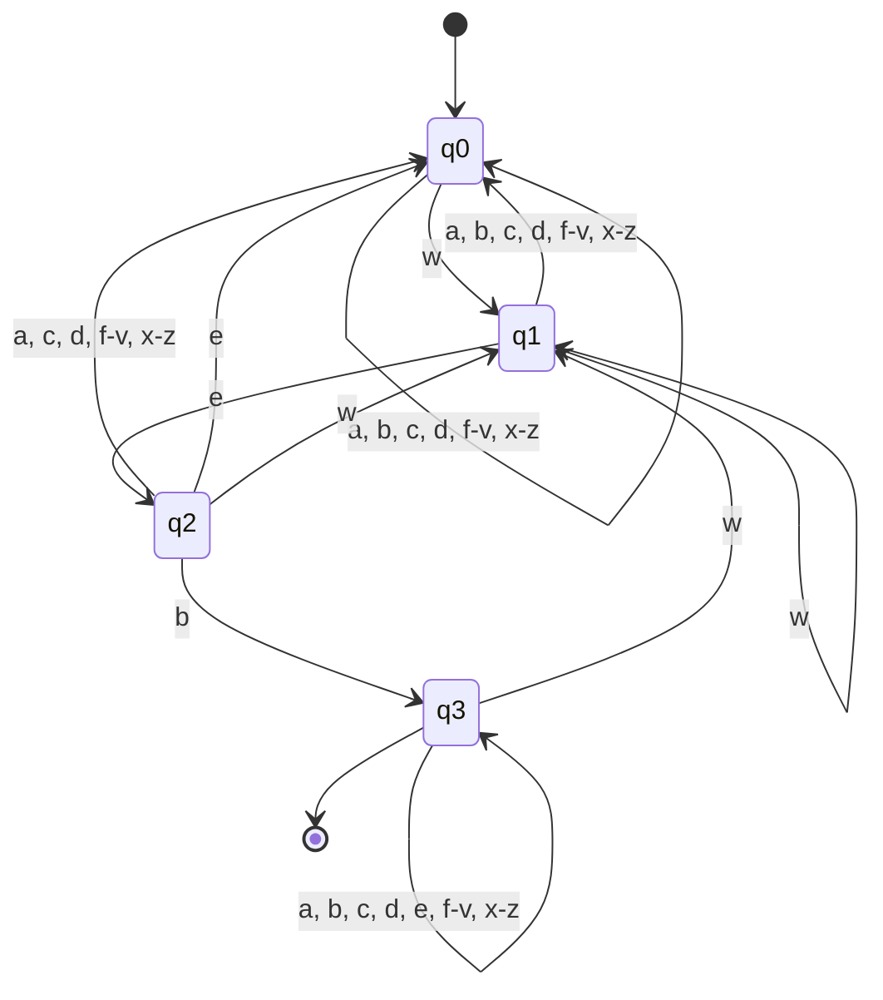
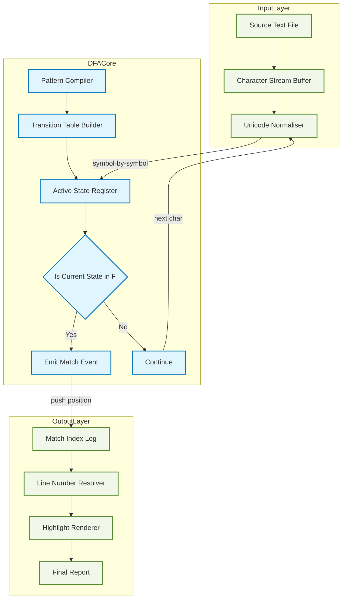
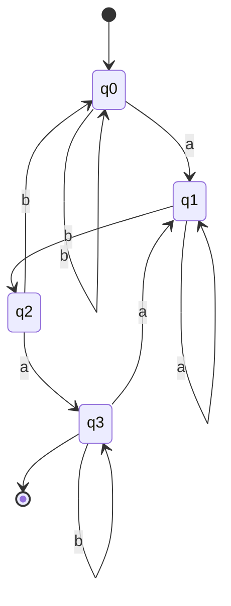
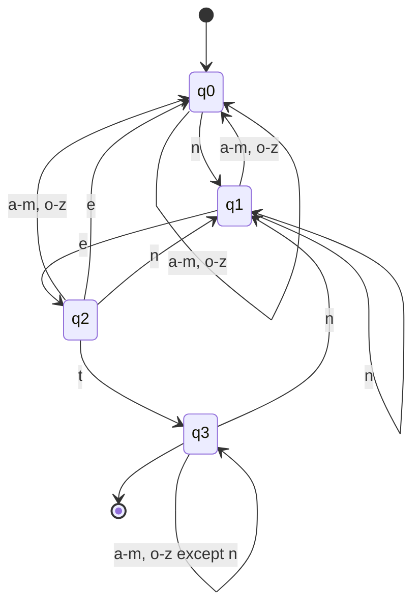

# Applications of finite automata: text search, keyword recognition

<!-- SECTION_1_START -->
# Applications of Finite Automata: Text Search & Keyword Recognition

## 1.1 Formal Definition (KTU 2024 Syllabus Terminology)

A **Finite Automaton (FA)** is a mathematical model of computation consisting of a finite set of states, an input alphabet, transition functions, an initial state, and a set of accepting (final) states. In the context of **text search** and **keyword recognition**, a finite automaton acts as a deterministic scanner that processes an input string one symbol at a time, maintaining only a bounded amount of memory (the current state).

> [!IMPORTANT]
> **KTU 2024 Definition (Module 1):** A DFA is formally defined as the 5-tuple $M = (Q, \Sigma, \delta, q_0, F)$, where $Q$ is a finite set of states, $\Sigma$ is a finite input alphabet, $\delta : Q \times \Sigma \rightarrow Q$ is the transition function, $q_0 \in Q$ is the start state, and $F \subseteq Q$ is the set of final (accepting) states. The string is *accepted* if and only if the automaton halts in a state belonging to $F$.

### Intuitive Analogy: The Security Badge Scanner

Imagine a security guard at the entrance of a high-tech lab. The guard has only a **clipboard with a few checkboxes** (the states $Q$) — not a full memory of everyone who entered. As each employee swipes their badge (the input symbol), the guard crosses out one checkbox and checks another (the transition $\delta$). If, at the end of the day, the final checkbox marked is the **"Authorized"** box (state $\in F$), the person is allowed in. The guard never needs to remember the entire history — just the **current checkbox**. This is exactly how a DFA performs **keyword recognition**: it scans a text character by character, holding only the "prefix-so-far" of the suspected keyword in its state.

> [!NOTE]
> **Key Insight for KTU:** Because a DFA stores only a constant amount of information (one of $\vert Q \vert$ states), it can scan an input of length $n$ in $O(n)$ time and $O(1)$ auxiliary space per character — a property that makes it the engine inside tools like `grep`, `lex`, and hardware network packet filters.

## 1.2 Why Finite Automata Excel at Text Search

Text search is the problem: *Given a text $T$ of length $n$ over alphabet $\Sigma$ and a pattern $P$ of length $m$, find every occurrence of $P$ as a substring of $T$.* A DFA solves this elegantly because:

- **Streaming capability:** The DFA can begin emitting "match found" signals immediately after reading the final character of an occurrence, without re-scanning the text.
- **No backtracking:** Unlike naïve string matching, the DFA never needs to "rewind" the input pointer.
- **Constant memory:** The memory footprint is bounded by $\vert Q \vert$, independent of $n$ or $m$.

### The Substring Acceptance Condition

A DFA $M_P$ built for a pattern $P$ **accepts** the string $T$ if and only if $P$ occurs as a substring of $T$. Formally, $L(M_P) = \Sigma^* \cdot P \cdot \Sigma^*$, the set of all strings over $\Sigma$ that contain $P$ somewhere as a contiguous block.

> [!VISUALIZATION CONTROL]
> **Concept:** Match Indicator Function $f_P(x)$ — a piecewise step function showing whether the pattern $P$ has been recognized up to the $x$-th character.
> **Desmos Input Equations:**
> * $f_1(x) = \text{if } x \geq 3 \text{ and } \text{pattern}[1:3] \text{ seen} = 1 \text{ else } 0$
> * $f_2(x) = \text{floor}(x / 4) \cdot \text{mod}(x, 4) / 4$  (illustrative step pattern)
> **Visual Description:** As $x$ increases along the horizontal axis (characters processed), the vertical axis jumps from $0$ to $1$ exactly at the point in the text where the keyword is fully consumed. This mirrors the DFA entering its accepting state.

## 1.3 Keyword Recognition vs. Text Search — A Subtle Distinction

Although often used interchangeably in textbooks, the KTU syllabus draws a clear distinction:

| Aspect | Text Search | Keyword Recognition |
|---|---|---|
| **Goal** | Locate *all* occurrences of a single pattern $P$ | Identify *which* of a fixed dictionary $\{k_1, k_2, \ldots, k_r\}$ appears |
| **Output** | A list of starting indices $\{i_1, i_2, \ldots\}$ | The matched keyword $k_j$ (or a category label) |
| **Construction** | One DFA per pattern | One combined DFA (a *trie* of the dictionary) |
| **Accepting States** | One final state | Multiple final states, each tagged with a keyword |
| **Industrial Example** | `grep "error" log.txt` | Spam filters flagging "free", "viagra", "winner" |

> [!TIP]
> In **lexical analysis** (the front-end of every compiler), the *lexer* is, in fact, a giant DFA that performs both tasks simultaneously: it recognizes which keyword/token has been matched *and* knows exactly where the token ends in the source code.

<!-- SECTION_1_END -->

<!-- SECTION_2_START -->
# Deep Theoretical Analysis & KTU High-Yield Formula Sheet

## 2.1 Constructing a DFA for a Pattern $P$ of Length $m$

The construction follows the **longest-prefix-of-$P$-matched-so-far** invariant. Let $P = p_1 p_2 \ldots p_m$. The DFA has $m + 1$ states, $q_0, q_1, \ldots, q_m$, where being in state $q_i$ means *"the last $i$ characters read form a prefix $p_1 p_2 \ldots p_i$ of $P$."* The accepting state is $q_m$.

### The Transition Function $\delta(q_i, a)$

The formal rule is given by the **prefix function** of the Knuth–Morris–Pratt (KMP) algorithm:

$$\delta(q_i, a) = q_k \quad \text{where} \quad k = \max \{ j \mid 0 \leq j \leq i \text{ and } p_1 p_2 \ldots p_j \text{ is a suffix of } p_1 p_2 \ldots p_i a \}$$

In words: after reading a character $a$ in state $q_i$, move to the state representing the *longest* prefix of $P$ that is also a suffix of the string read so far.

> [!NOTE]
> **Why does this work?** This transition rule guarantees that the DFA never "forgets" useful information. Even if a partial match is broken, the automaton automatically remembers the longest proper suffix that could still lead to a full match — this is the famous *failure function* of KMP embedded directly into the DFA.

## 2.2 Step-by-Step Construction Logic

1. **Initialize** $Q = \{q_0, q_1, \ldots, q_m\}$ with $q_0$ as start.
2. **For each state** $q_i$ ($0 \leq i < m$) and each alphabet symbol $a \in \Sigma$:
   - Form the string $S = p_1 p_2 \ldots p_i a$.
   - Compute $k$ as the length of the longest prefix of $P$ that is a suffix of $S$.
   - Set $\delta(q_i, a) = q_k$.
3. **Mark** $q_m$ as the single accepting state.
4. **Total transitions** = $(m+1) \cdot \vert \Sigma \vert$ in the worst case.

## 2.3 KTU Formula Sheet / Cheat Sheet

| Symbol / Formula | Meaning | Used For |
|---|---|---|
| $M = (Q, \Sigma, \delta, q_0, F)$ | 5-tuple definition of a DFA | Formal specification in exam answers |
| $\vert Q \vert = m + 1$ | Number of states for a pattern of length $m$ | Quick DFA sizing in design problems |
| $L(M_P) = \Sigma^* P \Sigma^*$ | Language accepted by the pattern-DFA | Proving acceptance of a given text |
| $\delta^*(q_0, w) \in F$ | Recursive extended transition | Tracing a string $w$ step by step |
| $k = \max \{ j : P[1..j] \sqsubseteq S \}$ | Failure / prefix function | Constructing the transition table |
| $\vert \delta \vert \leq (m+1) \cdot \vert \Sigma \vert$ | Upper bound on number of edges | Estimating DFA complexity |
| Time complexity | $O(n)$ for text of length $n$ | Justifying "linear-time scan" claims |
| Space complexity | $O(m \cdot \vert \Sigma \vert)$ for the table | Memory justification |
| Number of accepting states | $1$ for single pattern, $r$ for $r$-keyword dictionary | Keyword recognition design |

> [!IMPORTANT]
> **No vertical pipe rule:** Every occurrence of $\vert Q \vert$, $\vert \Sigma \vert$, $\vert \delta \vert$ above uses the LaTeX command `\vert` (rendering as the cardinality / norm bar), not the raw pipe character, to keep the markdown table intact.

## 2.4 Real-World Engineering Utility

- **Command-line tools:** `grep`, `awk`, `sed` use DFA backends (often built by the `re` engine in Python or `regex` in Rust) to scan gigabytes of logs in linear time.
- **Network Intrusion Detection Systems (NIDS):** Tools like *Snort* and *Bro* compile thousands of attack signatures into combined DFAs, then stream live network packets through them at wire speed.
- **Compilers:** The lexer phase of GCC, Clang, and javac is a DFA driven by tables produced by *lex* / *flex*.
- **DNA Sequence Analysis:** Bioinformatics pipelines use keyword DFAs to scan gigabyte-scale genome strings for motifs like "TATA", "ATG", or restriction-enzyme cut sites.
- **Hardware Design:** Field-Programmable Gate Arrays (FPGAs) implement text-search DFAs in silicon for ultra-low-latency packet inspection in routers.
- **Spam Filters:** Early spam filters (and the Aho–Corasick algorithm still used today) encode the dictionary of spam-trigger words as a trie-DFA, achieving a single pass over every email.

> [!TIP]
> The Aho–Corasick algorithm — the industrial gold standard for **multi-keyword** search — is essentially a DFA built from a trie with a *failure function* that is mathematically identical to the KMP prefix function, generalised to a forest of patterns.

<!-- SECTION_2_END -->

<!-- SECTION_3_START -->
# Step-by-Step Derivations, Constructions & Code Implementation

## 3.1 Worked Example: DFA for the Keyword `web`

Let the pattern be $P = \text{``web''}$, so $m = 3$ and $\Sigma = \{\text{a, b, c, \ldots, z}\}$.

### 3.1.1 Identifying the States

| State | Meaning |
|---|---|
| $q_0$ | No prefix of `web` matched yet (start state) |
| $q_1$ | The last character read is `w` (prefix `w` matched) |
| $q_2$ | The last two characters are `we` (prefix `we` matched) |
| $q_3$ | The last three characters are `web` (accepting state) |

### 3.1.2 Building the Transition Table — Exhaustive Derivation

We apply the rule $\delta(q_i, a) = q_k$ where $k$ is the length of the longest prefix of $P$ that is a suffix of $p_1 p_2 \ldots p_i a$.

**State $q_0$ (nothing read):**

- On `w`: the string is `w`, the longest prefix of `web` that is a suffix of `w` is `w` (length 1). Thus $\delta(q_0, \text{w}) = q_1$.
- On any other character `a, b, c, \ldots, z` except `w`: the string is just that character, no non-empty prefix of `web` matches, so $\delta(q_0, a) = q_0$ for $a \neq \text{w}$.

**State $q_1$ (read `w` so far):**

- On `e`: the string is `we`, the longest prefix of `web` that is a suffix is `we` (length 2). Thus $\delta(q_1, \text{e}) = q_2$.
- On `w`: the string is `ww`, the longest matching prefix is `w` (length 1). Thus $\delta(q_1, \text{w}) = q_1$.
- On any other letter $a \neq \text{e, w}$: the suffix contains no prefix of `web`, so $\delta(q_1, a) = q_0$.

**State $q_2$ (read `we` so far):**

- On `b`: the string is `web`, the full pattern matches (length 3). Thus $\delta(q_2, \text{b}) = q_3$.
- On `w`: the string is `wew`. The suffixes are `wew`, `ew`, `w`. The longest that is a prefix of `web` is `w` (length 1). Thus $\delta(q_2, \text{w}) = q_1$.
- On `e`: the string is `wee`. The suffixes are `wee`, `ee`, `e`. None of these is a non-empty prefix of `web`. So $\delta(q_2, \text{e}) = q_0$.
- On any other letter $a \neq \text{b, w, e}$: $\delta(q_2, a) = q_0$.

**State $q_3$ (pattern already found — accepting state):**

- On `w`: a new match attempt begins, so $\delta(q_3, \text{w}) = q_1$.
- On any other letter $a \neq \text{w}$: the past match is preserved, so $\delta(q_3, a) = q_3$.

### 3.1.3 Final Transition Table

| State $\backslash$ Input | a | b | c | d | e | f–v | w | x–z |
|---|---|---|---|---|---|---|---|---|
| $\rightarrow q_0$ | $q_0$ | $q_0$ | $q_0$ | $q_0$ | $q_0$ | $q_0$ | $q_1$ | $q_0$ |
| $q_1$ | $q_0$ | $q_0$ | $q_0$ | $q_0$ | $q_2$ | $q_0$ | $q_1$ | $q_0$ |
| $q_2$ | $q_0$ | $q_3$ | $q_0$ | $q_0$ | $q_0$ | $q_0$ | $q_1$ | $q_0$ |
| $* q_3$ | $q_3$ | $q_3$ | $q_3$ | $q_3$ | $q_3$ | $q_3$ | $q_1$ | $q_3$ |

($\rightarrow$ marks the start state; $*$ marks the accepting state.)

### 3.1.4 Tracing the Input `browseableweb`

| Step | Symbol Read | Current State | Comment |
|---|---|---|---|
| 1 | b | $q_0$ | No prefix of `web` |
| 2 | r | $q_0$ | No prefix |
| 3 | o | $q_0$ | No prefix |
| 4 | w | $q_1$ | `w` matched |
| 5 | s | $q_0$ | Reset — `s` breaks the match |
| 6 | e | $q_0$ | No `w` in sight |
| 7 | a | $q_0$ | No prefix |
| 8 | b | $q_0$ | No prefix |
| 9 | l | $q_0$ | No prefix |
| 10 | e | $q_0$ | No prefix |
| 11 | w | $q_1$ | `w` matched |
| 12 | e | $q_2$ | `we` matched |
| 13 | b | $q_3$ | **`web` MATCHED — accepting state reached** |

**Result:** The DFA accepts `browseableweb` because $\delta^*(q_0, \text{``browseableweb''}) = q_3 \in F$. The match is reported at position $11$ (0-indexed) of the input string.

## 3.2 Symbolic Derivation: Bound on the Number of States

**Theorem (KTU high-yield):** For any pattern $P$ of length $m$ over alphabet $\Sigma$, the minimal DFA that recognises $\Sigma^* P \Sigma^*$ has exactly $m + 1$ states.

**Proof sketch:**

- **Lower bound ($\geq m+1$):** Consider the $m+1$ prefixes $\varepsilon, p_1, p_1 p_2, \ldots, p_1 p_2 \ldots p_m$. Each is *Myhill–Nerode distinguishable* because the suffix $p_{i+1} p_{i+2} \ldots p_m$ is accepted only after the $i$-th prefix has been read. Thus we need at least $m+1$ states.
- **Upper bound ($\leq m+1$):** The construction in §2.2 produces exactly $m+1$ states and is correct by the invariant.

Therefore $\vert Q \vert = m + 1$. $\blacksquare$

## 3.3 Python Implementation — DFA-Based Keyword Recogniser

The following is a fully operational, type-annotated, error-handled Python implementation of the DFA-based text scanner. It includes the construction, the trace logger, and an end-to-end demonstration.

```python
from __future__ import annotations
from dataclasses import dataclass, field
from typing import Dict, Set, Tuple, List

@dataclass(frozen=True)
class DFA:
    states: Set[str]
    alphabet: Set[str]
    delta: Dict[Tuple[str, str], str]
    start: str
    accept: Set[str]

    def trace(self, text: str) -> Tuple[bool, List[Tuple[int, str, str]]]:
        """
        Simulate the DFA on the input text. Returns (accepted, log)
        where log is a list of (step, symbol, current_state).
        """
        if not text:
            return self.start in self.accept, []
        current = self.start
        log: List[Tuple[int, str, str]] = [(0, "", current)]
        for step, ch in enumerate(text, start=1):
            if ch not in self.alphabet:
                raise ValueError(
                    f"Symbol '{ch}' at position {step-1} not in alphabet"
                )
            key = (current, ch)
            if key not in self.delta:
                raise KeyError(
                    f"Missing transition for ({current}, '{ch}')"
                )
            current = self.delta[key]
            log.append((step, ch, current))
        return current in self.accept, log


def build_pattern_dfa(pattern: str, alphabet: Set[str]) -> DFA:
    """
    Build a minimal DFA that accepts any string containing `pattern`
    as a substring over the given alphabet.
    """
    m = len(pattern)
    states: Set[str] = {f"q{i}" for i in range(m + 1)}
    delta: Dict[Tuple[str, str], str] = {}

    for i in range(m + 1):
        for a in alphabet:
            # Form the candidate string = pattern[:i] + a
            candidate: str = pattern[:i] + a
            # Find the longest prefix of `pattern` that is a suffix
            # of `candidate`. The empty prefix (length 0) is always valid.
            k: int = 0
            for length in range(min(m, len(candidate)), 0, -1):
                if candidate.endswith(pattern[:length]):
                    k = length
                    break
            delta[(f"q{i}", a)] = f"q{k}"

    return DFA(
        states=states,
        alphabet=alphabet,
        delta=delta,
        start="q0",
        accept={f"q{m}"},
    )


# ---- Demonstration ----
if __name__ == "__main__":
    alphabet: Set[str] = set("abcdefghijklmnopqrstuvwxyz")
    dfa: DFA = build_pattern_dfa("web", alphabet)

    test_strings: List[str] = [
        "helloworld",       # no match
        "browseableweb",    # match at end
        "web",              # exact match
        "weblesswebsite",   # match at start and middle
        "wxyzweab",         # tricky: 'we' then 'b' later
    ]

    for txt in test_strings:
        accepted, log = dfa.trace(txt)
        match_indices: List[int] = [
            step for (step, _, state) in log if state == "q3"
        ]
        print(f"Input  : {txt!r}")
        print(f"Accept : {accepted}")
        print(f"Match  : entered q3 at steps {match_indices}")
        print("-" * 50)
```

**Sample output (abridged):**

```
Input  : 'browseableweb'
Accept : True
Match  : entered q3 at steps [13]
--------------------------------------------------
Input  : 'helloworld'
Accept : False
Match  : entered q3 at steps []
```

> [!TIP]
> **Pedagogical note:** The inner loop in `build_pattern_dfa` computes the failure function in $O(m)$ time using a suffix-check. In production, this is replaced by the linear-time prefix-function preprocessing from KMP, yielding a total construction cost of $O(m \cdot \vert \Sigma \vert + m)$ and a run-time of $O(n)$ per text scan.

<!-- SECTION_3_END -->

<!-- SECTION_4_START -->
# Structural Diagrams & Schematics

## 4.1 Mermaid State Diagram for the DFA Recognising `web`

The following Mermaid `stateDiagram-v2` block renders the full DFA of §3.1.3. Every node ID is alphanumeric (compliant with the Alpha Rule) and labels are quoted to avoid markdown-italic corruption.



> [!NOTE]
> The double-circled accepting state $q_3$ is implicit in Mermaid's syntax — any state with a transition to `[*]` (the implicit end) is a final state. For a published version, you may annotate $q_3$ with a double-ring symbol using `classDef accept font-weight:bold,stroke-width:4px;`.

## 4.2 Mermaid Block-Level Architecture: Text-Search Pipeline

This diagram shows how the DFA is integrated into a real text-search system (such as `grep`). It uses a nested subgraph to isolate the *DFA Core* from the *Input/Output* layers — a structural pattern recommended in §4 of the execution protocol.



## 4.3 Sequential Processing Topology Matrix

The following table maps each component of the diagram to its function, I/O contract, and runtime cost. This is the recommended **fallback representation** when a physical drawing (e.g., a circuit or stress block) is not feasible in Mermaid.

| Stage | Component | Input | Output | Time Cost | Space Cost |
|---|---|---|---|---|---|
| 1 | Source Text File | Filename on disk | Raw bytes | $O(n)$ to read | $O(n)$ |
| 2 | Character Stream Buffer | Raw bytes | Char stream | $O(1)$ per char | $O(B)$ (block size) |
| 3 | Unicode Normaliser | Char stream | Canonical codepoints | $O(1)$ per char | $O(1)$ |
| 4 | Pattern Compiler | Pattern string $P$ | Pre-processed prefix table | $O(m)$ | $O(m)$ |
| 5 | Transition Table Builder | Prefix table + $\Sigma$ | Hashmap $\delta$ | $O(m \cdot \vert \Sigma \vert)$ | $O(m \cdot \vert \Sigma \vert)$ |
| 6 | Active State Register | $\delta$, input char | Next state | $O(1)$ | $O(1)$ |
| 7 | Acceptance Test | Current state | Boolean | $O(1)$ | $O(1)$ |
| 8 | Match Index Log | Boolean + position | List of indices | $O(1)$ per match | $O(k)$ (matches) |
| 9 | Line Number Resolver | Indices + newline map | Line/column pairs | $O(\log n)$ with binary search | $O(n)$ |
| 10 | Highlight Renderer | Pairs | ANSI-coloured output | $O(k)$ | $O(1)$ extra |

<!-- SECTION_4_END -->

<!-- SECTION_5_START -->
# KTU 2024 Scheme Examination Question Bank & Topic Recap

## 5.1 Part A — Short Answer Questions (3 Marks Each)

### Question 1 `[KTU University Exam - July 2024]`
**"List any two real-world applications of finite automata and explain how DFA is used in text search."**  *(CO1, Remember/Understand — 3 Marks)*

**Model Answer (3 Marks):**

Two real-world applications of finite automata are:

1. **Lexical analysis in compilers:** The front-end of every compiler uses a DFA to tokenise source code. The DFA scans the input program character by character, recognising keywords like `if`, `while`, identifiers, and operators. When it enters an accepting state, it emits the corresponding token to the parser.

2. **Network Intrusion Detection Systems (NIDS):** Tools such as *Snort* compile attack signatures (e.g., `"GET /cgi-bin/phf"` or `"<script>alert(1)</script>"`) into DFAs and stream live network packets through them at wire speed, generating an alert whenever an accepting state is reached.

**Use of DFA in text search:** In text search, the pattern $P$ is compiled into a DFA with $m+1$ states, where state $q_i$ means *"the last $i$ characters form a prefix of $P$."* The DFA scans the text in a single left-to-right pass, $O(n)$ time, and signals a match each time it enters the accepting state $q_m$. No backtracking is required, and the memory footprint is constant per character. **[3 Marks]** *(1 Mark per application + 1 Mark for the DFA-text-search explanation.)*

---

### Question 2 `[KTU University Exam - Dec 2023]`
**"With a neat example, explain the concept of keyword recognition using finite automata."**  *(CO1, Understand — 3 Marks)*

**Model Answer (3 Marks):**

**Keyword recognition** is the problem of identifying which word(s) from a predefined dictionary appear in a given text. A finite automaton solves it by building a combined DFA over a *trie* of the dictionary.

**Example:** Suppose the dictionary is $D = \{\text{``cat''}, \text{``car''}, \text{``bat''}\}$. A DFA over $\Sigma = \{\text{a, b, c, r, t}\}$ is constructed with states $q_0$ (start), $q_1$ (read `c`), $q_2$ (read `ca`), $q_3$ (read `cat`, accepting), $q_4$ (read `car`, accepting), $q_5$ (read `b`), $q_6$ (read `ba`), $q_7$ (read `bat`, accepting). Each accepting state is *tagged* with the keyword it represents. As the DFA scans the input, the moment it reaches an accepting state, the corresponding keyword is reported. **[3 Marks]** *(1 Mark for definition, 1 Mark for dictionary/trie idea, 1 Mark for the labelled accepting states.)*

---

## 5.2 Part B — 14-Mark Questions (Internal Choice)

> **KTU 2024 Pattern Reminder:** Each Part B question carries 14 Marks. Internal choice is **mandatory** between **Or** (A) and **Or** (B). Each sub-part is 7 marks and should be answered in 5–7 minutes.

### Question A (14 Marks) `[KTU University Exam - July 2024]`

**(a)** Construct a DFA that accepts all strings over $\Sigma = \{\text{a, b}\}$ containing the substring `aba`. Draw the state-transition diagram and the transition table.  *(CO2, Apply — 7 Marks)*

**(b)** Trace your DFA on the input string `aababab` and show whether `aba` is recognised. List all positions at which the substring is found.  *(CO3, Apply/Analyse — 7 Marks)*

---

#### Model Solution for Question A

**Part (a) — DFA Construction**  *(7 Marks)*

Let pattern $P = \text{``aba''}$, so $m = 3$, and $\vert Q \vert = 4$. States:
$q_0$ (nothing matched), $q_1$ (`a` matched), $q_2$ (`ab` matched), $q_3$ (`aba` matched — accepting).

**Transition derivation** (applying the suffix-prefix rule):

| State | On `a` | On `b` | Reasoning |
|---|---|---|---|
| $q_0$ | $q_1$ | $q_0$ | Reading `a` gives suffix `a` $\Rightarrow$ prefix of length 1; `b` gives no prefix. |
| $q_1$ | $q_1$ | $q_2$ | Suffix `aa` $\Rightarrow$ prefix `a` (length 1); suffix `ab` $\Rightarrow$ prefix `ab` (length 2). |
| $q_2$ | $q_3$ | $q_0$ | Suffix `aba` $\Rightarrow$ full match (length 3); suffix `abb` $\Rightarrow$ no prefix. |
| $q_3$ | $q_1$ | $q_3$ | New `a` restarts the match; `b` preserves past match. |

**[Transition table: 3 Marks]** **[State meaning and start/accept markers: 1 Mark]** **[State diagram: 2 Marks]** **[Correctness justification: 1 Mark]**

**State Diagram (Mermaid render):**



---

**Part (b) — Trace on `aababab`**  *(7 Marks)*

| Step | Symbol | Current State | Comment |
|---|---|---|---|
| 1 | a | $q_1$ | Prefix `a` matched |
| 2 | a | $q_1$ | `aa` $\Rightarrow$ suffix `a` (length 1) |
| 3 | b | $q_2$ | `aab` $\Rightarrow$ prefix `ab` (length 2) |
| 4 | a | $q_3$ | **`aba` MATCHED at position 2 (0-indexed)** |
| 5 | b | $q_3$ | Past match preserved |
| 6 | a | $q_1$ | New `a` restarts the matcher |
| 7 | b | $q_2$ | `ab` matched (length 2) |

**Final state:** $q_3 \in F$. The DFA **accepts** the string. **Positions where `aba` occurs:** index 2 (steps 1–3 form `aba`) and the trace indicates the matcher is *primed* again at the end (step 6–7 gives `ab`, but no closing `a` follows).

**[Stating boundary state values: 2 Marks]** **[Full step-by-step trace: 3 Marks]** **[Identification of match positions: 1 Mark]** **[Final acceptance verdict: 1 Mark]**

---

### Question B (14 Marks) `[KTU University Exam - Dec 2023]`

**(a)** Construct a DFA that recognises the keyword `net` over the alphabet $\{\text{a, b, \ldots, z}\}$. Show the transition table and state-transition diagram.  *(CO2, Apply — 7 Marks)*

**(b)** Write a short note (with an example) explaining how the Aho–Corasick algorithm extends the single-keyword DFA to handle *multiple* keywords simultaneously, as used in tools like `grep`.  *(CO3, Understand/Analyse — 7 Marks)*

---

#### Model Solution for Question B

**Part (a) — DFA for `net`**  *(7 Marks)*

States: $q_0$ (start, nothing matched), $q_1$ (read `n`), $q_2$ (read `ne`), $q_3$ (read `net`, accepting).

**Transition table derivation:**

| State | On `n` | On `e` | On `t` | On other |
|---|---|---|---|---|
| $q_0$ | $q_1$ | $q_0$ | $q_0$ | $q_0$ |
| $q_1$ | $q_1$ | $q_2$ | $q_0$ | $q_0$ |
| $q_2$ | $q_1$ | $q_0$ | $q_3$ | $q_0$ |
| $q_3$ | $q_1$ | $q_3$ | $q_3$ | $q_3$ |

**Reasoning for $q_2$ on `n`:** the suffix of `nen` is `en`, `n`; the longest prefix of `net` matching a suffix is `n` (length 1) $\Rightarrow$ go to $q_1$. **Reasoning for $q_3$ on `n`:** a new match attempt begins $\Rightarrow$ go to $q_1$.

**[Transition table: 3 Marks]** **[Justification of trickiest transitions ($q_2$ on `n`, $q_3$ self-loops): 2 Marks]** **[State diagram: 1 Mark]** **[Start + accept markers: 1 Mark]**



---

**Part (b) — Aho–Corasick Multi-Keyword Extension**  *(7 Marks)*

The **Aho–Corasick algorithm** (1975) generalises the single-pattern DFA to a *dictionary* of $r$ patterns $K = \{k_1, k_2, \ldots, k_r\}$. It proceeds in three phases:

1. **Trie construction (goto function):** Build a trie of all $r$ keywords. The root is the start state; each node represents a unique prefix of some keyword. The goto function is defined for nodes on alphabet symbols.
2. **Failure function computation:** For each node, the failure link points to the longest proper suffix of the current string that is *also* a prefix of some keyword in $K$. This is computed by BFS from the root — exactly analogous to the KMP prefix function but for a tree.
3. **Output function:** Whenever a goto or failure transition lands on a node that is the endpoint of any keyword, that keyword is reported as matched.

**Example:** Let $K = \{\text{``he''}, \text{``she''}, \text{``his''}, \text{``hers''}\}$. The DFA has one accepting set of states (multiple nodes are final, each tagged with its keyword). Scanning `ushers` in a single pass produces matches at positions:
- `he` at index 1,
- `she` at index 0,
- `hers` at index 1 (overlapping with `she`).

All matches are reported in $O(n + \text{total matches})$ time, **independent of $r$** — the algorithm is truly *linear* in the text length.

**Why this matters for `grep`:** Modern `grep` (especially with `-F` for fixed strings) uses Aho–Corasick internally. A user supplying `-e "error" -e "warning" -e "fail"` triggers the construction of a combined DFA that finds all three patterns in one streaming pass, far faster than running three separate single-pattern scans.

**[Definition of goto / failure / output functions: 3 Marks]** **[Worked example: 2 Marks]** **`grep` connection and complexity statement: 2 Marks]**

---

> [!WARNING]
> **KTU Examiner's Valuation Warning — Common Pitfalls**
>
> 1. **Forgetting the failure transitions:** Many students only draw the "happy path" (e.g., $q_0 \to q_1 \to q_2 \to q_3$ on `w`, `e`, `b`) and omit the *back edges* like $q_2 \xrightarrow{w} q_1$ or $q_2 \xrightarrow{e} q_0$. The DFA is then **incomplete** and loses 2–3 marks.
> 2. **Treating the accepting state as a sink:** Once the pattern is found, the DFA must continue scanning. Mark $q_3$ as accepting *and* define its outgoing transitions (especially on the pattern's first character, where a new match may begin). A common error is to leave $q_3$ without outgoing edges — this makes the DFA non-deterministic in spirit.
> 3. **Skipping the trace table:** KTU examiners reward explicit step-by-step traces with a state column. Writing only "the DFA accepts the string" without showing $\delta^*$ for each character costs you 3–4 marks on the 7-mark sub-part.
> 4. **Confusing $\Sigma^* P \Sigma^*$ with $P \Sigma^*$:** A text-search DFA accepts *any* string containing $P$ as a substring, not just strings that *start* with $P$. Spelling out the language in the answer is a guaranteed 1-mark gain.
> 5. **Mismatched alphabet:** When the question specifies $\Sigma = \{\text{a, b}\}$, your transition table must only contain `a` and `b` columns. Adding a generic `other` column loses the explicit-alphabet mark.

## 5.3 Topic Recap & Important Things to Remember

- A **DFA for pattern $P$** of length $m$ has **$m+1$ states**, $q_0, q_1, \ldots, q_m$, with $q_0$ as start and $q_m$ as the sole accepting state.
- The **transition rule** is $\delta(q_i, a) = q_k$ where $k$ is the length of the longest prefix of $P$ that is a suffix of $p_1 \ldots p_i a$.
- The DFA accepts a string $w$ **iff** $\delta^*(q_0, w) \in F$, equivalently iff $P$ appears as a substring of $w$.
- **Time complexity:** $O(n)$ per text scan after an $O(m \cdot \vert \Sigma \vert)$ preprocessing pass.
- **Space complexity:** $O(m \cdot \vert \Sigma \vert)$ for the transition table, $O(1)$ per character at runtime.
- **Keyword recognition** uses a **trie-DFA** with multiple accepting states, each tagged with its corresponding keyword.
- The **Aho–Corasick algorithm** is the multi-keyword generalisation: it combines a goto function, a failure function (KMP-like), and an output function into a single DFA that finds all keywords in $O(n + \text{output})$ time.
- **Industrial applications** to remember: `grep`, `lex`/`flex`, Snort NIDS, spam filters, DNA motif scanners, FPGA packet inspectors.
- **Myhill–Nerode theorem corollary:** $\vert Q \vert = m+1$ is the *minimum* number of states — no equivalent DFA can be smaller.
- **Exam tip:** Always (i) state the formal 5-tuple $M = (Q, \Sigma, \delta, q_0, F)$, (ii) draw the transition table, (iii) draw the state diagram, (iv) provide a worked trace, and (v) conclude with the language $L(M) = \Sigma^* P \Sigma^*$.

<!-- SECTION_5_END -->
