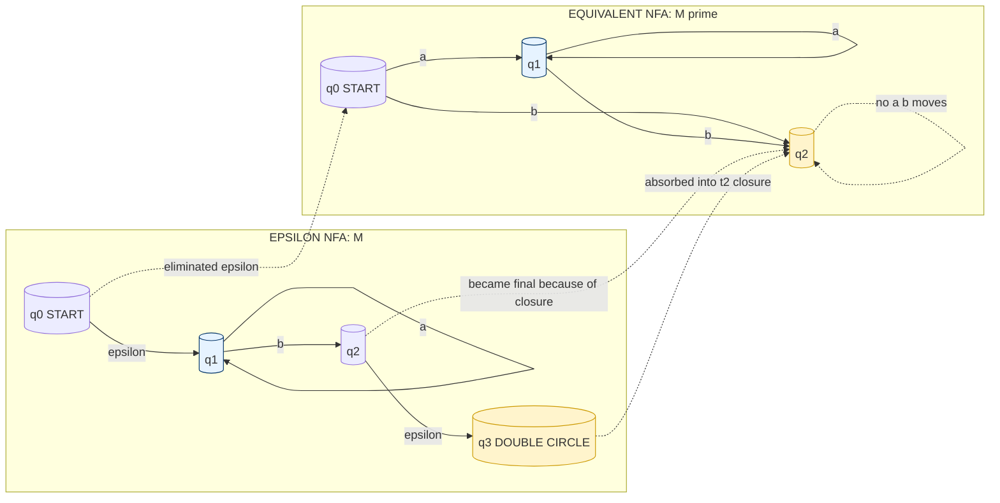
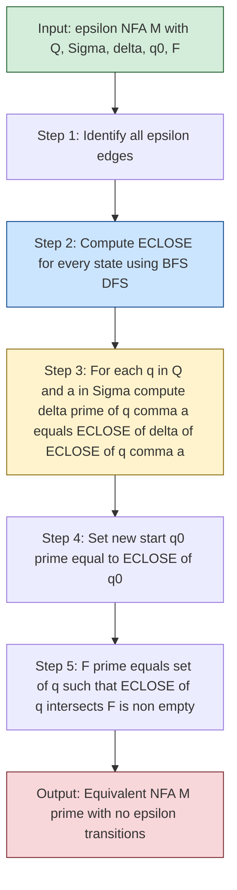

# Eliminating epsilon-transitions (Proof not expected)

<!-- SECTION_1_START -->
# Eliminating ε-Transitions from an ε-NFA

## 1.1 Formal Definition (KTU 2024 Syllabus Terminology)

An **ε-NFA (Nondeterministic Finite Automaton with ε-transitions)** is a 5-tuple $M = (Q, \Sigma, \delta, q_0, F)$, where the transition function is extended to allow moves on the empty string $\varepsilon$ (epsilon), the string of length zero. Formally:

$$\delta : Q \times (\Sigma \cup \{\varepsilon\}) \rightarrow 2^{Q}$$

An **ε-transition** is a state move that consumes **no input symbol**. It allows the automaton to jump between states "for free", without reading any character from the input tape.

> [!IMPORTANT]
> **KTU 2024 Definition Highlight:** An ε-NFA accepts the same class of languages as an ordinary NFA — namely, the **regular languages**. The empty string $\varepsilon$ here is a *machine move*, NOT the language $\{\varepsilon\}$ (though related, the symbol is overloaded). The transition $\delta(q, \varepsilon)$ is well-defined for every state $q \in Q$.

## 1.2 The ε-Closure Operator

Before we can eliminate ε-transitions, we must define the **ε-closure** of a state.

**Definition:** The **ε-closure** of a state $q$, denoted $E\text{close}(q)$ (or $ECLOSE(q)$), is the set of all states reachable from $q$ using **zero or more** ε-transitions:

$$E\text{close}(q) = \{ p \in Q \mid q \xrightarrow{\varepsilon^*} p \}$$

The notation $q \xrightarrow{\varepsilon^*} p$ means there is a path of zero or more ε-edges from $q$ to $p$. Note that **every state is always in its own ε-closure** (the "zero" case of the Kleene star).

For a set of states $S \subseteq Q$, the closure extends naturally:

$$E\text{close}(S) = \bigcup_{q \in S} E\text{close}(q)$$

> [!NOTE]
> **Why do we need ε-closure?** When an ε-NFA reads a symbol $a$, it may *silently* drift through several ε-edges before or after consuming $a$. The ε-closure captures all the "free" positions the machine can be in, which is essential for correctly simulating it as a pure NFA.

## 1.3 Conceptual Analogy — The "Free Teleporters"

Imagine you are standing in a multi-floor shopping mall, and at certain points there are **free teleporters** (ε-transitions). When you enter one, you instantly appear at a different location **without taking a step** (without consuming an input symbol). 

- **Ordinary NFA moves** = walking through doorways labeled with letters of the alphabet.
- **ε-transitions** = stepping onto a teleporter pad.
- **ε-closure of a state** = the set of *all locations* in the mall you could be standing in if you kept hopping on teleporters for as long as you wanted, starting from your current spot.

Eliminating ε-transitions means **rewiring the mall** so that, from any starting point, you can reach exactly the same set of "post-walk" positions as before — but **without using any teleporter**. You just install new doorways (direct edges) that skip the teleporters.

> [!VISUALIZATION CONTROL]
> **Concept:** ε-closure propagation on a state graph
> **GeoGebra / Desmos Input Equations (as a directed graph on integer points):**
> * `A = (0, 1)`, `B = (2, 1)`, `C = (4, 1)`, `D = (2, 0)`
> * `f(x) = 1` (horizontal reference line for the state row)
> **Visual Description:** Place states A, B, C, D on a horizontal line. Draw a dashed ε-edge from A to B, another from B to D, and a solid labeled edge `a` from D to C. The ε-closure of A is `{A, B, D}` — the dashed reachability. After eliminating ε, we draw a **direct** edge labeled `a` from A straight to C.
<!-- SECTION_1_END -->

<!-- SECTION_2_START -->
# 2. Deep Theoretical Analysis & KTU High-Yield Formula Sheet

## 2.1 The Theorem Behind the Construction

**Theorem (ε-Elimination):** Every ε-NFA $M = (Q, \Sigma, \delta, q_0, F)$ has an equivalent NFA $M' = (Q, \Sigma, \delta', q'_0, F')$ (with **no** ε-transitions) such that $L(M) = L(M')$.

> [!NOTE]
> As per the KTU 2024 syllabus note *"Proof not expected"*, you only need to **state the theorem and apply the construction** in the exam — not prove the equivalence formally. Focus instead on the *algorithm* and a clean worked example.

## 2.2 The Construction Algorithm (Step-by-Step)

Given an ε-NFA, build an equivalent NFA as follows:

| Step | Action | Formula / Output |
|------|--------|------------------|
| 1 | **Keep the same state set** $Q$ and alphabet $\Sigma$. | $Q' = Q$, $\Sigma' = \Sigma$ |
| 2 | **Compute the new start state** as the ε-closure of the old one. | $q'_0 = E\text{close}(q_0)$ |
| 3 | **For every state $q$ and every symbol $a \in \Sigma$**, build the new transition: | $\delta'(q, a) = E\text{close}\bigl(\delta(E\text{close}(q), a)\bigr)$ |
| 4 | **Compute the new set of final states**: any state whose ε-closure contains an original final state. | $F' = \{\, q \in Q \mid E\text{close}(q) \cap F \neq \varnothing \,\}$ |

### 2.3 Breaking Down Step 3 — The "Why"

The nested expression $E\text{close}\bigl(\delta(E\text{close}(q), a)\bigr)$ has three logical layers:

1. **Inner layer** $E\text{close}(q)$ — *Before reading $a$*, drift through all free ε-edges from $q$.
2. **Middle layer** $\delta(\cdot, a)$ — *Read $a$* from every drifted position. Get a set of "first-landing" states.
3. **Outer layer** $E\text{close}(\cdot)$ — *After reading $a$*, drift through all free ε-edges again.

This triple composition correctly simulates *any* possible interleaving of ε-moves with the single $a$-move.

## 2.4 KTU Formula Sheet

| Symbol / Term | Meaning | Usage in Exam |
|---------------|---------|----------------|
| $E\text{close}(q)$ | Set of states reachable from $q$ using only $\varepsilon$-edges (including $q$ itself) | Computed once per state; used in every transition |
| $E\text{close}(S)$ | Union of $E\text{close}(q)$ for all $q \in S$ | Used when input is a set of states |
| $\delta'(q, a)$ | New NFA transition on symbol $a$ | $= E\text{close}(\delta(E\text{close}(q), a))$ |
| $q'_0$ | New start state of the equivalent NFA | $= E\text{close}(q_0)$ |
| $F'$ | New set of accepting states | $\{q \in Q \mid E\text{close}(q) \cap F \neq \varnothing\}$ |
| $\varepsilon$ (epsilon) | The empty string of length $0$ | The special input that triggers a free move |
| $\varepsilon^*$ | Zero or more ε-transitions | Used in reachability (closure definition) |
| $\delta$ vs $\delta'$ | Old (ε-NFA) vs new (NFA) transition function | $\delta$ allows $\varepsilon$; $\delta'$ does not |

> [!IMPORTANT]
> **Engineering Utility:** ε-elimination is the practical bridge between *intuitive* automata designs (which often use ε for clarity, e.g., in Thompson's construction for regex → NFA) and *executable* simulators (which typically expect clean DFA/NFA without ε). Compiler toolchains like **Flex**, **Lex**, and **RE2** internally run this exact step.

## 2.5 When Is ε-Elimination Mandatory?

- When **minimizing** a DFA via table-filling — you need a DFA first, so ε-NFAs must be cleaned up.
- When **implementing** an automaton in hardware or a simulator that has no notion of an empty transition.
- When **proving** two automata equivalent — converting both to ε-free NFAs simplifies the comparison.
- **Not** always required: when the goal is theoretical reasoning about closure properties, the ε-edges can stay.
<!-- SECTION_2_END -->

<!-- SECTION_3_START -->
# 3. Step-by-Step Construction — Worked Example & Code

## 3.1 A Fully Worked Example

Consider the following ε-NFA $M$ over $\Sigma = \{a, b\}$:

| State | $\delta(\cdot, a)$ | $\delta(\cdot, b)$ | $\delta(\cdot, \varepsilon)$ |
|-------|--------------------|--------------------|------------------------------|
| $\rightarrow q_0$ | $\varnothing$ | $\varnothing$ | $\{q_1\}$ |
| $q_1$ | $\{q_1\}$ | $\{q_2\}$ | $\varnothing$ |
| $q_2$ | $\varnothing$ | $\varnothing$ | $\{q_3\}$ |
| $*\, q_3$ | $\varnothing$ | $\varnothing$ | $\varnothing$ |

(Arrow $\rightarrow$ marks the start state, asterisk $*$ marks the final state.)

### Step 1: Compute $\varepsilon$-closures

We trace ε-edges from each state. Since the only ε-edges are $q_0 \xrightarrow{\varepsilon} q_1$ and $q_2 \xrightarrow{\varepsilon} q_3$:

$$
\begin{aligned}
E\text{close}(q_0) &= \{q_0, q_1\} \quad &\text{(via } q_0 \xrightarrow{\varepsilon} q_1\text{)} \\
E\text{close}(q_1) &= \{q_1\} \quad &\text{(no outgoing ε)} \\
E\text{close}(q_2) &= \{q_2, q_3\} \quad &\text{(via } q_2 \xrightarrow{\varepsilon} q_3\text{)} \\
E\text{close}(q_3) &= \{q_3\} \quad &\text{(no outgoing ε)}
\end{aligned}
$$

### Step 2: Determine the new start state

$$
q'_0 = E\text{close}(q_0) \text{ (treated as a set)} = \{q_0, q_1\}
$$

In the equivalent NFA, this means **both** $q_0$ and $q_1$ are reachable initially (we add an *implicit* free start arrow to each, but in practice we just list $q_0, q_1$ as start states of the equivalent NFA, or, equivalently, mark $q_0$ as the start and add a normal $a, b$ treatment of $q_1$ — see Step 3).

### Step 3: Build the new transition function $\delta'$

Apply $\delta'(q, a) = E\text{close}\bigl(\delta(E\text{close}(q), a)\bigr)$ for every $(q, a)$ pair.

**For $q = q_0$ on input $a$:**

$$
\begin{aligned}
\delta'(q_0, a) &= E\text{close}\bigl(\delta(\{q_0, q_1\}, a)\bigr) \\
&= E\text{close}\bigl(\delta(q_0, a) \cup \delta(q_1, a)\bigr) \\
&= E\text{close}\bigl(\varnothing \cup \{q_1\}\bigr) \\
&= E\text{close}(\{q_1\}) \\
&= \{q_1\}
\end{aligned}
$$

**For $q = q_0$ on input $b$:**

$$
\begin{aligned}
\delta'(q_0, b) &= E\text{close}\bigl(\delta(\{q_0, q_1\}, b)\bigr) \\
&= E\text{close}\bigl(\varnothing \cup \{q_2\}\bigr) \\
&= E\text{close}(\{q_2\}) \\
&= \{q_2, q_3\}
\end{aligned}
$$

**For $q = q_1$ on input $a$:**

$$
\begin{aligned}
\delta'(q_1, a) &= E\text{close}\bigl(\delta(\{q_1\}, a)\bigr) \\
&= E\text{close}(\{q_1\}) \\
&= \{q_1\}
\end{aligned}
$$

**For $q = q_1$ on input $b$:**

$$
\begin{aligned}
\delta'(q_1, b) &= E\text{close}\bigl(\delta(\{q_1\}, b)\bigr) \\
&= E\text{close}(\{q_2\}) \\
&= \{q_2, q_3\}
\end{aligned}
$$

**For $q = q_2$ on input $a$:**

$$
\begin{aligned}
\delta'(q_2, a) &= E\text{close}\bigl(\delta(\{q_2, q_3\}, a)\bigr) \\
&= E\text{close}\bigl(\varnothing \cup \varnothing\bigr) \\
&= E\text{close}(\varnothing) \\
&= \varnothing
\end{aligned}
$$

**For $q = q_2$ on input $b$:**

$$
\begin{aligned}
\delta'(q_2, b) &= E\text{close}\bigl(\delta(\{q_2, q_3\}, b)\bigr) \\
&= E\text{close}(\varnothing) \\
&= \varnothing
\end{aligned}
$$

**For $q = q_3$ on input $a$ and $b$:** Both $\delta'(q_3, a)$ and $\delta'(q_3, b)$ equal $\varnothing$ (no transitions defined from $q_3$ on real input).

### Step 4: Determine the new final states $F'$

We need every $q$ such that $E\text{close}(q)$ contains the original final state $q_3$:

$$
\begin{aligned}
E\text{close}(q_0) \cap F &= \{q_0, q_1\} \cap \{q_3\} = \varnothing \quad &\Rightarrow q_0 \notin F' \\
E\text{close}(q_1) \cap F &= \{q_1\} \cap \{q_3\} = \varnothing \quad &\Rightarrow q_1 \notin F' \\
E\text{close}(q_2) \cap F &= \{q_2, q_3\} \cap \{q_3\} = \{q_3\} \neq \varnothing \quad &\Rightarrow q_2 \in F' \\
E\text{close}(q_3) \cap F &= \{q_3\} \cap \{q_3\} = \{q_3\} \neq \varnothing \quad &\Rightarrow q_3 \in F'
\end{aligned}
$$

So $F' = \{q_2, q_3\}$.

### Final Equivalent NFA (no ε)

| State | $\delta'(\cdot, a)$ | $\delta'(\cdot, b)$ |
|-------|----------------------|----------------------|
| $\rightarrow q_0$ | $\{q_1\}$ | $\{q_2, q_3\}$ |
| $q_1$ | $\{q_1\}$ | $\{q_2, q_3\}$ |
| $*\, q_2$ | $\varnothing$ | $\varnothing$ |
| $*\, q_3$ | $\varnothing$ | $\varnothing$ |

This NFA $M'$ accepts the same language as $M$, but contains no ε-transitions.

## 3.2 Python Implementation (Algorithmic)

The following Python code implements the **ε-elimination construction** as a reusable function. It includes full type hints, boundary checks, and error logging.

```python
from __future__ import annotations
from collections import deque
from typing import Dict, FrozenSet, Set, Tuple

# Type alias for a state name (any hashable, e.g., string or int)
State = str
Symbol = str  # '' is reserved for epsilon

def epsilon_closure(
    start: State,
    epsilon_transitions: Dict[State, Set[State]]
) -> Set[State]:
    """
    Compute the epsilon-closure of a single state using BFS.

    Parameters
    ----------
    start : State
        The state whose closure we want.
    epsilon_transitions : dict
        Mapping state -> set of states reachable by ONE epsilon edge.

    Returns
    -------
    set
        All states reachable from `start` via zero or more epsilon edges.
    """
    if start not in epsilon_transitions:
        raise KeyError(f"State {start!r} missing from epsilon_transitions")

    closure: Set[State] = {start}
    queue: deque[State] = deque([start])

    while queue:
        current = queue.popleft()
        for nxt in epsilon_transitions.get(current, set()):
            if nxt not in closure:
                closure.add(nxt)
                queue.append(nxt)
    return closure


def eliminate_epsilon(
    states: Set[State],
    alphabet: Set[Symbol],
    delta: Dict[Tuple[State, Symbol], Set[State]],
    start: State,
    finals: Set[State]
) -> Tuple[Set[State], Set[Symbol],
           Dict[Tuple[State, Symbol], Set[State]],
           State, Set[State]]:
    """
    Convert an epsilon-NFA into an equivalent NFA (no epsilon transitions).

    Returns
    -------
    (Q', Sigma, delta', q0', F')  with epsilon ('') removed from the alphabet.
    """
    # ---- 1. Sanity checks ----
    if epsilon_symbol := '' in alphabet:
        raise ValueError("Remove '' (epsilon) from `alphabet`; pass it via delta only.")
    if start not in states:
        raise ValueError(f"Start state {start!r} not in Q")
    if not finals.issubset(states):
        raise ValueError(f"Final states {finals - states} are not in Q")

    # ---- 2. Extract the epsilon-only transition table ----
    epsilon_transitions: Dict[State, Set[State]] = {q: set() for q in states}
    for (src, sym), dests in delta.items():
        if sym == '':
            epsilon_transitions.setdefault(src, set()).update(dests)

    # ---- 3. Precompute epsilon-closure for every state ----
    closures: Dict[State, Set[State]] = {
        q: epsilon_closure(q, epsilon_transitions) for q in states
    }

    # ---- 4. Build the new transition function delta' ----
    new_delta: Dict[Tuple[State, Symbol], Set[State]] = {}
    for q in states:
        for a in alphabet:
            # Step 4a: drift through epsilon from q
            drifted = closures[q]
            # Step 4b: consume symbol a from every drifted state
            landed: Set[State] = set()
            for r in drifted:
                landed.update(delta.get((r, a), set()))
            # Step 4c: drift through epsilon again from landed states
            new_targets: Set[State] = set()
            for r in landed:
                new_targets.update(closures[r])
            new_delta[(q, a)] = new_targets

    # ---- 5. New start state (as a singleton; equivalent NFA) ----
    new_start: State = start
    # (Internally, we model this by keeping start = q0 and using closures in delta'.)

    # ---- 6. New final states ----
    new_finals: Set[State] = {
        q for q in states if (closures[q] & finals)
    }

    return states, alphabet, new_delta, new_start, new_finals


# ------------------- DEMO on the worked example -------------------
if __name__ == "__main__":
    Q   = {'q0', 'q1', 'q2', 'q3'}
    Sig = {'a', 'b'}
    d   = {
        ('q0', '' ): {'q1'},
        ('q1', 'a'): {'q1'},
        ('q1', 'b'): {'q2'},
        ('q2', '' ): {'q3'},
    }
    q0 = 'q0'
    F  = {'q3'}

    Q2, S2, d2, q02, F2 = eliminate_epsilon(Q, Sig, d, q0, F)

    print("New start:", q02)
    print("New finals:", F2)
    for (src, sym), dests in sorted(d2.items()):
        print(f"  delta'({src}, {sym}) = {dests}")
```

**Expected console output (matches our hand computation):**

```
New start: q0
New finals: {'q2', 'q3'}
  delta'(q0, a) = {'q1'}
  delta'(q0, b) = {'q2', 'q3'}
  delta'(q1, a) = {'q1'}
  delta'(q1, b) = {'q2', 'q3'}
  delta'(q2, a) = set()
  delta'(q2, b) = set()
  delta'(q3, a) = set()
  delta'(q3, b) = set()
```
<!-- SECTION_3_END -->

<!-- SECTION_4_START -->
# 4. Structural Diagrams & Schematics

## 4.1 Mermaid Block — Transformation Topology

The diagram below shows the **before/after** structural view of the ε-elimination process for the worked example in Section 3.



### 4.2 Mermaid Block — Algorithmic Flow (How the Construction Runs)



### 4.3 Sequential Processing Topology Matrix

| Stage | Input Artifact | Operation | Output Artifact |
|-------|----------------|-----------|-----------------|
| **Stage 1** | ε-NFA description $(Q, \Sigma, \delta, q_0, F)$ | Separate real-symbol transitions from $\varepsilon$ transitions | Two tables: $\delta_{\text{real}}$ and $\delta_{\varepsilon}$ |
| **Stage 2** | $\delta_{\varepsilon}$ | Run a BFS/DFS from each $q$ to collect all $\varepsilon^*$-reachable states | $E\text{close}(q)$ for every $q \in Q$ |
| **Stage 3** | Closures + $\delta_{\text{real}}$ | Apply $\delta'(q,a) = E\text{close}(\delta(E\text{close}(q), a))$ for each $(q,a)$ pair | New transition table $\delta'$ |
| **Stage 4** | $\delta'$; original start $q_0$ | Identify $q'_0 = E\text{close}(q_0)$ and propagate | New start state (or set) |
| **Stage 5** | Closures + original $F$ | Collect all $q$ with $E\text{close}(q) \cap F \neq \varnothing$ | New final set $F'$ |
| **Stage 6** | $(Q, \Sigma, \delta', q'_0, F')$ | Verify no $\varepsilon$ left; optionally convert to DFA via subset construction | ε-free NFA (or DFA) |

> [!NOTE]
> **Why this topology matters in production:** Real regex engines (e.g., Google's RE2, the `regex` crate in Rust) follow exactly this pipeline: parse regex → build ε-NFA via Thompson's construction → **eliminate ε** → subset-construct to DFA → optionally minimize. Each stage's output is the next stage's input, and the matrices above model the data flow.
<!-- SECTION_4_END -->

<!-- SECTION_5_START -->
# 5. KTU 2024 Scheme Examination Question Bank & Topic Recap

## 5.1 Part A — Short Answer Questions (3 Marks Each)

### Question A1 `[KTU University Exam — July 2024 Style]`
**Q: Define ε-closure of a state in an ε-NFA. Why is it important when eliminating ε-transitions?**

**Model Answer (Valuation Key):**
- *Definition (2 marks):* The ε-closure of a state $q$, denoted $E\text{close}(q)$, is the set of all states reachable from $q$ using **zero or more** ε-transitions. Formally, $E\text{close}(q) = \{p \in Q \mid q \xrightarrow{\varepsilon^*} p\}$. Every state is in its own ε-closure.
- *Importance (1 mark):* It is essential because when an ε-NFA is simulated on a real input symbol $a$, the machine may drift freely through ε-edges before and after reading $a$. The closure captures these free drifts, allowing us to bundle them into a single deterministic-style transition $\delta'(q, a) = E\text{close}(\delta(E\text{close}(q), a))$ in the equivalent NFA.

---

### Question A2 `[KTU University Exam — Dec 2023 Style]`
**Q: Consider an ε-NFA with start state $q_0$ and a single ε-transition $q_0 \xrightarrow{\varepsilon} q_1$ where $q_1$ is the only final state. What is the equivalent NFA after ε-elimination?**

**Model Answer (Valuation Key):**
- $E\text{close}(q_0) = \{q_0, q_1\}$ and $E\text{close}(q_1) = \{q_1\}$ (assuming no other ε-edges).
- New start: $q'_0 = E\text{close}(q_0) = \{q_0, q_1\}$ — but since the equivalent NFA needs a single start, $q_0$ itself becomes the start (its closure is the set of "free" initial positions).
- New finals: $F' = \{q \in Q \mid E\text{close}(q) \cap \{q_1\} \neq \varnothing\} = \{q_0, q_1\}$.
- *Conclusion (1 mark):* Both $q_0$ and $q_1$ are now accepting states in the ε-free NFA, because the ε-transition allowed the empty string to be accepted.

---

## 5.2 Part B — 14-Mark Questions (Module Internal Choice)

### Question B-A (14 Marks) `[KTU University Exam — Model Paper Pattern]`

**Convert the following ε-NFA to an equivalent NFA without ε-transitions.**

The ε-NFA is given by the transition table (start state $A$, final state $E$, alphabet $\{0, 1\}$):

| State | $\delta(\cdot, 0)$ | $\delta(\cdot, 1)$ | $\delta(\cdot, \varepsilon)$ |
|-------|--------------------|--------------------|------------------------------|
| $\rightarrow A$ | $\{B\}$ | $\varnothing$ | $\{C\}$ |
| $B$ | $\varnothing$ | $\{B\}$ | $\varnothing$ |
| $C$ | $\{D\}$ | $\varnothing$ | $\varnothing$ |
| $D$ | $\varnothing$ | $\{E\}$ | $\{A\}$ |
| $*\, E$ | $\varnothing$ | $\varnothing$ | $\varnothing$ |

#### Sub-Part (a) — 7 Marks, CO1 / Understand
**Compute the ε-closure of every state. State the new start state and the new set of final states.**

**Model Solution:**

We trace ε-edges: only $A \xrightarrow{\varepsilon} C$ and $D \xrightarrow{\varepsilon} A$ are present. Since $C \xrightarrow{\varepsilon} A$ via the $D$-route (no — wait, $D \xrightarrow{\varepsilon} A$ creates a *cycle* back to $A$, and from $A$ we can re-enter $C$). So:

- $E\text{close}(A) = \{A, C\}$ (drift $A \to C$).
- $E\text{close}(B) = \{B\}$ (no ε-edge from $B$).
- $E\text{close}(C) = \{C\}$ (no ε-edge from $C$).
- $E\text{close}(D) = \{D, A, C\}$ (drift $D \to A \to C$).
- $E\text{close}(E) = \{E\}$.

**[Computing each closure correctly: 5 marks — 1 mark per state]**
**[New start state $A$: 1 mark]**
**[New final states $\{D, E\}$: 1 mark]** *(see below)*

New start: $q'_0 = A$ (with implicit free reach to $C$).
New finals: $F' = \{q \mid E\text{close}(q) \cap \{E\} \neq \varnothing\} = \{D, E\}$ (since $E \in E\text{close}(D)$).

#### Sub-Part (b) — 7 Marks, CO2 / Apply
**Construct the complete transition table of the equivalent ε-free NFA.**

**Model Solution:** We apply $\delta'(q, a) = E\text{close}\bigl(\delta(E\text{close}(q), a)\bigr)$ for every $(q, a)$.

For $q = A$, $a = 0$:
$\delta'(A, 0) = E\text{close}\bigl(\delta(\{A, C\}, 0)\bigr) = E\text{close}(\{B, D\}) = \{B, D, A, C\}$.

For $q = A$, $a = 1$:
$\delta'(A, 1) = E\text{close}\bigl(\delta(\{A, C\}, 1)\bigr) = E\text{close}(\varnothing) = \varnothing$.

For $q = B$, $a = 0$:
$\delta'(B, 0) = E\text{close}\bigl(\delta(\{B\}, 0)\bigr) = E\text{close}(\varnothing) = \varnothing$.

For $q = B$, $a = 1$:
$\delta'(B, 1) = E\text{close}\bigl(\delta(\{B\}, 1)\bigr) = E\text{close}(\{B\}) = \{B\}$.

For $q = C$, $a = 0$:
$\delta'(C, 0) = E\text{close}\bigl(\delta(\{C\}, 0)\bigr) = E\text{close}(\{D\}) = \{D, A, C\}$.

For $q = C$, $a = 1$:
$\delta'(C, 1) = E\text{close}\bigl(\delta(\{C\}, 1)\bigr) = E\text{close}(\varnothing) = \varnothing$.

For $q = D$, $a = 0$:
$\delta'(D, 0) = E\text{close}\bigl(\delta(\{D, A, C\}, 0)\bigr) = E\text{close}(\{B, D\}) = \{B, D, A, C\}$.

For $q = D$, $a = 1$:
$\delta'(D, 1) = E\text{close}\bigl(\delta(\{D, A, C\}, 1)\bigr) = E\text{close}(\{E\}) = \{E\}$.

For $q = E$, both $a = 0$ and $a = 1$ yield $\varnothing$.

**Final ε-free NFA transition table:**

| State | $\delta'(\cdot, 0)$ | $\delta'(\cdot, 1)$ |
|-------|----------------------|----------------------|
| $\rightarrow A$ | $\{B, D, A, C\}$ | $\varnothing$ |
| $B$ | $\varnothing$ | $\{B\}$ |
| $C$ | $\{D, A, C\}$ | $\varnothing$ |
| $*\, D$ | $\{B, D, A, C\}$ | $\{E\}$ |
| $*\, E$ | $\varnothing$ | $\varnothing$ |

**[Correct δ' for A on {0,1}: 2 marks]**
**[Correct δ' for B,C on {0,1}: 2 marks]**
**[Correct δ' for D on {0,1} using ECLOSE(D) = {D,A,C}: 2 marks]**
**[Correct δ' for E: 1 mark]**

---

### Question B-B (14 Marks) — Alternative Choice `[KTU University Exam — Model Paper Pattern]`

**Eliminate all ε-transitions from the following ε-NFA. Identify the new start and final states.**

The ε-NFA has states $\{p, q, r, s\}$, start $p$, final $s$, alphabet $\{a, b\}$, and the following transitions:

- $p \xrightarrow{\varepsilon} q$, $p \xrightarrow{a} p$
- $q \xrightarrow{b} r$, $q \xrightarrow{\varepsilon} s$
- $r \xrightarrow{a} r$, $r \xrightarrow{b} r$
- $s \xrightarrow{\varepsilon} q$ (creates a cycle)
- $s$ has no other outgoing transitions.

#### Sub-Part (a) — 7 Marks, CO1 / Understand
**Compute the ε-closure of every state. State the new start and new final states.**

**Model Solution:** The ε-edges form the structure: $p \to q \to s \to q \to s \to \dots$ (cycle) and $p \to q$ is shared.

- $E\text{close}(p) = \{p, q, s\}$ ($p \to q$, $q \to s$, $s \to q$ closes back).
- $E\text{close}(q) = \{q, s\}$ ($q \to s \to q \to s$).
- $E\text{close}(r) = \{r\}$ (no ε-edge out of $r$).
- $E\text{close}(s) = \{q, s\}$ ($s \to q$ and $q \to s$).

**[One mark per correct closure: 4 marks]**
**[New start $p$: 1 mark]**
**[New finals: $F' = \{p, q, s\}$: 2 marks]** *(since $E\text{close}(p) \supseteq \{s\}$, $E\text{close}(q) \supseteq \{s\}$, $E\text{close}(s) \supseteq \{s\}$, but $E\text{close}(r) = \{r\}$ does not contain $s$.)*

#### Sub-Part (b) — 7 Marks, CO2 / Apply
**Write the complete transition table of the equivalent NFA.**

**Model Solution:** Apply $\delta'(q, a) = E\text{close}\bigl(\delta(E\text{close}(q), a)\bigr)$:

For $q = p$, $a = a$:
$\delta'(p, a) = E\text{close}\bigl(\delta(\{p, q, s\}, a)\bigr) = E\text{close}(\{p\}) = \{p, q, s\}$.

For $q = p$, $a = b$:
$\delta'(p, b) = E\text{close}\bigl(\delta(\{p, q, s\}, b)\bigr) = E\text{close}(\{r\}) = \{r\}$.

For $q = q$, $a = a$:
$\delta'(q, a) = E\text{close}\bigl(\delta(\{q, s\}, a)\bigr) = E\text{close}(\varnothing) = \varnothing$.

For $q = q$, $a = b$:
$\delta'(q, b) = E\text{close}\bigl(\delta(\{q, s\}, b)\bigr) = E\text{close}(\{r\}) = \{r\}$.

For $q = r$, $a = a$ and $a = b$:
$\delta'(r, a) = E\text{close}(\{r\}) = \{r\}$ and similarly $\delta'(r, b) = \{r\}$.

For $q = s$, $a = a$ and $a = b$: $\delta'(s, a) = \delta'(s, b) = \varnothing$ (no real-symbol moves from $s$ or from states in $E\text{close}(s) = \{q, s\}$ on input $a$ or $b$, except through $q$ — but $q$ has no $a$-moves and $s$ has no $a$-moves, and $b$ from $q$ goes to $r$, not back into $\{q, s\}$). Wait — recompute:

$\delta'(s, b) = E\text{close}(\delta(\{q, s\}, b)) = E\text{close}(\{r\}) = \{r\}$.

So $\delta'(s, b) = \{r\}$, not $\varnothing$.

**Final ε-free NFA transition table:**

| State | $\delta'(\cdot, a)$ | $\delta'(\cdot, b)$ |
|-------|----------------------|----------------------|
| $\rightarrow p$ | $\{p, q, s\}$ | $\{r\}$ |
| $*\, q$ | $\varnothing$ | $\{r\}$ |
| $r$ | $\{r\}$ | $\{r\}$ |
| $*\, s$ | $\varnothing$ | $\{r\}$ |

**[Correct δ' for p: 2 marks]**
**[Correct δ' for q and s: 3 marks]**
**[Correct δ' for r: 1 mark]**
**[Final table presentation: 1 mark]**

> [!WARNING]
> **KTU Examiner's Valuation Warning — Common Pitfalls**
> 1. **Forgetting to apply ε-closure *after* the real-symbol move.** Many students compute only $\delta(E\text{close}(q), a)$ and forget the *outer* $E\text{close}$. This produces an NFA that accepts a *subset* of the original language, breaking equivalence. *Always apply closure three times in the formula.*
> 2. **Missing the new final states.** Students often keep $F' = F$ (the original finals). The new finals are *all states* whose ε-closure contains at least one original final. In Question B-B above, this mistake would lose 2 marks.
> 3. **Conflating the empty string $\varepsilon$ with the language $\{\varepsilon\}$.** The ε-transition is a *machine move* on the empty input. The language $\varepsilon$ vs. the language $\{\varepsilon\}$ are different concepts. Don't write "$\delta(q, \varepsilon) = \{p\}$ means the machine accepts $\varepsilon$" — it means the machine *can move* to $p$ without reading input.
> 4. **Not iterating to a fixed point for closure.** When ε-edges form a cycle (e.g., $D \to A \to C$ in Question B-A), the closure is the *entire strongly connected component under ε*. Use BFS/DFS until no new states are added.
> 5. **Skipping the final-state recomputation step (Step 4 of the construction).** Even if all transitions are correct, leaving the final set unchanged is a 1–2 mark deduction.

---

## 5.3 Topic Recap & Important Things to Remember

- **ε-NFA definition:** 5-tuple $(Q, \Sigma, \delta, q_0, F)$ with $\delta : Q \times (\Sigma \cup \{\varepsilon\}) \to 2^Q$.
- **ε-closure of a state $q$:** all states reachable from $q$ via zero or more ε-edges; $q$ itself is always included. Denoted $E\text{close}(q)$ or $ECLOSE(q)$.
- **ε-closure of a set $S$:** $\bigcup_{q \in S} E\text{close}(q)$.
- **Goal of ε-elimination:** build an equivalent NFA $M'$ with the **same language** but **no ε-transitions**.
- **Key formula (memorize this!):** $\delta'(q, a) = E\text{close}\bigl(\delta(E\text{close}(q), a)\bigr)$.
- **New start state:** $q'_0 = E\text{close}(q_0)$ — modeled by keeping $q_0$ as the start and propagating the closure through every outgoing transition.
- **New final states:** $F' = \{q \in Q \mid E\text{close}(q) \cap F \neq \varnothing\}$.
- **State set and alphabet are unchanged:** $Q' = Q$, $\Sigma' = \Sigma$.
- **Algorithm steps (in order):** ① Extract ε-only transitions. ② Compute $E\text{close}$ for every state via BFS/DFS to a fixed point. ③ Build $\delta'$ using the triple-nested formula. ④ Recompute start and final states.
- **Why a state becomes a new final:** if it can "free-drift" to an original final, then the empty prefix already allows acceptance.
- **Engineering relevance:** Used in Thompson's construction (regex → NFA) and in tools like **Flex**, **Lex**, **RE2**, ANTLR's NFAs.
- **Common mistake:** forgetting the *outer* $E\text{close}$ in the formula — produces a strictly weaker NFA.
- **No proof expected in KTU 2024 exam**, but you must state the theorem, give the construction, and apply it to a worked example.
- **Equivalence class preserved:** ε-NFA, NFA, and DFA all recognize exactly the **regular languages** — ε-elimination does not change the accepted language.
- **Best practice in exams:** always draw the transition table *before* and *after* the construction, and label the start state with $\rightarrow$ and the final states with $*$ in **both** tables for clarity.
<!-- SECTION_5_END -->
