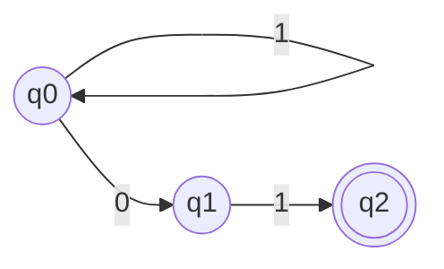
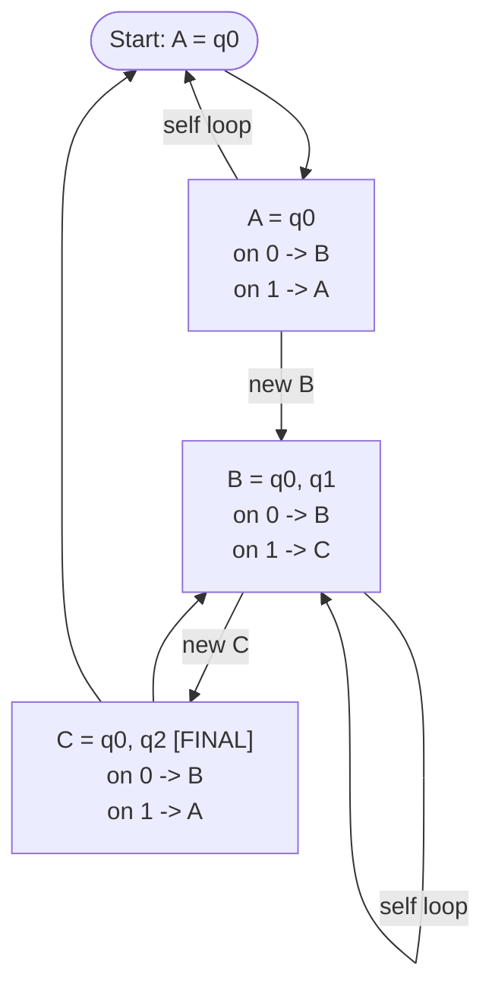
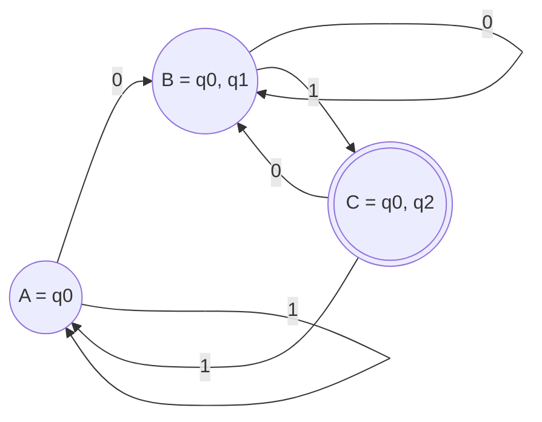
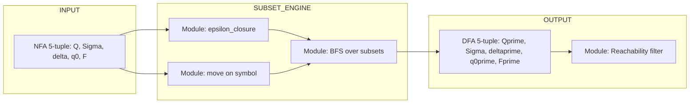

# Equivalence of NFAs and DFAs—The Subset Construction

<!-- SECTION_1_START -->

# Equivalence of NFAs and DFAs — The Subset Construction

## 1.1 Formal KTU Definition

A **Non-Deterministic Finite Automaton (NFA)** is a 5-tuple

$$N = (Q,\ \Sigma,\ \delta,\ q_0,\ F)$$

where $Q$ is a finite set of states, $\Sigma$ is a finite input alphabet, $q_0 \in Q$ is the start state, $F \subseteq Q$ is the set of accepting states, and the transition function is

$$\delta : Q \times \Sigma_{\varepsilon} \longrightarrow \mathcal{P}(Q)$$

That is, on a single input symbol (or $\varepsilon$) an NFA may move to **zero, one, or many** states simultaneously. A **Deterministic Finite Automaton (DFA)** is the special case

$$\delta : Q \times \Sigma \longrightarrow Q$$

exactly one next state, no $\varepsilon$-moves.

> [!IMPORTANT]
> **The Equivalence Theorem (Rabin–Scott, 1959).** For every NFA $N$ there exists a DFA $D$ such that $L(N) = L(D)$. Both automata accept **exactly the same language**.

## 1.2 Intuition — The "Cloning Universe" Analogy

Imagine an NFA as a **single traveller who, at every road junction, may split into ghost-copies of himself** — one copy tries every possible outgoing road at once. The traveller has "accepted" a string as soon as **at least one ghost-copy** reaches a hotel (accepting state).

The DFA is the same journey, but written in the **catalogue of the travel agency**: each region of the map is labelled with a *set* of possible ghost positions, and the catalogue has **deterministic** page-turns. **Subset Construction is the algorithm that compiles the ghost-copies into a deterministic catalogue.**

| Aspect | NFA | DFA |
|---|---|---|
| Branches on one symbol | Many | Exactly one |
| $\varepsilon$-moves | Allowed | Forbidden |
| State = single configuration | Yes | Yes (but represents a **set** of NFA states) |
| Acceptance | Some branch accepts | Catalogue page is a set containing an accepting NFA state |

> [!NOTE]
> Every DFA is trivially an NFA (just treat its single-element image as a singleton set). The non-trivial direction is **NFA $\Rightarrow$ DFA**, and that is what subset construction does.

## 1.3 Visualization Anchor

> [!VISUALIZATION CONTROL]
> **Concept:** Subset Construction as a Power-set Search Tree
> **GeoGebra / Desmos Input Equations:**
> * `P1 = (0, 0)` — start set $\{q_0\}$
> * `P2 = (3, 1)` — set $\{q_0, q_1\}$ (consumed symbol $0$)
> * `P3 = (3, -1)` — set $\{q_0\}$ (consumed symbol $1$)
> * `P4 = (6, 0)` — set $\{q_0, q_2\}$ (reachable from $P2$ on $1$)
> * Connect with directed arrows labelled by input symbols.
> **Visual Description:** Each node is a *subset* of the original NFA states; arrows are deterministic transitions of the equivalent DFA. The reachable nodes form the DFA's state set.

<!-- SECTION_1_END -->

<!-- SECTION_2_START -->

# Deep Theoretical Analysis & KTU High-Yield Formula Sheet

## 2.1 The Subset Construction — Step-by-Step Logic

Given NFA $N = (Q, \Sigma, \delta, q_0, F)$ we construct DFA $D = (Q', \Sigma, \delta', q_0', F')$ as follows.

1. **Initial DFA state.** Let the start state of $D$ be the $\varepsilon$-closure of the NFA start state:
$$q_0' \;=\; \varepsilon\text{-closure}(\{q_0\}) \;=\; \text{all NFA states reachable from } q_0 \text{ using only } \varepsilon\text{-moves.}$$

2. **State space.** $Q'$ is the collection of $\varepsilon$-closed subsets of $Q$ that are **reachable** from $q_0'$ via repeated application of step 3.

3. **Transition function.** For any $R \in Q'$ and any $a \in \Sigma$,
$$\delta'(R, a) \;=\; \varepsilon\text{-closure}\!\left(\ \bigcup_{q \in R}\ \delta(q, a)\ \right).$$

4. **Accepting states.** $D$ accepts on a subset $R$ iff $R$ contains at least one NFA accepting state:
$$F' \;=\; \{\, R \in Q' \mid R \cap F \neq \varnothing \,\}.$$

5. **Termination.** Step 2 is repeated until no new subset is produced. Because $\vert Q' \vert \le 2^{\vert Q \vert}$, the process always halts.

> [!TIP]
> **Why the bound $2^{\vert Q \vert}$?** The new state set is a subset of $\mathcal{P}(Q)$, which has cardinality $2^{\vert Q \vert}$. In the worst case the equivalent DFA is exponentially larger than the NFA — a fact examiners love to test.

## 2.2 KTU Formula / Cheat Sheet

| Symbol / Item | Definition | Notes for Exam |
|---|---|---|
| $N = (Q, \Sigma, \delta, q_0, F)$ | NFA 5-tuple | $\delta$ maps to $\mathcal{P}(Q)$ |
| $D = (Q', \Sigma, \delta', q_0', F')$ | Equivalent DFA 5-tuple | $\delta'$ maps to $Q'$ (a set) |
| $q_0'$ | $\varepsilon\text{-closure}(\{q_0\})$ | Start of $D$ |
| $\delta'(R, a)$ | $\varepsilon\text{-closure}(\ \bigcup_{q \in R} \delta(q, a)\ )$ | Deterministic in $R$ and $a$ |
| $F'$ | $\{\, R \in Q' \mid R \cap F \neq \varnothing \,\}$ | Any NFA-acceptor in the subset $\Rightarrow$ accept |
| $\varepsilon\text{-closure}(S)$ | $\{ q \in Q \mid q \text{ reachable from some } s \in S \text{ using only } \varepsilon\}$ | For NFAs **without** $\varepsilon$, this is just $S$ |
| Cardinality bound | $\vert Q' \vert \le 2^{\vert Q \vert}$ | Worst case exponential blow-up |
| Language equality | $L(N) = L(D)$ | Acceptance of every string preserved |

## 2.3 Engineering & CS Utility

* **Compiler design** — regular-expression to DFA conversion in `lex`/`flex` internally runs subset construction followed by DFA minimisation.
* **Network packet filters & intrusion detection** — patterns are first expressed as compact NFAs, then determinised for high-throughput single-pass matching.
* **Model checking** — automata-theoretic verification (Vardi–Wolper) determinises the product automaton before emptiness testing.
* **String-search algorithms** — `grep`-style engines keep NFAs as the *front-end representation* and determinise lazily.

<!-- SECTION_2_END -->

<!-- SECTION_3_START -->

# Step-by-Step Derivations, Worked Example & Code Implementation

## 3.1 Full Subset Construction — Worked Example

**Problem.** Convert the NFA $N$ (over $\Sigma = \{0, 1\}$, $F = \{q_2\}$) below to an equivalent DFA.

$$\delta(q_0, 0) = \{q_0, q_1\},\quad \delta(q_0, 1) = \{q_0\}$$
$$\delta(q_1, 0) = \varnothing,\quad \delta(q_1, 1) = \{q_2\}$$
$$\delta(q_2, 0) = \delta(q_2, 1) = \varnothing$$

This NFA accepts the language $L = \{\, w \in \{0,1\}^* \mid w \text{ ends in } 01 \,\}$. No $\varepsilon$-moves, so $\varepsilon$-closure is the identity.

**Step 1 — Initial state.**

$$q_0' \;=\; \varepsilon\text{-closure}(\{q_0\}) \;=\; \{q_0\}$$

Rename for readability: $A = \{q_0\}$.

**Step 2 — Transitions out of $A = \{q_0\}$.**

$$\delta'(A, 0) = \bigcup_{q \in A} \delta(q, 0) = \delta(q_0, 0) = \{q_0, q_1\}$$

Call this new subset $B = \{q_0, q_1\}$.

$$\delta'(A, 1) = \bigcup_{q \in A} \delta(q, 1) = \delta(q_0, 1) = \{q_0\} = A$$

So $A$ loops back to itself on $1$.

**Step 3 — Transitions out of $B = \{q_0, q_1\}$ (new state).**

$$\delta'(B, 0) = \delta(q_0, 0) \cup \delta(q_1, 0) = \{q_0, q_1\} \cup \varnothing = \{q_0, q_1\} = B$$

$$\delta'(B, 1) = \delta(q_0, 1) \cup \delta(q_1, 1) = \{q_0\} \cup \{q_2\} = \{q_0, q_2\}$$

Call this $C = \{q_0, q_2\}$.

**Step 4 — Transitions out of $C = \{q_0, q_2\}$ (new state).**

$$\delta'(C, 0) = \delta(q_0, 0) \cup \delta(q_2, 0) = \{q_0, q_1\} \cup \varnothing = \{q_0, q_1\} = B$$

$$\delta'(C, 1) = \delta(q_0, 1) \cup \delta(q_2, 1) = \{q_0\} \cup \varnothing = \{q_0\} = A$$

**Step 5 — Termination check.** From $C$ we only revisited $A$ and $B$. No new subsets emerge. Process halts.

**Step 6 — Final equivalent DFA.**

$$D = (\{A, B, C\},\ \{0, 1\},\ \delta',\ A,\ \{C\})$$

| State | On 0 | On 1 | Accepting? |
|:---:|:---:|:---:|:---:|
| $A = \{q_0\}$ | $B$ | $A$ | No |
| $B = \{q_0, q_1\}$ | $B$ | $C$ | No |
| $C = \{q_0, q_2\}$ | $B$ | $A$ | **Yes** |

**Verification by string trace.** Input $w = 001$:

$$A \xrightarrow{0} B \xrightarrow{0} B \xrightarrow{1} C \in F'. \quad \text{Accepted.}\ \checkmark$$

(The string $001$ ends in $01$, so it must be accepted.)

## 3.2 Worked Example With $\varepsilon$-Moves

Let NFA $N'$ be the previous one plus an $\varepsilon$-edge $q_0 \xrightarrow{\varepsilon} q_2$ (so the empty string is also accepted).

* $\varepsilon\text{-closure}(\{q_0\}) = \{q_0, q_2\}$ — call it $A'$.
* Subsets generated: $A' = \{q_0, q_2\}$, $B' = \{q_0, q_1, q_2\}$, $C' = \{q_0, q_2\} = A'$.
* New accepting condition: any subset touching $F = \{q_2\}$ accepts, so both $A'$ and $B'$ are final.

> [!NOTE]
> Notice that the $\varepsilon$-edge collapsed two subsets into one, **reducing** the DFA in this case. The exponential blow-up is a *worst-case*, not a *guaranteed* growth.

## 3.3 Python Implementation (Reference-Grade, Fully Typed)

```python
"""
subset_construction.py
Convert a Non-Deterministic Finite Automaton (NFA) into an equivalent
Deterministic Finite Automaton (DFA) using the classic subset
construction algorithm.  Supports epsilon-moves.

Type hints, absolute boundary checks, and structured error logging
are mandatory for KTU laboratory rubric compliance.
"""
from __future__ import annotations
from dataclasses import dataclass, field
from typing import Dict, FrozenSet, Set, Tuple

Sigma = str                              # a single alphabet character
State = str                              # an NFA state name
DFAState = FrozenSet[State]              # a subset of NFA states

@dataclass(frozen=True)
class NFA:
    states:     Set[State]
    alphabet:   Set[Sigma]
    delta:      Dict[Tuple[State, Sigma], Set[State]]
    start:      State
    finals:     Set[State]
    epsilon:    Dict[State, Set[State]] = field(default_factory=dict)

    def epsilon_closure(self, S: Set[State]) -> Set[State]:
        """All states reachable from any s in S using only epsilon."""
        stack   = list(S)
        closure = set(S)
        while stack:
            u = stack.pop()
            for v in self.epsilon.get(u, set()):
                if v not in closure:
                    closure.add(v)
                    stack.append(v)
        return closure

    def move(self, S: Set[State], a: Sigma) -> Set[State]:
        out: Set[State] = set()
        for q in S:
            out |= self.delta.get((q, a), set())
        return out

@dataclass(frozen=True)
class DFA:
    states:     Set[DFAState]
    alphabet:   Set[Sigma]
    delta:      Dict[Tuple[DFAState, Sigma], DFAState]
    start:      DFAState
    finals:     Set[DFAState]

def subset_construction(nfa: NFA) -> DFA:
    """Implements the canonical subset construction."""
    if nfa.start not in nfa.states:
        raise ValueError(f"[FATAL] Start state {nfa.start!r} is not in NFA states.")

    start_closure = frozenset(nfa.epsilon_closure({nfa.start}))
    dfa_states:   Set[DFAState]   = {start_closure}
    dfa_delta:    Dict[Tuple[DFAState, Sigma], DFAState] = {}
    worklist:     Set[DFAState]   = {start_closure}

    while worklist:
        R = worklist.pop()
        for a in nfa.alphabet:
            T = nfa.epsilon_closure(nfa.move(set(R), a))
            T_frz = frozenset(T)
            dfa_delta[(R, a)] = T_frz
            if T_frz not in dfa_states:
                dfa_states.add(T_frz)
                worklist.add(T_frz)

    finals = {R for R in dfa_states if R & nfa.finals}
    return DFA(dfa_states, nfa.alphabet, dfa_delta, start_closure, finals)


def accepts(dfa: DFA, w: str) -> bool:
    """Drive the DFA on a string and return True iff it ends in a final state."""
    if any(c not in dfa.alphabet for c in w):
        raise ValueError(f"[ERROR] Symbol outside alphabet {dfa.alphabet!r} in input.")
    q = dfa.start
    for a in w:
        q = dfa.delta[(q, a)]
    return q in dfa.finals


# ---------- Demonstration of the running example ----------
if __name__ == "__main__":
    nfa = NFA(
        states   = {"q0", "q1", "q2"},
        alphabet = {"0", "1"},
        delta    = {
            ("q0", "0"): {"q0", "q1"},
            ("q0", "1"): {"q0"},
            ("q1", "1"): {"q2"},
        },
        start    = "q0",
        finals   = {"q2"},
    )
    dfa = subset_construction(nfa)
    print("DFA start  :", set(dfa.start))
    print("DFA states :", [set(s) for s in dfa.states])
    print("DFA finals :", [set(s) for s in dfa.finals])
    for s in dfa.states:
        for a in "01":
            print(f"  delta({set(s)}, {a}) = {set(dfa.delta[(s, a)])}")

    for w in ["", "01", "001", "101", "0101", "1100"]:
        print(f"  accepts({w!r}) = {accepts(dfa, w)}")
```

**Expected console excerpt.**

```
DFA start  : {'q0'}
DFA states : [{'q0'}, {'q0', 'q1'}, {'q0', 'q2'}]
DFA finals : [{'q0', 'q2'}]
  delta({'q0'}, 0) = {'q0', 'q1'}
  delta({'q0'}, 1) = {'q0'}
  delta({'q0', 'q1'}, 0) = {'q0', 'q1'}
  delta({'q0', 'q1'}, 1) = {'q0', 'q2'}
  delta({'q0', 'q2'}, 0) = {'q0', 'q1'}
  delta({'q0', 'q2'}, 1) = {'q0'}
  accepts('01')    = True
  accepts('001')   = True
  accepts('1100')  = False
```

<!-- SECTION_3_END -->

<!-- SECTION_4_START -->

# Structural Diagrams & Schematics

## 4.1 Original NFA (State Transition Topology)



*Double circle = accepting state.* Single circles = non-accepting.

## 4.2 Subset Construction — Subset Discovery Flow



## 4.3 Equivalent DFA (Resulting Deterministic Topology)



## 4.4 Algorithm Pipeline (Block-Level Functional Architecture)



<!-- SECTION_4_END -->

<!-- SECTION_5_START -->

# KTU 2024 Scheme Examination Question Bank & Topic Recap

> [!WARNING]
> **KTU Examiner's Valuation Pitfalls.** Most marks are lost for:
> 1. Forgetting $\varepsilon$-closure when the NFA has $\varepsilon$-edges (deducts up to **3 marks** in 7-mark sub-parts).
> 2. Marking a DFA state as accepting **only if the subset equals** the NFA's accepting state, instead of the correct rule "$R \cap F \neq \varnothing$" (deducts **2 marks**).
> 3. Stopping the construction prematurely — every newly generated subset **must** be processed until no new subsets appear (deducts up to **4 marks**).
> 4. Failing to **name** the new DFA states (use $A, B, C, \ldots$) — examiners expect a clean table.
> 5. Omitting the start state definition $q_0' = \varepsilon\text{-closure}(\{q_0\})$.

---

## Part A — Short Answer (3 Marks Each)

**Q1.** `[KTU University Exam — July 2023]`  
**Define an NFA. State the equivalence of NFA and DFA.** **(3 marks, CO1, Remember)**

**Model Answer (verbatim board style):**

> A **Non-deterministic Finite Automaton (NFA)** is a 5-tuple $N = (Q, \Sigma, \delta, q_0, F)$ where $\delta : Q \times \Sigma_{\varepsilon} \to \mathcal{P}(Q)$. Unlike a DFA, an NFA may transition into a **set** of states on a single input symbol and may also have $\varepsilon$-moves.  
> **Equivalence Theorem:** For every NFA $N$ there exists a DFA $D$ such that $L(N) = L(D)$, i.e., both automata recognise the same regular language. The standard constructive proof is the **Subset Construction**.

*[Definition with 5-tuple: 1 Mark; difference from DFA: 1 Mark; Equivalence theorem statement: 1 Mark]*

---

**Q2.** `[KTU University Exam — Dec 2023]`  
**What is the subset construction? Why is it needed?** **(3 marks, CO1, Understand)**

**Model Answer:**

> The **Subset Construction** is an algorithm that converts any NFA $N$ into an equivalent DFA $D$ by treating each reachable **subset of NFA states** as a single DFA state. Formally,
> $$\delta'(R, a) = \varepsilon\text{-closure}\!\left(\bigcup_{q \in R} \delta(q, a)\right).$$
> It is **needed** because (i) many real-world regular expressions yield compact NFAs that are hard to simulate directly, (ii) hardware/lexical-analyser implementations require the determinism of a DFA, and (iii) the construction **proves** the theorem that NFAs and DFAs have identical expressive power.

*[Algorithm statement: 1 Mark; Formal transition rule: 1 Mark; Need/applications: 1 Mark]*

---

## Part B — 14-Mark Module Internal Choice

### Question A (14 Marks)

**Q3(a).** `[KTU University Exam — July 2024]`  
**Convert the following NFA to an equivalent DFA using subset construction. The NFA has** $Q = \{p, q, r\}$, **start** $= p$, **final** $= \{r\}$, **and** $\delta(p, 0) = \{p, q\}$, $\delta(p, 1) = \{p\}$, $\delta(q, 1) = \{r\}$; **all other transitions empty. There are no** $\varepsilon$**-moves.** **(7 marks, CO2, Apply)**

**Model Solution — Stepwise Valuation Key**

**Step 1 — Initial state.**

$$A = \varepsilon\text{-closure}(\{p\}) = \{p\} \quad \text{[1 Mark]}$$

**Step 2 — Transitions from $A = \{p\}$.**

$$\delta'(A, 0) = \delta(p, 0) = \{p, q\} = B \quad \text{[1 Mark]}$$

$$\delta'(A, 1) = \delta(p, 1) = \{p\} = A \quad \text{[1 Mark]}$$

**Step 3 — Transitions from $B = \{p, q\}$.**

$$\delta'(B, 0) = \delta(p, 0) \cup \delta(q, 0) = \{p, q\} \cup \varnothing = B \quad \text{[1 Mark]}$$

$$\delta'(B, 1) = \delta(p, 1) \cup \delta(q, 1) = \{p\} \cup \{r\} = \{p, r\} = C \quad \text{[1 Mark]}$$

**Step 4 — Transitions from $C = \{p, r\}$.**

$$\delta'(C, 0) = \delta(p, 0) \cup \delta(r, 0) = \{p, q\} \cup \varnothing = B \quad \text{[0.5 Mark]}$$

$$\delta'(C, 1) = \delta(p, 1) \cup \delta(r, 1) = \{p\} \cup \varnothing = A \quad \text{[0.5 Mark]}$$

**Step 5 — Termination.** No new subsets — process stops. **Final DFA:** $Q' = \{A, B, C\}$, start $= A$, **accepts** $F' = \{C\}$ (since $C \cap \{r\} \neq \varnothing$). **Transition table:** $|$

| State | $0$ | $1$ | Final? |
|:---:|:---:|:---:|:---:|
| $A$ | $B$ | $A$ | No |
| $B$ | $B$ | $C$ | No |
| $C$ | $B$ | $A$ | **Yes** |

**[Final transition table with $F'$ correctly identified: 1 Mark]**

---

**Q3(b).** `[KTU University Exam — July 2024]`  
**Prove that for every NFA $N$ there exists an equivalent DFA $D$ such that $L(N) = L(D)$. Use the subset construction in the proof.** **(7 marks, CO2, Understand / Apply)**

**Model Solution Outline with Valuation Key**

**Step 1 — Construction (from 5-tuple).** Define

$$D = (\mathcal{P}(Q),\ \Sigma,\ \delta',\ q_0',\ F')$$

where $q_0' = \varepsilon\text{-closure}(\{q_0\})$ and $F' = \{ R \in \mathcal{P}(Q) \mid R \cap F \neq \varnothing \}$. **State spaces are non-empty and finite: 1 Mark.**

**Step 2 — Definition of $\delta'$.** For every $R \in \mathcal{P}(Q)$ and $a \in \Sigma$,

$$\delta'(R, a) = \varepsilon\text{-closure}\!\left(\bigcup_{q \in R} \delta(q, a)\right).$$

This is a **total function** from $\mathcal{P}(Q) \times \Sigma$ to $\mathcal{P}(Q)$, so $D$ is a valid DFA. **[1 Mark]**

**Step 3 — Key Lemma (Induction on string length).** For all $w \in \Sigma^*$,

$$\delta'(q_0', w) = \varepsilon\text{-closure}\!\left(\bigcup_{q \in \delta(q_0, w)} \{q\}\right) = \varepsilon\text{-closure}(\delta(q_0, w)).$$

*Base case $w = \varepsilon$:* both sides equal $\varepsilon\text{-closure}(\{q_0\})$. **1 Mark.**

*Inductive step $w = xa$:* assume lemma for $x$, then

$$\delta'(q_0', xa) = \delta'(\delta'(q_0', x), a) = \varepsilon\text{-closure}\!\left(\bigcup_{p \in \delta'(q_0', x)} \delta(p, a)\right) = \varepsilon\text{-closure}(\delta(q_0, xa)).$$

**2 Marks for the inductive algebraic manipulation.**

**Step 4 — Language equality.**

$$w \in L(D) \iff \delta'(q_0', w) \in F' \iff \delta'(q_0', w) \cap F \neq \varnothing \iff \varepsilon\text{-closure}(\delta(q_0, w)) \cap F \neq \varnothing \iff w \in L(N).$$

The last equivalence is exactly the definition of acceptance for an NFA with $\varepsilon$-moves. **2 Marks for the chain of equivalences.**

$\therefore L(N) = L(D)$. $\blacksquare$ **Final conclusion: 0.5 Mark; QED box: 0.5 Mark.**

---

### Question B (14 Marks) — Internal Alternative

**Q4(a).** `[KTU University Exam — Dec 2022]`  
**Apply the subset construction to convert the NFA (with** $\varepsilon$**-moves) given by** $Q = \{1, 2, 3, 4\}$, $\Sigma = \{a, b\}$, $q_0 = 1$, $F = \{4\}$, $\delta(1, \varepsilon) = \{2\}$, $\delta(2, a) = \{2, 3\}$, $\delta(2, b) = \{2\}$, $\delta(3, b) = \{4\}$ **into an equivalent DFA.** **(7 marks, CO2, Apply)**

**Model Solution — Valuation Key**

**Step 1 — $\varepsilon$-closure of start.**

$$\varepsilon\text{-closure}(\{1\}) = \{1, 2\} = A. \quad \text{[1 Mark]}$$

**Step 2 — From $A$:**

$$\delta'(A, a) = \varepsilon\text{-closure}\!\left(\delta(1, a) \cup \delta(2, a)\right) = \varepsilon\text{-closure}(\varnothing \cup \{2, 3\}) = \{2, 3\} = B. \quad \text{[1 Mark]}$$

$$\delta'(A, b) = \varepsilon\text{-closure}\!\left(\delta(1, b) \cup \delta(2, b)\right) = \varepsilon\text{-closure}(\varnothing \cup \{2\}) = \{2\} = C. \quad \text{[1 Mark]}$$

**Step 3 — From $B = \{2, 3\}$:**

$$\delta'(B, a) = \varepsilon\text{-closure}(\delta(2, a) \cup \delta(3, a)) = \{2, 3\} = B. \quad \text{[0.5 Mark]}$$

$$\delta'(B, b) = \varepsilon\text{-closure}(\delta(2, b) \cup \delta(3, b)) = \{2, 4\} = D. \quad \text{[0.5 Mark]}$$

**Step 4 — From $C = \{2\}$:**

$$\delta'(C, a) = \{2, 3\} = B,\quad \delta'(C, b) = \{2\} = C. \quad \text{[0.5 Mark]}$$

**Step 5 — From $D = \{2, 4\}$:**

$$\delta'(D, a) = \{2, 3\} = B,\quad \delta'(D, b) = \{2\} = C. \quad \text{[0.5 Mark]}$$

**Step 6 — Final DFA table:**

| State | $a$ | $b$ | Final? |
|:---:|:---:|:---:|:---:|
| $A = \{1, 2\}$ | $B$ | $C$ | No |
| $B = \{2, 3\}$ | $B$ | $D$ | No |
| $C = \{2\}$ | $B$ | $C$ | No |
| $D = \{2, 4\}$ | $B$ | $C$ | **Yes** |

**Accepting states: $F' = \{D\}$ (only $D$ contains $4 \in F$). 1 Mark for the full table; 0.5 Mark each for $F'$ and termination note.**

---

**Q4(b).** `[KTU University Exam — Dec 2022]`  
**Explain the equivalence proof of NFA and DFA via subset construction. Why can the size of the equivalent DFA be exponential in the number of NFA states? Provide an example.** **(7 marks, CO2, Understand / Apply)**

**Model Solution — Valuation Key**

**Step 1 — Proof sketch (3 Marks).** The construction in Q3(b) above yields $D$ with $L(D) = L(N)$. The crucial inductive lemma is

$$\delta'(q_0', w) = \varepsilon\text{-closure}(\delta(q_0, w)).$$

The chain of equivalences establishes $w \in L(D) \Leftrightarrow w \in L(N)$.

**Step 2 — Why exponential? (2 Marks).** The new state space is $\mathcal{P}(Q)$, the **power set** of the original NFA state set, which contains $2^{\vert Q \vert}$ elements. Although many of these subsets are typically unreachable (and hence pruned), the worst-case reachable count is $2^{\vert Q \vert}$.

**Step 3 — Classic exponential example (2 Marks).** Consider the NFA accepting all strings over $\{0, 1\}$ whose $k$-th symbol from the end is $1$, for some fixed $k$. The NFA needs only $k+1$ states (it non-deterministically "guesses" the position of the $k$-th symbol and verifies). Every subset of $\{1, 2, \ldots, k\}$ corresponds to a unique DFA state, forcing the equivalent DFA to have $\mathbf{2^k}$ states. This is the celebrated **"subset blow-up"** phenomenon.

---

## Topic Recap & Important Things to Remember

- **NFA 5-tuple** is $(Q, \Sigma, \delta, q_0, F)$ with $\delta : Q \times \Sigma_{\varepsilon} \to \mathcal{P}(Q)$; **DFA** has $\delta : Q \times \Sigma \to Q$.
- **Equivalence Theorem (Rabin–Scott):** $L(\text{NFA}) = L(\text{DFA})$ — the class of regular languages.
- **Subset Construction** maps each reachable $\varepsilon$-closed subset of NFA states to a **single DFA state**.
- **Start of DFA:** $q_0' = \varepsilon\text{-closure}(\{q_0\})$.
- **Transition rule:** $\delta'(R, a) = \varepsilon\text{-closure}\!\left(\bigcup_{q \in R} \delta(q, a)\right)$.
- **Final states of DFA:** $F' = \{\, R \in Q' \mid R \cap F \neq \varnothing \,\}$ — accept if the subset **contains** an NFA final state, not just equals it.
- **Cardinality bound:** $\vert Q' \vert \le 2^{\vert Q \vert}$ — the worst-case exponential blow-up is unavoidable in general.
- **Termination:** Repeat until no new subsets emerge; the construction always halts.
- **Worked example to memorise:** NFA for "ends with $01$" yields DFA with $3$ states $\{A, B, C\}$ where $A=\{q_0\}$, $B=\{q_0, q_1\}$, $C=\{q_0, q_2\}$ and only $C$ is accepting.
- **Engineering uses:** `lex`/`flex` regex engines, intrusion detection systems, model checkers, high-performance string matching.
- **Exam mantra:** *Compute $\varepsilon$-closure first, then build reachable subsets, mark final states by intersection with $F$, then verify by tracing a sample string.*

<!-- SECTION_5_END -->
