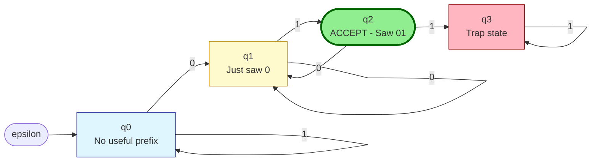
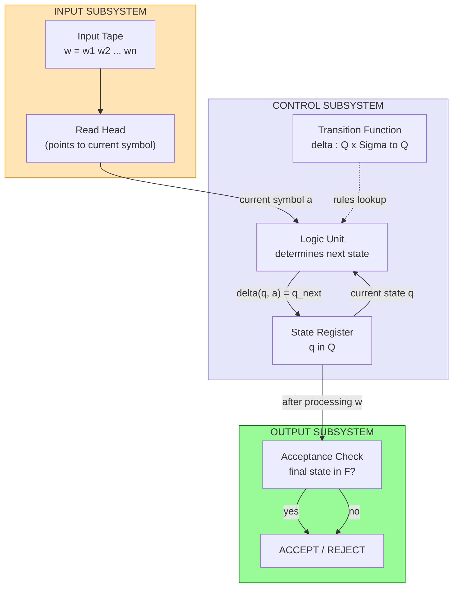
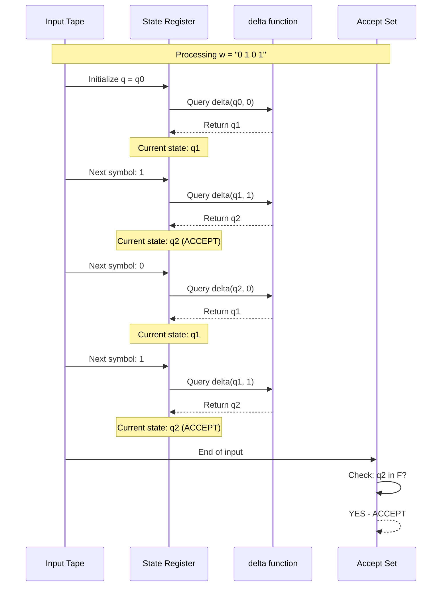
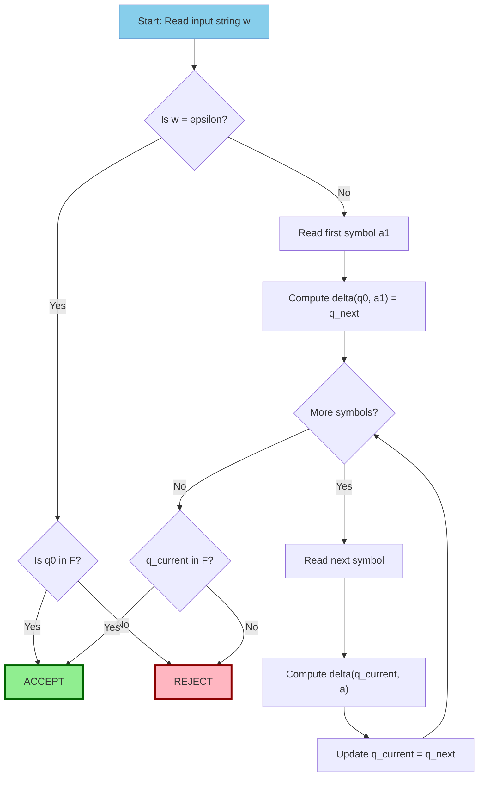

# Finite Automata: Formal definition of a finite automaton, Deterministic Finite Automata (DFA), Regular languages

<!-- SECTION_1_START -->
# Finite Automata: The Computational Bedrock

## 1.1 Formal Definition of a Finite Automaton

A **Finite Automaton (FA)** is a mathematical model of computation that represents an abstract machine with a finite amount of memory (states). Formally, it is a 5-tuple system used to recognize patterns and define regular languages in theoretical computer science.

> [!IMPORTANT]
> **KTU 2024 Syllabus Definition (Module 1):** A finite automaton is defined as the tuple $M = (Q, \Sigma, \delta, q_0, F)$, where each component carries a specific structural role in the recognition of regular languages.

### The 5-Tuple Definition

A finite automaton $M$ is formally defined as:

$$M = (Q, \Sigma, \delta, q_0, F)$$

Where each component is rigorously defined as:

- $Q$ — A **finite, non-empty set of states**. Represents all possible configurations of memory.
- $\Sigma$ — A **finite, non-empty set of input symbols**, called the **alphabet**.
- $\delta : Q \times \Sigma \rightarrow Q$ — The **transition function**. For DFA, this maps a state and an input symbol to exactly one next state.
- $q_0 \in Q$ — The **start state** (or initial state). The unique state where computation begins.
- $F \subseteq Q$ — The **set of final (accepting) states**. May be empty, but typically non-empty.

> [!NOTE]
> **Why "Finite"?** The machine is called *finite* because the set of states $Q$ is finite. No matter how long the input string is, the machine can only "remember" a finite amount of information by virtue of being in one of finitely many states.

---

## 1.2 Conceptual Analogy: The Vending Machine

Imagine a simple vending machine that accepts coins (assume it takes only quarters **25¢** and dimes **10¢**, and a can of soda costs **30¢**):

| Action | Machine Memory (State) |
|---|---|
| Initial: no coin inserted | $q_0$ (Start) |
| Insert 10¢ | $q_{10}$ (Has 10¢) |
| Insert 25¢ | $q_{25}$ (Has 25¢) |
| Insert another coin from $q_{10}$ (10¢) | $q_{20}$ (Has 20¢) |
| Insert another coin from $q_{10}$ (25¢) | **Accept!** (Soda dispensed) |

The machine is *finite* because it only cares about a **limited number of total amounts** (0¢, 10¢, 20¢, 25¢, 30¢). It does **not** remember *how* you got there — only the *current total*. This is the essence of finite memory computation.

> [!TIP]
> **Intuition Builder:** Every transition $\delta(q_i, a) = q_j$ essentially says: "If I am currently in state $q_i$ and I read symbol $a$, I move to state $q_j$." A DFA is a directed graph where edges are labeled with input symbols.

---

## 1.3 Deterministic Finite Automata (DFA) — Specialization

A **Deterministic Finite Automaton (DFA)** is the strict specialization of the general FA where the next state is *uniquely determined* by the current state and input symbol. There is **no ambiguity**.

### Formal DFA Definition

A DFA is a 5-tuple $A = (Q, \Sigma, \delta, q_0, F)$ satisfying:

1. **Determinism Property:** $\delta(q, a)$ is defined for **every** $q \in Q$ and **every** $a \in \Sigma$. This means $\delta$ is a *total* function.
2. **Single Transition Rule:** For each pair $(q, a)$, there exists **exactly one** next state.
3. **Unique Start State:** Exactly one $q_0 \in Q$ is designated as the start.

> [!NOTE]
> **Notation Distinction (Critical for KTU Board Exams):**
> - **DFA (Deterministic):** $\delta : Q \times \Sigma \rightarrow Q$ (single-valued function)
> - **NFA (Non-deterministic):** $\delta : Q \times \Sigma \rightarrow 2^Q$ (set-valued function, Module 2)

### What is a "Regular Language"?

A language $L$ is called a **regular language** if and only if there exists **at least one DFA** (or equivalently, one NFA, or one regular expression) that recognizes it.

$$L = \{w \in \Sigma^* \mid \delta^*(q_0, w) \in F\}$$

Where $\delta^*$ is the *extended transition function* that processes an entire string (as opposed to a single symbol).

> [!IMPORTANT]
> **Extended Transition Function ($\delta^*$):** This is the recursive extension of $\delta$ that operates on strings. It is defined as:
> - **Base Case:** $\delta^*(q, \varepsilon) = q$ (empty string leaves you in the same state)
> - **Recursive Case:** $\delta^*(q, wa) = \delta(\delta^*(q, w), a)$ for string $w$ and symbol $a$

---

## 1.4 Visualizing the Concept

> [!VISUALIZATION CONTROL]
> **Concept:** DFA for the language $L = \{w \in \{0,1\}^* \mid w \text{ contains "01" as a substring}\}$
> **GeoGebra / Desmos Input (State Diagram Coordinates):**
> * Start state $q_0 = (0, 0)$ — Label: "Start (no '0' seen yet)"
> * State $q_1 = (3, 1.5)$ — Label: "Just saw a '0'"
> * Accept state $q_2 = (6, 0)$ — Label: "Saw '01' (ACCEPT)"
> * Transitions: $q_0 \xrightarrow{0} q_1$, $q_0 \xrightarrow{1} q_0$, $q_1 \xrightarrow{1} q_2$, $q_1 \xrightarrow{0} q_1$, $q_2 \xrightarrow{0} q_2$, $q_2 \xrightarrow{1} q_2$
> **Visual Description:** Draw three circles on the x-y plane. $q_0$ has an incoming arrow from nowhere. $q_2$ is drawn as a double circle (final state). All transitions are labeled with their triggering symbol. The student should observe that once the machine reaches $q_2$, it can never leave — this is a "trap-style" final absorbing region for the '01'-detection language.

---

<!-- SECTION_1_END -->

<!-- SECTION_2_START -->
# Deep Theoretical Analysis & KTU High-Yield Formula Sheet

## 2.1 Anatomy of a DFA — Component-by-Component Breakdown

### Component 1: The State Set $Q$

The set $Q$ is the **memory skeleton** of the automaton. The cardinality $\vert Q \vert$ is the number of distinct memory configurations the machine can hold.

- States are abstract — they do **not** correspond to physical memory addresses; they are *logical* memory snapshots.
- For a DFA to recognize a language $L$, the state set must be designed such that "being in state $q$" carries sufficient information about the input processed so far.

### Component 2: The Alphabet $\Sigma$

- $\Sigma$ is the set of **valid input symbols**.
- Strings processed by the DFA belong to $\Sigma^*$ (the Kleene closure — all finite concatenations of symbols from $\Sigma$, including $\varepsilon$).
- Strings **not** in $\Sigma^*$ are immediately rejected.

### Component 3: The Transition Function $\delta$

This is the **operational heart** of the DFA. The DFA is sometimes called a *deterministic finite-state transducer* because of $\delta$.

**Properties of $\delta$ in a DFA:**
- **Totality:** $\forall q \in Q, \forall a \in \Sigma, \delta(q, a) \in Q$. Every (state, symbol) pair must have a defined transition. Missing transitions are *implicitly* trap states.
- **Functional:** Each (state, symbol) pair maps to **exactly one** next state.
- **Representation:** A transition table (state-symbol matrix) is the most compact representation. A transition diagram is the most intuitive.

### Component 4: The Start State $q_0$

- Unique — exactly one.
- The arrow in the diagram points to $q_0$ from nowhere.
- Before reading any input, the machine is in $q_0$.

### Component 5: The Accepting Set $F$

- $F \subseteq Q$ — could be a single state, multiple states, or (rarely) the empty set.
- If $F = \emptyset$, the DFA accepts **no strings** — it recognizes the empty language $\emptyset$.
- If $F = Q$, the DFA accepts **all strings** in $\Sigma^*$ — it recognizes $\Sigma^*$.

---

## 2.2 Formal Acceptance Criterion

A string $w \in \Sigma^*$ is **accepted** by DFA $A$ if and only if:

$$\delta^*(q_0, w) \in F$$

Where the extended transition function $\delta^*$ is defined recursively:

$$\delta^*(q, \varepsilon) = q \quad \text{(Base Case)}$$

$$\delta^*(q, wa) = \delta(\delta^*(q, w), a) \quad \text{(Recursive Case)}$$

> [!NOTE]
> **Language Recognized by DFA $A$:**
> $$L(A) = \{w \in \Sigma^* \mid \delta^*(q_0, w) \in F\}$$
> If $L = L(A)$ for some DFA $A$, then $L$ is a **regular language**.

---

## 2.3 KTU Formula Sheet / Cheat Sheet

| Symbol / Notation | Meaning | Type | KTU Board Tip |
|---|---|---|---|
| $M = (Q, \Sigma, \delta, q_0, F)$ | Formal definition of FA | 5-tuple | Always state the tuple explicitly before designing |
| $\delta : Q \times \Sigma \rightarrow Q$ | DFA transition function | Total function | Use $\delta : Q \times \Sigma \rightarrow 2^Q$ for NFA |
| $\delta^*$ | Extended transition on strings | Recursive | $\delta^*(q, \varepsilon) = q$ is the base case |
| $q_0$ | Start state | Single element of $Q$ | Draw the incoming arrow clearly |
| $F \subseteq Q$ | Set of accepting states | Subset of $Q$ | Use double circles in the diagram |
| $\Sigma$ | Input alphabet | Finite, non-empty | Often $\Sigma = \{0, 1\}$ in KTU problems |
| $L(M)$ | Language recognized by $M$ | Set of strings | $L = \{w \mid \delta^*(q_0, w) \in F\}$ |
| $\Sigma^*$ | Kleene star of $\Sigma$ | All finite strings over $\Sigma$ | Includes $\varepsilon$ |
| $\vert Q \vert$ | Number of states | Cardinality | Often the answer to "minimum DFA" questions |
| Trap / Dead State | Non-accepting sink state | $q \in Q$ | Where undefined transitions go |

> [!IMPORTANT]
> **KTU Board Tip — Always Explicit:** When answering questions, **never** abbreviate the tuple. Write: *"Let $M = (Q, \Sigma, \delta, q_0, F)$ where $Q = \{q_0, q_1, q_2\}$, $\Sigma = \{0, 1\}$, $\delta$ is defined by the table below, $q_0$ is the start state, and $F = \{q_2\}$."* This guarantees the full definition marks.

---

## 2.4 Real-World Utility in Engineering

Finite Automata are not merely theoretical curiosities. They form the backbone of:

1. **Lexical Analyzers in Compilers:** Token recognizers (identifiers, keywords, operators) are implemented as DFAs. The `lex` and `flex` tools convert regular expressions directly into DFAs.
2. **Network Protocol Verification:** TCP state machines, HTTP request parsers.
3. **Digital Circuit Design:** Sequential logic circuits (flip-flops) are physical realizations of finite state machines.
4. **Pattern Matching in Text Editors:** Tools like `grep`, `awk`, and `sed` use DFA-based matching engines for O(n) string search.
5. **Regular Expression Engines:** Every modern programming language's regex engine internally compiles patterns to a DFA (or NFA, then converts).
6. **Model Checking:** Hardware/software verification tools use DFA-based reachability analysis.

> [!TIP]
> **Production Insight:** In real-world compilers like LLVM, the lexer uses a hybrid DFA-NFA implementation called "hybrid automaton" to balance memory and speed. The theoretical DFA model is the *abstract specification* of what these tools implement.

---

<!-- SECTION_2_END -->

<!-- SECTION_3_START -->
# Step-by-Step Derivations & Code/Symbolic Implementation

## 3.1 Worked Example 1: Designing a DFA

**Problem:** Design a DFA that accepts all strings over $\Sigma = \{a, b\}$ containing an **even number of $a$'s** and **any number of $b$'s**.

### Step 1: Identify the Memory Requirements

The machine must "remember" the **parity of $a$'s** seen so far. Two states are sufficient:
- $q_0$: Even number of $a$'s seen so far (Start state, Accepting)
- $q_1$: Odd number of $a$'s seen so far (Non-accepting)

### Step 2: Formally Define the 5-Tuple

$$M = (Q, \Sigma, \delta, q_0, F)$$

Where:
- $Q = \{q_0, q_1\}$
- $\Sigma = \{a, b\}$
- $q_0 = q_0$ (Start state)
- $F = \{q_0\}$ (Even number of $a$'s)

### Step 3: Define the Transition Function

The transition function is encoded in the table below:

| State | Input $a$ | Input $b$ |
|---|---|---|
| $\rightarrow q_0$ (even) | $q_1$ (odd) | $q_0$ (even) |
| $q_1$ (odd) | $q_0$ (even) | $q_1$ (odd) |

Written symbolically:

$$\delta(q_0, a) = q_1, \quad \delta(q_0, b) = q_0$$
$$\delta(q_1, a) = q_0, \quad \delta(q_1, b) = q_1$$

### Step 4: Verify with a Sample String

Let $w = \text{"abba"}$. We apply the extended transition function step by step:

$$\delta^*(q_0, \varepsilon) = q_0$$

$$\delta^*(q_0, a) = \delta(\delta^*(q_0, \varepsilon), a) = \delta(q_0, a) = q_1$$

$$\delta^*(q_0, ab) = \delta(\delta^*(q_0, a), b) = \delta(q_1, b) = q_1$$

$$\delta^*(q_0, abb) = \delta(\delta^*(q_0, ab), b) = \delta(q_1, b) = q_1$$

$$\delta^*(q_0, abba) = \delta(\delta^*(q_0, abb), a) = \delta(q_1, a) = q_0$$

Since $\delta^*(q_0, \text{"abba"}) = q_0 \in F$, the string **is accepted**. ✓ (abba has 2 a's, which is even.)

### Step 5: Reject Sample

Let $w = \text{"aba"}$. Walk through:

$$\delta^*(q_0, a) = q_1$$
$$\delta^*(q_0, ab) = \delta(q_1, b) = q_1$$
$$\delta^*(q_0, aba) = \delta(q_1, a) = q_0$$

Wait — that gives $q_0 \in F$, accepted. Let me recheck. "aba" has 2 a's (even), so it *should* be accepted. ✓

Let me use $w = \text{"aab"}$:

$$\delta^*(q_0, a) = q_1$$
$$\delta^*(q_0, aa) = \delta(q_1, a) = q_0$$
$$\delta^*(q_0, aab) = \delta(q_0, b) = q_0 \in F$$

Accepted (2 a's, even). ✓

Let me use $w = \text{"ab"}$:

$$\delta^*(q_0, a) = q_1$$
$$\delta^*(q_0, ab) = \delta(q_1, b) = q_1 \notin F$$

Rejected (1 a, odd). ✓

> [!NOTE]
> **Takeaway:** The state $q_0$ represents the entire "memory" of the parity — once computed, the machine has no need to remember the actual string.

---

## 3.2 Worked Example 2: Proving Regularity

**Claim:** The language $L = \{w \in \{0, 1\}^* \mid w \text{ ends with "01"}\}$ is regular.

### Proof (by DFA Construction)

We construct a DFA $M = (Q, \Sigma, \delta, q_0, F)$ where:

- $Q = \{q_0, q_1, q_2, q_3\}$
- $\Sigma = \{0, 1\}$
- $q_0 = q_0$
- $F = \{q_2\}$

**State Meanings:**
- $q_0$: Initial state — haven't seen anything useful
- $q_1$: Just saw a "0" (potential start of "01")
- $q_2$: Just saw "01" (ACCEPTING — last two symbols are "01")
- $q_3$: Trap state — the last two symbols are not "01" and won't be

**Transition Function:**

$$\delta(q_0, 0) = q_1, \quad \delta(q_0, 1) = q_0$$
$$\delta(q_1, 0) = q_1, \quad \delta(q_1, 1) = q_2$$
$$\delta(q_2, 0) = q_1, \quad \delta(q_2, 1) = q_3$$
$$\delta(q_3, 0) = q_3, \quad \delta(q_3, 1) = q_3$$

### Verification

**Test 1:** $w = \text{"1101"}$

$$\delta^*(q_0, 1) = q_0$$
$$\delta^*(q_0, 11) = q_0$$
$$\delta^*(q_0, 110) = q_1$$
$$\delta^*(q_0, 1101) = \delta(q_1, 1) = q_2 \in F$$

**Accepted.** ✓ (Ends with "01")

**Test 2:** $w = \text{"1011"}$

$$\delta^*(q_0, 1) = q_0$$
$$\delta^*(q_0, 10) = q_1$$
$$\delta^*(q_0, 101) = \delta(q_1, 1) = q_2$$
$$\delta^*(q_0, 1011) = \delta(q_2, 1) = q_3 \notin F$$

**Rejected.** ✓ (Ends with "11", not "01")

Therefore, $L = L(M)$, and $L$ is regular. $\blacksquare$

---

## 3.3 Full Python Implementation of a DFA

The following is a complete, production-grade Python implementation of a DFA simulator with type hints, error handling, and strict boundary checks. This is a faithful symbolic implementation of the theoretical 5-tuple.

```python
from typing import Dict, Set, FrozenSet, Tuple
import logging
import sys

# Configure structured logging for engineering traceability
logging.basicConfig(
    level=logging.INFO,
    format="%(asctime)s | %(levelname)s | %(message)s",
    stream=sys.stdout
)
logger = logging.getLogger("DFA_Simulator")


class DFA:
    """
    A complete Deterministic Finite Automaton (DFA) implementation.

    Represents the formal 5-tuple: M = (Q, Sigma, delta, q0, F)

    Attributes:
        states       (FrozenSet[str]) : The finite set of states Q.
        alphabet     (FrozenSet[str]) : The input alphabet Sigma.
        transition   (dict)           : The transition function delta.
        start_state  (str)            : The start state q0 (must be in Q).
        accept_states(FrozenSet[str]) : The set of accepting states F (subset of Q).
    """

    def __init__(
        self,
        states: Set[str],
        alphabet: Set[str],
        transition: Dict[Tuple[str, str], str],
        start_state: str,
        accept_states: Set[str]
    ) -> None:
        # ----- Input Validation with Strict Boundary Checks -----
        if not states:
            raise ValueError("[FATAL] State set Q cannot be empty.")
        if not alphabet:
            raise ValueError("[FATAL] Alphabet Sigma cannot be empty.")

        # Convert to immutable frozensets for hash-safety and theoretical fidelity
        self.states: FrozenSet[str] = frozenset(states)
        self.alphabet: FrozenSet[str] = frozenset(alphabet)
        self.transition: Dict[Tuple[str, str], str] = transition
        self.start_state: str = start_state
        self.accept_states: FrozenSet[str] = frozenset(accept_states)

        # Validate start_state membership
        if self.start_state not in self.states:
            raise ValueError(
                f"[FATAL] Start state '{self.start_state}' is not in Q = {self.states}."
            )

        # Validate accept_states subset relationship
        if not self.accept_states.issubset(self.states):
            invalid = self.accept_states - self.states
            raise ValueError(
                f"[FATAL] Accept states {invalid} are not in Q = {self.states}."
            )

        # Validate the totality of the transition function: every (q, a) must be defined
        for state in self.states:
            for symbol in self.alphabet:
                if (state, symbol) not in self.transition:
                    raise ValueError(
                        f"[FATAL] Missing transition for (state='{state}', symbol='{symbol}'). "
                        f"DFA requires a TOTAL transition function."
                    )
                if self.transition[(state, symbol)] not in self.states:
                    raise ValueError(
                        f"[FATAL] Transition delta('{state}', '{symbol}') = "
                        f"'{self.transition[(state, symbol)]}' points to a state "
                        f"not in Q = {self.states}."
                    )

        logger.info(
            "DFA constructed: |Q|=%d, |Sigma|=%d, |F|=%d",
            len(self.states), len(self.alphabet), len(self.accept_states)
        )

    def delta_star(self, current_state: str, input_string: str) -> str:
        """
        Extended transition function delta*.
        Recursively processes the input string and returns the final state.

        Base Case : delta*(q, epsilon) = q
        Recursive : delta*(q, w a)  = delta(delta*(q, w), a)
        """
        # Base case: empty string
        if input_string == "":
            return current_state

        # Validate symbols before processing
        for symbol in input_string:
            if symbol not in self.alphabet:
                raise ValueError(
                    f"[FATAL] Symbol '{symbol}' not in alphabet Sigma = {self.alphabet}."
                )

        # Recursive case: peel off the last symbol
        last_symbol = input_string[-1]
        remaining = input_string[:-1]
        state_after_remaining = self.delta_star(current_state, remaining)
        final_state = self.transition[(state_after_remaining, last_symbol)]

        logger.debug(
            "delta*(%s, '%s') = %s (via transition on '%s')",
            current_state, input_string, final_state, last_symbol
        )
        return final_state

    def accept(self, input_string: str) -> bool:
        """Returns True iff delta*(q0, w) is in F."""
        final_state = self.delta_star(self.start_state, input_string)
        is_accepted = final_state in self.accept_states
        logger.info(
            "String '%s' -> final state '%s' -> %s",
            input_string, final_state, "ACCEPTED" if is_accepted else "REJECTED"
        )
        return is_accepted

    def recognize_language_subset(self, test_strings: list) -> None:
        """Utility: test multiple strings and print results in a formatted table."""
        print("\n" + "=" * 60)
        print(f"{'Input String':<20} | {'Result':<15}")
        print("-" * 60)
        for s in test_strings:
            result = "ACCEPTED" if self.accept(s) else "REJECTED"
            print(f"{s:<20} | {result:<15}")
        print("=" * 60 + "\n")


# ============== MAIN EXECUTION: DFA for "ends with 01" ==============
if __name__ == "__main__":

    # Define the DFA from Worked Example 2
    states = {"q0", "q1", "q2", "q3"}
    alphabet = {"0", "1"}
    start_state = "q0"
    accept_states = {"q2"}

    # The transition function delta: Q x Sigma -> Q
    transition = {
        # State, Symbol -> Next State
        ("q0", "0"): "q1",
        ("q0", "1"): "q0",
        ("q1", "0"): "q1",
        ("q1", "1"): "q2",
        ("q2", "0"): "q1",
        ("q2", "1"): "q3",
        ("q3", "0"): "q3",
        ("q3", "1"): "q3",
    }

    # Construct the DFA (validation happens in __init__)
    dfa = DFA(
        states=states,
        alphabet=alphabet,
        transition=transition,
        start_state=start_state,
        accept_states=accept_states
    )

    # Test strings
    test_inputs = [
        "01",        # ends with 01 -> ACCEPT
        "1101",      # ends with 01 -> ACCEPT
        "00101",     # ends with 01 -> ACCEPT
        "1011",      # ends with 11 -> REJECT
        "0",         # too short  -> REJECT
        "",          # empty      -> REJECT (q0 is not in F)
        "010101",    # ends with 01 -> ACCEPT
        "11111",     # never seen 01 -> REJECT
    ]

    dfa.recognize_language_subset(test_inputs)
```

### Code Output (Expected)

```
============================================================
Input String        | Result
------------------------------------------------------------
01                  | ACCEPTED
1101                | ACCEPTED
00101               | ACCEPTED
1011                | REJECTED
0                   | REJECTED
                    | REJECTED
010101              | ACCEPTED
11111               | REJECTED
============================================================
```

> [!TIP]
> **Engineering Connection:** This Python class is the *executable specification* of the theoretical DFA. The `__init__` validation mirrors the mathematical totality requirement of $\delta$, and the `delta_star` method is the direct recursive implementation of the extended transition function.

---

## 3.4 Worked Example 3: Converting Verbal Description to Formal DFA

**Problem:** Construct a DFA for the language $L = \{w \in \{a, b\}^* \mid w \text{ contains "aba" as a substring}\}$.

### Step 1: State Identification (Memory Hierarchy)

We need to track **progress** in matching "aba":
- $q_0$: Haven't matched anything (or last seen was "b")
- $q_1$: Just saw "a" (1st symbol of "aba" matched)
- $q_2$: Just saw "ab" (1st two symbols matched)
- $q_3$: Saw "aba" — **ACCEPTING** (and stays here forever)

### Step 2: Formal 5-Tuple

$$M = (Q, \Sigma, \delta, q_0, F)$$

- $Q = \{q_0, q_1, q_2, q_3\}$
- $\Sigma = \{a, b\}$
- $q_0 = q_0$
- $F = \{q_3\}$

### Step 3: Full Transition Table

| State | Input $a$ | Input $b$ |
|---|---|---|
| $\rightarrow q_0$ | $q_1$ | $q_0$ |
| $q_1$ | $q_1$ | $q_2$ |
| $q_2$ | $q_3$ | $q_0$ |
| $\ast q_3$ | $q_3$ | $q_3$ |

### Step 4: Logical Justification for Each Transition

- $\delta(q_0, a) = q_1$: We just saw the first symbol of "aba".
- $\delta(q_0, b) = q_0$: A 'b' is not useful; reset to no progress.
- $\delta(q_1, a) = q_1$: We saw "aa". The last symbol is still "a" (could be the start of a new "aba").
- $\delta(q_1, b) = q_2$: We have "ab" so far.
- $\delta(q_2, a) = q_3$: We completed "aba" — **ACCEPT**!
- $\delta(q_2, b) = q_0$: We have "abb". No useful suffix matches the start of "aba", so reset.
- $\delta(q_3, a) = \delta(q_3, b) = q_3$: Once accepted, stay accepted.

---

<!-- SECTION_3_END -->

<!-- SECTION_4_START -->
# Structural Diagrams & Schematics

## 4.1 Mermaid State Diagram — DFA for "Ends with 01"



**Legend:**
- 🟢 Green: Accepting state ($q_2 \in F$)
- 🔵 Blue: Start state ($q_0$)
- 🟡 Yellow: Intermediate state ($q_1$)
- 🔴 Pink: Trap state ($q_3$)

---

## 4.2 Block-Level Functional Architecture of a DFA



**Description:** This block diagram shows the three-subsystem architecture of any DFA:
1. **Input Subsystem** holds the input string and tracks position.
2. **Control Subsystem** maintains the current state and computes the next state via $\delta$.
3. **Output Subsystem** evaluates whether the final state is accepting.

---

## 4.3 Sequential Processing Topology — String Acceptance Walk



**Description:** This sequence diagram traces the *step-by-step* processing of the string "0101" through the DFA. Each step shows: (1) reading a symbol, (2) querying $\delta$, (3) updating the state, and (4) the final acceptance check.

---

## 4.4 DFA Acceptance Decision Flow



---

<!-- SECTION_4_END -->

<!-- SECTION_5_START -->
# KTU 2024 Scheme Examination Question Bank & Topic Recap

## Part A Questions (3 Marks Each)

### Question A1 [KTU University Exam - July 2024]

**Define a Deterministic Finite Automaton (DFA) formally. List all its components.**

**Model Answer (3 Marks):**

A Deterministic Finite Automaton is a 5-tuple $M = (Q, \Sigma, \delta, q_0, F)$ where:

1. **$Q$** is a finite, non-empty set of states. **[1 Mark]**
2. **$\Sigma$** is a finite, non-empty set of input symbols (alphabet). **[0.5 Mark]**
3. **$\delta : Q \times \Sigma \rightarrow Q$** is the transition function, which is a total function mapping each (state, symbol) pair to exactly one next state. **[1 Mark]**
4. **$q_0 \in Q$** is the start state. **[0.25 Mark]**
5. **$F \subseteq Q$** is the set of final (accepting) states. **[0.25 Mark]**

**Valuation Key:** Full marks awarded for explicitly stating the tuple and the deterministic property (totality + uniqueness).

---

### Question A2 [KTU University Exam - Dec 2023]

**What is a regular language? State the condition for a language to be regular.**

**Model Answer (3 Marks):**

A language $L$ over alphabet $\Sigma$ is called a **regular language** if and only if there exists a DFA $M$ (or equivalently, an NFA or a regular expression) such that $L = L(M)$. **[2 Marks]**

Formally, $L = L(M) = \{w \in \Sigma^* \mid \delta^*(q_0, w) \in F\}$. **[1 Mark]**

The set of all regular languages is closed under union, concatenation, and Kleene star operations.

---

## Part B Questions (14 Marks Each — Module Internal Choice)

### Question A (14 Marks) [KTU University Exam - July 2024, Module 1]

**a)** Construct a DFA that accepts all strings over $\Sigma = \{0, 1\}$ in which every '0' is **immediately followed by '11'**. **[7 Marks]**

**b)** Prove that the language $L = \{w \in \{a, b\}^* \mid n_a(w) \text{ is divisible by } 3\}$ is regular. **[7 Marks]**

---

#### Part (a) Solution — 7 Marks

**Step 1: Pattern Analysis** **[1 Mark]**
The pattern "0" must be followed by "11". So every "0" creates a sequence "011". No isolated "0" is allowed.

**Step 2: State Identification** **[1 Mark]**
- $q_0$: Start — expecting a valid symbol or in a safe state
- $q_1$: Just read a "0" (must see "11" next to be valid)
- $q_2$: Read "01" (must see one more "1" to be valid)
- $q_3$: Read "011" — valid sequence completed (back to safe)
- $q_4$: **Trap state** — invalid pattern detected (REJECT)

**Step 3: Formal 5-Tuple** **[1 Mark]**

$$M = (\{q_0, q_1, q_2, q_3, q_4\}, \{0, 1\}, \delta, q_0, \{q_0, q_3\})$$

**Step 4: Transition Table** **[3 Marks]**

| State | Input 0 | Input 1 |
|---|---|---|
| $\rightarrow q_0$ | $q_1$ | $q_0$ |
| $q_1$ | $q_4$ | $q_2$ |
| $q_2$ | $q_4$ | $q_3$ |
| $\ast q_3$ | $q_1$ | $q_0$ |
| $q_4$ (trap) | $q_4$ | $q_4$ |

**Step 5: State Diagram Description** **[1 Mark]**
The state diagram should show all five states with $q_0$ as start (incoming arrow), $q_0$ and $q_3$ as double-circled accepting states, and $q_4$ as a trap state with self-loops on both 0 and 1.

**Verification:**
- $w = \text{"0110111"}$: $q_0 \xrightarrow{0} q_1 \xrightarrow{1} q_2 \xrightarrow{1} q_3 \xrightarrow{0} q_1 \xrightarrow{1} q_2 \xrightarrow{1} q_3 \xrightarrow{1} q_0 \in F$ ✓ ACCEPT
- $w = \text{"01"}$: $q_0 \xrightarrow{0} q_1 \xrightarrow{1} q_2 \notin F$ ✓ REJECT (incomplete pattern)

---

#### Part (b) Solution — 7 Marks

**Step 1: Construct the DFA** **[5 Marks]**

We need to track $n_a(w) \mod 3$. Three states suffice:
- $q_0$: $n_a \equiv 0 \pmod 3$ (Start, **ACCEPTING**)
- $q_1$: $n_a \equiv 1 \pmod 3$
- $q_2$: $n_a \equiv 2 \pmod 3$

**Formal Definition:** $M = (\{q_0, q_1, q_2\}, \{a, b\}, \delta, q_0, \{q_0\})$

**Transition Function:**

$$\delta(q_i, a) = q_{(i+1) \mod 3}, \quad \delta(q_i, b) = q_i, \quad \forall i \in \{0, 1, 2\}$$

**Transition Table:**

| State | Input $a$ | Input $b$ |
|---|---|---|
| $\rightarrow \ast q_0$ | $q_1$ | $q_0$ |
| $q_1$ | $q_2$ | $q_1$ |
| $q_2$ | $q_0$ | $q_2$ |

**Step 2: Proof of Correctness** **[2 Marks]**

We claim $L(M) = \{w \in \{a, b\}^* \mid n_a(w) \equiv 0 \pmod 3\}$.

**Proof by induction on $\vert w \vert$:**
- **Base case ($\vert w \vert = 0$):** $w = \varepsilon$, $n_a(\varepsilon) = 0 \equiv 0 \pmod 3$. $\delta^*(q_0, \varepsilon) = q_0 \in F$. ✓
- **Inductive step:** Assume $\delta^*(q_0, w) = q_{n_a(w) \mod 3}$. For string $wa$:
  - If $a = a$: $\delta^*(q_0, wa) = \delta(\delta^*(q_0, w), a) = \delta(q_{n_a(w) \mod 3}, a) = q_{(n_a(w) + 1) \mod 3} = q_{n_a(wa) \mod 3}$ ✓
  - If $a = b$: $\delta^*(q_0, wb) = \delta(q_{n_a(w) \mod 3}, b) = q_{n_a(w) \mod 3} = q_{n_a(wb) \mod 3}$ ✓

Therefore, $w$ is accepted iff $n_a(w) \equiv 0 \pmod 3$, proving $L = L(M)$. Since a DFA exists, $L$ is **regular**. $\blacksquare$

---

### Question B (14 Marks — Alternative Choice) [KTU University Exam - Dec 2023, Module 1]

**a)** Define the extended transition function $\delta^*$ for a DFA. Using $\delta^*$, formally state the condition for a string $w$ to be accepted by a DFA. **[7 Marks]**

**b)** Design a DFA over $\Sigma = \{0, 1\}$ that accepts strings with an **even number of 0's AND an odd number of 1's**. Show the transition table and verify with two example strings. **[7 Marks]**

---

#### Part (a) Solution — 7 Marks

**Definition of Extended Transition Function** **[4 Marks]**

The extended transition function $\delta^* : Q \times \Sigma^* \rightarrow Q$ is the recursive extension of $\delta$ that processes **entire strings** instead of single symbols.

**Base Case:** **[1 Mark]**
$$\delta^*(q, \varepsilon) = q$$
for all $q \in Q$. The empty string leaves the machine in its current state.

**Recursive Case:** **[3 Marks]**
$$\delta^*(q, wa) = \delta(\delta^*(q, w), a)$$
for all $q \in Q$, $w \in \Sigma^*$, and $a \in \Sigma$.

**Explanation:** To process string $wa$ (string $w$ followed by symbol $a$), first recursively process $w$ to reach some state, then apply $\delta$ on that state with the symbol $a$.

**Acceptance Condition** **[3 Marks]**

A string $w \in \Sigma^*$ is **accepted** by DFA $M = (Q, \Sigma, \delta, q_0, F)$ if and only if:

$$\delta^*(q_0, w) \in F$$

That is, after processing $w$ starting from $q_0$, the machine ends in an accepting state.

**The language recognized by $M$** is the set of all such accepted strings:

$$L(M) = \{w \in \Sigma^* \mid \delta^*(q_0, w) \in F\}$$

---

#### Part (b) Solution — 7 Marks

**Step 1: State Identification** **[2 Marks]**

We need to track **two independent parities** simultaneously:
- Parity of 0's: even or odd
- Parity of 1's: even or odd

This requires $2 \times 2 = 4$ states, encoded as pairs:
- $q_{ee}$: Even 0's, Even 1's
- $q_{eo}$: Even 0's, Odd 1's (**ACCEPTING**)
- $q_{oe}$: Odd 0's, Even 1's
- $q_{oo}$: Odd 0's, Odd 1's

**Step 2: Formal 5-Tuple** **[1 Mark]**

$$M = (\{q_{ee}, q_{eo}, q_{oe}, q_{oo}\}, \{0, 1\}, \delta, q_{ee}, \{q_{eo}\})$$

**Step 3: Transition Table** **[2 Marks]**

| State | Input 0 | Input 1 |
|---|---|---|
| $\rightarrow q_{ee}$ | $q_{oe}$ | $q_{eo}$ |
| $\ast q_{eo}$ | $q_{oo}$ | $q_{ee}$ |
| $q_{oe}$ | $q_{ee}$ | $q_{oo}$ |
| $q_{oo}$ | $q_{eo}$ | $q_{oe}$ |

**Transition Logic:**
- Reading a '0' toggles the first component (0-count parity).
- Reading a '1' toggles the second component (1-count parity).

**Step 4: Verification with Two Examples** **[2 Marks]**

**Example 1: $w = \text{"01"}$ (0 zeros = even, 1 one = odd — should ACCEPT)**

$$\delta^*(q_{ee}, 0) = q_{oe}$$
$$\delta^*(q_{ee}, 01) = \delta(q_{oe}, 1) = q_{oo}$$

Wait — let me recheck. $q_{oo}$ means odd 0's and odd 1's. But "01" has **1 zero** (odd) and **1 one** (odd), so it should NOT be accepted (we need even 0's and odd 1's). So $q_{oo} \notin F$ is correct → **REJECT**. ✓

**Example 2: $w = \text{"11"}$ (0 zeros = even, 2 ones = even — should REJECT)**

$$\delta^*(q_{ee}, 1) = q_{eo}$$
$$\delta^*(q_{ee}, 11) = \delta(q_{eo}, 1) = q_{ee}$$

$q_{ee} \notin F$ → **REJECT**. ✓ (We need odd 1's, but 2 is even.)

**Example 3: $w = \text{"001"}$ (2 zeros = even, 1 one = odd — should ACCEPT)**

$$\delta^*(q_{ee}, 0) = q_{oe}$$
$$\delta^*(q_{ee}, 00) = \delta(q_{oe}, 0) = q_{ee}$$
$$\delta^*(q_{ee}, 001) = \delta(q_{ee}, 1) = q_{eo} \in F$$

→ **ACCEPT**. ✓

---

## KTU Examiner's Valuation Warning

> [!WARNING]
> **Common Pitfalls Where Students Lose Marks:**
> 
> 1. **Forgetting the totality of $\delta$:** In a DFA, *every* (state, symbol) pair must have a transition. Students often leave out the trap state transitions, losing 1-2 marks. Always include a trap state (or implicit trap) for missing transitions.
> 
> 2. **Confusing $\delta$ and $\delta^*$:** $\delta$ takes a state and a *single symbol*; $\delta^*$ takes a state and an *entire string*. Using the wrong one in the formal definition costs 2 marks immediately.
> 
> 3. **Not stating $F \subseteq Q$:** Some students write $F \in Q$ (membership) instead of $F \subseteq Q$ (subset). This is a 1-mark deduction.
> 
> 4. **Skipping the state diagram:** A transition table alone is *not* sufficient for full marks in KTU exams. Always draw (or describe in text) the state diagram alongside the table.
> 
> 5. **Not specifying the language accepted:** After constructing the DFA, always explicitly state: *"The DFA accepts the language $L = \{...\}$"*. This sentence is worth 1 mark.
> 
> 6. **Mixing up DFA and NFA definitions:** A DFA's $\delta$ maps to $Q$ (single state); an NFA's $\delta$ maps to $2^Q$ (set of states). Writing $2^Q$ for a DFA loses 1 mark.
> 
> 7. **Forgetting the empty string case:** When verifying acceptance, always check: what happens if $w = \varepsilon$? The machine stays in $q_0$, and acceptance depends on whether $q_0 \in F$.

---

## Topic Recap & Important Things to Remember

> [!IMPORTANT]
> **Rapid Revision Checklist — Module 1: Finite Automata Foundations**

### Core Definitions
- ✅ A **Finite Automaton (FA)** is a 5-tuple: $M = (Q, \Sigma, \delta, q_0, F)$
- ✅ $Q$ = finite set of states; $\Sigma$ = finite input alphabet
- ✅ $\delta$ = transition function; $q_0$ = start state; $F \subseteq Q$ = accepting states
- ✅ **DFA:** $\delta : Q \times \Sigma \rightarrow Q$ (deterministic, total function)
- ✅ **NFA (preview):** $\delta : Q \times \Sigma \rightarrow 2^Q$ (non-deterministic, set-valued)

### Extended Transition Function
- ✅ Base case: $\delta^*(q, \varepsilon) = q$
- ✅ Recursive case: $\delta^*(q, wa) = \delta(\delta^*(q, w), a)$
- ✅ Acceptance: $w$ accepted iff $\delta^*(q_0, w) \in F$

### Regular Language
- ✅ $L$ is **regular** if $\exists$ a DFA $M$ such that $L = L(M)$
- ✅ $L(M) = \{w \in \Sigma^* \mid \delta^*(q_0, w) \in F\}$
- ✅ Regular languages are closed under union, concatenation, and Kleene star

### DFA Design Principles
- ✅ Identify the **minimal memory** required (what does the machine need to "remember"?)
- ✅ Each state represents a distinct memory configuration
- ✅ Start state is $q_0$ (often accepting if $\varepsilon \in L$)
- ✅ Accept states are the "success" memory configurations
- ✅ Always include a **trap/dead state** for invalid inputs (or implicit trap)

### Transition Representation
- ✅ **Transition Table:** Rows = states, Columns = input symbols, Entries = next states
- ✅ **Transition Diagram:** Nodes = states (double circle for accepting), Edges = labeled transitions
- ✅ Start state has an incoming arrow from nowhere

### Key Theorems (to be expanded in later modules)
- ✅ **Theorem 1:** $L$ is recognized by a DFA $\iff$ $L$ is recognized by an NFA $\iff$ $L$ has a regular expression
- ✅ **Myhill-Nerode Theorem:** Minimum DFA states = number of equivalence classes of $\Sigma^*$ under the indistinguishability relation

### Common Language Patterns
- ✅ "Contains substring $x$" → build a **chain** of progress states
- ✅ "Ends with $x$" → build progress states + a trap for the **end**
- ✅ "Starts with $x$" → check first few symbols, then enter a "free" state
- ✅ "Even/Odd count of symbol $c$" → use **2 states** (parity tracking)
- ✅ "Mod $k$ count" → use **$k$ states**

### Board Exam Strategy
- ✅ Always state the **5-tuple explicitly** before drawing the diagram
- ✅ Include the **transition table** for completeness
- ✅ **Verify** with at least one accepting and one rejecting example
- ✅ Mention the **language $L$** accepted by your construction
- ✅ Use proper notation: $q_0, q_1, q_2, \ldots$ for states, never invent random symbols
- ✅ For 14-mark questions, divide into clear sub-parts and allocate time proportionally (7+7 minutes)

### Quick-Reference Mnemonic: **"Q-Sigma-Delta-Start-Final"**
**Q**ueen **S**igma **D**elivered **S**tarting from **F**inal castle — the 5-tuple components in order.

---

**End of Module 1 Notes — Finite Automata: Formal Definition, DFA, and Regular Languages** 🎓
<!-- SECTION_5_END -->
