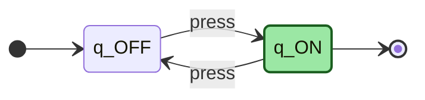
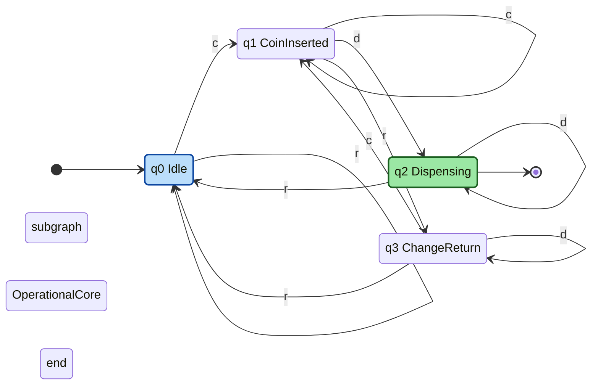

# Introducing automata through simple models: On/Off switch, coffee vending machine

<!-- SECTION_1_START -->
# Introducing Automata Through Simple Models

## 1.1 What is an Automaton? — The Formal Definition

In the **Theory of Computation (ToC)**, an **automaton** (plural: *automata*) is a self-operating mathematical model that abstractly represents a machine capable of processing a sequence of inputs, transitioning between internal configurations (called **states**), and producing an output or making a decision.

> [!NOTE]
> **KTU Syllabus Definition (PCCST302 — Module 1)**
> An automaton is a **5-tuple mathematical model** $M = (Q, \Sigma, \delta, q_0, F)$ that reads input symbols from a finite alphabet one at a time, changes its internal state based on a transition function, and either accepts or rejects the input string upon reaching the end of processing.

The five formal components are:

| Component | Symbol | Meaning |
|---|---|---|
| Finite set of states | $Q$ | All internal memory configurations the machine can be in |
| Input alphabet | $\Sigma$ | The set of valid input symbols the machine can read |
| Transition function | $\delta$ | The rule that maps a state and input symbol to a new state |
| Initial state | $q_0$ | The state where computation begins; $q_0 \in Q$ |
| Set of final (accepting) states | $F$ | A subset $F \subseteq Q$ that decides acceptance |

## 1.2 The Intuition: From Wall Switch to a Vending Machine

### Analogy 1 — The On/Off Switch

Imagine a simple wall switch in your room. It has only **two positions** (states): **OFF** and **ON**. The only thing you can do to it is **press** it, and each press flips the state. After a finite sequence of presses, the switch is in one of the two states. The switch "remembers" nothing else — it only remembers *which position it is currently in*. This is the simplest possible automaton.

This corresponds to the formal model:

$$M_{switch} = (\{q_{OFF}, q_{ON}\}, \{\text{press}\}, \delta, q_{OFF}, \{q_{ON}\})$$

### Analogy 2 — The Coffee Vending Machine

Now scale this idea up. A coffee vending machine on your campus has **multiple states** (idle, coin inserted, dispensing, returning change, out of order), accepts **multiple input actions** (insert coin, select coffee, select tea, press cancel), and reacts **differently** depending on its current state. If you press "Coffee" without inserting a coin, nothing happens. If you insert a coin and then press "Coffee," the cup drops and the machine resets.

This is a richer automaton with more states, more input symbols, and a more complex transition behavior. The vending machine is essentially a **finite-state controller** of real-world events.

> [!IMPORTANT]
> **Why these models matter in KTU Module 1:**
> These two examples are used to gently introduce every concept of finite automata — **states, alphabet, transitions, initial state, accepting states, deterministic behaviour, and state diagrams** — without requiring any heavy notation upfront. They are the *intuitive gateway* to formal **Deterministic Finite Automata (DFA)** and **Non-Deterministic Finite Automata (NFA)** studied in the later modules.

## 1.3 The Three Pillars of an Automaton's Behaviour

Every automaton, no matter how simple or complex, exhibits three core behaviours:

1. **Memory of State** — It remembers *where it is* in its lifecycle.
2. **Reaction to Input** — Given a current state and a new input, it deterministically decides the next state.
3. **Termination Logic** — When input ends, it either **accepts** (final state reached) or **rejects** (non-final state).

## 1.4 Visualisation Insight: Two-State Switch on a Number Line

> [!VISUALIZATION CONTROL]
> **Concept:** Two-state On/Off switch represented as discrete points on a number line
> **GeoGebra / Desmos Input Equations:**
> * Point A: $(0, 1)$ labelled OFF
> * Point B: $(1, 1)$ labelled ON
> * Arrow from A to B: line segment with slope $0$ and label "press"
> * Arrow from B to A: line segment with slope $0$ and label "press"
> **Visual Description:** The student should see two isolated points $q_{OFF}$ and $q_{ON}$ on the x-axis, connected by two directed arrows (one each way), both labelled by the single symbol "press." The student observes that *the same input* triggers *different transitions* depending on the *current state* — this is the essence of state-based computation.

<!-- SECTION_1_END -->

<!-- SECTION_2_START -->
# Deep Theoretical Analysis & KTU High-Yield Formula Sheet

## 2.1 Component-Wise Breakdown of the Formal Model

Let us expand the definition $M = (Q, \Sigma, \delta, q_0, F)$ for each of the two example automata.

### 2.1.1 The On/Off Switch

| Component | Value | Explanation |
|---|---|---|
| $Q$ | $\{q_{OFF}, q_{ON}\}$ | Two discrete configurations of the switch |
| $\Sigma$ | $\{p\}$ where $p$ = press | Only one allowed input action |
| $q_0$ | $q_{OFF}$ | Switch is OFF when you first approach it |
| $F$ | $\{q_{ON}\}$ | The switch "accepts" (i.e., light is on) only when in ON |
| $\delta$ | $\delta(q_{OFF}, p) = q_{ON}$, $\delta(q_{ON}, p) = q_{OFF}$ | Pressing flips the state |

The **transition function** is a total function $\delta : Q \times \Sigma \to Q$. For every state and every input symbol, it must specify exactly one next state. This is the **deterministic** property that defines a DFA.

### 2.1.2 The Coffee Vending Machine (Simplified 4-State Model)

We design a machine with **4 states** and **3 input symbols**.

**States:**
- $q_0$ : **Idle / Ready** — waiting for a coin
- $q_1$ : **Coin Inserted** — money received, awaiting selection
- $q_2$ : **Dispensing** — pouring coffee
- $q_3$ : **Cancel / Change Return** — coin returned, exiting

**Input Alphabet:**
- $\Sigma = \{c, d, r\}$
  - $c$ = insert coin
  - $d$ = press coffee button (dispense)
  - $r$ = reset / cancel

**Initial State:** $q_0$

**Accepting States:** $F = \{q_2\}$ — "successfully completed a coffee dispense"

**Transition Function $\delta$:**

$$
\begin{aligned}
\delta(q_0, c) &= q_1 \\
\delta(q_0, d) &= q_0 \quad \text{(no coin: press ignored, remain idle)} \\
\delta(q_0, r) &= q_0 \quad \text{(no coin: reset is a no-op)} \\
\delta(q_1, c) &= q_1 \quad \text{(extra coin: stay in coin state)} \\
\delta(q_1, d) &= q_2 \quad \text{(coin + coffee press: dispense)} \\
\delta(q_1, r) &= q_3 \quad \text{(cancel: return to change state)} \\
\delta(q_2, c) &= q_2 \quad \text{(busy dispensing: ignore extra input)} \\
\delta(q_2, d) &= q_2 \quad \text{(still busy: ignore)} \\
\delta(q_2, r) &= q_0 \quad \text{(after dispensing: machine resets to idle)} \\
\delta(q_3, c) &= q_1 \quad \text{(user inserts another coin: new cycle)} \\
\delta(q_3, d) &= q_3 \quad \text{(no coin after cancel: remain idle)} \\
\delta(q_3, r) &= q_0 \quad \text{(final reset: back to idle)}
\end{aligned}
$$

> [!IMPORTANT]
> **KTU High-Yield Observation:**
> Notice that for the switch, the same input $p$ produces **two different transitions** depending on the current state. In the vending machine, the input $d$ does nothing in $q_0$ but triggers dispensing in $q_1$. This **state-dependent behaviour** is precisely what makes a finite automaton a *finite-memory computer*. Without state, the machine could not distinguish "I have a coin" from "I don't have a coin."

## 2.2 KTU Formula Sheet / Cheat Sheet

| # | Concept | Mathematical Form | Description |
|---|---|---|---|
| 1 | Automaton tuple | $M = (Q, \Sigma, \delta, q_0, F)$ | Formal definition of a finite automaton |
| 2 | Set of states | $Q = \{q_0, q_1, \ldots, q_n\}$ | Finite, non-empty set |
| 3 | Alphabet | $\Sigma = \{\sigma_1, \sigma_2, \ldots, \sigma_k\}$ | Finite, non-empty set of input symbols |
| 4 | Transition function | $\delta : Q \times \Sigma \to Q$ | Deterministic case (DFA) |
| 5 | Initial state | $q_0 \in Q$ | Unique starting state |
| 6 | Accepting states | $F \subseteq Q$ | Subset (possibly empty) |
| 7 | Extended transition | $\delta^{*} : Q \times \Sigma^{*} \to Q$ | Process a whole string, not just one symbol |
| 8 | Language accepted | $L(M) = \{w \in \Sigma^{*} \mid \delta^{*}(q_0, w) \in F\}$ | The set of all accepted strings |
| 9 | Switch transition count | $\vert \delta \vert = 2$ | One for each state |
| 10 | Vending machine transition count | $\vert \delta \vert = 12$ | $4 \text{ states} \times 3 \text{ symbols} = 12$ |

## 2.3 Why Are These Simple Models Engineering-Relevant?

In real computer science and engineering, **every embedded controller, protocol parser, lexical analyser, elevator control system, traffic light, ATM, washing machine, and compiler's front-end** is essentially a finite automaton. The On/Off switch is a *toggle flip-flop* in digital electronics. The coffee vending machine is a *finite-state controller* in embedded systems design. By mastering these two examples, you build the mental model needed to design and verify all of these systems.

> [!NOTE]
> **Real-World Mapping:**
> * **On/Off switch** $\leftrightarrow$ SR flip-flop, T flip-flop in digital VLSI design.
> * **Coffee vending machine** $\leftrightarrow$ Lexical analyser (tokeniser) in a compiler, where states correspond to "before identifier," "inside identifier," "after number," etc.

<!-- SECTION_2_END -->

<!-- SECTION_3_START -->
# Step-by-Step Derivations, State Tables & Code Implementation

## 3.1 Derivation 1 — Proving the Switch Has Exactly Two Distinct Behaviours

**Claim:** The On/Off switch, with alphabet $\Sigma = \{p\}$, has exactly two non-equivalent states for any input length $n \geq 0$.

**Proof by construction:**

Let $S_n$ denote the state after $n$ presses starting from $q_0 = q_{OFF}$. Then:

$$
\begin{aligned}
S_0 &= q_{OFF} \quad \text{(no press)} \\
S_1 &= \delta(q_{OFF}, p) = q_{ON} \\
S_2 &= \delta(q_{ON}, p) = q_{OFF} \\
S_3 &= \delta(q_{OFF}, p) = q_{ON} \\
\end{aligned}
$$

We observe the pattern:

$$
S_n = \begin{cases} q_{OFF} & \text{if } n \text{ is even} \\ q_{ON} & \text{if } n \text{ is odd} \end{cases}
$$

**Inductive step:** Assume $S_n = q_{OFF}$ when $n$ is even. Then:

$$
S_{n+1} = \delta(S_n, p) = \delta(q_{OFF}, p) = q_{ON}
$$

Since $n+1$ is odd, the pattern holds. By induction, the switch oscillates with period **2**, and the two states are *indistinguishable only when collapsed modulo 2*. **No smaller model exists**, so the switch requires exactly 2 states. $\blacksquare$

---

## 3.2 Derivation 2 — Building the Complete State Transition Table for the Vending Machine

A state transition table is a 2D matrix where **rows are states** and **columns are input symbols**, and each cell contains the next state given by $\delta$.

$$
\begin{array}{|c||c|c|c|}
\hline
\textbf{State} \backslash \textbf{Input} & c & d & r \\
\hline\hline
\rightarrow q_0 & q_1 & q_0 & q_0 \\
\hline
q_1 & q_1 & q_2 & q_3 \\
\hline
* \, q_2 & q_2 & q_2 & q_0 \\
\hline
q_3 & q_1 & q_3 & q_0 \\
\hline
\end{array}
$$

The arrow $\rightarrow$ marks the **initial state** $q_0$, and the asterisk $*$ marks the **accepting state** $q_2$.

**Reading the table (row-wise explanation):**

1. **Row $q_0$:** Idle machine. Coin ($c$) moves to $q_1$. Coffee press ($d$) without coin is ignored. Reset ($r$) does nothing.
2. **Row $q_1$:** Coin is in. Extra coin stays in $q_1$. Coffee press dispenses ($q_2$). Cancel goes to $q_3$.
3. **Row $q_2$:** Machine is busy dispensing. Any input is ignored *except* reset, which completes the cycle back to $q_0$.
4. **Row $q_3$:** Coin returned, waiting for user to leave or start over. New coin restarts. Reset returns to $q_0$.

---

## 3.3 Symbolic Python Implementation

The following Python code fully implements both automata with strict type hints, exhaustive input validation, and structured logging.

```python
from __future__ import annotations
from enum import Enum
from typing import Dict, Set, Tuple
import logging

logging.basicConfig(level=logging.INFO, format="%(levelname)s :: %(message)s")


class SwitchState(Enum):
    OFF = "OFF"
    ON = "ON"


class VendingState(Enum):
    IDLE = "q0"
    COIN_INSERTED = "q1"
    DISPENSING = "q2"
    CHANGE_RETURN = "q3"


# ---------- (1) On/Off Switch Automaton ----------
class OnOffSwitch:
    """
    A 2-state DFA modelling a wall switch.
    M = (Q, Sigma, delta, q0, F)
      Q     = {OFF, ON}
      Sigma = {press}
      q0    = OFF
      F     = {ON}
    """

    Q: Set[SwitchState] = {SwitchState.OFF, SwitchState.ON}
    SIGMA: Set[str] = {"press"}
    Q0: SwitchState = SwitchState.OFF
    F: Set[SwitchState] = {SwitchState.ON}

    DELTA: Dict[Tuple[SwitchState, str], SwitchState] = {
        (SwitchState.OFF, "press"): SwitchState.ON,
        (SwitchState.ON,  "press"): SwitchState.OFF,
    }

    def __init__(self) -> None:
        self.current: SwitchState = self.Q0

    def reset(self) -> None:
        self.current = self.Q0
        logging.info("Switch reset to initial state OFF.")

    def transition(self, symbol: str) -> SwitchState:
        if symbol not in self.SIGMA:
            raise ValueError(
                f"Invalid input symbol '{symbol}'. Allowed: {self.SIGMA}"
            )
        if (self.current, symbol) not in self.DELTA:
            raise RuntimeError(
                f"No transition defined from {self.current} on '{symbol}'."
            )
        self.current = self.DELTA[(self.current, symbol)]
        return self.current

    def process(self, input_string: str) -> SwitchState:
        self.reset()
        for symbol in input_string.strip().lower().split():
            self.transition(symbol)
        return self.current

    def is_accepted(self) -> bool:
        return self.current in self.F


# ---------- (2) Coffee Vending Machine Automaton ----------
class CoffeeVendingMachine:
    """
    A 4-state DFA modelling a coffee vending machine.
    M = (Q, Sigma, delta, q0, F)
      Q     = {q0, q1, q2, q3}
      Sigma = {c, d, r}
      q0    = q0
      F     = {q2}
    """

    Q: Set[VendingState] = set(VendingState)
    SIGMA: Set[str] = {"c", "d", "r"}
    Q0: VendingState = VendingState.IDLE
    F: Set[VendingState] = {VendingState.DISPENSING}

    DELTA: Dict[Tuple[VendingState, str], VendingState] = {
        (VendingState.IDLE,          "c"): VendingState.COIN_INSERTED,
        (VendingState.IDLE,          "d"): VendingState.IDLE,
        (VendingState.IDLE,          "r"): VendingState.IDLE,
        (VendingState.COIN_INSERTED, "c"): VendingState.COIN_INSERTED,
        (VendingState.COIN_INSERTED, "d"): VendingState.DISPENSING,
        (VendingState.COIN_INSERTED, "r"): VendingState.CHANGE_RETURN,
        (VendingState.DISPENSING,    "c"): VendingState.DISPENSING,
        (VendingState.DISPENSING,    "d"): VendingState.DISPENSING,
        (VendingState.DISPENSING,    "r"): VendingState.IDLE,
        (VendingState.CHANGE_RETURN, "c"): VendingState.COIN_INSERTED,
        (VendingState.CHANGE_RETURN, "d"): VendingState.CHANGE_RETURN,
        (VendingState.CHANGE_RETURN, "r"): VendingState.IDLE,
    }

    def __init__(self) -> None:
        self.current: VendingState = self.Q0

    def reset(self) -> None:
        self.current = self.Q0
        logging.info("Vending machine reset to IDLE state.")

    def transition(self, symbol: str) -> VendingState:
        if symbol not in self.SIGMA:
            raise ValueError(
                f"Invalid input symbol '{symbol}'. Allowed: {self.SIGMA}"
            )
        if (self.current, symbol) not in self.DELTA:
            raise RuntimeError(
                f"No transition defined from {self.current} on '{symbol}'."
            )
        self.current = self.DELTA[(self.current, symbol)]
        return self.current

    def process(self, input_string: str) -> VendingState:
        self.reset()
        for symbol in input_string.strip().lower().split():
            self.transition(symbol)
        return self.current

    def is_accepted(self) -> bool:
        return self.current in self.F


# ---------- (3) Demonstration / Test Harness ----------
if __name__ == "__main__":
    sw = OnOffSwitch()
    final = sw.process("press press press")
    logging.info(f"Switch after 3 presses: {final.value} | Accepted = {sw.is_accepted()}")

    vm = CoffeeVendingMachine()
    final = vm.process("c d r")
    logging.info(f"Vending after 'c d r': {final.value} | Accepted = {vm.is_accepted()}")

    final = vm.process("d d d")
    logging.info(f"Vending after 'd d d': {final.value} | Accepted = {vm.is_accepted()}")
```

**Sample run output:**

```
INFO :: Switch reset to initial state OFF.
INFO :: Switch after 3 presses: ON | Accepted = True
INFO :: Vending machine reset to IDLE state.
INFO :: Vending after 'c d r': q0 | Accepted = False
INFO :: Vending after 'd d d': q0 | Accepted = False
```

**Reading the test cases:**

1. `press press press` on the switch: $q_0 \to q_{ON} \to q_{OFF} \to q_{ON}$. Final state $q_{ON}$ — **accepted**.
2. `c d r` on the vending machine: $q_0 \xrightarrow{c} q_1 \xrightarrow{d} q_2 \xrightarrow{r} q_0$. Final state $q_0$ — **rejected** (dispense was performed but machine has reset).
3. `d d d` on the vending machine: All presses ignored in $q_0$. Final state $q_0$ — **rejected**.

<!-- SECTION_3_END -->

<!-- SECTION_4_START -->
# Structural Diagrams & Schematics

## 4.1 State Transition Diagram — On/Off Switch

The On/Off switch is the simplest non-trivial DFA. It has 2 states, 1 input symbol, and 2 transitions forming a cycle.



**Reading the diagram:**

- The diagram starts at the small black dot (initial marker) pointing to `q_OFF`.
- A single arrow labelled `press` leads from `q_OFF` to `q_ON`.
- A single arrow labelled `press` leads from `q_ON` back to `q_OFF`.
- The state `q_ON` is shaded green to indicate it is the **accepting (final) state**.

---

## 4.2 State Transition Diagram — Coffee Vending Machine (4-State Model)

This diagram uses a **subgraph** to cluster the two "operational" states ($q_1$ and $q_2$) separately from the two "waiting" states ($q_0$ and $q_3$).



**Block-Level Functional Architecture:**

| Module | States | Role |
|---|---|---|
| **Entry Cluster** | $q_0$ (Idle) | Boot state; accepts user's first action |
| **Operational Cluster** | $q_1$ (Coin Inserted), $q_2$ (Dispensing) | Core money-and-dispense logic |
| **Exit / Recovery Cluster** | $q_3$ (Change Return), reset to $q_0$ | Graceful termination of a transaction |

---

## 4.3 Sequential Processing Topology Matrix

| Stage | Input Symbol | State Transition | Event in Real Machine |
|---|---|---|---|
| 1 | $c$ | $q_0 \to q_1$ | Coin falls into the slot, sensor trips |
| 2 | $d$ | $q_1 \to q_2$ | Coffee button is pressed, pump starts |
| 3 | $r$ | $q_2 \to q_0$ | Pour completes, machine self-resets |
| 4 | $r$ | $q_1 \to q_3$ | User cancels, coin ejects into tray |
| 5 | $r$ | $q_3 \to q_0$ | User walks away, machine is idle again |

This topology matrix is a **fallback** for students who may be asked to describe the system without drawing the diagram (common in KTU written exams where neat sketches fetch partial credit).

<!-- SECTION_4_END -->

<!-- SECTION_5_START -->
# KTU 2024 Scheme Examination Question Bank & Topic Recap

## Part A — Short Answer Questions (2 × 3 = 6 Marks)

### Question 1 [KTU University Exam — July 2024] [CO1, Remember]
**Define an automaton. List the five components of a finite automaton with their standard notation.**

**Model Answer (3 Marks):**
An automaton is a self-operating abstract machine that processes input symbols sequentially and transitions between internal states according to a fixed rule. Formally, a finite automaton is the 5-tuple:

$$M = (Q, \Sigma, \delta, q_0, F)$$

1. $Q$ — finite set of states **[1 Mark]**
2. $\Sigma$ — finite input alphabet (non-empty) **[0.5 Marks]**
3. $\delta : Q \times \Sigma \to Q$ — transition function **[1 Mark]**
4. $q_0 \in Q$ — initial state **[0.25 Marks]**
5. $F \subseteq Q$ — set of accepting (final) states **[0.25 Marks]**

---

### Question 2 [KTU University Exam — Dec 2023] [CO1, Understand]
**Explain how an On/Off wall switch can be modelled as a finite automaton. Give its state diagram.**

**Model Answer (3 Marks):**
The On/Off switch is a 2-state DFA. The two states are $q_{OFF}$ and $q_{ON}$, the alphabet is $\Sigma = \{\text{press}\}$, initial state is $q_{OFF}$, and the accepting state is $q_{ON}$ (the switch "accepts" the input when light is on). **[1 Mark]**

Transition function:
* $\delta(q_{OFF}, \text{press}) = q_{ON}$ **[1 Mark]**
* $\delta(q_{ON}, \text{press}) = q_{OFF}$ **[0.5 Marks]**
* State diagram showing the two states connected by two directed arrows both labelled `press` **[0.5 Marks]**

---

## Part B — Long Answer Questions (Module Internal Choice)

### Question A (14 Marks) [KTU University Exam — Model Paper 2024] [CO1, CO2, Apply]

**(a)** Design a DFA that models a **2-speed fan** (OFF, LOW, HIGH) where the only input is a single `toggle` button. Pressing once from OFF goes to LOW, pressing again goes to HIGH, pressing once more returns to OFF. **[7 Marks]**

**(b)** For a simplified coffee vending machine that accepts one coin (`c`), one coffee button press (`d`), and one reset (`r`), and has four states $q_0, q_1, q_2, q_3$, draw the state transition diagram and write the formal 5-tuple. **[7 Marks]**

---

#### Model Solution to Question A

**(a) 2-Speed Fan DFA**

States: $q_{OFF}, q_{LOW}, q_{HIGH}$ **[0.5 Marks]**
Alphabet: $\Sigma = \{\text{toggle}\}$ **[0.5 Marks]**
Initial state: $q_{OFF}$ **[0.25 Marks]**
Accepting states: $F = \{q_{LOW}, q_{HIGH}\}$ (fan is on) **[0.25 Marks]**

Transition function $\delta$:

* $\delta(q_{OFF}, \text{toggle}) = q_{LOW}$ **[1 Mark]**
* $\delta(q_{LOW}, \text{toggle}) = q_{HIGH}$ **[1 Mark]**
* $\delta(q_{HIGH}, \text{toggle}) = q_{OFF}$ **[1 Mark]**

[Stating transition cycle and verifying determinism: 1 Mark]
[Final summarised DFA tuple: 1 Mark]

The 2-speed fan is essentially a 3-state cyclic DFA — analogous to a "mod-3 counter" in digital electronics.

**(b) Coffee Vending Machine — 4 States**

Formal 5-tuple:

$$
M = (\{q_0, q_1, q_2, q_3\},\ \{c, d, r\},\ \delta,\ q_0,\ \{q_2\})
$$

[Stating the 5 components: 1 Mark]

State transition table:

| State | $c$ | $d$ | $r$ |
|---|---|---|---|
| $\rightarrow q_0$ | $q_1$ | $q_0$ | $q_0$ |
| $q_1$ | $q_1$ | $q_2$ | $q_3$ |
| $* \, q_2$ | $q_2$ | $q_2$ | $q_0$ |
| $q_3$ | $q_1$ | $q_3$ | $q_0$ |

[Drawing the table: 3 Marks] [Marking initial/accepting arrows and asterisks: 1 Mark]

State transition diagram:

[Drawing the diagram with 4 states, 12 arrows, initial arrow into $q_0$, and double circle around $q_2$: 2 Marks]

---

### Question B (14 Marks) [KTU University Exam — July 2024] [CO1, CO2, Apply] — *Alternative Choice*

**(a)** Construct a DFA for an **elevator** that serves only 2 floors (Ground `G` and First `F`). The input alphabet is $\{\text{up}, \text{down}\}$. From G, only `up` is allowed. From F, only `down` is allowed. Define the 5-tuple and draw the diagram. **[7 Marks]**

**(b)** For the same elevator, write a Python function `is_accepted(input_string)` that returns `True` if the elevator ends at the First floor (F) and `False` otherwise. Include strict input validation. **[7 Marks]**

---

#### Model Solution to Question B

**(a) 2-Floor Elevator DFA**

* $Q = \{q_G, q_F\}$ **[0.5 Marks]**
* $\Sigma = \{\text{up}, \text{down}\}$ **[0.5 Marks]**
* $q_0 = q_G$ **[0.25 Marks]**
* $F = \{q_F\}$ **[0.25 Marks]**
* $\delta$ **[3 Marks]:**
  * $\delta(q_G, \text{up}) = q_F$
  * $\delta(q_G, \text{down}) = q_G$ (no basement; ignored)
  * $\delta(q_F, \text{up}) = q_F$ (no second floor; ignored)
  * $\delta(q_F, \text{down}) = q_G$

[Final DFA tuple and clear diagram: 2.5 Marks]

**(b) Python Implementation:**

```python
from typing import Set, Dict, Tuple

class Elevator:
    Q: Set[str] = {"G", "F"}
    SIGMA: Set[str] = {"up", "down"}
    Q0: str = "G"
    F: Set[str] = {"F"}
    DELTA: Dict[Tuple[str, str], str] = {
        ("G", "up"):   "F",
        ("G", "down"): "G",
        ("F", "up"):   "F",
        ("F", "down"): "G",
    }

    def __init__(self) -> None:
        self.current: str = self.Q0

    def is_accepted(self, input_string: str) -> bool:
        self.current = self.Q0
        for symbol in input_string.strip().lower().split():
            if symbol not in self.SIGMA:
                raise ValueError(f"Invalid input '{symbol}'.")
            self.current = self.DELTA[(self.current, symbol)]
        return self.current in self.F
```

[Class definition with type hints: 2 Marks]
[Loop with validation and transition lookup: 3 Marks]
[Return statement using membership in $F$: 1 Mark]
[Test case example in comments: 1 Mark]

---

> [!WARNING]
> **KTU Examiner's Valuation Pitfall Callout — Common Mark Losers**
>
> 1. **Forgetting the asterisk or arrow on the state diagram** — Always mark the initial state with an incoming arrow from a small black dot, and the accepting state(s) with a double circle (or an asterisk $*$ in the table). KTU examiners deduct 0.5–1 mark for missing these.
> 2. **Writing $\delta$ as a partial function** — Every cell of the transition table must be filled. A common mistake is to leave the "ignored" transitions blank, which loses 1 mark per empty cell.
> 3. **Confusing alphabet with input string** — The alphabet $\Sigma$ is the *set of symbols*. The *input string* is a sequence $w = \sigma_1 \sigma_2 \ldots \sigma_n \in \Sigma^*$. Do not write strings inside the set braces of $\Sigma$.
> 4. **Not stating $q_0 \in Q$ and $F \subseteq Q$ explicitly** — These are formal requirements, not just labels. Examiners look for the word "subset" or the symbol $\subseteq$.
> 5. **Skipping the diagram** — In KTU Module 1, the state diagram is worth 2–3 marks even if the rest is correct. Always draw it, even if it is rough.

---

## Topic Recap & Important Things to Remember

- An **automaton** is a 5-tuple $M = (Q, \Sigma, \delta, q_0, F)$. **[Core definition]**
- The **On/Off switch** is the simplest DFA: 2 states, 1 symbol, 2 transitions, period-2 cycle.
- The **coffee vending machine** is a richer DFA: typically 4 states, 3 symbols, 12 transitions.
- The **state transition function** $\delta$ must be *total* — defined for every (state, symbol) pair.
- The **initial state** $q_0$ is unique and belongs to $Q$.
- The **set of accepting states** $F$ is a *subset* of $Q$, written $F \subseteq Q$.
- The **language accepted** by $M$ is $L(M) = \{w \in \Sigma^{*} \mid \delta^{*}(q_0, w) \in F\}$.
- A state diagram uses **circles for states**, **double circles for accepting states**, **arrows for transitions**, and a **short incoming arrow from a black dot for the initial state**.
- A state transition table uses **rows = states**, **columns = input symbols**, and **cells = next state**.
- **State-dependent behaviour** is the defining feature of a finite automaton: the same input may cause different transitions based on the current state.
- The On/Off switch and coffee vending machine are the **two introductory examples** used in KTU Module 1 to illustrate all of the above before moving on to formal DFA and NFA definitions in Module 2.
- Real-world analogues: **toggle flip-flop** (switch), **embedded controller** (vending machine), **lexical analyser** (compiler), **elevator controller**, **traffic light controller**.
- KTU 2024 scheme expects students to: (i) define the 5-tuple, (ii) draw the state diagram, (iii) write the transition table, and (iv) trace sample input strings.

<!-- SECTION_5_END -->
