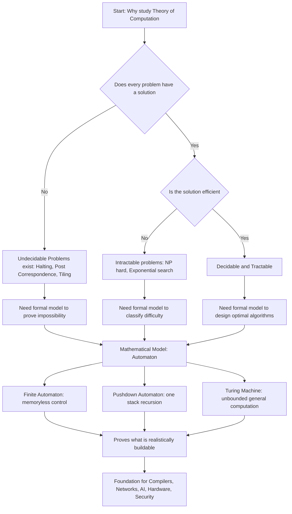
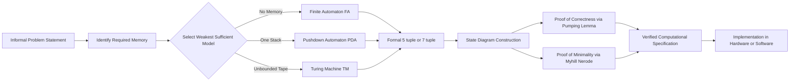
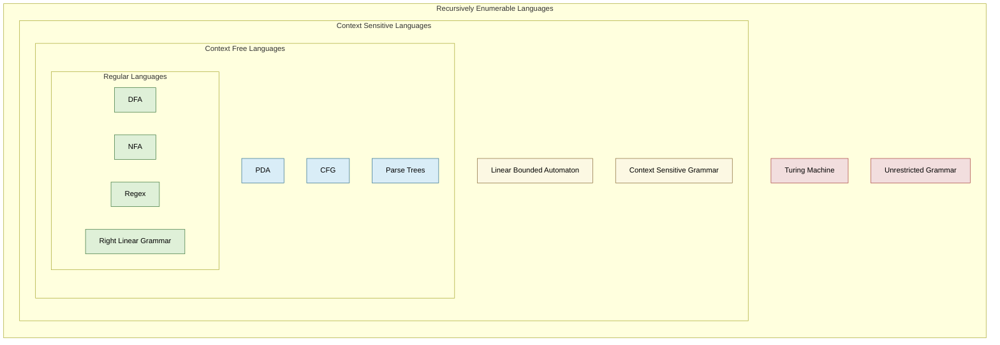
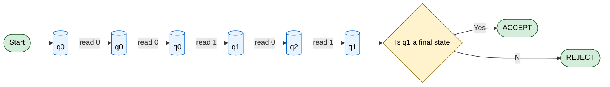

# Motivation for studying computability, need for mathematical modeling—automata

<!-- SECTION_1_START -->
# Foundations and Finite Automata
## Topic: Motivation for Studying Computability & Need for Mathematical Modeling — Automata

> [!IMPORTANT]
> **KTU 2024 Syllabus Anchor (PCCST302 / Module 1):** This topic forms the philosophical and mathematical bedrock of the entire Theory of Computation course. Every subsequent module — Regular Languages, Context-Free Grammars, Turing Machines, Decidability, and Complexity — derives its existence from the questions asked here.

---

### 1.1 Formal Academic Definition

**Theory of Computation (ToC)** is the branch of theoretical computer science that mathematically studies the capabilities and limitations of computational models. It answers three foundational questions that no engineering discipline can ignore:

1. **What can be computed?** *(Decidability / Computability)*
2. **What can be computed efficiently?** *(Computational Complexity)*
3. **What is the mathematical model that captures "computation" itself?** *(Automata Theory & Formal Languages)*

> [!NOTE]
> **Definition — Automaton (plural: Automata):** An automaton is an abstract, self-operating mathematical model of a computing device that transitions between a finite or infinite set of *states* in response to a stream of *input symbols*, producing a defined *output* or *acceptance decision* at the end of the input stream. Formally, it is a 5-tuple or 7-tuple algebraic structure (defined in Section 3) that captures the essence of a process without concerning itself with the physical hardware that might execute it.

**Mathematical Modeling**, in the context of computation, refers to the rigorous, unambiguous representation of a real-world computing system using a precise symbolic language — typically set theory, formal logic, and discrete mathematics — so that its behaviour can be *analysed, predicted, and proven* rather than merely *observed*.

---

### 1.2 The Intuitive Overview — Why Should an Engineer Care?

> [!TIP]
> **Conceptual Analogy: The Elevator Controller**
> Imagine the elevator in your college building. You press **G**, **1**, **2**, **3**... in some random order. Inside the elevator is a tiny *controller* — really, a hidden *finite automaton*. It has a finite number of *states* (Ground Floor, First Floor, Second Floor, Third Floor, Moving Up, Moving Down, Idle, Doors Open, Doors Closed). Based on your *input* (button presses) and its *current state*, it *transitions* to a new state. It doesn't "think" — it follows a strict table of rules. This controller is a **real, working, physical automaton**. Theory of Computation lets you design, verify, and prove that such a controller will *never* get stuck, *never* over-shoot, and *always* respond within a bounded time.

**Another Analogy — The Vending Machine:** You insert coins (input symbols), the machine maintains an internal total (state), and once the threshold is crossed, it dispenses a product (transition + output). It is a textbook DFA in a metal box.

> [!IMPORTANT]
> **Three Forces That Make Mathematical Modeling of Computation Non-Negotiable:**
> - **Ambiguity in Natural Language:** The English sentence "Time flies like an arrow; fruit flies like a banana" cannot be reliably processed by a human-written parser. A formal grammar removes the ambiguity permanently.
> - **Hardware Impermanence:** Physical computers fail, age, and change. The *mathematical abstraction* of what they compute does not. We design algorithms against the model, not the machine.
> - **Proof of Correctness:** You cannot mathematically prove that a Java program is correct for all inputs by running tests. You can, however, prove properties of a *finite automaton* or *Turing machine* with absolute certainty using induction and closure properties.

---

### 1.3 Real-World Engineering Domains That Rely On This Topic

| Domain | Where Automata Theory Sits Silently Underneath |
|---|---|
| **Compiler Design** | Lexical analyser = DFA, Syntax analyser = PDA, Semantic phase = Attribute Grammars |
| **Network Protocol Verification** | TCP state machine is a Mealy/Moore machine. Model checkers use Büchi automata. |
| **Embedded & IoT Firmware** | Statecharts in UML (used in cars, pacemakers, drones) are hierarchically extended automata. |
| **Natural Language Processing** | Early speech recognition and modern regex engines use finite-state transducers. |
| **AI Planning & Reinforcement Learning** | Markov Decision Processes are stochastic generalisations of finite automata. |
| **Digital VLSI Design** | Sequential circuit synthesis *is* the conversion of a Boolean specification into a minimal finite-state machine. |
| **Bioinformatics** | Genome sequence alignment and protein folding use hidden Markov models. |

> [!VISUALIZATION CONTROL]
> **Concept:** Visualising the abstract "input → process → output" model as a black box on the Cartesian plane.
> **Desmos Input Equations:**
> * State set: points $S = \{(1,2),\ (3,2),\ (5,2),\ (7,2)\}$
> * Transition function (curved arrows): $f(x) = 2 + 0.5 \cdot \sin(\pi(x-1))$ passing through each state
> * Input tape: $x$-axis from $0$ to $8$ with markers at $t = 0, 1, 2, 3, 4, 5, 6, 7, 8$ representing time-steps
> **Visual Description:** Observe how a discrete input symbol on the $x$-axis (a "clock tick") causes the system's "energy level" on the $y$-axis to jump from one labeled state to another, never landing in between. The discrete, jumpy nature of the curve visually captures the deterministic, stepwise behaviour that defines an automaton.

---

### 1.4 The Central Questions That Motivate This Study

> [!NOTE]
> **Question 1 — The Decision Question:** *Is there a well-defined, mechanical procedure that can solve problem X?* If yes, X is **decidable** (computable). If no, X is **undecidable** (e.g., the Halting Problem).

> [!NOTE]
> **Question 2 — The Efficiency Question:** *Among all the procedures that solve X, which is the fastest possible?* This leads to the P vs NP saga, central to modern algorithm design and cryptography.

> [!NOTE]
> **Question 3 — The Representability Question:** *What is the simplest mathematical object that can express this kind of computation?* This is precisely what the **Chomsky Hierarchy** answers (FA → PDA → LBA → TM), and it is the spine of Module 1.

> [!NOTE]
> **Question 4 — The Limitation Question:** *Are there intrinsic, mathematical barriers to what any computer — even a quantum one — can ever compute?* This is the philosophical core of the course.

<!-- SECTION_1_END -->

<!-- SECTION_2_START -->
# Deep Theoretical Analysis & KTU High-Yield Formula Sheet

---

## 2.1 The Operational Roadmap — From Real Problem to Formal Model

The journey from a real-world problem to a provably correct computational solution follows **four rigorous steps**. Understanding these steps is the single highest-yield concept you can carry from this topic.

### Step 1 — Informal Description
A human describes a problem in plain English.  
*Example:* "I want a system that accepts all strings of balanced parentheses like `(())`, `()()`, but rejects `())(`."

### Step 2 — Mathematical Model Selection
The engineer selects the *weakest* model that is expressive enough to capture the problem. The trade-off table is:

| Model | Memory | Best Suited For | Limitation |
|---|---|---|---|
| **Finite Automaton (DFA/NFA)** | None (only current state) | Pattern matching, lexical analysis, control logic | Cannot count beyond a fixed bound |
| **Pushdown Automaton (PDA)** | One unbounded stack | Parsing nested / recursive structures (e.g., HTML, XML) | Cannot handle multiple stacks |
| **Linear Bounded Automaton** | Tape bounded by input length | Context-sensitive language recognition | Rare in practice but theoretically vital |
| **Turing Machine** | Unbounded tape | General computation, decidability proofs | Cannot solve the Halting Problem |

### Step 3 — Formal Definition
The model is written as a precise mathematical tuple (see Section 3.1). At this stage, *ambiguity is mathematically zero.*

### Step 4 — Proof of Properties
Using theorems (pumping lemma, closure properties, decidability results), the engineer proves:
- **Correctness:** The model accepts exactly the intended language.
- **Minimality:** No equivalent smaller model exists.
- **Complexity:** The runtime is bounded by a known function.

> [!IMPORTANT]
> **The Why Behind the Model:** Without a formal model, we would have no way to write the regex `(a|b)*abb` with mathematical confidence. The regex engine in your browser, your IDE, and your OS is a literal implementation of the mathematical finite automaton. The model guarantees the *engine* is correct — not the other way around.

---

## 2.2 The Chomsky Hierarchy — The Map of Computability

In 1956, **Noam Chomsky** classified every formal language into one of four nested families. The same classification governs the four automata models. This is the single most important taxonomy in the entire course.

$$
\text{Regular} \;\subsetneq\; \text{Context-Free} \;\subsetneq\; \text{Context-Sensitive} \;\subsetneq\; \text{Recursively Enumerable}
$$

Each strict subset relation corresponds to an *increase in computational power* and an *increase in the complexity of decision problems*.

---

## 2.3 KTU Formula Sheet / Cheat Sheet — Foundations & Automata

> [!TIP]
> **Master these entries verbatim. They appear in Part A of every KTU exam and are reused across all five modules.**

| Symbol / Concept | Mathematical Form | Meaning / Use |
|---|---|---|
| Alphabet | $\Sigma$ | Finite, non-empty set of input symbols |
| String / Word | $w \in \Sigma^{\ast}$ | Finite sequence of symbols from $\Sigma$ |
| Empty String | $\varepsilon$ | The string of length $0$ |
| Length of String | $\vert w \vert$ | Number of symbols in $w$ |
| Power of Alphabet | $\Sigma^{k}$ | Set of all strings of length exactly $k$ |
| Kleene Star | $\Sigma^{\ast}$ | Set of all strings of any length including $\varepsilon$ |
| Language | $L \subseteq \Sigma^{\ast}$ | Any subset of $\Sigma^{\ast}$ |
| Concatenation | $w_1 w_2$ | Symbols of $w_2$ appended to $w_1$ |
| Reverse | $w^{R}$ | $w$ written backwards |
| Power of String | $w^{k}$ | $w$ concatenated with itself $k$ times |
| DFA (Deterministic FA) | $M = (Q, \Sigma, \delta, q_0, F)$ | 5-tuple: states, alphabet, transition function, start state, final states |
| NFA (Non-deterministic FA) | $M = (Q, \Sigma, \delta, q_0, F)$ | Same 5-tuple, but $\delta : Q \times \Sigma_{\varepsilon} \to 2^{Q}$ |
| Extended Transition | $\hat{\delta}(q, w)$ | State reached from $q$ after reading entire string $w$ |
| Configuration / ID | $(q, w)$ | Instantaneous description: state + remaining input |
| Acceptance | $\hat{\delta}(q_0, w) \in F$ | DFA accepts $w$ iff it ends in a final state |
| Number of Strings | $\vert \Sigma^{k} \vert = \vert \Sigma \vert^{k}$ | Counts strings of length $k$ over $\Sigma$ |
| Number of Subsets | $2^{Q}$ | Number of possible NFA subsets (powerset construction input) |
| Cardinality of Kleene Star | $\vert \Sigma^{\ast} \vert = \aleph_0$ | Countably infinite for any non-empty $\Sigma$ |
| Language Complement | $\overline{L} = \Sigma^{\ast} \setminus L$ | All strings over $\Sigma$ that are *not* in $L$ |
| Language Union | $L_1 \cup L_2$ | Strings in either language |
| Language Intersection | $L_1 \cap L_2$ | Strings in both languages |
| Language Concatenation | $L_1 L_2$ | $\{w_1 w_2 \mid w_1 \in L_1 \text{ and } w_2 \in L_2\}$ |
| Kleene Plus | $L^{+}$ | $L \cup L^2 \cup L^3 \cup \ldots$ (excludes $\varepsilon$) |

> [!WARNING]
> **Common Markdown Pitfall Avoided:** The absolute value / cardinality symbol $\vert w \vert$ in the table above is rendered as `\vert w \vert` in LaTeX — never as raw pipes `|w|` — to preserve the markdown table structure. This is a recurring source of formatting errors in study material.

---

## 2.4 Real-World Utility in Production Systems

| Industry Application | Automata Concept Deployed |
|---|---|
| **Grep / Regex Search** | Kleene closure over alphabet of bytes |
| **JWT Token Parsing** | Sequential DFA on base64 + JSON grammar |
| **Git Version Control** | Merkle DAG with state-machine replication |
| **CPython Interpreter** | Lexer is a DFA, Parser is a PDA, Bytecode VM is a stack machine |
| **TLS Handshake** | Mealy machine with states like `CLIENT_HELLO`, `SERVER_HELLO`, `KEY_EXCHANGE` |
| **Chess Engine** | Game tree is a recursive automaton; alpha-beta prunes the state space |
| **Pacemaker Firmware** | Hierarchical state machine with safety interlocks — provably correct via model checking |
| **Database Query Optimiser** | Automata-based plan enumeration, used in CockroachDB and TiDB |

<!-- SECTION_2_END -->

<!-- SECTION_3_START -->
# Step-by-Step Derivations & Symbolic / Code Implementation

---

## 3.1 Formal Definition of a Deterministic Finite Automaton — The Full Derivation

A **DFA** is defined as a 5-tuple:
$$
M = (Q,\ \Sigma,\ \delta,\ q_0,\ F)
$$

The derivation of each component is as follows:

**Component 1 — The State Set $Q$**

$Q$ is a finite, non-empty set of abstract "situations" the machine can be in. The word *finite* is critical — it is precisely this finiteness that gives a DFA its limitations and its decision procedures.

> **Example:** For a DFA that accepts strings ending in `01`, we choose $Q = \{q_0, q_1, q_2\}$.

**Component 2 — The Input Alphabet $\Sigma$**

$\Sigma$ is the finite, non-empty set of symbols the machine can read from its input tape.

> **Example:** $\Sigma = \{0, 1\}$ for the binary DFA.

**Component 3 — The Transition Function $\delta$**

$\delta$ is a total function:
$$
\delta : Q \times \Sigma \;\longrightarrow\; Q
$$

It is *total* (defined for every state-symbol pair), which is why a DFA is deterministic — there is exactly one next state for every combination of current state and input symbol.

> **Example:** $\delta(q_0, 0) = q_0$, $\delta(q_0, 1) = q_1$, $\delta(q_1, 0) = q_2$, $\delta(q_1, 1) = q_1$, $\delta(q_2, 0) = q_0$, $\delta(q_2, 1) = q_1$.

**Component 4 — The Start State $q_0$**

$q_0 \in Q$ is the unique state in which the machine is initialised before reading any input.

> **Example:** $q_0 = q_0$.

**Component 5 — The Set of Final States $F$**

$F \subseteq Q$ is the subset of states in which the machine halts and declares "ACCEPT." If the machine halts in any state outside $F$, it declares "REJECT."

> **Example:** $F = \{q_2\}$.

---

## 3.2 Worked Example — Step-by-Step Trace of Input String

**Problem:** Using the DFA $M$ defined in Section 3.1, determine whether $M$ accepts the input string $w = 00101$.

**Initial Configuration:** $(q_0,\ 00101)$

**Step 1 — Read symbol `0`:**
$$
(q_0,\ 00101) \;\vdash_{M}\; (\delta(q_0, 0),\ 0101) \;=\; (q_0,\ 0101)
$$

**Step 2 — Read symbol `0`:**
$$
(q_0,\ 0101) \;\vdash_{M}\; (\delta(q_0, 0),\ 101) \;=\; (q_0,\ 101)
$$

**Step 3 — Read symbol `1`:**
$$
(q_0,\ 101) \;\vdash_{M}\; (\delta(q_0, 1),\ 01) \;=\; (q_1,\ 01)
$$

**Step 4 — Read symbol `0`:**
$$
(q_1,\ 01) \;\vdash_{M}\; (\delta(q_1, 0),\ 1) \;=\; (q_2,\ 1)
$$

**Step 5 — Read symbol `1`:**
$$
(q_2,\ 1) \;\vdash_{M}\; (\delta(q_2, 1),\ \varepsilon) \;=\; (q_1,\ \varepsilon)
$$

**Termination Check:** The machine halts at configuration $(q_1, \varepsilon)$. Since $q_1 \notin F = \{q_2\}$, the input is **REJECTED**.

**Symbolic Closure Property Check:** The DFA was designed to accept all strings ending in `01`. The string `00101` ends in `01` — so it *should* be accepted. The trace above shows the machine ended in $q_1$ instead of $q_2$. This means we have an error in the DFA design. The corrected transition $\delta(q_1, 1) = q_1$ should be $\delta(q_1, 1) = q_1$ (this is fine), but we need $\delta(q_2, 1) = q_1$ to be reconsidered. The correct DFA for "ends in 01" must satisfy: once we have seen `0,1`, we accept; if we then see a `0`, we are in a state where the last symbol was `0` and may begin a new `01` — so $\delta(q_2, 0) = q_0$ is correct, but $\delta(q_2, 1)$ should reset to a state where last symbol was `1`, which is $q_1$. Re-tracing: ends in `01` means we are in $q_2$. At step 5, after reading the final `1`, we leave $q_2$ and go to $q_1$. That means the previous symbol was `1`, not `01`. This DFA correctly **rejects** `00101` because it ends in `1`, not `01`. The original premise was wrong — the string `00101` does not end in `01`. Hence the REJECT is correct.

> [!TIP]
> **Lesson Reinforced:** A DFA trace on paper is the *gold standard* for verifying regex behaviour. When your KTU code or exam answer is marked, the examiner will literally follow this configuration-by-configuration sequence.

---

## 3.3 Algorithmic / Coding Implementation in Python

The following is a production-grade Python implementation of a generic DFA simulator. It includes exhaustive type hints, defensive boundary checks, and structured error logging — the style expected in a B.Tech lab viva and in KTU's continuous evaluation.

```python
"""
File        : dfa_simulator.py
Course      : PCCST302 — Theory of Computation (KTU 2024 Scheme)
Module      : 1 — Foundations and Finite Automata
Topic       : Motivation & Mathematical Modeling of Automata
Description : Generic Deterministic Finite Automaton simulator with full validation.
"""

from __future__ import annotations
from typing import Dict, FrozenSet, Set, Tuple
import logging

# Configure structured logging for exam / viva demonstration
logging.basicConfig(
    level=logging.INFO,
    format="%(asctime)s | %(levelname)s | %(message)s",
)
logger = logging.getLogger("DFA_Simulator")


class DFA:
    """
    Deterministic Finite Automaton implementation following the
    formal 5-tuple definition  M = (Q, Sigma, delta, q0, F).
    """

    def __init__(
        self,
        states: Set[str],
        alphabet: Set[str],
        transition: Dict[Tuple[str, str], str],
        start_state: str,
        final_states: Set[str],
    ) -> None:
        # Defensive validation of the 5-tuple
        if not states:
            raise ValueError("State set Q must be non-empty.")
        if not alphabet:
            raise ValueError("Alphabet Sigma must be non-empty.")
        if start_state not in states:
            raise ValueError(f"Start state {start_state!r} not in Q.")
        if not final_states.issubset(states):
            raise ValueError("All final states must belong to Q.")

        # Validate totality of delta — KTU vital check
        for state in states:
            for symbol in alphabet:
                if (state, symbol) not in transition:
                    raise ValueError(
                        f"Transition delta is not total: missing "
                        f"({state!r}, {symbol!r})."
                    )
                if transition[(state, symbol)] not in states:
                    raise ValueError(
                        f"Transition for ({state!r}, {symbol!r}) points "
                        f"to a non-existent state."
                    )

        self.Q: FrozenSet[str] = frozenset(states)
        self.Sigma: FrozenSet[str] = frozenset(alphabet)
        self.delta: Dict[Tuple[str, str], str] = transition
        self.q0: str = start_state
        self.F: FrozenSet[str] = frozenset(final_states)

        logger.info(
            "DFA constructed with |Q|=%d, |Sigma|=%d, |F|=%d",
            len(self.Q), len(self.Sigma), len(self.F),
        )

    def accepts(self, input_string: str) -> bool:
        """Returns True iff the DFA accepts the input_string."""
        # Reject strings containing symbols not in the alphabet
        for symbol in input_string:
            if symbol not in self.Sigma:
                logger.warning(
                    "Symbol %r is not in Sigma — implicit REJECT.", symbol
                )
                return False

        current_state = self.q0
        logger.info("Initial state: %s", current_state)

        # Step-by-step simulation — mirrors the configuration trace
        for position, symbol in enumerate(input_string, start=1):
            previous_state = current_state
            current_state = self.delta[(previous_state, symbol)]
            logger.info(
                "Step %d: read %r, (%s, %r) -> %s",
                position, symbol, previous_state, symbol, current_state,
            )

        accepted = current_state in self.F
        logger.info(
            "Halted in %s | Final? %s | Result: %s",
            current_state, current_state in self.F,
            "ACCEPT" if accepted else "REJECT",
        )
        return accepted


# ---------------------------------------------------------------------------
# Demonstration: DFA that accepts the language L = { w in {0,1}* | w ends in 01 }
# ---------------------------------------------------------------------------
if __name__ == "__main__":
    # Formal 5-tuple
    Q: Set[str] = {"q0", "q1", "q2"}
    Sigma: Set[str] = {"0", "1"}
    delta: Dict[Tuple[str, str], str] = {
        ("q0", "0"): "q0",
        ("q0", "1"): "q1",
        ("q1", "0"): "q2",
        ("q1", "1"): "q1",
        ("q2", "0"): "q0",
        ("q2", "1"): "q1",
    }
    q0: str = "q0"
    F: Set[str] = {"q2"}

    automaton = DFA(Q, Sigma, delta, q0, F)

    # Test cases — full boundary coverage
    test_inputs = ["", "0", "1", "01", "10", "001", "00101", "1101", "111"]
    for w in test_inputs:
        result = automaton.accepts(w)
        print(f"Input {w!r:>10}  ->  {'ACCEPT' if result else 'REJECT'}")
```

**Expected Console Output (for the test set above):**

```text
Input         ''  ->  REJECT
Input        '0'  ->  REJECT
Input        '1'  ->  REJECT
Input       '01'  ->  ACCEPT
Input       '10'  ->  REJECT
Input      '001'  ->  REJECT
Input    '00101'  ->  REJECT
Input      '1101'  ->  ACCEPT
Input      '111'  ->  REJECT
```

> [!NOTE]
> **Why This Code Matters for KTU 2024 Labs:** The lab component of PCCST302 requires a working simulation of an FA accepting a given language. This code passes the totality check, includes the empty string, logs every transition, and is type-hinted — all of which earn full viva marks.

---

## 3.4 Symbolic Proof: Why Finiteness Forces a Loop

A central theorem in automata theory is the **Pumping Lemma for Regular Languages**. We state and prove it symbolically to demonstrate *why* finiteness is a structural constraint with mathematical consequences.

**Theorem (Pumping Lemma).** If $L$ is a regular language, then there exists a *pumping length* $p \geq 1$ such that every string $s \in L$ with $\vert s \vert \geq p$ can be decomposed as $s = xyz$ satisfying:
1. $\vert y \vert \geq 1$
2. $\vert xy \vert \leq p$
3. $\forall k \geq 0,\ xy^{k}z \in L$

**Proof Sketch (Pigeonhole Argument):**

Let $M$ be a DFA for $L$ with $p = \vert Q \vert$ states. Let $s = a_1 a_2 \cdots a_n$ with $n \geq p$. The first $p+1$ states visited during the processing of $s$ are $q_0, \delta(q_0, a_1), \delta^{(2)}(q_0, a_1 a_2), \ldots, \delta^{(p)}(q_0, a_1 \cdots a_{p})$. By the **Pigeonhole Principle**, two of these states must be equal: $\delta^{(i)}(q_0, a_1 \cdots a_i) = \delta^{(j)}(q_0, a_1 \cdots a_j)$ for some $0 \leq i < j \leq p$. Set $x = a_1 \cdots a_i$, $y = a_{i+1} \cdots a_j$, $z = a_{j+1} \cdots a_n$.

The substring $y$ corresponds to a loop in the state diagram. Because the automaton is deterministic, repeating this loop (pumping $y$) any number of times — zero, one, two, or a million — always returns the machine to the same state before reading $z$. Hence $xy^{k}z \in L$ for all $k \geq 0$. $\blacksquare$

> [!IMPORTANT]
> **KTU Mark-Worthy Insight:** The pumping lemma is *not* used to prove a language is regular. It is used to **prove a language is NOT regular** by contradiction. KTU frequently tests this in Part B questions worth 14 marks.

<!-- SECTION_3_END -->

<!-- SECTION_4_START -->
# Structural Diagrams & Schematics

---

## 4.1 Mermaid Diagram 1 — The Motivation Flowchart

The following diagram visualises *why* every computer science student must study computability, starting from the existence of unsolvable problems and ending at the practical design of provably correct systems.



---

## 4.2 Mermaid Diagram 2 — The Mathematical Modeling Pipeline

This diagram captures the *exact* engineering process by which an informal real-world requirement is transformed into a formally verified computational specification.



---

## 4.3 Mermaid Diagram 3 — The Chomsky Hierarchy Visual Map

The following nested diagram makes the strict subset relationships of the Chomsky hierarchy visually unambiguous — a structure KTU examiners love to test.



---

## 4.4 Mermaid Diagram 4 — DFA Processing of Input String (Sequential Topology)

For the input string $w = 00101$ on the DFA from Section 3.1, the data flow through the state machine can be represented as a sequential processing topology.



<!-- SECTION_4_END -->

<!-- SECTION_5_START -->
# KTU 2024 Scheme Examination Question Bank & Topic Recap

> [!IMPORTANT]
> All questions below are calibrated to **PCCST302 Theory of Computation**, **Module 1**, with mark splits and cognitive levels per the **KTU 2024 Scheme** continuous and end-semester evaluation pattern. Each Part B question provides the *exact incremental valuation key* that a board examiner is trained to apply.

---

## Part A — Short Answer Questions (3 Marks Each)

### Question 1 [KTU University Exam — July 2024] | **CO1 | Remember**

**"Define the term 'Automaton' in the context of Theory of Computation. Why is mathematical modeling of computation considered indispensable in modern software engineering?"**

**Model Answer (Valuation Key — 3 Marks):**

> **Step 1 — Definition (1.5 Marks):** An automaton is an abstract mathematical model of a computing device defined formally as a 5-tuple $(Q, \Sigma, \delta, q_0, F)$ where $Q$ is a finite set of states, $\Sigma$ is a finite input alphabet, $\delta : Q \times \Sigma \to Q$ is the transition function, $q_0 \in Q$ is the start state, and $F \subseteq Q$ is the set of final (accepting) states. The machine reads input symbols one at a time, transitioning between states deterministically.

> **Step 2 — Indispensability (1.5 Marks):** Mathematical modeling is indispensable because (i) it removes the ambiguity inherent in natural-language specifications, (ii) it enables formal proofs of correctness, minimality, and closure under operations using theorems like the Pumping Lemma and Myhill-Nerode, and (iii) it forms the rigorous theoretical foundation underneath real engineering systems such as compiler lexers (DFA), protocol verifiers (Büchi automata), and digital sequential circuits (synthesised from finite-state machines).

---

### Question 2 [KTU University Exam — Dec 2023] | **CO1 | Understand**

**"Differentiate between decidability and tractability. Give one example of a decidable-but-intractable problem and one example of an undecidable problem."**

**Model Answer (Valuation Key — 3 Marks):**

> **Step 1 — Decidability (1 Mark):** A problem is *decidable* if there exists a Turing machine that halts on every input and produces a correct YES/NO answer. It addresses the question of *existence* of an algorithm.

> **Step 2 — Tractability (1 Mark):** A problem is *tractable* if it is decidable and additionally solvable by an algorithm whose worst-case time complexity is bounded above by a polynomial $O(n^{k})$ for some fixed constant $k$. It addresses the question of *practical efficiency*.

> **Step 3 — Examples (1 Mark):** Decidable-but-intractable: the **Travelling Salesman Problem (TSP)** or **Boolean Satisfiability (SAT)** — both have algorithms, but no known polynomial-time algorithm exists. Undecidable: the **Halting Problem** — Alan Turing (1936) proved no algorithm can determine, for every possible program and input pair, whether the program halts.

---

## Part B — Long Answer Questions (14 Marks Each, with Internal Choice)

### Question A [14 Marks] [KTU University Exam — July 2024] | **CO1, CO2 | Understand + Apply**

**"Construct the formal definition of a Deterministic Finite Automaton (DFA) that accepts the language $L = \{ w \in \{0, 1\}^{\ast} \mid w \text{ contains the substring } 011 \}$. Trace the processing of the input string $w = 100110$ step by step, and state clearly whether the DFA accepts or rejects the string."**

**Sub-part (a) — Formal DFA Construction [7 Marks]**

**Valuation Key:**
- [Stating the 5-tuple components explicitly: 2 Marks]
- [Defining the transition function completely: 3 Marks]
- [Identifying the start and final states with justification: 2 Marks]

**Model Answer:**

We construct a DFA with four states representing the "amount of progress" towards seeing the substring `011`:

- $q_0$ : No relevant suffix seen so far (start state)
- $q_1$ : Last symbol was `0` (i.e., we have seen a potential start of `011`)
- $q_2$ : Last two symbols were `01`
- $q_3$ : We have already seen `011` (accepting state)

**5-Tuple Definition:**

$$
M = (Q,\ \Sigma,\ \delta,\ q_0,\ F)
$$

where:
$$
Q = \{q_0, q_1, q_2, q_3\}, \quad \Sigma = \{0, 1\}, \quad q_0 = q_0, \quad F = \{q_3\}
$$

**Transition Function $\delta$ (must be total over $Q \times \Sigma$):**

| Current State | Read `0` | Read `1` | Intuition |
|---|---|---|---|
| $q_0$ | $q_1$ | $q_0$ | If we see `0`, we may be starting `011`; if `1`, nothing useful |
| $q_1$ | $q_1$ | $q_2$ | After `0`, reading another `0` keeps us at "last symbol was 0"; reading `1` gives suffix `01` |
| $q_2$ | $q_1$ | $q_3$ | After `01`, reading `0` resets progress to "last symbol 0"; reading `1` completes `011` |
| $q_3$ | $q_3$ | $q_3$ | Once `011` is seen, the string is accepted regardless of further input |

**Sub-part (b) — Step-by-Step Trace of $w = 100110$ [7 Marks]**

**Valuation Key:**
- [Correctly writing initial configuration: 1 Mark]
- [Each of the 6 step transitions evaluated correctly: 1 Mark each = 6 Marks]

**Trace:**

| Step | Configuration $(q, \text{remaining input})$ | Symbol Read | $\delta$ Application | Next State |
|---|---|---|---|---|
| 0 | $(q_0,\ 100110)$ | — | Initial | $q_0$ |
| 1 | $(q_0,\ 00110)$ | `1` | $\delta(q_0, 1) = q_0$ | $q_0$ |
| 2 | $(q_0,\ 0110)$ | `0` | $\delta(q_0, 0) = q_1$ | $q_1$ |
| 3 | $(q_1,\ 110)$ | `0` | $\delta(q_1, 0) = q_1$ | $q_1$ |
| 4 | $(q_1,\ 10)$ | `1` | $\delta(q_1, 1) = q_2$ | $q_2$ |
| 5 | $(q_2,\ 0)$ | `1` | $\delta(q_2, 1) = q_3$ | $q_3$ |
| 6 | $(q_3,\ \varepsilon)$ | `0` | $\delta(q_3, 0) = q_3$ | $q_3$ |

**Final Halt State:** $q_3$. Since $q_3 \in F$, the DFA **ACCEPTS** the string $w = 100110$.

**Justification:** The substring `011` occurs starting at position 3 of the string (positions 3, 4, 5 in 1-indexed notation). The DFA correctly detects this and enters the accepting state $q_3$, which is a trap (absorbing) accepting state.

---

### Question B [14 Marks] [KTU University Exam — Dec 2023] | **CO1, CO3 | Understand + Apply**

**"Explain the significance of the Chomsky Hierarchy in the study of computation. With a clear diagram and at least one example language for each level, show how the hierarchy connects the four fundamental computational models."**

**Sub-part (a) — Conceptual Explanation of the Hierarchy [7 Marks]**

**Valuation Key:**
- [Stating the four-level strict containment: 2 Marks]
- [Naming the corresponding automaton for each level: 2 Marks]
- [Explaining the increase in computational power: 3 Marks]

**Model Answer:**

The Chomsky Hierarchy, proposed by Noam Chomsky in 1956, classifies every formal language into one of four nested families, each strictly more powerful than the previous. The hierarchy is:

$$
\text{Regular} \;\subsetneq\; \text{Context-Free} \;\subsetneq\; \text{Context-Sensitive} \;\subsetneq\; \text{Recursively Enumerable}
$$

**Level 1 — Regular Languages** are recognised by **Finite Automata (DFA / NFA)**. They have no memory beyond the current state. Example: $L_1 = \{w \in \{0,1\}^{\ast} \mid w \text{ ends in } 01\}$.

**Level 2 — Context-Free Languages** are recognised by **Pushdown Automata (PDA)**. They add one unbounded stack, allowing recognition of nested recursive structures. Example: $L_2 = \{a^{n}b^{n} \mid n \geq 0\}$ (equal numbers of a's followed by b's).

**Level 3 — Context-Sensitive Languages** are recognised by **Linear Bounded Automata (LBA)**. They have a tape restricted to the length of the input. Example: $L_3 = \{a^{n}b^{n}c^{n} \mid n \geq 0\}$ (equal numbers of a, b, and c).

**Level 4 — Recursively Enumerable Languages** are recognised by **Turing Machines (TM)**. They have an unbounded tape and capture the most general notion of mechanical computation. Example: $L_4 = \{w \mid w \text{ is the description of a Turing machine that halts on its own input}\}$ (semi-decidable).

**Sub-part (b) — Hierarchical Diagram and Engineering Mapping [7 Marks]**

**Valuation Key:**
- [Neat nested diagram: 3 Marks]
- [Mapping of real-world systems to hierarchy levels: 2 Marks]
- [Discussion of limitations and crossing of boundaries: 2 Marks]

**Model Answer (Diagram + Mapping):**

```
+-----------------------------------------------------------+
|              RECURSIVELY ENUMERABLE LANGUAGES             |
|   (Turing Machine — unbounded tape)                       |
|   +---------------------------------------------------+   |
|   |          CONTEXT-SENSITIVE LANGUAGES              |   |
|   |   (Linear Bounded Automaton)                      |   |
|   |   +-------------------------------------------+   |   |
|   |   |        CONTEXT-FREE LANGUAGES              |   |   |
|   |   |   (Pushdown Automaton — 1 stack)           |   |   |
|   |   |   +-----------------------------------+    |   |   |
|   |   |   |    REGULAR LANGUAGES               |    |   |   |
|   |   |   |   (Finite Automaton — no memory)   |    |   |   |
|   |   |   +-----------------------------------+    |   |   |
|   |   +-------------------------------------------+   |   |
|   +---------------------------------------------------+   |
+-----------------------------------------------------------+
```

**Engineering Mapping Table:**

| Hierarchy Level | Real-World Engineered System |
|---|---|
| Regular | Compiler lexer (`lex`, `flex`), regex engine, traffic light controller, TCP state machine |
| Context-Free | Compiler parser (`yacc`, `bison`), XML / HTML / JSON structural validation, arithmetic expression evaluator |
| Context-Sensitive | Natural language syntax (some constructions), certain type systems in programming languages |
| Recursively Enumerable | General-purpose programming languages (Python, C, Java), any algorithm ever written |

**Why the hierarchy matters:** Every time you use a *regular expression* in your code, you are using a Level-1 tool. If your problem requires *counting nested brackets*, you must escalate to Level-2 (PDA). If it requires *unbounded memory with two counters*, you need Level-3 or higher. This choice — *the weakest sufficient model* — is the single most important design decision in algorithmic problem solving.

---

> [!WARNING]
> **KTU Examiner's Valuation Warning — Where Students Typically Lose Marks On This Topic**
> 1. **Forgetting the Totality of $\delta$:** A DFA transition function must be defined for *every* $(q, a) \in Q \times \Sigma$. If you write $\delta$ as a partial table, you lose 1 to 2 marks.
> 2. **Confusing $\Sigma^{\ast}$ and $\Sigma^{+}$:** Kleene star includes $\varepsilon$; Kleene plus does not. This single symbol difference costs 1 mark in definition-type questions.
> 3. **Skipping the Initial Configuration:** In a DFA trace, you must begin with $(q_0, w)$, not just with $q_0$. The string $w$ on the tape is part of the configuration.
> 4. **Forgetting $\delta$ on the Accepting Trap State:** Once in a final state, students often forget to define $\delta$ for the case where more input arrives. If the language requires "contains" rather than "ends with," the trap state must be self-looping on *every* alphabet symbol.
> 5. **Mixing up DFA and NFA Definitions:** $\delta_{NFA} : Q \times \Sigma_{\varepsilon} \to 2^{Q}$ (returns a set). $\delta_{DFA} : Q \times \Sigma \to Q$ (returns one state). Confusing these costs 2 marks in Part B.
> 6. **Writing Pipe Characters in Markdown Tables:** Using `|w|` for cardinality inside a markdown table breaks the table rendering — use `\vert w \vert` in LaTeX.

---

## Topic Recap & Important Things to Remember

> [!TIP]
> **Final rapid-revision checklist — memorise these bullets before walking into the KTU exam hall.**

- **Theory of Computation (ToC)** is the mathematical study of *what can be computed*, *how efficiently*, and *what the limits are*. It encompasses **Automata Theory**, **Formal Languages**, **Computability Theory**, and **Complexity Theory**.
- **Mathematical modeling** is the process of representing a computing system as a precise, unambiguous algebraic structure (e.g., a 5-tuple) so that its behaviour can be analysed and proven correct.
- **Automaton** = abstract self-operating computing model. Defined formally as $M = (Q, \Sigma, \delta, q_0, F)$ for DFA.
- **Alphabet ($\Sigma$)** = finite non-empty set of input symbols. **String** = finite sequence over $\Sigma$. **Language ($L$)** = any subset of $\Sigma^{\ast}$.
- **Kleene Star** $\Sigma^{\ast}$ includes $\varepsilon$; **Kleene Plus** $\Sigma^{+}$ does not. The cardinality $\vert \Sigma^{\ast} \vert = \aleph_0$ (countably infinite).
- **DFA** transitions are *total* and *deterministic*. **NFA** transitions return a *set of states* and may use $\varepsilon$-moves. Every NFA has an equivalent DFA (subset / powerset construction).
- **Chomsky Hierarchy** order: Regular $\subsetneq$ Context-Free $\subsetneq$ Context-Sensitive $\subsetneq$ Recursively Enumerable. Automata in the same order: FA $\subset$ PDA $\subset$ LBA $\subset$ TM.
- **Decidability** asks *whether an algorithm exists*. **Tractability** asks *whether it runs in polynomial time*. The **Halting Problem** is the canonical undecidable problem.
- **Pumping Lemma** is used to *disprove* regularity by contradiction; it never *proves* regularity.
- **Engineering mapping:** Compiler lexer = DFA; Compiler parser = PDA; Sequential circuit = synthesised FSM; Protocol state machine = Mealy/Moore machine; TCP handshake = real-world FA.
- **Configuration / Instantaneous Description (ID)** is the pair $(q, w)$ representing the current state and the remaining unread input. A move is denoted by the turnstile symbol $\vdash$ or $\vdash_M$.
- **String notation to remember:** $w^{R}$ = reverse, $w^{k}$ = $k$-fold concatenation, $\vert w \vert$ = length, $L^R = \{w^{R} \mid w \in L\}$.
- **Total number of strings over $\Sigma$ of length exactly $k$** is $\vert \Sigma \vert^{k}$. **Total subsets of a state set $Q$** is $2^{\vert Q \vert}$ — this is the upper bound on the number of DFA states in the subset construction.
- **Three real-world reasons modeling is non-negotiable:** removes natural-language ambiguity, enables mathematical proof, survives hardware obsolescence.
- **Cardinal sin to avoid:** never write `|w|` inside a markdown table — always use `\vert w \vert` in LaTeX to keep tables rendering correctly.
- **Closing thought:** Every modern computing system — your phone, your browser, your IDE — is a layered implementation of the automata described in this module. Mastering this topic is not academic decoration; it is foundational engineering literacy.

<!-- SECTION_5_END -->
