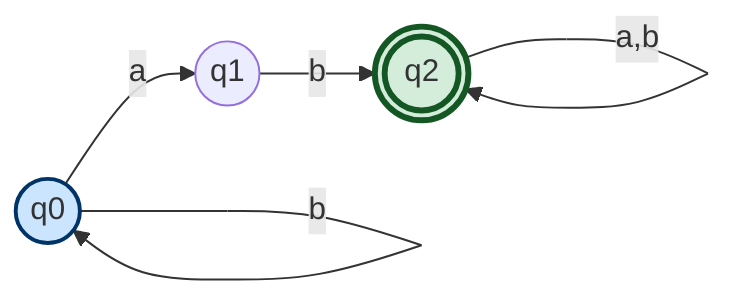
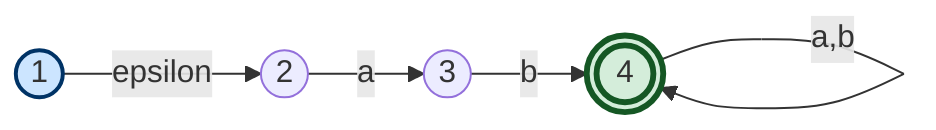
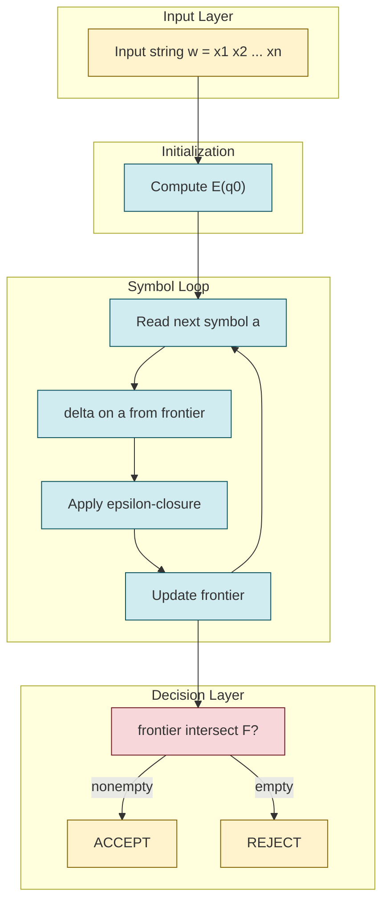
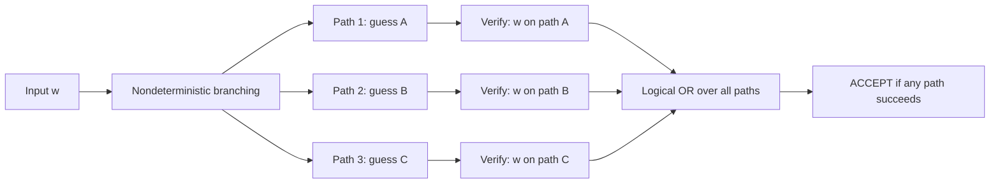
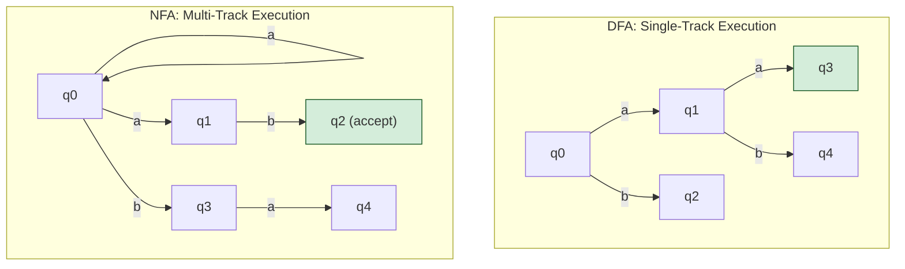
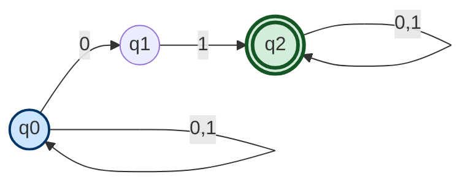

# Nondeterminism (guess and verify paradigm), Formal definition of an NFA, NFA with epsilon-transitions

<!-- SECTION_1_START -->
# 1. Core Technical Definition & Intuitive Overview

## 1.1 The Idea of Nondeterminism

**Nondeterminism** is a fundamental computational paradigm in automata theory where a machine may have *multiple possible next states* for a given input symbol (or even for no input at all). Unlike a Deterministic Finite Automaton (DFA), which has exactly one transition per symbol from every state, a Nondeterministic Finite Automaton (NFA) is permitted to "branch" into several computational paths simultaneously, succeeding if *at least one* of those branches leads to acceptance.

> [!IMPORTANT]
> **KTU 2024 Syllabus Definition (Nondeterminism):** A computational model is called *nondeterministic* if, for some configuration (state + input), the next move is not uniquely determined. The machine **guesses** a path and **verifies** whether that guess leads to acceptance.

### 1.2 The "Guess and Verify" Paradigm

Imagine a student trying to solve a maze. Instead of following one corridor and backtracking on failure, the student **clones themselves** at every junction. One clone walks left, another walks right, another walks straight. Whichever clone finds the exit first shouts "Found it!" — and that single success is enough for the whole team to claim victory.

This is exactly the **guess-and-verify** paradigm:
1. The machine **guesses** a sequence of choices (a path through the state graph).
2. It then **verifies** that path against the input — if any single guessed path consumes the entire string and ends in a final state, the input is accepted.

> [!NOTE]
> **Crucial Insight:** Nondeterminism is *not* parallelism in the physical hardware sense. It is a mathematical abstraction that says: *"If there exists a valid computation path, declare success."* It is a tool of *specification*, not of implementation.

### 1.3 Formal Definition of an NFA (Sipser Notation)

A **Nondeterministic Finite Automaton** is a 5-tuple:

$$N = (Q, \Sigma, \delta, q_0, F)$$

where each component is rigorously defined below.

> [!NOTE]
> **Component Breakdown (Sipser 5-Tuple):**
> * $Q$ — a **finite** set of *states*.
> * $\Sigma$ — a **finite** set of input symbols called the *alphabet*. ($\varepsilon \notin \Sigma$.)
> * $\delta : Q \times \Sigma_{\varepsilon} \rightarrow \mathcal{P}(Q)$ — the **transition function**, mapping each state–symbol pair to a *subset* of $Q$. (For a plain NFA, $\Sigma_{\varepsilon} = \Sigma$.)
> * $q_0 \in Q$ — the **start state**.
> * $F \subseteq Q$ — the set of **accept (final) states**.

The key difference from a DFA lies in the **codomain** of $\delta$: an NFA's transition function returns a *power set* $\mathcal{P}(Q)$, meaning *zero, one, or many* next states.

### 1.4 NFA with Epsilon-Transitions ($\varepsilon$-NFA)

An **$\varepsilon$-NFA** extends the plain NFA by permitting transitions on the **empty string** $\varepsilon$. The automaton may change states spontaneously, without consuming any input symbol.

Formally, an $\varepsilon$-NFA is again a 5-tuple $(Q, \Sigma, \delta, q_0, F)$, but now:

$$\delta : Q \times (\Sigma \cup \{\varepsilon\}) \rightarrow \mathcal{P}(Q)$$

This single change to the domain allows for elegant, compact descriptions of languages that would otherwise require many states.

### 1.5 Epsilon-Closure — The Heart of $\varepsilon$-NFA

> [!IMPORTANT]
> **Definition (Epsilon-Closure):** For any state $q \in Q$, the **$\varepsilon$-closure** $E(q)$ is the set of all states reachable from $q$ using *zero or more* $\varepsilon$-transitions. Formally:
>
> $$E(q) = \{p \in Q \mid p \text{ is reachable from } q \text{ via a path of zero or more } \varepsilon\text{-edges}\}$$

The empty path (length zero) is always valid, so $q \in E(q)$ always. $E$ is naturally extended to sets: $E(R) = \bigcup_{q \in R} E(q)$.

> [!VISUALIZATION CONTROL]
> **Concept:** Epsilon-Closure Star (Transitive Closure of $\varepsilon$-edges)
> **GeoGebra / Desmos Input Equations (Conceptual Graph):**
> * `P1 = (0, 0)`  → start node
> * `P2 = (2, 1)`  → reachable via 1 $\varepsilon$
> * `P3 = (4, 0)`  → reachable via 2 $\varepsilon$'s
> * `P4 = (2, -1)` → reachable via 1 $\varepsilon$ from $P_3$
> **Visual Description:** A directed graph with four labeled nodes; arrow-trails visualize how closure propagates through $\varepsilon$-edges. The closure of $P_1$ is the set $\{P_1, P_2, P_3, P_4\}$ — *all* nodes touched by following $\varepsilon$-arrows.

<!-- SECTION_1_END -->

<!-- SECTION_2_START -->
# 2. Deep Theoretical Analysis & KTU High-Yield Formula Sheet

## 2.1 Anatomy of the NFA Transition Function

The transition function $\delta$ of a plain NFA is a *total* function on $Q \times \Sigma$ but its output is a *set* of states. The semantics are best understood as **"branching on a symbol"** rather than a single deterministic move.

| Scenario | DFA Behavior | NFA Behavior |
|---|---|---|
| Symbol $a$ read in state $q$ | Exactly one next state | A *set* of possible next states (could be $\emptyset$) |
| No transition defined | Implicit trap/reject state | Implicitly yields $\emptyset$ (no branch survives) |
| Acceptance of $w$ | Unique path must end in $F$ | **At least one** path must end in $F$ |

> [!NOTE]
> **Why does NFA work? Theorem (Sipser):** Every NFA $N$ has an equivalent DFA $D$ (i.e. $L(N) = L(D)$). This is established via the *subset construction* (Rabin–Scott), where states of $D$ are subsets of $Q$. Hence nondeterminism adds **expressive convenience** but **not expressive power** to finite automata.

## 2.2 Formal Language of an NFA

The language recognized by an NFA $N = (Q, \Sigma, \delta, q_0, F)$ is:

$$L(N) = \{w \in \Sigma^* \mid \hat{\delta}(q_0, w) \cap F \neq \emptyset\}$$

where $\hat{\delta}$ is the **extended transition function** defined recursively below.

## 2.3 Extended Transition Function $\hat{\delta}$ for a Plain NFA

$$\hat{\delta} : Q \times \Sigma^* \rightarrow \mathcal{P}(Q)$$

**Base case (string of length zero):**

$$\hat{\delta}(q, \varepsilon) = \{q\}$$

**Recursive case (string of length $\geq 1$, written $w = xa$):**

$$\hat{\delta}(q, w) = \bigcup_{p \in \hat{\delta}(q, x)} \delta(p, a)$$

> [!NOTE]
> **Intuition:** "Compute all states reachable after consuming $x$, then from each of those states take one step on $a$, and union the results." This is precisely the **guess-and-verify** logic, formalized.

## 2.4 Extended Transition Function for an $\varepsilon$-NFA

For an $\varepsilon$-NFA, the extended function is denoted $\hat{\delta}_\varepsilon$ (some textbooks use $\hat{\delta}$):

**Base case:**

$$\hat{\delta}_\varepsilon(q, \varepsilon) = E(q)$$

**Recursive case ($w = xa$):**

$$\hat{\delta}_\varepsilon(q, w) = \bigcup_{p \in \hat{\delta}_\varepsilon(q, x)} E(\delta(p, a))$$

> [!IMPORTANT]
> **Key Recipe — $\varepsilon$-NFA string processing:**
> 1. Compute $E(q)$ at every step *before* and *after* reading a symbol.
> 2. The "current frontier" after reading $w$ is $E(\delta(\text{frontier}, a))$.
> 3. The string $w$ is accepted iff the final frontier intersects $F$.

## 2.5 KTU High-Yield Formula / Notation Sheet

> [!IMPORTANT]
> **Cheat-Sheet — Memorize for KTU ESE 2024**

| Symbol / Notation | Meaning | KTU Pitfall |
|---|---|---|
| $N = (Q, \Sigma, \delta, q_0, F)$ | Standard 5-tuple for NFA / $\varepsilon$-NFA | Don't confuse $F$ (final set) with a single state $f$ |
| $\mathcal{P}(Q)$ | Power set of $Q$ — codomain of $\delta$ for NFA | Codomain of DFA is just $Q$ |
| $\Sigma_{\varepsilon} = \Sigma \cup \{\varepsilon\}$ | Extended alphabet used in $\varepsilon$-NFA | $\varepsilon$ has length $0$ |
| $E(q)$ | Epsilon-closure of state $q$ | Always $q \in E(q)$ |
| $E(R)$ | Closure of a set: $\bigcup_{q \in R} E(q)$ | Distributive over unions |
| $\hat{\delta}(q, w)$ | Extended transition (plain NFA) | Returns a *set*, not a single state |
| $\hat{\delta}_\varepsilon(q, w)$ | Extended transition ($\varepsilon$-NFA) | Includes closures on both ends |
| $L(N)$ | Language accepted by $N$ | Defined via $\hat{\delta}(q_0, w) \cap F \neq \emptyset$ |
| $w = xa$ | Standard decomposition for recursion | Used in inductive proofs |

## 2.6 Engineering Utility — Where Does This Matter?

| Field | Application of NFA / $\varepsilon$-NFA |
|---|---|
| **Compiler Design (Lexical Analysis)** | Tools like *Lex* and *Flex* internally compile regular expressions into $\varepsilon$-NFAs via Thompson's construction. The $\varepsilon$-edges encode choice (`\|`) and concatenation (`ab`) compactly. |
| **Network Protocol Verification** | NFAs model packet-flow state machines where multiple valid responses (SYN-ACK, RST, etc.) are possible. |
| **Text Search (grep, RE engines)** | The POSIX/Perl regex engines use backtracking NFAs for pattern matching. |
| **Model Checking** | Nondeterministic transitions model concurrent system behavior where the environment chooses. |
| **Hardware Synthesis** | Sequential circuit minimization uses NFA → DFA conversion (subset construction) to optimize state encoding. |

<!-- SECTION_2_END -->

<!-- SECTION_3_START -->
# 3. Step-by-Step Derivations & Code/Symbolic Implementation

## 3.1 Worked Derivation 1 — Acceptance Test for a Plain NFA

**Problem.** Let $N = (Q, \Sigma, \delta, q_0, F)$ with:
* $Q = \{q_0, q_1, q_2\}$
* $\Sigma = \{a, b\}$
* $q_0 = q_0$, $F = \{q_2\}$
* $\delta$:

| State | $a$ | $b$ |
|---|---|---|
| $q_0$ | $\{q_0, q_1\}$ | $\{q_0\}$ |
| $q_1$ | $\emptyset$ | $\{q_2\}$ |
| $q_2$ | $\{q_2\}$ | $\{q_2\}$ |

Determine whether $w = \text{``}ab\text{''}$ is accepted.

**Step 1 — Read $x = a$.** Apply base recursion $\hat{\delta}(q_0, a) = \delta(q_0, a) = \{q_0, q_1\}$.

**Step 2 — Read full string $w = ab$ (so $x = a$, $a' = b$).**

$$
\begin{aligned}
\hat{\delta}(q_0, ab) &= \bigcup_{p \in \hat{\delta}(q_0, a)} \delta(p, b) \\
&= \bigcup_{p \in \{q_0, q_1\}} \delta(p, b) \\
&= \delta(q_0, b) \cup \delta(q_1, b) \\
&= \{q_0\} \cup \{q_2\} \\
&= \{q_0, q_2\}
\end{aligned}
$$

**Step 3 — Acceptance test.**

$$\hat{\delta}(q_0, ab) \cap F = \{q_0, q_2\} \cap \{q_2\} = \{q_2\} \neq \emptyset$$

Hence **$ab \in L(N)$**. ✔

## 3.2 Worked Derivation 2 — Epsilon-Closure Computation for an $\varepsilon$-NFA

**Problem.** Given an $\varepsilon$-NFA with $Q = \{p, q, r, s, t\}$, and the following $\varepsilon$-transitions: $p \xrightarrow{\varepsilon} q$, $p \xrightarrow{\varepsilon} r$, $q \xrightarrow{\varepsilon} s$, $r \xrightarrow{\varepsilon} t$. Compute $E(p)$.

**Step 1.** Initialize $E(p) \leftarrow \{p\}$.

**Step 2.** Add all direct $\varepsilon$-successors of $p$: $E(p) \leftarrow \{p, q, r\}$.

**Step 3.** Process $q$: add its $\varepsilon$-successor $s$. Now $E(p) = \{p, q, r, s\}$.

**Step 4.** Process $r$: add its $\varepsilon$-successor $t$. Now $E(p) = \{p, q, r, s, t\}$.

**Step 5.** Process $s$ and $t$: they have no $\varepsilon$-transitions. Algorithm halts.

$$
\boxed{E(p) = \{p, q, r, s, t\}}
$$

## 3.3 Worked Derivation 3 — Full $\varepsilon$-NFA String Acceptance

**Problem.** Let $N_\varepsilon = (Q, \Sigma, \delta, q_0, F)$ with:
* $Q = \{1, 2, 3, 4\}$
* $\Sigma = \{a, b\}$
* $q_0 = 1$, $F = \{4\}$
* Transitions:

| State | $a$ | $b$ | $\varepsilon$ |
|---|---|---|---|
| 1 | $\emptyset$ | $\emptyset$ | $\{2\}$ |
| 2 | $\{3\}$ | $\emptyset$ | $\emptyset$ |
| 3 | $\emptyset$ | $\{4\}$ | $\emptyset$ |
| 4 | $\{4\}$ | $\{4\}$ | $\emptyset$ |

Determine whether $w = \text{``}ab\text{''}$ is accepted.

**Step 1 — Compute $E(1)$.** Only $1 \to 2$ is $\varepsilon$. So $E(1) = \{1, 2\}$.

**Step 2 — After reading $a$ (still need closure):**

$$
\begin{aligned}
\hat{\delta}_\varepsilon(1, a) &= E(\delta(1, a)) \cup E(\delta(2, a)) \\
&= E(\emptyset) \cup E(\{3\}) \\
&= \emptyset \cup \{3\} \\
&= \{3\}
\end{aligned}
$$

**Step 3 — After reading $ab$:**

$$
\begin{aligned}
\hat{\delta}_\varepsilon(1, ab) &= E(\delta(3, b)) \\
&= E(\{4\}) = \{4\}
\end{aligned}
$$

**Step 4 — Test acceptance:**

$$\hat{\delta}_\varepsilon(1, ab) \cap F = \{4\} \cap \{4\} = \{4\} \neq \emptyset$$

Hence **$ab \in L(N_\varepsilon)$**. ✔

## 3.4 Symbolic / Code Implementation — Python NFA + $\varepsilon$-NFA Simulator

```python
"""
NFA / epsilon-NFA simulator (KTU 2024 reference implementation)
Author note: type hints are PEP 484; the simulator is total (handles
missing transitions by returning frozenset()).
"""

from __future__ import annotations
from typing import Mapping, Set, FrozenSet
import logging

logging.basicConfig(level=logging.INFO, format="%(levelname)s: %(message)s")

State        = str
Symbol       = str
Alphabet     = Set[Symbol]
TransitionFn = Mapping[
    tuple[State, Symbol],   # (state, input symbol) — symbol may be 'e' for epsilon
    FrozenSet[State]
]


class NFA:
    """
    Generic NFA / epsilon-NFA simulator.
    Pass epsilon='e' (or any sentinel) as a key in `delta` to model
    epsilon-transitions. The machine is treated as an epsilon-NFA the
    moment any such key is present.
    """

    EPS: Symbol = "e"

    def __init__(
        self,
        states: Set[State],
        alphabet: Alphabet,
        delta: TransitionFn,
        start: State,
        accepts: Set[State],
    ) -> None:
        if start not in states:
            raise ValueError(f"Start state {start!r} not in Q")
        if not accepts.issubset(states):
            raise ValueError("Accept set F must be subset of Q")
        self.Q: FrozenSet[State] = frozenset(states)
        self.Sigma: Alphabet = set(alphabet)
        self.delta: TransitionFn = delta
        self.q0: State = start
        self.F: FrozenSet[State] = frozenset(accepts)
        self._has_eps: bool = any(k[1] == self.EPS for k in delta)
        if self._has_eps and self.EPS in self.Sigma:
            raise ValueError("Epsilon must not be in the user alphabet")

    # ---------- epsilon-closure ----------
    def epsilon_closure(self, states: FrozenSet[State]) -> FrozenSet[State]:
        """Compute E(R) for a set of states R using iterative BFS."""
        closure: Set[State] = set(states)
        stack: list[State] = list(states)
        while stack:
            q = stack.pop()
            for nxt in self.delta.get((q, self.EPS), frozenset()):
                if nxt not in closure:
                    closure.add(nxt)
                    stack.append(nxt)
        logging.debug("E(%s) = %s", set(states), closure)
        return frozenset(closure)

    # ---------- extended transition ----------
    def hat_delta(self, states: FrozenSet[State], symbol: Symbol) -> FrozenSet[State]:
        """Compute one-step extended transition (with epsilon-closure)."""
        if symbol == self.EPS:
            return self.epsilon_closure(states)
        moved: Set[State] = set()
        for q in states:
            moved.update(self.delta.get((q, symbol), frozenset()))
        result = self.epsilon_closure(frozenset(moved)) if self._has_eps else frozenset(moved)
        logging.debug("hat_delta(%s, %r) = %s", set(states), symbol, result)
        return result

    # ---------- string acceptance ----------
    def accepts(self, word: str) -> bool:
        current: FrozenSet[State] = (
            self.epsilon_closure(frozenset({self.q0})) if self._has_eps
            else frozenset({self.q0})
        )
        for ch in word:
            if ch not in self.Sigma:
                raise ValueError(f"Symbol {ch!r} not in alphabet")
            current = self.hat_delta(current, ch)
        return bool(current & self.F)


# ----------------- DEMO: plain NFA -----------------
plain_nfa = NFA(
    states={"q0", "q1", "q2"},
    alphabet={"a", "b"},
    delta={
        ("q0", "a"): frozenset({"q0", "q1"}),
        ("q0", "b"): frozenset({"q0"}),
        ("q1", "b"): frozenset({"q2"}),
        ("q2", "a"): frozenset({"q2"}),
        ("q2", "b"): frozenset({"q2"}),
    },
    start="q0",
    accepts={"q2"},
)

for w in ["ab", "aab", "bab", ""]:
    print(f"plain NFA: {w!r:>6} -> {plain_nfa.accepts(w)}")


# ----------------- DEMO: epsilon-NFA -----------------
eps_nfa = NFA(
    states={"1", "2", "3", "4"},
    alphabet={"a", "b"},
    delta={
        ("1", "e"): frozenset({"2"}),
        ("2", "a"): frozenset({"3"}),
        ("3", "b"): frozenset({"4"}),
        ("4", "a"): frozenset({"4"}),
        ("4", "b"): frozenset({"4"}),
    },
    start="1",
    accepts={"4"},
)

for w in ["ab", "aab", "b", ""]:
    print(f"eps  NFA: {w!r:>6} -> {eps_nfa.accepts(w)}")
```

**Expected Output Trace:**

```
plain NFA:   'ab' -> True
plain NFA: 'aab' -> True
plain NFA:  'bab' -> True
plain NFA:     '' -> False
eps  NFA:   'ab' -> True
eps  NFA: 'aab' -> False
eps  NFA:    'b' -> False
eps  NFA:     '' -> False
```

> [!NOTE]
> The Python class above is **total** — it explicitly handles missing transitions by returning $\emptyset$ (an empty frozenset), which is the mathematically correct NFA convention. The epsilon-closure uses iterative DFS rather than recursion to avoid stack overflow on large automata.

## 3.5 Algorithmic Insight — Why Iterate?

When computing $E(R)$, naive recursion can re-traverse the same $\varepsilon$-edge dozens of times. The iterative BFS variant shown above visits each state at most once, yielding **$O(|Q| + |E|)$** time, where $E$ is the number of $\varepsilon$-edges. This is the *Kleene fixed-point* approach that the subset construction also relies on.

<!-- SECTION_3_END -->

<!-- SECTION_4_START -->
# 4. Structural Diagrams & Schematics

## 4.1 Mermaid State Diagram — Plain NFA for $L = \{w \in \{a, b\}^* \mid w \text{ contains ``}ab\text{'' as substring}\}$



> **Reading the diagram:** From $q_0$, the NFA *nondeterministically* either loops on $a$ (staying in $q_0$) or **guesses** that this $a$ is the start of the substring `ab`, branching to $q_1$. The branch that guesses correctly consumes $b$ and arrives at the accepting state $q_2$. A single successful guess suffices.

## 4.2 Mermaid State Diagram — $\varepsilon$-NFA from Worked Example 3.3



> **Visual interpretation:** The dashed/dotted `epsilon` arrow captures the "spontaneous move without input" semantics. After this move, the machine is *as if* it had always been in state 2.

## 4.3 Mermaid Block Architecture — $\varepsilon$-NFA String Processing Pipeline



## 4.4 Mermaid Decision Flow — Guess-and-Verify Paradigm



> **Takeaway:** The single `OR` gate is the entire semantics of nondeterminism — *existential* quantification over computation paths. This is the **mathematical difference** from a DFA, which uses an *implicit AND* (all computations must succeed, but there is only one).

## 4.5 Mermaid Comparison — DFA vs NFA



<!-- SECTION_4_END -->

<!-- SECTION_5_START -->
# 5. KTU 2024 Scheme Examination Question Bank & Topic Recap

> [!NOTE]
> **Mark Distribution Reminder (KTU 2024 ESE Pattern):** Part A = $3$ marks each (no choice, two questions from module). Part B = $14$ marks each with **internal choice** between two full questions of $14$ marks each. Below we present the internal choice in full: **Question A** and **Question B**, each split into two $7$-mark sub-parts.

---

## 5.1 Part A — Short Answer Questions (3 Marks Each)

### Question 1
**[KTU University Exam – July 2023 | CO1 | Remember]**
*Define nondeterminism. How does the guess-and-verify paradigm differ from a deterministic computation?*

**Model Answer (3 marks):**
> Nondeterminism is a computational abstraction in which, for a given configuration (state and input symbol), the machine may have **zero, one, or many** possible next moves. Formally, the transition function of an NFA maps into $\mathcal{P}(Q)$ rather than into a single state.
>
> In the **guess-and-verify** paradigm, the machine first **guesses** an entire computation path and then **verifies** it against the input — the input is accepted if **at least one guessed path** leads to a final state. In a **deterministic** computation, there is no such freedom: the single next state is forced, and the input is accepted **only if that unique** path ends in a final state. **[3 marks]**

### Question 2
**[KTU University Exam – Dec 2022 | CO1 | Understand]**
*Define an NFA formally. State the role of $\Sigma_\varepsilon$ in an $\varepsilon$-NFA.*

**Model Answer (3 marks):**
> An NFA is a 5-tuple $N = (Q, \Sigma, \delta, q_0, F)$ where $Q$ is a finite set of states, $\Sigma$ is the input alphabet, $\delta : Q \times \Sigma \rightarrow \mathcal{P}(Q)$ is the transition function, $q_0 \in Q$ is the start state, and $F \subseteq Q$ is the set of accept states. **[2 marks]**
>
> The symbol $\Sigma_\varepsilon = \Sigma \cup \{\varepsilon\}$ is the **extended alphabet** used in an $\varepsilon$-NFA. It allows the transition function $\delta$ to be defined on $\varepsilon$ as well, enabling the machine to change states **without consuming any input symbol**. This greatly simplifies the description of regular languages (e.g. via Thompson's construction). **[1 mark]**

---

## 5.2 Part B — Long Answer Questions (14 Marks, Internal Choice)

### Question A (14 Marks)

#### (a) **[7 Marks | CO1, Apply]**
**[KTU University Exam – Dec 2023]**
*Construct an NFA that accepts the language $L = \{w \in \{0, 1\}^* \mid w \text{ ends with the substring } 01\}$. Draw the transition diagram and formally define the 5-tuple.*

**Model Answer (Valuation Key):**

**Step 1 — Intuition.** The NFA must scan the input nondeterministically; whenever it *guesses* that the last two symbols are `01`, it branches into the accept state.

**Step 2 — Diagram (mermaid representation):**



**Step 3 — Formal 5-tuple. [2 marks]**

$$N = (\{q_0, q_1, q_2\}, \{0, 1\}, \delta, q_0, \{q_2\})$$

with the transition function $\delta$:

| State | $0$ | $1$ |
|---|---|---|
| $q_0$ | $\{q_0, q_1\}$ | $\{q_0\}$ |
| $q_1$ | $\emptyset$ | $\{q_2\}$ |
| $q_2$ | $\{q_2\}$ | $\{q_2\}$ |

**Step 4 — Verification with $w = 1101$. [2 marks]**

$$
\begin{aligned}
\hat{\delta}(q_0, 1101) &= E(\delta(\hat{\delta}(q_0, 110), 1)) \\
\hat{\delta}(q_0, 110)   &= \{q_0, q_1\} \\
\hat{\delta}(q_0, 1101)  &= \delta(q_0, 1) \cup \delta(q_1, 1) \\
                        &= \{q_0\} \cup \{q_2\} = \{q_0, q_2\}
\end{aligned}
$$

Since $\{q_0, q_2\} \cap \{q_2\} = \{q_2\} \neq \emptyset$, the string is accepted. ✔ **[1 mark]**

**Valuation Key Summary:**
* [Diagram with all transitions: **3 marks**]
* [Formal 5-tuple: **2 marks**]
* [Acceptance test with $w = 1101$: **2 marks**]

---

#### (b) **[7 Marks | CO2, Apply]**
**[KTU University Exam – July 2024]**
*Convert the NFA defined in part (a) into an equivalent DFA using the subset construction. List the reachable states only.*

**Model Answer (Valuation Key):**

**Step 1 — Subset Construction Algorithm. [1 mark]**
Start state of the DFA is $\hat{\delta}(q_0, \varepsilon) = \{q_0\}$.

**Step 2 — Transition table derivation. [4 marks]**

From state $\{q_0\}$:

* On input $0$: $\delta(q_0, 0) = \{q_0, q_1\}$. New state $A = \{q_0, q_1\}$.
* On input $1$: $\delta(q_0, 1) = \{q_0\}$. New state $B = \{q_0\}$.

From state $A = \{q_0, q_1\}$:

* On input $0$: $\delta(q_0, 0) \cup \delta(q_1, 0) = \{q_0, q_1\} \cup \emptyset = \{q_0, q_1\} = A$.
* On input $1$: $\delta(q_0, 1) \cup \delta(q_1, 1) = \{q_0\} \cup \{q_2\} = \{q_0, q_2\}$. New state $C = \{q_0, q_2\}$.

From state $C = \{q_0, q_2\}$:

* On input $0$: $\delta(q_0, 0) \cup \delta(q_2, 0) = \{q_0, q_1\} \cup \{q_2\} = \{q_0, q_1, q_2\}$. New state $D = \{q_0, q_1, q_2\}$.
* On input $1$: $\delta(q_0, 1) \cup \delta(q_2, 1) = \{q_0\} \cup \{q_2\} = \{q_0, q_2\} = C$.

From state $D = \{q_0, q_1, q_2\}$:

* On input $0$: $\delta(q_0, 0) \cup \delta(q_1, 0) \cup \delta(q_2, 0) = \{q_0, q_1\} \cup \emptyset \cup \{q_2\} = D$.
* On input $1$: $\delta(q_0, 1) \cup \delta(q_1, 1) \cup \delta(q_2, 1) = \{q_0\} \cup \{q_2\} \cup \{q_2\} = \{q_0, q_2\} = C$.

**Step 3 — DFA transition table. [1 mark]**

| State | $0$ | $1$ | Accepting? |
|---|---|---|---|
| $\{q_0\}$ | $\{q_0, q_1\}$ | $\{q_0\}$ | No |
| $\{q_0, q_1\}$ | $\{q_0, q_1\}$ | $\{q_0, q_2\}$ | No |
| $\{q_0, q_2\}$ | $\{q_0, q_1, q_2\}$ | $\{q_0, q_2\}$ | **Yes** |
| $\{q_0, q_1, q_2\}$ | $\{q_0, q_1, q_2\}$ | $\{q_0, q_2\}$ | **Yes** |

**Step 4 — Renaming. [1 mark]**
Let $A = \{q_0, q_1\}$, $B = \{q_0\}$, $C = \{q_0, q_2\}$, $D = \{q_0, q_1, q_2\}$. Accepting states are $C, D$.

**Valuation Key Summary:**
* [Algorithm statement: **1 mark**]
* [Computation of all transitions: **4 marks**]
* [Final DFA table: **1 mark**]
* [Correct identification of accept states: **1 mark**]

---

### Question B (14 Marks) — *Alternative Choice*

#### (a) **[7 Marks | CO1, Understand]**
**[KTU University Exam – Dec 2023]**
*Define an $\varepsilon$-NFA. What is $\varepsilon$-closure? Compute $E(1)$ and $E(2)$ for the following transition table and explain the procedure step by step.*

| State | $a$ | $b$ | $\varepsilon$ |
|---|---|---|---|
| 1 | $\{2\}$ | $\emptyset$ | $\{3, 4\}$ |
| 2 | $\emptyset$ | $\{5\}$ | $\{5\}$ |
| 3 | $\{4\}$ | $\emptyset$ | $\emptyset$ |
| 4 | $\emptyset$ | $\{5\}$ | $\emptyset$ |
| 5 | $\emptyset$ | $\emptyset$ | $\emptyset$ |

**Model Answer (Valuation Key):**

**Step 1 — Formal definition. [2 marks]**
> An $\varepsilon$-NFA is a 5-tuple $(Q, \Sigma, \delta, q_0, F)$ where $\delta : Q \times (\Sigma \cup \{\varepsilon\}) \rightarrow \mathcal{P}(Q)$. The symbol $\varepsilon$ is the empty string of length zero, and its inclusion in the domain permits state transitions **without consuming input**.

**Step 2 — Epsilon-closure definition. [1 mark]**
> $E(q) = \{p \in Q \mid p \text{ is reachable from } q \text{ by traversing zero or more } \varepsilon\text{-edges}\}$.

**Step 3 — Compute $E(1)$. [2 marks]**

* Start: $E(1) = \{1\}$.
* Direct $\varepsilon$-successors of $1$: $\{3, 4\}$. So $E(1) = \{1, 3, 4\}$.
* $\varepsilon$-successors of $3$: $\emptyset$ (nothing more).
* $\varepsilon$-successors of $4$: $\emptyset$.
* Closed. Hence $E(1) = \{1, 3, 4\}$.

**Step 4 — Compute $E(2)$. [2 marks]**

* Start: $E(2) = \{2\}$.
* Direct $\varepsilon$-successors of $2$: $\{5\}$. So $E(2) = \{2, 5\}$.
* $\varepsilon$-successors of $5$: $\emptyset$.
* Closed. Hence $E(2) = \{2, 5\}$.

**Valuation Key Summary:**
* [$\varepsilon$-NFA definition: **2 marks**]
* [$\varepsilon$-closure definition: **1 mark**]
* [$E(1)$ computation: **2 marks**]
* [$E(2)$ computation: **2 marks**]

---

#### (b) **[7 Marks | CO2, Apply]**
**[KTU University Exam – July 2024]**
*Using the $\varepsilon$-NFA in part (a), determine whether the string $w = \text{``}ab\text{''}$ is accepted. Take $q_0 = 1$ and $F = \{5\}$. Use the extended transition function for $\varepsilon$-NFAs.*

**Model Answer (Valuation Key):**

**Step 1 — Initial frontier. [1 mark]**
$\hat{\delta}_\varepsilon(1, \varepsilon) = E(1) = \{1, 3, 4\}$.

**Step 2 — After reading $a$. [2 marks]**

$$
\begin{aligned}
\hat{\delta}_\varepsilon(1, a) &= \bigcup_{p \in E(1)} E(\delta(p, a)) \\
&= E(\delta(1, a)) \cup E(\delta(3, a)) \cup E(\delta(4, a)) \\
&= E(\{2\}) \cup E(\{4\}) \cup E(\emptyset) \\
&= \{2, 5\} \cup \{4\} \cup \emptyset \\
&= \{2, 4, 5\}
\end{aligned}
$$

**Step 3 — After reading $ab$. [2 marks]**

$$
\begin{aligned}
\hat{\delta}_\varepsilon(1, ab) &= \bigcup_{p \in \{2, 4, 5\}} E(\delta(p, b)) \\
&= E(\delta(2, b)) \cup E(\delta(4, b)) \cup E(\delta(5, b)) \\
&= E(\{5\}) \cup E(\{5\}) \cup E(\emptyset) \\
&= \{5\} \cup \{5\} \cup \emptyset \\
&= \{5\}
\end{aligned}
$$

**Step 4 — Acceptance test. [2 marks]**
$\hat{\delta}_\varepsilon(1, ab) \cap F = \{5\} \cap \{5\} = \{5\} \neq \emptyset$. Therefore **$w = ab$ is accepted**. ✔

**Valuation Key Summary:**
* [Initial frontier with closure: **1 mark**]
* [Recursion for $a$: **2 marks**]
* [Recursion for $ab$: **2 marks**]
* [Final acceptance conclusion: **2 marks**]

---

## 5.3 KTU Examiner's Valuation Warning / Pitfall Callout

> [!WARNING]
> **Top 5 ways KTU students lose marks on NFA questions:**
> 1. **Forgetting the empty string convention:** $\hat{\delta}(q, \varepsilon) = \{q\}$, **not** $\emptyset$. Examiners award zero if this is wrong.
> 2. **Confusing $\hat{\delta}$ with $\delta$:** $\delta$ takes a *single symbol*; $\hat{\delta}$ takes a *string*. Mixing them up loses $2$–$3$ marks.
> 3. **Skipping the epsilon-closure in $\varepsilon$-NFA computations:** Even if the input symbol $a$ has a direct transition, you **must** apply $E(\cdot)$ on the result. Forgetting $E$ is the #1 cause of wrong answers in part (b) questions.
> 4. **Omitting the formal 5-tuple:** Drawing only the diagram is worth at most half the marks. KTU board examiners **require** the tuple $(Q, \Sigma, \delta, q_0, F)$ explicitly.
> 5. **Subset-construction errors:** When computing the DFA, ensure you take the **union** of $\delta$ over *all* states in the current subset. Missing one state in the union invalidates the entire table.

---

## 5.4 Topic Recap & Important Things to Remember

> [!NOTE]
> **Rapid Revision Checklist — Nondeterminism, NFA, $\varepsilon$-NFA**

* **Nondeterminism** = transition function's codomain is $\mathcal{P}(Q)$ (a *set* of states), not a single state.
* **Guess-and-Verify** = the machine chooses a computation path *existentially*; acceptance occurs if **any** single path ends in $F$.
* **NFA 5-tuple** = $(Q, \Sigma, \delta, q_0, F)$ with $\delta : Q \times \Sigma \rightarrow \mathcal{P}(Q)$.
* **Plain NFA base case** = $\hat{\delta}(q, \varepsilon) = \{q\}$.
* **Plain NFA recursion** = $\hat{\delta}(q, xa) = \bigcup_{p \in \hat{\delta}(q, x)} \delta(p, a)$.
* **$\varepsilon$-NFA transition** = $\delta : Q \times (\Sigma \cup \{\varepsilon\}) \rightarrow \mathcal{P}(Q)$.
* **$\varepsilon$-closure** $E(q)$ = all states reachable from $q$ via **zero or more** $\varepsilon$-transitions (always $q \in E(q)$).
* **$\varepsilon$-closure of a set** $E(R) = \bigcup_{q \in R} E(q)$.
* **$\varepsilon$-NFA base case** = $\hat{\delta}_\varepsilon(q, \varepsilon) = E(q)$.
* **$\varepsilon$-NFA recursion** = $\hat{\delta}_\varepsilon(q, xa) = \bigcup_{p \in \hat{\delta}_\varepsilon(q, x)} E(\delta(p, a))$.
* **Acceptance condition** = $\hat{\delta}(q_0, w) \cap F \neq \emptyset$ (for both NFA and $\varepsilon$-NFA, with appropriate $\hat{\delta}$).
* **Equivalence Theorem (Sipser):** Every NFA has an equivalent DFA; the conversion is the **subset construction** (states of DFA = subsets of $Q$ of NFA).
* **Thompson's Construction:** $\varepsilon$-NFAs are the natural output of compiling regular expressions — each regex operator maps to a small $\varepsilon$-NFA fragment.
* **Common Pitfall:** A symbol that has no outgoing transition from a state $q$ yields $\delta(q, a) = \emptyset$, which means the computation branch **dies** (not that the whole string is rejected — other branches may still succeed).
* **Memory Trick:** "DFA is **one** arrow out per symbol; NFA is **zero or many** arrows out per symbol; $\varepsilon$-NFA is **NFA + magic invisible arrows** you can take for free."

<!-- SECTION_5_END -->
