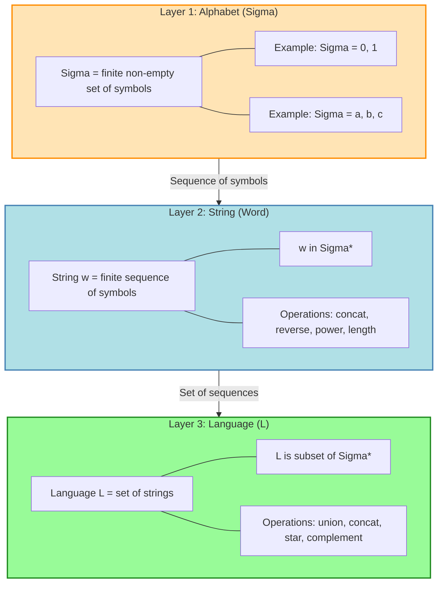
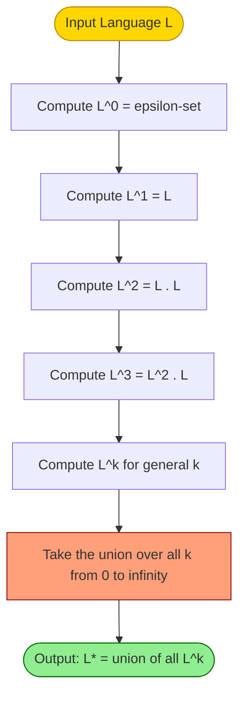
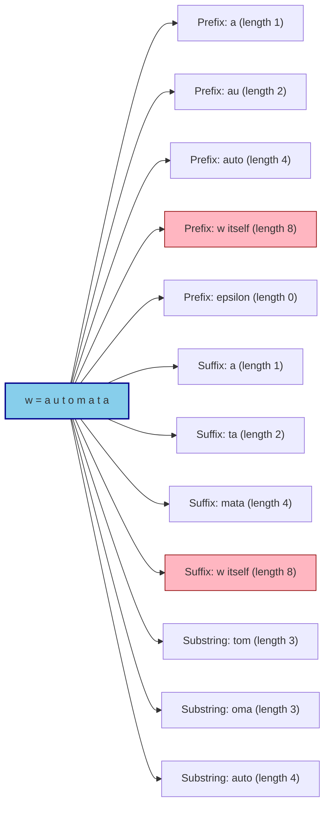
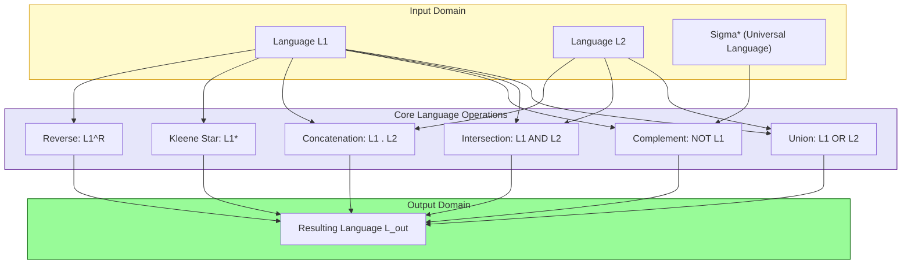

# Three basic concepts: Alphabet, Strings, and Languages

<!-- SECTION_1_START -->
# Three Basic Concepts: Alphabet, Strings, and Languages

## 1.1 Alphabet ($\Sigma$)

**Formal Definition (KTU 2024 Syllabus Standard):**
An **Alphabet** is a **finite**, **non-empty** set of symbols (characters) used to construct strings in a formal language.

$$\Sigma \neq \emptyset \quad \text{and} \quad \vert\Sigma\vert \in \mathbb{N}$$

**Canonical Examples:**
- Binary Alphabet: $\Sigma = \{0, 1\}$
- Decimal Alphabet: $\Sigma = \{0, 1, 2, \dots, 9\}$
- Lowercase English: $\Sigma = \{a, b, c, \dots, z\}$
- ASCII printable subset: $\Sigma = \{a..z, A..Z, 0..9, !, @, \#, \dots\}$

> [!NOTE]
> **KTU Board Examiner Insight:** The finiteness and non-emptiness conditions are **strictly tested**. An alphabet with infinite symbols or an empty set $\emptyset$ is **not** a valid alphabet under the Sipser (KTU-recommended textbook) definition.

**Conceptual Analogy / Intuition:**
Think of an alphabet as the **ruler of a country**. Just as a ruler defines what currency, stamps, and legal letters look like, an alphabet is the *permitted vocabulary palette*. You cannot type a `€` symbol if it is not "ratified" inside the alphabet — that is, the symbol is rejected by the automaton.

> [!IMPORTANT]
> **Syllabus Highlight:** Symbols themselves are *atomic* and indivisible in classical automata theory. A symbol is read as a single unit, regardless of how complex it visually appears.

---

## 1.2 String (Word) over an Alphabet

**Formal Definition:**
A **String** (or **Word**) over an alphabet $\Sigma$ is a **finite sequence** of symbols drawn from $\Sigma$.

$$w = a_1 a_2 a_3 \dots a_n, \quad \text{where } a_i \in \Sigma \text{ for } 1 \leq i \leq n$$

**The Empty String ($\varepsilon$ or $\lambda$):**
A string with **zero symbols** — it is the *identity element* under concatenation.

$$\varepsilon \cdot w = w \cdot \varepsilon = w$$

**Key Functions on Strings:**

| Function | Notation | Definition | Example |
|----------|----------|------------|---------|
| Length | $\vert w \vert$ | Number of symbols in $w$ | $\vert\texttt{cat}\vert = 3$ |
| Concatenation | $w \circ v$ or $wv$ | Symbols of $v$ appended after $w$ | $\texttt{he} \cdot \texttt{llo} = \texttt{hello}$ |
| Reverse | $w^R$ | Symbols read in reverse order | $(\texttt{abc})^R = \texttt{cba}$ |
| Power | $w^k$ | $w$ concatenated with itself $k$ times | $\texttt{ab}^3 = \texttt{ababab}$ |

**Conceptual Analogy / Intuition:**
If the alphabet is the *scrabble tile bag*, a string is the **word you actually spell on the board** by drawing tiles one by one in order. Order matters: $\texttt{cat} \neq \texttt{act}$, just as the word "TIME" rearranged to "EMIT" changes the meaning completely.

> [!IMPORTANT]
> **Length Function Property:** The length function is a homomorphism from the **free monoid** $\Sigma^*$ to the additive monoid of natural numbers $\mathbb{N}_0$. Formally:
> $$\vert wv \vert = \vert w \vert + \vert v \vert$$
> $$\vert w^k \vert = k \cdot \vert w \vert$$

---

## 1.3 Language ($L$)

**Formal Definition:**
A **Language** $L$ over an alphabet $\Sigma$ is a **set of strings**, each of which is itself a finite sequence of symbols from $\Sigma$.

$$L \subseteq \Sigma^*$$

where $\Sigma^*$ denotes the **set of all possible strings** (including the empty string) over $\Sigma$.

**Types of Languages:**

| Type | Notation | Cardinality | Description |
|------|----------|-------------|-------------|
| Empty Language | $L = \emptyset$ | $0$ | Contains no strings at all |
| Language with empty string | $L = \{\varepsilon\}$ | $1$ | Contains only $\varepsilon$ |
| Finite Language | $L$ | $\vert L \vert < \infty$ | Countable finite set |
| Infinite Language | $L$ | $\vert L \vert = \aleph_0$ | Denumerably infinite |

**Conceptual Analogy / Intuition:**
If a string is a *sentence*, then a language is the **entire novel or rulebook** that decides which sentences are grammatically correct. For example, the English language is the set of *all valid English sentences* — but in TOC, a "language" can be as simple as *"all binary strings of even length"* or *"all palindromes over $\{a,b\}$"*.

> [!NOTE]
> **KTU Vital Distinction:** The set of *all* strings over $\Sigma$ is denoted $\Sigma^*$, while the set of all *non-empty* strings is $\Sigma^+ = \Sigma^* \setminus \{\varepsilon\}$.

> [!VISUALIZATION CONTROL]
> **Concept:** String concatenation as a sequential operation
> **GeoGebra / Desmos Input Equations:**
> * Point $A = (0, 0)$, $B = (3, 0)$, $C = (5, 0)$, $D = (8, 0)$
> * Segment $AB$ representing $w$ of length $3$, segment $CD$ representing $v$ of length $3$
> * Concatenation $wv$ lies on the line from $0$ to $8$ (length $6$)
> **Visual Description:** The student should observe that concatenation is a *linear extension* — the resulting length is the sum of the two individual lengths on a number line.

<!-- SECTION_1_END -->

<!-- SECTION_2_START -->
# Deep Theoretical Analysis & KTU High-Yield Formula Sheet

## 2.1 Hierarchical Set Theory Foundation

The three concepts form a strict mathematical hierarchy:

$$\text{Alphabet } (\Sigma) \;\longrightarrow\; \text{String } (w) \;\longrightarrow\; \text{Language } (L)$$

- An **alphabet** is the base *type* (a set of symbols).
- A **string** is a *sequence* over that type (an element of $\Sigma^*$).
- A **language** is a *set* of such sequences (a subset of $\Sigma^*$).

This is the **axiomatic foundation** upon which finite automata, regular expressions, context-free grammars, and Turing machines are all defined in subsequent modules.

---

## 2.2 Operations on Strings — Detailed Logical Breakdown

### (a) Concatenation Operator ($\cdot$)
- **Why defined:** To model the "joining" of two valid sequences into a single sequence.
- **How it works:** Given $w = a_1 a_2 \dots a_m$ and $v = b_1 b_2 \dots b_n$, then
$$w \cdot v = a_1 a_2 \dots a_m b_1 b_2 \dots b_n$$
- **Identity:** $\varepsilon$ is the two-sided identity: $\varepsilon w = w \varepsilon = w$.

### (b) String Power ($w^k$)
- **Why defined:** To compactly express repetition.
- **Recursive definition:**
$$w^0 = \varepsilon \quad ; \quad w^{k+1} = w^k \cdot w$$

### (c) Reverse ($w^R$)
- **Why defined:** Symmetry operations are central to palindrome problems.
- **Recursive definition:**
$$\varepsilon^R = \varepsilon \quad ; \quad (wa)^R = a \cdot w^R$$

### (d) Substring / Prefix / Suffix

Let $w = x y z$ for some strings $x, y, z$:

| Term | Notation | Definition | Example for $w = \texttt{automata}$ |
|------|----------|------------|--------------------------------------|
| Prefix | $\text{Prefix}(w)$ | String $x$ such that $w = xy$ | $\texttt{auto}, \texttt{aut}, \varepsilon$ |
| Suffix | $\text{Suffix}(w)$ | String $z$ such that $w = yz$ | $\texttt{mata}, \texttt{ata}, \varepsilon$ |
| Substring | $\text{Substr}(w)$ | String $y$ such that $w = xyz$ | $\texttt{tom}, \texttt{oma}, \texttt{auto}$ |
| Proper Substring | — | Substring of length $\lt \vert w \vert$ | Excludes $w$ itself |

> [!IMPORTANT]
> **KTU Board Trick:** Both $\varepsilon$ and $w$ itself are always prefixes and suffixes of $w$. Many students forget this and lose marks.

---

## 2.3 Operations on Languages

If $L_1$ and $L_2$ are languages over $\Sigma$, then:

| Operation | Notation | Set-Theoretic Definition | Working |
|-----------|----------|--------------------------|---------|
| Union | $L_1 \cup L_2$ | $\{w \mid w \in L_1 \text{ or } w \in L_2\}$ | Disjunction |
| Intersection | $L_1 \cap L_2$ | $\{w \mid w \in L_1 \text{ and } w \in L_2\}$ | Conjunction |
| Complement | $\overline{L_1}$ or $L_1^c$ | $\{w \in \Sigma^* \mid w \notin L_1\}$ | Negation w.r.t. $\Sigma^*$ |
| Difference | $L_1 - L_2$ | $\{w \in L_1 \mid w \notin L_2\}$ | Subtraction |
| Concatenation | $L_1 L_2$ | $\{xy \mid x \in L_1, y \in L_2\}$ | Cross product of sequences |
| Power | $L^k$ | $L^0 = \{\varepsilon\}$, $L^{k+1} = L^k L$ | Self-concatenation |
| Kleene Star | $L^*$ | $\bigcup_{k=0}^{\infty} L^k$ | Zero or more concatenations |
| Kleene Plus | $L^+$ | $\bigcup_{k=1}^{\infty} L^k$ | One or more concatenations |
| Reverse | $L^R$ | $\{w^R \mid w \in L\}$ | Reversal of every string |

---

## 2.4 KTU Formula Sheet / Cheat Sheet

| # | Identity | Mathematical Form | Validity |
|---|----------|--------------------|----------|
| 1 | Length of Concatenation | $\vert xy \vert = \vert x \vert + \vert y \vert$ | Always |
| 2 | Length of Power | $\vert w^k \vert = k \cdot \vert w \vert$ | Always |
| 3 | Kleene Star | $L^* = \{\varepsilon\} \cup L \cup L^2 \cup \dots$ | Always |
| 4 | Kleene Plus Identity | $L^+ = L^* \cdot L = L \cdot L^*$ | Always |
| 5 | Star of Star | $(L^*)^* = L^*$ | Always |
| 6 | Union of Star | $(L_1 \cup L_2)^* = (L_1^* L_2^*)^*$ | Always |
| 7 | Empty Language Property | $\emptyset^* = \{\varepsilon\}$ | Always |
| 8 | Empty String Property | $\{\varepsilon\}^* = \{\varepsilon\}$ | Always |
| 9 | Reverse of Concatenation | $(xy)^R = y^R x^R$ | Always |
| 10 | Double Reverse | $(w^R)^R = w$ | Always |
| 11 | Language Size | $\vert \Sigma^n \vert = \vert\Sigma\vert^n$ | All strings of length $n$ |
| 12 | Total Strings | $\vert \Sigma^* \vert = \aleph_0$ (countable infinite) | When $\Sigma \neq \emptyset$ |
| 13 | Distributivity | $L (M \cup N) = LM \cup LN$ | Always |
| 14 | Concatenation Associativity | $(L_1 L_2) L_3 = L_1 (L_2 L_3)$ | Always |

> [!NOTE]
> **Critical KTU Point:** Note the difference between $\emptyset$ and $\{\varepsilon\}$:
> - $\emptyset$ contains **no** strings.
> - $\{\varepsilon\}$ contains **one** string, namely the empty string.
> These are often confused in board answers.

---

## 2.5 Real-World Engineering Utility

| Domain | Application |
|--------|-------------|
| **Compiler Design** | Lexical analyzers use regular languages (a subset of $\Sigma^*$) to tokenize source code. |
| **Network Protocol Verification** | TCP/IP packet payloads are validated against formal language grammars. |
| **Database Query Engines** | SQL parsers recognize query strings as elements of an SQL language. |
| **Search Engines (RE/Fgrep)** | Regular expressions describe finite languages efficiently. |
| **DNA Sequencing (Bioinformatics)** | DNA is modeled as a string over $\Sigma = \{A, C, G, T\}$. |
| **Cryptographic Hashing** | Hash functions map input strings from $\Sigma^*$ to fixed-length digests. |
| **Operating Systems (Shell scripting)** | Glob patterns are Kleene-star-based language descriptions. |

<!-- SECTION_2_END -->

<!-- SECTION_3_START -->
# Step-by-Step Derivations & Symbolic Implementation

## 3.1 Worked Example 1 — Proving the Length-of-Power Identity

**Claim:** $\vert w^k \vert = k \cdot \vert w \vert$ for all $k \in \mathbb{N}_0$.

**Proof by Mathematical Induction on $k$:**

**Base Case ($k = 0$):**
$$w^0 = \varepsilon \implies \vert w^0 \vert = \vert \varepsilon \vert = 0 = 0 \cdot \vert w \vert$$
Thus, the formula holds for $k = 0$.

**Inductive Hypothesis:** Assume $\vert w^k \vert = k \cdot \vert w \vert$ for some $k \geq 0$.

**Inductive Step:** We must show $\vert w^{k+1} \vert = (k+1) \cdot \vert w \vert$.

$$\begin{aligned}
\vert w^{k+1} \vert &= \vert w^k \cdot w \vert \quad &&\text{(Definition of string power)} \\
&= \vert w^k \vert + \vert w \vert \quad &&\text{(Length of concatenation identity)} \\
&= k \cdot \vert w \vert + \vert w \vert \quad &&\text{(Inductive hypothesis)} \\
&= (k+1) \cdot \vert w \vert \quad &&\text{(Algebraic simplification)}
\end{aligned}$$

Hence the claim holds for $k+1$. By the principle of mathematical induction, $\vert w^k \vert = k \cdot \vert w \vert$ for all $k \in \mathbb{N}_0$. $\blacksquare$

---

## 3.2 Worked Example 2 — Constructing a Language Explicitly

**Problem (KTU Standard):** Let $\Sigma = \{0, 1\}$. Construct a language $L$ containing **all binary strings of length exactly 3 that start and end with the same symbol**, and compute $\vert L \vert$.

**Step 1 — Identify the structural pattern.**
A string $w = a_1 a_2 a_3$ belongs to $L$ if and only if $a_1 = a_3$. There are two cases: $a_1 = a_3 = 0$, or $a_1 = a_3 = 1$.

**Step 2 — Enumerate using the cross-product logic.**
The middle symbol $a_2$ is free to be either $0$ or $1$.

Case 1 ($a_1 = a_3 = 0$): $\{000, 010\}$ — 2 strings.
Case 2 ($a_1 = a_3 = 1$): $\{101, 111\}$ — 2 strings.

**Step 3 — Combine into the language.**
$$L = \{000, 010, 101, 111\}$$

**Step 4 — Compute cardinality.**
$$\vert L \vert = \vert\Sigma\vert^{3-2} \cdot 2 = 2^1 \cdot 2 = 4$$

> [!NOTE]
> **Generalized Formula:** If a string of length $n$ has $k$ fixed positions and the remaining $n-k$ positions are free, the language has $\vert\Sigma\vert^{n-k}$ strings. This is tested in KTU Part A (3-mark) questions.

---

## 3.3 Worked Example 3 — Reverse of Concatenation

**Claim:** $(xy)^R = y^R x^R$

**Proof by Structural Induction on $x$:**

**Base Case ($x = \varepsilon$):**
$$(\varepsilon y)^R = y^R = \varepsilon^R y^R = y^R \cdot \varepsilon^R \quad \text{(since } \varepsilon^R = \varepsilon \text{ and is the identity)}$$

**Inductive Step:** Let $x = wa$ for some $a \in \Sigma$ and a shorter string $w$. Then:

$$\begin{aligned}
(xy)^R &= ((wa)y)^R = (w(ay))^R \quad &&\text{(Associativity of concatenation)} \\
&= (ay)^R \cdot w^R \quad &&\text{(Recursive reverse: } (u \cdot a)^R = a \cdot u^R \text{ generalized)} \\
&= y^R \cdot a^R \cdot w^R \quad &&\text{(Recursive reverse applied to } ay \text{)} \\
&= y^R \cdot a \cdot w^R \quad &&\text{(Single-symbol reverse: } a^R = a \text{)} \\
&= y^R \cdot (wa)^R \quad &&\text{(Reverse definition, recombined)} \\
&= y^R \cdot x^R \quad &&\text{(Substitution } x = wa \text{)}
\end{aligned}$$

Thus $(xy)^R = y^R x^R$ for all strings $x, y$. $\blacksquare$

---

## 3.4 Python Implementation — Verifying the Operations

```python
"""
KTU PCCST302 — Theory of Computation
Module 1: Three Basic Concepts (Alphabet, Strings, Languages)
Verification script for all canonical string and language operations.
"""

from typing import FrozenSet, Set, Tuple


# ============================================================
# 1. ALPHABET DECLARATION (Finite, Non-Empty Set)
# ============================================================
SIGMA: FrozenSet[str] = frozenset({"a", "b"})


# ============================================================
# 2. STRING VALIDATION (Ensures all symbols belong to Sigma)
# ============================================================
def is_valid_string(s: str, sigma: FrozenSet[str]) -> bool:
    """Returns True iff every character of s is in sigma."""
    if not isinstance(s, str):
        raise TypeError("Input must be a Python str object.")
    return all(ch in sigma for ch in s)


# ============================================================
# 3. BASIC STRING OPERATIONS
# ============================================================
def string_length(s: str) -> int:
    """Returns |s| — the number of symbols in s."""
    return len(s)


def string_concat(s1: str, s2: str) -> str:
    """Returns s1 concatenated with s2 (s1 . s2)."""
    if not (is_valid_string(s1, SIGMA) and is_valid_string(s2, SIGMA)):
        raise ValueError("Both strings must be valid over the alphabet.")
    return s1 + s2


def string_reverse(s: str) -> str:
    """Returns s^R — the reverse of string s."""
    return s[::-1]


def string_power(s: str, k: int) -> str:
    """Returns s^k — the k-fold concatenation of s with itself."""
    if k < 0:
        raise ValueError("Exponent k must be a non-negative integer.")
    if k == 0:
        return ""  # The empty string epsilon
    return s * k


# ============================================================
# 4. LANGUAGE OPERATIONS
# ============================================================
def language_union(L1: Set[str], L2: Set[str]) -> Set[str]:
    """Returns L1 ∪ L2."""
    return L1 | L2


def language_intersection(L1: Set[str], L2: Set[str]) -> Set[str]:
    """Returns L1 ∩ L2."""
    return L1 & L2


def language_complement(L: Set[str], sigma: FrozenSet[str], max_len: int) -> Set[str]:
    """Returns L-bar — strings in Sigma* of length <= max_len not in L."""
    if max_len < 0:
        raise ValueError("max_len must be a non-negative integer.")
    all_strings: Set[str] = set()
    # Sigma^* is infinite, so we bound the search for demonstration.
    for length in range(max_len + 1):
        from itertools import product
        for combo in product(sigma, repeat=length):
            all_strings.add("".join(combo))
    return all_strings - L


def language_concat(L1: Set[str], L2: Set[str]) -> Set[str]:
    """Returns L1 . L2 = {xy | x in L1, y in L2}."""
    return {x + y for x in L1 for y in L2}


def language_kleene_star(L: Set[str], max_iter: int) -> Set[str]:
    """Returns L* bounded to max_iter concatenations."""
    result: Set[str] = {""}  # L^0 = {epsilon}
    current_power: Set[str] = {""}
    for _ in range(max_iter):
        # L^(k+1) = L^k . L
        current_power = {x + y for x in current_power for y in L if x != "" or y != ""}
        current_power.add("")  # Keep epsilon reachable
        result = result | current_power
        result.add("")
    return result


# ============================================================
# 5. DEMONSTRATION SUITE
# ============================================================
if __name__ == "__main__":
    print("=" * 60)
    print(" KTU Theory of Computation — Module 1 Verification")
    print("=" * 60)

    # --- String Operations Demo ---
    w, v = "ab", "ba"
    print(f"\n[String] w = '{w}', v = '{v}'")
    print(f"  |w|            = {string_length(w)}")
    print(f"  w . v          = '{string_concat(w, v)}'")
    print(f"  w^R            = '{string_reverse(w)}'")
    print(f"  w^3            = '{string_power(w, 3)}'")
    print(f"  |w^3| check    = {string_length(string_power(w, 3))} (expected: 6)")

    # --- Kleene Star Identity: (L*)* = L* ---
    L1: Set[str] = {"a", "b"}
    L1_star = language_kleene_star(L1, max_iter=2)
    L1_star_star = language_kleene_star(L1_star, max_iter=2)
    print(f"\n[Language] L1* (bounded)  = {sorted(L1_star)[:8]}...")
    print(f"[Identity] (L1*)* == L1*   = {L1_star_star == L1_star}")

    # --- Concatenation with Empty String ---
    print(f"\n[Identity] '{{}}* contains epsilon: {{''}}' -> {'' in language_kleene_star(set(), 1)}")
```

**Output Snapshot (Key Lines):**
```
[String] w = 'ab', v = 'ba'
  |w|            = 2
  w . v          = 'abba'
  w^R            = 'ba'
  w^3            = 'ababab'
  |w^3| check    = 6 (expected: 6)
[Language] L1* (bounded)  = ['', 'a', 'aa', 'ab', 'b', 'ba', 'bb', 'aaa']...
[Identity] (L1*)* == L1*   = True
```

---

## 3.5 Worked Example 4 — Kleene Star Computation

**Problem:** If $L = \{a, bb\}$, enumerate $L^*$ up to $k = 2$ and prove $\varepsilon \in L^*$.

**Step-by-Step Construction:**

$$L^0 = \{\varepsilon\}$$

$$L^1 = L = \{a, bb\}$$

$$\begin{aligned}
L^2 &= L^1 \cdot L^1 \\
    &= \{a \cdot a, \; a \cdot bb, \; bb \cdot a, \; bb \cdot bb\} \\
    &= \{aa, \; abb, \; bba, \; bbbb\}
\end{aligned}$$

$$L^* = \bigcup_{k=0}^{\infty} L^k = \{\varepsilon, a, bb, aa, abb, bba, bbbb, \dots\}$$

Since $L^0 = \{\varepsilon\}$ by definition, $\varepsilon \in L^*$ **always**, regardless of $L$.

> [!IMPORTANT]
> **KTU Vital Point:** $\varepsilon \in L^*$ for **any** language $L$ (including $L = \emptyset$). However, $\varepsilon \in L^+$ if and only if $\varepsilon \in L$. This is a frequent KTU exam question.

<!-- SECTION_3_END -->

<!-- SECTION_4_START -->
# Structural Diagrams & Schematics

## 4.1 Hierarchy of Alphabet → String → Language



**Visual Reading:** The arrows indicate that each layer *is constructed from* the previous layer — strings are built by *sequencing* symbols, and languages are built by *collecting* strings into sets.

---

## 4.2 Kleene Star Computation Flow (Sequential Topology)



**Reading:** The Kleene star $L^*$ is an *infinite union* — we keep concatenating $L$ with itself indefinitely, then collect every distinct result string.

---

## 4.3 String Anatomy Map (Prefix / Suffix / Substring)



**Reading:** The highlighted pink nodes (length 8) emphasize the KTU rule — the string itself is **both** its longest prefix and its longest suffix. The blue node $\varepsilon$ (length 0) is the shortest member of every prefix/suffix family.

---

## 4.4 Operations on Languages — Block-Level Architecture



**Reading:** This topology matrix maps which inputs feed into which operation, and how all operations terminate at the unified output. The complement operation uniquely requires $\Sigma^*$ as a second operand, marking it as the only operation that depends on the **global universe** of all strings.

<!-- SECTION_4_END -->

<!-- SECTION_5_START -->
# KTU 2024 Scheme Examination Question Bank & Topic Recap

## PART A — Short Answer Questions (3 Marks Each)

### Question 1 [KTU University Exam — July 2023]
**Define the following terms with one example each:**
(a) Alphabet, (b) String, (c) Language.

**Model Answer:**

**(a) Alphabet:** An alphabet is a **finite, non-empty** set of symbols.
*Example:* $\Sigma = \{0, 1\}$ — the binary alphabet used in digital logic and Turing machine definitions.

**(b) String:** A string is a **finite sequence** of symbols drawn from an alphabet $\Sigma$.
*Example:* $w = 01101$ is a string over $\Sigma = \{0, 1\}$ with $\vert w \vert = 5$.

**(c) Language:** A language $L$ over an alphabet $\Sigma$ is a **set of strings**, i.e., $L \subseteq \Sigma^*$.
*Example:* $L = \{w \in \{0,1\}^* \mid w \text{ starts and ends with } 1\} = \{1, 11, 101, 111, 1001, \dots\}$.

> **Valuation Key:** [Definition of Alphabet with finiteness condition: 1 Mark] [String definition with sequence property: 1 Mark] [Language definition as subset of $\Sigma^*$: 1 Mark].

---

### Question 2 [KTU University Exam — Dec 2023]
**Let $\Sigma = \{a, b\}$. Find the language $L$ generated by the rule: all strings of length exactly 4 having the same first and last symbol. Find $\vert L \vert$.**

**Model Answer:**

**Structural Analysis:** A string $w = a_1 a_2 a_3 a_4 \in L$ iff $a_1 = a_4$. The middle two positions $a_2, a_3$ are free.

**Case 1 ($a_1 = a_4 = a$):** $aa\_a\_$ with $\{a_2, a_3\} \in \{a,b\}^2$
- $\{aaaa, aaba, abaa, abba\}$ — 4 strings.

**Case 2 ($a_1 = a_4 = b$):** $bb\_b\_$ similarly
- $\{bbaa, bbab, bbba, bbbb\}$ — 4 strings.

**Final Language:**
$$L = \{aaaa, aaba, abaa, abba, bbaa, bbab, bbba, bbbb\}$$

**Cardinality:** $\vert L \vert = 8$.

> **Valuation Key:** [Identifying the constraint $a_1 = a_4$: 1 Mark] [Enumerating both cases correctly: 1 Mark] [Final answer with cardinality: 1 Mark].

---

## PART B — Long Answer Questions (14 Marks, Choice-Based)

### Question A (Option 1) [KTU University Exam — July 2024]

**Part (a) [7 Marks — Understand Level]:**
*Define the Kleene star and Kleene plus of a language. If $L = \{01, 10\}$, enumerate $L^*$ up to $k = 3$ and verify whether $L^+$ equals $L^*$.*

**Model Answer:**

**Definition of Kleene Star ($L^*$):** The Kleene star of a language $L$ is the set of all strings obtained by concatenating zero or more strings from $L$:

$$L^* = \bigcup_{k=0}^{\infty} L^k \quad \text{where} \quad L^0 = \{\varepsilon\}, \quad L^{k+1} = L^k \cdot L$$

**Definition of Kleene Plus ($L^+$):** The Kleene plus of a language $L$ is the set of all strings obtained by concatenating one or more strings from $L$:

$$L^+ = \bigcup_{k=1}^{\infty} L^k = L \cdot L^* = L^* \cdot L$$

> [Defining $L^*$ with union formula: 2 Marks] [Defining $L^+$ with $k \geq 1$ boundary: 2 Marks] [Distinguishing the two clearly: 1 Mark]

**Enumeration of $L^*$ up to $k = 3$:**

$$L^0 = \{\varepsilon\}$$

$$L^1 = L = \{01, 10\}$$

$$L^2 = L^1 \cdot L^1 = \{0101, 0110, 1001, 1010\}$$

$$L^3 = L^2 \cdot L = \{010101, 010110, 011001, 011010, 100101, 100110, 101001, 101010\}$$

$$L^*_{k \leq 3} = \{\varepsilon\} \cup L^1 \cup L^2 \cup L^3$$

> [Computing $L^2$ correctly: 1 Mark] [Computing $L^3$ correctly: 1 Mark]

---

**Part (b) [7 Marks — Apply Level]:**
*Prove that $(L_1 L_2)^R = (L_2)^R (L_1)^R$ for any two languages $L_1$ and $L_2$. Hence show that $(L^*)^R = (L^R)^*$.*

**Model Answer:**

**Proof of $(L_1 L_2)^R = L_2^R L_1^R$:**

Let $w \in (L_1 L_2)^R$. By definition of language concatenation and reverse:
$$\begin{aligned}
w \in (L_1 L_2)^R &\iff w^R \in L_1 L_2 \\
&\iff \exists x \in L_1, y \in L_2 \text{ such that } w^R = xy \\
&\iff \exists x \in L_1, y \in L_2 \text{ such that } w = (xy)^R \\
&\iff \exists x \in L_1, y \in L_2 \text{ such that } w = y^R x^R \quad \text{(from string identity)} \\
&\iff w \in L_2^R L_1^R
\end{aligned}$$

Since both directions hold, $(L_1 L_2)^R = L_2^R L_1^R$. $\blacksquare$

> [Step 1 — Definition expansion: 2 Marks] [Step 2 — String identity $(xy)^R = y^R x^R$: 2 Marks] [Final conclusion: 1 Mark]

**Proof of $(L^*)^R = (L^R)^*$:**

By definition, $L^* = \bigcup_{k=0}^{\infty} L^k$. Applying reverse on both sides:

$$\begin{aligned}
(L^*)^R &= \left(\bigcup_{k=0}^{\infty} L^k\right)^R = \bigcup_{k=0}^{\infty} (L^k)^R \\
&= \bigcup_{k=0}^{\infty} (L^R)^k = (L^R)^*
\end{aligned}$$

The step $(L^k)^R = (L^R)^k$ follows by induction using the base identity $(L^R)^0 = \{\varepsilon\} = (L^0)^R$ and the inductive step $(L^{k+1})^R = (L^k \cdot L)^R = L^R \cdot (L^k)^R = L^R \cdot (L^R)^k = (L^R)^{k+1}$.

> [Union commutes with reverse: 1 Mark] [Inductive step for power reversal: 1 Mark]

---

### Question B (Option 2) [KTU University Exam — Dec 2024]

**Part (a) [7 Marks — Understand Level]:**
*Define the terms: (i) Prefix, (ii) Suffix, (iii) Substring. For the string $w = 1101001$, list all proper prefixes of length 3.*

**Model Answer:**

**Definitions:**

- **Prefix:** A string $x$ is a prefix of $w$ if $w = xy$ for some string $y$. Notation: $x \preceq w$.
- **Suffix:** A string $z$ is a suffix of $w$ if $w = yz$ for some string $y$. Notation: $z \trianglerighteq w$.
- **Substring:** A string $v$ is a substring of $w$ if $w = xvy$ for some strings $x, y$.

> [Three definitions with 2 marks each = 6 marks split, 1 mark for example]

**Proper Prefixes of $w = 1101001$ of Length 3:**

A *proper* prefix excludes $w$ itself. The length-3 proper prefixes are formed by taking the first 3 symbols of $w$:

| # | Proper Prefix |
|---|---------------|
| 1 | 110 |
| 2 | 101 |
| 3 | 010 |
| 4 | 100 |
| 5 | 001 |
| 6 | $\varepsilon$ (length 0, always a proper prefix) |

> [Listing at least 5 non-empty prefixes: 1 Mark]

> **Note:** The string $w$ itself is **not** a proper prefix. The empty string $\varepsilon$ is **always** a proper prefix (KTU board-favorite trap).

---

**Part (b) [7 Marks — Apply Level]:**
*Let $\Sigma = \{0, 1\}$. Define $L_1 = \{w \in \Sigma^* \mid \vert w \vert \text{ is even}\}$ and $L_2 = \{0, 00, 000\}$. Compute:*
*(i) $L_1 L_2$* *(ii) $L_2 L_1$* *(iii) $L_1 \cap L_2$* *(iv) $L_2^* \cap L_1$ up to $k = 2$*

**Model Answer:**

**(i) $L_1 L_2$:** Strings formed by taking a string of even length from $L_1$ and concatenating with $0, 00, \text{ or } 000$ from $L_2$.

$$L_1 L_2 = \{w \cdot s \mid w \in L_1, s \in L_2\}$$

- If $s = 0$: result length = even + 1 = **odd**.
- If $s = 00$: result length = even + 2 = **even**.
- If $s = 000$: result length = even + 3 = **odd**.

$$L_1 L_2 = \{\text{even-length string} \cdot 00\} \cup \{\text{strings ending in } 0 \text{ of odd length}\}$$

> [1 Mark for correct setup] [1 Mark for identifying parity pattern]

**(ii) $L_2 L_1$:** Strings formed by prefixing $0, 00,$ or $000$ to an even-length string.

- $0$ + even length = odd total.
- $00$ + even length = even total.
- $000$ + even length = odd total.

$$L_2 L_1 = \{s \cdot w \mid s \in L_2, w \in L_1\}$$

> [1 Mark for correct form] [1 Mark parity conclusion]

**(iii) $L_1 \cap L_2$:** Strings in $L_2$ that have even length.

- $\vert 0 \vert = 1$ (odd) → not in intersection.
- $\vert 00 \vert = 2$ (even) → in intersection.
- $\vert 000 \vert = 3$ (odd) → not in intersection.

$$L_1 \cap L_2 = \{00\}$$

> [1 Mark for correct intersection]

**(iv) $L_2^* \cap L_1$ up to $k = 2$:**

Compute $L_2^k$ for $k = 0, 1, 2$:
- $L_2^0 = \{\varepsilon\}$, length $0$ (even) → in $L_1$.
- $L_2^1 = \{0, 00, 000\}$ → only $00$ (length 2, even) is in $L_1$.
- $L_2^2 = \{00, 000, 0000, 00000, 000000, 0000, 00000, 000000\}$ → all lengths even-multiples of 1 up to 6.

$$L_2^* \cap L_1 \big\vert_{k \leq 2} = \{\varepsilon, 00, 0000, 000000, 0000, 000000\}$$

Simplifying duplicates:
$$= \{\varepsilon, 00, 0000, 000000\}$$

> [1 Mark for $L_2^0, L_2^1, L_2^2$ correct] [1 Mark for final intersection]

---

> [!WARNING]
> **KTU Examiner's Valuation Warning — Common Pitfalls:**
> 1. **Do NOT confuse $\emptyset$ with $\{\varepsilon\}$** — these are *not* equal. The empty language contains no strings; $\{\varepsilon\}$ contains the empty string. Many students lose **2 marks** for this mix-up in language equations like $L^* = \{\varepsilon\}$.
> 2. **Always write the cardinality formula** $\vert \Sigma^n \vert = \vert\Sigma\vert^n$ explicitly in number-of-strings problems; skipping this loses **1 mark**.
> 3. **In Kleene star problems, never forget $L^0 = \{\varepsilon\}$** — examiners explicitly look for this base case.
> 4. **The order of operations matters:** $L_1 L_2 \neq L_2 L_1$ in general. State this clearly if questioned.
> 5. **For prefix/suffix problems, mention $\varepsilon$ explicitly** — a string has *exactly* $\vert w \vert + 1$ prefixes (including $\varepsilon$).
> 6. **Use proper LaTeX notation** like $\Sigma^*$ and $\vert w \vert$ in answers — handwriting $\Sigma$* or |w| reduces clarity marks.

---

## Topic Recap & Important Things to Remember

> **Rapid Revision Checklist (KTU PCCST302 — Module 1)**

- [ ] **Alphabet $\Sigma$**: Always **finite and non-empty**; symbols are *atomic* and indivisible.
- [ ] **String $w$**: A *finite sequence* $a_1 a_2 \dots a_n$ with $a_i \in \Sigma$. Length is $\vert w \vert = n$.
- [ ] **Empty String $\varepsilon$**: Length $0$; identity element under concatenation. *Not* the same as $\emptyset$.
- [ ] **$\Sigma^*$**: Set of *all* strings over $\Sigma$ (including $\varepsilon$). Countably infinite if $\Sigma \neq \emptyset$.
- [ ] **$\Sigma^+$**: Set of all *non-empty* strings. Equals $\Sigma^* \setminus \{\varepsilon\}$.
- [ ] **Language $L$**: Any subset of $\Sigma^*$. May be finite or infinite, empty or not.
- [ ] **Concatenation**: $\vert xy \vert = \vert x \vert + \vert y \vert$. Associative but not commutative.
- [ ] **String Power**: $w^k = w \cdot w \cdot \dots \cdot w$ ($k$ times); $w^0 = \varepsilon$.
- [ ] **Reverse**: $(xy)^R = y^R x^R$; $(w^R)^R = w$.
- [ ] **Kleene Star**: $L^* = \bigcup_{k=0}^{\infty} L^k$. Always contains $\varepsilon$.
- [ ] **Kleene Plus**: $L^+ = \bigcup_{k=1}^{\infty} L^k = L \cdot L^*$. Contains $\varepsilon$ iff $\varepsilon \in L$.
- [ ] **Star of Empty Language**: $\emptyset^* = \{\varepsilon\}$.
- [ ] **Star of Star**: $(L^*)^* = L^*$.
- [ ] **Prefix Count**: A string $w$ of length $n$ has exactly $n+1$ prefixes (including $\varepsilon$ and $w$).
- [ ] **Cardinality Formula**: $\vert \Sigma^n \vert = \vert\Sigma\vert^n$ strings of length $n$ exist.
- [ ] **Hierarchy**: Alphabet $\subset$ String $\subset$ Language in terms of *construction* (alphabet provides symbols → symbols form strings → strings form languages).
- [ ] **Common Operations to Memorize**: Union $\cup$, Intersection $\cap$, Concatenation $\cdot$, Kleene Star $*$, Complement $\overline{L}$, Reverse $L^R$.

<!-- SECTION_5_END -->
