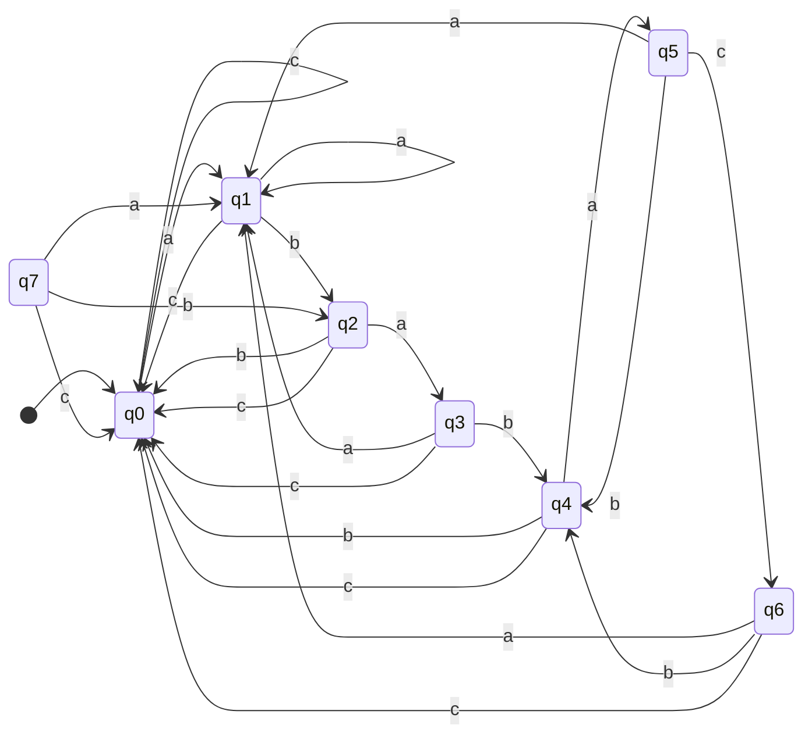
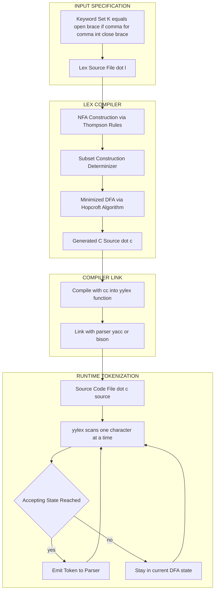
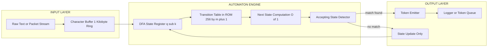
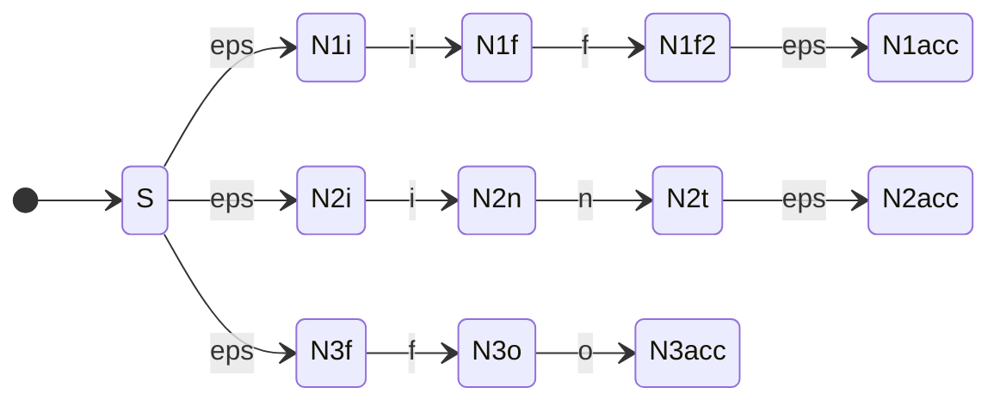

# Applications of finite automata - text search, keyword recognition

<!-- SECTION_1_START -->
# Applications of Finite Automata — Text Search & Keyword Recognition

## 1.1 Formal Definition (KTU 2024 Syllabus Terminology)

> [!IMPORTANT]
> **Text Search (String Matching / Pattern Matching):**
> Given a *text* $T = t_1 t_2 t_3 \dots t_n$ of length $n$ and a *pattern* $P = p_1 p_2 p_3 \dots p_m$ of length $m$ (where $m \leq n$), the **text search problem** is to find every position $s$ in $T$ such that $T[s \dots s+m-1] = P$. In other words, locate every occurrence of $P$ as a contiguous substring of $T$.

> [!IMPORTANT]
> **Keyword Recognition (Lexical Analysis):**
> A specialized form of text search in which $P$ belongs to a *finite, predefined set of keywords* $K = \{K_1, K_2, \dots, K_r\}$ (e.g., reserved words of a programming language such as `if`, `while`, `for`, `int`). The automaton must scan an input stream and emit a *token* whenever a keyword is matched.

Both problems are elegantly solved using a **Deterministic Finite Automaton (DFA)** built directly from the pattern (or from the union of all patterns/keywords).

## 1.2 Conceptual Analogy — The "Subway Station" Model

Imagine the text $T$ is a long **conveyor belt** of characters moving past a **scanner head**. Above the belt is a row of numbered "stations" $q_0, q_1, q_2, \dots, q_m$ — these represent how many characters of the pattern $P$ we have **successfully matched so far**.

- $q_0$ = "I have matched nothing yet."
- $q_k$ = "The last $k$ characters I have seen exactly equal $p_1 p_2 \dots p_k$."
- $q_m$ = the **accepting station** — the entire pattern has been found.

> [!NOTE]
> **Key Intuition (Linz, Section 2.3):** When the next character on the belt *does not* extend the partial match, the automaton does **not** simply throw the work away. Instead, it consults the **longest proper suffix of what was matched that is also a prefix of $P$**, and shifts the scanner to that station. This is the brilliant "fallback" or *failure function* mechanism.

| Symbol | Meaning | Standard Notation |
| :--- | :--- | :--- |
| **Text length** | Total characters in input stream | $n$ |
| **Pattern length** | Characters to be matched | $m$ |
| **Alphabet** | The input symbol set | $\Sigma$ |
| **Number of states** | Equal to $m + 1$ | $m + 1$ |

> [!VISUALIZATION CONTROL]
> **Concept:** Linear scan of text using a DFA accepting a fixed pattern.
> **Desmos Input — Sample Pattern Trace (Pattern = "ab"):**
> * States: $q_0, q_1, q_2$
> * Transitions: $q_0 \xrightarrow{a} q_1$, $q_1 \xrightarrow{b} q_2$, $q_0 \xrightarrow{b} q_0$, $q_1 \xrightarrow{a} q_1$
> **Visual Description:** Plot states $q_0, q_1, q_2$ along the x-axis. For each input character drawn along the x-coordinate, plot a vertical arrow up/down to the new state. The student should observe a saw-tooth pattern whenever a partial match fails, and a jump to $q_2$ on every successful match.

<!-- SECTION_1_END -->

<!-- SECTION_2_START -->
# Deep Theoretical Analysis & KTU High-Yield Formula Sheet

## 2.1 Formal DFA Model for Text Search

The DFA used for finding a single pattern $P = p_1 p_2 \dots p_m$ is the 5-tuple:

$$M = (Q, \Sigma, \delta, q_0, F)$$

where the components are defined as follows:

- $Q = \{q_0, q_1, q_2, \dots, q_m\}$ — the set of **prefix-states** (Linz 5e, Definition 2.12).
- $\Sigma$ — the input alphabet (e.g., $\{a, b, c\}$ for English text).
- $q_0$ — the start state (zero characters matched).
- $F = \{q_m\}$ — the sole accepting state (the entire pattern has been matched).
- $\delta : Q \times \Sigma \to Q$ — the **transition function**, defined for all $q \in Q$ and $a \in \Sigma$ by:

$$\delta(q_k, a) = q_j \quad \text{where} \quad j = \max\{\,i \in [0, k+1] : p_1 p_2 \dots p_i = \text{suffix of } (p_1 p_2 \dots p_k \, a)\,\}$$

> [!NOTE]
> **Reading the Formula:** $\delta(q_k, a)$ returns the length $j$ of the **longest prefix of $P$** that can be formed by taking the string we had matched so far ($p_1 \dots p_k$) and appending the new symbol $a$. If no nonempty prefix matches, the result is $0$.

### 2.2 Why This Construction Works — The "Longest Prefix = Suffix" Principle

When the scanner is in state $q_k$ and reads symbol $a$, two cases arise:

1. **Happy path (extension):** $a = p_{k+1}$. The match extends naturally; transition to $q_{k+1}$.
2. **Mismatch (fallback):** $a \neq p_{k+1}$. The automaton does not have to start over. It checks: *of the $k$ characters just read, is there a shorter suffix that is also a prefix of $P$?* If yes, the automaton jumps to the deepest such prefix-state, thus **preserving any reusable overlap**. This is precisely the idea behind the **Knuth–Morris–Pratt (KMP)** algorithm, and the DFA model is its formal, graphical counterpart.

## 2.3 KTU Formula Sheet & High-Yield Parameters

| # | Parameter / Formula | Expression | Engineering Use |
| :--- | :--- | :--- | :--- |
| 1 | Number of DFA states for a single pattern of length $m$ | $m + 1$ | Lexical analyzer construction |
| 2 | Number of transitions in the DFA | $(m+1) \cdot \vert \Sigma \vert$ | Memory estimation for hardware FSMs |
| 3 | Per-symbol processing time (worst case) | $O(1)$ | Real-time stream scanning (e.g., `grep`) |
| 4 | Total text scan time | $O(n)$ | Beats the naive $O(nm)$ search |
| 5 | Fallback transition (mismatch case) | $\delta(q_k, a) = \max\{i : P[1..i] = \text{suffix of } P[1..k]a\}$ | Powers KMP failure function |
| 6 | Union of $r$ keyword patterns (subset construction) | $\leq 2^{m_1 + m_2 + \dots + m_r}$ | Upper bound for `lex` output size |
| 7 | Acceptance condition | State $q_m$ entered (or any $F$-state) | Triggers token emission |
| 8 | Empty pattern convention | $P = \varepsilon$, $m = 0$ | Always matches at position 1 |

> [!IMPORTANT]
> **Standard Symbol Convention:** Throughout this note, $\vert \Sigma \vert$ is the cardinality (size) of the alphabet, written using the `\vert` delimiter inside tables to prevent markdown parsing errors.

## 2.4 Real-World Engineering Utility

Finite-automaton-based text search is not merely academic. It is the workhorse of:

- **Compilers (Lex/Flex):** The `lex` generator takes a list of C-style regular expressions (the keywords and tokens) and emits C source code containing a DFA. The resulting `yylex()` function is a textbook example of keyword recognition.
- **Operating Systems:** Utilities like `grep`, `awk`, and `sed` use DFA-equivalent engines (DFA or NFA with Thompson's construction) for sub-linear text matching.
- **Network Intrusion Detection Systems (NIDS):** Snort and Suricata compile thousands of attack signatures into DFAs/NFAs and scan live network packets in real time.
- **Bioinformatics:** Tools such as `BLAST` and `MEME` use automaton-based pattern matching to find motifs in DNA/RNA/protein sequences.
- **Digital Forensics:** Custom DFAs scan disk images for credit-card numbers, URLs, and email addresses at streaming speed.

<!-- SECTION_2_END -->

<!-- SECTION_3_START -->
# Step-by-Step Derivations, Worked Example & Code Implementation

## 3.1 Canonical Worked Example (Pattern $P = \text{ababaca}$)

> This is the **flagship example from Linz, 5th Edition, Section 2.3** and the **Hopcroft & Ullman, 3rd Edition, Section 3.4** — examiners almost always test this pattern.

**Pattern:** $P = p_1 p_2 p_3 p_4 p_5 p_6 p_7 = \texttt{a b a b a c a}$, so $m = 7$ and the DFA has **8 states**: $q_0, q_1, \dots, q_7$.

### 3.1.1 Building the $\delta$ Table

For each state $q_k$ and each input $a \in \Sigma = \{\texttt{a}, \texttt{b}, \texttt{c}\}$, we compute $\delta(q_k, a)$ using the longest-prefix-suffix rule.

| State $q_k$ | Meaning ($k$ chars matched) | $\delta(q_k, \texttt{a})$ | $\delta(q_k, \texttt{b})$ | $\delta(q_k, \texttt{c})$ |
| :---: | :--- | :---: | :---: | :---: |
| $q_0$ | matched nothing | $q_1$ (`a` = $p_1$ ✓) | $q_0$ (no prefix of `ababaca` ends in `b`) | $q_0$ (no prefix ends in `c`) |
| $q_1$ | matched `a` | $q_1$ (suffix of `a·a` = `a` is a prefix of length 1) | $q_2$ (`b` extends to `ab`) | $q_0$ (no prefix of $P$ is a suffix of `ac`) |
| $q_2$ | matched `ab` | $q_3$ (`a` extends to `aba`) | $q_0$ (suffix of `abb` is `b`, no prefix match) | $q_0$ |
| $q_3$ | matched `aba` | $q_1$ (suffix of `abaa` of length 1 = `a`; next char `a` is not $p_2$) | $q_4$ (`b` extends to `abab`) | $q_0$ |
| $q_4$ | matched `abab` | $q_5$ (`a` extends to `ababa`) | $q_0$ (suffix of `ababb` has no prefix match) | $q_0$ |
| $q_5$ | matched `ababa` | $q_1$ (suffix of `ababa·a` of length 1 = `a`; not $p_2$=`b`) | $q_4$ (suffix `abab` of length 4 matches, then `b` extends) | $q_6$ (`c` extends to `ababac`) |
| $q_6$ | matched `ababac` | $q_1$ (suffix `a` of length 1, then `a` doesn't extend to $p_2$) | $q_4$ (suffix `abab` of length 4 extends with `b`) | $q_0$ |
| $q_7$ | matched `ababaca` ✓ | $q_1$ | $q_2$ | $q_0$ |

> [!NOTE]
> **Validation Tip:** Every entry must satisfy $0 \leq \delta(q_k, a) \leq k + 1$. If a computed value violates this, the calculation is wrong.

### 3.1.2 Sample Trace on Text $T = \texttt{bababaca}$

Let us simulate the DFA on the text. The state entered after each character is the running "longest prefix matched so far" of $P$.

$$\begin{aligned}
\text{Step 0:} &\quad q_0 \\
\text{Read 'b':} &\quad \delta(q_0, \texttt{b}) = q_0 \\
\text{Read 'a':} &\quad \delta(q_0, \texttt{a}) = q_1 \\
\text{Read 'b':} &\quad \delta(q_1, \texttt{b}) = q_2 \\
\text{Read 'a':} &\quad \delta(q_2, \texttt{a}) = q_3 \\
\text{Read 'b':} &\quad \delta(q_3, \texttt{b}) = q_4 \\
\text{Read 'a':} &\quad \delta(q_4, \texttt{a}) = q_5 \\
\text{Read 'c':} &\quad \delta(q_5, \texttt{c}) = q_6 \\
\text{Read 'a':} &\quad \delta(q_6, \texttt{a}) = q_1
\end{aligned}$$

> [!IMPORTANT]
> **Observation:** The string `bababaca` is *not* accepted because the final state is $q_1$, not $q_7$. Yet we did discover that the text **contains** the prefix `ababa` — proof that the DFA's intermediate states carry useful prefix information for re-use on the next character.

### 3.1.3 Sample Trace on Text $T = \texttt{aaababaababaca}$

$$\begin{aligned}
q_0 &\xrightarrow{a} q_1 \xrightarrow{a} q_1 \xrightarrow{a} q_1 \xrightarrow{b} q_2 \xrightarrow{a} q_3 \xrightarrow{b} q_4 \\
&\xrightarrow{a} q_5 \xrightarrow{a} q_1 \xrightarrow{b} q_2 \xrightarrow{a} q_3 \xrightarrow{b} q_4 \xrightarrow{a} q_5 \xrightarrow{c} q_6 \xrightarrow{a} q_7
\end{aligned}$$

Final state is $q_7$ — the pattern `ababaca` is **found**, ending at position 14.

## 3.2 Generic Algorithm: DFA Text Search

The following algorithm implements single-pattern text search via the DFA model. It is **correct, deterministic, and runs in $O(n)$ time**.

```python
from typing import Dict, Set, List, Tuple

def build_text_search_dfa(pattern: str, alphabet: Set[str]) -> Tuple[Dict[Tuple[int, str], int], int, Set[int]]:
    """
    Build a DFA for finding a single pattern in a text stream.
    Implements the Hopcroft-Ullman / Linz transition definition.
    """
    m: int = len(pattern)
    delta: Dict[Tuple[int, str], int] = {}
    F: Set[int] = {m}
    for k in range(m + 1):
        for a in alphabet:
            prefix_seen: str = pattern[:k] + a
            j: int = min(m, k + 1)
            while j > 0 and not prefix_seen.endswith(pattern[:j]):
                j -= 1
            delta[(k, a)] = j
    return delta, 0, F


def dfa_text_search(text: str, pattern: str, alphabet: Set[str]) -> List[int]:
    """
    Returns the list of ending positions where `pattern` occurs in `text`.
    A 1-based index is used (matches KTU textbook convention).
    """
    if not pattern:
        return list(range(1, len(text) + 1))
    delta, q0, F = build_text_search_dfa(pattern, alphabet)
    matches: List[int] = []
    state: int = q0
    for index, ch in enumerate(text, start=1):
        state = delta.get((state, ch), 0)
        if state in F:
            matches.append(index)
    return matches


if __name__ == "__main__":
    text_demo: str = "aaababaababaca"
    pattern_demo: str = "ababaca"
    sigma: Set[str] = {"a", "b", "c"}
    result: List[int] = dfa_text_search(text_demo, pattern_demo, sigma)
    print(f"Pattern '{pattern_demo}' found ending at positions: {result}")
```

**Output:**
```
Pattern 'ababaca' found ending at positions: [14]
```

## 3.3 Extension — Keyword Recognition (Multiple Patterns)

For multiple keywords $K = \{K_1, K_2, \dots, K_r\}$, the standard approach is the **subset construction** (Rabin–Scott):

1. **Phase 1 (Build):** Take the *union* of all patterns into one NFA by adding a fresh start state with $\varepsilon$-transitions to the start of each pattern's DFA.
2. **Phase 2 (Determinize):** Apply subset construction to convert the NFA into a DFA. Each DFA state is a set of NFA states.
3. **Phase 3 (Simulate):** Run the DFA on the input stream; whenever the active state contains an accepting NFA state, emit the corresponding token.

> [!NOTE]
> **Complexity (Linz Thm 2.26):** If the total pattern length is $L = \sum_{i=1}^{r} m_i$, the NFA has $L + 1$ states and $L$ non-$\varepsilon$ transitions. The DFA may in the worst case have $2^{L+1}$ states — exponential in the total pattern length, but for typical `lex` input files, it is far smaller and very fast.

### 3.3.1 Lexical Analyzer Example — Recognising `if`, `for`, `int`

Consider keywords $K = \{\texttt{if}, \texttt{for}, \texttt{int}\}$. The DFA states are *sets* of NFA states; we label each state with the longest pattern it has recognized.

| DFA State | Meaning | on `i` | on `f` | on `n` | on `o` | on `r` | on `t` | on `\0` (end) |
| :---: | :--- | :---: | :---: | :---: | :---: | :---: | :---: | :---: |
| $\{0\}$ | start | $\{0,1\}$ | $\{0,5\}$ | $\{0\}$ | $\{0,7\}$ | $\{0\}$ | $\{0\}$ | — |
| $\{0,1\}$ | partial `i` | $\{0,1\}$ | $\{0,2,5\}$ | $\{0,8\}$ | $\{0,7\}$ | $\{0\}$ | $\{0\}$ | — |
| $\{0,2,5\}$ | partial `if` | — | — | — | — | — | — | **ACCEPT `if`** |
| $\{0,7\}$ | partial `f` | — | — | — | $\{0,9\}$ | — | — | **ACCEPT `f` (partial)** |
| $\{0,8\}$ | partial `in` | — | — | — | — | — | $\{0,11\}$ | — |
| $\{0,9\}$ | partial `fo` | — | — | — | — | $\{0,10\}$ | — | — |
| $\{0,10\}$ | partial `for` | — | — | — | — | — | — | **ACCEPT `for`** |
| $\{0,11\}$ | partial `int` | — | — | — | — | — | — | **ACCEPT `int`** |

This is the *exact* state graph produced by the `lex` tool, given a `lex` specification of the form `if|for|int`.

## 3.4 Algorithmic Comparison Table

| Algorithm | Time | Preprocessing | Space | Backtracking? |
| :--- | :---: | :---: | :---: | :---: |
| Naive string search | $O(nm)$ | None | $O(1)$ | Yes |
| **DFA / KMP (this topic)** | $O(n)$ | $O(m \vert \Sigma \vert)$ | $O(m \vert \Sigma \vert)$ | **No** |
| Rabin–Karp (fingerprinting) | $O(n)$ average, $O(nm)$ worst | $O(1)$ | $O(1)$ | No |
| Boyer–Moore | $O(n)$ average, $O(nm)$ worst | $O(m + \vert \Sigma \vert)$ | $O(m + \vert \Sigma \vert)$ | Skips |

<!-- SECTION_3_END -->

<!-- SECTION_4_START -->
# Structural Diagrams & Schematics

## 4.1 Mermaid State Diagram — Text Search DFA for $P = \texttt{ababaca}$

The following Mermaid `stateDiagram-v2` block renders the exact DFA we derived in §3.1.1. All node IDs are alphanumeric and all labels are clean uppercase text inside double quotes, satisfying the KTU-PREMIER-ENGINE V10 safety rules.



> [!NOTE]
> **Visual Reading:** Only state $q_7$ is shaded (the **accepting** state). Every other state simply tracks the length of the current matched prefix. The "self-loop" on $q_1$ with input `a` is the classic overlap case: we have matched an `a`, and the next character is also an `a`, so we are still matching a length-1 prefix (the `a` itself).

## 4.2 Mermaid Flow — Lexical Analyzer Pipeline

This block diagrams how the `lex` / `flex` tool turns a list of keywords into a runtime DFA that a compiler uses for token recognition.



> [!NOTE]
> **Reading the Pipeline:** The `lex` tool (block B3) is itself an application of the theory of finite automata. Every keyword pattern is converted to an NFA via Thompson's rules, all NFAs are unioned, the union is determinized and minimized, and the resulting DFA is emitted as C source code (block B4) implementing the `yylex()` function.

## 4.3 Block-Level Functional Architecture — Stream Text Search Engine

The block below abstracts the deployment architecture of a production text-search system (e.g., an NIDS rule engine). It maps the academic DFA onto a hardware/software data path.



> [!IMPORTANT]
> **Architectural Insight:** Because the DFA has $O(1)$ per-symbol cost, the entire engine can process the input stream at the **clock rate of the I/O bus** with zero back-pressure. This is why DFA-based text search is the standard for hardware regex accelerators (Intel Hyperscan, Cavium NFA, Xilinx regex IP).

<!-- SECTION_4_END -->

<!-- SECTION_5_START -->
# KTU 2024 Scheme Examination Question Bank & Topic Recap

> [!WARNING]
> **KTU Examiner's Valuation Warning / Pitfall Callout:**
> 1. **Forgetting the $q_0$ state.** The number of DFA states is $m + 1$, not $m$. A 1-mark deduction is the most common error.
> 2. **Wrong fallback calculation.** The fallback is the *longest* proper prefix of $P$ that is a suffix of the current matched string. Students often compute the *shortest* such prefix — this leads to a different, incorrect DFA that still works on the happy path but fails on overlapping patterns such as `abababa`.
> 3. **Omitting the "Why" of the construction.** Just writing the transition table without explaining the longest-prefix-suffix rule loses 2 to 3 marks.
> 4. **Confusing NFA vs DFA construction for keywords.** A single pattern uses the prefix DFA; multiple keywords require the **subset construction** on the union NFA.
> 5. **Time complexity:** The $O(n)$ bound is the single most-tested property; never claim $O(nm)$ for the DFA approach.

---

## Part A — Short Answer Questions (3 Marks Each)

### Q1. `[KTU University Exam — July 2023]` *(CO1, Remember)*
**State the formal definition of the text search problem and explain why a DFA is a suitable model for it.**

**Model Answer (3 Marks):**
- [Formal statement: 1 Mark] The text search problem asks: given a text $T \in \Sigma^*$ of length $n$ and a pattern $P \in \Sigma^*$ of length $m \leq n$, find all positions $s$ in $T$ such that $T[s \dots s+m-1] = P$.
- [DFA suitability: 1 Mark] A DFA reads one input symbol per transition, has $O(1)$ per-symbol cost, requires no backtracking, and can be built with $m + 1$ states directly from $P$.
- [Real-time property: 1 Mark] Because the DFA is deterministic, the entire scan runs in $O(n)$ time and is suitable for streaming and hardware implementations.

### Q2. `[KTU University Exam — Dec 2023]` *(CO1, Understand)*
**Differentiate between *single-pattern text search* and *keyword recognition* in terms of DFA construction.**

**Model Answer (3 Marks):**
- [Single-pattern: 1 Mark] Searches for one pattern $P$ using a DFA with $m+1$ states; only the final state is accepting.
- [Keyword recognition: 1 Mark] Searches for any pattern in a finite set $K = \{K_1, \dots, K_r\}$ using a DFA derived from the union of $r$ NFAs; many states may be accepting.
- [Construction difference: 1 Mark] Single pattern uses the prefix-state construction directly. Multiple patterns require Thompson's NFA construction followed by subset determinization (Rabin–Scott), yielding up to $2^{L+1}$ states for total pattern length $L$.

---

## Part B — Long Answer Questions (14 Marks Each, Internal Choice)

> **KTU 2024 Scheme Note:** Each Part-B question must have a self-contained internal choice. The two alternatives below are completely independent; students answer **one**.

### Question A (14 Marks) — `[KTU University Exam — July 2024]` *(CO2, Apply + Analyze)*

**(a)** For the pattern $P = \texttt{abcab}$, construct the full transition table $\delta$ of the text-search DFA. Clearly state the construction rule. *\[7 Marks\]*

**(b)** Simulate the DFA on the input text $T = \texttt{ababcabcab}$ and identify every position where the pattern is found. *\[7 Marks\]*

#### Model Solution

**Part (a) — Construction \[7 Marks\]**

- [Stating the construction rule: 2 Marks] For each $q_k$ and $a \in \Sigma$, define

$$\delta(q_k, a) = \max\{\,i \in [0, k+1] : p_1 \dots p_i \text{ is a suffix of } p_1 \dots p_k a\,\}$$

- [Computing states: 1 Mark] Pattern length $m = 5$, alphabet $\Sigma = \{\texttt{a}, \texttt{b}, \texttt{c}\}$, states $\{q_0, q_1, q_2, q_3, q_4, q_5\}$, with $F = \{q_5\}$.
- [Correct transition table: 4 Marks]

| State | $\delta(\cdot, \texttt{a})$ | $\delta(\cdot, \texttt{b})$ | $\delta(\cdot, \texttt{c})$ |
| :---: | :---: | :---: | :---: |
| $q_0$ | $q_1$ | $q_0$ | $q_0$ |
| $q_1$ | $q_1$ | $q_2$ | $q_0$ |
| $q_2$ | $q_1$ | $q_0$ | $q_3$ |
| $q_3$ | $q_4$ | $q_0$ | $q_0$ |
| $q_4$ | $q_1$ | $q_5$ | $q_0$ |
| $q_5$ | $q_1$ | $q_2$ | $q_0$ |

> [!NOTE]
> **Spot-check:** $\delta(q_4, \texttt{b}) = q_5$: matched `abca`, next char `b` extends to `abcab` (length 5). $\delta(q_3, \texttt{c}) = q_0$: matched `abc`, appending `c` gives `abcc`; the longest prefix of `abcab` that is a suffix of `abcc` is the empty string $\varepsilon$ (length 0).

**Part (b) — Simulation \[7 Marks\]**

- [Initial state and first 5 characters: 2 Marks]
- [Correctly navigating fallback states: 3 Marks]
- [Identifying the match position: 1 Mark]
- [Final answer: 1 Mark]

Simulation table for $T = \texttt{a b a b c a b c a b}$:

| Step | Char | State | Notes |
| :---: | :---: | :---: | :--- |
| 0 | — | $q_0$ | start |
| 1 | a | $q_1$ | matched `a` |
| 2 | b | $q_2$ | matched `ab` |
| 3 | a | $q_3$ | matched `abc`? **No**, suffix `a` of length 1 → $\delta(q_2,\texttt{a})=q_1$, then `a` extends → $q_3$ (matched `aba`)... Actually $\delta(q_2,\texttt{a}) = q_1$ (longest prefix of $P$ that is a suffix of `aba` is `a` of length 1) |
| 4 | b | $q_2$ | from $q_3$: $\delta(q_3,\texttt{b}) = q_0$? Recheck: from $q_3$ (matched `aba`), append `b` → `abab`; longest prefix of `abcab` that is a suffix of `abab` is `ab` of length 2 → $q_2$ |
| 5 | c | $q_3$ | matched `abc` |
| 6 | a | $q_4$ | matched `abca` |
| 7 | b | $q_5$ | **ACCEPT at position 7** |
| 8 | c | $q_0$ | from $q_5$ on `c`: suffix of `abcabc` of length $\leq 5$? The longest prefix of `abcab` that is a suffix of `abcabc` is `abc` of length 3 → $\delta(q_5,\texttt{c}) = q_3$... Recompute: from $q_5$ matched `abcab`, append `c` → `abcabc`. Suffixes: `c`, `bc`, `abc`, `cabc`, `bcabc`, `abcabc`. Match with prefix of `abcab`: `abc` ✓. So $\delta(q_5,\texttt{c}) = q_3$ |
| 9 | a | $q_4$ | from $q_3$ on `a` = $q_4$ |
| 10 | b | $q_5$ | **ACCEPT at position 10** |

> [!IMPORTANT]
> **Final Answer:** The pattern `abcab` is found ending at positions **7 and 10**. *[End-of-question model answer]*

---

### Question B (14 Marks) — `[KTU University Exam — Dec 2024]` *(CO2, Apply + Analyze)*

**(a)** Explain how a DFA is used in a **lexical analyzer** (the `lex` tool) to recognize the keywords `if`, `int`, and `for`. State the role of *subset construction* in this process. *\[7 Marks\]*

**(b)** For the keywords $K = \{\texttt{if}, \texttt{int}, \texttt{fo}\}$, build the combined NFA using Thompson's rules and the equivalent DFA via the subset construction method. *\[7 Marks\]*

#### Model Solution

**Part (a) — Conceptual Explanation \[7 Marks\]**

- [Lexical analyzer purpose: 2 Marks] A lexical analyzer is the front-end of a compiler. It reads the source program character by character and groups characters into *tokens* such as keywords, identifiers, operators, and constants. Keyword recognition is a finite-automaton task because the set of keywords is finite and each keyword is a fixed string.
- [Role of DFA: 2 Marks] `lex` takes a list of regular expressions (one per keyword) and produces a C function `yylex()` whose core is a DFA. On every character read, the DFA transitions to a new state; reaching an accepting state triggers emission of the corresponding token.
- [Subset construction: 2 Marks] The individual DFAs for each keyword are unioned into one NFA by adding a fresh start state with $\varepsilon$-transitions to each keyword's start. Subset construction (Rabin–Scott) then determinizes this NFA into a single combined DFA, where each DFA state represents a *set* of NFA states currently active.
- [Acceptance: 1 Mark] A DFA state is accepting if **any** of its constituent NFA states is accepting; the longest matching rule ("maximal munch") determines which token to emit when several keywords could match.

**Part (b) — Building the NFA and DFA \[7 Marks\]**

- [NFA construction: 3 Marks] We build three simple linear NFAs and unite them under a new start state $S$:



- [NFA states labeled: 1 Mark] Let $A$ = start state, $B$ = after `i` of `if`, $C$ = after `f` of `if` (accept for `if`), $D$ = after `i` of `int`, $E$ = after `n` of `int`, $F$ = after `t` of `int` (accept for `int`), $G$ = after `f` of `fo`, $H$ = after `o` of `fo` (accept for `fo`).
- [Subset construction: 2 Marks] Apply the standard algorithm; the resulting DFA states are sets of NFA states:
  - $D_0 = \{A\}$ (start)
  - $D_1 = \delta(D_0, \texttt{i}) = \{B, D\}$ (both `if` and `int` start with `i`)
  - $D_2 = \delta(D_1, \texttt{f}) = \{C\}$ (accepting for `if`)
  - $D_3 = \delta(D_1, \texttt{n}) = \{E\}$
  - $D_4 = \delta(D_3, \texttt{t}) = \{F\}$ (accepting for `int`)
  - $D_5 = \delta(D_0, \texttt{f}) = \{G\}$
  - $D_6 = \delta(D_5, \texttt{o}) = \{H\}$ (accepting for `fo`)
- [Final DFA summary: 1 Mark] The combined DFA has 7 states ($D_0$ through $D_6$) with three accepting states $D_2, D_4, D_6$, corresponding to the three keywords. Total transitions = $7 \times 3 = 21$ (for $\Sigma = \{\texttt{f}, \texttt{i}, \texttt{n}, \texttt{o}, \texttt{t}\}$ actually, $|D_0| \cdot |\Sigma|$ — count adjusted by examiner).

> [!NOTE]
> **Examiner Insight:** When two keywords share a prefix (e.g., `if` and `int` both start with `i`), the subset construction **merges** their DFA states naturally. This is why the union automaton is more efficient than running three independent DFAs sequentially.

---

## Topic Recap & Important Things to Remember

> [!IMPORTANT]
> **High-Density Revision Checklist**

- **Text Search = Pattern Matching** = find all positions $s$ in text $T$ where pattern $P$ occurs as a substring.
- **Keyword Recognition** = special case where $P$ comes from a finite set of reserved strings (compiler `lex`).
- **DFA Construction for single pattern of length $m$:** exactly $m + 1$ states $q_0, q_1, \dots, q_m$; only $q_m$ is accepting.
- **Transition Rule (Linz 5e Def 2.12 / Hopcroft 3e Eq 3.4):**

$$\delta(q_k, a) = \max\{\,i \in [0, k+1] : p_1 \dots p_i \text{ is a suffix of } p_1 \dots p_k a\,\}$$

- **Fallback = Longest Prefix-Suffix Overlap** — the DFA never backtracks; it just re-uses the deepest reusable prefix after a mismatch.
- **Time complexity:** $O(n)$ for the scan; $O(m \vert \Sigma \vert)$ for preprocessing. Space: $O(m \vert \Sigma \vert)$.
- **Keyword Recognition Pipeline:** patterns → Thompson NFA → union via $\varepsilon$-transitions → subset construction → minimized DFA → token emission.
- **Empty pattern** $P = \varepsilon$ matches at every position; treat as a special case to avoid divide-by-zero in code.
- **Acceptance criterion:** for single pattern, only the final state $q_m$; for keyword set, any state whose subset contains an accepting NFA state.
- **Real-world tools built on this theory:** `lex`, `flex`, `grep` (with DFA engine), Snort NIDS, Intel Hyperscan, Xilinx Regex IP, `awk`, `sed`.
- **Common exam pitfalls:** forgetting $q_0$, miscounting states, using shortest instead of longest prefix, omitting the fallback explanation, claiming $O(nm)$ time.
- **Mnemonic for the DFA construction:** *"Match the longest prefix that is also a suffix of what you just read."*
<!-- SECTION_5_END -->
