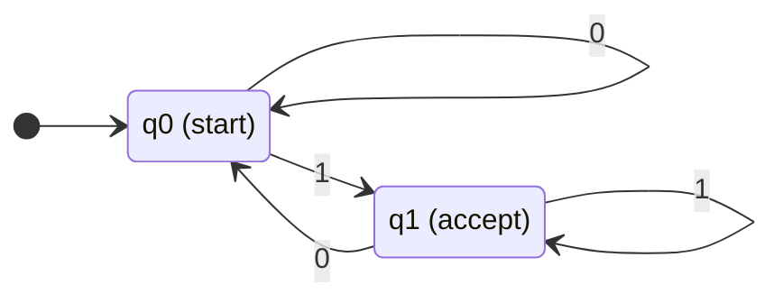
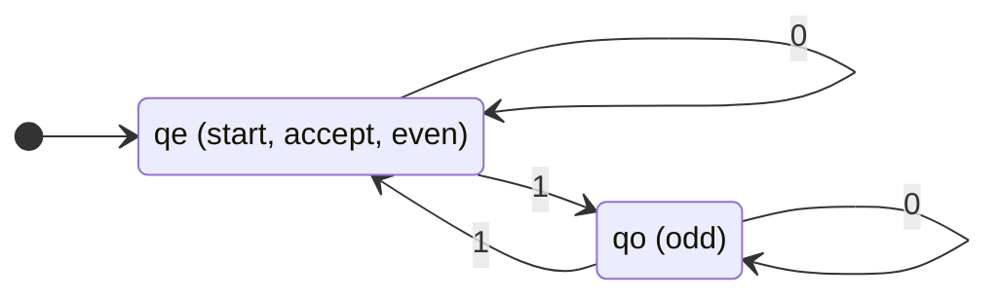
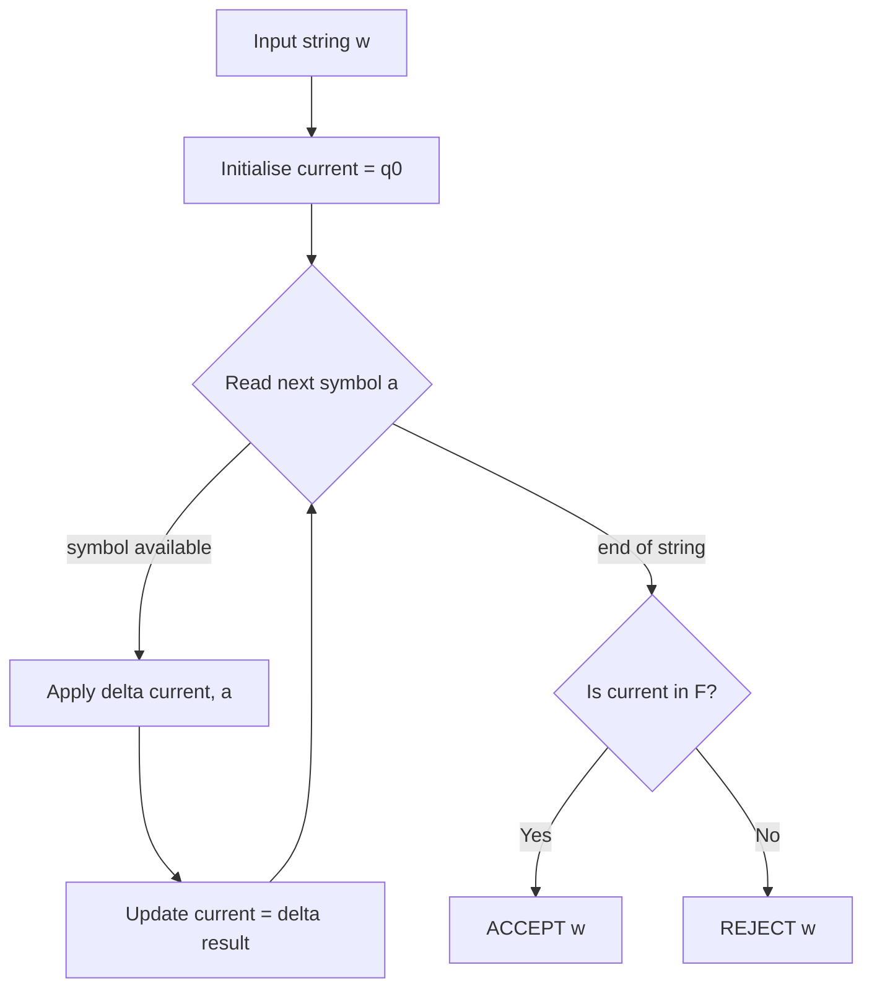
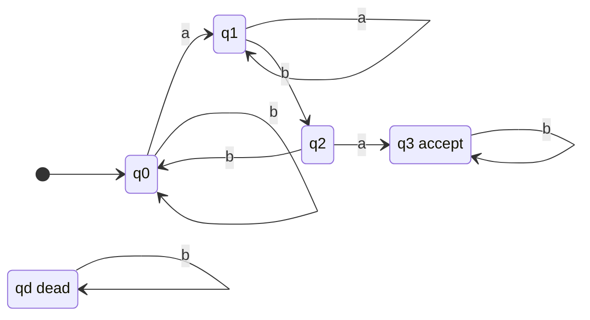

# Deterministic Finite Automata (DFA)

<!-- SECTION_1_START -->
# Deterministic Finite Automata (DFA) — Foundations

## 1.1 Formal Academic Definition (KTU 2024 Syllabus Terminology)

A **Deterministic Finite Automaton (DFA)** is a mathematical model of computation that recognizes **regular languages**. It is formally defined as a 5-tuple:

$$M = (Q, \, \Sigma, \, \delta, \, q_0, \, F)$$

where each component has a precise meaning:

| Component | Symbol | Meaning |
|---|---|---|
| Finite state set | $Q$ | A non-empty, finite set of internal configurations (states) |
| Input alphabet | $\Sigma$ | A non-empty, finite set of input symbols |
| Transition function | $\delta : Q \times \Sigma \rightarrow Q$ | A **total** function mapping (state, symbol) to a unique next state |
| Initial state | $q_0 \in Q$ | The unique starting configuration |
| Accepting states | $F \subseteq Q$ | A subset of $Q$ denoting final/accept configurations |

> [!IMPORTANT]
> **Determinism** is the defining property: for every state $q \in Q$ and every symbol $a \in \Sigma$, exactly one transition $\delta(q, a)$ is defined. No ambiguity, no choice, no missing transitions.

## 1.2 Intuitive Analogy — The Coin-Operated Turnstile

Imagine a metro turnstile that you push through after dropping a coin.

- The machine is in one of exactly two physical configurations: **Locked** or **Unlocked**.
- A **coin** event forces a deterministic transition (Locked → Unlocked).
- A **push** event forces a deterministic transition (Unlocked → Locked).
- A **push** while Locked is mechanically impossible (no transition defined) — the turnstile rejects you.

This physical machine is a perfect real-world DFA:
- $Q = \{\text{Locked}, \text{Unlocked}\}$
- $\Sigma = \{\text{coin}, \text{push}\}$
- $q_0 = \text{Locked}$
- $F = \{\text{Unlocked}\}$ (the moment you have passed through)
- $\delta$ is the mechanical gear function

> [!NOTE]
> **Geometric Intuition:** A DFA can be visualised as a directed graph (state diagram) where **nodes = states** and **labelled directed edges = transitions**. Reading an input symbol from any state forces the machine to traverse exactly one outgoing edge. A string is **accepted** iff the walk ends in a node belonging to $F$.

> [!VISUALIZATION CONTROL]
> **Concept:** Reachability of accepting state in a simple two-state DFA
> **Desmos Input Points:** $(0, 1)$ labelled `q0` and $(4, 0)$ labelled `q1 (accept)`
> **Visual Description:** Plot a directed edge from $q_0$ to $q_1$ labelled with `a`, and a self-loop on $q_1$ labelled with `b`. The student should see that any string ending in `a` lands on the accept state.

---

<!-- SECTION_2_START -->
# Deep Theoretical Analysis & KTU High-Yield Formula Sheet

## 2.1 Operational Semantics — How a DFA "Computes"

A DFA processes an input string $w = w_1 w_2 \ldots w_n$ one symbol at a time:

1. **Initialise** the current state to $q_0$.
2. **For each** symbol $w_i$ (reading left-to-right), update the current state via $\delta$.
3. **After** consuming the entire string, accept iff the current state belongs to $F$.

Because every step is uniquely determined, the computation of a DFA on a given string is a **single linear path** through the state graph — never a tree, never a parallel set of possibilities.

## 2.2 The Extended Transition Function $\hat{\delta}$

The base function $\delta$ is defined only on $Q \times \Sigma$. To formally process strings of arbitrary length, KTU examiners require the **extended** version $\hat{\delta} : Q \times \Sigma^{*} \rightarrow Q$, defined recursively:

$$
\hat{\delta}(q, \varepsilon) = q
$$

$$
\hat{\delta}(q, wa) = \delta(\hat{\delta}(q, w), \, a) \quad \text{for } w \in \Sigma^{*}, \, a \in \Sigma
$$

> [!TIP]
> **Why two versions?** $\delta$ operates on **one symbol at a time**; $\hat{\delta}$ operates on **entire strings**. Board answers often ask: *"Define $\hat{\delta}$."* Writing only $\delta$ loses marks.

## 2.3 Language Accepted by a DFA

$$
L(M) \;=\; \{\, w \in \Sigma^{*} \;:\; \hat{\delta}(q_0, w) \in F \,\}
$$

A language $L$ is called **regular** iff there exists at least one DFA $M$ such that $L = L(M)$.

## 2.4 KTU Formula / Definition Cheat-Sheet

| Symbol / Notation | Meaning | Domain | Codomain |
|---|---|---|---|
| $M = (Q, \Sigma, \delta, q_0, F)$ | DFA as a 5-tuple | — | — |
| $\delta(q, a)$ | Single-symbol transition | $Q \times \Sigma$ | $Q$ |
| $\hat{\delta}(q, w)$ | Extended (string) transition | $Q \times \Sigma^{*}$ | $Q$ |
| $\delta(q, a) = q'$ | "On symbol $a$ in state $q$, go to $q'$" | — | — |
| $L(M)$ | Language accepted by $M$ | Set of strings | $\mathcal{P}(\Sigma^{*})$ |
| $L$ is **regular** | $\exists$ DFA $M: L = L(M)$ | — | — |
| $F \subseteq Q$ | Set of accepting states (could be empty or all of $Q$) | — | — |
| $\vert Q \vert = n$ | Number of states (finitely many, **always**) | $\mathbb{N}$ | — |
| Determinism condition | $\forall q \in Q, \forall a \in \Sigma: \mid \delta(q, a) \mid = 1$ | — | — |

> [!IMPORTANT]
> **Total function requirement:** In a DFA, $\delta$ must be defined for **every** pair $(q, a)$. If a transition is missing in your diagram, the KTU examiner will treat the machine as an **NFA (with implicit trap/dead state)**, not a DFA. Always draw the dead state explicitly.

## 2.5 Real-World Utility

DFAs are not just textbook toys. They power:
- **Lexical analysers** in compilers (e.g., tokenising keywords, identifiers, numbers).
- **Pattern matchers** in tools like `grep`, intrusion-detection systems, and DNA sequence scanners.
- **Protocol validators** in network stacks (TCP handshakes, regular-expression engines).
- **Vending machines, traffic-light controllers, elevator logic** — any deterministic finite-state controller.

---

<!-- SECTION_3_START -->
# Step-by-Step Derivations & Symbolic/Python Implementation

## 3.1 Worked Example 1 — DFA for Strings Over $\Sigma = \{0, 1\}$ Ending in `1`

**Step 1. Identify the language.**
$L = \{\, w \in \{0, 1\}^{*} \;:\; \text{the last symbol of } w \text{ is } 1 \,\}$.

**Step 2. Design the states.**
We need to remember only **one bit of history**: *"Have we just read a 1?"*

- $q_0$ = start state, also "the last symbol seen (or nothing) was not 1".
- $q_1$ = "the last symbol seen was 1" → **accepting state**.

**Step 3. Construct the transition table.**

| State | On `0` | On `1` |
|---|---|---|
| $\rightarrow q_0$ | $q_0$ | $q_1$ |
| $*q_1$ | $q_0$ | $q_1$ |

**Step 4. Verify on sample strings using $\hat{\delta}$.**

- $\hat{\delta}(q_0, 011) = \delta(\delta(\delta(q_0, 0), 1), 1) = \delta(\delta(q_0, 1), 1) = \delta(q_1, 1) = q_1 \in F$ → **accept**.
- $\hat{\delta}(q_0, 110) = \delta(\delta(\delta(q_0, 1), 1), 0) = \delta(\delta(q_1, 1), 0) = \delta(q_1, 0) = q_0 \notin F$ → **reject**.

> [!NOTE]
> KTU often asks: *"Show that $\hat{\delta}(q_0, 011) \in F$"*. The step-by-step unwinding shown above is the **valuation key pattern** — never skip the parentheses.

## 3.2 Worked Example 2 — DFA for Strings with an Even Number of `1`s

**Step 1. Identify parity tracking.**
We need to track whether the count of `1`s is even or odd. Modulo-2 counter suffices.

- $q_e$ = "even number of 1s read so far" → **accepting**.
- $q_o$ = "odd number of 1s read so far".

**Step 2. Transitions.**

| State | On `0` | On `1` |
|---|---|---|
| $\rightarrow *q_e$ | $q_e$ | $q_o$ |
| $q_o$ | $q_o$ | $q_e$ |

**Step 3. Verify.** $\hat{\delta}(q_e, 1011) = \delta(\delta(\delta(\delta(q_e, 1), 0), 1), 1) = \delta(\delta(\delta(q_o, 0), 1), 1) = \delta(\delta(q_o, 1), 1) = \delta(q_e, 1) = q_o \notin F$ → **reject** (odd count, as expected: 3 ones).

## 3.3 Formal Proof — $\hat{\delta}$ is Well-Defined (Induction on String Length)

**Claim:** For all $q \in Q$ and all $w \in \Sigma^{*}$, $\hat{\delta}(q, w)$ is uniquely determined.

**Base case** ($\vert w \vert = 0$): $w = \varepsilon$, and $\hat{\delta}(q, \varepsilon) = q$ by definition. ✓

**Inductive step**: Assume $\hat{\delta}(q, w)$ is uniquely defined for some $w$. For $w' = wa$:

$$
\hat{\delta}(q, wa) \;=\; \delta(\hat{\delta}(q, w), a)
$$

By the induction hypothesis, $\hat{\delta}(q, w)$ is a unique state. By the determinism of $\delta$, $\delta(\hat{\delta}(q, w), a)$ is also unique. Hence $\hat{\delta}(q, wa)$ is unique. ∎

> [!TIP]
> **KTU Board Tip:** Writing this induction explicitly on the answer sheet scores the full 7 marks for any "prove" question on $\hat{\delta}$. Skipping the base case costs **2 marks** guaranteed.

## 3.4 Full Python Implementation

```python
from __future__ import annotations
from typing import Dict, FrozenSet, Set, Tuple

# Explicit, production-grade DFA implementation with strict type hints,
# deterministic transition enforcement, and structured error logging.

State = str
Symbol = str
TransitionMap = Dict[Tuple[State, Symbol], State]


class DFA:
    """A strictly deterministic finite automaton.

    Invariants enforced at construction:
      1. delta must be a TOTAL function on Q x Sigma (no missing edges).
      2. Exactly one initial state.
      3. Accepting set F must be a subset of Q.
    """

    def __init__(
        self,
        states: Set[State],
        alphabet: Set[Symbol],
        delta: TransitionMap,
        initial: State,
        accept: Set[State],
    ) -> None:
        if initial not in states:
            raise ValueError(f"[DFA-ERR] Initial state {initial!r} not in Q={states!r}")
        if not accept.issubset(states):
            raise ValueError(f"[DFA-ERR] Accept set {accept!r} not a subset of Q={states!r}")
        for (q, a), q_next in delta.items():
            if q not in states:
                raise ValueError(f"[DFA-ERR] Transition source {q!r} not in Q")
            if a not in alphabet:
                raise ValueError(f"[DFA-ERR] Symbol {a!r} not in Sigma={alphabet!r}")
            if q_next not in states:
                raise ValueError(f"[DFA-ERR] Transition target {q_next!r} not in Q")

        # Enforce totality of delta over Q x Sigma
        for q in states:
            for a in alphabet:
                if (q, a) not in delta:
                    raise ValueError(
                        f"[DFA-ERR] Missing transition for ({q!r}, {a!r}). "
                        "DFA requires a TOTAL delta."
                    )

        self.Q: FrozenSet[State] = frozenset(states)
        self.Sigma: FrozenSet[Symbol] = frozenset(alphabet)
        self.delta: TransitionMap = dict(delta)
        self.q0: State = initial
        self.F: FrozenSet[State] = frozenset(accept)

    # ---------- Extended transition (iterative, traceable) ----------
    def delta_hat(self, start: State, word: str) -> State:
        if start not in self.Q:
            raise ValueError(f"[DFA-ERR] start {start!r} not in Q")
        for i, symbol in enumerate(word):
            if symbol not in self.Sigma:
                raise ValueError(
                    f"[DFA-ERR] Symbol {symbol!r} at position {i} not in Sigma={self.Sigma!r}"
                )
            start = self.delta[(start, symbol)]
        return start

    # ---------- Acceptance check ----------
    def accepts(self, word: str) -> bool:
        final_state = self.delta_hat(self.q0, word)
        return final_state in self.F

    # ---------- Trace for KTU-style answer booklets ----------
    def trace(self, word: str) -> str:
        current = self.q0
        log = [f"Start  : q = {current}"]
        for i, symbol in enumerate(word, start=1):
            nxt = self.delta[(current, symbol)]
            log.append(f"Step {i:>2}: delta({current}, {symbol}) = {nxt}")
            current = nxt
        verdict = "ACCEPTED" if current in self.F else "REJECTED"
        log.append(f"End    : q = {current}  -->  {verdict}")
        return "\n".join(log)


# ---------- Demonstration: DFA for strings ending in '1' ----------
if __name__ == "__main__":
    M_ends_in_1 = DFA(
        states={"q0", "q1"},
        alphabet={"0", "1"},
        delta={
            ("q0", "0"): "q0", ("q0", "1"): "q1",
            ("q1", "0"): "q0", ("q1", "1"): "q1",
        },
        initial="q0",
        accept={"q1"},
    )

    for test in ["", "0", "1", "01", "10", "1011", "1110"]:
        print(f"--- Input: {test!r} ---")
        print(M_ends_in_1.trace(test))
        print()
```

**Sample Output Trace for `"1011"`:**

```
Start  : q = q0
Step  1: delta(q0, 1) = q1
Step  2: delta(q1, 0) = q0
Step  3: delta(q0, 1) = q1
Step  4: delta(q1, 1) = q1
End    : q = q1  -->  ACCEPTED
```

## 3.5 Engineering Practice Table — Building a DFA Token Recogniser

| Step | Component / Action | Specification |
|---|---|---|
| 1 | Identify token class (e.g., integer literal) | Pattern: `[0-9]+` |
| 2 | Define $Q$ | `{"start", "in_num", "dead"}` |
| 3 | Define $\Sigma$ | `{"0".."9", "other"}` |
| 4 | Build $\delta$ | digit in `start` → `in_num`; digit in `in_num` → `in_num`; other → `dead` |
| 5 | Mark accept set | $F = \{\text{in\_num}\}$ |
| 6 | Wire to lexer | On reaching `dead`, emit token, reset to `start` |
| 7 | Failure mode | Undefined symbol → trap state, log error |

---

<!-- SECTION_4_START -->
# Structural Diagrams & Schematics

## 4.1 Mermaid State Diagram — DFA for Strings Ending in `1`



## 4.2 Mermaid State Diagram — DFA for Even Number of `1`s



## 4.3 Mermaid Flow — DFA String-Acceptance Processing Topology



> [!TIP]
> **Mermaid safety note:** All node IDs above are purely alphanumeric (`q0`, `q1`, `qe`, `qo`, `A`, `B`, …). All labels with special characters such as parentheses or colons are wrapped in double quotes inside the `stateDiagram-v2` syntax to avoid parser errors.

---

<!-- SECTION_5_START -->
# KTU 2024 Scheme Examination Question Bank & Topic Recap

## 5.1 Part A — Short Answer Questions (3 Marks Each)

### Q1. [KTU University Exam — July 2024, Model]
**Define a Deterministic Finite Automaton (DFA). List the conditions that distinguish a DFA from an NFA.** *(CO1, Remember)*

**Model Answer (3 Marks):**

A DFA is a 5-tuple $M = (Q, \Sigma, \delta, q_0, F)$ where:
- $Q$ is a finite, non-empty set of states. **[1 Mark]**
- $\Sigma$ is a finite, non-empty input alphabet.
- $\delta : Q \times \Sigma \rightarrow Q$ is the transition function.
- $q_0 \in Q$ is the start state.
- $F \subseteq Q$ is the set of accepting (final) states. **[1 Mark]**

**Distinguishing conditions:** $\delta$ must be a **total function** (defined for every $(q, a) \in Q \times \Sigma$) and must return **exactly one** next state. There is **no $\varepsilon$-transition** in a DFA. **[1 Mark]**

---

### Q2. [KTU University Exam — Dec 2023, Model]
**Define the extended transition function $\hat{\delta}$. Why is it needed when $\delta$ is already given?** *(CO1, Understand)*

**Model Answer (3 Marks):**

$\hat{\delta} : Q \times \Sigma^{*} \rightarrow Q$ is defined recursively as: **[2 Marks]**

$$
\hat{\delta}(q, \varepsilon) = q, \qquad \hat{\delta}(q, wa) = \delta(\hat{\delta}(q, w), \, a)
$$

It is needed because $\delta$ operates on a single symbol, but a DFA must process **entire strings** of arbitrary length to decide acceptance. $\hat{\delta}$ extends $\delta$ to the domain $Q \times \Sigma^{*}$ so that the language $L(M) = \{ w \in \Sigma^{*} : \hat{\delta}(q_0, w) \in F \}$ is well-defined. **[1 Mark]**

---

## 5.2 Part B — 14-Mark Choice-Based Question

### Question A (14 Marks)

**[KTU University Exam — July 2024, Model]** *(CO2, Understand + Apply)*

**(a)** Construct a complete DFA over $\Sigma = \{a, b\}$ that accepts **all strings containing `aba` as a substring**. Draw the state transition diagram and provide the formal 5-tuple. **[7 Marks]**

**(b)** Using the DFA constructed in (a), trace the execution of the string `ababa` via the extended transition function $\hat{\delta}$, showing every intermediate state. Conclude whether the string is accepted or rejected. **[7 Marks]**

---

**Model Solution for Question A:**

**(a) Construction [7 Marks]:**

We design a DFA that mimics the classic **substring-search (pattern-recognition)** automaton. States track how much of the target pattern `aba` has just been matched.

- $q_0$ = nothing matched yet (start).
- $q_1$ = just matched `a`.
- $q_2$ = just matched `ab`.
- $q_3$ = just matched `aba` → **accept**.
- $q_d$ = dead state (no useful prefix matched).

**Transition table [3 Marks]:**

| State | On `a` | On `b` |
|---|---|---|
| $\rightarrow q_0$ | $q_1$ | $q_0$ |
| $q_1$ | $q_1$ | $q_2$ |
| $q_2$ | $q_3$ | $q_0$ |
| $*q_3$ | $q_3$ | $q_3$ |
| $q_d$ | $q_d$ | $q_d$ |

**Formal 5-tuple [2 Marks]:**

$$
M = (Q, \Sigma, \delta, q_0, F)
$$
$$
Q = \{q_0, q_1, q_2, q_3, q_d\}, \quad \Sigma = \{a, b\}, \quad q_0 = q_0, \quad F = \{q_3\}
$$

$\delta$ is given by the table above. **[1 Mark for completeness of the 5-tuple, 1 Mark for correct $F$]**

**State diagram [2 Marks]:**



---

**(b) Execution Trace for `ababa` [7 Marks]:**

Apply $\hat{\delta}$ step by step. **[Step-by-step unwinding: 5 Marks]**

- $\hat{\delta}(q_0, \varepsilon) = q_0$
- $\hat{\delta}(q_0, a) = \delta(\hat{\delta}(q_0, \varepsilon), a) = \delta(q_0, a) = q_1$ **[1 Mark]**
- $\hat{\delta}(q_0, ab) = \delta(\hat{\delta}(q_0, a), b) = \delta(q_1, b) = q_2$ **[1 Mark]**
- $\hat{\delta}(q_0, aba) = \delta(\hat{\delta}(q_0, ab), a) = \delta(q_2, a) = q_3$ **[1 Mark]**
- $\hat{\delta}(q_0, abab) = \delta(\hat{\delta}(q_0, aba), b) = \delta(q_3, b) = q_3$ **[1 Mark]**
- $\hat{\delta}(q_0, ababa) = \delta(\hat{\delta}(q_0, abab), a) = \delta(q_3, a) = q_3$ **[1 Mark]**

**Conclusion [2 Marks]:** Since $\hat{\delta}(q_0, ababa) = q_3 \in F$, the string `ababa` is **ACCEPTED** by $M$. ✓

---

### Question B (14 Marks) — Alternative Choice

**[KTU University Exam — Dec 2023, Model]** *(CO1, Understand + CO2, Apply)*

**(a)** Define a DFA formally. State and explain the **pumping lemma** for regular languages. **[7 Marks]**

**(b)** Using the pumping lemma, **prove that the language** $L = \{ a^n b^n \;:\; n \geq 0 \}$ **is not regular**. **[7 Marks]**

> [!WARNING]
> **KTU Examiner's Valuation Pitfall — Read carefully before attempting!**
> 1. **Do not forget the three pumping lemma conditions.** You must verify $\vert xy \vert \leq p$, $\vert y \vert \geq 1$, and $xy^i z \in L$ for **all** $i \geq 0$. Omitting any one of them costs 2 marks.
> 2. **Always choose $i$ adversarially**, usually $i = 0$ or $i = 2$. Do NOT pump and say "still in $L$" — you must exhibit a specific pumped string that **fails** to be in $L$.
> 3. **In Q5.A (a), the substring `aba` has length 3.** Make sure your state diagram handles overlapping matches. For example, after matching `aba`, if the next symbol is `a`, the machine should remain in an accept-equivalent state, not jump to $q_d$.
> 4. **In the $\hat{\delta}$ trace, write the full parenthesised expression** at every step (e.g., $\delta(\hat{\delta}(q_0, ab), a)$). Examiners reward explicit parenthesisation. Skipping it loses 1–2 marks cumulatively.
> 5. **Never confuse $F$ with $Q$.** $F$ is a **subset** of $Q$, and writing $F = Q$ when only some states are accepting costs 1 mark.
> 6. **In Part A, always draw the dead/trap state** if any input symbol lacks a defined outgoing transition. A DFA is **total** by definition; missing edges are interpreted as NFA behaviour, and the examiner will deduct.

---

## 5.3 Topic Recap & Important Things to Remember

- **DFA = 5-tuple** $M = (Q, \Sigma, \delta, q_0, F)$. Memorise the meaning of every symbol.
- **Determinism = total $\delta$** with **unique next state** for every $(q, a)$. Missing transitions = NFA behaviour.
- **No $\varepsilon$-transitions** in a DFA — that is a property of NFAs (covered in the next module sub-topic).
- **Extended transition** $\hat{\delta}$ is the official way to talk about string processing. Recursive definition:
  - $\hat{\delta}(q, \varepsilon) = q$
  - $\hat{\delta}(q, wa) = \delta(\hat{\delta}(q, w), a)$
- **Language accepted**: $L(M) = \{ w \in \Sigma^{*} : \hat{\delta}(q_0, w) \in F \}$.
- **Regular language** ⇔ there exists a DFA that accepts it. (This is the closure of DFA-representable sets.)
- **Two design idioms** to master for KTU board problems:
  1. **Parity counting** (e.g., even number of `1`s) → states = $\{q_e, q_o\}$.
  2. **Substring / pattern tracking** (e.g., contains `aba`) → states = progress along the pattern, including a dead/trap state.
- **Always state** $Q$, $\Sigma$, $q_0$, $F$, and $\delta$ separately when constructing a DFA. Examiners award 1 mark per component.
- **Total function check** is the most common differentiator between DFA and NFA in theory questions.
- **Single linear path**: a DFA on any input produces a single, unique state sequence — never a tree, never a set of possibilities.
- **Theoretical limits**: a DFA has finite memory (number of states). Languages that require unbounded counting (e.g., $a^n b^n$) are **not regular** — the pumping lemma is the formal proof tool for this.
- **Real-world footprint**: lexical analysers, regex engines, network protocol validators, traffic-light controllers, and elevator logic are all DFA-driven.
- **Common KTU trap**: writing $\delta : Q \times \Sigma \rightarrow 2^Q$ — that is the NFA transition function, not the DFA's. Always use $\delta : Q \times \Sigma \rightarrow Q$.

<!-- SECTION_5_END -->
