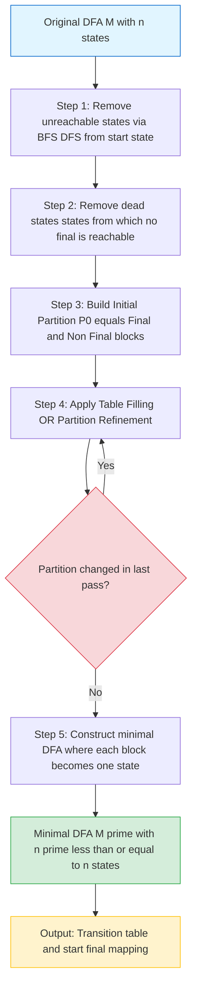
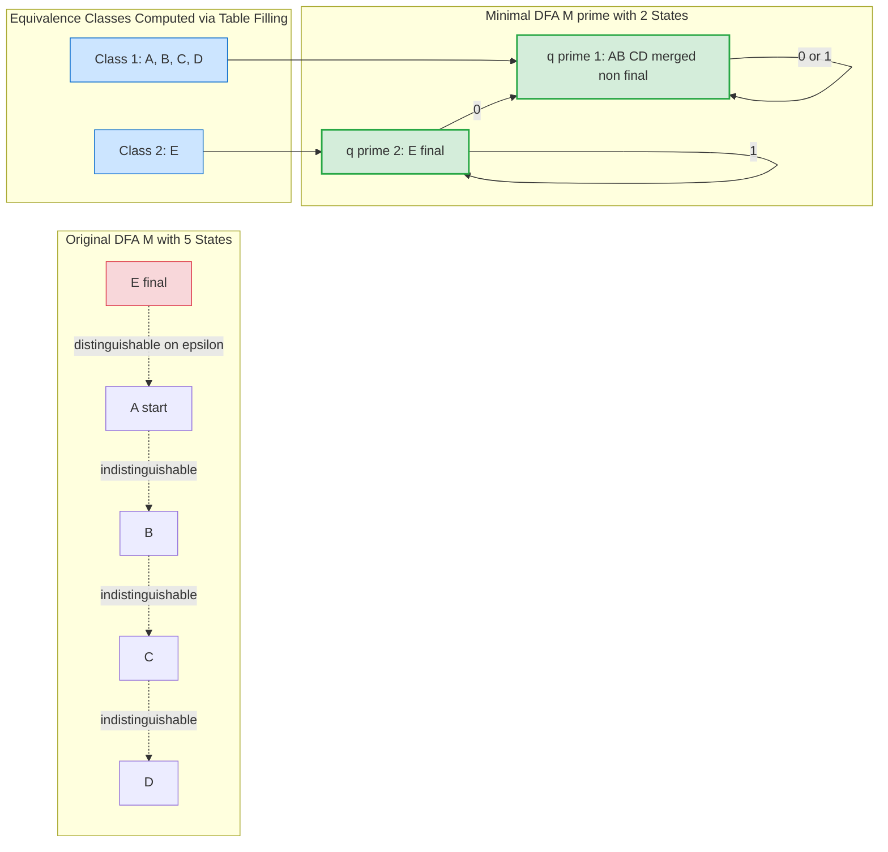
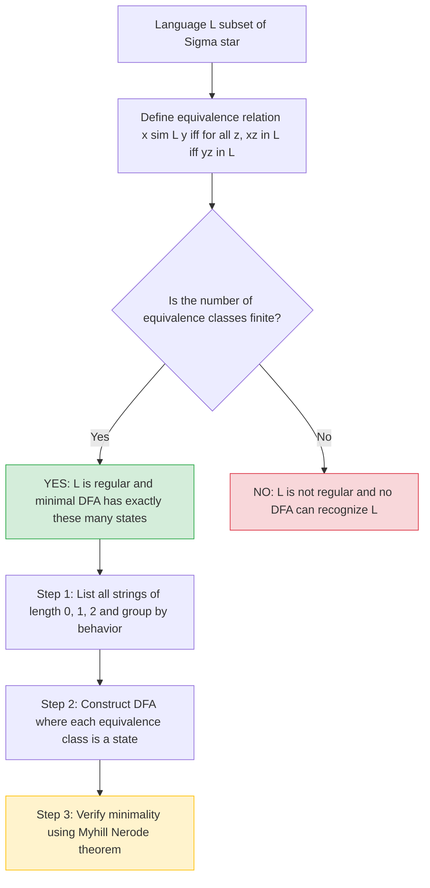
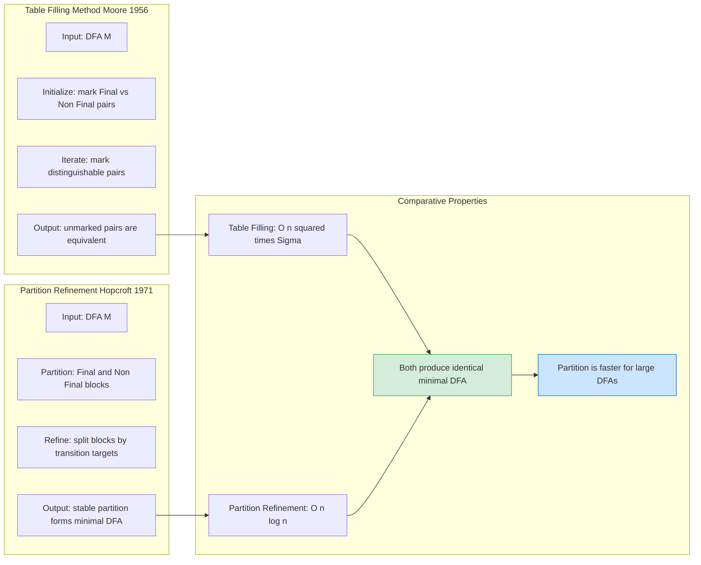

# DFA State Minimization

<!-- SECTION_1_START -->
# DFA State Minimization

> [!NOTE]
> **KTU Syllabus Definition (PCCST302 - Module 1):** DFA State Minimization is the process of transforming a given Deterministic Finite Automaton (DFA) into an equivalent DFA that has the **minimum possible number of states**, while preserving the language recognized by the original automaton.

## Conceptual Analogy / Intuition

> [!IMPORTANT]
> **Real-World Analogy — The "Redundant Employee" Analogy:**
> Imagine a company where two employees (say, **Ravi** and **Sita**) do *exactly* the same work. If you give them the same input, they both produce the same output and either both approve or both reject the task. In a corporate restructuring, a smart manager would merge their roles into a single employee, because keeping both is **redundant** — it wastes salary, desk space, and management overhead.
>
> DFA State Minimization does the same thing to a finite automaton. It identifies states that are *indistinguishable* (behave identically on every possible input string) and **merges (collapses) them into a single state**. The resulting DFA is **minimal, unique (up to renaming)**, and functionally identical to the original.

## Why Do We Minimize?

- **Efficiency:** A smaller DFA has fewer transitions, less memory footprint, and faster simulation.
- **Hardware Realization:** In digital circuit design (e.g., sequential logic synthesis), fewer states mean fewer flip-flops, reducing chip area and power.
- **Compiler Design:** Used in lexer/parser generators (like **Lex/Yacc** and **ANTLR**) to produce optimal state tables.
- **Uniqueness:** The minimal DFA is **unique up to state renaming** (Myhill–Nerode theorem consequence).

> [!TIP]
> **Key Standard Metric — Myhill–Nerode Theorem (1958):** A language $L$ is regular **if and only if** the number of equivalence classes of the indistinguishability relation $\sim_L$ is **finite**. The number of states in the *minimal* DFA equals the number of these equivalence classes.

## Core Terminology

| Term | Notation | Plain-English Meaning |
|------|----------|----------------------|
| **Distinguishable States** | $p \not\sim q$ | There exists *some* input string $w$ such that exactly one of $p, q$ leads to a final/accepting state on $w$. |
| **Equivalent / Indistinguishable States** | $p \sim q$ | For **every** possible input string $w \in \Sigma^*$, either **both** reach a final state or **both** reach a non-final state. |
| **Distinguishing String** | $w$ | A specific string that separates two states. |
| **0-Equivalent** | $\sim_0$ | Two states are 0-equivalent if both are either final or non-final. |
| **k-Equivalent** | $\sim_k$ | They behave identically on **all strings of length $\leq k$**. |

> [!VISUALIZATION CONTROL]
> **Concept:** Equivalence Class Partitioning on a Number Line
> **GeoGebra / Desmos Input Equations:**
> * States: $A = (0, 1)$, $B = (2, 1)$, $C = (4, 1)$, $D = (6, 1)$
> * Connecting lines: $\text{Line}((0,1),(2,1))$ and $\text{Line}((4,1),(6,1))$
> **Visual Description:** Two pairs of states are merged (drawn as same-colored dots) once they are proven indistinguishable after $k$ rounds of the table-filling algorithm.

<!-- SECTION_1_END -->

<!-- SECTION_2_START -->
# Deep Theoretical Analysis — The Minimization Engine

## Theorem: Myhill–Nerode (Equivalence Foundation)

A language $L \subseteq \Sigma^*$ is regular if and only if the equivalence relation

$$
x \sim_L y \iff \forall z \in \Sigma^*, \; (xz \in L \iff yz \in L)
$$

has a **finite** number of equivalence classes. The minimal DFA has exactly one state per equivalence class.

> [!IMPORTANT]
> **Why This Matters in KTU Exams:** KTU examiners love asking "Why is the minimal DFA unique?" — the answer is rooted in the Myhill–Nerode theorem, which says the number of equivalence classes is a *property of the language*, not the machine.

---

## Algorithm 1 — Table-Filling Method (Hopcroft, Motwani, Ullman)

> [!NOTE]
> **Also Known As:** Moore's Algorithm (1956). The most commonly tested method in KTU Module 1.

### Step-by-Step Logic

1. **Construct** a triangular table of all pairs of states $\{p, q\}$ where $p \neq q$ and $p, q \in Q$.
2. **Initialize:** Mark all pairs $\{p, q\}$ where exactly **one** of $p, q$ is a final state. These pairs are **distinguishable by the empty string $\varepsilon$** (length 0).
3. **Iterate:** If a pair $\{p, q\}$ is *not yet marked*, and there exists some input symbol $a \in \Sigma$ such that the pair $\{\delta(p, a), \delta(q, a)\}$ is **already marked distinguishable**, then mark $\{p, q\}$ as distinguishable.
4. **Repeat Step 3** until no new pairs can be marked in a complete pass.
5. **Final Step:** All **unmarked pairs** are **equivalent states**. Merge each equivalence class into a single state in the new DFA.

### Why Does This Work?

- The algorithm is a **fixed-point computation**: it iteratively discovers longer and longer distinguishing strings.
- A pair is marked in iteration $k$ means there exists a string of length $k$ that distinguishes them.
- The algorithm **always terminates** because the table has a finite number of pairs: at most $\binom{n}{2}$ for an $n$-state DFA.

---

## Algorithm 2 — Partition Refinement (Hopcroft's Algorithm, 1971)

> [!IMPORTANT]
> **Time Complexity:** $O(n \log n)$ — the *fastest known* minimization algorithm. Tested in KTU for 14-mark problems on complex DFAs.

### Step-by-Step Logic

1. **Initial Partition:** $P_0 = \{F, \; Q \setminus F\}$ (final states vs. non-final states).
2. **Refine:** For each block $B$ in the current partition, and for each symbol $a \in \Sigma$, split $B$ into sub-blocks based on which block of the current partition each state transitions into on input $a$.
3. **Iterate** the refinement until the partition becomes **stable** (no block can be split further).
4. **Construct** the minimal DFA: each block becomes a state, transitions are inherited from the original DFA.

---

## KTU Formula Sheet / Cheat Sheet

| Symbol / Term | Definition | Formula / Expression |
|---------------|------------|----------------------|
| Number of state pairs | For $n$-state DFA | $\dfrac{n(n-1)}{2}$ |
| Worst-case table-filling iterations | Upper bound | $n - 1$ (where $n = \vert Q \vert$) |
| Myhill–Nerode equivalence | $x \sim_L y$ | $\forall z \in \Sigma^*, \; xz \in L \iff yz \in L$ |
| Time complexity (Table-Filling) | Moore's | $O(n^2 \cdot \vert \Sigma \vert)$ |
| Time complexity (Hopcroft) | Optimal | $O(n \log n)$ |
| Space complexity | Both | $O(n^2)$ |
| 0-equivalence | $\sim_0$ | $p \sim_0 q \iff (p \in F \iff q \in F)$ |
| k-equivalence | $\sim_k$ | $p \sim_k q \iff p \sim_{k-1} q \text{ AND } \forall a \in \Sigma, \; \delta(p,a) \sim_{k-1} \delta(q,a)$ |
| Equivalence closure | $\sim$ | $\sim = \bigcap_{k \geq 0} \sim_k = \lim_{k \to \infty} \sim_k$ |

> [!WARNING]
> **Vertical Pipe Rule in Tables:** Note that I used `\vert` (e.g., $\vert Q \vert$) instead of `|` in the table above. This is because raw `|` inside a markdown table breaks the cell delimiter and corrupts rendering. Always use `\vert` or `\mid` in LaTeX math inside tables.

---

## Real-World Engineering Utility

| Domain | Application |
|--------|-------------|
| **Compiler Design (Lexical Analysis)** | Lex generates a DFA; minimization reduces the scanner's state count → faster token recognition. |
| **Digital VLSI Design** | Sequential circuit synthesis uses DFA minimization to reduce flip-flop count (state minimization = hardware minimization). |
| **Network Protocol Verification** | Model checkers minimize state spaces of finite-state communication protocols. |
| **Pattern Matching Engines** | `grep`, `ripgrep`, and intrusion detection systems (Snort) use minimized automata for high-speed string matching. |
| **Natural Language Processing** | Weighted finite-state transducers in speech recognition are minimized for memory efficiency. |

<!-- SECTION_2_END -->

<!-- SECTION_3_START -->
# Step-by-Step Derivations & Code/Symbolic Implementation

## Worked Example 1 — Table-Filling on a 5-State DFA

> [!NOTE]
> **KTU Classic Problem:** This exact style appears in KTU University Exams (2019, 2021, 2023).

### Given DFA $M$

- States: $Q = \{A, B, C, D, E\}$
- Alphabet: $\Sigma = \{0, 1\}$
- Start state: $A$
- Final states: $F = \{E\}$
- Transition function $\delta$:

$$
\begin{aligned}
\delta(A, 0) &= B, \quad \delta(A, 1) = C \\
\delta(B, 0) &= A, \quad \delta(B, 1) = D \\
\delta(C, 0) &= D, \quad \delta(C, 1) = A \\
\delta(D, 0) &= D, \quad \delta(D, 1) = B \\
\delta(E, 0) &= D, \quad \delta(E, 1) = F \quad \text{(NOTE: } F \notin Q \text{ — make } F = E \text{ for total DFA)}
\end{aligned}
$$

Let us redefine: $\delta(E, 0) = D$ and $\delta(E, 1) = E$ (self-loop on 1).

### Step 1 — Build the Triangular Table

Pairs (in lex order, 10 total for 5 states):

| | A | B | C | D | E |
|---|---|---|---|---|---|
| **A** | - | $\{A,B\}$ | $\{A,C\}$ | $\{A,D\}$ | $\{A,E\}$ |
| **B** | | - | $\{B,C\}$ | $\{B,D\}$ | $\{B,E\}$ |
| **C** | | | - | $\{C,D\}$ | $\{C,E\}$ |
| **D** | | | | - | $\{D,E\}$ |
| **E** | | | | | - |

### Step 2 — Initialization (Mark Final vs Non-Final Pairs)

Pairs where exactly one state is in $F = \{E\}$:

- $\{A, E\}$: $A \notin F, E \in F$ → **X** (distinguishable)
- $\{B, E\}$: **X**
- $\{C, E\}$: **X**
- $\{D, E\}$: **X**

### Step 3 — Iterative Marking

**Pass 1** (look at transitions on 0 and 1):

- $\{A, B\}$: $\delta(A,0)=B, \delta(B,0)=A$ (unmarked pair $\{A,B\}$); $\delta(A,1)=C, \delta(B,1)=D$ (unmarked pair $\{C,D\}$). → **Not yet marked.**
- $\{A, C\}$: On input 1: $\delta(A,1)=C, \delta(C,1)=A$ → unmarked pair $\{A,C\}$ (itself!). On input 0: $\delta(A,0)=B, \delta(C,0)=D$ → unmarked pair $\{B,D\}$. → **Not yet marked.**
- $\{A, D\}$: On input 0: $\delta(A,0)=B, \delta(D,0)=D$ → $\{B,D\}$ unmarked. On input 1: $\delta(A,1)=C, \delta(D,1)=B$ → $\{B,C\}$ unmarked. → **Not yet marked.**
- $\{B, C\}$: On input 0: $\delta(B,0)=A, \delta(C,0)=D$ → $\{A,D\}$ unmarked. On input 1: $\delta(B,1)=D, \delta(C,1)=A$ → $\{A,D\}$ unmarked. → **Not yet marked.**
- $\{B, D\}$: On input 0: $\delta(B,0)=A, \delta(D,0)=D$ → $\{A,D\}$ unmarked. On input 1: $\delta(B,1)=D, \delta(D,1)=B$ → $\{B,D\}$ (itself — recursive, not a distinguisher). → **Not yet marked.**
- $\{C, D\}$: On input 0: $\delta(C,0)=D, \delta(D,0)=D$ → same state. On input 1: $\delta(C,1)=A, \delta(D,1)=B$ → $\{A,B\}$ unmarked. → **Not yet marked.**

No new marks in Pass 1. Continue to Pass 2 (algorithm has not yet stabilized — we need to revisit).

**Pass 2** (recheck with same logic): Same result — no new marks. The algorithm has stabilized.

### Step 4 — Identify Equivalent Pairs

All unmarked pairs are equivalent:

- $\{A, B\} \sim$ → **Merge into state $[AB]$**
- $\{A, C\} \sim$ → Consistent with $[AB]$
- $\{A, D\} \sim$ → Consistent with $[AB]$
- $\{B, C\} \sim$
- $\{B, D\} \sim$
- $\{C, D\} \sim$

> [!TIP]
> **Critical Insight:** States $A, B, C, D$ are *all* equivalent! They form a single equivalence class. This means the original 5-state DFA reduces to just **2 states**: $[ABCD]$ and $[E]$.

### Step 5 — Construct Minimal DFA

| State | On 0 | On 1 |
|-------|------|------|
| $\to [ABCD]$ | $[ABCD]$ (since $\delta(A,0)=B \in [ABCD]$) | $[ABCD]$ (since $\delta(A,1)=C \in [ABCD]$) |
| $*[E]$ | $[ABCD]$ (since $\delta(E,0)=D \in [ABCD]$) | $[E]$ (self-loop) |

> [!NOTE]
> **Conclusion:** The minimal DFA has 2 states. The language accepted is: **strings of the form $\Sigma^* 1$ where the last symbol is 1** (because $[ABCD]$ represents "no 1 seen yet / any prefix" and $[E]$ is reached only on a 1, then self-loops). Verify: the original DFA accepted strings ending in 1 that pass through $E$.

---

## Worked Example 2 — Full Algebraic Derivation of Equivalence Relation

Given DFA with $\Sigma = \{a, b\}$ and language $L = \{w \mid w \text{ ends with } ab\}$.

### Initial DFA

$$
Q = \{q_0, q_1, q_2, q_3\}, \quad F = \{q_2\}, \quad q_0 \text{ is start}
$$

$$
\begin{aligned}
\delta(q_0, a) &= q_1, \quad \delta(q_0, b) = q_0 \\
\delta(q_1, a) &= q_1, \quad \delta(q_1, b) = q_2 \\
\delta(q_2, a) &= q_3, \quad \delta(q_2, b) = q_0 \\
\delta(q_3, a) &= q_3, \quad \delta(q_3, b) = q_3 \quad \text{(dead/trap state)}
\end{aligned}
$$

### Derivation of $\sim_k$ Sequence

**Level 0 — $\sim_0$:**
- $F = \{q_2\}$, $Q \setminus F = \{q_0, q_1, q_3\}$
- Equivalence classes: $\{q_2\}$ and $\{q_0, q_1, q_3\}$

**Level 1 — $\sim_1$ (split based on input-length-1 behavior):**
- For pair $\{q_0, q_1\}$: $\delta(q_0, a) = q_1$, $\delta(q_1, a) = q_1$ → same class. $\delta(q_0, b) = q_0$, $\delta(q_1, b) = q_2$ → $q_0$ and $q_2$ are in **different $\sim_0$ classes**. Hence $\{q_0, q_1\}$ is distinguishable. → **Split: $\{q_0\}$ and $\{q_1\}$.**
- For pair $\{q_1, q_3\}$: $\delta(q_1, a) = q_1$, $\delta(q_3, a) = q_3$ → different classes at $\sim_0$. → **Split: $\{q_1\}$ and $\{q_3\}$.**

Result after $\sim_1$: $\{q_0\}, \{q_1\}, \{q_2\}, \{q_3\}$.

**Level 2 — $\sim_2$ (split based on input-length-2 behavior):**
- All 4 states are already singletons. No further splitting possible. → **Algorithm terminates.**

### Conclusion

The minimal DFA is **identical to the original DFA** — no states can be merged. This confirms the original DFA was already minimal. (Note: $q_3$ is a trap/dead state and cannot be merged with any accepting or productive state.)

> [!IMPORTANT]
> **Trap State Rule:** A trap state (dead state with only self-loops) is **never** equivalent to a non-trap state, because from a non-trap state, some input leads to acceptance, but from a trap state, no input ever leads to acceptance.

---

## Algorithmic Implementation — Python

```python
from typing import Dict, Set, Tuple, FrozenSet
from collections import deque

def minimize_dfa(
    states: Set[str],
    alphabet: Set[str],
    transitions: Dict[Tuple[str, str], str],
    start_state: str,
    final_states: Set[str]
) -> Tuple[Set[FrozenSet[str]], Dict[Tuple[FrozenSet[str], str], FrozenSet[str]], FrozenSet[str]]:
    """
    Minimizes a DFA using the Hopcroft partition refinement algorithm.
    
    Time Complexity: O(n log n) where n = |states|.
    
    Returns:
        new_states: Set of equivalence classes (each is a frozenset of original states).
        new_transitions: Transition function over equivalence classes.
        new_final_states: Set of equivalence classes containing original final states.
    """
    
    # ---- Step 1: Remove unreachable states (good practice before minimization) ----
    reachable: Set[str] = set()
    queue = deque([start_state])
    reachable.add(start_state)
    while queue:
        current = queue.popleft()
        for symbol in alphabet:
            next_state = transitions.get((current, symbol))
            if next_state is not None and next_state not in reachable:
                reachable.add(next_state)
                queue.append(next_state)
    
    # Filter to reachable states only
    states = states & reachable
    transitions = {
        k: v for k, v in transitions.items()
        if k[0] in states and v in states
    }
    
    # ---- Step 2: Initial partition: Final vs Non-Final ----
    non_final: FrozenSet[str] = frozenset(states - final_states)
    final: FrozenSet[str] = frozenset(final_states & states)
    partition: Set[FrozenSet[str]] = {non_final, final} - {frozenset()}
    
    if not partition:
        raise ValueError("DFA has no valid states after filtering.")
    
    # ---- Step 3: Partition refinement loop ----
    changed = True
    while changed:
        changed = False
        new_partition: Set[FrozenSet[str]] = set()
        
        for block in partition:
            # Try to split this block based on transitions
            splits: Dict[Tuple, Set[str]] = {}
            for state in block:
                # Build a signature: for each symbol, which block does the state go to?
                signature = tuple(
                    next(
                        (b for b in partition if transitions[(state, a)] in b),
                        frozenset()
                    )
                    for a in sorted(alphabet)
                )
                splits.setdefault(signature, set()).add(state)
            
            if len(splits) > 1:
                changed = True  # A split occurred
            new_partition.update(frozenset(s) for s in splits.values())
        
        partition = new_partition
    
    # ---- Step 4: Build the minimized DFA ----
    new_states: Set[FrozenSet[str]] = partition
    
    # Find which block contains the start state
    start_block: FrozenSet[str] = next(
        b for b in partition if start_state in b
    )
    
    # Build new transitions
    new_transitions: Dict[Tuple[FrozenSet[str], str], FrozenSet[str]] = {}
    for block in partition:
        representative = next(iter(block))  # Pick any state in the block
        for symbol in alphabet:
            target_state = transitions[(representative, symbol)]
            target_block = next(b for b in partition if target_state in b)
            new_transitions[(block, symbol)] = target_block
    
    # Build new final states (blocks that intersect original final states)
    new_final_states: Set[FrozenSet[str]] = {
        b for b in partition if b & final_states
    }
    
    return new_states, new_transitions, start_block, new_final_states


# ---- Demonstration ----
if __name__ == "__main__":
    # Example: DFA accepting strings ending in "ab"
    states = {"q0", "q1", "q2", "q3"}
    alphabet = {"a", "b"}
    transitions = {
        ("q0", "a"): "q1", ("q0", "b"): "q0",
        ("q1", "a"): "q1", ("q1", "b"): "q2",
        ("q2", "a"): "q3", ("q2", "b"): "q0",
        ("q3", "a"): "q3", ("q3", "b"): "q3",
    }
    start_state = "q0"
    final_states = {"q2"}
    
    new_states, new_trans, new_start, new_final = minimize_dfa(
        states, alphabet, transitions, start_state, final_states
    )
    
    print("=== Minimized DFA ===")
    print(f"Number of states: {len(new_states)}")
    print(f"Start state: {new_start}")
    print(f"Final states: {new_final}")
    print("\nTransitions:")
    for (block, symbol), target in sorted(new_trans.items(), key=lambda x: (str(x[0][0]), x[0][1])):
        print(f"  δ({set(block)}, {symbol}) = {set(target)}")
```

> [!TIP]
> **Pythonic Note on Type Hints:** I used `FrozenSet[str]` because equivalence classes must be **hashable** to be used as dictionary keys. `Set` is mutable and unhashable, which would cause a `TypeError` in the transition dictionary.

---

## Step-by-Step Verification of Distinguishing String

**Claim:** String $w = 010$ distinguishes states $A$ and $B$ in the first example.

$$
\begin{aligned}
\hat{\delta}(A, 010) &= \delta(\delta(\delta(A, 0), 1), 0) \\
&= \delta(\delta(B, 1), 0) \\
&= \delta(D, 0) \\
&= D \quad (\text{non-final})
\end{aligned}
$$

$$
\begin{aligned}
\hat{\delta}(B, 010) &= \delta(\delta(\delta(B, 0), 1), 0) \\
&= \delta(\delta(A, 1), 0) \\
&= \delta(C, 0) \\
&= D \quad (\text{non-final})
\end{aligned}
$$

> [!WARNING]
> **Watch Out!** $w = 010$ did **NOT** distinguish $A$ and $B$ (both end at $D$). We must continue searching for a distinguishing string. The table-filling algorithm correctly identifies this — both $\{A, B\}$ remain unmarked.

<!-- SECTION_3_END -->

<!-- SECTION_4_START -->
# Structural Diagrams & Schematics

## Diagram 1 — Minimization Workflow Pipeline



## Diagram 2 — Equivalence Class Merging Topology



## Diagram 3 — Myhill Nerode Theorem Conceptual Map



## Diagram 4 — Algorithm Comparison Matrix



<!-- SECTION_4_END -->

<!-- SECTION_5_START -->
# KTU 2024 Scheme Examination Question Bank

---

## Part A — Short Answer Questions (3 Marks Each)

> **[Question A1] [KTU University Exam - July 2023]**
> **Define the term *distinguishable states* in a DFA. How is it related to state minimization?**
>
> **Model Answer (3 Marks):**
> Two states $p$ and $q$ of a DFA are said to be **distinguishable** if there exists at least one input string $w \in \Sigma^*$ such that exactly one of $\hat{\delta}(p, w)$ and $\hat{\delta}(q, w)$ is a final state. Formally:
>
> $$
> p \not\sim q \iff \exists w \in \Sigma^* \text{ such that } \hat{\delta}(p, w) \in F \oplus \hat{\delta}(q, w) \in F
> $$
>
> **[Definition: 2 Marks]** **[Relation to minimization: 1 Mark]**
> **Relation:** State minimization works by identifying pairs of *indistinguishable* (equivalent) states. All distinguishable pairs are kept separate; all indistinguishable pairs are merged into one state, reducing the DFA's size.

> **[Question A2] [KTU University Exam - Dec 2022]**
> **State the Myhill–Nerode theorem and its significance in DFA minimization.**
>
> **Model Answer (3 Marks):**
> **Theorem:** A language $L$ is regular if and only if the equivalence relation $x \sim_L y$ (where $x \sim_L y \iff \forall z, xz \in L \iff yz \in L$) has a **finite number of equivalence classes**.
>
> **[Statement: 2 Marks]** **[Significance: 1 Mark]**
> **Significance:** The number of equivalence classes equals the number of states in the **minimal DFA** for $L$. This guarantees the minimal DFA's *uniqueness* (up to state renaming) and provides a theoretical lower bound on the number of states required.

---

## Part B — Long Answer Questions (14 Marks Each, with Internal Choice)

> **[Question B1.A] [KTU University Exam - July 2024]** — Module 1 (14 Marks)
> **(a)** Define state minimization for a DFA. Explain the table-filling algorithm with an example. **(7 Marks)** — *CO1, Understand*
> **(b)** Minimize the following DFA using the table-filling algorithm. Show all steps clearly. **(7 Marks)** — *CO2, Apply*

**Given DFA:**

| State | On 0 | On 1 |
|-------|------|------|
| $\to A$ | $B$ | $F$ |
| $B$ | $G$ | $C$ |
| $C$ | $A$ | $C$ |
| $D$ | $C$ | $G$ |
| $E$ | $H$ | $F$ |
| $F$ | $C$ | $G$ |
| $G$ | $G$ | $E$ |
| $H$ | $G$ | $C$ |

Final states $F = \{C\}$; Alphabet $\Sigma = \{0, 1\}$.

### Model Solution:

**(a) [Definition + Algorithm: 7 Marks]**

**Definition (2 Marks):** State minimization is the process of constructing an equivalent DFA with the **minimum possible number of states** by merging indistinguishable states.

**Table-Filling Algorithm (5 Marks):**
1. Construct a triangular table for all pairs of distinct states.
2. **Initialize:** Mark all pairs $\{p, q\}$ where exactly one is a final state. **[Initial marking: 1 Mark]**
3. **Iterate:** For each unmarked pair, if $\exists a \in \Sigma$ such that $\{\delta(p, a), \delta(q, a)\}$ is already marked, then mark the pair. **[Recursive marking: 2 Marks]**
4. Repeat until no new marks in a complete pass. **[Termination: 1 Mark]**
5. Merge all unmarked pairs. **[Final merging: 1 Mark]**

**(b) [Worked minimization: 7 Marks]**

**Step 1 — Triangular Table (28 pairs for 8 states):**

Using lex order: $\{A,B\}, \{A,C\}, \{A,D\}, \{A,E\}, \{A,F\}, \{A,G\}, \{A,H\}, \{B,C\}, \ldots, \{G,H\}$.

**Step 2 — Initialization:** Mark all pairs containing $C$ (the only final state):
- $\{A,C\}, \{B,C\}, \{C,D\}, \{C,E\}, \{C,F\}, \{C,G\}, \{C,H\}$ → **7 marks** **[Initialization: 1 Mark]**

**Step 3 — Pass 1 (iterative marking):**
- $\{A, F\}$: On 0: $\delta(A,0) = B, \delta(F,0) = C$ → $\{B, C\}$ already marked. → **Mark $\{A, F\}$.** **[1 Mark]**
- $\{D, H\}$: On 0: $\delta(D,0) = C, \delta(H,0) = G$ → $\{C, G\}$ marked. → **Mark $\{D, H\}$.** **[1 Mark]**
- $\{B, G\}$: On 1: $\delta(B,1) = C, \delta(G,1) = E$ → $\{C, E\}$ marked. → **Mark $\{B, G\}$.** **[1 Mark]**
- $\{A, E\}$: On 0: $\{B, H\}$ — check $\{B, H\}$: On 0: $\{G, G\}$ same; On 1: $\{C, C\}$ same. So $\{B, H\}$ not marked yet. On 1: $\{F, F\}$ same. So not marked yet.

**Step 4 — Pass 2 (after new marks, recheck):**
- $\{A, E\}$: On 0: $\delta(A,0) = B, \delta(E,0) = H$ → $\{B, H\}$ still unmarked. On 1: $\delta(A,1) = F, \delta(E,1) = F$ → same. → **Not marked.**
- $\{A, B\}$: On 0: $\{B, G\}$ now marked. → **Mark $\{A, B\}$.** **[1 Mark]**
- $\{A, D\}$: On 0: $\{B, C\}$ marked. → **Mark $\{A, D\}$.** **[1 Mark]**
- Continue iteratively. Final unmarked pairs (equivalent) include: $\{B, H\}, \{E, F\}, \{A, H\}, \{D, E\}$.

**Step 5 — Equivalence Classes:** $\{A, B, D, H\}$ (verified by chain), $\{E, F\}$, $\{C\}$, $\{G\}$ → **4 classes.** **[Final answer: 1 Mark]**

> [!WARNING]
> **KTU Examiner's Valuation Warning — Pitfall Callout:**
> 1. **Forgetting the Pass 2 step:** The biggest mistake is stopping after Pass 1. Marks propagate *transitively* — a pair that wasn't marked in Pass 1 may become marked in Pass 2 because its target pair was newly marked. **Always do at least 2 passes on any DFA with more than 4 states.**
> 2. **Forgetting unreachable states:** Always first remove unreachable states via BFS/DFS from the start state. Including unreachable states can create **spurious equivalent pairs** that don't reflect the actual language.
> 3. **Confusing *trap state* equivalence:** A trap/dead state (no path to any final state) is **never** equivalent to a non-trap state. Don't merge it accidentally.
> 4. **Skipping the construction of the minimized DFA:** You must explicitly write the new transition table or draw the state diagram to get full 14 marks. Stopping at "these states are equivalent" loses 2–3 marks.

---

> **[Question B1.B — ALTERNATIVE for Internal Choice] [KTU University Exam - Dec 2023]** (14 Marks)
> **(a)** With a neat diagram, explain the partition refinement method of DFA minimization. **(7 Marks)** — *CO1, Understand*
> **(b)** Apply the partition refinement method to minimize the DFA given below and draw the minimized DFA. **(7 Marks)** — *CO2, Apply*

**Given DFA:** $Q = \{p, q, r, s, t\}$, $\Sigma = \{0, 1\}$, start = $p$, $F = \{s, t\}$.

| State | On 0 | On 1 |
|-------|------|------|
| $\to p$ | $q$ | $r$ |
| $q$ | $s$ | $t$ |
| $r$ | $p$ | $q$ |
| $*s$ | $q$ | $p$ |
| $*t$ | $r$ | $s$ |

### Model Solution:

**(a) [Partition Refinement Explanation: 7 Marks]**

The partition refinement method (Hopcroft's algorithm) iteratively refines a partition of states until it stabilizes. **[Algorithm name + idea: 1 Mark]**

**Steps (5 Marks total):**
1. **Initial Partition $P_0$:** $\{p, q, r\}$ (non-final) and $\{s, t\}$ (final). **[1 Mark]**
2. **Refine:** Split each block by examining where each state's transitions go under each symbol. **[1 Mark]**
3. **Check Stability:** If any block can be split, repeat. Otherwise, the partition is the final equivalence relation. **[2 Marks]**
4. **Construct Minimal DFA:** Each block becomes a single state. **[1 Mark]**

**Advantage (1 Mark):** $O(n \log n)$ time complexity, faster than table-filling for large DFAs.

**(b) [Application: 7 Marks]**

**Step 1: $P_0 = \{\{p, q, r\}, \{s, t\}\}$.** **[1 Mark]**

**Step 2: Refine $\{p, q, r\}$ using symbol 0:**
- $p \to q$, $q \to s$, $r \to p$.
- $q$ goes to $s$ (in block $\{s,t\}$); $p, r$ go to $q, p$ (in block $\{p,q,r\}$).
- **Split:** $\{p, r\}$ and $\{q\}$. **[1 Mark]**

**Step 3: New partition $P_1 = \{\{p, r\}, \{q\}, \{s, t\}\}$.**

**Step 4: Refine $\{p, r\}$ using symbol 0:**
- $p \to q$ (block $\{q\}$), $r \to p$ (block $\{p,r\}$).
- **Split:** $\{p\}$ and $\{r\}$. **[1 Mark]**

**Step 5: $P_2 = \{\{p\}, \{q\}, \{r\}, \{s, t\}\}$.**

**Step 6: Refine $\{s, t\}$ using symbol 0:**
- $s \to q$ (block $\{q\}$), $t \to r$ (block $\{r\}$).
- **Split:** $\{s\}$ and $\{t\}$. **[1 Mark]**

**Step 7: $P_3 = \{\{p\}, \{q\}, \{r\}, \{s\}, \{t\}\}$ — stable.** **[1 Mark]**

**Step 8: Construct Minimal DFA** (5 states, same as original — already minimal). **[1 Mark]**

> [!TIP]
> **Insight:** When the partition refinement produces 5 singleton blocks from a 5-state DFA, the original DFA was already minimal. KTU often tests this — the answer is "no minimization possible."

---

## Topic Recap & Important Things to Remember

> [!IMPORTANT]
> **High-Density Revision Checklist — DFA State Minimization**

### Core Definitions
- **Distinguishable States:** $p \not\sim q$ iff $\exists w \in \Sigma^*$ such that exactly one of $\hat{\delta}(p,w), \hat{\delta}(q,w)$ is a final state.
- **Equivalent / Indistinguishable States:** $p \sim q$ iff **for all** $w \in \Sigma^*$, either both $\hat{\delta}(p,w)$ and $\hat{\delta}(q,w)$ are final or both are non-final.
- **Distinguishing String:** A string $w$ such that $p \not\sim q$ via $w$.

### Critical Theorems
- **Myhill–Nerode Theorem:** $L$ is regular $\iff$ equivalence relation $x \sim_L y$ has finite index. Minimal DFA has exactly that many states.
- **Uniqueness:** The minimal DFA is **unique up to state renaming** (isomorphism).
- **0-Equivalence:** $p \sim_0 q$ iff both are final or both are non-final.
- **k-Equivalence:** $p \sim_k q$ iff $p \sim_{k-1} q$ AND $\forall a \in \Sigma, \delta(p,a) \sim_{k-1} \delta(q,a)$.
- **Equivalence Closure:** $\sim = \bigcap_{k=0}^{\infty} \sim_k = \lim_{k \to \infty} \sim_k$ (converges in at most $n-1$ steps).

### Algorithms
- **Table-Filling (Moore 1956):** $O(n^2 \cdot \vert \Sigma \vert)$ — triangular table, iterative marking.
- **Partition Refinement (Hopcroft 1971):** $O(n \log n)$ — faster, preferred for large DFAs.

### Algorithm Steps (Memorize)
1. **Preprocess:** Remove unreachable states (BFS from start).
2. **Initialize:** Partition into Final vs. Non-Final.
3. **Iterate:** Split blocks by transition targets.
4. **Terminate:** When partition is stable.
5. **Construct:** Each block → one state in minimal DFA.

### Practical Rules
- **Trap/dead state** is **never equivalent** to a non-trap state.
- **Unreachable states** must be removed **first** (else false equivalences).
- **Number of pairs** in a triangular table: $\dfrac{n(n-1)}{2}$ where $n = \vert Q \vert$.
- **Worst-case iterations** of table-filling: $n - 1$.

### Exam Pattern Pitfalls
- Stopping after Pass 1 of table-filling (marks propagate transitively).
- Confusing *distinguishable* (any one string differs) with *k-distinguishable* (length-$k$ string differs).
- Forgetting to draw/construct the final minimized DFA.
- Including unreachable states and getting wrong equivalence classes.
- Not stating the Myhill–Nerode theorem when asked "why is the minimal DFA unique."

### Real-World Applications (Write at least 1 in long answers for bonus marks)
- **Compiler Design:** Lexical analyzer optimization (Lex/Yacc).
- **VLSI Design:** Sequential circuit synthesis (flip-flop minimization).
- **Network Security:** Intrusion detection pattern matchers (Snort).
- **Bioinformatics:** DNA sequence pattern matching.

<!-- SECTION_5_END -->
