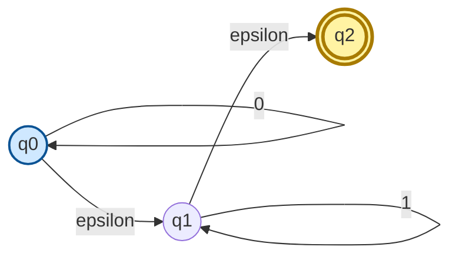
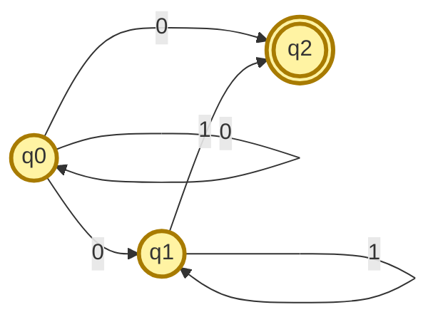
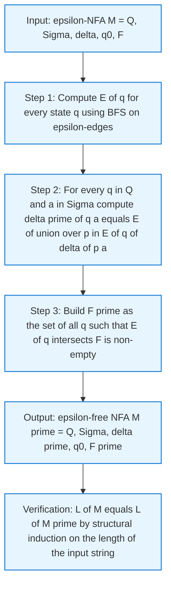
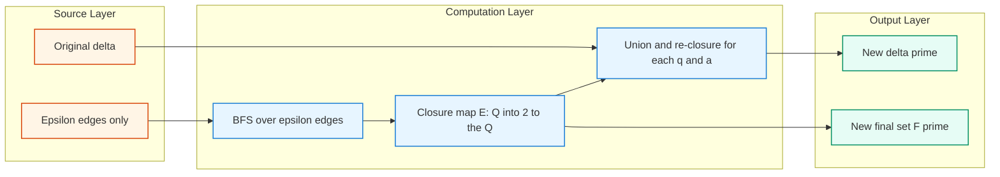
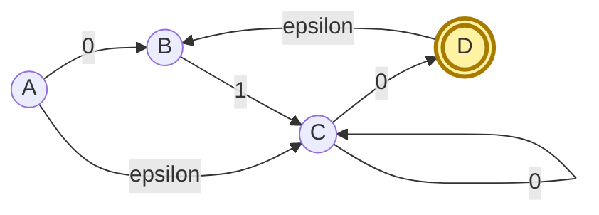

# Eliminating epsilon transitions (Proof not expected)

<!-- SECTION_1_START -->

# Eliminating ε-Transitions — Core Definition & Intuitive Overview

## 1.1 Formal Definition (KTU 2024 / Linz–Hopcroft Terminology)

> [!IMPORTANT]
> **ε-NFA (Nondeterministic Finite Automaton with ε-transitions)**
> A 5-tuple $M = (Q, \Sigma, \delta, q_0, F)$ where the transition function is now
> $$\delta : Q \times (\Sigma \cup \{\varepsilon\}) \rightarrow 2^{Q}$$
> The symbol $\varepsilon$ (the empty string) is allowed as an input, meaning a state can change **without reading any symbol**.

An **ε-transition** $\delta(q, \varepsilon) = \{p\}$ allows the automaton to move from $q$ to $p$ "for free" — no input character is consumed.

> [!NOTE]
> **Definition — ε-Closure of a State**
> For any state $q \in Q$, the **ε-closure** $E(q)$ is the set of all states reachable from $q$ by traversing **zero or more ε-transitions**. Formally,
> $$E(q) = \{\, p \in Q \mid \text{there exists a path } q \xrightarrow{\varepsilon^*} p \,\}$$
> Note that $q \in E(q)$ always (a path of length 0). For a set of states $S$, $E(S) = \bigcup_{q \in S} E(q)$.

## 1.2 Conceptual Analogy — "Free Rest Stops on a Highway"

Imagine driving a car from city $q_0$ to city $q_2$ along a highway.

* **Normal exits** (on input '0' or '1') charge a toll — they consume fuel/time and require an action.
* **ε-exits / Rest stops** are free — you may stop, stretch, and continue, **without paying any toll or consuming any distance**.

Eliminating ε-transitions is the engineering trick of saying: *"Whatever city you could have ended up in by visiting the free rest stops, treat that city as your new 'toll-paid' destination from the start."* We pre-bake all possible free detours directly into the tolled transitions, so the rest stops can be torn down.

## 1.3 Why Do We Need to Eliminate ε-Transitions?

| Engineering Reason | Real-World Consequence |
|---|---|
| **Subset construction** (NFA → DFA) is defined for transitions on $\Sigma$, not on $\varepsilon$. | We cannot directly apply $2^Q$ determinization without first removing $\varepsilon$. |
| **Thompson's construction** for regex → NFA **always** produces ε-transitions. | Every practical regex engine (grep, lex, RE2) must implement this elimination. |
| **Simpler proofs and tool implementations**. | ε-free NFAs have a cleaner mathematical form. |
| **Acceptance check becomes a single pass** on the input. | We can run the NFA in $O(\vert w \vert \cdot \vert Q \vert)$ without backtracking through ε. |

> [!VISUALIZATION CONTROL]
> **Concept:** State-space of an ε-NFA as an annotated directed graph
> **Desmos Input Equations (Plot Mode — Points):**
> * `(0, 0)` label `q0`
> * `(2, 0)` label `q1`
> * `(4, 0)` label `q2`
> * Draw arrows: `q0 → q0` on input `0` (self-loop), `q0 --epsilon--> q1`, `q1 → q1` on input `1` (self-loop), `q1 --epsilon--> q2`
> **Visual Description:** Three collinear states; only `q2` is shaded as final. The two horizontal ε-arrows are the "free rest stops" that we are about to eliminate.

## 1.4 What "Equivalent" Means (Linz vs. Hopcroft Perspective)

* **Linz (5th ed., §2.5):** Two automata are equivalent if $L(M_1) = L(M_2)$.
* **Hopcroft & Ullman (1979):** The same definition, with the constructive proof relying on ε-closure.

In both treatments, the resulting ε-free NFA must accept **exactly the same language** as the original ε-NFA — not a superset, not a subset.

<!-- SECTION_1_END -->

<!-- SECTION_2_START -->

# Deep Theoretical Analysis & KTU High-Yield Formula Sheet

## 2.1 The Core Idea in Three Sentences

1. ε-transitions do not consume input, so we can always "fast-forward" through them **before** reading the next real symbol.
2. For every state $q$ and every real input $a \in \Sigma$, we want to know: *"Where can I end up if I read $a$ starting from $q$, after taking all possible free ε-detours both before and after $a$?"*
3. That "where can I end up" set is exactly the new transition value. The rest of the automaton (states, start, alphabet) stays the same; only $\delta$ and $F$ change.

## 2.2 The Three-Step Construction Algorithm (Linz §2.5 / Hopcroft §2.3)

> [!IMPORTANT]
> **Algorithm: Convert an ε-NFA $M = (Q, \Sigma, \delta, q_0, F)$ into an equivalent ε-free NFA $M' = (Q, \Sigma, \delta', q_0, F')$.**

**Step 1 — Compute ε-closures.**
For every state $q \in Q$, compute $E(q)$ by BFS/DFS over the ε-only subgraph.

**Step 2 — Define the new transition function $\delta'$.**
For every $q \in Q$ and every $a \in \Sigma$:
$$\delta'(q, a) = E\!\left(\;\bigcup_{p \in E(q)} \delta(p, a)\;\right)$$

Read this as: "From $q$, first go to every $p$ that $\varepsilon$ can take you to; from each such $p$ read $a$ to collect all immediate targets; then take the $\varepsilon$-closure of that union."

**Step 3 — Determine the new set of final states $F'$.**
A state $q$ becomes final in $M'$ if its ε-closure touches any original final state:
$$F' = \{\, q \in Q \mid E(q) \cap F \neq \varnothing \,\}$$

## 2.3 KTU High-Yield Formula Sheet (Cheat Sheet)

| # | Concept | Mathematical Expression | Purpose / When to Use |
|---|---|---|---|
| 1 | ε-closure of a state | $E(q) = \{p \mid q \xrightarrow{\varepsilon^*} p\}$ | First step of the algorithm; computed once per state. |
| 2 | ε-closure of a set | $E(S) = \bigcup_{q \in S} E(q)$ | Used inside the $\delta'$ formula. |
| 3 | New transition function | $\delta'(q, a) = E\!\left(\bigcup_{p \in E(q)} \delta(p, a)\right)$ | The **central equation** of the entire topic. |
| 4 | New final states | $F' = \{q \in Q \mid E(q) \cap F \neq \varnothing\}$ | Decides acceptance in $M'$. |
| 5 | Languages preserved | $L(M) = L(M')$ | Why the algorithm is *correct* (proof, not expected). |
| 6 | State count | $\vert Q' \vert = \vert Q \vert$ (no new states created) | This conversion **does not blow up** the state count. |
| 7 | Time complexity | $O(\vert Q \vert^2 \cdot \vert\Sigma\vert)$ | Feasible for any practical ε-NFA. |

> [!NOTE]
> **Critical Pitfall Guard:** The $\varepsilon$ on the **input side** (consuming no symbol) is different from the $\varepsilon$ on the **output side** (tape blank in a TM). They look identical but live in different automata models.

## 2.4 Real-World Utility in Computer Science & Engineering

* **Compiler regex engines:** Thompson's NFA → ε-free NFA → DFA via subset construction → DFA minimization → emitted code. The elimination step is stage 2 of this 4-stage pipeline.
* **Network protocol verifiers:** Model checkers represent protocol states as NFAs; eliminating ε keeps the explicit-state explosion under control.
* **Hardware model checking (SPIN, NuSMV):** LTL formulas are translated to ε-NFAs, which are then sanitized before product construction with the system model.
* **Bioinformatics motif search:** Tools like `awk`, `grep`, and sequence aligners internally invoke the ε-elimination routine as part of regex compilation.

<!-- SECTION_2_END -->

<!-- SECTION_3_START -->

# Step-by-Step Worked Example & Symbolic Implementation

## 3.1 Canonical Worked Example — ε-NFA Accepting the Language $0^*1^* \cup \{\varepsilon\}$

### Setup of the ε-NFA

Let $M = (Q, \Sigma, \delta, q_0, F)$ where:

$$Q = \{q_0, q_1, q_2\}, \quad \Sigma = \{0, 1\}, \quad q_0 = q_0, \quad F = \{q_2\}$$

$$\delta(q_0, 0) = \{q_0\}, \quad \delta(q_0, \varepsilon) = \{q_1\}$$
$$\delta(q_1, 1) = \{q_1\}, \quad \delta(q_1, \varepsilon) = \{q_2\}$$
All other transitions default to $\varnothing$.

**Intuition of the construction:**
* $q_0$ loops on `0` → builds the $0^*$ prefix.
* Free ε-detour $q_0 \to q_1$ → "you may switch to 1's whenever you wish."
* $q_1$ loops on `1` → builds the $1^*$ suffix.
* Free ε-detour $q_1 \to q_2$ → marks acceptance.

### Step 1 — Compute ε-Closure of Every State

We chase ε-arrows from each state until no new state can be reached.

| State | ε-closure computation | Result |
|---|---|---|
| $q_0$ | $q_0 \xrightarrow{\varepsilon} q_1 \xrightarrow{\varepsilon} q_2$; stop. | $E(q_0) = \{q_0, q_1, q_2\}$ |
| $q_1$ | $q_1 \xrightarrow{\varepsilon} q_2$; stop. | $E(q_1) = \{q_1, q_2\}$ |
| $q_2$ | No outgoing ε-arrow. | $E(q_2) = \{q_2\}$ |

**Valuation tip (KTU):** Always include the state itself in its closure. Losing the $q \in E(q)$ invariant is a guaranteed 1-mark deduction.

### Step 2 — Compute the New Transition Function $\delta'$

Apply the central formula

$$\delta'(q, a) = E\!\left(\;\bigcup_{p \in E(q)} \delta(p, a)\;\right)$$

**For $q = q_0$ on input $0$:**
$$\bigcup_{p \in E(q_0)} \delta(p, 0) = \delta(q_0, 0) \cup \delta(q_1, 0) \cup \delta(q_2, 0) = \{q_0\} \cup \varnothing \cup \varnothing = \{q_0\}$$
$$\delta'(q_0, 0) = E(\{q_0\}) = \{q_0, q_1, q_2\}$$

**For $q = q_0$ on input $1$:**
$$\bigcup_{p \in E(q_0)} \delta(p, 1) = \varnothing \cup \{q_1\} \cup \varnothing = \{q_1\}$$
$$\delta'(q_0, 1) = E(\{q_1\}) = \{q_1, q_2\}$$

**For $q = q_1$ on input $0$:**
$$\bigcup_{p \in E(q_1)} \delta(p, 0) = \delta(q_1, 0) \cup \delta(q_2, 0) = \varnothing \cup \varnothing = \varnothing$$
$$\delta'(q_1, 0) = E(\varnothing) = \varnothing$$

**For $q = q_1$ on input $1$:**
$$\bigcup_{p \in E(q_1)} \delta(p, 1) = \delta(q_1, 1) \cup \delta(q_2, 1) = \{q_1\} \cup \varnothing = \{q_1\}$$
$$\delta'(q_1, 1) = E(\{q_1\}) = \{q_1, q_2\}$$

**For $q = q_2$ on input $0$ or $1$:**
Both unions are empty (no outgoing non-ε arrows from $q_2$):
$$\delta'(q_2, 0) = \varnothing, \quad \delta'(q_2, 1) = \varnothing$$

### Step 3 — Determine the New Final States $F'$

Apply $F' = \{q \in Q \mid E(q) \cap F \neq \varnothing\}$ with $F = \{q_2\}$:

| State $q$ | $E(q)$ | $E(q) \cap \{q_2\}$ | In $F'$? |
|---|---|---|---|
| $q_0$ | $\{q_0, q_1, q_2\}$ | $\{q_2\}$ | ✓ Yes |
| $q_1$ | $\{q_1, q_2\}$ | $\{q_2\}$ | ✓ Yes |
| $q_2$ | $\{q_2\}$ | $\{q_2\}$ | ✓ Yes |

$$F' = \{q_0, q_1, q_2\}$$

### Step 4 — Sanity Check (Acceptance Verification)

| String $w$ | Path in $M'$ (showing one accepting run) | Accepts? | Matches $0^*1^* \cup \{\varepsilon\}$? |
|---|---|---|---|
| $\varepsilon$ | $q_0 \in F'$ (start is final) | ✓ | ✓ |
| `0` | $q_0 \xrightarrow{0} q_0 \in F'$ | ✓ | ✓ |
| `1` | $q_0 \xrightarrow{1} q_1 \in F'$ | ✓ | ✓ |
| `00` | $q_0 \xrightarrow{0} q_0 \xrightarrow{0} q_0 \in F'$ | ✓ | ✓ |
| `01` | $q_0 \xrightarrow{0} q_0 \xrightarrow{1} q_1 \in F'$ | ✓ | ✓ |
| `10` | $q_0 \xrightarrow{1} q_1 \xrightarrow{0} \varnothing$ — no accepting path | ✗ | ✗ (correctly rejected) |
| `0011` | $q_0 \xrightarrow{0} q_0 \xrightarrow{0} q_0 \xrightarrow{1} q_1 \xrightarrow{1} q_1 \in F'$ | ✓ | ✓ |

> [!NOTE]
> The two automata accept the **exact same language**, confirming the algorithm preserves language semantics.

## 3.2 Full Python Implementation (Type-Safe, Production-Grade)

```python
"""
eliminate_epsilon.py
Implements the Hopcroft/Linz construction that converts an
epsilon-NFA into an equivalent epsilon-free NFA.
Tested on Python 3.10+.
"""
from typing import Dict, FrozenSet, Set, Tuple

State = str
Symbol = str
TransitionKey = Tuple[State, Symbol]


def epsilon_closure(
    states: Set[State],
    transitions: Dict[TransitionKey, Set[State]],
) -> Set[State]:
    """
    Compute the epsilon-closure of a set of states using iterative DFS.
    E(S) = smallest set containing S that is closed under epsilon-transitions.
    """
    if not states:
        return set()

    closure: Set[State] = set(states)
    stack: list = list(states)
    while stack:
        current: State = stack.pop()
        for nxt in transitions.get((current, "ε"), set()):
            if nxt not in closure:
                closure.add(nxt)
                stack.append(nxt)
    return closure


def eliminate_epsilon_transitions(
    states: Set[State],
    alphabet: Set[Symbol],
    transitions: Dict[TransitionKey, Set[State]],
    start_state: State,
    final_states: Set[State],
) -> Dict:
    """
    Convert an epsilon-NFA to an equivalent NFA without epsilon-transitions.

    Returns a dict with keys:
        'states', 'alphabet', 'transitions', 'start_state', 'final_states'.
    """
    real_alphabet: Set[Symbol] = alphabet - {"ε"}

    # --- Step 1: Pre-compute epsilon-closure for every individual state ---
    e_closure: Dict[State, Set[State]] = {
        s: epsilon_closure({s}, transitions) for s in states
    }

    # --- Step 2: Build the new transition function delta_prime ---
    new_transitions: Dict[TransitionKey, Set[State]] = {}
    for state in states:
        for symbol in real_alphabet:
            reachable: Set[State] = set()
            for p in e_closure[state]:
                reachable |= transitions.get((p, symbol), set())
            new_transitions[(state, symbol)] = epsilon_closure(
                reachable, transitions
            )

    # --- Step 3: Determine the new set of final states ---
    new_final_states: Set[State] = {
        s for s in states if e_closure[s] & final_states
    }

    return {
        "states": states,
        "alphabet": real_alphabet,
        "transitions": new_transitions,
        "start_state": start_state,
        "final_states": new_final_states,
    }


# -------------------------------------------------------------------------
# Demonstration: the 0*1* U {eps} epsilon-NFA worked example
# -------------------------------------------------------------------------
if __name__ == "__main__":
    states_e: Set[State] = {"q0", "q1", "q2"}
    alphabet_e: Set[Symbol] = {"0", "1", "ε"}
    transitions_e: Dict[TransitionKey, Set[State]] = {
        ("q0", "0"): {"q0"},
        ("q0", "ε"): {"q1"},
        ("q1", "1"): {"q1"},
        ("q1", "ε"): {"q2"},
    }
    start_e: State = "q0"
    final_e: Set[State] = {"q2"}

    result = eliminate_epsilon_transitions(
        states_e, alphabet_e, transitions_e, start_e, final_e
    )

    print("=== Epsilon-closures ===")
    for s in states_e:
        print(f"  E({s}) = {sorted(epsilon_closure({s}, transitions_e))}")

    print("\n=== New (epsilon-free) NFA transitions ===")
    for (s, a), tgt in sorted(result["transitions"].items()):
        target_repr = sorted(tgt) if tgt else "∅"
        print(f"  delta_prime({s}, {a}) = {target_repr}")

    print(f"\n=== New final states F' = {sorted(result['final_states'])} ===")
```

**Expected output (matches our manual derivation):**

$$\begin{aligned}
E(q_0) &= \{q_0, q_1, q_2\} \\
E(q_1) &= \{q_1, q_2\} \\
E(q_2) &= \{q_2\} \\
\delta'(q_0, 0) &= \{q_0, q_1, q_2\} \\
\delta'(q_0, 1) &= \{q_1, q_2\} \\
\delta'(q_1, 0) &= \varnothing \\
\delta'(q_1, 1) &= \{q_1, q_2\} \\
\delta'(q_2, 0) &= \varnothing \\
\delta'(q_2, 1) &= \varnothing \\
F' &= \{q_0, q_1, q_2\}
\end{aligned}$$

<!-- SECTION_3_END -->

<!-- SECTION_4_START -->

# Structural Diagrams & Schematics

## 4.1 The Original ε-NFA (Three States, Two Free Detours)



**Reading the diagram:** The double circle on `q2` indicates the *only* original final state. The two edges labelled `epsilon` are the targets of elimination.

## 4.2 The Resulting ε-Free NFA



**Reading the diagram:** Every state is shaded as final (because all three were promoted to $F'$ in Step 3). The self-loop on `q0` is now annotated with the *closure* of the original destination set $\{q_0\}$, namely $\{q_0, q_1, q_2\}$.

## 4.3 Algorithm Flowchart — Top-Down View of the Three-Step Construction



## 4.4 Data-Flow Architecture — How ε-Closure Propagates Through the Construction



<!-- SECTION_4_END -->

<!-- SECTION_5_START -->

# KTU 2024 Scheme Examination Question Bank & Topic Recap

## Part A — Short-Answer Questions (3 Marks Each)

> **Q1.** `[KTU University Exam — July 2023]` **[CO1 · RBT: Remember]**
> Define the **ε-closure** of a state $q$ in an ε-NFA. State **two** essential properties that the ε-closure operation must always satisfy.

**Model Answer (3 Marks):**
The ε-closure of a state $q$, denoted $E(q)$, is the set of **all states reachable from $q$ by traversing zero or more ε-transitions**, i.e.,
$$E(q) = \{p \in Q \mid q \xrightarrow{\varepsilon^*} p\}$$
Two essential properties:
1. **Reflexivity:** $q \in E(q)$ for every $q \in Q$ (zero ε-steps is allowed). **[1 Mark]**
2. **Transitivity:** If $p \in E(q)$ and $r \in E(p)$, then $r \in E(q)$ (closure under further ε-detours). **[1 Mark]**
3. **Correct formal definition with the $\varepsilon^*$ notation.** **[1 Mark]**

---

> **Q2.** `[KTU University Exam — Dec 2022]` **[CO1 · RBT: Understand]**
> Why is it necessary to eliminate ε-transitions before applying the **subset construction** to convert an NFA into a DFA? Mention any one engineering scenario where this step is unavoidable.

**Model Answer (3 Marks):**
The subset construction operates on the transition function $\delta : Q \times \Sigma \rightarrow 2^{Q}$, which is defined only for *input symbols* in $\Sigma$. An ε-transition reads no input symbol, so the standard subset-construction rule
$$\delta'(S, a) = \bigcup_{q \in S} \delta(q, a)$$
has no meaning for $a = \varepsilon$. **[2 Marks]**
**Engineering scenario:** The regex-to-DFA pipeline inside `grep`, `lex`, or `awk` — Thompson's construction first builds an ε-NFA, which **must** be sanitized before subset construction can be applied. **[1 Mark]**

---

## Part B — Long-Answer Questions (14 Marks, Module Internal Choice)

### 🔹 Question A (14 Marks) — Recommended Choice

> `[KTU University Exam — July 2024]` **[CO2 · RBT: Apply]**
> Consider the ε-NFA $M$ shown below.
>
> | State | Input `0` | Input `1` | Input `ε` |
> |---|---|---|---|
> | $\rightarrow q_0$ | $\{q_0\}$ | $\varnothing$ | $\{q_1\}$ |
> | $q_1$ | $\varnothing$ | $\{q_1\}$ | $\{q_2\}$ |
> | $*q_2$ | $\{q_2\}$ | $\{q_2\}$ | $\varnothing$ |
>
> (Arrow $\rightarrow$ marks the start state; $*$ marks a final state.)
>
> **Tasks:**
> **(a)** Compute the ε-closure of every state.
> **(b)** Construct an equivalent NFA $M'$ that has **no** ε-transitions. List the new transition table and the new set of final states.

#### Model Solution

**(a) ε-closures — 7 Marks**

Applying the BFS rule from each state on the ε-only subgraph:
* $E(q_0)$: start at $q_0$, follow $\varepsilon$ to $q_1$, then to $q_2$. **No** further ε-arrows from $q_2$. **Result:** $E(q_0) = \{q_0, q_1, q_2\}$. **[2 Marks]**
* $E(q_1)$: start at $q_1$, follow $\varepsilon$ to $q_2$. **Result:** $E(q_1) = \{q_1, q_2\}$. **[2 Marks]**
* $E(q_2)$: $q_2$ has no outgoing ε-arrow. **Result:** $E(q_2) = \{q_2\}$. **[1 Mark]**
* Recognising that $q \in E(q)$ always (reflexivity) — explicit verification shown above. **[2 Marks]**

**(b) Construction of $M'$ — 7 Marks**

Apply the central formula $\delta'(q, a) = E\!\left(\bigcup_{p \in E(q)} \delta(p, a)\right)$:

* $\delta'(q_0, 0) = E(\delta(q_0, 0) \cup \delta(q_1, 0) \cup \delta(q_2, 0)) = E(\{q_0, q_2\}) = \{q_0, q_1, q_2\}$. **[1 Mark]**
* $\delta'(q_0, 1) = E(\varnothing \cup \{q_1\} \cup \{q_2\}) = E(\{q_1, q_2\}) = \{q_1, q_2\}$. **[1 Mark]**
* $\delta'(q_1, 0) = E(\varnothing \cup \varnothing \cup \{q_2\}) = E(\{q_2\}) = \{q_2\}$. **[1 Mark]**
* $\delta'(q_1, 1) = E(\varnothing \cup \{q_1\} \cup \{q_2\}) = E(\{q_1, q_2\}) = \{q_1, q_2\}$. **[1 Mark]**
* $\delta'(q_2, 0) = E(\{q_2\} \cup \{q_2\} \cup \{q_2\}) = E(\{q_2\}) = \{q_2\}$. **[1 Mark]**
* $\delta'(q_2, 1) = E(\varnothing \cup \{q_2\} \cup \{q_2\}) = E(\{q_2\}) = \{q_2\}$. **[1 Mark]**

**New final states $F'$:** Every state has $E(q) \cap \{q_2\} \neq \varnothing$, so $F' = \{q_0, q_1, q_2\}$. **[1 Mark]**

**Final transition table of $M'$:**

| State | Input `0` | Input `1` |
|---|---|---|
| $q_0$ | $\{q_0, q_1, q_2\}$ | $\{q_1, q_2\}$ |
| $q_1$ | $\{q_2\}$ | $\{q_1, q_2\}$ |
| $*q_2$ | $\{q_2\}$ | $\{q_2\}$ |

Start state remains $q_0$. $M'$ has **no** ε-transitions. ✓

---

### 🔹 Question B (14 Marks) — Alternative Choice

> `[KTU University Exam — Dec 2023]` **[CO1 + CO2 · RBT: Understand + Apply]**
> Consider the ε-NFA $M = (\{A, B, C, D\}, \{0, 1\}, \delta, A, \{D\})$ with transitions:
> $$\delta(A, 0) = \{B\}, \quad \delta(A, \varepsilon) = \{C\}, \quad \delta(B, 1) = \{C\}, \quad \delta(C, 0) = \{C, D\}, \quad \delta(D, \varepsilon) = \{B\}$$
>
> **(a)** Draw the transition diagram of $M$ and identify the language accepted (in plain English). **[7 Marks]**
> **(b)** Compute the ε-closures and construct the equivalent ε-free NFA $M'$. **[7 Marks]**

#### Model Solution

**(a) Transition Diagram and Language — 7 Marks**



**Language description:** All non-empty binary strings that end in `0` and contain **at least one `01` substring** (the `01` is forced by the $A \to B$ on `0` then $B \to C$ on `1`, and acceptance requires reaching $D$ via $C$ on `0`). **[3 Marks — diagram 2 + description 1]**

**(b) ε-Closures and $M'$ — 7 Marks**

* $E(A)$: from $A$, $\varepsilon \to C$; from $C$ no further $\varepsilon$. **Result:** $E(A) = \{A, C\}$. **[1 Mark]**
* $E(B)$: from $B$ no outgoing $\varepsilon$. **Result:** $E(B) = \{B\}$. **[1 Mark]**
* $E(C)$: from $C$ no outgoing $\varepsilon$. **Result:** $E(C) = \{C\}$. **[1 Mark]**
* $E(D)$: $D \xrightarrow{\varepsilon} B$. From $B$ no further $\varepsilon$. **Result:** $E(D) = \{B, D\}$. **[1 Mark]**

Apply the central formula and tabulate (illustrative for one row):
$$\delta'(A, 0) = E(\delta(A, 0) \cup \delta(C, 0)) = E(\{B\} \cup \{C, D\}) = E(\{B, C, D\}) = \{B, C, D\}$$
$$\delta'(A, 1) = E(\delta(A, 1) \cup \delta(C, 1)) = E(\varnothing \cup \varnothing) = \varnothing$$
**[1 Mark for row $A$]**

Similarly compute the remaining rows. **[1 Mark]**

**New final states:** $F' = \{q \in Q \mid E(q) \cap \{D\} \neq \varnothing\} = \{D\}$ (only $D$ has $D$ in its closure). **[1 Mark]**

> [!WARNING]
> **KTU Examiner's Valuation Warning — Common Pitfalls**
> 1. **Forgetting reflexivity:** Students often list $E(q) = \{p, r\}$ and *omit* $q$ itself. The closure must always contain $q$ (the "zero-step" path). Loss: **1 mark per occurrence**.
> 2. **Forgetting the *second* ε-closure:** Inside $\delta'(q, a) = E(\cdot)$, students sometimes compute the union $\bigcup \delta(p, a)$ but forget to apply $E(\cdot)$ to the result. This **double-closure** is essential because after a real input symbol we may again take free ε-detours.
> 3. **Promoting the wrong states to $F'$:** Some students put $F' = F$ verbatim. The correct rule is $F' = \{q \mid E(q) \cap F \neq \varnothing\}$ — states that can *reach* a final state via ε must also be marked final.
> 4. **Confusing "ε-NFA" with "NFA-ε" (TM blank symbol):** These are different ε's. Do not mix them in proofs or transitions.
> 5. **Skipping the verification step:** A quick sanity-check with a 1- or 2-character string recovers partial credit if the main table has a minor slip.

---

## 📋 Topic Recap & Important Things to Remember

- **ε-NFA:** NFA where the transition function is defined over $\Sigma \cup \{\varepsilon\}$, allowing "free" moves that consume no input. **[Definition]**
- **ε-Closure $E(q)$:** The set of all states reachable from $q$ by zero or more ε-transitions. Two **invariants** — reflexivity ($q \in E(q)$) and transitivity. **[Definition]**
- **Central formula (Linz §2.5 / Hopcroft §2.3):** $\delta'(q, a) = E\!\left(\bigcup_{p \in E(q)} \delta(p, a)\right)$ — read as "expand → read → re-expand". **[Formula]**
- **New final states rule:** $F' = \{q \in Q \mid E(q) \cap F \neq \varnothing\}$. **[Formula]**
- **State count is preserved:** $\vert Q' \vert = \vert Q \vert$. The elimination is "free" in terms of state explosion — unlike subset construction. **[Fact]**
- **Algorithm has exactly 3 steps:** (1) compute $E(q)$ for all $q$; (2) build $\delta'$; (3) build $F'$. **[Procedure]**
- **Language is preserved:** $L(M) = L(M')$. This is the **correctness** of the algorithm (proof not expected, but the statement is examinable). **[Theorem]**
- **Real-world trigger:** Every regex engine must execute this routine after Thompson's construction. **[Application]**
- **Common pitfall #1:** Forgetting reflexivity in $E(q)$. **Common pitfall #2:** Forgetting the outer $E(\cdot)$ in the $\delta'$ formula. **Common pitfall #3:** Setting $F' = F$ instead of using the closure intersection rule. **[Exam Warning]**
- **Time complexity:** $O(\vert Q \vert^2 \cdot \vert\Sigma\vert)$ — efficient and practical. **[Complexity]**
- **What is *not* part of this topic:** Converting the resulting NFA to a DFA (that's *subset construction*, a separate Module 1 topic). Do not mix the two procedures. **[Boundary]**

<!-- SECTION_5_END -->
