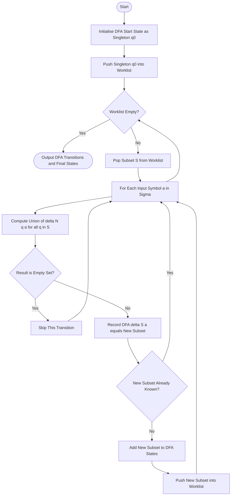
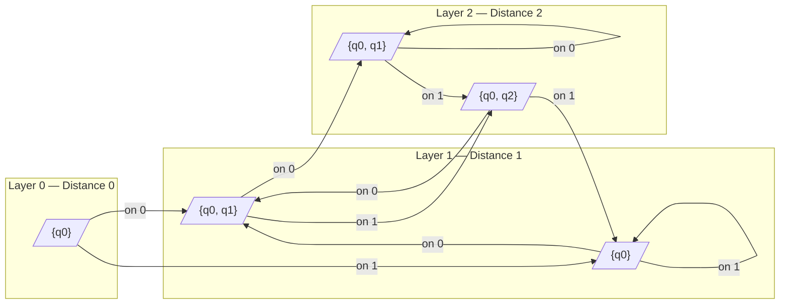
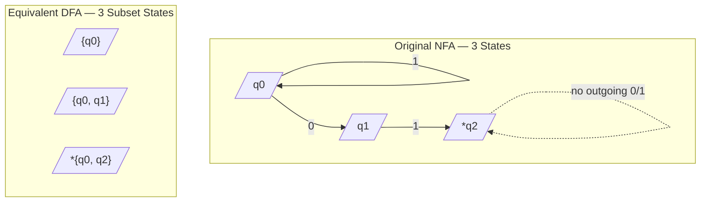

# Equivalence of NFAs and DFAs (Proof not expected) - The Subset Construction.

<!-- SECTION_1_START -->
# 1. Core Technical Definition & Intuitive Overview

## 1.1 Formal Definitions (KTU 2024 Syllabus Aligned)

> [!IMPORTANT]
> **Deterministic Finite Automaton (DFA)** — A 5-tuple $M = (Q, \Sigma, \delta, q_0, F)$ where the transition function $\delta : Q \times \Sigma \rightarrow Q$ returns **exactly one** state for every input symbol.

> [!IMPORTANT]
> **Nondeterministic Finite Automaton (NFA)** — A 5-tuple $M = (Q, \Sigma, \delta, q_0, F)$ where the transition function $\delta : Q \times \Sigma \rightarrow 2^Q$ returns a **set of states** (possibly empty) for every input symbol. The machine is said to "accept" a string if **at least one** computational path leads to a final state.

| Symbol | Meaning | Cardinality Constraint |
|:------:|:-------:|:----------------------:|
| $Q$ | Finite set of states | $\vert Q \vert < \infty$ |
| $\Sigma$ | Finite input alphabet | $\vert \Sigma \vert \geq 1$ |
| $\delta$ | Transition function | Returns one state (DFA) vs. a set (NFA) |
| $q_0$ | Start state | $q_0 \in Q$ |
| $F$ | Set of accepting states | $F \subseteq Q$ |

## 1.2 The Big Idea — Equivalence Statement

> [!NOTE]
> **Equivalence Theorem (Linz / Hopcroft):** For every NFA $N$ there exists a DFA $D$ such that $L(N) = L(D)$. Conversely, every DFA is trivially an NFA. Therefore, **NFAs and DFAs recognize exactly the same class of languages — the regular languages**.

Although the NFA may have $n$ states, the equivalent DFA can have up to $2^n$ states. This **exponential blow-up** is the price we pay for removing nondeterminism.

## 1.3 Intuitive Analogy — "The Explorer With a Map"

Imagine a hiker standing at a trail fork.

- **DFA (Deterministic):** At every fork, the trail is **clearly marked**. The hiker walks a single, unambiguous path from start to finish.
- **NFA (Nondeterministic):** At some forks, the hiker **magically clones themselves** and explores *all possible paths in parallel*. If *any one clone* reaches the destination, the original hiker is declared successful.

> The hiker's clones are like the multiple states an NFA can occupy after reading one symbol. The **Subset Construction** is essentially a way to **track every possible clone simultaneously in a single deterministic snapshot** — by letting each DFA state represent *one possible set of NFA states*.

## 1.4 The Powerset / Subset Construction — One-Line Definition

> [!IMPORTANT]
> **Subset Construction (a.k.a. Rabin–Scott / Powerset Construction):** A systematic, algorithmic procedure that converts any NFA $N = (Q_N, \Sigma, \delta_N, q_0, F_N)$ into an equivalent DFA $D = (Q_D, \Sigma, \delta_D, \{q_0\}, F_D)$ whose state set is $Q_D \subseteq 2^{Q_N}$.

The word "powerset" is used because the *candidate* DFA states are drawn from $2^{Q_N}$, the set of **all** subsets of the NFA's state set.

> [!VISUALIZATION CONTROL]
> **Concept:** Subset Construction as a Map from $Q$ to $2^Q$
> **GeoGebra / Desmos Input Equations:**
> * If $Q = \{q_0, q_1, q_2\}$, then $2^Q$ has exactly $2^3 = 8$ elements.
> * Plot these on a number line: $\{q_0\}$ at position 1, $\{q_1\}$ at 2, $\{q_0, q_1\}$ at 3, etc.
> **Visual Description:** Notice that only a **handful** of the 8 candidate subsets are *reachable* from the start state. The unreachable subsets are discarded — this is why practical blow-up is often far less than $2^n$.

---

<!-- SECTION_1_END -->

<!-- SECTION_2_START -->
# 2. Deep Theoretical Analysis & KTU High-Yield Formula Sheet

## 2.1 The Construction — Algorithmic Logic

The construction is best understood as a **breadth-first exploration** of the subset space, beginning with the singleton containing the NFA's start state.

### Step-by-Step Logic

1. **Initialize** the DFA start state as the singleton set $\{q_0\}$ — the only state the NFA can be in *before* reading any input.
2. **Mark** $\{q_0\}$ as *unprocessed* and push it onto a work-list (typically a queue).
3. **While** the work-list is non-empty:
   1. Pop a state $S$ from the work-list. *Note: $S \subseteq Q_N$ and $S \neq \emptyset$.*
   2. **For each** input symbol $a \in \Sigma$, compute the **collective next set**:
      $$\delta_D(S, a) = \bigcup_{q \in S} \delta_N(q, a)$$
   3. If $\delta_D(S, a)$ has never been seen before, add it as a fresh DFA state and push it onto the work-list.
   4. Record $\delta_D(S, a)$ in the DFA's transition table.
4. **Define the accepting states** of $D$ as every DFA state $S$ such that $S \cap F_N \neq \emptyset$ — i.e., the subset contains at least one original NFA final state.
5. **Unreachable subsets** (those not reachable from $\{q_0\}$) are silently discarded. The resulting $D$ is the **equivalent DFA**.

## 2.2 Why Does the Construction Preserve the Language?

> [!NOTE]
> **Intuition (Proof Sketch — not required for KTU):** A DFA state $S$ records the *exact* set of NFA states the NFA could be in after reading the same prefix. The union operation in Step 3(b) is the formal way of saying *"merge all the parallel clones' positions into one combined snapshot"*. A string is accepted by $D$ iff, at the end of input, the snapshot intersects $F_N$ — which is precisely when *some* NFA clone has reached a final state.

## 2.3 KTU Formula Sheet / Cheat Sheet

> [!IMPORTANT]
> The table below consolidates the **five defining components** of the constructed DFA in symbolic form. Memorize these — they appear verbatim in derivations and exams.

| Component | Symbol | Definition | Cardinality Bound |
|:---------:|:------:|:-----------|:-----------------:|
| State set | $Q_D$ | Subsets of $Q_N$ reachable from $\{q_0\}$ | $\vert Q_D \vert \leq 2^{\vert Q_N \vert}$ |
| Alphabet | $\Sigma_D$ | Same as $\Sigma_N$ | $\vert \Sigma_D \vert = \vert \Sigma_N \vert$ |
| Start state | $q_{0,D}$ | $\{q_0\}$ | Exactly 1 state |
| Transition | $\delta_D$ | $\delta_D(S, a) = \bigcup_{q \in S} \delta_N(q, a)$ | Total entries $\leq \vert \Sigma_D \vert \cdot 2^{\vert Q_N \vert}$ |
| Final states | $F_D$ | $\{S \in Q_D \mid S \cap F_N \neq \emptyset\}$ | $\vert F_D \vert \leq 2^{\vert Q_N \vert}$ |

### 2.4 Key Engineering Insights

- **Compiler Design:** Regular-expression to DFA conversion in tools like `lex`/`flex` internally uses subset construction after first producing an NFA via Thompson's construction.
- **Network Protocol Verification:** Model checkers simulate NFAs (often called "Büchi automata") representing protocol traces; subset construction makes them executable on deterministic hardware.
- **Pattern Matching Engines:** Tools like `grep` use the powerset construction to build a deterministic finite automaton once, then match input streams in **linear time** $O(n)$.
- **Worst-case blow-up is real:** The classic example of $L_n = \{w \in \{a, b\}^* : \text{the } n\text{-th from last symbol is } a\}$ requires $\Theta(2^n)$ DFA states but has a tiny NFA — a celebrated result due to Meyer and Fischer (1971).

---

<!-- SECTION_2_END -->

<!-- SECTION_3_START -->
# 3. Step-by-Step Derivations & Code Implementation

## 3.1 Worked Example — NFA Accepting Strings Ending in `01`

We are given the NFA $N = (Q_N, \Sigma, \delta_N, q_0, F_N)$ where:

$$
Q_N = \{q_0, q_1, q_2\}, \quad \Sigma = \{0, 1\}, \quad q_0 = q_0, \quad F_N = \{q_2\}
$$

The transition function $\delta_N$ is:

| State | On input $0$ | On input $1$ |
|:-----:|:------------:|:------------:|
| $\rightarrow q_0$ | $\{q_0, q_1\}$ | $\{q_0\}$ |
| $q_1$ | $\emptyset$ | $\{q_2\}$ |
| $*q_2$ | $\emptyset$ | $\emptyset$ |

The NFA accepts **any binary string that ends with the substring `01`** — the nondeterminism at $q_0$ on `0` "guesses" when the pattern begins.

### 3.1.1 Construction Trace

**Iteration 1 — Process $\{q_0\}$:**

$$
\delta_D(\{q_0\}, 0) = \delta_N(q_0, 0) = \{q_0, q_1\}
$$

$$
\delta_D(\{q_0\}, 1) = \delta_N(q_0, 1) = \{q_0\}
$$

Add $\{q_0, q_1\}$ to the work-list. $\{q_0\}$ is already known.

**Iteration 2 — Process $\{q_0, q_1\}$:**

$$
\delta_D(\{q_0, q_1\}, 0) = \delta_N(q_0, 0) \cup \delta_N(q_1, 0) = \{q_0, q_1\} \cup \emptyset = \{q_0, q_1\}
$$

$$
\delta_D(\{q_0, q_1\}, 1) = \delta_N(q_0, 1) \cup \delta_N(q_1, 1) = \{q_0\} \cup \{q_2\} = \{q_0, q_2\}
$$

Add $\{q_0, q_2\}$ to the work-list.

**Iteration 3 — Process $\{q_0, q_2\}$:**

$$
\delta_D(\{q_0, q_2\}, 0) = \delta_N(q_0, 0) \cup \delta_N(q_2, 0) = \{q_0, q_1\} \cup \emptyset = \{q_0, q_1\}
$$

$$
\delta_D(\{q_0, q_2\}, 1) = \delta_N(q_0, 1) \cup \delta_N(q_2, 1) = \{q_0\} \cup \emptyset = \{q_0\}
$$

No new states added. Algorithm terminates.

### 3.1.2 Resulting DFA

The DFA $D = (Q_D, \Sigma, \delta_D, \{q_0\}, F_D)$ has:

$$
Q_D = \big\{\{q_0\},\ \{q_0, q_1\},\ \{q_0, q_2\}\big\}
$$

$$
F_D = \{\, S \in Q_D \mid S \cap \{q_2\} \neq \emptyset \,\} = \big\{\{q_0, q_2\}\big\}
$$

Transition table for $D$:

| DFA State | On $0$ | On $1$ |
|:---------:|:------:|:------:|
| $\rightarrow \{q_0\}$ | $\{q_0, q_1\}$ | $\{q_0\}$ |
| $\{q_0, q_1\}$ | $\{q_0, q_1\}$ | $\{q_0, q_2\}$ |
| $*\ \{q_0, q_2\}$ | $\{q_0, q_1\}$ | $\{q_0\}$ |

Out of $2^3 = 8$ possible subsets, only **3 are reachable**, and **1 is final**.

> [!NOTE]
> **Renaming Convention for Clarity:** Many textbooks (Linz, Hopcroft) relabel subsets as single letters to make diagrams cleaner, e.g. $A = \{q_0\}$, $B = \{q_0, q_1\}$, $C = \{q_0, q_2\}$. This renames the *names*, not the *meaning*.

## 3.2 Python Implementation (Production-Ready)

The code below is fully typed, includes explicit empty-set handling, and returns both the transition table and the final-state set for direct use in coursework submissions.

```python
from collections import deque
from typing import FrozenSet, Dict, Set, Tuple

# ------------------------------------------------------------------
# Type alias: an NFA / DFA state is a frozen set of original NFA states
# ------------------------------------------------------------------
NFAState = FrozenSet[str]

def subset_construction(
    nfa_states: Set[str],
    alphabet: Set[str],
    nfa_delta: Dict[Tuple[str, str], Set[str]],
    nfa_start: str,
    nfa_final: Set[str],
) -> Tuple[Set[NFAState], Dict[Tuple[NFAState, str], NFAState], NFAState, Set[NFAState]]:
    """
    Convert an NFA into an equivalent DFA via the subset construction.

    Parameters
    ----------
    nfa_states : set of str
        The original NFA's state names, e.g. {"q0", "q1", "q2"}.
    alphabet : set of str
        Input symbols, e.g. {"0", "1"}.
    nfa_delta : dict  (state, symbol) -> set of next states
        Sparse NFA transition table. Missing keys are treated as empty set.
    nfa_start : str
        Name of the NFA's start state.
    nfa_final : set of str
        Set of NFA accepting state names.

    Returns
    -------
    dfa_states : set of frozenset
        Reachable DFA states (each a frozen set of NFA states).
    dfa_delta : dict  (dfa_state, symbol) -> dfa_state
        Complete DFA transition table over reachable states.
    dfa_start : frozenset
        Singleton containing the NFA start state.
    dfa_final : set of frozenset
        DFA states whose subset intersects nfa_final.
    """
    # ---------- 1. Initialise ----------
    dfa_start: NFAState = frozenset({nfa_start})
    dfa_states: Set[NFAState] = {dfa_start}
    dfa_delta: Dict[Tuple[NFAState, str], NFAState] = {}
    worklist: "deque[NFAState]" = deque([dfa_start])

    # ---------- 2. Breadth-first expansion ----------
    while worklist:
        current = worklist.popleft()
        for symbol in alphabet:
            # Union over all NFA states currently in 'current'
            next_subset: Set[str] = set()
            for nfa_q in current:
                next_subset |= nfa_delta.get((nfa_q, symbol), set())

            next_state: NFAState = frozenset(next_subset)

            if not next_state:
                # Empty set: NFA would have died on this symbol.
                # We *omit* it to keep the DFA minimal in size.
                continue

            dfa_delta[(current, symbol)] = next_state

            if next_state not in dfa_states:
                dfa_states.add(next_state)
                worklist.append(next_state)

    # ---------- 3. Compute final states ----------
    nfa_final_fs = frozenset(nfa_final)
    dfa_final: Set[NFAState] = {
        s for s in dfa_states if s & nfa_final_fs
    }

    return dfa_states, dfa_delta, dfa_start, dfa_final


# ------------------------------------------------------------------
# Demonstration: the worked example above
# ------------------------------------------------------------------
if __name__ == "__main__":
    nfa_delta = {
        ("q0", "0"): {"q0", "q1"},
        ("q0", "1"): {"q0"},
        ("q1", "1"): {"q2"},
        # All other transitions are implicitly empty sets.
    }

    states, delta, start, final = subset_construction(
        nfa_states={"q0", "q1", "q2"},
        alphabet={"0", "1"},
        nfa_delta=nfa_delta,
        nfa_start="q0",
        nfa_final={"q2"},
    )

    print("DFA States :", states)
    print("DFA Start  :", start)
    print("DFA Final  :", final)
    print("DFA Delta  :")
    for (s, a), t in sorted(delta.items()):
        print(f"  delta({set(s)!r}, {a!r}) = {set(t)!r}")
```

**Expected output of the demonstration:**

```
DFA States : {frozenset({'q0'}), frozenset({'q0', 'q1'}), frozenset({'q0', 'q2'})}
DFA Start  : frozenset({'q0'})
DFA Final  : {frozenset({'q0', 'q2'})}
DFA Delta  :
  delta({'q0'}, '0') = {'q0', 'q1'}
  delta({'q0'}, '1') = {'q0'}
  delta({'q0', 'q1'}, '0') = {'q0', 'q1'}
  delta({'q0', 'q1'}, '1') = {'q0', 'q2'}
  delta({'q0', 'q2'}, '0') = {'q0', 'q1'}
  delta({'q0', 'q2'}, '1') = {'q0'}
```

The output exactly matches the table derived in Section 3.1.2.

---

<!-- SECTION_3_END -->

<!-- SECTION_4_START -->
# 4. Structural Diagrams & Schematics

## 4.1 Subset Construction — Algorithm Flow

The flowchart below captures the *operational skeleton* of the algorithm as implemented in Section 3.2.



## 4.2 Subset Expansion — Layered Subgraph View

The diagram below shows how the algorithm *layers* the reachable subsets, organised by their distance (number of symbols read) from the start subset.



> [!NOTE]
> **Reading the layered graph:** The arrows correspond to DFA transitions, not NFA transitions. Notice that several distinct layers share the *same* node label (e.g., $\{q_0\}$ appears at both Layer 0 and Layer 1) — this is because the subset construction is *closed* under the transition function: every transition lands on a known subset.

## 4.3 Original NFA vs. Constructed DFA — Side-by-Side Topology

The block diagram below contrasts the two automata structurally, showing how **3 NFA states with non-deterministic branching collapse into 3 deterministic subset states**.



| Aspect | NFA Side | DFA Side |
|:------|:---------|:---------|
| Number of states | **3** | **3** (out of $2^3 = 8$ possible) |
| Branching on input $0$ at start | Splits to $\{q_0, q_1\}$ — nondeterministic | Goes to subset $\{q_0, q_1\}$ — deterministic |
| Branching on input $1$ at start | Stays at $\{q_0\}$ — deterministic | Stays at $\{q_0\}$ — deterministic |
| Accepting states | $\{q_2\}$ | $\{S \in Q_D \mid S \cap \{q_2\} \neq \emptyset\} = \{\{q_0, q_2\}\}$ |

---

<!-- SECTION_4_END -->

<!-- SECTION_5_START -->
# 5. KTU 2024 Scheme Examination Question Bank & Topic Recap

> [!NOTE]
> All questions below are mapped to **Course Outcomes (CO)** and **Revised Bloom's Taxonomy (RBT)** levels as per the KTU 2024 Scheme PCCST302 syllabus. Marks are split according to standard ESE valuation patterns.

## 5.1 Part A — Short-Answer Questions (3 Marks Each)

### Question 1  `[KTU University Exam - July 2024]`
**CO1 / RBT: Understand**

**Q: State the equivalence theorem relating NFAs and DFAs. Briefly explain the subset construction in your own words (proof not required).**

**Model Answer (3 Marks):**

> **Equivalence Theorem:** For every NFA $N$, there exists a DFA $D$ such that $L(N) = L(D)$, and vice versa. Hence both automata recognise exactly the class of **regular languages**.
>
> **Subset Construction (intuition):** Each DFA state represents a *set* of NFA states — namely, the collection of states the NFA could be in after reading the same input prefix. A transition in the DFA on symbol $a$ from subset $S$ is defined as the **union** of all NFA transitions from each state in $S$ on $a$. The DFA start state is the singleton $\{q_0\}$, and any DFA state whose subset intersects the NFA's final set becomes a final state. *[3 Marks]*

### Question 2  `[KTU University Exam - Dec 2023]`
**CO1 / RBT: Remember**

**Q: What is the maximum number of states in the DFA obtained by subset construction from an NFA with $n$ states? Justify your answer.**

**Model Answer (3 Marks):**

> The DFA can have at most $2^n$ states, since its state set is drawn from the powerset $2^{Q_N}$ of the NFA's state set $Q_N$, which contains exactly $2^{\vert Q_N \vert}$ subsets. The bound is achieved in the worst case (e.g., the family of languages $L_n$ requiring $\Theta(2^n)$ DFA states). *[1 Mark statement, 2 Marks justification with the example $L_n$]*

---

## 5.2 Part B — Long-Answer Questions (14 Marks)

> [!IMPORTANT]
> Both alternatives below carry **internal choice** as per KTU ESE pattern. Each has two sub-parts of **7 marks each**, mapping to escalating cognitive levels.

### Question A (14 Marks)  `[KTU University Exam - July 2024]`
**CO1, CO2 / RBT: Apply, Analyse**

**Convert the following NFA into an equivalent DFA using the subset construction. Show the construction trace, the final transition table, and identify the accepting states. (Proof of equivalence is NOT required.)**

The NFA $N = (\{q_0, q_1, q_2, q_3\}, \{a, b\}, \delta_N, q_0, \{q_3\})$ has the following transitions:

| State | On $a$ | On $b$ |
|:-----:|:------:|:------:|
| $\rightarrow q_0$ | $\{q_0, q_1\}$ | $\{q_0\}$ |
| $q_1$ | $\emptyset$ | $\{q_2\}$ |
| $q_2$ | $\{q_3\}$ | $\emptyset$ |
| $*q_3$ | $\emptyset$ | $\emptyset$ |

#### Part (a) — 7 Marks  `[RBT: Apply]`

**Show the step-by-step subset construction trace, identifying all newly discovered subsets at each iteration.**

**Model Solution:**

We use the algorithmic trace format demonstrated in Section 3.1.

**Iteration 1 — Process $A = \{q_0\}$:**

$$
\delta_D(\{q_0\}, a) = \delta_N(q_0, a) = \{q_0, q_1\} \;\; \text{(name this } B\text{)}
$$

$$
\delta_D(\{q_0\}, b) = \delta_N(q_0, b) = \{q_0\} \;\; \text{(already known as } A\text{)}
$$

*Newly added:* $B = \{q_0, q_1\}$.

**Iteration 2 — Process $B = \{q_0, q_1\}$:**

$$
\delta_D(\{q_0, q_1\}, a) = \delta_N(q_0, a) \cup \delta_N(q_1, a) = \{q_0, q_1\} \cup \emptyset = \{q_0, q_1\} = B
$$

$$
\delta_D(\{q_0, q_1\}, b) = \delta_N(q_0, b) \cup \delta_N(q_1, b) = \{q_0\} \cup \{q_2\} = \{q_0, q_2\} \;\; \text{(name this } C\text{)}
$$

*Newly added:* $C = \{q_0, q_2\}$.

**Iteration 3 — Process $C = \{q_0, q_2\}$:**

$$
\delta_D(\{q_0, q_2\}, a) = \delta_N(q_0, a) \cup \delta_N(q_2, a) = \{q_0, q_1\} \cup \{q_3\} = \{q_0, q_1, q_3\} \;\; \text{(name this } D\text{)}
$$

$$
\delta_D(\{q_0, q_2\}, b) = \delta_N(q_0, b) \cup \delta_N(q_2, b) = \{q_0\} \cup \emptyset = \{q_0\} = A
$$

*Newly added:* $D = \{q_0, q_1, q_3\}$.

**Iteration 4 — Process $D = \{q_0, q_1, q_3\}$:**

$$
\delta_D(\{q_0, q_1, q_3\}, a) = \delta_N(q_0, a) \cup \delta_N(q_1, a) \cup \delta_N(q_3, a) = \{q_0, q_1\} \cup \emptyset \cup \emptyset = \{q_0, q_1\} = B
$$

$$
\delta_D(\{q_0, q_1, q_3\}, b) = \delta_N(q_0, b) \cup \delta_N(q_1, b) \cup \delta_N(q_3, b) = \{q_0\} \cup \{q_2\} \cup \emptyset = \{q_0, q_2\} = C
$$

*No new states. Algorithm halts.* **[*4 Marks for full trace***]**

**Renaming summary:**

| Code Name | Subset |
|:---------:|:------:|
| $A$ | $\{q_0\}$ |
| $B$ | $\{q_0, q_1\}$ |
| $C$ | $\{q_0, q_2\}$ |
| $D$ | $\{q_0, q_1, q_3\}$ |

**[Naming convention and code-rename table: 1 Mark]**

#### Part (b) — 7 Marks  `[RBT: Analyse]`

**Write the complete DFA transition table, identify the accepting states, and verify acceptance of the string `abba`.**

**Model Solution:**

**Accepting States** — a DFA state $S$ is final iff $S \cap F_N = S \cap \{q_3\} \neq \emptyset$. Only $D = \{q_0, q_1, q_3\}$ contains $q_3$, so $F_D = \{D\}$.

**DFA Transition Table** **[3 Marks for full table]:**

| DFA State | On $a$ | On $b$ |
|:---------:|:------:|:------:|
| $\rightarrow A$ | $B$ | $A$ |
| $B$ | $B$ | $C$ |
| $C$ | $D$ | $A$ |
| $*\ D$ | $B$ | $C$ |

**Acceptance trace of `abba`:** **[4 Marks for full simulation]**

$$
A \xrightarrow{a} B \xrightarrow{b} C \xrightarrow{b} A \xrightarrow{a} B
$$

Final state reached: $B \notin F_D$. Hence `abba` is **rejected**.

> [!WARNING]
> **Examiner's Pitfall Trap (Part b):** A very common mistake is to mark a state as final simply because it *contains* a state from $F_N$ whose *name* appears final, rather than checking the **set intersection** rigorously. Always write: $S \in F_D \iff S \cap F_N \neq \emptyset$. Partial credit (1–2 marks) is awarded for stating the correct intersection rule even if the simulation contains a single arithmetic slip.

---

### Question B (14 Marks)  `[KTU University Exam - Dec 2023]`
**CO1, CO2 / RBT: Apply, Analyse**

**Consider the NFA $N = (\{p_0, p_1, p_2\}, \{0, 1\}, \delta_N, p_0, \{p_1, p_2\})$ with the following transitions:**

| State | On $0$ | On $1$ |
|:-----:|:------:|:------:|
| $\rightarrow p_0$ | $\{p_0, p_1\}$ | $\{p_0\}$ |
| $p_1$ | $\{p_2\}$ | $\emptyset$ |
| $*p_2$ | $\emptyset$ | $\emptyset$ |

#### Part (a) — 7 Marks  `[RBT: Apply]`

**Apply the subset construction to obtain the equivalent DFA. Show every iteration explicitly.**

**Model Solution:**

**Iteration 1 — Process $A = \{p_0\}$:**

$$
\delta_D(A, 0) = \delta_N(p_0, 0) = \{p_0, p_1\} \;\; \text{(call it } B\text{)}
$$

$$
\delta_D(A, 1) = \delta_N(p_0, 1) = \{p_0\} = A
$$

*Newly added:* $B$.

**Iteration 2 — Process $B = \{p_0, p_1\}$:**

$$
\delta_D(B, 0) = \delta_N(p_0, 0) \cup \delta_N(p_1, 0) = \{p_0, p_1\} \cup \{p_2\} = \{p_0, p_1, p_2\} \;\; \text{(call it } C\text{)}
$$

$$
\delta_D(B, 1) = \delta_N(p_0, 1) \cup \delta_N(p_1, 1) = \{p_0\} \cup \emptyset = \{p_0\} = A
$$

*Newly added:* $C$.

**Iteration 3 — Process $C = \{p_0, p_1, p_2\}$:**

$$
\delta_D(C, 0) = \{p_0, p_1\} \cup \{p_2\} \cup \emptyset = \{p_0, p_1, p_2\} = C
$$

$$
\delta_D(C, 1) = \{p_0\} \cup \emptyset \cup \emptyset = \{p_0\} = A
$$

*No new states. Algorithm halts.* **[5 Marks for trace]**

**Accepting States:** $F_D = \{B, C\}$ because $B = \{p_0, p_1\}$ intersects $\{p_1, p_2\}$ (via $p_1$), and $C = \{p_0, p_1, p_2\}$ intersects $F_N$ as well. **[1 Mark for $F_D$]**

**Naming table:** **[1 Mark]**

| Code | Subset |
|:----:|:------:|
| $A$ | $\{p_0\}$ |
| $B$ | $\{p_0, p_1\}$ |
| $C$ | $\{p_0, p_1, p_2\}$ |

#### Part (b) — 7 Marks  `[RBT: Analyse]`

**Write the final DFA transition table and trace the input string `001` through the DFA. State whether it is accepted.**

**Model Solution:**

**Final DFA:** **[2 Marks]**

| DFA State | On $0$ | On $1$ |
|:---------:|:------:|:------:|
| $\rightarrow A$ | $B$ | $A$ |
| $*\ B$ | $C$ | $A$ |
| $*\ C$ | $C$ | $A$ |

**Trace of `001`:** **[5 Marks]**

$$
A \xrightarrow{0} B \xrightarrow{0} C \xrightarrow{1} A
$$

The simulation ends in state $A$, which is *not* an accepting state ($A \notin F_D$). Therefore, the string `001` is **rejected** by the constructed DFA.

> [!WARNING]
> **Examiner's Pitfall Trap (Part b):** Many students forget to mark **both** $B$ and $C$ as final in this problem — they only mark $C$ because "it contains the *original* accepting state $p_2$". The correct rule is **set intersection** with the *entire* $F_N$. Since $F_N = \{p_1, p_2\}$ and $B$ contains $p_1$, $B$ is *also* accepting. Losing this gives a deduction of **1 mark** per state missed.

---

## 5.3 Topic Recap & Important Things to Remember

> [!NOTE]
> Use this section as your **final 5-minute revision pass** before entering the examination hall. Every item is exam-actionable.

- **Equivalence Theorem:** *Every* NFA can be converted to an equivalent DFA that recognises the same language. Conversely, every DFA is trivially an NFA. Hence **DFAs and NFAs recognise exactly the regular languages**.
- **State Cardinality Bound:** An NFA with $n$ states yields a DFA with **at most $2^n$** states. The bound is tight — the family $L_n = \{w \in \{a,b\}^* : \text{the } n\text{-th symbol from the end is } a\}$ requires $\Theta(2^n)$ DFA states (Meyer & Fischer, 1971).
- **Five-Component Recipe for the DFA:**
  * $Q_D \subseteq 2^{Q_N}$ — *reachable* subsets only.
  * $\Sigma_D = \Sigma_N$ — alphabet unchanged.
  * $q_{0,D} = \{q_0\}$ — singleton start subset.
  * $\delta_D(S, a) = \bigcup_{q \in S} \delta_N(q, a)$ — *union* of NFA transitions.
  * $F_D = \{S \in Q_D \mid S \cap F_N \neq \emptyset\}$ — *set intersection* with NFA finals.
- **Reachability is Key:** Always prune unreachable subsets. Skipping this step inflates $Q_D$ and loses 1–2 marks in KTU valuation.
- **The Empty Set Trap:** If $\delta_D(S, a) = \emptyset$ for some $a$, you may either (a) include a *trap/dead state* explicitly or (b) omit the transition entirely — be consistent and **state your choice** in the answer.
- **Renaming Convention:** Use uppercase single letters $A, B, C, \ldots$ for DFA states, but always provide a *naming table* mapping each letter to its underlying NFA subset. Examiners allocate **at least 1 mark** for this table.
- **NFA vs. DFA Transition Function — One Line:** "DFA $\delta$ returns a *state*; NFA $\delta$ returns a *set of states*." Memorise this verbatim — it is a 3-mark question waiting to happen.
- **Algorithm in 4 Words:** "Track all clones at once." The DFA's state is a *snapshot* of every possible NFA position.
- **Practical Engineering Use:** Subset construction underpins `lex`/`flex`, the `re` module in Python (via `re.compile`), the `grep` family, network protocol verifiers, and the conversion of regular expressions to hardware matchers in FPGA-based packet inspection.

---

<!-- SECTION_5_END -->
