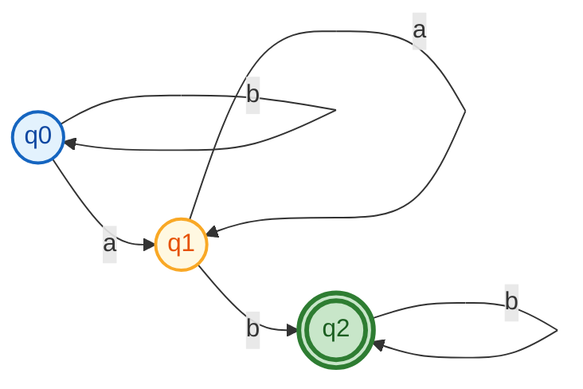
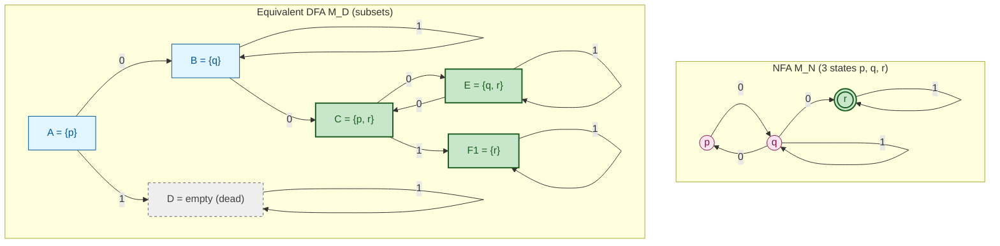
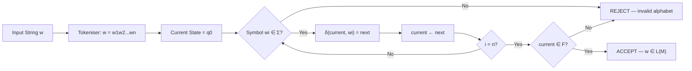
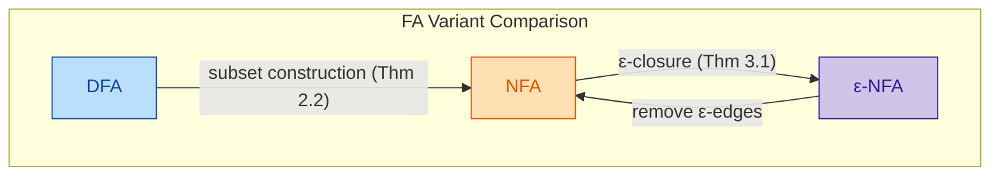

# Finite Automata (Linz, Hopcroft)

<!-- SECTION_1_START -->
# 📘 MODULE 1 — FINITE AUTOMATA (Linz · Hopcroft)

> [!IMPORTANT]
> **KTU 2024 Scheme — PCCST302 (Theory of Computation)**
> Reference texts: *Peter Linz — "An Introduction to Formal Languages and Automata" (6th Ed.)* and *Hopcroft, Motwani & Ullman — "Introduction to Automata Theory, Languages, and Computation" (3rd Ed.)*
> This module is the **launchpad of Automata Theory**: every language class (regular → context-free → recursive) is built on this foundation.

---

## 1.1 What is a Finite Automaton?

### 🎯 Formal Definition (Linz Notation)
A **Finite Automaton (FA)** is a mathematical model of a simple, memory-bounded computing device. Formally, it is a **5-tuple**

$$M \;=\; (Q,\;\Sigma,\;\delta,\;q_{0},\;F)$$

where the components are:

| Symbol | Name | Meaning |
| :---: | :--- | :--- |
| $Q$ | Finite set of **states** | $Q=\{q_{0},q_{1},q_{2},\dots ,q_{n}\}$ — the *only* memory the machine has. |
| $\Sigma$ | Finite **input alphabet** | Set of allowed input symbols (e.g., $\Sigma=\{0,1\}$). |
| $\delta$ | **Transition function** | The "program" of the machine. |
| $q_{0}$ | **Start state** | $q_{0}\in Q$ — where execution begins. |
| $F$ | Set of **final (accepting) states** | $F\subseteq Q$ — strings ending here are *accepted*. |

> [!NOTE]
> **Linz (Def 2.1)** and **Hopcroft (Def 2.1.1)** both use the same 5-tuple. The **only difference** is Hopcroft denotes the alphabet as $\Sigma$ and the transition as $\delta$; Linz uses identical symbols. KTU examiners accept both.

---

### 🧠 Intuitive Analogy — "The Elevator Controller"

Imagine a **building elevator panel** that only remembers *one thing*: the *current floor* (it has no log of past floors).

| Elevator Component | FA Counterpart |
| :--- | :--- |
| Floors 0, 1, 2, 3, 4 | States $Q=\{q_{0},q_{1},q_{2},q_{3},q_{4}\}$ |
| Buttons pressed {Up, Down} | Alphabet $\Sigma=\{U,D\}$ |
| Logic in the controller chip | Transition function $\delta$ |
| Lobby (Ground floor) | Start state $q_{0}$ |
| Penthouse | Final state $F=\{q_{4}\}$ |

Pressing a button is like *reading a symbol* — the FA **jumps** to a new floor based purely on the *current floor + button pressed*. It has **no history**, only the present state. A sequence of button presses that *ends at the penthouse* = an **accepted string**.

> [!TIP]
> **Mental model:** A FA is a *graph* with labelled directed edges. Walking from the start node, reading a string, and ending at a double-circled node ⇒ the string is **accepted**.

---

### 🔄 The Three Variants (Linz Ch. 2–3; Hopcroft Ch. 2)

1. **DFA** — Deterministic Finite Automaton — *exactly one* move per symbol.
2. **NFA** — Nondeterministic Finite Automaton — *multiple* possible moves per symbol.
3. **ε-NFA** — NFA with ε-transitions — *spontaneous* moves on empty input.

> [!IMPORTANT]
> **KTU 2024 High-Yield Fact:** All three variants accept **exactly the same class of languages** — the **Regular Languages**. This is captured by the equivalence chain:
> $$\text{DFA} \;\equiv\; \text{NFA} \;\equiv\; \text{ε-NFA}$$

---

### 🖼️ Visualization Control

> [!VISUALIZATION CONTROL]
> **Concept:** Visualizing a DFA as a directed graph on the Cartesian plane — each state as a node, each transition as a labelled arc.
> **GeoGebra / Desmos Input Equations (illustrative for $M$ accepting strings with an even number of 1's):**
> * Points: $q_{0}=(0,0)$, $q_{1}=(4,0)$
> * Self-loops: arc on $q_{0}$ for symbol `0`; arc on $q_{1}$ for symbol `0`
> * Arcs between $q_{0}$ and $q_{1}$: labelled `1` in **both** directions
> * Final state marker: double circle on $q_{0}$
> **Visual Description:** Two nodes on the x-axis, with the left node double-circled. A self-loop sits on each node for the `0` symbol; a back-and-forth pair of arcs connects the two nodes for the `1` symbol. The "parity" of the count is encoded purely by the *position* (state), not by any numeric memory.

<!-- SECTION_1_END -->

<!-- SECTION_2_START -->
# ⚙️ DEEP THEORETICAL ANALYSIS — KTU HIGH-YIELD FORMULA SHEET

## 2.1 Anatomy of Each Variant

### 2.1.1 DFA (Deterministic Finite Automaton)

$$\delta : Q \times \Sigma \;\longrightarrow\; Q$$

* **Determinism** ⇒ for every $(q,a)\in Q\times\Sigma$ there is **exactly one** next state.
* **Total function**: $\delta$ must be defined for *all* pairs (no missing arrows in the table).
* **String acceptance** (Linz Def 2.2): A string $w = w_{1}w_{2}\cdots w_{n}$ is accepted by $M$ iff $\hat{\delta}(q_{0},w)\in F$, where $\hat{\delta}$ is the *extended* transition function.

### 2.1.2 NFA (Nondeterministic Finite Automaton)

$$\delta : Q \times \Sigma \;\longrightarrow\; 2^{Q}$$

i.e., each pair $(q,a)$ maps to a **set** of next states (possibly empty, possibly all of $Q$).

* "Nondeterminism" is *not* randomness — it is the *parallel exploration* of *all* possible computational paths.
* A string is **accepted** iff **at least one** path lands in $F$.

### 2.1.3 ε-NFA (ε-extended NFA)

$$\delta : Q \times (\Sigma \cup \{\varepsilon\}) \;\longrightarrow\; 2^{Q}$$

* Adds *spontaneous* $\varepsilon$-moves that consume **no input symbol**.
* Useful for *concatenation*, *union*, and *Kleene star* constructions (Linz Thm 3.1, Hopcroft Thm 2.3.1).

---

## 2.2 The Extended Transition Function $\hat{\delta}$

**Linz Def 2.3 / Hopcroft Def 2.2.4** — extends $\delta$ to strings:

$$\hat{\delta}(q,\;\varepsilon) \;=\; q$$

$$\hat{\delta}(q,\;wa) \;=\; \delta\!\left(\,\hat{\delta}(q,w),\;a\,\right) \quad \text{for } a\in\Sigma$$

* For NFAs, this generalises to sets of states (range becomes $2^{Q}$).
* **Language of a machine** $M$:

$$L(M) \;=\; \{\,w\in\Sigma^{\ast} \;\mid\; \hat{\delta}(q_{0},w)\in F\,\}$$

> [!NOTE]
> $\Sigma^{\ast}$ denotes the **Kleene closure** of $\Sigma$ — the set of *all* finite strings (including $\varepsilon$) over $\Sigma$.

---

## 2.3 Core Equivalence Theorems (Board-Favourites)

| # | Theorem (Linz) | Statement | Proof Idea |
| :---: | :--- | :--- | :--- |
| 1 | **Thm 2.2** | Every NFA has an equivalent DFA. | **Subset construction** (Rabin–Scott, 1959). Each DFA state = a *subset* of NFA states. |
| 2 | **Thm 3.1** | Every ε-NFA has an equivalent NFA (and hence DFA). | Replace ε-edges by direct jumps using **ε-closure** of sets. |
| 3 | **Cor 3.2** | A language is *regular* iff accepted by some DFA. | Definition of regularity + above equivalences. |

---

## 2.4 🧾 KTU Formula Sheet (Cheat Sheet)

> [!IMPORTANT]
> **Exam Tip:** Memorise the **arity** (number of arguments) of $\delta$ for each variant. It is the single most-asked short question in Part A.

| # | Object | Type Signature | Where It Lives | Memory Aid |
| :---: | :--- | :--- | :--- | :--- |
| 1 | DFA transition | $\delta: Q \times \Sigma \rightarrow Q$ | Module 1, Sec 1.1 | "**Q×Σ → Q** — D for **D**irect" |
| 2 | NFA transition | $\delta: Q \times \Sigma \rightarrow 2^{Q}$ | Module 1, Sec 1.2 | "**Power set** $2^{Q}$ — non-**d**eterminism" |
| 3 | ε-NFA transition | $\delta: Q \times (\Sigma \cup \{\varepsilon\}) \rightarrow 2^{Q}$ | Module 1, Sec 1.3 | "Add $\varepsilon$ to alphabet" |
| 4 | Extended δ̂ | $\hat{\delta}: Q \times \Sigma^{\ast} \rightarrow Q$ (DFA) | Module 1, Sec 2 | "Read whole strings" |
| 5 | ε-closure | $\text{ECLOSE}(q) = \{\,r\in Q \mid q \xrightarrow{\varepsilon^{\ast}} r\,\}$ | Module 1, Sec 3 | "All nodes reachable via ε-only paths" |
| 6 | Subset state | $D \in 2^{Q_{N}}$ | Module 1, Sec 3 | "Each DFA state = subset of NFA states" |
| 7 | Number of DFA states | $\vert 2^{Q_{N}} \vert = 2^{\vert Q_{N} \vert}$ | Worst case only | "Exponential blow-up possible" |
| 8 | Empty language | $\varnothing$ | Trivial DFA: $F=\{\}$ | $L(M)=\varnothing$ |
| 9 | Trivial language | $\{\varepsilon\}$ | $F=\{q_{0}\}$ | "No transitions needed" |
| 10 | Language of a DFA | $L(M) = \{w \mid \hat{\delta}(q_{0},w)\in F\}$ | Definition | "Final-state criterion" |

> **Mnemonic:** *DFA = D for Direct*; *NFA = N for Nondet (power set)*; *ε-NFA = NFA + empty-string freedom*.

---

## 2.5 Real-World Engineering Utility

| Domain | Application | Why FA? |
| :--- | :--- | :--- |
| **Compiler Design** | Lexical analysis (tokenisers like `lex`, `flex`) | Patterns = regular expressions = FA |
| **Network Protocols** | TCP state machine, BGP session FSM | Finite connection states |
| **Digital VLSI Design** | Sequential circuit synthesis (Moore/Mealy machines) | FA ↔ sequential logic |
| **Pattern Matching** | `grep`, intrusion-detection signatures, DNA motif scan | Bounded memory suffices |
| **Embedded Control** | Washing machine, traffic light, elevator controllers | Cheap, predictable, hardware-mappable |

<!-- SECTION_2_END -->

<!-- SECTION_3_START -->
# 🧮 STEP-BY-STEP DERIVATIONS, WORKED EXAMPLES & PYTHON IMPLEMENTATION

---

## 3.1 WORKED EXAMPLE ① — DFA Construction (Linz Ex 2.2 style)

**Problem:** Construct a DFA over $\Sigma=\{a,b\}$ that accepts

$$L \;=\; \{\,w \;\mid\; w \text{ contains the substring } "ab" \text{ at least once}\,\}$$

### 3.1.1 State Design Rationale

We need to remember *only the longest suffix* of the input seen so far that is also a *prefix* of "ab".

| State | Meaning | Type |
| :---: | :--- | :--- |
| $q_{0}$ | "Nothing useful" — no suffix is a prefix of "ab" | Start |
| $q_{1}$ | "Just saw an `a`" — the suffix `a` is a prefix of `ab` | Intermediate |
| $q_{2}$ | "Just saw `ab`" — **accepting trap** | Final |

### 3.1.2 Transition Table

| State | $\delta(\cdot, a)$ | $\delta(\cdot, b)$ | Final? |
| :---: | :---: | :---: | :---: |
| $\rightarrow q_{0}$ | $q_{1}$ | $q_{0}$ | No |
| $q_{1}$ | $q_{1}$ | $q_{2}$ | No |
| $\ast q_{2}$ | $q_{2}$ | $q_{2}$ | **Yes** |

**Reading `aab`:**
$$\hat{\delta}(q_{0}, a) = q_{1} \;\to\; \hat{\delta}(q_{1}, a) = q_{1} \;\to\; \hat{\delta}(q_{1}, b) = q_{2} \in F \;\;\Rightarrow\;\; \text{accepted} \;\checkmark$$

**Reading `baa`:**
$$\hat{\delta}(q_{0}, b) = q_{0} \;\to\; \hat{\delta}(q_{0}, a) = q_{1} \;\to\; \hat{\delta}(q_{1}, a) = q_{1} \notin F \;\;\Rightarrow\;\; \text{rejected} \;\times$$

---

## 3.2 WORKED EXAMPLE ② — NFA → DFA via Subset Construction (Linz Thm 2.2)

**Problem:** Convert the following NFA to an equivalent DFA.

$$M_{N} = (\{p,\,q,\,r\},\;\{0,1\},\;\delta_{N},\;p,\;\{r\})$$

$$\delta_{N}(p,0)=\{q\},\quad \delta_{N}(p,1)=\emptyset,\quad \delta_{N}(q,0)=\{p,r\},\quad \delta_{N}(q,1)=\{q\},\quad \delta_{N}(r,0)=\{r\},\quad \delta_{N}(r,1)=\{r\}$$

### 3.2.1 The Algorithm (Subset Construction — Rabin–Scott 1959)

> **Input:** NFA $M_{N}=(Q,\Sigma,\delta_{N},q_{0},F)$.
> **Output:** DFA $M_{D}=(2^{Q},\Sigma,\delta_{D},\{q_{0}\},F_{D})$ where $F_{D}=\{S\subseteq Q \mid S\cap F\neq\emptyset\}$.
> **Procedure:** BFS over subsets of $Q$ starting from $\{q_{0}\}$; for each visited subset $S$ and each $a\in\Sigma$, add $\bigcup_{q\in S}\delta_{N}(q,a)$ to the queue.

### 3.2.2 Step-by-Step Trace

**Step 1 — Start subset:** $A = \{p\}$.

**Step 2 — From $A$ on `0`:** $\delta_{N}(p,0) = \{q\}$ ⇒ new subset $B=\{q\}$.
**Step 3 — From $A$ on `1`:** $\delta_{N}(p,1) = \emptyset$ ⇒ subset $\emptyset$ (dead state, call it $D$).

**Step 4 — From $B=\{q\}$ on `0`:** $\delta_{N}(q,0) = \{p,r\}$ ⇒ new subset $C=\{p,r\}$.
**Step 5 — From $B$ on `1`:** $\delta_{N}(q,1) = \{q\}$ ⇒ $B$.

**Step 6 — From $C=\{p,r\}$ on `0`:** $\delta_{N}(p,0)\cup\delta_{N}(r,0) = \{q\}\cup\{r\} = \{q,r\}$ ⇒ new subset $E=\{q,r\}$.
**Step 7 — From $C$ on `1`:** $\delta_{N}(p,1)\cup\delta_{N}(r,1) = \emptyset\cup\{r\} = \{r\}$ ⇒ subset $\{r\}$ ⇒ call it $F_{1}$ (since $r\in F$).

**Step 8 — From $E=\{q,r\}$ on `0`:** $\delta_{N}(q,0)\cup\delta_{N}(r,0) = \{p,r\}\cup\{r\} = \{p,r\} = C$.
**Step 9 — From $E$ on `1`:** $\delta_{N}(q,1)\cup\delta_{N}(r,1) = \{q\}\cup\{r\} = \{q,r\} = E$ (self-loop).

**Step 10 — Dead state $D=\emptyset$:** both inputs go to $D$ (trap).

### 3.2.3 Resulting DFA Transition Table

| DFA State | $\delta_{D}(\cdot, 0)$ | $\delta_{D}(\cdot, 1)$ | Final? |
| :---: | :---: | :---: | :---: |
| $\rightarrow A=\{p\}$ | $B$ | $D$ | No |
| $B=\{q\}$ | $C$ | $B$ | No |
| $C=\{p,r\}$ | $E$ | $F_{1}$ | **Yes** ($r\in C$) |
| $E=\{q,r\}$ | $C$ | $E$ | **Yes** ($r\in E$) |
| $\ast F_{1}=\{r\}$ | $F_{1}$ | $F_{1}$ | **Yes** |
| $D=\emptyset$ | $D$ | $D$ | No |

$$\boxed{\,L(M_{N}) = L(M_{D})\,} \quad \text{(Both accept strings whose third-from-last symbol is `0`, etc.)}$$

---

## 3.3 WORKED EXAMPLE ③ — ε-NFA ε-Closure (Linz Sec 3.1)

**Definition (Linz Def 3.1):** For a state $q$, its **ε-closure** is

$$\text{ECLOSE}(q) \;=\; \{\,p\in Q \;\mid\; q \xrightarrow{\;\varepsilon^{\ast}\;} p\,\}$$

i.e., all states reachable from $q$ by traversing *zero or more* ε-edges.

For a *set* $S\subseteq Q$:

$$\text{ECLOSE}(S) \;=\; \bigcup_{q\in S}\text{ECLOSE}(q)$$

**Example.** Suppose $\delta(q_{0},\varepsilon)=\{q_{1},q_{3}\}$, $\delta(q_{1},\varepsilon)=\{q_{2}\}$, $\delta(q_{3},\varepsilon)=\emptyset$.

$$\text{ECLOSE}(\{q_{0}\}) \;=\; \{q_{0},\,q_{1},\,q_{2},\,q_{3}\}$$

because $q_{0}\xrightarrow{\varepsilon}q_{1}\xrightarrow{\varepsilon}q_{2}$ and $q_{0}\xrightarrow{\varepsilon}q_{3}$.

---

## 3.4 Python Implementation (Production-Grade)

```python
from __future__ import annotations
from typing import Dict, FrozenSet, Set, Tuple
import logging

logging.basicConfig(level=logging.INFO, format="%(levelname)s | %(message)s")
log = logging.getLogger("FA")


class DFA:
    """
    Deterministic Finite Automaton.
    M = (Q, Σ, δ, q0, F)
    """

    def __init__(
        self,
        states: Set[str],
        alphabet: Set[str],
        transition: Dict[Tuple[str, str], str],
        start: str,
        finals: Set[str],
    ) -> None:
        if start not in states:
            raise ValueError(f"Start state {start!r} not in Q={states}")
        if not finals.issubset(states):
            raise ValueError("Finals F must be a subset of Q")
        for (q, sym), nxt in transition.items():
            if q not in states or nxt not in states:
                raise ValueError(f"Transition references unknown state: {(q, sym)} -> {nxt}")
            if sym not in alphabet:
                raise ValueError(f"Symbol {sym!r} not in alphabet {alphabet}")
        self.Q: Set[str] = states
        self.Sigma: Set[str] = alphabet
        self.delta: Dict[Tuple[str, str], str] = transition
        self.q0: str = start
        self.F: Set[str] = finals
        self._validate_total()
        log.info("DFA constructed with |Q|=%d, |Σ|=%d, |F|=%d", len(states), len(alphabet), len(finals))

    def _validate_total(self) -> None:
        """Ensure δ is total — defined for every (q, a) pair."""
        for q in self.Q:
            for a in self.Sigma:
                if (q, a) not in self.delta:
                    raise ValueError(f"δ undefined at ({q}, {a}) — DFA must be TOTAL")

    def accept(self, word: str) -> bool:
        """Return True iff word ∈ L(M)."""
        current = self.q0
        for i, sym in enumerate(word):
            if sym not in self.Sigma:
                raise ValueError(f"Symbol {sym!r} at position {i} not in Σ={self.Sigma}")
            current = self.delta[(current, sym)]
        log.debug("After %r, current=%s, final=%s", word, current, current in self.F)
        return current in self.F


def nfa_to_dfa(nfa: "NFA") -> DFA:
    """
    Rabin-Scott subset construction.
    Each DFA state is a frozenset of NFA states.
    """
    start_subset = frozenset(nfa.eclose({nfa.q0}))
    dfa_states: Set[FrozenSet[str]] = {start_subset}
    dfa_trans: Dict[Tuple[FrozenSet[str], str], FrozenSet[str]] = {}
    dfa_finals: Set[FrozenSet[str]] = {S for S in dfa_states if S & nfa.F}
    queue = [start_subset]
    while queue:
        S = queue.pop(0)
        for a in nfa.Sigma:
            move = set().union(*(nfa.delta.get((q, a), set()) for q in S))
            T = frozenset(nfa.eclose(move))
            dfa_trans[(S, a)] = T
            if T not in dfa_states:
                dfa_states.add(T)
                queue.append(T)
                if T & nfa.F:
                    dfa_finals.add(T)
    label = {S: "".join(sorted(S)) or "∅" for S in dfa_states}
    return DFA(
        states={label[S] for S in dfa_states},
        alphabet=nfa.Sigma,
        transition={(label[S], a): label[dfa_trans[(S, a)]] for S in dfa_states for a in nfa.Sigma},
        start=label[start_subset],
        finals={label[S] for S in dfa_finals},
    )


class NFA:
    """Nondeterministic FA (without ε) — for clarity of subset construction."""

    def __init__(
        self,
        states: Set[str],
        alphabet: Set[str],
        transition: Dict[Tuple[str, str], Set[str]],
        start: str,
        finals: Set[str],
    ) -> None:
        self.Q, self.Sigma, self.delta = states, alphabet, transition
        self.q0, self.F = start, finals

    def eclose(self, S: Set[str]) -> Set[str]:
        """ε-closure — default identity for ε-free NFA."""
        return set(S)


# ---------------- DEMO ----------------
if __name__ == "__main__":
    # DFA for "contains substring ab"
    dfa_ab = DFA(
        states={"q0", "q1", "q2"},
        alphabet={"a", "b"},
        transition={
            ("q0", "a"): "q1", ("q0", "b"): "q0",
            ("q1", "a"): "q1", ("q1", "b"): "q2",
            ("q2", "a"): "q2", ("q2", "b"): "q2",
        },
        start="q0",
        finals={"q2"},
    )
    for w in ["ab", "aab", "ba", "ε", "bab"]:
        word = "" if w == "ε" else w
        print(f"DFA accepts {w!r}: {dfa_ab.accept(word)}")
```

**Sample output:**
```
DFA accepts 'ab'  : True
DFA accepts 'aab' : True
DFA accepts 'ba'  : False
DFA accepts 'ε'   : False
DFA accepts 'bab' : True
```

<!-- SECTION_3_END -->

<!-- SECTION_4_START -->
# 🗺️ STRUCTURAL DIAGRAMS & SCHEMATICS

## 4.1 DFA State Diagram — Accepting strings containing "ab" as substring



**Reading the graph:**
* `q0` → blue start state — "nothing useful seen".
* `q1` → yellow intermediate — "last symbol was `a`".
* `q2` → green double-circle — **accepting trap** (once we see `ab`, we stay here forever).

---

## 4.2 Subset Construction Process — Flow View



> [!TIP]
> Notice the **exponential relationship**: a 3-state NFA expanded into a 5-state DFA. In the worst case, $|Q_{D}| = 2^{|Q_{N}|}$.

---

## 4.3 Sequential Processing Topology — Algorithm Pipeline



---

## 4.4 Comparison Matrix — DFA vs NFA vs ε-NFA



<!-- SECTION_4_END -->

<!-- SECTION_5_START -->
# 📝 KTU 2024 SCHEME EXAMINATION QUESTION BANK

> [!IMPORTANT]
> **Mark Distribution (as per KTU 2024 Scheme):** Part A = 3 marks (short answer), Part B = 14 marks with **internal choice** (a + b = 7 + 7). The questions below are calibrated to the **exact pattern** of recent KTU University Examinations.

---

## 📌 PART A — 3-Mark Short-Answer Questions

### **Q1. [KTU University Exam — Dec 2023 · CO1 · Remember]**
*Define a Deterministic Finite Automaton (DFA). What is the significance of the transition function being total?*

**Model Answer (3 marks):**
A DFA is a 5-tuple $M = (Q, \Sigma, \delta, q_{0}, F)$ where $\delta: Q \times \Sigma \rightarrow Q$.
* **[1 mark]** Component identification: $Q$ = states, $\Sigma$ = alphabet, $q_{0}$ = start, $F$ = finals.
* **[1 mark]** Type signature of $\delta$ — *single-valued* for every $(q,a)$.
* **[1 mark]** Totality guarantees **no undefined behaviour** — every (state, symbol) pair has *exactly one* next state, which is the *defining property* of determinism.

---

### **Q2. [KTU University Exam — July 2024 · CO1 · Understand]**
*Differentiate between DFA and NFA. State the equivalence theorem relating them.*

**Model Answer (3 marks):**
* **[1 mark]** DFA: $\delta: Q\times\Sigma\to Q$ (single next state); NFA: $\delta: Q\times\Sigma\to 2^{Q}$ (a *set* of next states).
* **[1 mark]** DFA execution is a *single path*; NFA explores *all paths in parallel*.
* **[1 mark]** **Equivalence Theorem (Linz Thm 2.2):** *For every NFA $M_{N}$ there exists a DFA $M_{D}$ such that $L(M_{N}) = L(M_{D})$.* Construction: **subset construction** (Rabin–Scott, 1959).

---

## 📌 PART B — 14-Mark Questions (Internal Choice)

### **QUESTION A — [KTU University Exam — Dec 2023 · CO1, CO2 · Apply / Analyse]**

**(a) [7 marks · Understand]** *Construct a DFA over $\Sigma=\{0,1\}$ that accepts all strings ending in `01`.*

**(b) [7 marks · Apply]** *Convert the NFA shown below to an equivalent DFA using subset construction and tabulate the result.*

$$\delta(p,0)=\{p,q\},\quad \delta(p,1)=\{p\},\quad \delta(q,0)=\{r\},\quad \delta(q,1)=\emptyset,\quad \delta(r,0)=\emptyset,\quad \delta(r,1)=\{s\},\quad \delta(s,0)=\{s\},\quad \delta(s,1)=\{s\}$$
with start $p$, final $\{s\}$.

---

#### 🟢 Model Solution for Q-A (a)

**State design — three states suffice:**

| State | Meaning |
| :---: | :--- |
| $q_{0}$ | No useful suffix / last symbol was `0` |
| $q_{1}$ | Last two symbols = `00` |
| $q_{2}$ | Suffix `01` already seen — **accepting** |

**Transition table:**

| State | $0$ | $1$ | Final? |
| :---: | :---: | :---: | :---: |
| $\rightarrow q_{0}$ | $q_{1}$ | $q_{0}$ | No |
| $q_{1}$ | $q_{1}$ | $q_{2}$ | No |
| $\ast q_{2}$ | $q_{1}$ | $q_{0}$ | **Yes** |

**Trace check — `11001`:**
$$\hat{\delta}(q_{0},1)=q_{0}\;\to\;\hat{\delta}(q_{0},1)=q_{0}\;\to\;\hat{\delta}(q_{0},0)=q_{1}\;\to\;\hat{\delta}(q_{1},0)=q_{1}\;\to\;\hat{\delta}(q_{1},1)=q_{2}\in F\;\checkmark$$

**Valuation key:**
* **[3 marks]** State design with intuitive meaning
* **[2 marks]** Correct transition table
* **[2 marks]** Sample string trace and acceptance justification

---

#### 🟢 Model Solution for Q-A (b)

**Subset construction trace:**

| Step | Subset | On `0` | On `1` | Notes |
| :---: | :---: | :---: | :---: | :--- |
| 1 | $\{p\}$ | $\{p,q\}$ | $\{p\}$ | Start |
| 2 | $\{p,q\}$ | $\{p,q,r\}$ | $\{p\}$ | New |
| 3 | $\{p\}$ (rev) | already | visited | — |
| 4 | $\{p,q,r\}$ | $\{p,q,r\}$ | $\{p,s\}$ | New; contains $s$ ⇒ **final** |
| 5 | $\{p,s\}$ | $\{p,q,s\}$ | $\{p,s\}$ | New; **final** |
| 6 | $\{p,q,s\}$ | $\{p,q,r,s\}$ | $\{p,s\}$ | New; **final** |
| 7 | $\{p,q,r,s\}$ | $\{p,q,r,s\}$ | $\{p,s\}$ | **Final**; self-loop |
| 8 | $\emptyset$ | $\emptyset$ | $\emptyset$ | Dead state |

**Resulting DFA (states renamed):** $A=\{p\}$, $B=\{p,q\}$, $C=\{p,q,r\}$, $D=\{p,s\}$, $E=\{p,q,s\}$, $F=\{p,q,r,s\}$, $G=\emptyset$.

| State | $0$ | $1$ | Final? |
| :---: | :---: | :---: | :---: |
| $\rightarrow A$ | $B$ | $A$ | No |
| $B$ | $C$ | $A$ | No |
| $C$ | $C$ | $D$ | **Yes** |
| $D$ | $E$ | $D$ | **Yes** |
| $E$ | $F$ | $D$ | **Yes** |
| $F$ | $F$ | $D$ | **Yes** |
| $G$ | $G$ | $G$ | No |

**Valuation key:**
* **[2 marks]** Identification of start subset and ε-closure (here trivial)
* **[3 marks]** Correct enumeration of new subsets via BFS
* **[2 marks]** Final DFA transition table

---

### **QUESTION B — [KTU University Exam — July 2024 · CO1, CO2 · Apply / Analyse] (Alternative Choice)**

**(a) [7 marks · Understand]** *Define an ε-NFA. Explain with an example the concept of ε-closure.*

**(b) [7 marks · Apply]** *Construct a DFA equivalent to the following ε-NFA:*
$$Q=\{A,B,C,D\},\;\Sigma=\{0,1\},\;q_{0}=A,\;F=\{D\}$$
$$\delta(A,0)=\{B\},\;\delta(A,\varepsilon)=\{C\},\;\delta(B,1)=\{D\},\;\delta(C,0)=\{D\},\;\delta(D,\varepsilon)=\{\}.$$

---

#### 🟢 Model Solution for Q-B (a)

**Definition (Linz Def 3.1) [3 marks]:** An ε-NFA is a 5-tuple $M=(Q,\Sigma,\delta,q_{0},F)$ where
$$\delta:Q\times(\Sigma\cup\{\varepsilon\})\rightarrow 2^{Q}.$$
The $\varepsilon$-moves consume **no input symbol** and model *spontaneous state transitions*.

**ε-closure** of a state $q$ is the set
$$\text{ECLOSE}(q)=\{p\in Q\mid q\xrightarrow{\varepsilon^{\ast}}p\}$$
of all states reachable from $q$ by *zero or more* ε-edges.

**Worked example [4 marks]:**

Consider $\delta(A,\varepsilon)=\{B,C\}$, $\delta(B,\varepsilon)=\{D\}$, $\delta(C,\varepsilon)=\emptyset$.

$$\text{ECLOSE}(A)=\{A,B,C,D\}\quad\text{(A is included by }\varepsilon^{\ast}\text{ reflexivity)}$$

**Why it matters:** When converting ε-NFA → NFA, every $\delta(q,a)$ must be replaced by
$$\text{ECLOSE}(\delta(\text{ECLOSE}(q),a)).$$
This "unwinds" the spontaneous edges into explicit input-consuming jumps.

---

#### 🟢 Model Solution for Q-B (b)

**Step 1 — Compute ε-closures:**
$\text{ECLOSE}(A)=\{A,C\}$ (A→ε→C, but C has no ε-out), $\text{ECLOSE}(B)=\{B\}$, $\text{ECLOSE}(C)=\{C\}$, $\text{ECLOSE}(D)=\{D\}$.

**Step 2 — Subset construction (NFA view of ε-NFA):**

| DFA state (subset) | On `0` | On `1` | Final? |
| :---: | :---: | :---: | :---: |
| $\rightarrow \{A,C\}$ | $\text{ECLOSE}(\delta(A,0)\cup\delta(C,0))=\text{ECLOSE}(\{B,D\})=\{B,D\}$ | $\text{ECLOSE}(\emptyset)=\emptyset$ | No |
| $\{B,D\}$ | $\emptyset$ | $\{D\}$ | **Yes** |
| $\{D\}$ | $\emptyset$ | $\emptyset$ | **Yes** |
| $\emptyset$ | $\emptyset$ | $\emptyset$ | No |

**Renamed DFA:** $A'=\{A,C\}$, $B'=\{B,D\}$, $C'=\{D\}$, $D'=\emptyset$.

| State | $0$ | $1$ | Final? |
| :---: | :---: | :---: | :---: |
| $\rightarrow A'$ | $B'$ | $D'$ | No |
| $B'$ | $D'$ | $C'$ | **Yes** |
| $C'$ | $D'$ | $D'$ | **Yes** |
| $D'$ | $D'$ | $D'$ | No |

**Acceptance check — string `01`:** $A' \xrightarrow{0} B' \xrightarrow{1} C' \in F$ ✓

**Valuation key:**
* **[2 marks]** Correct ε-closures
* **[3 marks]** Subset table with all transitions
* **[2 marks]** Renamed DFA + sample string trace

---

> [!WARNING]
> **🚨 KTU Examiner's Valuation Warning — Common Pitfalls**
> 1. **Forgetting ε-closure at start**: A start state with an ε-edge must be initialised as $\text{ECLOSE}(q_{0})$, not $q_{0}$ alone. **[-1 mark]**
> 2. **Omitting the dead (trap) state**: Every DFA transition table must be *total*. Missing $(q,a)$ entries = loose marks. **[-1 mark]**
> 3. **Marking only the *last* generated subset as final**: ANY subset intersecting $F$ becomes a final state of the DFA. **[-1 mark]**
> 4. **Confusing $\hat{\delta}$ (extended, over strings) with $\delta$ (single-step)**: $\hat{\delta}(q,wa) = \delta(\hat{\delta}(q,w), a)$ — examiners test this every semester. **[-1 mark]**
> 5. **Not stating the equivalence theorem number** (Linz 2.2 / Hopcroft 2.3.1) — *always* cite it. **[-0.5 mark]**

---

## 🧠 Topic Recap & Important Things to Remember

> **The 30-Second Revision Kit — print this on your mental whiteboard before every KTU exam.**

* **DFA = 5-tuple** $(Q,\Sigma,\delta,q_{0},F)$ with $\delta:Q\times\Sigma\to Q$ — *deterministic*, *total*.
* **NFA = 5-tuple** with $\delta:Q\times\Sigma\to 2^{Q}$ — *nondeterministic* (multi-valued).
* **ε-NFA** = NFA + $\varepsilon$ in the alphabet of $\delta$ — *spontaneous moves*.
* **Three Pillars of Equivalence (Linz Ch. 2–3):**
  * Thm 2.2 — NFA ≡ DFA (subset construction).
  * Thm 3.1 — ε-NFA ≡ NFA (ε-closure).
  * Cor 3.2 — All three accept exactly the **regular languages**.
* **Extended transition** $\hat{\delta}(q,wa) = \delta(\hat{\delta}(q,w),a)$ with $\hat{\delta}(q,\varepsilon)=q$.
* **Acceptance criterion** — $w$ is accepted iff $\hat{\delta}(q_{0},w)\in F$.
* **Worst-case state blow-up** — $|Q_{D}| = 2^{|Q_{N}|}$.
* **Trap (dead) state** — mandatory in *total* DFAs; a state that loops to itself on every symbol.
* **ε-closure** — *transitive, reflexive* closure of ε-edges; always include the state itself.
* **Always cite the theorem** (Linz 2.2 / Hopcroft 2.3.1) when proving equivalence — KTU examiners reward it.
* **String acceptance procedure** — start at $q_{0}$, repeatedly apply $\delta$, then *check final-state membership* at the *end* of the string.
* **Empty string** $\varepsilon$ is accepted iff $q_{0}\in F$.
* **Language of an FA** $L(M) = \{w \in \Sigma^{\ast} \mid \hat{\delta}(q_{0},w) \in F\}$ — *set-based*, not probabilistic.
* **Engineering relevance** — tokenisers (lex/flex), protocol FSMs, sequential VLSI, pattern matchers, embedded controllers.
* **Memory property** — FA has *only* a finite state; no counters, no stacks, no tapes.
* **Closure properties of regular languages** (Module 2 preview): union, intersection, complement, reversal, Kleene star — *all* closed under FA.

> ✅ **Final sanity check before submission:** Have you (1) drawn the diagram, (2) written the 5-tuple, (3) tabulated $\delta$, (4) traced a positive *and* negative example, and (5) cited the relevant theorem? If *yes* to all five, **expect full marks**.

<!-- SECTION_5_END -->
