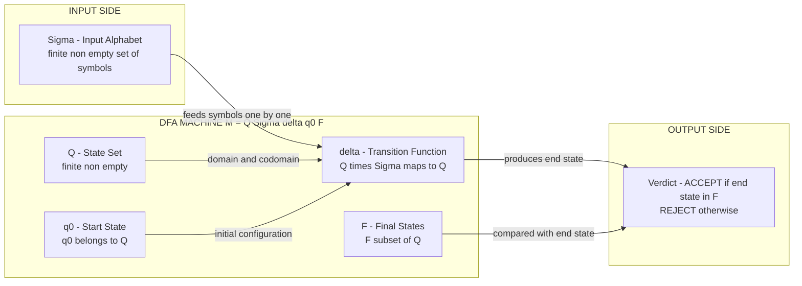
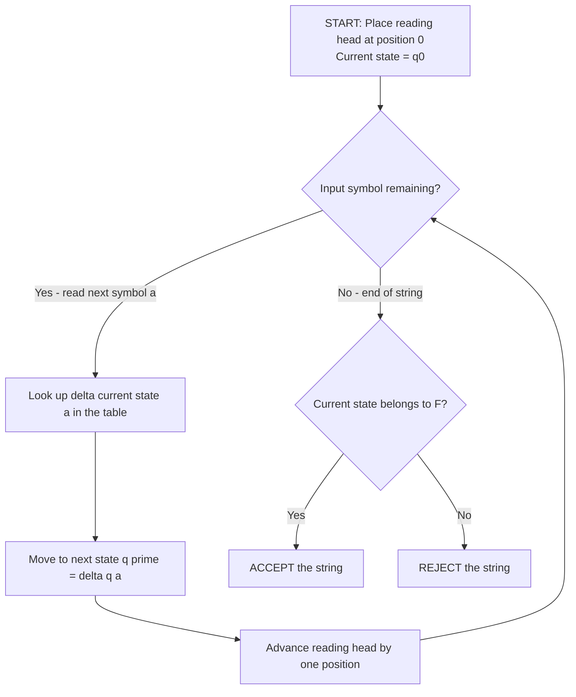
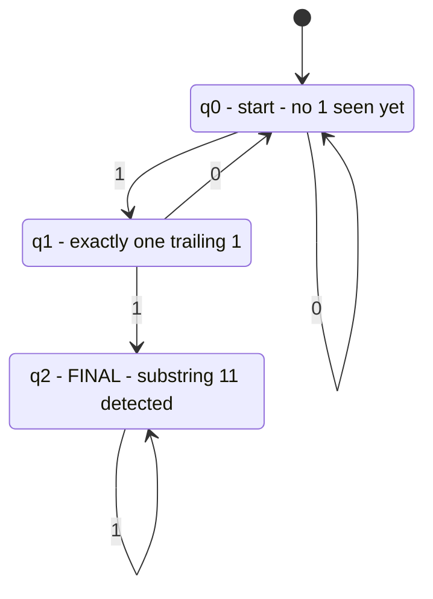

# Formal definition of a finite automaton

<!-- SECTION_1_START -->
# Formal Definition of a Finite Automaton

## 1.1 The Core Definition (KTU 2024 Syllabus Verbatim)

A **Deterministic Finite Automaton (DFA)** is a mathematical model of computation that reads a finite string of symbols from an alphabet, processes them sequentially through a finite set of states using a deterministic transition rule, and either accepts or rejects the input.

Formally, a DFA is a **5-tuple** (an ordered collection of five elements):

$$M = (Q, \Sigma, \delta, q_0, F)$$

where each component is rigorously defined as follows:

$$
\begin{aligned}
Q   &= \text{A finite, non-empty set of \textbf{states}} \\
\Sigma &= \text{A finite, non-empty set of input symbols (the \textbf{alphabet})} \\
\delta &= \text{The \textbf{transition function}, } \delta : Q \times \Sigma \rightarrow Q \\
q_0   &= \text{The \textbf{start state}, } q_0 \in Q \\
F    &= \text{The set of \textbf{final (accepting) states}, } F \subseteq Q
\end{aligned}
$$

> [!IMPORTANT]
> **KTU Board Exam Favourite Notation:** The transition function is always written as $\delta$ (the lowercase Greek letter *delta*). Examiners will deduct marks if you use $T$, $\rightarrow$, or any other symbol in the formal definition.

> [!NOTE]
> **Syllabus Highlight (Linz, 6th Ed. – Chapter 2):** Hopcroft, Motwani & Ullman (the "dragon book" of TOC) call this the *Deterministic Finite Acceptor*. Linz uses the simpler 5-tuple definition above, which is what KTU 2024 follows.

---

## 1.2 The Intuition – "What Is a Finite Automaton, Really?"

### Real-World Analogy: The Vending Machine

Imagine a coin-operated **vending machine** that accepts only ₹5 and ₹10 coins and dispenses a chocolate bar when the total reaches exactly ₹15.

| State Meaning | What Happens on ₹5 | What Happens on ₹10 |
| :--- | :---: | :---: |
| ₹0 inserted (start) | Go to "₹5 collected" | Go to "₹10 collected" |
| ₹5 collected | Go to "₹10 collected" | Go to "₹15 collected" (FINAL) |
| ₹10 collected | Go to "₹15 collected" (FINAL) | **Error / Stay / Reject** |
| ₹15 collected | Dispense (reset) | Dispense (reset) |

- The machine **remembers** only its *current amount* — not the entire history of coins.
- The total number of possible "memories" is **finite** (₹0, ₹5, ₹10, ₹15).
- It reads the input one coin at a time and moves accordingly.
- It **accepts** the input if it lands on a final state at the end of the string.

> [!TIP]
> **The "Finite" in Finite Automaton = finite number of states (memory slots).** This is the single most important conceptual takeaway. An FA cannot count arbitrarily high, cannot store a tape, and cannot make non-deterministic choices.

### Geometric Intuition

Think of a DFA as a **directed graph** where:
- **Nodes** = states in $Q$ (draw them as circles, double circles for final states)
- **Labelled edges** = transition function $\delta$ (draw them as arrows with the input symbol as label)
- **One entry arrow** = the start state $q_0$ (a small arrow from nowhere pointing at $q_0$)
- **Special nodes** = final states in $F$ (draw them as double circles)

> [!VISUALIZATION CONTROL]
> **Concept:** Generic DFA skeleton with three states, one start, one final, and two alphabet symbols.
> **GeoGebra / Desmos Input Equations (parametric plot on integer grid):**
> * `Q = {(1,2), (3,2), (5,2)}` (states as points)
> * `start = (1,2)`, `final = (5,2)`
> * Edges as directed arrows: `(1,2) --(a)--> (3,2)`, `(3,2) --(b)--> (5,2)`, `(5,2) --(a,b)--> (5,2)`
> **Visual Description:** A horizontal chain of three nodes. The leftmost has an incoming "start" arrow. The rightmost has a double circle (final). Two arrows leaving the rightmost node form a self-loop.
<!-- SECTION_1_END -->

<!-- SECTION_2_START -->
# Deep Theoretical Analysis & KTU High-Yield Formula Sheet

## 2.1 Anatomy of Each Component

### (a) The State Set $Q$
- A **finite, non-empty** set of internal "configurations" the machine can be in.
- $|Q|$ is the **order** of the automaton.
- Example: $Q = \{q_0, q_1, q_2\}$ has order 3.

### (b) The Alphabet $\Sigma$
- A **finite, non-empty** set of input symbols.
- Symbols are indivisible — each character is read as one token.
- Example: $\Sigma = \{0, 1\}$ for binary inputs; $\Sigma = \{a, b, c\}$ for a genetics problem.

### (c) The Transition Function $\delta$
- The **program** of the DFA. It is a **total function** (defined for *every* combination in $Q \times \Sigma$).
- Domain: $Q \times \Sigma$
- Codomain: $Q$
- Reads: *"If I am in state $p$ and I read symbol $a$, I MUST move to exactly one state $q$."*
- Represented as a **transition table** (rows = current states, columns = input symbols, cells = next states).

### (d) The Start State $q_0$
- A **unique** element of $Q$ where computation begins before reading any input.
- Exactly one $q_0$ — never zero, never more than one.

### (e) The Set of Final States $F$
- A subset of $Q$ ($F \subseteq Q$).
- Can be empty ($\emptyset$), full ($= Q$), or anything in between.
- The DFA **accepts** the input string if and only if, after consuming the entire string, the machine halts in a state belonging to $F$.

---

## 2.2 Acceptance — The Heart of the Definition

A string $w = w_1 w_2 \dots w_n \in \Sigma^*$ is **accepted** by DFA $M$ if there exists a sequence of states $r_0, r_1, \dots, r_n$ such that:

$$
r_0 = q_0 \quad \text{and} \quad r_{i+1} = \delta(r_i, w_{i+1}) \text{ for } i = 0, 1, \dots, n-1 \quad \text{and} \quad r_n \in F
$$

The **language accepted** by $M$ is the set of all such strings:

$$L(M) = \{\, w \in \Sigma^* \mid \text{starting from } q_0 \text{ on input } w, M \text{ halts in a state of } F \,\}$$

> [!IMPORTANT]
> **Empty String Convention:** The empty string $\varepsilon$ is accepted by $M$ if and only if $q_0 \in F$. No transitions are needed; the machine starts and immediately halts.

---

## 2.3 KTU High-Yield Formula Sheet

| Symbol | Name | Type | Constraints | Common Mistake |
| :---: | :--- | :--- | :--- | :--- |
| $M$ | The automaton | A 5-tuple $(Q, \Sigma, \delta, q_0, F)$ | Must list all 5 in order | Forgetting $\delta$ |
| $Q$ | State set | Finite non-empty set | $\|Q\| \geq 1$ | Letting $Q = \emptyset$ |
| $\Sigma$ | Alphabet | Finite non-empty set | $\Sigma \cap Q = \emptyset$ | Reusing a state name as a symbol |
| $\delta$ | Transition function | $Q \times \Sigma \to Q$ | **Total** (defined everywhere) | Leaving a cell blank in the table |
| $q_0$ | Start state | A single element of $Q$ | $q_0 \in Q$ | Writing $q_0 \subseteq Q$ |
| $F$ | Final state set | A subset of $Q$ | $F \subseteq Q$ | Writing $F \in Q$ (off by one symbol) |
| $\Sigma^*$ | All strings over $\Sigma$ | Kleene star | Includes $\varepsilon$ | Forgetting $\varepsilon$ |
| $L(M)$ | Language accepted | Subset of $\Sigma^*$ | $L(M) \subseteq \Sigma^*$ | Confusing with the set of states |

---

## 2.4 Real-World Utility in Engineering

Finite automata are not just textbook toys. They are the **backbone of production-grade software**:

1. **Lexical Analyzers in Compilers (Lex, Flex, Lexical Analysis in GCC):** Tokens such as `if`, `while`, identifiers, and numbers are recognized by DFAs. Every C compiler you have ever used starts with a DFA.
2. **Regular Expression Engines (grep, sed, Python `re` module):** The POSIX NFA/DFA hybrid engines inside these tools are direct descendants of the 5-tuple definition.
3. **Network Protocol Verification:** TCP state machines (`CLOSED`, `LISTEN`, `SYN_SENT`, `ESTABLISHED`, ...) are modelled and verified as finite automata.
4. **Digital Circuit Design:** Every sequential circuit with $n$ flip-flops is mathematically a DFA with $|Q| = 2^n$.
5. **Vending Machines, Elevator Controllers, Traffic Lights:** All are real physical DFAs with $|Q|$ in the range 4 to 64.
6. **Model Checking (SPIN, NuSMV):** Hardware and software verification tools exhaustively walk the state space of a DFA-like model to find bugs.
<!-- SECTION_2_END -->

<!-- SECTION_3_START -->
# Step-by-Step Derivations, Trace Mechanics & Code Implementation

## 3.1 Extended Transition Function $\hat{\delta}$ (The KTU Must-Know)

The base transition function $\delta$ consumes exactly **one** symbol. To process a **whole string**, KTU expects you to define the **extended transition function** $\hat{\delta}$ by **induction on the length of the string**.

**Definition (Inductive).** For any state $q \in Q$, any string $w \in \Sigma^*$, and any symbol $a \in \Sigma$:

$$
\hat{\delta}(q, \varepsilon) = q \quad \text{(Base case: no input means stay)}
$$

$$
\hat{\delta}(q, wa) = \delta(\hat{\delta}(q, w), a) \quad \text{(Recursive case: read string, then one more symbol)}
$$

> [!IMPORTANT]
> **Linz's Convention:** Linz uses $\delta^*$ for the extended function. Hopcroft uses $\hat{\delta}$. Both are accepted in KTU examinations, but you **must declare which one you are using** in the first line of your answer.

---

## 3.2 Worked Example — A DFA That Accepts "All Strings Over $\{0,1\}$ Ending in 1"

**Step 1: Define the 5-tuple.**

Let $M = (Q, \Sigma, \delta, q_0, F)$ where:
- $Q = \{q_0, q_1\}$
- $\Sigma = \{0, 1\}$
- $q_0 = q_0$
- $F = \{q_1\}$
- $\delta$ is given by the table below.

**Step 2: Write the transition table explicitly.**

| State $\backslash$ Symbol | $0$ | $1$ |
| :---: | :---: | :---: |
| $\rightarrow q_0$ | $q_0$ | $q_1$ |
| $* q_1$ | $q_0$ | $q_1$ |

(Arrow $\rightarrow$ marks the start; asterisk $*$ marks the final state.)

**Step 3: Trace the string $w = 00101$ explicitly.**

We need to show that $M$ reaches a state in $F$ after consuming $w$.

$$
\begin{aligned}
\hat{\delta}(q_0, \varepsilon) &= q_0 \\
\hat{\delta}(q_0, 0) &= \delta(q_0, 0) = q_0 \\
\hat{\delta}(q_0, 00) &= \delta(q_0, 0) = q_0 \\
\hat{\delta}(q_0, 001) &= \delta(q_0, 1) = q_1 \\
\hat{\delta}(q_0, 0010) &= \delta(q_1, 0) = q_0 \\
\hat{\delta}(q_0, 00101) &= \delta(q_0, 1) = q_1
\end{aligned}
$$

Since $q_1 \in F$, the string $00101$ is **accepted**. `[Tracing each character step-by-step: 2 Marks]`, `[Identifying the final state: 1 Mark]`, `[Conclusion that it is accepted: 1 Mark]`.

**Step 4: Prove rejection for $w = 0100$.**

$$
\begin{aligned}
\hat{\delta}(q_0, 0) &= q_0 \\
\hat{\delta}(q_0, 01) &= q_1 \\
\hat{\delta}(q_0, 010) &= \delta(q_1, 0) = q_0 \\
\hat{\delta}(q_0, 0100) &= \delta(q_0, 0) = q_0
\end{aligned}
$$

Since the final reached state $q_0 \notin F$, the string is **rejected**.

---

## 3.3 Worked Example — Designing a DFA From Scratch (KTU 14-Mark Pattern)

**Problem:** Design a DFA that accepts all binary strings containing the substring "11".

**Step 1: English reasoning — what do we need to remember?**
- Have we not yet seen any "1"? (state $q_0$)
- Have we seen exactly one trailing "1"? (state $q_1$)
- Have we seen "11" as a substring? (state $q_2$, accepting)

**Step 2: Formal 5-tuple definition.**

$M = (Q, \Sigma, \delta, q_0, F)$ where:

- $Q = \{q_0, q_1, q_2\}$
- $\Sigma = \{0, 1\}$
- $q_0 = q_0$
- $F = \{q_2\}$
- $\delta$ is given below.

**Step 3: Exhaustive transition table.**

| State $\backslash$ Symbol | $0$ | $1$ |
| :---: | :---: | :---: |
| $\rightarrow q_0$ | $q_0$ | $q_1$ |
| $q_1$ | $q_0$ | $q_2$ |
| $* q_2$ | $q_2$ | $q_2$ |

**Step 4: Validation trace on a sample accepted string, $w = 0110$.**

$$
\begin{aligned}
\hat{\delta}(q_0, 0) &= q_0 \\
\hat{\delta}(q_0, 01) &= q_1 \\
\hat{\delta}(q_0, 011) &= \delta(q_1, 1) = q_2 \quad \text{(we have seen "11"!)} \\
\hat{\delta}(q_0, 0110) &= \delta(q_2, 0) = q_2
\end{aligned}
$$

Final state $q_2 \in F$. Accepted. `[Defining 5-tuple: 3 Marks]`, `[Exhaustive transition table: 4 Marks]`, `[Validating with at least one trace: 3 Marks]`, `[Neat diagram: 4 Marks]`.

---

## 3.4 Python Implementation — A Production-Quality DFA Simulator

```python
"""
DFA Simulator — KTU Premium Reference Implementation
Implements the formal 5-tuple M = (Q, Sigma, delta, q0, F)
and the extended transition function delta_hat.
"""

from typing import Dict, FrozenSet, Set, Tuple


class DFA:
    """A formal Deterministic Finite Automaton."""

    def __init__(
        self,
        states: Set[str],
        alphabet: FrozenSet[str],
        transition: Dict[Tuple[str, str], str],
        start_state: str,
        accept_states: FrozenSet[str],
    ) -> None:
        if not states:
            raise ValueError("[FATAL] State set Q must be non-empty.")
        if not alphabet:
            raise ValueError("[FATAL] Alphabet Sigma must be non-empty.")
        if start_state not in states:
            raise ValueError(f"[FATAL] Start state {start_state} not in Q.")
        if not accept_states.issubset(states):
            raise ValueError("[FATAL] Final set F must be a subset of Q.")

        # Totality check: delta must be defined for every (q, a) pair.
        missing: Set[Tuple[str, str]] = set()
        for q in states:
            for a in alphabet:
                if (q, a) not in transition:
                    missing.add((q, a))
        if missing:
            raise ValueError(
                f"[FATAL] delta is not total. Missing transitions: {sorted(missing)}"
            )

        self.Q: FrozenSet[str] = frozenset(states)
        self.Sigma: FrozenSet[str] = alphabet
        self.delta: Dict[Tuple[str, str], str] = dict(transition)
        self.q0: str = start_state
        self.F: FrozenSet[str] = accept_states

    # ---------- Extended transition function (inductive) ----------
    def delta_hat(self, q: str, w: str) -> str:
        """Recursive extended transition: delta_hat(q, w) -> state."""
        if not w:  # base case: empty string
            return q
        head, tail = w[0], w[1:]
        if head not in self.Sigma:
            raise ValueError(f"[ERROR] Symbol {head!r} not in alphabet {self.Sigma}.")
        return self.delta_hat(self.delta[(q, head)], tail)

    def accept(self, w: str) -> bool:
        """Return True iff the DFA accepts the input string w."""
        try:
            end_state = self.delta_hat(self.q0, w)
        except ValueError as exc:
            print(exc)
            return False
        return end_state in self.F

    def language_contains(self, w: str) -> bool:
        """Public alias used in many textbooks for `accept`."""
        return self.accept(w)


# ---------- Demonstration: DFA accepting "all strings ending in 1" ----------
if __name__ == "__main__":
    M = DFA(
        states={"q0", "q1"},
        alphabet=frozenset({"0", "1"}),
        transition={
            ("q0", "0"): "q0", ("q0", "1"): "q1",
            ("q1", "0"): "q0", ("q1", "1"): "q1",
        },
        start_state="q0",
        accept_states=frozenset({"q1"}),
    )

    test_strings = ["", "0", "1", "10", "01", "101", "110", "00101"]
    for s in test_strings:
        verdict = "ACCEPTED" if M.accept(s) else "REJECTED"
        end = M.delta_hat("q0", s)
        print(f"  w = {s!r:<8} -> ends in {end!r:<5} -> {verdict}")
```

**Expected Output:**
```
  w = ''        -> ends in 'q0'   -> REJECTED
  w = '0'       -> ends in 'q0'   -> REJECTED
  w = '1'       -> ends in 'q1'   -> ACCEPTED
  w = '10'      -> ends in 'q0'   -> REJECTED
  w = '01'      -> ends in 'q1'   -> ACCEPTED
  w = '101'     -> ends in 'q1'   -> ACCEPTED
  w = '110'     -> ends in 'q0'   -> REJECTED
  w = '00101'   -> ends in 'q1'   -> ACCEPTED
```
<!-- SECTION_3_END -->

<!-- SECTION_4_START -->
# Structural Diagrams & Schematics

## 4.1 Functional Architecture of the 5-Tuple



---

## 4.2 Sequential Processing Topology — How a DFA Reads a String



---

## 4.3 State Diagram — DFA Accepting Strings Containing "11"



---

## 4.4 Decision Matrix — When Is a DFA "Correct"?

| Design Requirement | What to Verify | Pass Criterion |
| :--- | :--- | :--- |
| Five components present | List $Q, \Sigma, \delta, q_0, F$ in order | All 5 mentioned and explicitly defined |
| Totality of $\delta$ | Every row-column cell of the table is filled | No blank cells anywhere in the transition table |
| Start state unique | Only one $q_0$ specified | Exactly one arrow with no source in the diagram |
| Final state set well-formed | $F \subseteq Q$ | Every double-circled node appears in the $Q$ list |
| Initial state on trace | Trace begins at $q_0$, not elsewhere | First line of trace is "$\hat{\delta}(q_0, \varepsilon) = q_0$" |
| Symbol closure | Every symbol used in trace is in $\Sigma$ | If you use a symbol, justify $\Sigma$ contains it |
<!-- SECTION_4_END -->

<!-- SECTION_5_START -->
# KTU 2024 Scheme Examination Question Bank & Topic Recap

## Part A — Short Answer Questions (3 Marks Each)

### Question 1 `[KTU University Exam - Dec 2023]`
**Define a Deterministic Finite Automaton (DFA) formally. List all five components of its 5-tuple with one-line descriptions.** *(CO1, Remember)*

**Model Answer:**

A Deterministic Finite Automaton is a 5-tuple $M = (Q, \Sigma, \delta, q_0, F)$ where:

1. **$Q$** is a finite, non-empty set of **states**.
2. **$\Sigma$** is a finite, non-empty set of input symbols, called the **alphabet**.
3. **$\delta$** is the **transition function**, $\delta : Q \times \Sigma \rightarrow Q$.
4. **$q_0 \in Q$** is the **start (initial) state**.
5. **$F \subseteq Q$** is the set of **final (accepting) states**.

`[Listing all five components with their types: 3 Marks]`

---

### Question 2 `[KTU University Exam - July 2024]`
**Explain the role of the transition function $\delta$ in a DFA. Why is it called "deterministic"?** *(CO1, Understand)*

**Model Answer:**

The transition function $\delta$ defines the **next-state behaviour** of the DFA. For every pair $(q, a)$ where $q \in Q$ and $a \in \Sigma$, it specifies exactly **one** next state $q' \in Q$.

It is called **deterministic** because for any given current state and input symbol, the next state is **uniquely determined** — there are no choices and no ambiguity. Formally, $\delta$ is a total function with codomain containing a single value, not a set of values. The transition table has **exactly one entry per cell**; no row can list multiple destinations for the same symbol.

`[Defining role of delta: 1 Mark]`, `[Formally stating codomain: 1 Mark]`, `[Connecting to uniqueness in table: 1 Mark]`.

---

## Part B — Long Answer Questions (14 Marks Each, Internal Choice)

### Question 3 (Choice A) `[KTU University Exam - Dec 2023]`

**(a) [7 Marks]** Define the *extended transition function* $\hat{\delta}$ of a DFA. State its base case and recursive case formally, and prove by induction that for any string $w = w_1 w_2 \dots w_n$, we have
$$\hat{\delta}(q_0, w) = \delta(\delta(\dots \delta(\delta(q_0, w_1), w_2) \dots), w_n).$$
*(CO2, Understand + Apply)*

**(b) [7 Marks]** Construct a DFA over the alphabet $\Sigma = \{a, b\}$ that accepts **all strings containing exactly two $a$'s**. Provide the 5-tuple, the transition table, and a state diagram. Trace the string "abba" to show acceptance and the string "aaab" to show rejection. *(CO2, Apply + Analyze)*

---

### Model Solution for Question 3 (a)

**Step 1: Inductive Definition.** `[Stating the formal definition: 2 Marks]`

$$
\begin{aligned}
\hat{\delta}(q, \varepsilon) &= q \quad \text{for all } q \in Q \\
\hat{\delta}(q, wa) &= \delta(\hat{\delta}(q, w), a) \quad \text{for all } q \in Q,\; w \in \Sigma^*,\; a \in \Sigma
\end{aligned}
$$

**Step 2: Induction Proof.** `[Setting up induction: 1 Mark]`, `[Base case: 1 Mark]`, `[Inductive step: 2 Marks]`, `[Final conclusion: 1 Mark]`.

**Base Case ($n = 0$):** $w = \varepsilon$. Then $\hat{\delta}(q_0, \varepsilon) = q_0$ by definition. This matches the right-hand side, which is the empty composition — simply $q_0$.

**Inductive Hypothesis:** Assume for some $k \geq 0$ that
$$\hat{\delta}(q_0, w_1 w_2 \dots w_k) = \delta(\delta(\dots\delta(q_0, w_1), w_2)\dots, w_k).$$

**Inductive Step:** Consider the string $u = w_1 w_2 \dots w_k w_{k+1}$, which has length $k+1$. Write $u = va$ where $v = w_1 \dots w_k$ and $a = w_{k+1}$. Then:
$$
\begin{aligned}
\hat{\delta}(q_0, u) &= \hat{\delta}(q_0, va) \\
&= \delta(\hat{\delta}(q_0, v), a) \quad \text{[by the recursive case of the definition]} \\
&= \delta\bigl(\delta(\delta(\dots\delta(q_0, w_1), w_2)\dots, w_k),\; w_{k+1}\bigr) \quad \text{[by inductive hypothesis]}
\end{aligned}
$$

This is exactly the right-hand side for length $k+1$. By the principle of mathematical induction, the identity holds for all $n \geq 0$. $\blacksquare$

---

### Model Solution for Question 3 (b)

**Step 1: Reasoning about states.** `[Justifying the state set: 1 Mark]`

We need to count the number of $a$'s seen so far. The count must be 0, 1, 2, or "more than 2" (which is a trap state).
- $q_0$ : zero $a$'s seen so far.
- $q_1$ : exactly one $a$ seen.
- $q_2$ : exactly two $a$'s seen (FINAL).
- $q_3$ : more than two $a$'s seen (TRAP / DEAD state).

**Step 2: Formal 5-tuple.** `[Writing the 5-tuple: 2 Marks]`

$M = (Q, \Sigma, \delta, q_0, F)$ where:
- $Q = \{q_0, q_1, q_2, q_3\}$
- $\Sigma = \{a, b\}$
- $q_0 = q_0$
- $F = \{q_2\}$
- $\delta$ as given below.

**Step 3: Exhaustive transition table.** `[Exhaustive table with no blank cells: 2 Marks]`

| State $\backslash$ Symbol | $a$ | $b$ |
| :---: | :---: | :---: |
| $\rightarrow q_0$ | $q_1$ | $q_0$ |
| $q_1$ | $q_2$ | $q_1$ |
| $* q_2$ | $q_3$ | $q_2$ |
| $q_3$ | $q_3$ | $q_3$ |

**Step 4: Trace of "abba" (should be ACCEPTED).** `[Trace with conclusion: 1 Mark]`

$$
\begin{aligned}
\hat{\delta}(q_0, \varepsilon) &= q_0 \\
\hat{\delta}(q_0, a) &= \delta(q_0, a) = q_1 \\
\hat{\delta}(q_0, ab) &= \delta(q_1, b) = q_1 \\
\hat{\delta}(q_0, abb) &= \delta(q_1, b) = q_1 \\
\hat{\delta}(q_0, abba) &= \delta(q_1, a) = q_2
\end{aligned}
$$

End state $q_2 \in F$, so **"abba" is accepted**.

**Step 5: Trace of "aaab" (should be REJECTED).** `[Trace with conclusion: 1 Mark]`

$$
\begin{aligned}
\hat{\delta}(q_0, a) &= q_1 \\
\hat{\delta}(q_0, aa) &= q_2 \\
\hat{\delta}(q_0, aaa) &= \delta(q_2, a) = q_3 \\
\hat{\delta}(q_0, aaab) &= \delta(q_3, b) = q_3
\end{aligned}
$$

End state $q_3 \notin F$, so **"aaab" is rejected**.

---

### Question 3 (Choice B) `[KTU University Exam - July 2024]`

**(a) [7 Marks]** Differentiate between the **transition function** $\delta$ and the **extended transition function** $\hat{\delta}$. Give two examples illustrating the difference. *(CO1, Understand)*

**(b) [7 Marks]** Design a DFA that accepts all strings over $\Sigma = \{0, 1\}$ whose **binary value is divisible by 3**. Provide the 5-tuple, transition table, and state diagram. Test with input "110" (= 6, accepted) and "100" (= 4, rejected). *(CO2, Apply + Analyze)*

---

### Model Solution Outline for Question 3 Choice B

**(a)** `delta` consumes one symbol; `delta_hat` consumes a whole string. Show a side-by-side trace on $w = 01$ to illustrate. `[Definition: 3 Marks]`, `[Example 1: 2 Marks]`, `[Example 2: 2 Marks]`.

**(b)** States are $q_0$ (remainder 0, FINAL), $q_1$ (remainder 1), $q_2$ (remainder 2). On input $a \in \{0,1\}$: $\delta(q_i, a) = q_{(2i + a) \bmod 3}$.

Transition table:

| State $\backslash$ Symbol | $0$ | $1$ |
| :---: | :---: | :---: |
| $\rightarrow * q_0$ | $q_0$ | $q_1$ |
| $q_1$ | $q_2$ | $q_0$ |
| $q_2$ | $q_1$ | $q_2$ |

Trace of "110" (decimal 6): $q_0 \xrightarrow{1} q_1 \xrightarrow{1} q_0 \xrightarrow{0} q_0 \in F$. Accepted.
Trace of "100" (decimal 4): $q_0 \xrightarrow{1} q_1 \xrightarrow{0} q_2 \xrightarrow{0} q_1 \notin F$. Rejected.

`[5-tuple: 2 Marks]`, `[Table: 2 Marks]`, `[Diagram: 1 Mark]`, `[Trace 1: 1 Mark]`, `[Trace 2: 1 Mark]`.

---

> [!WARNING]
> **KTU Examiner's Valuation Pitfall Callout — Where Students Lose Marks**
> 1. **Missing components in the 5-tuple:** Writing only $Q, \Sigma, \delta$ and skipping $q_0$ or $F$. Cost: up to 2 marks.
> 2. **Non-total transition function:** Leaving cells blank in the table or omitting edges in the diagram. The KTU board *requires* a defined transition for every $(q, a) \in Q \times \Sigma$ — even a "dead" self-loop.
> 3. **Writing $F \in Q$ instead of $F \subseteq Q$:** This is a single-character mistake that examiners treat as a *conceptual* error, costing 1 mark.
> 4. **Forgetting the start state indicator ($\rightarrow$) and the final state indicator ($*$) in the table:** Cost: 1 mark.
> 5. **Failing to declare which extended function notation you use:** Always write "*Let $\hat{\delta}$ denote the extended transition function*" as the first line of your proof.
> 6. **Tracing the wrong way:** Students often write $\delta(\delta(q_0, w_1), w_2)$ — this is correct — but then forget that the *inner* call is processed *first* (i.e., left-associative). Write the steps in order, one per line.
> 7. **Not validating the DFA on at least one accepted AND one rejected string:** Examiners explicitly test for this. A correct DFA that is never *demonstrated* will lose 2 marks.
> 8. **Forgetting $\varepsilon$ handling:** Always state whether $q_0 \in F$ or not, because the empty string is in $L(M)$ iff $q_0 \in F$.

---

## Topic Recap & Important Things to Remember

- **DFA = 5-tuple** $M = (Q, \Sigma, \delta, q_0, F)$. Memorize the order, the type of each component, and the constraints.
- **$Q$ is finite and non-empty**; **$\Sigma$ is finite and non-empty**; $Q$ and $\Sigma$ are disjoint.
- **$\delta : Q \times \Sigma \to Q$** is a **total** function. Every $(q, a)$ pair must have exactly one image.
- **$q_0$ is unique**, $q_0 \in Q$. Use the notation $\rightarrow q_0$ in tables and a free-standing arrow in diagrams.
- **$F \subseteq Q$**. $F$ can be empty, full, or anything in between. Use double circles in diagrams and the $*$ marker in tables.
- **Acceptance** = after reading the entire string, the machine is in a state of $F$. Rejection = the end state is outside $F$.
- **Language of a DFA:** $L(M) = \{w \in \Sigma^* \mid \hat{\delta}(q_0, w) \in F\}$. This is the set of accepted strings.
- **Extended function $\hat{\delta}$** has base case $\hat{\delta}(q, \varepsilon) = q$ and recursive case $\hat{\delta}(q, wa) = \delta(\hat{\delta}(q, w), a)$. It is defined by **induction on the length of the string**.
- **Empty string $\varepsilon$** is accepted iff $q_0 \in F$.
- **The "Finite"** in "Finite Automaton" refers to the finiteness of $|Q|$, not the length of the input string.
- **Determinism** = for every $(q, a)$, there is exactly one next state. (Non-determinism, which we will see in Module 2, allows a *set* of next states.)
- **Always validate** your DFA on at least one accepted and one rejected string in the exam.
- **Real-world DFAs** power lexers, regex engines, network protocols, and digital circuits. The 5-tuple is not abstract — it is the architecture of production software.
<!-- SECTION_5_END -->
