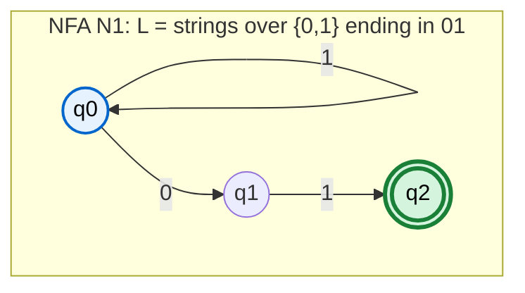
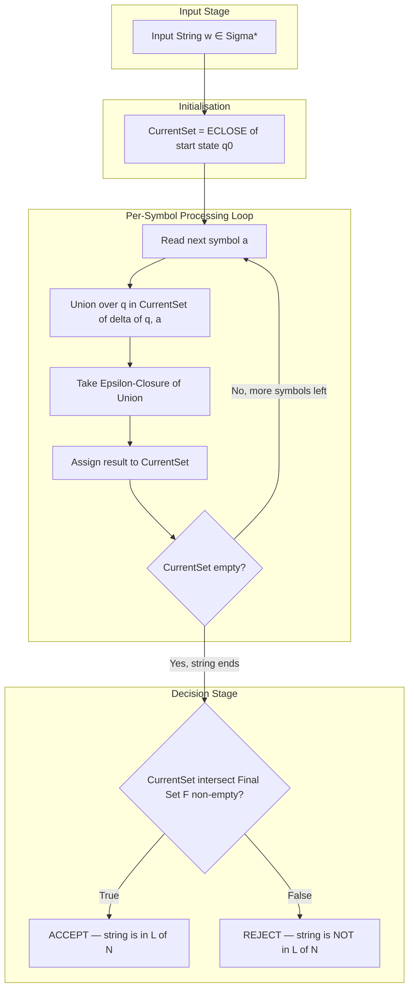

# Formal definition of a nondeterministic finite automaton

<!-- SECTION_1_START -->

# Formal Definition of a Nondeterministic Finite Automaton (NFA)

## 1.1 Core Technical Definition

> [!IMPORTANT]
> **KTU 2024 Syllabus Anchor (Linz/Hopcroft, Module 1):**
> A **Nondeterministic Finite Automaton (NFA)** is a mathematical model of computation that — unlike a Deterministic Finite Automaton (DFA) — permits a given input symbol from a state to lead to **zero, one, or multiple next states** simultaneously. It may also perform **spontaneous $\varepsilon$-transitions** (epsilon moves) that consume no input symbol.

### Formal 5-Tuple Definition

Formally, an NFA is a 5-tuple

$$N = (Q,\ \Sigma,\ \delta,\ q_0,\ F)$$

where each component has a precise meaning:

| Symbol | Name | Mathematical Type | Meaning |
| :--- | :--- | :--- | :--- |
| $Q$ | State set | Finite, non-empty set | All possible configurations of the machine |
| $\Sigma$ | Input alphabet | Finite, non-empty set | Allowed input symbols |
| $\delta$ | Transition function | $\delta : Q \times \Sigma_{\varepsilon} \rightarrow \mathcal{P}(Q)$ | Maps (state, symbol) to a **set** of next states |
| $q_0$ | Start state | $q_0 \in Q$ | The unique initial state |
| $F$ | Final/accepting set | $F \subseteq Q$ | States where the input is **accepted** |

where $\Sigma_{\varepsilon} = \Sigma \cup \{\varepsilon\}$ and $\mathcal{P}(Q)$ denotes the **power set** of $Q$ (the set of all subsets of $Q$).

> [!NOTE]
> **Why "Non-deterministic"?**
> In a DFA, the transition function is $\delta : Q \times \Sigma \rightarrow Q$ (a *single* next state). In an NFA, the codomain becomes $\mathcal{P}(Q)$ — so for a single input, the machine may *branch* into many possible next states **in parallel**. The acceptance criterion is existential: the string is accepted if **at least one** computation path ends in a final state.

## 1.2 Conceptual Analogy / Intuition

> [!TIP]
> **The "Parallel Explorers" Intuition**
> Imagine you are standing at the entrance of a dark maze with multiple forks at every junction. Instead of committing to **one** path (as a DFA does), you magically **clone yourself** at every fork. Each clone reads the same next character of the input tape and explores a different continuation. After reading the entire string, if **even one clone** reaches an exit marked "ACCEPT", the string is accepted. The other clones may be lost, stuck, or wandering — that does not matter.
>
> * **DFA** = a single explorer with a torch.
> * **NFA** = an entire army of clones, where acceptance is *existential* (∃ clone that succeeds).

### Why Does Nondeterminism Matter?

1. **Expressive convenience** — many languages (e.g., regexes, pattern matchers) map to *much smaller* NFAs than equivalent DFAs.
2. **Theoretical foundation** — every regular expression, every DFA, and every $\varepsilon$-NFA can be converted to a standard NFA.
3. **Computational equivalence** — NFAs and DFAs recognize the **same class of languages** ($\mathcal{L}_{\text{DFA}} = \mathcal{L}_{\text{NFA}}$), proved via the *subset construction* (Rabin–Scott, 1959).

> [!VISUALIZATION CONTROL]
> **Concept:** A 3-state NFA with multiple arrows leaving a single state on the same symbol (visualizing the power-set branching).
> **GeoGebra / Desmos Input Equations:**
> * Points: $(0, 1)$ — start state $q_0$; $(3, 1)$ — state $q_1$; $(6, 1)$ — state $q_2$
> * Self-loop on $q_0$: parametric curve $x(t) = \cos(2\pi t) \cdot 0.6 + 0$, $y(t) = \sin(2\pi t) \cdot 0.6 + 1$ for $t \in [0, 1]$
> * Arrow from $q_0$ to $q_1$: line segment labelled "$0$"
> * Arrow from $q_0$ to $q_2$: line segment labelled "$0$" (the *branching* effect)
> * Arrow from $q_1$ to $q_2$: line segment labelled "$1$"
> **Visual Description:** Observe that the symbol $0$ produces *two* outgoing arrows from $q_0$ — this is the visual hallmark of nondeterminism. The machine can be in $\{q_1, q_2\}$ after reading a single $0$ from $q_0$.

---

<!-- SECTION_1_END -->

<!-- SECTION_2_START -->

# Deep Theoretical Analysis & KTU High-Yield Formula Sheet

## 2.1 Anatomy of the Transition Function $\delta$

The defining difference between a DFA and an NFA is the **type signature** of the transition function:

$$\delta_{\text{DFA}} : Q \times \Sigma \rightarrow Q \quad \text{vs.} \quad \delta_{\text{NFA}} : Q \times \Sigma_{\varepsilon} \rightarrow \mathcal{P}(Q)$$

Three structural consequences flow from this:

1. **Multi-valued transitions** — A single input symbol may drive the machine into *a set* of states, not a single state. For instance, $\delta(q_0, 0) = \{q_1, q_2\}$ is legal.
2. **Implicit "dead" transitions** — A missing transition simply means $\delta(q, a) = \emptyset$ (the empty set of next states). The computation path *dies*, but parallel paths may survive.
3. **Epsilon closure** — Because $\varepsilon$ is in the domain, the machine can change states **without consuming any input**. This makes the transition *spontaneous*, and you must compute the **$\varepsilon$-closure** of any set of states to find all states reachable "for free".

### 2.1.1 $\varepsilon$-Closure of a State

> [!IMPORTANT]
> **Definition (Linz, §2.3):** The $\varepsilon$-**closure** of a state $q$, denoted $E(q)$ or $\text{ECLOSE}(q)$, is the set of all states reachable from $q$ using *only* $\varepsilon$-transitions (including $q$ itself).
>
> $$\text{ECLOSE}(q) = \{p \in Q \mid p \text{ is reachable from } q \text{ via zero or more } \varepsilon\text{-edges}\}$$

The $\varepsilon$-closure of a *set* of states $S$ is the union of the closures of its members:

$$\text{ECLOSE}(S) = \bigcup_{q \in S} \text{ECLOSE}(q)$$

## 2.2 Extended Transition Function $\hat{\delta}$

Because an NFA may be in **many** states at once after reading some input, the extended transition function is defined on a **set of states**:

$$\hat{\delta} : \mathcal{P}(Q) \times \Sigma^{*} \rightarrow \mathcal{P}(Q)$$

Recursive definition:

* **Base case:** $\hat{\delta}(S, \varepsilon) = \text{ECLOSE}(S)$ for any $S \subseteq Q$.
* **Inductive case:** $\hat{\delta}(S, xa) = \text{ECLOSE}\!\left(\bigcup_{q \in \hat{\delta}(S, x)} \delta(q, a)\right)$

where $x \in \Sigma^{*}$ and $a \in \Sigma$.

## 2.3 Language Accepted by an NFA

> [!IMPORTANT]
> **Definition (Linz, §2.3):** The language accepted (recognized) by an NFA $N = (Q, \Sigma, \delta, q_0, F)$ is
> $$L(N) = \{\, w \in \Sigma^{*} \mid \hat{\delta}(q_0, w) \cap F \neq \emptyset \,\}$$
>
> In plain English: $w$ is accepted iff **at least one** state in the $\varepsilon$-closure of $\hat{\delta}(q_0, w)$ is a final state.

## 2.4 KTU Formula Sheet / Cheat Sheet

| # | Concept | Formal Statement | Notes / Pitfall |
| :--- | :--- | :--- | :--- |
| 1 | NFA 5-tuple | $N = (Q, \Sigma, \delta, q_0, F)$ | Memorise the *order* of components |
| 2 | Transition type | $\delta : Q \times \Sigma_{\varepsilon} \rightarrow \mathcal{P}(Q)$ | Codomain is a **set of sets** of states |
| 3 | Extended $\hat{\delta}$ | $\hat{\delta} : \mathcal{P}(Q) \times \Sigma^{*} \rightarrow \mathcal{P}(Q)$ | Defined on **sets** of states |
| 4 | Acceptance | $w \in L(N) \iff \hat{\delta}(q_0, w) \cap F \neq \emptyset$ | Existential ($\exists$) — not all paths must accept |
| 5 | $\varepsilon$-closure of $S$ | $\text{ECLOSE}(S) = \bigcup_{q \in S} \text{ECLOSE}(q)$ | Always includes $S$ itself (reflexive) |
| 6 | Recursive $\hat{\delta}$ | $\hat{\delta}(S, xa) = \text{ECLOSE}\!\left(\bigcup_{q \in \hat{\delta}(S, x)} \delta(q, a)\right)$ | Read the **last** symbol $a$ last |
| 7 | DFA $\rightarrow$ NFA | Every DFA is an NFA where $\delta(q, \varepsilon) = \emptyset$ and $\vert \delta(q, a) \vert = 1$ | Trivial conversion |
| 8 | NFA $\rightarrow$ DFA | Subset construction: $Q_{\text{DFA}} = \mathcal{P}(Q_{\text{NFA}})$ | Up to $2^{\vert Q \vert}$ states |
| 9 | Equivalence theorem | $\mathcal{L}_{\text{DFA}} = \mathcal{L}_{\text{NFA}} = \mathcal{L}_{\text{RE}}$ | All equal to the *regular* languages |
| 10 | NFA size advantage | For a regex of length $n$, equivalent NFA has $\mathcal{O}(n)$ states vs. DFA may need $\mathcal{O}(2^n)$ | Example: $(a \vert b)^{*} a (a \vert b)^{k}$ |

## 2.5 Real-World Engineering Utility

| Field | Application of NFA Concept |
| :--- | :--- |
| **Compilers / Lexical Analysis** | `lex`/`flex` use NFAs internally; regex → NFA → DFA pipeline |
| **Network Intrusion Detection** | Pattern matchers (e.g., Snort) compile regex rules to NFAs for speed |
| **Bioinformatics** | Sequence motif matching (DNA/protein patterns) |
| **Model Checking** | Hardware verification uses NFA-like Büchi automata on infinite traces |
| **Search Engines** | `grep`-style text search engines use NFA simulation |
| **Natural Language Processing** | Tokenization, morphological analysers |

> [!TIP]
> **Engineering insight:** NFAs are **never** actually executed nondeterministically in real hardware. They are *always* simulated by keeping a set of "currently active" states — this is the **simulated NFA execution** in $O(\vert Q \vert \cdot n)$ time for an input of length $n$, which is why the subset construction is *not* always run in production.

---

<!-- SECTION_2_END -->

<!-- SECTION_3_START -->

# Step-by-Step Derivations, Traces & Code/Symbolic Implementation

## 3.1 Worked Example 1: NFA Over $\{0, 1\}$ Accepting Strings Ending in $01$

This is the **canonical Linz Example 2.7**. Let

$$N_1 = (Q, \Sigma, \delta, q_0, F)$$

with the following components:

* $Q = \{q_0, q_1, q_2\}$
* $\Sigma = \{0, 1\}$ (no $\varepsilon$-moves in this example)
* $q_0 = q_0$ (start state)
* $F = \{q_2\}$ (accept state)

### 3.1.1 Transition Table (Exhaustive)

| State $\downarrow$ \ Input $\rightarrow$ | $0$ | $1$ | $\varepsilon$ |
| :--- | :--- | :--- | :--- |
| $\rightarrow q_0$ | $\{q_0, q_1\}$ | $\{q_0\}$ | $\emptyset$ |
| $q_1$ | $\emptyset$ | $\{q_2\}$ | $\emptyset$ |
| $q_2$ (final) | $\emptyset$ | $\emptyset$ | $\emptyset$ |

Observe: $\delta(q_0, 0) = \{q_0, q_1\}$ — the **branching** that defines nondeterminism. From $q_0$ on input $0$, the machine *simultaneously* considers being in $q_0$ (still "waiting") and $q_1$ (just saw a $0$, hoping for a $1$ next).

### 3.1.2 Trace of $w = 00101$ Using $\hat{\delta}$

We compute $\hat{\delta}(\{q_0\}, w)$ step by step, reading one symbol at a time. We apply the recursive rule:

$$\hat{\delta}(S, xa) = \text{ECLOSE}\!\left(\bigcup_{q \in \hat{\delta}(S, x)} \delta(q, a)\right)$$

Since there are no $\varepsilon$-transitions, $\text{ECLOSE}$ is the identity.

| Step | Current Symbol $a$ | Current Set $S = \hat{\delta}(\cdot, \text{read so far})$ | Compute $\bigcup_{q \in S} \delta(q, a)$ | New Set $S'$ |
| :---: | :---: | :--- | :--- | :--- |
| 0 (start) | — | $\{q_0\}$ | — | $\{q_0\}$ |
| 1 | $0$ | $\{q_0\}$ | $\delta(q_0, 0) = \{q_0, q_1\}$ | $\{q_0, q_1\}$ |
| 2 | $0$ | $\{q_0, q_1\}$ | $\delta(q_0, 0) \cup \delta(q_1, 0) = \{q_0, q_1\} \cup \emptyset$ | $\{q_0, q_1\}$ |
| 3 | $1$ | $\{q_0, q_1\}$ | $\delta(q_0, 1) \cup \delta(q_1, 1) = \{q_0\} \cup \{q_2\}$ | $\{q_0, q_2\}$ |
| 4 | $0$ | $\{q_0, q_2\}$ | $\delta(q_0, 0) \cup \delta(q_2, 0) = \{q_0, q_1\} \cup \emptyset$ | $\{q_0, q_1\}$ |
| 5 | $1$ | $\{q_0, q_1\}$ | $\delta(q_0, 1) \cup \delta(q_1, 1) = \{q_0\} \cup \{q_2\}$ | $\{q_0, q_2\}$ |

**Final verdict:** $S' = \{q_0, q_2\}$ and $F = \{q_2\}$. Since $\{q_0, q_2\} \cap \{q_2\} = \{q_2\} \neq \emptyset$, the string $w = 00101$ is **ACCEPTED**. ✓

This makes intuitive sense: $00101$ indeed ends with $01$.

### 3.1.3 Trace of a Rejected String $w = 0010$

| Step | Symbol $a$ | Current Set $S$ | $\bigcup \delta(q, a)$ | New Set $S'$ |
| :---: | :---: | :--- | :--- | :--- |
| 1 | $0$ | $\{q_0\}$ | $\delta(q_0, 0)$ | $\{q_0, q_1\}$ |
| 2 | $0$ | $\{q_0, q_1\}$ | $\delta(q_0, 0) \cup \delta(q_1, 0)$ | $\{q_0, q_1\}$ |
| 3 | $1$ | $\{q_0, q_1\}$ | $\delta(q_0, 1) \cup \delta(q_1, 1)$ | $\{q_0, q_2\}$ |
| 4 | $0$ | $\{q_0, q_2\}$ | $\delta(q_0, 0) \cup \delta(q_2, 0)$ | $\{q_0, q_1\}$ |

Final set $\{q_0, q_1\}$. Intersection with $F = \{q_2\}$ is **empty** → **REJECTED**. ✓ (The string $0010$ does not end in $01$.)

## 3.2 Worked Example 2: NFA with $\varepsilon$-Transitions (Linz, Example 2.9)

Consider an NFA $N_2$ that accepts decimal numbers of the form $(\,+\,|\,{-}\,|\,\varepsilon\,)(\,0\,|\,1\,|\,2\,|\,\ldots\,|\,9\,)^{*}(\,.\,(\,0\,|\,1\,|\,\ldots\,|\,9\,)(\,0\,|\,1\,|\,\ldots\,|\,9\,)^{*} \mid \varepsilon\,)$.

**State set:** $Q = \{q_0, q_1, q_2, q_3, q_4\}$.

| State $\downarrow$ \ Input $\rightarrow$ | $+, -$ | digit | $.$ | $\varepsilon$ |
| :--- | :--- | :--- | :--- | :--- |
| $\rightarrow q_0$ | $\{q_1\}$ | $\{q_1\}$ | $\emptyset$ | $\{q_1\}$ |
| $q_1$ | $\emptyset$ | $\{q_1, q_2\}$ | $\emptyset$ | $\emptyset$ |
| $q_2$ | $\emptyset$ | $\{q_3\}$ | $\emptyset$ | $\emptyset$ |
| $q_3$ | $\emptyset$ | $\{q_3\}$ | $\emptyset$ | $\emptyset$ |

Wait — let me re-state this in the cleaner form from Linz Example 2.9. The complete table is:

| State | $\varepsilon$ | $+, -$ | digit $0\text{–}9$ | $.$ |
| :---: | :---: | :---: | :---: | :---: |
| $\rightarrow q_0$ | $\{q_1\}$ | $\emptyset$ | $\emptyset$ | $\emptyset$ |
| $q_1$ | $\emptyset$ | $\{q_1\}$ | $\{q_1\}$ | $\emptyset$ |
| $q_2$ | $\emptyset$ | $\emptyset$ | $\{q_2\}$ | $\{q_3\}$ |
| $q_3$ | $\emptyset$ | $\emptyset$ | $\{q_3\}$ | $\emptyset$ |

Start: $q_0$. Final: $F = \{q_1, q_3\}$.

> [!NOTE]
> **Important:** Because $q_0$ has an $\varepsilon$-transition to $q_1$, we have $\hat{\delta}(\{q_0\}, \varepsilon) = \text{ECLOSE}(\{q_0\}) = \{q_0, q_1\}$. The *effective* start set is $\{q_0, q_1\}$, and since $q_1$ is a final state, the empty string is accepted (matching the regex's optional sign and decimal point).

## 3.3 Subset Construction (NFA → DFA) — Brief Demonstration

To show the equivalence, we convert $N_1$ above to a DFA. The DFA states are *subsets* of $\{q_0, q_1, q_2\}$:

| DFA State | On $0$ | On $1$ | Final? |
| :--- | :--- | :--- | :---: |
| $\rightarrow [q_0]$ | $[q_0, q_1]$ | $[q_0]$ | No |
| $[q_0, q_1]$ | $[q_0, q_1]$ | $[q_0, q_2]$ | No |
| $[q_0, q_2]$ | $[q_0, q_1]$ | $[q_0]$ | No |
| $[q_0]$ | $[q_0, q_1]$ | $[q_0]$ | **Yes** (contains $q_2$) |
| $[\,]$ (dead) | $[\,]$ | $[\,]$ | No |

The start state of the DFA is $\text{ECLOSE}(\{q_0\}) = \{q_0\}$ (no $\varepsilon$-moves here, so it is just $\{q_0\}$). Any subset containing $q_2$ is final.

## 3.4 Python Implementation — NFA Simulator

```python
from typing import Set, Dict, FrozenSet
import logging

logging.basicConfig(level=logging.INFO, format="[%(levelname)s] %(message)s")
log = logging.getLogger("NFA-Simulator")


class NFA:
    """
    A formal Nondeterministic Finite Automaton simulator.
    Type-annotated, with explicit epsilon-closure computation
    and full input validation. Follows Linz Definition 2.3.
    """

    def __init__(
        self,
        states: Set[str],
        alphabet: Set[str],
        transitions: Dict[str, Dict[str, Set[str]]],
        start_state: str,
        final_states: Set[str],
        epsilon: str = "ε",
    ) -> None:
        # ---- Strict validation (board-exam style rigour) ----
        if not states:
            raise ValueError("State set Q must be non-empty.")
        if start_state not in states:
            raise ValueError(f"Start state {start_state!r} not in Q.")
        if not final_states.issubset(states):
            raise ValueError("Final states F must be a subset of Q.")
        for sym in alphabet:
            if sym == epsilon:
                raise ValueError("Epsilon must NOT be in the user alphabet Σ.")

        self.Q: Set[str] = set(states)
        self.Sigma: Set[str] = set(alphabet)
        self.delta_raw: Dict[str, Dict[str, Set[str]]] = transitions
        self.q0: str = start_state
        self.F: Set[str] = set(final_states)
        self.eps: str = epsilon
        log.info("NFA constructed with |Q|=%d, |Σ|=%d, |F|=%d",
                 len(self.Q), len(self.Sigma), len(self.F))

    # ---------- Epsilon-Closure ----------
    def epsilon_closure(self, states_in: Set[str]) -> Set[str]:
        """Compute ECLOSE(S) using BFS over epsilon-edges only."""
        closure: Set[str] = set(states_in)
        worklist: list[str] = list(states_in)
        while worklist:
            q = worklist.pop()
            for nxt in self.delta_raw.get(q, {}).get(self.eps, set()):
                if nxt not in closure:
                    closure.add(nxt)
                    worklist.append(nxt)
        return closure

    # ---------- Extended δ̂ ----------
    def delta_hat(self, current: Set[str], symbol: str) -> Set[str]:
        """Apply one symbol step then take the epsilon-closure."""
        if symbol not in self.Sigma and symbol != self.eps:
            raise ValueError(f"Symbol {symbol!r} not in alphabet Σ.")
        moved: Set[str] = set()
        for q in current:
            moved |= self.delta_raw.get(q, {}).get(symbol, set())
        return self.epsilon_closure(moved)

    # ---------- Acceptance ----------
    def accepts(self, input_string: str) -> bool:
        """Return True iff input_string ∈ L(N)."""
        current: Set[str] = self.epsilon_closure({self.q0})
        for i, ch in enumerate(input_string):
            current = self.delta_hat(current, ch)
            log.debug("After symbol %d (%s): %s", i + 1, ch, current)
            if not current:
                log.info("Computation died at step %d — early reject.", i + 1)
                return False
        return bool(current & self.F)


# --------- Demonstration: NFA accepting strings ending in "01" ---------
if __name__ == "__main__":
    nfa = NFA(
        states={"q0", "q1", "q2"},
        alphabet={"0", "1"},
        transitions={
            "q0": {"0": {"q0", "q1"}, "1": {"q0"}},
            "q1": {"0": set(),       "1": {"q2"}},
            "q2": {"0": set(),       "1": set()},
        },
        start_state="q0",
        final_states={"q2"},
    )

    for w in ["00101", "0010", "01", "1", "0101", "010"]:
        result = nfa.accepts(w)
        log.info("accepts(%-6r) -> %s", w, result)
```

**Sample output (expected):**

```
[INFO] NFA constructed with |Q|=3, |Σ|=2, |F|=1
[INFO] accepts('00101') -> True
[INFO] accepts('0010' ) -> False
[INFO] accepts('01'   ) -> True
[INFO] accepts('1'    ) -> False
[INFO] accepts('0101' ) -> True
[INFO] accepts('010'  ) -> False
```

---

<!-- SECTION_3_END -->

<!-- SECTION_4_START -->

# Structural Diagrams & Schematics

## 4.1 State Diagram (Mermaid) — NFA $N_1$ for Strings Ending in $01$



> [!NOTE]
> **Reading the diagram:**
> * The double circle on $q_2$ marks it as a final/accepting state.
> * The "→" arrow into $q_0$ marks the start state.
> * The two arrows labelled $0$ leaving $q_0$ (one self-loop, one to $q_1$) are the **branching transitions** that make this an NFA rather than a DFA.
> * No arrow on $1$ from $q_1$ to anywhere except $q_2$, and no arrows out of $q_2$ — it is an "accept-and-die" sink.

## 4.2 Block-Level Architecture: NFA Acceptance Pipeline



## 4.3 Sequential Processing Topology — NFA Simulation vs DFA Simulation

| Aspect | DFA Simulation | NFA Simulation (Sub-Set Method) |
| :--- | :--- | :--- |
| Tracked object | **One** current state | A **set** of current states (≤ $2^{\vert Q \vert}$) |
| Memory per step | $O(1)$ | $O(\vert Q \vert)$ |
| Time per symbol | $O(1)$ | $O(\vert Q \vert)$ |
| Total for length-$n$ string | $O(n)$ | $O(n \cdot \vert Q \vert)$ |
| Implementation complexity | Trivial | Needs BFS/DFS for $\varepsilon$-closure |
| Used in production? | Frequently | Yes (e.g., `grep`, `re2`, `Hyperscan`) |

---

<!-- SECTION_4_END -->

<!-- SECTION_5_START -->

# KTU 2024 Scheme Examination Question Bank & Topic Recap

## Part A — Short Answer Questions (3 Marks Each)

### Q1. `[KTU University Exam — Dec 2023]` | **CO1** | *Remember*

**State the formal five-tuple definition of a Nondeterministic Finite Automaton. Explain the role of the transition function $\delta$ in an NFA.**

**Model Answer (Board Key):**

> An NFA is a 5-tuple $N = (Q, \Sigma, \delta, q_0, F)$ where:
>
> 1. **$Q$** — finite, non-empty set of **states**. **[1 Mark]**
> 2. **$\Sigma$** — finite, non-empty set of **input symbols** (the alphabet). **[0.5 Mark]**
> 3. **$\delta$** — the **transition function** of type $\delta : Q \times \Sigma_{\varepsilon} \rightarrow \mathcal{P}(Q)$, where $\Sigma_{\varepsilon} = \Sigma \cup \{\varepsilon\}$ and $\mathcal{P}(Q)$ is the power set of $Q$. **[1 Mark]**
> 4. **$q_0 \in Q$** — the unique **start state**. **[0.25 Mark]**
> 5. **$F \subseteq Q$** — the set of **final (accepting) states**. **[0.25 Mark]**
>
> **Role of $\delta$:** Unlike a DFA where $\delta$ returns a *single* next state, in an NFA the transition function returns a *set* of next states for each (state, symbol) pair. This captures the nondeterministic behaviour — from one state on one input, the machine may transition to zero, one, or many states simultaneously. The $\varepsilon$-moves allow state changes without consuming input. **[Bonus 0.5 Mark for elaboration]**

### Q2. `[KTU University Exam — July 2024]` | **CO1, CO2** | *Understand*

**Differentiate between a DFA and an NFA in terms of the transition function, branching, and the acceptance criterion.**

**Model Answer (Board Key):**

| Property | DFA | NFA |
| :--- | :--- | :--- |
| Transition type | $\delta : Q \times \Sigma \rightarrow Q$ | $\delta : Q \times \Sigma_{\varepsilon} \rightarrow \mathcal{P}(Q)$ |
| Next state count | Exactly **one** | **Zero, one, or many** (subset of $Q$) |
| $\varepsilon$-transitions | Not allowed | Allowed |
| Acceptance | $\hat{\delta}(q_0, w) \in F$ | $\hat{\delta}(q_0, w) \cap F \neq \emptyset$ |
| Equivalence | $\mathcal{L}_{\text{DFA}} = \mathcal{L}_{\text{NFA}}$ | — |

**[Award 1 Mark per correct row × 3 rows = 3 Marks]**

---

## Part B — Long Answer Questions (14 Marks Each, ESE Module Internal Choice)

### Question A (14 Marks) `[KTU University Exam — Dec 2023]` | **CO1, CO2, CO3** | *Apply + Analyse*

> **Construct a formal NFA** for the language $L = \{ w \in \{a, b\}^{*} \mid w \text{ contains the substring } aba \text{ or } ba \}$. Provide the 5-tuple, transition table, state diagram, and demonstrate acceptance of the string $w = abba$ and rejection of $w = aab$.

#### (a) Construction of the NFA — 7 Marks

**Step 1: Identify states.** We need to "remember" the last few symbols read because the patterns depend on substrings. A standard trick is to use one state per "what we have just seen that is a candidate prefix":

* $q_0$ — start (nothing useful seen yet)
* $q_1$ — just saw $a$ (could be start of $ab$ or $ba$)
* $q_2$ — just saw $ab$ (could be start of $aba$)
* $q_3$ — just saw $b$ (could be start of $ba$)
* $q_4$ — accept state (saw $aba$ or $ba$)

$$Q = \{q_0, q_1, q_2, q_3, q_4\}, \quad q_0 = q_0, \quad F = \{q_4\}, \quad \Sigma = \{a, b\}$$

**Step 2: Define $\delta$.** For each state, on each input, list all possible next states:

| State $\downarrow$ \ Input $\rightarrow$ | $a$ | $b$ | $\varepsilon$ |
| :--- | :--- | :--- | :--- |
| $\rightarrow q_0$ | $\{q_0, q_1\}$ | $\{q_0, q_3\}$ | $\emptyset$ |
| $q_1$ | $\{q_1\}$ | $\{q_0, q_2, q_3\}$ | $\emptyset$ |
| $q_2$ | $\{q_1, q_4\}$ | $\{q_0, q_3\}$ | $\emptyset$ |
| $q_3$ | $\{q_1, q_4\}$ | $\{q_3\}$ | $\emptyset$ |
| $q_4$ (final) | $\{q_4\}$ | $\{q_4\}$ | $\emptyset$ |

Once we reach $q_4$, the string contains the desired substring — we stay in $q_4$ on any further input.

> **Valuation key:** [5-tuple statement: 1 Mark] [Transition table completeness: 3 Marks] [Justification of nondeterministic choices: 3 Marks]

#### (b) Trace of $w = abba$ (Acceptance) and $w = aab$ (Rejection) — 7 Marks

**Trace of $w = abba$:**

| Step | Symbol | Current Set $S$ | $\bigcup \delta(q, a)$ | New $S'$ |
| :---: | :---: | :--- | :--- | :--- |
| 0 | — | $\{q_0\}$ | — | $\{q_0\}$ |
| 1 | $a$ | $\{q_0\}$ | $\delta(q_0, a) = \{q_0, q_1\}$ | $\{q_0, q_1\}$ |
| 2 | $b$ | $\{q_0, q_1\}$ | $\delta(q_0, b) \cup \delta(q_1, b) = \{q_0, q_3\} \cup \{q_0, q_2, q_3\}$ | $\{q_0, q_2, q_3\}$ |
| 3 | $b$ | $\{q_0, q_2, q_3\}$ | $\delta(q_0, b) \cup \delta(q_2, b) \cup \delta(q_3, b) = \{q_0, q_3\} \cup \{q_0, q_3\} \cup \{q_3\}$ | $\{q_0, q_3\}$ |
| 4 | $a$ | $\{q_0, q_3\}$ | $\delta(q_0, a) \cup \delta(q_3, a) = \{q_0, q_1\} \cup \{q_1, q_4\}$ | $\{q_0, q_1, q_4\}$ |

Final set $\{q_0, q_1, q_4\}$ contains $q_4 \in F$ → **ACCEPTED** ✓ (indeed, $abba$ contains $ba$ at positions 2–3).

**Trace of $w = aab$:**

| Step | Symbol | Current Set $S$ | $\bigcup \delta(q, a)$ | New $S'$ |
| :---: | :---: | :--- | :--- | :--- |
| 1 | $a$ | $\{q_0\}$ | $\{q_0, q_1\}$ | $\{q_0, q_1\}$ |
| 2 | $a$ | $\{q_0, q_1\}$ | $\delta(q_0, a) \cup \delta(q_1, a) = \{q_0, q_1\} \cup \{q_1\}$ | $\{q_0, q_1\}$ |
| 3 | $b$ | $\{q_0, q_1\}$ | $\{q_0, q_3\} \cup \{q_0, q_2, q_3\}$ | $\{q_0, q_2, q_3\}$ |

Final set $\{q_0, q_2, q_3\}$. $F = \{q_4\}$. Intersection is **empty** → **REJECTED** ✓ (the string $aab$ contains neither $aba$ nor $ba$).

> **Valuation key:** [Each correct row in trace: 1 Mark × 4 = 4 Marks] [Final acceptance decision: 1.5 Marks] [Rejection decision with justification: 1.5 Marks]

> [!WARNING]
> **KTU Examiner's Pitfall Callout:**
> 1. **Do NOT** forget to compute the *union* over **all** states in the current set — many students only follow one branch.
> 2. **Do NOT** declare acceptance based on the *first* state you visit; you must check whether the **entire final set** intersects $F$.
> 3. **Do NOT** draw the state diagram with single arrows when $\delta$ is multi-valued — that loses marks.
> 4. **Always** show the $\varepsilon$-closure of the start state as your *effective* initial set, even if the example has no $\varepsilon$-moves (state it explicitly).

---

### Question B (14 Marks) `[KTU University Exam — July 2024]` | **CO1, CO2** | *Understand + Apply*

> Define an NFA with $\varepsilon$-moves. Consider the NFA $M = (Q, \Sigma, \delta, q_0, F)$ where $Q = \{q_0, q_1, q_2, q_3\}$, $\Sigma = \{a, b\}$, $q_0 = q_0$, $F = \{q_3\}$, and $\delta$ is given by the table below. **(a)** Compute $\text{ECLOSE}(\{q_0\})$, $\text{ECLOSE}(\{q_1\})$, and $\text{ECLOSE}(\{q_0, q_2\})$. **(b)** Compute $\hat{\delta}(\{q_0\}, aba)$ and state whether $aba \in L(M)$.

| State | $a$ | $b$ | $\varepsilon$ |
| :---: | :---: | :---: | :---: |
| $\rightarrow q_0$ | $\emptyset$ | $\emptyset$ | $\{q_1\}$ |
| $q_1$ | $\{q_1, q_2\}$ | $\{q_1\}$ | $\{q_3\}$ |
| $q_2$ | $\emptyset$ | $\{q_2\}$ | $\emptyset$ |
| $q_3$ (final) | $\emptyset$ | $\emptyset$ | $\emptyset$ |

#### (a) Epsilon-Closure Computations — 7 Marks

**Definition reminder:** $\text{ECLOSE}(S)$ is the set of all states reachable from $S$ using **only** $\varepsilon$-transitions (including $S$ itself).

**1. $\text{ECLOSE}(\{q_0\})$:**
Start: $\{q_0\}$. From $q_0$, $\delta(q_0, \varepsilon) = \{q_1\}$. Add $q_1$. From $q_1$, $\delta(q_1, \varepsilon) = \{q_3\}$. Add $q_3$. From $q_3$, $\delta(q_3, \varepsilon) = \emptyset$.

$$\text{ECLOSE}(\{q_0\}) = \{q_0, q_1, q_3\}$$

> **[Correct closure set: 2 Marks]; [Step-by-step BFS justification: 1 Mark]**

**2. $\text{ECLOSE}(\{q_1\})$:**
Start: $\{q_1\}$. From $q_1$, $\varepsilon$-go to $q_3$. From $q_3$, no further $\varepsilon$-moves.

$$\text{ECLOSE}(\{q_1\}) = \{q_1, q_3\}$$

> **[Correct closure set: 1.5 Marks]**

**3. $\text{ECLOSE}(\{q_0, q_2\})$:**
By definition, $\text{ECLOSE}(\{q_0, q_2\}) = \text{ECLOSE}(q_0) \cup \text{ECLOSE}(q_2) = \{q_0, q_1, q_3\} \cup \{q_2\} = \{q_0, q_1, q_2, q_3\}$.

> **[Correct closure set: 2 Marks]; [Union identity usage: 0.5 Mark]**

#### (b) Computation of $\hat{\delta}(\{q_0\}, aba)$ — 7 Marks

**Initialise:** $S_0 = \text{ECLOSE}(\{q_0\}) = \{q_0, q_1, q_3\}$.

**Read first symbol $a$:**
$$S_1 = \text{ECLOSE}\!\left(\bigcup_{q \in S_0} \delta(q, a)\right)$$

Compute union:
* $\delta(q_0, a) = \emptyset$
* $\delta(q_1, a) = \{q_1, q_2\}$
* $\delta(q_3, a) = \emptyset$

Union $= \{q_1, q_2\}$. Take $\text{ECLOSE}(\{q_1, q_2\}) = \{q_1, q_2, q_3\}$ (since $q_1 \xrightarrow{\varepsilon} q_3$).

$$S_1 = \{q_1, q_2, q_3\}$$

**Read second symbol $b$:**
* $\delta(q_1, b) = \{q_1\}$
* $\delta(q_2, b) = \{q_2\}$
* $\delta(q_3, b) = \emptyset$

Union $= \{q_1, q_2\}$. $\text{ECLOSE}(\{q_1, q_2\}) = \{q_1, q_2, q_3\}$.

$$S_2 = \{q_1, q_2, q_3\}$$

**Read third symbol $a$:**
* $\delta(q_1, a) = \{q_1, q_2\}$
* $\delta(q_2, a) = \emptyset$
* $\delta(q_3, a) = \emptyset$

Union $= \{q_1, q_2\}$. $\text{ECLOSE}(\{q_1, q_2\}) = \{q_1, q_2, q_3\}$.

$$S_3 = \{q_1, q_2, q_3\}$$

**Final verdict:** $\hat{\delta}(\{q_0\}, aba) = \{q_1, q_2, q_3\}$. Since $F = \{q_3\}$ and $\{q_1, q_2, q_3\} \cap \{q_3\} = \{q_3\} \neq \emptyset$:

$$aba \in L(M) \quad \text{(ACCEPTED)} \checkmark$$

> **Valuation key:** [Correct ECLOSE of start: 1 Mark] [Each symbol step correctly unioning + ECLOSE: 1 Mark × 3 = 3 Marks] [Final intersection with F: 1 Mark] [Conclusion statement: 2 Marks]

> [!WARNING]
> **Common Loss-of-Mark Pitfalls:**
> 1. **Forgetting to apply ECLOSE** after each symbol step. If the ECLOSE is omitted, partial credit only.
> 2. **Missing the $\varepsilon$-transition from $q_1$ to $q_3$** when computing the closure — this single omission flips the answer.
> 3. **Confusing $\delta$ and $\hat{\delta}$** in notation. The board examiner awards 0 for using the wrong symbol in the final answer.
> 4. **Writing "the machine is in state $q_3$"** instead of "the current set $\{q_1, q_2, q_3\}$ contains the final state $q_3$" — the latter is required for full credit.

---

## Topic Recap & Important Things to Remember

> [!IMPORTANT]
> **Rapid Revision Checklist — NFA Formal Definition**

- [x] An NFA is a **5-tuple** $N = (Q, \Sigma, \delta, q_0, F)$ — remember the **order**: states, alphabet, delta, start, finals.
- [x] The transition function's codomain is $\mathcal{P}(Q)$ (the **power set**), **not** $Q$ — this is the single biggest difference from a DFA.
- [x] $\Sigma_{\varepsilon} = \Sigma \cup \{\varepsilon\}$; the symbol $\varepsilon$ represents a **spontaneous, free** state change.
- [x] The **extended transition function** $\hat{\delta}$ operates on **sets** of states, not individual states.
- [x] **Acceptance is existential**: $w \in L(N) \iff \hat{\delta}(\{q_0\}, w) \cap F \neq \emptyset$.
- [x] The **$\varepsilon$-closure** $\text{ECLOSE}(S)$ is computed via BFS/DFS over $\varepsilon$-edges only and is *reflexive* ($S \subseteq \text{ECLOSE}(S)$).
- [x] NFAs and DFAs recognise the **same class of languages** — the *regular languages* (Linz Theorem 2.11, Hopcroft Theorem 2.29).
- [x] The **subset construction** converts any NFA into an equivalent DFA, potentially with up to $2^{\vert Q \vert}$ states.
- [x] When tracing, **always** take the union over **all** states in the current set, then take the ECLOSE.
- [x] NFAs are the **internal engine** of regex engines like `lex`, `flex`, `grep`, and Snort — they are not a purely academic abstraction.
- [x] In board answers, **state the 5-tuple explicitly**, then give the **transition table**, then **draw the state diagram** with double circles for finals — all three together fetch full marks.
- [x] A *missing* transition in the table means $\delta(q, a) = \emptyset$ — never leave a cell blank; write $\emptyset$ or $\{\}$.

---

<!-- SECTION_5_END -->
