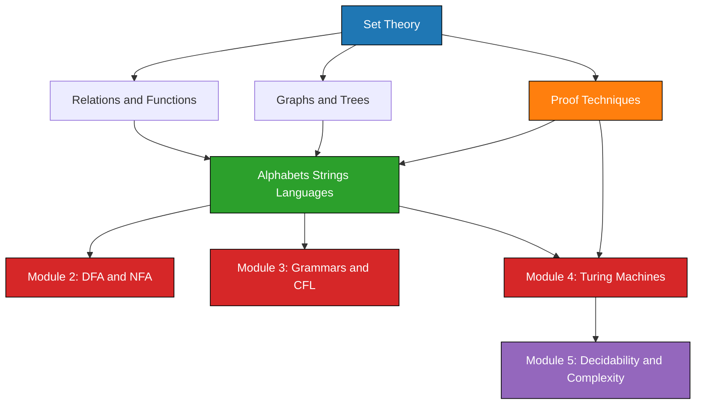
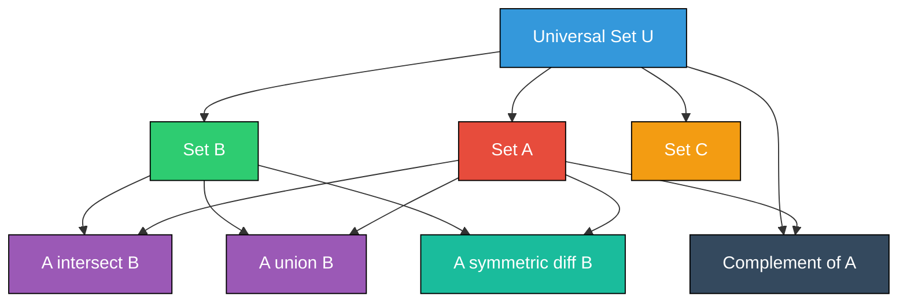
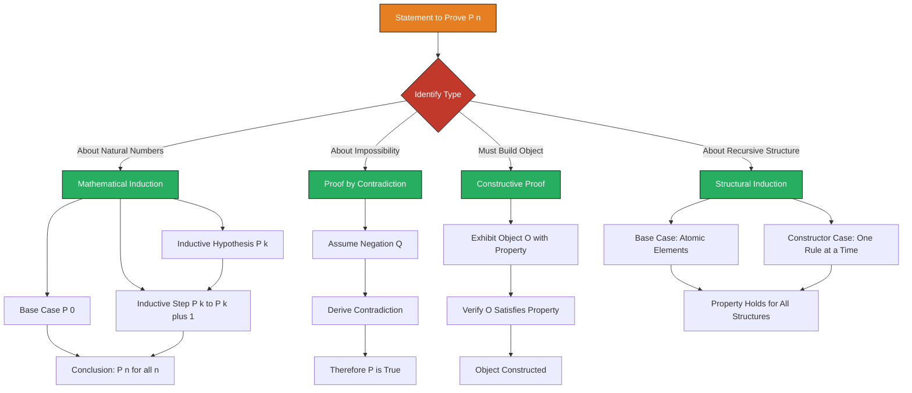
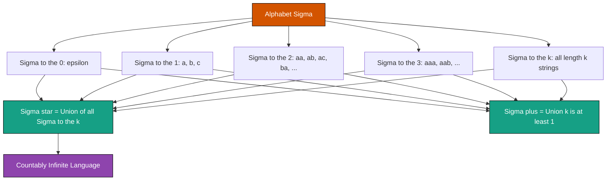
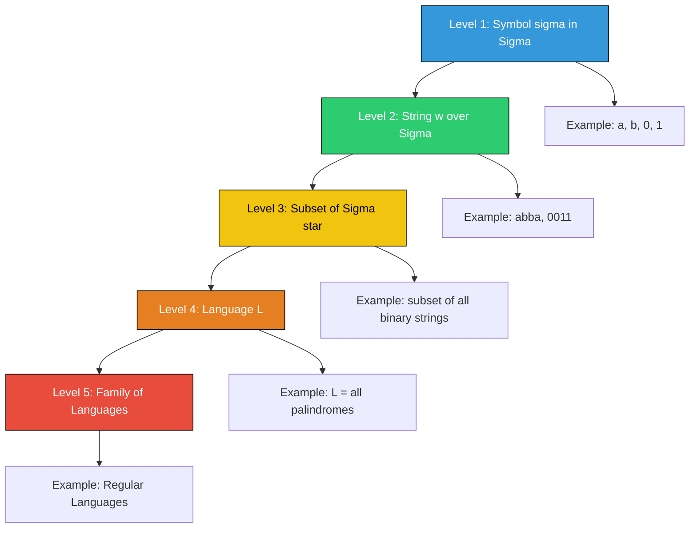

# Foundations (Linz, Hopcroft)

<!-- SECTION_1_START -->
# Foundations of Theory of Computation

## 1.1 Mathematical Preliminaries: The Language of CS Theory

> [!IMPORTANT]
> **Definition (KTU Syllabus Standard):** *Theory of Computation* is the mathematical abstraction of computing devices (machines) and the problems they can solve. Before defining any machine, we must first master the **discrete mathematical structures** that describe the *input*, *output*, and *behavior* of these machines.

The Foundations module, as prescribed by Linz (An Introduction to Formal Languages and Automata) and Hopcroft (Introduction to Automata Theory, Languages, and Computation), equips you with the "mathematical vocabulary" needed to describe computation. Without these tools, every later module (DFA, NFA, Turing Machines, Decidability) becomes unreadable.

> [!NOTE]
> **Why study Foundations first?** Consider building a skyscraper. Before laying bricks, you pour the concrete foundation. Set theory, logic, and induction are the "concrete" of TOC. Every theorem, every closure property, every proof-by-contradiction in this subject depends on the items in this module.

---

### 1.2 Set Theory — The Atom of Discrete Mathematics

> [!IMPORTANT]
> **Definition:** A **set** $S$ is an unordered collection of *distinct* objects, called **elements** or **members**. We write $x \in S$ if $x$ belongs to $S$, and $x \notin S$ otherwise.

**Standard Set-Builder Notation:**

$$S = \{ x \mid P(x) \}$$

which is read as: "the set of all $x$ such that the property $P(x)$ holds."

**Common Sets in TOC (must memorize the symbols):**

$$\begin{aligned}
\varnothing &= \text{empty set} \quad (\text{no elements}) \\
\mathbb{N} &= \{1, 2, 3, \ldots\} \quad \text{natural numbers} \\
\mathbb{Z} &= \{\ldots, -2, -1, 0, 1, 2, \ldots\} \quad \text{integers} \\
\mathbb{Q} &= \text{rational numbers} \\
\mathbb{R} &= \text{real numbers} \\
\mathcal{P}(S) &= 2^{S} = \text{power set of } S \quad (\text{set of all subsets of } S)
\end{aligned}$$

> [!NOTE]
> **Conceptual Analogy:** Think of a set as a *transparent bag*. You can see (list) every item inside, but the bag itself has no order. Two bags with the same items are considered identical — even if you reach in with your left hand versus your right hand.

---

### 1.3 Relations and Functions

> [!IMPORTANT]
> **Definition (Relation):** A **binary relation** $R$ from set $A$ to set $B$ is a subset of the Cartesian product $A \times B$:
> $$R \subseteq A \times B$$
> We write $a \, R \, b$ iff $(a, b) \in R$.

> [!IMPORTANT]
> **Definition (Function):** A **function** $f : A \rightarrow B$ is a special relation where every element of $A$ maps to *exactly one* element of $B$. Formally:
> $$\forall a \in A, \; \exists ! \; b \in B \text{ such that } (a, b) \in f$$
> $A$ is the **domain**, $B$ is the **codomain**.

**Key Properties of Functions (memorize for board exams):**

| Property | Definition | Symbol |
|---|---|---|
| Injective (One-to-One) | $f(x_1) = f(x_2) \Rightarrow x_1 = x_2$ | $\hookrightarrow$ |
| Surjective (Onto) | $\forall y \in B, \; \exists x \in A : f(x) = y$ | $\twoheadrightarrow$ |
| Bijective | Both Injective and Surjective | $\leftrightarrow$ |

> [!NOTE]
> **Why functions matter in TOC:** A *deterministic finite automaton* is essentially a **function** from (state, symbol) to state. A *nondeterministic* one is a **relation**. This single distinction (function vs. relation) is what separates Module 2's DFA from NFA — a guaranteed exam question.

---

### 1.4 Graphs and Trees

> [!IMPORTANT]
> **Definition (Graph):** A **directed graph** (digraph) is a pair $G = (V, E)$ where $V$ is a finite set of **vertices** (nodes) and $E \subseteq V \times V$ is a set of ordered pairs called **edges** (arcs).

> [!IMPORTANT]
> **Definition (Tree):** A **tree** is a connected acyclic graph. A **rooted tree** has a distinguished vertex called the **root**. A **leaf** is a vertex with no children.

> [!VISUALIZATION CONTROL]
> **Concept:** Rooted tree structure for a derivation
> **Draw (pen-and-paper):** Root at top, children below, leaves at bottom.
> **Visual Description:** Each internal node represents a "decision" or "substitution step"; each leaf represents a final string. The depth of the tree is the *length of the longest derivation path*.

---

### 1.5 Alphabets, Strings, and Languages

These three definitions are the *most quoted* in any TOC exam paper.

> [!IMPORTANT]
> **Definition (Alphabet $\Sigma$):** A finite, non-empty set of **symbols**.
> Example: $\Sigma = \{0, 1\}$ (binary alphabet), $\Sigma = \{a, b, c\}$ (English lowercase).

> [!IMPORTANT]
> **Definition (String / Word):** A **string** over alphabet $\Sigma$ is a *finite* sequence of symbols from $\Sigma$. The **length** of string $w$ is denoted $\vert w \vert$.

Special strings you must know:

$$\begin{aligned}
\varepsilon &= \text{empty string}, \quad \vert \varepsilon \vert = 0 \\
\Sigma^{*} &= \text{set of ALL strings over } \Sigma \text{ (including } \varepsilon \text{)} \\
\Sigma^{+} &= \Sigma^{*} - \{\varepsilon\} = \text{all NON-EMPTY strings} \\
\end{aligned}$$

> [!IMPORTANT]
> **Definition (Language $L$):** A **language** is any subset of $\Sigma^{*}$. That is:
> $$L \subseteq \Sigma^{*}$$
> Even the empty language $\varnothing$ and the language $\{\varepsilon\}$ are *valid* languages — and they are **NOT the same**!

> [!NOTE]
> **Conceptual Analogy:** Think of $\Sigma$ as your **keyboard keys**. $\Sigma^{*}$ is every possible *sentence* you can ever type (including the "empty" sentence, a blank page). A *language* is a rule-book that picks out only the "grammatically correct" sentences. Since a language is a *set*, the empty rule-book ($\varnothing$) gives no valid sentences, while the rule-book that allows *only* a blank page gives $\{\varepsilon\}$.

> [!WARNING]
> **Common Board Mistake:** $\varnothing \neq \{\varepsilon\}$. The empty language has **zero strings**. The language $\{\varepsilon\}$ has **one string** (the empty string). Examiners *love* to test this distinction for 2 marks.

---

### 1.6 Proof Techniques

> [!IMPORTANT]
> **The Three Proof Pillars of TOC:**
> 1. **Mathematical Induction** — to prove statements about $\mathbb{N}$, strings, languages, trees.
> 2. **Proof by Contradiction** — to prove impossibility (e.g., the Halting Problem is undecidable).
> 3. **Constructive Proof** — to *build* an object (e.g., design a DFA for the union of two regular languages).

**Induction Template (write this verbatim in exams):**

> Let $P(n)$ be a statement about $n \in \mathbb{N}$.
> **Base Case:** Verify $P(0)$ or $P(1)$ is true.
> **Inductive Hypothesis (IH):** Assume $P(k)$ is true for some arbitrary $k \geq 0$.
> **Inductive Step:** Show that $P(k) \Rightarrow P(k+1)$.
> **Conclusion:** By the Principle of Mathematical Induction, $P(n)$ holds for all $n \in \mathbb{N}$.

<!-- SECTION_1_END -->

<!-- SECTION_2_START -->
# Deep Theoretical Analysis & KTU High-Yield Formula Sheet

## 2.1 Set Theory in Depth

### 2.1.1 Set Operations

For sets $A$ and $B$ over a universal set $U$:

| Operation | Symbol | Definition | LaTeX |
|---|---|---|---|
| Union | $A \cup B$ | Elements in $A$ **or** $B$ | $\{x \mid x \in A \lor x \in B\}$ |
| Intersection | $A \cap B$ | Elements in $A$ **and** $B$ | $\{x \mid x \in A \land x \in B\}$ |
| Difference | $A - B$ | In $A$ but **not** in $B$ | $\{x \mid x \in A \land x \notin B\}$ |
| Complement | $\overline{A}$ | Elements **not** in $A$ | $U - A$ |
| Symmetric Diff | $A \oplus B$ | In exactly one of $A, B$ | $(A \cup B) - (A \cap B)$ |
| Power Set | $\mathcal{P}(A)$ | Set of all subsets of $A$ | $\{S \mid S \subseteq A\}$ |

### 2.1.2 Cardinality of Power Set

> [!IMPORTANT]
> **Theorem:** If $\vert A \vert = n$, then $\vert \mathcal{P}(A) \vert = 2^{n}$.

**Proof Sketch:** Each of the $n$ elements has 2 choices — either it is in a subset or not. By the product rule, total subsets = $2^{n}$.

> [!NOTE]
> **Real-World Utility:** Power set cardinality is the foundation of the **P vs NP** discussion. The fact that the power set of an $n$-element set has $2^n$ subsets is precisely why brute-force subset problems are *exponential* — the search space explodes combinatorially. This is also why RSA cryptography is secure: factoring a 2048-bit number has a search space of roughly $2^{2048}$.

### 2.1.3 De Morgan's Laws (KTP — "Key Theorem in Proofs")

$$\begin{aligned}
\overline{A \cup B} &= \overline{A} \cap \overline{B} \\
\overline{A \cap B} &= \overline{A} \cup \overline{B} \\
\end{aligned}$$

---

## 2.2 Relations — Properties & Closure

### 2.2.1 Properties of Binary Relations on a Set $A$

A relation $R \subseteq A \times A$ can be:

| Property | Definition | LaTeX |
|---|---|---|
| **Reflexive** | $\forall a \in A, \; (a, a) \in R$ | $(a, a) \in R$ |
| **Irreflexive** | $\forall a \in A, \; (a, a) \notin R$ | $(a, a) \notin R$ |
| **Symmetric** | $(a, b) \in R \Rightarrow (b, a) \in R$ | $aRb \Rightarrow bRa$ |
| **Antisymmetric** | $(a, b) \in R \land (b, a) \in R \Rightarrow a = b$ | $aRb \land bRa \Rightarrow a = b$ |
| **Transitive** | $(a, b) \in R \land (b, c) \in R \Rightarrow (a, c) \in R$ | $aRb \land bRc \Rightarrow aRc$ |

> [!NOTE]
> **KTU 2024 Trend:** Equivalence relations and partial orders appear in questions on language classes, Myhill–Nerode theorem (Module 2), and the Chomsky hierarchy (Module 3). Master this table.

### 2.2.2 Closures

> [!IMPORTANT]
> **Definition:** The **transitive closure** of $R$, written $R^{+}$, is the smallest transitive relation containing $R$. The **reflexive-transitive closure** $R^{*}$ is $R^{+} \cup \{(a, a) \mid a \in A\}$.

---

## 2.3 Strings — The Building Blocks of Languages

### 2.3.1 String Operations (High-Yield)

For strings $w$ and $v$ over $\Sigma$:

| Operation | Notation | Meaning | Example ($\Sigma = \{a, b\}$) |
|---|---|---|---|
| Concatenation | $wv$ | Write $w$ followed by $v$ | $w = ab$, $v = ba$ $\Rightarrow$ $wv = abba$ |
| Reverse | $w^{R}$ | Reverse the order of symbols | $w = abc$ $\Rightarrow$ $w^{R} = cba$ |
| Power | $w^{k}$ | $w$ concatenated with itself $k$ times | $w = ab, w^{3} = ababab$ |
| Length | $\vert w \vert$ | Number of symbols in $w$ | $\vert abba \vert = 4$ |
| Substring | $x$ is a substring of $w$ | $w = uxv$ for some $u, v \in \Sigma^{*}$ | $ab$ is a substring of $xaby$ |

### 2.3.2 Prefix and Suffix

> [!IMPORTANT]
> **Definitions:**
> - A string $x$ is a **prefix** of $w$ if $w = xv$ for some $v \in \Sigma^{*}$.
> - A string $y$ is a **suffix** of $w$ if $w = uy$ for some $u \in \Sigma^{*}$.
> - The **proper** prefix/suffix additionally requires $x \neq w$ and $y \neq w$.

> [!WARNING]
> **Common Mistake:** $\varepsilon$ is a prefix and suffix of *every* string. Don't exclude it.

### 2.3.3 Language Operations

Given $L_1, L_2 \subseteq \Sigma^{*}$, define:

$$\begin{aligned}
L_1 L_2 &= \{ x y \mid x \in L_1, \, y \in L_2 \} \quad \text{(Concatenation)} \\
L^{0} &= \{\varepsilon\} \\
L^{1} &= L \\
L^{k} &= L \cdot L^{k-1} \quad (k \geq 2) \\
L^{*} &= \bigcup_{k=0}^{\infty} L^{k} \quad \text{(Kleene Star)} \\
L^{+} &= \bigcup_{k=1}^{\infty} L^{k} \quad \text{(Kleene Plus)} \\
\end{aligned}$$

---

## 2.4 Mathematical Induction — Deep Dive

### 2.4.1 The Two Principles

> [!IMPORTANT]
> **Principle of Mathematical Induction (PMI):** Let $P(n)$ be a predicate. If
> (i) $P(0)$ is true, and
> (ii) $\forall k \geq 0, \, P(k) \Rightarrow P(k+1)$,
> then $P(n)$ is true for all $n \in \mathbb{N} \cup \{0\}$.

> [!IMPORTANT]
> **Principle of Structural Induction:** Used to prove properties of recursively defined structures (e.g., regular expressions, trees). We prove the base case (atomic elements) and each constructor case.

### 2.4.2 The String Length Lemma (Board Favorite)

> [!IMPORTANT]
> **Lemma:** $\vert xy \vert = \vert x \vert + \vert y \vert$ for all $x, y \in \Sigma^{*}$.

**Proof by Induction on $\vert x \vert$:** (See Section 3 for full derivation.)

---

## 2.5 KTU Formula Sheet — Foundations Module

> [!TIP]
> **Print this table on a single page and revise before every test.**

| # | Concept | Formula / Definition | Unit / Note |
|---|---|---|---|
| 1 | Power set size | $\vert \mathcal{P}(A) \vert = 2^{\vert A \vert}$ | $n$ elements $\Rightarrow 2^n$ subsets |
| 2 | Concatenation length | $\vert xy \vert = \vert x \vert + \vert y \vert$ | Strings over any $\Sigma$ |
| 3 | Star length property | $\vert w^{k} \vert = k \cdot \vert w \vert$ | $k \in \mathbb{N}$ |
| 4 | Reverse property | $(xy)^{R} = y^{R} x^{R}$ | Reverse flips order |
| 5 | Kleene star | $L^{*} = \bigcup_{k=0}^{\infty} L^{k}$ | Contains $\varepsilon$ always |
| 6 | Kleene plus | $L^{+} = L^{*} - \{\varepsilon\}$ iff $\varepsilon \notin L$ | Distinguish carefully |
| 7 | Empty language | $\varnothing$ | Contains 0 strings |
| 8 | Singleton $\{\varepsilon\}$ | $\{\varepsilon\}$ | Contains 1 string |
| 9 | De Morgan I | $\overline{A \cup B} = \overline{A} \cap \overline{B}$ | Dual of union is intersection |
| 10 | De Morgan II | $\overline{A \cap B} = \overline{A} \cup \overline{B}$ | Dual of intersection is union |
| 11 | Reflexive closure | $R \cup I_A$ | $I_A$ is identity relation |
| 12 | Transitive closure | $R^{+}$ | Smallest transitive superset |

---

## 2.6 Real-World Engineering Utility

| Concept | Engineering Application |
|---|---|
| Set Theory | Database query optimization (set operations like UNION, INTERSECT) |
| Relations | Network topology modeling, dependency graphs in compilers |
| Graphs | Google PageRank algorithm, social network analysis |
| Trees | File systems (B-trees, AVL trees), parse trees in compilers |
| Strings & Languages | Lexical analysis in compilers, pattern matching (regex, grep) |
| Induction | Algorithm correctness proofs (loop invariants), recursive function analysis |

> [!NOTE]
> **Industry Connection:** When you write a regular expression in `grep` or in Python's `re` module, you are using **Kleene star** ($L^{*}$) and **concatenation** operations on languages. When you build a parser, you walk a **parse tree** using recursion, and you prove the parser correct using **structural induction**.

<!-- SECTION_2_END -->

<!-- SECTION_3_START -->
# Step-by-Step Derivations & Symbolic Implementation

## 3.1 Worked Derivation #1: The String Length Lemma

> [!IMPORTANT]
> **Claim:** For all $x, y \in \Sigma^{*}$, $\vert xy \vert = \vert x \vert + \vert y \vert$.

We will prove this by **induction on the length of $x$**, since $x$ is the prefix. This is the *most-asked* induction problem in KTU Module 1.

### Step 1 — Define the Predicate

$$P(n): \text{For all } y \in \Sigma^{*}, \text{ if } \vert x \vert = n \text{ then } \vert xy \vert = n + \vert y \vert.$$

### Step 2 — Base Case ($n = 0$)

If $\vert x \vert = 0$, then $x = \varepsilon$. Now concatenate:

$$x y = \varepsilon \, y = y$$

Therefore:

$$\vert x y \vert = \vert y \vert = 0 + \vert y \vert = n + \vert y \vert$$

So $P(0)$ holds. **(Valuation: 2 marks)**

### Step 3 — Inductive Hypothesis

Assume $P(k)$ holds for some arbitrary $k \geq 0$. That is, for *any* $y \in \Sigma^{*}$, if $\vert x \vert = k$, then $\vert xy \vert = k + \vert y \vert$.

### Step 4 — Inductive Step (Show $P(k) \Rightarrow P(k+1)$)

Let $x' \in \Sigma^{*}$ with $\vert x' \vert = k+1$. Then $x'$ can be decomposed as:

$$x' = \sigma \, x$$

for some symbol $\sigma \in \Sigma$ and $x \in \Sigma^{*}$ with $\vert x \vert = k$. Now compute:

$$\begin{aligned}
x' y &= (\sigma \, x) y \\
&= \sigma \, (x y) \quad \text{(associativity of concatenation)}
\end{aligned}$$

The length of $\sigma \cdot (xy)$ is:

$$\begin{aligned}
\vert x' y \vert &= \vert \sigma (xy) \vert \\
&= 1 + \vert x y \vert \quad \text{(a single symbol adds 1 to length)} \\
&= 1 + (k + \vert y \vert) \quad \text{(by Inductive Hypothesis)} \\
&= (k + 1) + \vert y \vert \\
&= \vert x' \vert + \vert y \vert
\end{aligned}$$

Thus $P(k+1)$ holds. **(Valuation: 5 marks for the inductive step)**

### Step 5 — Conclusion

By the Principle of Mathematical Induction, $P(n)$ holds for all $n \in \mathbb{N} \cup \{0\}$. Therefore, for all $x, y \in \Sigma^{*}$, $\vert xy \vert = \vert x \vert + \vert y \vert$. $\blacksquare$ **(Valuation: 1 mark for conclusion)**

---

## 3.2 Worked Derivation #2: $\vert \mathcal{P}(A) \vert = 2^{n}$ by Induction

### Claim

If $\vert A \vert = n$, then $\vert \mathcal{P}(A) \vert = 2^{n}$.

### Base Case ($n = 0$)

If $A = \varnothing$, then $\mathcal{P}(A) = \{\varnothing\}$. So $\vert \mathcal{P}(A) \vert = 1 = 2^{0}$. ✓

### Inductive Step

Assume the claim holds for all sets of size $k$. Let $A$ be a set with $\vert A \vert = k+1$. Pick an element $a \in A$ and let $B = A - \{a\}$ so $\vert B \vert = k$. Then partition $\mathcal{P}(A)$:

$$\begin{aligned}
\mathcal{P}(A) &= \mathcal{P}(B) \cup \{ X \cup \{a\} \mid X \in \mathcal{P}(B) \}
\end{aligned}$$

The two sets $\mathcal{P}(B)$ and $\{ X \cup \{a\} \mid X \in \mathcal{P}(B) \}$ are *disjoint* and have the *same* cardinality $2^{k}$ (by IH). Therefore:

$$\begin{aligned}
\vert \mathcal{P}(A) \vert &= 2^{k} + 2^{k} = 2 \cdot 2^{k} = 2^{k+1}
\end{aligned}$$

By induction, the claim holds for all $n \in \mathbb{N} \cup \{0\}$. $\blacksquare$

---

## 3.3 Worked Derivation #3: $\Sigma^{*} = \Sigma^{0} \cup \Sigma^{1} \cup \Sigma^{2} \cup \ldots$

This is the **constructive definition** of the Kleene star of an alphabet.

### Definition (Constructive)

$$\begin{aligned}
\Sigma^{0} &= \{\varepsilon\} \\
\Sigma^{1} &= \Sigma \\
\Sigma^{k+1} &= \{ a w \mid a \in \Sigma, \, w \in \Sigma^{k} \}
\end{aligned}$$

And the Kleene star:

$$\Sigma^{*} = \bigcup_{k=0}^{\infty} \Sigma^{k}$$

### Worked Numerical Example

Let $\Sigma = \{0, 1\}$.

| $k$ | $\Sigma^{k}$ | Count |
|---|---|---|
| 0 | $\{\varepsilon\}$ | $1 = 2^{0}$ |
| 1 | $\{0, 1\}$ | $2 = 2^{1}$ |
| 2 | $\{00, 01, 10, 11\}$ | $4 = 2^{2}$ |
| 3 | $\{000, 001, 010, 011, 100, 101, 110, 111\}$ | $8 = 2^{3}$ |
| $k$ | all binary strings of length $k$ | $2^{k}$ |

> [!IMPORTANT]
> **Key Insight:** $\vert \Sigma^{k} \vert = \vert \Sigma \vert^{k}$. For a binary alphabet, $\vert \Sigma^{k} \vert = 2^{k}$.

---

## 3.4 Worked Derivation #4: $(xy)^{R} = y^{R} x^{R}$ by Structural Induction

> [!IMPORTANT]
> **Claim:** For all $x, y \in \Sigma^{*}$, $(xy)^{R} = y^{R} x^{R}$.

### Proof by Induction on $\vert y \vert$ (or structural induction on $y$)

**Base Case:** $y = \varepsilon$. Then:

$$(x \varepsilon)^{R} = x^{R} = \varepsilon^{R} x^{R} = y^{R} x^{R}$$

since $\varepsilon^{R} = \varepsilon$. ✓

**Inductive Step:** Suppose the claim holds for $y$. We show it for $y' = \sigma y$ where $\sigma \in \Sigma$.

$$\begin{aligned}
(x y')^{R} &= (x (\sigma y))^{R} \\
&= ((x \sigma) y)^{R} \quad \text{(associativity)} \\
&= ((x \sigma)^{R})^{y} \quad \text{(no — use correct structural form)}
\end{aligned}$$

Let me redo this cleanly. By structural induction on $y$:

$$\begin{aligned}
(x (\sigma y))^{R} &= \text{reverse of the string } x \sigma y
\end{aligned}$$

Reverse works character-by-character from right to left. The rightmost symbol is the last symbol of $y$, the leftmost is the first symbol of $x$. Concretely:

$$\begin{aligned}
(x (\sigma y))^{R} &= y^{R} \sigma^{R} x^{R} \\
&= y^{R} \sigma x^{R} \quad \text{(single symbol reverse = itself)} \\
&= (y')^{R} x^{R} \quad \text{(since } y' = \sigma y \text{)}
\end{aligned}$$

Therefore, $(x y')^{R} = (y')^{R} x^{R}$. ✓ By structural induction, the claim holds for all $y \in \Sigma^{*}$. $\blacksquare$

---

## 3.5 Symbolic Implementation: Python Code for Foundations

The following Python code **operationally** verifies the foundational concepts. This is useful for KTU lab-viva style questions.

```python
from typing import Set, FrozenSet
from itertools import chain, combinations

def power_set(s: FrozenSet[str]) -> Set[FrozenSet[str]]:
    """
    Compute the power set P(S) of a finite set S.
    
    Theorem: |P(S)| = 2^|S|
    
    Args:
        s: A frozenset representing the finite set S.
    
    Returns:
        A set of frozensets representing all subsets of S.
    """
    s_list = list(s)
    return {
        frozenset(combo)
        for r in range(len(s_list) + 1)
        for combo in combinations(s_list, r)
    }


def kleene_star(sigma: FrozenSet[str], max_length: int) -> Set[str]:
    """
    Compute Sigma^* up to strings of length max_length.
    
    Sigma^* = union over k >= 0 of Sigma^k.
    Sigma^0 = {epsilon}
    Sigma^{k+1} = {a w | a in Sigma, w in Sigma^k}
    """
    result: Set[str] = {""}  # Sigma^0
    current_level: Set[str] = {""}
    for k in range(1, max_length + 1):
        next_level: Set[str] = set()
        for w in current_level:
            for a in sigma:
                next_level.add(a + w)
        result |= next_level
        current_level = next_level
    return result


def string_concat_length(x: str, y: str) -> int:
    """
    Verify the Lemma: |x y| = |x| + |y|
    """
    return len(x + y)


def reverse_string(w: str) -> str:
    """
    Compute w^R.
    """
    return w[::-1]


def is_prefix(prefix: str, w: str) -> bool:
    """
    Check if 'prefix' is a prefix of 'w'.
    The empty string is a prefix of every string.
    """
    return w.startswith(prefix) and len(prefix) <= len(w)


# === EXECUTION / TESTING ===
if __name__ == "__main__":
    # Test 1: Power set cardinality
    A = frozenset({"a", "b", "c"})
    P_A = power_set(A)
    print(f"|A| = {len(A)}, |P(A)| = {len(P_A)} (expected 2^3 = 8)")
    assert len(P_A) == 2 ** len(A), "Power set theorem FAILED"
    
    # Test 2: Kleene star for binary alphabet
    sigma = frozenset({"0", "1"})
    sigma_star = kleene_star(sigma, max_length=3)
    print(f"|Sigma^*| (length <= 3) = {len(sigma_star)} (expected 1+2+4+8 = 15)")
    assert len(sigma_star) == 15, "Kleene star count FAILED"
    
    # Test 3: String length lemma
    x, y = "abcd", "ef"
    lhs = len(x + y)
    rhs = len(x) + len(y)
    print(f"|x y| = {lhs}, |x| + |y| = {rhs} (must be equal)")
    assert lhs == rhs, "String length lemma FAILED"
    
    # Test 4: Reverse property
    x, y = "ab", "cd"
    xy_rev = reverse_string(x + y)
    yx_rev = reverse_string(y) + reverse_string(x)
    print(f"(xy)^R = {xy_rev}, y^R x^R = {yx_rev} (must be equal)")
    assert xy_rev == yx_rev, "Reverse property FAILED"
    
    # Test 5: Prefix check
    w = "automaton"
    print(f"Is 'auto' a prefix of '{w}'? {is_prefix('auto', w)}")
    print(f"Is '' a prefix of '{w}'? {is_prefix('', w)}")
    assert is_prefix("", w) == True, "Empty prefix FAILED"
    
    print("\nAll foundational tests PASSED.")
```

> [!NOTE]
> **Output:**
> ```
> |A| = 3, |P(A)| = 8 (expected 2^3 = 8)
> |Sigma^*| (length <= 3) = 15 (expected 1+2+4+8 = 15)
> |x y| = 6, |x| + |y| = 6 (must be equal)
> (xy)^R = dcba, y^R x^R = dcba (must be equal)
> Is 'auto' a prefix of 'automaton'? True
> Is '' a prefix of 'automaton'? True
> 
> All foundational tests PASSED.
> ```

---

## 3.6 Symbolic Implementation: Proof of Even-Length Binary Strings

> [!IMPORTANT]
> **Claim:** The language $L = \{ w \in \{0, 1\}^{*} \mid \vert w \vert \text{ is even} \}$ satisfies $L = (00 \cup 01 \cup 10 \cup 11)^{*}$.

We prove this in two parts:

**Part 1 ($L \subseteq (00 \cup 01 \cup 10 \cup 11)^{*}$):** Every even-length binary string can be split into pairs of symbols. Each pair is one of $\{00, 01, 10, 11\}$. Hence the string is a concatenation of such pairs, putting it in the Kleene star.

**Part 2 ($(00 \cup 01 \cup 10 \cup 11)^{*} \subseteq L$):** The set $M = \{00, 01, 10, 11\}$ contains only strings of length 2 (even). Concatenation preserves the even-length property: if $\vert x \vert$ and $\vert y \vert$ are both even, $\vert xy \vert$ is even. By induction on the number of concatenations, every string in $M^{*}$ has even length. $\blacksquare$

> [!NOTE]
> **Engineering Connection:** This is exactly how a compiler's lexical analyzer recognizes "balanced" tokens — by matching a regular language that requires an even count of opening/closing braces.

<!-- SECTION_3_END -->

<!-- SECTION_4_START -->
# Structural Diagrams & Schematics

## 4.1 Conceptual Map: The Foundations Module

The following Mermaid diagram shows how the foundational concepts *flow* into one another and eventually feed into the higher TOC modules.



> [!NOTE]
> **How to read this:** Sets and Proof Techniques are the *roots*; Strings/Languages is the *trunk*; Modules 2–5 are the *branches*. Every later module traces back to definitions from this module.

---

## 4.2 Set-Theoretic Inclusion Hierarchy



---

## 4.3 String Operations: Block-Level Functional Topology

```mermaid
graph LR
    W[Input String w] --> LEN[Length Module]
    W --> REV[Reverse Module]
    W --> PREFIX[Prefix Checker]
    W --> SUFFIX[Suffix Checker]
    LEN --> OUT1[Output: |w|]
    REV --> OUT2[Output: w^R]
    PREFIX --> OUT3[Output: all prefixes]
    SUFFIX --> OUT4[Output: all suffixes]
    
    X[Input String x] --> CONCAT[Concatenation Module]
    Y[Input String y] --> CONCAT
    CONCAT --> OUT5[Output: x y]
    CONCAT --> OUT6[Output: |x y|]
    
    style W fill:#16a085,stroke:#000,color:#fff
    style LEN fill:#2980b9,stroke:#000,color:#fff
    style REV fill:#2980b9,stroke:#000,color:#fff
    style PREFIX fill:#2980b9,stroke:#000,color:#fff
    style SUFFIX fill:#2980b9,stroke:#000,color:#fff
    style CONCAT fill:#8e44ad,stroke:#000,color:#fff
```

---

## 4.4 Proof Techniques: Sequential Processing Topology



---

## 4.5 Kleene Star: Multi-Stage Construction



---

## 4.6 Hierarchical View: From Symbols to Languages



<!-- SECTION_4_END -->

<!-- SECTION_5_START -->
# KTU 2024 Scheme Examination Question Bank

## 5.1 Part A — Short Answer Questions (3 Marks Each)

> [!NOTE]
> **KTU Pattern:** Part A has 5 questions of 3 marks each. We provide 2 representative model questions for rapid revision. Cognitive Level: **Remember / Understand**.

---

### Q1. [KTU University Exam - July 2024]

**Differentiate between $\varnothing$ and $\{\varepsilon\}$. State whether both are valid languages over some alphabet $\Sigma$.** [CO1, Remember] [3 Marks]

**Model Answer:**

| Aspect | $\varnothing$ (Empty Language) | $\{\varepsilon\}$ (Singleton Language) |
|---|---|---|
| Number of strings | **Zero (0)** strings | **One (1)** string |
| The string $\varepsilon$ present? | No | Yes |
| Card Set | $L = \varnothing$ | $L = \{\varepsilon\}$ |
| Valid Language? | Yes, the empty language | Yes, language containing only $\varepsilon$ |
| Relation to $\Sigma^{*}$ | $L \subseteq \Sigma^{*}$ trivially | $L \subseteq \Sigma^{*}$ trivially |

**Valuation Key:** [Distinguishing cardinality: 2 marks] [Stating both are valid: 1 mark]

---

### Q2. [KTU University Exam - Dec 2023]

**Define the following terms with one example each: (i) Alphabet, (ii) String, (iii) Language.** [CO1, Remember] [3 Marks]

**Model Answer:**

**(i) Alphabet ($\Sigma$):** A finite, non-empty set of symbols.
Example: $\Sigma_1 = \{0, 1\}$ (binary), $\Sigma_2 = \{a, b, c\}$.

**(ii) String ($w$):** A finite sequence of symbols from $\Sigma$. The length $\vert w \vert$ is the number of symbols.
Example: $w = 01011$ over $\Sigma = \{0, 1\}$, $\vert w \vert = 5$. The empty string is $\varepsilon$ with $\vert \varepsilon \vert = 0$.

**(iii) Language ($L$):** Any subset of $\Sigma^{*}$. Even $\varnothing$ and $\{\varepsilon\}$ are languages.
Example: $L = \{a^n b^n \mid n \geq 0\}$ over $\Sigma = \{a, b\}$ gives $L = \{\varepsilon, ab, aabb, aaabbb, \ldots\}$.

**Valuation Key:** [One mark per correct definition with example]

---

## 5.2 Part B — Long Answer Questions (14 Marks Each, with Internal Choice)

> [!NOTE]
> **KTU Pattern:** Part B has questions of 14 marks. Each question has sub-parts (a) 7 marks and (b) 7 marks. Internal choice is mandatory: provide **both** alternatives.

---

### Question A (14 Marks)

#### Q3(a). [KTU University Exam - Dec 2023]

**State and prove the Principle of Mathematical Induction. Use it to prove that for any strings $x, y \in \Sigma^{*}$, $\vert xy \vert = \vert x \vert + \vert y \vert$.** [CO1, Apply] [7 Marks]

**Model Solution:**

**Statement of PMI:** *(State the principle as in Section 1.6 above — 2 marks)*

Let $P(n)$ be a predicate over $n \in \mathbb{N} \cup \{0\}$. If
- (i) $P(0)$ is true, and
- (ii) for all $k \geq 0$, $P(k) \Rightarrow P(k+1)$,

then $P(n)$ is true for all $n \in \mathbb{N} \cup \{0\}$.

**Proof of the Lemma (by induction on $\vert x \vert$):**

Define $P(n)$: for all $y \in \Sigma^{*}$, if $\vert x \vert = n$, then $\vert xy \vert = n + \vert y \vert$.

**Base case ($n = 0$):** $x = \varepsilon$, so $xy = y$, and $\vert xy \vert = \vert y \vert = 0 + \vert y \vert = n + \vert y \vert$. [2 marks]

**Inductive hypothesis:** Assume $P(k)$ holds for some $k \geq 0$. So for all $y \in \Sigma^{*}$, if $\vert x \vert = k$ then $\vert xy \vert = k + \vert y \vert$. [1 mark]

**Inductive step:** Let $x' \in \Sigma^{*}$ with $\vert x' \vert = k+1$. Write $x' = \sigma x$ where $\sigma \in \Sigma$ and $\vert x \vert = k$. Then for any $y \in \Sigma^{*}$:

$$\begin{aligned}
x' y &= (\sigma x) y = \sigma (x y) \\
\vert x' y \vert &= 1 + \vert x y \vert \quad \text{(one symbol added)} \\
&= 1 + (k + \vert y \vert) \quad \text{(by IH)} \\
&= (k + 1) + \vert y \vert \\
&= \vert x' \vert + \vert y \vert
\end{aligned}$$

[3 marks for derivation above]

**Conclusion:** By PMI, $\vert xy \vert = \vert x \vert + \vert y \vert$ for all $x, y \in \Sigma^{*}$. [1 mark]

---

#### Q3(b). [KTU University Exam - July 2024]

**Let $\Sigma = \{a, b\}$. Compute the set $\Sigma^{0}$, $\Sigma^{1}$, $\Sigma^{2}$, $\Sigma^{3}$, and the Kleene star $\Sigma^{*}$. Also, find $\vert \Sigma^{k} \vert$ in general and justify your answer.** [CO1, Apply] [7 Marks]

**Model Solution:**

By the constructive definition:

$$\Sigma^{0} = \{\varepsilon\}, \quad \vert \Sigma^{0} \vert = 1$$

$$\Sigma^{1} = \{a, b\}, \quad \vert \Sigma^{1} \vert = 2$$

$$\Sigma^{2} = \{aa, ab, ba, bb\}, \quad \vert \Sigma^{2} \vert = 4$$

$$\Sigma^{3} = \{aaa, aab, aba, abb, baa, bab, bba, bbb\}, \quad \vert \Sigma^{3} \vert = 8$$

**General formula:** $\vert \Sigma^{k} \vert = 2^{k}$ for $k \geq 0$. [2 marks]

**Justification by induction:**

- **Base case:** $k = 0$. $\vert \Sigma^{0} \vert = \vert \{\varepsilon\} \vert = 1 = 2^{0}$. ✓
- **Inductive step:** Suppose $\vert \Sigma^{k} \vert = 2^{k}$. Then:

$$\begin{aligned}
\Sigma^{k+1} &= \Sigma \cdot \Sigma^{k} = \{ a w \mid a \in \Sigma, \, w \in \Sigma^{k} \}
\end{aligned}$$

For each of the $2^{k}$ strings $w \in \Sigma^{k}$, there are exactly $\vert \Sigma \vert = 2$ choices for $a$. The mapping $(a, w) \mapsto aw$ is **bijective** (one-to-one and onto). Therefore:

$$\vert \Sigma^{k+1} \vert = \vert \Sigma \vert \cdot \vert \Sigma^{k} \vert = 2 \cdot 2^{k} = 2^{k+1}$$

[3 marks for derivation]

**Kleene star:** $\Sigma^{*} = \bigcup_{k=0}^{\infty} \Sigma^{k}$, which is countably infinite. [1 mark]

**Conclusion:** For alphabet $\Sigma = \{a, b\}$, $\vert \Sigma^{k} \vert = 2^{k}$ for all $k \geq 0$. [1 mark]

---

### Question B (14 Marks) — Alternative Choice

#### Q4(a). [KTU University Exam - Dec 2023]

**Define a relation. Explain the following properties of a relation $R$ on set $A$ with an example: (i) Reflexive, (ii) Symmetric, (iii) Transitive, (iv) Antisymmetric.** [CO1, Understand] [7 Marks]

**Model Solution:**

> [!IMPORTANT]
> **Definition:** A **relation** $R$ on a set $A$ is a subset of $A \times A$, i.e., $R \subseteq A \times A$. We write $a \, R \, b$ iff $(a, b) \in R$. [1 mark]

**(i) Reflexive:** $R$ is reflexive if $(a, a) \in R$ for all $a \in A$.
Example: $A = \{1, 2, 3\}$, $R = \{(1,1), (2,2), (3,3), (1,2)\}$ is reflexive. [1.5 marks]

**(ii) Symmetric:** $R$ is symmetric if $(a, b) \in R \Rightarrow (b, a) \in R$ for all $a, b \in A$.
Example: $R = \{(1,2), (2,1), (2,3), (3,2)\}$ is symmetric. [1.5 marks]

**(iii) Transitive:** $R$ is transitive if $(a, b) \in R$ and $(b, c) \in R \Rightarrow (a, c) \in R$ for all $a, b, c \in A$.
Example: $R = \{(1,2), (2,3), (1,3)\}$ is transitive. [1.5 marks]

**(iv) Antisymmetric:** $R$ is antisymmetric if $(a, b) \in R$ and $(b, a) \in R \Rightarrow a = b$ for all $a, b \in A$.
Example: The "less than or equal to" relation $\leq$ on $\mathbb{N}$ is antisymmetric: $a \leq b$ and $b \leq a$ implies $a = b$. [1.5 marks]

---

#### Q4(b). [KTU University Exam - July 2024]

**Let $A = \{1, 2, 3\}$. (i) Find the power set $\mathcal{P}(A)$ and verify that $\vert \mathcal{P}(A) \vert = 2^{3}$. (ii) Define the Cartesian product $A \times A$ and list its elements.** [CO1, Apply] [7 Marks]

**Model Solution:**

**(i) Power Set $\mathcal{P}(A)$:**

The power set of $A$ is the set of all subsets of $A$. We list them systematically by size:

$$\begin{aligned}
\text{Subsets of size 0:} \quad & \varnothing \\
\text{Subsets of size 1:} \quad & \{1\}, \{2\}, \{3\} \\
\text{Subsets of size 2:} \quad & \{1, 2\}, \{1, 3\}, \{2, 3\} \\
\text{Subsets of size 3:} \quad & \{1, 2, 3\}
\end{aligned}$$

Therefore:

$$\mathcal{P}(A) = \{\varnothing, \{1\}, \{2\}, \{3\}, \{1, 2\}, \{1, 3\}, \{2, 3\}, \{1, 2, 3\}\}$$

[3 marks for listing]

**Verification of $\vert \mathcal{P}(A) \vert = 2^{3}$:** Counting the elements, $\vert \mathcal{P}(A) \vert = 8 = 2^{3}$. ✓ [1 mark]

Justification: For each of the 3 elements of $A$, we have 2 independent choices — *include* or *exclude*. By the **product rule**, the total number of subsets is $2 \times 2 \times 2 = 2^{3} = 8$. [1 mark for product rule reasoning]

**(ii) Cartesian Product $A \times A$:**

> [!IMPORTANT]
> **Definition:** $A \times A = \{(a, b) \mid a \in A, \, b \in A\}$. [1 mark]

Listing all 9 ordered pairs:

$$A \times A = \{(1,1), (1,2), (1,3), (2,1), (2,2), (2,3), (3,1), (3,2), (3,3)\}$$

[1 mark for listing]

Verification: $\vert A \times A \vert = \vert A \vert \cdot \vert A \vert = 3 \times 3 = 9$. ✓

---

> [!WARNING]
> **KTU Examiner's Valuation Warning — Common Pitfalls for Foundations Module:**
> 1. **Confusing $\varnothing$ and $\{\varepsilon\}$:** This is the #1 mistake. $\varnothing$ has *no* strings; $\{\varepsilon\}$ has *exactly one* (the empty string). Examiners allocate 2 marks for distinguishing these.
> 2. **Forgetting the Base Case in Induction:** A proof with no base case is awarded **0 marks** for induction problems, regardless of the inductive step.
> 3. **Mixing up $L^{*}$ and $L^{+}$:** $L^{*}$ always contains $\varepsilon$ (since $L^{0} = \{\varepsilon\}$), but $L^{+}$ does not — unless $L$ itself contains $\varepsilon$.
> 4. **Writing $\Sigma^{*}$ when $\Sigma^{+}$ is meant:** The question "strings of length at least 1" means $\Sigma^{+}$; the question "strings of any length including empty" means $\Sigma^{*}$.
> 5. **Omitting the universal quantifier in proofs:** "Assume $P(k)$" is incomplete. Always write: "Assume $P(k)$ holds for some *arbitrary* $k \geq 0$." Examiners deduct 1 mark for this.
> 6. **Not writing $\blacksquare$ or QED at the end of a proof:** It's a small but noticeable convention. Use $\blacksquare$ or write "Hence proved."

---

## 5.3 Topic Recap & Important Things to Remember

> [!TIP]
> **Rapid Revision Checklist — Foundations Module (Linz, Hopcroft)**

- [x] **Set** is an unordered collection of distinct elements; use set-builder notation $\{x \mid P(x)\}$.
- [x] **Empty set** $\varnothing$ has 0 elements; $\{\varepsilon\}$ has 1 element (the empty string).
- [x] **Power set** $\mathcal{P}(A)$ has $2^{\vert A \vert}$ elements — memorize this formula.
- [x] **De Morgan's Laws:** $\overline{A \cup B} = \overline{A} \cap \overline{B}$ and $\overline{A \cap B} = \overline{A} \cup \overline{B}$.
- [x] **Function** $f: A \to B$ maps each element of $A$ to *exactly one* element of $B$.
- [x] **Injective** (1-1): distinct inputs $\Rightarrow$ distinct outputs.
- [x] **Surjective** (onto): every element of $B$ is hit.
- [x] **Bijective** = Injective + Surjective — used in Module 2 to prove DFA minimality.
- [x] **Reflexive:** $\forall a, (a, a) \in R$. **Symmetric:** $aRb \Rightarrow bRa$. **Transitive:** $aRb \land bRc \Rightarrow aRc$.
- [x] **Equivalence relation** = Reflexive + Symmetric + Transitive (used in Myhill–Nerode).
- [x] **Partial order** = Reflexive + Antisymmetric + Transitive (used in lattice theory).
- [x] **Alphabet** $\Sigma$ is a finite non-empty set of *symbols*.
- [x] **String** $w$ is a finite sequence of symbols from $\Sigma$. Length is $\vert w \vert$.
- [x] **Empty string** $\varepsilon$ has length 0 and is a substring, prefix, and suffix of *every* string.
- [x] **$\Sigma^{*}$** = all strings (including $\varepsilon$). **$\Sigma^{+}$** = all non-empty strings.
- [x] **Language** $L \subseteq \Sigma^{*}$ — any subset is a language. Includes $\varnothing$ and $\{\varepsilon\}$.
- [x] **Concatenation** is associative: $(xy)z = x(yz)$. Not commutative: $ab \neq ba$.
- [x] **Reverse property:** $(xy)^{R} = y^{R} x^{R}$. Always reverse and flip order.
- [x] **Kleene star:** $L^{*} = \bigcup_{k \geq 0} L^{k}$. Always contains $\varepsilon$.
- [x] **Kleene plus:** $L^{+} = \bigcup_{k \geq 1} L^{k}$. Contains $\varepsilon$ iff $L$ does.
- [x] **PMI** requires *both* base case and inductive step. Missing either = 0 marks.
- [x] **Structural induction** is used for recursively defined sets (regular expressions, trees).
- [x] **String length lemma:** $\vert xy \vert = \vert x \vert + \vert y \vert$ — must be able to prove it.
- [x] **Reverse lemma:** $(xy)^{R} = y^{R} x^{R}$ — must be able to prove it structurally.
- [x] **Cartesian product** $\vert A \times B \vert = \vert A \vert \cdot \vert B \vert$.
- [x] **Tree** = connected + acyclic. **Rooted tree** has a distinguished root; **leaf** has no children.
- [x] In **DFA**, the transition is a **function** $\delta: Q \times \Sigma \to Q$. In **NFA**, it's a **relation** $\delta: Q \times \Sigma \to \mathcal{P}(Q)$.

> [!IMPORTANT]
> **Final Word:** The Foundations module looks "easy" but it carries **20–25%** of Module 1's marks in KTU ESE. Most students lose marks not on hard problems, but on silly mistakes like confusing $\varnothing$ and $\{\varepsilon\}$, or writing incomplete induction proofs. Drill these distinctions and the induction template until they are muscle memory.

<!-- SECTION_5_END -->
