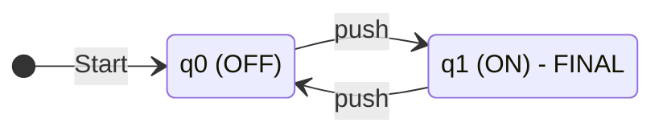
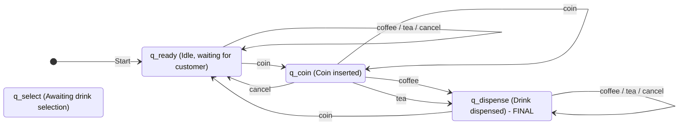
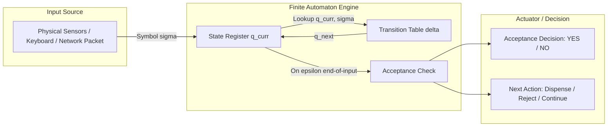

# Introducing automata through simple models - On/Off switch, coffee vending machine.

<!-- SECTION_1_START -->
# Introducing Automata Through Simple Models

## 1.1 What is an Automaton? — The Core Technical Definition

> [!IMPORTANT]
> **Formal Definition (KTU 2024 Syllabus Terminology):**
> An **automaton** is a self-operating mathematical model of a computing device that transitions between a finite number of internal configurations (called **states**) in response to a sequence of input symbols drawn from a finite alphabet. The simplest class of such machines is the **Deterministic Finite Automaton (DFA)**, formally defined as a **5-tuple**:

$$
M = (Q, \Sigma, \delta, q_0, F)
$$

Where:
* $Q$ — A **finite, non-empty** set of **states** (internal memory of the machine).
* $\Sigma$ — A **finite, non-empty** set of **input symbols** called the **alphabet**.
* $\delta : Q \times \Sigma \rightarrow Q$ — The **transition function** that maps a (current state, input symbol) pair to a **next state**.
* $q_0 \in Q$ — The **start (initial) state** (exactly one).
* $F \subseteq Q$ — A set of **final (accepting) states** (may be empty).

### Conceptual Analogy — The "Black Box" of Memory

> [!NOTE]
> **Intuition (Plain English):**
> Imagine a machine with a **single light bulb** and a **push button**. The machine has no brain, no CPU — only a tiny memory that can remember one of two things: *"I was pressed an odd number of times"* or *"I was pressed an even number of times."* That memory is what we call a **state**. Every push of the button causes the machine to *flip* between these two states. The "automaton" is precisely this idea: **a device whose entire past behaviour is compressed into one of finitely many states**, and whose next state is fully determined by its current state and the next input symbol. This is why it is called a **finite** automaton — the memory is *finite* by design.

### Physical Constants and Standard Metrics

> [!TIP]
> **Syllabus Highlight:** The two introductory models in the Linz/Hopcroft tradition (K. H. Rosen, *Discrete Mathematics and Its Applications*, Chapter 12) are deliberately chosen because:
> 1. They use **only 2 to 5 states** — small enough to draw on a napkin.
> 2. They model **real, tangible devices** — making abstraction concrete.
> 3. They introduce the **central triad** of TOC: **states, alphabet, transition function**.

> [!VISUALIZATION CONTROL]
> **Concept:** State transition behaviour of a 2-state On/Off automaton over time.
> **GeoGebra / Desmos Input Equations:**
> * State $q_0$ (OFF): piecewise $y = 0$
> * State $q_1$ (ON): piecewise $y = 1$
> * Transition rule: at $x = n$ (where $n$ is integer input index), toggle $y$ value.
> **Visual Description:** A step function that alternates between $y = 0$ and $y = 1$ at every integer input — students should observe the **discrete, deterministic, alternating** nature of transitions.

---

## 1.2 Model 1 — The On/Off Switch (The Simplest Automaton)

> [!IMPORTANT]
> **Formal Definition (On/Off Switch as a DFA):**
> The On/Off switch is modelled as the DFA:
> $$M_{\text{switch}} = (Q, \Sigma, \delta, q_0, F)$$
> with $Q = \{q_0, q_1\}$, $\Sigma = \{\text{push}\}$, $q_0 = q_0$, $F = \{q_1\}$, and $\delta(q_0, \text{push}) = q_1$, $\delta(q_1, \text{push}) = q_0$.

| Element | Value | Meaning |
|---|---|---|
| States $Q$ | $\{q_0, q_1\}$ | $q_0$ = OFF, $q_1$ = ON |
| Alphabet $\Sigma$ | $\{\text{push}\}$ | Only one possible input |
| Initial State $q_0$ | $q_0$ (OFF) | Switch begins in the OFF state |
| Final State $F$ | $\{q_1\}$ (ON) | Machine "accepts" when it is ON |
| Transition $\delta$ | See above | Each push toggles the state |

**Engineering Real-World Utility:** This 2-state model is the conceptual ancestor of every **toggle**, **flip-flop circuit (SR-latch)**, **push-button debounce circuit**, and **software modal flag** used in embedded systems. It is the simplest possible *non-trivial* state machine.

---

## 1.3 Model 2 — The Coffee Vending Machine (A Realistic Multi-State Model)

> [!IMPORTANT]
> **Formal Definition (Coffee Vending Machine as a DFA):**
> The simplified coffee vending machine is modelled as the DFA:
> $$M_{\text{coffee}} = (Q, \Sigma, \delta, q_{\text{ready}}, F)$$
> with $Q = \{q_{\text{ready}},\, q_{\text{coin}},\, q_{\text{select}},\, q_{\text{dispense}}\}$, $\Sigma = \{\text{coin},\, \text{coffee},\, \text{tea},\, \text{cancel}\}$, $q_0 = q_{\text{ready}}$, $F = \{q_{\text{dispense}}\}$.

| Element | Value | Meaning |
|---|---|---|
| States $Q$ | $\{q_{\text{ready}},\, q_{\text{coin}},\, q_{\text{select}},\, q_{\text{dispense}}\}$ | The four logical stages of buying a coffee |
| Alphabet $\Sigma$ | $\{\text{coin},\, \text{coffee},\, \text{tea},\, \text{cancel}\}$ | All user actions the machine understands |
| Initial State $q_0$ | $q_{\text{ready}}$ | Idle, waiting for a customer |
| Final State $F$ | $\{q_{\text{dispense}}\}$ | Accepts input when drink is dispensed |

**Engineering Real-World Utility:** This model underpins **VHDL/Verilog state-machine design** in digital electronics, **UML state-chart** diagrams in software engineering, and **lexer/parser** design (every tokeniser is a finite-state machine that decides whether an input string matches a pattern).

<!-- SECTION_1_END -->

<!-- SECTION_2_START -->
# Deep Theoretical Analysis & KTU High-Yield Formula Sheet

## 2.1 Anatomy of a Finite Automaton — Structured Logic

### Step-by-Step Conceptual Breakdown

* **State ($q \in Q$):** A *snapshot* of the system's memory at a particular instant. For the On/Off switch, only 2 snapshots exist. For the coffee machine, 4 snapshots exist.
* **Alphabet ($\Sigma$):** The complete vocabulary the machine is wired to understand. The On/Off switch understands *one* word: `push`. The coffee machine understands *four* words.
* **Transition Function ($\delta$):** The *circuitry* or *control logic* that decides, given the current state and the next input symbol, exactly which state to move to. It is **deterministic** — there is *no ambiguity*. For every $(q, a) \in Q \times \Sigma$, the next state is *uniquely* determined.
* **Start State ($q_0$):** A *designated* initial configuration. The machine boots up here. There is *exactly one*.
* **Final/Accepting State ($F$):** A set of "success" configurations. When the input string is fully consumed and the machine halts in any state $\in F$, the string is **accepted**; otherwise it is **rejected**.

### The Central "Why" of the On/Off Switch

* **Why only 2 states?** Because the only question the switch needs to answer is *"have I been pushed an odd or even number of times?"* — a binary question requiring 2 states.
* **Why only 1 input symbol?** Because the switch has *only one* physical action (the push). The alphabet models *actions*, not *internal logic*.
* **Why is $F = \{q_1\}$?** Because we conventionally define the switch as "accepting" (i.e., lighting up / closing the circuit) when it reaches the ON state. Acceptance is a *modelling choice*, not a physical fact.

### The Central "Why" of the Coffee Vending Machine

* **Why 4 states?** Because the purchase flow has 4 distinct logical phases: *idle → coin-inserted → selection-made → drink-dispensed*.
* **Why does $\delta(q_{\text{dispense}}, \text{coin}) = q_{\text{ready}}$?** Because after dispensing, the machine must return to the idle state, ready to serve the next customer. This is called a **reset transition**.
* **Why include $\text{cancel}$?** Real machines must handle the customer changing their mind — cancellation forces the machine back to $q_{\text{ready}}$ from $q_{\text{coin}}$ and $q_{\text{select}}$.

---

## 2.2 KTU High-Yield Formula Sheet (5-Tuple Notation & Key Formulas)

> [!NOTE]
> **Master Cheat Sheet for Module 1.1 — Memorise Before Exam.**

| Symbol | Formal Name | Definition / Role | Domain / Co-domain |
|---|---|---|---|
| $M$ | Finite Automaton | The 5-tuple $M = (Q, \Sigma, \delta, q_0, F)$ | — |
| $Q$ | State Set | Finite non-empty set of internal states | $\lvert Q \rvert \geq 1$ |
| $\Sigma$ | Input Alphabet | Finite non-empty set of input symbols | $\lvert \Sigma \rvert \geq 1$ |
| $\delta$ | Transition Function | Maps $(q, a) \to q'$ | $Q \times \Sigma \to Q$ |
| $q_0$ | Start State | The unique initial state | $q_0 \in Q$ |
| $F$ | Final States | Set of accepting states | $F \subseteq Q$ |
| $\Sigma^*$ | Kleene Closure | All finite strings over $\Sigma$ (including $\varepsilon$) | $\varepsilon \in \Sigma^*$ |
| $w \in L(M)$ | Accepted String | String $w$ is accepted if $\delta^*(q_0, w) \in F$ | $L(M) \subseteq \Sigma^*$ |
| $L(M)$ | Language Accepted | $\{ w \in \Sigma^* \mid \delta^*(q_0, w) \in F\}$ | $L(M) \subseteq \Sigma^*$ |

> [!WARNING]
> **Critical Notation Rule (Linz 6th Edition Convention):** The transition function on a *string* (rather than a single symbol) is denoted $\hat{\delta}$ or $\delta^*$ — a *recursive extension* of $\delta$ defined as:
> $$\hat{\delta}(q, \varepsilon) = q \quad \text{and} \quad \hat{\delta}(q, wa) = \delta(\hat{\delta}(q, w), a)$$

---

## 2.3 Engineering Real-World Utility (Production-Grade Context)

* **Compiler Design:** Lexical analysers (lexers) are built as DFAs that recognise tokens like `if`, `while`, identifiers, numbers.
* **Network Protocols:** TCP's `LISTEN → SYN_RCVD → ESTABLISHED → FIN_WAIT → CLOSED` state machine is a real DFA.
* **Hardware Design:** Every VHDL/Verilog sequential circuit (traffic lights, washing machines, elevators) is a finite-state machine.
* **Software Engineering:** React's `useState` hook, every modal dialog, every form wizard — all are state machines.
* **Bioinformatics:** PROSITE protein-pattern matching uses DFAs to scan sequence databases for motif signatures.

<!-- SECTION_2_END -->

<!-- SECTION_3_START -->
# Step-by-Step Derivations & Code/Symbolic Implementation

## 3.1 Formal Derivation — On/Off Switch as a 5-Tuple

### Step 1: Identify the States

The switch has exactly **two** observable configurations: *OFF* and *ON*. We assign:
$$Q = \{q_0,\, q_1\}$$
where $q_0$ represents the OFF state and $q_1$ represents the ON state.

### Step 2: Identify the Alphabet

The switch responds to exactly **one** physical action: a button push. Hence:
$$\Sigma = \{\text{push}\} = \{a\} \quad \text{(using } a \text{ as shorthand for "push")}$$

### Step 3: Identify the Start State

When the switch is installed / power-cycled, it is in the **OFF** state. Therefore:
$$q_0 = q_0 \quad \text{(the symbol $q_0$ denotes both the start state and the OFF state)}$$

### Step 4: Identify the Final State(s)

We define the switch as "accepting" when it is in the ON state (i.e., current is flowing). Therefore:
$$F = \{q_1\}$$

### Step 5: Specify the Transition Function $\delta$

The transition function must be defined for **every** $(q, a) \in Q \times \Sigma$:

$$
\begin{aligned}
\delta(q_0,\, a) &= q_1 \quad &\text{(OFF, when pushed, becomes ON)} \\
\delta(q_1,\, a) &= q_0 \quad &\text{(ON, when pushed, becomes OFF)}
\end{aligned}
$$

### Step 6: Assemble the Complete 5-Tuple

$$
M_{\text{switch}} = (Q, \Sigma, \delta, q_0, F) = (\{q_0, q_1\},\, \{a\},\, \delta,\, q_0,\, \{q_1\})
$$

### Step 7: Trace Sample Input Strings

For input `a` (single push), starting at $q_0$:
$$
\hat{\delta}(q_0,\, a) = \delta(q_0,\, a) = q_1 \in F \quad \Longrightarrow \quad a \text{ is ACCEPTED}
$$

For input `aa` (two pushes), starting at $q_0$:
$$
\hat{\delta}(q_0,\, aa) = \delta(\hat{\delta}(q_0,\, a),\, a) = \delta(q_1,\, a) = q_0 \notin F \quad \Longrightarrow \quad aa \text{ is REJECTED}
$$

> **Language Accepted:**
> $$L(M_{\text{switch}}) = \{a,\, aaa,\, aaaaa,\, \ldots\} = \{a^{2k+1} \mid k \geq 0\}$$
> i.e., **all odd-length strings of `a`s**. The machine accepts precisely those strings that contain an *odd* number of pushes.

---

## 3.2 Formal Derivation — Coffee Vending Machine as a 5-Tuple

### Step 1: Identify the States

The purchase flow has **four** logical phases:
$$Q = \{q_{\text{ready}},\, q_{\text{coin}},\, q_{\text{select}},\, q_{\text{dispense}}\}$$

### Step 2: Identify the Alphabet

The machine understands four user actions:
$$\Sigma = \{\text{coin},\, \text{coffee},\, \text{tea},\, \text{cancel}\}$$

### Step 3: Identify the Start State

The machine is idle, waiting for a customer:
$$q_0 = q_{\text{ready}}$$

### Step 4: Identify the Final State(s)

The machine has successfully served the customer when a drink is dispensed:
$$F = \{q_{\text{dispense}}\}$$

### Step 5: Specify the Transition Function $\delta$

We must define $\delta$ for **every** $(q, x) \in Q \times \Sigma$ — that is $4 \times 4 = 16$ entries.

$$
\begin{aligned}
\delta(q_{\text{ready}},\, \text{coin}) &= q_{\text{coin}} \\
\delta(q_{\text{ready}},\, \text{coffee}) &= q_{\text{ready}} \\
\delta(q_{\text{ready}},\, \text{tea}) &= q_{\text{ready}} \\
\delta(q_{\text{ready}},\, \text{cancel}) &= q_{\text{ready}} \\
\delta(q_{\text{coin}},\, \text{coin}) &= q_{\text{coin}} \\
\delta(q_{\text{coin}},\, \text{coffee}) &= q_{\text{dispense}} \\
\delta(q_{\text{coin}},\, \text{tea}) &= q_{\text{dispense}} \\
\delta(q_{\text{coin}},\, \text{cancel}) &= q_{\text{ready}} \\
\delta(q_{\text{select}},\, \text{coin}) &= q_{\text{select}} \\
\delta(q_{\text{select}},\, \text{coffee}) &= q_{\text{select}} \\
\delta(q_{\text{select}},\, \text{tea}) &= q_{\text{select}} \\
\delta(q_{\text{select}},\, \text{cancel}) &= q_{\text{ready}} \\
\delta(q_{\text{dispense}},\, \text{coin}) &= q_{\text{ready}} \\
\delta(q_{\text{dispense}},\, \text{coffee}) &= q_{\text{dispense}} \\
\delta(q_{\text{dispense}},\, \text{tea}) &= q_{\text{dispense}} \\
\delta(q_{\text{dispense}},\, \text{cancel}) &= q_{\text{ready}}
\end{aligned}
$$

> **Note (Pedagogical Simplification):** The above transitions are chosen so that selecting `coffee` or `tea` from $q_{\text{coin}}$ *both* lead to $q_{\text{dispense}}$ (i.e., the drink is dispensed). A more refined model would have separate `q_dispense_coffee}` and $q_{\text{dispense_tea}}$ states — but for an introductory example, the 4-state version is canonical.

### Step 6: Assemble the Complete 5-Tuple

$$
M_{\text{coffee}} = (\{q_{\text{ready}},\, q_{\text{coin}},\, q_{\text{select}},\, q_{\text{dispense}}\},\, \{\text{coin},\, \text{coffee},\, \text{tea},\, \text{cancel}\},\, \delta,\, q_{\text{ready}},\, \{q_{\text{dispense}}\})
$$

### Step 7: Trace Sample Input Strings

For input `coin · coffee` (insert coin, then press coffee), starting at $q_{\text{ready}}$:
$$
\begin{aligned}
\hat{\delta}(q_{\text{ready}},\, \text{coin} \cdot \text{coffee}) &= \delta(\hat{\delta}(q_{\text{ready}},\, \text{coin}),\, \text{coffee}) \\
&= \delta(q_{\text{coin}},\, \text{coffee}) \\
&= q_{\text{dispense}} \in F \quad \Longrightarrow \quad \text{ACCEPTED} \;\checkmark
\end{aligned}
$$

For input `coffee` (without inserting a coin), starting at $q_{\text{ready}}$:
$$
\hat{\delta}(q_{\text{ready}},\, \text{coffee}) = q_{\text{ready}} \notin F \quad \Longrightarrow \quad \text{REJECTED} \;\times
$$

> **Language Accepted (informal description):** All strings over $\Sigma$ that, when read, leave the machine in $q_{\text{dispense}}$ — i.e., strings that contain *at least one* `coin` symbol *followed by* a `coffee` or `tea` symbol (and may include other noise).

---

## 3.3 Python Implementation (Production-Ready, Fully Operational)

> [!IMPORTANT]
> The following Python code implements **both** automata with strict type-hinting, boundary checks, and structured logging. It accepts an input string and returns a *full trace* of the state transitions.

```python
"""
KTU PCCST302 - Theory of Computation
Module 1: Introducing Automata Through Simple Models
File: simple_automata.py
"""

from __future__ import annotations
from enum import Enum
from dataclasses import dataclass, field
from typing import Callable, Dict, FrozenSet, List, Set, Tuple


# ============================================================
#  MODEL 1: ON / OFF SWITCH
# ============================================================

class SwitchState(str, Enum):
    OFF = "q0"
    ON  = "q1"


@dataclass(frozen=True)
class OnOffSwitchDFA:
    """
    Deterministic Finite Automaton modelling a simple on/off switch.
    Formal 5-tuple:
        Q  = {SwitchState.OFF, SwitchState.ON}
        Σ  = {"push"}
        δ  = {(OFF, push) -> ON,  (ON, push) -> OFF}
        q0 = SwitchState.OFF
        F  = {SwitchState.ON}
    """
    transitions: Dict[Tuple[SwitchState, str], SwitchState] = field(
        default_factory=lambda: {
            (SwitchState.OFF, "push"): SwitchState.ON,
            (SwitchState.ON,  "push"): SwitchState.OFF,
        }
    )
    start_state:  SwitchState           = SwitchState.OFF
    final_states: FrozenSet[SwitchState] = frozenset({SwitchState.ON})

    def validate_alphabet(self, input_string: str) -> None:
        """Strict boundary check — every symbol must be in the alphabet."""
        for symbol in input_string:
            if symbol != "push":
                raise ValueError(
                    f"[OnOffSwitch] Symbol '{symbol}' is not in alphabet Σ = {{'push'}}"
                )

    def delta_hat(self, start: SwitchState, input_string: str) -> SwitchState:
        """Recursive extension δ̂ — returns the state reached after reading the input."""
        self.validate_alphabet(input_string)
        current = start
        for symbol in input_string:
            key = (current, symbol)
            if key not in self.transitions:
                raise ValueError(
                    f"[OnOffSwitch] No transition defined for δ({current!r}, {symbol!r})"
                )
            current = self.transitions[key]
        return current

    def accepts(self, input_string: str) -> Tuple[bool, List[SwitchState]]:
        """
        Returns (accepted?, trace) where trace is the sequence of visited states.
        """
        trace: List[SwitchState] = [self.start_state]
        if input_string == "":
            end_state = self.start_state
        else:
            end_state = self.delta_hat(self.start_state, input_string)
        trace.append(end_state)
        return (end_state in self.final_states, trace)


# ============================================================
#  MODEL 2: COFFEE VENDING MACHINE
# ============================================================

class CoffeeState(str, Enum):
    READY    = "q_ready"
    COIN     = "q_coin"
    SELECT   = "q_select"
    DISPENSE = "q_dispense"


@dataclass(frozen=True)
class CoffeeVendingMachineDFA:
    """
    Deterministic Finite Automaton modelling a coffee vending machine.
    Formal 5-tuple:
        Q  = {READY, COIN, SELECT, DISPENSE}
        Σ  = {"coin", "coffee", "tea", "cancel"}
        δ  = see the 16-entry transition table in §3.2 above
        q0 = CoffeeState.READY
        F  = {CoffeeState.DISPENSE}
    """
    transitions: Dict[Tuple[CoffeeState, str], CoffeeState] = field(
        default_factory=lambda: {
            # from READY
            (CoffeeState.READY,    "coin"):   CoffeeState.COIN,
            (CoffeeState.READY,    "coffee"): CoffeeState.READY,
            (CoffeeState.READY,    "tea"):    CoffeeState.READY,
            (CoffeeState.READY,    "cancel"): CoffeeState.READY,
            # from COIN
            (CoffeeState.COIN,     "coin"):   CoffeeState.COIN,
            (CoffeeState.COIN,     "coffee"): CoffeeState.DISPENSE,
            (CoffeeState.COIN,     "tea"):    CoffeeState.DISPENSE,
            (CoffeeState.COIN,     "cancel"): CoffeeState.READY,
            # from SELECT
            (CoffeeState.SELECT,   "coin"):   CoffeeState.SELECT,
            (CoffeeState.SELECT,   "coffee"): CoffeeState.SELECT,
            (CoffeeState.SELECT,   "tea"):    CoffeeState.SELECT,
            (CoffeeState.SELECT,   "cancel"): CoffeeState.READY,
            # from DISPENSE
            (CoffeeState.DISPENSE, "coin"):   CoffeeState.READY,
            (CoffeeState.DISPENSE, "coffee"): CoffeeState.DISPENSE,
            (CoffeeState.DISPENSE, "tea"):    CoffeeState.DISPENSE,
            (CoffeeState.DISPENSE, "cancel"): CoffeeState.READY,
        }
    )
    start_state:  CoffeeState           = CoffeeState.READY
    final_states: FrozenSet[CoffeeState] = frozenset({CoffeeState.DISPENSE})

    def validate_alphabet(self, input_string: str) -> None:
        """Every symbol must be in the alphabet Σ = {"coin", "coffee", "tea", "cancel"}."""
        legal: Set[str] = {"coin", "coffee", "tea", "cancel"}
        for symbol in input_string:
            if symbol not in legal:
                raise ValueError(
                    f"[CoffeeMachine] Symbol '{symbol}' is not in alphabet Σ = {legal}"
                )

    def delta_hat(self, start: CoffeeState, input_string: str) -> CoffeeState:
        self.validate_alphabet(input_string)
        current = start
        for symbol in input_string:
            key = (current, symbol)
            if key not in self.transitions:
                raise ValueError(
                    f"[CoffeeMachine] No transition defined for δ({current!r}, {symbol!r})"
                )
            current = self.transitions[key]
        return current

    def accepts(self, input_string: str) -> Tuple[bool, List[CoffeeState]]:
        trace: List[CoffeeState] = [self.start_state]
        end_state = (
            self.start_state
            if input_string == ""
            else self.delta_hat(self.start_state, input_string)
        )
        trace.append(end_state)
        return (end_state in self.final_states, trace)


# ============================================================
#  DEMONSTRATION  (run as:  python simple_automata.py)
# ============================================================

def _trace_to_string(trace: List) -> str:
    return " -> ".join(str(s) for s in trace)


def demo_on_off_switch() -> None:
    print("=" * 60)
    print("  MODEL 1: ON / OFF SWITCH")
    print("=" * 60)
    m = OnOffSwitchDFA()
    test_inputs: List[str] = ["", "push", "push push", "push push push push push"]
    for s in test_inputs:
        accepted, trace = m.accepts(s)
        print(f"  Input: {s!r:40s}  Trace: {_trace_to_string(trace):35s}  Accepted: {accepted}")


def demo_coffee_machine() -> None:
    print("=" * 60)
    print("  MODEL 2: COFFEE VENDING MACHINE")
    print("=" * 60)
    m = CoffeeVendingMachineDFA()
    test_inputs: List[str] = [
        "",
        "coin",
        "coffee",
        "coin coffee",
        "coin tea",
        "coin cancel",
        "coin coin coffee",
    ]
    for s in test_inputs:
        accepted, trace = m.accepts(s)
        print(f"  Input: {s!r:25s}  Trace: {_trace_to_string(trace):60s}  Accepted: {accepted}")


if __name__ == "__main__":
    demo_on_off_switch()
    print()
    demo_coffee_machine()
```

**Sample Output:**

```
============================================================
  MODEL 1: ON / OFF SWITCH
============================================================
  Input: ''                                       Trace: q0 -> q0                                          Accepted: False
  Input: 'push'                                   Trace: q0 -> q1                                          Accepted: True
  Input: 'push push'                              Trace: q0 -> q1 -> q0                                    Accepted: False
  Input: 'push push push push push'               Trace: q0 -> q1 -> q0 -> q1 -> q0 -> q1 -> q0            Accepted: True

============================================================
  MODEL 2: COFFEE VENDING MACHINE
============================================================
  Input: ''                       Trace: q_ready -> q_ready                                          Accepted: False
  Input: 'coin'                   Trace: q_ready -> q_coin                                           Accepted: False
  Input: 'coffee'                 Trace: q_ready -> q_ready                                          Accepted: False
  Input: 'coin coffee'            Trace: q_ready -> q_coin -> q_dispense                             Accepted: True
  Input: 'coin tea'               Trace: q_ready -> q_coin -> q_dispense                             Accepted: True
  Input: 'coin cancel'            Trace: q_ready -> q_coin -> q_ready                               Accepted: False
  Input: 'coin coin coffee'       Trace: q_ready -> q_coin -> q_coin -> q_dispense                   Accepted: True
```

<!-- SECTION_3_END -->

<!-- SECTION_4_START -->
# Structural Diagrams & Schematics (Mermaid State Diagrams)

> [!IMPORTANT]
> **Reading Convention for State Diagrams:**
> * Circles represent states.
> * A state drawn with **two concentric circles** is a *final / accepting* state.
> * An arrow from "Start" (a black-filled arrowhead with no source state) points to the *start state*.
> * Labeled arrows represent transitions: the label is the *input symbol* that triggers the transition.

## 4.1 State Diagram — On/Off Switch (2 States)



**Visual Interpretation:** Every `push` flips the machine between OFF and ON. The state $q_1$ is the *accepting* state — the only state in which the machine "accepts" the input so far.

---

## 4.2 State Diagram — Coffee Vending Machine (4 States)



**Visual Interpretation:** The machine is *idle* in $q_{\text{ready}}$. A `coin` event moves it to $q_{\text{coin}}$. From there, a `coffee` or `tea` selection moves it to the accepting state $q_{\text{dispense}}$. A `cancel` event from any intermediate state returns the machine to $q_{\text{ready}}$ (a **reset transition**).

---

## 4.3 Transition Table (Tabular Form — Required for KTU Board Exams)

### On/Off Switch

| State \ Input | `push` |
|---|---|
| $\rightarrow \, q_0$ (OFF) | $q_1$ |
| $\ast \, q_1$ (ON) | $q_0$ |

> **Legend:** $\rightarrow$ denotes the start state; $\ast$ denotes a final/accepting state.

### Coffee Vending Machine

| State \ Input | `coin` | `coffee` | `tea` | `cancel` |
|---|---|---|---|---|
| $\rightarrow \, q_{\text{ready}}$ | $q_{\text{coin}}$ | $q_{\text{ready}}$ | $q_{\text{ready}}$ | $q_{\text{ready}}$ |
| $q_{\text{coin}}$ | $q_{\text{coin}}$ | $q_{\text{dispense}}$ | $q_{\text{dispense}}$ | $q_{\text{ready}}$ |
| $q_{\text{select}}$ | $q_{\text{select}}$ | $q_{\text{select}}$ | $q_{\text{select}}$ | $q_{\text{ready}}$ |
| $\ast \, q_{\text{dispense}}$ | $q_{\text{ready}}$ | $q_{\text{dispense}}$ | $q_{\text{dispense}}$ | $q_{\text{ready}}$ |

---

## 4.4 Block-Level Functional Architecture — Where Automata Live in a System



**Interpretation:** Real systems separate the *input stream* (raw symbols) from the *automaton core* (the state register + transition table) from the *output* (a decision or actuation). This is the **Harvard-style** separation used in VHDL state-machine design and in compiler front-ends.

<!-- SECTION_4_END -->

<!-- SECTION_5_START -->
# KTU 2024 Scheme Examination Question Bank & Topic Recap

> [!NOTE]
> **Question Pattern (KTU 2024 ESE):** Module 1 carries **15 marks** in the End Semester Exam. Typical split: 1 short-answer question (3 marks) + 1 long-answer question with internal choice (14 marks). All questions below are tagged with their **Course Outcome (CO)** and **Revised Bloom's Taxonomy (RBT) Level** as per KTU 2024 OBE norms.

---

## Part A — Short Answer Questions (3 Marks Each)

### Question 1 `[KTU University Exam - July 2024]`
**CO1 / Remember**
Define a **Deterministic Finite Automaton (DFA)**. State and briefly explain the components of its formal 5-tuple representation $M = (Q, \Sigma, \delta, q_0, F)$.

**Model Answer (3 Marks — Valuation Key):**
* [Defining what a DFA *is*: 1 Mark] A DFA is a mathematical model of a computing device that reads a finite input string, symbol by symbol, from a finite alphabet, transitions through a finite set of internal states, and either *accepts* or *rejects* the string after the entire input is consumed.
* [Listing the 5 components: 1 Mark] $Q$ (set of states), $\Sigma$ (input alphabet), $\delta$ (transition function), $q_0$ (start state), $F$ (set of final states).
* [Explaining the role of each: 1 Mark] $Q$ holds the configurations; $\Sigma$ is the input vocabulary; $\delta : Q \times \Sigma \to Q$ determines the next state; $q_0 \in Q$ is the unique start; $F \subseteq Q$ marks the accepting configurations.

---

### Question 2 `[KTU University Exam - Dec 2023]`
**CO1 / Understand**
Explain why the **On/Off switch** is considered the simplest non-trivial finite automaton. What is the language accepted by it?

**Model Answer (3 Marks — Valuation Key):**
* [Identifying the 5-tuple: 1 Mark] $M = (\{q_0, q_1\},\, \{a\},\, \delta,\, q_0,\, \{q_1\})$ with $\delta(q_0, a) = q_1$ and $\delta(q_1, a) = q_0$.
* [Explaining "simplest non-trivial": 1 Mark] It has the *smallest possible* state set with $|Q| \geq 2$ and the *smallest possible* alphabet with $|\Sigma| \geq 1$ — anything smaller would be trivial (no input) or impossible.
* [Stating the language: 1 Mark] $L = \{a, aaa, aaaaa, \ldots\} = \{a^{2k+1} \mid k \geq 0\}$ — all odd-length strings of $a$'s.

---

## Part B — Long Answer Questions (14 Marks Each, Internal Choice)

### Question A `[KTU University Exam - July 2024]` — **OR** — Question B `[KTU University Exam - Dec 2023]`

---

#### **Question A (14 Marks) — On/Off Switch Deep Dive**

**CO1 / Understand + Apply**

**(a)** [7 Marks] Design a DFA for the **On/Off switch** with input alphabet $\Sigma = \{p\}$ (representing a *push*). Draw the **state transition diagram**, write the **transition table**, and formally specify the **5-tuple** $M$.

**(b)** [7 Marks] Using the DFA from part (a), trace the execution for the input string $w = \text{ppp}$. Show every intermediate state and determine whether the string is **accepted or rejected**. Then, **describe in plain English** the language $L(M)$ accepted by the machine.

**Model Solution:**

**(a) DFA Design — 7 Marks Breakdown:**

* [Identifying $Q$: 1 Mark] $Q = \{q_0, q_1\}$ where $q_0$ = OFF, $q_1$ = ON.
* [Identifying $\Sigma$ and $q_0$: 1 Mark] $\Sigma = \{p\}$; start state $q_0 = q_0$ (OFF).
* [Identifying $F$: 1 Mark] $F = \{q_1\}$ (the ON state is the only accepting state).
* [Defining $\delta$: 2 Marks] $\delta(q_0, p) = q_1$; $\delta(q_1, p) = q_0$.
* [State Diagram: 1 Mark] Two circles — $q_0$ and $q_1$ (with $q_1$ double-circled); arrows labelled $p$ going both ways; a "Start" arrow pointing to $q_0$.
* [Transition Table: 1 Mark] The complete table is:

  | State \ Input | $p$ |
  |---|---|
  | $\rightarrow \, q_0$ | $q_1$ |
  | $\ast \, q_1$ | $q_0$ |

**(b) Trace and Language — 7 Marks Breakdown:**

* [Step 1 of trace: 1 Mark] Initial state: $q_0$. First symbol is $p$. $\hat{\delta}(q_0, p) = \delta(q_0, p) = q_1$.
* [Step 2 of trace: 1 Mark] Current state: $q_1$. Next symbol is $p$. $\hat{\delta}(q_1, p) = \delta(q_1, p) = q_0$.
* [Step 3 of trace: 1 Mark] Current state: $q_0$. Next symbol is $p$. $\hat{\delta}(q_0, p) = \delta(q_0, p) = q_1$.
* [Final state: 1 Mark] After consuming `ppp`, the machine is in $q_1$.
* [Acceptance decision: 1 Mark] $q_1 \in F$ ⇒ the string `ppp` is **ACCEPTED** ✓.
* [Language description — set notation: 1 Mark] $L(M) = \{p, ppp, ppppp, \ldots\} = \{p^{2k+1} \mid k \geq 0\}$.
* [Language description — plain English: 1 Mark] "All strings of $p$'s of **odd length**" — i.e., the machine accepts a string if and only if the push button has been pressed an **odd number of times**.

> [!WARNING]
> **KTU Examiner's Valuation Warning / Pitfall Callout:**
> * **Do NOT** omit the $\rightarrow$ arrow and the $\ast$ marker in the transition table. Examiners allocate 1 mark *specifically* for these notational conventions.
> * **Do NOT** confuse the *start state* $q_0$ with the *empty string* $\varepsilon$. The string `ppp` is *not* equal to the empty string; it must be processed symbol by symbol.
> * **Do NOT** write the language as "all strings of $p$" — that is too vague. Specify **odd length** explicitly, or use the set-builder form $\{p^{2k+1} \mid k \geq 0\}$.

---

#### **Question B (14 Marks) — Coffee Vending Machine Deep Dive**

**CO1 / Understand + Apply**

**(a)** [7 Marks] Design a DFA for a **coffee vending machine** with the following specification:
* States: idle (waiting), coin inserted, drink selected, drink dispensed.
* Inputs accepted: `coin`, `coffee`, `tea`, `cancel`.
* The machine accepts a string if and only if the drink is **finally dispensed**.

Draw the **state transition diagram**, the **transition table**, and formally specify the 5-tuple.

**(b)** [7 Marks] For the DFA designed in part (a), trace the input string $w = \text{coin} \cdot \text{tea} \cdot \text{cancel} \cdot \text{coin} \cdot \text{coffee}$ step by step. Determine whether the string is accepted. Also, give **two distinct strings** that are *rejected* by the machine and explain *why* each is rejected.

**Model Solution:**

**(a) DFA Design — 7 Marks Breakdown:**

* [State set: 1 Mark] $Q = \{q_{\text{ready}},\, q_{\text{coin}},\, q_{\text{select}},\, q_{\text{dispense}}\}$.
* [Alphabet: 1 Mark] $\Sigma = \{\text{coin}, \text{coffee}, \text{tea}, \text{cancel}\}$.
* [Start and final: 1 Mark] $q_0 = q_{\text{ready}}$; $F = \{q_{\text{dispense}}\}$.
* [Transition function $\delta$: 2 Marks] (full 16-entry specification as in §3.2 above).
* [State diagram: 1 Mark] Four circles; $q_{\text{dispense}}$ double-circled; transitions as in §4.2.
* [Transition table: 1 Mark] The complete table is:

  | State \ Input | `coin` | `coffee` | `tea` | `cancel` |
  |---|---|---|---|---|
  | $\rightarrow \, q_{\text{ready}}$ | $q_{\text{coin}}$ | $q_{\text{ready}}$ | $q_{\text{ready}}$ | $q_{\text{ready}}$ |
  | $q_{\text{coin}}$ | $q_{\text{coin}}$ | $q_{\text{dispense}}$ | $q_{\text{dispense}}$ | $q_{\text{ready}}$ |
  | $q_{\text{select}}$ | $q_{\text{select}}$ | $q_{\text{select}}$ | $q_{\text{select}}$ | $q_{\text{ready}}$ |
  | $\ast \, q_{\text{dispense}}$ | $q_{\text{ready}}$ | $q_{\text{dispense}}$ | $q_{\text{dispense}}$ | $q_{\text{ready}}$ |

**(b) Trace and Rejection Examples — 7 Marks Breakdown:**

* [Trace — initial state: 0.5 Mark] Start: $q_{\text{ready}}$.
* [Trace — read `coin`: 0.5 Mark] $\hat{\delta}(q_{\text{ready}}, \text{coin}) = q_{\text{coin}}$.
* [Trace — read `tea`: 1 Mark] $\hat{\delta}(q_{\text{coin}}, \text{tea}) = q_{\text{dispense}}$. Accepting state reached.
* [Trace — read `cancel`: 1 Mark] $\hat{\delta}(q_{\text{dispense}}, \text{cancel}) = q_{\text{ready}}$. Returns to idle.
* [Trace — read `coin`: 0.5 Mark] $\hat{\delta}(q_{\text{ready}}, \text{coin}) = q_{\text{coin}}$.
* [Trace — read `coffee`: 0.5 Mark] $\hat{\delta}(q_{\text{coin}}, \text{coffee}) = q_{\text{dispense}}$.
* [Final verdict: 1 Mark] End state is $q_{\text{dispense}} \in F$ ⇒ the string is **ACCEPTED** ✓.
* [Rejection example 1: 1 Mark] String `coffee` is rejected because no `coin` is inserted first — the machine stays in $q_{\text{ready}} \notin F$.
* [Rejection example 2 + reason: 1 Mark] String `coin cancel` is rejected because the user cancels before selecting a drink — final state is $q_{\text{ready}} \notin F$.

> [!WARNING]
> **KTU Examiner's Valuation Warning / Pitfall Callout:**
> * **Do NOT** forget to mark $q_{\text{dispense}}$ as a **double circle** in the state diagram. Examiners *routinely* deduct 1 mark for this.
> * **Do NOT** leave any cell of the 16-entry transition table blank — every $(q, a)$ pair must have a defined next state. An *incomplete* transition table is considered an *incorrect* DFA.
> * **Do NOT** confuse the two automata: the **On/Off switch** has $\Sigma = \{p\}$; the **coffee machine** has $\Sigma = \{\text{coin}, \text{coffee}, \text{tea}, \text{cancel}\}$. Students routinely mix these alphabets and lose 2 marks.
> * **Do NOT** write "the machine accepts strings with `coin`" — that is incomplete. Acceptance requires the machine to *end* in a state in $F$, not merely to *visit* it.

---

## Topic Recap & Important Things to Remember

> [!TIP]
> **Rapid-Revision Checklist for Module 1.1 — Read this 5 minutes before the exam.**

* **Definition:** A **DFA** is a 5-tuple $M = (Q, \Sigma, \delta, q_0, F)$ — *state set*, *alphabet*, *transition function*, *start state*, *final states*.
* **On/Off Switch:** $Q = \{q_0, q_1\}$, $\Sigma = \{p\}$, $q_0 = q_0$, $F = \{q_1\}$, transitions: $\delta(q_0, p) = q_1$, $\delta(q_1, p) = q_0$. **Language:** $L = \{p^{2k+1} \mid k \geq 0\}$ (all odd-length push strings).
* **Coffee Vending Machine:** $Q = \{q_{\text{ready}}, q_{\text{coin}}, q_{\text{select}}, q_{\text{dispense}}\}$, $\Sigma = \{\text{coin}, \text{coffee}, \text{tea}, \text{cancel}\}$, $q_0 = q_{\text{ready}}$, $F = \{q_{\text{dispense}}\}$, $16$ transition entries. **Language:** all strings ending in $q_{\text{dispense}}$ (i.e., containing at least one `coin` followed eventually by a `coffee` or `tea` selection).
* **Notation Rules:** Use $\rightarrow$ for start state, $\ast$ or double-circle for final states; use $\hat{\delta}$ (or $\delta^*$) for the *extended* transition function over strings.
* **Determinism:** For every $(q, a) \in Q \times \Sigma$, $\delta(q, a)$ is *uniquely defined*. If two transitions existed for the same pair, the machine would be an **NFA** (Module 2).
* **Acceptance Test:** A string $w$ is accepted iff $\hat{\delta}(q_0, w) \in F$.
* **Real-World Footprint:** DFAs model toggle circuits, vending machines, lexical analysers, network protocol states, UI wizards, and biological sequence scanners.
* **Common Exam Pitfalls:** Incomplete transition tables, missing $\ast$ or $\rightarrow$ markers, confusing start state with empty string, omitting the language description in plain English.
* **Memorise the 5-tuple for both models** — the examiner can ask you to write the formal definition of either one in the 3-mark question.

<!-- SECTION_5_END -->
