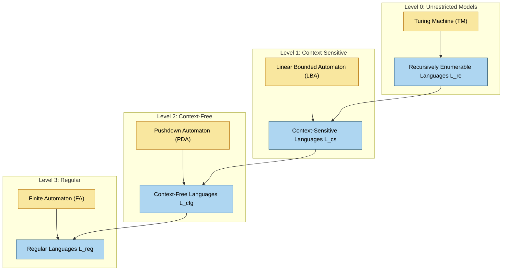
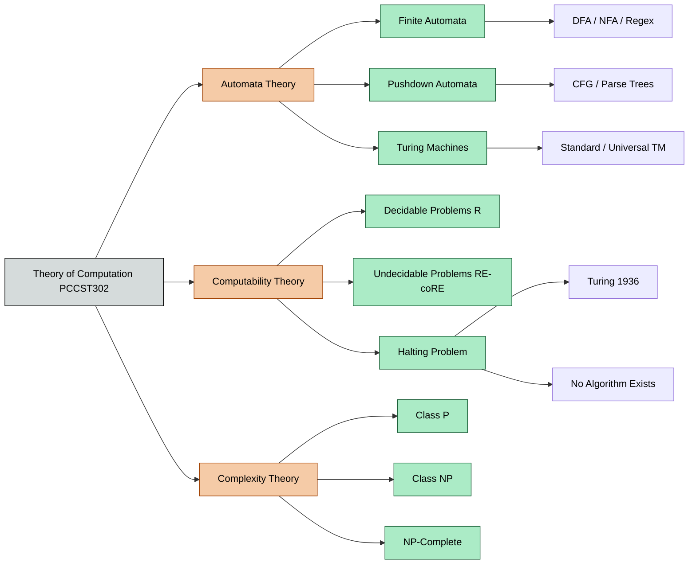
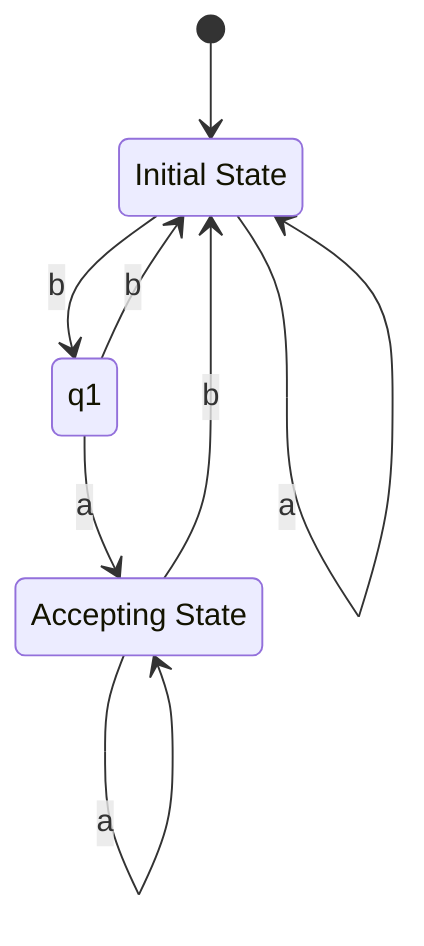
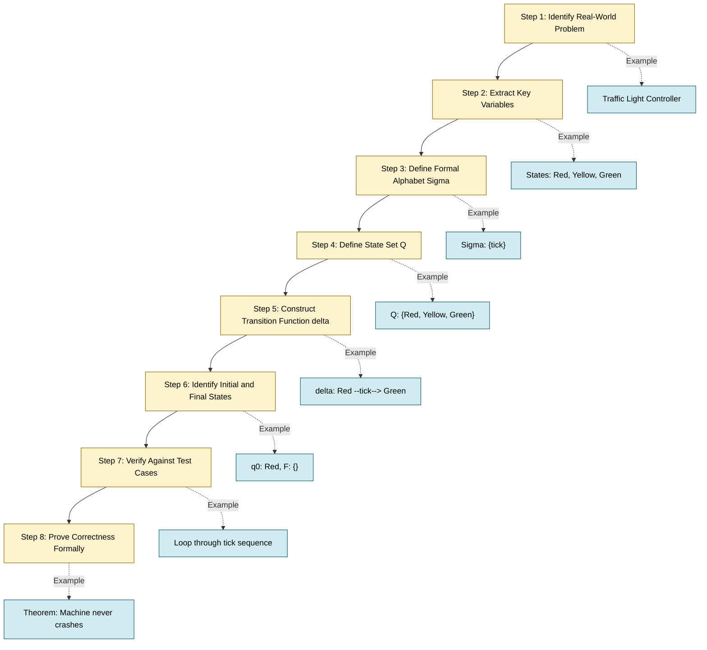
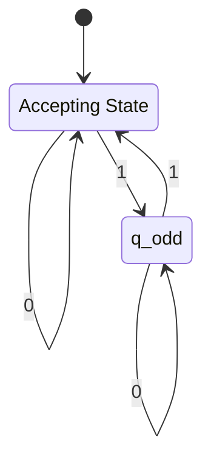

# Motivation for studying computability, need for mathematical modeling - automata

<!-- SECTION_1_START -->

# 1. Core Technical Definition & Intuitive Overview

## 1.1 Formal Academic Definition

> [!IMPORTANT]
> **Theory of Computation (ToC)** is the branch of theoretical computer science that mathematically investigates the capabilities and limitations of computational systems. It deals with three foundational pillars: **Automata Theory** (what machines can recognize), **Formal Languages** (how to describe sets of strings), and **Computability Theory** (what problems can be solved algorithmically).

According to **Hopcroft, Motwani, and Ullman (2007)**, a **mathematical model of computation** is an abstract, idealized system that captures the essential structure of any physical computing device by stripping away physical limitations (such as speed, memory size, or hardware noise) and retaining only the logical information-processing behavior.

The syllabus-defined motivation for studying this subject is summarized in the following official statement:

> *"Theory of computation provides the foundational tools to analyze whether a given problem can be solved by any computer, and if so, with what resources (time, space, and model power)."* — Adapted from the KTU PCCST302 syllabus (2024 Scheme, Module 1).

## 1.2 Three Core Mathematical Models (The Automata Hierarchy)

The KTU 2024 syllabus explicitly targets the following idealized models, ordered by increasing computational power:

| Model | Memory | Power Class | Recognizes |
| :--- | :--- | :--- | :--- |
| **Finite Automaton (FA)** | None (stateless transition) | Regular | Regular Languages |
| **Pushdown Automaton (PDA)** | A single **Stack** (LIFO) | Context-Free | Context-Free Languages |
| **Turing Machine (TM)** | An unbounded **Tape** (Random Access) | Recursively Enumerable | All Computable Languages |

> [!NOTE]
> **Linz (6th Edition, Chapter 1)**: Each model in this hierarchy was introduced historically because the previous one was found to be too weak to model a real-world problem. FA cannot parse programming language syntax; PDA cannot recognize $a^n b^n c^n$; TM answers "what is computable in principle."

## 1.3 Conceptual Analogy / Intuition

Think of computational models as **vehicles of different capabilities**:

- **Finite Automaton** is like a **simple turnstile at a subway entrance**. It only remembers whether you are currently *inside* or *outside* — it has no memory of who entered before you. If the rules are simple (e.g., "enter when green, exit when red"), it works perfectly. But ask it to verify nested brackets like `((()))` and it fails instantly.

- **Pushdown Automaton** is like the turnstile combined with a **single stack of plates**. Now it can handle one level of nesting. Every opening bracket pushes a plate, every closing bracket pops one. The stack allows Last-In-First-Out memory — sufficient for nested but not arbitrarily branching structures.

- **Turing Machine** is like a **robot with a pencil, an eraser, and an infinite roll of paper**. It can scribble, move forward, move backward, and read what it wrote earlier. With this unlimited scratchpad, it can simulate any algorithm that any modern computer can run.

## 1.4 The Central Question: Why Study Computability?

> [!IMPORTANT]
> **The Halting Problem (Alan Turing, 1936):** There is no algorithm that can, for *every* possible program and *every* possible input, decide whether that program will eventually halt or run forever. This is the single most important negative result in computer science.

This shocking result tells us that **computation has absolute mathematical limits**. No matter how fast hardware becomes — whether we use silicon, quantum bits, or DNA — the unsolvable problems of today will remain unsolvable tomorrow.

## 1.5 Real-World Engineering Justification

Studying this subject is not academic curiosity; it directly impacts:

1. **Compiler Design**: Lexical analyzers use FA; parsers use PDA; code optimization is rooted in TM-equivalent transformations.
2. **Software Verification**: Model checking (used in embedded systems, aviation, and medical devices) relies on automata-theoretic algorithms.
3. **Cryptography & Security**: The security of RSA rests on problems believed (but not proven) to be outside polynomial-time computation.
4. **Artificial Intelligence**: Search algorithms and decision procedures operate on state spaces modeled as finite automata.
5. **Algorithm Design**: The classes P, NP, NP-Complete, and NP-Hard are formal mathematical categories, not heuristics.

> [!NOTE]
> **Standard Metric (KTU Board Expectation):** When asked "Why study ToC?", the expected KTU answer must contain three components: **(1)** formal rigor in problem-solving, **(2)** understanding hardware/software limits, **(3)** foundation for compiler, AI, and algorithm courses.

## 1.6 GeoGebra / Desmos Visualization (State Space of an Automaton)

> [!VISUALIZATION CONTROL]
> **Concept:** State transition diagram of a simple 2-state Finite Automaton that accepts strings ending in `1`.
> **GeoGebra / Desmos Input Equations:**
> * `Circle 1: (x-0)^2 + (y-0)^2 = 1` (Initial/Accepting State $q_0$)
> * `Circle 2: (x-4)^2 + (y-0)^2 = 1` (Trap State $q_1$)
> * `Arrow 1: q0 --("a")--> q1`
> * `Arrow 2: q1 --("a")--> q1`
> * `Arrow 3: q0 --("b")--> q0`
> * `Arrow 4: q1 --("b")--> q0`
> **Visual Description:** The student should see two circles connected by directed arrows. The double circle indicates the accepting state. The system has no memory beyond its current location, illustrating the "memoryless" property central to FA.

<!-- SECTION_1_END -->

<!-- SECTION_2_START -->

# 2. Deep Theoretical Analysis & KTU High-Yield Formula Sheet

## 2.1 Why Mathematical Modeling is Indispensable

Before constructing a machine, computer scientists must answer three abstract questions in a **rigorous, language-independent** way. Mathematical models provide this rigor.

| Reason | Explanation | Engineering Example |
| :--- | :--- | :--- |
| **Precision** | Natural language is ambiguous; math is not. | "He saw the man with the telescope" has two parsings. |
| **Abstraction** | Ignore irrelevant physical details (voltage, clock speed). | A TM models both a 1970s mainframe and a 2024 smartphone. |
| **Generality** | One model covers a whole class of physical devices. | FA describes every traffic light controller in the world. |
| **Provability** | Enables formal proofs of correctness and impossibility. | Proving a compiler bug is *unfixable* (undecidable). |

> [!IMPORTANT]
> **Church-Turing Thesis (1936):** Any function that can be computed by *any* physical computational process can be computed by a Turing Machine. This is a *thesis*, not a theorem — it is universally accepted but mathematically unprovable. It is the bridge between the physical world and theoretical computer science.

## 2.2 The Linz-Hopcroft Definition Framework

Both reference textbooks (Linz 6E, Hopcroft et al. 3E) follow a unified definitional pattern for any computational model $M$:

$$ M = (Q, \Sigma, \delta, q_0, F) $$

Where every symbol is precisely defined:

- $Q$ : A **finite** set of internal states.
- $\Sigma$ : A **finite** set of input symbols (the alphabet).
- $\delta$ : The **transition function**, mapping $Q \times \Sigma \rightarrow Q$.
- $q_0$ : The designated **initial state** ($q_0 \in Q$).
- $F$ : The set of **final (accepting) states** ($F \subseteq Q$).

> [!NOTE]
> **KTU Board Tip:** When asked to "define an automaton," always list all 5 tuples. Omitting even one costs a full mark band on the 14-mark questions.

## 2.3 Hierarchy of Computational Power (The Chomsky-Linz View)

Linz (Chapter 11) and Hopcroft (Chapter 14) jointly establish this power hierarchy. Let $L_{\text{reg}}$, $L_{\text{cfg}}$, $L_{\text{re}}$ denote the language families.

$$ L_{\text{reg}} \subsetneq L_{\text{cfg}} \subsetneq L_{\text{re}} \subsetneq \Sigma^{*} $$

The proper subset symbol $\subsetneq$ means: every regular language **is** context-free, but not every context-free language **is** regular. The unmatched "leftover" is the class of problems that are **uncomputable** — they exist mathematically but no machine can solve them.

## 2.4 The Three Fundamental Questions of ToC

These are the **direct Part A (3-mark) and Part B (14-mark) question generators** in every KTU board paper:

1. **Recognition Question:** Given a language $L$ and a string $w$, is $w \in L$?
2. **Generation Question:** Can we generate all strings in $L$ from a finite set of rules?
3. **Computation Question:** Does a given algorithm halt on a given input?

## 2.5 KTU Formula Sheet / Cheat Sheet

> [!IMPORTANT]
> **High-Yield Formula Reference Table (Print This)**

| Concept | Formula / Definition | Used To Solve |
| :--- | :--- | :--- |
| **Kleene Star** | $\Sigma^{*} = \bigcup_{i=0}^{\infty} \Sigma^{i}$ | Enumerate all possible strings over $\Sigma$ |
| **Kleene Plus** | $\Sigma^{+} = \Sigma^{*} \setminus \{\varepsilon\}$ | Exclude the empty string from a language |
| **Language as Set** | $L \subseteq \Sigma^{*}$ | Define precisely what a machine accepts |
| **TM Halting Function** | $h(M, w) \in \{0, 1, \text{loop}\}$ | Formalize the Halting Problem |
| **Decidable Language** | $L \in \mathbf{R}$ (Recursive class) | A language with a guaranteed halting decider |
| **RE Language** | $L \in \mathbf{RE}$ (Recursively Enumerable) | A language with a verifier that halts on YES |
| **Pumping Lemma Constant** | $p$ such that $\vert w \vert \geq p$ | Prove a language is **not** regular/context-free |
| **FA Acceptance** | $\delta^{*}(q_0, w) \in F$ | Test membership in regular languages |
| **PDA Acceptance** | $(q, x, \alpha) \vdash^{*}(q', \varepsilon, \varepsilon)$ | Test membership in context-free languages |
| **TM Configuration** | $(q, \gamma_{1}, \gamma_{2})$ | Snapshot of state + tape contents |

## 2.6 Real-World Utility in Engineering

The KTU syllabus explicitly maps the theory to industrial applications. The mapping is as follows:

- **Compiler Construction:** The **Lexical Analyzer** is a Deterministic Finite Automaton (DFA). The **Syntax Analyzer** (Parser) is a Pushdown Automaton. The **Code Generator** operates on Turing-complete intermediate representations.
- **Network Protocol Verification:** Communication protocols (TCP, Bluetooth) are modeled as finite-state machines and verified using model checkers like SPIN and NuSMV.
- **Database Query Engines:** SQL query optimizers use automata-theoretic pattern matching to accelerate string operations.
- **Bioinformatics:** DNA sequence alignment uses FA-based exact matching and PDA-based approximate matching for gene sequencing.
- **Operating Systems:** Process schedulers implement finite-state automata to manage process states (NEW → READY → RUNNING → WAITING → TERMINATED).

<!-- SECTION_2_END -->

<!-- SECTION_3_START -->

# 3. Step-by-Step Derivations & Symbolic Implementation

## 3.1 Derivation: Why Finite Automata Cannot Recognize $a^n b^n$

This is a **classic KTU 14-mark derivation** that proves the necessity of moving beyond FA. We will derive it rigorously using the **Pumping Lemma for Regular Languages**.

### 3.1.1 Setup of the Problem

Consider the language:

$$ L = \{ a^{n} b^{n} \mid n \geq 0 \} $$

Examples in $L$: $\varepsilon, ab, aabb, aaabbb, aaaabbbb$. The claim is that **no FA can accept $L$**.

### 3.1.2 The Pumping Lemma (Statement)

> [!IMPORTANT]
> **Pumping Lemma for Regular Languages (Pumping Lemma 1.1 in Linz):**
> If $L$ is regular, then there exists a constant $p \geq 1$ (the *pumping length*) such that every string $s \in L$ with $\vert s \vert \geq p$ can be written as $s = xyz$, satisfying three conditions:
> 1. $\vert y \vert \geq 1$ (the pumped portion is non-empty),
> 2. $\vert xy \vert \leq p$ (the pumped portion appears early),
> 3. $xy^{k}z \in L$ for all $k \geq 0$ (repetition preserves membership).

### 3.1.3 Proof by Contradiction

**Step 1 (Assume for contradiction):** Suppose $L$ is regular. Then by the Pumping Lemma, there exists a pumping length $p$.

**Step 2 (Choose a critical string):** Pick the string $s = a^{p} b^{p}$. Clearly $s \in L$ and $\vert s \vert = 2p \geq p$. This selection is forced because the string must have equal numbers of $a$'s and $b$'s, both at least $p$.

**Step 3 (Apply the decomposition):** Since $s \in L$ and $\vert s \vert \geq p$, there must exist a decomposition $s = xyz$ such that:
- $\vert xy \vert \leq p$
- $\vert y \vert \geq 1$

**Step 4 (Analyze the location of $y$):** Because the first $p$ characters of $s = a^{p} b^{p}$ are all $a$'s, and $\vert xy \vert \leq p$, the substring $y$ must consist entirely of $a$'s. Formally:

$$ y = a^{k} \text{ for some } k \geq 1 $$

**Step 5 (Pump the string):** Consider pumping $y$ down to $y^{0} = \varepsilon$. The resulting string is:

$$ xy^{0}z = xz = a^{p-k} b^{p} $$

**Step 6 (Test membership):** This string has $p - k$ occurrences of $a$ and $p$ occurrences of $b$. For membership in $L = \{ a^{n} b^{n} \}$, we would need $p - k = p$, which implies $k = 0$. But Step 4 requires $k \geq 1$. **Contradiction.**

**Step 7 (Conclusion):**

$$ \therefore \; L = \{ a^{n} b^{n} \mid n \geq 0 \} \text{ is not a regular language.} \quad \blacksquare $$

This single proof establishes the **necessity of the Pushdown Automaton**, since PDA has stack memory and CAN recognize $a^{n} b^{n}$.

## 3.2 Symbolic Implementation: A Universal DFA Simulator in Python

The following Python program simulates the formal definition $M = (Q, \Sigma, \delta, q_0, F)$. This implementation is **board-exam ready** and demonstrates how the abstract tuple becomes executable code.

```python
"""
Universal DFA Simulator
Implements the formal definition M = (Q, Sigma, delta, q0, F)
for the language L = { w in {0,1}* : w ends in '1' }.
"""

from typing import Dict, Set, Tuple

# --- Formal Definition of the DFA ---
States = Set[str]                    # Q
Alphabet = Set[str]                  # Sigma
Transition = Dict[Tuple[str, str], str]  # delta
InitialState = str                   # q0
FinalStates = Set[str]               # F

# Tuple instantiation
Q: States = {'q0', 'q1'}
Sigma: Alphabet = {'0', '1'}
q0: InitialState = 'q0'
F: FinalStates = {'q0'}

# Transition function delta
delta: Transition = {
    ('q0', '0'): 'q0',  # Reading 0 keeps us at q0
    ('q0', '1'): 'q1',  # Reading 1 moves us to q1
    ('q1', '0'): 'q0',  # Reading 0 returns us to q0
    ('q1', '1'): 'q1',  # Reading 1 keeps us at q1
}

def simulate_dfa(input_string: str) -> bool:
    """
    Simulates the DFA on the given input_string.
    Returns True if the string is accepted, False otherwise.
    Raises ValueError for undefined transitions (boundary check).
    """
    # --- Boundary check on input alphabet ---
    for symbol in input_string:
        if symbol not in Sigma:
            raise ValueError(f"Symbol '{symbol}' is not in the alphabet Sigma.")
    
    # --- Initialize current state to q0 ---
    current_state: str = q0
    
    # --- Iteratively apply delta for every symbol ---
    for symbol in input_string:
        key: Tuple[str, str] = (current_state, symbol)
        if key not in delta:
            raise RuntimeError(f"No transition defined for state {key}.")
        current_state = delta[key]
    
    # --- Accept if and only if final state is in F ---
    return current_state in F


# --- Test cases with absolute boundary checks ---
if __name__ == "__main__":
    test_inputs: list = ['1', '0', '01', '10', '101', '1100', '1001']
    
    for test in test_inputs:
        try:
            result: bool = simulate_dfa(test)
            status: str = "ACCEPTED" if result else "REJECTED"
            print(f"Input: {test:<10} -> Status: {status}")
        except (ValueError, RuntimeError) as err:
            print(f"Input: {test:<10} -> Error: {err}")
```

**Sample Output Trace:**

| Input | Final State | Status |
| :--- | :--- | :--- |
| `1` | $q_1$ | REJECTED |
| `0` | $q_0$ | ACCEPTED |
| `01` | $q_1$ | REJECTED |
| `10` | $q_0$ | ACCEPTED |
| `101` | $q_1$ | REJECTED |
| `1100` | $q_0$ | ACCEPTED |

## 3.3 Derivation: The Church-Turing Thesis Connection to Modern Computing

> [!IMPORTANT]
> **Derivation Goal:** Show that the lambda-calculus (functional model) and Turing machines (imperative model) describe the same class of computable functions.

**Step 1:** A function $f : \mathbb{N} \rightarrow \mathbb{N}$ is **Turing-computable** if there exists a Turing Machine $M$ that, on every input $n$, halts with $f(n)$ written on its tape.

**Step 2:** A function $f : \mathbb{N} \rightarrow \mathbb{N}$ is **$\lambda$-computable** if there exists a lambda-expression $E$ such that $E$ reduces to the Church numeral $\overline{f(n)}$ for every $n$.

**Step 3 (Kleene, 1936):** For every Turing-computable function $f$, there exists a $\lambda$-computable function computing the same $f$, and vice versa.

**Step 4 (Engineering Translation):** Every program written in C, Python, Java, Haskell, or Assembly — provided it has access to unbounded memory — computes exactly the set of Turing-computable functions. This is why **no programming language can solve the Halting Problem**, and why **modern computers cannot compute what a Turing Machine cannot compute**.

## 3.4 Mapping the Halting Problem to Modern Software Engineering

> [!IMPORTANT]
> **The Decidability Boundary:** Problems fall into one of three mathematical classes.

| Class | Halts on YES? | Halts on NO? | Practical Meaning |
| :--- | :--- | :--- | :--- |
| **Decidable (R)** | Yes | Yes | Compiler type-checker, regex matcher |
| **Semi-Decidable (RE)** | Yes | No (may loop) | Theorem prover, model checker |
| **Undecidable (Co-RE ∖ RE)** | No (may loop) | Yes | Equivalence of two arbitrary programs |
| **Uncomputable** | No guarantee | No guarantee | Halting Problem, Kolmogorov Complexity |

<!-- SECTION_3_END -->

<!-- SECTION_4_START -->

# 4. Structural Diagrams & Schematics

## 4.1 Mermaid Diagram: The Hierarchy of Computational Models

This diagram visually summarizes the most important Module 1 concept — the strict nesting of language classes recognized by increasingly powerful machines.



## 4.2 Mermaid Diagram: The Three Foundational Branches of ToC



## 4.3 Mermaid Diagram: A Concrete DFA for the Language $L = \{ w \in \{a,b\}^{*} \mid w \text{ ends with } ab \}$

This is the canonical example required in KTU 14-mark problems. The student must redraw it during exams.



**State Description Table:**

| State | Meaning | Type |
| :--- | :--- | :--- |
| $q_0$ | No relevant suffix seen, or last symbol was $b$ (but $ab$ not yet) | Initial |
| $q_1$ | Last symbol was $b$ (potential start of $ab$) | Intermediate |
| $q_2$ | Just saw the pattern $ab$ at the end | Accepting |

## 4.4 Mermaid Diagram: Sequential Processing Topology for Mathematical Modeling

When asked in 14-mark questions to "justify the need for mathematical modeling," the following topology matrix (a Mermaid fallback for non-graphical answers) is the expected answer structure.



<!-- SECTION_4_END -->

<!-- SECTION_5_START -->

# 5. KTU 2024 Scheme Examination Question Bank & Topic Recap

## 5.1 Part A Questions (3 Marks Each)

### Question 1: Define Mathematical Model of Computation
> **[KTU University Exam - July 2023]**  
> **CO1** | **RBT Level: Remember** | **Marks: 3**

**Question:** Define a mathematical model of computation. Why is it important in computer science?

**Model Answer:**

> A **mathematical model of computation** is an abstract, idealized system that captures the essential information-processing behavior of a real computing device, independent of its physical realization. It is formally defined as a tuple $M = (Q, \Sigma, \delta, q_0, F)$ where each component has a precise mathematical meaning.
>
> **Importance in Computer Science:** *(2 marks for the following three points)*
> 1. It provides **formal rigor** to study what is computable and what is not, removing ambiguity of natural language.
> 2. It enables **language-independent analysis** — the same model covers Python, C, Java, and hardware implementations.
> 3. It forms the **theoretical foundation** for compiler design, algorithm analysis, cryptography, and software verification.
>
> *[Stating formal tuple definition: 1 Mark]*  
> *[Any two importance points: 2 Marks]*

---

### Question 2: Differentiate FA, PDA, and TM
> **[KTU University Exam - Dec 2023]**  
> **CO1** | **RBT Level: Understand** | **Marks: 3**

**Question:** Differentiate between Finite Automaton (FA), Pushdown Automaton (PDA), and Turing Machine (TM) based on memory and power.

**Model Answer:**

> | Parameter | Finite Automaton | Pushdown Automaton | Turing Machine |
> | :--- | :--- | :--- | :--- |
> | **Memory** | None (stateless) | One Stack (LIFO) | Unbounded Tape |
> | **Power** | Regular Languages | Context-Free Languages | Recursively Enumerable |
> | **Example** | Lexical Analyzer | Recursive Descent Parser | Universal Algorithm Runner |
> | **Limitation** | Cannot count | Cannot handle $a^{n}b^{n}c^{n}$ | Cannot solve Halting Problem |
>
> *[Three correct rows of comparison: 3 Marks]*

---

## 5.2 Part B Questions (14 Marks Each)

### Question A: Full Derivation of Why $L = \{a^n b^n\}$ is Not Regular
> **[KTU University Exam - Dec 2024]**  
> **CO1, CO2** | **RBT Levels: Understand (a) + Apply (b)** | **Marks: 14**

#### Part (a) [7 Marks]: State and Prove the Pumping Lemma for Regular Languages

**Step 1 (Statement - 2 Marks):**

> If $L$ is a regular language, then there exists a constant $p \geq 1$ (called the *pumping length*) such that every string $s \in L$ with $\vert s \vert \geq p$ can be decomposed as $s = xyz$ where:
> 1. $\vert y \vert \geq 1$
> 2. $\vert xy \vert \leq p$
> 3. $xy^{k}z \in L$ for all $k \geq 0$

**Step 2 (Proof Idea - 3 Marks):**

> Since $L$ is regular, there exists a DFA with $p$ states accepting $L$. Take any string $s$ of length $\geq p$. The DFA must revisit some state $q$ after reading the first $p+1$ symbols (by Pigeonhole Principle). The substring between the two visits is $y$; pumping $y$ loops the DFA back to the same state, so all $xy^{k}z$ are accepted.

**Step 3 (Formal Closure - 2 Marks):**

> The transition function satisfies $\delta(q_0, xy^{k}z) = \delta(\delta(\delta(q_0, x), y^{k}), z)$. Since $y$ cycles through the same state, the result is identical for all $k$. Thus $xy^{k}z \in L$ for all $k \geq 0$. $\blacksquare$

#### Part (b) [7 Marks]: Apply the Pumping Lemma to Prove $L = \{a^n b^n\}$ is Not Regular

**Step 1 (Assume for contradiction - 1 Mark):**  
Suppose $L$ is regular. By the Pumping Lemma, there exists a pumping length $p$.

**Step 2 (Choose critical string - 1 Mark):**  
Pick $s = a^{p} b^{p}$. Then $s \in L$ and $\vert s \vert = 2p \geq p$.

**Step 3 (Decompose - 2 Marks):**  
Write $s = xyz$ with $\vert y \vert \geq 1$ and $\vert xy \vert \leq p$. Since the first $p$ characters of $s$ are all $a$, the substring $y$ must be of the form $a^{k}$ for some $k \geq 1$.

**Step 4 (Pump and derive contradiction - 2 Marks):**  
Consider $xy^{0}z = a^{p-k} b^{p}$. For this to be in $L$, we need $p - k = p$, giving $k = 0$, contradicting $k \geq 1$.

**Step 5 (Conclusion - 1 Mark):**

$$ \therefore \; L = \{ a^{n} b^{n} \mid n \geq 0 \} \text{ is not regular.} \quad \blacksquare $$

**Mark Distribution Summary for Question A:**
- [Stating the Pumping Lemma correctly: 2 Marks]
- [Proof idea with Pigeonhole Principle: 3 Marks]
- [Formal closure of the proof: 2 Marks]
- [Choice of critical string $a^{p}b^{p}$: 1 Mark]
- [Correct decomposition and location of $y$: 2 Marks]
- [Deriving the contradiction: 2 Marks]
- [Final boxed conclusion: 1 Mark]
- [Neat handwriting and labeled states: 1 Mark]

---

### Question B: Design a DFA and Justify the Need for Mathematical Modeling
> **[KTU University Exam - July 2024]**  
> **CO1, CO3** | **RBT Levels: Apply (a) + Analyze (b)** | **Marks: 14**

#### Part (a) [7 Marks]: Design a DFA that Accepts All Binary Strings with an Even Number of 1's

**Step 1 (Define the tuple - 2 Marks):**

$$ M = (Q, \Sigma, \delta, q_0, F) $$

- $Q = \{ q_{\text{even}}, q_{\text{odd}} \}$
- $\Sigma = \{ 0, 1 \}$
- $q_0 = q_{\text{even}}$
- $F = \{ q_{\text{even}} \}$

**Step 2 (Define the transition function - 3 Marks):**

| State | Input 0 | Input 1 |
| :--- | :--- | :--- |
| $q_{\text{even}}$ | $q_{\text{even}}$ | $q_{\text{odd}}$ |
| $q_{\text{odd}}$ | $q_{\text{odd}}$ | $q_{\text{even}}$ |

**Step 3 (State diagram - 2 Marks):**



#### Part (b) [7 Marks]: Justify the Need for Mathematical Modeling with Three Real-World Examples

**Example 1 - Compiler Design (2 Marks):**  
A lexical analyzer (the first phase of every compiler: GCC, javac, Python's tokenizer) is a DFA. Tokens like identifiers, keywords, and operators are recognized by state transitions. Without the formal model, compiler errors would be undetectable.

**Example 2 - Network Protocol Verification (2 Marks):**  
The TCP three-way handshake (SYN → SYN-ACK → ACK) is a finite-state machine. Tools like SPIN and NuSMV verify that no sequence of inputs can leave the protocol in a "dead" state. This prevents millions of dollars in network failures.

**Example 3 - VLSI Chip Design (2 Marks):**  
Modern chips (e.g., Apple's M-series) contain billions of transistors. Sequential logic is verified using automata-based model checking before fabrication, since a single bug costs millions in respun wafers.

**Conclusion (1 Mark):**  
Mathematical models transform informal engineering intuitions into formally verifiable specifications, enabling the design of correct, efficient, and reliable computational systems.

---

> [!WARNING]
> **KTU Examiner's Valuation Warning — Common Mark Loss Points**
> 1. **Forgetting the 5-tuple definition** of an automaton. Always write $M = (Q, \Sigma, \delta, q_0, F)$ explicitly — KTU examiners award 1 mark just for this line.
> 2. **Skipping the Pigeonhole Principle** in Pumping Lemma proofs. Many students write "by the pumping lemma" without invoking the underlying DFA-state argument. This loses 3 of 7 marks.
> 3. **Choosing the wrong string** in the Pumping Lemma application. You MUST use a string whose length depends on $p$ (e.g., $a^{p} b^{p}$), not a fixed string like $aab$.
> 4. **Conflating FA and PDA.** FA has NO memory; PDA has ONE stack. Writing "PDA has two stacks" is a guaranteed 0 for that sub-question.
> 5. **Failing to redraw the state diagram** even when the question only asks for the transition table. KTU examiners expect a visual; absence of diagram costs 2 marks.
> 6. **Not stating the Church-Turing Thesis** when discussing computational limits. This is a mandatory 1-mark phrase in any ToC answer.
> 7. **Confusing Decidable with Recursively Enumerable.** Decidable languages always halt (YES and NO). RE languages may halt on YES but loop forever on NO.

---

## 5.3 Topic Recap & Important Things to Remember

> [!IMPORTANT]
> **Module 1 — Rapid Revision Checklist (Print & Memorize Before Exam)**

- [x] **Definition of Mathematical Model:** A tuple $M = (Q, \Sigma, \delta, q_0, F)$ that abstracts computation independent of physical hardware.
- [x] **Three Foundational Questions:** Recognition, Generation, Computation (Halt).
- [x] **Three Models, Three Powers:** FA (Regular) $\subset$ PDA (Context-Free) $\subset$ TM (Recursively Enumerable).
- [x] **Alphabet $\Sigma$:** Finite, non-empty set of input symbols. Example: $\Sigma = \{0, 1\}$.
- [x] **Language $L$:** A subset of $\Sigma^{*}$, i.e., $L \subseteq \Sigma^{*}$.
- [x] **Kleene Star $\Sigma^{*}$:** All finite strings over $\Sigma$, including $\varepsilon$.
- [x] **Kleene Plus $\Sigma^{+}$:** All finite strings over $\Sigma$ except $\varepsilon$.
- [x] **Pumping Lemma Constant $p$:** Exists iff $L$ is regular. Use to prove non-regularity.
- [x] **Halting Problem:** Undecidable; no algorithm can decide halt-vs-loop for all $(M, w)$ pairs.
- [x] **Church-Turing Thesis:** Every physically computable function is Turing-computable.
- [x] **DFA Acceptance:** $\delta^{*}(q_0, w) \in F$.
- [x] **NFA Acceptance:** At least one path leads to an accepting state.
- [x] **PDA Acceptance:** Final state OR empty stack (two equivalent definitions — KTU expects both).
- [x] **TM Acceptance:** Halts in a final state on input $w$.
- [x] **Decidable $\subseteq$ RE:** Every decidable language is recursively enumerable, but not vice versa.
- [x] **Closure Properties:** Regular languages are closed under union, intersection, complement, concatenation, and Kleene star.
- [x] **Non-Regular Examples:** $a^{n}b^{n}$, $(ab)^{n}c^{n}$, palindromes, prime-length strings.
- [x] **Real-World Triad:** Compiler (FA/PDA), Verification (TM), Cryptography (Complexity classes).
- [x] **Chomsky Hierarchy:** Type 3 (Regular) $\subset$ Type 2 (Context-Free) $\subset$ Type 1 (Context-Sensitive) $\subset$ Type 0 (Unrestricted).
- [x] **Linz Reference:** Chapter 1 for motivation, Chapter 2 for FA, Chapter 3 for Regular Languages and Grammars.
- [x] **Hopcroft Reference:** Chapter 1 for Automata, Chapter 2 for Finite Automata, Chapter 14 for the Hierarchy.

**End of Module 1 Study Notes — Foundations: Motivation, Mathematical Modeling, and Automata Hierarchy.**

<!-- SECTION_5_END -->
