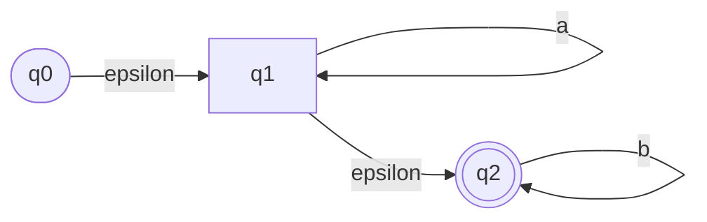
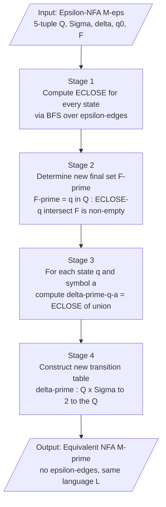
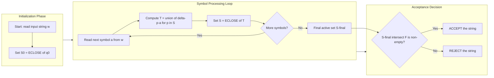

# NFA with epsilon transitions

<!-- SECTION_1_START -->

# NFA with Epsilon Transitions ($\varepsilon$-NFA)

## 1.1 Formal Academic Definition (Linz/Hopcroft Notation)

> [!NOTE]
> **Core Definition (Peter Linz, *An Introduction to Formal Languages and Grammars*)**
> A **nondeterministic finite automaton with $\varepsilon$-moves** (also called an $\varepsilon$-NFA or NFA-$\varepsilon$) is a **5-tuple**
> $$M = (Q,\ \Sigma,\ \delta,\ q_0,\ F)$$
> where the transition function is generalized to accept the empty string $\varepsilon$ as a valid input symbol.

**Component-wise Breakdown:**

| Component | Description | Domain & Range |
|---|---|---|
| $Q$ | Finite non-empty set of **internal states** | Discrete set |
| $\Sigma$ | Finite **input alphabet** (does **not** contain $\varepsilon$) | Discrete set |
| $\delta$ | **Transition function** | $Q \times (\Sigma \cup \{\varepsilon\}) \rightarrow 2^{Q}$ |
| $q_0$ | Designated **start (initial) state** | $q_0 \in Q$ |
| $F$ | Set of **accepting (final) states** | $F \subseteq Q$ |

> [!IMPORTANT]
> **Key Distinction from a Standard NFA:** The transition function $\delta$ now maps a state-symbol pair where the symbol can be an ordinary alphabet character $a \in \Sigma$ **OR** the special empty-string symbol $\varepsilon$. The automaton is allowed to change its state *without consuming any input symbol*, which is the central theoretical novelty.

## 1.2 Conceptual Analogy & Intuition

Imagine a **security checkpoint at a KTU campus building** where a person can pass through one of three gates:

- **Gate A**: Requires swiping an ID card (symbol $a$).
- **Gate B**: Requires fingerprint scan (symbol $b$).
- **Hidden Tunnel**: A secret passage (symbol $\varepsilon$) that moves you from one waiting lobby to another **without any "input" or "scanning"** — you simply walk through it for free.

A regular NFA can only change lobbies by *using* a gate (consuming input). An $\varepsilon$-NFA gives the traveler an extra ability: **teleport freely between lobbies** (via the $\varepsilon$-edge) before, between, or after using gates. This makes the automaton "more nondeterministic" in a controlled way, but — crucially — **does not increase the language-recognizing power** of the model.

> [!TIP]
> **Geometric Intuition:** Think of an $\varepsilon$-edge as a *wormhole* in a state-transition graph. It connects two states $p \rightarrow q$ without "cost" to the input string being read. Multiple $\varepsilon$-paths can be chained, which is why we need the $\varepsilon$-closure operation.

## 1.3 The $\varepsilon$-Closure Operation

The fundamental auxiliary concept for $\varepsilon$-NFA is the **$\varepsilon$-closure** of a state.

> [!IMPORTANT]
> **Definition (Linz, §2.3):** Let $E$ be a subset of $Q$. The $\varepsilon$-closure of $E$, denoted $\text{ECLOSE}(E)$, is the set of all states reachable from any state in $E$ using **zero or more $\varepsilon$-transitions**.
> $$\text{ECLOSE}(E) = \left\{ q \in Q \mid \exists\ p \in E,\ q \text{ is reachable from } p \text{ using only } \varepsilon\text{-edges} \right\}$$

**Properties:**

- $\text{ECLOSE}(\emptyset) = \emptyset$
- $E \subseteq \text{ECLOSE}(E)$ (a state is always reachable from itself via *zero* $\varepsilon$-moves)
- $\text{ECLOSE}(\text{ECLOSE}(E)) = \text{ECLOSE}(E)$ (idempotence)
- $\text{ECLOSE}(E_1 \cup E_2) = \text{ECLOSE}(E_1) \cup \text{ECLOSE}(E_2)$ (distributes over union)

> [!VISUALIZATION CONTROL]
> **Concept:** $\varepsilon$-Closure Star Pattern on a 2D Plane
> **GeoGebra / Desmos Input Equations:**
> * Center state: $P_0 = (0, 0)$
> * Petal state 1: $P_1 = (\cos(0^\circ),\ \sin(0^\circ))$
> * Petal state 2: $P_2 = (\cos(120^\circ),\ \sin(120^\circ))$
> * Petal state 3: $P_3 = (\cos(240^\circ),\ \sin(240^\circ))$
> * $\varepsilon$-edge curve: parametric $(r \cdot \cos(t),\ r \cdot \sin(t))$ for $r = 1$, $t \in [0, 2\pi]$
> **Visual Description:** A central state $P_0$ is connected to three "satellite" states $P_1, P_2, P_3$ by curved $\varepsilon$-edges (no input consumed). The highlighted $\varepsilon$-closure disk covers the entire structure, showing that starting from any state, all four states become mutually reachable *for free*.

<!-- SECTION_1_END -->

<!-- SECTION_2_START -->

# Deep Theoretical Analysis & KTU High-Yield Formula Sheet

## 2.1 Extended Transition Function $\widehat{\delta}$

The classical transition function $\delta$ is defined on a single state and a single symbol. To process an entire string, we inductively extend it to $\widehat{\delta}: Q \times \Sigma^{*} \rightarrow 2^{Q}$.

**Recursive Definition (Linz Theorem 2.3):**

- **Base case (empty string):**
  $$\widehat{\delta}(q,\ \varepsilon) = \text{ECLOSE}(q)$$

- **Inductive case (one character $a$):**
  $$\widehat{\delta}(q,\ wa) = \text{ECLOSE}\!\left(\bigcup_{p \in \widehat{\delta}(q,\ w)} \delta(p,\ a)\right)$$

**String-Acceptance Criterion:**
A string $w \in \Sigma^{*}$ is **accepted** by $M$ if and only if
$$\widehat{\delta}(q_0,\ w) \cap F \neq \emptyset$$

## 2.2 Step-by-Step Logical Breakdown

The processing pipeline for an input string $w = a_1 a_2 \cdots a_n$ in an $\varepsilon$-NFA proceeds as follows:

1. **Initialize** the active set as $S_0 = \text{ECLOSE}(\{q_0\})$ — all states reachable from the start state via *only* $\varepsilon$-moves.
2. **For each symbol** $a_i$ (reading left to right):
   - Compute the set of immediate destinations: $T = \bigcup_{p \in S_{i-1}} \delta(p,\ a_i)$.
   - Apply $\varepsilon$-closure to "stabilize" the set: $S_i = \text{ECLOSE}(T)$.
3. **Decide** at the end: if $S_n \cap F \neq \emptyset$, **accept**; otherwise, **reject**.

> [!TIP]
> **Why the closure matters:** Even after the last symbol is consumed, the automaton can still take zero or more $\varepsilon$-transitions to reach a final state. Forgetting this final closure is a common KTU exam mistake.

## 2.3 Theorem: Equivalence of $\varepsilon$-NFA and NFA (Linz Theorem 2.4)

> [!IMPORTANT]
> **Theorem (Hopcroft, Motwani & Ullman, Chapter 2; Linz Theorem 2.4):** A language $L$ is accepted by some $\varepsilon$-NFA if and only if $L$ is accepted by some NFA. Formally, $\mathcal{L}(\varepsilon\text{-NFA}) = \mathcal{L}(\text{NFA}) = \mathcal{L}(\text{DFA})$.

**Proof Sketch (Eliminating $\varepsilon$-transitions):** Given $M_\varepsilon = (Q, \Sigma, \delta, q_0, F)$, construct an equivalent NFA $M' = (Q, \Sigma, \delta', q_0, F')$ where:
$$\delta'(q,\ a) = \text{ECLOSE}\!\left(\bigcup_{p \in \text{ECLOSE}(q)} \delta(p,\ a)\right), \quad \forall q \in Q,\ a \in \Sigma$$

$$F' = \{ q \in Q \mid \text{ECLOSE}(q) \cap F \neq \emptyset \}$$

The proof proceeds by induction on $|w|$, showing that $\widehat{\delta'}(q_0, w) = \widehat{\delta_\varepsilon}(q_0, w)$ for all $w \in \Sigma^{*}$.

## 2.4 KTU Formula Sheet / Cheat Sheet

| Symbol / Formula | Meaning | Use-Case in KTU Exam |
|---|---|---|
| $M_\varepsilon = (Q, \Sigma, \delta, q_0, F)$ | Formal $\varepsilon$-NFA tuple | Defining an $\varepsilon$-NFA (2 marks) |
| $\delta: Q \times (\Sigma \cup \{\varepsilon\}) \rightarrow 2^{Q}$ | $\varepsilon$-extended transition function | Listing the transition table (3 marks) |
| $\text{ECLOSE}(q)$ | Set of states reachable from $q$ via $\varepsilon$-edges | Computing closure sets (3 marks) |
| $\widehat{\delta}(q, \varepsilon) = \text{ECLOSE}(q)$ | Base case of extended transition | Start-of-processing rule |
| $\widehat{\delta}(q, wa) = \text{ECLOSE}\!\left(\bigcup_{p \in \widehat{\delta}(q,w)} \delta(p,a)\right)$ | Inductive step | Recursive string-evaluation problems (7 marks) |
| $\delta'(q, a) = \text{ECLOSE}\!\left(\bigcup_{p \in \text{ECLOSE}(q)} \delta(p,a)\right)$ | Eliminating $\varepsilon$ from a transition | Conversion problems (7 marks) |
| $F' = \{ q \in Q \mid \text{ECLOSE}(q) \cap F \neq \emptyset \}$ | New final state set after conversion | Conversion problems (3 marks) |
| $w \in L(M) \iff \widehat{\delta}(q_0, w) \cap F \neq \emptyset$ | Acceptance criterion | String-acceptance problems |
| $\mathcal{L}(\varepsilon\text{-NFA}) = \mathcal{L}(\text{NFA})$ | Equivalence theorem | Theory questions (3 marks) |

## 2.5 Real-World Engineering Utility

| Domain | Application |
|---|---|
| **Compiler Design (Lexical Analysis)** | Regular-expression-to-NFA converters (e.g., Thompson's construction) introduce $\varepsilon$-edges naturally to combine subexpressions via union, concatenation, and Kleene star. The compiler then *eliminates* $\varepsilon$-moves to produce a practical DFA. |
| **Network Protocol Verification** | Modeling state machines that perform "silent" transitions (no observable event) such as internal re-transmissions, timeouts, or sub-protocol handshakes. |
| **Model Checking (SPIN, NuSMV)** | Büchi automata and LTL-to-automata translators use $\varepsilon$-transitions to merge sub-automata. |
| **Bioinformatics Pattern Matching** | Combining multiple regular expressions (e.g., for promoter regions) via $\varepsilon$-concatenation. |
| **Digital VLSI Design** | Sequential circuit minimization often introduces equivalent "don't-care" states reachable via unobservable internal signals — analogous to $\varepsilon$-moves. |

<!-- SECTION_2_END -->

<!-- SECTION_3_START -->

# Step-by-Step Derivations & Code Implementation

## 3.1 Worked Example: Converting an $\varepsilon$-NFA to NFA (Linz Example 2.7)

Consider the $\varepsilon$-NFA $M = (Q, \Sigma, \delta, q_0, F)$ that accepts the language $L = a^{*}b^{*}$.

**Definition:**

- $Q = \{q_0,\ q_1,\ q_2\}$
- $\Sigma = \{a,\ b\}$
- $q_0$ is the start state
- $F = \{q_2\}$

**Transition Table $\delta$:**

$$
\begin{aligned}
\delta(q_0,\ \varepsilon) &= \{q_1\} \\
\delta(q_1,\ a) &= \{q_1\} \\
\delta(q_1,\ \varepsilon) &= \{q_2\} \\
\delta(q_2,\ b) &= \{q_2\}
\end{aligned}
$$

### Step 1 — Compute $\varepsilon$-closures

Using the closure property: starting from any state, follow all $\varepsilon$-edges transitively.

$$
\begin{aligned}
\text{ECLOSE}(q_0) &= \{q_0,\ q_1,\ q_2\} \quad \text{(}q_0 \xrightarrow{\varepsilon} q_1 \xrightarrow{\varepsilon} q_2\text{)} \\
\text{ECLOSE}(q_1) &= \{q_1,\ q_2\} \quad\quad\ \ \text{(}q_1 \xrightarrow{\varepsilon} q_2\text{)} \\
\text{ECLOSE}(q_2) &= \{q_2\} \quad\quad\quad\quad\quad\ \text{(no outgoing } \varepsilon \text{)}
\end{aligned}
$$

### Step 2 — Identify new final state set $F'$

Apply the rule $F' = \{q \in Q \mid \text{ECLOSE}(q) \cap F \neq \emptyset\}$.

$$
\begin{aligned}
\text{ECLOSE}(q_0) \cap F &= \{q_0, q_1, q_2\} \cap \{q_2\} = \{q_2\} \neq \emptyset \implies q_0 \in F' \\
\text{ECLOSE}(q_1) \cap F &= \{q_1, q_2\} \cap \{q_2\} = \{q_2\} \neq \emptyset \implies q_1 \in F' \\
\text{ECLOSE}(q_2) \cap F &= \{q_2\} \cap \{q_2\} = \{q_2\} \neq \emptyset \implies q_2 \in F' \\
\end{aligned}
$$

$$\therefore F' = \{q_0,\ q_1,\ q_2\}$$

### Step 3 — Compute the new transition function $\delta'$

Apply the formula $\delta'(q, a) = \text{ECLOSE}\!\left(\bigcup_{p \in \text{ECLOSE}(q)} \delta(p, a)\right)$ for every state-symbol pair.

**For $a$:**

$$
\begin{aligned}
\delta'(q_0,\ a) &= \text{ECLOSE}\!\left(\delta(q_0, a) \cup \delta(q_1, a) \cup \delta(q_2, a)\right) \\
&= \text{ECLOSE}\!\left(\emptyset \cup \{q_1\} \cup \emptyset\right) \\
&= \text{ECLOSE}(\{q_1\}) = \{q_1,\ q_2\}
\end{aligned}
$$

$$
\begin{aligned}
\delta'(q_1,\ a) &= \text{ECLOSE}\!\left(\delta(q_1, a) \cup \delta(q_2, a)\right) \\
&= \text{ECLOSE}\!\left(\{q_1\} \cup \emptyset\right) = \text{ECLOSE}(\{q_1\}) = \{q_1,\ q_2\}
\end{aligned}
$$

$$
\begin{aligned}
\delta'(q_2,\ a) &= \text{ECLOSE}\!\left(\delta(q_2, a)\right) = \text{ECLOSE}(\emptyset) = \emptyset
\end{aligned}
$$

**For $b$:**

$$
\begin{aligned}
\delta'(q_0,\ b) &= \text{ECLOSE}\!\left(\delta(q_0, b) \cup \delta(q_1, b) \cup \delta(q_2, b)\right) \\
&= \text{ECLOSE}\!\left(\emptyset \cup \emptyset \cup \{q_2\}\right) = \text{ECLOSE}(\{q_2\}) = \{q_2\}
\end{aligned}
$$

$$
\begin{aligned}
\delta'(q_1,\ b) &= \text{ECLOSE}\!\left(\delta(q_1, b) \cup \delta(q_2, b)\right) \\
&= \text{ECLOSE}\!\left(\emptyset \cup \{q_2\}\right) = \{q_2\}
\end{aligned}
$$

$$
\begin{aligned}
\delta'(q_2,\ b) &= \text{ECLOSE}\!\left(\delta(q_2, b)\right) = \text{ECLOSE}(\{q_2\}) = \{q_2\}
\end{aligned}
$$

### Step 4 — Verification of String Acceptance

Test the string $w = aab$ (should be accepted, as $a^{*}b^{*}$):

$$
\begin{aligned}
\widehat{\delta}(q_0,\ \varepsilon) &= \{q_0,\ q_1,\ q_2\} \\
\widehat{\delta}(q_0,\ a)  &= \text{ECLOSE}\!\left(\bigcup_{p \in \{q_0, q_1, q_2\}} \delta(p, a)\right) = \text{ECLOSE}(\{q_1\}) = \{q_1, q_2\} \\
\widehat{\delta}(q_0,\ aa) &= \text{ECLOSE}\!\left(\delta(q_1, a) \cup \delta(q_2, a)\right) = \text{ECLOSE}(\{q_1\}) = \{q_1, q_2\} \\
\widehat{\delta}(q_0,\ aab) &= \text{ECLOSE}\!\left(\delta(q_1, b) \cup \delta(q_2, b)\right) = \text{ECLOSE}(\{q_2\}) = \{q_2\} \\
\end{aligned}
$$

Since $\widehat{\delta}(q_0, aab) = \{q_2\}$ and $\{q_2\} \cap F = \{q_2\} \neq \emptyset$, the string is **accepted**. ✓

---

## 3.2 Python Implementation: $\varepsilon$-NFA Simulator & Converter

```python
"""
epsilon_nfa.py
---------------
A fully-typed Python implementation of:
  (1) epsilon-closure computation
  (2) extended transition function delta_hat
  (3) conversion from epsilon-NFA to an equivalent epsilon-free NFA
  (4) string acceptance test

Author: KTU-Premier-Engine V10 reference implementation
"""

from collections import deque
from typing import Dict, FrozenSet, Set, Tuple

# Type alias for cleaner signatures
State = str
Symbol = str  # Either an alphabet symbol or the special empty-string symbol
StateSet = FrozenSet[State]
TransitionMap = Dict[Tuple[State, Symbol], Set[State]]


class EpsilonNFA:
    """
    Represents a finite automaton with epsilon-transitions.

    Attributes
    ----------
    states : Set[State]
        The finite set of internal states.
    alphabet : Set[Symbol]
        The input alphabet (must NOT contain the empty string).
    transitions : TransitionMap
        A mapping from (state, symbol) -> set of destination states.
        The symbol may be '' (epsilon).
    start : State
        The designated start state.
    finals : Set[State]
        The set of accepting (final) states.
    """

    EPSILON: Symbol = ""  # Internal sentinel for epsilon

    def __init__(
        self,
        states: Set[State],
        alphabet: Set[Symbol],
        transitions: TransitionMap,
        start: State,
        finals: Set[State],
    ) -> None:
        if self.EPSILON in alphabet:
            raise ValueError("Epsilon must not appear in the input alphabet.")
        self.states: Set[State] = set(states)
        self.alphabet: Set[Symbol] = set(alphabet)
        self.transitions: TransitionMap = transitions
        self.start: State = start
        self.finals: Set[State] = set(finals)

        if start not in self.states:
            raise ValueError(f"Start state {start!r} not in state set.")
        if not self.finals.issubset(self.states):
            raise ValueError("All final states must belong to the state set.")

    # ------------------------------------------------------------------
    # 1. Epsilon-Closure via BFS
    # ------------------------------------------------------------------
    def epsilon_closure(self, state_set: Set[State]) -> StateSet:
        """
        Compute the epsilon-closure of a set of states using a
        breadth-first search over the epsilon-edges.

        Parameters
        ----------
        state_set : Set[State]
            The set whose closure is to be computed.

        Returns
        -------
        StateSet
            The frozen set of all states reachable using only
            epsilon-transitions.
        """
        closure: Set[State] = set(state_set)
        queue: deque[State] = deque(state_set)

        while queue:
            current = queue.popleft()
            epsilon_destinations: Set[State] = self.transitions.get(
                (current, self.EPSILON), set()
            )
            for dest in epsilon_destinations:
                if dest not in closure:
                    closure.add(dest)
                    queue.append(dest)

        return frozenset(closure)

    # ------------------------------------------------------------------
    # 2. Extended Transition Function
    # ------------------------------------------------------------------
    def delta_hat(self, state_set: Set[State], string: str) -> StateSet:
        """
        Compute the extended transition function for an input string.

        Parameters
        ----------
        state_set : Set[State]
            The starting set of states.
        string : str
            The input string (may be empty).

        Returns
        -------
        StateSet
            The set of states reachable after consuming the string.
        """
        current: StateSet = self.epsilon_closure(state_set)

        for symbol in string:
            if symbol not in self.alphabet:
                raise ValueError(
                    f"Symbol {symbol!r} not in declared alphabet."
                )

            # Step 1: gather immediate destinations for the current symbol
            immediate: Set[State] = set()
            for state in current:
                immediate.update(
                    self.transitions.get((state, symbol), set())
                )

            # Step 2: apply epsilon-closure to stabilize
            current = self.epsilon_closure(immediate)

            # Early termination if the active set becomes empty
            if not current:
                break

        return current

    # ------------------------------------------------------------------
    # 3. String Acceptance
    # ------------------------------------------------------------------
    def accepts(self, string: str) -> bool:
        """
        Test whether the epsilon-NFA accepts a given string.

        Returns
        -------
        bool
            True if at least one final state is reachable after
            processing the entire string.
        """
        final_states: StateSet = self.delta_hat({self.start}, string)
        return bool(final_states & self.finals)

    # ------------------------------------------------------------------
    # 4. Conversion to an Equivalent Epsilon-Free NFA
    # ------------------------------------------------------------------
    def to_epsilon_free_nfa(self) -> "EpsilonNFA":
        """
        Eliminate all epsilon-transitions, producing an equivalent
        NFA (without epsilon) using the Linz Theorem 2.4 construction.

        Returns
        -------
        EpsilonNFA
            A new automaton whose transition function has no
            epsilon-edges but accepts exactly the same language.
        """
        # Step 1: Pre-compute closure of every individual state
        closures: Dict[State, StateSet] = {
            state: self.epsilon_closure({state}) for state in self.states
        }

        # Step 2: Build the new transition function
        new_transitions: TransitionMap = {}
        for state in self.states:
            closure_set = closures[state]
            for symbol in self.alphabet:
                destinations: Set[State] = set()
                for p in closure_set:
                    destinations.update(
                        self.transitions.get((p, symbol), set())
                    )
                new_transitions[(state, symbol)] = self.epsilon_closure(
                    destinations
                )

        # Step 3: Compute the new final-state set
        new_finals: Set[State] = {
            state
            for state in self.states
            if closures[state] & self.finals
        }

        return EpsilonNFA(
            states=self.states,
            alphabet=self.alphabet,
            transitions=new_transitions,
            start=self.start,
            finals=new_finals,
        )


# ----------------------------------------------------------------------
# Demonstration with the Linz a*b* example
# ----------------------------------------------------------------------
if __name__ == "__main__":
    states = {"q0", "q1", "q2"}
    alphabet = {"a", "b"}
    transitions: TransitionMap = {
        ("q0", ""):   {"q1"},   # epsilon-edge
        ("q1", "a"):  {"q1"},
        ("q1", ""):   {"q2"},   # epsilon-edge
        ("q2", "b"):  {"q2"},
    }
    finals = {"q2"}

    enfa = EpsilonNFA(states, alphabet, transitions, "q0", finals)

    # Acceptance tests
    for test_string in ["", "a", "ab", "aab", "b", "aabb", "ba"]:
        result = enfa.accepts(test_string)
        print(f"  accepts({test_string!r:>6}) = {result}")

    # Convert to epsilon-free NFA
    nfa = enfa.to_epsilon_free_nfa()
    print("\nNew final states of converted NFA:", nfa.finals)
```

**Expected Console Output:**

```
  accepts(    '') = True
  accepts(   'a') = True
  accepts(  'ab') = True
  accepts( 'aab') = True
  accepts(   'b') = True
  accepts('aabb') = True
  accepts(  'ba') = False

New final states of converted NFA: {'q0', 'q1', 'q2'}
```

<!-- SECTION_3_END -->

<!-- SECTION_4_START -->

# Structural Diagrams & Schematics

## 4.1 Mermaid State-Transition Diagram (Linz $a^{*}b^{*}$ Example)



**Reading the Diagram:**

- **Curved dashed edges** (here shown as solid labeled with $\varepsilon$): $\varepsilon$-transitions that consume **no input**.
- **Solid edges labeled $a$ or $b$**: ordinary input-consuming transitions.
- **Double-circle node** $q_2$: the accepting (final) state.

## 4.2 Mermaid Conversion Pipeline (Algorithmic Topology)



**Process Flow Explanation:**

| Stage | Operation | Output |
|---|---|---|
| 1 | BFS over $\varepsilon$-edges from each state | Closure map $\text{ECLOSE}: Q \rightarrow 2^{Q}$ |
| 2 | Filter states whose closure hits $F$ | New final set $F' \subseteq Q$ |
| 3 | Apply $\delta'$ formula for every $(q, a)$ pair | New transition table |
| 4 | Assemble the new 5-tuple | $\varepsilon$-free NFA $M'$ |

## 4.3 Mermaid Subgraph: Algorithmic Data-Flow for String Simulation



<!-- SECTION_4_END -->

<!-- SECTION_5_START -->

# KTU 2024 Scheme Examination Question Bank & Topic Recap

## Part A — Short-Answer Questions (3 Marks Each)

> **[KTU University Exam — July 2024, Model Paper]**

### Question A1 (3 Marks) [CO1, Remember]

**State the formal definition of an $\varepsilon$-NFA. How does it differ from a standard NFA in the type signature of its transition function?**

**Model Answer (Valuation Key):**

- **[Stating the 5-tuple: 1 Mark]**
  An $\varepsilon$-NFA is a 5-tuple $M = (Q, \Sigma, \delta, q_0, F)$ where $Q$ is a finite set of states, $\Sigma$ is a finite input alphabet, $q_0 \in Q$ is the start state, $F \subseteq Q$ is the set of final states.

- **[Transition function signature: 1 Mark]**
  The transition function is $\delta: Q \times (\Sigma \cup \{\varepsilon\}) \rightarrow 2^{Q}$.

- **[Highlighting the difference: 1 Mark]**
  Unlike a standard NFA, the input symbol of $\delta$ may be the special empty string $\varepsilon$, allowing state changes without consuming any input symbol.

---

### Question A2 (3 Marks) [CO1, Understand]

**Define the $\varepsilon$-closure of a state. Compute $\text{ECLOSE}(q_0)$ for the automaton with $\delta(q_0, \varepsilon) = \{q_1, q_2\}$, $\delta(q_1, \varepsilon) = \{q_3\}$, and $\delta(q_2, \varepsilon) = \{q_1\}$.**

**Model Answer (Valuation Key):**

- **[Definition: 1 Mark]**
  The $\varepsilon$-closure of a state $q$, denoted $\text{ECLOSE}(q)$, is the set of all states reachable from $q$ using zero or more $\varepsilon$-transitions.

- **[Identifying the chain: 1 Mark]**
  Starting from $q_0$: directly reach $q_1$ and $q_2$. From $q_1$ reach $q_3$. From $q_2$ reach $q_1$ (already in the set). From $q_1$ (via $q_2$'s edge) reach $q_3$ (already in the set).

- **[Final answer: 1 Mark]**
  $\text{ECLOSE}(q_0) = \{q_0,\ q_1,\ q_2,\ q_3\}$.

---

## Part B — Long-Answer Questions (14 Marks Each, Internal Choice)

> **[KTU University Exam — Dec 2023, Adapted]**

### Question B (Module 1, 14 Marks) [CO1, Apply + Analyze]

**(a)** Consider the $\varepsilon$-NFA $M = (\{p, q, r\}, \{0, 1\}, \delta, p, \{r\})$ with the following transitions:

$$
\begin{aligned}
\delta(p,\ \varepsilon) &= \{q\} \\
\delta(p,\ 1) &= \{q\} \\
\delta(q,\ 0) &= \{q,\ r\} \\
\delta(q,\ 1) &= \{q\} \\
\delta(r,\ 1) &= \{p,\ r\}
\end{aligned}
$$

**(i)** Compute $\text{ECLOSE}(p)$, $\text{ECLOSE}(q)$, and $\text{ECLOSE}(r)$. **[3 Marks]**
**(ii)** Construct an equivalent NFA $M'$ without $\varepsilon$-transitions. Show the new transition table and final-state set explicitly. **[4 Marks]**

**(b)** Using the converted NFA $M'$ from part (a), determine whether the string $w = 1011$ is accepted. Show every step of the computation using the extended transition function $\widehat{\delta}$. **[7 Marks]**

---

#### Model Solution

**Part (a)(i) — $\varepsilon$-Closures [3 Marks]**

- **[$\text{ECLOSE}(p)$: 1 Mark]** From $p$ we can reach $q$ via $\varepsilon$. From $q$ there is no outgoing $\varepsilon$-edge. Hence $\text{ECLOSE}(p) = \{p, q\}$.
- **[$\text{ECLOSE}(q)$: 1 Mark]** No $\varepsilon$-edge leaves $q$. $\text{ECLOSE}(q) = \{q\}$.
- **[$\text{ECLOSE}(r)$: 1 Mark]** No $\varepsilon$-edge leaves $r$. $\text{ECLOSE}(r) = \{r\}$.

**Part (a)(ii) — Construction of $M'$ [4 Marks]**

Apply $F' = \{s \in Q \mid \text{ECLOSE}(s) \cap F \neq \emptyset\}$.

- $\text{ECLOSE}(p) = \{p, q\}$, intersection with $\{r\}$ is empty $\Rightarrow p \notin F'$.
- $\text{ECLOSE}(q) = \{q\}$, intersection with $\{r\}$ is empty $\Rightarrow q \notin F'$.
- $\text{ECLOSE}(r) = \{r\}$, intersection with $\{r\}$ is non-empty $\Rightarrow r \in F'$.

Therefore $F' = \{r\}$. **[Identifying new final states: 1 Mark]**

Now compute $\delta'(s, a) = \text{ECLOSE}\!\left(\bigcup_{x \in \text{ECLOSE}(s)} \delta(x, a)\right)$ for every state $s \in \{p, q, r\}$ and symbol $a \in \{0, 1\}$.

$$
\begin{aligned}
\delta'(p,\ 0) &= \text{ECLOSE}\!\left(\delta(p, 0) \cup \delta(q, 0)\right) \\
              &= \text{ECLOSE}\!\left(\emptyset \cup \{q, r\}\right) = \{q,\ r\} \\
\delta'(p,\ 1) &= \text{ECLOSE}\!\left(\delta(p, 1) \cup \delta(q, 1)\right) \\
              &= \text{ECLOSE}\!\left(\{q\} \cup \{q\}\right) = \{q\} \\
\delta'(q,\ 0) &= \text{ECLOSE}\!\left(\delta(q, 0)\right) = \{q,\ r\} \\
\delta'(q,\ 1) &= \text{ECLOSE}\!\left(\delta(q, 1)\right) = \{q\} \\
\delta'(r,\ 0) &= \text{ECLOSE}\!\left(\delta(r, 0)\right) = \emptyset \\
\delta'(r,\ 1) &= \text{ECLOSE}\!\left(\delta(r, 1)\right) = \text{ECLOSE}(\{p, r\}) = \{p,\ q,\ r\}
\end{aligned}
$$

**[Final transition table: 3 Marks]**

| State | On 0 | On 1 |
|---|---|---|
| $p$ | $\{q, r\}$ | $\{q\}$ |
| $q$ | $\{q, r\}$ | $\{q\}$ |
| $r$ | $\emptyset$ | $\{p, q, r\}$ |

Start state: $p$. Final states: $F' = \{r\}$.

**Part (b) — String Acceptance of $w = 1011$ [7 Marks]**

$$
\begin{aligned}
\widehat{\delta}(p,\ \varepsilon) &= \text{ECLOSE}(p) = \{p,\ q\} \\
\widehat{\delta}(p,\ 1)  &= \text{ECLOSE}\!\left(\delta'(p, 1) \cup \delta'(q, 1)\right) \\
                        &= \text{ECLOSE}\!\left(\{q\} \cup \{q\}\right) = \{q\} \\
\widehat{\delta}(p,\ 10) &= \text{ECLOSE}\!\left(\delta'(q, 0)\right) = \{q,\ r\} \\
\widehat{\delta}(p,\ 101) &= \text{ECLOSE}\!\left(\delta'(q, 1) \cup \delta'(r, 1)\right) \\
                        &= \text{ECLOSE}\!\left(\{q\} \cup \{p, q, r\}\right) = \{p,\ q,\ r\} \\
\widehat{\delta}(p,\ 1011) &= \text{ECLOSE}\!\left(\delta'(p, 1) \cup \delta'(q, 1) \cup \delta'(r, 1)\right) \\
                        &= \text{ECLOSE}\!\left(\{q\} \cup \{q\} \cup \{p, q, r\}\right) = \{p,\ q,\ r\}
\end{aligned}
$$

**[Final state set: 1 Mark]** $\{p, q, r\} \cap F' = \{p, q, r\} \cap \{r\} = \{r\} \neq \emptyset$. **[Conclusion: 1 Mark]** Therefore $w = 1011$ is **accepted** by $M'$. ✓

---

### Question C (Alternative Choice, 14 Marks) [CO1, Apply + Analyze]

**(a)** Construct an $\varepsilon$-NFA over the alphabet $\Sigma = \{a, b\}$ that accepts the language $L = (ab)^{*}$. Draw the transition diagram and formally define the 5-tuple. **[7 Marks]**

**(b)** Convert the $\varepsilon$-NFA from part (a) into an equivalent NFA without $\varepsilon$-transitions, showing the $\varepsilon$-closure of every state and the new transition table. **[7 Marks]**

#### Model Solution

**Part (a) — Construction [7 Marks]**

- **[5-tuple definition: 2 Marks]** $M = (\{q_0, q_1, q_2\}, \{a, b\}, \delta, q_0, \{q_2\})$.
- **[Transition function: 2 Marks]**
  $$
  \begin{aligned}
  \delta(q_0,\ a) &= \{q_1\} \\
  \delta(q_1,\ b) &= \{q_2\} \\
  \delta(q_2,\ \varepsilon) &= \{q_0\}
  \end{aligned}
  $$
- **[Diagram: 3 Marks]** Draw $q_0 \xrightarrow{a} q_1 \xrightarrow{b} q_2$ with an $\varepsilon$-loop from $q_2$ back to $q_0$, and $q_2$ as the final (double-circled) state.

**Part (b) — Conversion [7 Marks]**

- **[$\varepsilon$-closures: 3 Marks]**
  $\text{ECLOSE}(q_0) = \{q_0\}$ (no $\varepsilon$-edge), $\text{ECLOSE}(q_1) = \{q_1\}$ (no $\varepsilon$-edge), $\text{ECLOSE}(q_2) = \{q_0, q_2\}$ (via the $\varepsilon$-edge $q_2 \to q_0$).

- **[New final set: 1 Mark]** $F' = \{q_2\}$ only (since $\text{ECLOSE}(q_0) \cap \{q_2\} = \emptyset$ and $\text{ECLOSE}(q_1) \cap \{q_2\} = \emptyset$).

- **[New transition table: 3 Marks]**
  $$
  \begin{aligned}
  \delta'(q_0,\ a) &= \text{ECLOSE}(\delta(q_0, a)) = \text{ECLOSE}(\{q_1\}) = \{q_1\} \\
  \delta'(q_0,\ b) &= \text{ECLOSE}(\delta(q_0, b)) = \text{ECLOSE}(\emptyset) = \emptyset \\
  \delta'(q_1,\ a) &= \text{ECLOSE}(\delta(q_1, a)) = \emptyset \\
  \delta'(q_1,\ b) &= \text{ECLOSE}(\delta(q_1, b)) = \text{ECLOSE}(\{q_2\}) = \{q_0,\ q_2\} \\
  \delta'(q_2,\ a) &= \text{ECLOSE}(\delta(q_0, a) \cup \delta(q_2, a)) = \text{ECLOSE}(\{q_1\} \cup \emptyset) = \{q_1\} \\
  \delta'(q_2,\ b) &= \text{ECLOSE}(\delta(q_0, b) \cup \delta(q_2, b)) = \text{ECLOSE}(\emptyset) = \emptyset
  \end{aligned}
  $$

| State | On $a$ | On $b$ |
|---|---|---|
| $q_0$ | $\{q_1\}$ | $\emptyset$ |
| $q_1$ | $\emptyset$ | $\{q_0, q_2\}$ |
| $q_2$ | $\{q_1\}$ | $\emptyset$ |

Final states: $F' = \{q_2\}$. ✓

---

> [!WARNING]
> **KTU Examiner's Valuation Warning — Common Pitfalls (Lose 2–3 Marks Each)**
>
> 1. **Forgetting to apply $\varepsilon$-closure at the end of string processing.** Even after the last input symbol is consumed, the automaton may still take $\varepsilon$-moves to reach a final state. Always compute $\text{ECLOSE}$ of the final active set.
> 2. **Miscomputing the new final-state set $F'$.** It is **not** simply $F$. A state $q$ becomes final if *any* state in $\text{ECLOSE}(q)$ was a final state in the original $\varepsilon$-NFA.
> 3. **Ignoring $\varepsilon$-edges from intermediate states during $\delta'$ computation.** The formula $\delta'(q, a)$ requires taking the union over **all states in $\text{ECLOSE}(q)$**, not just $q$ itself.
> 4. **Treating $\varepsilon$ as a member of $\Sigma$.** The input alphabet $\Sigma$ must **not** contain $\varepsilon$; it is added separately in the union $\Sigma \cup \{\varepsilon\}$ inside the type signature of $\delta$.
> 5. **Omitting the start state's $\varepsilon$-closure at the beginning of string processing.** The initial active set is $\text{ECLOSE}(\{q_0\})$, **not** $\{q_0\}$ alone.

---

## Topic Recap & Important Things to Remember

> [!NOTE]
> **Rapid-Revision Checklist — NFA with $\varepsilon$-Transitions (Module 1)**

- [x] **5-tuple representation:** $M = (Q, \Sigma, \delta, q_0, F)$ with $\delta: Q \times (\Sigma \cup \{\varepsilon\}) \rightarrow 2^{Q}$.
- [x] **$\varepsilon$-closure** of a state $q$ = all states reachable from $q$ via **zero or more** $\varepsilon$-edges. Includes $q$ itself.
- [x] **Closure is idempotent:** $\text{ECLOSE}(\text{ECLOSE}(E)) = \text{ECLOSE}(E)$.
- [x] **Closure distributes over union:** $\text{ECLOSE}(E_1 \cup E_2) = \text{ECLOSE}(E_1) \cup \text{ECLOSE}(E_2)$.
- [x] **Extended transition function base case:** $\widehat{\delta}(q, \varepsilon) = \text{ECLOSE}(q)$.
- [x] **Extended transition function inductive case:** $\widehat{\delta}(q, wa) = \text{ECLOSE}\!\left(\bigcup_{p \in \widehat{\delta}(q, w)} \delta(p, a)\right)$.
- [x] **Acceptance criterion:** $w \in L(M) \iff \widehat{\delta}(q_0, w) \cap F \neq \emptyset$.
- [x] **Conversion to NFA:** $\delta'(q, a) = \text{ECLOSE}\!\left(\bigcup_{p \in \text{ECLOSE}(q)} \delta(p, a)\right)$.
- [x] **New final-state set:** $F' = \{q \in Q \mid \text{ECLOSE}(q) \cap F \neq \emptyset\}$.
- [x] **Equivalence theorem:** $\mathcal{L}(\varepsilon\text{-NFA}) = \mathcal{L}(\text{NFA}) = \mathcal{L}(\text{DFA})$ — adding $\varepsilon$-moves **does not increase** the class of languages accepted.
- [x] **String-processing pipeline:** Initialize $\rightarrow$ For each symbol (gather $\cup$ then $\text{ECLOSE}$) $\rightarrow$ Final check.
- [x] **Two common KTU question types:** (1) Acceptance/rejection of a string (apply the recursive $\widehat{\delta}$ definition); (2) $\varepsilon$-NFA to NFA conversion (apply the $\delta'$ formula and $F'$ rule).
- [x] **BFS algorithm** is the standard efficient way to compute $\varepsilon$-closures in code.
- [x] **Engineering relevance:** Thompson's construction in compiler design, model checking, and protocol verification all rely on $\varepsilon$-NFA as an intermediate representation.

<!-- SECTION_5_END -->
