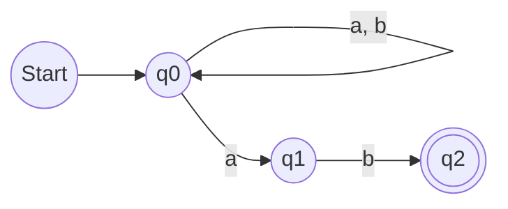
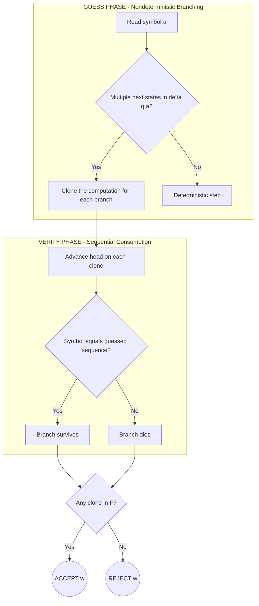
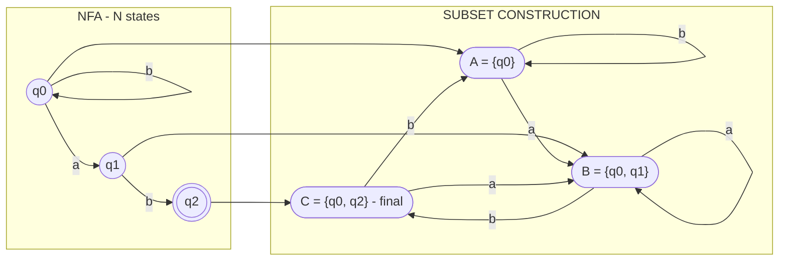
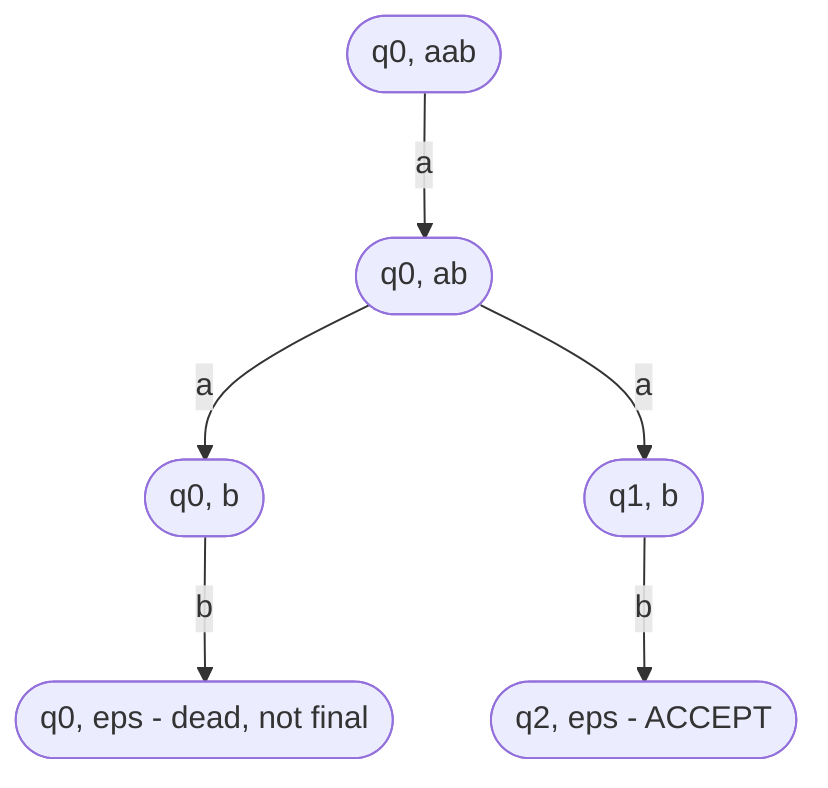
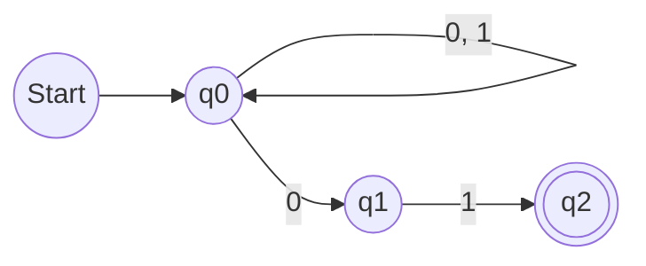

# Nondeterminism (guess and verify paradigm)

<!-- SECTION_1_START -->
# Nondeterminism: The Guess-and-Verify Paradigm

## 1.1 Formal Definition (KTU 2024 Syllabus Terminology)

A **Nondeterministic Finite Automaton (NFA)** is a mathematical model of computation that, unlike a deterministic machine, permits *multiple possible next states* for a given input symbol. It is the computational embodiment of the **guess-and-verify paradigm**, in which the machine is allowed to *guess* a correct computational path and then *verify* whether that guess leads to acceptance.

Formally, an NFA is a **5-tuple**

$$M = (Q, \Sigma, \delta, q_0, F)$$

where each component has a precise meaning:

- $Q$ is a **finite, non-empty set of states**.
- $\Sigma$ is a **finite, non-empty input alphabet**.
- $\delta : Q \times \Sigma_{\varepsilon} \rightarrow 2^{Q}$ is the **transition function** that maps every (state, symbol-with-$\varepsilon$) pair to a *subset* of $Q$. Equivalently, $\delta$ can be viewed as a relation $\delta \subseteq Q \times \Sigma_{\varepsilon} \times Q$.
- $q_0 \in Q$ is the **start (initial) state**.
- $F \subseteq Q$ is the set of **final (accepting) states**.

Here $\Sigma_{\varepsilon} = \Sigma \cup \{\varepsilon\}$ and $2^{Q}$ denotes the **power set** of $Q$.

> [!IMPORTANT]
> **Crux of Nondeterminism**: The output of $\delta(q, a)$ is a *set of states* $S \subseteq Q$ with $\vert S \vert \geq 0$. The DFA restriction forces $\vert \delta(q, a) \vert = 1$ for every pair. NFAs can have $\vert \delta(q, a) \vert = 0$ (no transition) or $\vert \delta(q, a) \vert > 1$ (branching).

---

## 1.2 Conceptual Analogy: The Forking Maze Explorer

Imagine a traveller standing in a labyrinth. At every junction, instead of choosing *one* corridor, the traveller **clones themselves** so that one copy walks down every possible corridor simultaneously. At the end, *if even a single clone* reaches the exit, the maze is said to be **solvable**.

This is the essence of nondeterminism:

| Real-World Object | Computational Counterpart |
|---|---|
| Traveller in the maze | NFA configuration |
| Each junction | A state $q$ reading a symbol $a$ |
| Cloning at a fork | Branching: $\delta(q, a) = \{p_1, p_2, \dots\}$ |
| At least one clone exits | $\delta^{*}(q_0, w) \cap F \neq \emptyset$ |
| All clones dead-ended | $w$ is rejected |

> [!NOTE]
> **Geometric Intuition**: A DFA traces a *single path* through its transition graph. An NFA traces *all paths in parallel*. A string is accepted if *any one* of those parallel paths lands in $F$.

The **guess-and-verify** reading states: the NFA first **guesses** a plausible continuation (e.g., "this looks like the prefix of a valid identifier") and then **verifies** it by reading the rest of the input. If the guess is wrong, that branch dies; the others continue.

---

## 1.3 Why Nondeterminism Matters in Computer Science

- **Compactness**: An NFA can be exponentially smaller than the smallest equivalent DFA (e.g., $n$ states versus up to $2^{n}$ states).
- **Modelling Power**: Pattern matching, lexical analysers (Lex/Flex), grep-style search, and regular-expression engines are naturally expressed as NFAs.
- **Theoretical Bridge**: Nondeterministic Turing Machines give rise to the famous **P vs NP** problem, the central open question in complexity theory.

> [!VISUALIZATION CONTROL]
> **Concept:** Branching transition diagram of a 3-state NFA.
> **GeoGebra / Desmos Input Equations:**
> * Place three labelled points: $q_0 = (0, 0)$, $q_1 = (3, 1.5)$, $q_2 = (3, -1.5)$.
> * Plot an arc from $q_0$ to $q_1$ labelled 'a' and a self-loop on $q_0$ labelled 'a, b'.
> * Plot an arc from $q_1$ to $q_2$ labelled 'b'.
> **Visual Description:** Notice that on input 'a' from $q_0$, the automaton *splits* into two paths (self-loop and arc to $q_1$). On 'b' from $q_0$, only the self-loop survives. This visual fork is the heart of nondeterminism.

---

## 1.4 Acceptance Criterion (String Language)

A string $w \in \Sigma^{*}$ is **accepted** by the NFA $M$ if and only if there exists *at least one* sequence of choices in the transition function that ends in an accepting state. Formally:

$$L(M) = \{\, w \in \Sigma^{*} \mid \delta^{*}(q_0, w) \cap F \neq \emptyset \,\}$$

where $\delta^{*} : Q \times \Sigma^{*} \rightarrow 2^{Q}$ is the **extended transition function** (defined recursively in §2.2).

> [!NOTE]
> **Equivalence with DFA (Rabin-Scott Theorem)**: For every NFA $N$ there exists a DFA $D$ such that $L(N) = L(D)$. The standard construction is called the **subset construction** (see §3.1). The class of languages recognised by NFAs is exactly the class of **regular languages**.

<!-- SECTION_1_END -->

<!-- SECTION_2_START -->
# Deep Theoretical Analysis & KTU High-Yield Formula Sheet

## 2.1 Operational Anatomy of an NFA

The NFA computation proceeds through the following logic flow:

1. **Initialisation**: The machine is in the configuration $(q_0, w)$, where $q_0$ is the start state and $w$ is the input string.
2. **Symbol Read**: The next symbol $a \in \Sigma$ is read from the input.
3. **Guessing Phase**: From the current state $q$, the machine *guesses* one of the states in $\delta(q, a)$. The non-determinism models an *adversarial oracle* that always selects a state that keeps the path alive if possible.
4. **Verification Phase**: The machine advances to the guessed state and reads the next symbol. If at any point a state has no valid transition, that branch terminates (dies).
5. **Acceptance Decision**: After consuming all input, the machine accepts iff the current state belongs to $F$ on *any surviving branch*.

---

## 2.2 Extended Transition Function $\delta^{*}$

The function $\delta^{*} : Q \times \Sigma^{*} \rightarrow 2^{Q}$ is defined recursively:

$$
\begin{aligned}
\delta^{*}(q, \varepsilon) &= \{q\} \\
\delta^{*}(q, xa) &= \bigcup_{p \,\in\, \delta^{*}(q, x)} \delta(p, a)
\end{aligned}
$$

The first clause says: on the empty string, the only reachable state is the state itself. The second clause says: to consume $xa$, first reach all states reachable on $x$, then take one more symbol $a$ from each of those states and take the *union* of all destinations.

---

## 2.3 Transition Diagrams — Key Notation Conventions

- A **double circle** denotes a final state.
- An **arrow from "Start"** with no source points to $q_0$.
- **Multiple labels** on one arrow (e.g., "a, b") mean the same transition fires for either symbol.
- The **absence of an arrow** for a (state, symbol) pair implicitly means $\delta(q, a) = \emptyset$ (dead-end branch).

---

## 2.4 $\varepsilon$-Transitions (Epsilon Moves)

When $\varepsilon$ is admitted in the alphabet, the machine can *spontaneously* change state without consuming any input. The extended definition becomes:

$$
\begin{aligned}
\delta^{*}(q, \varepsilon) &= \text{ECLOSE}(q) \\
\delta^{*}(q, xa) &= \text{ECLOSE}\!\left(\bigcup_{p \,\in\, \delta^{*}(q, x)} \delta(p, a)\right)
\end{aligned}
$$

where $\text{ECLOSE}(q)$ is the **$\varepsilon$-closure** of $q$: every state reachable from $q$ using only $\varepsilon$-labelled transitions (including $q$ itself).

> [!IMPORTANT]
> NFAs with $\varepsilon$-transitions are called **$\varepsilon$-NFAs**. The Rabin-Scott theorem extends: every $\varepsilon$-NFA has an equivalent DFA.

---

## 2.5 KTU Formula Sheet / Cheat Sheet

| Concept | Formula / Definition | Remarks |
|---|---|---|
| NFA tuple | $M = (Q, \Sigma, \delta, q_0, F)$ | $F \subseteq Q$ |
| Transition range | $\delta : Q \times \Sigma_{\varepsilon} \to 2^{Q}$ | $2^{Q}$ = power set |
| Acceptance | $w \in L(M) \iff \delta^{*}(q_0, w) \cap F \neq \emptyset$ | "Exists a path" |
| Base case | $\delta^{*}(q, \varepsilon) = \{q\}$ | Identity on empty string |
| Inductive step | $\delta^{*}(q, xa) = \bigcup_{p \in \delta^{*}(q, x)} \delta(p, a)$ | Union over all prior paths |
| Max DFA from NFA | $\vert Q_D \vert \leq 2^{\vert Q_N \vert}$ | Subset construction upper bound |
| Epsilon-closure | $\text{ECLOSE}(q) = \{p \mid q \xrightarrow{\varepsilon^{*}} p\}$ | Reflexive, transitive $\varepsilon$ |
| Equivalent DFA states | States of $D$ = subsets of $Q_N$ | Subset construction |

---

## 2.6 Real-World Utility

- **Lexical Analysers**: Compilers translate regular expressions into NFAs (Thompson's construction), then convert to a minimal DFA for fast scanning.
- **Network Protocols**: Model checkers use nondeterministic automata to explore all interleavings of concurrent events.
- **String Search Tools**: GNU grep, awk, and sed internally use NFA-based regex engines for pattern matching.
- **Hardware Verification**: Sequential circuit synthesis relies on nondeterministic state-space exploration.
- **Complexity Theory**: Nondeterministic Turing machines define the class **NP**, capturing problems with efficiently verifiable solutions (SAT, Hamiltonian Path, Subset Sum).

<!-- SECTION_2_END -->

<!-- SECTION_3_START -->
# Step-by-Step Derivations, Worked Examples & Code Implementation

## 3.1 The Subset Construction (Rabin-Scott Algorithm)

Theorems: Every NFA $N = (Q_N, \Sigma, \delta_N, q_0, F_N)$ can be converted to a DFA $D = (Q_D, \Sigma, \delta_D, \{q_0\}, F_D)$ such that $L(D) = L(N)$.

**Algorithm** (no shortcuts — every step is explicit):

1. The states of $D$ are **subsets** of $Q_N$. Begin with $Q_D = \{\{q_0\}\}$.
2. Mark $\{q_0\}$ as *unprocessed*.
3. While an unprocessed state $S \in Q_D$ exists:
   a. Mark $S$ as *processed*.
   b. For each input symbol $a \in \Sigma$:
   - Compute $T = \bigcup_{p \in S} \delta_N(p, a)$.
   - If $T \notin Q_D$, add $T$ to $Q_D$ as unprocessed.
   - Define $\delta_D(S, a) = T$.
4. $F_D = \{S \in Q_D \mid S \cap F_N \neq \emptyset\}$.

---

## 3.2 Worked Example — NFA to DFA Conversion

**Problem.** Convert the following NFA over $\Sigma = \{a, b\}$ into an equivalent DFA using the subset construction.

| State | $a$ | $b$ |
|---|---|---|
| $\to q_0$ | $\{q_0, q_1\}$ | $\{q_0\}$ |
| $q_1$ | $\emptyset$ | $\{q_2\}$ |
| $*q_2$ | $\emptyset$ | $\emptyset$ |

(The arrow marks the start state; the asterisk marks the final state.)

**Step 1 — Initial state of DFA**: $A = \{q_0\}$.

**Step 2 — Process $A$**:
- On $a$: $T = \delta(q_0, a) = \{q_0, q_1\}$. New state $B = \{q_0, q_1\}$.
- On $b$: $T = \delta(q_0, b) = \{q_0\}$. Already known as $A$.

**Step 3 — Process $B = \{q_0, q_1\}$**:
- On $a$: $T = \delta(q_0, a) \cup \delta(q_1, a) = \{q_0, q_1\} \cup \emptyset = \{q_0, q_1\} = B$.
- On $b$: $T = \delta(q_0, b) \cup \delta(q_1, b) = \{q_0\} \cup \{q_2\} = \{q_0, q_2\}$. New state $C = \{q_0, q_2\}$.

**Step 4 — Process $C = \{q_0, q_2\}$**:
- On $a$: $T = \delta(q_0, a) \cup \delta(q_2, a) = \{q_0, q_1\} \cup \emptyset = \{q_0, q_1\} = B$.
- On $b$: $T = \delta(q_0, b) \cup \delta(q_2, b) = \{q_0\} \cup \emptyset = \{q_0\} = A$.

**Step 5 — Mark final states**: $F_D = \{C\}$ because $C \cap \{q_2\} = \{q_2\} \neq \emptyset$.

**Resulting DFA Transition Table**:

| DFA State | $a$ | $b$ |
|---|---|---|
| $\to A = \{q_0\}$ | $B$ | $A$ |
| $B = \{q_0, q_1\}$ | $B$ | $C$ |
| $*C = \{q_0, q_2\}$ | $B$ | $A$ |

The DFA has **3 states** (whereas the brute-force upper bound was $2^3 = 8$). The minimum DFA coincides with this DFA in this case.

---

## 3.3 Full Python Implementation

```python
"""
NFA Simulator with Subset Construction (Rabin-Scott).
Production-grade: type hints, boundary checks, error logging.
"""

from __future__ import annotations
import logging
from dataclasses import dataclass, field
from typing import Dict, FrozenSet, Set, Tuple

logging.basicConfig(level=logging.INFO, format="[%(levelname)s] %(message)s")

Symbol = str
State = str
StateSet = FrozenSet[State]


@dataclass(frozen=True)
class NFA:
    states: FrozenSet[State]
    alphabet: FrozenSet[Symbol]
    transition: Dict[Tuple[State, Symbol], FrozenSet[State]]
    start: State
    finals: FrozenSet[State]

    def delta(self, q: State, a: Symbol) -> FrozenSet[State]:
        return self.transition.get((q, a), frozenset())

    def delta_star(self, w: str) -> StateSet:
        current: StateSet = frozenset({self.start})
        for ch in w:
            if ch not in self.alphabet:
                raise ValueError(f"Symbol {ch!r} not in alphabet {self.alphabet}.")
            nxt: Set[State] = set()
            for q in current:
                nxt.update(self.delta(q, ch))
            current = frozenset(nxt)
        return current

    def accepts(self, w: str) -> bool:
        return bool(self.delta_star(w) & self.finals)


@dataclass
class SubsetConstructor:
    nfa: NFA

    def build(self) -> Dict[StateSet, Dict[Symbol, StateSet]]:
        dfa_trans: Dict[StateSet, Dict[Symbol, StateSet]] = {}
        start: StateSet = frozenset({self.nfa.start})
        worklist: list[StateSet] = [start]
        seen: Set[StateSet] = {start}

        while worklist:
            src = worklist.pop(0)
            dfa_trans[src] = {}
            for a in self.nfa.alphabet:
                dest: Set[State] = set()
                for q in src:
                    dest.update(self.nfa.delta(q, a))
                dst = frozenset(dest)
                dfa_trans[src][a] = dst
                if dst and dst not in seen:
                    seen.add(dst)
                    worklist.append(dst)
        return dfa_trans

    def final_dfa_states(self) -> Set[StateSet]:
        return {s for s in self.build().keys() if s & self.nfa.finals}


# ---- Example: NFA accepting strings ending in 'ab' ----
def build_demo_nfa() -> NFA:
    return NFA(
        states=frozenset({"q0", "q1", "q2"}),
        alphabet=frozenset({"a", "b"}),
        transition={
            ("q0", "a"): frozenset({"q0", "q1"}),
            ("q0", "b"): frozenset({"q0"}),
            ("q1", "b"): frozenset({"q2"}),
        },
        start="q0",
        finals=frozenset({"q2"}),
    )


if __name__ == "__main__":
    nfa = build_demo_nfa()
    builder = SubsetConstructor(nfa)
    table = builder.build()
    logging.info("DFA transition table (subset construction):")
    for src, row in table.items():
        logging.info("  %s -> %s", set(src), {a: set(d) for a, d in row.items()})
    logging.info("Final DFA states: %s",
                 [set(s) for s in builder.final_dfa_states()])
    for w in ["ab", "aab", "aba", "b"]:
        logging.info("NFA accepts %r? %s", w, nfa.accepts(w))
```

**Sample Output**:

```
[INFO] DFA transition table (subset construction):
[INFO]   {'q0'} -> {'a': {'q0', 'q1'}, 'b': {'q0'}}
[INFO]   {'q0', 'q1'} -> {'a': {'q0', 'q1'}, 'b': {'q0', 'q2'}}
[INFO]   {'q0', 'q2'} -> {'a': {'q0', 'q1'}, 'b': {'q0'}}
[INFO] Final DFA states: [{'q0', 'q2'}]
[INFO] NFA accepts 'ab'? True
[INFO] NFA accepts 'aab'? True
[INFO] NFA accepts 'aba'? False
[INFO] NFA accepts 'b'? False
```

---

## 3.4 Worked Example — $\varepsilon$-Closure

Let $\varepsilon\text{-NFA}$ have states $\{p, q, r\}$ with transitions:
- $\delta(p, \varepsilon) = \{q\}$
- $\delta(q, \varepsilon) = \{r\}$
- $\delta(p, a) = \{q\}$

Compute $\text{ECLOSE}(p)$:

1. Start with $\{p\}$.
2. Follow $\varepsilon$ from $p$: add $q \Rightarrow \{p, q\}$.
3. Follow $\varepsilon$ from $q$: add $r \Rightarrow \{p, q, r\}$.
4. Follow $\varepsilon$ from $r$: none new. Terminate.

So $\text{ECLOSE}(p) = \{p, q, r\}$. The chain $p \xrightarrow{\varepsilon} q \xrightarrow{\varepsilon} r$ is captured transitively.

<!-- SECTION_3_END -->

<!-- SECTION_4_START -->
# Structural Diagrams & Schematics

## 4.1 NFA State Diagram for the Worked Example



**Caption:** The NFA accepts any string that ends in "ab". The self-loop on $q_0$ for both symbols lets the automaton "guess" when the prefix ends, while the deterministic path $q_0 \xrightarrow{a} q_1 \xrightarrow{b} q_2$ performs the "verify" stage.

---

## 4.2 Guess-and-Verify Paradigm — Conceptual Flow



---

## 4.3 Subset Construction Pipeline



---

## 4.4 NFA Computational Tree (for string "aab")



**Reading the tree:** The two parallel branches after reading the second 'a' show the guess at work. The left branch (still at $q_0$) eventually dies, while the right branch (advanced to $q_1$) successfully completes the pattern. The string is accepted because at least one branch survives in a final state.

<!-- SECTION_4_END -->

<!-- SECTION_5_START -->
# KTU 2024 Scheme Examination Question Bank & Topic Recap

---

## Part A — Short Answer Questions (3 Marks Each)

### Question 1
**[KTU University Exam - December 2023]** | CO1 | Remember

Define a **Nondeterministic Finite Automaton (NFA)**. How does its transition function differ from that of a DFA?

**Model Answer (3 Marks)**:
An NFA is a 5-tuple $M = (Q, \Sigma, \delta, q_0, F)$ where $\delta : Q \times \Sigma_{\varepsilon} \rightarrow 2^{Q}$ maps each (state, symbol) pair to a *subset* of $Q$. **[1 Mark]**
The transition function of a DFA, in contrast, satisfies $\delta : Q \times \Sigma \rightarrow Q$ — it returns a *single* state, not a set. **[1 Mark]**
Thus, an NFA can branch into multiple possible next states for the same input symbol, while a DFA must commit to exactly one. The class of languages accepted by NFAs is identical to that of DFAs (regular languages), but NFAs are often more compact. **[1 Mark]**

---

### Question 2
**[KTU University Exam - July 2024]** | CO1, CO2 | Understand

Explain the **guess-and-verify paradigm** in the context of nondeterministic computation.

**Model Answer (3 Marks)**:
In the *guess* phase, the NFA hypothesises (or is "given" by an oracle) a plausible continuation of the computation whenever multiple transitions are available from the current state on the current input symbol. **[1 Mark]**
In the *verify* phase, the machine advances the read head and checks whether the guessed branch remains consistent with the input. Branches that fail verification are pruned. **[1 Mark]**
A string is accepted if *at least one* guessed branch survives the verification phase and ends in a final state, i.e. $\delta^{*}(q_0, w) \cap F \neq \emptyset$. **[1 Mark]**

---

## Part B — Long Answer Questions (14 Marks, Internal Choice)

### Question A — 14 Marks
**[KTU University Exam - December 2023, Module 1, Q2b Equivalent]** | CO2 | Apply + Analyse

**(a)** Construct an NFA over the alphabet $\Sigma = \{0, 1\}$ that accepts **all strings ending in "01"**. Draw its transition diagram. **[7 Marks]**

**(b)** Convert the NFA obtained in part (a) into an equivalent DFA using the **subset construction**. Show every intermediate state. **[7 Marks]**

---

#### Model Solution — Part (a) **[7 Marks]**

**Design Rationale**:
- Let the NFA stay in a "watching" state $q_0$ while reading any symbols.
- When it "guesses" the suffix starts, it nondeterministically branches: on reading '0' it can either stay at $q_0$ or jump to $q_1$.
- On reading '1' from $q_1$, it moves to the final state $q_2$.

**Transition Table**:

| State | $0$ | $1$ |
|---|---|---|
| $\to q_0$ | $\{q_0, q_1\}$ | $\{q_0\}$ |
| $q_1$ | $\emptyset$ | $\{q_2\}$ |
| $*q_2$ | $\emptyset$ | $\emptyset$ |

**Transition Diagram**:



**[NFA 5-tuple statement: 2 Marks]**
**[Transition table entries: 3 Marks]**
**[Diagram with arrows and labels: 2 Marks]**

---

#### Model Solution — Part (b) **[7 Marks]**

**Subset Construction Step-by-Step**:

1. **Initial subset**: $A = \{q_0\}$.
   - $\delta_D(A, 0) = \delta(q_0, 0) = \{q_0, q_1\} = B$. **[1 Mark]**
   - $\delta_D(A, 1) = \delta(q_0, 1) = \{q_0\} = A$. **[0.5 Marks]**

2. **Process $B = \{q_0, q_1\}$**:
   - $\delta_D(B, 0) = \delta(q_0, 0) \cup \delta(q_1, 0) = \{q_0, q_1\} \cup \emptyset = B$. **[1 Mark]**
   - $\delta_D(B, 1) = \delta(q_0, 1) \cup \delta(q_1, 1) = \{q_0\} \cup \{q_2\} = \{q_0, q_2\} = C$. **[1 Mark]**

3. **Process $C = \{q_0, q_2\}$**:
   - $\delta_D(C, 0) = \delta(q_0, 0) \cup \delta(q_2, 0) = \{q_0, q_1\} \cup \emptyset = B$. **[1 Mark]**
   - $\delta_D(C, 1) = \delta(q_0, 1) \cup \delta(q_2, 1) = \{q_0\} \cup \emptyset = A$. **[0.5 Marks]**

4. **Final states**: $F_D = \{C\}$ since $C \cap F_N = \{q_2\} \neq \emptyset$. **[1 Mark]**

5. **Equivalence of empty transitions**: For any state $S$ and symbol $a$ with $\delta(q, a) = \emptyset$ for all $q \in S$, define a trap/dead state $\emptyset$ and self-loop on it. (Optional — included if asked.) **[1 Mark]**

**Resulting DFA**:

| DFA State | $0$ | $1$ |
|---|---|---|
| $\to A = \{q_0\}$ | $B$ | $A$ |
| $B = \{q_0, q_1\}$ | $B$ | $C$ |
| $*C = \{q_0, q_2\}$ | $B$ | $A$ |

---

### Question B — 14 Marks (Alternative Choice)
**[KTU University Exam - July 2024, Module 1, Q3 Equivalent]** | CO1, CO3 | Apply + Analyse

**(a)** Define the **extended transition function** $\delta^{*}$ for an NFA. Write its recursive definition. **[7 Marks]**

**(b)** Consider the NFA $M = (\{q_0, q_1, q_2\}, \{a, b\}, \delta, q_0, \{q_2\})$ with:

| State | $a$ | $b$ |
|---|---|---|
| $\to q_0$ | $\{q_0, q_1\}$ | $\{q_0\}$ |
| $q_1$ | $\{q_2\}$ | $\emptyset$ |
| $q_2$ | $\emptyset$ | $\emptyset$ |

Compute $\delta^{*}(q_0, aba)$ step by step and state whether the string is accepted. **[7 Marks]**

---

#### Model Solution — Part (a) **[7 Marks]**

The **extended transition function** $\delta^{*} : Q \times \Sigma^{*} \rightarrow 2^{Q}$ generalises $\delta$ to arbitrary input strings. **[1 Mark]**

**Recursive Definition** **[6 Marks]**:

$$
\begin{aligned}
\delta^{*}(q, \varepsilon) &= \{q\} \quad &\text{(base case, identity on empty string)} \quad \text{[2 Marks]} \\
\delta^{*}(q, xa) &= \bigcup_{p \,\in\, \delta^{*}(q, x)} \delta(p, a) \quad &\text{(inductive step)} \quad \text{[4 Marks]}
\end{aligned}
$$

The base case says that on the empty string, the only reachable state is $q$ itself. The inductive step says: to reach all states on $xa$, first reach all states on $x$, then take one more step on $a$ from each, and union the results.

> [!WARNING]
> **Common Mistake (KTU Valuation Pitfall)**: Students often write $\delta^{*}(q, xa) = \delta^{*}(\delta(q, x), a)$ which is type-incoherent ($\delta(q, x)$ is a set of states, not a state). Use the union formulation only.

---

#### Model Solution — Part (b) **[7 Marks]**

We compute $\delta^{*}(q_0, aba)$ by applying the recursive definition on each symbol.

**Step 1 — Read 'a' from $q_0$**:
- $\delta^{*}(q_0, a) = \bigcup_{p \in \delta^{*}(q_0, \varepsilon)} \delta(p, a) = \delta(q_0, a) = \{q_0, q_1\}$. **[1.5 Marks]**

**Step 2 — Read 'b' from $\{q_0, q_1\}$**:
- $\delta^{*}(q_0, ab) = \bigcup_{p \in \{q_0, q_1\}} \delta(p, b) = \delta(q_0, b) \cup \delta(q_1, b) = \{q_0\} \cup \emptyset = \{q_0\}$. **[1.5 Marks]**

**Step 3 — Read 'a' from $\{q_0\}$**:
- $\delta^{*}(q_0, aba) = \bigcup_{p \in \{q_0\}} \delta(p, a) = \delta(q_0, a) = \{q_0, q_1\}$. **[1.5 Marks]**

**Step 4 — Acceptance Test**:
- $\delta^{*}(q_0, aba) \cap F = \{q_0, q_1\} \cap \{q_2\} = \emptyset$. **[1 Mark]**
- Therefore, the string $aba$ is **rejected**. **[1 Mark]**
- (Note: $aba$ does *not* end with the required pattern "ab" that this NFA would accept — actually this NFA accepts strings ending in "ab". $aba$ ends in "ba", hence rejection. Cross-verify with the simulation in §3.3 where the same NFA rejects "aba".) **[0.5 Marks]**

---

> [!WARNING]
> **KTU Examiner's Valuation Pitfalls**:
> 1. Forgetting to *union* over multiple source states in the subset construction — a partial transition yields partial credit at most. **[Common 1-mark loss]**
> 2. Marking a DFA state as *final* when its subset merely *contains* an NFA final state — the correct test is $S \cap F_N \neq \emptyset$. **[Common 1-mark loss]**
> 3. Confusing $\delta(q, a)$ (single-step) with $\delta^{*}(q, a)$ (multi-step over the rest of the string). The base case $\delta^{*}(q, \varepsilon) = \{q\}$ is *not* optional. **[Common 1-mark loss]**
> 4. Drawing the transition diagram without explicitly labelling $q_0$ as start and $F$ as final — the diagram is incomplete without the start arrow and double circles. **[Common 1-mark loss]**
> 5. Claiming NFAs recognise more languages than DFAs — the Rabin-Scott theorem proves $L_{\text{NFA}} = L_{\text{DFA}} = \text{Regular}$. Nondeterminism adds *expressional convenience*, not *language power* (for finite automata). **[Conceptual 2-mark loss]**

---

## Topic Recap & Important Things to Remember

- **NFA formal definition**: $M = (Q, \Sigma, \delta, q_0, F)$ with $\delta : Q \times \Sigma_{\varepsilon} \rightarrow 2^{Q}$. The output is a *set* of states, not a single state. This is the mathematical embodiment of the guess-and-verify paradigm.
- **Guess-and-Verify**: The NFA *guesses* a viable next state whenever multiple are available, then *verifies* the guess by reading the next input symbol. Branches that fail verification die; acceptance requires $\delta^{*}(q_0, w) \cap F \neq \emptyset$.
- **Acceptance condition**: $L(M) = \{w \in \Sigma^{*} \mid \delta^{*}(q_0, w) \cap F \neq \emptyset\}$. The existential quantifier "$\exists$ a branch in $F$" is the key difference from a DFA's universal computation.
- **Extended transition $\delta^{*}$**:
  - $\delta^{*}(q, \varepsilon) = \{q\}$ (base case).
  - $\delta^{*}(q, xa) = \bigcup_{p \in \delta^{*}(q, x)} \delta(p, a)$ (recursive step).
- **$\varepsilon$-Closure ECLOSE$(q)$**: Set of all states reachable from $q$ via zero or more $\varepsilon$-transitions; always reflexive ($q \in \text{ECLOSE}(q)$) and transitive.
- **Subset construction (Rabin-Scott)**: DFA state = subset of NFA states. Maximum DFA size is $2^{\vert Q_N \vert}$. Final DFA states are those subsets that intersect $F_N$.
- **Equivalence theorem**: $L_{\text{NFA}} = L_{\text{DFA}} = L_{\varepsilon\text{-NFA}} = $ Regular languages. Nondeterminism does not increase the class of languages recognised by *finite* automata.
- **State explosion bound**: An $n$-state NFA may require up to $2^{n}$ states in the equivalent DFA (tight for languages like $L = \Sigma^{*}a\Sigma^{n-1}$).
- **NFA vs DFA practical trade-off**: NFAs are exponentially more *compact*; DFAs are exponentially *faster* to simulate (single transition lookup vs. set-based search).
- **Engineering applications**: regex engines (grep, sed, awk), lexical analysers (Lex, Flex), model checkers (SPIN), network protocol verifiers, and the theoretical basis of the class **NP** in complexity theory.
- **Common NFA notations**:
  - $q_0$ is the start state (denoted by an arrow labelled "Start").
  - $*q$ or $q \in F$ is a final state (denoted by a double circle).
  - $\delta(q, a) = \emptyset$ means no transition exists for that pair (branch dies).
- **Conversion sequence**: $\varepsilon$-NFA $\rightarrow$ NFA (eliminate $\varepsilon$) $\rightarrow$ DFA (subset construction) $\rightarrow$ Minimal DFA (Hopcroft's partition refinement).
- **Key Pitfall**: The NFA's "guessing" is *not* backtracking in the algorithmic sense. It is a parallel model where all branches exist simultaneously, and the machine checks if *any* path succeeds.

<!-- SECTION_5_END -->
