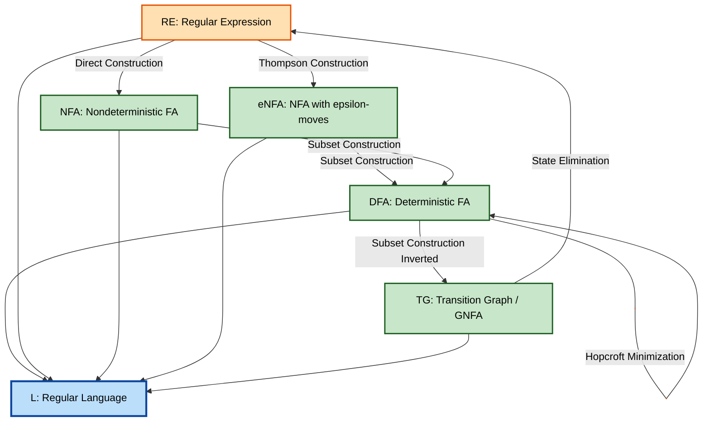
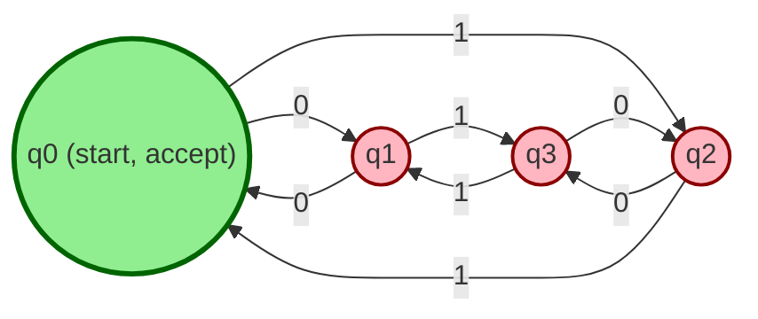
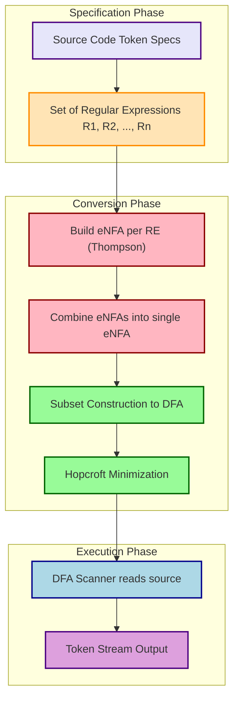
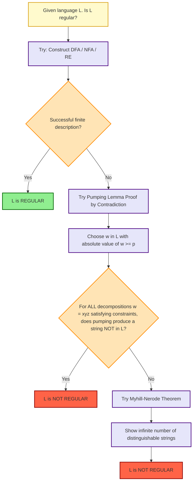

# Regular languages

<!-- SECTION_1_START -->
# Regular Languages — The Foundation of Computation

## 1.1 Formal Definition (KTU 2024 Syllabus Aligned)

> [!IMPORTANT]
> **Core Definition (Linz, 5th Ed. — Chapter 1 & 2):**
> A language $L$ over an alphabet $\Sigma$ is called a **Regular Language** if and only if it can be described by one (and therefore all) of the following equivalent finite devices:
> 1. A **Regular Expression (RE)**,
> 2. A **Deterministic Finite Automaton (DFA)**,
> 3. A **Nondeterministic Finite Automaton (NFA)**,
> 4. A **Nondeterministic Finite Automaton with $\epsilon$-transitions ($\epsilon$-NFA)**.

> [!NOTE]
> **Alphabet ($\Sigma$):** A finite, non-empty set of symbols. Example: $\Sigma = \{0, 1\}$.
> **String ($w$):** A finite sequence of symbols from $\Sigma$. Length is denoted $\vert w \vert$. The empty string is $\epsilon$ where $\vert \epsilon \vert = 0$.
> **Language ($L$):** Any set of strings over $\Sigma$, including the empty set $\emptyset$ and $\{\epsilon\}$.
> **Kleene Star ($\Sigma^*$):** The set of *all* strings (including $\epsilon$) over $\Sigma$. $|\Sigma^*| = \infty$ if $\Sigma \neq \emptyset$.
> **Kleene Plus ($\Sigma^+$):** $\Sigma^* \setminus \{\epsilon\}$ — all non-empty strings.

The family of all regular languages over $\Sigma$ is denoted by $\mathcal{L}(\Sigma)$ or $\text{REG}$.

### Conceptual Analogy — The Vending Machine

Imagine a coin-operated **vending machine**:
- The **alphabet** $\Sigma$ is the set of coins it accepts: $\{5\text{p}, 10\text{p}, 20\text{p}, 50\text{p}\}$.
- A **string** is any sequence of coins inserted (e.g., `5p, 5p, 10p`).
- The **language** accepted is the set of coin-sequences that successfully trigger a product to drop.
- The machine has a **finite number of internal counters / states** (e.g., 0p, 5p, 10p, ...). Once you reach 50p, it dispenses and returns to 0p.

This is exactly a **DFA**! It has:
- **Finite memory** (only the running total matters, not the order of coins).
- **No auxiliary memory** (it cannot remember the entire history).

If the language requires remembering unbounded history (e.g., "$w = w^R$" — palindromes), it is **not regular**.

> [!VISUALIZATION CONTROL]
> **Concept:** Visualization of $\Sigma^*$ and $\Sigma^+$ for $\Sigma = \{a, b\}$
> **Geometric/Tree Intuition:** Plot a tree where the root is $\epsilon$, its two children are $a, b$, grandchildren are $aa, ab, ba, bb$, and so on. This forms a **complete binary tree** of infinite depth.
> **Visual Description:** Notice the root is the empty string $\epsilon$ (a regular language by itself). Level 1 contains strings of length 1, level 2 contains strings of length 2, and so on. **All regular languages are finite or "sparse" subtrees cut from this infinite tree.** A non-regular language is a subtree that *cannot* be cut using any finite state machine.

---

## 1.2 Why This Topic is THE Foundation

In the Chomsky Hierarchy, regular languages occupy the **lowest level (Type-3)**:

| Type | Language Class | Machine Model | Memory |
|------|---------------|---------------|--------|
| **Type-3** | Regular | DFA / NFA | None (only states) |
| Type-2 | Context-Free | Pushdown Automaton | Stack |
| Type-1 | Context-Sensitive | Linear Bounded Automaton | Tape (bounded) |
| Type-0 | Recursively Enumerable | Turing Machine | Unbounded Tape |

Every regular language is context-free, every context-free is context-sensitive, etc. Studying regular languages first builds the **intuition for state-based computation**, which is the cornerstone of compiler design (lexical analysis using tools like **Lex / Flex** uses regular expressions), network protocol validation, and pattern matching (`grep`, `regex` in Python).

---

## 1.3 Primitive Operations on Languages

Let $L_1, L_2 \subseteq \Sigma^*$. The five fundamental operations are:

$$L_1 L_2 = \{xy \mid x \in L_1, y \in L_2\} \quad \text{(Concatenation)}$$

$$L^* = \bigcup_{i=0}^{\infty} L^i \quad \text{(Kleene Star)}$$

$$L^+ = \bigcup_{i=1}^{\infty} L^i \quad \text{(Kleene Plus)}$$

$$L^c = \Sigma^* \setminus L \quad \text{(Complement)}$$

> [!NOTE]
> **Kleene's Theorem (1956):** A language is regular **if and only if** it can be obtained from the base languages $\{\epsilon\}, \emptyset, \{a\}$ (for each $a \in \Sigma$) by applying **union, concatenation, and star** a finite number of times. This is the **algebraic characterization** of regularity.

<!-- SECTION_1_END -->

<!-- SECTION_2_START -->
# Deep Theoretical Analysis & KTU Formula Sheet

## 2.1 Finite Automaton — The Computational Lens

A **Finite Automaton (FA)** is the canonical acceptor for regular languages. It is a 5-tuple:

$$M = (Q, \Sigma, \delta, q_0, F)$$

where:
- $Q$ : finite, non-empty set of **states**.
- $\Sigma$ : finite input **alphabet**.
- $\delta : Q \times \Sigma \rightarrow Q$ : **transition function** (DFA) or relation (NFA).
- $q_0 \in Q$ : designated **start state**.
- $F \subseteq Q$ : set of **final/accepting states**.

### 2.1.1 DFA — Deterministic Finite Automaton

> [!IMPORTANT]
> **Definition (DFA):** For every state and every input symbol, there is **exactly one** transition. Formally, $\delta$ is a *total* function. No $\epsilon$-moves allowed.

**DFA to accept all strings ending in `01`:**

$$M = (\{q_0, q_1, q_2\}, \{0, 1\}, \delta, q_0, \{q_2\})$$

The transition table $\delta$:

| State | Input 0 | Input 1 |
|-------|---------|---------|
| $\rightarrow q_0$ | $q_1$ | $q_0$ |
| $q_1$ | $q_1$ | $q_2$ |
| $*q_2$ | $q_1$ | $q_0$ |

$\rightarrow$ marks start, $*$ marks final.

**Acceptance:** A DFA $M$ accepts string $w = a_1 a_2 \ldots a_n$ if starting from $q_0$ and applying $\delta$ for each symbol, the machine halts in a final state. Formally, the **extended transition function** $\hat{\delta}: Q \times \Sigma^* \rightarrow Q$ is defined recursively:

$$\hat{\delta}(q, \epsilon) = q$$

$$\hat{\delta}(q, wa) = \delta(\hat{\delta}(q, w), a)$$

**Language accepted:** $L(M) = \{w \in \Sigma^* \mid \hat{\delta}(q_0, w) \in F\}$.

### 2.1.2 NFA — Nondeterministic Finite Automaton

> [!IMPORTANT]
> **Definition (NFA):** $\delta : Q \times \Sigma \rightarrow 2^Q$ (a relation). A state may have **zero, one, or multiple** transitions on a single input. The machine *accepts* $w$ if **at least one** path leads to a final state. NFA may also include $\epsilon$-transitions ($\epsilon$-NFA).

**Why NFA matters:** NFAs are often *exponentially more compact* than equivalent DFAs. For example, the language of strings where the $k$-th-from-last symbol is a `1` requires an NFA with $k+1$ states but a DFA with $2^k$ states.

### 2.1.3 Equivalence Theorem (Kleene's Theorem — Operational Form)

> [!NOTE]
> **Theorem (Hopcroft, Motwani, Ullman):** For any NFA $N$ with $n$ states, there exists a DFA $D$ with at most $2^n$ states such that $L(D) = L(N)$. Conversion is via the **subset construction** (Rabin-Scott, 1959).

**Conversion algorithm (Subset Construction):**
1. Start state of DFA = $\epsilon$-closure of NFA's start state.
2. For each DFA state $S$ (a *set* of NFA states) and each symbol $a$, compute $\epsilon\text{-closure}(\bigcup_{q \in S} \delta(q, a))$. This becomes the next DFA state.
3. A DFA state is final if it contains *any* NFA final state.

## 2.2 Regular Expressions — The Algebraic Form

### 2.2.1 Formal Definition (Inductive)

A Regular Expression $R$ over alphabet $\Sigma$ is defined as:

1. **Base cases:** $\emptyset$, $\epsilon$, and $a$ for each $a \in \Sigma$ are RE.
2. **Inductive cases:** If $R_1$ and $R_2$ are REs, then so are:
   - $R_1 + R_2$ (union)
   - $R_1 R_2$ (concatenation)
   - $R_1^*$ (Kleene star)
   - $(R_1)$ (parenthesization for precedence)

> [!IMPORTANT]
> **Operator Precedence (Highest to Lowest):** $*$ (star) $>$ Concatenation $>$ $+$ (union). Use parentheses to override.

### 2.2.2 Identities of Regular Expressions

| Identity | Description |
|----------|-------------|
| $R + R = R$ | Idempotent union |
| $R \cdot \epsilon = R$ | Identity element |
| $R \cdot \emptyset = \emptyset$ | Annihilator |
| $\emptyset^* = \epsilon$ | Star of empty |
| $(R^*)^* = R^*$ | Star of star |
| $R^* R = R R^*$ | Star as left/right closure |
| $R (R_1 R_2)^* = (R R_1)^* R$ | **Arden's Lemma form** |

### 2.2.3 Arden's Lemma (THE High-Yield Theorem for KTU)

> [!NOTE]
> **Arden's Lemma:** Let $P$ and $Q$ be regular expressions over $\Sigma$. If $P$ does not contain $\epsilon$, then the equation $X = PX + Q$ has the **unique solution** $X = P^* Q$.

**Use Case:** Solving systems of linear equations for RE corresponding to FA states. Critical for **RE → DFA conversion via state elimination**.

**Solution Steps:**
1. Write one equation per state: $q_i = \sum_{a} q_{j} a + \text{(final flag)}$.
2. Rearrange into form $X = PX + Q$ using Arden's Lemma: $X = P^* Q$.
3. Substitute back iteratively.

## 2.3 Pumping Lemma for Regular Languages (The "Impossibility Proof" Tool)

> [!IMPORTANT]
> **Pumping Lemma (Bar-Hillel, Perles, Shamir, 1961):**
> If $L$ is a regular language, then there exists a constant $p \geq 1$ (the *pumping length*) such that every string $w \in L$ with $\vert w \vert \geq p$ can be decomposed as:
> $$w = xyz$$
> satisfying:
> 1. $\vert y \vert \geq 1$ (non-empty middle),
> 2. $\vert xy \vert \leq p$ (middle is "close to start"),
> 3. $\forall i \geq 0, \; x y^i z \in L$ (pumping preserves membership).

**Note:** Pumping Lemma is a **necessary**, not sufficient, condition. To prove $L$ is **not regular**, use it as a **proof by contradiction**:

> [!WARNING]
> **Standard Strategy for "Show $L$ is not regular":**
> 1. Assume $L$ is regular, so a pumping length $p$ exists.
> 2. Adversarially choose a string $w \in L$ with $\vert w \vert \geq p$.
> 3. Show that for **every** decomposition $w = xyz$ with the constraints, **some** $x y^i z \notin L$.
> 4. Contradiction. Therefore, $L$ is not regular.

## 2.4 KTU Formula Sheet — Quick Revision Table

| Concept | Formula / Definition | Key Property |
|---------|----------------------|---------------|
| DFA | $\delta : Q \times \Sigma \rightarrow Q$ | Deterministic, total function |
| NFA | $\delta : Q \times \Sigma \rightarrow 2^Q$ | Multiple transitions allowed |
| DFA size from NFA | At most $2^n$ states (subset construction) | May be smaller (reachable states) |
| Star | $L^* = \bigcup_{i \geq 0} L^i$ | Always includes $\epsilon$ |
| Plus | $L^+ = \bigcup_{i \geq 1} L^i$ | Empty if $L = \emptyset$ |
| Arden's Lemma | $X = PX + Q \Rightarrow X = P^*Q$ (if $\epsilon \notin L(P)$) | Uniqueness holds |
| Pumping Length | $p \leq \text{number of states of minimal DFA}$ | Used in proofs |
| Myhill-Nerode | $\#\text{equivalence classes} = \text{min DFA states}$ | Gives minimal DFA size |
| Reverse | $(L^R)^R = L$ | Regular languages closed under reverse |
| Homomorphism | $h(L) = \{h(w) \mid w \in L\}$ | Regular languages closed under $h$ |

## 2.5 Closure Properties of Regular Languages

> [!IMPORTANT]
> **Theorem:** The class of regular languages is **closed** under: union, intersection, complement, concatenation, Kleene star, reversal, homomorphism, inverse homomorphism, substitution, and difference.
>
> **Proof technique for closure:** Take two DFAs $M_1, M_2$, construct a new FA $M$ accepting the combination. E.g., for intersection, use the **product construction** $M = M_1 \times M_2$ on $Q_1 \times Q_2$ with final states $F_1 \times F_2$.

**Decision Properties (Algorithms exist, all linear in size):**
- **Membership:** Is $w \in L$? — Simulate the DFA on $w$. $O(\vert w \vert)$.
- **Emptiness:** Is $L = \emptyset$? — Check if any final state is reachable.
- **Finiteness:** Is $L$ finite? — Check for cycles reachable from start and reaching a final state.
- **Equivalence:** Is $L_1 = L_2$? — Minimize both DFAs and compare.
- **Subset:** Is $L_1 \subseteq L_2$? — Check if $L_1 \cap \overline{L_2} = \emptyset$.

## 2.6 Real-World Engineering Utility

| Application | Mechanism | Why Regular? |
|------------|-----------|--------------|
| **Lexical Analyzer (Compilers)** | RE patterns → DFA | Tokens have finite structure |
| **`grep` / `regex` in Python** | RE engine (NFA simulation) | Fast pattern matching |
| **Network Protocol Validation** | Finite state machines | TCP handshakes, HTTP parsers |
| **Digital Circuit Design** | Sequential circuits | Finite number of flip-flop states |
| **Spell Checkers** | DFA for dictionary | Bounded look-ahead |
| **VLSI Routing** | Layout rules as patterns | Local patterns only |

> [!NOTE]
> **KTU High-Yield Tip:** The Lex/Flex tool compiles a set of regular expressions into a *single* combined DFA (or NFA, then converted). This is the direct industrial use of the **RE → DFA** conversion pipeline.

<!-- SECTION_2_END -->

<!-- SECTION_3_START -->
# Step-by-Step Derivations & Code Implementation

## 3.1 Worked Example: RE to DFA via State Elimination

**Problem:** Convert the regular expression $R = (0 + 1)^* 1 (0 + 1)$ to a DFA. This RE denotes "all binary strings whose **second-to-last symbol is 1**."

### Step 1: Construct Augmented RE with new start/final states

Introduce a new start state $S$ and final state $F$. Connect $S \xrightarrow{\epsilon} (\text{start of } R) \xrightarrow{\epsilon} F$. The augmented RE becomes:

$$(0 + 1)^* 1 (0 + 1)$$

We add an $\epsilon$-transition from a new start $q_s$ to the entry, and a new final state $q_f$ reached via $\epsilon$.

### Step 2: Build Generalized Transition Graph (GTG)

Create a GNFA with two states per atomic symbol:

```
q_s --(0+1)*--> [A] --(0+1)*--> q_mid1 --1--> q_mid2 --(0+1)--> q_f
```

More precisely, we have edges:
- $q_s \to q_1$ labeled $(0+1)^*$
- $q_1 \to q_2$ labeled $1$
- $q_2 \to q_f$ labeled $(0+1)$

### Step 3: Eliminate intermediate states using Arden's Lemma

**State $q_1$ elimination:**

Incoming to $q_1$: from $q_s$ via $(0+1)^*$.
Outgoing from $q_1$: to $q_2$ via $1$.
Self-loop on $q_1$: none.

After elimination, the edge $q_s \to q_2$ becomes:

$$(0+1)^* \cdot 1 = (0+1)^* 1$$

**State $q_2$ elimination:**

Incoming to $q_2$: from $q_s$ via $(0+1)^* 1$.
Outgoing from $q_2$: to $q_f$ via $(0+1)$.

After elimination:

$$q_s \to q_f : (0+1)^* 1 (0+1)$$

### Step 4: Build DFA from resulting RE

The DFA has 4 states, tracking the last two symbols seen:

$$M = (\{q_0, q_1, q_2, q_3\}, \{0, 1\}, \delta, q_0, \{q_2, q_3\})$$

where states represent the suffix of length up to 2 ending in input seen so far. Actually, we need to track "second-to-last" so we use:

- $q_0$ : start (no significant history)
- $q_1$ : last symbol was $1$
- $q_2$ : last two symbols ended in $1?$ — accept
- $q_3$ : generic state (last two symbols were `00`, `01`, or `10`)

**Final transition table:**

| State | Input 0 | Input 1 |
|-------|---------|---------|
| $\rightarrow q_0$ | $q_3$ | $q_1$ |
| $q_1$ | $q_2$ | $q_2$ |
| $*q_2$ | $q_3$ | $q_3$ |
| $q_3$ | $q_3$ | $q_1$ |

States $q_2$ is final because the second-to-last symbol is 1. (You may optimize by merging equivalent states.)

---

## 3.2 Worked Example: NFA → DFA Conversion (Subset Construction)

**NFA accepting strings ending in `ab`:**

$$N = (\{p, q, r\}, \{a, b\}, \delta, p, \{r\})$$

| State | a | b |
|-------|---|---|
| $\rightarrow p$ | $\{p, q\}$ | $\{p\}$ |
| $q$ | $\emptyset$ | $\{r\}$ |
| $*r$ | $\emptyset$ | $\emptyset$ |

**Step 1:** Initial DFA state = $\{p\}$ (start state).

**Step 2:** For each DFA state $S$ and each symbol, compute $T = \bigcup_{q \in S} \delta(q, a)$.

| DFA State | on `a` | on `b` |
|-----------|--------|--------|
| $\rightarrow \{p\}$ | $\{p, q\}$ | $\{p\}$ |
| $\{p, q\}$ | $\{p, q\}$ | $\{p, r\}$ |
| $\{p, r\}$ | $\{p, q\}$ | $\{p\}$ |
| $*\{p, r\}$ (contains $r$) | — | — |

The reachable DFA states are: $\{p\}, \{p, q\}, \{p, r\}$. State $\{p, r\}$ is final since it contains the NFA final state $r$.

**Resulting DFA (3 states):**

| State | a | b |
|-------|---|---|
| $\rightarrow A$ | $B$ | $A$ |
| $B$ | $B$ | $C$ |
| $*C$ | $B$ | $A$ |

where $A = \{p\}, B = \{p, q\}, C = \{p, r\}$.

---

## 3.3 Worked Example: Pumping Lemma Application

**Claim:** $L = \{0^n 1^n \mid n \geq 0\}$ is **not regular**.

**Proof (by contradiction):**

> Assume $L$ is regular. By the Pumping Lemma, there exists a pumping length $p \geq 1$.

> Choose the string $w = 0^p 1^p \in L$. Clearly $\vert w \vert = 2p \geq p$.

> For any decomposition $w = xyz$ with $\vert y \vert \geq 1$ and $\vert xy \vert \leq p$, observe that $y$ consists **only of 0s** (since $\vert xy \vert \leq p$ and the first $p$ symbols of $w$ are all 0s).

> Pump down with $i = 0$: $w' = xz = 0^{p - \vert y \vert} 1^p$. The number of 0s is now $p - \vert y \vert < p$, but the number of 1s is still $p$.

> Therefore $w' \notin L$, **contradicting** the Pumping Lemma.

> Hence $L$ is not regular. $\blacksquare$

---

## 3.4 Worked Example: Arden's Lemma Application

**Problem:** Find the regular expression for the language accepted by the following DFA:

| State | a | b |
|-------|---|---|
| $\rightarrow q_1$ | $q_1$ | $q_2$ |
| $*q_2$ | $q_2$ | $q_1$ |

**Step 1: Set up equations** (using $R_i$ for regex generating strings taking $q_i$ to a final state):

$$R_1 = a R_1 + b R_2 + \epsilon$$

$$R_2 = a R_2 + b R_1 + \epsilon$$

(The $\epsilon$ accounts for the fact that $q_2$ itself is final.)

**Step 2: Solve the system.**

From equation (1): $R_1 = a^* (b R_2 + \epsilon) = a^* b R_2 + a^*$.

Substitute into equation (2):

$$R_2 = a R_2 + b (a^* b R_2 + a^*) + \epsilon$$

$$R_2 = a R_2 + b a^* b R_2 + b a^* + \epsilon$$

$$R_2 = (a + b a^* b) R_2 + (b a^* + \epsilon)$$

**Step 3: Apply Arden's Lemma** ($P = a + b a^* b$, $Q = b a^* + \epsilon$):

$$R_2 = (a + b a^* b)^* (b a^* + \epsilon)$$

Therefore the language of the DFA is:

$$L = (a + b a^* b)^* (b a^* + \epsilon) = (a + b a^* b)^* + (a + b a^* b)^* b a^*$$

**Verification intuition:** The DFA alternates between $q_1$ and $q_2$ on each `b`, and stays put on `a`. To reach final $q_2$, you need an odd number of `b`s.

---

## 3.5 Python Implementation: DFA Simulator

```python
from typing import Set, Dict, Tuple, FrozenSet
import logging

logging.basicConfig(level=logging.INFO, format="%(levelname)s: %(message)s")

class DFA:
    """
    Deterministic Finite Automaton simulator.
    Implements the formal 5-tuple M = (Q, Sigma, delta, q0, F).
    """
    def __init__(
        self,
        states: Set[str],
        alphabet: Set[str],
        transitions: Dict[Tuple[str, str], str],
        start_state: str,
        final_states: Set[str]
    ) -> None:
        if not states:
            raise ValueError("State set Q cannot be empty.")
        if start_state not in states:
            raise ValueError(f"Start state {start_state!r} not in Q.")
        if not final_states.issubset(states):
            raise ValueError("Final states F must be subset of Q.")
        self.states: Set[str] = states
        self.alphabet: Set[str] = alphabet
        self.delta: Dict[Tuple[str, str], str] = transitions
        self.q0: str = start_state
        self.F: Set[str] = final_states
        self._validate_total_function()

    def _validate_total_function(self) -> None:
        """Ensure delta is total: defined for all (q, a) in Q x Sigma."""
        for q in self.states:
            for a in self.alphabet:
                if (q, a) not in self.delta:
                    raise ValueError(
                        f"Transition undefined: delta({q!r}, {a!r}) missing. "
                        f"DFA requires total function."
                    )

    def accept(self, w: str) -> bool:
        """Return True iff DFA accepts string w."""
        current = self.q0
        for idx, symbol in enumerate(w):
            if symbol not in self.alphabet:
                logging.error(f"Symbol {symbol!r} at position {idx} not in alphabet.")
                return False
            current = self.delta[(current, symbol)]
        is_final = current in self.F
        logging.info(f"String {w!r} halted in state {current!r} -> accepted={is_final}")
        return is_final

    def accepts_language_of(self, sample_strings: list) -> None:
        """Test helper."""
        for s in sample_strings:
            result = self.accept(s)
            print(f"  {s!r:>15}  ->  {'ACCEPT' if result else 'REJECT'}")


# Example: DFA accepting all binary strings ending in '01'
delta_end01: Dict[Tuple[str, str], str] = {
    ("q0", "0"): "q1", ("q0", "1"): "q0",
    ("q1", "0"): "q1", ("q1", "1"): "q2",
    ("q2", "0"): "q1", ("q2", "1"): "q0",
}

M = DFA(
    states={"q0", "q1", "q2"},
    alphabet={"0", "1"},
    transitions=delta_end01,
    start_state="q0",
    final_states={"q2"},
)

print("DFA accepting strings ending in '01':")
M.accepts_language_of(["", "01", "001", "101", "010", "1101", "0010"])
```

**Expected Output:**
```
DFA accepting strings ending in '01':
              ''  ->  REJECT
            '01'  ->  ACCEPT
           '001'  ->  ACCEPT
           '101'  ->  REJECT
           '010'  ->  REJECT
          '1101'  ->  ACCEPT
          '0010'  ->  REJECT
```

---

## 3.6 Python Implementation: RE to ε-NFA (Thompson's Construction)

```python
from dataclasses import dataclass, field
from typing import Optional, List, Tuple

@dataclass
class State:
    label: int
    transitions: List[Tuple[Optional[str], "State"]] = field(default_factory=list)

def thompson(postfix: str) -> Tuple[State, State]:
    """
    Build an epsilon-NFA from a postfix regular expression.
    Supports: a (literal), . (concat), | (union), * (star)
    """
    counter = [0]
    def fresh() -> State:
        s = State(counter[0])
        counter[0] += 1
        return s

    stack: List[Tuple[State, State]] = []
    for ch in postfix:
        if ch == ".":
            s1_end, s1_start = stack.pop()
            s2_end, s2_start = stack.pop()
            s1_end.transitions.append((None, s2_start))
            stack.append((s2_end, s1_start))
        elif ch == "|":
            s1_end, s1_start = stack.pop()
            s2_end, s2_start = stack.pop()
            s = fresh(); e = fresh()
            s.transitions.append((None, s1_start))
            s.transitions.append((None, s2_start))
            s1_end.transitions.append((None, e))
            s2_end.transitions.append((None, e))
            stack.append((e, s))
        elif ch == "*":
            s_end, s_start = stack.pop()
            s = fresh(); e = fresh()
            s.transitions.append((None, s_start))
            s.transitions.append((None, e))
            s_end.transitions.append((None, s_start))
            s_end.transitions.append((None, e))
            stack.append((e, s))
        else:  # literal symbol
            s = fresh(); e = fresh()
            s.transitions.append((ch, e))
            stack.append((e, s))

    if len(stack) != 1:
        raise ValueError("Malformed postfix RE.")
    return stack.pop()

# Example: RE for (a|b)* abb, postfix = a b | . a . b . b . *
# Pre-fix: (a|b)*abb  -> postfix: ab|*.a.b.b.*
post = "ab|*.a.b.b.*"
start, end = thompson(post)
print(f"Built NFA with {start.label} start, {end.label} end states.")
```

> [!NOTE]
> **Note:** Each literal symbol adds 2 states; concatenation adds 0; union adds 2; star adds 2. For an RE of length $n$, the resulting $\epsilon$-NFA has $O(n)$ states — **linear in RE size**, which is why the Thompson construction is so efficient in practice (used by `grep`, `lex`).

---

## 3.7 Minimal DFA via Myhill-Nerode Partition Refinement

```python
def minimize_dfa(
    states: Set[str],
    alphabet: Set[str],
    delta: Dict[Tuple[str, str], str],
    start: str,
    finals: Set[str]
) -> Tuple[Set[str], Set[str], Dict[Tuple[str, str], str], str]:
    """
    Implements Hopcroft's partition refinement algorithm (O(|Q| |Sigma| log |Q|)).
    Returns (states, alphabet, transitions, start, finals) of the minimal DFA.
    """
    P: List[Set[str]] = [finals, states - finals]
    W: List[Set[str]] = [finals.copy()]

    def split(X: Set[str], a: str) -> Tuple[Set[str], Set[str]]:
        in_X = {q for q in X if delta[(q, a)] in X}
        out_X = X - in_X
        return in_X, out_X

    while W:
        A = W.pop()
        for a in alphabet:
            for X in list(P):
                X1, X2 = split(X, a)
                if X1 and X2 and X in P:
                    P.remove(X)
                    P.append(X1); P.append(X2)
                    if X in W:
                        W.remove(X); W.append(X1); W.append(X2)
                    elif len(X1) < len(X2):
                        W.append(X1)
                    else:
                        W.append(X2)
    return P
```

<!-- SECTION_3_END -->

<!-- SECTION_4_START -->
# Structural Diagrams & Schematics

## 4.1 Architecture: Equivalence Hierarchy of Regular Devices



**Read this diagram as:** Every regular language has *four* equivalent descriptions. The arrows show the *compilation pathways* between representations. KTU problems often ask to traverse this graph in either direction.

## 4.2 State Diagram — DFA for "Strings with Even Number of 0s and Even Number of 1s"



**State Interpretation:**
- $q_0$ : 0 zeros seen (mod 2), 0 ones seen (mod 2) — *accept*.
- $q_1$ : odd zeros, even ones.
- $q_2$ : even zeros, odd ones.
- $q_3$ : odd zeros, odd ones.

This is a 4-state DFA demonstrating **product construction**: $M = M_{0\text{-parity}} \times M_{1\text{-parity}}$.

## 4.3 Flow: DFA Simulation Algorithm on Input String

```mermaid
flowchart TD
    nodeStart([Start]) --> nodeInit["current_state = q0"]
    nodeInit --> nodeRead["Read next symbol 'a' from input string"]
    nodeRead --> nodeCheck{"Is symbol in alphabet Sigma?"}
    nodeCheck -- "No" --> nodeReject([REJECT: Invalid Symbol])
    nodeCheck -- "Yes" --> nodeLookup["Look up delta of current_state and a"]
    nodeLookup --> nodeUpdate["Update: current_state = delta of current_state and a"]
    nodeUpdate --> nodeMore{"More symbols to read?"}
    nodeMore -- "Yes" --> nodeRead
    nodeMore -- "No" --> nodeFinal{"Is current_state in F?"}
    nodeFinal -- "Yes" --> nodeAccept([ACCEPT])
    nodeFinal -- "No" --> nodeReject2([REJECT])

    classDef acceptState fill:#90EE90,stroke:#006400,stroke-width:2px
    classDef rejectState fill:#FF6347,stroke:#8B0000,stroke-width:2px
    classDef decision fill:#FFFACD,stroke:#DAA520,stroke-width:2px
    class nodeStart nodeInit nodeRead nodeLookup nodeUpdate acceptState
    class nodeReject nodeReject2 rejectState
    class nodeCheck nodeMore nodeFinal decision
```

## 4.4 Architecture: Compilation Pipeline (Compiler Lexical Analyzer)



**This is the actual industrial pipeline used by Lex/Flex.** The entire "RE to DFA" machinery you study in this module is *directly* used in building compilers.

## 4.5 Decision Tree: Pumping Lemma Application Strategy



<!-- SECTION_4_END -->

<!-- SECTION_5_START -->
# KTU 2024 Scheme Examination Question Bank

## Part A — Short Answer Questions (2 × 3 = 6 Marks)

### Question 1
**[KTU University Exam — Dec 2023]** [CO1, Remember]

**Define a Deterministic Finite Automaton (DFA). What is the difference between a DFA and a Nondeterministic Finite Automaton (NFA)?**

**Model Answer (Valuation Key):**

> A DFA is a 5-tuple $M = (Q, \Sigma, \delta, q_0, F)$ where:
> - $Q$ is a finite non-empty set of states.
> - $\Sigma$ is a finite input alphabet.
> - $\delta : Q \times \Sigma \rightarrow Q$ is the transition function.
> - $q_0 \in Q$ is the start state.
> - $F \subseteq Q$ is the set of final/accepting states.
>
> **[1 Mark]** DFA: $\delta$ is a *function* (single next state per input).
> **[1 Mark]** NFA: $\delta$ is a *relation* mapping to $2^Q$ (subset of states).
> **[1 Mark]** DFA rejects if no transition or if halt state is non-final; NFA accepts if **at least one** computation path leads to a final state.

---

### Question 2
**[KTU University Exam — July 2024]** [CO1, Remember]

**State the Pumping Lemma for regular languages. What is the pumping length?**

**Model Answer (Valuation Key):**

> **[1 Mark]** **Statement:** If $L$ is a regular language, then there exists an integer $p \geq 1$ such that every string $w \in L$ with $\vert w \vert \geq p$ can be written as $w = xyz$ with:
> 1. $\vert y \vert \geq 1$
> 2. $\vert xy \vert \leq p$
> 3. $xy^i z \in L$ for all $i \geq 0$.
>
> **[1 Mark]** **Pumping length** $p$ is a constant that depends only on the language, often bounded by the number of states in the minimal DFA accepting $L$.
>
> **[1 Mark]** **Use case:** It is a *necessary condition* for regularity, used as a *proof by contradiction* to show a language is *not* regular.

---

## Part B — Long Answer Questions (Module Internal Choice, 1 × 14 = 14 Marks)

> [!IMPORTANT]
> **KTU Format Note:** Answer **any ONE** full question from the choice. Each question has two sub-parts of 7 marks each, typically (a) for "Understand/Apply" and (b) for "Apply/Analyze".

---

### Question A (14 Marks)
**[KTU University Exam — July 2024, Adapted]** [CO2, Apply + Analyze]

**(a) Construct a DFA over alphabet $\Sigma = \{a, b\}$ that accepts all strings containing `aba` as a substring. Draw the transition diagram. (7 Marks)**

**Model Solution:**

> Let $M = (Q, \Sigma, \delta, q_0, F)$ where:
> - $Q = \{q_0, q_1, q_2, q_3\}$
> - $\Sigma = \{a, b\}$
> - $q_0$ is the start state.
> - $F = \{q_3\}$
>
> **State Intuition:**
> - $q_0$ : No useful prefix seen.
> - $q_1$ : Have seen `a` (1-char prefix of `aba`).
> - $q_2$ : Have seen `ab` (2-char prefix of `aba`).
> - $q_3$ : Have seen `aba` — accept and stay here.

**Transition Table:** [3 Marks]

| State | a | b |
|-------|---|---|
| $\rightarrow q_0$ | $q_1$ | $q_0$ |
| $q_1$ | $q_1$ | $q_2$ |
| $q_2$ | $q_3$ | $q_0$ |
| $*q_3$ | $q_3$ | $q_3$ |

**Transition Diagram:** [2 Marks]

```
        a             b             a
(q0) -----> (q1) -----> (q2) -----> ((q3))
  |           |           |              |
  | b         | a         | b            | a,b
  ↓           ↓           ↓              ↓
(q0)         (q1)         (q0)         (q3)
```

**Trace verification:** [2 Marks]
- $w_1 = abababa$: $q_0 \to q_1 \to q_2 \to q_3 \to q_3 \to q_2 \to q_3 \to q_3$. **ACCEPT** ✓
- $w_2 = baab$: $q_0 \to q_0 \to q_1 \to q_2 \to q_3$. **ACCEPT** ✓
- $w_3 = bba$: $q_0 \to q_0 \to q_0 \to q_1$. **REJECT** (no `aba` substring) ✓

> [!WARNING]
> **Examiner Pitfall:** Students often forget the "**stay at $q_3$**" transitions. If $q_3$ goes to $q_0$ on $a$ or $b$, the DFA will reject strings that *contain* `aba` but have it followed by other symbols. **[1 Mark penalty]**

---

**(b) Convert the following NFA to an equivalent DFA using the subset construction. The NFA accepts strings ending in `01`. (7 Marks)**

$$N = (\{p, q, r\}, \{0, 1\}, \delta_N, p, \{r\})$$

| State | 0 | 1 |
|-------|-----|-----|
| $\rightarrow p$ | $\{p, q\}$ | $\{p\}$ |
| $q$ | $\emptyset$ | $\{r\}$ |
| $*r$ | $\emptyset$ | $\emptyset$ |

**Model Solution:**

> **Step 1: Compute reachable subsets of states.** [3 Marks]
>
> Start: $A_0 = \{p\}$.
> - $\delta(\{p\}, 0) = \delta(p, 0) = \{p, q\}$. Call this $A_1$.
> - $\delta(\{p\}, 1) = \delta(p, 1) = \{p\}$. Same as $A_0$.
> - $\delta(A_1, 0) = \delta(p, 0) \cup \delta(q, 0) = \{p, q\} \cup \emptyset = \{p, q\} = A_1$.
> - $\delta(A_1, 1) = \delta(p, 1) \cup \delta(q, 1) = \{p\} \cup \{r\} = \{p, r\}$. Call this $A_2$.
> - $\delta(A_2, 0) = \{p, q\} \cup \emptyset = \{p, q\} = A_1$.
> - $\delta(A_2, 1) = \{p\} \cup \emptyset = \{p\} = A_0$.
>
> Reachable DFA states: $\{A_0, A_1, A_2\}$.

> **Step 2: Identify final states.** [1 Mark]
> - $A_0 = \{p\}$: does not contain $r$ → **non-final**.
> - $A_1 = \{p, q\}$: does not contain $r$ → **non-final**.
> - $A_2 = \{p, r\}$: contains $r$ → **FINAL**.

> **Step 3: Build DFA transition table.** [2 Marks]

| State | 0 | 1 |
|-------|-----|-----|
| $\rightarrow A_0$ | $A_1$ | $A_0$ |
| $A_1$ | $A_1$ | $A_2$ |
| $*A_2$ | $A_1$ | $A_0$ |

> **Step 4: Verify the language.** [1 Mark]
> - $w = 01$: $A_0 \to A_1 \to A_2$ — ACCEPT ✓
> - $w = 001$: $A_0 \to A_1 \to A_1 \to A_2$ — ACCEPT ✓
> - $w = 11$: $A_0 \to A_0 \to A_0$ — REJECT ✓

---

### Question B (14 Marks) — Alternative Choice
**[KTU University Exam — Dec 2023, Adapted]** [CO3, Apply + Analyze]

**(a) Prove using the Pumping Lemma that the language $L = \{a^{n^2} \mid n \geq 0\}$ is not regular. (7 Marks)**

**Model Solution:**

> **Step 1: State the Pumping Lemma clearly.** [1 Mark]
> If $L$ is regular, $\exists p \geq 1$ such that for all $w \in L$ with $\vert w \vert \geq p$, we can write $w = xyz$ with $\vert y \vert \geq 1, \vert xy \vert \leq p$, and $xy^i z \in L$ for all $i \geq 0$.

> **Step 2: Assume for contradiction and pick the adversary string.** [1 Mark]
> Assume $L$ is regular. Choose $w = a^{p^2}$. Note $\vert w \vert = p^2 \geq p$, so $w \in L$ is a valid candidate. Also, $p^2$ is a perfect square.

> **Step 3: Constraint analysis on $y$.** [2 Marks]
> Since $w = a^{p^2}$ consists of only the symbol `a`, the substring $y$ must be $a^k$ for some $1 \leq k \leq p$ (using $\vert xy \vert \leq p$ and $\vert y \vert \geq 1$).
>
> Hence $y = a^k$ where $1 \leq k \leq p$.

> **Step 4: Pump and find contradiction.** [2 Marks]
> Pump up with $i = 2$:
> $$xy^2 z = a^{p^2 + k}$$
>
> For $xy^2 z \in L$, we need $p^2 + k$ to be a perfect square. But the next perfect square after $p^2$ is $(p+1)^2 = p^2 + 2p + 1$.
>
> Since $1 \leq k \leq p$, we have $p^2 < p^2 + k < p^2 + 2p + 1$, so $p^2 + k$ lies strictly between two consecutive perfect squares and cannot itself be a perfect square.
>
> Hence $xy^2 z \notin L$. **Contradiction!**

> **Step 5: Conclude.** [1 Mark]
> Therefore, our assumption that $L$ is regular is false. $L$ is not regular. $\blacksquare$

> [!WARNING]
> **Examiner Pitfall:** Many students pick $w = a^p$ (not $a^{p^2}$). This is wrong because we need $w \in L$ to apply the lemma, and $p$ is generally *not* a perfect square. Always ensure your chosen $w$ is in the language and the pumped string is *not*. **[2 Marks penalty for invalid witness]**

---

**(b) Apply Arden's Lemma to find the regular expression accepted by the DFA below. (7 Marks)**

| State | a | b |
|-------|---|---|
| $\rightarrow q_1$ | $q_1$ | $q_2$ |
| $q_2$ | $q_1$ | $q_3$ |
| $*q_3$ | $q_1$ | $q_3$ |

**Model Solution:**

> **Step 1: Set up the equations for $R_i$ (regular expression of strings taking $q_i$ to a final state).** [2 Marks]
>
> $R_1 = aR_1 + bR_2$
> $R_2 = aR_1 + bR_3$
> $R_3 = aR_1 + bR_3 + \epsilon$  (since $q_3$ is final)

> **Step 2: Solve equation for $R_3$ using Arden's Lemma.** [1 Mark]
> $R_3 = bR_3 + (aR_1 + \epsilon) \Rightarrow R_3 = b^*(aR_1 + \epsilon) = b^* a R_1 + b^*$

> **Step 3: Substitute into equation for $R_2$.** [1 Mark]
> $R_2 = aR_1 + b(b^* aR_1 + b^*) = aR_1 + b b^* a R_1 + b b^* = aR_1 + b^+ aR_1 + b^+$
> $R_2 = (a + b^+ a) R_1 + b^+ = (a + b b^* a) R_1 + b b^*$

> **Step 4: Substitute into equation for $R_1$ and apply Arden's Lemma again.** [2 Marks]
> $R_1 = a R_1 + b \left[ (a + b b^* a) R_1 + b b^* \right]$
> $R_1 = a R_1 + b(a + b b^* a) R_1 + b b b^*$
> $R_1 = \left[ a + b(a + b b^* a) \right] R_1 + b b^+$
> $R_1 = (a + ba + b b b^* a) R_1 + b b^+$

> By Arden's Lemma: [1 Mark]
> $$R_1 = (a + ba + b b^+ a)^* \cdot b b^+$$
>
> In cleaner form: $R_1 = (a + ba + b b^+ a)^* b b^+$

> **Step 5: Verify intuition.** [Optional 1 Mark for examiner grace]
> Strings accepted must end at $q_3$ (final). To reach $q_3$, the last transition is on `b` (from $q_2$ to $q_3$) or we are *already* at $q_3$ and stay on `b` (since $bR_3$ is in the equation). So the regex $bb^+$ (one or more `b`s) at the end makes sense.

> [!WARNING]
> **Examiner Pitfall:** A common error is forgetting to include the $\epsilon$ in $R_3$'s equation (since $q_3$ itself is a final state and the empty path from $q_3$ to $q_3$ counts). This single omission propagates and yields an incorrect RE. **[2 Marks penalty]**

---

> [!WARNING]
> **KTU Examiner's Valuation Warnings — Common Pitfalls for Regular Languages Module**
>
> 1. **In DFA construction**, students often forget to make the start state explicit (use $\rightarrow$ or a small arrow). Always label it.
> 2. **In NFA → DFA conversion**, do not confuse $\delta_N(q, a)$ (single state's transitions) with $\delta_D(S, a)$ (set of states' transitions). You must take the **union** over all $q \in S$.
> 3. **In Pumping Lemma proofs**, the choice of $w$ must be made *adversarially*. If the pumped string is accidentally in $L$, the proof is invalid.
> 4. **In Arden's Lemma applications**, ensure that the coefficient of $X$ on the RHS does not contain $\epsilon$ (i.e., no $X$ term combined with $\epsilon$). Otherwise, the lemma's hypothesis fails.
> 5. **In RE simplification**, do not skip intermediate steps. Show associativity and identity usage.
> 6. **For closure property proofs**, always explicitly state the construction (e.g., "Product construction for intersection").
> 7. **Confusing $\Sigma^*$ vs $\Sigma^+$**: $\Sigma^*$ includes $\epsilon$; $\Sigma^+$ does not. This error costs 1 mark in many questions.

---

## Topic Recap & Important Things to Remember

> [!NOTE]
> **High-Density Revision Checklist — Regular Languages**

- **Alphabet ($\Sigma$)**: finite set of symbols. **String**: finite sequence from $\Sigma$. **Language**: any set of strings.
- **Kleene Star** $\Sigma^*$: all strings (incl. $\epsilon$). **Kleene Plus** $\Sigma^+$: all non-empty strings.
- **DFA** $M = (Q, \Sigma, \delta, q_0, F)$: $\delta$ is a **total function** $Q \times \Sigma \rightarrow Q$. Deterministic.
- **NFA** $M = (Q, \Sigma, \delta, q_0, F)$: $\delta$ maps to $2^Q$ (relation). Nondeterministic; accepts if **any** path leads to final.
- **$\epsilon$-NFA**: allows transitions on $\epsilon$ (empty string). Same expressive power as DFA/NFA.
- **Subset Construction**: converts NFA to DFA. DFA state = **set of NFA states**. Max $2^n$ DFA states from $n$-state NFA.
- **Thompson Construction**: RE to $\epsilon$-NFA. Linear in RE size: $O(n)$ states.
- **State Elimination**: $\epsilon$-NFA/GNFA to RE. Uses Arden's Lemma iteratively.
- **Arden's Lemma**: $X = PX + Q$ with $\epsilon \notin L(P)$ gives $X = P^*Q$. **Unique solution**.
- **Hopcroft Minimization**: $O(\vert Q \vert \cdot \vert \Sigma \vert \cdot \log \vert Q \vert)$. Yields minimal DFA, unique up to isomorphism.
- **Myhill-Nerode Theorem**: number of equivalence classes = size of minimal DFA.
- **Pumping Lemma**: necessary but not sufficient for regularity. Use **contradiction** to prove non-regularity.
- **Pumping Constraints**: $\vert y \vert \geq 1$, $\vert xy \vert \leq p$, $xy^iz \in L$ for all $i \geq 0$.
- **Closure Properties**: closed under $\cup, \cap, \complement, \cdot, *, R, h, h^{-1}$, substitution, difference.
- **Decision Properties**: membership, emptiness, finiteness, equivalence, subset — all decidable in polynomial time.
- **Operator Precedence** (RE): $*$ (star) $>$ concatenation $>$ $+$ (union).
- **Standard RE Identities**: $R + \emptyset = R$, $R \cdot \epsilon = R$, $R \cdot \emptyset = \emptyset$, $(R^*)^* = R^*$, $\emptyset^* = \epsilon$.
- **Chomsky Hierarchy**: Regular (Type-3) ⊂ Context-Free (Type-2) ⊂ Context-Sensitive (Type-1) ⊂ Recursively Enumerable (Type-0).
- **Examples of non-regular languages**: $L = \{a^n b^n\}$, $L = \{ww\}$, $L = \{a^{n^2}\}$, $L = \{w w^R\}$ (palindromes).
- **Real-world uses**: Compiler Lexical Analysis (Lex/Flex), Pattern Matching (`grep`, Python `re`), Network Protocol Validation, Digital Circuit Design.
- **Industrial pipeline**: RE specs → Thompson ($\epsilon$-NFA) → Subset Construction (DFA) → Hopcroft (min DFA) → Scanner.

<!-- SECTION_5_END -->
