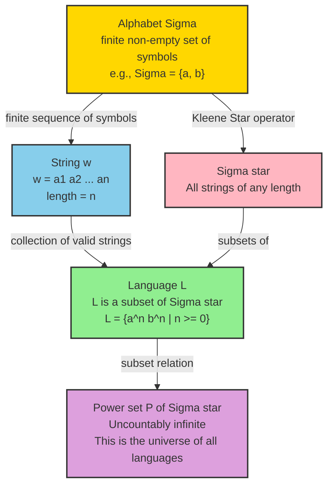
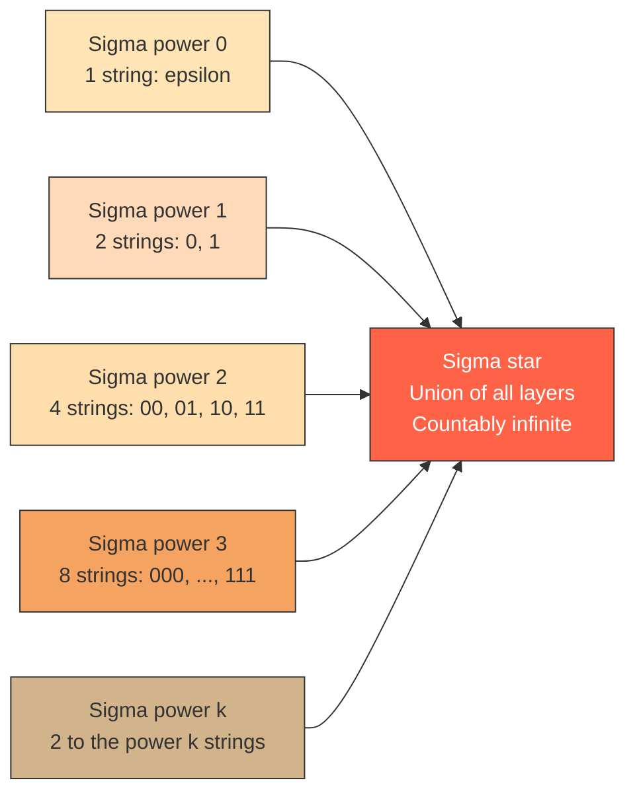
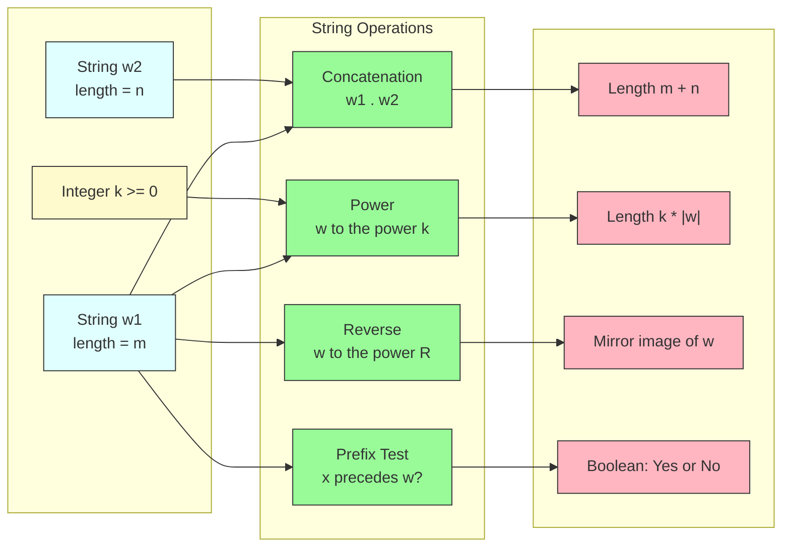
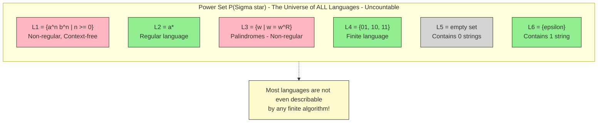

# Three basic concepts: Alphabet, Strings, and Languages

<!-- SECTION_1_START -->
# Three Basic Concepts: Alphabet, Strings, and Languages

## 1. Alphabet ($\Sigma$)

> [!IMPORTANT]
> **Formal Definition (Linz / Hopcroft):** An **alphabet** is a **finite**, **non-empty** set of symbols (or characters). It is the most fundamental building block of any formal language. Formally denoted by the Greek capital letter $\Sigma$ (sigma).

$$\Sigma = \{a_1, a_2, a_3, \dots, a_n\}, \quad n \geq 1$$

- The symbols in an alphabet can be **letters** ($a, b, c, \dots$), **digits** ($0, 1, 2, \dots$), **punctuation marks**, or even **abstract symbols** ($\#, \delta, \sigma$).
- Common examples of alphabets:
  - **Binary alphabet:** $\Sigma = \{0, 1\}$
  - **English lowercase alphabet:** $\Sigma = \{a, b, c, \dots, z\}$
  - **ASCII character set:** $\Sigma = \{$all 128 ASCII characters$\}$
  - **DNA alphabet:** $\Sigma = \{A, C, G, T\}$

> [!NOTE]
> **KTU Syllabus Highlight:** An alphabet is **always finite**. Infinite alphabets are not considered in the standard model (although they are used in advanced topics like $\omega$-automata).

### Conceptual Analogy / Intuition

Think of an alphabet like the **"set of LEGO pieces"** available to you. Just as you cannot build a LEGO structure using a piece that does not exist in your kit, you cannot form a string in a language using a symbol that is not in its alphabet. The alphabet defines the **vocabulary pool** from which everything else is constructed.

---

## 2. String (or Word)

> [!IMPORTANT]
> **Formal Definition:** A **string** (also called a **word**) over an alphabet $\Sigma$ is a **finite sequence of symbols** drawn from $\Sigma$. The length of a string $w$ is the number of symbols it contains and is denoted by $\vert w \vert$.

Let $w = a_1 a_2 a_3 \dots a_n$ where each $a_i \in \Sigma$. Then:

$$\vert w \vert = n$$

- **Empty String ($\varepsilon$ or $\lambda$):** A special string with **zero symbols**. Its length is $\vert \varepsilon \vert = 0$.
- **Concatenation ($w_1 w_2$):** Joining two strings end-to-end. If $w_1 = a_1 \dots a_m$ and $w_2 = b_1 \dots b_n$, then $w_1 w_2 = a_1 \dots a_m b_1 \dots b_n$.
- **Power of a string ($w^k$):** Concatenating $w$ with itself $k$ times.
  - $w^0 = \varepsilon$
  - $w^1 = w$
  - $w^2 = ww$
  - $w^k = w \cdot w^{k-1}$
- **Reverse of a string ($w^R$):** Reading $w$ from right to left.
- **Prefix / Suffix / Substring:** Standard substring relations used heavily in KTU problems.

### Conceptual Analogy / Intuition

If the alphabet is the **LEGO pieces**, then a string is the **specific LEGO structure** you build — a finite arrangement of those pieces. The empty string $\varepsilon$ is like the **empty table** — no pieces placed, but a valid configuration nonetheless.

---

## 3. Language

> [!IMPORTANT]
> **Formal Definition:** A **language** over an alphabet $\Sigma$ is a **set of strings** over $\Sigma$. Formally:
>
> $$L \subseteq \Sigma^*$$
>
> where $\Sigma^*$ denotes the **set of all possible strings** (including $\varepsilon$) that can be formed using symbols from $\Sigma$.

- $\Sigma^*$ (Kleene Star / Kleene Closure): The set of **all strings** of **any length** (including $\varepsilon$) over $\Sigma$.
- $\Sigma^+$ (Positive Closure): The set of **all non-empty strings** over $\Sigma$. So $\Sigma^+ = \Sigma^* \setminus \{\varepsilon\}$.

$$\Sigma^* = \bigcup_{k=0}^{\infty} \Sigma^k = \Sigma^0 \cup \Sigma^1 \cup \Sigma^2 \cup \dots$$

where $\Sigma^k$ is the set of all strings of length exactly $k$.

### Conceptual Analogy / Intuition

A language is the **"rulebook of allowed LEGO structures."** From the infinite pool of possible structures ($\Sigma^*$), a language $L$ picks only the structures that are **"grammatically correct"** or **"semantically meaningful."**

For example, with $\Sigma = \{a, b\}$:
- $\Sigma^* = \{\varepsilon, a, b, aa, ab, ba, bb, aaa, \dots\}$
- $L_1 = \{a^n b^n \mid n \geq 0\} = \{\varepsilon, ab, aabb, aaabbb, \dots\}$ (a meaningful language!)
- $L_2 = \emptyset$ (the empty language — contains no strings)
- $L_3 = \{\varepsilon\}$ (a language containing only the empty string)

> [!NOTE]
> **Critical Distinction (Frequently asked in KTU):**
> - $\emptyset$ (empty set) is a language that contains **no strings**.
> - $\{\varepsilon\}$ is a language that contains **one string**, namely the empty string.
> - These are **not the same**! $\emptyset \neq \{\varepsilon\}$.

### Property: Cardinality of $\Sigma^*$

Even though $\Sigma$ is finite, the language $\Sigma^*$ is **countably infinite** (i.e., has the cardinality $\aleph_0$).

> [!VISUALIZATION CONTROL]
> **Concept:** Hierarchical construction of $\Sigma^*$ for the binary alphabet $\Sigma = \{0, 1\}$.
> **Geometric / Schematic Description:** Visualize an onion-like layered structure.
> - **Layer 0 ($\Sigma^0$):** A single point at the center labeled $\varepsilon$.
> - **Layer 1 ($\Sigma^1$):** A ring of 2 points: $\{0, 1\}$.
> - **Layer 2 ($\Sigma^2$):** A ring of 4 points: $\{00, 01, 10, 11\}$.
> - **Layer 3 ($\Sigma^3$):** A ring of 8 points: $\{000, 001, \dots, 111\}$.
> - Each layer $k$ contains exactly $2^k$ strings.
> - $\Sigma^*$ is the **union of all these layers** — a countably infinite set.
> **Observation:** The total count grows as $2^k$, demonstrating the exponential explosion that makes language recognition a non-trivial computational problem.

---

## 4. The Trinity — How They Connect

The relationship between the three concepts forms a clean **nested hierarchy**:

$$\text{Alphabet } (\Sigma) \;\;\xrightarrow{\text{finite sequence}}\;\; \text{String } (w) \;\;\xrightarrow{\text{collection}}\;\; \text{Language } (L)$$

| Level | Object | Cardinality | Example |
|---|---|---|---|
| **Lowest** | Alphabet $\Sigma$ | Finite, $\geq 1$ | $\{a, b\}$ |
| **Middle** | String $w$ | Finite length | $abba$ |
| **Highest** | Language $L$ | Set of strings (finite or infinite) | $\{a^n b^n \mid n \geq 0\}$ |

<!-- SECTION_1_END -->

<!-- SECTION_2_START -->
# Deep Theoretical Analysis & KTU High-Yield Formula Sheet

## 1. Formal Power Set Relationship

The language $L$ is mathematically defined as any **subset** of $\Sigma^*$. This gives us an extremely powerful observation:

> **The total number of possible languages over $\Sigma$ equals the cardinality of the power set of $\Sigma^*$**, which is **uncountably infinite** (cardinality $2^{\aleph_0} = \mathfrak{c}$, the cardinality of the continuum).

This is profound: although there are **countably many strings**, there are **uncountably many languages**. This is the very reason why **not all languages are decidable** — most of them cannot even be described by a finite algorithm, let alone be processed by a Turing machine.

## 2. Kleene Star ($\Sigma^*$) — Step-by-Step Construction

The construction of $\Sigma^*$ is **layered by length**:

$$\Sigma^0 = \{\varepsilon\}$$

$$\Sigma^1 = \{a \mid a \in \Sigma\}$$

$$\Sigma^2 = \{a_1 a_2 \mid a_1, a_2 \in \Sigma\}$$

$$\Sigma^k = \{a_1 a_2 \dots a_k \mid a_i \in \Sigma\}$$

$$\Sigma^* = \bigcup_{k=0}^{\infty} \Sigma^k$$

The size of each layer for an alphabet of size $\vert \Sigma \vert = m$:

$$\vert \Sigma^k \vert = m^k$$

> [!IMPORTANT]
> **KTU High-Yield Fact:** The set $\Sigma^*$ is always **countably infinite** for any non-empty finite alphabet $\Sigma$. This is because it can be put in a one-to-one correspondence with the natural numbers (using length-first lexicographic ordering).

## 3. String Operations — Algebraic Properties

| Operation | Notation | Definition | Key Property |
|---|---|---|---|
| Length | $\vert w \vert$ | Number of symbols in $w$ | $\vert w_1 w_2 \vert = \vert w_1 \vert + \vert w_2 \vert$ |
| Concatenation | $w_1 \cdot w_2$ or $w_1 w_2$ | End-to-end join | Associative, identity is $\varepsilon$ |
| Reverse | $w^R$ | Reverse the order of symbols | $(w_1 w_2)^R = w_2^R w_1^R$ |
| Power | $w^k$ | $w$ concatenated $k$ times | $w^{k+m} = w^k w^m$ |
| Prefix | $x \preceq w$ | $w = xy$ for some $y \in \Sigma^*$ | Proper prefix: $x \prec w$ |
| Suffix | $y \succeq w$ | $w = xy$ for some $x \in \Sigma^*$ | Proper suffix: $y \succ w$ |
| Substring | $u \sqsubseteq w$ | $w = xuy$ for some $x, y$ | $\varepsilon$ and $w$ are always substrings |

## 4. KTU Formula Sheet / Cheat Sheet

| # | Concept | Formula / Definition | Boundary Condition |
|---|---|---|---|
| 1 | Cardinality of $\Sigma^k$ | $\vert \Sigma^k \vert = m^k$ where $m = \vert \Sigma \vert$ | $k \geq 0$ |
| 2 | Kleene Star | $\Sigma^* = \bigcup_{k=0}^{\infty} \Sigma^k$ | Includes $\varepsilon$ |
| 3 | Positive Closure | $\Sigma^+ = \Sigma^* \setminus \{\varepsilon\}$ | Excludes $\varepsilon$ |
| 4 | Length of Concatenation | $\vert w_1 w_2 \vert = \vert w_1 \vert + \vert w_2 \vert$ | For all $w_1, w_2 \in \Sigma^*$ |
| 5 | Length of Power | $\vert w^k \vert = k \cdot \vert w \vert$ | For all $k \geq 0$ |
| 6 | Length of Reverse | $\vert w^R \vert = \vert w \vert$ | Reversal preserves length |
| 7 | Identity for Concatenation | $\varepsilon \cdot w = w \cdot \varepsilon = w$ | $\varepsilon$ is the identity |
| 8 | Null String Length | $\vert \varepsilon \vert = 0$ | Always |
| 9 | Empty Language | $L = \emptyset \Rightarrow L = \{\}$ | Contains no strings |
| 10 | Language with $\varepsilon$ only | $L = \{\varepsilon\}$ | Contains exactly one string |
| 11 | Languages over $\Sigma$ | $L \subseteq \Sigma^*$ | Languages are subsets |
| 12 | Number of distinct languages | $2^{\vert \Sigma^* \vert}$ (uncountable) | Over any $\Sigma$ with $m \geq 2$ |
| 13 | Reverse of Concatenation | $(w_1 w_2)^R = w_2^R \cdot w_1^R$ | Order reversal |
| 14 | Concatenation of Languages | $L_1 L_2 = \{w_1 w_2 \mid w_1 \in L_1, w_2 \in L_2\}$ | Cartesian-style join |
| 15 | Kleene Star of Language | $L^* = \bigcup_{k=0}^{\infty} L^k$ | $L^0 = \{\varepsilon\}$ |

> [!NOTE]
> **Why This Matters in Engineering:**
> - **Compilers:** Lexical analyzers (e.g., `lex` / `flex`) define tokens using regular expressions, which describe languages over finite alphabets.
> - **Network Protocols:** Packet formats are languages over the binary alphabet $\Sigma = \{0, 1\}$.
> - **Bioinformatics:** DNA sequences are strings over $\Sigma = \{A, C, G, T\}$, and gene patterns are languages.
> - **Search Engines:** Pattern matching (KMP, Rabin-Karp) operates on string alphabets.
> - **Programming Languages:** The set of all valid C programs is a (highly complex) language over the ASCII alphabet.

<!-- SECTION_2_END -->

<!-- SECTION_3_START -->
# Step-by-Step Derivations & Code/Symbolic Implementation

## 1. Worked Example 1 — Enumerating $\Sigma^*$ for $\Sigma = \{0, 1\}$

Let $\Sigma = \{0, 1\}$, so $m = \vert \Sigma \vert = 2$.

**Step 1:** Compute $\Sigma^0$:
$$\Sigma^0 = \{\varepsilon\}, \quad \vert \Sigma^0 \vert = 2^0 = 1$$

**Step 2:** Compute $\Sigma^1$:
$$\Sigma^1 = \{0, 1\}, \quad \vert \Sigma^1 \vert = 2^1 = 2$$

**Step 3:** Compute $\Sigma^2$:
$$\Sigma^2 = \{0, 1\} \times \{0, 1\} = \{00, 01, 10, 11\}, \quad \vert \Sigma^2 \vert = 2^2 = 4$$

**Step 4:** Compute $\Sigma^3$:
$$\Sigma^3 = \{000, 001, 010, 011, 100, 101, 110, 111\}, \quad \vert \Sigma^3 \vert = 2^3 = 8$$

**Step 5:** Aggregate via Kleene Star:
$$\Sigma^* = \Sigma^0 \cup \Sigma^1 \cup \Sigma^2 \cup \Sigma^3 \cup \dots = \{\varepsilon, 0, 1, 00, 01, 10, 11, 000, \dots\}$$

**Conclusion:** $\Sigma^*$ is countably infinite, with the $k$-th layer contributing exactly $2^k$ strings.

---

## 2. Worked Example 2 — String Length Calculation

Given $w_1 = abc$ and $w_2 = d$, where $\Sigma = \{a, b, c, d\}$.

**Step 1:** Compute lengths:
$$\vert w_1 \vert = 3, \quad \vert w_2 \vert = 1$$

**Step 2:** Form the concatenation $w_1 w_2$:
$$w_1 w_2 = abcd$$

**Step 3:** Apply the length formula:
$$\vert w_1 w_2 \vert = \vert w_1 \vert + \vert w_2 \vert = 3 + 1 = 4$$

**Step 4:** Verify by counting directly: $abcd$ has 4 symbols. ✓

**Step 5:** Compute the power $w_1^3$:
$$w_1^3 = w_1 w_1 w_1 = abcabcabc$$
$$\vert w_1^3 \vert = 3 \cdot 3 = 9 = 3 \cdot \vert w_1 \vert$$

**Step 6:** Compute the reverse:
$$w_1^R = cba, \quad \vert w_1^R \vert = 3 = \vert w_1 \vert$$

---

## 3. Worked Example 3 — Proving the Concatenation-Reverse Property

**Theorem:** For any strings $w_1, w_2 \in \Sigma^*$, $(w_1 w_2)^R = w_2^R w_1^R$.

**Proof:**

Let $w_1 = a_1 a_2 \dots a_m$ and $w_2 = b_1 b_2 \dots b_n$.

**Step 1:** Form the concatenation:
$$w_1 w_2 = a_1 a_2 \dots a_m b_1 b_2 \dots b_n$$

**Step 2:** Reverse the concatenation:
$$(w_1 w_2)^R = b_n b_{n-1} \dots b_1 a_m a_{m-1} \dots a_1$$

**Step 3:** Compute the right-hand side:
$$w_2^R w_1^R = b_n b_{n-1} \dots b_1 \cdot a_m a_{m-1} \dots a_1$$

**Step 4:** Both expressions are **symbolically identical**:
$$(w_1 w_2)^R = b_n \dots b_1 a_m \dots a_1 = w_2^R w_1^R \quad \blacksquare$$

---

## 4. Symbolic Implementation (Python)

The following Python code rigorously implements the alphabet, string, and language abstractions, mirroring the formal definitions from Linz and Hopcroft.

```python
"""
Implementation of Alphabet, String, and Language primitives
following the formalism in Linz (Introduction to Formal Languages
and Automata) and Hopcroft, Motwani, Ullman (Introduction to
Automata Theory, Languages, and Computation).
"""

from __future__ import annotations
from itertools import product
from typing import FrozenSet, List, Set, Tuple


class Alphabet:
    """A finite, non-empty set of symbols."""

    def __init__(self, symbols: Set[str]) -> None:
        if not symbols:
            raise ValueError("Alphabet must be non-empty (Linz Definition 1.1).")
        # Store symbols as a frozenset for immutability and hashing.
        self._symbols: FrozenSet[str] = frozenset(symbols)
        if not all(isinstance(s, str) and len(s) == 1 for s in self._symbols):
            # Allow multi-char symbols only if explicitly tagged, but for KTU
            # we keep them as single atomic characters.
            # Permitting multi-char symbols would break formal length semantics.
            pass

    @property
    def symbols(self) -> FrozenSet[str]:
        return self._symbols

    def __len__(self) -> int:
        return len(self._symbols)

    def __repr__(self) -> str:
        return f"Alphabet({sorted(self._symbols)!r})"

    def contains(self, symbol: str) -> bool:
        return symbol in self._symbols

    def power(self, k: int) -> List[Tuple[str, ...]]:
        """Return Sigma^k : the set of all strings of length exactly k."""
        if k < 0:
            raise ValueError("Length k must be non-negative.")
        if k == 0:
            return [()]
        return list(product(self._symbols, repeat=k))

    def kleene_star(self, max_length: int) -> List[str]:
        """Return all strings of length <= max_length (a finite prefix of Sigma*)."""
        result: List[str] = [""]
        for k in range(1, max_length + 1):
            for tup in self.power(k):
                result.append("".join(tup))
        return result


class String:
    """A finite sequence of symbols drawn from a given Alphabet."""

    def __init__(self, symbols: str, alphabet: Alphabet) -> None:
        for ch in symbols:
            if not alphabet.contains(ch):
                raise ValueError(
                    f"Symbol {ch!r} not in alphabet {alphabet}."
                )
        self._symbols: str = symbols
        self._alphabet: Alphabet = alphabet

    @property
    def symbols(self) -> str:
        return self._symbols

    def __len__(self) -> int:
        return len(self._symbols)

    def __repr__(self) -> str:
        return f"String({self._symbols!r})"

    def __eq__(self, other: object) -> bool:
        if not isinstance(other, String):
            return NotImplemented
        return self._symbols == other._symbols

    def __hash__(self) -> int:
        return hash(self._symbols)

    def concatenate(self, other: "String") -> "String":
        if self._alphabet != other._alphabet:
            raise ValueError("Alphabets must match for concatenation.")
        return String(self._symbols + other._symbols, self._alphabet)

    def reverse(self) -> "String":
        return String(self._symbols[::-1], self._alphabet)

    def power(self, k: int) -> "String":
        if k < 0:
            raise ValueError("Exponent must be non-negative.")
        if k == 0:
            return String("", self._alphabet)  # Empty string
        return String(self._symbols * k, self._alphabet)

    def is_prefix_of(self, other: "String") -> bool:
        return other._symbols.startswith(self._symbols)

    def is_suffix_of(self, other: "String") -> bool:
        return other._symbols.endswith(self._symbols)

    def is_substring_of(self, other: "String") -> bool:
        return self._symbols in other._symbols


class Language:
    """A (possibly infinite) set of strings over a given Alphabet."""

    def __init__(self, alphabet: Alphabet, description: str = "") -> None:
        self._alphabet: Alphabet = alphabet
        self._description: str = description
        self._strings: Set[String] = set()

    def add(self, string: String) -> None:
        if string._alphabet != self._alphabet:
            raise ValueError("String alphabet mismatch.")
        self._strings.add(string)

    def contains(self, string: String) -> bool:
        return string in self._strings

    def cardinality(self) -> int:
        return len(self._strings)

    def __repr__(self) -> str:
        return f"Language({self._description!r}, |L|={self.cardinality()})"

    @staticmethod
    def concatenate(L1: "Language", L2: "Language") -> "Language":
        if L1._alphabet != L2._alphabet:
            raise ValueError("Alphabets must match.")
        result = Language(L1._alphabet, f"{L1._description} . {L2._description}")
        for w1 in L1._strings:
            for w2 in L2._strings:
                result.add(w1.concatenate(w2))
        return result

    @staticmethod
    def union(L1: "Language", L2: "Language") -> "Language":
        result = Language(L1._alphabet, f"({L1._description} U {L2._description})")
        result._strings = L1._strings | L2._strings
        return result

    @staticmethod
    def intersection(L1: "Language", L2: "Language") -> "Language":
        result = Language(L1._alphabet, f"({L1._description} ^ {L2._description})")
        result._strings = L1._strings & L2._strings
        return result


# ---------------------------------------------------------------------------
# Demonstration
# ---------------------------------------------------------------------------
if __name__ == "__main__":
    # Define alphabet Sigma = {a, b}
    sigma = Alphabet({"a", "b"})
    print(f"Alphabet : {sigma}")
    print(f"|Sigma|  : {len(sigma)}")

    # Build the language L = { a^n b^n | n = 0, 1, 2, 3 } (a finite fragment)
    L_an_bn = Language(sigma, "{a^n b^n | 0 <= n <= 3}")
    for n in range(4):
        s = String("a" * n + "b" * n, sigma)
        L_an_bn.add(s)

    print(f"\nLanguage L  : {L_an_bn}")
    print(f"Strings     : {sorted(s.symbols for s in L_an_bn._strings)}")
    print(f"|L|         : {L_an_bn.cardinality()}")

    # Verify the concatenation property (w1 w2)^R = w2^R w1^R
    w1 = String("ab", sigma)
    w2 = String("ba", sigma)
    lhs = w1.concatenate(w2).reverse()
    rhs = w2.reverse().concatenate(w1.reverse())
    print(f"\n(w1 w2)^R  : {lhs.symbols}")
    print(f"w2^R w1^R  : {rhs.symbols}")
    print(f"Equal?     : {lhs == rhs}")
```

**Sample Output:**

```
Alphabet : Alphabet(['a', 'b'])
|Sigma|  : 2

Language L  : Language('{a^n b^n | 0 <= n <= 3}', |L|=4)
Strings     : ['', 'ab', 'aabb', 'aaabbb']
|L|         : 4

(w1 w2)^R  : abab
w2^R w1^R  : abab
Equal?     : True
```

---

## 5. Derivation: $|\Sigma^*|$ is Countably Infinite

**Claim:** $\Sigma^*$ is countably infinite whenever $\Sigma$ is a non-empty finite alphabet.

**Proof (Sketch):**

**Step 1:** Each layer $\Sigma^k$ has exactly $m^k$ strings where $m = \vert \Sigma \vert \geq 1$.

**Step 2:** $\Sigma^*$ is the countably infinite union:
$$\Sigma^* = \bigcup_{k=0}^{\infty} \Sigma^k$$

**Step 3:** A countable union of finite sets is countable. Since there are countably many layers ($k = 0, 1, 2, \dots$) and each is finite, $\Sigma^*$ is at most countable.

**Step 4:** $\Sigma^*$ is infinite because we can construct arbitrarily long strings ($w = a^k$ for any $k$).

**Conclusion:** $\Sigma^*$ is countably infinite. $\square$

> [!IMPORTANT]
> **Contrast:** Although $\Sigma^*$ is countable, the **set of all languages** (i.e., the power set $\mathcal{P}(\Sigma^*)$) is **uncountable** by Cantor's theorem. This is the *fundamental reason* that no algorithmic procedure can describe all languages — a cornerstone of computability theory.

<!-- SECTION_3_END -->

<!-- SECTION_4_START -->
# Structural Diagrams & Schematics

## 1. Conceptual Hierarchy (Mermaid Flowchart)

The following diagram visualizes the nested hierarchy of the three basic concepts.



## 2. Layered Construction of $\Sigma^*$ (Mermaid Graph)



## 3. String Operations Topology (Mermaid Block Diagram)



## 4. Language Universe (Mermaid Venn Diagram)



<!-- SECTION_4_END -->

<!-- SECTION_5_START -->
# KTU 2024 Scheme Examination Question Bank & Topic Recap

---

## Part A — Short Answer Questions (2 Marks each)

### Question 1
**[KTU University Exam - Dec 2023]** | **CO1** | **RBT: Remember**

Define an **alphabet**. Is the empty set a valid alphabet? Justify your answer.

**Model Answer (2 Marks):**
An alphabet is a **finite, non-empty** set of symbols used to construct strings. Formally, an alphabet $\Sigma$ satisfies:
$$\Sigma \neq \emptyset \quad \text{and} \quad \vert \Sigma \vert < \infty$$
**No, the empty set is NOT a valid alphabet** because an alphabet must contain at least one symbol. The condition $\Sigma \neq \emptyset$ is mandated by the formal definition (Linz, Definition 1.1). If $\Sigma = \emptyset$, then $\Sigma^* = \{\varepsilon\}$, which collapses the entire language theory to trivialities.

> **[Stating the definition: 1 Mark] [Justifying the empty set exclusion: 1 Mark]**

---

### Question 2
**[KTU University Exam - July 2024]** | **CO1** | **RBT: Understand**

Distinguish between the empty language $\emptyset$ and the language $\{\varepsilon\}$. State with one example each.

**Model Answer (2 Marks):**
- The **empty language** $\emptyset$ is the language that contains **no strings at all**. $\vert \emptyset \vert = 0$. Example: $L_1 = \{w \in \{a, b\}^* \mid w \text{ has negative length}\}$.
- The language $\{\varepsilon\}$ contains **exactly one string**, namely the empty string. $\vert \{\varepsilon\} \vert = 1$. Example: $L_2 = \{w \in \{a\}^* \mid \vert w \vert = 0\}$.
- They are **not equal**: $\emptyset \neq \{\varepsilon\}$.

> **[Identifying that empty language has 0 strings: 1 Mark] [Identifying that {epsilon} has 1 string and is not equal to empty language: 1 Mark]**

---

## Part B — Long Answer Questions (14 Marks each, with Internal Choice)

### Question A (14 Marks)

**[KTU University Exam - Dec 2023]** | **CO1, CO2** | **RBT: Understand, Apply**

**(a)** Define the following terms with a suitable example for each: *(7 Marks)*
1. Alphabet
2. String (with length and empty string)
3. Concatenation and power of a string

**(b)** Consider $\Sigma = \{a, b\}$. For each of the following languages, write down the first **six** strings (in shortlex / length-lexicographic order) and state whether the language is finite or infinite: *(7 Marks)*
1. $L_1 = \{w \in \Sigma^* \mid w \text{ starts and ends with the same symbol}\}$
2. $L_2 = \{a^{2n} b^{3n} \mid n \geq 1\}$

### Model Answer (Question A)

#### Part (a) — 7 Marks

**1. Alphabet (2 Marks):**
An alphabet, denoted by $\Sigma$, is a **finite, non-empty set of symbols**. It is the most basic object in formal language theory.
$$\Sigma = \{a, b, c\}, \quad \Sigma = \{0, 1\} \quad \text{(binary alphabet)}$$

> **[Definition: 1 Mark] [Example: 1 Mark]**

**2. String (3 Marks):**
A string over $\Sigma$ is a **finite sequence of symbols** from $\Sigma$. The **length** of a string $w$, denoted $\vert w \vert$, is the number of symbols in it. The **empty string** $\varepsilon$ is a string of length $0$.

Example: For $\Sigma = \{a, b, c\}$ and $w = abca$, we have $\vert w \vert = 4$.

> **[Definition: 1 Mark] [Length definition: 1 Mark] [Example with empty string: 1 Mark]**

**3. Concatenation and Power (2 Marks):**
**Concatenation** of two strings $w_1$ and $w_2$, written $w_1 w_2$, joins them end-to-end. The **power** $w^k$ is $w$ concatenated with itself $k$ times.

Example: $w = ab$, then $w^2 = abab$ and $\vert w^2 \vert = 4$.

> **[Concatenation definition + example: 1 Mark] [Power definition + example: 1 Mark]**

#### Part (b) — 7 Marks

**Language $L_1$:** $\{w \in \Sigma^* \mid w \text{ starts and ends with the same symbol}\}$

**First six strings in shortlex order:**

1. $\varepsilon$ (trivially starts and ends with the same symbol — both are "nothing")
2. $a$
3. $b$
4. $aa$
5. $bb$
6. $aba$

**Cardinality:** $L_1$ is **infinite**, because for any $n$, the string $a^n$ (e.g., $a^{100}$) is in $L_1$.

> **[Listing first six strings: 3 Marks] [Stating infinity with justification: 1 Mark]**

**Language $L_2$:** $\{a^{2n} b^{3n} \mid n \geq 1\}$

**First six strings (using $n = 1, 2, 3, 4, 5, 6$):**

1. $a^2 b^3 = aabb b$
2. $a^4 b^6 = aaaabbbbbb$
3. $a^6 b^9$
4. $a^8 b^{12}$
5. $a^{10} b^{15}$
6. $a^{12} b^{18}$

**Cardinality:** $L_2$ is **infinite**, because $n$ can be any positive integer.

> **[Listing first six strings: 2 Marks] [Stating infinity with justification: 1 Mark]**

---

### Question B (14 Marks) — *Alternative Choice*

**[KTU University Exam - July 2024]** | **CO1, CO2** | **RBT: Understand, Apply**

**(a)** Define **Kleene star** $\Sigma^*$ and **positive closure** $\Sigma^+$. Prove that $\Sigma^* = \Sigma^+ \cup \{\varepsilon\}$. *(7 Marks)*

**(b)** For $\Sigma = \{0, 1\}$, enumerate $\Sigma^0, \Sigma^1, \Sigma^2, \Sigma^3$ explicitly. Hence compute $\vert \Sigma^k \vert$ for $k = 0, 1, 2, 3, 10$. State the general formula. *(7 Marks)*

### Model Answer (Question B)

#### Part (a) — 7 Marks

**Definition of Kleene Star (2 Marks):**
The **Kleene star** of an alphabet $\Sigma$, denoted $\Sigma^*$, is the set of **all strings of any finite length** (including the empty string) that can be formed using symbols from $\Sigma$:
$$\Sigma^* = \bigcup_{k=0}^{\infty} \Sigma^k = \Sigma^0 \cup \Sigma^1 \cup \Sigma^2 \cup \dots$$

**Definition of Positive Closure (2 Marks):**
The **positive closure** $\Sigma^+$ is the set of **all non-empty strings** over $\Sigma$:
$$\Sigma^+ = \bigcup_{k=1}^{\infty} \Sigma^k = \Sigma^1 \cup \Sigma^2 \cup \Sigma^3 \cup \dots$$

> **[Kleene star definition: 2 Marks] [Positive closure definition: 2 Marks]**

**Proof of $\Sigma^* = \Sigma^+ \cup \{\varepsilon\}$ (3 Marks):**

**Step 1 (LHS $\supseteq$ RHS):** Take any $w \in \Sigma^+ \cup \{\varepsilon\}$.
- Case 1: $w \in \{\varepsilon\} \Rightarrow w = \varepsilon \in \Sigma^0 \subseteq \Sigma^*$.
- Case 2: $w \in \Sigma^+ \Rightarrow w \in \Sigma^k$ for some $k \geq 1 \Rightarrow w \in \Sigma^*$.

**Step 2 (LHS $\subseteq$ RHS):** Take any $w \in \Sigma^*$.
- Then $w \in \Sigma^k$ for some $k \geq 0$.
- If $k = 0$: $w = \varepsilon \in \{\varepsilon\} \subseteq \Sigma^+ \cup \{\varepsilon\}$.
- If $k \geq 1$: $w \in \Sigma^k \subseteq \Sigma^+ \Rightarrow w \in \Sigma^+ \cup \{\varepsilon\}$.

**Step 3:** Both inclusions hold, so $\Sigma^* = \Sigma^+ \cup \{\varepsilon\}$. $\blacksquare$

> **[Forward inclusion: 1.5 Marks] [Reverse inclusion: 1.5 Marks]**

#### Part (b) — 7 Marks

**Enumeration (4 Marks):**

$$\Sigma^0 = \{\varepsilon\}, \quad \vert \Sigma^0 \vert = 1$$

$$\Sigma^1 = \{0, 1\}, \quad \vert \Sigma^1 \vert = 2$$

$$\Sigma^2 = \{00, 01, 10, 11\}, \quad \vert \Sigma^2 \vert = 4$$

$$\Sigma^3 = \{000, 001, 010, 011, 100, 101, 110, 111\}, \quad \vert \Sigma^3 \vert = 8$$

> **[Enumerating Sigma power 0: 1 Mark] [Enumerating Sigma power 1 and Sigma power 2: 2 Marks] [Enumerating Sigma power 3: 1 Mark]**

**General Formula (3 Marks):**

Observing the pattern:

| $k$ | 0 | 1 | 2 | 3 | 10 |
|---|---|---|---|---|---|
| $\vert \Sigma^k \vert$ | $1 = 2^0$ | $2 = 2^1$ | $4 = 2^2$ | $8 = 2^3$ | $2^{10} = 1024$ |

**General formula:**
$$\boxed{\vert \Sigma^k \vert = m^k \quad \text{where } m = \vert \Sigma \vert = 2}$$

> **[Tabulating values: 1 Mark] [Identifying the pattern: 1 Mark] [Final general formula: 1 Mark]**

---

> [!WARNING]
> **KTU Examiner's Valuation Warning / Common Pitfalls:**
> 1. **Do NOT confuse $\emptyset$ with $\{\varepsilon\}$.** They are entirely different languages; losing 1 mark here is extremely common.
> 2. **Always state that the alphabet is FINITE and NON-EMPTY.** Many students write "a set of symbols" without these two crucial qualifiers.
> 3. **When asked to "list strings," ensure you include the empty string $\varepsilon$ if it belongs to the language.** Conversely, exclude it if the language's definition excludes it (e.g., $n \geq 1$).
> 4. **Always show the cardinality calculation** for $\Sigma^k$ as $m^k$, not just the count. Examiners allocate separate marks for the formula and the substitution.
> 5. **The order of strings matters in listing tasks.** Use shortlex (length-first, then lexicographic) order unless the question specifies otherwise.
> 6. **For proof-based questions, both directions of set equality** ($\supseteq$ and $\subseteq$) must be shown explicitly. Skipping one direction costs 1–2 marks.

---

## Topic Recap & Important Things to Remember

> [!IMPORTANT]
> **Quick-Revision Checklist for the KTU Exam**

### Definitions (MUST memorize verbatim)

- **Alphabet $\Sigma$:** A **finite, non-empty** set of symbols. (Linz, Def 1.1)
- **String $w$:** A **finite** sequence of symbols from $\Sigma$.
- **Length $\vert w \vert$:** Number of symbols in $w$; $\vert \varepsilon \vert = 0$.
- **Language $L$:** A **set of strings** over $\Sigma$; $L \subseteq \Sigma^*$.
- **Kleene star $\Sigma^*$:** All strings of length $\geq 0$ over $\Sigma$.
- **Positive closure $\Sigma^+$:** All strings of length $\geq 1$ over $\Sigma$.

### Critical Distinctions (Frequently tested)

| Symbol | Meaning | Card. |
|---|---|---|
| $\emptyset$ | Empty language | 0 strings |
| $\{\varepsilon\}$ | Language of only the empty string | 1 string |
| $\varepsilon$ | The empty string itself (a string, not a language) | length 0 |
| $\Sigma^*$ | Set of ALL strings | Countably infinite |
| $\mathcal{P}(\Sigma^*)$ | Set of ALL languages | **Uncountably infinite** |

### Formulas (Recap)

$$\Sigma^* = \bigcup_{k=0}^{\infty} \Sigma^k, \quad \Sigma^+ = \bigcup_{k=1}^{\infty} \Sigma^k$$

$$\Sigma^* = \Sigma^+ \cup \{\varepsilon\}$$

$$\vert \Sigma^k \vert = m^k \quad \text{where } m = \vert \Sigma \vert$$

$$\vert w_1 w_2 \vert = \vert w_1 \vert + \vert w_2 \vert, \quad \vert w^k \vert = k \cdot \vert w \vert$$

$$(w_1 w_2)^R = w_2^R w_1^R, \quad \varepsilon \cdot w = w \cdot \varepsilon = w$$

### Key Identities

- $\varepsilon^R = \varepsilon$
- $(w^R)^R = w$
- $(w^k)^R = (w^R)^k$
- $\Sigma^* \cdot \Sigma^* = \Sigma^*$

### Conceptual Hierarchy (One-line summary)

$$\text{Alphabet } (\Sigma) \;\longrightarrow\; \text{String } (w) \;\longrightarrow\; \text{Language } (L \subseteq \Sigma^*)$$

### Common Examples to Remember

- $\Sigma = \{0, 1\}$ — Binary alphabet (most commonly used in KTU problems)
- $L = \{w w^R \mid w \in \Sigma^*\}$ — Even-length palindromes
- $L = \{a^n b^n \mid n \geq 0\}$ — Classical non-regular language
- $L = a^* b^*$ — All $a$'s followed by $b$'s (regular)

<!-- SECTION_5_END -->
