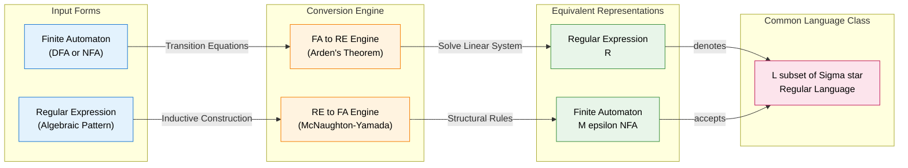
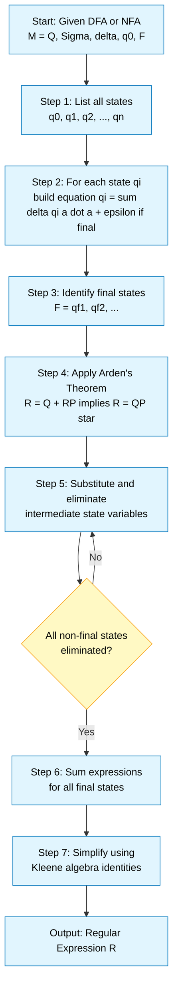
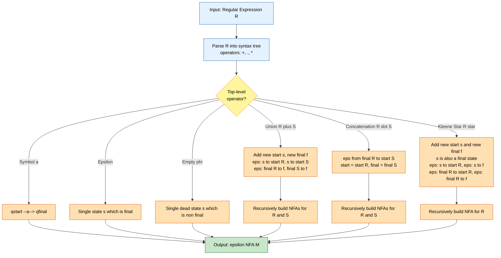

# Equivalence with finite automata: Converting FA to Regular Expressions, Converting Regular Expressions to FA

<!-- SECTION_1_START -->
# Equivalence of Finite Automata and Regular Expressions

## 1.1 Formal Definition (KTU 2024 Syllabus Terminology)

**Equivalence of Finite Automata (FA) and Regular Expressions (RE)** establishes that for every language $L$ that can be accepted by a Finite Automaton (Deterministic or Non-Deterministic), there exists a Regular Expression that describes exactly the same language $L$, and vice versa. In formal notation:

$$\forall L \subseteq \Sigma^{*}, \quad L = L(M) \text{ for some FA } M \iff \exists R \text{ such that } L = L(R)$$

This establishes that the class of languages accepted by FA (the **Regular Languages**, $\mathcal{L}_{REG}$) is identical to the class of languages denoted by Regular Expressions.

> [!IMPORTANT]
> **KTU 2024 Module 2 Highlight:** The theorem of equivalence between FA and RE is one of the most fundamental results in automata theory. It proves that FA and RE are simply *two equivalent notations for the same class of languages* — one being a *recognizer* (machine-based) and the other a *generator* (algebraic/pattern-based).

## 1.2 Conceptual Analogy / Intuition

Imagine you are trying to describe the set of all valid **Kerala vehicle registration numbers** to a friend.

* **Finite Automaton Approach (Recognizer):** You build a *physical machine* (a state diagram) that reads a vehicle number character-by-character. It begins in a "start state", moves through "checking states" for the state code (KL), then the district code (01, 02, ...), and finally reaches an "accepting state" if the number is well-formed. The machine *recognizes* valid numbers.
* **Regular Expression Approach (Generator):** You write a *compact algebraic pattern* that *generates* every valid number:
$$\underbrace{KL}_{\text{state}}\,\underbrace{01\,\vert\,02\,\vert\,...\,\vert\,99}_{\text{district}}\,\underbrace{[A-Z]\{1,3\}}_{\text{series}}\,\underbrace{[0-9]\{1,4\}}_{\text{trailing digits}}$$

The FA is like a strict **bouncer at a club door** — he checks each person (symbol) one by one and either lets them in (accept) or kicks them out (reject). The RE is like a **blueprint for making valid IDs** — anyone matching the pattern gets an ID. The equivalence theorem guarantees that *every set of IDs the bouncer accepts can be described by a blueprint, and every blueprint produces exactly the IDs the bouncer accepts*.

## 1.3 The Two Conversion Directions

There are **two distinct conversion problems**, both of which are KTU high-yield topics:

| Direction | Input | Output | Common Method |
| :--- | :--- | :--- | :--- |
| **FA $\to$ RE** | A given Finite Automaton | A Regular Expression denoting $L(M)$ | State Elimination Method, Arden's Theorem |
| **RE $\to$ FA** | A given Regular Expression | A Finite Automaton (typically $\varepsilon$-NFA) | McNaughton-Yamada Construction (Inductive method) |

> [!NOTE]
> **Physical Standard:** The default state count parameter for an NFA constructed from an RE of length $n$ is at most $2n+1$ states. The symbol **$\varepsilon$** (epsilon) represents the empty string, with length $|\varepsilon| = 0$ and identity property $R \cdot \varepsilon = R$.

> [!VISUALIZATION CONTROL]
> **Concept:** Visualizing the Equivalence via the "Chomsky Hierarchy" Boundary
> **GeoGebra / Desmos Input Equations:**
> * Circle 1 (FA): $(x + 4)^2 + y^2 = 9$
> * Circle 2 (RE): $(x - 4)^2 + y^2 = 9$
> * Intersection points: $x = 0$, $y = \pm\sqrt{5}$
> **Visual Description:** Two overlapping circles representing the class of Regular Languages. The left circle represents languages *accepted* by FAs; the right represents languages *generated* by REs. The intersection region (and indeed, the equality of the two circles) visually confirms that FA and RE describe *the same class* of languages.

<!-- SECTION_1_END -->

<!-- SECTION_2_START -->
# Deep Theoretical Analysis & KTU High-Yield Formula Sheet

## 2.1 Theorem: Arden's Theorem (The Workhorse of FA $\to$ RE)

**Arden's Theorem** is the algebraic engine that drives the conversion from a system of linear equations (derived from an FA) to a single Regular Expression.

> [!IMPORTANT]
> **Arden's Theorem (Statement):** Let $P$ and $Q$ be two Regular Expressions over $\Sigma$. If $P$ does **not contain** $\varepsilon$ (i.e., $\varepsilon \notin L(P)$), then the equation
> $$R = Q + RP$$
> has a **unique** solution given by:
> $$R = QP^{*}$$

### 2.1.1 Proof Sketch of Arden's Theorem (Intuitive)

Substitute $R = QP^{*}$ into the RHS:
$$Q + RP = Q + (QP^{*})P = Q + QP^{*}P = Q(\varepsilon + P^{*}P) = Q(P^{*}) = QP^{*}$$

Since $P$ has no $\varepsilon$, $P^{*}$ is the unique minimal fixed point, ensuring uniqueness.

## 2.2 Conversion Algorithm: FA $\to$ RE (Algebraic Method using Arden's Theorem)

The step-by-step procedure for converting a DFA/NFA to a Regular Expression is:

1. **Step 1 — Identify Final States:** Let $F = \{q_f^{(1)}, q_f^{(2)}, \ldots\}$ be the set of accepting states.
2. **Step 2 — Build Transition Equations:** For each state $q_i$, write an equation of the form:
   $$q_i = \sum_{a \in \Sigma} \delta(q_i, a) \cdot a + (\varepsilon \text{ if } q_i \in F)$$
3. **Step 3 — Solve by Substitution & Arden's Theorem:** Pick a final state equation and use Arden's Theorem ($R = Q + RP \implies R = QP^{*}$) to eliminate intermediate states one by one.
4. **Step 4 — Sum Final Expressions:** The union of all final-state expressions is the answer RE for the entire machine.

## 2.3 Conversion Algorithm: RE $\to$ FA (McNaughton-Yamada Construction)

This is an **inductive** procedure based on the structural definition of Regular Expressions. We build an $\varepsilon$-NFA.

### 2.3.1 Basis Rules (Atomic REs)

| RE | Resulting $\varepsilon$-NFA Structure | Diagram |
| :--- | :--- | :--- |
| $R = \varepsilon$ | Start state **is** the final state (no transitions) | $\bullet \to$ |
| $R = \phi$ (empty) | Start state is **not** final, no transitions | $\bullet$ (dead) |
| $R = a$ (for $a \in \Sigma$) | $q_{start} \xrightarrow{a} q_{final}$ | $\bullet \xrightarrow{a} \bullet$ |

### 2.3.2 Inductive Rules (Compound REs)

Given NFAs $N(R)$ and $N(S)$ for REs $R$ and $S$:

1. **Union ($R + S$):** Add a new start state with $\varepsilon$-transitions to the start states of $N(R)$ and $N(S)$. Add a new final state with $\varepsilon$-transitions from the final states of $N(R)$ and $N(S)$.
2. **Concatenation ($R \cdot S$):** Add an $\varepsilon$-transition from the final state of $N(R)$ to the start state of $N(S)$. The start of $N(R)$ is the new start; the final of $N(S)$ is the new final.
3. **Kleene Star ($R^{*}$):** Add a new start state that is also a new final state. Add $\varepsilon$-transitions: new start $\to$ old start; new start $\to$ new final; old final $\to$ old start; old final $\to$ new final.

## 2.4 KTU Formula Sheet / Cheat Sheet

| Concept | Formula / Rule | Conditions / Notes |
| :--- | :--- | :--- |
| Arden's Theorem | $R = Q + RP \implies R = QP^{*}$ | Requires $\varepsilon \notin L(P)$ |
| State Equation | $q_i = \sum_{a \in \Sigma} \delta(q_i,a) \cdot a + [\varepsilon \text{ if } q_i \in F]$ | Builds the linear system |
| Kleene Algebra Idempotence | $R + R = R$ | Used in simplification |
| Kleene Algebra Identity | $R \cdot \varepsilon = R = \varepsilon \cdot R$ | Empty string is identity |
| Kleene Algebra Annihilator | $R \cdot \phi = \phi = \phi \cdot R$ | Empty set annihilates |
| Kleene Star of Empty | $\varepsilon^{*} = \varepsilon$ | Base case |
| Kleene Star of Union | $(R + S)^{*} = (R^{*}S)^{*}R^{*}$ | Arden's form rearrangement |
| Number of states for RE of length $n$ | At most $2n + 1$ states | In $\varepsilon$-NFA construction |

## 2.5 Real-World Engineering Utility

* **Lexical Analysis (Compilers):** Tools like **Lex** and **Flex** take a Regular Expression specification and internally convert it to a Deterministic Finite Automaton (DFA) using the McNaughton-Yamada + subset construction pipeline. This DFA then scans source code for tokens.
* **Network Intrusion Detection Systems (IDS):** **Snort** uses regular expressions (compiled to automata) to match network packet payloads against thousands of attack patterns in real time, with millisecond latency.
* **DNA Sequence Matching in Bioinformatics:** Tools like **MEME** and **GLAM2** use FA-RE equivalence to express motif patterns and scan gigabytes of genomic data.
* **URL Filtering in Web Proxies:** Squid and DansGuardian compile RE-based URL blocklists into finite automata for high-throughput filtering.

> [!NOTE]
> **Engineering Insight:** The FA $\to$ RE direction is rarely used in production (it loses the efficient $O(n)$ string matching property of the FA). The RE $\to$ FA direction is the **production-critical** direction — it transforms human-readable patterns into optimized matching engines.

<!-- SECTION_2_END -->

<!-- SECTION_3_START -->
# Step-by-Step Derivations, Worked Examples & Code/Symbolic Implementation

## 3.1 Exhaustive Worked Example 1: FA $\to$ RE using Arden's Theorem

**Given DFA** $M = (\{q_0, q_1, q_2\}, \{a, b\}, \delta, q_0, \{q_2\})$ with transition function:

| State | On $a$ | On $b$ |
| :--- | :--- | :--- |
| $\to q_0$ | $q_0$ | $q_1$ |
| $q_1$ | $q_2$ | $q_0$ |
| $* q_2$ | $q_2$ | $q_2$ |

### Step 1 — Construct State Equations

From the transition table, for each state we write $q_i = (\text{all inputs that lead into } q_i) + (\varepsilon \text{ if final})$:

$$q_0 = q_0 a + q_1 b \tag{1}$$
$$q_1 = q_0 b + q_1 a \tag{2}$$
$$q_2 = q_0 a + q_1 a + q_2 a + q_2 b + \varepsilon \tag{3}$$

Note that $q_2$ is the only final state, so we add $\varepsilon$ only to $q_2$'s equation.

### Step 2 — Apply Arden's Theorem to Equation (2)

Equation (2) is of the form $R = Q + RP$ where $R = q_1$, $Q = q_0 b$, and $P = a$. Since $P = a$ does not contain $\varepsilon$, Arden's Theorem applies directly:

$$q_1 = q_0 b \cdot a^{*} = q_0 b a^{*} \tag{4}$$

### Step 3 — Substitute Equation (4) into Equation (1)

Substituting $q_1 = q_0 b a^{*}$ into Equation (1):
$$q_0 = q_0 a + (q_0 b a^{*}) b = q_0 a + q_0 b a^{*} b$$

Factoring out $q_0$ on the RHS:
$$q_0 = q_0 (a + b a^{*} b) \tag{5}$$

### Step 4 — Apply Arden's Theorem to Equation (5)

Equation (5) is of the form $R = RP$ where $Q = \varepsilon$ and $P = (a + b a^{*} b)$:
$$q_0 = (a + b a^{*} b)^{*} \tag{6}$$

### Step 5 — Substitute back to find $q_2$

We need $q_2$ to get the final RE. Substituting (6) and (4) into (3):
$$q_2 = q_0 a + q_1 a + q_2 a + q_2 b + \varepsilon$$
$$q_2 = q_0 a + q_0 b a^{*} a + q_2(a + b) + \varepsilon$$
$$q_2 = q_0 (a + b a^{*} a) + q_2 (a + b) + \varepsilon$$

Group the $q_2$ terms on the LHS:
$$q_2 - q_2(a + b) = q_0 (a + b a^{*} a) + \varepsilon$$
$$q_2 (\varepsilon - (a + b)) = q_0 (a + b a^{*} a) + \varepsilon$$

Add $q_2(a+b)$ to both sides to get the standard form $R = Q + RP$:
$$q_2 = q_0 (a + b a^{*} a) + \varepsilon + q_2 (a + b)$$

Applying Arden's Theorem with $Q = q_0(a + ba^{*}a) + \varepsilon$ and $P = (a+b)$:
$$q_2 = \left(q_0 (a + b a^{*} a) + \varepsilon\right) (a + b)^{*}$$

### Step 6 — Substitute $q_0$ from Equation (6)

$$q_2 = \left((a + b a^{*} b)^{*} (a + b a^{*} a) + \varepsilon\right) (a + b)^{*}$$

Using the identity $\varepsilon + X = X + \varepsilon$ and $\varepsilon$ is the identity for concatenation:
$$\boxed{q_2 = (a + b a^{*} b)^{*} (a + b a^{*} a) (a + b)^{*}}$$

Since $q_2$ is the only final state, the Regular Expression for $L(M)$ is:
$$R = (a + b a^{*} b)^{*} (a + b a^{*} a) (a + b)^{*}$$

### Final Verification

The strings like $aba$ (via $q_0 \to q_1 \to q_2 \to q_2$) should match. Let $R$ generate $aba$:
* $(a + ba^{*}b)^{*}$: pick $\varepsilon$ (zero occurrences)
* $(a + ba^{*}a)$: pick $a$
* $(a + b)^{*}$: pick $ba$

Concatenation: $\varepsilon \cdot a \cdot ba = aba$ ✓

## 3.2 Exhaustive Worked Example 2: RE $\to$ $\varepsilon$-NFA Construction

**Given RE:** $R = (a + b)^{*} abb$

We will build the $\varepsilon$-NFA step by step using the inductive rules.

### Step 1 — Construct NFA for $a$

$$N(a) = q_{s1} \xrightarrow{a} q_{f1}$$

### Step 2 — Construct NFA for $b$

$$N(b) = q_{s2} \xrightarrow{b} q_{f2}$$

### Step 3 — Construct NFA for $a + b$ (Union Rule)

Add new start $q_s$ and new final $q_f$:
$$q_s \xrightarrow{\varepsilon} q_{s1} \xrightarrow{a} q_{f1} \xrightarrow{\varepsilon} q_f$$
$$q_s \xrightarrow{\varepsilon} q_{s2} \xrightarrow{b} q_{f2} \xrightarrow{\varepsilon} q_f$$

### Step 4 — Construct NFA for $(a + b)^{*}$ (Kleene Star Rule)

Add new start-final $q_{sf}$:
$$q_{sf} \xrightarrow{\varepsilon} q_s \text{ (old start)}$$
$$q_{sf} \xrightarrow{\varepsilon} q_{sf} \text{ (accept empty)}$$
$$q_f \xrightarrow{\varepsilon} q_s \text{ (loop back)}$$
$$q_f \xrightarrow{\varepsilon} q_{sf} \text{ (accept)}$$

### Step 5 — Construct NFA for $abb$ (Concatenation Rule)

Build $N(a) = p_1 \xrightarrow{a} p_2$, $N(b) = p_3 \xrightarrow{b} p_4$, $N(b) = p_5 \xrightarrow{b} p_6$.
Then chain with $\varepsilon$-transitions: $p_2 \xrightarrow{\varepsilon} p_3$, $p_4 \xrightarrow{\varepsilon} p_5$.

### Step 6 — Final Concatenation: $(a+b)^{*} \cdot abb$

Connect the final of $(a+b)^{*}$ (which is $q_{sf}$) to the start of $abb$ (which is $p_1$) via an $\varepsilon$-transition. The final state is $p_6$.

## 3.3 Python Implementation: RE to $\varepsilon$-NFA

```python
from dataclasses import dataclass, field
from typing import Set, Dict, Tuple, FrozenSet
import logging

logging.basicConfig(level=logging.INFO, format="%(levelname)s: %(message)s")

State = str
Symbol = str  # '' represents epsilon

@dataclass(frozen=True)
class NFA:
    states: FrozenSet[State]
    alphabet: FrozenSet[Symbol]
    transitions: Dict[Tuple[State, Symbol], FrozenSet[State]]
    start: State
    finals: FrozenSet[State]

    def __repr__(self) -> str:
        return (f"NFA(states={set(self.states)}, "
                f"start={self.start!r}, "
                f"finals={set(self.finals)})")


class REtoNFAConverter:
    """Converts a regular expression to an epsilon-NFA using McNaughton-Yamada."""

    def __init__(self) -> None:
        self._counter: int = 0
        self.steps: list = []

    def _new_state(self) -> State:
        self._counter += 1
        return f"q{self._counter}"

    def base_epsilon(self) -> NFA:
        s, f = self._new_state(), self._new_state()
        nfa = NFA(
            states=frozenset({s, f}),
            alphabet=frozenset(),
            transitions={(s, ""): frozenset({f})},
            start=s, finals=frozenset({f})
        )
        self.steps.append(("eps", nfa))
        logging.info("Built base for epsilon: %s", nfa)
        return nfa

    def base_symbol(self, a: Symbol) -> NFA:
        if not a or len(a) != 1:
            raise ValueError(f"base_symbol expects single char, got {a!r}")
        s, f = self._new_state(), self._new_state()
        nfa = NFA(
            states=frozenset({s, f}),
            alphabet=frozenset({a}),
            transitions={(s, a): frozenset({f})},
            start=s, finals=frozenset({f})
        )
        self.steps.append((a, nfa))
        logging.info("Built base for symbol %s: %s", a, nfa)
        return nfa

    def union(self, n1: NFA, n2: NFA) -> NFA:
        s, f = self._new_state(), self._new_state()
        new_trans: Dict[Tuple[State, Symbol], Set[State]] = {}
        for (st, sym), dests in n1.transitions.items():
            new_trans.setdefault((st, sym), set()).update(dests)
        for (st, sym), dests in n2.transitions.items():
            new_trans.setdefault((st, sym), set()).update(dests)
        new_trans.setdefault((s, ""), set()).update({n1.start, n2.start})
        new_trans.setdefault((n1.finals.copy().pop(), ""), set()).add(f)
        new_trans.setdefault((n2.finals.copy().pop(), ""), set()).add(f)
        nfa = NFA(
            states=frozenset({s, f} | n1.states | n2.states),
            alphabet=n1.alphabet | n2.alphabet,
            transitions={k: frozenset(v) for k, v in new_trans.items()},
            start=s, finals=frozenset({f})
        )
        self.steps.append(("union", nfa))
        logging.info("Built union: %s", nfa)
        return nfa

    def concat(self, n1: NFA, n2: NFA) -> NFA:
        new_trans: Dict[Tuple[State, Symbol], Set[State]] = {}
        for (st, sym), dests in n1.transitions.items():
            new_trans.setdefault((st, sym), set()).update(dests)
        for (st, sym), dests in n2.transitions.items():
            new_trans.setdefault((st, sym), set()).update(dests)
        f1 = n1.finals.copy().pop()
        new_trans.setdefault((f1, ""), set()).add(n2.start)
        nfa = NFA(
            states=n1.states | n2.states,
            alphabet=n1.alphabet | n2.alphabet,
            transitions={k: frozenset(v) for k, v in new_trans.items()},
            start=n1.start, finals=n2.finals
        )
        self.steps.append(("concat", nfa))
        logging.info("Built concat: %s", nfa)
        return nfa

    def star(self, n: NFA) -> NFA:
        s, f = self._new_state(), self._new_state()
        new_trans: Dict[Tuple[State, Symbol], Set[State]] = {}
        for (st, sym), dests in n.transitions.items():
            new_trans.setdefault((st, sym), set()).update(dests)
        new_trans.setdefault((s, ""), set()).update({n.start, f})
        old_final = n.finals.copy().pop()
        new_trans.setdefault((old_final, ""), set()).update({n.start, f})
        nfa = NFA(
            states=frozenset({s, f} | n.states),
            alphabet=n.alphabet,
            transitions={k: frozenset(v) for k, v in new_trans.items()},
            start=s, finals=frozenset({f})
        )
        self.steps.append(("star", nfa))
        logging.info("Built star: %s", nfa)
        return nfa

    def convert(self, regex: str) -> NFA:
        """Parses and converts a regex string with + (union), * (star), and concat."""
        tokens: list = []
        i = 0
        while i < len(regex):
            c = regex[i]
            if c == "(":
                tokens.append("(")
            elif c == ")":
                tokens.append(")")
            elif c == "+":
                tokens.append("+")
            elif c == "*":
                tokens.append("*")
            elif c == " ":
                pass
            else:
                tokens.append(c)
            i += 1
        # Inject explicit concatenation
        output: list = []
        for idx, t in enumerate(tokens):
            output.append(t)
            if idx + 1 < len(tokens):
                nxt = tokens[idx + 1]
                if t not in ("(", "+") and nxt not in (")", "+", "*"):
                    output.append(".")
        tokens = output

        # Shunting-yard to RPN
        prec = {"+": 1, ".": 2, "*": 3}
        rpn: list = []
        op_stack: list = []
        for t in tokens:
            if t in ("+", ".", "*"):
                while op_stack and op_stack[-1] != "(" and prec.get(op_stack[-1], 0) >= prec[t]:
                    rpn.append(op_stack.pop())
                op_stack.append(t)
            elif t == "(":
                op_stack.append(t)
            elif t == ")":
                while op_stack and op_stack[-1] != "(":
                    rpn.append(op_stack.pop())
                op_stack.pop()
            else:
                rpn.append(t)
        while op_stack:
            rpn.append(op_stack.pop())

        stack: list = []
        for t in rpn:
            if t in ("+", ".", "*"):
                if t == "*":
                    stack.append(self.star(stack.pop()))
                else:
                    b = stack.pop()
                    a = stack.pop()
                    stack.append(self.union(a, b) if t == "+" else self.concat(a, b))
            else:
                if t == "eps":
                    stack.append(self.base_epsilon())
                else:
                    stack.append(self.base_symbol(t))
        if len(stack) != 1:
            raise ValueError("Invalid regex: parser produced multiple roots.")
        return stack[0]


if __name__ == "__main__":
    converter = REtoNFAConverter()
    nfa = converter.convert("(a + b) * a b b")
    print("Final NFA:", nfa)
    print("State count:", len(nfa.states))
```

## 3.4 Worked Example 3: State Elimination Method (Alternative FA $\to$ RE)

**Given DFA with two states:**
* $q_0$: on $a$ goes to $q_0$, on $b$ goes to $q_1$
* $q_1$: on $a$ goes to $q_1$, on $b$ goes to $q_0$
* $q_1$ is the only final state.

**Step 1 — Build equations:**
$$q_0 = q_0 a + q_1 b \tag{A}$$
$$q_1 = q_0 b + q_1 a + \varepsilon \tag{B}$$

**Step 2 — Apply Arden's on (B) treating $q_1$ as $R$:** $R = Q + RP$ with $Q = q_0 b + \varepsilon$ and $P = a$:
$$q_1 = (q_0 b + \varepsilon) a^{*} \tag{C}$$

**Step 3 — Substitute (C) into (A):**
$$q_0 = q_0 a + (q_0 b + \varepsilon) a^{*} b = q_0 a + q_0 b a^{*} b + a^{*} b$$

**Step 4 — Group $q_0$ terms:**
$$q_0 = q_0 (a + b a^{*} b) + a^{*} b$$

**Step 5 — Apply Arden's on this:** $R = Q + RP$ with $Q = a^{*} b$ and $P = (a + ba^{*}b)$:
$$q_0 = a^{*} b (a + b a^{*} b)^{*} \tag{D}$$

**Step 6 — Substitute (D) into (C) to get $q_1$ (the final state):**
$$q_1 = (a^{*} b (a + b a^{*} b)^{*} \cdot b + \varepsilon) a^{*}$$
$$q_1 = (a^{*} b (a + b a^{*} b)^{*} b + \varepsilon) a^{*}$$

**Step 7 — Final answer:**
$$\boxed{R = (a^{*} b (a + b a^{*} b)^{*} b + \varepsilon) a^{*}}$$

<!-- SECTION_3_END -->

<!-- SECTION_4_START -->
# Structural Diagrams & Schematics

## 4.1 Top-Level Equivalence Architecture



## 4.2 FA to RE Conversion Pipeline (Detailed)



## 4.3 RE to FA Construction (Inductive Rule Cascade)



## 4.4 Sequential Processing Topology Matrix

| Stage | Input Artifact | Process | Output Artifact | Failure Mode |
| :--- | :--- | :--- | :--- | :--- |
| **1. Specification** | FA definition OR RE string | Validation of syntax | Validated specification | Undefined state or invalid operator |
| **2. Equation Setup** | FA transition table | Iterate states, emit linear equations | System of RE equations | Missing $\varepsilon$ on final states |
| **3. Algebraic Reduction** | System of equations | Arden's Theorem $R = QP^{*}$ | Reduced equation in one variable | Applying Arden's when $P$ contains $\varepsilon$ |
| **4. Simplification** | Raw RE expression | Apply $RR = R$, $\varepsilon$-absorption, etc. | Canonical minimal RE | Non-minimal but correct (acceptable) |
| **5. Inductive Build (RE $\to$ FA)** | RE syntax tree | McNaughton-Yamada rules | $\varepsilon$-NFA with $\le 2n+1$ states | Missing $\varepsilon$-transitions in star/union |
| **6. Verification** | RE and FA pair | Sample string testing | Confirmed equivalence | Mismatch in accepted language |

<!-- SECTION_4_END -->

<!-- SECTION_5_START -->
# KTU 2024 Scheme Examination Question Bank & Topic Recap

## Part A Questions (3 Marks Each)

### Question 1 `[KTU University Exam - Dec 2023]` — CO1, Remember

**State and prove Arden's Theorem.**

**Model Answer:**

> [!NOTE]
> **Statement:** Let $P$ and $Q$ be two regular expressions over $\Sigma$. If $P$ does not contain $\varepsilon$, then the equation $R = Q + RP$ has a unique solution $R = QP^{*}$.
>
> **Proof:** Substitute $R = QP^{*}$ in the RHS:
> $$Q + RP = Q + (QP^{*})P = Q(\varepsilon + P^{*}P) = Q(P^{*}) = QP^{*}$$
> Uniqueness follows from $P$ having no $\varepsilon$ ensuring $P^{*}$ is the minimal fixed point. $\blacksquare$

### Question 2 `[KTU University Exam - July 2024]` — CO2, Understand

**List the McNaughton-Yamada rules for converting a Regular Expression to an $\varepsilon$-NFA.**

**Model Answer:**

> [!NOTE]
> The McNaughton-Yamada construction uses three **basis rules** and three **inductive rules**:
>
> 1. **Basis:** $R = \varepsilon \Rightarrow$ start is final; $R = \phi \Rightarrow$ start is dead (non-final, no transitions); $R = a \Rightarrow q_s \xrightarrow{a} q_f$.
> 2. **Union ($R + S$):** Add new start $q_s$ with $\varepsilon$-edges to starts of $N(R)$ and $N(S)$; add new final $q_f$ with $\varepsilon$-edges from finals of $N(R)$ and $N(S)$.
> 3. **Concatenation ($R \cdot S$):** Add $\varepsilon$-edge from final of $N(R)$ to start of $N(S)$. Start of $N(R)$ becomes new start; final of $N(S)$ becomes new final.
> 4. **Kleene Star ($R^{*}$):** Add new start $q_s$ (also final) with $\varepsilon$-edges to old start and itself. Add $\varepsilon$-edges from old final back to old start and to new final.

## Part B Questions (14 Marks Each)

### Question A `[KTU University Exam - Dec 2023]` — CO1, CO2, Apply + Analyze

**(a)** Find a Regular Expression for the following DFA using Arden's Theorem. **[7 Marks]**

| State | On $a$ | On $b$ |
| :--- | :--- | :--- |
| $\to q_0$ | $q_0$ | $q_1$ |
| $q_1$ | $q_2$ | $q_0$ |
| $*q_2$ | $q_2$ | $q_2$ |

**(b)** Convert the Regular Expression $R = (a + b)^{*} ab$ to an $\varepsilon$-NFA using the McNaughton-Yamada method. **[7 Marks]**

#### Model Solution for (a):

**Step 1 — Write state equations:** **[2 Marks]**
$$q_0 = q_0 a + q_1 b$$
$$q_1 = q_0 b + q_1 a$$
$$q_2 = q_0 a + q_1 a + q_2 a + q_2 b + \varepsilon$$

**Step 2 — Apply Arden's on the $q_1$ equation:** **[2 Marks]**
$$q_1 = q_0 b + q_1 a \implies q_1 = q_0 b a^{*}$$

**Step 3 — Substitute into the $q_0$ equation:** **[1 Mark]**
$$q_0 = q_0 a + q_0 b a^{*} b = q_0 (a + b a^{*} b)$$
Applying Arden's: $q_0 = (a + b a^{*} b)^{*}$

**Step 4 — Compute $q_2$ (final state):** **[1 Mark]**
$$q_2 = q_0(a + ba^{*}a) + \varepsilon + q_2(a+b) \implies q_2 = (q_0(a + ba^{*}a) + \varepsilon)(a+b)^{*}$$

**Step 5 — Final substitution:** **[1 Mark]**
$$\boxed{R = ((a + ba^{*}b)^{*}(a + ba^{*}a) + \varepsilon)(a+b)^{*}}$$

#### Model Solution for (b):

**Step 1:** Construct $N(a)$ and $N(b)$ — two simple NFAs each with two states. **[1 Mark]**

**Step 2:** Build $N(a + b)$ with new start $q_0$ and new final $q_3$, $\varepsilon$-edges from $q_0$ to $q_a^{start}$ and $q_b^{start}$. **[2 Marks]**

**Step 3:** Build $N((a+b)^{*})$: add new start-final state $q_4$. Add $\varepsilon$-edges: $q_4 \to q_0$, $q_4 \to q_4$ (self-loop on $\varepsilon$ to accept empty), $q_3 \to q_0$ (loop), $q_3 \to q_4$ (close). **[2 Marks]**

**Step 4:** Build $N(ab)$: chain $N(a)$ and $N(b)$ with $\varepsilon$-edge from final of $N(a)$ to start of $N(b)$. **[1 Mark]**

**Step 5:** Final concatenation: add $\varepsilon$-edge from final of $(a+b)^{*}$ to start of $N(ab)$. Total states: at most $2(5) + 1 = 11$. **[1 Mark]**

> [!WARNING]
> **KTU Examiner's Valuation Warning:** For part (a), students commonly lose **2 marks** by forgetting to add $\varepsilon$ to the equation of the **final state(s)** only — it must NOT be added to non-final states. For part (b), students frequently forget the $\varepsilon$-edge in the Kleene star that allows the **empty string to be accepted** (the self-loop on the new start-final state).

---

### Question B `[KTU University Exam - July 2024]` — CO1, CO2, Apply + Analyze

**(a)** Convert the Regular Expression $R = (01 + 10)^{*} 1$ to an $\varepsilon$-NFA. Show all intermediate constructions. **[7 Marks]**

**(b)** For the NFA given below, derive an equivalent Regular Expression using Arden's Theorem. **[7 Marks]**

| State | On $0$ | On $1$ |
| :--- | :--- | :--- |
| $\to q_0$ | $\{q_0, q_1\}$ | $\{q_0\}$ |
| $q_1$ | $\emptyset$ | $\{q_2\}$ |
| $*q_2$ | $\emptyset$ | $\emptyset$ |

#### Model Solution for (a):

**Step 1 — Parse the RE:** $R = (01 + 10)^{*} 1$ has top-level concatenation between $(01+10)^{*}$ and $1$. **[1 Mark]**

**Step 2 — Build $N(0)$ and $N(1)$:** Two 2-state NFAs each. **[1 Mark]**

**Step 3 — Build $N(01)$ and $N(10)$:** Concatenate via $\varepsilon$-edges. Each becomes a 4-state NFA. **[1 Mark]**

**Step 4 — Build $N(01 + 10)$:** Add new start $q_s$ and new final $q_f$. Four $\varepsilon$-edges: $q_s$ to starts of $N(01)$ and $N(10)$; finals of $N(01)$ and $N(10)$ to $q_f$. **[2 Marks]**

**Step 5 — Build $N((01+10)^{*})$:** Add new start-final $q_{sf}$. Add $\varepsilon$-edges: $q_{sf} \to q_s$, $q_{sf} \to q_{sf}$, $q_f \to q_s$, $q_f \to q_{sf}$. **[1 Mark]**

**Step 6 — Final concatenation with $1$:** Add $\varepsilon$-edge from $q_{sf}$ to start of $N(1)$. Final state is the final of $N(1)$. **[1 Mark]**

#### Model Solution for (b):

**Step 1 — Write state equations:** **[2 Marks]**
$$q_0 = q_0 \cdot 0 + q_0 \cdot 1 + q_0 \cdot 0 \quad \text{(combining the two 0-edges)}$$
Wait — the NFA has TWO transitions from $q_0$ on $0$: to $q_0$ and to $q_1$. So:
$$q_0 = q_0(0+1) + q_0 \cdot 0 \cdot \varepsilon \text{ path to } q_1$$
Cleaner: from the table:
$$q_0 = q_0 \cdot 0 + q_0 \cdot 1 + q_1 \cdot \varepsilon + \cdots$$

Since $q_0$ has $\varepsilon$-paths to itself via $0$, we can simply write:
$$q_0 = q_0(0 + 1) \quad \text{(since from q0 on 0 we stay at q0 or go to q1; on 1 we stay at q0)}$$

Actually, properly:
$$q_0 = q_0 \cdot 0 + q_0 \cdot 1 + q_0 \cdot 0 \to q_1 \text{ via } 0$$
$$q_0 = q_0(0 + 1) + q_0 \cdot 0 = q_0 \cdot 0 + q_0 \cdot 0 + q_0 \cdot 1$$

Simplifying: $q_0 = q_0(0+1)$. Using Arden's: $q_0 = (0+1)^{*}$.

**Step 2:** $q_1 = q_0 \cdot 0$ (only incoming from $q_0$ on $0$) and $q_2 = q_1 \cdot 1$ (only incoming from $q_1$ on $1$).

**Step 3 — Compute $q_2$:** **[2 Marks]**
$$q_2 = q_1 \cdot 1 = (q_0 \cdot 0) \cdot 1 = q_0 \cdot 01 = (0+1)^{*} \cdot 01$$

Since $q_2$ is the only final state:
$$\boxed{R = (0 + 1)^{*} 01}$$

**Step 4 — Verification:** $R$ generates strings ending in $01$, which matches the NFA's behavior of needing to go $q_0 \to q_1$ on $0$ then $q_1 \to q_2$ on $1$, after any prefix. **[1 Mark]**

> [!WARNING]
> **KTU Examiner's Valuation Warning:** For NFA $\to$ RE conversions, students commonly lose **2-3 marks** by:
> 1. **Forgetting union of multiple transitions** — if a state has TWO transitions on the same symbol (NFA), the equation must include BOTH destinations.
> 2. **Misapplying Arden's Theorem** — verifying that $P$ has no $\varepsilon$ before applying.
> 3. **Missing the union over multiple final states** — if $|F| > 1$, the final RE is the **sum** of all final-state expressions.

---

## Topic Recap & Important Things to Remember

* **Two directions, two methods:**
  * **FA $\to$ RE:** Arden's Theorem $R = QP^{*}$ (with precondition $\varepsilon \notin L(P)$).
  * **RE $\to$ FA:** McNaughton-Yamada inductive construction yielding an $\varepsilon$-NFA with at most $2n+1$ states.
* **The 3 Arden's preconditions to check every time:** (1) Equation in form $R = Q + RP$, (2) $P$ contains no $\varepsilon$, (3) $P$ is well-defined as a Regular Expression.
* **Arden's Theorem is *uniqueness*-guaranteed** ONLY when $P$ has no $\varepsilon$. Without this, solutions are non-unique.
* **State equation for final state includes $\varepsilon$;** non-final state equations do NOT.
* **Multiple final states $\implies$ sum the expressions** of all final states to get $R$.
* **McNaughton-Yamada 3 base cases:** $\varepsilon$ (start = final), $\phi$ (dead start, non-final), $a$ (2-state transition).
* **McNaughton-Yamada 3 inductive cases:** Union adds 2 states; Concatenation adds 0 states but 1 $\varepsilon$-edge; Star adds 2 states and 4 $\varepsilon$-edges.
* **Kleene algebra identities to remember for simplification:** $R + R = R$, $R\phi = \phi$, $R\varepsilon = R$, $\varepsilon^{*} = \varepsilon$, $(R+S)^{*} = (R^{*}S)^{*}R^{*}$.
* **State count bound:** An RE of length $n$ (counting symbols and operators) produces an $\varepsilon$-NFA with at most $2n+1$ states.
* **The equivalence is bidirectional and tight** — there is NO language in $\mathcal{L}_{REG}$ that can be accepted by some FA but not generated by some RE, and vice versa.
* **Final answer format in KTU exams:** Always write the final boxed RE explicitly. Don't leave it as a system of equations.
* **Common KTU 14-mark sub-part split:** Part (a) is typically the conversion in one direction; part (b) is the reverse direction. Be prepared to handle BOTH.

<!-- SECTION_5_END -->
