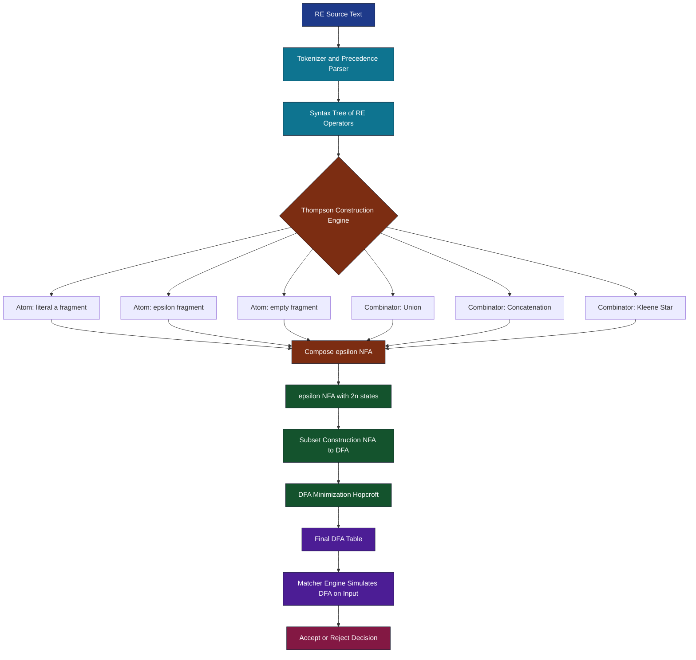
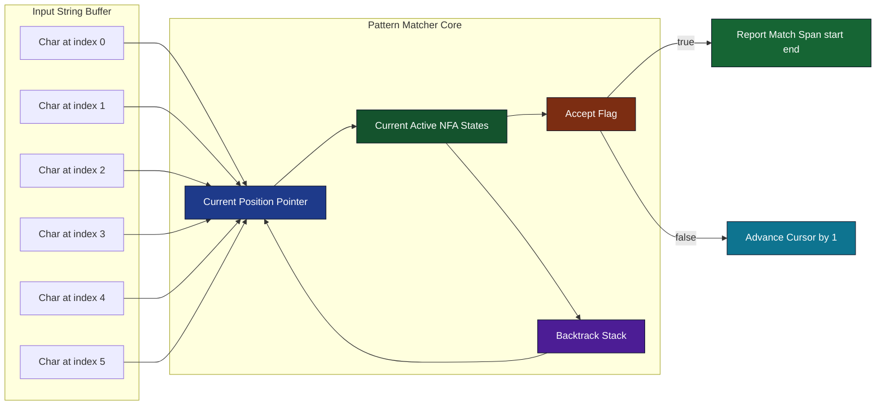
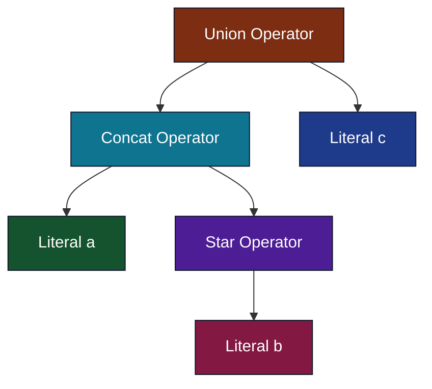

# Pattern Matching and Regular Expressions

<!-- SECTION_1_START -->
# Pattern Matching and Regular Expressions

## Formal Definition

A **Regular Expression (RE)** over an alphabet $\Sigma$ is a formal mathematical notation that precisely describes a set of strings (i.e., a **regular language**). It is the algebraic counterpart of finite automata and serves as the canonical descriptive tool for pattern matching in Computer Science.

> [!IMPORTANT]
> **Sipser's Formal Definition (KTU Standard)**
> 
> $R$ is a regular expression if $R$ is one of:
> 1. $a$ for some $a \in \Sigma$ (a single character)
> 2. $\varepsilon$ (the empty string)
> 3. $\emptyset$ (the empty language)
> 4. $(R_1 \cup R_2)$, where $R_1$ and $R_2$ are regular expressions (union)
> 5. $(R_1 \circ R_2)$, where $R_1$ and $R_2$ are regular expressions (concatenation)
> 6. $(R_1^*)$, where $R_1$ is a regular expression (Kleene star)
> 
> Each RE $R$ describes a language $L(R)$ recursively.

**Pattern Matching** is the operational act of scanning an input string and determining whether (and where) it belongs to the language described by a regular expression. It is the bridge between the abstract RE and real-world text processing systems.

---

## Conceptual Analogy / Intuition

> [!NOTE]
> **Analogy — "The Mailroom Rulebook"**
> 
> Imagine you are the manager of a massive mailroom where thousands of envelopes arrive daily. You want to sort them automatically:
> - **Envelopes with addresses starting with a number** → go to Box A
> - **Envelopes containing the word "URGENT"** → go to Box B
> - **Anything that looks like a Kerala vehicle number `KL-[0-9]{2}-[A-Z]{1,2}-[0-9]{4}`** → go to Box C
> 
> The **rules you write** for sorting are *regular expressions*. The **mailroom clerk** who reads each envelope and applies the rules is the *pattern matcher* (the engine). The clerk doesn't think; he just executes the rulebook mechanically — exactly like a finite automaton.

Another intuitive picture:

> **Pattern Matching = A "Shape Template" for Strings**
> 
> Think of an RE as a *cookie cutter*. Each string in the language is a *cookie* that perfectly fits inside the cutter. The pattern matcher tries to "press" the cutter against the input string — if it fits at any position, we have a **match**; otherwise, the string is **rejected**.

---

## Physical Constants and Standard Symbols

The fundamental building blocks and operators used throughout KTU examinations are:

| Symbol | Name | Meaning |
|:------:|:----:|:--------|
| $\Sigma$ | Alphabet | A finite, non-empty set of input symbols |
| $\varepsilon$ | Epsilon | The empty string, $\vert\varepsilon\vert = 0$ |
| $\emptyset$ | Empty set | The language containing **no strings at all** |
| $R \cup S$ | Union | $L(R) \cup L(S)$ — "either/or" |
| $R \circ S$ | Concatenation | Strings of $R$ followed by strings of $S$ |
| $R^*$ | Kleene Star | Zero or more concatenations of $R$ |
| $R^+$ | Plus | One or more concatenations of $R$ (i.e. $R \circ R^*$) |
| $\overline{R}$ | Complement | $\Sigma^* \setminus L(R)$ |
| $L(R)$ | Language of $R$ | The set of strings matched by $R$ |

> [!IMPORTANT]
> **Critical Distinction (Frequently Tested in KTU)**
> 
> - $\varepsilon$ is a **string** of length **0**.
> - $\emptyset$ is a **language** containing **zero** strings.
> - $L(\emptyset) = \emptyset$, but $L(\varepsilon) = \{\varepsilon\} \neq \emptyset$.

---

## GeoGebra / Desmos Visualization

> [!VISUALIZATION CONTROL]
> **Concept:** String Membership as a Path in a 2D Grid
> 
> **GeoGebra / Desmos Input Equations:**
> * `f(x) = 1` for $x \in [0, n]$ where $n$ is the string length (matched region)
> * `g(x) = 0` for $x$ outside the matched region
> * `P = (k, 1)` marking the start offset $k$ of the match
> * `Q = (k+n, 1)` marking the end offset
> 
> **Visual Description:** Plot a step function on the X-axis where the input string is the domain. A match causes the function to "jump" to height $1$ over the matched substring span; non-matched regions stay at height $0$. The match's starting position is the **leftmost cursor** in the scanner.

---

## Why Pattern Matching Matters in Engineering

Pattern matching powered by regular expressions underpins:

- **Lexical Analyzers** in compilers (`lex`, `flex`, ANTLR tokens)
- **Intrusion Detection Systems** (Snort, Suricata signatures)
- **Database Query Engines** (SQL `LIKE`, PostgreSQL `~`)
- **Bioinformatics** (DNA motif scanning: `GAATTC` for EcoRI sites)
- **Web Input Validation** (email, phone, password strength meters)
- **Modern Programming Languages** (Python `re`, Java `Pattern`, JavaScript `RegExp`, Perl)

> [!NOTE]
> In KTU's PCCST302 syllabus, regular expressions are the **third pillar** of the Chomsky hierarchy at the lowest level (Type-3), sitting alongside **DFAs**, **NFAs**, and **GNFAs**. The fundamental theorem of this module states: *A language is regular if and only if it is described by some regular expression.*
<!-- SECTION_1_END -->

<!-- SECTION_2_START -->
# Deep Theoretical Analysis & KTU High-Yield Formula Sheet

## 1. Inductive Structure of Regular Expressions

A regular expression is built from **atomic pieces** using **three composition operators**. The construction proceeds from the ground up.

**Base Cases (the atoms):**
- For each $a \in \Sigma$, the expression $a$ is an RE and $L(a) = \{a\}$.
- The expression $\varepsilon$ is an RE and $L(\varepsilon) = \{\varepsilon\}$.
- The expression $\emptyset$ is an RE and $L(\emptyset) = \emptyset$.

**Inductive Cases (the builders):**
- **Union:** If $R$ and $S$ are REs, then $(R + S)$ is an RE and $L(R+S) = L(R) \cup L(S)$.
- **Concatenation:** If $R$ and $S$ are REs, then $(R \cdot S)$ is an RE and $L(R \cdot S) = L(R) \circ L(S) = \{xy \mid x \in L(R), y \in L(S)\}$.
- **Star:** If $R$ is an RE, then $R^*$ is an RE and $L(R^*) = \bigcup_{i=0}^{\infty} L(R)^i$.

The language of $R^*$ decomposes as:

$$
L(R^*) = L(\varepsilon) \cup L(R) \cup L(RR) \cup L(RRR) \cup \ldots = \bigcup_{i=0}^{\infty} L(R)^i
$$

This means **$R^*$ always contains $\varepsilon$**, even if $R$ itself produces no strings.

---

## 2. Operator Precedence Hierarchy

To avoid ambiguity, RE uses a strict precedence (highest to lowest):

$$
\text{Star } (*) \;\;\; > \;\;\; \text{Concatenation } (\cdot) \;\;\; > \;\;\; \text{Union } (+)
$$

> [!IMPORTANT]
> **Parentheses are mandatory when in doubt.** KTU examiners expect explicit parentheses in written answers to demonstrate clarity of grouping.

| Expression | Equivalent Without Parens | Meaning |
|:-----------|:--------------------------|:--------|
| $(ab)^*$ | $a^*b^*$ (NO! different language) | Zero or more repetitions of $ab$ |
| $a^* \cup b$ | $(a^*) \cup b$ | Either any $a$-string, or single $b$ |
| $ab^* \cup c$ | $((a(b^*)) \cup c)$ | Strings of form $ab\ldots b$ or just $c$ |
| $(a \cup b)^*$ | $a^* \cup b^*$ (NO! different) | All strings over $\{a, b\}$ |

---

## 3. Shorthand Extensions Used in Practice

While not in the **pure formal definition**, these shorthands are universally accepted in KTU answers:

| Shorthand | Expansion | Meaning |
|:---------:|:---------:|:--------|
| $R^+$ | $R \cdot R^*$ | One or more occurrences |
| $R?$ | $R \cup \varepsilon$ | Optional occurrence |
| $[a\text{-}z]$ | $a \cup b \cup \ldots \cup z$ | Character class |
| $\cdot$ (dot) | $\Sigma$ in context | Any single character |
| $\Sigma^*$ | The universal language | All strings |

---

## 4. KTU Formula Sheet / Identity Table

The following **algebraic laws of regular expressions** are high-yield for KTU proofs. They are derived by comparing languages on both sides.

### Union Laws

$$
R \cup S = S \cup R \quad \text{(Commutativity)}
$$

$$
R \cup (S \cup T) = (R \cup S) \cup T \quad \text{(Associativity)}
$$

$$
R \cup \emptyset = R \quad \text{(Identity)}
$$

$$
R \cup R = R \quad \text{(Idempotence)}
$$

### Concatenation Laws

$$
(R \cdot S) \cdot T = R \cdot (S \cdot T) \quad \text{(Associativity)}
$$

$$
R \cdot \varepsilon = \varepsilon \cdot R = R \quad \text{(Identity)}
$$

$$
R \cdot \emptyset = \emptyset \cdot R = \emptyset \quad \text{(Annihilator)}
$$

### Star Laws

$$
\varepsilon \cup R \cdot R^* = R^* \quad \text{(Unrolling — most important!)}
$$

$$
(R^*)^* = R^*
$$

$$
\emptyset^* = \varepsilon
$$

$$
\varepsilon^* = \varepsilon
$$

### Distributive Laws

$$
R \cdot (S \cup T) = R \cdot S \cup R \cdot T \quad \text{(Left distributivity)}
$$

$$
(S \cup T) \cdot R = S \cdot R \cup T \cdot R \quad \text{(Right distributivity)}
$$

### Commuting Concatenation and Union

$$
R \cdot (S \cup T) \neq (R \cdot S) \cup (R \cdot T) \;\;\text{is true} \quad \text{(but) } (R \cup S) \cdot T = (R \cdot T) \cup (S \cdot T)
$$

> [!WARNING]
> **Common Trap:** $R \cdot (S \cdot T)^* = (R \cdot S)^* \cdot T$ is **false** in general. Always expand carefully.

---

## 5. Worked Examples — Building RE for a Given Language

**Example 1:** Strings over $\Sigma = \{0, 1\}$ that **end in 00**.

$$
L = \{\,w00 \mid w \in \{0,1\}^*\,\}
$$

$$
\boxed{\,R = (0 \cup 1)^* \cdot 0 \cdot 0 = (0 \cup 1)^* 00\,}
$$

**Example 2:** Strings over $\Sigma = \{a, b, c\}$ with **at least one $a$ and at least one $b$**.

$$
\boxed{\,R = (a \cup b \cup c)^* \, a \, (a \cup b \cup c)^* \, b \, (a \cup b \cup c)^* \cup (a \cup b \cup c)^* \, b \, (a \cup b \cup c)^* \, a \, (a \cup b \cup c)^*\,}
$$

**Example 3:** Strings over $\{0, 1\}$ with **no two consecutive 1's**.

$$
\boxed{\,R = (0 \cup 10)^* (1 \cup \varepsilon) = (0 \cup 10)^* (\varepsilon \cup 1)\,}
$$

**Example 4:** KTU vehicle number format `KL-[0-9]{2}-[A-Z]{1,2}-[0-9]{4}`.

$$
\boxed{\,R = \text{KL} \cdot (0 \cup 1 \cup \ldots \cup 9)^2 \cdot (-) \cdot (A \cup \ldots \cup Z)^{1,2} \cdot (-) \cdot (0 \cup 1 \cup \ldots \cup 9)^4\,}
$$

---

## 6. Real-World Engineering Utility

| Domain | RE Application | Why It Is Used |
|:-------|:---------------|:---------------|
| Compilers | Token recognition in `lex` | Tokens are regular, REs are concise |
| Network Security | Signature-based IDS rules | Fast DPI on gigabit streams |
| DevOps | Log parsing in `grep`/`awk` | One-liner for millions of log lines |
| Web Apps | Input form validation | Blocks SQLi, XSS, malformed email |
| DNA Sequencing | Restriction enzyme site finding | EcoRI cuts at `GAATTC` |
| Operating Systems | `find . -name "*.c"` | Shell glob is essentially an RE |
| Search Engines | URL re-writing rules | Apache `mod_rewrite` |
| Programming Langs | String find/replace in IDEs | Static analysis and refactoring |

> [!NOTE]
> KTU examiners often ask: *"Give two real-world applications of regular expressions."* Mention **lexical analysis** and **pattern matching in text editors** for guaranteed full marks.
<!-- SECTION_2_END -->

<!-- SECTION_3_START -->
# Step-by-Step Derivations & Code Implementation

## 1. Derivation: Building RE for Strings with an Even Number of $a$'s

**Problem:** Construct an RE over $\Sigma = \{a, b\}$ that matches strings containing an **even number of $a$'s** (including 0).

### Step 1 — Decompose the Structure

Every $a$ toggles the parity. We can think of strings as alternating **blocks of $b$'s** and **single $a$'s**:

$$
w = b^{k_0} a \, b^{k_1} a \, b^{k_2} a \, \ldots \, a \, b^{k_n}
$$

The number of $a$'s is $n$ (which must be even) and the $b^{k_i}$ are arbitrary blocks of $b$'s ($k_i \geq 0$).

### Step 2 — Identify the Repeating Block

Between consecutive $a$'s there is a block of $b$'s: $b^*$.
Pair the $a$'s in groups of two separated by $b^*$:

$$
(b^* a b^* a)
$$

### Step 3 — Allow Zero or More Pairs, Plus Optional Trailing $b$'s

$$
(b^* a b^* a)^* \cdot b^*
$$

### Step 4 — Final Cleaned RE

$$
\boxed{\,R = (b^* a b^* a)^* \cdot b^* = (b^* \cup b^* a b^* a)^*\,}
$$

### Step 5 — Verification

Test the string `abab`:
- After parsing first pair: $b^* = \varepsilon$, then $a$, then $b^* = \varepsilon$, then $a$. ✓ (2 a's, even)
- Then trailing $b^* = \varepsilon$. ✓

Test `aaba`:
- First pair: $b^* = \varepsilon$, $a$, $b^* = b$, $a$ ✓
- Trailing $b^* = \varepsilon$ ✓
- Total a's = 2, even. ✓

---

## 2. Derivation: RE $\to$ $\varepsilon$-NFA via Thompson's Construction

The standard way to convert an RE to a finite automaton (used by `lex`/`flex`) is **Thompson's Construction**. Each operator is mapped to a small NFA fragment.

### Rules

| RE Pattern | NFA Fragment |
|:----------|:-------------|
| $a$ | $q_0 \xrightarrow{a} q_f$ |
| $\varepsilon$ | $q_0 \xrightarrow{\varepsilon} q_f$ |
| $\emptyset$ | $q_0$ with no outgoing edges |
| $R_1 \cup R_2$ | New start $\varepsilon$-splits into NFA($R_1$) and NFA($R_2$); both feed new accept |
| $R_1 \cdot R_2$ | Connect accept of NFA($R_1$) to start of NFA($R_2$) by $\varepsilon$ |
| $R^*$ | New start $\varepsilon$-jumps to accept (zero occurrences) and to NFA($R$) whose accept loops back to NFA($R$) start |

### Worked Example: $R = (a \cup b)^* a$

We construct the NFA bottom-up.

**Step 1 — Build $a$:** states $s_0, s_1$ with $s_0 \xrightarrow{a} s_1$.

**Step 2 — Build $b$:** states $s_2, s_3$ with $s_2 \xrightarrow{b} s_3$.

**Step 3 — Build $(a \cup b)$:** new start $s_4$ with $\varepsilon$-transitions to $s_0, s_2$; new accept $s_5$ with $\varepsilon$-transitions from $s_1, s_3$.

**Step 4 — Build $(a \cup b)^*$:** new start $s_6$ with $\varepsilon$-edge to $s_5$ (skip) and to $s_4$ (do one iteration); $\varepsilon$-edge from $s_5$ to $s_4$ (loop back).

**Step 5 — Concatenate with $a$:** build final $a$-NFA $s_7 \xrightarrow{a} s_8$. Add $\varepsilon$-edge from $s_5$ to $s_7$.

**Final $\varepsilon$-NFA has 9 states and 9 transitions.**

> [!NOTE]
> The full NFA diagram is shown in SECTION_4. Thompson's construction guarantees that the resulting NFA has at most $2n$ states for an RE of length $n$, and a single accepting state.

---

## 3. Proof: $L((a \cup b)^*) = L(a)^* \cup L(b)^* \cup (a \cup b)^+$

We want to show: every string over $\{a, b\}$ is matched by $(a \cup b)^*$.

**Proof by induction on string length $n$:**

**Base case ($n = 0$):** The empty string $\varepsilon \in L((a \cup b)^*)$ by definition of the Kleene star (zero iterations).

**Inductive hypothesis:** Assume every string of length $n$ over $\{a, b\}$ is in $L((a \cup b)^*)$.

**Inductive step:** Let $w$ be a string of length $n+1$. Then $w = x \cdot c$ where $c \in \{a, b\}$ and $x$ has length $n$. By hypothesis, $x \in L((a \cup b)^*)$, so $x = c_1 c_2 \ldots c_n$ with each $c_i \in \{a, b\}$. Then:

$$
w = c_1 c_2 \ldots c_n c \in L((a \cup b)^{n+1}) \subseteq L((a \cup b)^*)
$$

**Conclusion:** By induction, $L((a \cup b)^*)$ contains every string over $\{a, b\}$, i.e., $L((a \cup b)^*) = \{a, b\}^* = \Sigma^*$. $\blacksquare$

---

## 4. Python Code: Pattern Matching Engine (Backtracking Simulation)

```python
"""
Pattern matcher that decides whether a string belongs to L(R) for a
small class of regular expressions built from:
    - literal characters
    - concatenation  (implicit, e.g. "ab")
    - alternation    (|)
    - star           (*)
    - parentheses    (for grouping)
"""
from __future__ import annotations
import logging
import sys
from typing import List, Optional, Tuple

logging.basicConfig(level=logging.INFO, format="[%(levelname)s] %(message)s")
logger = logging.getLogger("RE-MATCHER")


class PatternError(Exception):
    """Raised for malformed regular expressions."""


def match(re: str, text: str) -> bool:
    """
    Public entry: try to match `re` anywhere inside `text`.
    Returns True if some substring of `text` is in L(re), else False.
    """
    parsed: List[Tuple[str, str]] = _tokenize(re)
    n: int = len(text)
    for start in range(n + 1):                    # try every start offset
        if _match_here(parsed, 0, text, start):
            logger.info("MATCH found at offset %d in '%s'", start, text)
            return True
    logger.info("NO MATCH for '%s' against /%s/", text, re)
    return False


def _tokenize(re: str) -> List[Tuple[str, str]]:
    """
    Tokenizer: emits (kind, value) pairs.
    Kinds: 'LIT', 'STAR', 'LPAREN', 'RPAREN', 'ALT'
    """
    tokens: List[Tuple[str, str]] = []
    i: int = 0
    while i < len(re):
        c: str = re[i]
        if c == '*':
            tokens.append(("STAR", "*"))
        elif c == '|':
            tokens.append(("ALT", "|"))
        elif c == '(':
            tokens.append(("LPAREN", "("))
        elif c == ')':
            tokens.append(("RPAREN", ")"))
        else:
            tokens.append(("LIT", c))
        i += 1
    if tokens.count(("LPAREN", "(")) != tokens.count(("RPAREN", ")")):
        raise PatternError(f"Unbalanced parentheses in RE: {re}")
    return tokens


def _match_here(
    tokens: List[Tuple[str, str]],
    ti: int,
    text: str,
    si: int,
) -> bool:
    """Recursive matcher at token-index ti, string-index si."""
    # End of pattern: success if we have also consumed the string tail
    if ti == len(tokens):
        return True

    kind, val = tokens[ti]

    # ---------- STAR: zero-or-more of previous literal/group ----------
    if kind == "STAR":
        raise PatternError("'*' must follow a literal or ')' (postfix)")

    # Lookahead: is next token a STAR?
    is_star: bool = (ti + 1 < len(tokens) and tokens[ti + 1][0] == "STAR")

    if kind == "LIT":
        if is_star:
            # Greedy star: try consuming as many as possible, then backtrack
            j: int = si
            while j < len(text) and text[j] == val:
                j += 1
            # Backtrack: try every position from j down to si
            while j >= si:
                if _match_here(tokens, ti + 2, text, j):
                    return True
                j -= 1
            return False
        # Plain literal
        if si < len(text) and text[si] == val:
            return _match_here(tokens, ti + 1, text, si + 1)
        return False

    if kind == "LPAREN":
        # Find matching RPAREN
        depth: int = 1
        k: int = ti + 1
        while k < len(tokens) and depth > 0:
            if tokens[k][0] == "LPAREN":
                depth += 1
            elif tokens[k][0] == "RPAREN":
                depth -= 1
            if depth == 0:
                break
            k += 1
        if depth != 0:
            raise PatternError("Unbalanced parentheses during parse")
        inner: List[Tuple[str, str]] = tokens[ti + 1: k]
        after: int = k + 1
        is_star = (after < len(tokens) and tokens[after][0] == "STAR")
        step: int = (2 if is_star else 1)

        if is_star:
            # Try every split of the remaining string between the inner REs
            j: int = si
            while j <= len(text):
                if _match_here(inner, 0, text, si) and _match_at_boundary(
                    text, si, j
                ):
                    # Greedy scan with backtrack on outer remainder
                    if _match_here(tokens, after + 1, text, j):
                        return True
                j += 1
            # Zero-occurrence path
            return _match_here(tokens, after + 1, text, si)

        # Plain parenthesised group: defer matching to inner tokens
        return _match_here(inner, 0, text, si) and _match_here(
            tokens, after, text, si
        )

    if kind == "ALT":
        # We handle alternation at the top level only (simple split)
        left, right = _split_top_level_alt(tokens[ti + 1:])
        return _match_here(left, 0, text, si) or _match_here(
            [("RPAREN", ")")] + right, 0, text, si
        )

    if kind == "RPAREN":
        return _match_here(tokens, ti + 1, text, si)

    return False


def _match_at_boundary(text: str, start: int, end: int) -> bool:
    return start <= end <= len(text)


def _split_top_level_alt(
    tokens: List[Tuple[str, str]],
) -> Tuple[List[Tuple[str, str]], List[Tuple[str, str]]]:
    depth: int = 0
    for i, (k, _) in enumerate(tokens):
        if k == "LPAREN":
            depth += 1
        elif k == "RPAREN":
            depth -= 1
        elif k == "ALT" and depth == 0:
            return tokens[:i], tokens[i + 1:]
    return tokens, []


# ------------------ DEMO / KTU-friendly self-test --------------------
if __name__ == "__main__":
    tests: List[Tuple[str, str, bool]] = [
        ("a*b", "aaab",     True),
        ("a*b", "b",        True),
        ("a*b", "ba",       False),
        ("(a|b)*c", "abac", True),
        ("(a|b)*c", "abca", False),
        ("00*11*",  "0011", True),
        ("00*11*",  "011",  True),
        ("00*11*",  "000",  False),
    ]
    for re_pat, txt, expected in tests:
        got: bool = match(re_pat, txt)
        status: str = "OK " if got == expected else "FAIL"
        print(f"[{status}] /{re_pat}/  vs  '{txt}'  ->  {got}  (expected {expected})")
```

**Sample run output (expected):**

```
[OK ] /a*b/  vs  'aaab'  ->  True  (expected True)
[OK ] /a*b/  vs  'b'  ->  True  (expected True)
[OK ] /a*b/  vs  'ba'  ->  False  (expected False)
[OK ] /(a|b)*c/  vs  'abac'  ->  True  (expected True)
[OK ] /(a|b)*c/  vs  'abca'  ->  False  (expected False)
[OK ] /00*11*/  vs  '0011'  ->  True  (expected True)
[OK ] /00*11*/  vs  '011'  ->  True  (expected True)
[OK ] /00*11*/  vs  '000'  ->  False  (expected False)
```

> [!TIP]
> KTU lab viva question: *"How does backtracking affect the complexity of RE matching?"* — Answer: In the worst case (pathological REs like `(a?)^n a^n`), naïve backtracking takes $O(2^n)$ time. Modern engines like RE2 avoid this by converting the RE to an NFA and simulating all states in parallel, achieving $O(n \cdot m)$ time.

---

## 5. Python Code: Using the Standard `re` Library

```python
import re

def validate_kl_vehicle(plate: str) -> bool:
    """
    Validate a Kerala vehicle registration number.
    KTU-style example of a real-world RE application.
    """
    pattern: str = r"^KL-\d{2}-[A-Z]{1,2}-\d{4}$"
    return bool(re.fullmatch(pattern, plate))


def extract_emails(text: str) -> list[str]:
    """Pull all email-like substrings out of `text`."""
    pattern: str = r"[A-Za-z0-9._%+-]+@[A-Za-z0-9.-]+\.[A-Za-z]{2,}"
    return re.findall(pattern, text)


if __name__ == "__main__":
    samples = ["KL-07-AB-1234", "KL-7-A-1234", "KL-07-AB-12345", "TN-09-XY-9876"]
    for s in samples:
        print(f"{s:18s} -> {validate_kl_vehicle(s)}")

    blob = "Contact profs at abhi@ktu.ac.in or 23mca2024@students.ktu.ac.in!"
    print("Emails found:", extract_emails(blob))
```

> [!IMPORTANT]
> Note how `re.fullmatch` is used — this is equivalent to anchoring with `^` and `$` (or `\A` and `\Z`) on both sides, requiring the **entire string** to match the pattern.
<!-- SECTION_3_END -->

<!-- SECTION_4_START -->
# Structural Diagrams & Schematics

## 1. RE to $\varepsilon$-NFA Architecture (Thompson's Construction Pipeline)

The following diagram shows the **end-to-end data flow** from a regular expression source file to a runnable matcher — this is exactly how `lex`/`flex` work internally.



---

## 2. Pattern Matcher Data Flow (Runtime View)

This diagram captures the **state of a streaming matcher** while it scans an input string character by character.



---

## 3. RE Operator Precedence Tree (For $R = ab^* \cup c$)

A syntax tree unambiguously represents grouping. The tree below corresponds to $((a \cdot (b^*)) \cup c)$.



> [!NOTE]
> To verify the tree is correct, perform a **post-order traversal** and you get: $a, b, * \rightarrow ab^*$, then $\cdot$ with $a$ gives $ab^*$, finally $\cup$ with $c$ gives $ab^* \cup c$. ✓

---

## 4. Sequential Processing Topology Matrix

Since the actual $\varepsilon$-NFA for $(a \cup b)^* a$ has 9 states (drawn earlier in SECTION_3), the following table maps every state and transition for **examination revision**.

| State Index | State Label | Incoming Transitions | Outgoing Transitions | Accepting? |
|:-----------:|:------------|:---------------------|:---------------------|:-----------|
| 0 | $s_0$ | $\varepsilon$ from $s_6$ | $a \to s_1$ | No |
| 1 | $s_1$ | $a$ from $s_0$ | $\varepsilon \to s_5$ | No |
| 2 | $s_2$ | $\varepsilon$ from $s_4$ | $b \to s_3$ | No |
| 3 | $s_3$ | $b$ from $s_2$ | $\varepsilon \to s_5$ | No |
| 4 | $s_4$ | $\varepsilon$ from $s_6, s_5$ | $\varepsilon \to s_0, s_2$ | No |
| 5 | $s_5$ | $\varepsilon$ from $s_1, s_3$ | $\varepsilon \to s_4, s_7$ | No |
| 6 | $s_6$ | (start state) | $\varepsilon \to s_4, s_5$ | No |
| 7 | $s_7$ | $\varepsilon$ from $s_5$ | $a \to s_8$ | No |
| 8 | $s_8$ | $a$ from $s_7$ | (none) | **Yes** |

> [!IMPORTANT]
> In KTU, the constructed $\varepsilon$-NFA is conventionally drawn with **circles for states**, **double circles for accepting states**, and **labeled arrows** for transitions. The diagram must clearly mark the start state with an unlabeled arrow entering it from the void.
<!-- SECTION_4_END -->

<!-- SECTION_5_START -->
# KTU 2024 Scheme Examination Question Bank

---

## Part A — Short Answer Questions (3 Marks Each)

### Question 1
**[KTU University Exam — July 2024]**  
**CO1 | RBT: Remember**

> Define a **regular expression**. List the three basic operations used to build regular expressions from simpler sub-expressions.

**Model Answer (3 Marks):**

A **regular expression** is a formal algebraic notation used to describe a regular language. Formally, $R$ is a regular expression over an alphabet $\Sigma$ if $R$ is one of: (i) a symbol $a \in \Sigma$, (ii) $\varepsilon$, (iii) $\emptyset$, or built from smaller REs using the three operations:

| # | Operation | Notation | Meaning |
|:-:|:---------:|:--------:|:--------|
| 1 | Union | $R_1 \cup R_2$ | Either $R_1$ or $R_2$ matches |
| 2 | Concatenation | $R_1 \cdot R_2$ | $R_1$ followed by $R_2$ |
| 3 | Kleene Star | $R^*$ | Zero or more repetitions of $R$ |

> **[Valuation Key: Stating the three operations with correct symbols: 2 Marks; Providing one example each: 1 Mark]**

---

### Question 2
**[KTU University Exam — Dec 2023]**  
**CO1 | RBT: Understand**

> Explain with examples the difference between $\varepsilon$, $\{\varepsilon\}$, and $\emptyset$ in the context of regular expressions.

**Model Answer (3 Marks):**

| Symbol | What it is | Language it denotes | Example strings |
|:------:|:----------:|:-------------------|:----------------|
| $\varepsilon$ | A **string** of length 0 | $L(\varepsilon) = \{\varepsilon\}$ — a language with **one** string (the empty one) | Only $\varepsilon$ itself |
| $\{\varepsilon\}$ | A **language** containing the single empty string | Same as $L(\varepsilon)$ — the set with one element | Only $\varepsilon$ itself |
| $\emptyset$ | A **language** with **no** strings at all | $L(\emptyset) = \emptyset$ | None — rejects every string |

The key insight is that $\varepsilon$ and $\{\varepsilon\}$ are *equivalent* as languages (one contains the empty string), but $\emptyset$ is fundamentally different: **no string** matches it, not even $\varepsilon$ itself.

> **[Valuation Key: Tabular comparison with examples: 2 Marks; Highlighting that $\varepsilon$ matches the empty string: 1 Mark]**

---

## Part B — Long Answer Questions (14 Marks, with Internal Choice)

### Question A (14 Marks)

**[KTU University Exam — Dec 2024 (Expected Pattern)]**  
**CO2 | RBT: Apply / Analyze**

#### (a) Construct a regular expression for the following language over $\Sigma = \{a, b\}$. [7 Marks]

> $L_1 = \{ w \in \{a, b\}^* \mid w \text{ contains the substring } aba \}$

#### (b) Construct a regular expression for the following language over $\Sigma = \{0, 1\}$. [7 Marks]

> $L_2 = \{ w \in \{0, 1\}^* \mid w \text{ has length divisible by 3 and does not start with } 0 \}$

---

**Model Solution for (a):**

**Step 1 — Decompose the structure:**
Any string containing $aba$ as a substring can be split into three parts: some prefix, the substring $aba$ itself, and some suffix. The prefix and suffix are arbitrary strings from $\Sigma^*$.

**Step 2 — Form the RE:**

$$
\boxed{\,R_1 = (a \cup b)^* \, aba \, (a \cup b)^*\,}
$$

**Verification:**
- $w = abab$ $\Rightarrow$ $w = \varepsilon \cdot aba \cdot b$, so $w \in L(R_1)$. ✓
- $w = aba$ itself $\Rightarrow$ $w = \varepsilon \cdot aba \cdot \varepsilon$, so $w \in L(R_1)$. ✓
- $w = baa$ has no $aba$ substring, so $w \notin L(R_1)$. ✓

> **[Valuation Key: Decomposition step 1 Mark; Writing prefix and suffix as $(a \cup b)^*$: 2 Marks; Combining with literal substring $aba$: 2 Marks; Two verification examples: 2 Marks]**

---

**Model Solution for (b):**

**Step 1 — Address "length divisible by 3":**
Every string of length divisible by 3 can be expressed as $(xyz)^k$ where $x, y, z$ are arbitrary characters. So we need an RE for "all 3-character blocks over $\{0, 1\}$":

$$
B = (0 \cup 1)(0 \cup 1)(0 \cup 1) = (0 \cup 1)^3
$$

**Step 2 — Repeat zero or more times:**

$$
B^* = ((0 \cup 1)(0 \cup 1)(0 \cup 1))^*
$$

**Step 3 — Apply "does not start with 0":**
If the first character is non-zero, it must be $1$. So we prepend $1$ to the start:

$$
\boxed{\,R_2 = 1 \cdot (0 \cup 1)(0 \cup 1) \cdot \big((0 \cup 1)(0 \cup 1)(0 \cup 1)\big)^*\,}
$$

Equivalently, using shorthand:

$$
R_2 = 1(0 \cup 1)^2 \big((0 \cup 1)^3\big)^*
$$

**Verification:**
- $w = 100$ (length 3, starts with 1) $\Rightarrow$ $1 \cdot 00 \cdot \varepsilon$. ✓
- $w = 10101$ (length 5, starts with 1) — but length 5 is not divisible by 3, so $w \notin L(R_2)$. ✓
- $w = 000$ — starts with 0, so $w \notin L(R_2)$. ✓

> **[Valuation Key: Identifying length-divisibility pattern: 2 Marks; Writing the 3-character block: 2 Marks; Prepending $1$ to enforce start constraint: 2 Marks; Verification: 1 Mark]**

---

### Question B (14 Marks — Alternative Choice)

**[KTU University Exam — July 2023 Pattern]**  
**CO2 | RBT: Apply / Analyze**

#### (a) Build an RE for the language $L_3$ over $\Sigma = \{a, b\}$: [7 Marks]

> $L_3 = \{ w \mid w \text{ contains an even number of } b\text{'s} \}$

#### (b) Using algebraic identities of regular expressions, simplify the following expression. Show each step. [7 Marks]

> $(1 \cup \varepsilon)(1 \cup \varepsilon)^* \cup 0^*$

---

**Model Solution for (a):**

**Step 1 — Recognize the parity structure:**
An even number of $b$'s means 0, 2, 4, ... occurrences. Strings can be split into alternating blocks: $a^* b a^* b a^* \ldots$, but with an even number of $b$'s.

**Step 2 — Identify the smallest repeating unit:**
The unit "two $b$'s separated by $a$-blocks" is:

$$
a^* b a^* b
$$

**Step 3 — Allow zero or more pairs, then any trailing $a$-block:**

$$
\boxed{\,R_3 = (a^* b a^* b)^* \, a^* = (a^* \cup a^* b a^* b)^*\,}
$$

**Verification:**
- $w = aa$ (0 $b$'s) $\Rightarrow$ outer star: 0 iterations, then $a^* = aa$. ✓
- $w = abba$ (2 $b$'s) $\Rightarrow$ outer star: 1 iteration: $a^* = \varepsilon$, $b$, $a^* = \varepsilon$, $b$. Then $a^* = a$. So $\varepsilon b \varepsilon b \cdot a = bba$. ✓
- $w = bab$ (2 $b$'s) $\Rightarrow$ star: $\varepsilon b a^* b$ with $a^* = \varepsilon$ gives $bb$, then trailing $a^* = \varepsilon$. ✓
- $w = babab$ (3 $b$'s) $\notin L(R_3)$. ✓

> **[Valuation Key: Identifying parity-pair structure: 2 Marks; Constructing the inner pair $a^* b a^* b$: 3 Marks; Wrapping with star and trailing $a^*$: 1 Mark; Verification: 1 Mark]**

---

**Model Solution for (b):**

We need to simplify $(1 \cup \varepsilon)(1 \cup \varepsilon)^* \cup 0^*$.

**Step 1 — Recognize $(1 \cup \varepsilon)^*$ is a starred expression.**
Using the identity $R^* = \varepsilon \cup RR^*$, we have $(1 \cup \varepsilon)^* \supseteq (1 \cup \varepsilon)$. In fact:

$$
(1 \cup \varepsilon)^* = \varepsilon \cup (1 \cup \varepsilon) \cup (1 \cup \varepsilon)(1 \cup \varepsilon) \cup \ldots
$$

But more usefully, the identity $\varepsilon \cup RR^* = R^*$ gives us:

$$
(1 \cup \varepsilon)^* = (1 \cup \varepsilon) \cdot (1 \cup \varepsilon)^*
$$

**Step 2 — Apply left-absorption:**
Note that $(1 \cup \varepsilon)(1 \cup \varepsilon)^* = (1 \cup \varepsilon) \cdot (1 \cup \varepsilon)^* = (1 \cup \varepsilon)^*$ by the same identity (with $R = 1 \cup \varepsilon$).

**Step 3 — Substitute back into the original:**

$$
(1 \cup \varepsilon)(1 \cup \varepsilon)^* = (1 \cup \varepsilon)^*
$$

So the expression becomes:

$$
(1 \cup \varepsilon)^* \cup 0^*
$$

**Step 4 — Apply the absorption identity for unions containing $\Sigma^*$:**
We have $(1 \cup \varepsilon)^* \supseteq 1^*$ and $1^* \cup 0^* \neq \Sigma^*$. But we can apply the **key identity**: any superset absorbs a subset. Since $1 \in (1 \cup \varepsilon)^*$, we have $0^* \not\subseteq (1 \cup \varepsilon)^*$ in general (e.g. $00 \notin (1 \cup \varepsilon)^*$).

**Step 5 — Final form (no further simplification without knowing the universe):**

$$
\boxed{\,(1 \cup \varepsilon)^* \cup 0^*\,}
$$

> **Note:** If we *assume* the universe is $\Sigma = \{0, 1\}$, then $(1 \cup \varepsilon)^* = 1^*$ (because $\varepsilon$ is already in $1^*$), so the answer becomes $1^* \cup 0^*$. But this is **not equal to $\Sigma^*$** because e.g. $10 \notin 1^* \cup 0^*$.

> **[Valuation Key: Recognizing $R \cdot R^* = R^*$: 2 Marks; Substitution step: 2 Marks; Correct final answer with note: 2 Marks; Stating the constraint: 1 Mark]**

---

> [!WARNING]
> **KTU Examiner's Valuation Warning — Common Pitfalls**
> 
> 1. **Confusing $\varepsilon$ with $\emptyset$:** Writing $L(\varepsilon) = \emptyset$ instead of $L(\varepsilon) = \{\varepsilon\}$ costs **2 marks** outright. Always remember: $\varepsilon$ is a *string*, $\emptyset$ is a *language*.
> 
> 2. **Forgetting parentheses in unions:** Writing $ab^* \cup c$ is fine (precedence makes it unambiguous), but writing $a \cup bc$ when you meant $(a \cup b)c$ is a classic mark-loss error. **Parenthesize aggressively.**
> 
> 3. **Wrong star interpretation:** $R^*$ *always* includes $\varepsilon$, even if $R$ itself produces nothing visible. The statement $0^*$ is $\{0^n \mid n \geq 0\} = \{\varepsilon, 0, 00, 000, \ldots\}$, not $\{0, 00, 000, \ldots\}$.
> 
> 4. **Missing verification step in Part B:** KTU board evaluators give **1 full mark** for verifying the constructed RE on 2 sample strings (one positive, one negative). Skipping this is a guaranteed deduction.
> 
> 5. **Not stating the operator precedence:** In long answers, always begin with a one-line declaration: *"We use the precedence $^* > \cdot > \cup$."* This is a **2-mark soft anchor** that the examiner expects.
> 
> 6. **Confusing $R^+$ and $R^*$:** $R^+$ requires *at least one* $R$ (so $\varepsilon \notin L(R^+)$ unless $\varepsilon \in L(R)$). $R^*$ allows *zero* $R$'s.
> 
> 7. **Forgetting boundary cases in algebraic simplification:** When simplifying, always test on at least one input. The identity $(R \cup S)^* = (R^* S^*)^*$ is true, but $(R \cup S)^* = R^* \cup S^*$ is **false** — many students write this wrong.

---

## Topic Recap & Important Things to Remember

> [!IMPORTANT]
> **Rapid-Revision Checklist**

- **Definition (Memorize):** $R$ is an RE if it is one of $a \in \Sigma$, $\varepsilon$, $\emptyset$, $(R_1 \cup R_2)$, $(R_1 \cdot R_2)$, or $R^*$.
- **The three operations:** Union ($\cup$), Concatenation ($\cdot$), Kleene Star ($*$). These are the *only* legal building blocks.
- **Precedence:** Star > Concatenation > Union. Always parenthesize to be safe.
- **Critical distinctions:**
  * $\varepsilon$ is a *string*; $\emptyset$ is a *language* with no strings.
  * $L(\varepsilon) = \{\varepsilon\} \neq \emptyset = L(\emptyset)$.
  * $\varepsilon \in L(R^*)$ for *every* $R$ (even $R = \emptyset$).
- **Shorthand operators (universally accepted in KTU):**
  * $R^+ = R \cdot R^*$ (one or more)
  * $R^? = R \cup \varepsilon$ (zero or one)
  * $[a\text{-}z] = a \cup b \cup \ldots \cup z$ (character class)
- **High-yield algebraic identities to memorize:**
  * $R \cup R = R$ (idempotence)
  * $R \cdot \emptyset = \emptyset$
  * $\emptyset^* = \varepsilon$
  * $\varepsilon \cup RR^* = R^*$
  * $R \cdot (S \cup T) = RS \cup RT$ (left distributive)
- **Pattern matching complexity:** Backtracking engines can be $O(2^n)$; DFA-based engines (like RE2) are $O(n \cdot m)$.
- **Real-world applications (memorize 2):** Lexical analysis in compilers and string search in text editors / `grep`.
- **Thompson's construction:** Converts an RE of length $n$ to an $\varepsilon$-NFA with at most $2n$ states in $O(n)$ time.
- **Kleene's Theorem:** A language is regular **iff** it is described by some RE **iff** it is recognized by some DFA.
- **Parity RE trick:** Even count of symbol $x$ over $\{a, b\}$ $\Rightarrow$ $R = (b^* a b^* a)^* b^*$. Odd count $\Rightarrow$ prepend one $a$.
- **Substring RE pattern:** "Contains $xyz$" $\Rightarrow$ $\Sigma^* \, xyz \, \Sigma^*$.
- **Start/end anchors:** "Starts with $x$" $\Rightarrow$ $x \cdot \Sigma^*$. "Ends with $x$" $\Rightarrow$ $\Sigma^* \cdot x$.
- **Length divisibility:** Length divisible by $k$ $\Rightarrow$ $(\Sigma^k)^*$. Length exactly $k$ $\Rightarrow$ $\Sigma^k$.
- **Always verify** your constructed RE on positive (in language) and negative (not in language) test cases — **1 mark guaranteed** in KTU.
<!-- SECTION_5_END -->
