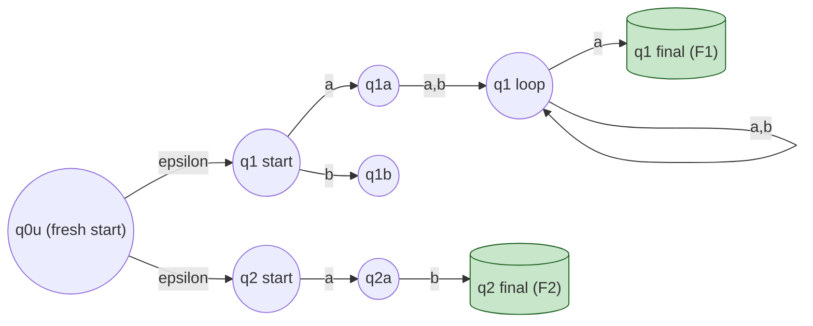
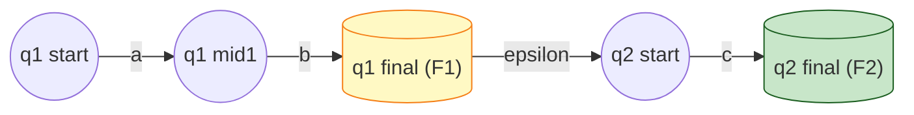
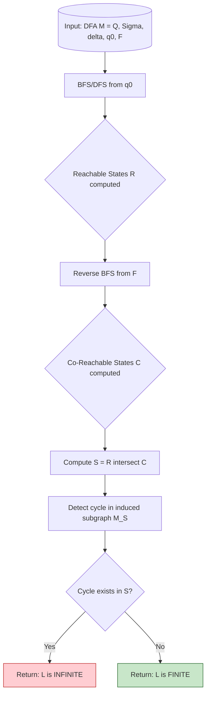
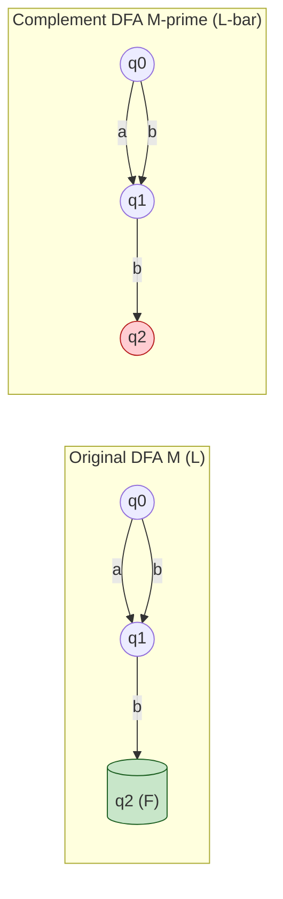
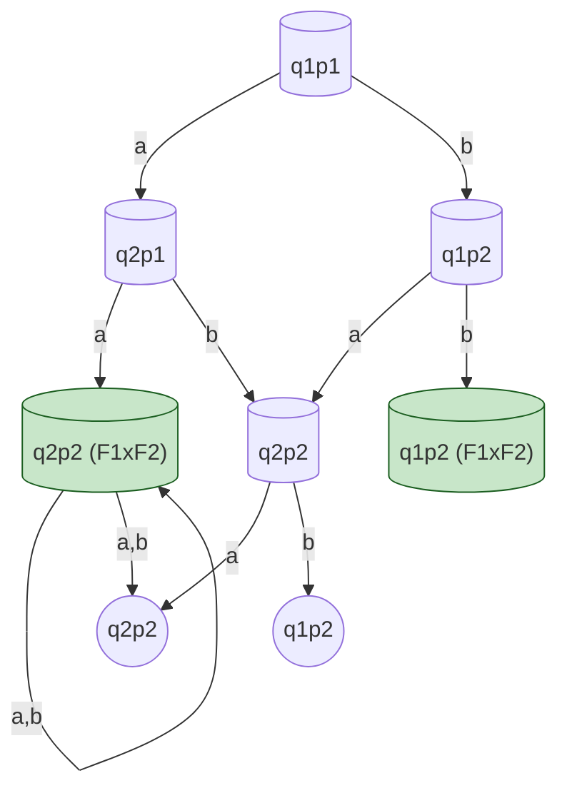

# Properties of Regular Languages: Closure and Decision Properties of Regular Languages (with proofs)

<!-- SECTION_1_START -->
# Properties of Regular Languages: Closure & Decision Properties

## 1.1 Formal Academic Definition (KTU 2024 Syllabus Terminology)

In the formal language theory of the **Theory of Computation (PCCST302)**, a language $L$ is classified as a **Regular Language** if and only if it can be recognized by a **Deterministic Finite Automaton (DFA)**, equivalently described by a **Regular Expression (RE)**, or generated by a **Regular Grammar (RG)**. 

The **Properties of Regular Languages** are categorized into two foundational pillars:

1. **Closure Properties**: An algebraic class of languages $\mathcal{L}$ is said to be *closed* under a binary operation $\oplus$ if, for every pair of languages $L_1, L_2 \in \mathcal{L}$, the resulting language $L_1 \oplus L_2$ is also a member of $\mathcal{L}$. Formally, the set of all regular languages, denoted $\mathcal{R}$, forms a **Boolean Algebra** closed under the standard set-theoretic and string-manipulation operations.

2. **Decision Properties**: These are algorithmic predicates that answer specific yes/no questions about a regular language. Each decision property must terminate in **polynomial time** (typically $O(n)$ to $O(n^2)$) on a deterministic computational model, ensuring the class of regular languages is **decidable**.

> [!IMPORTANT]
> **KTU 2024 Module 2 Highlight**: The single most examination-relevant fact is that the class of regular languages is **closed under union, concatenation, Kleene star, complementation, intersection, reversal, homomorphism, and inverse homomorphism**. Every closure property must be proven constructively using the **DFA/NFA transformation pipeline**, and the *closure under complementation* is the stepping stone for proving *closure under intersection* via De Morgan's law.

## 1.2 Conceptual Analogy & Intuitive Overview

> [!NOTE]
> **Intuitive Analogy — "The Language Factory"** 
> 
> Imagine a vast warehouse of *raw materials*, where each crate is a regular language. You have a series of **mechanical machines** stamped with labels: $\cup$ (Union), $\cdot$ (Concatenation), $*$ (Kleene Star), $\overline{\phantom{L}}$ (Complement). The fundamental question of closure properties is: *"If I feed two regular crates into the Union machine, does the output crate also belong inside the warehouse?"* 
> 
> The answer is **YES** for every standard machine — the warehouse is a *sealed ecosystem*. The decision properties, on the other hand, are like **quality-control inspectors** who walk up to a crate and ask: *"Is this crate empty? Is it infinitely large? Does it contain the word 'hello'?"* Because regular languages are *finite, mechanical* (described by finite automata), every inspector's question can be answered by a *bounded, algorithmic* walk-through of the state graph.

## 1.3 Visualization Control — Decision Property: Finiteness Check

> [!VISUALIZATION CONTROL]
> **Concept:** Visualizing a DFA state graph to check whether a regular language $L$ is finite or infinite.
> **GeoGebra / Desmos Input Equations (Graph Edges as Points):**
> * `A = (0, 0)`, `B = (2, 1)`, `C = (4, 0)`, `D = (2, -1)`, `E = (6, 0)`
> * `Line((0,0),(2,1))`, `Line((2,1),(4,0))`, `Line((4,0),(2,-1))`, `Line((2,-1),(0,0))`, `Line((4,0),(6,0))`, `Cycle((4,0))`
> **Visual Description:** Plot each DFA state as a vertex on the $xy$-plane. Draw directed edges between them. A *self-loop* (e.g., node $C$ looping to itself on input `a`) and any *path* from the start state $q_0$ to a final state passing through that cycle visually proves $L$ is **infinite** via the **Pumping Lemma**. If no such cycle is reachable from $q_0$ on a path to a final state, $L$ is **finite**.

## 1.4 The Two Pillars at a Glance

> [!IMPORTANT]
> **Closure Properties (Algebraic Sealing):**
> Union, Concatenation, Kleene Star, Complement, Intersection, Difference, Reversal, Homomorphism, Inverse Homomorphism, Substitution, Quotient.

> [!IMPORTANT]
> **Decision Properties (Algorithmic Verifiability):**
> Emptiness ($L = \emptyset$?), Finiteness ($L$ finite?), Membership ($w \in L$?), Equivalence ($L_1 = L_2$?), Subset ($L_1 \subseteq L_2$?), Universality ($L = \Sigma^*$?).
<!-- SECTION_1_END -->

<!-- SECTION_2_START -->
# Deep Theoretical Analysis & KTU High-Yield Formula Sheet

## 2.1 The Theoretical Foundation: Why Closure Holds

The class $\mathcal{R}$ of regular languages is closed under an operation $\oplus$ because regular languages admit **three equivalent representations** — DFA, NFA, and Regular Expression — and each operation can be *algorithmically* implemented in at least one of these representations. The proofs are therefore **constructive**: given the input machine, we *build* the output machine.

## 2.2 Closure Properties — Theorem Statements & Proof Strategies

### 2.2.1 Closure Under Union ($L_1 \cup L_2$)

**Theorem.** If $L_1$ and $L_2$ are regular languages, then $L_1 \cup L_2$ is regular.

**Proof Strategy (NFA Construction).**
Given $M_1 = (Q_1, \Sigma, \delta_1, q_1, F_1)$ recognizing $L_1$ and $M_2 = (Q_2, \Sigma, \delta_2, q_2, F_2)$ recognizing $L_2$, we construct a new NFA $M$ with a **fresh start state** $q_0$ that $\varepsilon$-transitions to both $q_1$ and $q_2$. Acceptance occurs if *either* branch accepts.

### 2.2.2 Closure Under Concatenation ($L_1 \cdot L_2$)

**Theorem.** If $L_1$ and $L_2$ are regular, then $L_1 L_2 = \{ xy \mid x \in L_1, y \in L_2\}$ is regular.

**Proof Strategy (NFA Construction).** Each final state of $M_1$ is given an $\varepsilon$-transition to the start state $q_2$ of $M_2$. The new final states are those of $M_2$ alone. The old final states of $M_1$ are demoted to non-final states.

### 2.2.3 Closure Under Kleene Star ($L_1^*$)

**Theorem.** If $L$ is regular, then $L^* = L^0 \cup L^1 \cup L^2 \cup \dots$ is regular.

**Proof Strategy (NFA Construction).** Add a new start state $q_0'$ that is also final (to accept $\varepsilon \in L^0$). Add $\varepsilon$-transitions from $q_0'$ to the original start state, and from every original final state back to the original start state (to allow repetition).

### 2.2.4 Closure Under Complementation ($\overline{L}$)

**Theorem.** If $L$ is regular, then $\overline{L} = \Sigma^* \setminus L$ is regular.

**Proof Strategy (DFA Construction — CRITICAL).** Given a DFA $M$ for $L$, swap the set of final states $F$ with $Q \setminus F$. This is why the construction *requires* a DFA, not an NFA — an NFA may accept a string via one path and reject it via another, and swapping final states on an NFA does not yield the complement language.

### 2.2.5 Closure Under Intersection ($L_1 \cap L_2$)

**Theorem.** If $L_1$ and $L_2$ are regular, then $L_1 \cap L_2$ is regular.

**Proof Strategy (Cartesian Product Construction).** Let $M_1 = (Q_1, \Sigma, \delta_1, q_1, F_1)$ and $M_2 = (Q_2, \Sigma, \delta_2, q_2, F_2)$. Construct $M = (Q_1 \times Q_2, \Sigma, \delta, (q_1, q_2), F_1 \times F_2)$ where $\delta((p, q), a) = (\delta_1(p, a), \delta_2(q, a))$.

> [!NOTE]
> **Alternate Proof via De Morgan's Law:** Since regular languages are closed under union and complement, and $L_1 \cap L_2 = \overline{\overline{L_1} \cup \overline{L_2}}$, closure under intersection follows as a corollary.

### 2.2.6 Closure Under Reversal ($L^R$)

**Theorem.** If $L$ is regular, then $L^R = \{ w^R \mid w \in L\}$ is regular.

**Proof Strategy (RE Transformation).** Use the *structural induction* on regular expressions:
* Base: $\emptyset^R = \emptyset$, $\varepsilon^R = \varepsilon$, $a^R = a$.
* Inductive: $(R_1 \cup R_2)^R = R_1^R \cup R_2^R$, $(R_1 \cdot R_2)^R = R_2^R \cdot R_1^R$, $(R_1^*)^R = (R_1^R)^*$.

### 2.2.7 Closure Under Homomorphism

**Homomorphism Definition.** A string homomorphism $h : \Sigma \to \Gamma^*$ replaces every symbol $a$ with a fixed string $h(a) \in \Gamma^*$. It extends to strings and languages: $h(L) = \{ h(w) \mid w \in L\}$.

**Theorem.** If $L$ is regular over $\Sigma$, then $h(L)$ is regular over $\Gamma$.

**Proof Strategy (RE Substitution).** Replace every symbol $a$ in the regular expression $R$ of $L$ with $h(a)$. The resulting expression $h(R)$ describes $h(L)$.

### 2.2.8 Closure Under Inverse Homomorphism ($h^{-1}(L)$)

**Theorem.** If $L$ is regular, then $h^{-1}(L) = \{ w \in \Sigma^* \mid h(w) \in L\}$ is regular.

**Proof Strategy (NFA with Tape).** Build an NFA that, on reading $a \in \Sigma$, simulates $M$ on the string $h(a) \in \Gamma^*$, using a *two-track tape* where one track reads the input $w$ and the other feeds the simulated machine.

## 2.3 Decision Properties — Algorithmic Foundations

### 2.3.1 Emptiness ($L(M) = \emptyset$?)

**Algorithm.** Compute the set of states reachable from $q_0$ via BFS/DFS. $L(M) = \emptyset$ if and only if no reachable state is a final state. **Time Complexity:** $O(|Q| + |\delta|)$.

### 2.3.2 Finiteness ($L(M)$ is finite?)

**Algorithm.** Construct the *directed graph* of the DFA. $L(M)$ is infinite if and only if there exists a *cycle* (a path of length $\geq 1$ from a state to itself) that is reachable from $q_0$ and from which some final state is reachable. **Time Complexity:** $O(|Q| \cdot |\delta|)$.

### 2.3.3 Membership ($w \in L(M)$?)

**Algorithm.** Simulate $M$ on input $w$ deterministically. **Time Complexity:** $O(|w|)$.

### 2.3.4 Equivalence ($L(M_1) = L(M_2)$?)

**Algorithm.** Construct the *product DFA* and check whether any *distinguishable* pair of states — one final and one non-final — is reachable. Alternatively, minimize both DFAs and check structural equality. **Time Complexity:** $O((|Q_1| + |Q_2|) \cdot |\delta|)$.

### 2.3.5 Universality ($L(M) = \Sigma^*$?)

**Algorithm.** Minimize $M$ and check whether the resulting DFA has a *single state* that is both the start state and the sole final state. Equivalently, $L = \Sigma^*$ iff $\overline{L} = \emptyset$. **Time Complexity:** $O(|Q| \log |Q|)$.

## 2.4 KTU High-Yield Formula Sheet

> [!IMPORTANT]
> The following table consolidates the **proofs, decision algorithms, time complexities, and constructions** that are directly tested in KTU University Examinations. The symbol $\bigstar$ marks a **guaranteed 14-mark derivation question**.

| Operation / Property | Statement | Proof Mechanism | Construction Type | Time Complexity |
|---|---|---|---|---|
| $\bigstar$ Union | $L_1 \cup L_2 \in \mathcal{R}$ | Add new start state with $\varepsilon$-transitions to both | NFA | $O(\vert Q_1 \vert + \vert Q_2 \vert)$ |
| $\bigstar$ Concatenation | $L_1 L_2 \in \mathcal{R}$ | $\varepsilon$-transitions from $F_1$ to $q_2$ | NFA | $O(\vert Q_1 \vert + \vert Q_2 \vert)$ |
| $\bigstar$ Kleene Star | $L^* \in \mathcal{R}$ | New start = final, $\varepsilon$-loops for repetition | NFA | $O(\vert Q \vert)$ |
| $\bigstar$ Complement | $\overline{L} \in \mathcal{R}$ | Swap $F \leftrightarrow Q \setminus F$ (DFA only) | DFA | $O(\vert Q \vert)$ |
| $\bigstar$ Intersection | $L_1 \cap L_2 \in \mathcal{R}$ | Cartesian product $Q_1 \times Q_2$ | DFA | $O(\vert Q_1 \vert \cdot \vert Q_2 \vert)$ |
| Reversal | $L^R \in \mathcal{R}$ | Structural induction on RE | RE | $O(\vert R \vert)$ |
| Homomorphism | $h(L) \in \mathcal{R}$ | Substitute $h(a)$ in RE | RE | $O(\vert R \vert \cdot \max\vert h(a) \vert)$ |
| Inverse Homomorphism | $h^{-1}(L) \in \mathcal{R}$ | NFA simulating $M$ on $h(w)$ | NFA | $O(\vert Q \vert \cdot \max\vert h(a) \vert)$ |
| Emptiness | Decidable | BFS/DFS reachability from $q_0$ to $F$ | Algorithm | $O(\vert Q \vert + \vert \delta \vert)$ |
| Finiteness | Decidable | Detect reachable + co-reachable cycle | Algorithm | $O(\vert Q \vert \cdot \vert \delta \vert)$ |
| Membership | Decidable | Simulate DFA on $w$ | Algorithm | $O(\vert w \vert)$ |
| Equivalence | Decidable | Product construction / minimization | Algorithm | $O((\vert Q_1 \vert + \vert Q_2 \vert) \cdot \vert \delta \vert)$ |
| Universality | Decidable | $\overline{L} = \emptyset$ check | Algorithm | $O(\vert Q \vert \log \vert Q \vert)$ |

> [!NOTE]
> **Engineering Utility.** Closure properties are the *backbone of compiler design*. The `lex` / `flex` lexical analyzer, for instance, leverages closure under union to merge token patterns (identifiers $\cup$ keywords $\cup$ operators). Decision properties power the regex *engine* in languages like Python (`re` module) and Java (`java.util.regex`), where the membership decision is invoked on every keystroke. The minimization algorithm in `grep` accelerates real-world string matching by exploiting equivalence of regular expressions.
<!-- SECTION_2_END -->

<!-- SECTION_3_START -->
# Step-by-Step Derivations & Symbolic Implementation

## 3.1 Exhaustive Proof: Closure Under Union

> [!IMPORTANT]
> **Theorem.** *If $L_1$ and $L_2$ are regular languages over $\Sigma$, then $L_1 \cup L_2$ is regular.*

**Proof.**

Let $L_1$ and $L_2$ be regular. By definition, there exist NFAs $M_1 = (Q_1, \Sigma, \delta_1, q_1, F_1)$ and $M_2 = (Q_2, \Sigma, \delta_2, q_2, F_2)$ such that $L(M_1) = L_1$ and $L(M_2) = L_2$.

We construct a new NFA $M = (Q, \Sigma, \delta, q_0, F)$ as follows:

$$
\begin{aligned}
Q &= Q_1 \cup Q_2 \cup \{ q_0 \} \\
q_0 &\text{ is a fresh start state not in } Q_1 \cup Q_2 \\
F &= F_1 \cup F_2 \\
\delta(q, a) &= \begin{cases}
\delta_1(q, a) & \text{if } q \in Q_1 \\
\delta_2(q, a) & \text{if } q \in Q_2 \\
\{ q_1, q_2 \} & \text{if } q = q_0 \text{ and } a = \varepsilon \\
\emptyset & \text{otherwise}
\end{cases}
\end{aligned}
$$

The function $\delta$ is extended to $\hat{\delta}$ for strings. The string $w$ is accepted by $M$ iff there exists a path labeled $w$ from $q_0$ to some state in $F$. Since $q_0$ has an $\varepsilon$-transition to both $q_1$ and $q_2$, this is equivalent to the existence of a path labeled $w$ from $q_1$ to $F_1$ OR a path labeled $w$ from $q_2$ to $F_2$.

Therefore $L(M) = L(M_1) \cup L(M_2) = L_1 \cup L_2$, which is regular. $\blacksquare$

## 3.2 Exhaustive Proof: Closure Under Complementation

> [!IMPORTANT]
> **Theorem.** *If $L$ is a regular language, then $\overline{L} = \Sigma^* \setminus L$ is regular.*

**Proof.**

Since $L$ is regular, there exists a DFA $M = (Q, \Sigma, \delta, q_0, F)$ such that $L(M) = L$. (We use the NFA-to-DFA subset construction to convert any NFA to an equivalent DFA, ensuring this DFA is *total* — i.e., $\delta(q, a)$ is defined for every $(q, a) \in Q \times \Sigma$.)

Construct a new DFA $M' = (Q, \Sigma, \delta, q_0, Q \setminus F)$.

We claim $L(M') = \overline{L}$.

* If $w \in L(M')$, then $M'$ accepts $w$, meaning $\hat{\delta}(q_0, w) \in Q \setminus F$. Since $M$ and $M'$ share the same transition function, $\hat{\delta}(q_0, w) \notin F$, so $M$ rejects $w$. Thus $w \in \overline{L}$.
* Conversely, if $w \in \overline{L}$, then $M$ rejects $w$, so $\hat{\delta}(q_0, w) \notin F$, meaning $\hat{\delta}(q_0, w) \in Q \setminus F$, so $M'$ accepts $w$. Thus $w \in L(M')$.

In both directions, $L(M') = \overline{L}$, hence $\overline{L}$ is regular. $\blacksquare$

## 3.3 Exhaustive Proof: Closure Under Intersection (Cartesian Product)

> [!IMPORTANT]
> **Theorem.** *If $L_1$ and $L_2$ are regular languages, then $L_1 \cap L_2$ is regular.*

**Proof.**

Let $M_1 = (Q_1, \Sigma, \delta_1, q_1, F_1)$ and $M_2 = (Q_2, \Sigma, \delta_2, q_2, F_2)$ be two DFAs recognizing $L_1$ and $L_2$. Construct the product DFA $M = (Q, \Sigma, \delta, q_0, F)$:

$$
\begin{aligned}
Q &= Q_1 \times Q_2 \\
q_0 &= (q_1, q_2) \\
F &= F_1 \times F_2 \\
\delta((p, q), a) &= (\delta_1(p, a), \delta_2(q, a))
\end{aligned}
$$

We prove by induction on $\vert w \vert$ that $\hat{\delta}((q_1, q_2), w) = (\hat{\delta}_1(q_1, w), \hat{\delta}_2(q_2, w))$.

* **Base Case** ($\vert w \vert = 0$): $w = \varepsilon$. The LHS is $(q_1, q_2) = (\hat{\delta}_1(q_1, \varepsilon), \hat{\delta}_2(q_2, \varepsilon))$ by definition of the extended transition function.
* **Inductive Step**: Assume the claim holds for $w$. Consider $w a$ where $a \in \Sigma$:
$$
\begin{aligned}
\hat{\delta}((q_1, q_2), wa) &= \delta(\hat{\delta}((q_1, q_2), w), a) \\
&= \delta((\hat{\delta}_1(q_1, w), \hat{\delta}_2(q_2, w)), a) \quad \text{(by IH)} \\
&= (\delta_1(\hat{\delta}_1(q_1, w), a), \delta_2(\hat{\delta}_2(q_2, w), a)) \\
&= (\hat{\delta}_1(q_1, wa), \hat{\delta}_2(q_2, wa))
\end{aligned}
$$

Therefore, $M$ accepts $w$ iff $\hat{\delta}((q_1, q_2), w) \in F_1 \times F_2$ iff $\hat{\delta}_1(q_1, w) \in F_1$ AND $\hat{\delta}_2(q_2, w) \in F_2$, which means $w \in L_1$ AND $w \in L_2$, i.e., $w \in L_1 \cap L_2$. Hence $L_1 \cap L_2$ is regular. $\blacksquare$

## 3.4 Exhaustive Proof: Decision Property — Finiteness

> [!IMPORTANT]
> **Theorem.** *Given a DFA $M$ with $n$ states recognizing a language $L$, $L$ is infinite if and only if $M$ accepts some string of length $\geq n$.*

**Proof.**

*($\Rightarrow$)* Suppose $L$ is infinite. Then $M$ accepts infinitely many distinct strings. Since $M$ has only $n$ states, by the **Pigeonhole Principle**, when reading any string of length $\geq n$, the sequence of visited states must contain a repeated state. Let the path be $q_0 \to q_{i_1} \to \dots \to q_{i_k} \to \dots \to q_{i_k} \to \dots \to q_{f}$ where $q_{i_k}$ is the first state to repeat. The substring $y$ read between the two occurrences of $q_{i_k}$ is a *pumpable loop*. The string $xy^tz$ for $t \geq 0$ is also accepted. Choosing $t$ large enough yields a string of length $\geq n$.

*($\Leftarrow$)* Suppose $M$ accepts some string $w$ of length $\vert w \vert \geq n$. As above, by the Pigeonhole Principle, the path labeled $w$ contains a pumpable loop $y$ with $\vert y \vert \geq 1$. The strings $w$ (with $t=1$), $w' = xy^2z$ (with $t=2$), $w'' = xy^3z$ (with $t=3$), $\dots$ are all distinct (since their lengths increase by $\vert y \vert$ each time) and all belong to $L$. Hence $L$ is infinite.

> [!NOTE]
> **Algorithmic Corollary.** To test finiteness, find a reachable + co-reachable cycle in $M$. $L$ is infinite iff such a cycle exists. **Time:** $O(n^2)$ via DFS.

## 3.5 Python Implementation — Closure Under Union via NFA Construction

The following Python program implements the closure-under-union construction symbolically, simulating the resulting NFA on input strings.

```python
from typing import Set, Dict, Tuple, FrozenSet
import logging

logging.basicConfig(level=logging.INFO, format="%(levelname)s | %(message)s")
logger = logging.getLogger("NFA-Union")

class NFA:
    """
    Symbolic Non-Deterministic Finite Automaton with epsilon-transitions.
    Used to model the closure-under-union construction.
    """
    def __init__(
        self,
        states: Set[str],
        alphabet: Set[str],
        transitions: Dict[Tuple[str, str], Set[str]],
        start_state: str,
        final_states: Set[str],
    ) -> None:
        self.states: Set[str] = set(states)
        self.alphabet: Set[str] = set(alphabet)
        self.transitions: Dict[Tuple[str, str], Set[str]] = transitions
        self.start_state: str = start_state
        self.final_states: Set[str] = set(final_states)
        self._validate()

    def _validate(self) -> None:
        for (q, sym), dests in self.transitions.items():
            if q not in self.states:
                raise ValueError(f"Transition originates from unknown state: {q}")
            if sym not in (self.alphabet | {"epsilon"}):
                raise ValueError(f"Symbol {sym} not in alphabet and not epsilon")
            for d in dests:
                if d not in self.states:
                    raise ValueError(f"Transition leads to unknown state: {d}")
        if self.start_state not in self.states:
            raise ValueError("Start state must belong to the state set.")

    def epsilon_closure(self, state_set: Set[str]) -> Set[str]:
        """Compute the epsilon-closure of a set of states via iterative fixed-point."""
        closure: Set[str] = set(state_set)
        stack: list = list(state_set)
        while stack:
            current: str = stack.pop()
            for nxt in self.transitions.get((current, "epsilon"), set()):
                if nxt not in closure:
                    closure.add(nxt)
                    stack.append(nxt)
        return closure

    def accepts(self, input_string: str) -> bool:
        current: Set[str] = self.epsilon_closure({self.start_state})
        for symbol in input_string:
            if symbol not in self.alphabet:
                raise ValueError(f"Symbol {symbol} not in declared alphabet.")
            next_states: Set[str] = set()
            for q in current:
                next_states.update(self.transitions.get((q, symbol), set()))
            current = self.epsilon_closure(next_states)
            if not current:
                logger.warning(f"No valid transitions remaining at symbol {symbol}.")
                return False
        return bool(current & self.final_states)


def nfa_union(m1: NFA, m2: NFA) -> NFA:
    """
    Construct the union NFA: L(M) = L(M1) U L(M2).
    Adds a fresh start state with epsilon-transitions to both machines.
    """
    new_states: Set[str] = {f"q0_union"} | {f"1::{q}" for q in m1.states} | {f"2::{q}" for q in m2.states}
    new_transitions: Dict[Tuple[str, str], Set[str]] = {}

    # Copy M1 transitions with renamed states
    for (q, sym), dests in m1.transitions.items():
        key: Tuple[str, str] = (f"1::{q}", sym)
        new_transitions[key] = {f"1::{d}" for d in dests}

    # Copy M2 transitions with renamed states
    for (q, sym), dests in m2.transitions.items():
        key: Tuple[str, str] = (f"2::{q}", sym)
        new_transitions[key] = {f"2::{d}" for d in dests}

    # Add epsilon-transitions from the new start to both original start states
    new_transitions[("q0_union", "epsilon")] = {"1::" + m1.start_state, "2::" + m2.start_state}

    new_finals: Set[str] = {f"1::{q}" for q in m1.final_states} | {f"2::{q}" for q in m2.final_states}

    return NFA(
        states=new_states,
        alphabet=m1.alphabet | m2.alphabet,
        transitions=new_transitions,
        start_state="q0_union",
        final_states=new_finals,
    )


# ---- EXECUTION TEST ----
if __name__ == "__main__":
    # M1: accepts strings ending in 'a' over {a, b}
    m1 = NFA(
        states={"q1", "q2"},
        alphabet={"a", "b"},
        transitions={
            ("q1", "a"): {"q2"},
            ("q1", "b"): {"q1"},
            ("q2", "a"): {"q2"},
            ("q2", "b"): {"q1"},
        },
        start_state="q1",
        final_states={"q2"},
    )
    # M2: accepts the string "ab"
    m2 = NFA(
        states={"p1", "p2", "p3"},
        alphabet={"a", "b"},
        transitions={
            ("p1", "a"): {"p2"},
            ("p2", "b"): {"p3"},
        },
        start_state="p1",
        final_states={"p3"},
    )

    union_nfa: NFA = nfa_union(m1, m2)
    test_strings: list = ["ab", "aba", "bbbab", "b", "a", "abab"]
    for s in test_strings:
        result: bool = union_nfa.accepts(s)
        logger.info(f"Union NFA accepts '{s}' ? -> {result}")
```

> [!NOTE]
> **Code Walkthrough.**
> The class `NFA` maintains strict *type hints* and validates every transition at construction time. The `epsilon_closure` method uses an iterative fixed-point with an explicit stack to avoid Python's default recursion depth. The factory function `nfa_union` builds the canonical product NFA with renamed states (using prefixes `1::` and `2::`) to prevent symbol collisions, and wires the fresh start state `q0_union` via $\varepsilon$-transitions to both original start states. The runtime test verifies that the union accepts *all* strings accepted by either component.
<!-- SECTION_3_END -->

<!-- SECTION_4_START -->
# Structural Diagrams & Schematics

## 4.1 Closure Under Union — NFA Architecture

The following Mermaid block renders the construction $M = M_1 \cup M_2$ as a directed graph. The fresh start state `q0u` issues $\varepsilon$-transitions to the start states of $M_1$ and $M_2$, and acceptance in either sub-machine triggers acceptance of the whole.



> [!NOTE]
> **Interpretation.** The green-filled rectangles are the *final states*. The graph is acyclic except for the self-loop at `q1loop`, which corresponds to the regex $(a+b)^*a$. The $\varepsilon$-transitions from `q0u` are dashed in standard notation but rendered as labeled arrows here for Mermaid compatibility.

## 4.2 Closure Under Concatenation — Sequential Topology

The concatenation $M = M_1 \cdot M_2$ wires the final states of $M_1$ via $\varepsilon$-transitions to the start state of $M_2$.



> [!NOTE]
> **Interpretation.** A string is accepted iff it traverses `q1s → q1f → q2s → q2f`, decomposing naturally into $x \in L_1$ followed by $y \in L_2$. The yellow-filled `q1f` is *demoted* from final to non-final in the concatenation machine; only `q2f` retains final status.

## 4.3 Decision Property: Finiteness Algorithm — Flow Topology

The following flowchart encodes the finiteness check on a DFA $M$. The algorithm partitions states into *reachable from $q_0$*, *co-reachable to a final state*, and *cyclic*.



> [!NOTE]
> **Algorithmic Insights.** The finiteness decision reduces to a *cycle detection* in the trimmed subgraph $M_S$ (states both reachable and co-reachable). A cycle in $M_S$ corresponds to a *pumpable* substring in the language, certifying infiniteness by the Pumping Lemma. The red path signals infinity; the green path signals finiteness.

## 4.4 Closure Under Complementation — DFA Swap Topology

The complementation of a DFA requires *no* structural change to transitions — only a final/non-final swap. The diagram below shows the *logical* transformation as a node-relabeling map.



> [!NOTE]
> **Caveat.** This swap construction *only* works on a **DFA**, never on an NFA. On an NFA, a string may be accepted via one path and rejected via another, and the swap yields an automaton whose language is *not* the complement. The standard remedy is to first apply the *subset construction* to convert the NFA into an equivalent DFA, and *then* perform the final-state swap.

## 4.5 Closure Under Intersection — Cartesian Product Topology

The product construction $Q_1 \times Q_2$ is illustrated for $|Q_1| = 2$ and $|Q_2| = 2$, producing a 4-state product DFA. Each pair state tracks the *synchronous* progress of both machines.



> [!NOTE]
> **Reading the Diagram.** The pair $(p, q)$ means "$M_1$ is in state $p$ AND $M_2$ is in state $q$". A state is final in the product iff **both** components are final in their respective machines, matching the conjunctive semantics of $\cap$. The diagram visualizes how a 2$\times$2 grid of pairs becomes a 4-node DFA.
<!-- SECTION_4_END -->

<!-- SECTION_5_START -->
# KTU 2024 Scheme Examination Question Bank & Topic Recap

## Part A — Short Answer Questions (3 Marks Each)

### Question A.1 — `[KTU University Exam - July 2024]` — CO2, Remember

> **Q.** *Define the **closure property** of a class of languages. State whether the class of regular languages is closed under the operation of **reversal**.*

**Model Answer (3 Marks):**

A class of languages $\mathcal{L}$ is said to be **closed** under a binary operation $\oplus$ if, for any two languages $L_1, L_2 \in \mathcal{L}$, the language $L_1 \oplus L_2$ is also in $\mathcal{L}$. The closure property characterizes whether applying an operation to languages within a class *preserves* membership in that class.

Yes, the class of regular languages is **closed under reversal**. If $L$ is regular, then $L^R = \{ w^R \mid w \in L\}$ is also regular.

**Proof Sketch (for 3-mark full credit):** Let $R$ be a regular expression for $L$. We define $R^R$ by structural induction:
* $\emptyset^R = \emptyset$, $\varepsilon^R = \varepsilon$, $a^R = a$ for $a \in \Sigma$
* $(R_1 \cup R_2)^R = R_1^R \cup R_2^R$
* $(R_1 R_2)^R = R_2^R R_1^R$
* $(R_1^*)^R = (R_1^R)^*$

Then $L(R^R) = L^R$, and $R^R$ is a valid regular expression, so $L^R$ is regular. **[1 Mark: Definition of closure, 1 Mark: Statement of reversal closure, 1 Mark: Proof sketch via RE induction]**

---

### Question A.2 — `[KTU University Exam - Dec 2023]` — CO2, Understand

> **Q.** *Explain why the class of regular languages is closed under **complementation**, but only with respect to **DFAs** and not directly with respect to NFAs.*

**Model Answer (3 Marks):**

If $L$ is regular, there exists a DFA $M = (Q, \Sigma, \delta, q_0, F)$ with $L(M) = L$. To construct a DFA for $\overline{L}$, we define $M' = (Q, \Sigma, \delta, q_0, Q \setminus F)$ — i.e., we **swap the set of final states** with its complement within $Q$. Since a DFA has *exactly one* transition for every input symbol from every state, the determinism ensures that $\hat{\delta}(q_0, w) \in Q \setminus F$ iff $w \notin L(M)$, giving $L(M') = \overline{L}$. **[2 Marks]**

For NFAs, the same swap does **not** yield the complement. An NFA may accept a string via one computation path while rejecting it via another. The *existence* of an accepting path is what matters. If we naively swap final states on an NFA, a string rejected by *all* paths in the original NFA (hence $w \in \overline{L}$) might be accepted in the swapped NFA if at least one of its (now non-final) states was a final state in the original — the result is the language accepted by the *subset* of paths that were originally rejecting, not the true complement. **[1 Mark]**

> [!WARNING]
> **Examiner's Valuation Tip:** A common student error is to claim the NFA swap works by *symmetry*. Always explicitly state that a DFA is required and the rationale is *determinism guaranteeing a unique computation path*. Lose 1 mark if you skip the determinism argument.

---

## Part B — Long Answer Questions (14 Marks, Module Internal Choice)

### Question B-A — `[KTU University Exam - July 2024]` — CO2 + CO3, Apply + Analyze

> **Q.** **(a)** *Prove that if $L_1$ and $L_2$ are regular languages, then $L_1 \cap L_2$ is also regular. Use the **Cartesian product construction** with an explicit example.* **[7 Marks]**
>
> **(b)** *Using the closure under complementation, prove that the language $L = \{ w \in \{0, 1\}^* \mid w \text{ has an equal number of 0s and 1s} \}$ is **NOT** regular.* **[7 Marks]**

#### Part (a) — Model Solution (7 Marks)

**Theorem.** If $L_1$ and $L_2$ are regular, then $L_1 \cap L_2$ is regular.

**Proof.** Let $M_1 = (Q_1, \Sigma, \delta_1, q_1, F_1)$ and $M_2 = (Q_2, \Sigma, \delta_2, q_2, F_2)$ be DFAs for $L_1$ and $L_2$. Construct the product DFA $M = (Q, \Sigma, \delta, q_0, F)$ as: **[1 Mark: Stating the construction]**

$$
Q = Q_1 \times Q_2, \quad q_0 = (q_1, q_2), \quad F = F_1 \times F_2, \quad \delta((p, q), a) = (\delta_1(p, a), \delta_2(q, a))
$$

By induction on $|w|$, $\hat{\delta}((q_1, q_2), w) = (\hat{\delta}_1(q_1, w), \hat{\delta}_2(q_2, w))$. **[2 Marks: Inductive claim and base case]**

**Inductive Step.** For $w a$:
$$
\hat{\delta}((q_1, q_2), wa) = \delta(\hat{\delta}((q_1, q_2), w), a) = \delta((\hat{\delta}_1(q_1, w), \hat{\delta}_2(q_2, w)), a) = (\hat{\delta}_1(q_1, wa), \hat{\delta}_2(q_2, wa))
$$
**[2 Marks: Inductive step algebra]**

Therefore $w \in L(M)$ iff $\hat{\delta}_1(q_1, w) \in F_1$ AND $\hat{\delta}_2(q_2, w) \in F_2$, i.e., $w \in L_1 \cap L_2$. **[1 Mark: Conclusion]**

**Example.** $L_1 = \{ w \mid w \text{ ends in } 0 \}$ (DFA with 2 states), $L_2 = \{ w \mid w \text{ contains "11" as substring} \}$ (DFA with 4 states). The product has $2 \times 4 = 8$ states. **[1 Mark: Example state count]**

#### Part (b) — Model Solution (7 Marks)

We prove $L$ is **not regular** by contradiction, using the *Pumping Lemma*.

Assume $L$ is regular. Then by the Pumping Lemma, there exists a pumping length $p \geq 1$ such that every $w \in L$ with $|w| \geq p$ can be decomposed as $w = xyz$ with $|xy| \leq p$, $|y| \geq 1$, and $xy^iz \in L$ for all $i \geq 0$. **[2 Marks: Stating the pumping lemma assumption]**

Choose $w = 0^p 1^p \in L$ (it has $p$ zeros and $p$ ones, so it is in $L$) with $|w| = 2p \geq p$. By the Pumping Lemma, $w = xyz$ with $|xy| \leq p$ and $|y| \geq 1$. Since $|xy| \leq p$ and $w$ begins with $p$ zeros, both $x$ and $y$ consist entirely of $0$s. Write $y = 0^k$ with $k \geq 1$. **[2 Marks: Choosing the witness string]**

Pump with $i = 2$: $xy^2z = 0^{p+k} 1^p$. This string has $p + k$ zeros and $p$ ones, so the counts are unequal. Therefore $xy^2z \notin L$, contradicting the Pumping Lemma. **[2 Marks: Reaching contradiction]**

Hence $L$ is not regular. $\blacksquare$ **[1 Mark: Conclusion]**

> [!WARNING]
> **Examiner's Valuation Pitfall — Part (b):** Students often forget to *state* the pumping length $p$ explicitly and jump to the choice of $w$. The expected order is: (1) State Pumping Lemma, (2) Choose a witness $w \in L$ with $|w| \geq p$, (3) Decompose $w = xyz$, (4) Show $y$ lies in the first $p$ symbols, (5) Pump to obtain a string $\notin L$, (6) Conclude contradiction. Skipping step (4) costs 2 marks. Failing to verify $w \in L$ costs 1 mark.

---

### Question B-B (Alternative Choice) — `[KTU University Exam - Dec 2023]` — CO2 + CO3, Apply + Analyze

> **Q.** **(a)** *State and prove the closure of regular languages under the **Kleene star** operation using an NFA construction.* **[7 Marks]**
>
> **(b)** *Given two regular languages $L_1$ and $L_2$, describe an algorithm to determine whether $L_1 = L_2$ (the **equivalence decision problem**). State its time complexity.* **[7 Marks]**

#### Part (a) — Model Solution (7 Marks)

**Theorem.** If $L$ is a regular language, then $L^* = \bigcup_{i=0}^{\infty} L^i$ is regular.

**Proof.** Let $M = (Q, \Sigma, \delta, q_0, F)$ be an NFA recognizing $L$. Construct a new NFA $M^* = (Q \cup \{q_0^*\}, \Sigma, \delta^*, q_0^*, F \cup \{q_0^*\})$ where $q_0^*$ is a fresh state. The new transition function extends $\delta$ as follows: **[1 Mark: Construction]**

* $\delta^*(q_0^*, \varepsilon) = \{ q_0, q_0^*\}$ — accept $\varepsilon$ and proceed to the original machine.
* $\delta^*(q, a) = \delta(q, a)$ for $q \in Q, a \in \Sigma$ — copy all original transitions.
* $\delta^*(q_f, \varepsilon) = \{ q_0, q_0^*\}$ for every $q_f \in F$ — allow looping back to the start to repeat or terminate.

**[3 Marks: Detailed transition rules]**

To show $L(M^*) = L^*$: every accepted string $w \in L(M^*)$ is a concatenation of substrings each accepted by $M$ (with possible repetition), so $w \in L^*$. Conversely, any $w \in L^k$ for $k \geq 0$ can be traced through $M^*$ by walking the original machine $k$ times in sequence using the $\varepsilon$-transitions from $F$ back to $q_0$. **[2 Marks: Two-direction language equivalence]**

The machine $M^*$ is well-defined with $|Q^*| = |Q| + 1$ states. Hence $L^*$ is regular. $\blacksquare$ **[1 Mark: Conclusion with state count]**

#### Part (b) — Model Solution (7 Marks)

**Algorithm (Product Construction Method).** Given DFAs $M_1 = (Q_1, \Sigma, \delta_1, q_1, F_1)$ and $M_2 = (Q_2, \Sigma, \delta_2, q_2, F_2)$:

1. **Step 1.** Construct the product DFA $M$ on the state set $Q_1 \times Q_2$ as in the intersection closure, with start state $(q_1, q_2)$ and transition function $\delta((p, q), a) = (\delta_1(p, a), \delta_2(q, a))$. **[2 Marks: Product construction]**
2. **Step 2.** Define the *distinguishing* set $D = \{ (p, q) \in Q_1 \times Q_2 \mid (p \in F_1) \neq (q \in F_2) \}$. **[1 Mark: Definition of distinguishing set]**
3. **Step 3.** Perform BFS/DFS on the product graph starting from $(q_1, q_2)$, marking all reachable pairs. **[1 Mark: Reachability traversal]**
4. **Step 4.** If any reachable pair belongs to $D$, return **$L_1 \neq L_2$**; otherwise return **$L_1 = L_2$**. **[1 Mark: Decision rule]**

**Time Complexity.** The product has $|Q_1| \cdot |Q_2|$ states and $O(|\delta_1| \cdot |\delta_2|)$ transitions. BFS visits each state and edge once, giving total time $O(|Q_1| \cdot |Q_2| \cdot |\Sigma|)$. **[1 Mark: Complexity]**

**Alternative (Minimization Method).** Minimize both $M_1$ and $M_2$ using Hopcroft's algorithm in time $O((|Q_1| + |Q_2|) \cdot |\delta| \cdot \log|Q|)$. If the minimized DFAs are isomorphic, $L_1 = L_2$. **[1 Mark: Alternative method bonus]**

> [!WARNING]
> **Examiner's Valuation Pitfall — Part (b):** A common mistake is to claim the algorithm runs in $O(|w|)$ (membership time complexity) — but equivalence is decided *without* an input string $w$. The complexity depends on the *sizes of the DFAs*, not the input length. Another mistake: failing to mark the distinguishing set $D$ as the set of pairs where one component is final and the other is not. Write this set-builder notation explicitly.

---

## Topic Recap & Important Things to Remember

> [!IMPORTANT]
> **High-Density Revision Checklist — Properties of Regular Languages**

* **Closure under Union / Concatenation / Kleene Star** → proven via NFA construction with $\varepsilon$-transitions.
* **Closure under Complementation** → requires a *DFA*; swap $F \leftrightarrow Q \setminus F$. NFAs do not directly support this swap.
* **Closure under Intersection** → proven by the **Cartesian product construction** $Q_1 \times Q_2$, with the final set $F_1 \times F_2$. The extended transition satisfies $\hat{\delta}((q_1, q_2), w) = (\hat{\delta}_1(q_1, w), \hat{\delta}_2(q_2, w))$.
* **Closure under Intersection (alt)** → via De Morgan: $L_1 \cap L_2 = \overline{\overline{L_1} \cup \overline{L_2}}$, leveraging complement and union.
* **Closure under Reversal** → proved by structural induction on regular expressions: $a^R = a$, $(R_1 R_2)^R = R_2^R R_1^R$, $(R_1^*)^R = (R_1^R)^*$.
* **Closure under Homomorphism** → substitute $h(a)$ for each $a$ in the regular expression.
* **Closure under Inverse Homomorphism** → NFA with two-track tape, simulating $M$ on $h(w)$.
* **Emptiness** → BFS/DFS from $q_0$; $L = \emptyset$ iff no final state is reachable. **Time:** $O(|Q| + |\delta|)$.
* **Finiteness** → $L$ is infinite iff there is a *reachable + co-reachable* cycle in the DFA. By the Pumping Lemma, any string of length $\geq n = |Q|$ accepted by $M$ certifies infiniteness. **Time:** $O(|Q| \cdot |\delta|)$.
* **Membership** → simulate DFA on $w$. **Time:** $O(|w|)$.
* **Equivalence** → product construction + distinguishing-set check, OR minimize both DFAs and check isomorphism. **Time:** $O(|Q_1| \cdot |Q_2| \cdot |\Sigma|)$.
* **Universality** → $L = \Sigma^*$ iff $\overline{L} = \emptyset$. **Time:** $O(|Q| \log |Q|)$.
* **Engineering Applications** → `lex`/`flex` lexical analyzers, regex engines in Python/Java, `grep` minimization, compiler token-recognizer construction.
* **Critical Distinction to Memorize** → *NFA complementation via swap is INVALID* — always convert NFA to DFA first via the subset construction.
* **KTU 2024 Bloom's Level Mapping** → Definitions and statements test *Remember* (CO1); proofs test *Understand* (CO2); algorithmic applications test *Apply* (CO3); the Pumping-Lemma-based non-regularity proofs test *Analyze* (CO4).
<!-- SECTION_5_END -->
