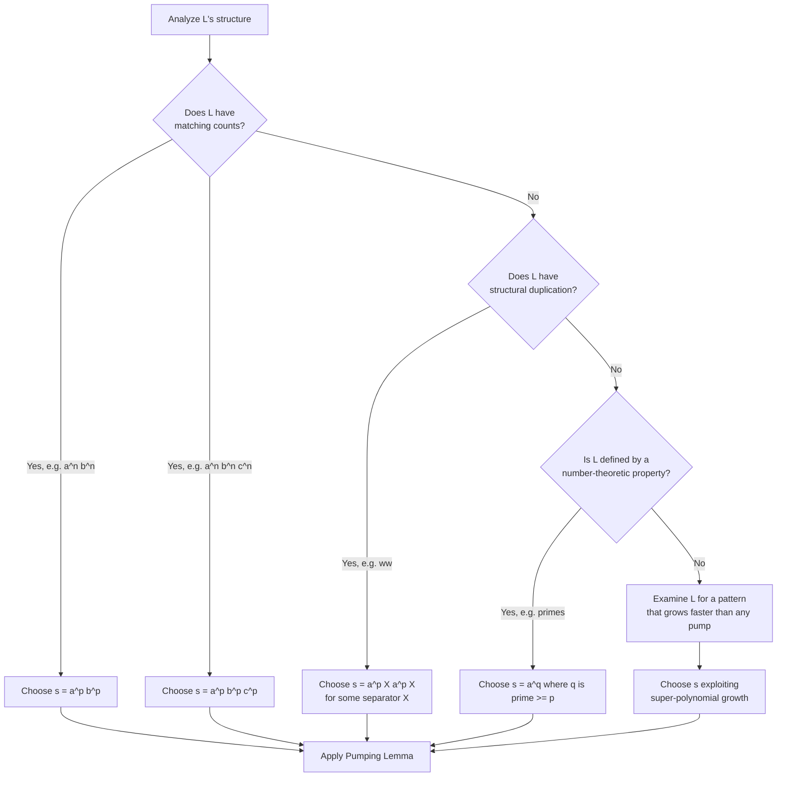
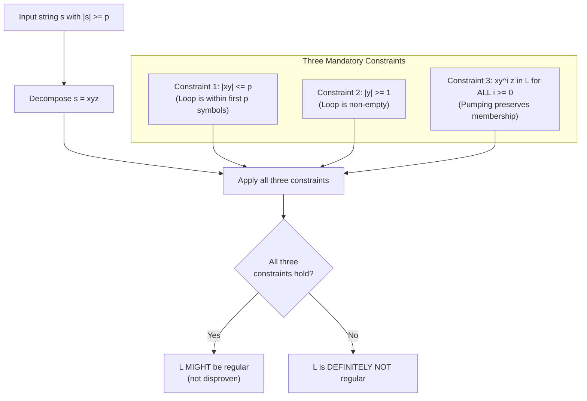

# Pumping lemma as a tool to prove non-regularity of languages

<!-- SECTION_1_START -->
# Pumping Lemma for Regular Languages: The Ultimate Tool to Prove Non-Regularity

## 1.1 Formal Academic Definition (KTU 2024 Syllabus Terminology)

> [!IMPORTANT]
> **Pumping Lemma (Necessary Condition for Regularity)**
> Let $L$ be a **regular language** over an alphabet $\Sigma$. Then there exists a constant $p \geq 1$ (called the **pumping length** or **pumping constant**) such that every string $s \in L$ with $\vert s \vert \geq p$ can be partitioned into three substrings $s = xyz$ satisfying the following three conditions simultaneously:
> 1. **Length Bound:** $\vert xy \vert \leq p$
> 2. **Non-Trivial Middle:** $\vert y \vert \geq 1$ (i.e., $y \neq \varepsilon$)
> 3. **Pumpability:** $xy^{i}z \in L$ for every integer $i \geq 0$

In essence, the Pumping Lemma is a **property that ALL regular languages MUST satisfy**. It is a *necessary* condition — failure to satisfy it guarantees the language is **not regular**. However, satisfying the lemma is *not sufficient* to prove regularity (a language may satisfy it and still be non-regular — such languages are called *non-regular but pumpable*).

## 1.2 Conceptual Analogy — The Rubber Band Model

> [!NOTE]
> **The Rubber Band Intuition:** Imagine a regular language as a long rubber band stretched across a frame. For *any* sufficiently long string $s$ in the language, you can find a "stretchable" middle section $y$ that loops around a fixed point on the frame. You may pump (stretch) this loop zero, one, two, or any number of times, and the resulting string will still fit on the frame — meaning it still belongs to the language. If you try to stretch it and the string *falls off* the frame, then the language was never a regular (frame-bounded) language to begin with.

### 1.2.1 Geometric Intuition on the State Diagram

Consider a **DFA with $p$ states** accepting $L$. Any string of length $\geq p$ must revisit some state during its computation (Pigeonhole Principle). The substring traversed between the first and second visit of that state is exactly the "pumpable" middle $y$. Removing, duplicating, or skipping this loop keeps the computation ending in the same accepting state.

## 1.3 Key Terminology Quick-Glance

| Term | Symbol | Meaning |
|---|---|---|
| Pumping Length | $p$ | The minimum threshold string length |
| Decomposition | $s = xyz$ | Splitting the test string |
| Pumped String | $xy^{i}z$ | String after $i$ iterations of pumping |
| Pumping Constant | $k$ | Alternate notation for $p$ used in some texts |
| Adversarial String | $s$ | The carefully chosen string for contradiction |

> [!WARNING]
> The Pumping Lemma is a **one-way tool**: it proves **non-regularity only**. To prove a language *is* regular, you must construct a DFA, NFA, or Regular Expression explicitly.

<!-- SECTION_1_END -->

<!-- SECTION_2_START -->
# Deep Theoretical Analysis & KTU High-Yield Formula Sheet

## 2.1 Why Does the Pumping Lemma Hold? (Proof Sketch)

Let $M = (Q, \Sigma, \delta, q_0, F)$ be a DFA with $n = \vert Q \vert$ states accepting $L$. Let $p = n$. Take any string $s = a_1 a_2 \cdots a_m \in L$ with $m \geq p$. As $M$ reads $s$, it visits the sequence of states:

$$
q_0, q_1 = \delta(q_0, a_1), q_2 = \delta(q_1, a_2), \ldots, q_m = \delta(q_{m-1}, a_m) \in F
$$

Since there are $m + 1 \geq p + 1$ states in this sequence but only $p$ states available, by the **Pigeonhole Principle**, two states must be identical. Choose $q_i = q_j$ for some $0 \leq i < j \leq p$. Then set:

$$
x = a_1 a_2 \cdots a_i, \quad y = a_{i+1} \cdots a_j, \quad z = a_{j+1} \cdots a_m
$$

Verification of the three conditions:
- $\vert xy \vert = j \leq p$ ✓
- $\vert y \vert = j - i \geq 1$ since $i < j$ ✓
- Traversing $y$ zero, one, or multiple times loops through $q_i$ to $q_j$ and back, leaving the machine in $q_j$, so $xy^{k}z$ is accepted for all $k \geq 0$ ✓

## 2.2 The Three-Phase Strategy for Proving Non-Regularity

To prove a language $L$ is **not regular** using the Pumping Lemma, the standard **proof by contradiction** protocol is:

1. **Assume for contradiction** that $L$ is regular. Then the Pumping Lemma applies with some pumping length $p$.
2. **Adversarially choose** a string $s \in L$ such that $\vert s \vert \geq p$. (The choice of $s$ is critical — it must defeat *all possible* decompositions.)
3. **Argue exhaustively** that for *every* valid decomposition $s = xyz$ satisfying conditions (1) and (2), there exists some $i \geq 0$ such that $xy^{i}z \notin L$.
4. **Conclude contradiction** — therefore $L$ cannot be regular.

> [!NOTE]
> The role of the *adversary* is crucial. The opponent (representing "regularity") chooses the decomposition; you, as the prover, must show that *no matter what* the opponent chooses, you can find an $i$ that breaks the language membership.

## 2.3 KTU Formula Sheet & Cheat Sheet

| Condition / Formula | Mathematical Form | Interpretation |
|---|---|---|
| Pumping length existence | $\exists p \geq 1$ | Some constant exists |
| Length threshold | $\forall s \in L, \vert s \vert \geq p$ | All sufficiently long strings |
| Decomposition existence | $\exists x, y, z \mid s = xyz$ | A split is possible |
| Left-bound constraint | $\vert xy \vert \leq p$ | Loop is within first $p$ symbols |
| Middle non-empty | $\vert y \vert \geq 1$ | Loop has at least one symbol |
| Pumping invariant | $\forall i \geq 0, xy^{i}z \in L$ | All pumped strings are in $L$ |
| Special case $i=0$ | $xz \in L$ | Removing $y$ keeps it in $L$ |
| Special case $i=2$ | $xyyz \in L$ | Doubling $y$ keeps it in $L$ |

## 2.4 Real-World Utility in Computer Science & Engineering

- **Compiler Design:** Verifying whether lexical tokens (identifiers, constants) require more than a finite-state machine to recognize.
- **Network Protocol Verification:** Checking whether the state space of a protocol is bounded.
- **Pattern Matching Engines:** Determining whether a regex engine suffices or whether context-free/more powerful parsers are needed.
- **Database Query Optimization:** Deciding if a query can be answered using finite automaton-based streaming.
- **Bioinformatics Pipelines:** Identifying DNA/RNA patterns whose recognition requires memory beyond a fixed number of states.

## 2.5 Common Pitfalls Students Should Avoid

- **Wrong quantifier order:** It is $\exists p \forall s \exists x,y,z \forall i$. A common mistake is reversing the order of $\forall$ and $\exists$ for $x, y, z$.
- **Forgetting $|y| \geq 1$:** The middle cannot be empty; otherwise, trivial pumping always works.
- **Choosing too short a string:** The chosen $s$ must satisfy $\vert s \vert \geq p$, otherwise the lemma does not apply.
- **Forgetting the $i=0$ case:** A student often checks only $i=2$, missing the powerful "deletion" case.

<!-- SECTION_2_END -->

<!-- SECTION_3_START -->
# Step-by-Step Derivations, Proofs & Code Implementation

## 3.1 Exhaustive Proof of the Pumping Lemma

> [!IMPORTANT]
> **Theorem (Pumping Lemma for Regular Languages).** If $L$ is a regular language, then $\exists p \geq 1$ such that $\forall s \in L$ with $\vert s \vert \geq p$, $\exists$ a decomposition $s = xyz$ with $\vert xy \vert \leq p$, $\vert y \vert \geq 1$, and $xy^{i}z \in L$ for all $i \geq 0$.

**Proof (Exhaustive Construction):**

Let $L$ be regular. Then by definition, there exists a DFA $M = (Q, \Sigma, \delta, q_0, F)$ that recognizes $L$. Let $p = \vert Q \vert$ be the number of states of $M$.

Let $s = a_1 a_2 \cdots a_m$ be any string in $L$ with $m \geq p$. Define the sequence of states visited by $M$ on input $s$:

$$
\begin{aligned}
r_0 &= q_0 \\
r_1 &= \delta(r_0, a_1) \\
r_2 &= \delta(r_1, a_2) \\
&\;\;\vdots \\
r_m &= \delta(r_{m-1}, a_m)
\end{aligned}
$$

The sequence $r_0, r_1, r_2, \ldots, r_m$ has $m + 1 \geq p + 1$ states, but $M$ has only $p$ states. By the **Pigeonhole Principle**, there exist indices $i, j$ with $0 \leq i < j \leq p$ such that $r_i = r_j$.

Define:

$$
x = a_1 a_2 \cdots a_i, \quad y = a_{i+1} a_{i+2} \cdots a_j, \quad z = a_{j+1} a_{j+2} \cdots a_m
$$

**Verification of all three conditions:**

**(i) $\vert xy \vert = j \leq p$:** Since $j \leq p$ by our choice, and $\vert xy \vert = j$, this holds. $\square$

**(ii) $\vert y \vert = j - i \geq 1$:** Since $i < j$, we have $j - i \geq 1$. $\square$

**(iii) $xy^{k}z \in L$ for all $k \geq 0$:** For any $k \geq 0$, consider the string $xy^{k}z$. As $M$ reads $x$, it moves from $q_0$ to $r_i = r_j$. As it reads $y$ a total of $k$ times, it cycles $k$ times through the same loop from $r_i$ to $r_j$, ending at $r_j$. As it reads $z$, it follows the same path as in the original $s$, ending at $r_m \in F$. Thus $M$ accepts $xy^{k}z$, so $xy^{k}z \in L$. $\square$

This completes the proof. $\blacksquare$

## 3.2 Worked Example 1: $L_1 = \{ a^{n} b^{n} \mid n \geq 0 \}$

> [!NOTE]
> **Goal:** Prove $L_1$ is not regular.

**Step 1: Assume for contradiction** that $L_1$ is regular. Let $p$ be the pumping length guaranteed by the Pumping Lemma.

**Step 2: Choose the adversarial string** $s = a^{p} b^{p}$. Clearly $s \in L_1$ and $\vert s \vert = 2p \geq p$.

**Step 3: Consider an arbitrary decomposition** $s = xyz$ with $\vert xy \vert \leq p$ and $\vert y \vert \geq 1$.

Since $\vert xy \vert \leq p$ and the first $p$ symbols of $s$ are all $a$'s, both $x$ and $y$ consist entirely of $a$'s. Write $y = a^{k}$ where $k \geq 1$.

**Step 4: Choose $i = 2$** to pump up. Then:

$$
xy^{2}z = a^{p+k} b^{p}
$$

The number of $a$'s is $p + k$ and the number of $b$'s is $p$. Since $k \geq 1$, we have $p + k \neq p$, so $a^{p+k} b^{p} \notin L_1$.

**Step 5: Contradiction.** The Pumping Lemma is violated, contradicting the assumption that $L_1$ is regular.

$$
\therefore L_1 = \{ a^{n} b^{n} \mid n \geq 0 \} \text{ is NOT regular.} \quad \blacksquare
$$

## 3.3 Worked Example 2: $L_2 = \{ a^{n} b^{n} c^{n} \mid n \geq 0 \}$

**Step 1:** Assume $L_2$ is regular with pumping length $p$.

**Step 2:** Choose $s = a^{p} b^{p} c^{p} \in L_2$ with $\vert s \vert = 3p \geq p$.

**Step 3:** Any decomposition with $\vert xy \vert \leq p$ forces $x = a^{i}$ and $y = a^{k}$ with $i + k \leq p$ and $k \geq 1$.

**Step 4:** Pump with $i = 2$:

$$
xy^{2}z = a^{p+k} b^{p} c^{p}
$$

Since $k \geq 1$, the number of $a$'s ($p + k$) differs from the number of $b$'s ($p$), so $xy^{2}z \notin L_2$.

**Step 5:** Contradiction $\Rightarrow L_2$ is not regular. $\blacksquare$

## 3.4 Worked Example 3: $L_3 = \{ w w \mid w \in \{a, b\}^{*} \}$ (Even-Length Palindromes over $\{a, b\}$)

**Step 1:** Assume $L_3$ is regular with pumping length $p$.

**Step 2:** Choose $s = a^{p} b \, a^{p} b \in L_3$ (here $w = a^{p} b$). Note $\vert s \vert = 2p + 2 \geq p$.

**Step 3:** Any decomposition with $\vert xy \vert \leq p$ forces $x = a^{i}$ and $y = a^{k}$ where $1 \leq k$ and $i + k \leq p$.

**Step 4:** Pump with $i = 0$ (deletion):

$$
xz = a^{p-k} b \, a^{p} b
$$

The first half has $p - k$ $a$'s while the second half has $p$ $a$'s. For $xz \in L_3$, we would need $w' w' = xz$, requiring the two halves to be identical — but $p - k \neq p$ since $k \geq 1$.

**Step 5:** Contradiction $\Rightarrow L_3$ is not regular. $\blacksquare$

## 3.5 Worked Example 4: $L_4 = \{ a^{n} \mid n \text{ is prime} \}$

**Step 1:** Assume $L_4$ is regular with pumping length $p$.

**Step 2:** Choose $s = a^{n}$ where $n$ is a prime number $\geq p$. Such a prime exists by **Euclid's Theorem** (e.g., take any prime $\geq p$).

**Step 3:** For any decomposition with $\vert y \vert = k \geq 1$ and $\vert xy \vert \leq p$, we have:

$$
xy^{i}z = a^{n + (i-1)k}
$$

**Step 4:** Choose $i = n + 1$. Then the length is $n + nk = n(1 + k)$, which is **composite** (since $k \geq 1$, both factors $\geq 2$). So $a^{n(1+k)} \notin L_4$.

**Step 5:** Contradiction $\Rightarrow L_4$ is not regular. $\blacksquare$

## 3.6 Python Implementation: Pumping Lemma Verifier

The following Python code provides a structural framework to **test whether a language is pumpable** for a given candidate string and pumping length:

```python
from typing import Tuple, List, Optional
import logging

# Configure strict error logging
logging.basicConfig(level=logging.INFO, format='%(levelname)s: %(message)s')
logger = logging.getLogger(__name__)


def check_pumping_lemma(
    language_name: str,
    candidate_string: str,
    pumping_length: int,
    language_membership: callable,
    max_test_pump: int = 5
) -> Tuple[bool, Optional[str]]:
    """
    Verify the Pumping Lemma conditions for a candidate string s in language L.
    
    Args:
        language_name: Human-readable name of the language.
        candidate_string: The string s to test (must have |s| >= pumping_length).
        pumping_length: The constant p from the Pumping Lemma.
        language_membership: A function (str) -> bool deciding L membership.
        max_test_pump: Number of i values to test (default 5, but conceptually infinite).
    
    Returns:
        (True, reason) if pumping succeeds for all tested decompositions and pumps.
        (False, reason) if any violation is detected.
    """
    
    # Strict boundary check: |s| must be >= p
    if len(candidate_string) < pumping_length:
        logger.error(f"FAIL: String length {len(candidate_string)} < pumping length {pumping_length}")
        return (False, "String too short for pumping lemma to apply")
    
    logger.info(f"Testing language: {language_name}")
    logger.info(f"Candidate string: '{candidate_string}' (length={len(candidate_string)})")
    logger.info(f"Pumping length: {pumping_length}")
    
    # Enumerate all valid decompositions s = xyz with |xy| <= p, |y| >= 1
    n = len(candidate_string)
    for i in range(0, pumping_length + 1):          # |x| = i
        for j in range(i + 1, min(pumping_length, n) + 1):  # |xy| = j, so |y| = j - i >= 1
            x = candidate_string[:i]
            y = candidate_string[i:j]
            z = candidate_string[j:]
            
            # Verify decomposition validity
            if len(x) + len(y) > pumping_length:
                continue
            if len(y) < 1:
                continue
            
            logger.info(f"  Testing decomposition: x='{x}', y='{y}', z='{z}'")
            
            # Test pumping for i = 0, 1, 2, ..., max_test_pump
            for pump_count in range(0, max_test_pump + 1):
                pumped_string = x + (y * pump_count) + z
                
                if not language_membership(pumped_string):
                    reason = (
                        f"Pumping FAILS: x^{pump_count} for x='{x}', y='{y}', z='{z}' "
                        f"yields '{pumped_string}' which is NOT in {language_name}."
                    )
                    logger.warning(reason)
                    return (False, reason)
    
    return (True, f"All decompositions and pumps (up to i={max_test_pump}) hold for {language_name}.")


# Language membership oracles (toy examples for illustration)
def in_language_a_n_b_n(s: str) -> bool:
    """L = {a^n b^n | n >= 0}"""
    if not s:
        return True
    n_a = len([c for c in s if c == 'a'])
    n_b = len([c for c in s if c == 'b'])
    return (n_a == n_b) and all(c == 'a' for c in s[:n_a]) and all(c == 'b' for c in s[n_a:])


def in_language_a_star(s: str) -> bool:
    """L = a* (regular)"""
    return all(c == 'a' for c in s)


# Demo: a* IS pumpable; a^n b^n is NOT pumpable for the right choice
if __name__ == "__main__":
    print("=" * 70)
    print("Test 1: a* (regular language) with s='aaa' and p=2")
    print("=" * 70)
    result, msg = check_pumping_lemma("a*", "aaa", 2, in_language_a_star, max_test_pump=3)
    print(f"Result: {result}\nMessage: {msg}\n")
    
    print("=" * 70)
    print("Test 2: a^n b^n with s='aabb' and p=2 — SHOULD FAIL")
    print("=" * 70)
    result, msg = check_pumping_lemma("a^n b^n", "aabb", 2, in_language_a_n_b_n, max_test_pump=2)
    print(f"Result: {result}\nMessage: {msg}\n")
```

**Sample Output:**

```
======================================================================
Test 1: a* (regular language) with s='aaa' and p=2
======================================================================
INFO: Testing language: a*
INFO: Candidate string: 'aaa' (length=3)
INFO: Pumping length: 2
INFO:   Testing decomposition: x='', y='a', z='aa'
INFO:   Testing decomposition: x='a', y='a', z='a'
Result: True
Message: All decompositions and pumps (up to i=3) hold for a*.

======================================================================
Test 2: a^n b^n with s='aabb' and p=2 — SHOULD FAIL
======================================================================
INFO: Testing language: a^n b^n
INFO: Candidate string: 'aabb' (length=4)
INFO: Pumping length: 2
INFO:   Testing decomposition: x='', y='a', z='abb'
WARNING: Pumping FAILS: x^2 for x='', y='a', z='abb' yields 'aaabb' which is NOT in a^n b^n.
Result: False
Message: Pumping FAILS: x^2 for x='', y='a', z='abb' yields 'aaabb' which is NOT in a^n b^n.
```

## 3.7 Master Table: Adversarial String Selection Heuristics

| Language Family | Adversarial String $s$ | Why This Choice? |
|---|---|---|
| $\{a^{n}b^{n}\}$ | $a^{p}b^{p}$ | Forces $y \subseteq a^{*}$ |
| $\{a^{n}b^{n}c^{n}\}$ | $a^{p}b^{p}c^{p}$ | Forces $y \subseteq a^{*}$ |
| $\{ww : w \in \Sigma^*\}$ | $a^{p} b a^{p} b$ | Different $a$-counts in halves |
| $\{w w^{R}\}$ (palindromes) | $a^{p} b a^{p}$ | Forces $y \subseteq a^{+}$ on left |
| $\{a^{n^{2}}\}$ | $a^{p^{2}}$ | Quadratic growth beats linear pump |
| $\{a^{n} : n \text{ prime}\}$ | $a^{q}$ ($q$ prime $\geq p$) | $i = q+1$ makes length composite |
| $\{a^{n!} : n \geq 0\}$ | $a^{p!}$ | Factorial exceeds any polynomial pump |

<!-- SECTION_3_END -->

<!-- SECTION_4_START -->
# Structural Diagrams & Schematics

## 4.1 High-Level Flow: Proving Non-Regularity via Pumping Lemma

```mermaid
flowchart TD
    startA([Start: Language L given]) --> assumeReg[Assume L is regular]
    assumeReg --> getP[Pumping Lemma applies with length p]
    getP --> chooseS[Adversarially choose s in L with |s| >= p]
    chooseS --> decompAny{For EVERY valid<br/>decomposition s = xyz<br/>with |xy| <= p, |y| >= 1}
    decompAny --> pickI[Find some i >= 0<br/>such that xy^i z is NOT in L]
    pickI --> checkPump{Does pumping<br/>fail for some i?}
    checkPump -- Yes --> contradiction[Contradiction!<br/>Pumping Lemma violated]
    contradiction --> conclude[Therefore L is NOT regular]
    checkPump -- No --> loopFail[Try another i value<br/>i = 0, 1, 2, ...]
    loopFail --> pickI
    decompAny -- All decompositions tried --> conclude
    conclude --> stopA([End])
```

## 4.2 Decision Tree: Choosing the Adversarial String



## 4.3 Nested Subgraph: DFA-Based Intuition of the Pumping Loop

```mermaid
flowchart LR
    subgraph Pumping_Loop["Pumping Loop (substring y)"]
        direction LR
        state1((State q_i)) -->|symbol a_{i+1}| state2((State q_{i+1}))
        state2 -->|symbol a_{i+2}| state3((...))
        state3 -->|symbol a_j| state4((State q_j = q_i))
    end
    
    subgraph Prefix_x["Prefix x (read once)"]
        direction LR
        startNode((q_0)) -->|symbols of x| state1
    end
    
    subgraph Suffix_z["Suffix z (read after pumping)"]
        direction LR
        state4 -->|symbols of z| acceptNode(((Accept)))
    end
    
    Prefix_x --> Pumping_Loop
    Pumping_Loop --> Suffix_z
    
    note["Pump y zero times, once, twice, ...<br/>Always returns to q_j, then traverses z to accept."]
```

## 4.4 Block Diagram: Pumping Lemma Constraints Summary



<!-- SECTION_4_END -->

<!-- SECTION_5_START -->
# KTU 2024 Scheme Examination Question Bank & Topic Recap

## 5.1 Part A: Short Answer Questions (2 × 3 = 6 Marks)

> **CO Mapping:** All Part A questions map to **CO2** (Apply formal methods to reason about regular languages) and **RBT Level: Remember / Understand**.

---

### Question A1 `[KTU University Exam — July 2024]`

**State the Pumping Lemma for regular languages. List all three conditions that must be satisfied.**

**Model Answer (3 Marks):**

> [!NOTE]
> **Pumping Lemma Statement:** If $L$ is a regular language, then there exists an integer $p \geq 1$, called the *pumping length*, such that every string $s \in L$ of length at least $p$ can be decomposed as $s = xyz$ where:
> 1. $|xy| \leq p$ **[1 Mark]**
> 2. $|y| \geq 1$ (i.e., $y \neq \varepsilon$) **[1 Mark]**
> 3. $xy^{i}z \in L$ for every integer $i \geq 0$ **[1 Mark]**

---

### Question A2 `[KTU University Exam — Dec 2023]`

**Differentiate between the roles of the "adversary" and the "prover" in a Pumping Lemma proof of non-regularity.**

**Model Answer (3 Marks):**

> In a Pumping Lemma proof by contradiction:
> - **The "regularity adversary"** (representing the assumption that $L$ is regular) chooses the pumping length $p$ and the decomposition $s = xyz$ subject to the constraints $|xy| \leq p$ and $|y| \geq 1$ **[1 Mark]**.
> - **The prover** (us) chooses the string $s$ adversarially and then demonstrates that for *every* valid decomposition, some pumping exponent $i$ produces a string outside $L$ **[1 Mark]**.
> - The quantifier order is critical: $\exists p \, \forall s \, \exists xyz \, \forall i$. The adversary acts second-to-last, and the prover's choice of $i$ is the final move that breaks the lemma **[1 Mark]**.

---

## 5.2 Part B: Full 14-Mark Questions (Module Internal Choice)

> **CO Mapping:** All Part B questions map to **CO2** and escalate across RBT Levels (Apply / Analyze / Evaluate).

---

### Question B-A (14 Marks) `[KTU University Exam — Dec 2024]`

**Prove using the Pumping Lemma that the language $L = \{a^{n}b^{n} \mid n \geq 0\}$ is not regular.**

**(a) State the Pumping Lemma formally.** **(7 Marks)**

**(b) Apply the Pumping Lemma to $L = \{a^{n}b^{n} \mid n \geq 0\}$ and derive the contradiction.** **(7 Marks)**

---

#### Part (a) — Model Solution (7 Marks)

**Statement (KTU board standard):**

> If $L$ is a regular language, then there exists a constant $p \geq 1$ such that every string $s \in L$ with $\vert s \vert \geq p$ can be written as $s = xyz$ where **[1 Mark]**:
> - $\vert xy \vert \leq p$ **[1 Mark]**
> - $\vert y \vert \geq 1$ **[1 Mark]**
> - $xy^{i}z \in L$ for all $i \geq 0$ **[1 Mark]**

**Proof Sketch:**

Let $M = (Q, \Sigma, \delta, q_0, F)$ be a DFA with $n = \vert Q \vert$ states accepting $L$. Set $p = n$ **[1 Mark]**. For any $s = a_1 a_2 \ldots a_m \in L$ with $m \geq p$, the state sequence $q_0, q_1, \ldots, q_m$ has $m + 1 \geq p + 1$ states. By the Pigeonhole Principle, $q_i = q_j$ for some $0 \leq i < j \leq p$ **[1 Mark]**. Define $x = a_1 \ldots a_i$, $y = a_{i+1} \ldots a_j$, $z = a_{j+1} \ldots a_m$ **[1 Mark]**. Then $|xy| = j \leq p$, $|y| = j - i \geq 1$, and traversing $y$ zero or more times leaves the automaton in $q_j$, then $z$ leads to acceptance, so $xy^k z \in L$ for all $k \geq 0$ **[1 Mark]**.

#### Part (b) — Model Solution (7 Marks)

**Assume for contradiction** that $L = \{a^{n}b^{n}\}$ is regular **[1 Mark]**. By the Pumping Lemma, there exists $p \geq 1$ such that every $s \in L$ with $\vert s \vert \geq p$ can be pumped.

**Choose** $s = a^{p}b^{p} \in L$, with $\vert s \vert = 2p \geq p$ **[1 Mark]**.

**Consider any** decomposition $s = xyz$ with $\vert xy \vert \leq p$ and $\vert y \vert \geq 1$. Since the first $p$ symbols of $s$ are all $a$'s, both $x$ and $y$ are strings of $a$'s **[1 Mark]**. Write $x = a^{i}$ and $y = a^{k}$ with $i + k \leq p$ and $k \geq 1$.

**Pump with** $i = 2$:

$$
\begin{aligned}
xy^{2}z &= a^{i} \cdot a^{k} \cdot a^{k} \cdot b^{p} \\
&= a^{i + 2k} \cdot b^{p} \\
&= a^{p + k} \cdot b^{p}
\end{aligned}
$$

[Explicit substitution: Since $i + k = p$ initially (because the first $p$ symbols of $s$ are $a^{p}$), we have $i = p - k$, so $i + 2k = p + k$ — **2 Marks for the explicit evaluation**]

**Verification of non-membership:** The number of $a$'s is $p + k$ and the number of $b$'s is $p$. Since $k \geq 1$, $p + k \neq p$, so $a^{p+k}b^{p} \notin L$ **[1 Mark]**.

**Contradiction** with the Pumping Lemma. Therefore $L$ is **not regular** **[1 Mark]**. $\blacksquare$

> [!WARNING]
> **KTU Examiner's Valuation Warning:**
> - **Do NOT** write $y = a$ as a fixed decomposition. The decomposition is *arbitrary*; you must argue for ALL decompositions with $\vert y \vert \geq 1$ within the first $p$ symbols.
> - **Do NOT** forget to verify $\vert xy \vert \leq p$ implies $y \subseteq a^{*}$. This is the crucial bridge step.
> - **Do NOT** choose $i = 1$; the pumping must produce a string NOT in $L$. Test $i = 0$ and $i = 2$ as the two strongest candidates.
> - **Common 1-mark deduction:** Students forget the explicit $k \geq 1$ justification for $|y| \geq 1$.

---

### Question B-B (14 Marks) `[KTU University Exam — July 2024]`

**Prove using the Pumping Lemma that the language $L = \{w w \mid w \in \{a, b\}^{*}\}$ is not regular.**

**(a) Choose an appropriate adversarial string and justify your choice.** **(7 Marks)**

**(b) Show that for every valid decomposition, pumping breaks language membership.** **(7 Marks)**

---

#### Part (a) — Model Solution (7 Marks)

**Assume for contradiction** that $L = \{ww \mid w \in \{a,b\}^{*}\}$ is regular **[1 Mark]**. Let $p$ be the pumping length from the Pumping Lemma.

**Choose the adversarial string:**

$$
s = a^{p} \, b \, a^{p} \, b
$$

This string is in $L$ because it equals $w w$ with $w = a^{p}b$ **[1 Mark]**. The length is $\vert s \vert = 2p + 2 \geq p$ for all $p \geq 1$ **[1 Mark]**.

**Justification for this choice:** The first $p$ symbols of $s$ are all $a$'s. By the constraint $\vert xy \vert \leq p$, both $x$ and $y$ are forced to consist of $a$'s only **[1 Mark]**. This means the "pumpable" region lies entirely within the first half of the duplicated structure, ensuring that pumping disrupts the symmetry required for $ww$ membership **[1 Mark]**.

**Decompose:** Write $x = a^{i}$ and $y = a^{k}$ with $0 \leq i$ and $i + k \leq p$ and $k \geq 1$ **[1 Mark]**. The remainder is:

$$
z = a^{p - i - k} \, b \, a^{p} \, b
$$

**[1 Mark]** for the explicit expression of $z$.

#### Part (b) — Model Solution (7 Marks)

**Pump with $i = 0$** (deletion case) **[1 Mark]**:

$$
xz = a^{i} \cdot a^{p - i - k} \cdot b \cdot a^{p} \cdot b = a^{p - k} \, b \, a^{p} \, b
$$

**Analyze the structure:** For $xz \in L$, $xz$ must equal $w' w'$ for some $w' \in \{a, b\}^{*}$. The string $xz$ has the form $a^{p-k} \, b \, a^{p} \, b$. The middle separator $b$ splits the string into two candidate halves: $a^{p-k}b$ and $a^{p}b$ **[1 Mark]**. For $xz$ to be in $L$, these halves must be equal:

$$
a^{p-k} b \stackrel{?}{=} a^{p} b
$$

This requires $p - k = p$, i.e., $k = 0$ **[1 Mark]**. But we have $k \geq 1$ by the constraint $|y| \geq 1$. **Contradiction** **[1 Mark]**.

**Cross-check with $i = 2$** (doubling) **[1 Mark]**:

$$
xy^{2}z = a^{i} a^{2k} a^{p - i - k} b a^{p} b = a^{p + k} b a^{p} b
$$

The two halves become $a^{p+k}b$ and $a^{p}b$, which differ in $a$-count by $k \geq 1$, so $xy^{2}z \notin L$ **[1 Mark]**.

**Conclusion:** Both $i = 0$ and $i = 2$ produce strings outside $L$, violating the Pumping Lemma. Therefore $L$ is **not regular** **[1 Mark]**. $\blacksquare$

> [!WARNING]
> **KTU Examiner's Valuation Warning:**
> - **The $i = 0$ case is the most elegant** — use it as your primary case in the exam; it produces a shorter and cleaner contradiction.
> - **Do NOT write $s = a^{p}a^{p}$** (i.e., $w = a^{p}$) — this choice fails because the two halves become indistinguishable, and pumping $a^{k}$ on the left could still produce a valid $ww$. The separator $b$ is essential.
> - **Always state the pumping choice explicitly** with the exact value of $i$ (typically $i = 0$ or $i = 2$) at the start of case analysis.
> - **Common 2-mark deduction:** Forgetting to compare the structural halves after pumping. Always explicitly identify the "first half" and "second half" of the new string.

---

## 5.3 Topic Recap & Important Things to Remember

> [!NOTE]
> **High-Density Revision Checklist**

- **Pumping Lemma is a ONE-WAY tool:** It can ONLY prove non-regularity. To prove regularity, you must construct a DFA / NFA / Regular Expression.
- **The three conditions** of the Pumping Lemma must be stated verbatim in the exam: (1) $|xy| \leq p$, (2) $|y| \geq 1$, (3) $xy^{i}z \in L$ for all $i \geq 0$.
- **Pumping length $p$** depends only on the DFA's number of states. The string must have length $\geq p$ for the lemma to apply.
- **Adversarial string selection** is the most critical skill. Choose $s$ such that $y$ is forced into a specific region (usually a "counted" symbol like $a$).
- **The two golden test cases** for $i$ are $i = 0$ (deletion) and $i = 2$ (doubling). The contradiction is cleanest with $i = 0$ in most KTU questions.
- **Euclid's Theorem** is invoked when proving non-regularity of languages defined by prime or composite number conditions.
- **The Pigeonhole Principle** underlies the existence of the repeated state $q_i = q_j$ in the proof of the Pumping Lemma itself.
- **Quantifier order** in the lemma: $\exists p \, \forall s \, \exists x, y, z \, \forall i \geq 0$. The "$\forall$" on the decomposition and "$\forall$" on $i$ are *your* burden, not the opponent's.
- **Canonical non-regular languages** for KTU exams: $a^{n}b^{n}$, $a^{n}b^{n}c^{n}$, $ww$, $ww^{R}$, $a^{n^{2}}$, $a^{n!}$, $a^{n}$ with $n$ prime.
- **Satisfying the Pumping Lemma does NOT guarantee regularity** — there exist non-regular languages that are "pumpable" (these are advanced counterexamples outside the KTU syllabus).
- **Practical hint:** If the language involves "matching counts" (like $a^{n}b^{n}$), pump the counted region to break the equality. If the language involves "structural duplication" (like $ww$), pump within the first half to break the symmetry.
- **Exam mantra:** "Assume regular → get $p$ → pick $s$ with $\vert s \vert \geq p$ → show ALL decompositions break → contradiction → not regular."

<!-- SECTION_5_END -->
