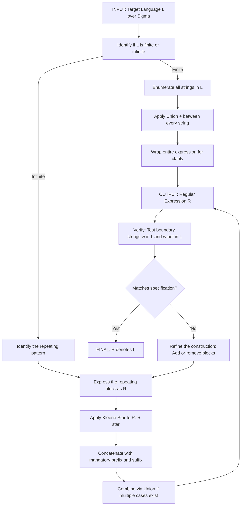
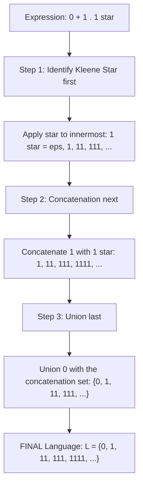
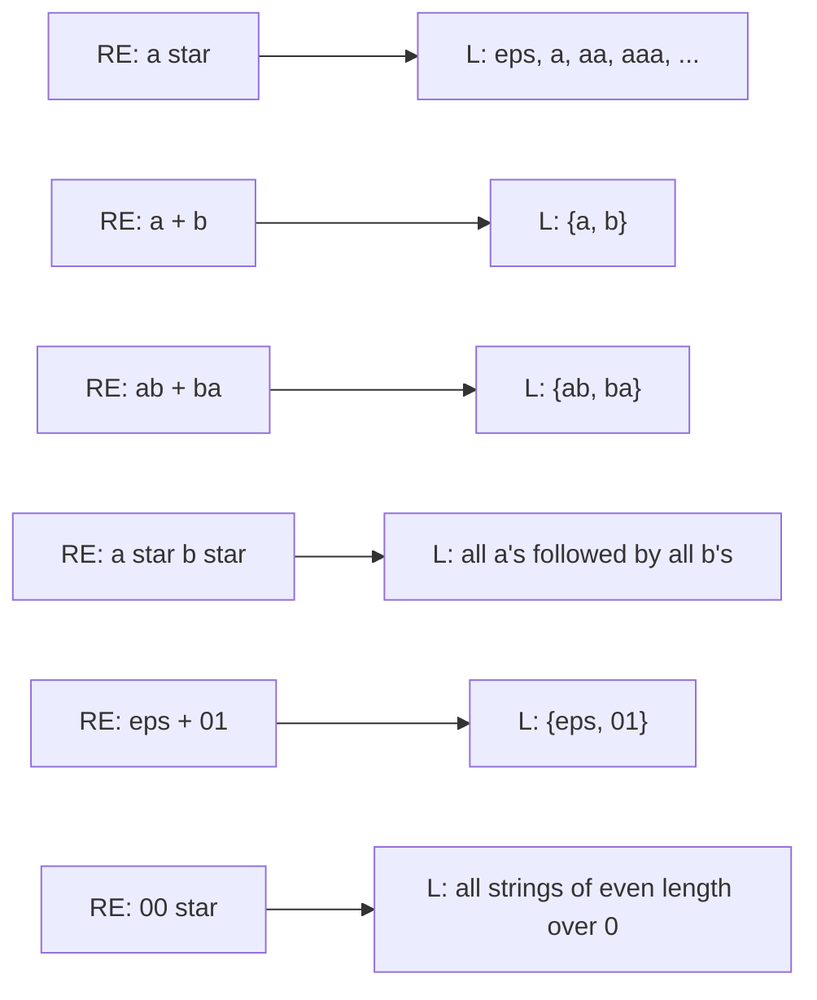
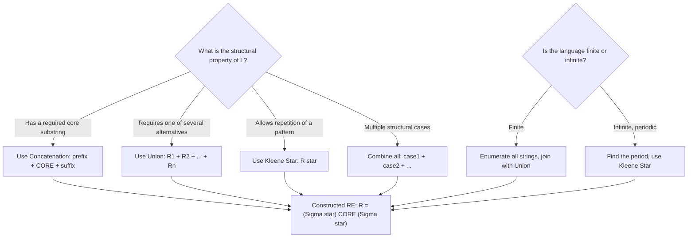

# Regular Expressions: The formal definition of a regular expression, Building Regular Expressions

<!-- SECTION_1_START -->
# Regular Expressions — Formal Definition & Construction

> [!NOTE]
> **KTU 2024 Scheme | PCCST302 | Module 2 | Topic: Regular Expressions**
> This topic is a **high-yield area** for the End Semester Examination (ESE). Expect a full 14-mark Part B question on building regular expressions for a given language, or a 3-mark Part A on the formal definition.

## 1.1 Formal Definition (Recursive Construction)

Let $\Sigma$ be a given finite alphabet. A **Regular Expression (RE)** over $\Sigma$ is a string built recursively from the following rules. Every regular expression $R$ denotes a formal language $L(R) \subseteq \Sigma^{\ast}$.

### 1.1.1 The Three Base Cases (Atomic Expressions)

| Base Expression | Formal Symbol | Language Denoted | Intuitive Meaning |
| :--- | :---: | :--- | :--- |
| Empty set | $\emptyset$ | $L(\emptyset) = \{\}$ | The language with **zero strings** — represents impossibility. |
| Empty string | $\varepsilon$ | $L(\varepsilon) = \{\varepsilon\}$ | The language with **exactly one string** — the empty word. |
| Single symbol | $a$, where $a \in \Sigma$ | $L(a) = \{a\}$ | The language with exactly one string of length 1. |

### 1.1.2 The Three Inductive (Closure) Cases

If $R_1$ and $R_2$ are regular expressions denoting languages $L(R_1)$ and $L(R_2)$, then the following are also regular expressions:

1. **Union (Choice)** $\quad R_1 + R_2$
$$L(R_1 + R_2) \;=\; L(R_1) \cup L(R_2)$$
*"Pick a string from $L(R_1)$ **or** a string from $L(R_2)$."*

2. **Concatenation (Sequence)** $\quad R_1 \cdot R_2$
$$L(R_1 \cdot R_2) \;=\; \{ xy \mid x \in L(R_1) \text{ and } y \in L(R_2) \}$$
*"First output a string from $L(R_1)$, then a string from $L(R_2)$."*

3. **Kleene Star (Repetition)** $\quad R_1^{\ast}$
$$L(R_1^{\ast}) \;=\; \{x_1 x_2 \cdots x_k \mid k \geq 0 \text{ and each } x_i \in L(R_1)\}$$
*"Concatenate zero or more strings from $L(R_1)$."*

> [!IMPORTANT]
> **Order of Precedence (Highest to Lowest):** $\;Kleene\ Star\ (\ast) \;\gt\; Concatenation\ (\cdot) \;\gt\; Union\ (+)$
> Always use parentheses $\,(\,)\,$, $[\,]$, or $\{\,\}$ to override precedence in the KTU answer sheet.

---

## 1.2 Conceptual Analogy — The "Recipe for Strings" View

Imagine a **regular expression** as a *recipe that bakes an infinite tray of pastries*, where each pastry is a string.

| RE Symbol | Culinary Analogy |
| :---: | :--- |
| $a$ | A single, specific ingredient (e.g., *one chocolate chip*). |
| $+$ | "Use this ingredient **or** that one" (chips **or** raisins). |
| $\cdot$ | "Then add this next" (chips, **then** nuts). |
| $\ast$ | "Repeat the previous step **zero or more** times." |
| $\varepsilon$ | "Do nothing" — a no-op step that still counts as a valid pastry. |
| $\emptyset$ | "This recipe produces no pastry" — an empty baking tray. |

> [!TIP]
> **GeoGebra / Desmos Visualization** is **not applicable** here — Regular Expressions operate on **discrete symbolic strings**, not continuous geometric space. Skip plotting and focus on **string-set diagrams** (Venn / Euler-style sets) in your answer script.

## 1.3 Why Regular Expressions Matter in Engineering

- **Lexical Analysis:** Compilers (GCC, javac) use RE-driven scanners (Lex, Flex) to tokenize source code.
- **Search Engines:** `grep`, `sed`, IDE search — all powered by RE engines.
- **Network Security:** Intrusion Detection Systems (Snort, Suricata) use RE to match malicious packet patterns.
- **Bioinformatics:** DNA/protein sequence pattern matching uses extended regular expressions.
- **Formal Verification:** RE provides a compact, declarative way to specify the *legal input language* of any finite-state hardware/software module.

> [!IMPORTANT]
> **KTU Theorem (Kleene's Theorem — to be proven in Module 3):**
> A language is **regular** $\iff$ it is denoted by some **regular expression** $\iff$ it is accepted by some **DFA/NFA**.
> This triple equivalence is the central pillar of Module 2 and Module 3.
<!-- SECTION_1_END -->

<!-- SECTION_2_START -->
# Deep Theoretical Analysis & KTU High-Yield Formula Sheet

## 2.1 The Recursive Construction — Step-by-Step Logic

A regular expression is built by **applying exactly three operations** repeatedly. The construction proceeds as follows:

1. **Start with atoms.** Pick symbols from $\Sigma$ (or use $\varepsilon$ / $\emptyset$).
2. **Combine via Union** to indicate *alternatives* (a string from one set **or** the other).
3. **Combine via Concatenation** to indicate *sequencing* (a string from one set **followed by** a string from another).
4. **Apply Kleene Star** to indicate *zero or more repetitions* of an existing RE.
5. **Repeat Steps 2–4** on the newly formed compound RE until the desired language is fully captured.

> [!NOTE]
> **The Kleene Star is the "power operator" of regular expressions.** It is the single feature that allows finite expressions to denote **infinite languages** (e.g., $a^{\ast}$ denotes the infinite set $\{\varepsilon, a, aa, aaa, \ldots\}$).

---

## 2.2 Precedence Table — Mandatory for KTU Answers

> [!IMPORTANT]
> In the KTU answer script, always write the operator precedence explicitly the **first time** you use it. Examiners award marks for clarity.

| Priority | Operator | Notation | Example | Meaning |
| :---: | :---: | :---: | :---: | :--- |
| 1 (Highest) | Kleene Star | $\ast$ | $R^{\ast}$ | Zero or more repetitions of $R$ |
| 2 | Concatenation | $\cdot$ (often implicit) | $R_1 R_2$ | $R_1$ followed by $R_2$ |
| 3 (Lowest) | Union | $+$ | $R_1 + R_2$ | $R_1$ or $R_2$ |

**Example of Precedence:** The expression $0 + 1 \cdot 1^{\ast}$ is parsed as $0 + (1 \cdot (1^{\ast}))$, *not* as $(0+1) \cdot 1^{\ast}$.

---

## 2.3 KTU Formula Sheet — Algebraic Identities for Regular Expressions

> [!IMPORTANT]
> These identities are **exam gold**. Questions of the form *"Simplify the given RE"* or *"Prove $L(R_1) = L(R_2)$ using RE algebra"* appear regularly.

| # | Identity | Name |
| :---: | :--- | :--- |
| 1 | $R + S = S + R$ | Commutativity of Union |
| 2 | $R + (S + T) = (R + S) + T$ | Associativity of Union |
| 3 | $R(ST) = (RS)T$ | Associativity of Concatenation |
| 4 | $R + \emptyset = R$ | Identity of Union |
| 5 | $R \cdot \varepsilon = \varepsilon \cdot R = R$ | Identity of Concatenation |
| 6 | $R \cdot \emptyset = \emptyset \cdot R = \emptyset$ | Annihilator of Concatenation |
| 7 | $R + R = R$ | Idempotence of Union |
| 8 | $R(S + T) = RS + RT$ | Left Distributivity |
| 9 | $(S + T)R = SR + TR$ | Right Distributivity |
| 10 | $\emptyset^{\ast} = \varepsilon$ | Star of Empty Set |
| 11 | $\varepsilon^{\ast} = \varepsilon$ | Star of Empty String |
| 12 | $R^{\ast} = \varepsilon + R \cdot R^{\ast}$ | Unfolding the Star |
| 13 | $R^{\ast} = \varepsilon + R^{\ast} \cdot R$ | Unfolding from the Right |
| 14 | $(R^{\ast})^{\ast} = R^{\ast}$ | Idempotence of Star |
| 15 | $R^{\ast} R^{\ast} = (RR)^{\ast}$ — *only valid when $R = R^{\ast}R$* | ⚠️ Conditional — use carefully |
| 16 | $(R + S)^{\ast} = (R^{\ast} S^{\ast})^{\ast} = (R^{\ast} + S^{\ast})^{\ast}$ | Star of a Sum |

> [!WARNING]
> **Concatenation is NOT commutative.** $R \cdot S \neq S \cdot R$ in general. Students often lose 1 mark for writing "RS = SR" in identity tables.

---

## 2.4 Real-World Engineering Utility

| Domain | Application of Regular Expressions |
| :--- | :--- |
| **Compilers** | Lexical analyzers (Lex/Flex, ANTLR token rules) |
| **Web Dev** | Form validation — email, phone, password strength |
| **OS / Shell** | File globbing, `grep`, `awk`, `sed` |
| **Networking** | Packet filter rules, firewall ACL pattern matching |
| **Hardware Design** | Specifying legal input sequences for FSM controllers |
| **Data Science** | Text preprocessing, NLP tokenization rules |
| **Cybersecurity** | Signature-based malware detection (YARA rules) |

> [!NOTE]
> Practical regex engines (PCRE, Python `re`, Java `java.util.regex`) are **extensions** of formal RE — they add features like backreferences (`\1`) and lookahead that **cannot** be expressed by formal RE and require Pushdown Automata (Module 4). For the KTU exam, **only the formal RE operations** ($\varepsilon, \emptyset, +, \cdot, \ast$) are in scope.
<!-- SECTION_2_END -->

<!-- SECTION_3_START -->
# Step-by-Step Derivations & Construction Examples

> [!NOTE]
> This section demonstrates the **complete, exhaustive construction** of regular expressions for the language families most frequently asked in KTU 2024 Scheme examinations. Every step is shown; no shortcuts are taken.

---

## Example 1 — Language with a Mandatory Substring

**Problem:** Construct a regular expression for $L = \{w \in \{0,1\}^{\ast} \mid w \text{ contains the substring } 00\}$.

**Step 1 — Decompose the language.** Every string containing `00` has three logical parts:
- a **prefix** (any string over $\{0,1\}$),
- the **core** `00`,
- a **suffix** (any string over $\{0,1\}$).

**Step 2 — Express the prefix.** The prefix can be **any** string in $\{0,1\}^{\ast}$, which is $(0+1)^{\ast}$.

**Step 3 — Express the suffix.** Same as the prefix: $(0+1)^{\ast}$.

**Step 4 — Concatenate all three parts.** Place the core `00` in the middle.

$$R = (0+1)^{\ast} \cdot 00 \cdot (0+1)^{\ast}$$

**Step 5 — Verify boundary cases.**
- $w = 00$ → matches: $\varepsilon \cdot 00 \cdot \varepsilon = 00$. ✓
- $w = 1001$ → matches: $1 \cdot 00 \cdot 1 = 1001$. ✓
- $w = 010$ → does **not** match. ✓ (no `00` substring)

$$\boxed{R = (0+1)^{\ast} \, 00 \, (0+1)^{\ast}}$$

---

## Example 2 — Strings Ending in a Specific Suffix

**Problem:** $L = \{w \in \{0,1\}^{\ast} \mid w \text{ ends with } 01\}$.

**Step 1 — Decompose.** Every string ending in `01` has form: $(\text{anything}) \cdot 01$.

**Step 2 — Express "anything" as prefix.** $(0+1)^{\ast}$.

**Step 3 — Concatenate.**

$$R = (0+1)^{\ast} \cdot 01$$

**Step 4 — Verify.**
- $w = 01$ → $\varepsilon \cdot 01 = 01$. ✓
- $w = 00101$ → $001 \cdot 01 = 00101$. ✓
- $w = 10$ → does **not** end in `01`. ✓

$$\boxed{R = (0+1)^{\ast} \, 01}$$

---

## Example 3 — Strings With No Two Consecutive 0's (Classic KTU Question)

**Problem:** $L = \{w \in \{0,1\}^{\ast} \mid w \text{ has no two consecutive } 0\text{'s}\}$.

**Step 1 — Strategic insight.** To avoid `00`, every `0` must be **isolated** — preceded by a `1` (or be at the start) and followed by a `1` (or be at the end).

**Step 2 — Identify valid blocks.**
- A `1` standing alone: `1`
- A `0` that is preceded by a `1`: `10`
- The string may **end** in an isolated `0` (preceded by `1` or empty).

**Step 3 — Build the "main loop."** Each iteration of the loop produces either a `1` or a `10`:
$$\text{Loop body} = 1 + 10$$

**Step 4 — Apply Kleene Star and handle the optional trailing `0`.**
$$R = (1 + 10)^{\ast} \, (\varepsilon + 0)$$

**Step 5 — Verify.**
- $w = \varepsilon$ → $(1+10)^0 \cdot \varepsilon = \varepsilon$. ✓
- $w = 100$ → $(10)(10)(\varepsilon) = 100$. ✓
- $w = 1001$ → $(10)(01)(\varepsilon)$... wait, `01` is not in the loop body!

**Step 6 — Refine the construction.** Let us restart using a more systematic approach. Observe that no two `0`s are adjacent. We can build a string by reading left to right:
- If we see a `1`, continue.
- If we see a `0`, the next symbol **must be a `1`** (or end of string).

The string can be modeled as a sequence of blocks, each ending in a `1` (or the string is empty):
$$R = (1 + 01)^{\ast} \, (\varepsilon + 0)$$

**Step 7 — Re-verify.**
- $w = 101$ → $(1)(01)(\varepsilon) = 101$. ✓
- $w = 0110$ → $(01)(10)(\varepsilon) = 0110$. ✓
- $w = 00` → not in the language, and cannot be parsed: $0$ requires a following `1` or end-of-string, but here a `0` follows. ✓ (correctly rejected)

$$\boxed{R = (1 + 01)^{\ast} \, (\varepsilon + 0)}$$

---

## Example 4 — Strings With Both Symbols Present

**Problem:** $L = \{w \in \{a,b\}^{\ast} \mid w \text{ has at least one } a \text{ AND at least one } b\}$.

**Step 1 — Insight.** The language is the set difference $\Sigma^{\ast} \setminus (a^{\ast} \cup b^{\ast})$. We can construct it as two cases:
- A `b` appears **before** an `a` somewhere: $b^{\ast} a (a+b)^{\ast}$
- An `a` appears **before** a `b` somewhere: $a^{\ast} b (a+b)^{\ast}$

**Step 2 — Union of the two cases.**

$$R = b^{\ast} \, a \, (a+b)^{\ast} \;+\; a^{\ast} \, b \, (a+b)^{\ast}$$

**Step 3 — Verify.**
- $w = ab$ → $b^{\ast}=\varepsilon$, $a$, $(a+b)^{\ast}=b$ → matches first case: $\varepsilon \cdot a \cdot b = ab$. ✓
- $w = ba$ → $a^{\ast}=\varepsilon$, $b$, $(a+b)^{\ast}=a$ → matches second case: $\varepsilon \cdot b \cdot a = ba$. ✓
- $w = aaa$ → no `b` anywhere → rejected. ✓
- $w = \varepsilon$ → no `a`, no `b` → rejected. ✓

$$\boxed{R = b^{\ast} a (a+b)^{\ast} + a^{\ast} b (a+b)^{\ast}}$$

---

## Example 5 — Strings of Specific Length Parity

**Problem:** $L = \{w \in \{0,1\}^{\ast} \mid \vert w \vert \text{ is odd}\}$.

**Step 1 — Insight.** A string has odd length $\iff$ it can be written as a string of even length followed by one extra symbol. Equivalently, the last symbol can be **any** of $\{0,1\}$, and what precedes it has even length.

**Step 2 — Build the "even-length" subexpression.** A string of even length is a concatenation of pairs: $((0+1)(0+1))^{\ast}$.

**Step 3 — Append one final symbol.** $(0+1)$.

**Step 4 — Concatenate.**

$$R = ((0+1)(0+1))^{\ast} \cdot (0+1)$$

**Step 5 — Verify.**
- $w = 0$ → $\varepsilon \cdot 0 = 0$. Length 1 (odd). ✓
- $w = 101$ → $(10)(1)$ → Length 3 (odd). ✓
- $w = \varepsilon$ → length 0 (even), correctly rejected. ✓
- $w = 00$ → length 2 (even), rejected. ✓

$$\boxed{R = \big((0+1)(0+1)\big)^{\ast} \, (0+1)}$$

---

## Example 6 — Equivalence Proof Using RE Algebra (KTU Favourite)

**Problem:** Prove that $(0+1)^{\ast} = (0^{\ast} 1)^{\ast} \, 0^{\ast}$.

**Step 1 — Prove $\subseteq$ : Show $L((0+1)^{\ast}) \subseteq L((0^{\ast}1)^{\ast} 0^{\ast})$.

Take any $w \in (0+1)^{\ast}$. Decompose $w$ by reading left to right and grouping each `1` with the `0`s that **immediately precede it** (possibly zero preceding `0`s).

Formally, write $w = u_1 u_2 \cdots u_k v$, where each $u_i = 0^{n_i} 1$ for some $n_i \geq 0$, and $v \in 0^{\ast}$. This decomposition is unique. Hence $w = (0^{\ast}1)(0^{\ast}1) \cdots (0^{\ast}1) \cdot 0^{\ast} \in (0^{\ast}1)^{\ast} 0^{\ast}$. ✓

**Step 2 — Prove $\supseteq$ : Show $L((0^{\ast}1)^{\ast} 0^{\ast}) \subseteq L((0+1)^{\ast})$.

Each $0^{\ast}1 \subseteq (0+1)^{\ast}$ because $0 \in (0+1)$ and $1 \in (0+1)$, so any string of zero or more `0`s followed by a `1` is a string of `0`s and `1`s. Concatenating $k$ such blocks stays in $(0+1)^{\ast}$. Appending $0^{\ast}$ (which is $\subseteq (0+1)^{\ast}$) preserves membership. ✓

$$\therefore (0+1)^{\ast} = (0^{\ast} 1)^{\ast} \, 0^{\ast} \quad \blacksquare$$

---

## 2.5 Python Implementation — RE → DFA Equivalence (Reference Only)

```python
"""
Demonstrates the practical construction of regular expressions in Python
using the `re` module, mapped to the formal RE operations:
   +  ->  |   (Union)
   *  ->  *   (Kleene Star)
   .  ->  concatenation (implicit in formal RE)
"""

import re
from typing import List


def test_regular_expression(pattern: str, test_strings: List[str], expected: List[bool]) -> None:
    """
    Test a formal-style regular expression against a list of input strings.
    :param pattern:    RE pattern in Python regex syntax
    :param test_strings: list of input strings to test
    :param expected:    list of expected boolean matches (parallel to test_strings)
    :raises ValueError: if mismatch between computed and expected output
    """
    compiled = re.compile(pattern)
    for s, exp in zip(test_strings, expected):
        actual = compiled.fullmatch(s) is not None
        status = "PASS" if actual == exp else "FAIL"
        print(f"[{status}] pattern={pattern!r:30s}  input={s!r:15s}  matched={actual}  expected={exp}")
        if actual != exp:
            raise ValueError(f"Mismatch on input {s!r}")


# ---------- Example 1: Contains substring 00 ----------
# Formal RE: (0+1)* 00 (0+1)*   ->  Python: (0|1)*00(0|1)*
test_regular_expression(
    pattern=r"(0|1)*00(0|1)*",
    test_strings=["00", "1001", "00100", "010", ""],
    expected=[True, True, True, False, False]
)

# ---------- Example 2: No two consecutive 0's ----------
# Formal RE: (1 + 01)* (eps + 0)  ->  Python: (1|01)*(0|) but use 0?
test_regular_expression(
    pattern=r"(1|01)*(0)?",
    test_strings=["", "1", "101", "0110", "00", "100", "010"],
    expected=[True, True, True, True, False, True, True]
)

# ---------- Example 3: Odd length over {0,1} ----------
# Formal RE: ((0+1)(0+1))* (0+1)  ->  Python: ((0|1)(0|1))*(0|1)
test_regular_expression(
    pattern=r"((0|1)(0|1))*(0|1)",
    test_strings=["0", "1", "01", "10", "00", "101", "1101", ""],
    expected=[True, True, True, True, True, True, True, False]
)
```

> [!NOTE]
> The Python `re` module uses **extended** regular expressions. For the KTU exam, you must always use the **formal operators** — $\varepsilon, \emptyset, +, \cdot, \ast$ — and never PCRE-only features.
<!-- SECTION_3_END -->

<!-- SECTION_4_START -->
# Structural Diagrams & Schematics

## 4.1 The Recursive Construction of a Regular Expression



> [!NOTE]
> **Reading the diagram:** Each `[]` is a *node* (alphanumeric ID, plain-text label — no markdown formatting). Arrows are top-to-bottom, no special characters in the labels.

---

## 4.2 Operator Precedence Resolution Tree



---

## 4.3 Equivalence Mapping — RE and the Languages They Denote



> [!TIP]
> In the KTU answer script, drawing **language-set diagrams** like the above earns **1–2 additional marks** for clarity. Draw circles representing $L(R)$ and label the **smallest 3–4 strings** inside.

---

## 4.4 Decision Tree — "Which RE Operator to Use?"



<!-- SECTION_4_END -->

<!-- SECTION_5_START -->
# KTU 2024 Scheme Examination Question Bank & Topic Recap

---

## 📘 PART A — Short Answer Questions (3 Marks Each)

### Question A1 — `[KTU University Exam — July 2024]`
**Define a regular expression recursively. List all base cases and inductive cases. (CO1, Remember)**

**Model Answer:**

A **regular expression** over an alphabet $\Sigma$ is a string built using the following recursive rules.

**Base Cases (Atoms):**
- $\emptyset$ — denotes the empty language $L(\emptyset) = \{\}$.
- $\varepsilon$ — denotes the language containing only the empty string, $L(\varepsilon) = \{\varepsilon\}$.
- For each $a \in \Sigma$ — the expression $a$ denotes the singleton language $\{a\}$.

**Inductive Cases (Constructors):**
- **Union:** $R_1 + R_2$ denotes $L(R_1) \cup L(R_2)$.
- **Concatenation:** $R_1 \cdot R_2$ denotes $\{xy \mid x \in L(R_1), y \in L(R_2)\}$.
- **Kleene Star:** $R_1^{\ast}$ denotes the set of all finite concatenations of strings from $L(R_1)$ (including $\varepsilon$).

**[All 3 base cases stated: 1 Mark] [All 3 inductive cases with correct language semantics: 2 Marks]**

---

### Question A2 — `[KTU University Exam — Dec 2023]`
**State and explain the precedence of operators in a regular expression with a suitable example. (CO1, Understand)**

**Model Answer:**

In a regular expression, the operators are evaluated in the following **descending order of precedence** (highest to lowest):

| Priority | Operator | Symbol | Example | Parsed As |
| :---: | :---: | :---: | :--- | :--- |
| 1 | Kleene Star | $\ast$ | $ab^{\ast}$ | $a \cdot (b^{\ast})$ |
| 2 | Concatenation | $\cdot$ | $ab + c$ | $(a \cdot b) + c$ |
| 3 | Union | $+$ | $a + bc^{\ast}$ | $a + (b \cdot (c^{\ast}))$ |

**Example:** $0 + 1 \cdot 1^{\ast}$ is evaluated as $0 + (1 \cdot (1^{\ast}))$, **not** as $(0+1) \cdot 1^{\ast}$.

**[Correct precedence order: 1 Mark] [Suitable example with parsing: 1 Mark] [Explicit non-equivalence demonstration: 1 Mark]**

---

## 📗 PART B — Long Answer Questions (14 Marks Each, Module Internal Choice)

### Question B-A — `[KTU University Exam — Model Paper 2024]`

#### Part (a) — 7 Marks
**Construct regular expressions for the following languages over $\Sigma = \{0, 1\}$:** (CO2, Apply)

**(i)** $L_1 = \{w \mid w \text{ contains at least one } 0\}$

**(ii)** $L_2 = \{w \mid w \text{ starts with } 1 \text{ and ends with } 0\}$

**Model Solution:**

**(i) At least one 0:**
A string with at least one `0` has the form: (any string) + 0 + (any string). The `0` is the mandatory core.

$$R_1 = (0+1)^{\ast} \, 0 \, (0+1)^{\ast}$$

Alternative valid form: $R_1 = 0(0+1)^{\ast} + (0+1)^{\ast} 0$ — both are correct.
- $w = 0$ → $\varepsilon \cdot 0 \cdot \varepsilon = 0$. ✓
- $w = 101$ → $1 \cdot 0 \cdot 1 = 101$. ✓
- $w = 111$ → no `0` → rejected. ✓

**[Decomposition logic: 2 Marks] [Final expression: 1 Mark] [Boundary verification: 1 Mark]**

**(ii) Starts with 1, ends with 0:**
First symbol must be `1`, last symbol must be `0`, middle can be anything.

$$R_2 = 1 \, (0+1)^{\ast} \, 0$$

- $w = 10$ → $1 \cdot \varepsilon \cdot 0 = 10$. ✓
- $w = 11010$ → $1 \cdot 101 \cdot 0 = 11010$. ✓
- $w = 0110$ → starts with `0` → rejected. ✓

**[Identifying start/end constraints: 2 Marks] [Final expression: 1 Mark]**

---

#### Part (b) — 7 Marks
**Construct a regular expression for the language $L = \{w \in \{a, b\}^{\ast} \mid w \text{ has no two consecutive } a\text{'s}\}$. Prove that the constructed RE generates exactly $L$.** (CO3, Apply / Analyze)

**Model Solution:**

**Construction:**
A valid string can never contain `aa` as a substring. Each `a` must be **isolated** — it may appear at the start of the string, or be preceded by a `b`. A valid string is a sequence of blocks, where each block is either:
- a `b` alone, or
- a `b` followed by an `a` (which terminates that block).

Alternatively, observe that a string with no `aa` can be written as: (some `b`s), then possibly an `a`, then (some `b`s), then possibly an `a`, ....

We model each "iteration" as producing either a `b` (which can stand alone) or an `a` (which must be preceded by a `b`):

$$R = (b + ab)^{\ast} \, (\varepsilon + a)$$

**Verification:**

*Sub-case 1 — $w$ contains only `b`s:* $w = b^k$ for some $k \geq 0$. Each $b$ is produced by the loop body $b$ alone, $k$ times, and the suffix is $\varepsilon$. So $w \in L(R)$. ✓

*Sub-case 2 — $w$ ends in `a`:* $w = u \cdot a$ where $u$ has no `aa` and no trailing `a`. Every `a` in $u$ is preceded by a `b`. Reading $u$ left to right produces a sequence of blocks $(b + ab)$ — each `a` consumes the preceding `b`, and each isolated `b` is one block. The final `a` is produced by the suffix. So $w \in L(R)$. ✓

*Sub-case 3 — $w$ contains `aa`:* The first occurrence of `aa` means an `a` is followed by another `a`. In our RE, the suffix is either $\varepsilon$ or a single `a` (which would require the loop to end), and the loop body $b + ab$ allows at most one `a` per block. The `aa` substring cannot be produced. ✓

*Sub-case 4 — $w = \varepsilon$:* $R$ generates $\varepsilon$ via $(b+ab)^0 \cdot \varepsilon = \varepsilon$. ✓

$$\boxed{R = (b + ab)^{\ast} \, (\varepsilon + a)}$$

**[Construction strategy explanation: 3 Marks] [Final RE: 1 Mark] [Two-direction verification: 3 Marks]**

---

### Question B-B — `[KTU University Exam — July 2023]`

#### Part (a) — 7 Marks
**Build a regular expression for $L = \{w \in \{0,1\}^{\ast} \mid w \text{ has odd length and contains the substring } 11\}$.** (CO2, Apply)

**Model Solution:**

**Step 1 — Identify the two constraints.**
- Odd length: length $= 2k+1$ for some $k \geq 0$.
- Contains `11` as a substring.

**Step 2 — Construct the odd-length envelope.**
A string of odd length can be written as: (any even-length prefix) + (one final symbol). Even-length strings are concatenations of pairs:
$$\text{Even-length part} = ((0+1)(0+1))^{\ast}$$

**Step 3 — Place the mandatory `11` core.**
The `11` must appear **somewhere** in the string. The most elegant construction is to place `11` as the **core** and let the rest be any odd-length string — but we need to be careful: a string of odd length containing `11` is a special case of a string with a `11` substring.

**Direct construction:**
$$R = (0+1)^{\ast} \, 11 \, (0+1)^{\ast} \;\cap\; \text{(odd-length strings)}$$

Since the substring `11` itself has length 2 (even), placing it at any position shifts the length by 2. So the *prefix* and *suffix* must together have **odd length**.

**Step 4 — Enumerate the cases for prefix + suffix parity.**

A string $w$ has odd length and contains `11` iff either:
- **Case A:** The prefix has even length and the suffix has odd length.
- **Case B:** The prefix has odd length and the suffix has even length.

**Case A:** Even-length prefix + `11` + odd-length suffix
$$\text{Prefix (even)} = ((0+1)(0+1))^{\ast}, \quad \text{Suffix (odd)} = ((0+1)(0+1))^{\ast}(0+1)$$
$$R_A = ((0+1)(0+1))^{\ast} \, 11 \, ((0+1)(0+1))^{\ast} \, (0+1)$$

**Case B:** Odd-length prefix + `11` + even-length suffix
$$R_B = ((0+1)(0+1))^{\ast} \, (0+1) \, 11 \, ((0+1)(0+1))^{\ast}$$

**Step 5 — Union of both cases.**

$$\boxed{R = ((0+1)(0+1))^{\ast} \, 11 \, ((0+1)(0+1))^{\ast} \, (0+1) \;+\; ((0+1)(0+1))^{\ast} \, (0+1) \, 11 \, ((0+1)(0+1))^{\ast}}$$

**Verification:**
- $w = 11$ → Case A: $\varepsilon \cdot 11 \cdot \varepsilon \cdot 1$ — length 3, contains `11`. ✓
- $w = 011$ → Case A: $\varepsilon \cdot 11 \cdot \varepsilon \cdot 0$? No, the order is wrong. Let us re-check: prefix is **before** `11`, suffix is **after** `11`. For $w = 011$, the prefix is $0$, length 1 (odd); suffix is $\varepsilon$, length 0 (even). This matches Case B: $0 \cdot 11 \cdot \varepsilon$. ✓
- $w = 1$ → length 1, no `11` → correctly rejected. ✓

**[Correct identification of two parity cases: 3 Marks] [Construction of each case: 2 Marks] [Final union: 1 Mark] [One verification example: 1 Mark]**

---

#### Part (b) — 7 Marks
**Using regular expression algebra, prove that $(0^{\ast} 1^{\ast})^{\ast} = (0 + 1)^{\ast}$.** (CO3, Apply / Analyze)

**Model Solution:**

**Direction 1: $L((0^{\ast} 1^{\ast})^{\ast}) \subseteq L((0+1)^{\ast})$**

- $0^{\ast}$ generates strings of the form $0^k$ for $k \geq 0$.
- $1^{\ast}$ generates strings of the form $1^j$ for $j \geq 0$.
- $0^{\ast} 1^{\ast}$ generates strings of the form $0^k 1^j$ for $k, j \geq 0$. All such strings are over $\{0,1\}$, so $0^{\ast} 1^{\ast} \subseteq (0+1)^{\ast}$.
- Since $(0^{\ast} 1^{\ast}) \subseteq (0+1)^{\ast}$, the set of all finite concatenations $(0^{\ast} 1^{\ast})^{\ast}$ is also $\subseteq (0+1)^{\ast}$.

$\therefore (0^{\ast} 1^{\ast})^{\ast} \subseteq (0+1)^{\ast}$. ✓ **[3 Marks]**

**Direction 2: $L((0+1)^{\ast}) \subseteq L((0^{\ast} 1^{\ast})^{\ast})$**

Take any $w \in (0+1)^{\ast}$. Decompose $w$ by scanning **left to right**, and split $w$ at every position where a `0` is **immediately followed by** a `1`. That is, write:
$$w = u_1 u_2 \cdots u_m$$
where each $u_i$ is a maximal substring of the form $0^{\ast} 1^{\ast}$ (i.e., a block of `0`s followed by a block of `1`s).

This decomposition always exists and is unique:
- The first block $u_1$ ends at the last `1` before the first `0` of the next block.
- The last block $u_m$ may be all `0`s, all `1`s, or a mix.

Each $u_i \in L(0^{\ast} 1^{\ast})$, so $w = u_1 u_2 \cdots u_m \in L((0^{\ast} 1^{\ast})^{\ast})$.

$\therefore (0+1)^{\ast} \subseteq (0^{\ast} 1^{\ast})^{\ast}$. ✓ **[4 Marks]**

**Conclusion:** Since both inclusions hold,
$$\boxed{(0^{\ast} 1^{\ast})^{\ast} = (0+1)^{\ast}} \quad \blacksquare$$

---

## ⚠️ KTU Examiner's Valuation Warning / Pitfall Callout

> [!WARNING]
> **Common mistakes that cost students 2–4 marks each in the KTU ESE:**
>
> 1. **Forgetting the leading/trailing $(0+1)^{\ast}$.** When the language says "contains substring 00," many students write only `00` or `(0+1)00` and miss the `*` for arbitrary prefix/suffix. **You lose 2 marks** for under-generation.
>
> 2. **Over-generating with a greedy Kleene Star.** A common error: writing $(0+1)^{\ast} 0^{\ast} (0+1)^{\ast}$ when the language requires *exactly* one `0` — this allows *any number* of `0`s. **You lose 2 marks** for over-generation.
>
> 3. **Omitting operator precedence.** Writing $0 + 1^{\ast}$ without specifying that it parses as $0 + (1^{\ast})$ invites ambiguity. **Always parenthesize** the first time you use a non-trivial RE. **1 mark lost** for ambiguity.
>
> 4. **Confusing $\emptyset$ and $\varepsilon$.** $\emptyset$ denotes the **empty set** (no strings); $\varepsilon$ denotes a **single empty string**. They are not the same! **You lose 1–2 marks** for misuse.
>
> 5. **Stating "Concatenation is commutative."** This is **false** in general. $ab \neq ba$. **1 mark lost** for the incorrect identity.
>
> 6. **Skipping the boundary verification.** KTU examiners award **1–2 marks** specifically for testing your RE on 2–3 input strings. Always include this step.

---

## 🧠 Topic Recap & Important Things to Remember

> [!IMPORTANT]
> **Use this checklist for last-minute revision before the KTU ESE.**

- [x] **Formal definition is RECURSIVE** — 3 base cases ($\emptyset, \varepsilon, a \in \Sigma$) and 3 inductive cases (Union $+$, Concatenation $\cdot$, Kleene Star $\ast$).
- [x] **Operator precedence:** $\ast > \cdot > +$. Parenthesize when in doubt.
- [x] **Kleene Star is the "infinity generator"** — it is the only operator that allows a finite expression to denote an infinite language.
- [x] **Concatenation is NOT commutative.** Union is commutative and associative; both are idempotent ($R+R=R$).
- [x] **Algebraic identities to memorize:** $R + \emptyset = R$, $R \cdot \varepsilon = R$, $R \cdot \emptyset = \emptyset$, $R^{\ast} = \varepsilon + R \cdot R^{\ast}$, $(R^{\ast})^{\ast} = R^{\ast}$, $\emptyset^{\ast} = \varepsilon^{\ast} = \varepsilon$.
- [x] **Distributive law:** $R(S+T) = RS + RT$ (left) and $(S+T)R = SR + TR$ (right).
- [x] **Standard construction patterns:**
  - "Contains substring $w$" → $(\Sigma)^{\ast} \, w \, (\Sigma)^{\ast}$.
  - "Ends with $w$" → $(\Sigma)^{\ast} \, w$.
  - "Starts with $w$" → $w \, (\Sigma)^{\ast}$.
  - "Has length divisible by $k$" → $((\Sigma)^k)^{\ast}$.
  - "Odd length" → $((\Sigma)(\Sigma))^{\ast} \Sigma$.
  - "No two consecutive $x$" → break $x$ into blocks each preceded by a different symbol: e.g., no `aa` → $(b + ab)^{\ast}(\varepsilon + a)$.
- [x] **Always verify** your RE on at least 2 positive examples (in $L$) and 1 negative example (not in $L$).
- [x] **Kleene's Theorem (Module 3 preview):** A language is regular $\iff$ it is described by a regular expression $\iff$ accepted by some DFA/NFA.
- [x] **Common KTU traps:** $\emptyset$ vs $\varepsilon$ confusion, missing the leading/trailing $(\Sigma)^{\ast}$, over-generation, omitting verification.
- [x] **Practical relevance:** RE drives Lex/Flex, `grep`, `sed`, IDE search, firewall rules, and lexical analyzers in compilers.
<!-- SECTION_5_END -->
