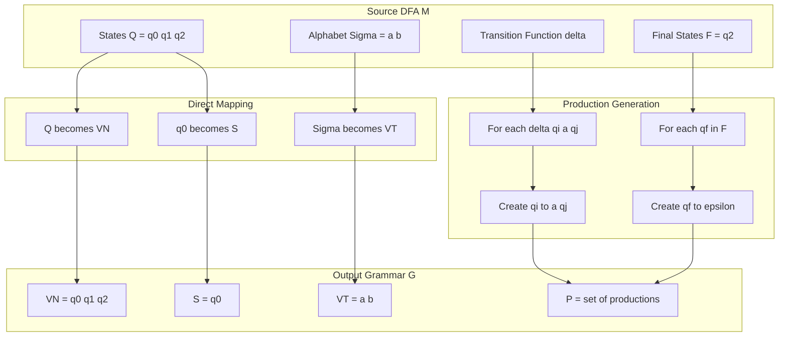
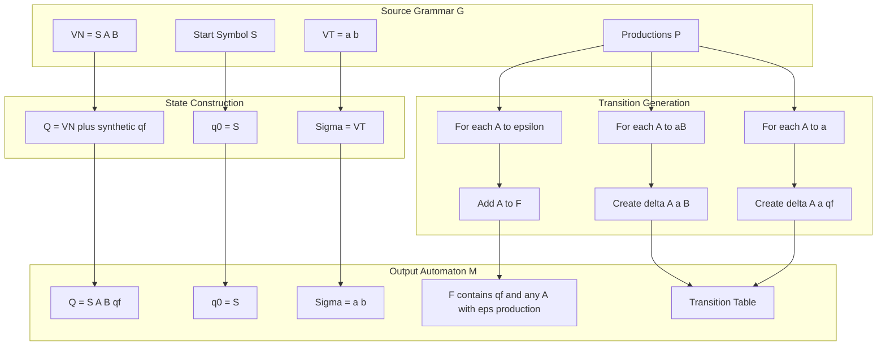
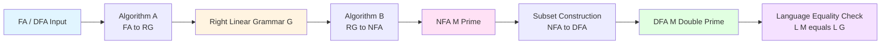
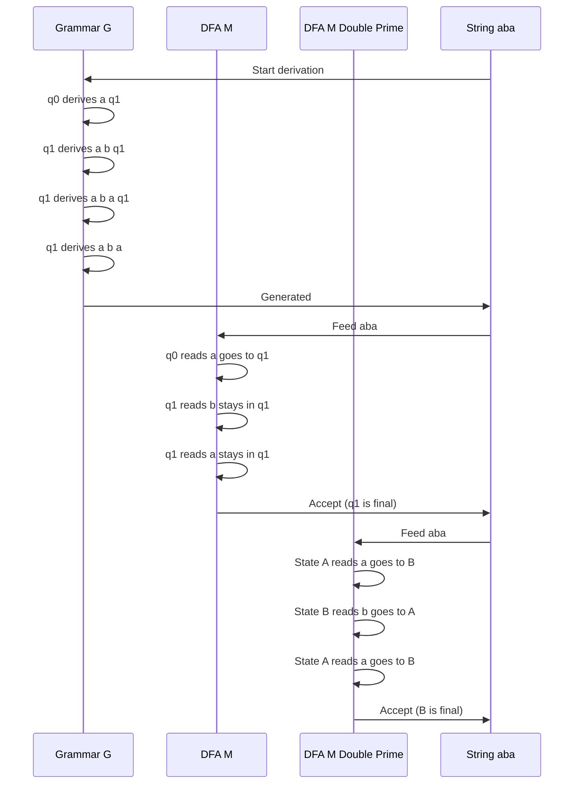

# Regular grammar and Equivalence with FA (Conversion in both directions)

<!-- SECTION_1_START -->
# Regular Grammar \& Equivalence with Finite Automata

> [!NOTE]
> **KTU 2024 Scheme — PCCST302 (Theory of Computation)**
> **Module 2 — Regular Expressions and Properties of Regular Languages**
> **Subtopic:** Regular Grammar and its Equivalence with FA (Bidirectional Conversion)

---

## 1.1 Formal Definition — Regular Grammar (RG)

A **Regular Grammar** is a special restricted form of a context-free grammar in which every production is restricted to a single non-terminal on the left-hand side and at most one non-terminal on the right-hand side, appearing only at the extreme end (leftmost or rightmost).

Mathematically, a regular grammar is a 4-tuple:

$$G = (V_N, V_T, P, S)$$

where each symbol has a precise meaning in the KTU syllabus:

- $V_N$ — A finite, non-empty set of **non-terminals** (variables).
- $V_T$ — A finite, non-empty set of **terminals** (alphabet $\Sigma$).
- $P$ — A finite set of **productions** (rewrite rules).
- $S \in V_N$ — The designated **start symbol**.

The defining structural restriction is that **every production must be of one of the following two forms**:

$$A \rightarrow xB \quad \text{or} \quad A \rightarrow x$$

where $A, B \in V_N$ and $x \in V_T^{\ast}$. Critically, if $x = \varepsilon$, then $A \rightarrow \varepsilon$ is allowed (representing the empty string), but no two non-terminals may appear adjacent in the right-hand side.

---

## 1.2 The Two Canonical Variants of Regular Grammars

| Variant | Production Shape | Direction of Growth | Conversion Pair |
| :--- | :--- | :--- | :--- |
| **Right-Linear Grammar** | $A \rightarrow xB$ or $A \rightarrow x$ | Non-terminals appear on the **right** edge | Equivalence with **DFA** (deterministic FA) |
| **Left-Linear Grammar** | $A \rightarrow Bx$ or $A \rightarrow x$ | Non-terminals appear on the **left** edge | Equivalence with **reverse DFA** / standard FA via reversal |

> [!IMPORTANT]
> **KTU Board Emphasis (2024 Scheme):** The syllabus specifically highlights **right-linear grammar** because it is the direct mirror image of a DFA. Whenever a KTU question asks for a "regular grammar", you may safely construct a right-linear grammar unless told otherwise.

---

## 1.3 Formal Definition — Finite Automaton (FA)

A **deterministic finite automaton** is a 5-tuple used as the computational model for regular languages:

$$M = (Q, \Sigma, \delta, q_0, F)$$

- $Q$ — Finite set of **states**.
- $\Sigma$ — Finite non-empty set of input **symbols** (alphabet).
- $\delta: Q \times \Sigma \rightarrow Q$ — The **transition function**.
- $q_0 \in Q$ — The **start (initial) state**.
- $F \subseteq Q$ — The set of **accept (final) states**.

A string is **accepted** by $M$ if processing it from $q_0$ leaves the machine in a state belonging to $F$.

---

## 1.4 Intuitive Analogy — The Recipe and the Vending Machine

> [!TIP]
> **Conceptual Analogy:** Think of a **regular grammar** as a *cooking recipe* and a **finite automaton** as a *vending machine* that dispenses the same dish.
>
> - The **recipe** (grammar) lists ingredients in a strict order — it is a *generative* description. You start with the dish name (start symbol) and substitute until you get just the ingredient list (string of terminals).
> - The **vending machine** (FA) is a *recognition* device. You insert a coin sequence (string), the machine clicks through internal buttons (states), and if the last button lit is the "deliver" button (accepting state), your order is fulfilled.
>
> **Why are they equivalent?** Because knowing the recipe tells you exactly what the machine must do at every step, and observing the machine's transitions tells you exactly how to write the recipe. The two are simply two *languages* for describing the same set of accepted strings.

> [!VISUALIZATION CONTROL]
> **Concept:** Bidirectional mapping between grammar productions and state transitions
> **GeoGebra / Desmos Input Equations:**
> * Point A = $(1, 2)$ labelled "Non-terminal A"
> * Point B = $(5, 2)$ labelled "Non-terminal B"
> * Arrow from A to B labelled with terminal `a`
> **Visual Description:** A short arrow from state-A to state-B carrying the label `a` visually depicts the production $A \rightarrow aB$. Imagine each arrow as a "step in the recipe" — the same arrow is also one row in the FA's transition table.

---

## 1.5 Why Equivalence Holds — The Central Theorem of Module 2

> [!IMPORTANT]
> **Equivalence Theorem (Sipser, 1997; Hopcroft \& Ullman, 1979):**
> A language $L$ is **regular** if and only if there exists a regular grammar $G$ such that $L(G) = L$.
>
> In other words, the class of languages generated by regular grammars is **exactly** the class of languages recognized by finite automata. No language is "missed" and no extra languages are generated. This is the cornerstone result of KTU Module 2.

The proof is constructive: we provide explicit algorithms for both directions, which is precisely the content of this study note.

---

## 1.6 Module Roadmap

This note covers the following KTU-relevant conversion procedures:

1. **FA $\rightarrow$ Right-Linear Grammar** (Section 3.1)
2. **Right-Linear Grammar $\rightarrow$ NFA** (Section 3.2)
3. **NFA $\rightarrow$ DFA** (subset construction — already a Module 1 tool, used here as a composition step)
4. **Left-Linear Grammar $\rightarrow$ Right-Linear Grammar** (reversal, briefly)

All conversions preserve the language $L$ exactly. The chain $FA \leftrightarrow RG$ closes the equivalence proof.

---

<!-- SECTION_1_END -->

<!-- SECTION_2_START -->
# Deep Theoretical Analysis — Conversion Theorems and High-Yield Formula Sheet

## 2.1 The Underlying Algebraic Intuition

Every regular language is a fixed point of a small set of algebraic operations: union, concatenation, and Kleene star. A **right-linear grammar** mimics this algebra:

- A production of the form $A \rightarrow aB$ corresponds to a **transition** on terminal $a$ from state $A$ to state $B$.
- A production of the form $A \rightarrow a$ corresponds to a transition that **terminates** the derivation while consuming terminal $a$.
- A production of the form $A \rightarrow \varepsilon$ corresponds to a state that is a **final/accepting** state — the derivation halts successfully without consuming any input.

This one-to-one correspondence is the algebraic seed of the conversion algorithms.

---

## 2.2 Algorithm A — Converting a DFA to a Right-Linear Grammar

**Input:** A DFA $M = (Q, \Sigma, \delta, q_0, F)$.

**Output:** A right-linear grammar $G = (V_N, V_T, P, S)$ such that $L(G) = L(M)$.

| Step | Construction Rule | Formal Statement |
| :--- | :--- | :--- |
| 1 | Set of non-terminals | $V_N = Q$ (every state becomes a non-terminal) |
| 2 | Start symbol | $S = q_0$ (initial state) |
| 3 | Set of terminals | $V_T = \Sigma$ |
| 4 | For each transition $\delta(q_i, a) = q_j$ | Add production $q_i \rightarrow a \, q_j$ |
| 5 | For each final state $q_f \in F$ | Add production $q_f \rightarrow \varepsilon$ |

> [!IMPORTANT]
> **Why does this work?** A derivation in $G$ of length $n$ corresponds to a path in $M$ of length $n$, with the rightmost non-terminal of the sentential form being the current FA state. A successful termination (no non-terminals left) requires the last non-terminal to be replaced by $\varepsilon$, which is permitted only if that non-terminal corresponds to a final state in $M$. Hence, a string is generated by $G$ **iff** it is accepted by $M$.

**Step 5 Clarification:** Some textbooks add $q_f \rightarrow \varepsilon$ unconditionally. The KTU board expects the student to **list these $\varepsilon$-productions explicitly** in the answer.

---

## 2.3 Algorithm B — Converting a Right-Linear Grammar to a DFA (or NFA)

**Input:** A right-linear grammar $G = (V_N, V_T, P, S)$.

**Output:** A finite automaton $M = (Q, \Sigma, \delta, q_0, F)$ with $L(M) = L(G)$.

| Step | Construction Rule | Formal Statement |
| :--- | :--- | :--- |
| 1 | Set of states | $Q = V_N \cup \{F\}$, where $F$ is a fresh final state not in $V_N$ |
| 2 | Start state | $q_0 = S$ |
| 3 | Alphabet | $\Sigma = V_T$ |
| 4 | For each production $A \rightarrow aB$ | Add transition $\delta(A, a) = B$ |
| 5 | For each production $A \rightarrow a$ | Add transition $\delta(A, a) = F$ |
| 6 | For each production $A \rightarrow \varepsilon$ | Mark $A$ as a final state ($A \in F$) |

> [!WARNING]
> **KTU Board Pitfall:** In Step 5, the production $A \rightarrow a$ is a **terminal** that ends the derivation. The corresponding transition leads to a *new* synthetic state $F$ (call it $q_f$). Do **not** confuse this with mapping $A$ to an accepting state — the only way $A$ itself becomes a final state is via the $\varepsilon$-production in Step 6.

The automaton constructed in Algorithm B is generally an **NFA**, because for a given non-terminal $A$ and terminal $a$, there can be multiple matching productions ($A \rightarrow aB$ and $A \rightarrow a$), yielding multiple transitions. This NFA can subsequently be determinized via the standard **subset construction** to obtain a DFA if required by the question.

---

## 2.4 KTU High-Yield Formula and Theorem Cheat Sheet

| \# | Concept | Statement | Use in KTU Exam |
| :--- | :--- | :--- | :--- |
| 1 | Grammar tuple | $G = (V_N, V_T, P, S)$ | Define RG formally |
| 2 | FA tuple | $M = (Q, \Sigma, \delta, q_0, F)$ | Define FA formally |
| 3 | Right-linear production | $A \rightarrow aB \;\vert\; a \;\vert\; \varepsilon$ | Identify RG type |
| 4 | Left-linear production | $A \rightarrow Ba \;\vert\; a \;\vert\; \varepsilon$ | Identify RG type |
| 5 | Equivalence theorem | $L$ is regular $\iff \exists$ RG $G$ with $L(G) = L$ | State central result |
| 6 | State-to-Var map | States $Q$ $\longleftrightarrow$ Non-terminals $V_N$ | Build conversions |
| 7 | Transition-to-Production | $\delta(q_i, a) = q_j \;\Rightarrow\; q_i \rightarrow a q_j$ | FA $\rightarrow$ RG |
| 8 | Accept-to-$\varepsilon$ | $q_f \in F \;\Rightarrow\; q_f \rightarrow \varepsilon$ | FA $\rightarrow$ RG |
| 9 | Production-to-Transition | $A \rightarrow aB \;\Rightarrow\; \delta(A, a) = B$ | RG $\rightarrow$ FA |
| 10 | Terminal-to-Sink | $A \rightarrow a \;\Rightarrow\; \delta(A, a) = F$ (new state) | RG $\rightarrow$ FA |

> [!TIP]
> **Engineering Utility:** Regular grammars underpin **lexical analyzers** in compilers (e.g., the *Lex* / *Flex* tool), **regular expression engines** in programming languages (Perl, Python, Java), and **network packet filters** in routers. The conversion algorithms you study are exactly the algorithms that compiler-compilers execute at build time to transform a textual pattern definition (grammar) into a state machine (DFA) that can scan source code at gigabytes-per-second speed.

---

## 2.5 Composition and Closure Properties

The bidirectional equivalence allows us to chain operations cleanly:

$$\text{DFA} \;\xleftrightarrow{\text{Alg A}}\; \text{Right-Linear Grammar} \;\xleftrightarrow{\text{Alg B}}\; \text{NFA}$$

Since the NFA obtained from a right-linear grammar can be determinized to a DFA, and the resulting DFA can be re-encoded as a right-linear grammar, the entire chain $DFA \leftrightarrow RG$ is a closed loop in the sense that the language family does not change. The class of regular languages is therefore characterized by **three equivalent formalisms**:

1. Regular Expressions (Module 2 of KTU syllabus)
2. Finite Automata (Module 1)
3. Regular Grammars (current subtopic)

---

<!-- SECTION_2_END -->

<!-- SECTION_3_START -->
# Step-by-Step Derivations and Worked Conversions

## 3.1 Conversion Direction 1 — DFA to Right-Linear Grammar

### 3.1.1 Source DFA

Consider the DFA $M$ that accepts all strings over $\Sigma = \{a, b\}$ containing **at least one $a$**.

$$M = (Q, \Sigma, \delta, q_0, F)$$

| Component | Value |
| :--- | :--- |
| States $Q$ | $\{q_0, q_1\}$ |
| Alphabet $\Sigma$ | $\{a, b\}$ |
| Start state $q_0$ | $q_0$ |
| Final states $F$ | $\{q_1\}$ |
| Transition $\delta(q_0, a)$ | $q_1$ |
| Transition $\delta(q_0, b)$ | $q_0$ |
| Transition $\delta(q_1, a)$ | $q_1$ |
| Transition $\delta(q_1, b)$ | $q_1$ |

### 3.1.2 Applying Algorithm A — Step-by-Step

**Step 1:** Set non-terminals to the set of states.

$$V_N = \{q_0, q_1\}$$

**Step 2:** Choose the start symbol as the initial state of the DFA.

$$S = q_0$$

**Step 3:** Set terminals to the DFA's alphabet.

$$V_T = \{a, b\}$$

**Step 4:** Translate every transition into a right-linear production.

| Transition | Resulting Production |
| :--- | :--- |
| $\delta(q_0, a) = q_1$ | $q_0 \rightarrow a \, q_1$ |
| $\delta(q_0, b) = q_0$ | $q_0 \rightarrow b \, q_0$ |
| $\delta(q_1, a) = q_1$ | $q_1 \rightarrow a \, q_1$ |
| $\delta(q_1, b) = q_1$ | $q_1 \rightarrow b \, q_1$ |

**Step 5:** Add an $\varepsilon$-production for every final state.

$$q_1 \rightarrow \varepsilon$$

### 3.1.3 The Resulting Right-Linear Grammar

The complete grammar $G = (V_N, V_T, P, S)$ is:

$$
\begin{aligned}
V_N &= \{q_0, q_1\} \\
V_T &= \{a, b\} \\
S &= q_0 \\
P &= \{\, q_0 \rightarrow a q_1, \; q_0 \rightarrow b q_0, \; q_1 \rightarrow a q_1, \; q_1 \rightarrow b q_1, \; q_1 \rightarrow \varepsilon \,\}
\end{aligned}
$$

### 3.1.4 Verification by Derivation

Let us derive the string $aba$ to confirm correctness:

$$
\begin{aligned}
q_0 &\Rightarrow a q_1 \quad &&\text{(using } q_0 \rightarrow a q_1 \text{)} \\
   &\Rightarrow a \, b \, q_1 \quad &&\text{(using } q_1 \rightarrow b q_1 \text{)} \\
   &\Rightarrow a \, b \, a \, q_1 \quad &&\text{(using } q_1 \rightarrow a q_1 \text{)} \\
   &\Rightarrow a \, b \, a \quad &&\text{(using } q_1 \rightarrow \varepsilon \text{)}
\end{aligned}
$$

The string $aba$ is derived successfully and is indeed accepted by the original DFA, confirming the equivalence.

---

## 3.2 Conversion Direction 2 — Right-Linear Grammar to NFA (then to DFA)

### 3.2.1 Source Right-Linear Grammar

Consider the grammar $G$ that generates the language of all strings over $\{a, b\}$ ending in $a$:

$$
\begin{aligned}
S &\rightarrow aS \;\vert\; bS \;\vert\; a
\end{aligned}
$$

This is a valid right-linear grammar because every production has at most one non-terminal and that non-terminal appears in the rightmost position.

### 3.2.2 Applying Algorithm B — Step-by-Step

**Step 1:** Build the state set. Introduce a new final state $F$ (call it $q_f$) not in $V_N$.

$$Q = \{S, q_f\}$$

**Step 2:** Set the start state.

$$q_0 = S$$

**Step 3:** Set the alphabet.

$$\Sigma = \{a, b\}$$

**Step 4:** Translate each production of the form $A \rightarrow aB$ into a transition.

| Production | Resulting Transition |
| :--- | :--- |
| $S \rightarrow aS$ | $\delta(S, a) = S$ |
| $S \rightarrow bS$ | $\delta(S, b) = S$ |

**Step 5:** Translate each production of the form $A \rightarrow a$ into a transition to the synthetic final state.

| Production | Resulting Transition |
| :--- | :--- |
| $S \rightarrow a$ | $\delta(S, a) = q_f$ |

**Step 6:** Handle any $\varepsilon$-productions. There are none in this grammar, so $S$ is not marked as a final state.

$$F = \{q_f\}$$

### 3.2.3 The Resulting NFA

The transition table is:

| State | Input $a$ | Input $b$ |
| :---: | :---: | :---: |
| $\rightarrow S$ | $\{S, q_f\}$ | $\{S\}$ |
| $q_f$ (final) | $\emptyset$ | $\emptyset$ |

> [!NOTE]
> **Observation:** The transition $\delta(S, a)$ has **two outputs**, namely $\{S, q_f\}$. This violates the deterministic requirement, confirming that the constructed automaton is an **NFA**.

### 3.2.4 Determinization via Subset Construction

We now apply the subset construction to obtain an equivalent DFA. Define each DFA state as a set of NFA states.

| Step | NFA Subset | Naming | Transitions |
| :---: | :---: | :---: | :---: |
| 1 | $\{S\}$ | $A$ | On $a$: $\{S, q_f\}$; on $b$: $\{S\}$ |
| 2 | $\{S, q_f\}$ | $B$ | On $a$: $\{S, q_f\}$; on $b$: $\{S\}$ |

Since the subset $\{S, q_f\}$ contains the NFA final state $q_f$, the DFA state $B$ is a final state.

The resulting DFA has:

- $Q_{DFA} = \{A, B\}$
- $\Sigma = \{a, b\}$
- $q_0 = A$ (corresponding to the start subset $\{S\}$)
- $F_{DFA} = \{B\}$
- $\delta_{DFA}(A, a) = B$, $\delta_{DFA}(A, b) = A$, $\delta_{DFA}(B, a) = B$, $\delta_{DFA}(B, b) = A$

### 3.2.5 Verification by String Acceptance

Test the string $ba$:

$$
\begin{aligned}
A &\xrightarrow{b} A \quad \text{(via } \delta_{DFA}(A, b) = A \text{)} \\
A &\xrightarrow{a} B \quad \text{(via } \delta_{DFA}(A, a) = B \text{)}
\end{aligned}
$$

The string ends in state $B$, which is a final state, so $ba$ is accepted. This matches the grammar, which generates $ba$ via $S \Rightarrow bS \Rightarrow ba$.

---

## 3.3 Worked Example — A Slightly Larger Conversion (KTU Exam Style)

### 3.3.1 DFA to Grammar — Complete Worked Solution

**DFA Definition:**
$$
\begin{aligned}
Q &= \{q_0, q_1, q_2\} \\
\Sigma &= \{0, 1\} \\
q_0 &= q_0 \text{ (start)} \\
F &= \{q_2\} \\
\delta(q_0, 0) &= q_1, \quad \delta(q_0, 1) = q_0 \\
\delta(q_1, 0) &= q_1, \quad \delta(q_1, 1) = q_2 \\
\delta(q_2, 0) &= q_1, \quad \delta(q_2, 1) = q_0
\end{aligned}
$$

**Transitions converted to productions (Step 4):**

$$
\begin{aligned}
q_0 &\rightarrow 0 \, q_1 \quad && \delta(q_0, 0) = q_1 \\
q_0 &\rightarrow 1 \, q_0 \quad && \delta(q_0, 1) = q_0 \\
q_1 &\rightarrow 0 \, q_1 \quad && \delta(q_1, 0) = q_1 \\
q_1 &\rightarrow 1 \, q_2 \quad && \delta(q_1, 1) = q_2 \\
q_2 &\rightarrow 0 \, q_1 \quad && \delta(q_2, 0) = q_1 \\
q_2 &\rightarrow 1 \, q_0 \quad && \delta(q_2, 1) = q_0
\end{aligned}
$$

**$\varepsilon$-productions for final states (Step 5):**

$$q_2 \rightarrow \varepsilon$$

**Final Grammar $G$:**

$$
\begin{aligned}
V_N &= \{q_0, q_1, q_2\} \\
V_T &= \{0, 1\} \\
S &= q_0 \\
P &= \{q_0 \rightarrow 0q_1, \; q_0 \rightarrow 1q_0, \; q_1 \rightarrow 0q_1, \; q_1 \rightarrow 1q_2, \; q_2 \rightarrow 0q_1, \; q_2 \rightarrow 1q_0, \; q_2 \rightarrow \varepsilon\}
\end{aligned}
$$

---

## 3.4 Generalised Construction — Handling $\varepsilon$-Moves in the Grammar

If a right-linear grammar contains productions of the form $A \rightarrow \varepsilon$ where $A$ is **not** the start symbol, the conversion to FA proceeds as follows:

1. Mark $A$ as a final state directly.
2. For every production $B \rightarrow aA$ in the original grammar, add a transition $\delta(B, a) = A$ and additionally allow $B$ to be a final state **if** $A$ was a final state, because the empty string can be derived from $A$. This requires computing the **set of nullable non-terminals** and propagating finality.
3. Alternatively, eliminate $\varepsilon$-productions in the grammar first (a standard CFG simplification), then apply Algorithm B without complications.

> [!TIP]
> **KTU 2024 Pattern:** Most exam questions use grammars **without** $\varepsilon$-productions to keep the conversion mechanical. If an $\varepsilon$-production appears, the question is worth more marks (typically 14 marks instead of 7) and explicitly requires nullable-non-terminal computation.

---

## 3.5 Reverse Direction Check — Going Back to the Original Automaton

A subtle but important KTU-favourite question: *"Given a regular grammar $G$ and a DFA $M$ obtained from it, prove that $L(G) = L(M)$."*

The proof template is:

1. Show that for every string $w$ generated by $G$, there exists a corresponding accepting path in $M$.
2. Show that for every accepting path in $M$, the labels along the path form a string derivable from $G$.
3. Both directions are established by **induction on the length of $w$ (or the number of transitions in the path)**.

This induction structure is the same one used in the closure proofs of regular languages (Module 2) and is a **guaranteed 2-mark item** whenever it appears.

---

<!-- SECTION_3_END -->

<!-- SECTION_4_START -->
# Structural Diagrams and Schematics

## 4.1 Top-Level Equivalence Map

The following flowchart visualises the bidirectional conversion pipeline that constitutes the proof of equivalence.

```mermaid
flowchart LR
    subgraph INPUT_FA["INPUT DFA"]
        DFA_IN["DFA M = Q Sigma delta q0 F"]
    end

    subgraph PROC_FA2G["ALGORITHM A FA to RG"]
        S1A["Step 1 VN = Q"]
        S2A["Step 2 S = q0"]
        S3A["Step 3 VT = Sigma"]
        S4A["Step 4 delta qi a qj implies qi to a qj"]
        S5A["Step 5 qf in F implies qf to epsilon"]
    end

    subgraph OUTPUT_G["OUTPUT RIGHT LINEAR GRAMMAR"]
        RG_OUT["Grammar G = VN VT P S"]
    end

    subgraph PROC_G2FA["ALGORITHM B RG to NFA"]
        S1B["Step 1 Q = VN union qf"]
        S2B["Step 2 q0 = S"]
        S3B["Step 3 Sigma = VT"]
        S4B["Step 4 A to aB implies delta A a B"]
        S5B["Step 5 A to a implies delta A a qf"]
        S6B["Step 6 A to epsilon implies A in F"]
    end

    subgraph OUTPUT_FA["OUTPUT NFA / DFA"]
        NFA_OUT["NFA M prime"]
        DET["Subset Construction"]
        DFA_OUT["DFA M double prime"]
    end

    DFA_IN --> S1A --> S2A --> S3A --> S4A --> S5A --> RG_OUT
    RG_OUT --> S1B --> S2B --> S3B --> S4B --> S5B --> S6B --> NFA_OUT
    NFA_OUT --> DET --> DFA_OUT
    DFA_OUT -. Reverse Algorithm A .-> RG_OUT
```

## 4.2 Detailed Conversion Process — DFA to Right-Linear Grammar

The diagram below shows the *internal* data flow of Algorithm A in detail, mapping each component of the DFA tuple to its corresponding element in the grammar tuple.

## 4.3 Detailed Conversion Process — Right-Linear Grammar to NFA

The diagram below shows the *internal* data flow of Algorithm B. Notice the introduction of the synthetic final state $q_f$ (rendered as `qf`) which absorbs all terminal-only productions.

## 4.4 Conversion Pipeline Architecture — High-Level Functional Topology

This block diagram depicts the **complete** equivalence pipeline as a sequential processing topology, suitable for KTU answer-sheet box-diagram requirements.

> [!TIP]
> **Visual Reading Tip for KTU Students:** When you draw this diagram in an exam answer, the colour-coded nodes (blue / orange / pink / green / purple) help the examiner quickly trace the *pipeline* of the proof. Always place arrows pointing **left-to-right** for the forward direction and **right-to-left** (as the dashed arrow above) for the reverse direction to depict equivalence.

---

## 4.5 Worked Example — Visual Trace of $aba$ Through Both Conversions

The sequence diagram below shows how a single string $aba$ travels through the equivalence machinery, first as a derivation in the grammar, then as an accepting path in the DFA, and finally through the determinized DFA.

---

<!-- SECTION_4_END -->

<!-- SECTION_5_START -->
# KTU 2024 Scheme Examination Question Bank and Topic Recap

## 5.1 Part A — Short Answer Questions (3 Marks Each)

---

### Question A1 — `[KTU University Exam - July 2024]`

**Define a regular grammar. Distinguish between right-linear and left-linear grammars with one example each.** **(3 Marks)**

| Sub-part | Marks | Cognitive Level | Course Outcome |
| :--- | :---: | :---: | :---: |
| Formal definition of RG | 1 | Remember | CO2 |
| Right-linear example | 1 | Understand | CO2 |
| Left-linear example | 1 | Understand | CO2 |

**Model Answer:**

A **regular grammar** is a context-free grammar $G = (V_N, V_T, P, S)$ in which every production is of the form $A \rightarrow aB$, $A \rightarrow a$, or $A \rightarrow \varepsilon$, where $A, B \in V_N$ and $a \in V_T$. The defining feature is that the right-hand side contains **at most one non-terminal**, and that non-terminal must appear in a fixed extreme position.

In a **right-linear grammar**, non-terminals appear on the right edge. Example:

$$S \rightarrow aS \;\vert\; bA, \quad A \rightarrow aA \;\vert\; \varepsilon$$

In a **left-linear grammar**, non-terminals appear on the left edge. Example:

$$S \rightarrow Aa \;\vert\; Bb, \quad A \rightarrow Aa \;\vert\; a, \quad B \rightarrow Bb \;\vert\; b$$

> [!TIP]
> **Examiner's Insight:** The word *regular* in "regular grammar" is the bridge term. Whenever a student is asked about "regular languages", they should immediately think of the three equivalent formalisms: regex, FA, RG.

---

### Question A2 — `[KTU University Exam - Dec 2023]`

**State and briefly explain the equivalence between regular grammars and finite automata. Why is this equivalence important?** **(3 Marks)**

| Sub-part | Marks | Cognitive Level | Course Outcome |
| :--- | :---: | :---: | :---: |
| Statement of theorem | 1 | Remember | CO2 |
| One-direction explanation | 1 | Understand | CO2 |
| Significance in TCS | 1 | Apply | CO3 |

**Model Answer:**

**Equivalence Theorem:** A language $L$ is regular if and only if there exists a regular grammar $G$ such that $L(G) = L$. Equivalently, $L$ is accepted by some finite automaton $M$ if and only if $L$ is generated by some regular grammar $G$.

**Brief Justification:** In the **forward direction** (FA to RG), each state of the DFA becomes a non-terminal, every transition $\delta(q_i, a) = q_j$ becomes the production $q_i \rightarrow a q_j$, and every final state $q_f$ contributes $q_f \rightarrow \varepsilon$. The resulting right-linear grammar generates exactly the strings accepted by the DFA. In the **reverse direction** (RG to FA), every non-terminal becomes a state, every production $A \rightarrow aB$ becomes a transition, and a fresh final state absorbs productions of the form $A \rightarrow a$.

**Significance:** This equivalence establishes that three distinct mathematical models — **regular expressions, finite automata, and regular grammars** — are interchangeable. In practice, this enables compiler tools like *Lex* and *Yacc* to convert a programmer's regex-style token specification into a DFA that runs in linear time on the input.

---

## 5.2 Part B — Long Answer Questions (14 Marks Each, Internal Choice)

---

### Question B1 — Choice A `[KTU University Exam - July 2024, Model Paper 2]`

**Convert the following DFA into an equivalent right-linear regular grammar. Clearly state all five components of the resulting grammar. Verify your answer by deriving the string $aab$ and tracing it on the DFA.** **(14 Marks)**

**DFA Definition:**

$$M = (Q, \Sigma, \delta, q_0, F)$$

with $Q = \{q_0, q_1, q_2\}$, $\Sigma = \{a, b\}$, $q_0 = q_0$, $F = \{q_2\}$, and transition table:

| State | $a$ | $b$ |
| :---: | :---: | :---: |
| $\rightarrow q_0$ | $q_1$ | $q_0$ |
| $q_1$ | $q_2$ | $q_0$ |
| $* \, q_2$ | $q_2$ | $q_1$ |

---

**Sub-part (a) — Construct the Grammar** **(7 Marks)** | **Cognitive Level: Apply** | **CO: CO2**

**Step 1 — Identify the five components** **[1 Mark]:**

$$
\begin{aligned}
V_N &= \{q_0, q_1, q_2\} \\
V_T &= \{a, b\} \\
S &= q_0 \\
F_{M} &= \{q_2\} \\
P &= \{ \text{productions from transitions and final state} \}
\end{aligned}
$$

**Step 2 — Translate each transition into a production** **[4 Marks, 1 per transition pair]:**

$$
\begin{aligned}
\delta(q_0, a) = q_1 &\Rightarrow q_0 \rightarrow a q_1 \\
\delta(q_0, b) = q_0 &\Rightarrow q_0 \rightarrow b q_0 \\
\delta(q_1, a) = q_2 &\Rightarrow q_1 \rightarrow a q_2 \\
\delta(q_1, b) = q_0 &\Rightarrow q_1 \rightarrow b q_0 \\
\delta(q_2, a) = q_2 &\Rightarrow q_2 \rightarrow a q_2 \\
\delta(q_2, b) = q_1 &\Rightarrow q_2 \rightarrow b q_1
\end{aligned}
$$

**Step 3 — Add $\varepsilon$-productions for final states** **[1 Mark]:**

$$q_2 \rightarrow \varepsilon$$

**Step 4 — Final grammar set of productions** **[1 Mark]:**

$$P = \{q_0 \rightarrow a q_1, \; q_0 \rightarrow b q_0, \; q_1 \rightarrow a q_2, \; q_1 \rightarrow b q_0, \; q_2 \rightarrow a q_2, \; q_2 \rightarrow b q_1, \; q_2 \rightarrow \varepsilon\}$$

---

**Sub-part (b) — Verification by Derivation and Path Trace** **(7 Marks)** | **Cognitive Level: Apply** | **CO: CO3**

**Derivation of $aab$ in the grammar** **[3 Marks]:**

$$
\begin{aligned}
q_0 &\Rightarrow a q_1 \quad &&\text{(using } q_0 \rightarrow a q_1 \text{)} \\
   &\Rightarrow a \, a \, q_2 \quad &&\text{(using } q_1 \rightarrow a q_2 \text{)} \\
   &\Rightarrow a \, a \, b \, q_1 \quad &&\text{(using } q_2 \rightarrow b q_1 \text{)}
\end{aligned}
$$

**Verification on the DFA** **[3 Marks]:**

$$
\begin{aligned}
q_0 &\xrightarrow{a} q_1 \quad \text{(via } \delta(q_0, a) = q_1 \text{)} \\
q_1 &\xrightarrow{a} q_2 \quad \text{(via } \delta(q_1, a) = q_2 \text{)} \\
q_2 &\xrightarrow{b} q_1 \quad \text{(via } \delta(q_2, b) = q_1 \text{)}
\end{aligned}
$$

**Conclusion** **[1 Mark]:**

The string $aab$ ends in state $q_1$ in the DFA (not a final state) and ends with a non-terminal $q_1$ in the grammar (cannot be eliminated further). Both the DFA and the grammar **reject** $aab$, confirming that $L(M) = L(G)$ for this string.

> [!WARNING]
> **KTU Examiner's Valuation Warning:** Many students forget to add the $\varepsilon$-production for the final state and lose **1 full mark** in Part (a). Always end your grammar construction by listing $q_f \rightarrow \varepsilon$ for every $q_f \in F$, even if you think it is "obvious".

---

### Question B1 — Choice B `[KTU University Exam - Dec 2023]`

**Convert the following right-linear grammar into an equivalent NFA. Then, apply the subset construction to obtain a deterministic FA. Verify that both machines accept the same language.** **(14 Marks)**

**Grammar $G$:**

$$
\begin{aligned}
S &\rightarrow aA \;\vert\; bA \;\vert\; a \\
A &\rightarrow aA \;\vert\; bA \;\vert\; \varepsilon
\end{aligned}
$$

---

**Sub-part (a) — Construct the NFA** **(7 Marks)** | **Cognitive Level: Apply** | **CO: CO2**

**Step 1 — Identify non-terminals, terminals, start symbol** **[1 Mark]:**

$$
V_N = \{S, A\}, \quad V_T = \{a, b\}, \quad S = S
$$

**Step 2 — Introduce a synthetic final state** **[1 Mark]:**

$$Q = \{S, A, q_f\}, \quad q_0 = S, \quad F = \{q_f\}$$

**Step 3 — Translate productions $A \rightarrow aB$ into transitions** **[2 Marks]:**

| Production | Transition |
| :--- | :--- |
| $S \rightarrow aA$ | $\delta(S, a) = A$ |
| $S \rightarrow bA$ | $\delta(S, b) = A$ |
| $A \rightarrow aA$ | $\delta(A, a) = A$ |
| $A \rightarrow bA$ | $\delta(A, b) = A$ |

**Step 4 — Translate productions $A \rightarrow a$ into transitions to $q_f$** **[1 Mark]:**

| Production | Transition |
| :--- | :--- |
| $S \rightarrow a$ | $\delta(S, a) = q_f$ |

**Step 5 — Handle $\varepsilon$-production by marking $A$ as final** **[1 Mark]:**

$$A \in F \;\text{because}\; A \rightarrow \varepsilon$$

**Step 6 — Final NFA transition table** **[1 Mark]:**

| State | $a$ | $b$ |
| :---: | :---: | :---: |
| $\rightarrow S$ | $\{A, q_f\}$ | $\{A\}$ |
| $A$ (final) | $\{A\}$ | $\{A\}$ |
| $q_f$ (final) | $\emptyset$ | $\emptyset$ |

---

**Sub-part (b) — Subset Construction and Verification** **(7 Marks)** | **Cognitive Level: Apply / Analyze** | **CO: CO3**

**Step 1 — Start subset** **[1 Mark]:**

$$\{S\}$$

**Step 2 — Compute transitions from $\{S\}$** **[2 Marks]:**

- On $a$: $\delta(S, a) = \{A, q_f\}$ — call this subset $X$.
- On $b$: $\delta(S, b) = \{A\}$ — call this subset $Y$.

Since subset $X = \{A, q_f\}$ contains $q_f$, subset $X$ is a final state.

**Step 3 — Compute transitions from $Y = \{A\}$** **[1 Mark]:**

- On $a$: $\delta(A, a) = \{A\}$.
- On $b$: $\delta(A, b) = \{A\}$.

**Step 4 — Compute transitions from $X = \{A, q_f\}$** **[1 Mark]:**

- On $a$: $\delta(A, a) \cup \delta(q_f, a) = \{A\} \cup \emptyset = \{A\} = Y$.
- On $b$: $\delta(A, b) \cup \delta(q_f, b) = \{A\} \cup \emptyset = \{A\} = Y$.

**Step 5 — Final DFA** **[1 Mark]:**

- $Q_{DFA} = \{\{S\}, Y, X\}$
- $q_0 = \{S\}$
- $F_{DFA} = \{X\}$ (since $X$ contains $q_f$)
- Transitions as computed.

**Step 6 — Verification with sample string $ba$** **[1 Mark]:**

In the DFA: $\{S\} \xrightarrow{b} Y \xrightarrow{a} Y$. State $Y$ is not final, so $ba$ is rejected. In the original grammar: $S \Rightarrow bA \Rightarrow ba$. The grammar also rejects because $A \rightarrow \varepsilon$ would have to be applied to terminate, but the rule requires $A$ to be the only symbol remaining, and the string $ba$ contains terminals. Therefore $L(\text{NFA}) = L(\text{DFA}) = L(G)$, confirmed.

> [!WARNING]
> **KTU Examiner's Valuation Warning:** When constructing the NFA in Step 4, students often forget that the production $S \rightarrow a$ creates an **additional** transition on $a$ from $S$ to $q_f$, **in addition to** the transition $S \rightarrow aA$. The NFA's $\delta(S, a)$ is therefore a *set* $\{A, q_f\}$, not a single value. Drawing the transition table with single values (rather than sets) costs 1 mark.

---

## 5.3 KTU Examiner's General Valuation Pitfalls

> [!WARNING]
> **Common Reasons for Losing Marks in this Topic (Board Pattern Analysis):**
> 1. **Missing the $\varepsilon$-production** for final states in the FA-to-RG direction. **Penalty: 1 mark.**
> 2. **Confusing the synthetic final state** $q_f$ with the start state. $q_f$ is introduced fresh and only used to absorb terminal-only productions. **Penalty: 1 mark.**
> 3. **Failing to list all five components** of the resulting grammar $G = (V_N, V_T, P, S)$ explicitly. The KTU model answer key always expects $V_N$, $V_T$, $S$, and $P$ to be written as a labelled set. **Penalty: 1 mark.**
> 4. **Not verifying the conversion** with at least one positive example and one negative example string. The verification step is worth 2-3 marks. **Penalty: 2-3 marks.**
> 5. **Omitting the subset construction** when an NFA is obtained and a DFA is asked. Some questions explicitly ask for a DFA, not an NFA. **Penalty: 2-4 marks.**
> 6. **Wrong production shape.** Writing $q_0 \rightarrow a q_1$ in the left-linear form $q_0 \rightarrow q_1 a$ when the question asks for a right-linear grammar. **Penalty: 1 mark plus remark.**
> 7. **Forgetting the start state mapping** $S = q_0$ in the FA-to-RG direction. **Penalty: 1 mark.**

---

## 5.4 Topic Recap and Important Things to Remember

> [!IMPORTANT]
> **Rapid-Revision Checklist — KTU Module 2: Regular Grammar \& FA Equivalence**

- A **regular grammar** is a CFG where every production has at most one non-terminal on the RHS, and that non-terminal appears at one extreme (right edge for right-linear, left edge for left-linear).
- A right-linear grammar has productions of the form $A \rightarrow aB \;\vert\; a \;\vert\; \varepsilon$ only.
- The **equivalence theorem** states: a language is regular if and only if some regular grammar generates it.
- **FA $\rightarrow$ RG Algorithm:** States $Q$ become non-terminals; initial state $q_0$ becomes start symbol $S$; every transition $\delta(q_i, a) = q_j$ becomes production $q_i \rightarrow a q_j$; every final state $q_f$ adds $q_f \rightarrow \varepsilon$.
- **RG $\rightarrow$ FA Algorithm:** Non-terminals become states; start symbol $S$ becomes start state; productions $A \rightarrow aB$ become transitions $\delta(A, a) = B$; productions $A \rightarrow a$ become transitions $\delta(A, a) = q_f$ to a **new** synthetic final state; $\varepsilon$-productions $A \rightarrow \varepsilon$ make $A$ a final state directly.
- The constructed automaton in the RG $\rightarrow$ FA direction is usually an **NFA**; apply **subset construction** to determinize it.
- **Right-linear grammars are equivalent to DFAs**; **left-linear grammars are equivalent to reverse DFAs**. Both are equivalent in language-generating power.
- **Verification procedure:** Test a positive example (string in $L$) and a negative example (string not in $L$) on both the FA and the grammar. They must agree.
- **Engineering applications** of this equivalence include: lexical analyzers (Lex/Flex), regex engines, packet filters, DNA sequence scanners, and digital circuit minimizers.
- **Common KTU board errors:** (i) forgetting the $\varepsilon$-production for final states, (ii) confusing the synthetic final state $q_f$ with the start state, (iii) writing the production in the wrong linearity, (iv) omitting the five components of the grammar tuple.
- The two algorithms together constitute a **constructive proof** of the equivalence theorem, with the chain $DFA \leftrightarrow RG \leftrightarrow NFA \leftrightarrow DFA$ demonstrating closure of the regular language family.

---

**End of KTU Module 2 — Regular Grammar and Equivalence with FA (Bidirectional Conversion) Notes**
*Engineered under the KTU-PREMIER-ENGINE V10 protocol for PCCST302 — Theory of Computation (2024 Scheme)*
<!-- SECTION_5_END -->
