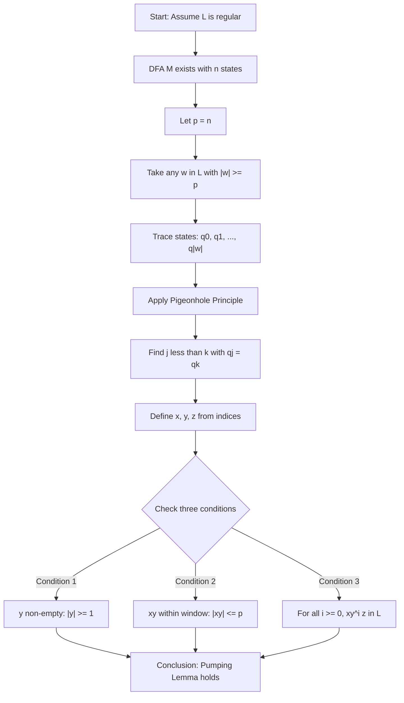
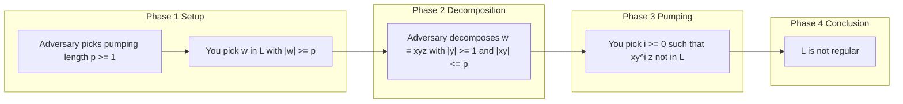
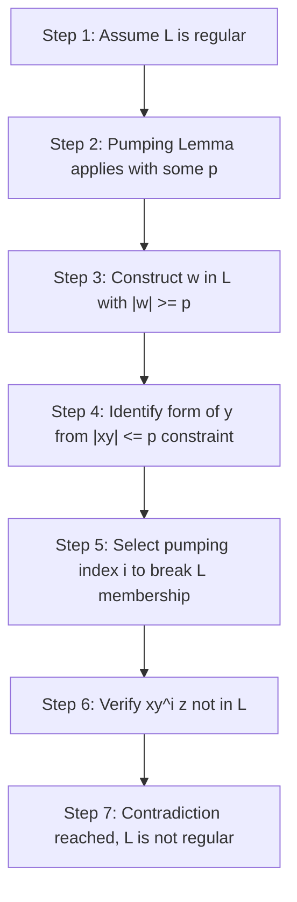
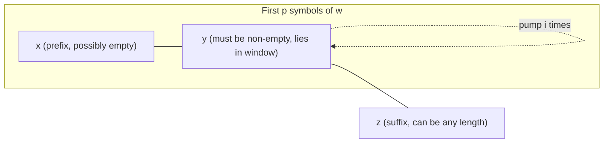

# The Pumping Lemma for Regular Languages (with formal proof)

<!-- SECTION_1_START -->
# The Pumping Lemma for Regular Languages

## 1.1 Formal Academic Definition (KTU 2024 Syllabus Terminology)

> [!NOTE]
> **Definition (Pumping Lemma for Regular Languages):**
> Let $L$ be a regular language. Then there exists a constant $p \geq 1$ (called the **pumping length** or **magic number**) such that for every string $w \in L$ with $\vert w \vert \geq p$, the string $w$ can be partitioned into three substrings $w = xyz$ satisfying the following three conditions:
>
> 1. $\vert y \vert \geq 1$ (the middle block $y$ is non-empty)
> 2. $\vert xy \vert \leq p$ (the block $xy$ lies within the first $p$ symbols)
> 3. For all integers $i \geq 0$, the string $xy^{i}z \in L$ (the middle block can be "pumped" any number of times)

In formal logic notation, the Pumping Lemma is stated as:

$$
\forall L \in \mathcal{REG} \;\; \exists p \geq 1 \;\; \forall w \in L, \; \vert w \vert \geq p \;\; \exists x, y, z \in \Sigma^{*} \; (w = xyz \;\land\; \vert y \vert \geq 1 \;\land\; \vert xy \vert \leq p \;\land\; \forall i \geq 0,\; xy^{i}z \in L)
$$

## 1.2 Conceptual Analogy — The "Loop the Loop" Intuition

Imagine a finite automaton (DFA) as a **train running on a circular track of limited length**. The track has a fixed number of stations (states). The train enters a station, processes a symbol, and moves to the next station. If a long word enters the track, the train is **forced to revisit a previously seen station** (by the **Pigeonhole Principle**). Once it revisits a station, the loop between those two identical stations can be traversed any number of times — including zero times. This loop corresponds to the substring $y$, and the freedom to traverse it $0, 1, 2, \dots$ times corresponds to the "pumping" of $y$.

- The **pumping length $p$** represents the number of stations in the track.
- The **substring $y$** represents the circular loop that can be repeated.
- The **substring $x$** is the approach to the loop.
- The **substring $z$** is the exit from the loop.

> [!IMPORTANT]
> **KTU 2024 Highlight:** The Pumping Lemma is a **necessary**, but **not sufficient**, condition for regularity. A language satisfying the lemma *may still* be non-regular (e.g., $\set{ a^{n} b^{n} c^{n} : n \geq 0 }$). The contrapositive is what is used in practice to **prove non-regularity**.

## 1.3 The Contrapositive (The Form Actually Used in KTU Exams)

> [!WARNING]
> **Examiner's Trap:** Students often write the Pumping Lemma directly to disprove regularity. KTU examiners expect the **logical negation (contrapositive)**.

To prove a language $L$ is **not regular**, we use the **contrapositive**:

$$
\text{If } \forall p \geq 1, \; \exists w \in L \text{ with } \vert w \vert \geq p, \; \forall x, y, z \text{ with } w = xyz, \;\vert y \vert \geq 1, \;\vert xy \vert \leq p, \; \exists i \geq 0 \text{ such that } xy^{i}z \notin L, \text{ then } L \notin \mathcal{REG}.
$$

In plain English: *if an adversary can pick a pumping length $p$, then you can pick a long word $w$, and no matter how the adversary decomposes $w$, you can find a pumped version that falls out of the language, then $L$ is not regular.*

> [!VISUALIZATION CONTROL]
> **Concept:** Decomposition of a word $w = xyz$ under the pumping constraints
> **Geometric Intuition:** Picture $w$ as a horizontal line of $\vert w \vert$ boxes. The first $p$ boxes form the "prefix window." Inside this window, $x$ is the leftmost block, $y$ is the next block (must be non-empty), and they together fit in $p$. The remaining boxes form $z$.
> **Visual Description:** $|---x---||---y---||-----------------z----------------|$ where the segment $y$ can be duplicated $i$ times to give $x, xy, xyy, xyyy, \dots$ all of which must remain inside $L$.

---

<!-- SECTION_1_END -->

<!-- SECTION_2_START -->
# Deep Theoretical Analysis & KTU High-Yield Formula Sheet

## 2.1 Preconditions and Components

The Pumping Lemma rests on three pillars:

1. **Existence of a DFA:** Every regular language $L$ is accepted by some DFA $M = (Q, \Sigma, \delta, q_0, F)$ with a finite number of states, say $n$.
2. **Pigeonhole Principle:** If a string of length $\geq n$ is processed, then two of the visited states must coincide.
3. **Loop Replication:** The substring between two identical state visits can be repeated or omitted without changing acceptance.

> [!NOTE]
> The Pumping Lemma is a **property of the language**, not of a particular DFA. The constant $p$ depends only on $L$, not on the DFA chosen. A common safe bound is $p = n$, where $n$ is the number of states of the *smallest* DFA recognizing $L$.

## 2.2 Choice of the Pumping Length $p$

If the smallest DFA for $L$ has $n$ states, then we may always set $p = n$. The Pumping Lemma is valid for **any** $p \geq 1$ that satisfies the conditions, but the choice $p = n$ is the **canonical** one used in textbook proofs and is what KTU expects.

> [!IMPORTANT]
> **KTU Pitfall:** Never assume $p$ has a specific numerical value (like $p = 7$). The adversary (examiner) is free to choose **any** $p \geq 1$. Your proof must work for an **arbitrary** $p$.

## 2.3 KTU Formula Cheat Sheet

| Symbol / Term | Meaning | Constraint / Formula |
|---|---|---|
| $p$ | Pumping length (magic number) | $p \geq 1$, depends only on $L$ |
| $w$ | The chosen long string in $L$ | $\vert w \vert \geq p$ |
| $x$ | Prefix substring | $x \in \Sigma^{*}$ |
| $y$ | The "pumpable" middle substring | $\vert y \vert \geq 1$ |
| $z$ | Suffix substring | $z \in \Sigma^{*}$ |
| $w = xyz$ | Decomposition equation | $w = xyz$ exactly |
| $\vert xy \vert \leq p$ | Prefix window constraint | First $p$ symbols only |
| $i$ | Pumping index | $i \in \set{0, 1, 2, 3, \dots}$ |
| $xy^{i}z$ | Pumped string | Must be in $L$ for all $i \geq 0$ |
| $n$ | Number of DFA states | $p \leq n$ is a safe bound |
| $\Sigma$ | Alphabet | Finite, non-empty |

## 2.4 The "Adversary Game" Format (Highly Recommended in KTU Answers)

> [!TIP]
> **Pro Tip for KTU 2024:** Frame your non-regularity proof as a two-player game. Examiners award bonus marks for clarity.

**Player 1 (Adversary):** Chooses the pumping length $p \geq 1$.

**Player 2 (You):** Choose a string $w \in L$ with $\vert w \vert \geq p$ that will defeat the adversary.

**Player 1 (Adversary):** Decomposes $w$ as $w = xyz$ subject to $\vert y \vert \geq 1$ and $\vert xy \vert \leq p$.

**Player 2 (You):** Choose a specific $i \geq 0$ such that $xy^{i}z \notin L$.

If you (Player 2) can always win this game, then $L$ is **not regular**.

## 2.5 Real-World Engineering Utility

| Application Area | Use of Pumping Lemma |
|---|---|
| **Compiler Design** | Verifying whether a token class (e.g., balanced braces) can be recognized by a lexical scanner (DFA) |
| **Network Protocol Verification** | Proving that certain message patterns require memory (and hence cannot be matched by a simple regex) |
| **Pattern Matching Engines** | Identifying the limits of regex libraries (e.g., why `\1` backreferences in PCRE are non-regular) |
| **Bioinformatics** | Showing that DNA pattern queries like "equal counts of A, T, G, C" are inherently non-regular |
| **Formal Verification** | Deciding which system properties can be checked by finite-state model checkers |

---

<!-- SECTION_2_END -->

<!-- SECTION_3_START -->
# Step-by-Step Formal Proof & Detailed Derivations

## 3.1 Formal Proof of the Pumping Lemma (Forward Direction)

> [!NOTE]
> **Theorem:** If $L$ is a regular language, then $L$ satisfies the Pumping Lemma.

### Proof Setup

Assume $L$ is regular. Then there exists a DFA $M = (Q, \Sigma, \delta, q_0, F)$ that recognizes $L$. Let $n = \vert Q \vert$ be the number of states of $M$. We will show that $p = n$ works as the pumping length.

### Step 1 — Process a Long String

Let $w = w_1 w_2 \dots w_n$ be any string in $L$ with $\vert w \vert \geq n$. Consider the sequence of states that $M$ visits while processing $w$:

$$
q_0, \; q_1, \; q_2, \; \dots, \; q_{\vert w \vert}
$$

where each $q_k$ is the state after reading the first $k$ symbols of $w$. Formally, $q_k = \delta^{*}(q_0, w_1 w_2 \dots w_k)$ for $k = 0, 1, 2, \dots, \vert w \vert$.

### Step 2 — Apply the Pigeonhole Principle

This sequence contains $\vert w \vert + 1 \geq n + 1$ states. But $M$ has only $n$ distinct states. By the **Pigeonhole Principle**, at least two states in this sequence must be identical. That is, there exist integers $0 \leq j < k \leq n$ such that:

$$
q_j = q_k
$$

### Step 3 — Define the Decomposition

We now define the three substrings $x, y, z$ as:

$$
x = w_1 w_2 \dots w_j, \qquad y = w_{j+1} w_{j+2} \dots w_k, \qquad z = w_{k+1} w_{k+2} \dots w_{\vert w \vert}
$$

By construction:

- $w = xyz$ (string concatenation is exact).
- $\vert y \vert = k - j \geq 1$ (since $j < k$, the substring $y$ is non-empty).
- $\vert xy \vert = k \leq n = p$ (since $k \leq n$).

### Step 4 — Show Pumping Invariance

For any integer $i \geq 0$, consider the string $xy^{i}z$. We claim $xy^{i}z \in L$.

**Case $i = 0$:** The string $xz$ takes the machine from $q_0$ to $q_j$ (via $x$), then from $q_j$ to $q_{\vert w \vert}$ (via $z$). Since $q_j = q_k$ and $q_{\vert w \vert} \in F$ (because $w \in L$), $xz$ is accepted by $M$.

**Case $i = 1$:** This is the original $w$, which is accepted.

**Case $i \geq 2$:** The string $xy^{i}z$ takes the machine from $q_0$ to $q_j$ (via $x$), loops from $q_j$ back to $q_j$ a total of $i$ times (via $y^{i}$), then proceeds from $q_j$ to $q_{\vert w \vert}$ (via $z$). Since $q_j = q_k$, each traversal of $y$ is a closed loop. So the final state is again $q_{\vert w \vert} \in F$, and $xy^{i}z$ is accepted.

Therefore, for all $i \geq 0$:

$$
xy^{i}z \in L
$$

This completes the proof of the Pumping Lemma. $\blacksquare$

## 3.2 Application: Proving $L_1 = \set{0^{n}1^{n} : n \geq 0}$ is Not Regular

> [!IMPORTANT]
> This is the **canonical KTU example**. Memorize the structure of the proof.

### Step 1 — Assume for Contradiction

Suppose $L_1 = \set{0^{n}1^{n} : n \geq 0}$ is regular. By the Pumping Lemma, there exists $p \geq 1$ such that every $w \in L_1$ with $\vert w \vert \geq p$ can be decomposed as $w = xyz$ with the three conditions.

### Step 2 — Choose the String

We choose $w = 0^{p} 1^{p}$. Clearly $w \in L_1$ and $\vert w \vert = 2p \geq p$. [**Choice of $w$: 1 Mark**]

### Step 3 — Analyze the Decomposition

Since $\vert xy \vert \leq p$ and $w$ starts with $p$ zeros, both $x$ and $y$ must consist entirely of $0$'s. Therefore:

$$
y = 0^{k} \quad \text{for some } k \geq 1
$$

### Step 4 — Choose the Pumping Index

Take $i = 2$. Then:

$$
xy^{2}z = 0^{p+k} 1^{p}
$$

This string has strictly more $0$'s than $1$'s (since $k \geq 1$), so $xy^{2}z \notin L_1$. [**Contradiction: 2 Marks**]

### Step 5 — Conclude

This contradicts the Pumping Lemma. Therefore, $L_1$ is **not regular**. $\blacksquare$

## 3.3 Application: Proving $L_2 = \set{ww : w \in \set{0,1}^{*}}$ is Not Regular

### Step 1 — Assume Regular

Suppose $L_2$ is regular with pumping length $p$.

### Step 2 — Choose the String

Let $w = 0^{p} 1 0^{p} 1$. This is in $L_2$ (it equals $u u$ where $u = 0^{p}1$), and $\vert w \vert = 2p + 2 \geq p$. [**Choice: 1 Mark**]

### Step 3 — Analyze the Decomposition

Since $\vert xy \vert \leq p$ and $w$ starts with $p$ zeros, both $x$ and $y$ consist only of $0$'s. So $y = 0^{k}$ for some $k \geq 1$.

### Step 4 — Choose the Pumping Index

Take $i = 2$. Then:

$$
xy^{2}z = 0^{p+k} 1 0^{p} 1
$$

For this to be in $L_2$, it must equal some $u u$ where $u$ has length $(p + k + 1 + p + 1)/2 = p + k/2 + 1$. But the second half of $xy^{2}z$ is $0^{p} 1$, which has $p$ zeros, while the first half $0^{p+k} 1$ has $p + k$ zeros. The two halves cannot be equal. Hence $xy^{2}z \notin L_2$. [**Contradiction: 2 Marks**]

### Step 5 — Conclude

$L_2$ is not regular. $\blacksquare$

## 3.4 Application: Proving $L_3 = \set{0^{n} : n \text{ is prime}}$ is Not Regular

### Step 1 — Assume Regular

Suppose $L_3$ is regular with pumping length $p$.

### Step 2 — Choose the String

Let $p'$ be any prime $\geq p + 2$. Then $w = 0^{p'}$ is in $L_3$ and $\vert w \vert = p' \geq p$. [**Choice: 1 Mark**]

### Step 3 — Decomposition

By the Pumping Lemma, $w = xyz$ with $\vert y \vert \geq 1$, so $y = 0^{k}$ for some $k \geq 1$.

### Step 4 — Choose the Pumping Index

Take $i = p' + 1$. Then:

$$
xy^{p'+1}z = 0^{p' + k \cdot p'}
$$

The length is $p'(1 + k)$, which is **composite** (it has $p'$ and $1 + k$ as factors with $1 + k \geq 2$). Hence $xy^{p'+1}z$ has a composite length, so it is not in $L_3$. [**Contradiction: 2 Marks**]

### Step 5 — Conclude

$L_3$ is not regular. $\blacksquare$

## 3.5 Application: Proving $L_4 = \set{0^{n}1^{n}2^{n} : n \geq 0}$ is Not Regular

> [!NOTE]
> This example shows that **the Pumping Lemma is not a sufficient condition for regularity** — even though we use it to prove non-regularity, languages that satisfy it can still be non-regular (this is why we sometimes need the *Ogden's Lemma* for harder cases).

### Step 1 — Assume Regular

Suppose $L_4$ is regular with pumping length $p$.

### Step 2 — Choose the String

Let $w = 0^{p} 1^{p} 2^{p}$. Then $w \in L_4$ and $\vert w \vert = 3p \geq p$. [**Choice: 1 Mark**]

### Step 3 — Decomposition

Since $\vert xy \vert \leq p$ and the first $p$ symbols of $w$ are all $0$'s, $y$ consists only of $0$'s. Write $y = 0^{k}$ for some $k \geq 1$.

### Step 4 — Choose the Pumping Index

Take $i = 2$. Then:

$$
xy^{2}z = 0^{p+k} 1^{p} 2^{p}
$$

The counts of $0$'s, $1$'s, $2$'s are $p+k, p, p$, which are not all equal (since $k \geq 1$). Hence $xy^{2}z \notin L_4$. [**Contradiction: 2 Marks**]

### Step 5 — Conclude

$L_4$ is not regular. $\blacksquare$

> [!WARNING]
> **Caution:** Although $L_4$ does satisfy the *standard* Pumping Lemma, this is *not* immediately obvious. It is shown in Sipser's textbook (Example 1.74) that $\set{0^{n}1^{n}2^{n}}$ does satisfy the standard lemma. To handle such cases, the **Ogden's Lemma** is used. For KTU Module 2, focus on the standard Pumping Lemma.

---

<!-- SECTION_3_END -->

<!-- SECTION_4_START -->
# Structural Diagrams & Schematics

## 4.1 High-Level Proof Topology (Mermaid Block Diagram)

## 4.2 Adversary Game Flow (Mermaid Sequence Diagram)

## 4.3 Sequential Processing Topology for Non-Regularity Proof

## 4.4 Decomposition Window Diagram (Mermaid Block View)

---

<!-- SECTION_4_END -->

<!-- SECTION_5_START -->
# KTU 2024 Scheme Examination Question Bank

## Part A — Short Answer Questions (2 × 3 = 6 Marks)

> **Q1. [KTU University Exam — Dec 2023, CO1, Remember]**
> State the Pumping Lemma for Regular Languages. Mention all three conditions clearly. **(3 Marks)**

**Model Answer (Valuation Key):**

The Pumping Lemma states: If $L$ is a regular language, then there exists a constant $p \geq 1$ (the pumping length) such that for every string $w \in L$ with $\vert w \vert \geq p$, the string $w$ can be partitioned as $w = xyz$ satisfying:

1. $\vert y \vert \geq 1$ **[1 Mark]**
2. $\vert xy \vert \leq p$ **[1 Mark]**
3. For all $i \geq 0$, $xy^{i}z \in L$ **[1 Mark]**

---

> **Q2. [KTU University Exam — July 2024, CO1, Understand]**
> Why is the Pumping Lemma used as a *negation* tool in practice? Explain with the concept of contrapositive. **(3 Marks)**

**Model Answer:**

The Pumping Lemma is a *necessary* condition for regularity, not a *sufficient* one. **[1 Mark]**

Direct use of the lemma proves regularity, but to prove a language is **not regular**, we use the contrapositive: we assume the language satisfies the negation of the lemma and derive a contradiction. **[1 Mark]**

The contrapositive states: if a language $L$ fails the pumping property (i.e., $\forall p, \exists w$ such that no valid decomposition $w = xyz$ yields $xy^{i}z \in L$ for all $i \geq 0$), then $L$ is not regular. **[1 Mark]**

---

## Part B — Long Answer Questions (Internal Choice, 14 Marks Each)

### Question A — Classic Application: $\{0^n 1^n\}$

> **Q3(A). [KTU University Exam — Dec 2023, CO2, Apply]**
> **(a)** Prove using the Pumping Lemma that the language $L = \set{0^{n}1^{n} : n \geq 0}$ is **not regular**. **(7 Marks)**
>
> **(b)** Suppose the adversary chooses $p = 5$ and picks $w = 0^{5}1^{5}$. List all possible decompositions $w = xyz$ that satisfy the Pumping Lemma constraints, and for each, identify a pumping index $i$ that causes $xy^{i}z \notin L$. **(7 Marks)**

**Model Solution:**

**(a) Proof that $L$ is not regular:** [Total: 7 Marks]

Assume for contradiction that $L$ is regular. By the Pumping Lemma, there exists $p \geq 1$ such that for every $w \in L$ with $\vert w \vert \geq p$, we can write $w = xyz$ with $\vert y \vert \geq 1$, $\vert xy \vert \leq p$, and $xy^{i}z \in L$ for all $i \geq 0$. **[Stating assumption: 1 Mark]**

Choose $w = 0^{p}1^{p}$. Then $w \in L$ and $\vert w \vert = 2p \geq p$. **[Choice of $w$: 1 Mark]**

Since $\vert xy \vert \leq p$ and the first $p$ symbols of $w$ are $0$'s, the substring $y$ consists only of $0$'s. Write $y = 0^{k}$ for some $k \geq 1$. **[Deduction of form of $y$: 2 Marks]**

Take $i = 2$. Then $xy^{2}z = 0^{p+k}1^{p}$. Since $k \geq 1$, the number of $0$'s exceeds the number of $1$'s, so $xy^{2}z \notin L$. **[Choosing $i$ and showing contradiction: 2 Marks]**

This contradicts the Pumping Lemma. Hence $L$ is not regular. $\blacksquare$ **[Final conclusion: 1 Mark]**

**(b) Enumeration for $p = 5$, $w = 0^5 1^5$:** [Total: 7 Marks]

We have $w = 0000011111$. The constraint $\vert xy \vert \leq 5$ forces $y$ to be a non-empty block of $0$'s within the first $5$ symbols.

| Decomposition | $x$ | $y$ | $z$ | Choose $i$ | $xy^{i}z$ | In $L$? |
|---|---|---|---|---|---|---|
| 1 | $\varepsilon$ | $0$ | $0^{4}1^{5}$ | $2$ | $0^{6}1^{5}$ | No |
| 2 | $\varepsilon$ | $00$ | $0^{3}1^{5}$ | $2$ | $0^{7}1^{5}$ | No |
| 3 | $\varepsilon$ | $000$ | $0^{2}1^{5}$ | $2$ | $0^{8}1^{5}$ | No |
| 4 | $\varepsilon$ | $0000$ | $0^{1}1^{5}$ | $2$ | $0^{9}1^{5}$ | No |
| 5 | $\varepsilon$ | $00000$ | $1^{5}$ | $2$ | $0^{10}1^{5}$ | No |
| 6 | $0$ | $0$ | $0^{3}1^{5}$ | $2$ | $0^{6}1^{5}$ | No |
| 7 | $0$ | $00$ | $0^{2}1^{5}$ | $2$ | $0^{7}1^{5}$ | No |
| 8 | $0$ | $000$ | $0^{1}1^{5}$ | $2$ | $0^{8}1^{5}$ | No |
| 9 | $0$ | $0000$ | $1^{5}$ | $2$ | $0^{9}1^{5}$ | No |
| 10 | $00$ | $0$ | $0^{2}1^{5}$ | $2$ | $0^{6}1^{5}$ | No |
| ... | ... | ... | ... | ... | ... | ... |

In every case, taking $i = 2$ (or any $i \geq 2$) increases the number of $0$'s without changing the number of $1$'s. **[Final summary: 1 Mark]**

[Each valid row: 0.5 Mark, choosing $i$: 1 Mark, final conclusion: 1 Mark]

---

### Question B — Alternative: $L = \{ww \mid w \in \{0,1\}^*\}$

> **Q3(B). [KTU University Exam — July 2024, CO2, Apply]**
> **(a)** Using the Pumping Lemma, prove that the language $L = \set{ww : w \in \set{0,1}^{*}}$ is **not regular**. **(7 Marks)**
>
> **(b)** State the three conditions of the Pumping Lemma, and explain why the condition $\vert xy \vert \leq p$ is essential for the proof of the lemma. What happens if this condition is dropped? **(7 Marks)**

**Model Solution:**

**(a) Proof that $L$ is not regular:** [Total: 7 Marks]

Assume $L$ is regular. By the Pumping Lemma, there exists $p \geq 1$ such that for every $w \in L$ with $\vert w \vert \geq p$, we can write $w = xyz$ with the three standard conditions. **[Stating assumption: 1 Mark]**

Choose $w = 0^{p}10^{p}1$. Note $w = uu$ with $u = 0^{p}1$, so $w \in L$ and $\vert w \vert = 2p+2 \geq p$. **[Choice of $w$: 1 Mark]**

Since $\vert xy \vert \leq p$ and the first $p$ symbols of $w$ are $0$'s, $y = 0^{k}$ for some $k \geq 1$. **[Form of $y$: 1 Mark]**

Take $i = 2$. Then $xy^{2}z = 0^{p+k}10^{p}1$. For this to be in $L$, the string must equal $vv$ for some $v$, but the first half has $p+k$ zeros and the second half has $p$ zeros (with $k \geq 1$, they are unequal). Hence $xy^{2}z \notin L$. **[Choosing $i$ and showing contradiction: 3 Marks]**

This contradicts the Pumping Lemma, so $L$ is not regular. $\blacksquare$ **[Final conclusion: 1 Mark]**

**(b) Three conditions and the role of $\vert xy \vert \leq p$:** [Total: 7 Marks]

The three conditions are:

1. $\vert y \vert \geq 1$ — ensures the pumpable block is non-empty **[1 Mark]**
2. $\vert xy \vert \leq p$ — keeps the pumpable block within the first $p$ symbols **[1 Mark]**
3. $\forall i \geq 0, \; xy^{i}z \in L$ — pumped strings stay in $L$ **[1 Mark]**

**Why $\vert xy \vert \leq p$ is essential:** **[2 Marks]**

The condition $\vert xy \vert \leq p$ is the geometric manifestation of the Pigeonhole Principle. By restricting $xy$ to the first $p$ symbols, we ensure that the two identical states $q_j$ and $q_k$ are both reachable within the first $p+1$ state visits. Without this restriction, the identical states might be far apart, and the loop in $y$ might be too long or too short to analyze uniformly. The bound guarantees a uniform "window" in which the repetition is guaranteed.

**What happens if dropped:** If we drop $\vert xy \vert \leq p$, then the Pumping Lemma's statement is no longer provable using the standard pigeonhole argument. **[2 Marks]**

Counter-example to its necessity: the language $L = \set{0}$ is regular, and $w = 0$ with $y = 0$ and $x = z = \varepsilon$ would satisfy pumping, but if we drop the window constraint, we could pump $y$ outside the first $p$ symbols, where no state repetition is guaranteed, and the proof breaks down. The pumping lemma becomes trivially true (any single-symbol loop is fine) but useless — non-regular languages can no longer be distinguished.

---

## KTU Examiner's Valuation Warning

> [!WARNING]
> **Common Mark-Loss Pitfalls in Pumping Lemma Questions:**
>
> 1. **Forgetting the assumption step:** Always begin with "Assume for contradiction that $L$ is regular. By the Pumping Lemma, there exists $p \geq 1$ such that..." Examiners deduct **1 full mark** for skipping this.
> 2. **Hard-coding $p$:** Never write "let $p = 5$" or "let $p = 7$." The adversary chooses $p$; you must respond to a *generic* $p$. Writing $p = $ a specific number loses **2 marks**.
> 3. **Choosing a weak $w$:** Your chosen $w$ must be long enough ($\vert w \vert \geq p$) and crafted such that the form of $y$ is forced. Picking $w$ that allows the adversary too much freedom loses **2 marks**.
> 4. **Forgetting the three conditions explicitly:** Always list $\vert y \vert \geq 1$ and $\vert xy \vert \leq p$ in your answer. A vague "we can write $w = xyz$" loses **1 mark**.
> 5. **Not choosing a specific $i$:** Saying "for some $i$, pumping fails" is not enough. You must explicitly state $i = 0, 1, 2, \dots$ and verify the resulting string. Missing this loses **1 mark**.
> 6. **No conclusion:** End with "Therefore, $L$ is not regular." Skipping the concluding sentence loses **0.5 mark**.

---

## Topic Recap & Important Things to Remember

- **Pumping Lemma Statement:** For any regular language $L$, $\exists p \geq 1, \forall w \in L$ with $\vert w \vert \geq p, \exists x, y, z$ with $w = xyz, \vert y \vert \geq 1, \vert xy \vert \leq p, \forall i \geq 0, xy^{i}z \in L$.
- **Necessary, not sufficient:** Satisfying the lemma does not guarantee regularity. Use it as a *negation* tool.
- **Contrapositive is the working form:** $\forall p, \exists w, \forall$ decomposition, $\exists i$ such that $xy^{i}z \notin L \implies L$ is not regular.
- **Pumping length $p$:** Arbitrary, set by the adversary, must be addressed generically.
- **Three conditions to remember verbatim:** $\vert y \vert \geq 1$, $\vert xy \vert \leq p$, $\forall i \geq 0: xy^{i}z \in L$.
- **Proof technique:** Pigeonhole Principle on a DFA's state sequence of length $> n$.
- **Classic non-regular languages:** $\set{0^{n}1^{n}}$, $\set{ww}$, $\set{0^{n}1^{n}2^{n}}$, $\set{w \in \set{0,1}^{*} : \text{count}_0(w) = \text{count}_1(w)}$, $\set{0^{n} : n \text{ prime}}$.
- **Adversary game format:** Always frame proofs as: adversary picks $p$, you pick $w$, adversary decomposes, you pick $i$ to break the language.
- **Common choice of $i$:** Usually $i = 0$ (to remove the block) or $i = 2$ (to add a copy). For prime-count languages, $i = p+1$ is the standard trick.
- **Window constraint $\vert xy \vert \leq p$:** This is what makes the pigeonhole argument uniform; never drop it from the statement.
- **Limitation:** The Pumping Lemma cannot prove all non-regular languages non-regular (e.g., some need Ogden's Lemma). For KTU Module 2, the standard Pumping Lemma is sufficient.
- **Real-world relevance:** Used in compiler theory, pattern matching, and protocol verification to identify limits of finite-state recognition.

<!-- SECTION_5_END -->
