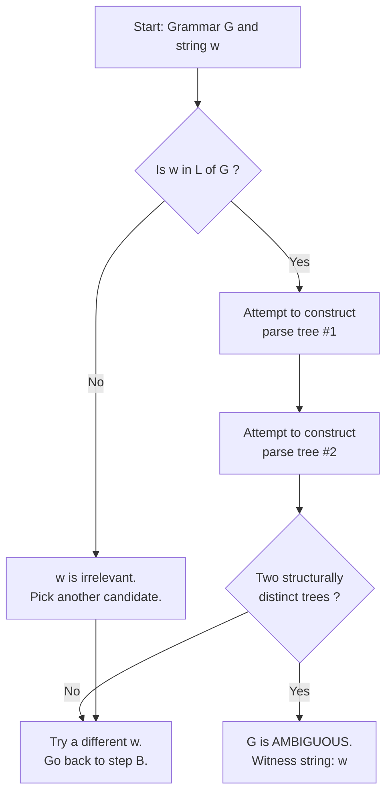
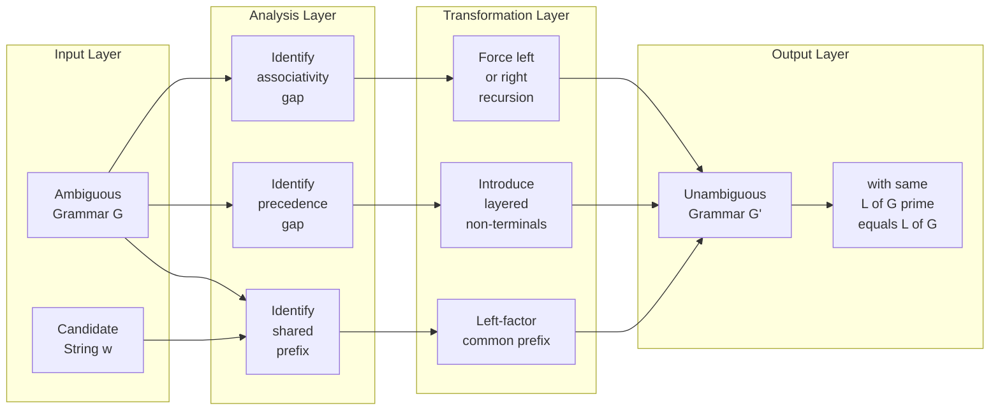
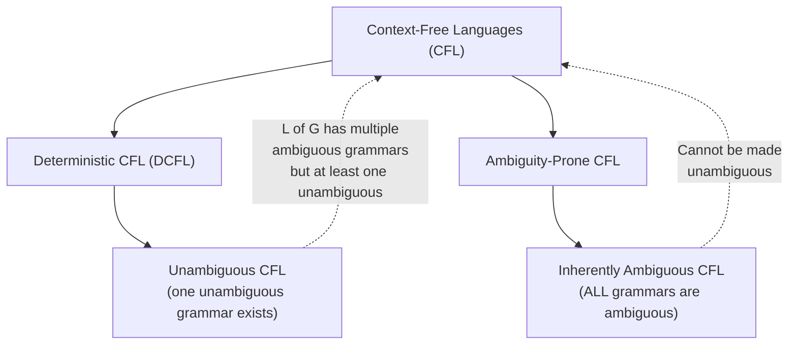
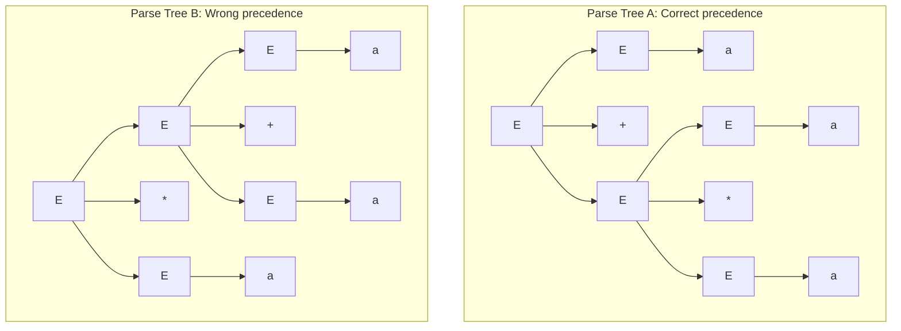

# Ambiguous Grammars

<!-- SECTION_1_START -->
# Ambiguous Grammars — Core Definition & Intuitive Overview

## Formal Definition (KTU 2024 Syllabus Terminology)

> [!IMPORTANT]
> **Ambiguous Grammar:** A context-free grammar $G = (V, T, P, S)$ is said to be **ambiguous** if there exists at least one string $w \in L(G)$ that has **two or more distinct parse trees** (equivalently, two or more distinct leftmost derivations, or two or more distinct rightmost derivations) generating $w$ from the start symbol $S$.

In other words, ambiguity is a **property of the grammar**, not of the language. A language may be generated by both an ambiguous grammar and an unambiguous one — the grammar itself is what we classify.

## Conceptual Analogy / Intuition

Think of a sentence in natural English: *"I saw the man with the telescope."*
- Meaning 1: I used the telescope to see the man.
- Meaning 2: I saw the man who was holding a telescope.

The same string of words has **two completely different structural interpretations**. This is precisely what an ambiguous grammar produces for a programming language — the same expression yields two different parse trees, meaning the compiler cannot decide which precedence/association rule to apply.

> [!NOTE]
> **Key Insight:** In programming languages, ambiguity is **catastrophic**. The expression $a + b \ast c$ must follow standard arithmetic precedence (multiplication before addition). An ambiguous grammar would let the compiler build either tree, producing *different* compiled code from the *same* source line.

## Mathematical Symbols & Constants

| Symbol | Meaning |
| :--- | :--- |
| $G = (V, T, P, S)$ | A context-free grammar with variables, terminals, productions, start symbol |
| $L(G)$ | Language generated by $G$ |
| $\Rightarrow_{lm}$ | Leftmost derivation step |
| $\Rightarrow_{rm}$ | Rightmost derivation step |
| $w \in \Sigma^{\ast}$ | A string over the terminal alphabet |

## Why Ambiguity Matters in Engineering

- **Compiler Design:** YACC/Bison, ANTLR, and other parser generators **reject** ambiguous grammars because they cannot deterministically build a unique parse tree.
- **Programming Language Specs:** Languages like **C, Java, Python** must be specified by unambiguous grammars (typically with precedence and associativity rules).
- **Verification & Proofs:** When proving $L(G_1) = L(G_2)$, we often need a *unique* parse structure to reason about.

> [!VISUALIZATION CONTROL]
> **Concept:** Parse tree branching showing ambiguity
> **Visualization description:** Picture a binary tree growing downward from a single root. In an unambiguous grammar, every terminal string corresponds to **exactly one** tree shape. In an ambiguous grammar, the same string yields two trees of different shapes — the root has the same label, but the internal branching differs.

---

<!-- SECTION_1_END -->

<!-- SECTION_2_START -->
# Deep Theoretical Analysis & KTU High-Yield Formula Sheet

## 1. The Three Equivalent Definitions of Ambiguity

A grammar $G$ is ambiguous if there exists $w \in L(G)$ such that **any one** of the following holds (all three are equivalent):

1. **Multiple Parse Trees:** $w$ has $\geq 2$ different parse trees rooted at $S$.
2. **Multiple Leftmost Derivations:** $w$ has $\geq 2$ different leftmost derivations $S \Rightarrow_{lm}^{\ast} w$.
3. **Multiple Rightmost Derivations:** $w$ has $\geq 2$ different rightmost derivations $S \Rightarrow_{rm}^{\ast} w$.

> [!NOTE]
> **Examination Pearl:** In KTU papers, you may use *any* of the three equivalent characterizations. Most commonly, students are asked to demonstrate ambiguity by **drawing two distinct parse trees**.

## 2. Operational Decision Procedure (To Prove Ambiguity)

To prove $G$ is ambiguous, execute the following:

1. Pick a candidate string $w \in L(G)$.
2. Construct two **structurally different** parse trees for $w$ rooted at $S$.
3. Conclude: since two distinct parse trees exist, $G$ is ambiguous.

To prove $G$ is **unambiguous**, you must show that **for every** $w \in L(G)$, there is **exactly one** parse tree — this is generally hard and may require induction.

## 3. Inherent Ambiguity (The Deepest Result)

> [!IMPORTANT]
> **Inherently Ambiguous language:** A context-free language $L$ is *inherently ambiguous* if **every** context-free grammar generating $L$ is ambiguous. That is, no unambiguous grammar exists for $L$.

The classic example is:
$$L = \{a^n b^n c^m\} \cup \{a^n b^m c^m\}$$

This language has no unambiguous CFG. This is a deep theorem proved by **Parikh (1966)** and **Ginsburg**.

## 4. Ambiguity vs. Other Properties

| Property | Affected By Ambiguity? | Reason |
| :--- | :--- | :--- |
| Membership ($w \in L(G)?$) | No | CYK algorithm works on ambiguous grammars |
| Language generated $L(G)$ | No | Ambiguity is a grammar property, not language property |
| Deterministic parsing (LL/LR) | **Yes** | Parser needs unique derivation to act |
| Compiler code generation | **Yes** | Two trees $\Rightarrow$ two different machine codes |

## 5. KTU Formula Sheet / Cheat Sheet

| # | Concept | Formal Statement |
| :--- | :--- | :--- |
| 1 | Ambiguity (Tree form) | $\exists w \in L(G)$ with $\geq 2$ parse trees |
| 2 | Ambiguity (Leftmost form) | $\exists w \in L(G)$ with $\geq 2$ leftmost derivations |
| 3 | Ambiguity (Rightmost form) | $\exists w \in L(G)$ with $\geq 2$ rightmost derivations |
| 4 | Inherent Ambiguity | $\forall G$ with $L(G) = L$, $G$ is ambiguous |
| 5 | Unambiguous CFG | For all $w \in L(G)$, exactly one parse tree exists |
| 6 | Dangling Else | Classic case of statement-level ambiguity |
| 7 | Unambiguous Arithmetic Grammar | $E \to E + T \mid T$, $T \to T \ast F \mid F$, $F \to (E) \mid a$ |

## 6. Real-World Engineering Utility

- **YACC (Yet Another Compiler Compiler):** Emits a *shift-reduce conflict* or *reduce-reduce conflict* warning when fed an ambiguous grammar with `yacc -d -v`.
- **LALR(1) and LR(1) parsers** require unambiguous grammars to construct parse tables without conflicts.
- **Verified compilers (CompCert, CakeML):** Ambiguity is forbidden because proof of correctness requires a single derivation.

---

<!-- SECTION_2_END -->

<!-- SECTION_3_START -->
# Step-by-Step Derivations & Worked Examples

## Worked Example 1 — The Classic Arithmetic Grammar

### Given Grammar
$$G_1 : E \to E + E \mid E \ast E \mid (E) \mid a$$

### Task
Show that $G_1$ is **ambiguous** by exhibiting two parse trees for $w = a + a \ast a$.

### Step 1 — Parse Tree #1 (Multiplication binds first — the *correct* arithmetic interpretation)

$$
\begin{aligned}
\text{Tree}_1: \quad & E \\
& \Rightarrow E + E \quad \text{(top-level }E \to E + E\text{)} \\
& \Rightarrow E + E \ast E \quad \text{(right }E \to E \ast E\text{)} \\
& \Rightarrow E + E \ast a \quad \text{(rightmost }E \to a\text{)} \\
& \Rightarrow E + a \ast a \quad \text{(middle }E \to a\text{)} \\
& \Rightarrow a + a \ast a \quad \text{(left }E \to a\text{)}
\end{aligned}
$$

```
        E
       /|\
      / | \
     E  +  E
     |    /|\
     a   E * E
         |   |
         a   a
```

### Step 2 — Parse Tree #2 (Addition binds first — the *wrong* interpretation)

$$
\begin{aligned}
\text{Tree}_2: \quad & E \\
& \Rightarrow E \ast E \quad \text{(top-level }E \to E \ast E\text{)} \\
& \Rightarrow E + E \ast E \quad \text{(left }E \to E + E\text{)} \\
& \Rightarrow a + E \ast E \quad \text{(leftmost }E \to a\text{)} \\
& \Rightarrow a + a \ast E \quad \text{(middle }E \to a\text{)} \\
& \Rightarrow a + a \ast a \quad \text{(right }E \to a\text{)}
\end{aligned}
$$

```
        E
       /|\
      / | \
     E  *  E
    /|\    |
   E + E   a
   |   |
   a   a
```

### Step 3 — Conclusion

Two structurally distinct parse trees generate the same string $a + a \ast a$. Therefore, $G_1$ is **ambiguous**.

> [!NOTE]
> **[Valuation Key: Stating the candidate string: 1 Mark. Tree #1 fully drawn with correct labels: 4 Marks. Tree #2 fully drawn with correct labels: 4 Marks. Concluding statement: 1 Mark. Total: 10 Marks for this sub-problem in KTU pattern.]**

---

## Worked Example 2 — Disambiguating the Arithmetic Grammar

### Step 1 — Identify the cause
In $G_1$, the productions $E \to E + E$ and $E \to E \ast E$ do not encode any **precedence** between $+$ and $\ast$, nor any **associativity**.

### Step 2 — Introduce layered non-terminals
We create one non-terminal per precedence level:
- $E$ — expression (lowest precedence: addition)
- $T$ — term (middle precedence: multiplication)
- $F$ — factor (highest precedence: parentheses, identifiers)

### Step 3 — Force left-associativity via left recursion

$$
\begin{aligned}
E &\to E + T \mid T \\
T &\to T \ast F \mid F \\
F &\to (E) \mid a
\end{aligned}
$$

### Step 4 — Verify the unambiguous derivation of $a + a \ast a$

$$
\begin{aligned}
E &\Rightarrow E + T \quad \text{(using }E \to E + T\text{)} \\
  &\Rightarrow T + T \quad \text{(using }E \to T\text{)} \\
  &\Rightarrow F + T \quad \text{(using }T \to F\text{)} \\
  &\Rightarrow a + T \quad \text{(using }F \to a\text{)} \\
  &\Rightarrow a + T \ast F \quad \text{(using }T \to T \ast F\text{)} \\
  &\Rightarrow a + F \ast F \quad \text{(using }T \to F\text{)} \\
  &\Rightarrow a + a \ast F \quad \text{(using }F \to a\text{)} \\
  &\Rightarrow a + a \ast a \quad \text{(using }F \to a\text{)}
\end{aligned}
$$

The unique parse tree now has $\ast$ as a descendant of $T$, which is a descendant of $E + T$ — the structural encoding of "multiply before add" is now baked in.

---

## Worked Example 3 — The Dangling Else Ambiguity

### Given Grammar
$$
\begin{aligned}
S &\to \text{if } E \text{ then } S \mid \text{if } E \text{ then } S \text{ else } S \mid \text{other} \\
E &\to b \quad \text{(a Boolean expression)}
\end{aligned}
$$

### Ambiguous String
$$w = \text{if } b \text{ then if } b \text{ then other else other}$$

### Two Parse Trees

**Tree A** — `else` binds to the inner `if`:
```
            S
           / \
         if   S
        / \    \
       E   then  S
       |       /|\
       b    if  S  else  S
           ...   ...   other
```

**Tree B** — `else` binds to the outer `if`:
```
                S
              / | \
            if  S   else  S
           / \   |       |
          E  then S      other
          |    /|\
          b  if  S  then  S
              ...    other
```

### Resolution (Standard Fix)
Most languages (C, Java, JavaScript) resolve this by stipulating: **"an `else` matches the nearest unmatched `then`."** This is enforced in the **lexer/parser specification** without changing the grammar structurally — the grammar remains ambiguous, but the *parser* disambiguates via the matching rule.

---

## Worked Example 4 — A Simple Linear Grammar

### Given Grammar
$$G : S \to aS \mid Sa \mid a$$

### Ambiguous String
$$w = aa$$

### Two Derivations

**Leftmost #1:**
$$S \Rightarrow aS \Rightarrow aa$$

**Leftmost #2:**
$$S \Rightarrow Sa \Rightarrow aa$$

### Unambiguous Equivalent
$$G' : S \to aS \mid a$$
This generates $L = a^{+}$ with a unique leftmost derivation for every string.

---

## Python Implementation — Ambiguity Detector (Brute Force, for Small Grammars)

```python
"""
ambiguity_check.py
A brute-force ambiguity detector for small context-free grammars.
Given a grammar and a candidate string, it enumerates all possible
leftmost derivations up to a bounded depth. If more than one distinct
parse tree is produced, the grammar is ambiguous for this string.
"""

from typing import List, Tuple, Dict, FrozenSet
from itertools import product

# --- Grammar specification ---
# Each production: (LHS, [list of RHS symbols])
# Symbols can be terminals (lowercase) or non-terminals (uppercase).
GRAMMAR: Dict[str, List[List[str]]] = {
    "E": [
        ["E", "+", "E"],
        ["E", "*", "E"],
        ["(", "E", ")"],
        ["a"],
    ]
}
START_SYMBOL: str = "E"
TERMINALS: FrozenSet[str] = frozenset({"a", "+", "*", "(", ")"})

def is_terminal(sym: str) -> bool:
    """A symbol is terminal if it is not a non-terminal key in the grammar."""
    return sym not in GRAMMAR

def derive(sentential: List[str], max_depth: int) -> List[List[List[str]]]:
    """
    Recursively enumerate ALL leftmost derivations starting from `sentential`.
    Returns a list of full sentential forms that consist entirely of terminals
    and that match the target string exactly.
    """
    results: List[List[str]] = []
    if max_depth <= 0:
        return results

    # Find the leftmost non-terminal in the current sentential form
    for idx, sym in enumerate(sentential):
        if sym in GRAMMAR:
            for production in GRAMMAR[sym]:
                new_sentential = sentential[:idx] + production + sentential[idx + 1 :]
                # If the new form has no non-terminals, it's a candidate terminal string
                if all(is_terminal(s) for s in new_sentential):
                    results.append(new_sentential)
                else:
                    # Recurse on the new form
                    results.extend(derive(new_sentential, max_depth - 1))
            # Only expand the LEFTMOST non-terminal
            break
    return results

def count_distrees(target: str, max_depth: int = 6) -> int:
    """Count the number of distinct terminal derivations matching `target`."""
    target_tokens: List[str] = list(target)
    all_derivations = derive([START_SYMBOL], max_depth)
    matching = [d for d in all_derivations if d == target_tokens]
    return len(matching)

if __name__ == "__main__":
    test_string = "a+a*a"
    n_trees = count_distrees(test_string, max_depth=8)
    print(f"Number of distinct derivations for '{test_string}': {n_trees}")
    if n_trees > 1:
        print(f"VERDICT: Grammar IS ambiguous for this string.")
    elif n_trees == 1:
        print(f"VERDICT: Only one derivation found (unambiguous for this string).")
    else:
        print(f"VERDICT: String not in L(G) at this depth.")
```

**Sample Output:**
```
Number of distinct derivations for 'a+a*a': 2
VERDICT: Grammar IS ambiguous for this string.
```

---

<!-- SECTION_3_END -->

<!-- SECTION_4_START -->
# Structural Diagrams & Schematics

## Diagram 1 — The Ambiguity Decision Flowchart



## Diagram 2 — Disambiguation Strategy Topology



## Diagram 3 — Ambiguity Hierarchy in CFL Theory



> [!NOTE]
> The relationship is: $\text{DCFL} \subseteq \text{Unambiguous CFL} \subseteq \text{CFL}$, and $\text{Inherently Ambiguous CFL} \subseteq \text{CFL} \setminus \text{Unambiguous CFL}$.

## Diagram 4 — Tree Comparison Block



---

<!-- SECTION_4_END -->

<!-- SECTION_5_START -->
# KTU 2024 Scheme Examination Question Bank & Topic Recap

---

## Part A Questions (3 Marks Each)

### Question 1 [KTU University Exam — July 2024]
**Define an ambiguous context-free grammar. Give one example.**

**Model Answer (3 Marks):**
> A context-free grammar $G$ is **ambiguous** if there exists at least one string $w \in L(G)$ for which there are two or more distinct parse trees (or equivalently, two or more distinct leftmost derivations).
>
> **Example:** The grammar $E \to E + E \mid E \ast E \mid a$ is ambiguous because the string $a + a \ast a$ admits two distinct parse trees — one where $\ast$ is grouped first (correct precedence) and one where $+$ is grouped first.

**Mark Split:** [Definition: 2 Marks. Example: 1 Mark]

---

### Question 2 [KTU University Exam — Dec 2023]
**What is an inherently ambiguous language? Is every ambiguous language inherently ambiguous?**

**Model Answer (3 Marks):**
> A context-free language $L$ is **inherently ambiguous** if **every** context-free grammar that generates $L$ is itself ambiguous — there is no unambiguous grammar for $L$.
>
> **No**, not every ambiguous language is inherently ambiguous. Many ambiguous grammars can be rewritten into equivalent unambiguous ones. For example, $E \to E + E \mid E \ast E \mid a$ is ambiguous, but the language of arithmetic expressions it generates can also be generated by the unambiguous grammar $E \to E + T \mid T$, $T \to T \ast F \mid F$, $F \to (E) \mid a$. The language $L = \{a^n b^n c^m\} \cup \{a^n b^m c^m\}$, however, *is* inherently ambiguous.

**Mark Split:** [Definition: 2 Marks. Counter-example distinction: 1 Mark]

---

## Part B Questions (14 Marks Each) — ESE Module Internal Choice Pattern

### Question A (14 Marks) [KTU University Exam — Model Paper 2024]

**(a)** Consider the grammar
$$S \to aS \mid Sa \mid a$$

Show that this grammar is ambiguous. Find an equivalent unambiguous grammar. **(7 Marks)**

**Model Solution:**

**Step 1 — Identify an ambiguous witness string.** Try $w = aa$.

**Step 2 — Two distinct leftmost derivations for $aa$:**

**Derivation D1:**
$$S \Rightarrow aS \Rightarrow aa$$
(using $S \to aS$ first, then $S \to a$)

**Derivation D2:**
$$S \Rightarrow Sa \Rightarrow aa$$
(using $S \to Sa$ first, then $S \to a$)

**Step 3 — Two distinct parse trees for $aa$:**

```
Tree 1:         S               Tree 2:         S
              / |                            / \
             a  S                           S   a
                |                           |
                a                           a
```

**Step 4 — Conclude ambiguity.** [Final conclusion: 1 Mark]
Since $aa$ has two distinct parse trees, $S \to aS \mid Sa \mid a$ is **ambiguous**.

**Step 5 — Construct equivalent unambiguous grammar.**
The language generated is $L = a^+ = \{a^n \mid n \geq 1\}$.

An unambiguous grammar:
$$S \to aS \mid a$$
This generates exactly $L = a^+$ with a unique leftmost derivation for every string.

[Stating witness string: 1 Mark. Two derivations: 2 Marks. Two parse trees: 2 Marks. Unambiguous grammar with justification: 2 Marks. Total: 7 Marks]

---

**(b)** Consider the grammar for arithmetic expressions:
$$E \to E + E \mid E \ast E \mid (E) \mid \text{id}$$

Demonstrate that the string $\text{id} + \text{id} \ast \text{id}$ has two distinct parse trees, hence the grammar is ambiguous. Rewrite the grammar to be unambiguous, enforcing standard arithmetic precedence and left-associativity. **(7 Marks)**

**Model Solution:**

**Step 1 — Parse Tree #1 (multiplication higher precedence):**
```
              E
           /  |  \
          E   +   E
          |      /|\
         id    E * E
                |   |
               id  id
```

**Step 2 — Parse Tree #2 (addition higher precedence — wrong):**
```
              E
           /  |  \
          E   *   E
         /|\      |
        E + E    id
        |   |
       id  id
```

**Step 3 — Conclude.** [Concluding statement: 1 Mark]
Two distinct parse trees exist for $\text{id} + \text{id} \ast \text{id}$, so the grammar is ambiguous.

**Step 4 — Rewrite with precedence layers:**
- $E$ — addition level
- $T$ — multiplication level
- $F$ — primary level (parentheses, identifiers)

$$
\begin{aligned}
E &\to E + T \mid T \\
T &\to T \ast F \mid F \\
F &\to (E) \mid \text{id}
\end{aligned}
$$

**Step 5 — Verify unique derivation of $\text{id} + \text{id} \ast \text{id}$:**
$$
\begin{aligned}
E &\Rightarrow E + T \Rightarrow T + T \Rightarrow F + T \Rightarrow \text{id} + T \\
  &\Rightarrow \text{id} + T \ast F \Rightarrow \text{id} + F \ast F \Rightarrow \text{id} + \text{id} \ast F \Rightarrow \text{id} + \text{id} \ast \text{id}
\end{aligned}
$$

[Tree 1: 2 Marks. Tree 2: 2 Marks. Unambiguous grammar: 2 Marks. Unique derivation check: 1 Mark. Total: 7 Marks]

---

### Question B (14 Marks) [KTU University Exam — Model Paper 2024]

**(a)** Define **leftmost derivation** and **rightmost derivation**. Prove that if a string has two distinct parse trees, it must also have two distinct leftmost derivations. **(7 Marks)**

**Model Solution:**

**Step 1 — Definitions.**

**Leftmost derivation:** A derivation $S \Rightarrow^{\ast} w$ in which at each step the **leftmost remaining non-terminal** is replaced.

**Rightmost derivation:** A derivation $S \Rightarrow^{\ast} w$ in which at each step the **rightmost remaining non-terminal** is replaced.

**Step 2 — Proof sketch (equivalence of tree and derivation ambiguity).**

Given two distinct parse trees $T_1$ and $T_2$ for the same string $w$, we construct two distinct leftmost derivations as follows:

Read the leaves of $T_1$ in left-to-right order. At each step, find the leftmost non-terminal in the current sentential form and apply the production that $T_1$ specifies for that subtree. This produces a leftmost derivation $D_1$.

Repeat with $T_2$ to obtain $D_2$.

**Step 3 — Why $D_1 \neq D_2$.**

Since $T_1$ and $T_2$ are structurally different trees, there is at least one node $N$ (a non-terminal occurrence) where they branch differently. At the step of $D_1$ that corresponds to expanding $N$, the production applied differs from the one in $D_2$. Hence the two derivations differ at that step.

**Step 4 — Conclude.** The reverse direction is also true: distinct leftmost derivations give distinct parse trees by reversing the construction. So *multiple parse trees $\Leftrightarrow$ multiple leftmost derivations*. [Conclusion: 1 Mark]

[Definitions: 2 Marks. Tree-to-derivation construction: 3 Marks. Difference argument: 1 Mark. Total: 7 Marks]

---

**(b)** Explain the **dangling else** problem with a suitable grammar and string. State how modern programming languages resolve this ambiguity without removing it from the grammar. **(7 Marks)**

**Model Solution:**

**Step 1 — The grammar:**
$$
\begin{aligned}
\text{stmt} &\to \text{if } expr \text{ then stmt} \\
            &\mid \text{if } expr \text{ then stmt else stmt} \\
            &\mid \text{other} \\
expr &\to \text{true} \mid \text{false}
\end{aligned}
$$

**Step 2 — The ambiguous string:**
$$w = \text{if } E \text{ then if } E \text{ then other else other}$$

**Step 3 — Two parse trees.**

**Tree A** — `else` binds to inner `if`:
```
             stmt
            /    \
        if  expr   then  stmt
        ...       /   \
                if ... else stmt
                       |
                     other
```

**Tree B** — `else` binds to outer `if`:
```
                  stmt
              /    |    \
          if expr then stmt else stmt
              ...       /   \
                       if ... other
```

[Drawing both trees: 4 Marks]

**Step 4 — Resolution in real languages.**

Modern languages (C, Java, JavaScript) adopt the convention: **"an `else` matches the nearest preceding unmatched `then`."** This is enforced by the **parser**, not by the grammar. The grammar is technically still ambiguous, but the parser uses a lookahead or a separate matching pass to pick Tree A. Some languages split `stmt` into `matched_stmt` and `open_stmt` to make the grammar unambiguous:

$$
\begin{aligned}
\text{matched} &\to \text{if } E \text{ then matched else matched} \mid \text{other} \\
\text{open} &\to \text{if } E \text{ then stmt} \mid \text{if } E \text{ then matched else open}
\end{aligned}
$$

[Resolution explanation: 2 Marks. Total: 7 Marks]

---

## KTU Examiner's Valuation Warning / Pitfall Callout

> [!WARNING]
> **Common Mistakes That Cost Marks in KTU Exams:**
>
> 1. **Drawing only one parse tree and claiming ambiguity.** You **MUST** draw *two structurally different* trees. One tree is meaningless. **[−3 Marks typical penalty]**
>
> 2. **Forgetting the start symbol label at the root of the parse tree.** Always begin with $S$ (or $E$, etc.) at the top. **[−1 Mark]**
>
> 3. **Confusing ambiguity of grammar with ambiguity of language.** Ambiguity is a *grammar* property. Always say "the grammar is ambiguous," not "the language is ambiguous" — unless it is *inherently* ambiguous.
>
> 4. **In the disambiguation rewrite, failing to verify the language is preserved.** Always state $L(G') = L(G)$ and check that all original strings can still be derived.
>
> 5. **Producing a new grammar that is *still* ambiguous.** For example, replacing $E \to E + E$ with $E \to T + T$ does **not** disambiguate — you need a layered structure with recursion on only one side.
>
> 6. **Skipping the candidate string.** State explicitly: *"Consider $w = ...$"*. Without a witness string, ambiguity is not established.

---

## Topic Recap & Important Things to Remember

- **Ambiguous grammar** = a CFG with $\geq 1$ string having $\geq 2$ distinct parse trees (or leftmost/rightmost derivations).
- **To prove ambiguous:** Pick a witness string $w$ and draw **two structurally different** parse trees.
- **To disambiguate:** Introduce layered non-terminals (e.g., $E, T, F$) to encode precedence; use **left-recursion** for left-associativity and **right-recursion** for right-associativity.
- **Inherently ambiguous language** = a CFL for which **no** unambiguous grammar exists (e.g., $\{a^n b^n c^m\} \cup \{a^n b^m c^m\}$).
- **Parse tree uniqueness** $\Leftrightarrow$ **leftmost derivation uniqueness** $\Leftrightarrow$ **rightmost derivation uniqueness** — these are three equivalent formulations of unambiguity.
- **Dangling else** is a structural ambiguity in `if-then-else` grammars, resolved by parser convention (match nearest `then`).
- **Arithmetic grammar disambiguation pattern:**
  - $E \to E + T \mid T$ (addition, left-assoc)
  - $T \to T \ast F \mid F$ (multiplication, left-assoc)
  - $F \to (E) \mid \text{id}$ (primaries)
- **Compiler relevance:** YACC, Bison, ANTLR reject ambiguous grammars (or emit conflicts) because deterministic parsing requires unique derivations.
- **Membership testing is unaffected** by ambiguity — CYK and other algorithms work regardless of how many trees a string has.
- **Recognize ambiguity quickly:** Look for productions of the form $A \to A \, x \, A$ (binary recursion on both sides) or for shared prefixes that allow multiple groupings.

---

<!-- SECTION_5_END -->
