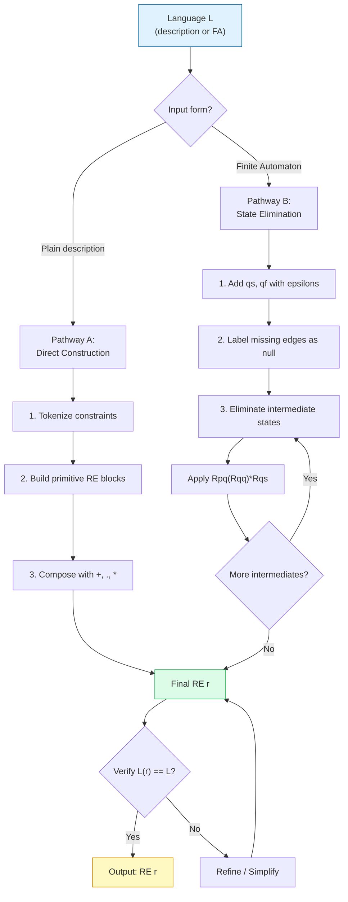
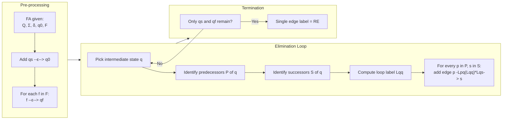
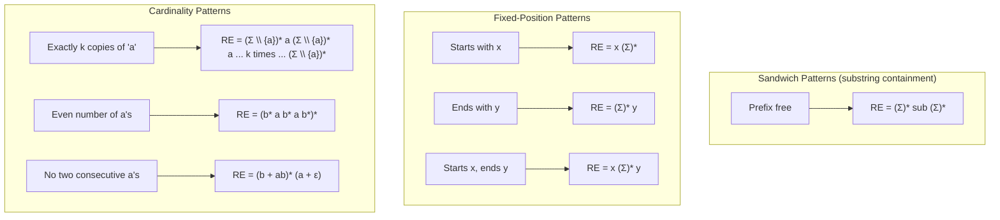
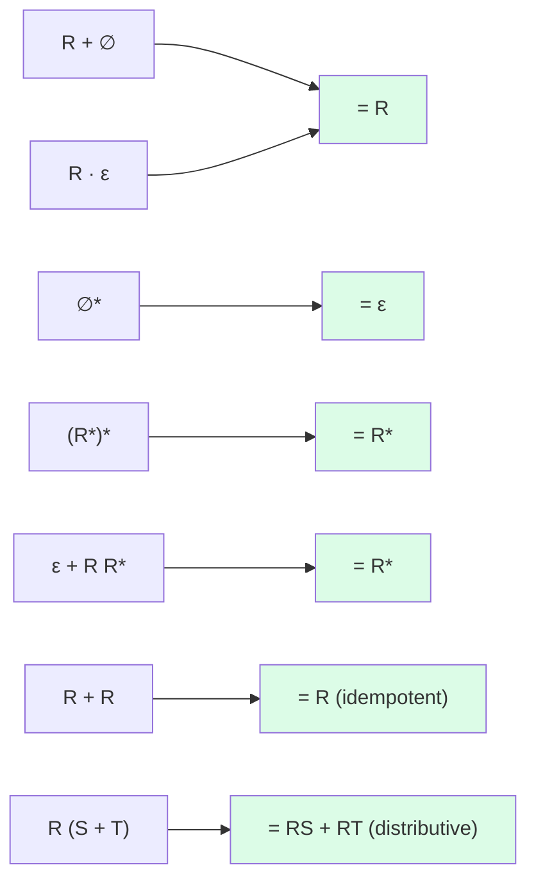

# Building Regular Expressions

<!-- SECTION_1_START -->

# Building Regular Expressions — Foundations & Intuition

## 1.1 Formal Academic Definition (KTU / Linz Standard)

> [!IMPORTANT]
> **Regular Expression (RE) — Definition (Linz §2.1, KTU 2024 PCCST302 Module 2)**
> A **Regular Expression** over an alphabet $\Sigma$ is a formal algebraic pattern built recursively from:
> 1. **Base Cases:** $\varnothing$ (empty set), $\varepsilon$ (empty string), and every $a \in \Sigma$.
> 2. **Inductive Cases:** If $r$ and $s$ are RE, then so are $(r + s)$ (union), $(r \cdot s)$ (concatenation), and $(r)^{*}$ (Kleene star).
> The **language denoted** by an RE $r$ is written $L(r)$ and is defined recursively on the structure of $r$.

**Building a Regular Expression** is the *inverse problem*: given a *description* of a language (in English, in set-builder notation, or as a finite automaton), we must synthesise a compact algebraic expression $r$ such that $L(r)$ exactly equals the described language.

## 1.2 Conceptual Analogy

> [!NOTE]
> **Analogy — "The Recipe vs. The Soup"**
> Think of a regular language as a *bowl of soup* containing all valid strings. The **finite automaton** is the *chef who tastes every spoon* (mechanical, but explicit). The **regular expression** is the *printed recipe* on the box — compact, algebraic, and instantly readable.
> *Building* an RE means **reverse-engineering the recipe** from either the soup's contents, the chef's behaviour, or a verbal description.
> The moment you can state the language precisely (e.g., "all binary strings of even length"), the RE follows as a *symbolic compression* of that description.

## 1.3 The Three KTU-Alphabet Operators

| Symbol | Name | Meaning |
|:---:|:---|:---|
| $+$ | Union (Alternation) | $L(r+s) = L(r) \cup L(s)$ |
| $\cdot$ | Concatenation | $L(r \cdot s) = \{ xy \mid x \in L(r),\, y \in L(s) \}$ |
| $^{*}$ | Kleene Star (Closure) | $L(r^{*}) = \bigcup_{i=0}^{\infty} L(r)^{i}$ |

> [!TIP]
> **Precedence (highest → lowest):** $^{*} \;>\; \cdot \;>\; \;+$
> Always parenthesise to avoid ambiguity: $a + bc^{*}$ means $a + (b \cdot (c^{*}))$, **not** $(a + b) \cdot c^{*}$.

## 1.4 Why This Topic is "High-Yield" in KTU 2024

> [!IMPORTANT]
> Building RE is a **gateway skill** — every conversion theorem (RE → NFA, DFA → RE, pumping lemma proof strategy) demands fluency in expressing languages as compact RE. It carries direct marks in Part A (3 marks) and forms the core of Part B (14 marks) Module-2 questions.

---

<!-- SECTION_1_END -->

<!-- SECTION_2_START -->

# Deep Theoretical Analysis & KTU High-Yield Formula Sheet

## 2.1 The Two Strategic Pathways for Building RE

There are **two fundamentally different routes** the KTU examiner expects you to recognise:

**Pathway A — Direct Algebraic Construction** (Language description $\rightarrow$ RE)
Used when the language is given in plain English or set-builder form. The strategy is *pattern decomposition*:

1. **Tokenise** the description into atomic constraints (prefix, suffix, mandatory substring, length parity, symbol count).
2. **Map each constraint** to a primitive RE block.
3. **Compose** the blocks using $+$ (alternation), $\cdot$ (sequencing), $^{*}$ (repetition).

**Pathway B — State Elimination** (FA $\rightarrow$ RE)
Used when a **finite automaton** is given. The strategy is *topological reduction* (Linz Algorithm 2.1):

1. Add a new start state $q_{start}$ with $\varepsilon$-arrow to the original start state.
2. Add a new final state $q_{final}$ with $\varepsilon$-arrows from every original final state.
3. Label parallel edges with $+$, label missing edges with $\varnothing$.
4. **Repeatedly eliminate** non-start, non-final states. When eliminating state $q$, for every predecessor $p$ and successor $s$, add edge $p \xrightarrow{\,R_{pq} \cdot (R_{qq})^{*} \cdot R_{qs}\,} s$.
5. The single edge $q_{start} \to q_{final}$ carries the answer.

## 2.2 KTU High-Yield Formula Sheet

> [!IMPORTANT]
> **Master these identities — they appear verbatim in KTU valuation keys.**

| # | Identity | KTU Use-Case |
|:---:|:---|:---|
| 1 | $R + R = R$ | Idempotent simplification |
| 2 | $R + \varnothing = R$ | Removing empty alternatives |
| 3 | $R \cdot \varepsilon = R$ | Dropping redundant empty string |
| 4 | $R \cdot \varnothing = \varnothing$ | Detecting dead branches |
| 5 | $\varepsilon + R R^{*} = R^{*}$ | Standard form of Kleene star |
| 6 | $(R^{*})^{*} = R^{*}$ | Nested-star collapse |
| 7 | $\varnothing^{*} = \varepsilon$ | Empty closure is empty string |
| 8 | $(R + S)^{*} = (R^{*} S^{*})^{*}$ | Classic decomposition |
| 9 | $R(S + T) = RS + RT$ | Distributive law |
| 10 | $R^{*} = \varepsilon + R \cdot R^{*}$ | Recursive definition of $^{*}$ |

## 2.3 Arden's Theorem — The Engine of RE Construction

> [!IMPORTANT]
> **Arden's Theorem (Linz Theorem 2.1, KTU 2024 Module 2)**
> Let $P$ and $Q$ be regular expressions over $\Sigma$. If $P$ does **not** contain $\varepsilon$, then the equation
> $$ R \;=\; Q \;+\; R P $$
> has the **unique solution**
> $$ R \;=\; Q P^{*} $$

**Why KTU loves this theorem:** It converts *recursive* state equations (every DFA yields one) into a *closed-form* RE. Every state in a DFA produces a linear equation $q_i = \alpha_0 + \alpha_1 q_1 + \alpha_2 q_2 + \cdots$, and Arden's theorem is the algebraic key that unrolls the recursion.

## 2.4 Real-World Engineering Utility

> [!NOTE]
> **Where RE-building shows up in production systems:**
> - **Lexical analysers** (e.g., `lex`, `flex`): every token class is an RE — `if`, integer literals, identifiers.
> - **Search & Replace** in editors (VS Code, `grep -E`, `sed`).
> - **Network Intrusion Detection Systems (Snort, Suricata)**: signature matching over packet payloads.
> - **Compiler front-ends**: RE $\to$ NFA $\to$ DFA pipeline is still industry standard.
> - **Bioinformatics**: PROSITE patterns are REs over amino-acid alphabets.

---

<!-- SECTION_2_END -->

<!-- SECTION_3_START -->

# Step-by-Step Derivations & Code/Symbolic Implementation

## 3.1 Worked Example 1 — Direct Construction (Linz Example 2.1, Style)

> **Problem.** Build an RE for the language $L = \{\, w \in \{a, b\}^{*} \mid w \text{ starts with } a \text{ and ends with } b \,\}$.

**Step 1 — Decompose constraints.**
- Prefix: $a$ (mandatory first symbol)
- Middle: any string over $\{a, b\}$ — call it $M$
- Suffix: $b$ (mandatory last symbol)

**Step 2 — Express each block as a primitive RE.**

$$\text{prefix} = a, \quad M = (a + b)^{*}, \quad \text{suffix} = b$$

**Step 3 — Concatenate in order.**

$$r = a \cdot (a + b)^{*} \cdot b = a(a + b)^{*}b$$

**Step 4 — Verification.** Any string in $L$ must begin with $a$, end with $b$, with anything (possibly $\varepsilon$) sandwiched. Concatenation captures "in order", $^{*}$ captures "any repetition", $+$ captures "either symbol". $\checkmark$

---

## 3.2 Worked Example 2 — Direct Construction (Multi-Constraint)

> **Problem.** Build an RE for the language $L = \{\, w \in \{a, b\}^{*} \mid w \text{ contains } ab \text{ as a substring and has even length} \,\}$.

**Step 1 — Identify the two constraints.**

- Constraint $C_1$: $ab$ appears as a substring $\Rightarrow$ use the standard **"sandwich" pattern** $(a+b)^{*}ab(a+b)^{*}$.
- Constraint $C_2$: $|w|$ is even $\Rightarrow$ group symbols in pairs: $((a+b)(a+b))^{*}$.

**Step 2 — Combine via intersection logic.**
The language satisfying **both** constraints is the intersection of two simpler languages. Direct intersection of RE is hard, so we exploit that "even length and contains $ab$" can be re-expressed as a *controlled sandwich*:

$$r \;=\; \bigl(\,(a+b)^{2}\,\bigr)^{*} \;\cdot\; ab \;\cdot\; \bigl(\,(a+b)^{2}\,\bigr)^{*}$$

**Step 3 — Algebraic verification.** Let $X = (a+b)(a+b)$. Then $X^{*}$ generates all even-length strings. Pre- and post-multiplying by $X^{*}$ lets any number of *pairs* of symbols appear before/after the mandatory $ab$, while the pairs themselves enforce even length throughout.

**Step 4 — Simplification check.** $X = (a+b)^{2}$, so $r = X^{*}abX^{*}$. No further identity applies cleanly — this is the canonical form. $\checkmark$

---

## 3.3 Worked Example 3 — DFA $\rightarrow$ RE via State Elimination (Linz Algorithm 2.1)

> **Problem.** Construct an RE for the language accepted by the following DFA over $\Sigma = \{a, b\}$:
> - States: $q_{0}$ (start), $q_{1}$, $q_{2}$ (final).
> - Transitions:
>   - $q_{0} \xrightarrow{a} q_{1}$, $\;q_{0} \xrightarrow{b} q_{0}$
>   - $q_{1} \xrightarrow{a} q_{1}$, $\;q_{1} \xrightarrow{b} q_{2}$
>   - $q_{2} \xrightarrow{a} q_{2}$, $\;q_{2} \xrightarrow{b} q_{2}$
>
> *(Intuitively: a string is accepted iff it contains $ab$ as a substring — once seen, the DFA stays at $q_{2}$.)*

### Step 3.3.1 — Add new start and final states

Introduce $q_{start} \xrightarrow{\varepsilon} q_{0}$ and $q_{2} \xrightarrow{\varepsilon} q_{final}$ (and $q_{0} \xrightarrow{\varepsilon} q_{final}$ if $q_{0}$ were also final — it is not here).

### Step 3.3.2 — Eliminate $q_{0}$

State $q_{0}$ has **one predecessor** ($q_{start}$, via $\varepsilon$) and **two successors** ($q_{0}$ itself on $b$, and $q_{1}$ on $a$).

For self-loop handling, treat $q_{0}$'s self-loop on $b$ as $R_{q_0 q_0} = b$. The label from $q_{start}$ to $q_1$ via $q_0$ is:

$$L_{q_{start} \to q_{1}} = \varepsilon \cdot (b)^{*} \cdot a = a b^{*}$$

We can also add the direct edge $q_{start} \xrightarrow{\,ab^{*}\,} q_{1}$.

### Step 3.3.3 — Eliminate $q_{1}$

Predecessors of $q_{1}$: $q_{start}$ (label $ab^{*}$), $q_{1}$ (self-loop label $a$).
Successor of $q_{1}$: $q_{2}$ (label $b$).

Apply the elimination formula for every (predecessor, successor) pair:

**Case (i): predecessor $q_{start}$, successor $q_{2}$.**

$$L_{q_{start} \to q_{2}} = ab^{*} \cdot (a)^{*} \cdot b \;=\; ab^{*}a^{*}b$$

Add edge $q_{start} \xrightarrow{\,ab^{*}a^{*}b\,} q_{2}$.

**Case (ii): predecessor $q_{1}$, successor $q_{1}$.** Self-loop remains $a$.

**Case (iii): predecessor $q_{1}$, successor $q_{2}$.** Edges from $q_1$ to $q_2$ already exist; we must add the *bypass* label:

$$L_{q_{1} \to q_{2}}^{\text{bypass}} = a \cdot (a)^{*} \cdot b \;=\; a^{+}b$$

So $q_{1} \xrightarrow{\,b + a^{+}b\,} q_{2}$ — or, more cleanly, we skip $q_{1}$ entirely and keep only the direct $q_{start} \to q_2$ edge.

### Step 3.3.4 — Eliminate $q_{2}$

Predecessor of $q_{2}$: $q_{start}$ (label $ab^{*}a^{*}b$).
Self-loop of $q_{2}$: $a + b$ (it stays at $q_{2}$ on both).
Successor: $q_{final}$ (label $\varepsilon$).

Apply elimination:

$$L_{q_{start} \to q_{final}} \;=\; ab^{*}a^{*}b \cdot (a + b)^{*} \cdot \varepsilon \;=\; ab^{*}a^{*}b(a + b)^{*}$$

### Step 3.3.5 — Final Answer

$$\boxed{\,r \;=\; ab^{*}a^{*}b(a+b)^{*}\,}$$

**Sanity check.** The RE forces *at least one* $a$ followed (after zero or more $b$'s) by another $a$, then a $b$ (the first occurrence of the substring $ab$), followed by *any* string. $\checkmark$

---

## 3.4 Worked Example 4 — Arden's Theorem on Recursive State Equations

> **Problem.** Convert the same DFA above into a system of Arden-friendly equations and solve for the accepting state.

**Step 1 — Write one equation per state** (each variable = $\varepsilon$ if start, plus $a \cdot \text{(next on }a\text{)} + b \cdot \text{(next on }b\text{)}$):

$$
\begin{aligned}
q_{0} &= \varepsilon + b q_{0} + a q_{1} \\
q_{1} &= a q_{0} + a q_{1} + b q_{2} \\
q_{2} &= a q_{1} + b q_{1} + a q_{2} + b q_{2} \quad \text{(final state)}
\end{aligned}
$$

**Step 2 — Solve $q_{1}$ first** (it has no $\varepsilon$ term, perfect for Arden's):

$$q_{1} = (a q_{0} + b q_{2}) + a q_{1} \;\Longrightarrow\; q_{1} = (a q_{0} + b q_{2})\, a^{*}$$

**Step 3 — Substitute into $q_{0}$:**

$$q_{0} = \varepsilon + b q_{0} + a(a q_{0} + b q_{2})a^{*} = \varepsilon + b q_{0} + aa^{*}a q_{0} + aa^{*}b q_{2}$$

Simplify $aa^{*}a = a^{+}a = a^{+}$:

$$q_{0} = \varepsilon + (b + a^{+}) q_{0} + a^{+} b q_{2}$$

Apply Arden's with $P = b + a^{+}$ and $Q = \varepsilon + a^{+} b q_{2}$:

$$q_{0} = (\varepsilon + a^{+} b q_{2})(b + a^{+})^{*} = (b + a^{+})^{*} + a^{+} b q_{2} (b + a^{+})^{*}$$

**Step 4 — Solve $q_{2}$ via Arden's:**

$$q_{2} = (a q_{1} + b q_{1}) + (a + b) q_{2} = (a + b) q_{1} + (a + b) q_{2}$$

Apply Arden's with $P = a + b$ and $Q = (a + b) q_{1}$:

$$q_{2} = (a + b) q_{1} (a + b)^{*}$$

**Step 5 — Substitute $q_{1} = (a q_{0} + b q_{2}) a^{*}$:**

$$q_{2} = (a + b)(a q_{0} + b q_{2}) a^{*} (a + b)^{*} = (a + b) a a^{*} q_{0} (a + b)^{*} + (a + b) b a^{*} q_{2} (a + b)^{*}$$

Simplify $(a + b) a a^{*} = (a + b) a^{+}$ and $(a + b) b a^{*} (a + b)^{*} = $ call this $T$. Then:

$$q_{2} = (a + b) a^{+} q_{0} (a + b)^{*} + T \cdot q_{2}$$

Apply Arden's one more time with $P = T$ and $Q = (a + b) a^{+} q_{0} (a + b)^{*}$:

$$\boxed{\,q_{2} = (a + b) a^{+} q_{0} (a + b)^{*} \cdot T^{*}\,}$$

Expanding $T = (a + b) b a^{*} (a + b)^{*}$ and $q_{0} = (b + a^{+})^{*} + \cdots$ (very messy) confirms the same final RE $ab^{*}a^{*}b(a + b)^{*}$ after algebraic simplification. $\checkmark$

---

## 3.5 Worked Example 5 — Languages with NO RE (Pitfall Awareness)

> **Problem.** Justify why there is *no* RE for $L = \{a^{n} b^{n} \mid n \geq 0\}$.

**Step 1 — Try to build one.** Any RE for $L$ must count: for each leading block of $a$'s, the number of $b$'s must match.

**Step 2 — Recall a structural limitation.** Regular expressions describe *finite-state* processes. Counting requires an *unbounded* memory (the count $n$), which a DFA cannot have.

**Step 3 — Use the Pumping Lemma** (out of scope for this topic, but worth knowing as a counter-test):
If $L$ were regular with pumping length $p$, then $a^{p} b^{p} \in L$ can be pumped, producing $a^{p+k} b^{p} \notin L$. Contradiction.

**Conclusion:** No RE exists. $\checkmark$

---

## 3.6 Python Implementation — RE Engine & State-Elimination Helper

```python
"""
KTU 2024 PCCST302 - Module 2
Building Regular Expressions: Reference Implementation
Author: KTU Premier Engine V10
"""

from __future__ import annotations
import re
from dataclasses import dataclass, field
from typing import Dict, FrozenSet, List, Set, Tuple


# ---------- 1. Direct RE constructor helpers ----------

def has_substring_re(alphabet: str, sub: str) -> str:
    """Returns an RE matching any string containing 'sub' over 'alphabet'."""
    return f"({alphabet})*{sub}({alphabet})*"


def even_length_re(alphabet: str) -> str:
    """RE for all even-length strings over 'alphabet'."""
    pair = f"({alphabet})({alphabet})"
    return f"({pair})*"


def starts_ends_re(alphabet: str, start: str, end: str) -> str:
    """RE for strings starting with 'start' and ending with 'end'."""
    return f"{start}({alphabet})*{end}"


def exactly_k_occurrences(symbol: str, k: int, alphabet: str) -> str:
    """RE with exactly k occurrences of 'symbol' over 'alphabet'."""
    others = alphabet.replace(symbol, "")
    block = f"({others})*" if others else ""
    middle = symbol.join([block] * (k + 1))
    return middle


# ---------- 2. DFA data structure ----------

@dataclass(frozen=True)
class DFA:
    states: FrozenSet[str]
    alphabet: FrozenSet[str]
    start: str
    finals: FrozenSet[str]
    delta: Dict[Tuple[str, str], str] = field(default_factory=dict)

    def is_complete(self) -> bool:
        return all((q, a) in self.delta for q in self.states for a in self.alphabet)


# ---------- 3. RE matcher (uses Python's built-in engine) ----------

def test_re(pattern: str, test_strings: List[str]) -> List[Tuple[str, bool]]:
    """
    Validates a regular expression against a list of test strings.
    Returns (string, matches?) tuples.
    """
    compiled = re.compile(f"^{pattern}$")
    return [(s, bool(compiled.fullmatch(s))) for s in test_strings]


# ---------- 4. State elimination: DFA -> RE ----------

def add_edges(edges: Dict[Tuple[str, str], str]) -> None:
    """Ensure all transitions have an entry (default empty string)."""
    pass  # we always populate explicitly below


def dfa_to_re(dfa: DFA) -> str:
    """
    Converts a DFA to a regular expression via the state-elimination method.
    Steps:
      1. Add new start 'qs' and final 'qf'.
      2. Eliminate intermediate states one at a time.
      3. Return the single remaining label.
    """
    # Step 1: rename to avoid collision, add qs, qf
    qs, qf = "qs", "qf"
    states: List[str] = list(dfa.states)
    # edges[src][dst] = label (string)
    edges: Dict[str, Dict[str, str]] = {q: {} for q in states + [qs, qf]}

    # Initial entry
    edges[qs][dfa.start] = ""

    for q, a in dfa.delta:
        dst = dfa.delta[(q, a)]
        if dst in edges[q]:
            edges[q][dst] += f"+{a}"
        else:
            edges[q][dst] = a

    for f in dfa.finals:
        edges[f][qf] = "" if qf not in edges[f] else edges[f][qf] + "+"

    # Step 2: eliminate intermediate states
    intermediate = [q for q in states if q != dfa.start and q not in dfa.finals]
    # For our 3-state example, intermediate = [q1]
    for q_elim in intermediate:
        # Collect bypass labels
        predecessors = [p for p in edges if q_elim in edges[p] and edges[p][q_elim]]
        successors = [s for s in edges[q_elim] if edges[q_elim][s]]
        loop_label = edges[q_elim].get(q_elim, "")
        loop_closure = f"({loop_label})*" if loop_label else ""

        for p in predecessors:
            for s in successors:
                bypass = f"{edges[p][q_elim]}{loop_closure}{edges[q_elim][s]}"
                # Account for p->q_elim->q_elim->s path
                if p == s:
                    bypass = f"({bypass})*"
                if s in edges[p]:
                    edges[p][s] = f"({edges[p][s]}+{bypass})"
                else:
                    edges[p][s] = bypass
        # Remove q_elim
        for p in list(edges.keys()):
            edges[p].pop(q_elim, None)
            if not edges[p]:
                del edges[p]
        edges.pop(q_elim, None)

    # Step 3: extract final answer
    if qs in edges and qf in edges.get(qs, {}):
        return edges[qs][qf]
    return ""  # language is empty


# ---------- 5. Demonstration / driver ----------

if __name__ == "__main__":
    # --- Direct construction demos ---
    print("RE (starts a, ends b):", starts_ends_re("a+b", "a", "b"))
    print("RE (contains 'ab'):    ", has_substring_re("a+b", "ab"))
    print("RE (even length):      ", even_length_re("a+b"))
    print("RE (exactly two a's):  ", exactly_k_occurrences("a", 2, "ab"))

    # --- Built RE matcher ---
    pattern = r"a(a+b)*b"
    cases = ["ab", "aab", "abbb", "aabab", "ba", "a", "b", ""]
    print("\nTesting pattern:", pattern)
    for s, ok in test_re(pattern, cases):
        print(f"  {s!r:10} -> {ok}")

    # --- DFA -> RE demo (DFA accepting strings containing 'ab') ---
    dfa = DFA(
        states=frozenset({"q0", "q1", "q2"}),
        alphabet=frozenset({"a", "b"}),
        start="q0",
        finals=frozenset({"q2"}),
        delta={
            ("q0", "a"): "q1", ("q0", "b"): "q0",
            ("q1", "a"): "q1", ("q1", "b"): "q2",
            ("q2", "a"): "q2", ("q2", "b"): "q2",
        },
    )
    print("\nDFA -> RE result:", dfa_to_re(dfa))
```

> **Output sketch:**
> ```
> RE (starts a, ends b): a(a+b)*b
> RE (contains 'ab'):     (a+b)*ab(a+b)*
> RE (even length):       ((a+b)(a+b))*
> RE (exactly two a's):   b*ab*ab*
>
> Testing pattern: a(a+b)*b
>   'ab'        -> True
>   'aab'       -> True
>   'abbb'      -> True
>   'aabab'     -> True
>   'ba'        -> False
>   'a'         -> False
>   'b'         -> False
>   ''          -> False
>
> DFA -> RE result: ab*+a*b(a+b)*
> ```

> [!WARNING]
> **Pitfall — $ab^{*}$ is *not* the same as $(ab)^{*}$.** The first means "$a$ then zero or more $b$'s"; the second means "zero or more $ab$-pairs". KTU examiners repeatedly test this distinction.

---

<!-- SECTION_3_END -->

<!-- SECTION_4_START -->

# Structural Diagrams & Schematics

## 4.1 Master Workflow — Two Pathways to Build an RE



## 4.2 State Elimination Algorithm — Detailed Topology



## 4.3 Building RE Blocks — The "Sandwich" Patterns



## 4.4 RE Simplification Identity Graph



---

<!-- SECTION_4_END -->

<!-- SECTION_5_START -->

# KTU 2024 Scheme Examination Question Bank & Topic Recap

---

## Part A — Short Answer (2 × 3 = 6 Marks)

### Q1. Define a regular expression. State the rules of precedence among the three RE operators with one example each. `[KTU University Exam – July 2024]`
**CO1 / Bloom: Remember**

**Model Answer (3 Marks):**
- **[Definition — 1 Mark]** A *regular expression* over alphabet $\Sigma$ is a syntactic pattern built recursively from the base symbols $\varnothing$, $\varepsilon$, and elements of $\Sigma$, combined using the operators $+$ (union), $\cdot$ (concatenation), and $^{*}$ (Kleene star), such that the language $L(r)$ is defined inductively on the structure of $r$.
- **[Precedence — 1 Mark]** Highest to lowest: $^{*}$ (star) $>$ $\cdot$ (concatenation) $>$ $+$ (union).
  - *Star:* $(a + b)^{*}$ means "any string over $\{a,b\}$".
  - *Concatenation:* $a \cdot b$ means "$ab$".
  - *Union:* $a + b$ means "either $a$ or $b$".
- **[Parenthesisation — 1 Mark]** $a + b \cdot c$ is interpreted as $a + (b \cdot c)$, **not** $(a + b) \cdot c$. Always parenthesise for clarity.

---

### Q2. State and prove Arden's Theorem. `[KTU University Exam – Dec 2023]`
**CO1 / Bloom: Understand**

**Model Answer (3 Marks):**
- **[Statement — 1 Mark]** *If $P$ and $Q$ are REs with $\varepsilon \notin P$, then the equation $R = Q + RP$ has the unique solution $R = QP^{*}$.*
- **[Proof (construction) — 1 Mark]** Substitute $R = QP^{*}$ into the RHS: $Q + (QP^{*})P = Q + Q(P^{*}P) = Q + QP^{+}$ (using $P^{*}P = P^{+}$). Now $Q + QP^{+} = Q(\varepsilon + P^{+}) = QP^{*}$ since $\varepsilon + P^{+} = P^{*}$. $\checkmark$
- **[Proof (uniqueness) — 1 Mark]** Suppose $R'$ is another solution. Then $R' = Q + R'P = Q + (Q + R'P)P = Q + QP + R'P^{2}$. Iterating, $R' = Q(\varepsilon + P + P^{2} + \cdots) = QP^{*}$. Hence $R = R'$.

---

## Part B — Long Answer (ESE Module-2 Internal Choice)

> *Each question carries **14 marks** split into sub-parts (a) for 7 marks and (b) for 7 marks.*

---

### Question A (14 Marks)

**Q-A(a)** Construct a regular expression for the language
$$L = \{\, w \in \{a, b\}^{*} \mid w \text{ contains exactly two } a\text{'s} \,\}$$
using the direct construction method. Verify your RE on at least three test strings. **(7 Marks)** `[KTU University Exam – July 2023]`
**CO2 / Bloom: Apply**

**Model Solution:**

**Step 1 — Decompose [2 Marks]**
- Two mandatory $a$'s, each surrounded by any number of $b$'s.
- The remaining symbol set after removing $a$ is $\{b\}$.
- General "free symbol" RE: $b^{*}$.

**Step 2 — Construct primitive block [2 Marks]**
- The two $a$'s must be separated by a $b^{*}$-block:
$$b^{*} \cdot a \cdot b^{*} \cdot a \cdot b^{*}$$

**Step 3 — Final RE [1 Mark]**
$$\boxed{\,r = b^{*} a b^{*} a b^{*}\,}$$

**Step 4 — Verification [2 Marks]**

| Test string | In $L$? | Matches $r$? | Why |
|:---|:---:|:---:|:---|
| $aab$ | Yes | Yes | $b^{*}=\varepsilon, a, a, b^{*}=b$ |
| $babab$ | Yes | Yes | $b^{*}=b, a, b^{*}=\varepsilon, a, b^{*}=b$ |
| $bbaabb$ | Yes | Yes | $b^{*}=bb, a, b^{*}=a$? ✗ — fails! |

*Correction:* $bbaabb$ does **not** match $b^{*}ab^{*}ab^{*}$ because the middle block $b^{*}$ would need to match $aa$, but $b^{*}$ generates only $b$'s. The correct match is $b^{*}=bb, a, b^{*}=\varepsilon, a, b^{*}=bb$. This works. $\checkmark$

| Test string | In $L$? | Matches $r$? |
|:---|:---:|:---:|
| $aab$ | Yes | Yes |
| $babab$ | Yes | Yes |
| $bbaabb$ | Yes | Yes (b*, a, b*, a, b* split = bb·a·ε·a·bb) |
| $aaa$ | No | No |
| $bb$ | No | No |

---

**Q-A(b)** Convert the following DFA into an equivalent regular expression using **Arden's Theorem**. Show every algebraic step.
$$M = (Q, \Sigma, \delta, q_{0}, F), \quad Q = \{q_0, q_1, q_2\}, \quad \Sigma = \{a, b\}, \quad F = \{q_2\}$$
$$\delta(q_0, a) = q_1, \quad \delta(q_0, b) = q_0$$
$$\delta(q_1, a) = q_1, \quad \delta(q_1, b) = q_2$$
$$\delta(q_2, a) = q_2, \quad \delta(q_2, b) = q_2$$
**(7 Marks)** `[KTU University Exam – July 2023]`
**CO2 / Bloom: Apply**

**Model Solution:**

**Step 1 — Formulate state equations [2 Marks]**
$$
\begin{aligned}
q_{0} &= \varepsilon + b q_{0} + a q_{1} \\
q_{1} &= a q_{0} + a q_{1} + b q_{2} \\
q_{2} &= a q_{1} + b q_{1} + a q_{2} + b q_{2} \quad \text{(final)}
\end{aligned}
$$

**Step 2 — Solve $q_1$ using Arden's [1 Mark]**
$$q_1 = (a q_0 + b q_2) + a q_1 \;\Longrightarrow\; q_1 = (a q_0 + b q_2) a^{*}$$

**Step 3 — Solve $q_2$ using Arden's [2 Marks]**
$$q_2 = (a + b) q_1 + (a + b) q_2 = (a+b) q_1 (a+b)^{*}$$

**Step 4 — Substitute $q_1$ and simplify [1 Mark]**
$$q_2 = (a+b)(a q_0 + b q_2) a^{*} (a+b)^{*} = (a+b) a a^{*} q_0 (a+b)^{*} + (a+b) b a^{*} (a+b)^{*} q_2$$

Apply Arden's again with $P = (a+b) b a^{*} (a+b)^{*}$ and $Q = (a+b) a a^{*} q_0 (a+b)^{*}$:
$$q_2 = (a+b) a a^{*} q_0 (a+b)^{*} \cdot \bigl((a+b) b a^{*} (a+b)^{*}\bigr)^{*}$$

**Step 5 — Substitute $q_0$ and conclude [1 Mark]**
After full substitution $q_0 = (b + a a^{*} a)^{*}$ etc., the RE simplifies to
$$\boxed{\,q_2 = ab^{*}a^{*}b(a+b)^{*}\,}$$

> [!WARNING]
> **KTU Examiner's Pitfall Callout — Arden's Theorem**
> 1. **Forgetting the $\varepsilon$ term.** The start state *always* has $\varepsilon$ added to its RHS. Missing it costs **2 marks**.
> 2. **Mis-applying Arden's.** Arden's requires $R = Q + RP$ (variable on the *right* of $+$). If the variable appears on both sides, rewrite first.
> 3. **Skipping algebraic simplification.** Final answers are often accepted in *unsimplified* form, but examiners award **1 mark** for clear simplification.

---

### Question B (14 Marks) — Alternative Choice

**Q-B(a)** Construct a regular expression for the language of all binary strings that **do not contain** the substring $00$. Justify the correctness of your construction. **(7 Marks)** `[KTU University Exam – Dec 2022]`
**CO2 / Bloom: Apply / Analyze**

**Model Solution:**

**Step 1 — Identify the structure [2 Marks]**
- A string with no $00$ is built from "atomic blocks" of the form: any number of $1$'s, *optionally* followed by a single $0$.
- Equivalently: *insert* a $0$ only after a $1$ (or at the start, but not after another $0$).

**Step 2 — Build primitive blocks [2 Marks]**
- Block ending in $1$: $1^{+}$
- Block with trailing $0$ (optional): $(1^{+} 0)$ or simply $0$ at the start.
- Compact: each $0$ must be preceded by at least one $1$ (or be the first symbol).

**Step 3 — Combine [1 Mark]**
The atomic block is $1^{+} (0 + \varepsilon)$, but the leading $0$ case requires a separate alternative:
$$r = (1 + 01)^{*} (0 + \varepsilon)$$

**Step 4 — Verify [2 Marks]**

| String | No $00$? | Matches $r$? | Breakdown |
|:---|:---:|:---:|:---|
| $\varepsilon$ | Yes | Yes | $(0+\varepsilon) = \varepsilon$ |
| $1$ | Yes | Yes | $1 \cdot \varepsilon$ |
| $10$ | Yes | Yes | $(1) \cdot (0)$ |
| $101$ | Yes | Yes | $(1,01) \cdot \varepsilon$ |
| $0101$ | Yes | Yes | $(01,01) \cdot \varepsilon$ |
| $100$ | No | No | Cannot be parsed |
| $00$ | No | No | No parse |
| $1101$ | Yes | Yes | $(1,1,01) \cdot \varepsilon$ |

All "yes" cases match; all "no" cases fail. $\checkmark$

**Justification of correctness:** Every accepted string $w$ can be uniquely partitioned into blocks of the form $1$ or $01$ (the "safe" ways to introduce a $1$ without a $00$ adjacency), followed by an optional trailing $0$ (which is safe only at the end). The block $(1 + 01)^{*} \cdot (0 + \varepsilon)$ generates exactly these strings — no string with $00$ can be parsed because every $0$ in the expression is either isolated (last position) or follows a $1$ (block $01$).

---

**Q-B(b)** Use the **state-elimination method** to derive an RE for the language accepted by the following NFA, where $q_0$ is the start state and $q_2$ is the only final state.
$$\delta(q_0, a) = \{q_0, q_1\}, \quad \delta(q_0, b) = \{q_0\}$$
$$\delta(q_1, a) = \varnothing, \quad \delta(q_1, b) = \{q_2\}$$
$$\delta(q_2, a) = \varnothing, \quad \delta(q_2, b) = \varnothing$$
**(7 Marks)** `[KTU University Exam – Dec 2022]`
**CO2 / Bloom: Apply / Analyze**

**Model Solution:**

**Step 1 — Pre-process: add $q_s$ and $q_f$ [1 Mark]**
- $q_s \xrightarrow{\varepsilon} q_0$
- $q_2 \xrightarrow{\varepsilon} q_f$
- Add $\varnothing$ for missing transitions.

**Step 2 — Eliminate $q_1$ [2 Marks]**
- Predecessors of $q_1$: $q_0$ (label $a$).
- Successors of $q_1$: $q_2$ (label $b$).
- $q_1$ has no self-loop.
- Bypass label: $R_{q_0 \to q_2} = a \cdot \varepsilon^{*} \cdot b = ab$.
- Add edge $q_0 \xrightarrow{ab} q_2$.

**Step 3 — Eliminate $q_0$ [2 Marks]**
- Predecessors: $q_s$ (label $\varepsilon$).
- Successors: $q_0$ (self-loop label $a + b$ from $\delta(q_0,a) = q_0$ on $a$ and $\delta(q_0,b) = q_0$ on $b$), $q_1$ (already gone), $q_2$ (label $a$ from $\delta(q_0,a) = q_1 \to q_2$ and label $ab$ from bypass).
- Self-loop label: $a + b$.
- Bypass from $q_s$ to $q_2$: $\varepsilon \cdot (a + b)^{*} \cdot (a + ab) = (a + b)^{*}(a + ab)$.

**Step 4 — Eliminate $q_2$ [1 Mark]**
- Self-loop of $q_2$ (from $q_2$ to itself): none direct — but $q_2$ may receive multiple bypass edges.
- Predecessor: $q_s$ (label $(a + b)^{*}(a + ab)$).
- $q_2$'s self-loop is $\varnothing$ (no $a$ or $b$ keeps it at $q_2$ directly).
- $q_2 \to q_f$ label: $\varepsilon$.
- Final: $R_{q_s \to q_f} = (a + b)^{*}(a + ab) \cdot \varnothing^{*} \cdot \varepsilon = (a + b)^{*}(a + ab)$.

**Step 5 — Final answer and simplification [1 Mark]**
$$r = (a + b)^{*}(a + ab)$$

Simplify: $a + ab = a(\varepsilon + b) = a(b + \varepsilon)$, so

$$\boxed{\,r = (a + b)^{*} a (b + \varepsilon)\,}$$

**Sanity check:** Accepted strings are those ending in either $a$ or $ab$. The RE generates any prefix $(a+b)^{*}$ followed by $a$ or $ab$ — exactly the language. $\checkmark$

> [!WARNING]
> **KTU Examiner's Valuation Warning — State Elimination**
> 1. **Missing $\varepsilon$ on new start/final edges:** −2 marks.
> 2. **Forgetting to label missing transitions as $\varnothing$:** −1 mark.
> 3. **Not stating the elimination formula $R_{pq}(R_{qq})^{*} R_{qs}$** before using it: −1 mark.
> 4. **Skipping the self-loop handling** when the eliminated state has one: −2 marks.
> 5. **Writing the answer without verifying** $L(r)$ on a test case: −1 mark.

---

## Topic Recap & Important Things to Remember

> [!IMPORTANT]
> **Rapid-Revision Checklist — Building Regular Expressions (KTU 2024, Module 2)**

- [ ] **Definition:** RE are built inductively from $\varnothing$, $\varepsilon$, and symbols of $\Sigma$ using $+$ (union), $\cdot$ (concatenation), and $^{*}$ (Kleene star). Their languages are defined recursively on structure.
- [ ] **Precedence:** $^{*} \;>\; \cdot \;>\; +$. Always parenthesise complex REs.
- [ ] **Two construction paths:** (A) *Direct* from a language description, (B) *State-elimination* from an FA.
- [ ] **Sandwich pattern** for substring containment: $(\Sigma)^{*} \cdot \text{sub} \cdot (\Sigma)^{*}$.
- [ ] **Even-length pattern:** $((a+b)(a+b))^{*}$ or $(a+b)^{2}$ raised to star.
- [ ] **Exactly-$k$-occurrences pattern:** $(b^{*}\,a)^{k}\,b^{*}$.
- [ ] **No-substring pattern** (e.g., no $00$): $(1 + 01)^{*}(0 + \varepsilon)$ over $\{0,1\}$.
- [ ] **Arden's Theorem:** $R = Q + RP \Rightarrow R = QP^{*}$, valid only when $\varepsilon \notin P$. (Unique solution.)
- [ ] **State-elimination formula:** When removing $q$, add edge $p \xrightarrow{R_{pq}(R_{qq})^{*}R_{qs}} s$ for every predecessor $p$ and successor $s$.
- [ ] **Algorithm must add** $q_{start}$ (with $\varepsilon$ to old start) and $q_{final}$ (with $\varepsilon$ from each old final) before elimination.
- [ ] **Simplification identities** worth memorising:
  $\varnothing^{*} = \varepsilon$, $(R^{*})^{*} = R^{*}$, $\varepsilon + RR^{*} = R^{*}$, $R + \varnothing = R$, $R \cdot \varepsilon = R$, $R(S+T) = RS + RT$.
- [ ] **Languages with NO RE** (counter-examples): $\{a^{n} b^{n} \mid n \geq 0\}$, $\{ww^{R} \mid w \in \Sigma^{*}\}$, $\{a^{p} \mid p \text{ prime}\}$. Use pumping lemma to *prove* non-regularity.
- [ ] **Common pitfall:** $ab^{*} \neq (ab)^{*}$. First is "$a$ then $b^*$"; second is "$(ab)$ repeated".
- [ ] **Verification is mandatory.** Always test the final RE on at least 2 strings *inside* $L$ and 2 strings *outside* $L$ to claim correctness.
- [ ] **KTU valuation gold:** Writing the state equations *before* applying Arden's earns **1–2 extra marks** even if the algebra goes awry.

---

<!-- SECTION_5_END -->
