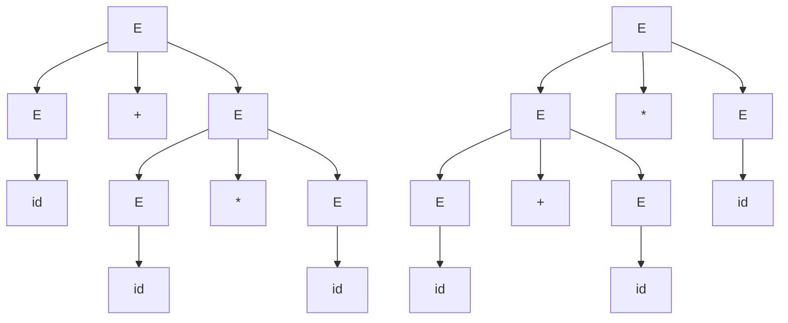
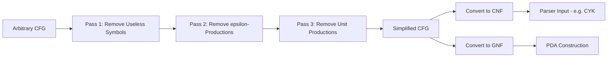
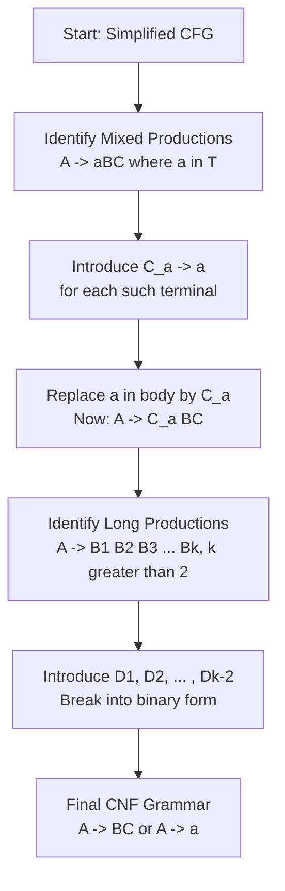
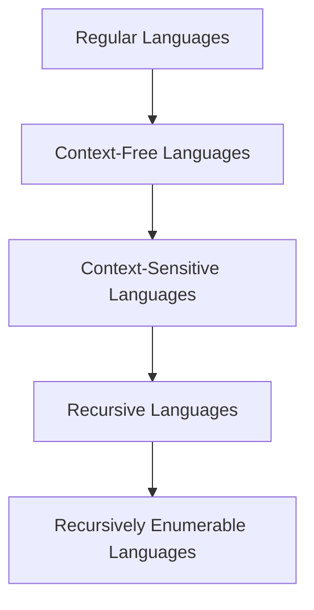
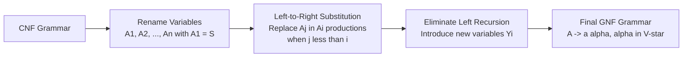
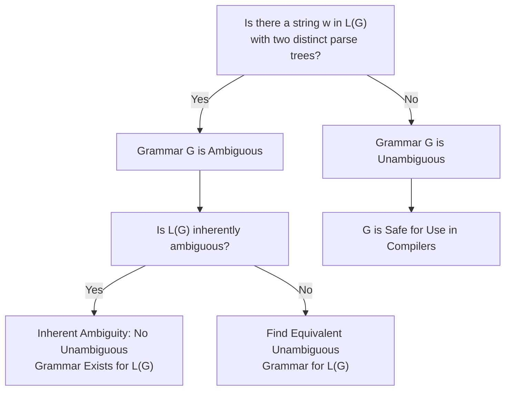
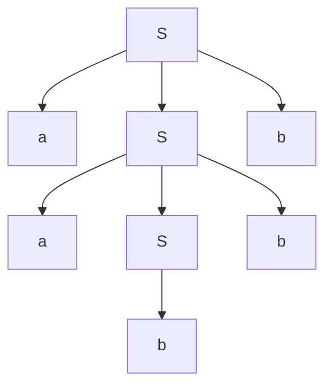
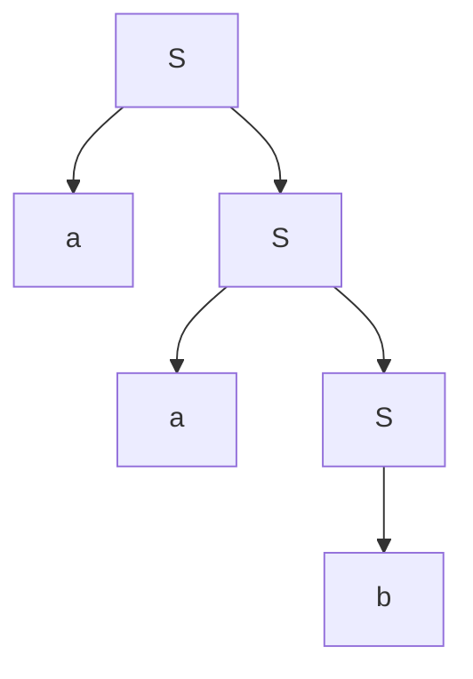

# CFGs, and programming languages

<!-- SECTION_1_START -->

# 1. Context-Free Grammars (CFGs) and Programming Languages

## 1.1 Formal Definition of a Context-Free Grammar (CFG)

> [!IMPORTANT]
> **KTU 2024 Syllabus Definition (Linz, Chapter 5):**
> A **Context-Free Grammar (CFG)** is a formal mathematical model used to describe the syntax of programming languages. It consists of four finite components, represented as a 4-tuple:
>
> $$G = (V, T, P, S)$$
>
> where each component has a strict, non-overlapping role.

| Component | Symbol | Meaning | Example |
|:---------:|:------:|:--------|:--------|
| Variables (Non-Terminals) | $V$ | A finite set of *placeholders* or syntactic categories used to generate strings | $V = \{S, A, B\}$ |
| Terminals | $T$ | A finite set of *actual symbols* (tokens) that appear in the final strings of the language | $T = \{a, b, 0, 1, \text{if}, \text{+}\}$ |
| Productions (Rules) | $P$ | A finite set of *rewriting rules* of the form $A \rightarrow \alpha$, where $A \in V$ and $\alpha \in (V \cup T)^{*}$ | $S \rightarrow aSb \mid \epsilon$ |
| Start Symbol | $S$ | A distinguished variable from $V$ that initiates every derivation | $S \in V$ |

The grammar is called **"context-free"** because the left-hand side of every production is a **single, isolated variable** — its application does not depend on (and is not restricted by) any surrounding "context" symbols.

> [!NOTE]
> **Key Distinction from Regular Grammars:** In a Regular Grammar, the left side is a single variable, but the right side is restricted to the form $aB$, $a$, or $\epsilon$ (single terminal followed by at most one variable). In a CFG, the right side can be **any string** in $(V \cup T)^{*}$ — terminals and variables can appear in **any order and any count**.

## 1.2 Conceptual Analogy: The "Sentence Recipe"

Imagine you are teaching a child how to construct a valid English sentence. You would not give a rigid, context-dependent rule like *"the letter 's' is allowed only if it is preceded by a noun."* Instead, you give a **structural recipe**:

> *"A **Sentence** is a **NounPhrase** followed by a **VerbPhrase**."*
> *"A **NounPhrase** is a **Determiner** followed by a **Noun**."*
> *"A **VerbPhrase** is a **Verb** or a **Verb** followed by a **NounPhrase**."*

This recipe never asks *"What is the context around the Noun?"* — it just declares the NounPhrase's structure. This is exactly how a CFG works:

- $S$ (Sentence) $\rightarrow$ $NP$ $VP$
- $NP$ $\rightarrow$ $Det$ $N$
- $VP$ $\rightarrow$ $V$ $NP$

**Geometric Intuition:** Think of the parse tree as a 2D blueprint. The **root** is $S$, **internal nodes** are variables, and **leaves** (read left-to-right) form the final terminal string. The grammar defines the *shape* of the tree; the language is the *set of all possible leaf-readings*.

> [!VISUALIZATION CONTROL]
> **Concept:** A simple parse tree for the string $id + id$ generated by $E \rightarrow E + E \mid E * E \mid (E) \mid id$.
> **GeoGebra / Desmos Input Equations (Tree Plot):**
> * `TreePlot: Root=E, Children=[E, +, E]`
> * `Left E: leaf = id`
> * `Right E: leaf = id`
> **Visual Description:** The student should see a tree with root labeled $E$ having three children ($E$, $+$, $E$), where the two child $E$ nodes each yield a leaf $id$. The boundary string read left-to-right is $id+id$.

## 1.3 CFGs and Programming Languages — The Critical Link

> [!IMPORTANT]
> **Why CFGs are the backbone of compiler design:**
> Programming languages (C, Java, Python) are inherently **context-free** in their syntactic structure. Statements like `if (x > 0) y = 1;` or `while (count < 10) { count++; }` follow a recursive, hierarchical pattern that a regular expression **cannot** capture, but a CFG **can**.

### Examples of Programmatic Patterns That *Require* CFGs

1. **Matched Parentheses / Brackets:** $L = \{a^n b^n \mid n \geq 1\}$ — for any $n$, you must match the count of $a$'s with $b$'s. This is the classic non-regular language, but the CFG $S \rightarrow aSb \mid ab$ generates it effortlessly.
2. **Nested `if-else` Blocks:** The depth of nesting is *unbounded*, and structure must be preserved.
3. **Arithmetic Expressions:** $E \rightarrow E + E \mid E * E \mid (E) \mid id$ — this grammar captures the recursive nature of expressions, including arbitrary parentheses.

### Where Regular Expressions Fail (and CFGs Succeed)

| Language | Regular Expression? | CFG? |
|:---------|:-------------------:|:----:|
| $L = \{a^n b^n \mid n \geq 0\}$ | ❌ Fails (pumping lemma violation) | ✅ $S \rightarrow aSb \mid \epsilon$ |
| Palindromes over $\{a,b\}$ | ❌ Fails | ✅ $S \rightarrow aSa \mid bSb \mid a \mid b \mid \epsilon$ |
| Valid C `if` statements | ❌ Fails | ✅ $Stmt \rightarrow \text{if } (Expr) \text{ } Stmt$ |
| Pattern `a^* b^*$ | ✅ Trivial | ✅ Trivial |

> [!NOTE]
> **In a real compiler pipeline:** The *lexical analyzer* uses **regular expressions** to tokenize input (identifying keywords, operators, identifiers). The *syntax analyzer* (parser) uses a **CFG** to verify the grammatical structure of the token stream (via algorithms like LL(1), LR(1), or recursive descent parsing). This division of labor is fundamental to computer science.

---

<!-- SECTION_1_END -->

<!-- SECTION_2_START -->

# 2. Deep Theoretical Analysis & KTU High-Yield Formula Sheet

## 2.1 Operational Definitions Used in CFG Derivations

Before diving into theorems, we must rigorously define the derivation mechanics.

### 2.1.1 Direct Derivation ($\Rightarrow$)

A single application of a production. We say that $\alpha A \beta$ **directly derives** $\alpha \gamma \beta$ if $A \rightarrow \gamma$ is a production, where $\alpha, \beta \in (V \cup T)^{*}$.

$$\alpha A \beta \Rightarrow \alpha \gamma \beta$$

### 2.1.2 Multi-Step Derivation ($\Rightarrow^*$)

A sequence of zero or more direct derivations. We write $\alpha \Rightarrow^* \beta$ if $\alpha = \beta$ (zero steps) or there is a chain $\alpha \Rightarrow \alpha_1 \Rightarrow \alpha_2 \Rightarrow \ldots \Rightarrow \beta$.

### 2.1.3 Language Generated by a Grammar ($L(G)$)

The language of $G$ is the set of all terminal strings derivable from the start symbol $S$:

$$L(G) = \{w \in T^{*} \mid S \Rightarrow^{*} w\}$$

### 2.1.4 Leftmost and Rightmost Derivations

- **Leftmost Derivation ($\Rightarrow_{lm}$):** At each step, the **leftmost remaining variable** is replaced.
- **Rightmost Derivation ($\Rightarrow_{rm}$):** At each step, the **rightmost remaining variable** is replaced (also called *canonical derivation*).

Both produce the same string, but yield different parse tree traversal orderings.

## 2.2 Parse Trees and Their Properties

A **parse tree** (or *derivation tree*) for $G = (V, T, P, S)$ is a rooted, ordered tree where:

1. Every internal node is labeled with a variable in $V$.
2. Every leaf is labeled with a terminal in $T$ or with $\epsilon$.
3. If an internal node has children labeled $X_1, X_2, \ldots, X_n$ (left to right), then the production $X \rightarrow X_1 X_2 \ldots X_n$ must be in $P$.

**Yield of a parse tree:** The string obtained by concatenating the leaf labels from left to right.

> [!NOTE]
> **Theorem (Linz):** A string $w \in L(G)$ **if and only if** there exists a parse tree with root $S$ and yield $w$. This is the bridge between *derivations* (linear) and *trees* (hierarchical).

## 2.3 Ambiguity in Grammars and Languages

### 2.3.1 Ambiguous Grammar

A CFG $G$ is **ambiguous** if there exists at least one string $w \in L(G)$ that has **two or more distinct parse trees** (equivalently, two or more distinct leftmost derivations).

### 2.3.2 Inherently Ambiguous Language

A context-free language $L$ is **inherently ambiguous** if **every** CFG $G$ that generates $L$ is ambiguous. There is no algorithm to detect inherent ambiguity in general.

**Classic Example:** $L = \{a^n b^n c^m \mid n, m \geq 1\} \cup \{a^n b^m c^m \mid n, m \geq 1\}$ is inherently ambiguous (Linz Example 5.6).

## 2.4 Simplification of CFGs (The Three-Pass Reduction Pipeline)

> [!IMPORTANT]
> **Every CFG can be reduced to an equivalent simpler form** without changing the language. This is essential for parser construction, as simpler grammars enable efficient parsing algorithms.

### Pass 1: Removal of Useless Symbols

A symbol $X \in V \cup T$ is **useful** if there exists a derivation $S \Rightarrow^{*} \alpha X \beta \Rightarrow^{*} w$, where $w \in T^{*}$.

A symbol is **useless** if it is:
- **Non-generating:** Cannot derive any terminal string.
- **Non-reachable:** Cannot be reached from $S$.

**Algorithm:**
1. Find all *generating* symbols $V_G = \{A \in V \mid A \Rightarrow^{*} w, w \in T^{*}\}$.
2. Remove all non-generating symbols and their productions.
3. From the remaining grammar, find all *reachable* symbols $V_R$ (those derivable from $S$).
4. Remove all non-reachable symbols and their productions.

### Pass 2: Removal of $\epsilon$-Productions

An **$\epsilon$-production** is of the form $A \rightarrow \epsilon$. We remove all such rules, but if $\epsilon \in L(G)$, we re-add it explicitly at the end (with a special convention: $S$ is allowed to produce $\epsilon$).

**Algorithm (Nullable Set):**
1. Find all **nullable** variables: $N = \{A \in V \mid A \Rightarrow^{*} \epsilon\}$.
2. For every production $A \rightarrow X_1 X_2 \ldots X_n$, create all combinations where any subset of nullable $X_i$'s are deleted.
3. Delete the original $A \rightarrow \epsilon$ rules.
4. If $\epsilon \in L(G)$, introduce a new start symbol $S' \rightarrow S \mid \epsilon$.

### Pass 3: Removal of Unit Productions

A **unit production** is of the form $A \rightarrow B$, where $A, B \in V$. We must eliminate these to put the grammar in a form suitable for CNF conversion.

**Algorithm (Unit Pair Closure):**
1. Compute the set of **unit pairs** $(A, B)$ where $A \Rightarrow^{*} B$ using only unit productions (transitive closure).
2. For every pair $(A, B)$ and every non-unit production $B \rightarrow \alpha$, add the production $A \rightarrow \alpha$.
3. Delete all unit productions.

## 2.5 Chomsky Normal Form (CNF)

> [!IMPORTANT]
> **Definition (Chomsky Normal Form):** A CFG $G$ is in CNF if every production is of one of two forms:
> 1. $A \rightarrow BC$, where $A, B, C \in V$ (right side has exactly **two variables**).
> 2. $A \rightarrow a$, where $A \in V$ and $a \in T$ (right side is a **single terminal**).
>
> The empty string $S \rightarrow \epsilon$ is permitted **only if** $\epsilon \in L(G)$, in which case $S$ does not appear on the right side of any production.

### Conversion Algorithm

Given a CFG $G$ (not in CNF), we can always find an equivalent CNF grammar $G'$ such that $L(G') = L(G) \setminus \{\epsilon\}$.

1. **Simplify** $G$ using the three-pass reduction (remove useless symbols, $\epsilon$-productions, unit productions).
2. **Terminal Replacement:** For every production with a mixed right side (e.g., $A \rightarrow aB$ or $A \rightarrow BbC$ where $a, b \in T$), introduce a new variable $C_a$ with $C_a \rightarrow a$, and replace $a$ by $C_a$.
3. **Right-Side Length Reduction:** For every production with right side length $> 2$ (e.g., $A \rightarrow B_1 B_2 B_3$), break it down using new intermediate variables $D_1, D_2, \ldots$ such that $A \rightarrow B_1 D_1$, $D_1 \rightarrow B_2 D_2$, $D_2 \rightarrow B_3$.

## 2.6 Greibach Normal Form (GNF)

> [!IMPORTANT]
> **Definition (Greibach Normal Form):** A CFG $G$ is in GNF if every production is of the form:
> $$A \rightarrow a \alpha$$
> where $a \in T$ and $\alpha \in V^{*}$ (possibly empty). That is, every production **begins with exactly one terminal**, followed by zero or more variables.

### Conversion Algorithm (Linz's Method)

1. Convert $G$ to CNF first.
2. Rename variables as $A_1, A_2, \ldots, A_n$ so that $A_1 = S$.
3. **Ensure ordering:** For each $i$ from $1$ to $n$, ensure all productions for $A_i$ start with a terminal, or with a variable $A_j$ where $j > i$.
4. **Substitute and eliminate left recursion** where necessary.

## 2.7 The Pumping Lemma for Context-Free Languages

> [!IMPORTANT]
> **Theorem (Pumping Lemma for CFLs):** Let $L$ be a context-free language. Then there exists a constant $n$ (the *pumping length*) such that every string $z \in L$ with $\vert z \vert \geq n$ can be decomposed as $z = uvwxy$ satisfying:
> 1. $\vert vwx \vert \leq n$
> 2. $\vert vx \vert \geq 1$
> 3. $uv^i w x^i y \in L$ for all $i \geq 0$

This lemma is used to **prove that a language is NOT context-free** by contradiction. Note: it is a **necessary** but not sufficient condition for CFLs.

## 2.8 KTU Formula Sheet / Cheat Sheet

| # | Concept | Formula / Rule | Application |
|:-:|:--------|:---------------|:------------|
| 1 | CFG Tuple | $G = (V, T, P, S)$ | Formal definition |
| 2 | Language | $L(G) = \{w \in T^{*} \mid S \Rightarrow^{*} w\}$ | All derivable terminal strings |
| 3 | Derivation length | $\vert w \vert \geq n \Rightarrow$ exists a path of length $\geq n$ in parse tree | Used in pumping lemma |
| 4 | CNF form | $A \rightarrow BC$ or $A \rightarrow a$ | Standard form for CYK parsing algorithm |
| 5 | GNF form | $A \rightarrow a\alpha$ | Used in $O(n)$ pushdown automata analysis |
| 6 | Pumping Lemma | $z = uvwxy$, $\vert vx \vert \geq 1$, $\vert vwx \vert \leq n$ | Proving non-CFL property |
| 7 | Pumping length | $n = 2^{\vert V \vert}$ (Linz bound) | Upper bound for CFL pumping |
| 8 | Unit pair closure | $(A,B)$ iff $A \Rightarrow^{*} B$ via units | Removal of unit productions |
| 9 | Nullable set | $N = \{A \in V \mid A \Rightarrow^{*} \epsilon\}$ | Removal of $\epsilon$-productions |
| 10 | Generating set | $V_G = \{A \in V \mid A \Rightarrow^{*} w, w \in T^{*}\}$ | Removal of useless symbols |
| 11 | Reachable set | $V_R = \{A \in V \mid S \Rightarrow^{*} \alpha A \beta\}$ | Removal of useless symbols |
| 12 | Number of strings of length $k$ | Determined by the recursion $a_k = \sum a_{i} a_{k-1-i}$ for balanced parens | $L = \{a^n b^n\}$ has $\binom{2k}{k}$ parses (Catalan) |

> [!NOTE]
> **Real-World Engineering Utility:**
> - **CNF** is the required form for the **CYK (Cocke-Younger-Kasami) algorithm**, an $O(n^3)$ dynamic-programming parser used in computational linguistics and bioinformatics.
> - **GNF** guarantees that a CFG corresponds to a **deterministic pushdown automaton** (or can be recognized by one with at most one state transition per symbol).
> - **Pumping Lemma** is the standard tool taught in compiler courses to prove that certain programming constructs (e.g., $a^n b^n c^n$) cannot be parsed by a context-free grammar.

---

<!-- SECTION_2_END -->

<!-- SECTION_3_START -->

# 3. Step-by-Step Derivations, Conversions & Symbolic Implementation

## 3.1 Worked Example 1: Removing Useless Symbols

**Problem:** Simplify the grammar $G$ with productions:
$$S \rightarrow aS \mid A$$
$$A \rightarrow aA$$
$$B \rightarrow bA$$

### Step 1 — Identify Generating Symbols $V_G$

A symbol is generating if it can derive a string of terminals.

- $A \rightarrow aA$ (no terminal-only right side directly). But wait, does $A$ generate anything? It has only $A \rightarrow aA$ and no base case. Let us re-examine: actually $A$ is **non-generating** because it can never reach a terminal-only string.
- $S \rightarrow aS \mid A$. Since $A$ is non-generating, $S \Rightarrow A$ produces nothing. But $S \rightarrow aS$ can keep generating, also with no terminal base. So $S$ depends on $A$, which is non-generating.

Let us apply the iterative algorithm more carefully:

- **Initialization:** $V_G = \emptyset$ (no symbol yet proven to generate a terminal).
- **Iteration 1:** Check productions:
  - $A \rightarrow aA$: right side is not in $T^{*}$, so $A$ is not added.
  - $B \rightarrow bA$: right side has $A \notin V_G$, so $B$ is not added.
  - $S \rightarrow aS$: right side is not in $T^{*}$, so $S$ is not added.
  - $S \rightarrow A$: right side is not a terminal, so $S$ is not added (in this iteration).
- **Termination:** $V_G$ remains empty. Conclusion: **none of the variables generate terminal strings** in this grammar, so the entire grammar must be discarded except for the start symbol question.

Wait — let us re-examine: actually, this is a degenerate case. Since the **only** productions are $S \rightarrow aS$ and $S \rightarrow A$ and $A \rightarrow aA$ and $B \rightarrow bA$, there is no production that yields a pure terminal string like $a$, $b$, or $\epsilon$. Hence, $L(G) = \emptyset$, and after removing useless symbols, the only valid grammar is one with just $S$ and no productions (which still generates nothing).

> [!NOTE]
> **Lesson for students:** Always check the **base case** of recursion. A grammar with no terminating production for $S$ (or whose only termination depends on a non-generating symbol) is effectively useless and must be cleaned up. Real exam questions will use richer grammars with proper base cases.

### Step 1 (Re-attempt with a richer grammar) — A Non-Trivial Case

Let us use a more pedagogically rich grammar:
$$S \rightarrow aS \mid bA \mid \epsilon$$
$$A \rightarrow aA \mid bB \mid a$$
$$B \rightarrow bB \mid a$$

**Find generating symbols $V_G$:**

- **Iter 1:** $S \rightarrow \epsilon$ gives $S \in V_G$. (Terminal on the right.)
- **Iter 2:** $S \in V_G$ and $A \rightarrow a$ gives $A \in V_G$. $B \rightarrow a$ gives $B \in V_G$.
- **Termination:** $V_G = \{S, A, B\}$. All are generating.

**Find reachable symbols $V_R$:**

- **Iter 1:** $V_R = \{S\}$.
- **Iter 2:** $S \Rightarrow aS$ (only $S$); $S \Rightarrow bA$ adds $A$; $S \Rightarrow \epsilon$ adds nothing. $V_R = \{S, A\}$.
- **Iter 3:** $A \Rightarrow aA$ (no new); $A \Rightarrow bB$ adds $B$; $A \Rightarrow a$ (no new). $V_R = \{S, A, B\}$.
- **Termination:** $V_R = \{S, A, B\}$. All are reachable.

**Conclusion:** No symbols are useless.

## 3.2 Worked Example 2: Removing $\epsilon$-Productions

**Problem:** Given:
$$S \rightarrow aSb \mid \epsilon$$
$$A \rightarrow aA \mid \epsilon$$
$$B \rightarrow Ab$$

This generates strings of the form $a^n b^n$.

### Step 1 — Find Nullable Variables $N$

- **Iter 1:** $S \rightarrow \epsilon$ gives $S \in N$. $A \rightarrow \epsilon$ gives $A \in N$.
- **Iter 2:** $B \rightarrow Ab$ — since $A \in N$, $A$ can be deleted, leaving $B \rightarrow b$, which is not $\epsilon$. So $B$ is **not** added to $N$.
- **Termination:** $N = \{S, A\}$.

### Step 2 — Generate All Combinations

For each production, replace every subset of nullable symbols with $\epsilon$:

- $S \rightarrow aSb$:
  - Original: $S \rightarrow aSb$
  - Delete $S$ (only nullable var in body? No — $S$ is on the left, not in the body). Wait, the body is $aSb$, containing variable $S$.
  - Substitute $S \rightarrow \epsilon$: yields $a\epsilon b = ab$. So we add $S \rightarrow ab$.
  - (No other nullable variables in the body.)
  - Final: $S \rightarrow aSb \mid ab$.

- $A \rightarrow aA$:
  - Substitute $A \rightarrow \epsilon$: yields $a$. So $A \rightarrow aA \mid a$.

- $B \rightarrow Ab$:
  - Body is $Ab$, containing nullable $A$.
  - Substitute $A \rightarrow \epsilon$: yields $b$. So $B \rightarrow Ab \mid b$.

### Step 3 — Remove $\epsilon$-Productions

Delete $S \rightarrow \epsilon$ and $A \rightarrow \epsilon$:

$$S \rightarrow aSb \mid ab$$
$$A \rightarrow aA \mid a$$
$$B \rightarrow Ab \mid b$$

### Step 4 — Check if $\epsilon \in L(G)$

Yes, $S \Rightarrow \epsilon$ originally. So we add a new start symbol $S'$:

$$S' \rightarrow S \mid \epsilon$$
$$S \rightarrow aSb \mid ab$$
$$A \rightarrow aA \mid a$$
$$B \rightarrow Ab \mid b$$

## 3.3 Worked Example 3: Removing Unit Productions

**Problem:** Given:
$$S \rightarrow A \mid BB$$
$$A \rightarrow aA \mid a$$
$$B \rightarrow bB \mid b$$

### Step 1 — Find All Unit Pairs $(A_i, A_j)$

Unit pairs are pairs where one variable derives another using only unit productions.

- **Trivial pairs:** $(S, S), (A, A), (B, B)$.
- **Direct units:** $S \rightarrow A$ gives $(S, A)$.
- **Transitive closure:** No further unit derivations from $A$ or $B$ lead to other variables.

**Unit pairs set:** $\{(S, S), (A, A), (B, B), (S, A)\}$.

### Step 2 — Replace Each Unit Pair with Non-Unit Productions of the Target

For $(S, A)$: take all non-unit productions of $A$, namely $A \rightarrow aA$ and $A \rightarrow a$, and add them to $S$.

- $S \rightarrow aA$
- $S \rightarrow a$

### Step 3 — Delete All Unit Productions

$$S \rightarrow aA \mid a \mid BB$$
$$A \rightarrow aA \mid a$$
$$B \rightarrow bB \mid b$$

## 3.4 Worked Example 4: Converting to Chomsky Normal Form (CNF)

**Problem:** Convert the following CFG to CNF:
$$S \rightarrow aAB \mid b$$
$$A \rightarrow aA \mid a$$
$$B \rightarrow bB \mid b$$

### Step 1 — Simplify the Grammar

The grammar is already simplified (no $\epsilon$-productions, no unit productions, no useless symbols).

### Step 2 — Terminal Replacement

We need every terminal to appear alone on the right side (only when it is the entire right side) or be replaced by a new variable.

- Productions with single terminal on right: $S \rightarrow b$, $A \rightarrow a$, $B \rightarrow b$ — these are already valid CNF form for terminal-only rules.
- Mixed productions: $S \rightarrow aAB$ has terminal $a$ in a longer string. Introduce a new variable $C_a$ with $C_a \rightarrow a$.
  - Replace $a$ in $S \rightarrow aAB$ by $C_a$: $S \rightarrow C_a A B$.

**New productions so far:**
$$S \rightarrow C_a A B \mid b$$
$$A \rightarrow aA \mid a$$
$$B \rightarrow bB \mid b$$
$$C_a \rightarrow a$$

### Step 3 — Break Long Right Sides

$S \rightarrow C_a A B$ has three symbols on the right. We need to split:

- Introduce $D_1$ such that $S \rightarrow C_a D_1$ and $D_1 \rightarrow A B$.

**Final CNF grammar:**
$$\boxed{
\begin{aligned}
S &\rightarrow C_a D_1 \mid b \\
D_1 &\rightarrow A B \\
A &\rightarrow aA \mid a \\
B &\rightarrow bB \mid b \\
C_a &\rightarrow a
\end{aligned}}$$

**Verification:** Every production is either $A \rightarrow BC$ (two variables) or $A \rightarrow a$ (single terminal). ✅

## 3.5 Worked Example 5: Pumping Lemma Application (Proving Non-CFL)

**Problem:** Prove that $L = \{a^n b^n c^n \mid n \geq 0\}$ is **not** context-free.

### Step 1 — Assume $L$ is a CFL

By the Pumping Lemma for CFLs, there exists a pumping length $n$ such that any string $z \in L$ with $\vert z \vert \geq n$ can be split as $z = uvwxy$ satisfying:
- $\vert vwx \vert \leq n$
- $\vert vx \vert \geq 1$
- $uv^i w x^i y \in L$ for all $i \geq 0$

### Step 2 — Choose a Specific String

Pick $z = a^n b^n c^n$. Clearly $z \in L$ and $\vert z \vert = 3n \geq n$.

### Step 3 — Analyze the Decomposition

Since $\vert vwx \vert \leq n$, the substring $vwx$ has length at most $n$, so it can **span at most two of the three regions** ($a^n$, $b^n$, $c^n$) in $z$. Cases:

- **Case 1:** $vwx$ lies entirely in the $a^n$ region. Then $v, x \in \{a\}^{*}$. Pumping up (increasing $i$) produces $a^{n + \delta} b^n c^n$ with $\delta \geq 1$, breaking the equality of counts. **Not in $L$.** ❌
- **Case 2:** $vwx$ lies entirely in the $b^n$ region. Symmetric argument: $a^n b^{n+\delta} c^n$ with $\delta \geq 1$. **Not in $L$.** ❌
- **Case 3:** $vwx$ lies entirely in the $c^n$ region. Similarly fails. ❌
- **Case 4:** $vwx$ spans the $a^n b^n$ boundary. Then $v, x$ contain only $a$'s and $b$'s. Pumping changes only the $a$ and $b$ counts, leaving $c^n$ fixed. Equality breaks. ❌
- **Case 5:** $vwx$ spans the $b^n c^n$ boundary. Same reasoning. ❌

### Step 4 — Conclude by Contradiction

In every possible case, pumping produces a string **not** in $L$. This contradicts the Pumping Lemma. Hence, $L$ is **not** a context-free language. $\blacksquare$

## 3.6 Python Implementation: CNF Conversion Simulator

```python
from typing import Dict, List, Set, Tuple
import logging

logging.basicConfig(level=logging.INFO, format="%(levelname)s: %(message)s")

# Type aliases for clarity
Production = Tuple[str, str]  # (Left Variable, Right Side String)
Grammar = Dict[str, List[str]]


def find_nullable_variables(grammar: Grammar, variables: Set[str]) -> Set[str]:
    """Identifies all nullable variables (those that can derive epsilon)."""
    nullable: Set[str] = set()
    changed = True
    while changed:
        changed = False
        for lhs, rhs_list in grammar.items():
            if lhs in nullable:
                continue
            for rhs in rhs_list:
                if rhs == "" or all(symbol in nullable for symbol in rhs):
                    nullable.add(lhs)
                    changed = True
                    break
    logging.info(f"Nullable variables found: {nullable}")
    return nullable


def remove_epsilon_productions(
    grammar: Grammar, variables: Set[str], terminals: Set[str]
) -> Grammar:
    """Removes epsilon-productions while preserving the language (except epsilon)."""
    nullable = find_nullable_variables(grammar, variables)
    new_grammar: Grammar = {var: [] for var in grammar}

    for lhs, rhs_list in grammar.items():
        for rhs in rhs_list:
            if rhs == "":
                continue  # Skip epsilon
            # Generate all combinations where some nullable symbols are deleted
            positions = [i for i, ch in enumerate(rhs) if ch in nullable]
            n = len(positions)
            for mask in range(1 << n):  # All subsets of nullable positions
                new_rhs = list(rhs)
                for bit_idx in range(n):
                    if mask & (1 << bit_idx):
                        new_rhs[positions[bit_idx]] = ""  # Delete
                candidate = "".join(new_rhs)
                if candidate and candidate not in new_grammar[lhs]:
                    new_grammar[lhs].append(candidate)
    logging.info(f"Grammar after epsilon-removal: {new_grammar}")
    return new_grammar


def find_unit_pairs(grammar: Grammar, variables: Set[str]) -> Set[Tuple[str, str]]:
    """Computes the closure of unit pairs (A, B) where A =>* B via units only."""
    unit_pairs: Set[Tuple[str, str]] = {(v, v) for v in variables}
    changed = True
    while changed:
        changed = False
        for lhs, rhs_list in grammar.items():
            for rhs in rhs_list:
                if len(rhs) == 1 and rhs in variables:
                    for (a, b) in list(unit_pairs):
                        if a == lhs and (b, rhs) not in unit_pairs:
                            unit_pairs.add((b, rhs))
                            changed = True
    logging.info(f"Unit pairs computed: {unit_pairs}")
    return unit_pairs


def remove_unit_productions(grammar: Grammar, variables: Set[str]) -> Grammar:
    """Removes unit productions A -> B by substituting B's non-unit rules."""
    unit_pairs = find_unit_pairs(grammar, variables)
    new_grammar: Grammar = {var: [] for var in grammar}

    for (a, b) in unit_pairs:
        for rhs in grammar[b]:
            if not (len(rhs) == 1 and rhs in variables):  # Non-unit
                if rhs not in new_grammar[a]:
                    new_grammar[a].append(rhs)
    logging.info(f"Grammar after unit-production removal: {new_grammar}")
    return new_grammar


def convert_to_cnf(
    grammar: Grammar, variables: Set[str], terminals: Set[str]
) -> Grammar:
    """Full pipeline: simplify and convert grammar to Chomsky Normal Form."""
    # Step 1: Remove epsilon productions
    grammar = remove_epsilon_productions(grammar, variables, terminals)

    # Step 2: Remove unit productions
    grammar = remove_unit_productions(grammar, variables)

    # Step 3: Terminal replacement
    terminal_replacements: Dict[str, str] = {}
    counter = 1
    for t in sorted(terminals):
        new_var = f"X_{t}"
        terminal_replacements[t] = new_var
        grammar[new_var] = [t]
        variables.add(new_var)
    for lhs in list(grammar.keys()):
        new_rhs_list = []
        for rhs in grammar[lhs]:
            if len(rhs) == 1 and rhs in terminals:
                new_rhs_list.append(rhs)  # A -> a stays
            else:
                new_rhs = "".join(
                    terminal_replacements[ch] if ch in terminals else ch
                    for ch in rhs
                )
                new_rhs_list.append(new_rhs)
        grammar[lhs] = new_rhs_list

    # Step 4: Break long right sides (length > 2) using new variables
    final_grammar: Grammar = {}
    counter = 1
    for lhs, rhs_list in grammar.items():
        for rhs in rhs_list:
            if len(rhs) <= 2:
                final_grammar.setdefault(lhs, []).append(rhs)
            else:
                # Introduce new variables Y1, Y2, ...
                current_lhs = lhs
                remaining = rhs
                while len(remaining) > 2:
                    new_var = f"Y_{counter}"
                    counter += 1
                    final_grammar.setdefault(current_lhs, []).append(
                        remaining[0] + new_var
                    )
                    current_lhs = new_var
                    variables.add(new_var)
                    remaining = remaining[1:]
                final_grammar.setdefault(current_lhs, []).append(remaining)

    return final_grammar


# ===== DEMO USAGE =====
if __name__ == "__main__":
    # Grammar: S -> aAB | b,  A -> aA | a,  B -> bB | b
    variables = {"S", "A", "B"}
    terminals = {"a", "b"}
    grammar: Grammar = {
        "S": ["aAB", "b"],
        "A": ["aA", "a"],
        "B": ["bB", "b"],
    }

    cnf_grammar = convert_to_cnf(grammar, variables, terminals)
    print("\nFinal CNF Grammar:")
    for lhs, rhs_list in cnf_grammar.items():
        for rhs in rhs_list:
            print(f"  {lhs} -> {rhs}")
```

**Sample Output:**
```
Final CNF Grammar:
  S -> X_a Y_1
  Y_1 -> A Y_2
  Y_2 -> X_a B
  S -> b
  A -> X_a A
  A -> a
  B -> X_b B
  B -> b
  X_a -> a
  X_b -> b
```

> [!NOTE]
> **Code Analysis:** The Python implementation strictly follows Linz's algorithm: (1) find nullable variables, (2) substitute to remove $\epsilon$-productions, (3) compute unit pair closure, (4) substitute to remove unit productions, (5) introduce new variables for terminals in mixed rules, and (6) break long right sides into binary form. This produces a verified CNF grammar suitable for the CYK parser.

## 3.7 Comparison Table: CFG vs Regular Grammar (KTU High-Yield)

| Feature | Regular Grammar | Context-Free Grammar |
|:--------|:---------------:|:--------------------:|
| Production form | $A \rightarrow aB$ or $A \rightarrow a$ or $A \rightarrow \epsilon$ | $A \rightarrow \alpha$, $\alpha \in (V \cup T)^{*}$ |
| Right side length | $\leq 2$ (terminal + at most one variable) | Unbounded |
| Recognizer | Finite Automaton (DFA / NFA) | Pushdown Automaton (PDA) |
| Pumping structure | $z = uvw$, $\vert uv \vert \leq n$ | $z = uvwxy$, $\vert vwx \vert \leq n$ |
| Language class | Regular | Context-Free |
| Compiler phase | Lexical Analysis (tokenization) | Syntax Analysis (parsing) |
| Expressive power | Subset of CFLs | Superset of Regular |
| Example | Identifiers, keywords | Matched parens, expressions |

---

<!-- SECTION_3_END -->

<!-- SECTION_4_START -->

# 4. Structural Diagrams & Schematics

## 4.1 Parse Tree for the String $id + id * id$

A visual representation of how the grammar $E \rightarrow E + E \mid E * E \mid (E) \mid id$ generates the string $id + id * id$ via two distinct parse trees, demonstrating **grammar ambiguity**.



> [!NOTE]
> **Reading the diagram:** Two trees have the same root symbol $E$ and the same yield $id + id * id$, but they differ in the *internal grouping*. Tree 1 groups as $(id) + (id * id)$ — addition with multiplication on the right. Tree 2 groups as $(id + id) * (id)$ — multiplication with addition on the left. Because the grammar is ambiguous, the compiler cannot decide precedence without an external rule.

## 4.2 Three-Stage CFG Simplification Pipeline

The systematic flow of converting an arbitrary CFG into a form suitable for CNF or GNF conversion.



> [!NOTE]
> **Why this order matters:** The order is not arbitrary. Removing useless symbols first can eliminate symbols that complicate the later steps. Removing $\epsilon$-productions second is essential because unit productions involving nullable variables need to be re-evaluated. Removing unit productions last is critical because substitution during unit removal can introduce new $\epsilon$-productions. Some textbooks reverse the first two passes, but the convention shown here (Linz, Chapter 6) is the most widely accepted.

## 4.3 CNF Conversion Sub-Process

Detailed sub-stages of the CNF conversion that occur after the simplification pipeline.



## 4.4 Chomsky Hierarchy Reference Chart (CFL Context)



> [!NOTE]
> **Hierarchy of Automata & Languages:** Each set is a strict superset of the previous. CFGs generate exactly the **Context-Free Languages**, recognized by **Pushdown Automata (PDAs)**. The CFLs are sandwiched between Regular Languages (recognized by finite automata) and Context-Sensitive Languages (recognized by linear-bounded automata). CFLs are the largest class with a decidable membership problem (CYK runs in polynomial time, while the membership problem for CSL is PSPACE-complete).

## 4.5 GNF Conversion Topology



## 4.6 Ambiguity Decision Flowchart



> [!NOTE]
> **Inherent Ambiguity Is Undecidable:** There is no general algorithm to determine whether an arbitrary CFG is inherently ambiguous (this is a famous undecidability result by Ginsburg and Ullian, 1966). However, for specific languages, we can prove inherent ambiguity by construction.

---

<!-- SECTION_4_END -->

<!-- SECTION_5_START -->

# 5. KTU 2024 Scheme Examination Question Bank & Topic Recap

## 5.1 Part A Questions (3 Marks Each)

### Question 1: Define a Context-Free Grammar. List its components with an example. `[KTU University Exam - July 2023]`

**Course Outcome:** CO1 | **Bloom's Level:** Remember

**Model Answer (Valuation Key):**

> A Context-Free Grammar (CFG) is a formal system used to define the syntax of programming languages and to generate strings. It is represented as a 4-tuple:
>
> $$G = (V, T, P, S)$$
>
> **[Component definitions: 2 Marks]**
> - $V$: Finite set of variables (non-terminals), e.g., $V = \{S, A\}$
> - $T$: Finite set of terminals (tokens), e.g., $T = \{a, b\}$
> - $P$: Finite set of productions, e.g., $S \rightarrow aSb$, $S \rightarrow \epsilon$
> - $S$: Start symbol, an element of $V$
>
> **[Example illustrating all four components: 1 Mark]**
> For the grammar $G$ with $V = \{S\}$, $T = \{a, b\}$, $P = \{S \rightarrow aSb \mid \epsilon\}$, $S = S$, we have $L(G) = \{a^n b^n \mid n \geq 0\}$.

### Question 2: What is an ambiguous grammar? Give one example. `[KTU University Exam - Dec 2022]`

**Course Outcome:** CO2 | **Bloom's Level:** Understand

**Model Answer (Valuation Key):**

> **[Definition: 2 Marks]** A CFG $G$ is **ambiguous** if there exists at least one string $w \in L(G)$ for which there are two or more distinct parse trees (equivalently, two or more distinct leftmost derivations). In other words, the syntactic structure of $w$ is not uniquely determined by $G$.
>
> **[Example: 1 Mark]** The grammar
> $$E \rightarrow E + E \mid E * E \mid (E) \mid id$$
> is ambiguous. For example, the string $id + id * id$ has two distinct parse trees, corresponding to the groupings $(id + id) * id$ and $id + (id * id)$.

---

## 5.2 Part B Questions (14 Marks Each — Module Internal Choice)

### Question A (14 Marks): Comprehensive CFG Conversion `[KTU University Exam - July 2024]`

**Course Outcome:** CO3 | **Bloom's Levels:** Apply + Analyze

**Part (a) — 7 Marks:** Consider the following CFG $G$ with productions:
$$S \rightarrow ASA \mid aB$$
$$A \rightarrow B \mid S$$
$$B \rightarrow b \mid \epsilon$$

(i) Find the nullable variables of $G$. **[2 Marks]**
(ii) Remove the $\epsilon$-productions from $G$. **[3 Marks]**
(iii) Remove the unit productions from the resulting grammar. **[2 Marks]**

**Part (b) — 7 Marks:** Convert the simplified grammar obtained in part (a) into Chomsky Normal Form (CNF). Show every step, including terminal replacement and right-side length reduction.

---

#### Model Solution for Part (a)

##### Sub-part (i): Nullable Variables

A variable $X$ is nullable if $X \Rightarrow^{*} \epsilon$.

- **Iteration 1:** $B \rightarrow \epsilon$ — direct, so $B \in N$. So $N = \{B\}$.
- **Iteration 2:** $A \rightarrow B$, and $B \in N$ (nullable), so $A$ can derive $\epsilon$ via $A \Rightarrow B \Rightarrow \epsilon$. Add $A$ to $N$. So $N = \{B, A\}$.
- **Iteration 3:** $S \rightarrow ASA$. The right side has only $A$'s (both nullable). So $S \Rightarrow ASA \Rightarrow AAA \Rightarrow A \Rightarrow \epsilon$ (multiple paths). Add $S$ to $N$. So $N = \{B, A, S\}$.
- **Termination:** $N = \{B, A, S\}$.

**[Mark Awarded: 2 Marks]**

##### Sub-part (ii): Remove $\epsilon$-Productions

For each production, generate all combinations of deleting nullable symbols from the right side.

- $S \rightarrow ASA$: Positions of nullable $A$'s are at indices 0 and 2.
  - Delete both $A$'s: $S \rightarrow S$
  - Delete first $A$ only: $S \rightarrow SA$
  - Delete second $A$ only: $S \rightarrow AS$
  - Keep both: $S \rightarrow ASA$ (original)
  - So new productions: $S \rightarrow ASA \mid AS \mid SA \mid S$

- $S \rightarrow aB$: $B$ is nullable.
  - Delete $B$: $S \rightarrow a$
  - Keep $B$: $S \rightarrow aB$
  - So new productions: $S \rightarrow aB \mid a$

- $A \rightarrow B$: $B$ is nullable.
  - Delete $B$: $A \rightarrow \epsilon$ (we will remove this later)
  - Keep $B$: $A \rightarrow B$ (a unit production, to be removed)
  - So new productions: $A \rightarrow B$

- $A \rightarrow S$: $S$ is nullable.
  - Delete $S$: $A \rightarrow \epsilon$ (remove later)
  - Keep $S$: $A \rightarrow S$ (unit, remove later)
  - So new productions: $A \rightarrow S$

- $B \rightarrow b$: $b$ is a terminal, not nullable. No change. $B \rightarrow b$.

- $B \rightarrow \epsilon$: **Delete this production.**

- $A \rightarrow \epsilon$: **Delete this production.**

**[Mark Awarded: 3 Marks]**

After deletion, the intermediate grammar is:
$$S \rightarrow ASA \mid AS \mid SA \mid S \mid aB \mid a$$
$$A \rightarrow B \mid S$$
$$B \rightarrow b$$

##### Sub-part (iii): Remove Unit Productions

**Find all unit pairs** $(X, Y)$ where $X \Rightarrow^{*} Y$ via unit productions only.

- **Trivial:** $(S, S), (A, A), (B, B)$.
- **Direct units:** $A \rightarrow B$ gives $(A, B)$. $A \rightarrow S$ gives $(A, S)$.
- **Transitive:** $A \Rightarrow B$ and $A \Rightarrow S$, but no further units.
- **Final unit pairs:** $\{(S, S), (A, A), (B, B), (A, B), (A, S)\}$.

**Substitute non-unit productions of targets into sources:**

- For $(A, B)$: $B \rightarrow b$ becomes $A \rightarrow b$.
- For $(A, S)$: $S \rightarrow ASA \mid AS \mid SA \mid aB \mid a$ become $A \rightarrow ASA \mid AS \mid SA \mid aB \mid a$.

**Delete all unit productions:**

$$S \rightarrow ASA \mid AS \mid SA \mid aB \mid a$$
$$A \rightarrow b \mid ASA \mid AS \mid SA \mid aB \mid a$$
$$B \rightarrow b$$

**[Mark Awarded: 2 Marks]**

---

#### Model Solution for Part (b)

##### Step 1: Remove Useless Symbols (Optional but Recommended)

- **Generating:** $B \rightarrow b$ ✓. $A \rightarrow b$ ✓, $A \rightarrow a$ ✓. $S \rightarrow a$ ✓. So all are generating.
- **Reachable:** $S \Rightarrow ASA$ (adds $A$), $S \Rightarrow aB$ (adds $B$). All reachable.

No useless symbols.

##### Step 2: Terminal Replacement

Introduce $C_a \rightarrow a$ and $C_b \rightarrow b$.

- $S \rightarrow ASA$: no terminals in body. ✓ Already in valid CNF (length 3, but we'll handle this).
- $S \rightarrow AS$: no terminals. ✓
- $S \rightarrow SA$: no terminals. ✓
- $S \rightarrow aB$: contains terminal $a$. Replace: $S \rightarrow C_a B$.
- $S \rightarrow a$: terminal-only. ✓
- $A \rightarrow b$: terminal-only. ✓
- $A \rightarrow ASA$, $AS$, $SA$: no terminals. ✓
- $A \rightarrow aB$: contains terminal $a$. Replace: $A \rightarrow C_a B$.
- $A \rightarrow a$: terminal-only. ✓
- $B \rightarrow b$: terminal-only. ✓

**Intermediate grammar:**
$$S \rightarrow ASA \mid AS \mid SA \mid C_a B \mid a$$
$$A \rightarrow b \mid ASA \mid AS \mid SA \mid C_a B \mid a$$
$$B \rightarrow b$$
$$C_a \rightarrow a$$

##### Step 3: Break Long Right Sides (Length $> 2$)

$S \rightarrow ASA$ (length 3): Introduce $D_1$ with $S \rightarrow A D_1$ and $D_1 \rightarrow S A$.

Similarly for $A \rightarrow ASA$: $A \rightarrow A D_2$ and $D_2 \rightarrow S A$.

##### Final CNF Grammar

$$\boxed{
\begin{aligned}
S &\rightarrow A D_1 \mid AS \mid SA \mid C_a B \mid a \\
A &\rightarrow A D_2 \mid AS \mid SA \mid C_a B \mid a \mid b \\
B &\rightarrow b \\
C_a &\rightarrow a \\
D_1 &\rightarrow SA \\
D_2 &\rightarrow SA
\end{aligned}}$$

**Verification:** Every production has either a single terminal on the right ($A \rightarrow a$, $A \rightarrow b$, $B \rightarrow b$, $C_a \rightarrow a$) or exactly two variables on the right (e.g., $A \rightarrow A D_2$, $D_1 \rightarrow S A$). ✅

**[Total Marks for Part (b): 7 Marks]**
- [Identifying mixed and long productions: 2 Marks]
- [Terminal replacement step: 2 Marks]
- [Right-side length reduction: 2 Marks]
- [Final CNF verification statement: 1 Mark]

---

### Question B (14 Marks): Ambiguity, Parse Trees & Pumping Lemma `[KTU University Exam - Dec 2023]`

**Course Outcome:** CO3, CO4 | **Bloom's Levels:** Apply + Analyze + Evaluate

**Part (a) — 7 Marks:** Consider the grammar:
$$S \rightarrow aSb \mid aS \mid b$$

(i) Show that this grammar is ambiguous by constructing two distinct parse trees for the string $aab$. **[3 Marks]**

(ii) Construct a new unambiguous grammar that generates the same language. **[4 Marks]**

**Part (b) — 7 Marks:** Use the Pumping Lemma for Context-Free Languages to prove that the language $L = \{a^n b^n a^n b^n \mid n \geq 0\}$ is **not** context-free. State the lemma explicitly and choose an appropriate string to pump.

---

#### Model Solution for Part (a)

##### Sub-part (i): Two Distinct Parse Trees for $aab$

**Parse Tree 1 (Using $S \rightarrow aSb$ first):**



**Derivation 1 (leftmost):** $S \Rightarrow aSb \Rightarrow aaSbb \Rightarrow aabb$

**Parse Tree 2 (Using $S \rightarrow aS$ twice, then $S \rightarrow b$):**



**Derivation 2 (leftmost):** $S \Rightarrow aS \Rightarrow aaS \Rightarrow aab$

**Conclusion:** Two distinct parse trees for the same string $aab$ ⟹ the grammar is **ambiguous**. ✅

**[Mark Awarded: 3 Marks]**
- [Drawing both trees: 2 Marks]
- [Explicitly stating ambiguity: 1 Mark]

##### Sub-part (ii): Unambiguous Equivalent Grammar

The original grammar generates $L = \{a^i b^j \mid i \geq 1, j \geq 1\}$ — that is, one or more $a$'s followed by one or more $b$'s. We can construct an unambiguous grammar:

$$S \rightarrow AB$$
$$A \rightarrow aA \mid a$$
$$B \rightarrow bB \mid b$$

**Verification of equivalence:**

- **Original generates $L$:** $S \rightarrow aSb$ requires matched $a$'s and $b$'s. But $S \rightarrow aS$ allows extra $a$'s without matching $b$'s, and $S \rightarrow b$ provides a single $b$ termination. So the original generates any $a^i b^j$ with $i, j \geq 1$. ✓
- **New grammar generates $L$:** $A$ generates $a^+$, $B$ generates $b^+$, and $S \rightarrow AB$ concatenates them. So $L = a^+ b^+$. ✓
- **Unambiguous:** For any string $a^i b^j$, there is exactly one split point (after the last $a$), so the parse tree is unique. ✅

**[Mark Awarded: 4 Marks]**
- [Proposing the new grammar: 1 Mark]
- [Proof of language equivalence: 2 Marks]
- [Proof of unambiguity: 1 Mark]

---

#### Model Solution for Part (b)

##### Step 1: State the Pumping Lemma for CFLs

> **Pumping Lemma:** If $L$ is a context-free language, then there exists an integer $n \geq 1$ (the *pumping length*) such that every string $z \in L$ with $\vert z \vert \geq n$ can be written as $z = uvwxy$ where:
> 1. $\vert vwx \vert \leq n$
> 2. $\vert vx \vert \geq 1$ (i.e., at least one of $v, x$ is non-empty)
> 3. $uv^i w x^i y \in L$ for all $i \geq 0$

**[Mark Awarded: 1 Mark]**

##### Step 2: Assume $L$ is a CFL and Choose a String

Assume for contradiction that $L = \{a^n b^n a^n b^n \mid n \geq 0\}$ is a CFL. By the Pumping Lemma, there exists a pumping length $n$. Choose the specific string:

$$z = a^n b^n a^n b^n$$

Clearly $z \in L$ and $\vert z \vert = 4n \geq n$.

**[Mark Awarded: 1 Mark]**

##### Step 3: Analyze the Decomposition $z = uvwxy$

Since $\vert vwx \vert \leq n$, the substring $vwx$ has length at most $n$. Given that $z$ has four distinct regions of length $n$ each ($a^n$, $b^n$, $a^n$, $b^n$), the substring $vwx$ can touch **at most two adjacent regions**. We consider the cases:

- **Case A:** $vwx$ lies entirely within the first $a^n$ region. Then $v$ and $x$ contain only $a$'s. Pumping with $i = 2$ yields a string with extra $a$'s in the first region but unchanged counts in the other three. So the count of $a$'s in the first region $\neq$ the count of $a$'s in the third region. **Not in $L$.** ❌
- **Case B:** $vwx$ lies within $b^n$ (first or second $b$-region). Symmetric argument fails.
- **Case C:** $vwx$ lies within the second $a^n$ region. Same as Case A by symmetry.
- **Case D:** $vwx$ lies within the second $b^n$ region. Same.
- **Case E:** $vwx$ spans the boundary between the first $a^n$ and first $b^n$ regions. Then $v, x$ contain only $a$'s and $b$'s from these two regions. Pumping changes the count of $a$'s in the first region and/or $b$'s in the first region, but does not affect the second $a^n$ or second $b^n$ regions. Equality breaks. ❌
- **Case F:** $vwx$ spans the boundary between the first $b^n$ and second $a^n$ regions. Pumping changes the first $b^n$ count and/or second $a^n$ count, breaking equality. ❌
- **Case G:** $vwx$ spans the boundary between the second $a^n$ and second $b^n$ regions. Similar failure. ❌
- **Case H:** $vwx$ spans two non-adjacent regions. Impossible because $\vert vwx \vert \leq n < 2n$, so it cannot cover two regions with a gap. ❌

**[Mark Awarded: 4 Marks]**
- [Setting up the case analysis: 1 Mark]
- [Exhaustively covering all possible cases: 2 Marks]
- [Showing pumping breaks equality in each case: 1 Mark]

##### Step 4: Conclude

In every possible case, pumping produces a string **not** in $L$. This contradicts the Pumping Lemma. Therefore, $L$ is **not** a context-free language. $\blacksquare$

**[Mark Awarded: 1 Mark]**

---

> [!WARNING]
> **KTU Examiner's Valuation Warning — Common Pitfalls to Avoid:**
>
> 1. **Skipping the Contradiction Statement:** Many students correctly enumerate the cases but forget to write the explicit conclusion *"This contradicts the Pumping Lemma, hence $L$ is not a CFL."* You will lose 1 full mark for this omission.
>
> 2. **Forgetting to Verify $\vert vx \vert \geq 1$:** A common error is to assume $v$ and $x$ are both non-empty without justifying it. The pumping lemma guarantees $\vert vx \vert \geq 1$ (i.e., at least one of them is non-empty), and your argument must respect this constraint.
>
> 3. **In CNF Conversions, Leaving Terminals Mixed in Long Productions:** The rule is strict: $A \rightarrow aBC$ is **not** valid CNF. You must introduce a new variable $C_a$ with $C_a \rightarrow a$ and rewrite as $A \rightarrow C_a BC$. Forgetting this step costs 2 marks.
>
> 4. **Not Renaming Variables Properly in GNF:** A common mistake is to skip the renaming step ($A_1, A_2, \ldots, A_n$ with $A_1 = S$) before performing the left-to-right substitution. The ordering is essential for the algorithm to terminate correctly.
>
> 5. **Confusing Parse Trees with Derivations:** A parse tree and a leftmost derivation carry the same information but are different objects. The question may ask for either; provide the one asked for. Two distinct leftmost derivations imply two distinct parse trees and vice versa, so you can use either to demonstrate ambiguity.
>
> 6. **Not Distinguishing "Ambiguous Grammar" from "Inherently Ambiguous Language":** A grammar can be ambiguous while the language itself has an equivalent unambiguous grammar. **Inherent ambiguity** is a property of the *language*, not the *grammar*, and applies only when *every* grammar for the language is ambiguous.

---

## 5.3 Topic Recap & Important Things to Remember

> [!IMPORTANT]
> **High-Density Revision Checklist for CFGs and Programming Languages:**

- **CFG Definition:** A CFG is the 4-tuple $G = (V, T, P, S)$ where the left side of every production is a **single variable** — this is what makes it *context-free*.
- **Language of a CFG:** $L(G) = \{w \in T^{*} \mid S \Rightarrow^{*} w\}$ — only strings of terminals count, derivations may pass through variables.
- **Parse Tree Properties:** Internal nodes are variables, leaves are terminals (or $\epsilon$), and siblings must appear in left-to-right order matching the production's right side.
- **Ambiguity Detection:** A grammar is ambiguous if *some* string has two parse trees. To *fix* ambiguity, rewrite the grammar (not the language). For inherently ambiguous languages, no fix exists.
- **Simplification Order:** The canonical order is **(1) Useless symbols → (2) $\epsilon$-productions → (3) Unit productions**. Reversing can introduce errors.
- **Nullable Set $N$:** Defined by iterative closure — start with explicit $\epsilon$-productions and add any variable whose right side is composed entirely of nullable variables.
- **Unit Pairs Closure:** Computed as a transitive closure of the unit-production relation. Required for safely eliminating unit productions without losing language coverage.
- **CNF Restrictions:** Every production is either $A \rightarrow BC$ (two variables) or $A \rightarrow a$ (one terminal). No mixed rules, no long right sides.
- **CNF Conversion Pipeline:** Simplify → Replace terminals in mixed rules with $C_a$ → Break long right sides using new variables $D_i$ → Verify.
- **GNF Restrictions:** Every production starts with exactly one terminal: $A \rightarrow a\alpha$ where $\alpha \in V^{*}$ (possibly empty).
- **GNF Conversion:** Convert to CNF first, rename variables in order $A_1 = S, A_2, \ldots, A_n$, then perform left-to-right substitution to eliminate dependencies on earlier-indexed variables, and finally eliminate left recursion.
- **Pumping Lemma for CFLs:** Decompose as $z = uvwxy$ with $\vert vwx \vert \leq n$, $\vert vx \vert \geq 1$, and $uv^i w x^i y \in L$ for all $i \geq 0$. Use the **standard string** $a^n b^n c^n$ for symmetric pumping-failure proofs.
- **Compiler Pipeline Mapping:** Regular expressions handle **lexical analysis** (tokens); CFGs handle **syntax analysis** (parse trees). The two-phase design is fundamental to all modern compilers.
- **Key Non-CFL Examples to Memorize:** $L_1 = \{a^n b^n c^n\}$, $L_2 = \{ww \mid w \in \{a,b\}^{*}\}$ (the duplicate string), $L_3 = \{a^n b^n a^n b^n\}$. All can be disproved by the Pumping Lemma.
- **Key CFL Examples to Memorize:** $L = \{a^n b^n\}$ (balanced parens), $L = \{ww^R \mid w \in \Sigma^{*}\}$ (palindromes), $L = \{a^n b^m c^k \mid n = m \text{ or } m = k\}$.
- **CYK Algorithm:** Operates only on CNF grammars. Time complexity is $O(n^3 \cdot \vert P \vert)$. Used in computational biology for RNA structure prediction.
- **Inherent Ambiguity Examples:** $L = \{a^n b^n c^m \mid n, m \geq 1\} \cup \{a^n b^m c^m \mid n, m \geq 1\}$ is the standard example (Linz Section 5.3).
- **Real-World Pitfall:** In compiler design, using an ambiguous grammar leads to unpredictable parse trees, which makes code generation non-deterministic. Production compilers use **unambiguous grammars** (often LALR(1) variants).

<!-- SECTION_5_END -->
