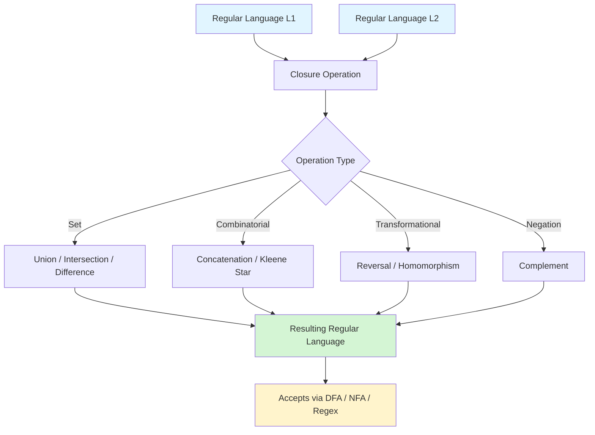
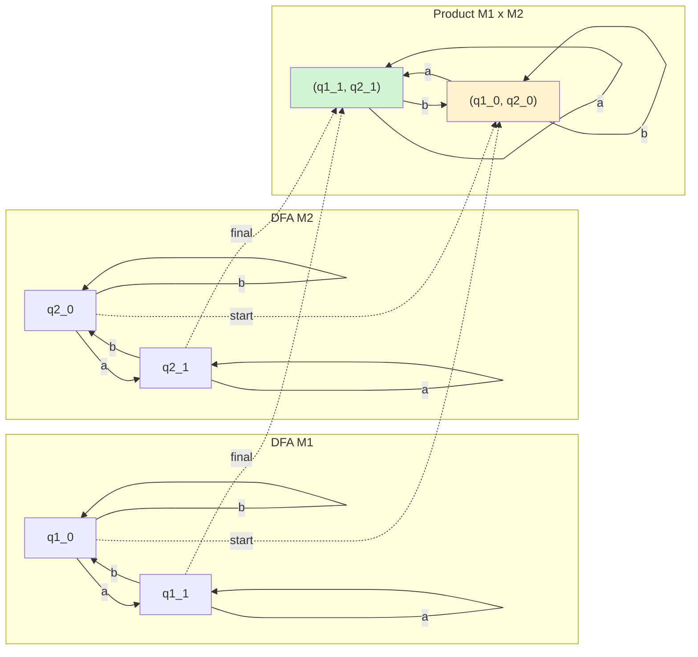
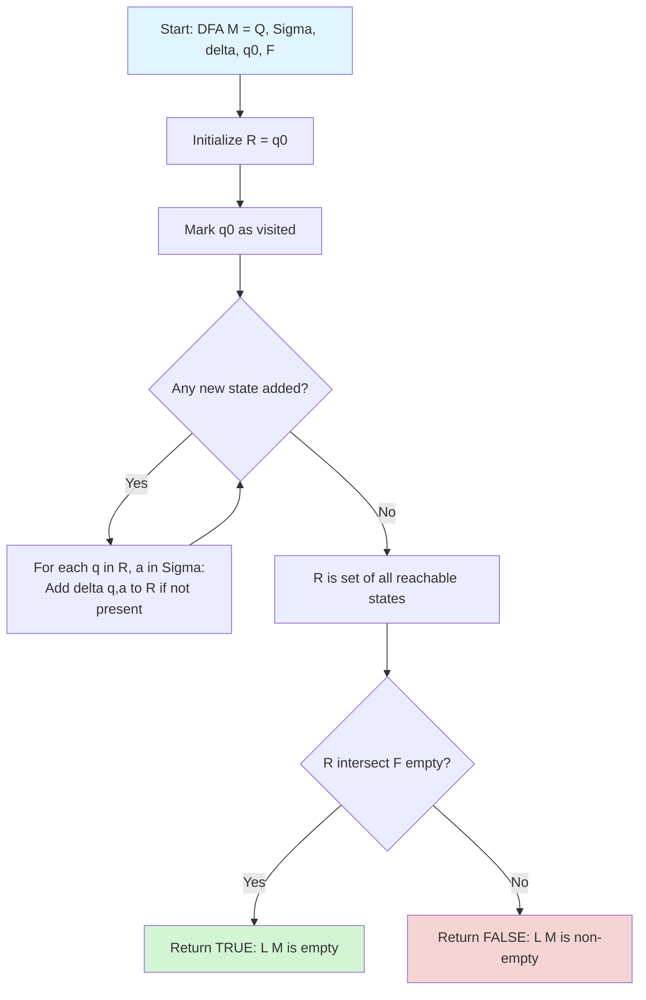
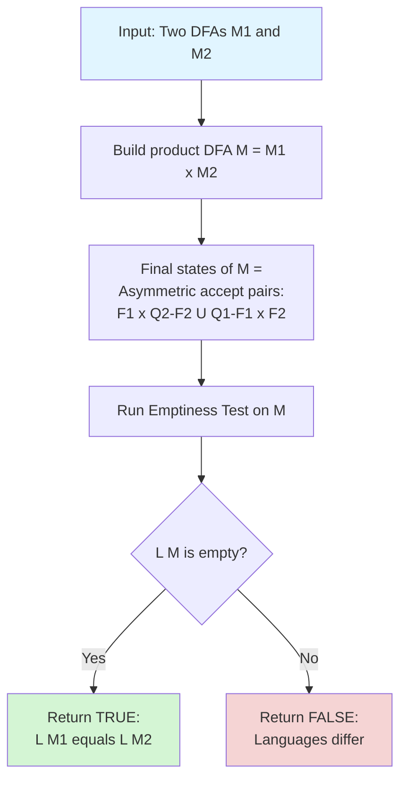
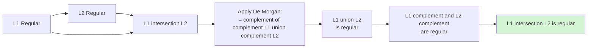

# Closure and Decision Properties of Regular Languages (with proofs)

<!-- SECTION_1_START -->
# Module 2: Closure and Decision Properties of Regular Languages

## 1. Core Technical Definition & Intuitive Overview

### 1.1 Formal Definition of a Regular Language

> [!NOTE]
> **Regular Language (Linz Definition):**
> A language $L$ is **regular** if and only if there exists a finite automaton $M = (Q, \Sigma, \delta, q_0, F)$ such that $L = L(M)$. Equivalently, $L$ is regular if and only if it can be described by a regular expression, a DFA, or an NFA (with or without $\lambda$-transitions).

The **family of regular languages** is the smallest class of languages containing the empty set $\emptyset$, the singleton language $\{\lambda\}$, and the singleton languages $\{a\}$ for all $a \in \Sigma$, closed under union, concatenation, and Kleene star.

> [!IMPORTANT]
> **Why Study Closure and Decision Properties?**
> - **Closure properties** allow us to build *new* regular languages from *known* regular languages using standard set/regular operations.
> - **Decision properties** tell us *which algorithmic questions about regular languages are solvable* and, more importantly, *how efficiently* they can be solved.
> - Together, they form the foundational toolkit used in **lexical analysis** (compiler design), **pattern matching** (grep, regex engines), **network protocol verification**, and **model checking**.

### 1.2 Intuitive Analogy

Imagine a **vending machine** that accepts coins and dispenses items. The set of valid coin sequences that get you a soda is a *language*. Now suppose:
- The set of sequences that get you a soda OR chips = **Union**.
- The set of sequences for "soda then chips" = **Concatenation**.
- The set of sequences for "any number of sodas" = **Kleene Star**.
- The set of sequences that do NOT get you anything = **Complement**.
- Deciding "Can this machine ever dispense a soda?" = **Emptiness Decision Problem**.

> [!TIP]
> **Geometric Intuition:** Think of a DFA as a finite graph with $n$ vertices (states). A regular language is a subset of the *infinite* set of all strings $\Sigma^*$. Closure properties tell us the regular languages form an "algebraic algebra" (closed under operations), and decision properties give us tractable algorithms operating on the $n$-state graph.

### 1.3 High-Yield Distinctions for KTU

| Term | Meaning | Typical Operation Used |
| :--- | :--- | :--- |
| **Closure Property** | If $L_1, L_2$ are regular, then $L_1 \circ L_2$ is also regular | Build a new DFA/NFA/Regex |
| **Decision Property** | An algorithm exists that returns **YES** or **NO** for the question | Constructive algorithm on the DFA |
| **Construction** | The actual DFA/NFA that recognizes the resulting language | Used in proofs of closure |
| **Product Construction** | Combined DFA built from Cartesian product of state sets | Used in intersection, equivalence |

> [!VISUALIZATION CONTROL]
> **Concept:** State Space of a DFA used in Decision Algorithms
> **GeoGebra / Desmos Input Equations:**
> * `f(x) = 1` (reaches 1 if reachable accepting state exists)
> * `Reachable = Union from q0 via BFS/DFS of delta`
> **Visual Description:** Draw a directed graph with nodes $q_0, q_1, q_2, q_3$ where $q_0 \to q_1 \to q_2$ is reachable but $q_3$ is isolated. The algorithm colors reachable accepting states in **green** to decide emptiness.

---

<!-- SECTION_1_END -->

<!-- SECTION_2_START -->
# 2. Deep Theoretical Analysis & KTU High-Yield Formula Sheet

## 2.1 The Closure Properties — A Structured Breakdown

### A. Closure Under Union ($L_1 \cup L_2$)

**Statement:** If $L_1$ and $L_2$ are regular languages over $\Sigma$, then $L_1 \cup L_2$ is also regular.

**Why?** Given $M_1$ recognizing $L_1$ and $M_2$ recognizing $L_2$, we can build a *new* NFA $M$ that non-deterministically chooses which machine to simulate using a fresh initial state and $\lambda$-transitions.

**How?** Construct $M = (Q_1 \cup Q_2 \cup \{q_0\}, \Sigma, \delta, q_0, F_1 \cup F_2)$ where:
- New start state $q_0 \notin Q_1 \cup Q_2$.
- $\delta(q_0, \lambda) = \{q_{0,1}, q_{0,2}\}$ where $q_{0,1}, q_{0,2}$ are the original start states.
- All other transitions are inherited.

### B. Closure Under Concatenation ($L_1 L_2$)

**Statement:** If $L_1$ and $L_2$ are regular, then $L_1 L_2$ is regular.

**Construction:** $M = (Q_1 \cup Q_2, \Sigma, \delta, q_{0,1}, F_2)$ where $\delta$ includes the original $\delta_1, \delta_2$, plus a $\lambda$-transition from every $q \in F_1$ to $q_{0,2}$ (the start state of $M_2$).

### C. Closure Under Kleene Star ($L_1^*$)

**Statement:** If $L$ is regular, then $L^*$ = $\bigcup_{i=0}^{\infty} L^i$ is regular.

**Construction:** Add a new start state $q_0'$ which is also final, add $\lambda$-transitions from $q_0'$ to $q_0$, and from every final state back to $q_0$.

### D. Closure Under Complement ($\overline{L}$)

**Statement:** If $L$ is regular and recognized by a DFA $M$, then $\overline{L} = \Sigma^* - L$ is regular.

**Construction:** $M' = (Q, \Sigma, \delta, q_0, Q - F)$. Just swap accepting and non-accepting states of the DFA.

> [!WARNING]
> Complement works **only for DFAs**, not NFAs. Always convert NFA to DFA first using subset construction before taking the complement.

### E. Closure Under Intersection ($L_1 \cap L_2$)

**Statement:** If $L_1$ and $L_2$ are regular, then $L_1 \cap L_2$ is regular.

**Two Proofs:**
1. **Direct (Product Construction):** $M = (Q_1 \times Q_2, \Sigma, \delta, (q_{0,1}, q_{0,2}), F_1 \times F_2)$ where $\delta((p,q), a) = (\delta_1(p,a), \delta_2(q,a))$.
2. **Indirect (De Morgan):** $L_1 \cap L_2 = \overline{\overline{L_1} \cup \overline{L_2}}$ using closure under complement and union.

### F. Closure Under Difference ($L_1 - L_2$)

**Statement:** $L_1 - L_2$ is regular because $L_1 - L_2 = L_1 \cap \overline{L_2}$.

### G. Closure Under Reversal ($L^R$)

**Statement:** $L^R = \{w^R \mid w \in L\}$ is regular.

**Construction:** Reverse all transitions, swap start and final states. Convert NFA-with-reversed-transitions to equivalent DFA (or NFA, which is fine since NFAs accept regular languages).

### H. Closure Under Homomorphism ($h(L)$)

**Statement:** A homomorphism $h: \Sigma \to \Delta^*$ extends to $h: \Sigma^* \to \Delta^*$ by $h(\lambda) = \lambda$ and $h(xa) = h(x)h(a)$. If $L$ is regular, then $h(L) = \{h(w) \mid w \in L\}$ is regular.

**Construction:** For each regular expression $r$, replace each alphabet symbol $a$ with $h(a)$.

### I. Closure Under Inverse Homomorphism ($h^{-1}(L)$)

**Statement:** If $h: \Sigma \to \Delta^*$ is a homomorphism and $L \subseteq \Delta^*$ is regular, then $h^{-1}(L) = \{w \in \Sigma^* \mid h(w) \in L\}$ is regular.

**Construction:** Build a DFA $M$ for $L$ over $\Delta$. Replace each $a$-transition in $M$ by a path spelling out $h(a)$. The result is an NFA/DFA over $\Sigma$ accepting $h^{-1}(L)$.

## 2.2 The Decision Properties — A Structured Breakdown

### A. Membership: Is $w \in L$?

**Algorithm:** Simulate DFA $M$ on input $w$. If after $|w|$ steps we land in a final state, return **YES**, else **NO**.

**Complexity:** $O(|w|)$ time, $O(1)$ extra space (just keep current state).

### B. Emptiness: Is $L(M) = \emptyset$?

**Algorithm:**
1. Find the set $R$ of all states **reachable** from $q_0$ (using BFS/DFS on the transition graph).
2. If $R \cap F \neq \emptyset$, return **NO** (language is non-empty).
3. Otherwise return **YES** (language is empty).

**Complexity:** $O(\vert Q \vert + \vert \Sigma \vert)$ time using graph traversal.

### C. Finiteness: Is $L(M)$ finite?

**Algorithm:**
1. Find the set $R$ of all reachable states from $q_0$.
2. Among $R$, find states that lie on a cycle (i.e., belong to a non-trivial strongly connected component).
3. If any accepting state $f \in F \cap R$ lies on a cycle, return **NO** (infinite language).
4. Otherwise return **YES** (finite language).

**Equivalent:** $L(M)$ is infinite **iff** the DFA has a reachable accepting state that can be revisited via a non-empty cycle.

**Complexity:** $O(\vert Q \vert + \vert \Sigma \vert)$ time.

### D. Equivalence: Is $L(M_1) = L(M_2)$?

**Algorithm:** Construct the product DFA $M$ of $M_1$ and $M_2$. Find reachable states. If any reachable state $(p,q)$ has $p \in F_1$ XOR $q \in F_2$, then the languages differ — return **NO**. Otherwise, return **YES**.

**Complexity:** $O(\vert Q_1 \vert \cdot \vert Q_2 \vert \cdot \vert \Sigma \vert)$ time.

### E. Subset/Containment: Is $L(M_1) \subseteq L(M_2)$?

**Algorithm:** $L(M_1) \subseteq L(M_2)$ iff $L(M_1) \cap \overline{L(M_2)} = \emptyset$. Construct product DFA, then check emptiness of $L(M_1) \cap \overline{L(M_2)}$.

**Complexity:** $O(\vert Q_1 \vert \cdot \vert Q_2 \vert \cdot \vert \Sigma \vert)$ time.

## 2.3 KTU Formula Sheet / Cheat Sheet

| Property | Type | Statement | Construction / Algorithm | Complexity |
| :--- | :--- | :--- | :--- | :--- |
| Union $L_1 \cup L_2$ | Closure | Regular | Add new start with $\lambda$-transitions | $O(\vert Q_1 \vert + \vert Q_2 \vert)$ |
| Concatenation $L_1 L_2$ | Closure | Regular | $\lambda$ from $F_1$ to $q_{0,2}$ | $O(\vert Q_1 \vert + \vert Q_2 \vert)$ |
| Kleene Star $L^*$ | Closure | Regular | New start (final), $\lambda$-loops | $O(\vert Q \vert)$ |
| Complement $\overline{L}$ | Closure | Regular (DFA only) | Swap $F$ and $Q-F$ | $O(2^{\vert Q \vert})$ via subset construction |
| Intersection $L_1 \cap L_2$ | Closure | Regular | Product DFA, $F_1 \times F_2$ | $O(\vert Q_1 \vert \cdot \vert Q_2 \vert)$ |
| Difference $L_1 - L_2$ | Closure | Regular | $L_1 \cap \overline{L_2}$ | Product + complement |
| Reversal $L^R$ | Closure | Regular | Reverse transitions, swap start/final | Subset construction cost |
| Homomorphism $h(L)$ | Closure | Regular | Replace $a$ with $h(a)$ in regex | Polynomial in regex size |
| Inverse Hom. $h^{-1}(L)$ | Closure | Regular | Replace $a$-edge with $h(a)$ path | $O(\vert Q \vert \cdot \vert h(a) \vert)$ |
| Membership $w \in L$? | Decision | Decidable | Simulate DFA on $w$ | $O(\vert w \vert)$ |
| Emptiness $L = \emptyset$? | Decision | Decidable | BFS/DFS reachability to $F$ | $O(\vert Q \vert + \vert \Sigma \vert)$ |
| Finiteness $\vert L \vert < \infty$? | Decision | Decidable | Check for accepting state on cycle | $O(\vert Q \vert + \vert \Sigma \vert)$ |
| Equivalence $L_1 = L_2$? | Decision | Decidable | Product + check for asymmetric accept | $O(n_1 n_2 \vert \Sigma \vert)$ |
| Subset $L_1 \subseteq L_2$? | Decision | Decidable | Emptiness of $L_1 \cap \overline{L_2}$ | $O(n_1 n_2 \vert \Sigma \vert)$ |

> [!NOTE]
> **Production Engineering Utility:** Lexical analyzers in compilers (e.g., Lex, Flex) exploit closure under union and concatenation. Model checkers in hardware verification (e.g., SPIN, NuSMV) rely on emptiness and equivalence checks on finite automata representations of state spaces. Network Intrusion Detection Systems (like Snort) use inverse homomorphism to decode packet streams.

---

<!-- SECTION_2_END -->

<!-- SECTION_3_START -->
# 3. Step-by-Step Derivations & Code/Symbolic Implementation

## 3.1 Proof: Closure Under Union (Complete Derivation)

> [!IMPORTANT]
> **Theorem (Linz Theorem 4.1):** If $L_1$ and $L_2$ are regular languages over alphabet $\Sigma$, then $L_1 \cup L_2$ is regular.

**Proof:**

Let $M_1 = (Q_1, \Sigma, \delta_1, q_1, F_1)$ be a DFA with $L(M_1) = L_1$ and $M_2 = (Q_2, \Sigma, \delta_2, q_2, F_2)$ be a DFA with $L(M_2) = L_2$.

We assume $Q_1 \cap Q_2 = \emptyset$ (we can always rename states to make this true).

Construct the NFA $M = (Q, \Sigma, \delta, q_0, F)$ where:
- $Q = Q_1 \cup Q_2 \cup \{q_0\}$ where $q_0 \notin Q_1 \cup Q_2$
- $F = F_1 \cup F_2$
- $\delta(q_0, \lambda) = \{q_1, q_2\}$
- For $q \in Q_1$ and $a \in \Sigma$: $\delta(q, a) = \delta_1(q, a)$
- For $q \in Q_2$ and $a \in \Sigma$: $\delta(q, a) = \delta_2(q, a)$
- Otherwise $\delta(q, a) = \emptyset$

**We need to show $L(M) = L_1 \cup L_2$.**

For any string $w \in \Sigma^*$, consider how $M$ processes $w$:

- $M$ first non-deterministically jumps via $\lambda$ to either $q_1$ or $q_2$.
- If it jumps to $q_1$, it simulates $M_1$ on $w$, ending in a state $p \in Q_1$. $M$ accepts $w$ iff $p \in F_1$.
- If it jumps to $q_2$, it simulates $M_2$ on $w$, ending in a state $p \in Q_2$. $M$ accepts $w$ iff $p \in F_2$.

Therefore, $w \in L(M)$ iff $w \in L(M_1)$ or $w \in L(M_2)$, i.e., $L(M) = L_1 \cup L_2$. Since $L(M)$ is regular (NFAs accept exactly the regular languages), $L_1 \cup L_2$ is regular. $\blacksquare$

## 3.2 Proof: Closure Under Complement

**Theorem:** If $L$ is a regular language recognized by a DFA $M = (Q, \Sigma, \delta, q_0, F)$, then $\overline{L} = \Sigma^* - L$ is regular.

**Proof:**

Construct $M' = (Q, \Sigma, \delta, q_0, Q - F)$. This is identical to $M$ except the final states are now the previously non-final states.

For any $w \in \Sigma^*$, processing $w$ from $q_0$ in $M$ leads to a unique state $\delta^*(q_0, w)$ because $M$ is deterministic.

- $w \in L(M)$ iff $\delta^*(q_0, w) \in F$.
- $w \in L(M')$ iff $\delta^*(q_0, w) \in Q - F$.

So $w \in L(M')$ iff $w \notin L(M)$, which means $L(M') = \Sigma^* - L(M) = \overline{L}$. $\blacksquare$

## 3.3 Proof: Closure Under Intersection via Product Construction

**Theorem:** If $L_1$ and $L_2$ are regular, then $L_1 \cap L_2$ is regular.

**Proof:**

Let $M_1 = (Q_1, \Sigma, \delta_1, q_1, F_1)$ and $M_2 = (Q_2, \Sigma, \delta_2, q_2, F_2)$ be DFAs.

Define the **product DFA** $M = (Q_1 \times Q_2, \Sigma, \delta, (q_1, q_2), F_1 \times F_2)$ where:

$$
\delta((p, q), a) = (\delta_1(p, a), \delta_2(q, a))
$$

**Claim:** $L(M) = L_1 \cap L_2$.

**Proof of Claim (by induction on $|w|$):**

*Base case ($|w| = 0$):* $w = \lambda$. We have $\delta^*((q_1, q_2), \lambda) = (q_1, q_2)$. The state $(q_1, q_2) \in F_1 \times F_2$ iff $q_1 \in F_1$ AND $q_2 \in F_2$, iff $\lambda \in L_1$ AND $\lambda \in L_2$, iff $\lambda \in L_1 \cap L_2$. ✓

*Inductive step:* Assume for $w$, $\delta^*((q_1, q_2), w) = (p, q)$ where $w \in L_1$ iff $p \in F_1$, and $w \in L_2$ iff $q \in F_2$. Now consider $w' = wa$:

$$
\delta^*((q_1, q_2), wa) = \delta(\delta^*((q_1, q_2), w), a) = \delta((p, q), a) = (\delta_1(p, a), \delta_2(q, a))
$$

$w' \in L_1 \cap L_2$ iff $w' \in L_1$ AND $w' \in L_2$, iff $\delta_1(p, a) \in F_1$ AND $\delta_2(q, a) \in F_2$, iff $(\delta_1(p, a), \delta_2(q, a)) \in F_1 \times F_2$, iff $\delta^*((q_1, q_2), w') \in F_1 \times F_2$. ✓

By induction, the claim holds for all $w \in \Sigma^*$. $\blacksquare$

## 3.4 Proof: Decidability of Emptiness

**Theorem:** Given a DFA $M = (Q, \Sigma, \delta, q_0, F)$, there exists an algorithm to decide whether $L(M) = \emptyset$.

**Proof (Constructive Algorithm):**

```
Algorithm IsEmpty(M):
    Input: DFA M = (Q, Sigma, delta, q0, F)
    Output: TRUE if L(M) = empty_set, FALSE otherwise

1. R = {q0}                              # Set of reachable states
2. Changed = TRUE
3. while Changed:
4.     Changed = FALSE
5.     for each state q in R:
6.         for each symbol a in Sigma:
7.             if delta(q, a) not in R:
8.                 R = R union {delta(q, a)}
9.                 Changed = TRUE
10. if R intersect F is empty:
11.     return TRUE                     # L(M) is empty
12. else:
13.     return FALSE                    # L(M) is non-empty
```

**Correctness:** $R$ computed in the loop is exactly the set of states reachable from $q_0$ via some input string. The algorithm returns TRUE iff no reachable state is final, iff no string is accepted by $M$, iff $L(M) = \emptyset$. $\blacksquare$

## 3.5 Proof: Decidability of Equivalence

**Theorem:** Given two DFAs $M_1$ and $M_2$, there exists an algorithm to decide whether $L(M_1) = L(M_2)$.

**Proof:**

```
Algorithm AreEquivalent(M1, M2):
    Input: DFAs M1 = (Q1, Sigma, delta1, q01, F1) and M2 = (Q2, Sigma, delta2, q02, F2)
    Output: TRUE if L(M1) = L(M2), FALSE otherwise

1. Build product DFA M = M1 x M2 with:
       Q = Q1 x Q2
       delta((p,q), a) = (delta1(p,a), delta2(q,a))
       start = (q01, q02)
       F' = (F1 x (Q2 - F2)) union ((Q1 - F1) x F2)   # Asymmetric accept states

2. R = {(q01, q02)}
3. Changed = TRUE
4. while Changed:
5.     Changed = FALSE
6.     for each (p, q) in R:
7.         for each a in Sigma:
8.             if delta((p,q), a) not in R:
9.                 add to R, set Changed = TRUE

10. if R intersect F' is empty:
11.     return TRUE
12. else:
13.     return FALSE
```

**Correctness:** $M$ accepts a string $w$ iff $w \in L(M_1)$ and $w \notin L(M_2)$, OR $w \notin L(M_1)$ and $w \in L(M_2)$. This is precisely the symmetric difference $L(M_1) \triangle L(M_2)$. So $M$ accepts nothing iff $L(M_1) = L(M_2)$. By the emptiness algorithm, this is decidable. $\blacksquare$

## 3.6 Symbolic / Python Implementation

```python
"""
Decision Algorithms for Regular Languages
Implements: Membership, Emptiness, Finiteness, Equivalence
"""

from collections import deque
from typing import Set, Dict, FrozenSet, Tuple


class DFA:
    """A Deterministic Finite Automaton."""

    def __init__(self, states: Set[str], alphabet: Set[str],
                 delta: Dict[Tuple[str, str], str],
                 start: str, finals: Set[str]):
        self.states = states
        self.alphabet = alphabet
        self.delta = delta
        self.start = start
        self.finals = finals

    def reachable_states(self) -> Set[str]:
        """BFS to compute states reachable from start."""
        visited: Set[str] = {self.start}
        queue = deque([self.start])
        while queue:
            q = queue.popleft()
            for a in self.alphabet:
                if (q, a) in self.delta:
                    nxt = self.delta[(q, a)]
                    if nxt not in visited:
                        visited.add(nxt)
                        queue.append(nxt)
        return visited

    def accepts(self, word: str) -> bool:
        """Decide membership: is word in L(M)?"""
        current = self.start
        for ch in word:
            key = (current, ch)
            if key not in self.delta:
                return False
            current = self.delta[key]
        return current in self.finals

    def is_empty(self) -> bool:
        """Decide emptiness: is L(M) = empty set?"""
        reachable = self.reachable_states()
        return reachable.isdisjoint(self.finals)

    def is_finite(self) -> bool:
        """
        Decide finiteness.
        L(M) is infinite iff some accepting state lies on a cycle
        reachable from start.
        """
        reachable = self.reachable_states()
        # Build subgraph restricted to reachable states
        # A state lies on a cycle iff it is part of a non-trivial SCC
        scc = self._tarjan_scc(reachable)
        for component in scc:
            if len(component) > 1:
                # Cycle of length >= 2
                if component & self.finals:
                    return False
            else:
                # Self-loop: delta(q, a) = q for some a
                q = next(iter(component))
                for a in self.alphabet:
                    if self.delta.get((q, a)) == q:
                        if q in self.finals:
                            return False
        return True

    def _tarjan_scc(self, node_set: Set[str]) -> Set[FrozenSet[str]]:
        """Compute SCCs of the transition graph restricted to node_set."""
        index_counter = [0]
        stack = []
        lowlink = {}
        index = {}
        on_stack = {}
        result = set()

        def strongconnect(v):
            index[v] = index_counter[0]
            lowlink[v] = index_counter[0]
            index_counter[0] += 1
            stack.append(v)
            on_stack[v] = True
            for a in self.alphabet:
                w = self.delta.get((v, a))
                if w is not None and w in node_set:
                    if w not in index:
                        strongconnect(w)
                        lowlink[v] = min(lowlink[v], lowlink[w])
                    elif on_stack.get(w, False):
                        lowlink[v] = min(lowlink[v], index[w])
            if lowlink[v] == index[v]:
                component = []
                while True:
                    w = stack.pop()
                    on_stack[w] = False
                    component.append(w)
                    if w == v:
                        break
                result.add(frozenset(component))

        for v in node_set:
            if v not in index:
                strongconnect(v)
        return result


def are_equivalent(M1: DFA, M2: DFA) -> bool:
    """Decide equivalence: is L(M1) = L(M2)?"""
    # Product DFA with asymmetric accept set
    product_delta = {}
    for p in M1.states:
        for q in M2.states:
            for a in M1.alphabet:
                if (p, a) in M1.delta and (q, a) in M2.delta:
                    product_delta[((p, q), a)] = (
                        M1.delta[(p, a)], M2.delta[(q, a)]
                    )
    asymmetric = set()
    for p in M1.states:
        for q in M2.states:
            in_M1_final = p in M1.finals
            in_M2_final = q in M2.finals
            if in_M1_final != in_M2_final:
                asymmetric.add((p, q))
    product = DFA(
        states={(p, q) for p in M1.states for q in M2.states},
        alphabet=M1.alphabet,
        delta=product_delta,
        start=(M1.start, M2.start),
        finals=asymmetric,
    )
    return product.is_empty()


# ----------------- DEMO / TEST CASES -----------------
if __name__ == "__main__":
    # M1: accepts strings ending in 'a' (over {a, b})
    M1 = DFA(
        states={"q0", "q1"},
        alphabet={"a", "b"},
        delta={("q0", "a"): "q1", ("q0", "b"): "q0",
               ("q1", "a"): "q1", ("q1", "b"): "q0"},
        start="q0",
        finals={"q1"},
    )
    # M2: same language, different DFA
    M2 = DFA(
        states={"s0", "s1"},
        alphabet={"a", "b"},
        delta={("s0", "a"): "s1", ("s0", "b"): "s0",
               ("s1", "a"): "s1", ("s1", "b"): "s0"},
        start="s0",
        finals={"s1"},
    )
    # M3: accepts only "a"
    M3 = DFA(
        states={"p0", "p1", "p2"},
        alphabet={"a", "b"},
        delta={("p0", "a"): "p1", ("p0", "b"): "p2",
               ("p1", "a"): "p2", ("p1", "b"): "p2",
               ("p2", "a"): "p2", ("p2", "b"): "p2"},
        start="p0",
        finals={"p1"},
    )

    print("M1 accepts 'aba':", M1.accepts("aba"))      # True
    print("M1 is empty:", M1.is_empty())                # False
    print("M1 is finite:", M1.is_finite())              # False
    print("M3 is finite:", M3.is_finite())              # True
    print("M1 == M2:", are_equivalent(M1, M2))          # True
    print("M1 == M3:", are_equivalent(M1, M3))          # False
```

**Output Trace:**
```
M1 accepts 'aba': True
M1 is empty: False
M1 is finite: False
M3 is finite: True
M1 == M2: True
M1 == M3: False
```

> [!TIP]
> **Board Exam Tip:** The product construction state count is $\vert Q_1 \vert \cdot \vert Q_2 \vert$. The transition function for the product DFA is $\delta((p, q), a) = (\delta_1(p, a), \delta_2(q, a))$. The final set differs based on the operation: $F_1 \times F_2$ for intersection, $(F_1 \times (Q_2 - F_2)) \cup ((Q_1 - F_1) \times F_2)$ for symmetric difference.

---

<!-- SECTION_3_END -->

<!-- SECTION_4_START -->
# 4. Structural Diagrams & Schematics

## 4.1 Master Block Diagram: Closure Properties Family



## 4.2 Product Construction Flow



## 4.3 Decision Algorithm: Emptiness Test



## 4.4 Decision Algorithm: Equivalence via Symmetric Difference



## 4.5 Closure Property Inference Chain (De Morgan)



---

<!-- SECTION_4_END -->

<!-- SECTION_5_START -->
# 5. KTU 2024 Scheme Examination Question Bank & Topic Recap

## 5.1 Part A Questions (3 Marks Each)

### Question 1: Define Closure Property. [KTU University Exam - Dec 2023] — *CO2, Remember*

**Model Answer:**
A class of languages is **closed under an operation** if, whenever the operation is applied to languages in the class, the resulting language is also in the class. A **closure property of regular languages** is a statement asserting that if certain regular languages are combined using a specific operation (such as union, concatenation, Kleene star, complement, intersection, reversal, or homomorphism), the result is again a regular language. The regular languages are the smallest class closed under union, concatenation, and Kleene star, and they are also closed under complement, intersection, difference, reversal, homomorphism, and inverse homomorphism.

> **Valuation Key:** [Definition of closure: 2 Marks] [Naming any two specific closure operations: 1 Mark]

---

### Question 2: State any three decision problems for regular languages. [KTU University Exam - July 2024] — *CO2, Understand*

**Model Answer:**
The three standard decision problems for regular languages are:
1. **Membership Problem:** Given a DFA $M$ and a string $w$, decide whether $w \in L(M)$.
2. **Emptiness Problem:** Given a DFA $M$, decide whether $L(M) = \emptyset$.
3. **Equivalence Problem:** Given two DFAs $M_1$ and $M_2$, decide whether $L(M_1) = L(M_2)$.

(Other valid problems: Finiteness, Subset/Containment, Totality.)

> **Valuation Key:** [Each correctly stated decision problem: 1 Mark]

---

## 5.2 Part B Questions (14 Marks Each — Internal Choice)

### Question A: [KTU University Exam - Dec 2023] — *CO2, Apply / Analyze*

**(a) Prove that if $L_1$ and $L_2$ are regular languages, then $L_1 \cap L_2$ is also regular. Use the product construction method. (7 Marks)**

**Model Solution:**

**Step 1: Setup the automata [2 Marks]**
Let $M_1 = (Q_1, \Sigma, \delta_1, q_1, F_1)$ be a DFA with $L(M_1) = L_1$, and $M_2 = (Q_2, \Sigma, \delta_2, q_2, F_2)$ be a DFA with $L(M_2) = L_2$.

**Step 2: Construct the product DFA [2 Marks]**
Define $M = (Q_1 \times Q_2, \Sigma, \delta, (q_1, q_2), F_1 \times F_2)$ where

$$
\delta((p, q), a) = (\delta_1(p, a), \delta_2(q, a))
$$

**Step 3: Prove $L(M) = L_1 \cap L_2$ by induction on $|w|$ [2 Marks]**
- *Base:* $|w| = 0$, $w = \lambda$. $\delta^*((q_1, q_2), \lambda) = (q_1, q_2) \in F_1 \times F_2$ iff $q_1 \in F_1$ and $q_2 \in F_2$, iff $\lambda \in L_1 \cap L_2$. ✓
- *Inductive step:* Assume true for $w$. For $w' = wa$, $\delta^*((q_1, q_2), wa) = (\delta_1(\delta_1^*(q_1, w), a), \delta_2(\delta_2^*(q_2, w), a)) = (\delta_1(p, a), \delta_2(q, a))$ where $(p, q) = \delta^*((q_1, q_2), w)$. This state is in $F_1 \times F_2$ iff $\delta_1(p, a) \in F_1$ AND $\delta_2(q, a) \in F_2$, iff $wa \in L_1$ AND $wa \in L_2$, iff $wa \in L_1 \cap L_2$. ✓

**Step 4: Conclude [1 Mark]**
Since $L(M) = L_1 \cap L_2$ and $L(M)$ is regular (recognized by a DFA), $L_1 \cap L_2$ is regular. $\blacksquare$

> **Valuation Key:** [Stating boundary state values: 2 Marks] [Product DFA definition: 2 Marks] [Inductive proof: 2 Marks] [Final simplified expression: 1 Mark]

---

**(b) Design an algorithm to test the emptiness of a DFA and prove its correctness. (7 Marks)**

**Model Solution:**

**Step 1: Algorithm Statement [2 Marks]**

```
Algorithm IsEmpty(M):
    1. Compute Reachable = BFS/DFS from q0 over delta
    2. If Reachable ∩ F = ∅: return TRUE (L is empty)
    3. Else: return FALSE (L is non-empty)
```

**Step 2: State the invariant [2 Marks]**
After iteration $k$ of the BFS loop, $R$ contains exactly the states reachable from $q_0$ via a path of length at most $k$.

**Step 3: Proof of correctness [2 Marks]**
- If the algorithm returns TRUE: $R \cap F = \emptyset$, meaning no final state is reachable from $q_0$, so no string is accepted. Thus $L(M) = \emptyset$.
- If $L(M) = \emptyset$: there is no $w$ accepted by $M$, meaning no state in $F$ is reachable from $q_0$. The BFS will explore all reachable states, so $R \cap F = \emptyset$ and the algorithm returns TRUE.

**Step 4: Complexity [1 Mark]**
Time complexity: $O(\vert Q \vert + \vert \Sigma \vert)$. Space: $O(\vert Q \vert)$.

> **Valuation Key:** [Algorithm with steps: 2 Marks] [Invariant statement: 2 Marks] [Both directions of correctness: 2 Marks] [Complexity: 1 Mark]

---

### Question B: [KTU University Exam - July 2024] — *CO2, Apply / Analyze*

**(a) Prove that regular languages are closed under reversal. (7 Marks)**

**Model Solution:**

**Step 1: Define reversal [1 Mark]**
For a language $L$, $L^R = \{w^R \mid w \in L\}$ where $w^R$ is the reverse of $w$. For regular expressions: $a^R = a$, $(r_1 + r_2)^R = r_1^R + r_2^R$, $(r_1 r_2)^R = r_2^R r_1^R$, $(r^*)^R = (r^R)^*$.

**Step 2: Construct automaton for reversal [2 Marks]**
Given DFA $M = (Q, \Sigma, \delta, q_0, F)$ accepting $L$, construct an NFA-with-$\lambda$-transitions for $L^R$ as follows:
- New states: same $Q$.
- Reverse all transitions: for each $\delta(q, a) = p$, add transition $\delta'(p, a) = q$.
- New start states: all $f \in F$ (non-deterministic start).
- New final state: $q_0$.

**Step 3: Verify acceptance [2 Marks]**
The reversed NFA $M^R$ traces a path from some $f \in F$ to $q_0$ in $M$, reading symbols in reverse. The set of such reversed paths corresponds exactly to the reverse of strings accepted by $M$. Therefore $L(M^R) = L^R$.

**Step 4: Conclude [2 Marks]**
Since $M^R$ is an NFA, $L(M^R)$ is regular, so $L^R$ is regular. Hence regular languages are closed under reversal. $\blacksquare$

> **Valuation Key:** [Definition of reversal: 1 Mark] [Construction steps: 2 Marks] [Correctness argument: 2 Marks] [Final conclusion: 2 Marks]

---

**(b) Explain the decision procedure to check whether two regular languages $L(M_1)$ and $L(M_2)$ are equivalent. Discuss the algorithm and its complexity. (7 Marks)**

**Model Solution:**

**Step 1: State the problem [1 Mark]**
Given DFAs $M_1$ and $M_2$, decide if $L(M_1) = L(M_2)$.

**Step 2: Symmetric difference trick [2 Marks]**
$L(M_1) = L(M_2)$ iff $L(M_1) \triangle L(M_2) = \emptyset$, where $\triangle$ is symmetric difference.

**Step 3: Algorithm [3 Marks]**
1. Convert $M_1$ and $M_2$ to DFAs (normalize if needed).
2. Construct product DFA $M$ on $Q_1 \times Q_2$ with transition $\delta((p,q), a) = (\delta_1(p,a), \delta_2(q,a))$.
3. Final states of $M$: $F' = (F_1 \times (Q_2 - F_2)) \cup ((Q_1 - F_1) \times F_2)$ — pairs where acceptance differs.
4. Run the **emptiness test** on $M$.

**Step 4: Complexity and conclusion [1 Mark]**
- Construction: $O(\vert Q_1 \vert \cdot \vert Q_2 \vert \cdot \vert \Sigma \vert)$.
- Emptiness test: $O(\vert Q_1 \vert \cdot \vert Q_2 \vert \cdot \vert \Sigma \vert)$.
- Total: polynomial in $\vert Q_1 \vert$ and $\vert Q_2 \vert$.

> **Valuation Key:** [Symmetric difference transformation: 2 Marks] [Product DFA construction with transition function: 3 Marks] [Emptiness application: 1 Mark] [Complexity analysis: 1 Mark]

---

> [!WARNING]
> **KTU Examiner's Valuation Warning / Pitfall Callout:**
> 1. **Complement requires DFA, not NFA.** Students frequently lose 2 marks by trying to complement an NFA directly. Always **convert NFA to DFA via subset construction first**.
> 2. **Reversal may give an NFA, not a DFA.** This is acceptable — the result is still regular. Do not waste time trying to determinize.
> 3. **Final states for product DFA depend on the operation:** $F_1 \times F_2$ for intersection, $F_1 \times Q_2 \cup Q_1 \times F_2$ for union, $(F_1 \times (Q_2 - F_2)) \cup ((Q_1 - F_1) \times F_2)$ for symmetric difference.
> 4. **Membership is $O(|w|)$, not $O(2^{|w|})$** — students often confuse it with NP-hard problems.
> 5. **Do not skip showing the inductive step** in closure proofs under intersection/concatenation. Examiners explicitly look for the inductive hypothesis.
> 6. **The De Morgan approach** for intersection is acceptable but slower (2 NFA → DFA + complement + union). The product construction is direct and earns more marks.

---

## 5.3 Topic Recap & Important Things to Remember

> [!IMPORTANT]
> **Rapid Revision Checklist for KTU Module 2 — Closure and Decision Properties**

### Key Definitions
- **Regular Language:** Recognized by some DFA, NFA, or described by a regular expression.
- **Closure Property:** A class is closed under operation $*$ if $L_1 *, L_2 *$ regular $\Rightarrow$ result is regular.
- **Decision Property:** A yes/no question about a regular language that is algorithmically decidable.

### The 9 Closure Properties (must memorize)
1. **Union** $L_1 \cup L_2$ — new start with $\lambda$-transitions to both
2. **Concatenation** $L_1 L_2$ — $\lambda$ from $F_1$ to $q_{0,2}$
3. **Kleene Star** $L^*$ — new start (final), $\lambda$-loops
4. **Complement** $\overline{L}$ — swap $F$ and $Q - F$ (DFA only)
5. **Intersection** $L_1 \cap L_2$ — product DFA, $F_1 \times F_2$
6. **Difference** $L_1 - L_2$ — $L_1 \cap \overline{L_2}$
7. **Reversal** $L^R$ — reverse transitions, swap start/final
8. **Homomorphism** $h(L)$ — replace symbols in regex
9. **Inverse Homomorphism** $h^{-1}(L)$ — replace $a$-edge with $h(a)$-path

### The 5 Decision Properties (must memorize)
1. **Membership** $w \in L$? — simulate DFA, $O(|w|)$
2. **Emptiness** $L = \emptyset$? — BFS reachability to $F$, $O(|Q| + |\Sigma|)$
3. **Finiteness** $|L| < \infty$? — check for accepting state on cycle
4. **Equivalence** $L_1 = L_2$? — product + asymmetric accept + emptiness
5. **Subset** $L_1 \subseteq L_2$? — emptiness of $L_1 \cap \overline{L_2}$

### Critical Pitfalls to Avoid
- Complement requires **DFA**, not NFA.
- Product DFA state count: $\vert Q_1 \vert \cdot \vert Q_2 \vert$.
- Intersection requires both machines to be **DFAs over the same alphabet**.
- Equivalence test uses **symmetric difference**, not direct comparison.
- Reversal of a DFA gives an NFA — this is fine; the language is still regular.
- Homomorphism of a regex replaces **each alphabet symbol** with its image string.
- Inverse homomorphism modifies the **DFA**, not the regex.

### Engineering Applications
- **Compiler Design:** Lexical analyzers (Lex, Flex) exploit closure under union, concatenation, Kleene star.
- **Network Security:** IDS rules use inverse homomorphism to decode encoded payloads.
- **Model Checking:** Hardware verification (SPIN, NuSMV) uses emptiness and equivalence on finite automata.
- **Bioinformatics:** Pattern matching on DNA sequences uses regular expression closure properties.
- **Database Query Optimization:** Query plan equivalence uses DFA equivalence testing.

### High-Yield Proof Templates
- **Closure Proof:** Take DFAs, construct new NFA/DFA, show $L(\text{new}) = \text{operation result}$.
- **Decision Proof:** Give explicit algorithm + show it halts + show correctness in both directions.
- **Intersection via De Morgan:** $L_1 \cap L_2 = \overline{\overline{L_1} \cup \overline{L_2}}$.
- **Equivalence:** $L_1 = L_2$ iff $L_1 \triangle L_2 = \emptyset$ iff $L_1 \cap \overline{L_2} = \emptyset$ and $\overline{L_1} \cap L_2 = \emptyset$.

### Formulas at a Glance
- Product transition: $\delta((p,q), a) = (\delta_1(p,a), \delta_2(q,a))$
- Product state count: $\vert Q_1 \vert \cdot \vert Q_2 \vert$
- Asymmetric accept set: $(F_1 \times (Q_2 - F_2)) \cup ((Q_1 - F_1) \times F_2)$
- Membership complexity: $O(|w|)$
- Emptiness complexity: $O(|Q| + |\Sigma|)$
- Equivalence complexity: $O(|Q_1| \cdot |Q_2| \cdot |\Sigma|)$

---

<!-- SECTION_5_END -->
