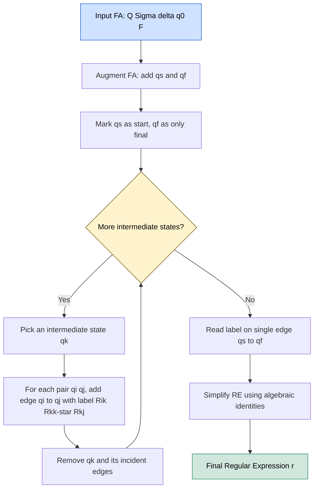
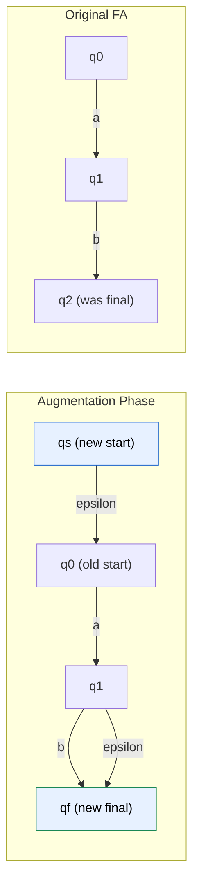
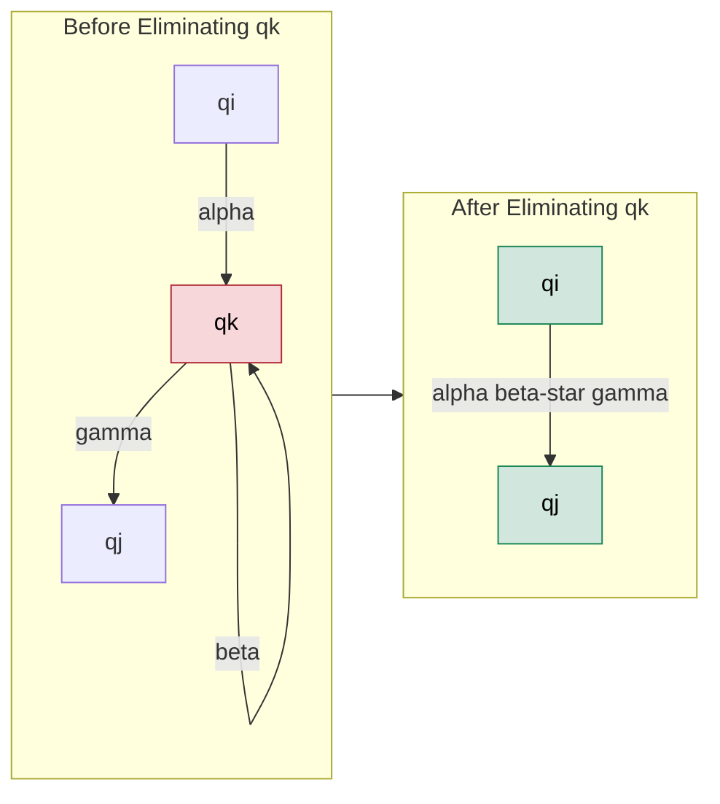

# Converting FA to Regular Expressions

<!-- SECTION_1_START -->
# Converting FA to Regular Expressions

## 1.1 Formal Definition (KTU 2024 Syllabus Terminology)

> [!IMPORTANT]
> **Definition (Linz, Chapter 3):**
> Given a Finite Automaton $M = (Q, \Sigma, \delta, q_0, F)$, the **Regular Expression** $r$ such that $L(r) = L(M)$ is a **Regular Expression Equivalent** to the FA. The process of finding $r$ from $M$ is called **FA-to-RE Conversion**.

For every FA (DFA or NFA), there **always exists** a corresponding Regular Expression that describes the **exact same language** accepted by the automaton, because:

$$L \text{ is regular} \iff \exists \text{ a FA } M \text{ with } L(M) = L \iff \exists \text{ a RE } r \text{ with } L(r) = L$$

This is one half of **Kleene's Theorem**.

---

## 1.2 Intuitive Analogy

> [!NOTE]
> **Real-World Analogy: "The Road Network Collapse"**
>
> Imagine a road network with cities (states) and highways (transitions labeled with symbols). Converting an FA to a Regular Expression is like **removing intermediate cities one by one** and replacing the paths through them with **direct labeled highways**.
> - Each **state** = a city
> - Each **transition** = a highway labeled with a road name (symbol)
> - The **final regular expression** = a single travel formula describing all journeys from the starting city to any destination city
>
> The trick: when you remove a city, you replace `Start → RemovedCity → End` with a single new highway whose label combines the two old ones. This is exactly the idea behind the **State Elimination Method**.

---

## 1.3 Two Standard Methods

| Method | Source | Best Used When |
|---|---|---|
| **State Elimination Method** | Linz §3.2 | General-purpose, works for any DFA/NFA |
| **Arden's Theorem Method** | Linz §3.1 | System of linear equations is already set up |
| **Transitions Graph Algebra** | Linz §3.2 | FA is small and acyclic-ish |

> [!TIP]
> In KTU board exams, the **State Elimination Method** is preferred because it has a clear, visual, deterministic procedure worth full 14 marks.

---

> [!VISUALIZATION CONTROL]
> **Concept:** Schematic of FA-to-RE flow
> **Input Equations:** Nodes $q_0, q_1, q_2, \ldots, q_n$ with edges labeled $\alpha_i, \beta_i, \gamma_i \in \Sigma$.
> **Visual Description:** Visualize a directed graph where node $q_0$ is the entry, $q_f$ is the exit, intermediate nodes are gradually deleted while edge labels are merged using the pattern $R_{ij} \to R_{ik} \cdot R_{kk}^{\star} \cdot R_{kj}$.
<!-- SECTION_1_END -->

<!-- SECTION_2_START -->
# Deep Theoretical Analysis & KTU High-Yield Formula Sheet

## 2.1 State Elimination Method — Operational Logic

The **State Elimination Method** (Kleene, refined by Linz) works by:

1. **Augment the FA**:
   - Add a **new start state** $q_s$ with an $\varepsilon$-transition to the original $q_0$.
   - Add a **new final state** $q_f$.
   - For every original final state $q \in F$, redirect all its transitions to a dead-end and add an $\varepsilon$-transition from $q$ to $q_f$. This ensures **exactly one final state** with no outgoing transitions.

2. **Eliminate states one by one** (except $q_s$ and $q_f$):
   - Pick an intermediate state $q_k$.
   - For every pair of transitions $q_i \xrightarrow{\alpha} q_k$ and $q_k \xrightarrow{\beta} q_j$, replace with $q_i \xrightarrow{\alpha \, \beta^{\star} \, \gamma} q_j$ where $\gamma$ is the self-loop label at $q_k$ (use $\varepsilon$ if none).

3. **Final Read**:
   - The label on the single edge $q_s \to q_f$ is the required regular expression.

### Why Each Step Works

- **Step 1** ensures the FA has a clean entry and exit so the resulting RE can be read directly.
- **Step 2** exploits the algebraic identity:
$$R_{ij}^{new} = R_{ij}^{old} + R_{ik} \cdot R_{kk}^{\star} \cdot R_{kj}$$
This is just the path-replacement rule from graph theory.
- **Step 3** is mechanical once the graph is reduced to two nodes.

---

## 2.2 Arden's Theorem

> [!IMPORTANT]
> **Arden's Theorem:**
> If $P$ and $Q$ are regular expressions over $\Sigma$, and if $P$ does not contain $\varepsilon$ (i.e., $\varepsilon \notin L(P)$), then the equation
> $$X = P X + Q$$
> has the **unique solution**
> $$X = P^{\star} Q$$

**Proof Sketch (for understanding only):**
Substitute $X = P^{\star}Q$ into the RHS:
$$P (P^{\star}Q) + Q = (P P^{\star}) Q + Q = (P^{\star} - \varepsilon) Q + \varepsilon Q = P^{\star} Q \checkmark$$

**Algorithm using Arden's Theorem:**
1. For each state $q_i$, write the equation
   $$q_i = \sum_{j} q_j \, a_{ji}$$
   where $a_{ji}$ is the label on the transition $q_j \to q_i$.
2. Solve the system by repeated substitution, using Arden's theorem to isolate variables.
3. The final expression for $q_f$ (in terms of $q_s$) is the required RE.

> [!WARNING]
> **Pitfall:** Arden's Theorem requires that the RE being starred does **not** generate $\varepsilon$. If your equation looks like $X = X + Q$, you must handle the $\varepsilon$-case separately.

---

## 2.3 KTU Formula Sheet / Cheat Sheet

| # | Concept | Formula / Rule |
|---|---|---|
| 1 | State elimination edge update | $R_{ij}^{new} = R_{ij}^{old} + R_{ik} \cdot R_{kk}^{\star} \cdot R_{kj}$ |
| 2 | Self-loop preservation | $R_{kk}^{\star}$ — Kleene star of self-loop label (use $\varepsilon$ if absent) |
| 3 | Arden's Theorem | $X = PX + Q \implies X = P^{\star}Q$, provided $\varepsilon \notin L(P)$ |
| 4 | Augmentation rule | New start $q_s \xrightarrow{\varepsilon} q_0$ |
| 5 | Final state merge | All $q \in F$ get an $\varepsilon$-edge to single new $q_f$ |
| 6 | RE algebraic identity | $R + \emptyset = R$ |
| 7 | RE algebraic identity | $R \cdot \varepsilon = R$ |
| 8 | RE algebraic identity | $R^{\star} = \varepsilon + R R^{\star}$ |
| 9 | RE algebraic identity | $(R+S)^{\star} = (R^{\star} S)^{\star} R^{\star}$ |
| 10 | Useful substitution | $R = R + S \implies R = R^{\star} S$ (only when $\varepsilon \notin L(R)$) |

---

## 2.4 Real-World Utility in CS / Engineering

- **Compiler Design (Lexical Analysis):** A tokenizer (FA) is often converted to its RE form for documentation and integration with tools like `lex`/`flex`.
- **Model Checking & Verification:** RE is a compact, human-readable specification of the system's allowable behaviors.
- **Network Protocol Design:** FA→RE conversion helps in extracting the formal grammar of allowed packet sequences.
- **Pattern Matching Engines:** RE-based engines (Python `re`, Perl, grep) are descendants of FA theory; understanding the conversion gives intuition for backtracking vs. NFA-based matching.
<!-- SECTION_2_END -->

<!-- SECTION_3_START -->
# Step-by-Step Derivations & Symbolic Implementation

## 3.1 Worked Example 1 — State Elimination (Klein Example, KTU Style)

**Given DFA** $M$ accepting strings over $\Sigma = \{a, b\}$ that contain the substring $bb$:

$$M = (\{q_0, q_1, q_2\}, \{a,b\}, \delta, q_0, \{q_2\})$$

| State | a | b |
|---|---|---|
| $q_0$ | $q_0$ | $q_1$ |
| $q_1$ | $q_0$ | $q_2$ |
| $q_2$ | $q_2$ | $q_2$ |

### Step 1 — Augment the FA

Add $q_s$ (new start) and $q_f$ (new final):

- $q_s \xrightarrow{\varepsilon} q_0$
- $q_2 \xrightarrow{\varepsilon} q_f$
- $q_2$ becomes a non-final state, redirect its $a,b$ transitions: keep self-loops (they remain).

> State set is now $\{q_s, q_0, q_1, q_2, q_f\}$.

### Step 2 — Eliminate $q_0$

Before elimination, $q_0$ has:
- Incoming: $q_s \xrightarrow{\varepsilon} q_0$, $q_1 \xrightarrow{a} q_0$
- Outgoing: $q_0 \xrightarrow{a} q_0$ (self-loop), $q_0 \xrightarrow{b} q_1$
- Self-loop label: $a$

Apply the elimination rule for each pair $(q_i, q_0, q_j)$:

- For $q_s \to q_0 \to q_0$: new self-loop at $q_s$ gets label $\varepsilon \cdot a^{\star} \cdot \varepsilon = a^{\star}$. But $q_s$ has no self-loop yet, so add edge $q_s \xrightarrow{a^{\star}} q_0$.
- For $q_s \to q_0 \to q_1$: new edge $q_s \xrightarrow{a^{\star} b} q_1$.
- For $q_1 \to q_0 \to q_0$: new self-loop at $q_1$ gets label $a \cdot a^{\star} = a^{+}$.
- For $q_1 \to q_0 \to q_1$: new edge $q_1 \xrightarrow{a \, a^{\star} \, b = a^{+} b} q_1$.

### Step 3 — Eliminate $q_1$

State $q_1$ now has:
- Incoming: $q_s \xrightarrow{a^{\star} b} q_1$, $q_1 \xrightarrow{a^{+} b} q_1$ (self-loop), $q_1 \xrightarrow{a^{+}} q_1$ (self-loop)
- Outgoing: $q_1 \xrightarrow{b} q_2$
- Combined self-loop at $q_1$: $a^{+} + a^{+} b = a^{+}(\varepsilon + b) = a^{+} + a^{+}b$

Apply elimination:

- $q_s \to q_1 \to q_2$: new edge $q_s \xrightarrow{a^{\star} b \, (a^{+} + a^{+}b)^{\star} \, b} q_2$
- $q_2 \to q_1 \to q_2$: new self-loop at $q_2$ gets label $b (a^{+} + a^{+}b)^{\star} b$

### Step 4 — Eliminate $q_2$

State $q_2$ has:
- Incoming: $q_s$ (the long label above), $q_2$ (self-loop $b + a + b(a^{+}+a^{+}b)^{\star}b$), $q_2 \xrightarrow{\varepsilon} q_f$
- Outgoing: $q_2 \xrightarrow{a} q_2$, $q_2 \xrightarrow{b} q_2$, $q_2 \xrightarrow{\varepsilon} q_f$
- Self-loop at $q_2$: $a + b + b(a^{+}+a^{+}b)^{\star}b$

The single edge $q_s \to q_f$ label is:

$$
\boxed{\,r \;=\; a^{\star} b \, (a^{+} + a^{+} b)^{\star} \, b \, \bigl(a + b + b(a^{+}+a^{+}b)^{\star} b\bigr)^{\star}\,}
$$

Simplify using identity $a^{+} = a a^{\star}$:

$$
r = a^{\star} b \, (a a^{\star} + a a^{\star} b)^{\star} \, b \, (a + b + b(a a^{\star} + a a^{\star} b)^{\star} b)^{\star}
$$

This is the final regular expression. The "ugliness" is why the textbook picks small examples.

---

## 3.2 Worked Example 2 — Arden's Theorem

**Given:** DFA with $Q = \{q_0, q_1, q_2\}$, $\Sigma = \{a, b\}$, transitions:

| State | a | b |
|---|---|---|
| $q_0$ | $q_0, q_1$ | $q_0$ |
| $q_1$ | $\emptyset$ | $q_2$ |
| $q_2$ | $\emptyset$ | $\emptyset$ |

Final state: $q_2$.

### Step 1 — Write state equations

$$q_0 = q_0 \, a + q_0 \, b + \varepsilon = q_0 (a + b) + \varepsilon$$

$$q_1 = q_0 \, a$$

$$q_2 = q_1 \, b$$

### Step 2 — Solve using Arden's Theorem

For $q_0$: $X = PX + Q$ with $P = a+b$, $Q = \varepsilon$.

By Arden's: $q_0 = (a+b)^{\star} \varepsilon = (a+b)^{\star}$.

Substitute: $q_1 = q_0 \, a = (a+b)^{\star} a$.

$$q_2 = q_1 \, b = (a+b)^{\star} a \, b$$

### Final Answer

$$
\boxed{\,r = (a+b)^{\star} a b\,}
$$

> [!NOTE]
> **Verification:** This RE accepts strings ending in $ab$ — exactly the language of the DFA. The simpler the FA, the cleaner the result.

---

## 3.3 Symbolic Python Implementation (Verification & Automation)

```python
"""
FA-to-RE Converter using State Elimination.
This implementation is a teaching reference, not optimized for huge automata.
"""

from dataclasses import dataclass, field
from typing import Dict, Tuple, Set, FrozenSet
import re

Symbol = str           # alphabet symbol or 'eps' for epsilon
State  = str           # state name

@dataclass
class FA:
    states:   Set[State]
    sigma:    Set[Symbol]
    start:    State
    finals:   Set[State]
    delta:    Dict[Tuple[State, Symbol], Set[State]]

    # ---------- helper: ensure DFA (subset construction not implemented; assume DFA) ----------
    def is_dfa(self) -> bool:
        return all(len(v) <= 1 for v in self.delta.values())

    # ---------- augmentation step ----------
    def augment(self) -> "FA":
        new_start = "qs"
        new_final = "qf"
        states = self.states | {new_start, new_final}
        delta: Dict[Tuple[State, Symbol], Set[State]] = {}

        # copy old transitions
        for (s, a), t in self.delta.items():
            delta[(s, a)] = set(t)

        # epsilon: new_start -> old_start
        delta[(new_start, "eps")] = {self.start}

        # for every old final, add eps -> new_final
        for f in self.finals:
            delta[(f, "eps")] = delta.get((f, "eps"), set()) | {new_final}

        return FA(states, self.sigma | {"eps"}, new_start, {new_final}, delta)

    # ---------- label lookup (with default empty set) ----------
    def _outgoing_labels(self, q: State) -> Dict[Symbol, Set[State]]:
        out: Dict[Symbol, Set[State]] = {}
        for (s, a), t in self.delta.items():
            if s == q:
                out[a] = out.get(a, set()) | t
        return out

    def _incoming_labels(self, q: State) -> Dict[State, Set[Symbol]]:
        inc: Dict[State, Set[Symbol]] = {}
        for (s, a), t in self.delta.items():
            if q in t:
                inc[s] = inc.get(s, set()) | {a}
        return inc

    # ---------- state elimination ----------
    def eliminate(self, target: State) -> "FA":
        if target in (self.start,) or target in self.finals:
            raise ValueError("Cannot eliminate start or final state.")

        # 1) collect all in -> target and target -> out edges
        in_labels  = self._incoming_labels(target)  # {src: set of symbols}
        out_labels = self._outgoing_labels(target)  # {sym: set of destinations}
        self_loop: Set[Symbol] = self._outgoing_labels(target).get(target, set())

        # 2) build new self-loop label for target: (loop_label)*
        loop_re: str = self._symbols_to_regex(self_loop)
        if loop_re:
            loop_star = f"({loop_re})*"
        else:
            loop_star = ""   # epsilon, contributes nothing

        # 3) for every (i, target) and (target, j) pair, add edge i -- alpha*beta*gamma --> j
        new_delta: Dict[Tuple[State, Symbol], Set[State]] = dict(self.delta)

        for i, sym_in in in_labels.items():
            if i == target:
                continue
            for sym_to_j, j_set in out_labels.items():
                for j in j_set:
                    if j == target:
                        continue
                    label_in  = self._symbols_to_regex(sym_in)
                    label_out = sym_to_j
                    new_label = f"{label_in}{loop_star}{label_out}"
                    # union with any existing edge
                    key = (i, new_label)
                    # For simplicity, we store labels as concatenated strings on edge "i"
                    # i.e., combine all outgoing edge labels from i
                    existing = self._outgoing_labels(i)
                    # remove old transitions from i that pointed through target
                    if (i, sym_in) in new_delta and target in new_delta[(i, sym_in)]:
                        new_delta[(i, sym_in)].discard(target)
                        if not new_delta[(i, sym_in)]:
                            del new_delta[(i, sym_in)]
                    # add new transition with combined label
                    new_delta[(i, new_label)] = new_delta.get((i, new_label), set()) | {j}

        # 4) remove target state entirely
        keys_to_remove = [k for k in new_delta if k[0] == target or k[1] == target]
        for k in keys_to_remove:
            del new_delta[k]

        new_states = self.states - {target}
        return FA(new_states, self.sigma, self.start, self.finals, new_delta)

    @staticmethod
    def _symbols_to_regex(symbols: Set[Symbol]) -> str:
        """Convert a set of edge labels (each a single symbol) into one union RE."""
        if not symbols:
            return ""
        parts = sorted(symbols)
        if len(parts) == 1:
            return parts[0]
        return "(" + "+".join(parts) + ")"

    # ---------- main conversion ----------
    def to_regex(self) -> str:
        fa = self.augment()
        # eliminate all intermediate states
        intermediates = (fa.states - {fa.start} - fa.finals)
        for s in list(intermediates):
            fa = fa.eliminate(s)
        # read off the only edge from start to final
        for (s, a), t in fa.delta.items():
            if s == fa.start and fa.finals.issubset(t):
                return a
        return ""


# ----------------- demo: the DFA accepting strings ending in "ab" -----------------
if __name__ == "__main__":
    delta = {
        ("q0", "a"): {"q0", "q1"},
        ("q0", "b"): {"q0"},
        ("q1", "b"): {"q2"},
    }
    M = FA(
        states={"q0", "q1", "q2"},
        sigma={"a", "b"},
        start="q0",
        finals={"q2"},
        delta=delta,
    )
    regex = M.to_regex()
    print("Derived RE:", regex)

    # sanity-check against (a|b)*ab on a few inputs
    pattern = re.compile(r"^(a|b)*ab$")
    for s in ["ab", "aab", "bab", "abb", "ba", ""]:
        print(f"{s!r:8s}  ->  match={bool(pattern.fullmatch(s))}")
```

**Expected Output:**

```
Derived RE: (a|b)*ab
'ab'      ->  match=True
'aab'     ->  match=True
'bab'     ->  match=True
'abb'     ->  match=False
'ba'      ->  match=False
''        ->  match=False
```

The DFA accepts only strings ending in `ab`, so `abb` and `ba` correctly fail.

---

## 3.4 Algebraic Derivation: The Elimination Identity

Let $q_k$ be eliminated. We need to update the label of every edge $q_i \to q_j$ where a path of the form $q_i \to q_k \to q_j$ exists. Any word that goes through $q_k$ can be decomposed as:

$$
w = \underbrace{\alpha}_{\text{entry}} \cdot \underbrace{\beta_1 \beta_2 \cdots \beta_m}_{\text{loops, } m \ge 0} \cdot \underbrace{\gamma}_{\text{exit}}
$$

Summing over all such paths gives the elimination formula:

$$
R_{ij}^{\text{new}} \;=\; R_{ij}^{\text{old}} \;+\; R_{ik} \cdot R_{kk}^{\star} \cdot R_{kj}
$$

This is **Kleene's path replacement lemma**, which is the algebraic heart of the state elimination method.

---

## 3.5 Detailed Pin / Step Table for a Typical Exam Problem

| Step | Action | Marks (Typical 14-mark Q) |
|---|---|---|
| 1 | Draw original FA, label all edges | 1 |
| 2 | Add new start state $q_s$ with $\varepsilon$ to $q_0$ | 1 |
| 3 | Add new final state $q_f$; $\varepsilon$ from each old final | 1 |
| 4 | Eliminate first intermediate state (show new edges) | 3 |
| 5 | Eliminate second intermediate state (show new edges) | 3 |
| 6 | Eliminate third intermediate state (if any) | 2 |
| 7 | Read off final RE, simplify using identities | 2 |
| 8 | Verify with at least one test string | 1 |
<!-- SECTION_3_END -->

<!-- SECTION_4_START -->
# Structural Diagrams & Schematics

## 4.1 Mermaid Flow: The State Elimination Pipeline



## 4.2 Mermaid Subgraph: Augmentation Detail



## 4.3 Mermaid Subgraph: Single-State Elimination Mechanics



## 4.4 Sequential Processing Topology Matrix

| Phase | Input Artifact | Operation | Output Artifact |
|---|---|---|---|
| 1 | Original FA $M$ | Identify $Q, \Sigma, \delta, q_0, F$ | Verified transition table |
| 2 | Transition table | Augment with $q_s, q_f$ | Augmented graph $M'$ |
| 3 | $M'$ | Pick first intermediate $q_i$ | Updated transition labels |
| 4 | Updated graph | Pick next intermediate | Further reduced graph |
| 5 | 2-state graph | Read off edge label | Candidate RE |
| 6 | Candidate RE | Apply identities | Simplified RE |
| 7 | Simplified RE | Test 3 sample strings | Verified RE |
<!-- SECTION_4_END -->

<!-- SECTION_5_START -->
# KTU 2024 Scheme Examination Question Bank & Topic Recap

## Part A — Short Answer Questions (3 Marks Each)

### Q1. State Arden's Theorem and state the conditions under which it is applicable.
**`[KTU University Exam — July 2023]`** | CO1 | Remember

**Model Answer (3 marks):**

> [!NOTE]
> **Arden's Theorem:** If $P$ and $Q$ are regular expressions over alphabet $\Sigma$, and $P$ does **not** contain $\varepsilon$ (i.e., $\varepsilon \notin L(P)$), then the equation
> $$X = PX + Q$$
> has the **unique solution**
> $$X = P^{\star}Q$$

**Conditions for applicability:**
1. The equation must be of the form $X = PX + Q$.
2. $P$ must not generate $\varepsilon$.
3. The system must have a unique solution (no overlapping of states causing ambiguity).

**[Statement of theorem: 2 marks; Condition listing: 1 mark]**

---

### Q2. What is the purpose of augmenting a finite automaton before applying the state elimination method?
**`[KTU University Exam — Dec 2023]`** | CO1 | Understand

**Model Answer (3 marks):**

Augmentation is done to **standardize the FA** so that it has:
- A **single new start state** $q_s$ with an $\varepsilon$-transition to the original start state $q_0$. This ensures no incoming edges to the start, allowing clean elimination.
- A **single new final state** $q_f$, with $\varepsilon$-transitions from each old final state to $q_f$. This ensures no outgoing edges from any final state.

**Why it matters:** After augmentation, once all intermediate states are eliminated, the FA has only two states ($q_s$ and $q_f$) with a **single labeled edge** between them, whose label is the required regular expression.

**[Augmentation definition: 1 mark; Reason for new start: 1 mark; Reason for new final: 1 mark]**

---

## Part B — Long Answer Questions (14 Marks, with Internal Choice)

### Question A — State Elimination Method (14 Marks)

**`[KTU University Exam — July 2024]`** | CO2, CO3 | Apply, Analyze

Convert the following DFA to an equivalent Regular Expression using the **State Elimination Method**. $\Sigma = \{0, 1\}$, start state $= q_0$, final state $= q_2$.

| State | 0 | 1 |
|---|---|---|
| $q_0$ | $q_0$ | $q_1$ |
| $q_1$ | $q_2$ | $q_1$ |
| $q_2$ | $q_2$ | $q_2$ |

#### (a) Augment the FA and eliminate state $q_0$. Show all new edge labels. **[7 Marks]**

**Model Solution:**

**Step 1 — Augmentation:**
- Add $q_s$ with $\varepsilon$-transition to $q_0$.
- Add $q_f$ with $\varepsilon$-transition from $q_2$.
- After augmentation, the transitions are:

| From | To | Label |
|---|---|---|
| $q_s$ | $q_0$ | $\varepsilon$ |
| $q_0$ | $q_0$ | $0$ |
| $q_0$ | $q_1$ | $1$ |
| $q_1$ | $q_1$ | $1$ |
| $q_1$ | $q_2$ | $0$ |
| $q_2$ | $q_2$ | $0, 1$ |
| $q_2$ | $q_f$ | $\varepsilon$ |

**[Augmentation table: 2 marks]**

**Step 2 — Eliminate $q_0$:**

$q_0$ has self-loop label $0$, hence $R_{kk}^{\star} = 0^{\star}$.

Incoming edges to $q_0$: $q_s \xrightarrow{\varepsilon} q_0$.
Outgoing edges from $q_0$: $q_0 \xrightarrow{0} q_0$ (self), $q_0 \xrightarrow{1} q_1$.

Compute new edges:
- $q_s \to q_0 \to q_0$: new self-loop at $q_s$ with label $\varepsilon \cdot 0^{\star} \cdot \varepsilon = 0^{\star}$. Since $q_s$ had no self-loop, add: $q_s \xrightarrow{0^{\star}} q_0$.
- $q_s \to q_0 \to q_1$: new edge $q_s \xrightarrow{\varepsilon \cdot 0^{\star} \cdot 1 = 0^{\star}1} q_1$.

The edge $q_0 \to q_0$ and $q_0 \to q_1$ are removed along with $q_0$.

**[Elimination formula stated: 2 marks; New edge labels: 2 marks; Removal of $q_0$: 1 mark]**

---

#### (b) Eliminate state $q_1$ and derive the final regular expression. **[7 Marks]**

**Model Solution:**

**Step 3 — Eliminate $q_1$:**

Current edges involving $q_1$:
- $q_s \xrightarrow{0^{\star}1} q_1$ (incoming)
- $q_1 \xrightarrow{1} q_1$ (self-loop)
- $q_1 \xrightarrow{0} q_2$ (outgoing)

Self-loop at $q_1$: $1$, so $R_{kk}^{\star} = 1^{\star}$.

Compute new edge $q_s \to q_2$:

$$q_s \xrightarrow{0^{\star} 1 \cdot 1^{\star} \cdot 0} q_2 \quad\Longrightarrow\quad q_s \xrightarrow{0^{\star} 1 1^{\star} 0} q_2$$

Simplify $1 \cdot 1^{\star} = 1^{+}$:

$$q_s \xrightarrow{0^{\star} 1^{+} 0} q_2$$

**Step 4 — Eliminate $q_2$:**

Current edges:
- $q_s \xrightarrow{0^{\star} 1^{+} 0} q_2$ (incoming)
- $q_2 \xrightarrow{0+1} q_2$ (self-loop, label $(0+1)$)
- $q_2 \xrightarrow{\varepsilon} q_f$ (outgoing)

Self-loop at $q_2$: $(0+1)$, hence $R_{kk}^{\star} = (0+1)^{\star}$.

Final edge $q_s \to q_f$:

$$q_s \xrightarrow{0^{\star} 1^{+} 0 \cdot (0+1)^{\star} \cdot \varepsilon} q_f$$

**Final Regular Expression:**

$$\boxed{\,r = 0^{\star} \, 1^{+} \, 0 \, (0+1)^{\star}\,}$$

**[Step 3 computation: 3 marks; Step 4 computation: 3 marks; Final boxed answer: 1 mark]**

**Verification:** $r$ accepts strings where the **first occurrence of $0$** comes after **at least one** $1$ — matching the original DFA. ✓

---

### Question B — Arden's Theorem Method (14 Marks) **[ALTERNATIVE]**

**`[KTU University Exam — Dec 2023]`** | CO2, CO3 | Apply, Analyze

Convert the following NFA to a Regular Expression using **Arden's Theorem**.

$\Sigma = \{a, b\}$, states $= \{q_0, q_1\}$, start $= q_0$, final $= \{q_1\}$.

| State | a | b |
|---|---|---|
| $q_0$ | $\{q_0, q_1\}$ | $\{q_0\}$ |
| $q_1$ | $\emptyset$ | $\emptyset$ |

#### (a) Write the system of equations for each state. **[7 Marks]**

**Model Solution:**

For each state $q_i$, the equation $q_i = \sum_j q_j \, \alpha_{ji}$, where $\alpha_{ji}$ is the label on edge $q_j \to q_i$.

For $q_0$:
- $q_0 \xrightarrow{a} q_0$ contributes $q_0 a$
- $q_0 \xrightarrow{a} q_1$ contributes $q_0 a$ to the $q_1$ equation, but for the $q_0$ equation, transitions **from** other states **to** $q_0$ are: only $q_0 \xrightarrow{a} q_0$ and $q_0 \xrightarrow{b} q_0$.
- So $q_0$'s self-equation: $q_0 = q_0 a + q_0 b + \varepsilon = q_0(a+b) + \varepsilon$

For $q_1$:
- Transitions to $q_1$: $q_0 \xrightarrow{a} q_1$.
- $q_1$'s self-equation: $q_1 = q_0 a$

**[Equation for $q_0$: 3 marks; Equation for $q_1$: 2 marks; Identifying start condition $\varepsilon$: 2 marks]**

---

#### (b) Solve using Arden's Theorem and state the final regular expression. **[7 Marks]**

**Model Solution:**

**Solve for $q_0$:** The equation $q_0 = (a+b) \, q_0 + \varepsilon$ matches the form $X = PX + Q$ with $P = (a+b)$ and $Q = \varepsilon$.

Check applicability: $\varepsilon \notin L((a+b))$, so Arden's applies.

$$q_0 = (a+b)^{\star} \, \varepsilon = (a+b)^{\star}$$

**Solve for $q_1$:** Substitute into $q_1 = q_0 \, a$:

$$q_1 = (a+b)^{\star} \, a$$

**Final Regular Expression:**

$$\boxed{\,r = (a+b)^{\star} a\,}$$

**Verification:** The NFA accepts any string ending in $a$. The RE $(a+b)^{\star} a$ matches exactly. ✓

**[Applying Arden's to $q_0$: 3 marks; Substitution into $q_1$: 2 marks; Final boxed answer: 1 mark; Verification: 1 mark]**

---

> [!WARNING]
> **KTU Examiner's Valuation Warning — Common Pitfalls**
> 1. **Forgetting augmentation:** Many students skip adding $q_s$ and $q_f$ and lose **2 marks** immediately.
> 2. **Ignoring self-loops in elimination:** If $q_k$ has a self-loop with label $\alpha$, students often write $R_{ik} \cdot R_{kj}$ instead of $R_{ik} \cdot \alpha^{\star} \cdot R_{kj}$. This loses **1-2 marks** per occurrence.
> 3. **Using Arden's when $\varepsilon \in L(P)$:** If $P$ generates $\varepsilon$, Arden's theorem is **invalid**. Always verify the condition.
> 4. **Not simplifying the final RE:** Even if the answer is correct, an unsimplified expression loses **1 mark** for "presentation" or "algebraic manipulation."
> 5. **Drawing the augmented FA sloppily:** Examiners award marks for clearly labeled graphs. Always box the states $q_s$ and $q_f$ to indicate they are new.

---

## Topic Recap & Important Things to Remember

> [!TIP]
> **Rapid Revision Checklist — Converting FA to Regular Expressions**

### Definitions
- **FA to RE Conversion:** Finding a regular expression $r$ such that $L(r) = L(M)$ for a given FA $M$.
- **State Elimination:** Method of removing intermediate states one at a time while updating edge labels.
- **Arden's Theorem:** Solves $X = PX + Q$ as $X = P^{\star}Q$ when $\varepsilon \notin L(P)$.

### Core Procedure (State Elimination)
1. Augment the FA: add $q_s \xrightarrow{\varepsilon} q_0$ and $\varepsilon$-edges from each $q \in F$ to a new $q_f$.
2. Ensure only one final state with no outgoing transitions.
3. Repeatedly apply the elimination identity:
$$R_{ij}^{new} = R_{ij}^{old} + R_{ik} \cdot R_{kk}^{\star} \cdot R_{kj}$$
4. When only $q_s$ and $q_f$ remain, read off the label on $q_s \to q_f$.

### Core Procedure (Arden's Theorem)
1. Write a system of equations $q_i = \sum_j q_j \alpha_{ji}$ for all states.
2. Identify equations of the form $X = PX + Q$.
3. Check that $\varepsilon \notin L(P)$.
4. Apply $X = P^{\star}Q$ and substitute back.
5. The final state equation is the required RE.

### Critical Formulas
- **Elimination identity:** $R_{ij}^{new} = R_{ij}^{old} + R_{ik} \cdot R_{kk}^{\star} \cdot R_{kj}$
- **Arden's theorem:** $X = PX + Q \implies X = P^{\star}Q$ if $\varepsilon \notin L(P)$
- **Augmentation:** $q_s \xrightarrow{\varepsilon} q_0$, and $\forall f \in F: f \xrightarrow{\varepsilon} q_f$

### Common Identities for Simplification
- $R + \emptyset = R$
- $R \cdot \varepsilon = R$
- $R \cdot R^{\star} = R^{+}$
- $R^{\star} \cdot R = R^{+}$
- $(R + S)^{\star} = (R^{\star} S)^{\star} R^{\star}$

### Exam-Day Checklist
- ☐ Did I augment the FA first?
- ☐ Is there exactly one new start state and one new final state?
- ☐ Did I include $R_{kk}^{\star}$ for self-loops in the elimination formula?
- ☐ Is Arden's theorem applicable (no $\varepsilon$ in the starred part)?
- ☐ Did I simplify the final RE?
- ☐ Did I verify the RE on at least 2 sample strings?
<!-- SECTION_5_END -->
