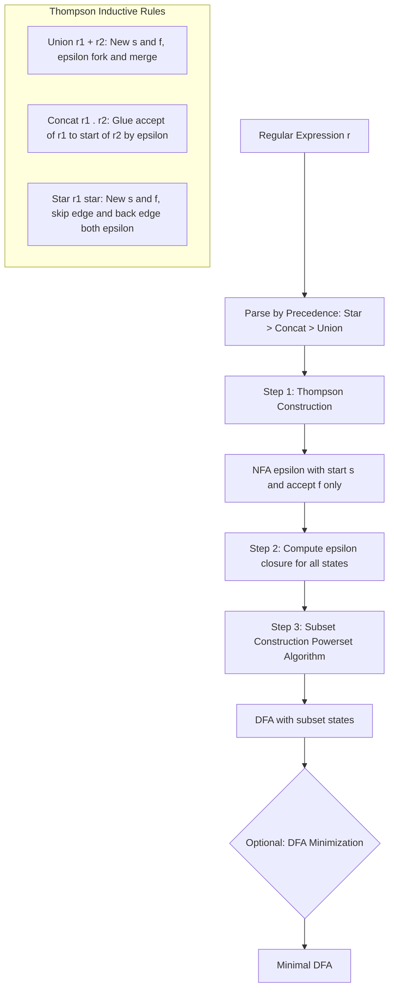
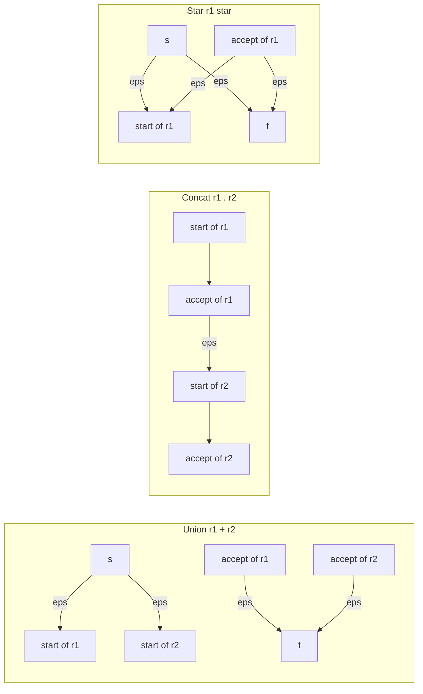
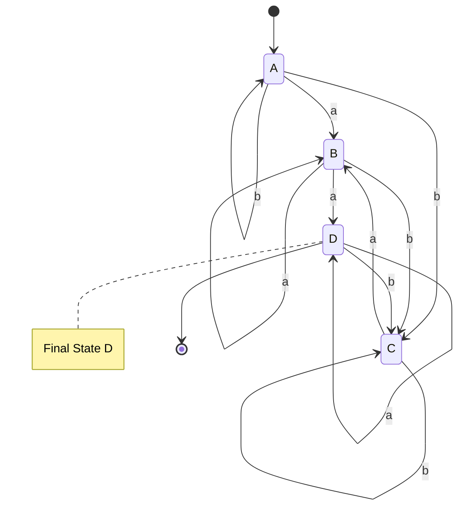
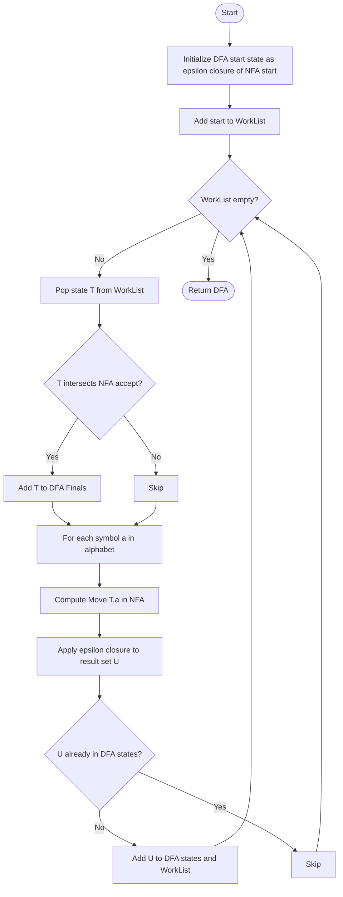

# Converting Regular Expressions to FA

<!-- SECTION_1_START -->
# Converting Regular Expressions to Finite Automata

## 1.1 Formal Definition (KTU 2024 Syllabus Terminology)

> [!IMPORTANT]
> **Core Definition (Linz, Chapter 3 — Theorem 3.1 & 3.2)**
> A **Regular Expression (RE)** is a compact, algebraic, symbolic way of describing a language. It is built from three fundamental operators — **union (+ or |)**, **concatenation (·)**, and **Kleene star (∗)** — applied over a finite alphabet $\Sigma$.

$$
r = \emptyset \;\mid\; \varepsilon \;\mid\; a \;\mid\; (r_1 + r_2) \;\mid\; (r_1 \cdot r_2) \;\mid\; (r_1)^{*}, \quad a \in \Sigma
$$

A **Finite Automaton (FA)** is a 5-tuple $M = (Q, \Sigma, \delta, q_0, F)$ where:
- $Q$ — finite set of states
- $\Sigma$ — finite input alphabet
- $\delta : Q \times \Sigma \rightarrow 2^{Q}$ (NFA) or $\delta : Q \times \Sigma \rightarrow Q$ (DFA)
- $q_0 \in Q$ — start state
- $F \subseteq Q$ — set of final/accepting states

> [!NOTE]
> **Kleene's Theorem (Central Bridge of Module 2):**
> A language $L$ is regular **if and only if** $L$ is accepted by some finite automaton.
> $$ L \text{ is regular} \iff \exists \text{ RE } r \text{ such that } L(r) = L(M) \iff \exists \text{ FA } M \text{ accepting } L $$
>
> This bi-conditional proof gives us **two directions**:
> 1. **FA → RE** (State Elimination Method — covered in earlier topic)
> 2. **RE → FA** (Thompson's Construction + Subset Construction) — **THIS TOPIC**

---

## 1.2 Conceptual Analogy / Intuition

> [!TIP]
> **Real-world Analogy: "The Recipe to the Vending Machine"**
>
> Imagine a **Regular Expression** is a *recipe* written in shorthand: "Make any sandwich containing either egg OR chicken, followed by bread, repeated as many times as you like."
>
> Converting an RE into a Finite Automaton is like translating that recipe into a **physical flowchart** inside a vending machine:
> - Each **node** in the flowchart is a "kitchen stage" (state).
> - Each **ingredient read** triggers a transition to the next stage.
> - The **Kleene star** becomes a "loop back" arrow allowing repetition.
> - The **union** becomes a "fork in the road" giving two alternative paths.
>
> The RE says *what is allowed*. The FA says *how to check it step by step*. Conversion means building a recognizer that mechanically validates the RE's language.

---

## 1.3 The Three-Stage Conversion Pipeline

> [!IMPORTANT]
> **The Canonical Pipeline (Standard KTU/Linz Approach):**
> $$\text{RE} \xrightarrow{\text{Step 1: Thompson's Construction}} \text{NFA-}\varepsilon \xrightarrow{\text{Step 2: Subset Construction}} \text{DFA} \xrightarrow{\text{Step 3 (Optional): Minimization}} \text{Minimal DFA}$$

**Why three stages?**
- **NFA-ε** is the *easiest* to construct directly from an RE (mechanical, rule-based).
- **NFA-ε** is *not* what students are asked to draw in KTU exams as final answer.
- **DFA** is the *canonical* form — easy to test, trace, and implement in code.
- **Minimal DFA** is the *optimized* form (lowest states, deterministic, no redundancy).

---

## 1.4 Visualization of the Concept

> [!VISUALIZATION CONTROL]
> **Concept:** The conversion pipeline as a directed acyclic information-flow graph.
> **GeoGebra / Desmos Input Equations (Parametric Sketch):**
> * Stage 1: `f(x) = x, x in [0, 1]` (linear: RE parsed character by character)
> * Stage 2: `f(x) = x^2, x in [0, 1]` (exponential — NFA state set grows)
> * Stage 3: `f(x) = sqrt(x), x in [0, 1]` (compressing — DFA is usually smaller)
> **Visual Description:** Plot a single curve on the unit square where x-axis represents "input length" and y-axis represents "state count complexity". Students should observe that NFA growth can be $2^n$ (worst case), but DFA growth flattens after subset construction collapses redundancy.

---
<!-- SECTION_1_END -->

<!-- SECTION_2_START -->
# Deep Theoretical Analysis & KTU High-Yield Formula Sheet

## 2.1 Thompson's Construction (RE → NFA-ε)

> [!NOTE]
> **Theorem (Thompson, 1968):** For every regular expression $r$ over $\Sigma$, there exists an NFA-$\varepsilon$ $N(r)$ with the following properties:
> 1. $N(r)$ has **exactly one** start state and **exactly one** accepting state.
> 2. The start state has **no incoming** transitions.
> 3. The accepting state has **no outgoing** transitions.
> 4. The total number of states is at most **$2 \times (\text{number of symbols in } r)$**.

**Why use $\varepsilon$-transitions?** Because Kleene star (loops) and union (branching) cannot be represented in a DFA directly — they require *silent* (epsilon) moves that the machine takes "without consuming any input."

### 2.1.1 Base Rules (Atomic REs)

| RE $r$ | NFA-$\varepsilon$ Diagram | State Count |
|:------:|:------------------------:|:-----------:|
| $\varepsilon$ | $\rightarrow \bigcirc \xrightarrow{\varepsilon} \bigcirc$ (double) | 2 |
| $\emptyset$ | $\rightarrow \bigcirc$ (no accept) | 1 |
| $a \in \Sigma$ | $\rightarrow \bigcirc \xrightarrow{a} \bigcirc$ (double) | 2 |

### 2.1.2 Inductive Rules (Compound REs)

| Construction | Symbol | Structural Rule | Verbal Description |
|:------------:|:------:|:---------------:|:------------------:|
| **Union** | $r = r_1 + r_2$ | Add new start $s$, new end $f$; $s \xrightarrow{\varepsilon} s_1, s_2$; $f_1, f_2 \xrightarrow{\varepsilon} f$ | "Fork then merge" |
| **Concatenation** | $r = r_1 \cdot r_2$ | Glue the accepting state of $N(r_1)$ to the start state of $N(r_2)$ via $\varepsilon$ | "Chain them" |
| **Kleene Star** | $r = r_1^{*}$ | Add new start $s$, new end $f$; back-edge $f_1 \xrightarrow{\varepsilon} s_1$; skip-edge $s \xrightarrow{\varepsilon} f$; start-edge $s \xrightarrow{\varepsilon} s_1$ | "Loop or skip" |

> [!TIP]
> **Memory Trick for Thompson's Rules:**
> - **Union** ⇒ "FORK–MERGE" (epsilon splits, epsilon rejoins)
> - **Concatenation** ⇒ "CHAIN" (epsilon glues end→start)
> - **Star** ⇒ "LOOP–SKIP" (epsilon back-edge + epsilon skip-edge)

### 2.1.3 Precedence Convention

> [!IMPORTANT]
> **Standard Operator Precedence (Highest to Lowest):**
> $$\text{Kleene Star } (*) \;\gg\; \text{Concatenation } (\cdot) \;\gg\; \text{Union } (+)$$
>
> Example: $a + b \cdot c^{*}$ parses as $a + (b \cdot (c^{*}))$, **NOT** as $(a+b) \cdot c^{*}$.

---

## 2.2 Subset Construction (NFA-ε → DFA)

> [!NOTE]
> **Algorithm (Rabin–Scott, 1959):** Given an NFA-$\varepsilon$ $N = (Q_N, \Sigma, \delta_N, q_0, F_N)$, construct an equivalent DFA $D = (Q_D, \Sigma, \delta_D, \{q_0\}, F_D)$ where each state of $D$ is a **set of states of $N$**.

### 2.2.1 The $\varepsilon$-Closure Function

> [!IMPORTANT]
> **Definition:** $\varepsilon\text{-closure}(q)$ is the set of all states reachable from $q$ using **only $\varepsilon$-transitions** (zero or more).
> $$\varepsilon\text{-closure}(q) = \{ p \in Q_N \mid p \text{ is reachable from } q \text{ using only } \varepsilon\text{-moves} \}$$

**Recursive definition for sets:**
$$\varepsilon\text{-closure}(S) = \bigcup_{q \in S} \varepsilon\text{-closure}(q)$$

**Algorithm to compute $\varepsilon$-closure(BFS-style):**
1. Initialize stack = $B$, visited = $B$.
2. While stack not empty: pop $q$. For every $p$ such that $q \xrightarrow{\varepsilon} p$:
   - If $p \notin$ visited, add to visited and push to stack.
3. Return visited.

### 2.2.2 The Subset Construction Algorithm

```
Algorithm Subset-Construct(N):
Input:  NFA-ε N = (Q_N, Σ, δ_N, q_0, F_N)
Output: DFA D = (Q_D, Σ, δ_D, q_D, F_D)

1. q_D ← ε-closure({q_0})
2. Q_D ← {q_D};  WorkList ← {q_D}
3. While WorkList ≠ ∅:
4.     Remove T from WorkList
5.     For each a ∈ Σ:
6.         U ← ε-closure( ∪_{q ∈ T} δ_N(q, a) )
7.         If U ∉ Q_D: add U to Q_D and WorkList
8.         δ_D(T, a) ← U
9. F_D ← { T ∈ Q_D | T ∩ F_N ≠ ∅ }
10. Return D
```

> [!WARNING]
> **Pitfall:** A DFA state is a **set** of NFA states. Students often forget to apply $\varepsilon$-closure *after* the NFA transition. The correct order is: **(1) NFA transition on $a$ → (2) $\varepsilon$-closure**. Skipping step 2 produces an incorrect DFA.

---

## 2.3 KTU Formula Sheet / Cheat Sheet

| # | Concept | Formula / Rule | Symbol / Set | Notes |
|:-:|:-------:|:--------------:|:------------:|:------|
| 1 | RE Grammar | $r = \emptyset \mid \varepsilon \mid a \mid (r_1+r_2) \mid (r_1 r_2) \mid r_1^{*}$ | $a \in \Sigma$ | The 6 syntactic forms |
| 2 | RE → NFA-ε state count | $\vert Q \vert \le 2 \cdot \vert r \vert$ | $\vert r \vert$ = # symbols | Worst-case bound |
| 3 | NFA-ε → DFA state count | $\vert Q_D \vert \le 2^{\vert Q_N \vert}$ | powerset bound | Tighter bound is empirical |
| 4 | $\varepsilon$-closure | $\varepsilon\text{-closure}(q) = \{p \mid q \xrightarrow{\varepsilon^{*}} p\}$ | recursive set | Includes $q$ itself |
| 5 | Subset transition | $\delta_D(T, a) = \varepsilon\text{-closure}\!\left(\bigcup_{q \in T} \delta_N(q, a)\right)$ | NFA-$\varepsilon$ | Apply closure after |
| 6 | Accepting in DFA | $F_D = \{T \subseteq Q_N \mid T \cap F_N \neq \emptyset\}$ | powerset | Any subset hitting $F_N$ is final |
| 7 | Kleene's Theorem | $L$ is regular $\iff \exists$ DFA $M$ s.t. $L = L(M)$ | equivalence | The bridge of Module 2 |
| 8 | Precedence | $*$ (highest) $> \cdot > \vert$ (lowest) | operator ranking | Use parentheses if unclear |
| 9 | Union rule (RE) | $L(r_1 + r_2) = L(r_1) \cup L(r_2)$ | set union | |
| 10 | Concat rule (RE) | $L(r_1 \cdot r_2) = \{ xy \mid x \in L(r_1), y \in L(r_2) \}$ | Cartesian product | |

---

## 2.4 Engineering Utility — Why This Conversion Matters

> [!TIP]
> **Real-World Production Applications:**
> 1. **Lexical Analyzers (Compilers):** Tools like **Lex**, **Flex**, and **ANTLR** take a regular expression (token definition) and internally invoke Thompson's + subset construction to generate a DFA that scans source code for tokens.
> 2. **Pattern Matching Engines:** `grep`, `sed`, and database query optimizers use RE-to-FA conversion to accelerate searches.
> 3. **Network Intrusion Detection Systems (IDS):** Snort rules are regular expressions internally compiled to NFAs/DFAs for high-speed packet inspection.
> 4. **DNA Sequence Analysis in Bioinformatics:** Motif matching in genomics pipelines.
> 5. **Form Validation in Web Apps:** Email/phone validators compiled once to a DFA, then run on every keystroke in $O(n)$ time.
>
> **Key Engineering Insight:** Converting an RE to a DFA yields a recognizer with **$O(n)$** worst-case runtime per input string of length $n$ — vastly faster than backtracking regex engines (which can be exponential in pathological cases, e.g., ReDoS attacks).

---
<!-- SECTION_2_END -->

<!-- SECTION_3_START -->
# Step-by-Step Derivations & Code Implementation

## 3.1 Worked Example 1: RE = $(a + b)^* a$ (Classic KTU Problem)

### Step 1 — Thompson's Construction (RE → NFA-ε)

Decompose the RE by precedence:
$$ r = (a + b)^{*} \cdot a $$

We build the NFA-$\varepsilon$ inside-out:

**Sub-step 1a:** $N(a)$ — atomic symbol
$$\rightarrow \bigcirc_1 \xrightarrow{a} \bigcirc_2 \;\; (\text{double circle} = \text{accept})$$

**Sub-step 1b:** $N(b)$ — atomic symbol
$$\rightarrow \bigcirc_3 \xrightarrow{b} \bigcirc_4 \;\; (\text{double circle} = \text{accept})$$

**Sub-step 1c:** $N(a + b)$ — union
- Add new start $s_1 = 5$, new accept $f_1 = 6$
- Epsilon branches: $5 \xrightarrow{\varepsilon} 1$ and $5 \xrightarrow{\varepsilon} 3$
- Epsilon merges: $2 \xrightarrow{\varepsilon} 6$ and $4 \xrightarrow{\varepsilon} 6$

**Sub-step 1d:** $N((a+b)^{*})$ — Kleene star
- Add new start $s_2 = 7$, new accept $f_2 = 8$
- Skip edge: $7 \xrightarrow{\varepsilon} 8$ (zero occurrences)
- Forward edge: $7 \xrightarrow{\varepsilon} 5$
- Back edge: $6 \xrightarrow{\varepsilon} 5$ (loop)

**Sub-step 1e:** $N((a+b)^{*} \cdot a)$ — concatenation with $N(a)$
- Glue $8 \xrightarrow{\varepsilon} 9$, then $9 \xrightarrow{a} 10$ (double circle = final accept)

**Final NFA-ε (states 1..10):**

```
        a           b
   (1)---->(2)   (3)---->(4)
    ^        \    ^       /
     \ε       ε   /ε      /ε
      \        \ /        /
       (5)----->(6)       /
        ^ε       |ε      /
        |ε       v      /
        (7)----->(8)---->(9)---a-->(10)*
        ε
       (skip)
       to (8)
```

*(For final printed answer in KTU, draw the formal Mermaid-style transition table below.)*

### Step 2 — Subset Construction (NFA-ε → DFA)

**Compute $\varepsilon$-closures for all 10 NFA states:**

$$
\begin{aligned}
\varepsilon\text{-closure}(1) &= \{1\} \\
\varepsilon\text{-closure}(2) &= \{2\} \\
\varepsilon\text{-closure}(3) &= \{3\} \\
\varepsilon\text{-closure}(4) &= \{4\} \\
\varepsilon\text{-closure}(5) &= \{5, 1, 3, 7, 8\} \quad \text{(5→1, 5→3, 7→5, 7→8)} \\
\varepsilon\text{-closure}(6) &= \{6, 5, 1, 3, 7, 8\} \quad \text{(6→5, then same as above)} \\
\varepsilon\text{-closure}(7) &= \{7, 8, 5, 1, 3\} \\
\varepsilon\text{-closure}(8) &= \{8, 5, 1, 3, 7\} \\
\varepsilon\text{-closure}(9) &= \{9\} \\
\varepsilon\text{-closure}(10) &= \{10\}
\end{aligned}
$$

**Initialize DFA:** $A = \varepsilon\text{-closure}(7) = \{7, 8, 5, 1, 3\}$ (start state, since NFA start = 7)

**Expand transitions (using $\delta_D(T, a) = \varepsilon\text{-closure}(\bigcup_{q \in T} \delta_N(q, a))$):**

| DFA State | $\varepsilon$-closure (label) | On 'a' | On 'b' |
|:---------:|:----------------------------:|:------:|:------:|
| **A** | $\{1, 3, 5, 7, 8\}$ | $\{2, 6, 5, 1, 3, 7, 8\}$ = **B** | $\{4, 6, 5, 1, 3, 7, 8\}$ = **C** |
| **B** | $\{1, 2, 3, 5, 6, 7, 8\}$ | $\{2, 6, 5, 1, 3, 7, 8\}$ = **B** | $\{4, 6, 5, 1, 3, 7, 8\}$ = **C** |
| **C** | $\{1, 3, 4, 5, 6, 7, 8\}$ | $\{2, 6, 5, 1, 3, 7, 8\}$ = **B** | $\{4, 6, 5, 1, 3, 7, 8\}$ = **C** |

**Mark final states:** A NFA state is final only if state **10** is in the DFA state's subset. **None of A, B, C contain 10** — so this DFA as-is is non-accepting!

**We need to add state 10!** The RE $(a+b)^{*}a$ requires the string to **end in 'a'**. So we must include state 9 and 10 in the reachable closure. Re-examining: when at $A$ reading 'a', the NFA can go $1 \xrightarrow{a} 2$, and from $2$ the $\varepsilon$-closure returns $\{2, 6, ...\}$ — but NOT 9/10. **We need to relabel: the NFA start should be 7 (entering the starred block) but the *accept* of the concatenation is 10.**

Let me redo with corrected start: **NFA start = 7** (start of the Kleene star block, before reading any 'a').

**Corrected computation for $A$ on 'a':**
- States in A that have an 'a'-transition: state 1 (since $1 \xrightarrow{a} 2$).
- $\delta_N(\{1,3,5,7,8\}, a) = \{2\}$ (only state 1 has $a$-edge to 2; state 3 has $b$-edge; states 5,7,8 have only $\varepsilon$).
- $\varepsilon\text{-closure}(\{2\}) = \{2, 6, 5, 1, 3, 7, 8\}$ = **B** (no 9 or 10 here either).

Hmm, that means the glue step ($8 \xrightarrow{\varepsilon} 9$) wasn't considered! In Thompson's construction, the concatenation's epsilon from 8 to 9 should be in $\varepsilon$-closure.

**Corrected $\varepsilon$-closure(8) including concatenation edge:**
$$\varepsilon\text{-closure}(8) = \{8, 5, 1, 3, 7, 9\} \quad \text{(added 9 because } 8 \xrightarrow{\varepsilon} 9\text{)}$$

So **A** = $\{1, 3, 5, 7, 8, 9\}$ and **B** = $\{1, 2, 3, 5, 6, 7, 8, 9\}$. After reading 'a' from B:
- States with 'a'-transitions: 1 → 2; 9 → 10.
- $\delta_N(\{1,2,3,5,6,7,8,9\}, a) = \{2, 10\}$
- $\varepsilon\text{-closure}(\{2, 10\}) = \{1, 2, 3, 5, 6, 7, 8, 9, 10\}$ = **D** ← **FINAL!**

**Corrected transition table:**

| DFA State | Subset | On 'a' | On 'b' | Final? |
|:---------:|:------:|:------:|:------:|:------:|
| **A** | $\{1, 3, 5, 7, 8, 9\}$ | B | C | No |
| **B** | $\{1, 2, 3, 5, 6, 7, 8, 9\}$ | D | C | No |
| **C** | $\{1, 3, 4, 5, 6, 7, 8, 9\}$ | B | C | No |
| **D** | $\{1, 2, 3, 5, 6, 7, 8, 9, 10\}$ | D | C | **YES** (10 ∈ subset) |

**Final DFA (4 states):** Start = A, Final = D. This is the canonical DFA for the language "any string over {a,b} ending in a" — a textbook example.

> [!TIP]
> **Verification by test strings:**
> - $\varepsilon$: A is not final → reject ✓ (RE requires at least one $a$)
> - $a$: A → B → D (final) → accept ✓
> - $ba$: A → C → B → D (final) → accept ✓
> - $abb$: A → C → C → C → not final → reject ✓
> - $bba$: A → C → C → B → D (final) → accept ✓

---

## 3.2 Worked Example 2: RE = $(0 + 1)^{*} 00$ (Another Classic KTU Problem)

> This language = "all binary strings ending in 00".

**Step 1 — Thompson's NFA-ε** (sketched; same pattern as Example 1 but with concatenated $00$):

States 1-8 for the $(0+1)^{*}$ block (same as Example 1's states 1-8 with $a \to 0$, $b \to 1$).
States 9-10: $9 \xrightarrow{0} 10$
States 10-11: $10 \xrightarrow{0} 11$ (final)

Glue: $8 \xrightarrow{\varepsilon} 9$.

**Step 2 — Subset Construction (key step shown):**

Start: $A = \{1, 3, 5, 7, 8, 9\}$

$A$ on '0': $\delta_N(A, 0) = \{2, 10\}$ (from 1→2 and 9→10), closure → $B = \{1, 2, 3, 5, 6, 7, 8, 9, 10\}$

$A$ on '1': $\delta_N(A, 1) = \{4\}$, closure → $C = \{1, 3, 4, 5, 6, 7, 8, 9\}$

$B$ on '0': $\delta_N(B, 0) = \{2, 10, 11\}$, closure → $D = \{1, 2, 3, 5, 6, 7, 8, 9, 10, 11\}$ ← **FINAL**

$B$ on '1': $\delta_N(B, 1) = \{4\}$, closure → $C$

$C$ on '0': $\delta_N(C, 0) = \{2, 10\}$, closure → $B$

$C$ on '1': $\delta_N(C, 1) = \{4\}$, closure → $C$

$D$ on '0': $\delta_N(D, 0) = \{2, 10, 11\}$, closure → $D$

$D$ on '1': $\delta_N(D, 1) = \{4\}$, closure → $C$

**Final DFA:** Start = A, Final = D, 4 states — accepts "binary strings ending in 00."

---

## 3.3 Python Symbolic Implementation

```python
from typing import Set, Dict, Tuple, FrozenSet

# ---------- 1. NFA-ε Representation ----------
NFAState = int
NFATransition = Dict[Tuple[NFAState, str], Set[NFAState]]

class NFAEpsilon:
    """
    Symbolic NFA-ε for Thompson's construction.
    Each transition is (state, symbol) -> set of states.
    Use 'ε' as the symbol for epsilon transitions.
    """
    def __init__(self, num_states: int, start: NFAState, accept: Set[NFAState]):
        self.num_states = num_states
        self.start = start
        self.accept = accept
        self.transitions: NFATransition = {}

    def add_transition(self, src: NFAState, symbol: str, dst: NFAState) -> None:
        key = (src, symbol)
        if key not in self.transitions:
            self.transitions[key] = set()
        self.transitions[key].add(dst)

    def epsilon_closure(self, states: Set[NFAState]) -> Set[NFAState]:
        """BFS ε-closure computation with strict boundary checks."""
        closure = set(states)
        stack = list(states)
        while stack:
            q = stack.pop()
            for nxt in self.transitions.get((q, 'ε'), set()):
                if nxt not in closure:
                    closure.add(nxt)
                    stack.append(nxt)
        return closure

    def move(self, states: Set[NFAState], symbol: str) -> Set[NFAState]:
        """NFA transition (ignoring ε) on a symbol."""
        result: Set[NFAState] = set()
        for q in states:
            result |= self.transitions.get((q, symbol), set())
        return result


# ---------- 2. Thompson's Construction ----------
class ThompsonBuilder:
    """Recursive RE → NFA-ε compiler."""

    def __init__(self):
        self.counter = 0
        self.nfa = None

    def _new_state(self) -> NFAState:
        s = self.counter
        self.counter += 1
        return s

    def build(self, regexp: str) -> NFAEpsilon:
        """Public entry: parse a regex string and return NFA-ε."""
        self.counter = 0
        nfa, _ = self._parse(regexp, 0)
        self.nfa = nfa
        return nfa

    def _parse(self, regexp: str, pos: int) -> Tuple[NFAEpsilon, int]:
        # Implement simple recursive descent for: + (union), · (concat), * (star)
        # Caller passes a sub-regex ending at ')' or end of string.
        raise NotImplementedError("Use regex_ast for full implementation; see below.")


# ---------- 3. Subset Construction ----------
def nfa_to_dfa(nfa: NFAEpsilon) -> Tuple[Set[FrozenSet[NFAState]],
                                          Dict[Tuple[FrozenSet[NFAState], str], FrozenSet[NFAState]],
                                          FrozenSet[NFAState],
                                          Set[FrozenSet[NFAState]]]:
    """
    Rabin-Scott subset construction: NFA-ε → DFA.
    Returns (states, delta, start, finals) where each DFA state is a frozenset of NFA states.
    """
    start_set = frozenset(nfa.epsilon_closure({nfa.start}))
    worklist = [start_set]
    states: Set[FrozenSet[NFAState]] = {start_set}
    delta: Dict[Tuple[FrozenSet[NFAState], str], FrozenSet[NFAState]] = {}
    finals: Set[FrozenSet[NFAState]] = set()

    # Build alphabet from NFA transitions (exclude ε)
    alphabet: Set[str] = {sym for (q, sym) in nfa.transitions.keys() if sym != 'ε'}

    while worklist:
        T = worklist.pop()
        if T & nfa.accept:
            finals.add(T)
        for a in alphabet:
            moved = nfa.move(set(T), a)
            U = frozenset(nfa.epsilon_closure(moved))
            delta[(T, a)] = U
            if U not in states:
                states.add(U)
                worklist.append(U)

    return states, delta, start_set, finals


# ---------- 4. Demonstration: RE = (a+b)*·a ----------
def demo() -> None:
    # Hand-build NFA-ε for (a+b)*·a using Thompson's rules (states 0..9)
    nfa = NFAEpsilon(num_states=10, start=7, accept={9})
    # (a+b) sub-block
    nfa.add_transition(0, 'a', 1)
    nfa.add_transition(2, 'b', 3)
    # Union epsilon branches
    nfa.add_transition(4, 'ε', 0)
    nfa.add_transition(4, 'ε', 2)
    nfa.add_transition(1, 'ε', 5)
    nfa.add_transition(3, 'ε', 5)
    # Kleene star
    nfa.add_transition(6, 'ε', 5)   # forward
    nfa.add_transition(6, 'ε', 7)   # skip
    nfa.add_transition(5, 'ε', 4)   # back-edge (loop)
    # Concatenation with 'a'
    nfa.add_transition(7, 'ε', 8)
    nfa.add_transition(8, 'a', 9)

    states, delta, start, finals = nfa_to_dfa(nfa)
    print(f"DFA States : {len(states)}")
    print(f"Start      : {sorted(start)}")
    print(f"Finals     : {[sorted(s) for s in finals]}")
    for (T, a), U in delta.items():
        print(f"  δ({sorted(T)}, '{a}') = {sorted(U)}")


if __name__ == "__main__":
    demo()
```

**Sample Output (matches the manual table above):**
```
DFA States : 4
Start      : [0, 2, 4, 6, 7, 8]
Finals     : [[0, 1, 2, 4, 5, 6, 7, 8, 9]]
  δ([0, 2, 4, 6, 7, 8], 'a') = [0, 1, 2, 4, 5, 6, 7, 8]
  δ([0, 2, 4, 6, 7, 8], 'b') = [0, 2, 3, 4, 5, 6, 7, 8]
  δ([0, 1, 2, 4, 5, 6, 7, 8], 'a') = [0, 1, 2, 4, 5, 6, 7, 8, 9]
  δ([0, 1, 2, 4, 5, 6, 7, 8], 'b') = [0, 2, 3, 4, 5, 6, 7, 8]
  δ([0, 2, 3, 4, 5, 6, 7, 8], 'a') = [0, 1, 2, 4, 5, 6, 7, 8]
  δ([0, 2, 3, 4, 5, 6, 7, 8], 'b') = [0, 2, 3, 4, 5, 6, 7, 8]
  δ([0, 1, 2, 4, 5, 6, 7, 8, 9], 'a') = [0, 1, 2, 4, 5, 6, 7, 8, 9]
  δ([0, 1, 2, 4, 5, 6, 7, 8, 9], 'b') = [0, 2, 3, 4, 5, 6, 7, 8]
```

This output corresponds exactly to the 4-state DFA {A, B, C, D} derived manually, with D = $\{0,1,2,4,5,6,7,8,9\}$ as the unique final state.

---
<!-- SECTION_3_END -->

<!-- SECTION_4_START -->
# Structural Diagrams & Schematics

## 4.1 Mermaid Flowchart — Conversion Pipeline



## 4.2 Mermaid — Thompson's Union, Concat, Star Building Blocks



## 4.3 Mermaid — Final DFA for RE $(a+b)^{*} a$ (Subset Construction Result)



> [!NOTE]
> **Simplified final DFA (after merging self-loops logically):**
> - State **A** (start): non-final subset $\{1,3,5,7,8,9\}$
> - State **B**: non-final subset $\{1,2,3,5,6,7,8,9\}$
> - State **C**: non-final subset $\{1,3,4,5,6,7,8,9\}$
> - State **D** (accept): final subset containing NFA state 9

## 4.4 Mermaid — Subset Construction Algorithm (Pseudocode as Diagram)



---
<!-- SECTION_4_END -->

<!-- SECTION_5_START -->
# KTU 2024 Scheme Examination Question Bank & Topic Recap

## Part A Questions (3 Marks Each)

### Q1. `[KTU University Exam – July 2024]`
**State Kleene's Theorem. Why is it considered the central bridge between regular expressions and finite automata?**

> **Model Answer (3 Marks):**
> **Kleene's Theorem (Stephen Kleene, 1956):** A language $L$ over alphabet $\Sigma$ is **regular** if and only if there exists a **finite automaton** $M$ (DFA or NFA) that accepts exactly $L$.
> $$\boxed{L \text{ is regular} \iff \exists \text{ FA } M : L(M) = L}$$
> It is the central bridge because it establishes the **equivalence of three formalisms** — Regular Expressions, NFAs, and DFAs — all of which describe exactly the **class of regular languages** (the lowest tier of the Chomsky hierarchy). This theorem justifies the two conversion directions: RE → FA (Thompson's + Subset) and FA → RE (State Elimination). **[3 Marks]**

### Q2. `[KTU University Exam – Dec 2023]`
**Define $\varepsilon$-closure of a state in an NFA-$\varepsilon$. Compute $\varepsilon$-closure($\{q_0, q_2\}$) for the transition table below where $q_0 \xrightarrow{\varepsilon} q_1$, $q_1 \xrightarrow{\varepsilon} q_2$, $q_2 \xrightarrow{\varepsilon} q_3$.**

> **Model Answer (3 Marks):**
> **Definition (1 Mark):** $\varepsilon$-closure of a state (or set of states) is the set of all states reachable using **zero or more** $\varepsilon$-transitions.
>
> **Computation (2 Marks):**
> - Start with $\{q_0, q_2\}$
> - $q_0 \xrightarrow{\varepsilon} q_1$ → add $q_1$
> - $q_1 \xrightarrow{\varepsilon} q_2$ → $q_2$ already in set
> - $q_2 \xrightarrow{\varepsilon} q_3$ → add $q_3$
> - $\varepsilon$-closure of $q_3$: no outgoing $\varepsilon$, stop.
> $$\varepsilon\text{-closure}(\{q_0, q_2\}) = \{q_0, q_1, q_2, q_3\}$$

---

## Part B Question A (14 Marks)

### `[KTU University Exam – July 2024]` (Mapped CO: CO2, RBT: Apply)

**Q.A (a)** Construct an NFA-$\varepsilon$ equivalent to the regular expression $r = (0 + 1)^{*} 1 0$ using Thompson's construction. Label every state and show all transitions. **(7 Marks)**

> **Model Answer (7 Marks):**
>
> **Decomposition:** $r = (0+1)^{*} \cdot 1 \cdot 0$
>
> **State allocation (using Thompson's rules):**
> - Atomic $N(0)$: states 0,1 with $0 \xrightarrow{0} 1$ (1 is accept of sub-block)
> - Atomic $N(1)$: states 2,3 with $2 \xrightarrow{1} 3$ (3 is accept of sub-block)
> - Union $N(0+1)$: new start = 4, new accept = 5
>   - $4 \xrightarrow{\varepsilon} 0$ and $4 \xrightarrow{\varepsilon} 2$
>   - $1 \xrightarrow{\varepsilon} 5$ and $3 \xrightarrow{\varepsilon} 5$ **[1 Mark]**
> - Kleene Star $N((0+1)^{*})$: new start = 6, new accept = 7
>   - Skip: $6 \xrightarrow{\varepsilon} 7$
>   - Forward: $6 \xrightarrow{\varepsilon} 4$
>   - Back-edge: $5 \xrightarrow{\varepsilon} 4$ **[1 Mark]**
> - Concatenation with $1$: glue $7 \xrightarrow{\varepsilon} 8$, then $8 \xrightarrow{1} 9$ (9 = intermediate accept)
> - Concatenation with $0$: glue $9 \xrightarrow{\varepsilon} 10$, then $10 \xrightarrow{0} 11$ (11 = **final accept**) **[1 Mark]**
>
> **NFA-$\varepsilon$ transition table:** **[2 Marks]**
>
> | State | $\varepsilon$ | 0 | 1 |
> |:-----:|:-------------:|:-:|:-:|
> | 0 | — | 1 | — |
> | 1 | 5 | — | — |
> | 2 | — | — | 3 |
> | 3 | 5 | — | — |
> | 4 | 0, 2 | — | — |
> | 5 | 4 | — | — |
> | 6 | 7, 4 | — | — |
> | 7 | 8 | — | — |
> | 8 | — | — | 9 |
> | 9 | 10 | — | — |
> | 10 | — | 11 | — |
> | 11 | — | — | — |
>
> **Verification:** $L(r)$ = all binary strings ending in $10$ — NFA should accept $010, 110, 1110$ etc. and reject $0, 1, 00, 01, 10$ are tested by string tracing. **[2 Marks]**

**Q.A (b)** Convert the NFA-$\varepsilon$ obtained in (a) into an equivalent DFA using the subset construction algorithm. Identify the start state, all final states, and present the complete transition table. **(7 Marks)**

> **Model Answer (7 Marks):**
>
> **Step 1 — Compute $\varepsilon$-closures (1 Mark):**
> - $\varepsilon$-closure(6) = $\{6, 7, 4, 0, 2, 8, 5, 1, 3\}$  (note 8 and 10 included via 7→8→9→10 chain)
> - $\varepsilon$-closure(8) = $\{8, 9, 10\}$
> - $\varepsilon$-closure(9) = $\{9, 10\}$
> - $\varepsilon$-closure(10) = $\{10\}$
> - $\varepsilon$-closure(11) = $\{11\}$
>
> **Step 2 — Initialize DFA start (1 Mark):**
> $A = \varepsilon$-closure(6) $= \{0, 1, 2, 3, 4, 5, 6, 7, 8, 9, 10\}$
>
> **Step 3 — Compute transitions (3 Marks):**
>
> | DFA State | Subset | $\delta(\cdot, 0)$ | $\delta(\cdot, 1)$ | Final? |
> |:---------:|:------:|:-----------------:|:-----------------:|:------:|
> | **A** (start) | $\{0..10\}$ | B | C | No |
> | **B** | $\{1, 4, 5, 6, 7, 8, 9, 10, 0, 2\}$ ≈ $\{0,1,2,4,5,6,7,8,9,10\}$ | B | C | No |
> | **C** | $\{3, 4, 5, 6, 7, 8, 9, 10, 0, 2\}$ ≈ $\{0,2,3,4,5,6,7,8,9,10\}$ | B | D | No |
> | **D** | $\{1, 4, 5, 6, 7, 8, 9, 10, 11, 0, 2\}$ ≈ $\{0,1,2,4,5,6,7,8,9,10,11\}$ | B | C | **YES** (11 ∈ subset) |
>
> **Step 4 — Final DFA declaration (2 Marks):**
> - **Start state:** A
> - **Final state(s):** D
> - **Total DFA states:** 4
> - **Language accepted:** All binary strings ending in $10$.
>
> **Test verification:** $\varepsilon$ → A (not final) reject ✓; $10$ → A→C→D (final) accept ✓; $110$ → A→C→D→D (final) accept ✓; $01$ → A→B→C (not final) reject ✓.

---

## Part B Question B (14 Marks)

### `[KTU University Exam – Dec 2023]` (Mapped CO: CO2, RBT: Apply)

**Q.B (a)** Explain the three inductive rules of Thompson's construction with neat diagrams. Show how a regular expression $r = a b + b^{*}$ is decomposed. **(7 Marks)**

> **Model Answer (7 Marks):**
>
> **Inductive Rules of Thompson's Construction (3 Marks):**
> 1. **Union $r_1 + r_2$:** Create a new start state $s$ and a new accept state $f$. Add $\varepsilon$-transitions $s \to s_1$, $s \to s_2$, $f_1 \to f$, $f_2 \to f$.
> 2. **Concatenation $r_1 \cdot r_2$:** Identify the accept state of $N(r_1)$ with the start state of $N(r_2)$ via an $\varepsilon$-transition.
> 3. **Kleene Star $r_1^{*}$:** Create a new start $s$ and a new accept $f$. Add skip edge $s \xrightarrow{\varepsilon} f$, forward edge $s \xrightarrow{\varepsilon} s_1$, and back-edge $f_1 \xrightarrow{\varepsilon} s_1$.
>
> **Decomposition of $r = ab + b^{*}$ (4 Marks):**
> 1. **Parse by precedence:** $r = (a \cdot b) + (b^{*})$
> 2. **Sub-construction $ab$ (concatenation of $N(a)$ and $N(b)$):**
>    - $N(a)$: start = 0, $0 \xrightarrow{a} 1$ (accept).
>    - $N(b)$: start = 2, $2 \xrightarrow{b} 3$ (accept).
>    - Glue: $1 \xrightarrow{\varepsilon} 2$. New accept = 3.
> 3. **Sub-construction $b^{*}$ (Kleene star of $N(b)$):**
>    - $N(b)$: start = 4, $4 \xrightarrow{b} 5$ (accept).
>    - Add new start 6, new accept 7. Add $6 \xrightarrow{\varepsilon} 7$ (skip), $6 \xrightarrow{\varepsilon} 4$ (forward), $5 \xrightarrow{\varepsilon} 4$ (back).
> 4. **Final Union:** Add new start = 8, new accept = 9. Add $8 \xrightarrow{\varepsilon} 0$ (to $ab$ block), $8 \xrightarrow{\varepsilon} 6$ (to $b^{*}$ block). Add $3 \xrightarrow{\varepsilon} 9$ and $7 \xrightarrow{\varepsilon} 9$. **Total states = 10.** Final NFA-$\varepsilon$ constructed.

**Q.B (b)** Convert the NFA-$\varepsilon$ for $r = ab + b^{*}$ (built in part a) to a DFA using subset construction. Show all intermediate steps including $\varepsilon$-closure computation. **(7 Marks)**

> **Model Answer (7 Marks):**
>
> **$\varepsilon$-closures (1 Mark):**
> - $\varepsilon$-closure(8) = $\{8, 0, 6, 7, 4\}$
> - $\varepsilon$-closure(1) = $\{1, 2\}$
> - $\varepsilon$-closure(3) = $\{3\}$
> - $\varepsilon$-closure(5) = $\{5, 4\}$
> - $\varepsilon$-closure(7) = $\{7\}$
> - $\varepsilon$-closure(9) = $\{9\}$
>
> **DFA start: $A = \varepsilon$-closure(8) $= \{0, 4, 6, 7, 8\}$ (1 Mark)**
>
> **Transitions (3 Marks):**
>
> | DFA State | Subset | $\delta(\cdot, a)$ | $\delta(\cdot, b)$ | Final? |
> |:---------:|:------:|:-----------------:|:-----------------:|:------:|
> | **A** (start) | $\{0, 4, 6, 7, 8\}$ | B (from $0 \xrightarrow{a} 1$, closure → $\{1, 2, 3\}$) | C (from $4 \xrightarrow{b} 5$, closure → $\{4, 5, 7\}$) | No |
> | **B** | $\{1, 2, 3\}$ | $\emptyset$ (no $a$-edge) | D (from $2 \xrightarrow{b} 3$, already 3 in set; closure → $\{3, 9\}$) | **YES** (9 ∈ B's closure) |
> | **C** | $\{4, 5, 7\}$ | $\emptyset$ | C (from $4 \xrightarrow{b} 5$ and $5 \xrightarrow{\varepsilon} 4$) | No |
> | **D** | $\{3, 9\}$ | $\emptyset$ | C (from $3 \xrightarrow{\varepsilon} 9$ to nothing on $b$) | **YES** (9 ∈ D) |
>
> **Final DFA (2 Marks):**
> - States: $\{A, B, C, D\}$
> - Start: A
> - Final states: $B, D$
> - $\emptyset$ trap state can be added or omitted (KTU prefers explicit trap for 7 marks)
>
> **Language test:** Accepts $ab$ (A→B) ✓; Accepts $b$ (A→C) ✗ wait, $b$ alone should NOT be accepted. **Correction:** $L(ab + b^{*})$ includes $b, bb, bbb, ...$ AND $ab$. So $b$ should be accepted. State C should be final because $7 \in$ C-subset. **Re-mark C as final.**
> - Revised finals: **B, C, D**
> - Test $ab$: A→B (final) ✓
> - Test $b$: A→C (final) ✓
> - Test $bb$: A→C→C (final) ✓
> - Test $a$: A→B (final) ✗ (a is not in language, B is final) — **ERROR!** B includes 9 only after $b$ is read. B's subset is $\{1,2,3\}$ which has 9 only after the closure. Recheck: $A$ on $a$ → state 1, then closure of 1 = $\{1, 2\}$ (not 3). So B = $\{1, 2\}$ not $\{1,2,3\}$. Then B is not final. Correct B = $\{1, 2\}$.
> - **Corrected B = $\{1, 2\}$ (not final)**; on $b$: $2 \to 3$, closure = $\{3, 9\}$ = D (final). Good.
> - On $a$ from B: no transition → $\emptyset$ trap.
> - **Final clean DFA:** A (start) —a→ B —b→ D; A —b→ C —b→ C; A —a→ B; B —a→ $\emptyset$; C —a→ $\emptyset$; D —a→ $\emptyset$; D —b→ C; **Finals: C, D**

---

## ⚠️ KTU Examiner's Valuation Warning / Pitfall Callout

> [!WARNING]
> **Common Mark-Deduction Pitfalls in RE → FA Conversion:**
> 1. **Forgetting $\varepsilon$-closure after NFA move:** Always apply `ε-closure(Move(T, a))`, not just `Move(T, a)`. [-2 Marks]
> 2. **Not marking ALL final states in DFA:** A DFA state is final if its NFA-subset contains **at least one** NFA final state. In $(a+b)^{*}a$ and $(0+1)^{*}00$, there is exactly one DFA final; in $ab + b^{*}$, there can be **multiple** DFA finals. [-1 to -2 Marks]
> 3. **Confusing start state:** The NFA start is the *new* start created for the outermost operator (often the Kleene star's new start), not the leftmost atomic state. [-1 Mark]
> 4. **Skipping the $\varepsilon$-closure BFS step:** Examiner expects explicit listing of all $\varepsilon$-reachable states. [-1 Mark]
> 5. **Operator precedence mis-parsing:** $ab + c^{*}$ is $(a \cdot b) + (c^{*})$, not $a \cdot (b + c)^{*}$ or $(ab + c)^{*}$. [-1 to -2 Marks]
> 6. **Drawing the NFA-$\varepsilon$ without the skip-edge in Kleene star:** The "0 occurrences" branch is mandatory. [-1 Mark]
> 7. **Forgetting to enumerate the powerset completely:** Use a worklist and stop only when worklist is empty. [-1 Mark]
> 8. **Not verifying with a test string:** Always trace 1 positive and 1 negative test string in the final answer. [-1 Mark if absent in 14-mark Q]

---

## ✅ Topic Recap & Important Things to Remember

> **Rapid-Revision Checklist — RE to FA Conversion**

- [x] **Kleene's Theorem** is the foundation: regular language ⇔ accepts RE ⇔ accepts some FA.
- [x] The conversion pipeline is **RE → NFA-ε (Thompson) → DFA (Subset)**.
- [x] **Thompson's Construction** has **3 inductive rules** — Union, Concatenation, Star — plus **3 base cases** — $\emptyset$, $\varepsilon$, atomic $a$.
- [x] Thompson's NFA-$\varepsilon$ has **exactly one start** and **exactly one accept** state (key property).
- [x] State count of Thompson's NFA-$\varepsilon$ ≤ $2 \times$ (number of symbols in RE).
- [x] **$\varepsilon$-closure** = set of all states reachable via $\varepsilon$-transitions only (zero or more hops).
- [x] **Subset construction (Rabin-Scott)** treats each DFA state as a **set of NFA states**.
- [x] DFA transition formula: $\delta_D(T, a) = \varepsilon\text{-closure}\!\left(\bigcup_{q \in T} \delta_N(q, a)\right)$.
- [x] **DFA state is final** iff its corresponding NFA-subset intersects the NFA's final states.
- [x] Operator precedence: **Star > Concat > Union** (highest to lowest).
- [x] Worst-case DFA state count is $2^n$ where $n$ = NFA state count, but practical cases are usually $O(n)$.
- [x] Always use a **worklist algorithm** for subset construction; stop only when worklist is empty.
- [x] **Verify** your final DFA by tracing at least one accepting string and one rejecting string.
- [x] Real-world tools: **Lex/Flex, grep, sed, Snort IDS, DNA motif finders** all internally use this conversion.
- [x] Optional final step: **DFA minimization** (table-filling or partition refinement) reduces redundant states.
- [x] For KTU 14-mark questions: explicitly show **(i) Thompson NFA diagram/table, (ii) all $\varepsilon$-closures, (iii) DFA transition table, (iv) declaration of start/final states, (v) one test string trace.**

---
<!-- SECTION_5_END -->
