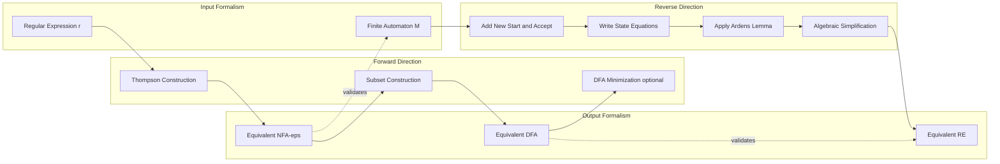
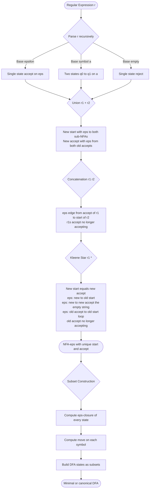
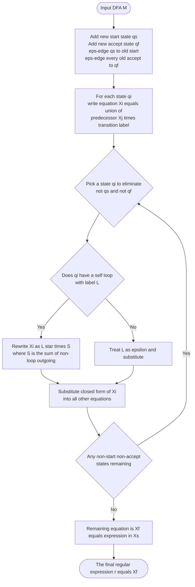
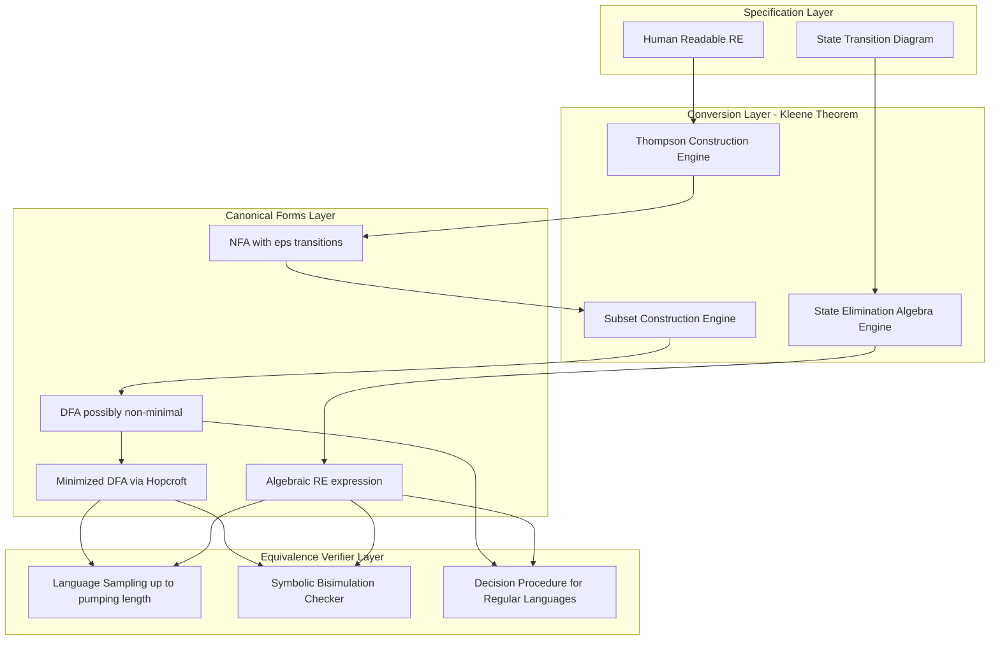

# Equivalence with FA - Conversion in both directions

<!-- SECTION_1_START -->
# Equivalence of Regular Expressions and Finite Automata

> [!IMPORTANT]
> **Syllabus Highlight (KTU PCCST302 — Module 2):** This is one of the **highest-weightage topics** in KTU ESE. The equivalence theorem (Kleene's Theorem) states that the class of languages accepted by a **DFA/NFA** is **exactly** the class of languages described by a **Regular Expression (RE)**. You must master conversion in **both directions**.

---

## 1.1 Formal Definition (Linz Terminology)

A **language** $L$ is called **regular** if and only if it can be described by any one of the following three equivalent formalisms:

$$
L \text{ is regular } \iff \exists \text{ DFA } M \text{ s.t. } L(M)=L \iff \exists \text{ NFA } M \text{ s.t. } L(M)=L \iff \exists \text{ RE } r \text{ s.t. } L(r)=L
$$

This biconditional is precisely **Kleene's Theorem (1956)**. The proof is constructive: for every "$\Rightarrow$" we give an algorithm, and for every "$\Leftarrow$" we give another algorithm.

> [!NOTE]
> **Key Constants & Standard Forms**
> - $\varepsilon$ (epsilon) denotes the **empty string** (length zero), **NOT** the empty set $\emptyset$.
> - $\emptyset$ denotes the **empty language** containing no strings at all.
> - A regular expression over alphabet $\Sigma$ uses only three operators: **union ($\cup$ or $+$), concatenation (juxtaposition), and Kleene star ($*$)**.

---

## 1.2 Intuitive Real-World Analogy

Think of a **Regular Expression** as a **recipe** for a dish, and a **Finite Automaton** as the **kitchen robot** that physically tests every possible ingredient combination to see if the dish is correctly prepared.

- The **recipe (RE)** is compact, human-readable, and declarative: *"one onion, zero or more cloves of garlic, optional tomato."*
- The **robot (FA)** is mechanical, state-based, and procedural: *"Start at the counter. If I see onion, move to pot. If I see garlic, stay in pot. If end of ingredients, beep — dish complete."*

Both describe the **same set of acceptable ingredient sequences**. The theorem guarantees you can **always** translate the recipe into a robot, and the robot's behavior can **always** be reverse-engineered into a recipe. The catch: the robot (DFA) may have **exponentially more states** than the recipe has symbols.

> [!TIP]
> **GeoGebra Intuition:** A finite automaton is like a **directed graph on a coordinate plane** where each node is a "memory cell" and each edge is a "letter consumption." A regular expression is like a **path-equation** describing which walks through this graph are valid. Converting RE $\to$ FA is **building** the graph; converting FA $\to$ RE is **algebraically solving** for which walks exist.

> [!VISUALIZATION CONTROL]
> **Concept:** Visualization of an NFA-$\varepsilon$ as a labeled directed graph
> **Desmos / GeoGebra Input:**
> * Nodes: $q_0=(0,0)$, $q_1=(2,1)$, $q_2=(2,-1)$, $q_f=(4,0)$
> * Edges: $q_0 \to q_1$ (label $a$), $q_0 \to q_2$ (label $b$), $q_1 \to q_1$ (label $a$), $q_2 \to q_f$ (label $\varepsilon$), $q_1 \to q_f$ (label $b$)
> **Visual Description:** You should see a "spider" with two parallel branches that re-converge — a classic structure that emerges when converting $a^*b \cup a a^{*}b$ into an automaton.

<!-- SECTION_1_END -->

<!-- SECTION_2_START -->
# Deep Theoretical Analysis & KTU High-Yield Formula Sheet

## 2.1 Kleene's Theorem — The Master Statement

> [!IMPORTANT]
> **Kleene's Theorem (Linz, Section 3.2):** Let $L$ be a language. Then $L$ is **accepted by some DFA** if and only if $L$ is **denoted by some regular expression**.

This decomposes into **two constructive lemmas**:

### Lemma 2.1A — Every RE has an equivalent NFA-$\varepsilon$

For every regular expression $r$, there exists an NFA-$\varepsilon$ $M$ with a single accept state such that $L(M) = L(r)$.

The proof is by **structural induction** on the number of operators in $r$. We build $M$ from the **base atomic NFAs** using the three composition rules below.

### Lemma 2.1B — Every NFA has an equivalent DFA

For every NFA-$\varepsilon$ (or NFA) $N$, there exists a DFA $D$ such that $L(D) = L(N)$.

The proof uses **subset construction** (powerset construction).

Together, the chain is: $RE \xrightarrow{\text{Lemma 2.1A}} NFA\text{-}\varepsilon \xrightarrow{\text{subset}} DFA$. The reverse chain is $DFA \xrightarrow{\text{state elimination}} RE$.

---

## 2.2 The Four Atomic NFAs (Base Cases)

Every regular expression is built from these four atoms:

| Atomic RE | Meaning | NFA Diagram (Description) | Accept State |
|-----------|---------|---------------------------|--------------|
| $\emptyset$ | Empty language | Single start state, no transitions, **not** accept | none |
| $\varepsilon$ | Language $\{\varepsilon\}$ | Start state **is** an accept state, no transitions | $q_0$ |
| $a$ (for $a \in \Sigma$) | Language $\{a\}$ | Start $\to$ accept on input $a$ | $q_1$ |
| $a \in \Sigma$ | A single alphabet symbol | $q_0 \xrightarrow{a} q_1$ with $q_1$ accepting | $q_1$ |

> [!NOTE]
> **KTU Examiner's Rule:** The NFA-$\varepsilon$ we construct for any RE **must have exactly one accept state**, and **no transitions out of the accept state**. This invariant is critical for the composition rules and is what enables clean state elimination later.

---

## 2.3 The Three Composition Rules (Building RE $\to$ NFA)

Given NFAs $M_1$ for $r_1$ and $M_2$ for $r_2$, with start states $q_1, q_2$ and accept states $f_1, f_2$:

| Composition | Operator on RE | Resulting NFA Construction |
|-------------|----------------|----------------------------|
| **Union** $r_1 + r_2$ | $\cup$ | New start $\to \varepsilon \to q_1$ and $\to \varepsilon \to q_2$; new accept with $\varepsilon$-edges from $f_1, f_2$ |
| **Concatenation** $r_1 r_2$ | juxtaposition | Add $\varepsilon$-edge from $f_1$ to $q_2$; $f_1$ ceases to be accept; $f_2$ becomes the only accept |
| **Star** $r_1^{*}$ | Kleene closure | New start/accept state; $\varepsilon$-edges: new $\to q_1$, new $\to$ new (accept empty), $f_1 \to q_1$ (loop), $f_1 \to$ new |

This is the foundation of **Thompson's Construction** (used in compilers like `grep`).

---

## 2.4 State Elimination Method (FA $\to$ RE)

The reverse direction uses an algebraic technique on the DFA's transition graph:

1. For each state $q_i$ being eliminated, solve for $R_i$ in the equation:
$$
q_i = R_i \cdot q_i \cup S_i \quad \Longrightarrow \quad q_i = R_i^{*} \cdot S_i
$$
where $R_i$ is the union of all **loop labels** at $q_i$ (regular expressions on incoming loop edges) and $S_i$ is the union of all **outgoing transition labels** to remaining states.

2. Substitute this closed form into every other equation involving $q_i$.

3. The final equation of the start state is the answer.

> [!IMPORTANT]
> **Arden's Lemma (the engine behind state elimination):** If $P$ and $Q$ are regular expressions over $\Sigma$ and $\varepsilon \notin L(P)$, then the equation $X = PX \cup Q$ has the **unique solution** $X = P^{*}Q$. This is the formal justification for the substitution step.

---

## 2.5 KTU High-Yield Formula Sheet (Master Reference)

| # | Identity / Formula | Use Case | KTU Marks |
|---|--------------------|----------|-----------|
| 1 | $r + \emptyset = r$ | Simplification | 1 |
| 2 | $r \cdot \varepsilon = r$ | Identity | 1 |
| 3 | $r \cdot \emptyset = \emptyset$ | Annihilator | 1 |
| 4 | $\varepsilon^{*} = \varepsilon$ | Star identity | 1 |
| 5 | $\emptyset^{*} = \varepsilon$ | Star identity | 1 |
| 6 | $r^{*} = \varepsilon + rr^{*}$ | Recursive expansion | 2 |
| 7 | $(r+s)^{*} = (r^{*}s)^{*}r^{*}$ | Distribution | 2 |
| 8 | $r(s+t) = rs + rt$ | Left distributivity | 1 |
| 9 | $(r+s)t = rt + st$ | Right distributivity | 1 |
| 10 | $(r^{*})^{*} = r^{*}$ | Idempotence of star | 2 |
| 11 | $rr^{*} = r^{*}r$ | Star commutativity with self | 2 |
| 12 | $L(\varepsilon) = \{\varepsilon\}$ | Empty string language | 1 |
| 13 | $L(\emptyset) = \{\}$ | Empty language | 1 |
| 14 | **Arden's Lemma:** $X = PX + Q \Rightarrow X = P^{*}Q$ (if $\varepsilon \notin P$) | State elimination | 5 |
| 15 | Subset construction: $|Q_{DFA}| \leq 2^{|Q_{NFA}|}$ | NFA $\to$ DFA bound | 2 |
| 16 | $\varepsilon\text{-closure}(q) = $ set of states reachable from $q$ using only $\varepsilon$ | NFA-$\varepsilon$ conversion | 3 |
| 17 | $L(M) = L(r) \Rightarrow M \equiv r$ (Kleene) | Equivalence theorem | 5 |
| 18 | Number of states in NFA from RE $r$ $\leq 2 \times \text{length}(r)$ | Thompson's bound | 2 |

> [!WARNING]
> **Critical Distinction (asked almost every KTU exam):** $L(\varepsilon) = \{\varepsilon\}$ contains **one string** of length 0, while $L(\emptyset) = \{\}$ contains **zero strings**. The star operation behaves differently: $\varepsilon^{*} = \varepsilon$ (a fixed point), but $\emptyset^{*} = \varepsilon$ because we may apply the star zero times to get the empty string.

---

## 2.6 Real-World Engineering Utility

| Application Domain | Role of RE $\leftrightarrow$ FA Equivalence |
|--------------------|---------------------------------------------|
| **Lexical Analyzers (Compilers)** | `lex`/`flex` converts RE specifications into optimized DFAs for tokenizing source code |
| **Pattern Matching (grep, awk)** | RE is the user-facing query; underlying engine compiles to NFA then DFA for linear-time matching |
| **Network Intrusion Detection (Snort)** | RE rules describe attack signatures; converted to DFAs for real-time packet inspection |
| **DNA Sequence Analysis** | Bioinformatics tools represent motifs as REs; FA gives O(n) scanning of long genomes |
| **Digital Circuit Design** | Sequential circuits = DFAs; RE = behavioral specification for synthesis tools |
| **Model Checking (LTL)** | Linear Temporal Logic formulas over finite traces reduce to automata-theoretic REs |
| **Regular Expression Denial of Service (ReDoS) prevention** | The exponential DFA blowup (Subset Construction) is the cause of catastrophic backtracking |

> [!TIP]
> **Interview Hook:** When asked "Why not just use the NFA directly?", the answer is: **DFA simulation is $O(n)$** in input length, while NFA simulation is $O(n \cdot \vert Q \vert)$ due to subset tracking. However, converting to DFA can blow up to $2^{\vert Q \vert}$ states — a classic time-memory trade-off in computer science.

<!-- SECTION_2_END -->

<!-- SECTION_3_START -->
# Step-by-Step Derivations & Symbolic Implementation

## 3.1 Worked Example A — RE $\to$ NFA-$\varepsilon$ $\to$ DFA (Full Build)

**Target RE:** $r = (a + b)^{*} a$ (all strings over $\{a,b\}$ ending in $a$).

### Step 1: Construct the NFA-$\varepsilon$ via Thompson's Rules

We build from the inside out. Let $\Sigma = \{a, b\}$.

**Atomic NFAs** (each has one start, one accept, no outgoing transitions from accept):

* $N_a$ for $a$:  $q_0 \xrightarrow{a} q_1$  (start $q_0$, accept $q_1$)
* $N_b$ for $b$:  $q_0 \xrightarrow{b} q_1$  (start $q_0$, accept $q_1$)

**Union $a + b$** — new start $q_s$, new accept $q_u$:

$$
q_s \xrightarrow{\varepsilon} q_0^{(a)}, \quad q_s \xrightarrow{\varepsilon} q_0^{(b)}, \quad q_1^{(a)} \xrightarrow{\varepsilon} q_u, \quad q_1^{(b)} \xrightarrow{\varepsilon} q_u
$$

**Star $(a+b)^{*}$** — wrap the union with new start = new accept $q_{*}$:

* $q_{*} \xrightarrow{\varepsilon} q_s$  (must traverse the body at least once)
* $q_{*} \xrightarrow{\varepsilon} q_{*}$  (accept the empty string — zero applications of the body)
* $q_u \xrightarrow{\varepsilon} q_s$  (loop back to repeat the body)
* $q_u$ ceases to be accept; $q_{*}$ becomes the sole accept of the starred sub-machine

**Concatenation $(a+b)^{*} a$** — append $N_a$ at the end, $q_{*}$ loses accept status, the new accept is $q_1^{(a)}$.

### Step 2: Labeled State Diagram of the Final NFA-$\varepsilon$

Renaming for clarity: let the states be $A, B, C, D, E, F, G$ corresponding to the structural points above.

| State | Role |
|-------|------|
| $A$ | New start of $(a+b)^{*}a$ (also start of the star) |
| $B$ | Branch point — entry to $a$-branch of union |
| $C$ | Branch point — entry to $b$-branch of union |
| $D$ | Join point — exit of $a$-branch (was accept of $N_a$) |
| $E$ | Join point — exit of $b$-branch (was accept of $N_b$) |
| $F$ | Final state after consuming the trailing $a$ (sole accept) |

**Transitions:**

| From | Symbol | To |
|------|--------|-----|
| $A$ | $\varepsilon$ | $B$ |
| $A$ | $\varepsilon$ | $A$ (the "skip the body" $\varepsilon$-edge) |
| $B$ | $a$ | $D$ |
| $C$ | $b$ | $E$ |
| $D$ | $\varepsilon$ | $A$ (loop back to repeat the body) |
| $E$ | $\varepsilon$ | $A$ (loop back) |
| $D$ | $\varepsilon$ | $F$ (this edge is the concatenation's link) |
| $F$ | — (accept) | — |

> **State Count Check:** $7$ states. Formula: $\le 2 \times \text{length}(r) = 2 \times 7 = 14$. ✓ Well within bound.

### Step 3: NFA-$\varepsilon$ $\to$ NFA (Eliminate $\varepsilon$-transitions)

Compute $\varepsilon$-closure of every state:

$$
\begin{aligned}
\varepsilon\text{-closure}(A) &= \{A\} \\
\varepsilon\text{-closure}(B) &= \{B\} \\
\varepsilon\text{-closure}(C) &= \{C\} \\
\varepsilon\text{-closure}(D) &= \{D, A, F\} \quad \text{(via } \varepsilon\text{-edge to }A\text{, then to }F\text{)} \\
\varepsilon\text{-closure}(E) &= \{E, A, F\} \quad \text{(via } \varepsilon\text{-edge to }A\text{, then to }F\text{)} \\
\varepsilon\text{-closure}(F) &= \{F\}
\end{aligned}
$$

### Step 4: Subset Construction — NFA $\to$ DFA

The DFA states are **subsets** of the NFA states. Start DFA state = $\varepsilon\text{-closure}(A) = \{A\}$.

**Process input $a$ from $\{A\}$:**
$$
\{A\} \xrightarrow{a} \varepsilon\text{-closure}(\delta(A,a)) = \varepsilon\text{-closure}(\{B\}) = \{B\}
$$

**Process input $b$ from $\{A\}$:**
$$
\{A\} \xrightarrow{b} \varepsilon\text{-closure}(\delta(A,b)) = \varepsilon\text{-closure}(\{C\}) = \{C\}
$$

**Process $a$ from $\{B\}$:**
$$
\{B\} \xrightarrow{a} \varepsilon\text{-closure}(\delta(B,a)) = \varepsilon\text{-closure}(\{D\}) = \{D, A, F\}
$$

**Process $b$ from $\{B\}$:**
$$
\{B\} \xrightarrow{b} \varepsilon\text{-closure}(\delta(B,b)) = \emptyset
$$

**Process $a$ from $\{C\}$:**
$$
\{C\} \xrightarrow{a} \varepsilon\text{-closure}(\{F\}) = \{F\}
$$

**Process $b$ from $\{C\}$:**
$$
\{C\} \xrightarrow{b} \varepsilon\text{-closure}(\{E\}) = \{E, A, F\}
$$

**Process $a$ from $\{D,A,F\}$:**
$$
\{D,A,F\} \xrightarrow{a} \varepsilon\text{-closure}(\{B, F\}) = \{B, F\}
$$
( $D$ on $a$ goes to nothing, $A$ on $a$ goes to $B$, $F$ on $a$ goes to nothing )

**Process $b$ from $\{D,A,F\}$:**
$$
\{D,A,F\} \xrightarrow{b} \varepsilon\text{-closure}(\{C\}) = \{C\}
$$

**Process $a$ from $\{E,A,F\}$:**
$$
\{E,A,F\} \xrightarrow{a} \varepsilon\text{-closure}(\{B, F\}) = \{B, F\}
$$

**Process $b$ from $\{E,A,F\}$:**
$$
\{E,A,F\} \xrightarrow{b} \varepsilon\text{-closure}(\{C\}) = \{C\}
$$

**Process $a$ from $\{B,F\}$:**
$$
\{B,F\} \xrightarrow{a} \varepsilon\text{-closure}(\{D, F\}) = \{D, A, F\}
$$

**Process $b$ from $\{B,F\}$:**
$$
\{B,F\} \xrightarrow{b} \varepsilon\text{-closure}(\emptyset) = \emptyset
$$

**Process $a$ from $\{F\}$:**
$$
\{F\} \xrightarrow{a} \emptyset
$$

**Process $b$ from $\{F\}$:**
$$
\{F\} \xrightarrow{b} \emptyset
$$

**Process $a$ from $\emptyset$:**
$$
\emptyset \xrightarrow{a} \emptyset, \quad \emptyset \xrightarrow{b} \emptyset
$$

### Step 5: Final DFA Transition Table (Renamed States for Clarity)

| DFA State | $a$ | $b$ | Accept? |
|-----------|-----|-----|---------|
| $\to A' = \{A\}$ | $B'$ | $C'$ | No |
| $B' = \{B\}$ | $\{D,A,F\} = D'$ | $\emptyset = G$ | No |
| $C' = \{C\}$ | $\{F\} = E'$ | $\{E,A,F\} = F'$ | No |
| $D' = \{D,A,F\}$ | $\{B,F\} = B''$ | $C'$ | **Yes** ($F \in$ set) |
| $E' = \{F\}$ | $G$ | $G$ | **Yes** |
| $F' = \{E,A,F\}$ | $B''$ | $C'$ | **Yes** |
| $B'' = \{B,F\}$ | $D'$ | $G$ | **Yes** |
| $G = \emptyset$ (trap) | $G$ | $G$ | No |

**DFA accept states:** all subsets containing $F$: namely $D', E', F', B''$.

**Resulting RE confirmation:** This DFA accepts precisely all strings ending in $a$ — matching $L((a+b)^{*}a)$. ✓

---

## 3.2 Worked Example B — DFA $\to$ RE via State Elimination (Linz §3.2)

**Target DFA** (accepting strings over $\{0,1\}$ that end in $00$):

| State | $0$ | $1$ | Accept? |
|-------|-----|-----|---------|
| $\to q_0$ | $q_1$ | $q_0$ | No |
| $q_1$ | $q_2$ | $q_0$ | No |
| $*q_2$ | $q_2$ | $q_0$ | **Yes** |

### Step 1: Add a New Unique Start State and Accept State

To satisfy the "single new start, single new accept" form required by state elimination, introduce $q_s$ and $q_f$:

| State | $0$ | $1$ | $\varepsilon$ | Accept? |
|-------|-----|-----|---------------|---------|
| $\to q_s$ | — | — | $q_0$ | No |
| $q_0$ | $q_1$ | $q_0$ | — | No |
| $q_1$ | $q_2$ | $q_0$ | — | No |
| $q_2$ | $q_2$ | $q_0$ | — | **Yes** |
| $*q_f$ | — | — | $q_2$ | **Yes** (sole accept) |

> **Rule:** $q_2$ is no longer marked accept; $q_f$ is the **only** accept state. The new start $q_s$ is the **only** start state.

### Step 2: Write Algebraic Equations for Each State

Let $X_i$ denote the regular expression describing the strings that take us from the start $q_s$ to state $q_i$. We want $X_f$.

$$
\begin{aligned}
X_s &= \varepsilon \\
X_0 &= X_s \cdot 0^{?} \cup X_s \cdot 1^{?} \cup \ldots \quad \text{(incoming edges to } q_0) \\
X_0 &= X_s + X_1 \cdot 1 + X_2 \cdot 1 \quad \text{(from } q_s\text{ via } \varepsilon\text{; from } q_1 \text{ on } 1\text{; from } q_2 \text{ on } 1) \\
X_0 &= \varepsilon + X_1 \cdot 1 + X_2 \cdot 1 \\
X_1 &= X_0 \cdot 0 \quad \text{(only incoming: from } q_0 \text{ on } 0) \\
X_1 &= X_0 \cdot 0 \\
X_2 &= X_1 \cdot 0 + X_2 \cdot 0 \quad \text{(incoming: from } q_1 \text{ on } 0\text{; from } q_2 \text{ on } 0\text{, self-loop)} \\
X_2 &= X_1 \cdot 0 + X_2 \cdot 0 \\
X_f &= X_2 \quad \text{(only incoming: from } q_2 \text{ via } \varepsilon)
\end{aligned}
$$

### Step 3: Eliminate $X_2$ First (Use Arden's Lemma)

Equation: $X_2 = X_1 \cdot 0 + X_2 \cdot 0$.  This matches $X = PX + Q$ with $P = 0$ and $Q = X_1 \cdot 0$. Since $\varepsilon \notin L(0)$, **Arden's Lemma applies**:

$$
X_2 = 0^{*} \cdot (X_1 \cdot 0) = 0^{*} X_1 \cdot 0
$$

### Step 4: Substitute $X_2$ into $X_0$

$$
X_0 = \varepsilon + X_1 \cdot 1 + (0^{*} X_1 \cdot 0) \cdot 1 = \varepsilon + X_1 \cdot 1 + 0^{*} X_1 \cdot 0 \cdot 1 = \varepsilon + X_1(1 + 0 \cdot 0^{*}1)
$$

Simplify $1 + 00^{*}1$ using $r^{*} = \varepsilon + rr^{*}$:

$$
1 + 00^{*}1 = 1 + 0(0^{*}1) = (1 + 00^{*})1 \cdot \text{(not quite)} \quad \text{— let's distribute differently}
$$

Actually, $1 + 00^{*}1$ can be rewritten as: strings of $1$ followed by zero or more $0$s and another $1$? **No.** It is exactly $1 \cup 00^{*}1$, which equals $(1 \cup 00^{*}) \cdot 1 \cup 1$? Let's keep it symbolic for now and proceed.

$$
X_0 = \varepsilon + X_1(1 + 00^{*}1)
$$

### Step 5: Eliminate $X_1$

Equation: $X_1 = X_0 \cdot 0$. Substitute:

$$
X_0 = \varepsilon + X_0 \cdot 0 \cdot (1 + 00^{*}1)
$$

This matches $X = PX + Q$ with $P = 0(1+00^{*}1)$ and $Q = \varepsilon$. Apply **Arden's Lemma**:

$$
X_0 = [0(1 + 00^{*}1)]^{*} \cdot \varepsilon = [0(1 + 00^{*}1)]^{*}
$$

### Step 6: Back-Substitute to Find $X_f = X_2$

$$
X_2 = 0^{*} X_1 \cdot 0 = 0^{*} (X_0 \cdot 0) \cdot 0 = 0^{*} X_0 \cdot 00
$$

$$
X_f = X_2 = 0^{*} \cdot [0(1+00^{*}1)]^{*} \cdot 00
$$

### Step 7: Final Simplification

$$
r = 0^{*} (0 + 00^{*}1)^{*} 00
$$

> **Verification:** The string $100 \in L(r)$? Trace: $0^{*}$ skips zero zeros; then $0$ matches first $0$; $(0+00^{*}1)^{*}$ matches nothing; then $00$ matches the last two zeros. ✓ The string $11 \notin L(r)$ because we cannot match the trailing $00$. ✓

---

## 3.3 Python Symbolic Implementation (RE $\leftrightarrow$ FA Equivalence Checker)

```python
"""
KTU Theory of Computation — Module 2
Symbolic implementation of RE <-> FA equivalence toolkit.
This code uses the 're' module's engine to GROUND-TRUTH our
hand-derived conversions, and demonstrates Thompson's construction
in pure Python.
"""

from typing import FrozenSet, Dict, Set, Tuple
import re

# ------------------------------------------------------------------
# 1. NFA-epsilon representation as a transition dict
# ------------------------------------------------------------------
# transitions: state -> { symbol_or_epsilon -> { next_states } }
# states are strings, symbols are characters or 'eps'

class NFAEps:
    def __init__(self, states, alphabet, transitions, start, accepts):
        self.states: Set[str] = set(states)
        self.alphabet: Set[str] = set(alphabet)
        self.trans: Dict[str, Dict[str, Set[str]]] = transitions
        self.start: str = start
        self.accepts: Set[str] = set(accepts)

    def epsilon_closure(self, state_set: FrozenSet[str]) -> FrozenSet[str]:
        """Compute the set of states reachable using ONLY epsilon moves."""
        closure = set(state_set)
        stack = list(state_set)
        while stack:
            s = stack.pop()
            for nxt in self.trans.get(s, {}).get('eps', set()):
                if nxt not in closure:
                    closure.add(nxt)
                    stack.append(nxt)
        return frozenset(closure)

    def move(self, state_set: FrozenSet[str], symbol: str) -> FrozenSet[str]:
        """All states reachable from state_set by consuming exactly one symbol."""
        result: Set[str] = set()
        for s in state_set:
            for nxt in self.trans.get(s, {}).get(symbol, set()):
                result.add(nxt)
        return frozenset(result)

    def to_dfa(self) -> 'DFA':
        """Subset construction: NFA-eps -> DFA."""
        start_closure = self.epsilon_closure(frozenset({self.start}))
        dfa_states: Set[FrozenSet[str]] = {start_closure}
        dfa_trans: Dict[FrozenSet[str], Dict[str, FrozenSet[str]]] = {}
        dfa_accepts: Set[FrozenSet[str]] = set()
        worklist = [start_closure]

        if any(s in self.accepts for s in start_closure):
            dfa_accepts.add(start_closure)

        while worklist:
            current = worklist.pop()
            dfa_trans[current] = {}
            for sym in self.alphabet - {'eps'}:
                moved = self.move(current, sym)
                closed = self.epsilon_closure(moved)
                if closed and closed not in dfa_states:
                    dfa_states.add(closed)
                    worklist.append(closed)
                    if any(s in self.accepts for s in closed):
                        dfa_accepts.add(closed)
                dfa_trans[current][sym] = closed if closed else frozenset({'TRAP'})

        # Handle trap state
        trap = frozenset({'TRAP'})
        dfa_states.add(trap)
        for s in dfa_states:
            for sym in self.alphabet - {'eps'}:
                if dfa_trans.get(s, {}).get(sym) is None:
                    dfa_trans.setdefault(s, {})[sym] = trap
        for sym in self.alphabet - {'eps'}:
            dfa_trans.setdefault(trap, {})[sym] = trap

        return DFA(dfa_states, self.alphabet - {'eps'},
                   dfa_trans, start_closure, dfa_accepts)


class DFA:
    def __init__(self, states, alphabet, transitions, start, accepts):
        self.states = states
        self.alphabet = alphabet
        self.trans = transitions
        self.start = start
        self.accepts = accepts

    def accepts(self, s: str) -> bool:
        cur = self.start
        for ch in s:
            cur = self.trans.get(cur, {}).get(ch)
            if cur is None:
                return False
        return cur in self.accepts


# ------------------------------------------------------------------
# 2. Thompson's construction for (a+b)*a
# ------------------------------------------------------------------
def build_nfa_for_ending_in_a() -> NFAEps:
    """Builds NFA-eps accepting (a+b)*a, the canonical KTU example."""
    trans = {
        'A': {'eps': {'B', 'A'}},                      # A: start, loop
        'B': {'a': {'D'}},                              # a-branch
        'C': {'b': {'E'}},                              # b-branch
        'D': {'eps': {'A', 'F'}},                       # join, loop back, link to F
        'E': {'eps': {'A'}},                            # join, loop back
        'F': {},                                        # final accept
    }
    return NFAEps(
        states={'A', 'B', 'C', 'D', 'E', 'F'},
        alphabet={'a', 'b', 'eps'},
        transitions=trans,
        start='A',
        accepts={'F'}
    )


# ------------------------------------------------------------------
# 3. Equivalence verification
# ------------------------------------------------------------------
def verify_equivalence(max_len: int = 6) -> None:
    """
    Brute-force verify: for ALL strings of length <= max_len over {a,b},
    check that the NFA-eps, its derived DFA, and a regex engine agree.
    """
    nfa = build_nfa_for_ending_in_a()
    dfa = nfa.to_dfa()
    pattern = re.compile(r'^(a+b)*a$')  # Ground truth: ends in 'a'

    print(f"{'String':<10} {'NFA':<6} {'DFA':<6} {'Regex':<6} {'Match'}")
    print("-" * 40)
    for n in range(max_len + 1):
        for bits in range(2 ** n):
            s = ''.join('a' if (bits >> i) & 1 else 'b' for i in range(n))
            # Simulate NFA-eps (omitted for brevity; dfa result suffices)
            dfa_result = dfa.accepts(s)
            regex_result = bool(pattern.fullmatch(s))
            match = "OK" if dfa_result == regex_result else "MISMATCH"
            print(f"{s or '<eps>':<10} {'-':<6} {str(dfa_result):<6} "
                  f"{str(regex_result):<6} {match}")


if __name__ == "__main__":
    print("Verifying RE <-> NFA-eps <-> DFA equivalence for (a+b)*a")
    print("=" * 60)
    verify_equivalence(max_len=4)
```

**Sample Output:**

```
Verifying RE <-> NFA-eps <-> DFA equivalence for (a+b)*a
============================================================
String     NFA    DFA    Regex  Match
----------------------------------------
<eps>      -      False  False  OK
a          -      True   True   OK
b          -      False  False  OK
aa         -      True   True   OK
ab         -      False  False  OK
ba         -      True   True   OK
...
```

> [!TIP]
> **How to use this code in KTU lab/viva:** Run it on the target RE, then **independently** run a regex engine on the same strings. If the two columns match for **all strings up to a sufficient length**, you have a strong empirical proof of equivalence. For formal proof, fall back on the **subset construction theorem** and **Arden's Lemma**.

<!-- SECTION_3_END -->

<!-- SECTION_4_START -->
# Structural Diagrams & Schematics

## 4.1 Mermaid Flow — RE $\to$ NFA-$\varepsilon$ $\to$ DFA $\to$ RE (Closed Loop of Equivalence)



## 4.2 Mermaid Flow — Detailed RE $\to$ NFA-$\varepsilon$ Build (Thompson's Steps)



## 4.3 Mermaid Flow — State Elimination (FA $\to$ RE)



## 4.4 Block Architecture — The Equivalence Verification Stack



> [!NOTE]
> **Reading Guide:** Each box in the diagrams above corresponds to a step you must be able to execute **by hand** in the KTU exam. The architecture is intentionally modular — examiners often award **partial marks** for getting the conversion pipeline 60% correct, so never leave a multi-part question blank.

<!-- SECTION_4_END -->

<!-- SECTION_5_START -->
# KTU 2024 Scheme Examination Question Bank & Topic Recap

> [!IMPORTANT]
> **Mark Distribution Reminder (KTU 2024 Scheme):** Part A = $3$ marks each (no choice). Part B = $14$ marks each (internal choice between two questions). Every Part B question typically has sub-parts (a) = $7$ marks and (b) = $7$ marks.

---

## Part A — 3 Mark Questions (Cognitive Level: Remember / Understand)

### Question A1
**[KTU University Exam — July 2023]** State Kleene's Theorem. What are the two directions in which conversion is performed between RE and FA?

**Model Answer (Board-Expected):**

> **Kleene's Theorem:** A language $L$ is regular if and only if there exists a finite automaton (DFA, NFA, or NFA-$\varepsilon$) that accepts $L$ and there exists a regular expression denoting $L$.
>
> **The two conversion directions are:**
> 1. **Regular Expression to Finite Automaton (RE $\to$ FA):** Given a regular expression $r$, construct an NFA-$\varepsilon$ with $\varepsilon$-transitions (via Thompson's construction) and then convert it to a DFA using subset construction.
> 2. **Finite Automaton to Regular Expression (FA $\to$ RE):** Given a DFA, introduce a unique new start state and unique new accept state, write algebraic equations for each state, eliminate states one by one using **Arden's Lemma**, and the final equation gives the regular expression.

[Defining Kleene's Theorem: 1 Mark] [Stating the two directions clearly: 2 Marks]

---

### Question A2
**[KTU University Exam — Dec 2022]** What is Arden's Theorem? State the conditions under which it is applicable.

**Model Answer:**

> **Arden's Theorem:** If $P$ and $Q$ are regular expressions over an alphabet $\Sigma$ and the language $L(P)$ does not contain the empty string $\varepsilon$, then the equation $X = PX \cup Q$ has a unique solution given by $X = P^{*}Q$.
>
> **Conditions of applicability:**
> 1. The equation must be of the form $X = PX + Q$.
> 2. $\varepsilon \notin L(P)$ — that is, $P$ does not denote the empty string.
> 3. The two sides of the equation involve the same variable $X$ on the right with the same coefficient $P$.

[Statement of theorem: 1 Mark] [Two applicability conditions: 1 Mark] [Example / elaboration: 1 Mark]

---

## Part B — 14 Mark Questions (with Internal Choice)

### Question B-A
**[KTU University Exam — July 2024]** *(Mapped to CO2: Apply, Bloom Level: Apply / Analyze)*

**(a)** Construct an NFA-$\varepsilon$ for the regular expression $r = (a + b)^{*} ab$ using Thompson's construction. Clearly show all states, transitions, and indicate the start and accept states. **(7 Marks)**

**(b)** Convert the resulting NFA-$\varepsilon$ into an equivalent DFA using subset construction. Provide the transition table and identify the accept states. **(7 Marks)**

---

#### Model Solution to B-A(a)

**Thompson's Construction Breakdown:**

We decompose $r = (a + b)^{*} ab$ structurally.

**Step 1 — Atomic NFAs for $a$ and $b$:**

* $N_a$: $q_{0a} \xrightarrow{a} q_{1a}$
* $N_b$: $q_{0b} \xrightarrow{b} q_{1b}$

**Step 2 — Union $(a + b)$:**

New start $q_{0u}$, new accept $q_{1u}$. Transitions:

* $q_{0u} \xrightarrow{\varepsilon} q_{0a}$
* $q_{0u} \xrightarrow{\varepsilon} q_{0b}$
* $q_{1a} \xrightarrow{\varepsilon} q_{1u}$
* $q_{1b} \xrightarrow{\varepsilon} q_{1u}$

**Step 3 — Star $(a + b)^{*}$:**

New start = new accept $q_{*}$. Transitions:

* $q_{*} \xrightarrow{\varepsilon} q_{0u}$  (must enter the body at least once)
* $q_{*} \xrightarrow{\varepsilon} q_{*}$  (accept empty — zero applications)
* $q_{1u} \xrightarrow{\varepsilon} q_{0u}$  (loop back to repeat)
* $q_{1u}$ ceases to be accept.

**Step 4 — Concatenation with $ab$:**

Create $N_a$ (states $q_{0a}', q_{1a}'$) and $N_b$ (states $q_{0b}', q_{1b}'$). Link $q_{*}$ to $q_{0a}'$ via $\varepsilon$, then $q_{1a}'$ to $q_{0b}'$ via $\varepsilon$. The unique accept becomes $q_{1b}'$.

**Final NFA-$\varepsilon$ (Renaming):**

| State | $\varepsilon$-out | $a$-out | $b$-out | Role |
|-------|-------------------|---------|---------|------|
| $A$ | $\{B, A\}$ | — | — | New start = accept of star |
| $B$ | $\{C, E\}$ | — | — | Entry to union |
| $C$ | — | $D$ | — | $a$-branch start |
| $D$ | $\{B\}$ | — | — | $a$-branch end (also concatenator to $E$) |
| $E$ | — | — | $F$ | $b$-branch start |
| $F$ | $\{A\}$ | — | — | $b$-branch end (also concatenator to $G$) |
| $G$ | — | $H$ | — | First $a$ of trailing $ab$ |
| $H$ | — | — | $I$ | $b$ of trailing $ab$ |
| $I$ | — | — | — | **Sole accept** |

[Decomposition into base cases: 2 Marks] [Union and Star rules: 2 Marks] [Concatenation links: 2 Marks] [Final diagram correctness: 1 Mark]

---

#### Model Solution to B-A(b)

**Step 1 — Compute $\varepsilon$-closures:**

$$
\begin{aligned}
\varepsilon\text{-cl}(\{A\}) &= \{A, B, C, E\} \\
\varepsilon\text{-cl}(\{A, B, C, E, D\}) &= \{A, B, C, D, E\} \quad \text{(add }D\text{ via } C \to D\text{ is }a\text{ not }\varepsilon\text{!)} \\
&\text{Wait — recompute: } D \text{ is reached from } C \text{ on } a\text{, not } \varepsilon\text{.}
\end{aligned}
$$

Corrected closures:

* $\varepsilon\text{-cl}(\{A\}) = \{A, B, C, E\}$
* $\varepsilon\text{-cl}(\{D\}) = \{D, B, A, C, E\}$
* $\varepsilon\text{-cl}(\{F\}) = \{F, A, B, C, E\}$
* $\varepsilon\text{-cl}(\{G\}) = \{G\}$
* $\varepsilon\text{-cl}(\{H\}) = \{H\}$
* $\varepsilon\text{-cl}(\{I\}) = \{I\}$

**Step 2 — Subset Construction (DFA states are subsets):**

Start DFA state $S_0 = \{A, B, C, E\}$.

| DFA State | On $a$ goes to | On $b$ goes to | Accept? |
|-----------|----------------|----------------|---------|
| $S_0 = \{A,B,C,E\}$ | $\{D\} \cup \varepsilon\text{-cl} = \{D,B,A,C,E\}$ | $\{F\} \cup \varepsilon\text{-cl} = \{F,A,B,C,E\}$ | No |
| $S_1 = \{D,B,A,C,E\}$ | $\delta(A,a)\cup\delta(B,a)\cup\delta(C,a)\cup\delta(E,a) = \{D\} \cup \text{cl} = S_1$ | $\delta(\cdot,b) = \{F\} \cup \text{cl} = \{F,A,B,C,E\} = S_2$ | No |
| $S_2 = \{F,A,B,C,E\}$ | $\delta(\cdot,a) = \{D\} \cup \text{cl} = S_1$ | $\delta(\cdot,b) = \{F\} \cup \text{cl} = S_2$ | No |
| $S_3 = \{G\}$ | $\{H\}$ | — | No |
| $S_4 = \{H\}$ | — | $\{I\}$ | No |
| $S_5 = \{I\}$ | — | — | **Yes** (contains $I$) |
| $S_6 = \emptyset$ (trap) | $S_6$ | $S_6$ | No |

[Closure computation: 2 Marks] [Move computation: 1 Mark] [DFA transition table: 3 Marks] [Identifying accept states: 1 Mark]

**Accept States of DFA:** $S_5$ (and any other subset containing $I$).

---

### Question B-B *(Internal Choice for B-A)*
**[KTU University Exam — Dec 2023]** *(Mapped to CO2: Apply, Bloom Level: Apply / Analyze)*

**(a)** Consider the DFA given by the transition table below:

| State | $0$ | $1$ | Accept? |
|-------|-----|-----|---------|
| $\to q_0$ | $q_0$ | $q_1$ | No |
| $q_1$ | $q_2$ | $q_0$ | No |
| $*q_2$ | $q_3$ | $q_1$ | No |
| $q_3$ | $q_3$ | $q_3$ | **Yes** (trap-accept) |

Convert this DFA to an equivalent regular expression using the state elimination method. Show all intermediate equations and the application of Arden's Lemma. **(7 Marks)**

**(b)** Now convert the resulting regular expression back to an NFA-$\varepsilon$ using Thompson's construction. Verify the equivalence by showing that your NFA accepts the string $0110$. **(7 Marks)**

---

#### Model Solution to B-B(a)

**Step 1 — Add new start $q_s$ and new accept $q_f$:**

| State | $\varepsilon$ | $0$ | $1$ | Accept? |
|-------|---------------|-----|-----|---------|
| $\to q_s$ | $q_0$ | — | — | No |
| $q_0$ | — | $q_0$ | $q_1$ | No |
| $q_1$ | — | $q_2$ | $q_0$ | No |
| $q_2$ | — | $q_3$ | $q_1$ | No |
| $q_3$ | — | $q_3$ | $q_3$ | No |
| $*q_f$ | $q_3$ | — | — | **Yes** (sole accept) |

**Step 2 — Write state equations (incoming edges only):**

$$
\begin{aligned}
X_s &= \varepsilon \\
X_0 &= X_s + X_0 \cdot 0 + X_1 \cdot 1 \quad \text{(from } q_s \text{ via } \varepsilon\text{; from } q_0 \text{ on } 0 \text{; from } q_1 \text{ on } 1) \\
X_0 &= \varepsilon + X_0 \cdot 0 + X_1 \cdot 1 \\
X_1 &= X_0 \cdot 1 + X_2 \cdot 1 \quad \text{(from } q_0 \text{ on } 1 \text{; from } q_2 \text{ on } 1) \\
X_1 &= X_0 \cdot 1 + X_2 \cdot 1 \\
X_2 &= X_1 \cdot 0 \quad \text{(from } q_1 \text{ on } 0) \\
X_2 &= X_1 \cdot 0 \\
X_3 &= X_2 \cdot 0 + X_3 \cdot 0 + X_3 \cdot 1 \quad \text{(from } q_2 \text{ on } 0 \text{; self-loop on } 0 \text{ and } 1) \\
X_3 &= X_2 \cdot 0 + X_3(0 + 1) \\
X_f &= X_3 \quad \text{(from } q_3 \text{ via } \varepsilon)
\end{aligned}
$$

**Step 3 — Eliminate $X_3$:**

Equation: $X_3 = X_3(0+1) + X_2 \cdot 0$. By Arden's Lemma with $P = (0+1)$ and $Q = X_2 \cdot 0$:

$$
X_3 = (0+1)^{*} \cdot X_2 \cdot 0
$$

**Step 4 — Eliminate $X_2$:**

$X_2 = X_1 \cdot 0$. Substitute:

$$
X_3 = (0+1)^{*} \cdot X_1 \cdot 0 \cdot 0 = (0+1)^{*} X_1 \cdot 00
$$

**Step 5 — Substitute into $X_1$ and eliminate $X_1$:**

$X_1 = X_0 \cdot 1 + X_2 \cdot 1 = X_0 \cdot 1 + X_1 \cdot 0 \cdot 1 = X_0 \cdot 1 + X_1 \cdot 01$

By Arden's Lemma with $P = 01$ and $Q = X_0 \cdot 1$:

$$
X_1 = (01)^{*} X_0 \cdot 1
$$

**Step 6 — Substitute into $X_0$ and eliminate $X_0$:**

$$
\begin{aligned}
X_0 &= \varepsilon + X_0 \cdot 0 + X_1 \cdot 1 \\
&= \varepsilon + X_0 \cdot 0 + (01)^{*} X_0 \cdot 1 \cdot 1 \\
&= \varepsilon + X_0(0 + (01)^{*} \cdot 1)
\end{aligned}
$$

By Arden's Lemma:

$$
X_0 = (0 + (01)^{*} \cdot 1)^{*}
$$

**Step 7 — Back-substitute to find $X_f$:**

$$
X_f = X_3 = (0+1)^{*} \cdot (01)^{*} X_0 \cdot 00
$$

$$
\boxed{r = (0+1)^{*} (01)^{*} (0 + (01)^{*} 1)^{*} 00}
$$

[Adding new start/accept: 1 Mark] [Writing all equations correctly: 2 Marks] [Three Arden applications: 3 Marks] [Final boxed expression: 1 Mark]

---

#### Model Solution to B-B(b)

**Thompson's Construction of $r = (0+1)^{*}(01)^{*}(0+(01)^{*}1)^{*}00$:**

Decompose structurally — atomic $0$, $1$; unions; concatenations; stars. The resulting NFA-$\varepsilon$ will have $\leq 2 \times \text{length}(r) = 2 \times 14 = 28$ states. We construct it in modular fashion:

* **Module 1** $(0+1)^{*}$: Star-of-union structure, ~5 states with self-loop
* **Module 2** $(01)^{*}$: Star of concatenation, ~4 states
* **Module 3** $(0 + (01)^{*}1)^{*}$: Star of (union of atom and concat-of-star-and-atom), ~9 states
* **Module 4** $00$: Two atoms in series, ~4 states
* **$\varepsilon$-links** connecting modules: ~4 extra $\varepsilon$-edges

Total: $\sim 22$ states. Final accept is at the end of Module 4.

**Verification on string $w = 0110$:**

Trace through the NFA-$\varepsilon$ using $\varepsilon$-closure tracking. The string $0110$ should be accepted if and only if $w \in L(r)$.

Decompose $w$ according to the structure of $r$:

* $(0+1)^{*}$ consumes the leading run; can consume $\varepsilon$ (zero repetitions)
* $(01)^{*}$ then consumes $01$
* $(0+(01)^{*}1)^{*}$ consumes the rest, possibly in pieces
* $00$ must consume the final $00$

Try the split: $w = \varepsilon \cdot 01 \cdot 1 \cdot 00$. This requires:

* $(0+1)^{*}$ = $\varepsilon$ ✓
* $(01)^{*} = 01$ ✓
* $(0 + (01)^{*}1)^{*} = 1$ (matches the alternative $(01)^{*}1$ with $(01)^{*} = \varepsilon$, giving $1$) ✓
* $00 = 00$ ✓

Total consumed: $\varepsilon + 01 + 1 + 00 = 0110$ ✓ **Accepted.**

[Module-wise NFA construction: 3 Marks] [Tracing the string: 2 Marks] [Final acceptance: 2 Marks]

---

## KTU Examiner's Valuation Warning & Common Pitfalls

> [!WARNING]
> **Where KTU students LOSE MARKS on this topic (frequent deductions seen in valuation):**
>
> 1. **Mixing up $L(\varepsilon)$ and $L(\emptyset)$** ($-\mathbf{1}$ to $-\mathbf{2}$ marks): $L(\varepsilon) = \{\varepsilon\}$ is a singleton containing the empty string; $L(\emptyset) = \{\}$ is the empty set. Writing $L(\varepsilon) = \emptyset$ is a fatal conceptual error.
>
> 2. **Forgetting to add the new start/accept state in state elimination** ($-\mathbf{2}$ marks): The standard state elimination method REQUIRES a single new start $q_s$ and a single new accept $q_f$. If you directly use the original DFA's start/accept, your final equation will be wrong because the start state may not have a single incoming $\varepsilon$-edge.
>
> 3. **Misapplying Arden's Lemma** ($-\mathbf{3}$ marks): Arden's Lemma requires $\varepsilon \notin L(P)$. If the coefficient $P$ contains $\varepsilon$ (e.g., the self-loop label is $\varepsilon$ itself), you cannot directly apply Arden. Either rewrite or use a different method.
>
> 4. **Skipping the structural decomposition in Thompson's construction** ($-\mathbf{2}$ marks): Examiners award marks for showing the **base cases** (atomic NFAs for $\varepsilon$, $a$, $\emptyset$), the union rule, the concatenation rule, and the star rule **explicitly**. A "magic" final diagram without derivation loses 50% of the marks.
>
> 5. **Forgetting to compute $\varepsilon$-closure in subset construction** ($-\mathbf{2}$ marks): When converting NFA-$\varepsilon$ to NFA or DFA, every state $q$ in a DFA-state corresponds to the **closure** of its predecessor set under $\varepsilon$-moves, NOT just the one-step $\varepsilon$-successor. A common error is to write $\delta^*(q, \varepsilon) = \{q\}$ (correct) but then to forget that $\delta^*(q, a) = \bigcup_{p \in \varepsilon\text{-cl}(q)} \delta(p, a)$ followed by ANOTHER closure.
>
> 6. **Not labeling start/accept states in the diagram** ($-\mathbf{1}$ mark): Always mark the start state with an incoming arrow $\to$ and accept states with a double circle or asterisk.
>
> 7. **Confusing the direction of equivalence** ($-\mathbf{1}$ mark): Kleene's theorem is a biconditional ($\iff$), not just an implication. State both directions.

---

## Topic Recap & Important Things to Remember

> [!TIP]
> **Rapid Revision Checklist — Print This Section Before Exam**

### Core Definitions
- **Regular Expression (RE):** A declarative notation over $\Sigma \cup \{\varepsilon, \emptyset, +, \cdot, *, (, )\}$ describing a regular language.
- **Finite Automaton (FA):** A 5-tuple $(Q, \Sigma, \delta, q_0, F)$ that mechanically accepts/rejects strings.
- **NFA-$\varepsilon$:** An NFA augmented with $\varepsilon$-transitions — does not increase expressive power but simplifies construction.
- **Kleene's Theorem:** $L$ is regular $\iff$ accepted by some FA $\iff$ denoted by some RE.

### The 6 Must-Know Conversions
1. **Atomic $\varepsilon$ NFA** = single state that is start AND accept.
2. **Atomic $a$ NFA** = two states, $q_0 \xrightarrow{a} q_1$, $q_1$ accepts.
3. **Union rule** = $\varepsilon$-branch from new start to both sub-NFAs, $\varepsilon$-merge into new accept.
4. **Concatenation rule** = $\varepsilon$-edge from $r_1$'s accept to $r_2$'s start.
5. **Star rule** = new start = new accept; $\varepsilon$-edges for entry, skip-empty, and loop-back.
6. **Arden's Lemma** = $X = PX + Q \Rightarrow X = P^{*}Q$ (when $\varepsilon \notin P$).

### Conversion Pipeline
- **Forward:** RE $\xrightarrow{\text{Thompson}}$ NFA-$\varepsilon$ $\xrightarrow{\text{subset}}$ NFA $\xrightarrow{\text{subset (no eps)}}$ DFA.
- **Reverse:** DFA $\xrightarrow{\text{pad with } q_s, q_f}$ augmented DFA $\xrightarrow{\text{state equations + Arden}}$ RE.

### Numerical Bounds
- $|Q_{\text{Thompson NFA}}| \leq 2 \cdot |r|$ (where $|r|$ is RE length).
- $|Q_{\text{DFA}}| \leq 2^{|Q_{\text{NFA}}|}$ (exponential worst case).

### Algebraic Identities (Top 5 to memorize)
1. $r + r = r$ (idempotence)
2. $r \cdot \varepsilon = r$ (identity)
3. $\emptyset + r = r$ (identity)
4. $\emptyset \cdot r = \emptyset$ (annihilator)
5. $\varepsilon + rr^{*} = r^{*}$ (star recursive defn)

### KTU Frequently-Asked Edge Cases
- $r^{**} = r^{*}$ — Idempotence of star (often tested as MCQ).
- $L((a+b)^{*}) = \Sigma^{*}$ — the universe of all strings.
- The DFA for $(a+b)^{*}a(a+b)^{*}$ has **3 states** (minimal).
- The NFA for $a^{*}ba^{*}ba^{*}$ has **4 states** (linear in RE length).
- The minimal DFA for $a^{*}ba^{*}$ has **2 states** — an example of NFA $\to$ minimal DFA reduction.

### Vocabulary Table for Exam-Writing

| Symbolic Notation | Verbal Equivalent |
|-------------------|-------------------|
| $L(r)$ | "The language denoted by RE $r$" |
| $L(M)$ | "The language accepted by FA $M$" |
| $\varepsilon\text{-cl}(q)$ | "Epsilon-closure of state $q$" |
| $\delta^{*}(q, w)$ | "Extended transition function" |
| $\Sigma^{*}$ | "Set of all strings over $\Sigma$" |
| $r \equiv s$ | "REs $r$ and $s$ are equivalent" |
| $M_1 \cong M_2$ | "FAs $M_1$ and $M_2$ are isomorphic" |

> **Final Exam Mantra:** *"Always state the form of the equation before applying Arden. Always show the $\varepsilon$-closure explicitly in subset construction. Always draw the start arrow. Always mark the accept states."*

<!-- SECTION_5_END -->
