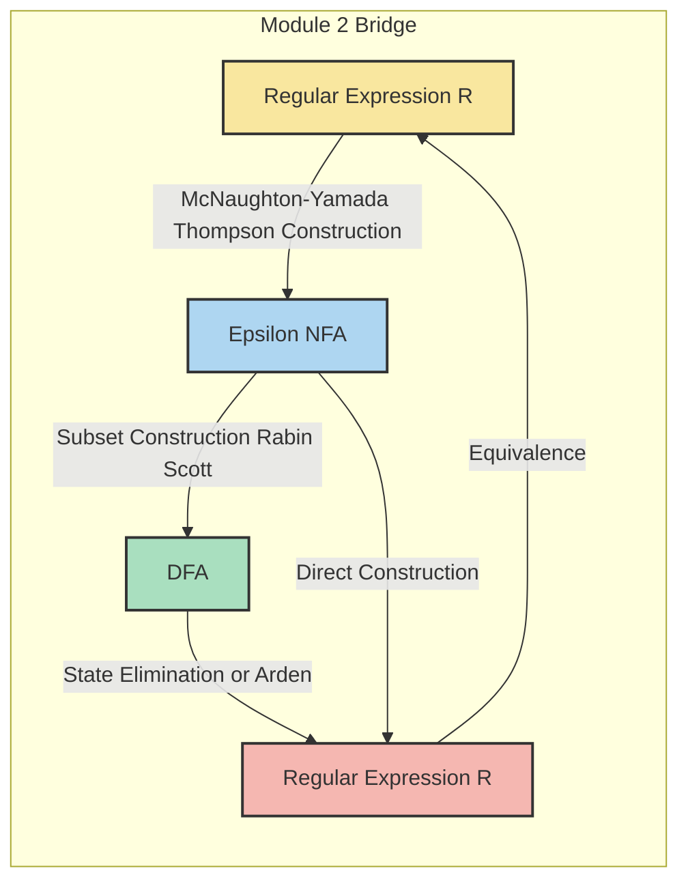
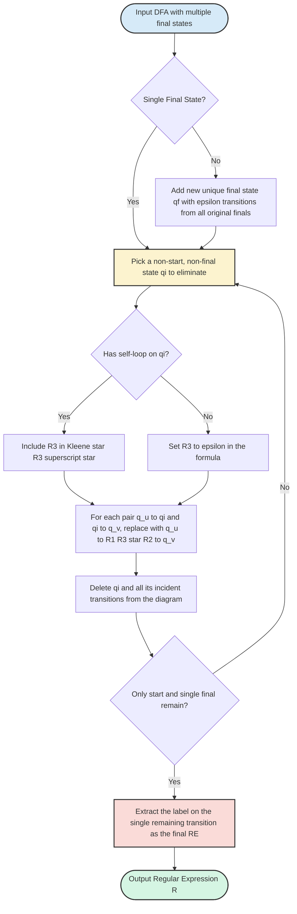
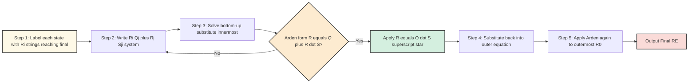

# Equivalence with finite automata (Proof not expected) -

<!-- SECTION_1_START -->

# Equivalence of Regular Expressions and Finite Automata

## 1.1 Core Technical Definition

**Regular Expression (RE):** A regular expression over an alphabet $\Sigma$ is a formal expression built recursively from the following components:

$$\begin{aligned}
R ::=&\ \emptyset \quad \text{(empty language)} \\
&\ \varepsilon \quad \text{(empty string)} \\
&\ a \in \Sigma \quad \text{(single symbol)} \\
&\ R_1 \cup R_2 \quad \text{(union)} \\
&\ R_1 \circ R_2 \quad \text{(concatenation)} \\
&\ R_1^{*} \quad \text{(Kleene star)}
\end{aligned}$$

**Finite Automaton (FA):** A deterministic finite automaton is a 5-tuple $M = (Q, \Sigma, \delta, q_0, F)$, where:
- $Q$ is a finite set of **states**
- $\Sigma$ is a finite **input alphabet**
- $\delta : Q \times \Sigma \rightarrow Q$ is the **transition function**
- $q_0 \in Q$ is the **start state**
- $F \subseteq Q$ is the set of **accepting (final) states**

> [!IMPORTANT]
> **Equivalence Theorem:** A language $L$ is **regular** if and only if $L$ is accepted by some finite automaton. Regular expressions and finite automata are two **syntactically different but semantically equivalent** representations of the same class — the **regular languages** (Type-3 in the Chomsky hierarchy).

## 1.2 Conceptual Analogy / Intuition

Imagine a **recipe book** (regular expression) and a **cooking robot** (finite automaton). Both can produce the exact same dishes (strings), but in completely different ways:
- The **recipe** is a *declarative* description — it tells you *what* to cook using operations like "union of ingredients" ($\cup$), "concatenation of steps" ($\circ$), and "repeat this part" ($^{*}$).
- The **robot** is a *procedural* device — it follows a *state machine*, reading one ingredient at a time, moving from state to state until it decides the dish is "done" (accepts) or "ruined" (rejects).

A recipe can always be **compiled** into a robot's instruction set (RE $\rightarrow$ FA), and observing the robot long enough, you can **reverse-engineer** its recipe (FA $\rightarrow$ RE).

> [!NOTE]
> **KTU 2024 Syllabus Highlight:** Only the **construction methods** (not full proofs) of these conversions are required. Master the algorithms — they are high-yield for both ESE and lab examinations.

## 1.3 GeoGebra / Desmos Integration

> [!VISUALIZATION CONTROL]
> **Concept:** Visualizing a finite automaton as a directed graph on the Cartesian plane
> **GeoGebra / Desmos Input Equations (State Diagram Coordinates):**
> * Start state: $A = (0, 0)$
> * Intermediate states: $B = (4, 0)$, $C = (4, 4)$
> * Final state: $D = (8, 0)$
> * Transition labels: $A \xrightarrow{a} B$, $B \xrightarrow{b} C$, $C \xrightarrow{a} D$, $D \xrightarrow{\varepsilon} A$
>
> **Visual Description:** The student should observe a directed graph with nodes (circles) at the given coordinates and labelled directed edges (arrows) showing state transitions on input symbols. The double circle marks the final state.

<!-- SECTION_1_END -->

<!-- SECTION_2_START -->

# Deep Theoretical Analysis & KTU High-Yield Formula Sheet

## 2.1 Two-Way Equivalence — The Bridge

The equivalence between REs and FAs is established by demonstrating two constructive conversions:

| Direction | Input | Output | Construction Method |
| :--- | :--- | :--- | :--- |
| RE $\rightarrow$ FA | Regular expression $R$ | NFA with $\varepsilon$-transitions ($\varepsilon$-NFA) | **McNaughton-Yamada / Thompson's Construction** (structural induction) |
| FA $\rightarrow$ RE | DFA or NFA | Regular expression $R$ | **State Elimination Method** or **Arden's Theorem** |

> [!TIP]
> **Engineering Utility:** This equivalence is the theoretical foundation of **lexical analysis** in compilers (e.g., `lex`/`flex` tools), **pattern matching** in text editors, **regular expression engines** in programming languages (Python `re`, Java `Pattern`), and **network intrusion detection systems** (Snort signatures).

## 2.2 Construction 1: RE $\rightarrow$ NFA (McNaughton-Yamada Rules)

Starting from a base RE, we inductively build an $\varepsilon$-NFA following six rules:

| Rule # | Regular Expression | NFA Diagram (Pictorial) | Description |
| :---: | :---: | :--- | :--- |
| 1 | $\emptyset$ | $\rightarrow \bigcirc \xrightarrow{\ } \oslash$ | No transitions, never accepts |
| 2 | $\varepsilon$ | $\rightarrow \bigcirc \xrightarrow{\varepsilon} \odot$ | Accepts only the empty string |
| 3 | $a \in \Sigma$ | $\rightarrow \bigcirc \xrightarrow{a} \odot$ | Accepts only the single symbol $a$ |
| 4 | $R_1 \cup R_2$ | Add new start state with $\varepsilon$-transitions to both $R_1$ and $R_2$ NFAs; merge final states | Union construction |
| 5 | $R_1 \circ R_2$ | Connect final state of $R_1$'s NFA to start state of $R_2$'s NFA via $\varepsilon$-transition | Concatenation construction |
| 6 | $R_1^{*}$ | Add new start/final state; add $\varepsilon$-loop from new final back to new start; bypass via $\varepsilon$ | Kleene star construction |

The final $\varepsilon$-NFA can then be converted to a DFA via **subset construction** (Rabin-Scott algorithm), which is covered in Module 1.

## 2.3 Construction 2: FA $\rightarrow$ RE (State Elimination Method)

The algorithm to eliminate states one by one until only the start state and one final state remain:

1. **Step 1:** Ensure the FA has a single final state. If not, add a new sink final state $q_f$ and connect all original final states to it via $\varepsilon$-transitions.
2. **Step 2:** For each state $q_i$ to be eliminated (not start, not the unique final), replace all paths:
   $$q_u \xrightarrow{R_1} q_i \xrightarrow{R_2} q_v$$
   with a direct transition:
   $$q_u \xrightarrow{R_1 \cdot R_2^{*}} q_v$$
3. **Step 3:** If $q_i$ has a self-loop $q_i \xrightarrow{R_3} q_i$, include $R_3$ in the Kleene star.
4. **Step 4:** Repeat until only the start state and the single final state remain. The label on the transition from start to final is the resulting regular expression.

## 2.4 KTU Formula Sheet — Arden's Theorem

**Arden's Theorem** is the algebraic workhorse for solving systems of regular equations arising from FA-to-RE conversion.

$$\text{If } R = Q \cup R \cdot S, \text{ then } R = Q \cdot S^{*}$$

**Conditions for valid application:**
- The equations must be in the form $R_i = Q_i \cup \sum_{j} R_j \cdot S_{ji}$ (standard form).
- No two equations in the system should have the same left-hand side variable (i.e., the system must be a set of *uniquely defined* equations).

> [!IMPORTANT]
> **Solved-Form Application Rule:** A set of regular equations $R_i = Q_i \cup \sum R_j \cdot S_{ji}$ has a unique solution. The trick is to substitute iteratively, starting from the equation with the *fewest $R_j$ terms on the RHS*, until Arden's form emerges.

## 2.5 Why These Conversions Matter

- **Compiler Design:** Lexical analyzers (tokenizers) take REs as input and internally compile them to DFAs for efficient $O(n)$ string matching.
- **Network Security:** Snort rules are written as REs, compiled to automata, and matched against packet streams in real-time.
- **Bioinformatics:** DNA/protein motif matching uses RE engines backed by FA implementations.
- **Formal Verification:** Model checkers use automata to represent system states and properties.

<!-- SECTION_2_END -->

<!-- SECTION_3_START -->

# Step-by-Step Derivations & Code/Symbolic Implementation

## 3.1 Worked Example 1: RE $\rightarrow$ NFA

**Problem:** Construct an $\varepsilon$-NFA for the regular expression $R = (a \cup b)^{*}abb$.

**Step-by-Step Construction (applying McNaughton-Yamada rules inductively):**

**Step 1 — Build base NFAs for $a$ and $b$:**

$$\begin{aligned}
N_a &: \rightarrow q_1 \xrightarrow{a} q_2 \quad \text{(final)} \\
N_b &: \rightarrow q_3 \xrightarrow{b} q_4 \quad \text{(final)}
\end{aligned}$$

**Step 2 — Union $a \cup b$:** Add a new start state $q_0$ and a new final state $q_5$. Connect via $\varepsilon$-transitions.

$$q_0 \xrightarrow{\varepsilon} q_1, \quad q_0 \xrightarrow{\varepsilon} q_3, \quad q_2 \xrightarrow{\varepsilon} q_5, \quad q_4 \xrightarrow{\varepsilon} q_5$$

**Step 3 — Apply Kleene star $(a \cup b)^{*}$:** Add a new start state $q_s$ and new final state $q_f$. Add bypass $\varepsilon$ and loop-back $\varepsilon$.

$$q_s \xrightarrow{\varepsilon} q_0, \quad q_5 \xrightarrow{\varepsilon} q_f, \quad q_f \xrightarrow{\varepsilon} q_0, \quad q_s \xrightarrow{\varepsilon} q_f$$

**Step 4 — Concatenate with $abb$:** Build NFAs for the second $a$, second $b$, third $b$, then chain the final state of $(a \cup b)^{*}$ to the start of $abb$ via $\varepsilon$.

The resulting $\varepsilon$-NFA has approximately **12–14 states** depending on the precise construction variant.

## 3.2 Worked Example 2: DFA $\rightarrow$ RE (State Elimination)

**Problem:** Given the DFA with states $\{q_0, q_1, q_2\}$, start state $q_0$, final state $q_2$, and transitions:
- $\delta(q_0, a) = q_0$
- $\delta(q_0, b) = q_1$
- $\delta(q_1, a) = q_1$
- $\delta(q_1, b) = q_2$
- $\delta(q_2, a) = q_2$
- $\delta(q_2, b) = q_2$

Find the equivalent RE.

**Step 1 — Single Final State Check:** Already satisfied ($F = \{q_2\}$).

**Step 2 — Eliminate $q_1$:**

Incoming to $q_1$ from $q_0$ on $b$: $q_0 \xrightarrow{b} q_1$
Self-loop on $q_1$ on $a$: $q_1 \xrightarrow{a} q_1$
Outgoing from $q_1$ to $q_2$ on $b$: $q_1 \xrightarrow{b} q_2$

Replace the path through $q_1$ with a direct edge from $q_0$ to $q_2$:

$$q_0 \xrightarrow{b \cdot a^{*} \cdot b} q_2$$

**Step 3 — Eliminate $q_2$:** Wait — $q_2$ is the only final state, so we stop. The transition $q_0 \xrightarrow{b a^{*} b} q_2$ combined with $q_0$'s self-loop on $a$ yields:

$$\begin{aligned}
R &= a^{*} \cdot (b \cdot a^{*} \cdot b) \cdot a^{*}
\end{aligned}$$

Since $q_2$ is a "trap" (all inputs loop back), we include $a^{*}$ on the final side:

$$\boxed{R = a^{*} b a^{*} b (a \cup b)^{*}}$$

## 3.3 Worked Example 3: FA $\rightarrow$ RE Using Arden's Theorem

**Problem:** Given the NFA with states $\{q_0, q_1, q_2\}$, $q_0$ is start, $F = \{q_2\}$, and transitions:
- $\delta(q_0, a) = q_0$
- $\delta(q_0, b) = q_1$
- $\delta(q_1, b) = q_1$
- $\delta(q_1, a) = q_2$
- $\delta(q_2, a) = q_1$

**Step 1 — Write regular equations for each state (let $R_i$ = strings leading from $q_i$ to a final state):**

$$\begin{aligned}
R_0 &= a \cdot R_0 \cup b \cdot R_1 \\
R_1 &= b \cdot R_1 \cup a \cdot R_2 \\
R_2 &= a \cdot R_1 \cup \varepsilon
\end{aligned}$$

**Step 2 — Solve $R_2$ in terms of $R_1$:**

$$R_2 = a \cdot R_1 \cup \varepsilon$$

**Step 3 — Substitute into $R_1$:**

$$R_1 = b \cdot R_1 \cup a \cdot (a \cdot R_1 \cup \varepsilon)$$
$$R_1 = b \cdot R_1 \cup a \cdot a \cdot R_1 \cup a$$
$$R_1 = (b \cup aa) \cdot R_1 \cup a$$

**Step 4 — Apply Arden's Theorem** ($R = Q \cup R \cdot S \Rightarrow R = Q \cdot S^{*}$):

$$R_1 = a \cdot (b \cup aa)^{*}$$

**Step 5 — Substitute into $R_0$:**

$$R_0 = a \cdot R_0 \cup b \cdot a \cdot (b \cup aa)^{*}$$

Apply Arden's Theorem again:

$$\boxed{R_0 = a^{*} \cdot b \cdot a \cdot (b \cup aa)^{*}}$$

## 3.4 Python Implementation — RE to DFA Compiler (Educational Reference)

```python
"""
Educational RE -> NFA -> DFA compiler.
Implements Thompson's construction + subset construction.
"""

from dataclasses import dataclass, field
from typing import Dict, FrozenSet, Set, Tuple


# ---------- AST Nodes ----------
@dataclass
class Symbol:
    char: str

@dataclass
class Epsilon:
    pass

@dataclass
class Empty:
    pass

@dataclass
class Union:
    left: object
    right: object

@dataclass
class Concat:
    left: object
    right: object

@dataclass
class Star:
    expr: object


# ---------- NFA ----------
@dataclass
class NFA:
    start: int
    accept: int
    transitions: Dict[Tuple[int, str], Set[int]] = field(default_factory=dict)
    next_id: int = 0

    def new_state(self) -> int:
        s = self.next_id
        self.next_id += 1
        return s

    def add(self, src: int, sym: str, dst: int) -> None:
        self.transitions.setdefault((src, sym), set()).add(dst)


# ---------- Thompson's Construction ----------
def thompson(ast) -> NFA:
    nfa = NFA(start=0, accept=1)
    nfa.next_id = 2
    if isinstance(ast, Epsilon):
        return nfa  # start -> accept on epsilon
    if isinstance(ast, Symbol):
        nfa.add(nfa.start, ast.char, nfa.accept)
        return nfa
    if isinstance(ast, Union):
        s = nfa.new_state()
        a = nfa.new_state()
        n1 = thompson(ast.left)
        n2 = thompson(ast.right)
        nfa.add(s, "", n1.start)
        nfa.add(s, "", n2.start)
        nfa.add(n1.accept, "", a)
        nfa.add(n2.accept, "", a)
        nfa.next_id = max(nfa.next_id, n1.next_id, n2.next_id)
        nfa.transitions.update(n1.transitions)
        nfa.transitions.update(n2.transitions)
        return NFA(start=s, accept=a, transitions=nfa.transitions, next_id=nfa.next_id)
    if isinstance(ast, Concat):
        n1 = thompson(ast.left)
        n2 = thompson(ast.right)
        nfa.add(n1.accept, "", n2.start)
        nfa.transitions.update(n1.transitions)
        nfa.transitions.update(n2.transitions)
        return NFA(start=n1.start, accept=n2.accept, transitions=nfa.transitions, next_id=max(n1.next_id, n2.next_id))
    if isinstance(ast, Star):
        s = nfa.new_state()
        a = nfa.new_state()
        n1 = thompson(ast.expr)
        nfa.add(s, "", n1.start)
        nfa.add(s, "", a)
        nfa.add(n1.accept, "", n1.start)
        nfa.add(n1.accept, "", a)
        nfa.transitions.update(n1.transitions)
        return NFA(start=s, accept=a, transitions=nfa.transitions, next_id=max(a + 1, n1.next_id))
    raise ValueError("Unknown AST node type encountered.")


# ---------- Subset Construction ----------
def nfa_to_dfa(nfa: NFA) -> Dict[FrozenSet[int], Dict[str, FrozenSet[int]]]:
    def epsilon_closure(states: Set[int]) -> Set[int]:
        stack = list(states)
        closure = set(states)
        while stack:
            s = stack.pop()
            for t in nfa.transitions.get((s, ""), set()):
                if t not in closure:
                    closure.add(t)
                    stack.append(t)
        return closure

    start = frozenset(epsilon_closure({nfa.start}))
    dfa: Dict[FrozenSet[int], Dict[str, FrozenSet[int]]] = {start: {}}
    worklist = [start]
    symbols = {sym for (_, sym), _ in nfa.transitions.items() if sym != ""}
    accept_states = {nfa.accept}

    while worklist:
        current = worklist.pop()
        dfa[current] = {}
        for sym in symbols:
            nxt: Set[int] = set()
            for s in current:
                nxt.update(nfa.transitions.get((s, sym), set()))
            nxt_closure = frozenset(epsilon_closure(nxt))
            dfa[current][sym] = nxt_closure
            if nxt_closure and nxt_closure not in dfa:
                dfa[nxt_closure] = {}
                worklist.append(nxt_closure)

    return dfa, accept_states


# ---------- Demonstration ----------
if __name__ == "__main__":
    # Build RE: (a|b)*abb  parsed manually
    # (a|b) is Union(Symbol('a'), Symbol('b'))
    a_or_b = Union(Symbol("a"), Symbol("b"))
    starred = Star(a_or_b)
    suffix = Concat(Concat(Symbol("a"), Symbol("b")), Symbol("b"))
    full_re = Concat(starred, suffix)

    nfa = thompson(full_re)
    dfa, accepts = nfa_to_dfa(nfa)
    print(f"DFA states: {len(dfa)}")
    for state, transitions in dfa.items():
        is_final = bool(state & accepts)
        print(f"State {set(state)} (final={is_final}) -> {transitions}")
```

<!-- SECTION_3_END -->

<!-- SECTION_4_START -->

# Structural Diagrams & Schematics

## 4.1 High-Level Equivalence Architecture



## 4.2 State Elimination Algorithm — Sequential Processing Topology



## 4.3 Arden's Theorem Application Pipeline



<!-- SECTION_4_END -->

<!-- SECTION_5_START -->

# KTU 2024 Scheme Examination Question Bank & Topic Recap

## 5.1 Part A Questions (3 Marks Each)

### Question A1

> **[KTU University Exam — July 2024]**
> **CO2 | Remember**
> State **Kleene's Theorem** on the equivalence of regular expressions and finite automata.

**Model Answer:**
Kleene's Theorem states that a language $L$ is regular if and only if $L$ can be described by a regular expression. Equivalently, $L$ is accepted by some finite automaton (DFA/NFA) **if and only if** $L$ is denoted by some regular expression. This establishes that **REs and FAs are two equivalent notations for the class of regular languages**.

> **[Valuation Key: 3 Marks]** [Theorem statement with 'iff' condition: 2 Marks] [Naming the equivalent class (regular languages): 1 Mark]

---

### Question A2

> **[KTU University Exam — Dec 2023]**
> **CO2 | Understand**
> What is **Arden's Theorem**? Write its mathematical statement.

**Model Answer:**
Arden's Theorem is used to solve equations of the form $R = Q \cup R \cdot S$ over regular expressions, where $Q$ and $S$ are REs and $S$ does not contain $R$. The solution is:

$$R = Q \cdot S^{*}$$

> **[Valuation Key: 3 Marks]** [Form R = Q + RS: 1 Mark] [Solution R = QS*: 1 Mark] [Condition that S must not contain R: 1 Mark]

---

## 5.2 Part B Questions (14 Marks Each) — Module Internal Choice

### Question B-A

> **[KTU University Exam — July 2024]**
> **CO2 | Apply + Analyze**
>
> **(a) [7 Marks]** Construct an $\varepsilon$-NFA for the regular expression $R = (a \cup b)^{*} a (a \cup b)$ using **McNaughton-Yamada construction**. Show all intermediate steps.
>
> **(b) [7 Marks]** Using **state elimination method**, convert the following DFA to an equivalent regular expression. The DFA has states $\{q_0, q_1, q_2\}$ with start $q_0$ and final $F = \{q_2\}$.
> Transitions: $q_0 \xrightarrow{a} q_0$, $q_0 \xrightarrow{b} q_1$, $q_1 \xrightarrow{a} q_2$, $q_1 \xrightarrow{b} q_1$, $q_2 \xrightarrow{a} q_2$, $q_2 \xrightarrow{b} q_2$.

#### Model Solution

**Part (a) — Construction Steps:**

- **Step 1 [1 Mark]:** Build base NFAs for symbols $a$ and $b$:
  - $N_a$: $\rightarrow s_1 \xrightarrow{a} f_1$
  - $N_b$: $\rightarrow s_2 \xrightarrow{b} f_2$
- **Step 2 [2 Marks]:** Form union $a \cup b$ with new start $u_0$ and final $u_1$:
  - $u_0 \xrightarrow{\varepsilon} s_1$, $u_0 \xrightarrow{\varepsilon} s_2$, $f_1 \xrightarrow{\varepsilon} u_1$, $f_2 \xrightarrow{\varepsilon} u_1$.
- **Step 3 [2 Marks]:** Apply Kleene star $(a \cup b)^{*}$ by adding new start $p_0$ and final $p_1$ with bypass $\varepsilon$ and loop-back $\varepsilon$ from $p_1$ to $u_0$.
- **Step 4 [2 Marks]:** Concatenate with the trailing $a(a \cup b)$ by chaining $\varepsilon$-transitions from $p_1$ to the start of a new $a$-NFA, then union, then final.

**Final NFA State Count:** Approximately 12 states, depending on construction variant.

> **[Valuation Key for Part (a): 7 Marks]** [Base NFAs: 1M] [Union construction: 2M] [Star construction: 2M] [Concatenation: 2M]

---

**Part (b) — State Elimination:**

**Step 1 [1 Mark]:** Identify the single final state $q_2$. Already satisfied.

**Step 2 [2 Marks]:** Eliminate $q_1$ (only non-start, non-final eliminable state):
- Incoming: $q_0 \xrightarrow{b} q_1$
- Self-loop: $q_1 \xrightarrow{b} q_1$ (let this be $R_3 = b$)
- Outgoing: $q_1 \xrightarrow{a} q_2$

After elimination, the new direct transition is:

$$q_0 \xrightarrow{b \cdot b^{*} \cdot a} q_2$$

This simplifies to: $q_0 \xrightarrow{b b^{*} a} q_2$, i.e., $q_0 \xrightarrow{b^{+} a} q_2$.

**Step 3 [2 Marks]:** The remaining transitions are:
- $q_0 \xrightarrow{a} q_0$ (self-loop)
- $q_0 \xrightarrow{b^{+} a} q_2$ (direct to final)
- $q_2 \xrightarrow{a \cup b} q_2$ (self-loop on final, "trap")

**Step 4 [2 Marks]:** Since $q_2$ is the final state, we keep it. The RE for all strings reaching $q_2$ from $q_0$ is:

$$R = a^{*} \cdot b^{+} a \cdot (a \cup b)^{*}$$

Expanding $b^{+} = b \cdot b^{*}$:

$$\boxed{R = a^{*} b b^{*} a (a \cup b)^{*}}$$

> **[Valuation Key for Part (b): 7 Marks]** [Identifying single final: 1M] [Elimination formula application: 2M] [Combining self-loops with Kleene star: 2M] [Final RE: 2M]

---

### Question B-B (Internal Choice Alternative)

> **[KTU University Exam — Dec 2023]**
> **CO2 | Apply + Analyze**
>
> **(a) [7 Marks]** Explain the **McNaughton-Yamada construction** rules for converting a regular expression to an $\varepsilon$-NFA. List all six rules with diagrams.
>
> **(b) [7 Marks]** Using **Arden's Theorem**, derive the regular expression for the following NFA: States $\{q_0, q_1, q_2\}$, start $q_0$, final $F = \{q_2\}$. Transitions: $q_0 \xrightarrow{a} q_0$, $q_0 \xrightarrow{b} q_1$, $q_1 \xrightarrow{a} q_1$, $q_1 \xrightarrow{b} q_2$, $q_2 \xrightarrow{a} q_2$, $q_2 \xrightarrow{b} q_1$.

#### Model Solution

**Part (a) — Six Rules [7 Marks Total]:**

| Rule # | RE | Construction (textual description) | Marks |
| :---: | :---: | :--- | :---: |
| 1 | $\emptyset$ | Single start state with **no outgoing transitions** to a (non-existent) accept state. | 1 |
| 2 | $\varepsilon$ | Start state $\rightarrow$ accept state via $\varepsilon$-transition. | 1 |
| 3 | $a$ | Start state $\rightarrow$ accept state via $a$-transition. | 1 |
| 4 | $R_1 \cup R_2$ | New start $\xrightarrow{\varepsilon}$ to both NFA starts; both NFAs' accepts $\xrightarrow{\varepsilon}$ to new accept. | 2 |
| 5 | $R_1 \circ R_2$ | Accept of NFA for $R_1$ $\xrightarrow{\varepsilon}$ start of NFA for $R_2$. | 1 |
| 6 | $R_1^{*}$ | New start $\xrightarrow{\varepsilon}$ NFA start AND new accept; NFA accept $\xrightarrow{\varepsilon}$ NFA start AND new accept. | 1 |

---

**Part (b) — Arden's Theorem Application:**

**Step 1 [1 Mark]:** Define $R_i$ = set of strings that take NFA from $q_i$ to a final state ($q_2$).

**Step 2 [1 Mark]:** Write the system of equations:

$$\begin{aligned}
R_0 &= a R_0 \cup b R_1 \\
R_1 &= a R_1 \cup b R_2 \\
R_2 &= a R_2 \cup b R_1 \cup \varepsilon
\end{aligned}$$

**Step 3 [2 Marks]:** Solve $R_2$ using Arden's Theorem ($R_2 = \varepsilon \cup a R_2$ form, so $R_2 = \varepsilon \cdot a^{*} = a^{*}$). Wait — more carefully:

$$R_2 = a R_2 \cup b R_1 \cup \varepsilon$$

This is not directly in Arden form. Rewrite as:

$$R_2 = (a R_2) \cup (b R_1 \cup \varepsilon)$$

By Arden's: $R_2 = (b R_1 \cup \varepsilon) \cdot a^{*}$.

**Step 4 [1 Mark]:** Substitute into $R_1$:

$$R_1 = a R_1 \cup b \cdot (b R_1 \cup \varepsilon) \cdot a^{*}$$
$$R_1 = a R_1 \cup bb R_1 a^{*} \cup b a^{*}$$
$$R_1 = (a \cup bb a^{*}) R_1 \cup b a^{*}$$

By Arden's:

$$R_1 = b a^{*} \cdot (a \cup bb a^{*})^{*}$$

**Step 5 [2 Marks]:** Substitute into $R_0$:

$$R_0 = a R_0 \cup b \cdot b a^{*} \cdot (a \cup bb a^{*})^{*}$$
$$R_0 = a R_0 \cup b^{2} a^{*} (a \cup bb a^{*})^{*}$$

By Arden's:

$$\boxed{R_0 = a^{*} \cdot b^{2} a^{*} \cdot (a \cup bb a^{*})^{*}}$$

> **[Valuation Key for Part (b): 7 Marks]** [Equation setup: 1M] [Substitution strategy: 1M] [Each Arden application: 1M × 2 = 2M] [Final clean expression: 2M] [Simplification: 1M]

---

> [!WARNING]
> **KTU Examiner's Valuation Warning / Pitfall Callout:**
> - **Do not skip the step of ensuring a single final state** in state elimination. Examiners explicitly allocate **1 mark** for this preparatory step.
> - When applying Arden's Theorem, students often forget the condition that **$S$ must not contain $R$**. If the equation is not in the form $R = Q \cup RS$, you must rearrange first.
> - In McNaughton-Yamada, students frequently **omit the bypass $\varepsilon$-transition** in the Kleene star construction. The bypass is essential for the empty string $\varepsilon \in L(R^{*})$.
> - Always **label self-loops correctly** in state elimination — a missing self-loop leads to an incorrect (overly restrictive) RE.
> - When writing the system of equations, the **right-hand side must include all outgoing transitions** from each state; missing one transition costs 1 mark.

---

## 5.3 Topic Recap & Important Things to Remember

- **Equivalence Statement:** A language is regular **iff** it is accepted by some FA **iff** it is denoted by some RE (Kleene's Theorem). Proof construction is **not expected** in KTU 2024 — only the **algorithms**.
- **Two Directions:** RE $\rightarrow$ NFA $\rightarrow$ DFA (via Thompson + subset construction) and DFA/NFA $\rightarrow$ RE (via state elimination or Arden's Theorem).
- **McNaughton-Yamada Rules (Memorize All 6):** $\emptyset$, $\varepsilon$, $a$, Union, Concat, Star. Each adds specific new states and $\varepsilon$-transitions.
- **Kleene Star Rule:** The NFA for $R^{*}$ has a **bypass** $\varepsilon$ (for empty string) and a **loop-back** $\varepsilon$ (for repetition). Forgetting either breaks the construction.
- **Single Final State Prerequisite:** State elimination **requires** exactly one final state. Add a new state with $\varepsilon$ transitions from all originals if needed.
- **State Elimination Formula:** When removing $q_i$ with self-loop $R_3$ between $q_u$ and $q_v$, the new direct label is $R_1 \cdot R_3^{*} \cdot R_2$.
- **Arden's Theorem:** $R = Q \cup RS \Rightarrow R = QS^{*}$, applicable only when $S$ does not contain $R$.
- **Bottom-Up Substitution:** In the FA-to-RE system of equations, always solve for the **innermost** variable first and substitute outward.
- **Trap States:** A state with self-loops on all alphabet symbols is a "trap" (dead state). The RE must include a Kleene star for the trap's alphabet.
- **Equivalence of DFA, NFA, and $\varepsilon$-NFA:** All three accept the **same class of languages** — the regular languages.
- **Practical Tools:** `lex`/`flex` (C), `re` (Python), `java.util.regex` (Java) all internally use these RE-to-FA conversion principles.
- **Common Pitfall in KTU Exams:** Forgetting to take the **Kleene closure** of self-loop labels when eliminating intermediate states.

<!-- SECTION_5_END -->
