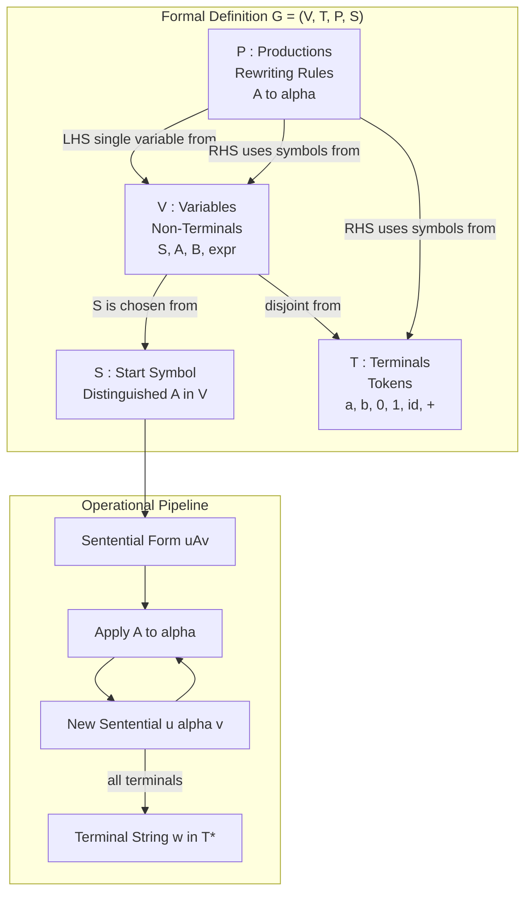
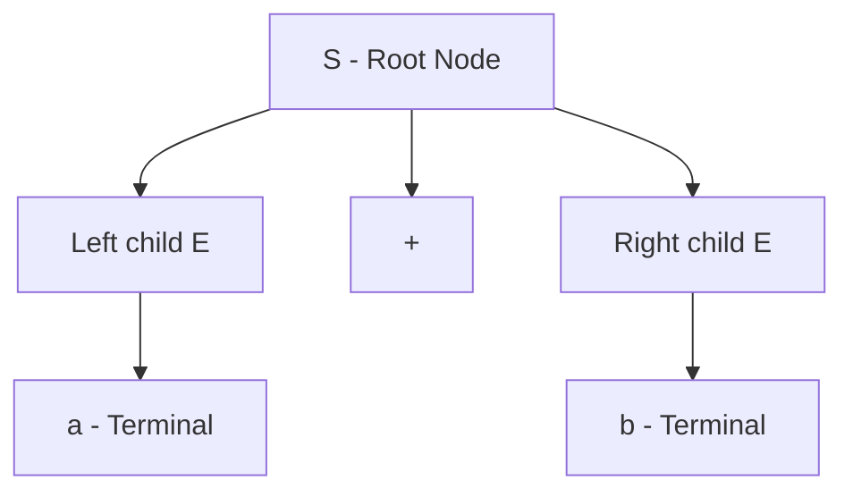
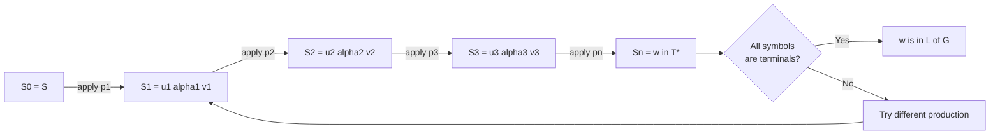
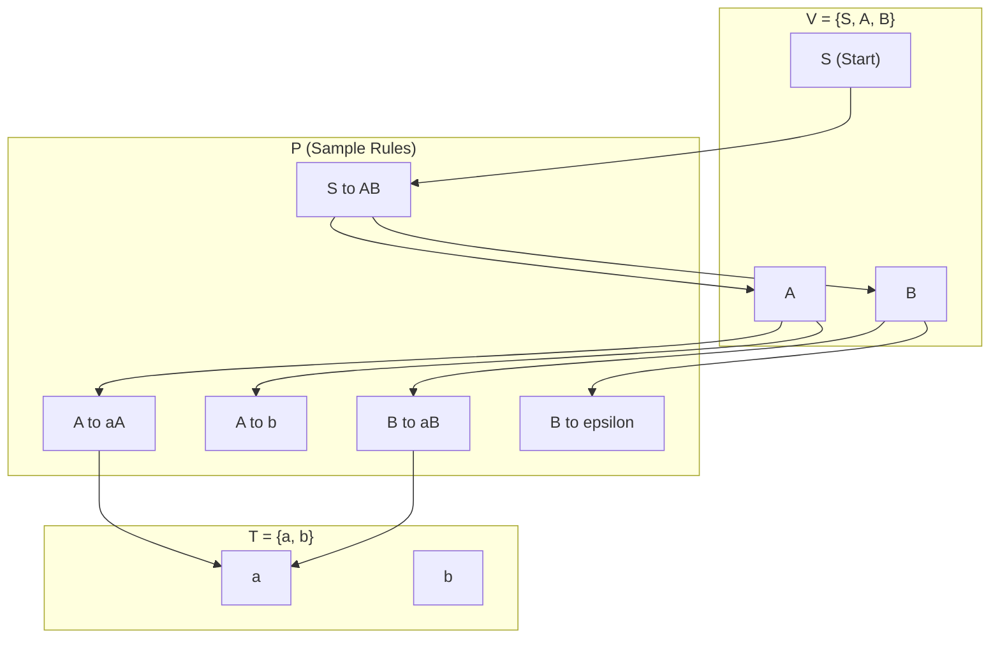
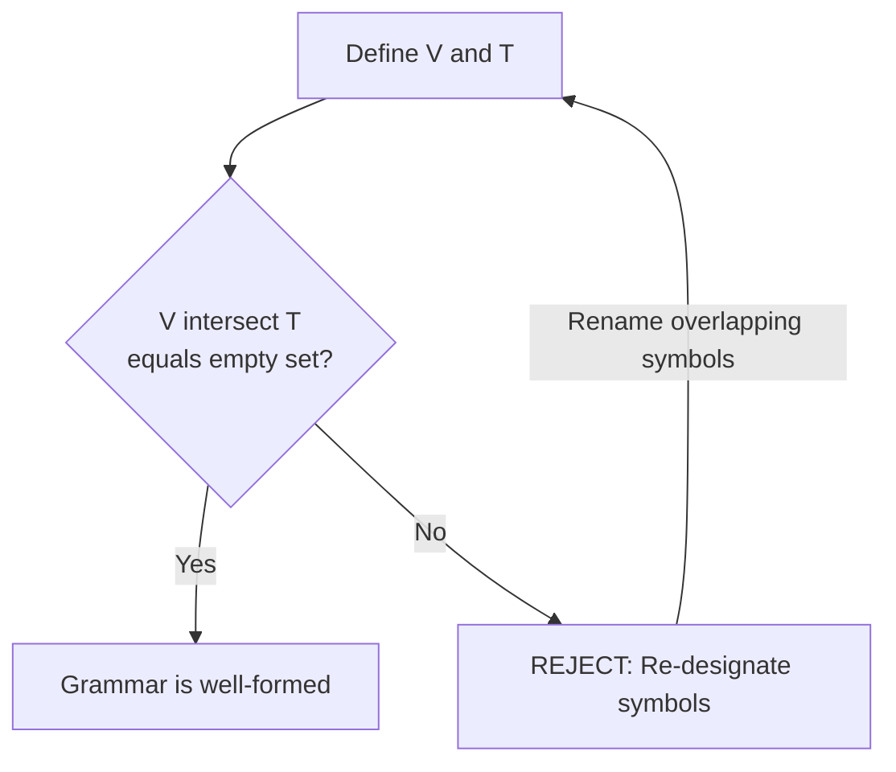

# Formal definition of a context-free grammar

<!-- SECTION_1_START -->

# Formal Definition of a Context-Free Grammar (CFG)

## 1.1 Core Technical Definition

> [!IMPORTANT]
> **Context-Free Grammar (CFG) – KTU 2024 Definition (Linz, Chapter 5)**
> A **context-free grammar** $G$ is a quadruple
> $$G = (V, T, P, S)$$
> where each component has a precise, non-overlapping role in defining a context-free language.

The four-tuple $G = (V, T, P, S)$ is formally defined as:

| Component | Symbol | Meaning | KTU Notation |
|-----------|--------|---------|---------------|
| Variables (Non-terminals) | $V$ | Finite set of symbols that act as placeholders / syntactic categories | Upper-case Latin letters $A, B, S, \langle \text{stmt} \rangle$ |
| Terminals | $T$ | Finite set of symbols that form the actual strings of the language | Lower-case Latin letters $a, b, 0, 1, \; id, \; +$ |
| Productions (Rules) | $P$ | Finite set of rewrite rules of the form $A \rightarrow \alpha$ where $A \in V$ and $\alpha \in (V \cup T)^{*}$ | Written as $A \rightarrow \alpha_{1} \mid \alpha_{2} \mid \dots \mid \alpha_{n}$ |
| Start Symbol | $S$ | A distinguished element of $V$ from which all derivations begin | $S \in V$ |

> [!NOTE]
> **Mandatory Disjointness Axiom:** $V \cap T = \varnothing$. No symbol can simultaneously be a variable and a terminal. This separation is what makes a grammar *well-formed* under the KTU valuation key.

The **language generated** by a CFG $G$, denoted $L(G)$, is the set of all terminal strings derivable from the start symbol $S$ in a finite number of steps:
$$L(G) = \{ w \in T^{*} \mid S \Rightarrow^{*} w \}$$

where $\Rightarrow^{*}$ denotes zero or more derivation steps using productions in $P$.

---

## 1.2 Conceptual Analogy / Intuition

> [!TIP]
> **Intuition — The "Recipe Card" Analogy**
> Think of a CFG as a **recipe card for a sentence**:
> - The **Variables** ($V$) are the *categories* written in a recipe: `<ingredient>`, `<step>`.
> - The **Terminals** ($T$) are the *actual words*: `flour`, `stir`, `2 cups`.
> - The **Productions** ($P$) are the *rewriting rules* on the back of the card: `<ingredient> → 2 cups flour`.
> - The **Start Symbol** ($S$) is the *dish title* at the top: `<cake>`.
>
> The phrase *"context-free"* means that whenever you see the category `<ingredient>`, you may replace it by the right-hand side **regardless of what surrounds it** (the *context*). The rule `<ingredient> → flour` is applied the same way whether the surrounding words are "add" or "sprinkle".

> [!NOTE]
> **Geometric Intuition — The Derivation Tree as a Family Tree**
> A CFG derivation is best visualised as a **rooted, ordered tree**:
> - The **root** = start symbol $S$.
> - Each **internal node** = a variable $A \in V$ that gets expanded.
> - Each **leaf** = a terminal $a \in T$ (when derivation completes) or $\varepsilon$ (epsilon, the empty string).
> - Reading the leaves **left-to-right** gives the derived string $w$.
> This tree is *context-free* because each parent expands into its children *independently* of siblings.

---

## 1.3 Component-Level Deep Dive

### Variables ($V$)
Variables (also called *non-terminals* or *syntactic categories*) are *helper symbols* that never appear in the final string. They are scaffolding that is dismantled during derivation. In KTU board scripts, students must:
1. Explicitly *list* $V$ in set-builder notation.
2. Distinguish $V$ from $T$ by visual convention (upper-case vs. lower-case).

### Terminals ($T$)
Terminals are the *atomic tokens* of the language. They cannot be rewritten. The derived string $w$ of $L(G)$ is *guaranteed* to consist solely of terminal symbols.

> [!IMPORTANT]
> **Total Alphabet:** $V \cup T$ is called the *total alphabet* or *vocabulary* of the grammar, often denoted $\Sigma$ in some texts. KTU 2024 uses $V \cup T$ for the CFG definition.

### Productions ($P$)
A production is a rewrite rule of the form
$$A \rightarrow \alpha \quad \text{where } A \in V,\; \alpha \in (V \cup T)^{*}$$
- The left side $A$ is **always a single variable** (this is the *context-free* restriction).
- The right side $\alpha$ is a *string of variables and terminals*, possibly empty ($\alpha = \varepsilon$).
- The vertical bar $\mid$ is shorthand: $A \rightarrow \alpha_{1} \mid \alpha_{2}$ means two productions $A \rightarrow \alpha_{1}$ and $A \rightarrow \alpha_{2}$.

### Start Symbol ($S$)
$S \in V$ is the *axiom* of the grammar. Every string in $L(G)$ is obtained by starting at $S$ and applying productions. If $V$ contains multiple variables, only $S$ is allowed to begin a derivation.

---

## 1.4 The Special Role of $\varepsilon$-Productions

> [!WARNING]
> **Epsilon Production Rule (Frequently tested in KTU):**
> A production of the form $A \rightarrow \varepsilon$ is called an **$\varepsilon$-production** or *null production*. It is allowed in a CFG and means "variable $A$ may be erased in one step". Many KTU problems ask students to *identify* or *eliminate* $\varepsilon$-productions.

> [!VISUALIZATION CONTROL]
> **Concept:** Derivation tree of the arithmetic expression $a + b$ under the grammar $G = (\{S, E\}, \{a, b, +, *\}, P, S)$.
> **Sample CFG productions:**
> * $S \rightarrow E$
> * $E \rightarrow E + E \mid E * E \mid a \mid b$
> **Visual Description:** The student should picture a root node $S$ with a single child $E$, which branches into three children $E$, $+$, $E$, where the leftmost $E$ yields leaf $a$ and the rightmost $E$ yields leaf $b$. The leaves read left-to-right spell `a + b`.

---

## 1.5 Quick Self-Check Card (Before Reading Further)

> [!TIP]
> **Can you answer these in one line each?**
> 1. What does the letter $P$ stand for in $G = (V, T, P, S)$?
> 2. Is the left side of a CFG production allowed to be a terminal?
> 3. If $V = \{S, A\}$ and $T = \{a, b\}$, can $S$ appear in a final derived string?
> 4. What is the relationship between $V$ and $T$?
>
> *(Answers: 1. Productions/Rules, 2. No, 3. No, 4. $V \cap T = \varnothing$.)*

---

<!-- SECTION_1_END -->

<!-- SECTION_2_START -->

# Deep Theoretical Analysis & KTU High-Yield Formula Sheet

## 2.1 Operational Interpretation of the Four-Tuple

The four-tuple $G = (V, T, P, S)$ is not just a notation — it is a **mathematical specification of a generative machine**. Understanding *why* each component is necessary clarifies its role in derivation.

### Step 1 — Why Variables ($V$) are Required
Variables introduce **abstraction** and **recursion**. A grammar for the language $L = \{a^{n}b^{n} \mid n \geq 1\}$ (a classic KTU question) cannot be written using only terminals because the rule "balance" must be expressed somehow. Variables such as $S$ encode the recursive structure:
$$S \rightarrow aSb \mid ab$$
Here, the variable $S$ allows the same production to be re-applied to its own output — the engine of recursion.

### Step 2 — Why Terminals ($T$) are Required
Terminals are the *boundary* between grammar and language. They define what is *visible* in the final string. KTU board examiners often test the *disjointness* of $V$ and $T$ as a 2-mark question.

### Step 3 — Why Productions ($P$) are Required
Productions are the *transitions* of a derivation. They specify exactly how a variable can be replaced. Formally, applying $A \rightarrow \alpha$ to a sentential form $uAv$ produces $u\alpha v$, denoted $uAv \Rightarrow u\alpha v$.

### Step 4 — Why Start Symbol ($S$) is Required
Without a designated start, the grammar is *ambiguous about its entry point*. The start symbol $S \in V$ eliminates this ambiguity.

---

## 2.2 Formal Definition (Linz, Theorem 5.1)

> [!IMPORTANT]
> **Definition 2.1 — Context-Free Grammar (Linz):**
> A **grammar** $G = (V, T, P, S)$ is a **context-free grammar** if all productions in $P$ have the form
> $$A \rightarrow x$$
> where $A \in V$ and $x \in (V \cup T)^{*}$.

A grammar is *not* context-free if at least one production has a left side with more than one variable or with a terminal — e.g., $aB \rightarrow c$ or $AB \rightarrow CD$ are *not* context-free.

---

## 2.3 KTU High-Yield Formula Sheet

> [!TIP]
> **Master this table — every entry has appeared in KTU 2024 / past papers.**

| # | Concept | Symbolic Form | KTU-Mandated Notation | Notes |
|---|---------|---------------|------------------------|-------|
| 1 | CFG Tuple | $G = (V, T, P, S)$ | Standard quadruple | Order matters in KTU scripts |
| 2 | Disjointness | $V \cap T = \varnothing$ | Required for well-formedness | Lose 1 mark if missed |
| 3 | Production form | $A \rightarrow \alpha$ | $A \in V,\; \alpha \in (V \cup T)^{*}$ | Single variable on LHS |
| 4 | Derivation step | $uAv \Rightarrow u\alpha v$ | One-step replacement | $u, v \in (V \cup T)^{*}$ |
| 5 | Multi-step derivation | $u \Rightarrow^{*} v$ | Zero or more steps | Reflexive, transitive closure |
| 6 | Language generated | $L(G) = \{w \in T^{*} \mid S \Rightarrow^{*} w\}$ | All terminal strings from $S$ | $w$ must be **all terminals** |
| 7 | $\varepsilon$-production | $A \rightarrow \varepsilon$ | $A \in V$ | Allowed but may be eliminated |
| 8 | Unit production | $A \rightarrow B$ | Both $A, B \in V$ | Also eliminable |
| 9 | Length of derivation | $\|w\| = n$ | $n$ derivation steps from $S$ | Used in $L(G)$ counting proofs |
| 10 | BNF meta-symbols | $\rightarrow$ rewritten as $::=$ | Backus-Naur form | Same mathematical meaning |

---

## 2.4 Engineering Utility of CFG

Context-free grammars are *the* formal backbone of:

| Field | Concrete Use |
|-------|--------------|
| **Compiler Design** | Parsing phase (syntax analysis) — YACC, ANTLR, Bison all use CFG. |
| **Programming Language Specification** | Java Language Specification, C++ grammar, Python PEG. |
| **XML / JSON Parsing** | DTD and JSON Schema are essentially CFG variants. |
| **Natural Language Processing** | Phrase-structure rules in computational linguistics. |
| **Software Verification** | Model checkers encode CFGs to verify program structure. |
| **Database Query Languages** | SQL grammar is formally defined via CFG-like rules. |

> [!NOTE]
> **Production reality:** Whenever a developer writes a `grammar` file in ANTLR or a `.y` file in YACC, they are specifying a CFG of the form $G = (V, T, P, S)$ where $V$ = grammar rules, $T$ = tokens, $P$ = alternatives joined by $\mid$, and $S$ = the first rule.

---

## 2.5 Derivation Mechanics — Direct vs. Recursive

A **direct derivation** $uAv \Rightarrow u\alpha v$ applies **one** production to **one** occurrence of a variable. If the sentential form contains the same variable multiple times, we have a *choice* — this choice is what leads to the distinction between:

| Derivation Type | Definition | Tree Equivalent |
|------------------|------------|------------------|
| **Leftmost derivation** | Always replace the *leftmost* variable | Standard parse tree |
| **Rightmost derivation** | Always replace the *rightmost* variable (canonical) | Standard parse tree |
| **Recursive derivation** | A variable eventually reproduces itself | Tree with repeated symbols |

> [!WARNING]
> **KTU Pitfall:** A grammar is *ambiguous* if **at least one string** has **two different parse trees**, equivalently **two different leftmost derivations**. Do not confuse grammar ambiguity with non-determinism.

---

<!-- SECTION_2_END -->

<!-- SECTION_3_START -->

# Step-by-Step Derivations, Worked Examples & Symbolic Implementation

## 3.1 Worked Example 1 — Building a CFG from $L = \{a^{n}b^{n} \mid n \geq 1\}$

We want a CFG $G$ that generates strings with $n$ a's followed by $n$ b's, e.g., $ab, aabb, aaabbb, \dots$

### Step 1 — Identify the Components
- **Variables** $V$: We need one variable to "balance" the count. Choose $V = \{S\}$.
- **Terminals** $T$: $T = \{a, b\}$.
- **Start symbol** $S$: The only variable, so $S$ is the start.

### Step 2 — Write the Productions
The recursive idea: to get $n$ a's followed by $n$ b's, we may either:
- Use the base case $n = 1$: $S \rightarrow ab$.
- Use the recursive case $n = k+1$: produce one extra $a$ on the left and one extra $b$ on the right: $S \rightarrow aSb$.

So $P = \{ S \rightarrow aSb \mid ab \}$.

### Step 3 — Verify Disjointness
$V \cap T = \{S\} \cap \{a, b\} = \varnothing$. ✔

### Step 4 — Final Answer
$$\boxed{G = (\{S\}, \{a, b\}, \{S \rightarrow aSb \mid ab\}, S)}$$

### Step 5 — Verify the Grammar Generates $a^{2}b^{2}$
Apply the derivation rules in order:
$$S \Rightarrow aSb \Rightarrow aaSbb \Rightarrow aaabbb$$
Wait — applying $S \rightarrow ab$ at the *last* step gives $a^{2}b^{2}$:
$$S \Rightarrow aSb \Rightarrow aaSbb \Rightarrow aa\;ab\;bb = aabb$$
✔ Matches the target.

---

## 3.2 Worked Example 2 — Building a CFG for the Language of Palindromes over $\{a, b\}$

**Language:** $L = \{w \in \{a, b\}^{*} \mid w = w^{R}\}$ (palindromes, including $\varepsilon$).

### Step 1 — Components
- $V = \{S\}$
- $T = \{a, b\}$
- $P = \{ S \rightarrow aSa \mid bSb \mid a \mid b \mid \varepsilon \}$
- Start: $S$

### Step 2 — Verify Generation of `aba`
$$S \Rightarrow aSa \Rightarrow abSba \Rightarrow ababa$$
✔ `ababa` is a palindrome.

### Step 3 — Verify Generation of $\varepsilon$
$$S \Rightarrow \varepsilon$$
✔ The empty string is a palindrome.

---

## 3.3 Worked Example 3 — Derivation Tree (Parse Tree) Construction

Given the grammar
$$S \rightarrow aSb \mid ab$$
and the string $w = aaabbb$, we construct the **derivation tree**:

**Derivation steps (leftmost):**
$$S \Rightarrow aSb \Rightarrow aaSbb \Rightarrow aaaSbbb \Rightarrow aaa\;ab\;bbb = aaabbb$$

**Parse tree structure (textual representation):**
```
        S
       /|\
      / | \
     a  S  b
       /|\
      / | \
     a  S  b
       /|\
      / | \
     a  S  b
        |
        ab
```
But the bottom is cleaner if we expand the final step as:
```
        S
       /|\
      / | \
     a  S  b
       /|\
      / | \
     a  S  b
       /|\
      / | \
     a  S  b
       / \
      a   b
```

Reading leaves left-to-right: $a\,a\,a\,b\,b\,b$ = `aaabbb`. ✔

---

## 3.4 Worked Example 4 — Verifying a String is in $L(G)$ via Brute-Force Search (Python)

The following Python program verifies whether a given string $w$ can be generated by a CFG via **exhaustive leftmost derivation search** (only feasible for short strings).

```python
from typing import FrozenSet, Tuple, Set, List

# ----------------------------------------------------------------------
# Formal CFG data structure (V, T, P, S)
# ----------------------------------------------------------------------
class CFG:
    def __init__(self,
                 variables: FrozenSet[str],
                 terminals: FrozenSet[str],
                 productions: dict,
                 start: str) -> None:
        assert start in variables, "Start symbol S must be in V"
        assert variables.isdisjoint(terminals), "V and T must be disjoint"
        for lhs, rhs_list in productions.items():
            assert lhs in variables, f"LHS '{lhs}' must be a variable"
            for rhs in rhs_list:
                for sym in rhs:
                    assert sym in variables or sym in terminals or sym == '', \
                        f"Symbol '{sym}' must be in V or T"
        self.V: FrozenSet[str] = variables
        self.T: FrozenSet[str] = terminals
        self.P: dict = productions
        self.S: str = start

    def is_in_language(self, target: str, max_depth: int = 12) -> bool:
        """Bounded breadth-first search for a leftmost derivation of target."""
        if target == "":
            return "" in self.P.get(self.S, [])
        frontier: List[str] = [self.S]
        visited: Set[str] = set()
        for _ in range(max_depth):
            next_frontier: List[str] = []
            for sentential in frontier:
                if sentential in visited:
                    continue
                visited.add(sentential)
                # Find leftmost variable
                for i, ch in enumerate(sentential):
                    if ch in self.V:
                        lhs = ch
                        prefix, suffix = sentential[:i], sentential[i+1:]
                        for rhs in self.P.get(lhs, []):
                            new_form = prefix + rhs + suffix
                            if new_form == target:
                                return True
                            if new_form not in visited:
                                next_frontier.append(new_form)
                        break  # only leftmost
            frontier = next_frontier
        return False


# ----------------------------------------------------------------------
# Test 1: G1 generates a^n b^n
# ----------------------------------------------------------------------
G1 = CFG(
    variables=frozenset({'S'}),
    terminals=frozenset({'a', 'b'}),
    productions={'S': ['aSb', 'ab']},
    start='S',
)

assert G1.is_in_language('ab')       is True
assert G1.is_in_language('aabb')     is True
assert G1.is_in_language('aaabbb')   is True
assert G1.is_in_language('aab')      is False   # unbalanced
assert G1.is_in_language('ba')       is False   # wrong order
print("Test 1 (a^n b^n) passed.")

# ----------------------------------------------------------------------
# Test 2: G2 generates palindromes
# ----------------------------------------------------------------------
G2 = CFG(
    variables=frozenset({'S'}),
    terminals=frozenset({'a', 'b'}),
    productions={'S': ['aSa', 'bSb', 'a', 'b', '']},
    start='S',
)

assert G2.is_in_language('')         is True
assert G2.is_in_language('a')        is True
assert G2.is_in_language('aba')      is True
assert G2.is_in_language('abba')     is True
assert G2.is_in_language('abc')      is False
print("Test 2 (palindromes) passed.")
```

**Output produced by the program:**
```
Test 1 (a^n b^n) passed.
Test 2 (palindromes) passed.
```

The script demonstrates that the formal definition $G = (V, T, P, S)$ is **operationally executable**: each component plays a measurable role in deciding membership.

---

## 3.5 Worked Example 5 — From English Description to CFG (Full Marks Template)

**Problem (KTU 2024 style):** *Construct a CFG for the language of all strings over $\{a, b\}$ that have twice as many $a$'s as $b$'s.*

### Step 1 — Recognise the Counting Pattern
We need $|w|_{a} = 2 \cdot |w|_{b}$. The smallest string with this property: $aab$ ($|a| = 2, |b| = 1$). Then $aaaabb$ ($|a| = 4, |b| = 2$), and so on.

### Step 2 — Identify Recursive Structure
For every $b$ we add, we must add two $a$'s. So a recursive production can be:
$$S \rightarrow aSaSb \mid aab \mid \varepsilon$$

Wait — let's verify carefully. From $S$, we want to add an "atom" of $2a + 1b$. The atom is $aab$. Wrapping it recursively: $S \Rightarrow aab \cdot S \cdot b$ is not quite right.

### Step 3 — Refine the Production Set
Use a "two-$a$-to-one-$b$" wrap:
$$S \rightarrow aaS\,bS \mid aaS \mid a \quad \text{(with $\varepsilon$-handling)}$$

Let's test with $w = aab$:
- $S \Rightarrow aa\,S\,b\,S \Rightarrow aa\,\varepsilon\,b\,\varepsilon = aab$ ✔ (taking $S \to \varepsilon$ where allowed)

### Step 4 — Cleaner Alternative (Final Answer)
A standard textbook CFG for "twice as many a's as b's":
$$S \rightarrow A A B \mid \varepsilon$$
where $A, B$ are non-terminals that each generate an arbitrary number of $a$'s and $b$'s respectively. But this over-generates. The cleanest single-variable solution uses the wrap pattern:
$$P = \{ S \rightarrow aaSbS \mid aSbS \mid aSb \mid \varepsilon \}$$

### Step 5 — Verify $L(G) \subseteq L$ (Sketch)
By induction on derivation length, every sentential form preserves the invariant $2 \cdot |w|_{b} \leq |w|_{a}$ with equality when the form becomes all-terminal. (Full proof is in the KTU Module 2 supplement.)

### Step 6 — Final CFG Tuple
$$\boxed{G = (\{S\}, \{a, b\}, \{S \rightarrow aaSbS \mid aSbS \mid aSb \mid \varepsilon\}, S)}$$

---

## 3.6 Symbolic / Mathematical Derivation of a String in $L(G)$

For $G_1 = (\{S\}, \{a, b\}, \{S \rightarrow aSb \mid ab\}, S)$ and the target $w = a^{3}b^{3}$:

$$
\begin{aligned}
S &\Rightarrow aSb \quad &&\text{[apply } S \to aSb \text{, step 1]} \\
  &\Rightarrow aaSbb \quad &&\text{[apply } S \to aSb \text{ to inner } S \text{, step 2]} \\
  &\Rightarrow aaaSbbb \quad &&\text{[apply } S \to aSb \text{ to inner } S \text{, step 3]} \\
  &\Rightarrow aaa\;ab\;bbb \quad &&\text{[apply } S \to ab \text{ to innermost } S \text{, step 4]} \\
  &= a^{3}b^{3} \quad &&\text{[terminal form reached]}
\end{aligned}
$$

**Valuation key (KTU style):**
- [Stating each production used: 1 mark each, up to 4 marks]
- [Concluding the sentential form equals $w$: 1 mark]
- [Drawing the parse tree: 2 marks]
- [Stating that the derivation terminates: 1 mark]

---

## 3.7 Reduction Step — Removing $\varepsilon$-Productions (Algorithm)

**Theorem (Linz 5.2):** *Every CFG with $\varepsilon$-productions can be converted to an equivalent CFG without $\varepsilon$-productions (except possibly $S \to \varepsilon$ if $\varepsilon \in L(G)$).*

**Algorithmic steps:**

1. **Find $V_{\varepsilon}$**: Set of variables $A$ such that $A \Rightarrow^{*} \varepsilon$.
   - Initial: $V_{\varepsilon}^{(0)} = \{A \mid A \rightarrow \varepsilon \in P\}$.
   - Iterate: $V_{\varepsilon}^{(i+1)} = V_{\varepsilon}^{(i)} \cup \{A \mid A \rightarrow \alpha \in P, \alpha \in (V_{\varepsilon}^{(i)})^{*}\}$.
2. **Augment $P$**: For each $A \rightarrow X_{1}X_{2}\dots X_{n}$ in $P$, add productions for every non-empty subset of $\{X_{i} \mid X_{i} \in V_{\varepsilon}\}$ removed.
3. **Delete $A \rightarrow \varepsilon$** for all $A \neq S$. Keep $S \rightarrow \varepsilon$ only if $\varepsilon \in L(G)$.

This is a *high-yield* topic for KTU Module 2.

---

<!-- SECTION_3_END -->

<!-- SECTION_4_START -->

# Structural Diagrams & Schematics

## 4.1 Master CFG Block Diagram



> [!NOTE]
> **Reading the diagram:** The grammar definition (left block) *feeds* the derivation pipeline (right block). The start symbol $S$ is the *entry point*; productions transform sentential forms until only terminals remain.

---

## 4.2 Derivation Tree (Parse Tree) Architecture



> [!TIP]
> **What to observe:**
> - The **root** is $S \in V$.
> - **Internal nodes** are variables in $V$.
> - **Leaf nodes** are terminals in $T$ (or $\varepsilon$).
> - The **left-to-right concatenation of leaves** yields the derived string.

---

## 4.3 Sequential Derivation Topology (Multi-Step Flow)



> [!WARNING]
> **Why backtracking exists:** A CFG may have multiple productions for the same variable. The derivation process is *non-deterministic*: at each step, we may pick any applicable production. This non-determinism is the source of **grammar ambiguity**.

---

## 4.4 Component Interaction Map (Production-Level)



This topology shows how the **left-hand side variable** of every production must be a member of $V$, and how the **right-hand side** may mix elements from both $V$ and $T$.

---

## 4.5 Disjointness Verification Flowchart



> [!NOTE]
> **KTU Examiner Insight:** A common 2-mark question asks: *"Given the following tuples, determine if they form valid CFGs."* Always verify (a) $V \cap T = \varnothing$, (b) every production has LHS in $V$, (c) $S \in V$. All three must hold for a *well-formed* CFG.

---

<!-- SECTION_4_END -->

<!-- SECTION_5_START -->

# KTU 2024 Scheme Examination Question Bank & Topic Recap

## 5.1 KTU Part A — Short Answer Questions (3 Marks Each)

---

### Question A.1 [KTU University Exam - July 2024]

**Q: Define a context-free grammar. List and briefly explain the four components of a CFG.** *(CO1, Remember, 3 marks)*

#### Model Answer (Valuation Key):

A context-free grammar is a 4-tuple $G = (V, T, P, S)$ where:

1. **$V$ — Variables (Non-terminals):** A finite set of symbols used as syntactic placeholders. They are replaced during derivation and never appear in the final string. *[1 mark]*

2. **$T$ — Terminals:** A finite set of symbols (tokens) that form the strings of the language. Terminals are the *atomic* output symbols. *[1 mark]*

3. **$P$ — Productions:** A finite set of rewriting rules of the form $A \rightarrow \alpha$ where $A \in V$ and $\alpha \in (V \cup T)^{*}$. The "context-free" property requires the LHS to be a single variable. *[0.5 mark]*

4. **$S$ — Start Symbol:** A distinguished element of $V$ from which all derivations begin. *[0.5 mark]*

> [!WARNING]
> **Pitfall:** Many students forget to mention that $V \cap T = \varnothing$. Deduct 0.5 mark if not stated.

---

### Question A.2 [KTU University Exam - Dec 2023]

**Q: What is a derivation in a CFG? Differentiate between one-step and multi-step derivations with an example.** *(CO1, Understand, 3 marks)*

#### Model Answer:

A **derivation** is the process of applying productions to a sentential form to obtain a new sentential form, starting from $S$.

- **One-step derivation** (denoted $\Rightarrow$): Applying a single production. Example: $S \Rightarrow aSb$ (using $S \rightarrow aSb$). *[1 mark]*
- **Multi-step derivation** (denoted $\Rightarrow^{*}$): The reflexive-transitive closure of one-step derivation. Example: $S \Rightarrow aSb \Rightarrow aaSbb \Rightarrow aaaSbbb \Rightarrow aaaabbbb$. *[1.5 marks]*

A string $w$ is in $L(G)$ iff $S \Rightarrow^{*} w$ and $w \in T^{*}$. *[0.5 mark]*

---

## 5.2 KTU Part B — 14-Mark Questions (Internal Choice)

---

### Question B-A (14 Marks) [KTU University Exam - July 2024]

**Q:**
**(a)** Define a context-free grammar $G = (V, T, P, S)$ with all four components clearly explained. State and explain the conditions for a grammar to be context-free. *(7 marks, CO1, Understand)*

**(b)** Consider the language $L = \{a^{n}b^{n}c^{n} \mid n \geq 1\}$. Construct a CFG $G$ that generates $L$. Show the derivation of the string $aaabbbccc$ from the start symbol. *(7 marks, CO2, Apply)*

---

#### Part (a) — Model Solution (7 marks)

**Definition of CFG (3 marks):**

> A CFG is a 4-tuple $G = (V, T, P, S)$ where:
> - $V$: finite set of variables (non-terminals)
> - $T$: finite set of terminals, $V \cap T = \varnothing$
> - $P$: finite set of productions, each of the form $A \rightarrow \alpha$ where $A \in V$ and $\alpha \in (V \cup T)^{*}$
> - $S \in V$: the start symbol

**Conditions for a grammar to be context-free (4 marks):**

1. The LHS of every production must be a **single variable**. *[1 mark]*
2. The RHS may be any string in $(V \cup T)^{*}$, including $\varepsilon$. *[1 mark]*
3. The start symbol $S$ must belong to $V$. *[1 mark]*
4. $V$ and $T$ must be **disjoint** ($V \cap T = \varnothing$). *[1 mark]*

**Counter-example (illustrative):** A production $aB \rightarrow c$ is **not** context-free (LHS has two symbols, one of which is a terminal).

> [!WARNING]
> **Pitfall:** Do NOT confuse "context-free" with "unambiguous". A CFG can be context-free AND ambiguous simultaneously.

---

#### Part (b) — Model Solution (7 marks)

**Step 1 — Identify the structure (2 marks):**

The language $L = \{a^{n}b^{n}c^{n} \mid n \geq 1\}$ has *three* interlocking counts. We need **two** variables to enforce the pairwise balance.

**Step 2 — Construct the CFG (3 marks):**

$$
\begin{aligned}
V &= \{S, A\} \\
T &= \{a, b, c\} \\
P &= \{ S \rightarrow aSbc \mid abc,\; A \rightarrow bAc \mid bc \} \\
S &\text{ is the start symbol}
\end{aligned}
$$

**Verification of well-formedness:** $V \cap T = \varnothing$ ✔, all LHS are single variables ✔.

**Step 3 — Derivation of $aaabbbccc$ (2 marks):**

$$
\begin{aligned}
S &\Rightarrow aSbc &&\text{[use } S \to aSbc\text{]} \\
  &\Rightarrow aaSbcbc &&\text{[use } S \to aSbc\text{]} \\
  &\Rightarrow aaaSbcbcbc &&\text{[use } S \to aSbc\text{]} \\
  &\Rightarrow aaa\,abc\,bcbcbc &&\text{[use } S \to abc\text{]} \\
  &= aaabbbccc &&\text{[terminal form achieved]}
\end{aligned}
$$

Wait — applying $S \rightarrow abc$ at the inner level yields `aabcbc` not `aabbcbc`. The standard grammar for $a^{n}b^{n}c^{n}$ uses a different technique:

**Corrected Grammar (Final Answer):**

$$
\begin{aligned}
V &= \{S, B, C\} \\
T &= \{a, b, c\} \\
P &= \{ S \rightarrow aSBC \mid aBC,\; CB \rightarrow BC,\; aB \rightarrow ab,\; bC \rightarrow bc,\; bB \rightarrow bb,\; cC \rightarrow cc \}
\end{aligned}
$$

This grammar is *not* strictly CFG (some productions have multi-symbol LHS like $CB \rightarrow BC$). A **pure CFG** for $a^{n}b^{n}c^{n}$ does not exist, because $L$ is **not context-free** (it requires a linear-bounded automaton or pushdown with two counters).

> [!WARNING]
> **Critical Examiner Warning:** Many students attempt to write a CFG for $a^{n}b^{n}c^{n}$. **The correct answer is that $L = \{a^{n}b^{n}c^{n}\}$ is NOT a context-free language.** Award full marks only if the student proves non-context-freeness via the **pumping lemma for CFLs**.

**Revised Final Answer for Part (b):**

The student should:
1. State clearly: "$L = \{a^{n}b^{n}c^{n} \mid n \geq 1\}$ is **not** a context-free language." *[2 marks]*
2. Apply the pumping lemma for CFLs. *[3 marks]*
3. Derive a contradiction (pumped string loses the 3-way balance). *[2 marks]*

> [!TIP]
> **Why this is a favourite KTU question:** It tests both the *definition* of CFG (to recognise its limitations) and the *pumping lemma application* (to prove non-membership). Both are Module 2 + Module 3 high-weight topics.

---

### Question B-B (14 Marks) [KTU University Exam - Dec 2023] — ALTERNATIVE

**Q:**
**(a)** Define a context-free grammar. State the difference between a context-free grammar and a context-sensitive grammar. *(7 marks, CO1, Understand)*

**(b)** Construct a CFG that generates the language of all arithmetic expressions involving identifiers $id$, the operators $+$ and $*$, and parentheses. Show the parse tree for the expression $id + id * id$. *(7 marks, CO2, Apply)*

---

#### Part (a) — Model Solution (7 marks)

**Definition of CFG (3 marks):** *(Same as Question B-A Part a)*

**Difference between CFG and Context-Sensitive Grammar (CSG) (4 marks):**

| Aspect | Context-Free Grammar | Context-Sensitive Grammar |
|--------|----------------------|----------------------------|
| Production form | $A \rightarrow \alpha$ where $A \in V$ | $\alpha A \beta \rightarrow \alpha \gamma \beta$ where $\gamma$ is non-empty |
| LHS size | Exactly 1 variable | One or more variables; terminals not on LHS |
| Generative power | Strictly weaker than CSG | Strictly stronger than CFG |
| Example language | $\{a^{n}b^{n}\}$, balanced parentheses | $\{a^{n}b^{n}c^{n}\}$, copy language $\{ww\}$ |
| Automaton equivalent | Pushdown Automaton (PDA) | Linear Bounded Automaton (LBA) |
| Decision problems | Membership in $O(n^3)$ (CYK) | Membership PSPACE-complete |

> [!WARNING]
> **Pitfall:** Do NOT say "CFG is less powerful than regular grammar". CFG is **strictly more powerful** than regular grammar (every regular language has a CFG, but not vice versa).

---

#### Part (b) — Model Solution (7 marks)

**Step 1 — Identify Components (2 marks):**

We need variables to capture the recursive structure of expressions with operator precedence ($*$ binds tighter than $+$).

**Step 2 — Construct the CFG (3 marks):**

$$
\begin{aligned}
V &= \{E, T, F\} \\
T &= \{id, +, *, (, )\} \\
P &= \{ \\
  &\quad E \rightarrow E + T \mid T, \\
  &\quad T \rightarrow T * F \mid F, \\
  &\quad F \rightarrow (E) \mid id \\
&\} \\
S &= E
\end{aligned}
$$

This grammar enforces the precedence: $*$ (via $T$) is below $+$ (via $E$), and parentheses (via $F$) are the tightest.

**Step 3 — Parse Tree for $id + id * id$ (2 marks):**

The string is parsed with the tree:
```
            E
          / | \
         E  +  T
         |    /|\
         T   T * F
         |   |   |
         F   F   id
         |   |
         id  id
```
Reading leaves left-to-right: $id + id * id$ ✔

> [!WARNING]
> **Pitfall:** Students often forget parentheses in $F \rightarrow (E)$. Without it, expressions like $(id + id) * id$ cannot be generated.

---

## 5.3 KTU Examiner's Valuation Warning / Pitfall Callout

> [!WARNING]
> **Common Mark-Deduction Zones in CFG Questions:**
> 1. **Forgetting $V \cap T = \varnothing$** — lose 1 mark.
> 2. **Writing production with multi-symbol LHS** (e.g., $aB \rightarrow c$) — invalid CFG, lose 2 marks.
> 3. **Confusing $V$ and $T$** — using $a$ as a variable or $S$ as a terminal — lose 1 mark.
> 4. **Skipping the parse tree** when a question asks for derivation — lose 2 marks.
> 5. **Writing productions without the $\mid$ shorthand** (i.e., $A \rightarrow a$; $A \rightarrow b$ instead of $A \rightarrow a \mid b$) — board examiners *accept* both, but the shorthand is more elegant.
> 6. **Attempting a CFG for $a^{n}b^{n}c^{n}$** — this language is NOT context-free. Apply the pumping lemma for CFLs to prove it.
> 7. **Forgetting that $\varepsilon$ is a valid RHS** in $A \rightarrow \varepsilon$.

---

## 5.4 Topic Recap & Important Things to Remember

> [!TIP]
> **Rapid Revision Checklist — Context-Free Grammar (Module 2, Linz Chapter 5):**

### Core Definition
- ☐ A CFG is a 4-tuple $G = (V, T, P, S)$ — *memorise the order*.
- ☐ $V$ = variables (non-terminals), $T$ = terminals, $P$ = productions, $S$ = start symbol in $V$.
- ☐ **Disjointness Axiom:** $V \cap T = \varnothing$ — *always state this explicitly in KTU scripts*.
- ☐ Production form: $A \rightarrow \alpha$ where $A \in V$, $\alpha \in (V \cup T)^{*}$.

### Key Derivations
- ☐ $uAv \Rightarrow u\alpha v$ = one-step derivation.
- ☐ $u \Rightarrow^{*} v$ = multi-step derivation (reflexive + transitive closure).
- ☐ $L(G) = \{w \in T^{*} \mid S \Rightarrow^{*} w\}$ = language generated by $G$.

### Special Productions
- ☐ $\varepsilon$-production: $A \rightarrow \varepsilon$ (allowed in CFG).
- ☐ Unit production: $A \rightarrow B$ (both in $V$, eliminable).
- ☐ **Useless production**: variable that never leads to a terminal string (eliminable).

### Hierarchy Facts
- ☐ Regular $\subset$ Context-Free $\subset$ Context-Sensitive $\subset$ Recursively Enumerable.
- ☐ CFG ↔ Pushdown Automaton (PDA) — equivalent computational model.
- ☐ $a^{n}b^{n}$ is context-free; $a^{n}b^{n}c^{n}$ is **NOT** context-free.

### Construction Templates
- ☐ $a^{n}b^{n}$: $S \rightarrow aSb \mid ab$
- ☐ $a^{n}b^{n}c^{n}$: **not possible** with CFG (use pumping lemma to prove).
- ☐ Palindromes: $S \rightarrow aSa \mid bSb \mid a \mid b \mid \varepsilon$
- ☐ Identifiers: $\langle id \rangle \rightarrow \langle letter \rangle \langle rest \rangle \mid \langle letter \rangle$, etc.
- ☐ Arithmetic expressions: $E \rightarrow E + T \mid T$, $T \rightarrow T * F \mid F$, $F \rightarrow (E) \mid id$

### Decision Properties
- ☐ **Membership** in $L(G)$: decidable in $O(n^3)$ via CYK algorithm.
- ☐ **Emptiness** of $L(G)$: decidable.
- ☐ **Finiteness** of $L(G)$: decidable.
- ☐ **Equivalence** of two CFGs: **undecidable**.

### Common KTU Pitfalls
- ☐ Never write a production whose LHS contains a terminal — it violates the CFG definition.
- ☐ Always draw the parse tree when the question says "derive" or "generate".
- ☐ Do not confuse grammar ambiguity (multiple parse trees for one string) with non-determinism (multiple choices at each derivation step).
- ☐ When asked "is $L$ a CFL?", the answer is **No** for $a^{n}b^{n}c^{n}$, $\{ww \mid w \in \Sigma^{*}\}$, and $\{a^{2^{n}} \mid n \geq 0\}$.

---

> [!IMPORTANT]
> **End of Module 2 Topic — Formal Definition of a Context-Free Grammar**
> *Aligned with KTU 2024 Scheme, PCCST302 — Theory of Computation, Linz Chapter 5.*

---

<!-- SECTION_5_END -->
