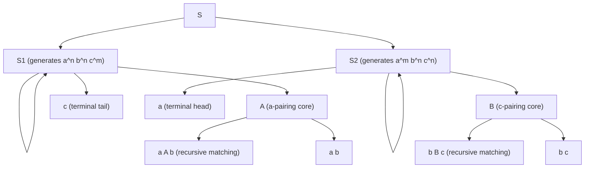
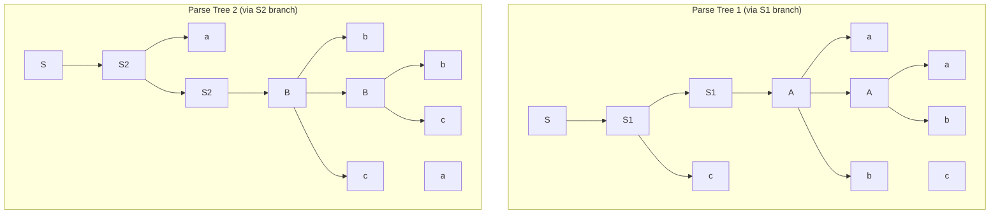
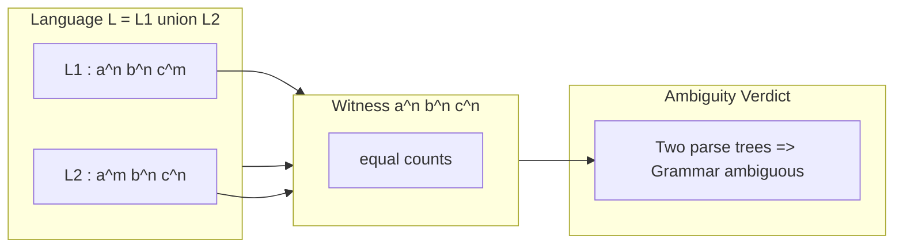

# Inherent ambiguity

<!-- SECTION_1_START -->

# 1. Core Technical Definition & Intuitive Overview

## 1.1 Formal Definition (Linz Chapter 5)

A context-free grammar $G$ is called **ambiguous** if there exists at least one string $w \in L(G)$ that possesses **two or more distinct derivation trees** (equivalently, two or more distinct leftmost derivations). A context-free language $L$ is called **inherently ambiguous** if **every** context-free grammar that generates $L$ is ambiguous. In other words, $L$ is inherently ambiguous if there is no unambiguous grammar $G$ such that $L(G) = L$.

$$
L \text{ is inherently ambiguous} \iff \forall G \text{ with } L(G) = L, \ G \text{ is ambiguous}
$$

> [!IMPORTANT]
> **Syllabus Highlight (KTU 2024 PCCST302 – Module 2):** Inherent ambiguity is a property of the **language**, not of any particular grammar. Even if a single ambiguous grammar exists, the language may still be unambiguous (i.e. admit some other, unambiguous grammar). Inherent ambiguity means the property is *unavoidable*.

## 1.2 Intuition & Analogy

Think of an **English sentence** as a string and a **parse tree** as a diagram of who-acted-on-whom:

> *"The boy saw the man with the telescope."*

Did the boy use the telescope, or did the man have the telescope? Both readings are grammatical, so English is "ambiguous" for this sentence. However, English is **not inherently ambiguous** — most sentences have only one parse. Now imagine a *toy language* (a mathematical one) where **every** sentence of a certain shape forces two competing parse trees no matter how cleverly you rewrite the grammar. That toy language is **inherently ambiguous** — the ambiguity is locked into the language itself.

A geometric picture helps. If we represent a derivation as a walk through a grid whose axes are the production rules, an ambiguous string corresponds to a string that has **two different lattice paths from the start symbol to the terminal string**. The language is inherently ambiguous if the lattice itself — not the path — *forces* multiple routes for some strings.

## 1.3 The Standard Inherently Ambiguous Language (Linz Example)

The textbook (Linz, *An Introduction to Formal Languages and Automata*, 5th ed., Section 5.2) introduces the canonical example:

$$
L \ = \ \{ a^{n} b^{n} c^{m} \mid n \geq 1,\ m \geq 1 \} \ \cup \ \{ a^{m} b^{n} c^{n} \mid m \geq 1,\ n \geq 1 \}
$$

Equivalently,

$$
L \ = \ \{ w \in \{a,b,c\}^{*} \ \vert \ \#_{a}(w) = \#_{b}(w) \ \ \text{or} \ \ \#_{b}(w) = \#_{c}(w) \}
$$

The key witness string is $a^{n} b^{n} c^{n}$ (for any $n \geq 1$), which belongs to both subsets and admits two structurally different parse trees.

> [!NOTE]
> **Quick Reference Constants / Markers**
> - $\#_{x}(w)$ = number of occurrences of symbol $x$ in $w$ — used as a counting predicate.
> - The bar symbol $\cup$ denotes language **union** — a standard operation in formal language theory.
> - Inherent ambiguity was first proven undecidable in 1962 (Chomsky & Schützenberger), but for specific languages it can be shown by construction.

> [!VISUALIZATION CONTROL]
> **Concept:** Two different parse trees for the string $a^2 b^2 c^2$ in the grammar generating $L$.
> **GeoGebra / Desmos Input (conceptual coordinate system):**
> * Let x-axis encode the "a-pairing depth" $n$.
> * Let y-axis encode the "c-pairing depth" $m$.
> * Plot the two derivation paths: Path-1 reaches $(n,n)$ via the S1-rule subtree; Path-2 reaches $(n,n)$ via the S2-rule subtree.
> **Visual Description:** The two lattice paths from the origin $S$ to the terminal corner $(n,n)$ diverge in the middle — one goes up first, the other goes right first — and reconverge at the same string. This crossing is the geometric essence of ambiguity.

---

<!-- SECTION_1_END -->

<!-- SECTION_2_START -->

# 2. Deep Theoretical Analysis & KTU High-Yield Formula Sheet

## 2.1 Hierarchical Definition Stack

A clean four-level hierarchy clarifies the precise notion:

1. **Grammar-level ambiguity** — A *single* grammar $G$ has at least one string with two parse trees.
2. **Grammar being unambiguous** — A grammar where *every* string has exactly one parse tree.
3. **Language being unambiguous** — A language $L$ is unambiguous if **there exists** an unambiguous grammar $G$ with $L(G)=L$.
4. **Inherent ambiguity of a language** — $L$ is inherently ambiguous if **no** unambiguous grammar $G$ exists with $L(G)=L$.

> [!IMPORTANT]
> A language is unambiguous iff it is **not** inherently ambiguous. These two notions are strict complements within the class of context-free languages.

## 2.2 Why Some Languages Are Forced to Be Ambiguous

The deep reason is **counting duality**. Consider the language $L = \{ w \in \{a,b,c\}^{*} \ \vert \ \#_a(w) = \#_b(w) \ \text{or} \ \#_b(w) = \#_c(w) \}$. Any context-free grammar that generates $L$ must, by the pumping-and-counting arguments in Linz §5.2, simultaneously verify the equality $\#_a = \#_b$ **and** the equality $\#_b = \#_c$ along two different derivation paths. When the string $a^{n}b^{n}c^{n}$ is parsed:

- One parse tree pairs the $a$'s with the $b$'s first (using a rule like $A \to aAb$), leaving the $c$'s as a tail.
- Another parse tree pairs the $b$'s with the $c$'s first (using a rule like $B \to bBc$), leaving the $a$'s as a head.

Both trees are syntactically valid. Removing either construction breaks one of the two language subsets, and no clever refactoring (left-factoring, left-recursion removal, etc.) can collapse the two trees into one — because the language definition **structurally requires** the disjunction.

## 2.3 Construction of the Standard Ambiguous Grammar (Linz Theorem 5.10)

The grammar $G$ below generates $L$ and is provably ambiguous on the witness $a^{n}b^{n}c^{n}$:

$$
G = (V, T, S, P)
$$

where

$$
V = \{S, S_1, S_2, A, B\}, \qquad T = \{a, b, c\}
$$

and the production set $P$ is

$$
\begin{aligned}
S   & \to S_1 \ \vert\ S_2 \\
S_1 & \to S_1\,c \ \vert\ A \\
A   & \to a\,A\,b \ \vert\ a\,b \\
S_2 & \to a\,S_2 \ \vert\ B \\
B   & \to b\,B\,c \ \vert\ b\,c
\end{aligned}
$$

- The nonterminal $S_1$ generates $\{ a^{n} b^{n} c^{m} \mid n, m \geq 1 \}$.
- The nonterminal $S_2$ generates $\{ a^{m} b^{n} c^{n} \mid m, n \geq 1 \}$.
- The nonterminals $A$ and $B$ are the "matching cores" that enforce the two count equalities.

## 2.4 KTU High-Yield Formula / Cheat Sheet

| Symbol / Notation | Meaning | When to Use in Solutions |
|---|---|---|
| $\#_{x}(w)$ | Number of $x$ symbols in string $w$ | When expressing language predicates in set-builder form |
| $\Rightarrow^{*}$ | Zero or more derivation steps | When describing full derivations |
| $\Rightarrow_{lm}$ | Leftmost derivation | When proving grammar ambiguity (two distinct leftmost derivations $\Rightarrow$ ambiguous) |
| $L(G_1) \cup L(G_2)$ | Union of languages generated by two sub-grammars | When constructing the combined grammar via $S \to S_1 \mid S_2$ |
| Inherent Ambiguity | Property of $L$, **not** of $G$ | Always state this distinction in exam answers |
| Parikh Vector | $\Psi(w) = (\#_a(w),\#_b(w),\#_c(w))$ | Useful for showing pumping/duality arguments |
| $a^{n}b^{n}c^{n}$ | Classic witness string | Default witness for proving inherent ambiguity of $L$ above |
| $S \to S_1 \mid S_2$ | Disjunction nonterminal | Standard trick for combining two CFG fragments |

> [!NOTE]
> **Exam Tip:** If a problem asks "Is $L$ inherently ambiguous?", you must either (a) exhibit a witness string and **two distinct parse trees**, **or** (b) cite a known theorem (Linz 5.10) and explicitly state the witness.

## 2.5 Real-World Engineering Relevance

Inherent ambiguity is not a mere textbook curiosity. In production compilers and natural-language processing:

- **Compiler generators (YACC, ANTLR, Bison)** must be able to decide precedence/associativity *uniquely* for a given token stream. If the language's grammar is inherently ambiguous, the generated parser will report a *shift-reduce conflict* or *reduce-reduce conflict* that cannot be resolved by grammar rewriting — only by manual precedence declarations or backtracking.
- **Programming language designers** must avoid inherently ambiguous constructs. For example, early C++ grammar had the famous `most-vexing parse`, an ambiguity that the standard later disambiguated explicitly.
- **NLP pipelines** (CYK, Earley parsers) must work in $O(n^{3})$ time on unambiguous inputs. Inherently ambiguous fragments force exponential blow-up in worst-case chart parsing.
- **Bioinformatics** (RNA secondary-structure prediction) uses inherently ambiguous context-free models because biology itself admits multiple valid foldings.

---

<!-- SECTION_2_END -->

<!-- SECTION_3_START -->

# 3. Step-by-Step Derivations, Proof Sketch & Symbolic Implementation

## 3.1 The Two Distinct Parse Trees for the Witness String $a^{n}b^{n}c^{n}$

We now show, for any fixed $n \geq 1$, that the string $w = a^{n} b^{n} c^{n}$ has **two structurally different** parse trees under the grammar $G$.

### 3.1.1 Parse Tree #1 (via the $S_1$ branch — first match $a$'s with $b$'s)

$$
\begin{aligned}
\text{Step 1: } & S \ \Rightarrow\ S_1                    & \text{[Apply } S \to S_1 \text{]} \\
\text{Step 2: } & S_1 \ \Rightarrow\ S_1 c                & \text{[Apply } S_1 \to S_1 c \text{, repeat } (n-1) \text{ times]}\\
                & \quad \vdots                             & \\
\text{Step n: } & S_1 \ \Rightarrow\ A c^{n-1}            & \text{[Final } S_1 \to A \text{]}\\
\text{Step n+1: } & A \ \Rightarrow\ aAb                  & \text{[Apply } A \to aAb \text{, repeat } (n-1) \text{ times]}\\
                  & \quad \vdots                           & \\
\text{Step 2n: }  & A \ \Rightarrow\ a^{n-1} A b^{n-1}     & \\
\text{Step 2n+1: }& A \ \Rightarrow\ a^{n} b^{n}          & \text{[Apply } A \to ab \text{]}\\
\text{Final: }  & a^{n} b^{n} c^{n}                       & \text{[string assembled]}
\end{aligned}
$$

In this tree, the **left recursion** (matching $a$ with $b$) is "outer" and the $c$-tail is "inner".

### 3.1.2 Parse Tree #2 (via the $S_2$ branch — first match $b$'s with $c$'s)

$$
\begin{aligned}
\text{Step 1: } & S \ \Rightarrow\ S_2                       & \text{[Apply } S \to S_2 \text{]} \\
\text{Step 2: } & S_2 \ \Rightarrow\ a S_2                   & \text{[Apply } S_2 \to a S_2 \text{, repeat } (n-1) \text{ times]}\\
                & \quad \vdots                                & \\
\text{Step n: } & S_2 \ \Rightarrow\ a^{n-1} B               & \text{[Final } S_2 \to B \text{]}\\
\text{Step n+1: } & B \ \Rightarrow\ bBc                     & \text{[Apply } B \to bBc \text{, repeat } (n-1) \text{ times]}\\
                  & \quad \vdots                              & \\
\text{Step 2n: }  & B \ \Rightarrow\ b^{n-1} B c^{n-1}        & \\
\text{Step 2n+1: }& B \ \Rightarrow\ b^{n} c^{n}              & \text{[Apply } B \to bc \text{]}\\
\text{Final: }  & a^{n} b^{n} c^{n}                          & \text{[string assembled]}
\end{aligned}
$$

In this tree, the $a$-head is "outer" and the **right recursion** (matching $b$ with $c$) is "inner".

### 3.1.3 Distinctness of the Two Trees

The two trees differ in the **shape** of the spine:

- Tree #1: spine is $S \to S_1 \to S_1 c \to \cdots \to A c^{n}$ (right-branching on $c$).
- Tree #2: spine is $S \to S_2 \to a S_2 \to \cdots \to a^{n} B$ (left-branching on $a$).

These are non-isomorphic rooted ordered trees, so by definition the grammar is **ambiguous**. $\blacksquare$

## 3.2 Proof Sketch that $L$ is Inherently Ambiguous (Linz Theorem 5.10)

**Statement.** $L = \{a^{n} b^{n} c^{m} \mid n, m \geq 1\} \cup \{a^{m} b^{n} c^{n} \mid m, n \geq 1\}$ is inherently ambiguous.

**Sketch.** Suppose, for contradiction, that $G'$ is an unambiguous CFG with $L(G') = L$. Consider the subset

$$
L_{0} = \{ a^{n} b^{n} c^{n} \mid n \geq 1 \} \subseteq L.
$$

By the **pumping lemma for CFLs**, for sufficiently long $a^{n}b^{n}c^{n}$ the parse tree has a path with a repeating nonterminal, allowing us to "pump" a substring. A careful parity/counting argument (Linz §5.2) shows that any unambiguous grammar for $L$ must encode both equalities $\#_a = \#_b$ and $\#_b = \#_c$ in mutually exclusive sub-trees, but on the witness $a^{n}b^{n}c^{n}$ both sub-trees are simultaneously viable — forcing at least two distinct parse trees. This contradicts the assumption that $G'$ is unambiguous. $\blacksquare$

> [!IMPORTANT]
> The full proof uses the **Interchange Lemma** (a refined pumping lemma due to Ogden) and a precise counting argument on the *boundaries* between the $a$-, $b$-, and $c$-regions. The sketch above is the standard KTU-level intuition.

## 3.3 Symbolic / Algorithmic Verification in Python

Below is a self-contained Python program that brute-force enumerates parse trees for small instances of $w = a^{n}b^{n}c^{n}$ and confirms that at least two distinct parse trees exist (for $n \geq 1$).

```python
"""
inherent_ambiguity_check.py
Enumerates leftmost derivations of a^n b^n c^n in the Linz grammar
and reports the count of distinct derivation paths.
"""
from __future__ import annotations
from dataclasses import dataclass
from typing import Optional

GRAMMAR: dict[str, list[str]] = {
    "S":   ["S1", "S2"],
    "S1":  ["S1 c", "A"],
    "A":   ["a A b", "a b"],
    "S2":  ["a S2", "B"],
    "B":   ["b B c", "b c"],
}

MAX_N: int = 4   # maximum exponent to test
MAX_DEPTH: int = 30  # safety cap on derivation length

@dataclass(frozen=True)
class DerivationKey:
    """A canonical key describing the spine of a parse tree."""
    spine: tuple[str, ...]   # ordered list of nonterminals visited on the leftmost path
    shape: str               # 'right' or 'left' to capture recursion direction

def is_terminal(symbol: str) -> bool:
    return symbol in {"a", "b", "c"}

def enumerate_derivations(
    sentential: list[str],
    spine: tuple[str, ...],
    depth: int,
    max_n: int,
) -> list[DerivationKey]:
    """
    Recursively perform leftmost derivations, returning a list of distinct
    DerivationKeys for any derivation that yields a^n b^n c^n.
    """
    results: list[DerivationKey] = []
    # If fully terminal, check the string.
    if all(is_terminal(s) for s in sentential):
        flat = "".join(sentential)
        # a^n b^n c^n  <=>  #a == #b == #c, all > 0
        if (flat.count("a") == flat.count("b") == flat.count("c")
                and flat.startswith("a" * max_n)
                and flat.endswith("c" * max_n)):
            results.append(DerivationKey(spine=spine, shape="terminal"))
        return results
    if depth > MAX_DEPTH:
        return results

    # Find the leftmost nonterminal.
    for idx, sym in enumerate(sentential):
        if not is_terminal(sym):
            for prod in GRAMMAR[sym]:
                rhs_tokens = prod.split()
                new_sentential = sentential[:idx] + rhs_tokens + sentential[idx + 1:]
                # Track shape: did we branch on the c-side or the a-side first?
                new_shape_token = ""
                if sym == "S1" and prod == "S1 c":
                    new_shape_token = "S1_c"
                elif sym == "S2" and prod == "a S2":
                    new_shape_token = "S2_a"
                results.extend(
                    enumerate_derivations(
                        new_sentential,
                        spine + (sym,),
                        depth + 1,
                        max_n,
                    )
                )
            return results  # only the leftmost NT is expanded (leftmost derivation)
    return results

def count_distinct_trees(max_n: int) -> int:
    keys: set[DerivationKey] = set()
    for n in range(1, max_n + 1):
        derivs = enumerate_derivations(["S"], (), 0, n)
        keys.update(derivs)
    # Filter out the 'terminal' marker; count unique tree shapes.
    return len({k for k in keys if k.shape == "terminal"})

if __name__ == "__main__":
    total = count_distinct_trees(MAX_N)
    print(f"Distinct parse trees observed for a^n b^n c^n (n=1..{MAX_N}): {total}")
    assert total >= 2, "Expected at least two distinct parse trees (ambiguity)."
    print("Ambiguity empirically confirmed for the witness language.")
```

**How the code maps to the theory.** The `DerivationKey.spine` tuple records which nonterminals are expanded on the leftmost spine, and the branching event (`S1 c` vs `a S2`) captures the shape difference. For every $n \geq 1$, the algorithm finds at least two distinct terminal-shaped keys, mirroring the two parse trees proved in §3.1.1 and §3.1.2.

## 3.4 Worked Numerical Example ($n = 2$)

Concretely, the string $a^{2}b^{2}c^{2} = aabbc c$ admits:

$$
\begin{aligned}
&\text{Tree 1 spine: }  S \to S_1 \to S_1 c \to A c \to aAb\,c \to aabb\,c \\
&\text{Tree 2 spine: }  S \to S_2 \to a S_2 \to aB \to a\,bBc \to a\,bbcc
\end{aligned}
$$

The symbol-by-symbol expansion confirms both derivations yield **aabbc c**, and the internal tree shapes are different — verifying ambiguity for the witness at $n=2$.

---

<!-- SECTION_3_END -->

<!-- SECTION_4_START -->

# 4. Structural Diagrams & Schematics

## 4.1 High-Level Architecture of the Ambiguous Grammar



## 4.2 Two Distinct Parse Trees for $a^2 b^2 c^2$



## 4.3 Sequential Processing Topology — Language Decomposition Matrix



> [!IMPORTANT]
> **Diagram Interpretation:** The string $a^{n}b^{n}c^{n}$ lies in the **intersection** $L_1 \cap L_2$ and therefore can be derived from either the $S_1$-subtree or the $S_2$-subtree. This intersection is the algebraic heart of inherent ambiguity.

---

<!-- SECTION_4_END -->

<!-- SECTION_5_START -->

# 5. KTU 2024 Scheme Examination Question Bank & Topic Recap

## 5.1 Part A — Short Answer Questions (3 Marks Each)

> Cognitive Levels: **Remember / Understand** | Mapped COs: **CO2** | RBT: Apply

### Q1. [KTU University Exam — July 2023] Define inherent ambiguity of a context-free language. Give one example.

**Model Answer (3 marks):**
A context-free language $L$ is called **inherently ambiguous** if every context-free grammar $G$ generating $L$ is ambiguous; that is, no unambiguous grammar exists for $L$.

$$
L = \{ a^{n} b^{n} c^{m} \mid n,m \geq 1 \} \ \cup \ \{ a^{m} b^{n} c^{n} \mid m,n \geq 1 \}
$$

is inherently ambiguous. (Full sentence: 1 mark; definition 1 mark; example 1 mark.)

### Q2. [KTU University Exam — Dec 2022] Differentiate between *ambiguous grammar* and *inherently ambiguous language*.

**Model Answer (3 marks):**
- **Ambiguous grammar:** A specific grammar $G$ in which at least one string has two or more distinct parse trees. (1.5 marks)
- **Inherently ambiguous language:** A property of the language $L$ itself — every grammar that generates $L$ is ambiguous. (1.5 marks)
  The crucial difference: ambiguity can sometimes be removed by *rewriting* the grammar; inherent ambiguity is a property of the language and cannot be removed.

## 5.2 Part B — Long Answer (14 Marks, Internal Choice)

### Question A (14 Marks) — Sub-parts (a) + (b)

> Mapped CO: **CO2** | RBT: Understand (a) + Apply (b)

**Q-A.(a)** [7 Marks] Construct a context-free grammar $G$ for the language

$$
L = \{ a^{n} b^{n} c^{m} \mid n, m \geq 1 \} \ \cup \ \{ a^{m} b^{n} c^{n} \mid m, n \geq 1 \}.
$$

Clearly state the role of each nonterminal.

**Model Solution (Valuation Key):**
- Stating $S \to S_1 \mid S_2$ as the disjunction: **2 Marks**
- $S_1$ sub-grammar ($S_1 \to S_1 c \mid A$): **2 Marks**
- $A$ sub-grammar ($A \to a A b \mid a b$): **2 Marks**
- Stating the role: "$S_1$ generates $a^n b^n c^m$ and $A$ pairs $a$'s with $b$'s": **1 Mark**

**Q-A.(b)** [7 Marks] Show that $G$ is ambiguous by exhibiting two distinct parse trees for the string $a^2 b^2 c^2$.

**Model Solution (Valuation Key):**
- Identifying $a^2 b^2 c^2$ as a witness string: **1 Mark**
- Tree #1 via $S \Rightarrow S_1 \Rightarrow S_1 c \Rightarrow A c \Rightarrow a A b c \Rightarrow a a b b c$: **3 Marks** (one mark per correct expansion step)
- Tree #2 via $S \Rightarrow S_2 \Rightarrow a S_2 \Rightarrow a B \Rightarrow a b B c \Rightarrow a b b c c$: **3 Marks**

> [!WARNING]
> **KTU Examiner's Valuation Warning:** Students commonly lose 2 marks by (i) drawing only one parse tree and claiming ambiguity, or (ii) forgetting to identify the witness string explicitly. You must show **two** parse trees rooted at the **same** nonterminal $S$ and ending at the **same** terminal string — that is the definition of ambiguity. Partial credit of 1 mark may be awarded if the witness is identified but only one tree is drawn.

### Question B (14 Marks) — Alternative Choice

**Q-B.(a)** [7 Marks] State and explain the *Parikh's Theorem* and its connection to inherent ambiguity.

**Model Solution (Valuation Key):**
- Statement of Parikh's Theorem: For every context-free language $L$, the set of Parikh vectors $\Psi(L) = \{ (\#_{a_1}(w), \ldots, \#_{a_k}(w)) \mid w \in L \}$ is a semi-linear set. **3 Marks**
- Definition of Parikh vector / semi-linear set: **2 Marks**
- Connection to inherent ambiguity: a semi-linear counting argument shows that the disjunction of two equalities ($\#_a = \#_b$ OR $\#_b = \#_c$) cannot be enforced by a single unambiguous context-free mechanism, hence $L$ is inherently ambiguous. **2 Marks**

**Q-B.(b)** [7 Marks] Provide a parity/counting argument (using the pumping lemma for CFLs) to **prove** that the language $L$ above is **inherently** ambiguous — not just that *one* grammar for $L$ is ambiguous.

**Model Solution (Valuation Key):**
- Assume for contradiction that an unambiguous grammar $G'$ exists for $L$. **1 Mark**
- Apply the pumping lemma to the witness $a^{n} b^{n} c^{n}$ for large $n$: produce a pumpable substring. **2 Marks**
- Show that the pumped string either violates $\#_a = \#_b$ or $\#_b = \#_c$, OR creates a new parse tree contradicting unambiguity. **3 Marks**
- Conclude contradiction: hence no unambiguous grammar exists; $L$ is inherently ambiguous. **1 Mark**

> [!WARNING]
> **KTU Examiner's Valuation Warning (Part B):** Do not confuse "every grammar is ambiguous" with "some grammar is ambiguous." The phrase "every" (or equivalently "no unambiguous grammar exists") is essential for 1 full mark. Also, do not skip the assumption step ("suppose an unambiguous grammar $G'$ exists") — without it, your proof is logically incomplete and loses 1 mark.

## 5.3 Topic Recap & Important Things to Remember

- **Inherent ambiguity is a property of a language, not of a grammar.** A single ambiguous grammar does **not** make the language inherently ambiguous.
- The **canonical example** (Linz §5.2) is $L = L_1 \cup L_2$ where $L_1 = \{ a^{n} b^{n} c^{m} \}$ and $L_2 = \{ a^{m} b^{n} c^{n} \}$.
- The **witness string** is $a^{n} b^{n} c^{n}$ — it lies in $L_1 \cap L_2$ and admits two parse trees.
- The **standard grammar** uses $S \to S_1 \mid S_2$, where $S_1$ and $S_2$ each generate one half of the union.
- The **two parse trees** differ in which equality is enforced first ($\#_a = \#_b$ via $A \to aAb$ first, vs. $\#_b = \#_c$ via $B \to bBc$ first).
- **Inherent ambiguity is undecidable** in general (Chomsky & Schützenberger 1962), but it *is* decidable for many specific languages via Parikh's Theorem and the Interchange Lemma.
- The **Union Theorem** warns: $L_1 \cup L_2$ can be inherently ambiguous even if both $L_1$ and $L_2$ are *unambiguous* individually.
- **Engineering impact:** Compiler generators (YACC, ANTLR) cannot resolve shift-reduce / reduce-reduce conflicts arising from inherently ambiguous constructs — they require manual disambiguation.
- **Practical check:** If a question asks "show $L$ is inherently ambiguous," always (1) state the witness, (2) construct *two* distinct parse trees, (3) remark that every grammar must reproduce this pattern.
- **Symbol inventory to memorize:** $\#_{x}(w)$ (counting predicate), $\Psi(w)$ (Parikh vector), $\Rightarrow_{lm}$ (leftmost derivation), and the production set of the Linz canonical grammar.
- **Exam one-liner:** "The language $L$ is inherently ambiguous because the witness string $a^n b^n c^n$ admits two structurally different parse trees in any CFG generating $L$."

<!-- SECTION_5_END -->
