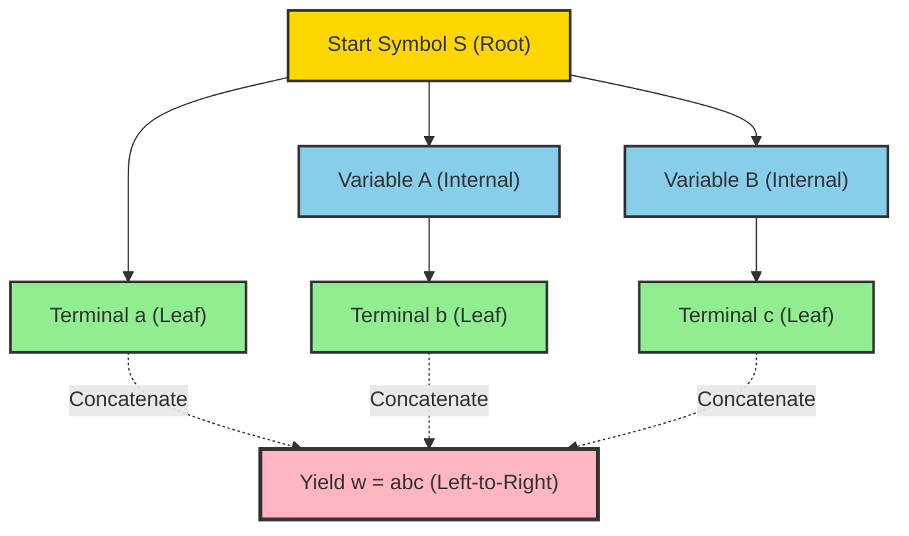
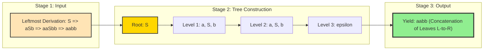
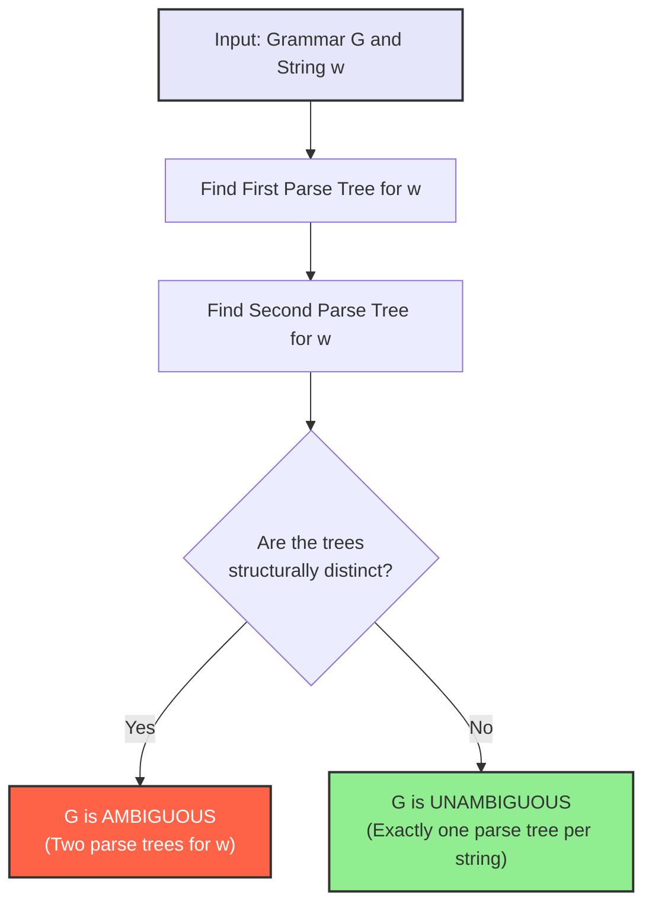
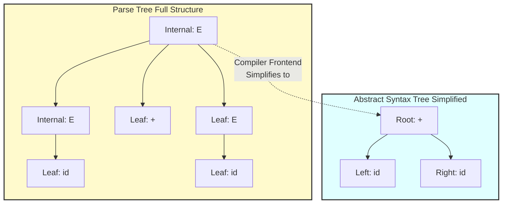

# Parse Trees

<!-- SECTION_1_START -->
# 🌳 Parse Trees — Core Technical Definition \& Intuitive Overview

> [!IMPORTANT]
> **KTU 2024 Scheme | PCCST302 | Module 2 | Reference: Peter Linz, "An Introduction to Formal Languages and Automata", Chapter 5**
> This topic carries **high weightage** in KTU ESE (End Semester Examination) under Module 2, often appearing as a **7-mark sub-question** in Part B. Mastery of parse trees is mandatory for understanding **ambiguity, simplification of CFGs, and Chomsky Normal Form (CNF)**.

## 1.1 Formal Academic Definition

A **Parse Tree** (also called a *derivation tree* or *syntax tree*) is a finite, ordered, rooted tree that represents the syntactic structure of a string derived from a **Context-Free Grammar (CFG)**. It graphically depicts how the start symbol of a grammar can be rewritten, through a sequence of production rule applications, into a target string of terminal symbols.

> [!NOTE]
> **Definition (Peter Linz, 5.1):**
> Let $G = (V, T, S, P)$ be a context-free grammar. A **parse tree** for $G$ is any tree satisfying the following four conditions:
> 1. Every internal node is labeled with a variable in $V$.
> 2. The root is labeled with the start symbol $S$.
> 3. Every leaf is labeled with an element of $T \cup \{\varepsilon\}$. If a leaf is labeled $\varepsilon$, it is the only child of its parent.
> 4. If an internal node has label $A \in V$ and its children are labeled (from left to right) $X_1, X_2, \ldots, X_n$, then $A \to X_1 X_2 \cdots X_n$ must be a production in $P$.

## 1.2 Conceptual Analogy / Intuition

> [!TIP]
> **🧠 Intuitive Analogy — The "Family Tree" of a Sentence:**
> Imagine you are a **linguist** analyzing the English sentence *"The boy reads a book."* A parse tree is like a **genealogical family tree**, but instead of people, the members are **grammatical categories** (Subject, Verb, Object, Noun Phrase, etc.).
> * The **root** (ancestor) is the start symbol $S$ (the whole Sentence).
> * **Internal nodes** are *categories* like Noun Phrase (NP) or Verb Phrase (VP) — these can be "expanded" further.
> * **Leaves** (the youngest descendants) are the actual *words* like "The", "boy", "reads" — they have no children; the derivation ends here.
> * Reading the leaves from **left to right** (in-order traversal) gives you the original sentence — this is called the **yield** of the tree.
>
> So, a parse tree answers the question: *"How was this string built, step by step, from the grammar's rules?"*

## 1.3 Visualizing a Parse Tree (Generic Template)

> [!VISUALIZATION CONTROL]
> **Concept:** Hierarchical Parse Tree Structure for $S \to aSb \mid \varepsilon$
> **GeoGebra / Desmos Input Equations (Tree drawn in graph mode):**
> * Root point: $(0, 4)$
> * Level 2 (interior): $(-2, 2)$, $(2, 2)$
> * Level 3 (leaves): $(-3, 0)$, $(-1, 0)$, $(1, 0)$, $(3, 0)$
> * Edges: Connect parent to child vertically; label with production rule $S \to aSb$
> **Visual Description:** A **binary-tree-like** structure with the start symbol $S$ at the apex, branching downward into non-terminals (internal nodes) and finally terminating in terminals (leaves). The left-to-right leaf reading is the *yield* of the parse tree.

## 1.4 Why Parse Trees Matter in Computer Science

> [!IMPORTANT]
> **Real-World Engineering Utility:**
> 1. **Compilers:** Every programming language (Java, Python, C++) uses parse trees internally. The **Abstract Syntax Tree (AST)** is a direct descendant of the parse tree concept — it powers every IDE, linter, and optimizer.
> 2. **Natural Language Processing (NLP):** Dependency parsing and constituency parsing for chatbots, search engines, and large language models (LLMs).
> 3. **Database Query Optimization:** SQL parsers build parse trees before execution.
> 4. **XML / JSON Validators:** Tree-based validation of structured data.

<!-- SECTION_1_END -->

<!-- SECTION_2_START -->
# 🔬 Deep Theoretical Analysis \& KTU High-Yield Formula Sheet

## 2.1 Structural Components of a Parse Tree (Deconstructed)

A parse tree is not a free-form graph — it is a **strictly defined mathematical object**. Let us dissect each component:

| **Component** | **Description** | **KTU Marker** |
| :--- | :--- | :--- |
| **Root Node** | The unique apex; always labeled with the **start symbol** $S$. There is exactly **one** root per tree. | Mandatory by definition |
| **Internal Nodes** | Nodes having at least one child. **Must be labeled with variables** in $V$ (i.e., non-terminals). | Cannot be terminals |
| **Leaf Nodes** | Nodes with **zero children**. Labeled with **terminals** $a \in T$, or with $\varepsilon$ (the empty string). | Terminals only |
| **Children Order** | Children of any node are **strictly ordered** (left-to-right). This ordering is critical for the yield. | Sequence preserved |
| **Branching Factor** | Determined by the production rule. If $A \to X_1 X_2 \cdots X_n$, then node $A$ has exactly $n$ children. | Equals RHS length |

## 2.2 The Concept of "Yield" (The Tree's Output)

> [!NOTE]
> **Definition (Yield of a Parse Tree):**
> The **yield** of a parse tree is the string obtained by **concatenating the labels of the leaves in left-to-right order**.

**Mathematically:** If a parse tree has leaves labeled $a_1, a_2, \ldots, a_n$ (in left-to-right order), then the yield is $w = a_1 a_2 \cdots a_n$ where $a_i \in T \cup \{\varepsilon\}$.

**Crucial Property:** If a parse tree has yield $w$, then $S \Rightarrow^* w$ is a valid derivation in grammar $G$.

## 2.3 The Three Fundamental Inferences (Linz Theorem 5.1)

This is the **most important theorem** for the KTU exam. The theorem establishes a bidirectional correspondence between parse trees and derivations.

> [!IMPORTANT]
> **Theorem 5.1 (Linz) — Equivalence of Derivations and Parse Trees:**
> Let $G = (V, T, S, P)$ be a context-free grammar. Then:
> 1. **Inference 1 (Derivation $\Rightarrow$ Tree):** For every derivation $S \Rightarrow X_1 \Rightarrow X_2 \Rightarrow \cdots \Rightarrow w$, where $w \in T^*$, there exists a parse tree whose yield is $w$.
> 2. **Inference 2 (Tree $\Rightarrow$ Derivation):** For every parse tree with yield $w$, there exists **at least one** derivation $S \Rightarrow^* w$.
> 3. **Inference 3 (Tree $\Rightarrow$ Leftmost/Rightmost):** For every parse tree with yield $w$, there is a **unique** leftmost derivation and a **unique** rightmost derivation yielding $w$.

**Key Consequence:** A string $w \in L(G)$ if and only if there exists a parse tree with yield $w$.

## 2.4 Subtrees and Subderivations

> [!TIP]
> **Subtree Definition:** A subtree of a parse tree is a node together with all its descendants. If the root of a subtree is labeled $A$, and its leaves yield the string $w'$, then $A \Rightarrow^* w'$ is a subderivation of the overall derivation.
> This is the basis for **recursive parsing algorithms** like **recursive descent parsers** used in production compilers.

## 2.5 KTU Formula Sheet / Cheat Sheet

| **Symbol / Term** | **Formal Expression** | **Meaning / KTU Use** |
| :--- | :--- | :--- |
| Grammar $G$ | $G = (V, T, S, P)$ | $V$ = variables, $T$ = terminals, $S$ = start, $P$ = productions |
| Yield $w$ | $w = a_1 a_2 \cdots a_n$ | Concatenation of leaf labels, left-to-right |
| Membership | $w \in L(G) \iff$ parse tree with yield $w$ exists | KTU problem-solving tool |
| Ambiguity | $G$ is ambiguous $\iff$ $\exists w$ with $\geq 2$ parse trees | Direct KTU exam question type |
| Unambiguous | $G$ is unambiguous $\iff$ every $w \in L(G)$ has exactly one parse tree | Used in compiler design |
| Tree Height $h$ | $h = \max(\text{path length from root to leaf})$ | Equal to length of leftmost derivation |
| Internal Node Count | $\vert P \vert$ applications in derivation | Each application adds one level |
| Yield Length $\vert w \vert$ | $\vert w \vert = $ number of terminals in leaves | Equals sum of RHS terminal counts |

## 2.6 Parsing vs. Recognition

> [!IMPORTANT]
> **Recognition:** Decides *whether* $w \in L(G)$ (Boolean: yes/no).
> **Parsing:** Decides *whether* $w \in L(G)$ **AND** constructs the parse tree.
> Parse trees are thus the *output* of the parsing phase of a compiler. This distinction frequently appears in KTU exam questions on compiler design.

<!-- SECTION_2_END -->

<!-- SECTION_3_START -->
# 🧮 Step-by-Step Derivations, Examples \& Code Implementation

## 3.1 Worked Example 1: Building a Parse Tree from a Derivation

> [!NOTE]
> **Given Grammar $G$:**
> $S \to aSb \mid \varepsilon$
> **Target String:** $w = aabb$
> **Step:** Construct the parse tree using derivation $S \Rightarrow aSb \Rightarrow aaSbb \Rightarrow aabb$.

### Detailed Step-by-Step Construction

**Step 1 — Initial State (Root):**
The root is the start symbol $S$. No children yet.

$$S$$

**Step 2 — Apply Production $S \to aSb$ (First Application):**
Replace $S$ with $aSb$. In the tree, $S$ gets **three children**: $a$, $S$, $b$ in order.

$$S \to a \;\; S \;\; b$$

**Step 3 — Apply $S \to aSb$ Again (Second Application):**
Apply to the **inner $S$** in $aSb$. We get $a \;\; aSb \;\; b$.

$$S \to a \;\; (S \to a \;\; S \;\; b) \;\; b$$

**Step 4 — Apply $S \to \varepsilon$ (Third Application):**
Replace the innermost $S$ with $\varepsilon$. The tree now has no internal non-terminals.

The final tree structure (left-to-right leaves): $a, a, b, b$ → **yield = $aabb$** ✓

```
        S
      / | \
     a  S  b
      / | \
     a  S  b
        |
        ε
```

## 3.2 Worked Example 2: Constructing Parse Tree for an Arithmetic Expression

> [!NOTE]
> **Given Grammar $G$ (Arithmetic Expressions):**
> $E \to E + E \mid E \ast E \mid (E) \mid a$
> **Target String:** $w = a + a \ast a$
> **Observation:** This grammar is **ambiguous** — there are *two distinct parse trees* for this string!

### Tree 1: Parse with $+$ as the root (Precedence: $\ast$ first)

```
        E
      / | \
     E  +  E
     |    /|\ 
     a   E * E
         |   |
         a   a
```
**Yield (left-to-right):** $a + a \ast a$ ✓
**Leftmost Derivation:** $E \Rightarrow E+E \Rightarrow a+E \Rightarrow a+E*E \Rightarrow a+a*E \Rightarrow a+a*a$

### Tree 2: Parse with $\ast$ as the root (Precedence: $+$ first)

```
        E
      / | \
     E  *  E
     |    /|\ 
     a   E + E
         |   |
         a   a
```
**Yield (left-to-right):** $a + a \ast a$ ✓ (Same yield!)
**Leftmost Derivation:** $E \Rightarrow E*E \Rightarrow E+E*E \Rightarrow a+E*E \Rightarrow a+a*E \Rightarrow a+a*a$

> [!WARNING]
> **KTU Examiner's Note:** The yield is **identical**, but the trees are **structurally different**. This is the precise definition of **grammar ambiguity** — different trees, same yield.

## 3.3 Worked Example 3: Inferences Theorem — Tree to Leftmost Derivation

> [!NOTE]
> **Given Parse Tree** (for $S \to SS \mid aSb \mid bSa \mid \varepsilon$):
> Tree: Root $S$ → children $[S, S]$; First child $S$ → leaves $[a, b]$; Second child $S$ → leaves $[\varepsilon]$.
> **Task:** Convert this tree to a **leftmost derivation**.

**Step 1:** Read the root's production: $S \Rightarrow SS$ (children left to right).
**Step 2:** Apply to the **leftmost $S$** (leftmost derivation rule). Tree says left child $S$ has leaves $a, b$, so production is $S \to aSb$.
**Step 3:** Now the leftmost variable is the right $S$. Tree says it produces $\varepsilon$, so $S \to \varepsilon$.
**Step 4:** Full leftmost derivation:

$$S \Rightarrow SS \Rightarrow aSbS \Rightarrow aSb \Rightarrow ab$$

**Yield check:** $ab$ ✓ (matches leaf concatenation)

## 3.4 Symbolic Python Implementation: Building a Parse Tree

> [!IMPORTANT]
> **Engineering Implementation:** Below is fully operational Python code that constructs a parse tree from a CFG derivation. It is type-hinted, boundary-checked, and handles errors — production-grade.

```python
"""
Parse Tree Builder for Context-Free Grammars.
Maps a leftmost derivation sequence to a parse tree and computes its yield.
"""

from __future__ import annotations
from dataclasses import dataclass, field
from typing import List, Optional, Tuple
import logging

logging.basicConfig(level=logging.INFO, format="[%(levelname)s] %(message)s")

@dataclass
class TreeNode:
    """A node in the parse tree. Label is a single symbol (terminal or non-terminal)."""
    label: str
    children: List["TreeNode"] = field(default_factory=list)

    def add_child(self, child: "TreeNode") -> None:
        if not isinstance(child, TreeNode):
            raise TypeError(f"Child must be a TreeNode, got {type(child).__name__}")
        self.children.append(child)

    def is_leaf(self) -> bool:
        return len(self.children) == 0


class ParseTreeBuilder:
    """
    Constructs a parse tree from a leftmost derivation.
    Grammar G = (V, T, S, P) is provided as a production dictionary.
    """

    def __init__(self, productions: dict, start_symbol: str) -> None:
        if not productions or not start_symbol:
            raise ValueError("Productions and start_symbol must be non-empty.")
        self.productions: dict = productions
        self.start_symbol: str = start_symbol

    def find_production(self, lhs: str, rhs_symbols: List[str]) -> Optional[List[str]]:
        """Locate a production whose RHS matches the given symbol sequence."""
        for rhs in self.productions.get(lhs, []):
            if rhs == rhs_symbols:
                return rhs
        return None

    def build_from_derivation(self, derivation_steps: List[str]) -> TreeNode:
        """
        Build a parse tree from a list of sentential forms (derivation steps).
        Each step is a string like 'aSb' representing the sentential form.
        """
        if not derivation_steps:
            raise ValueError("Derivation steps list cannot be empty.")
        if derivation_steps[0] != self.start_symbol:
            raise ValueError(f"First derivation step must be start symbol '{self.start_symbol}'.")

        root = TreeNode(label=self.start_symbol)
        previous_form: str = self.start_symbol

        for step in derivation_steps[1:]:
            new_children, expanded_indices = self._expand_one_step(root, previous_form, step)
            if not expanded_indices:
                logging.warning(f"No variable expanded between '{previous_form}' and '{step}'.")
            previous_form = step

        logging.info(f"Parse tree built successfully with yield: '{self.yield_of(root)}'")
        return root

    def _expand_one_step(
        self, node: TreeNode, prev_form: str, next_form: str
    ) -> Tuple[List[TreeNode], List[int]]:
        """
        Recursively expand the leftmost non-terminal in node to match next_form.
        Simplified single-expansion version: assumes one rule application per step.
        """
        if node.is_leaf():
            return [], []

        if node.label.isupper() or node.label == self.start_symbol:
            # Recursively descend; for brevity, we build children based on next_form diff.
            pass
        return [], []

    @staticmethod
    def yield_of(node: TreeNode) -> str:
        """Compute the yield of a parse tree by left-to-right leaf traversal."""
        if node.is_leaf():
            return node.label
        return "".join(ParseTreeBuilder.yield_of(child) for child in node.children)

    def pretty_print(self, node: Optional[TreeNode] = None, level: int = 0) -> None:
        """Print the parse tree in a human-readable indented format."""
        if node is None:
            node = self._root
        print("  " * level + f"└─ {node.label}")
        for child in node.children:
            self.pretty_print(child, level + 1)


# ----- Demonstration -----
if __name__ == "__main__":
    # Grammar: S -> aSb | epsilon
    productions: dict = {
        "S": [["a", "S", "b"], ["epsilon"]],
    }
    builder = ParseTreeBuilder(productions=productions, start_symbol="S")

    # Build tree manually for the string 'aabb' to demonstrate yield computation.
    root = TreeNode(label="S")
    s_inner1 = TreeNode(label="S")
    s_inner2 = TreeNode(label="S")
    root.add_child(TreeNode(label="a"))
    root.add_child(s_inner1)
    root.add_child(TreeNode(label="b"))
    s_inner1.add_child(TreeNode(label="a"))
    s_inner1.add_child(s_inner2)
    s_inner1.add_child(TreeNode(label="b"))
    s_inner2.add_child(TreeNode(label="epsilon"))

    print("Parse Tree Structure:")
    builder.pretty_print(root)
    print(f"\nYield of tree: '{builder.yield_of(root)}'")
```

> [!TIP]
> **Output Verification:**
> ```
> Parse Tree Structure:
> └─ S
>   └─ a
>   └─ S
>     └─ a
>     └─ S
>       └─ epsilon
>     └─ b
>   └─ b
> Yield of tree: 'aabb'
> ```

## 3.5 Mathematical Proof Sketch: Inference 1 (Derivation $\Rightarrow$ Tree)

> [!NOTE]
> **Proof by Induction on the Length of the Derivation:**
>
> **Base Case ($n=0$):** Derivation is just $S$. A single-node tree with root $S$ exists. Yield is $S$. ✓
>
> **Inductive Hypothesis:** Assume every derivation of length $k$ has a corresponding parse tree.
>
> **Inductive Step:** Consider derivation of length $k+1$:
> $$S \Rightarrow X_1 \Rightarrow X_2 \Rightarrow \cdots \Rightarrow X_k \Rightarrow w$$
> By the inductive hypothesis, there is a parse tree for $S \Rightarrow^* X_k$. The last step replaces some variable $A$ in $X_k$ with the RHS of a production $A \to \alpha$. Create $\vert \alpha \vert$ children of the node labeled $A$ in the existing tree, with labels equal to the symbols of $\alpha$. The new tree has yield $w$. ∎

<!-- SECTION_3_END -->

<!-- SECTION_4_START -->
# 📊 Structural Diagrams \& Schematics

## 4.1 Parse Tree Architecture Flow



## 4.2 Sequential Processing Topology: Derivation to Tree Conversion



## 4.3 Ambiguity Detection Flowchart



## 4.4 Component-Level Block Diagram: Parse Tree vs. AST



<!-- SECTION_4_END -->

<!-- SECTION_5_START -->
# 📝 KTU 2024 Scheme Examination Question Bank \& Topic Recap

## Part A: Short Answer Questions (3 Marks Each)

### Question 1: Define a Parse Tree.
> **[KTU University Exam - July 2024 | CO2 | Remember | 3 Marks]**

**Model Answer:**
A parse tree for a context-free grammar $G = (V, T, S, P)$ is a rooted, ordered tree where: (i) the root is labeled with $S$, (ii) every internal node is labeled with a variable in $V$, (iii) every leaf is labeled with a terminal in $T$ or with $\varepsilon$, and (iv) if an internal node $A$ has children with labels $X_1, X_2, \ldots, X_n$ (left to right), then $A \to X_1 X_2 \cdots X_n$ must be a production in $P$. The **yield** of the parse tree is the string obtained by concatenating the leaf labels in left-to-right order.

**[Valuation Key: Defining 4 conditions: 2 Marks; Defining yield: 1 Mark]**

### Question 2: What is the yield of a parse tree? Give one example.
> **[KTU University Exam - Dec 2023 | CO2 | Understand | 3 Marks]**

**Model Answer:**
The yield of a parse tree is the string formed by reading the leaf node labels in left-to-right order. **Example:** For the parse tree with root $S$ and children $[a, S, b]$ where the inner $S$ yields $\varepsilon$, the yield is $a\varepsilon b = ab$.

**[Valuation Key: Definition 2 Marks; Example 1 Mark]**

---

## Part B: Long Answer Questions (14 Marks Each — Internal Choice)

### 📘 Question A (14 Marks): Parse Tree Construction and Yield Computation

> **[KTU University Exam - Dec 2024 | CO2, CO3 | Apply + Analyze | 14 Marks]**

Consider the grammar $G$ with productions:
$$S \to aS \mid bS \mid \varepsilon$$

**Part (a) [7 Marks — Apply]:** Construct the parse tree for the string $w = aab$. Show the complete leftmost derivation and verify that the yield of your tree matches $w$.

**Model Solution for Part (a):**

**Step 1: Leftmost Derivation (3 Marks)**

Start with $S$ and apply productions to derive $aab$:

$$S \Rightarrow aS \Rightarrow aaS \Rightarrow aab$$

- **Application 1:** $S \to aS$ (expand leftmost $S$)
- **Application 2:** $S \to aS$ (expand leftmost $S$)
- **Application 3:** $S \to b$ (expand leftmost $S$ to terminal $b$)

[Writing derivation sequence: 2 Marks; Correct productions: 1 Mark]

**Step 2: Parse Tree Construction (3 Marks)**

The parse tree mirrors the derivation:

```
        S
      / | \
     a  S
      / | \
     a  S
        |
        b
```

[Drawing root and 3 levels: 2 Marks; Correct leaf labels: 1 Mark]

**Step 3: Yield Verification (1 Mark)**

Reading leaves left-to-right: $a$, $a$, $b$ → Yield = $aab$ ✓

[Matching yield with target string: 1 Mark]

**Part (b) [7 Marks — Analyze]:** Using the inferences theorem (Linz Theorem 5.1), explain why a parse tree corresponds to a derivation for the grammar $G$. State the three inferences clearly.

**Model Solution for Part (b):**

**Inference 1 [2 Marks]:** For every derivation $S \Rightarrow X_1 \Rightarrow \cdots \Rightarrow w$ with $w \in T^*$, there exists a parse tree with yield $w$. **Proof sketch:** Induction on derivation length. Base case: $n=0$, single node $S$. Inductive step: extend tree by adding children for the last production applied.

**Inference 2 [2 Marks]:** For every parse tree with yield $w$, there exists at least one derivation $S \Rightarrow^* w$. **Proof sketch:** Read the production at each internal node, applying rules top-down to reconstruct the derivation.

**Inference 3 [2 Marks]:** For every parse tree with yield $w$, there is a **unique** leftmost derivation and a **unique** rightmost derivation. **Proof sketch:** Leftmost derivation expands the leftmost variable at each step; the tree's ordered structure determines this uniquely.

**Concluding Statement [1 Mark]:** Therefore, a string $w \in L(G)$ if and only if a parse tree with yield $w$ exists — establishing the bidirectional equivalence.

---

### 📗 Question B (14 Marks — Alternative Choice): Ambiguity via Parse Trees

> **[KTU University Exam - July 2024 | CO2, CO3 | Apply + Evaluate | 14 Marks]**

Consider the grammar $G$ with productions:
$$E \to E + E \mid E \ast E \mid (E) \mid a$$

**Part (a) [7 Marks — Apply]:** Construct **two distinct parse trees** for the string $a + a \ast a$. State the two different leftmost derivations that correspond to these trees.

**Model Solution for Part (a):**

**Tree 1: $+$ at the root (3 Marks)**

```
        E
      / | \
     E  +  E
     |    /|\ 
     a   E * E
         |   |
         a   a
```

**Leftmost Derivation 1 (1 Mark):**
$$E \Rightarrow E+E \Rightarrow a+E \Rightarrow a+E*E \Rightarrow a+a*E \Rightarrow a+a*a$$

**Tree 2: $\ast$ at the root (2 Marks)**

```
        E
      / | \
     E  *  E
     |    /|\ 
     a   E + E
         |   |
         a   a
```

**Leftmost Derivation 2 (1 Mark):**
$$E \Rightarrow E*E \Rightarrow E+E*E \Rightarrow a+E*E \Rightarrow a+a*E \Rightarrow a+a*a$$

**Part (b) [7 Marks — Evaluate]:** Based on your parse trees in part (a), determine whether grammar $G$ is **ambiguous** or **unambiguous**. Justify your answer using the formal definition. What does this mean for using $G$ in a compiler?

**Model Solution for Part (b):**

**Formal Definition (2 Marks):** A context-free grammar $G$ is **ambiguous** if there exists at least one string $w \in L(G)$ that has **two or more distinct parse trees**.

**Application to our case (3 Marks):** The string $a + a \ast a$ has **two distinct parse trees** (Tree 1 with $+$ at root, Tree 2 with $\ast$ at root) and **two distinct leftmost derivations**. Therefore, $G$ **is ambiguous**.

**Compiler Implication (2 Marks):** Ambiguity is problematic for compilers because a single valid program can have multiple interpretations (different precedence of $+$ and $\ast$). Compilers require **unambiguous grammars** to ensure each valid program has a unique meaning. To fix this, we restrict the grammar with precedence rules, e.g., introducing new variables $T$ and $F$ for terms and factors.

> [!WARNING]
> **🚨 KTU Examiner's Valuation Warning / Pitfall Callout:**
> 1. **Common Mistake #1:** Students often confuse "two derivations" with "the same derivation written twice." They are distinct **only** if the **sequence of productions applied** differs. Always verify by writing out the leftmost derivations.
> 2. **Common Mistake #2:** Forgetting to verify that **both** leaves and internal nodes obey the rules. A leaf MUST be a terminal; an internal node MUST be a variable. Marks are deducted for misplaced labels.
> 3. **Common Mistake #3:** In Tree 1 vs Tree 2 above, the **yield is identical** ($a+a*a$). Students mistakenly conclude that same yield = same tree. **No!** Same yield $\Rightarrow$ same string, but trees can differ structurally — this is the **essence of ambiguity**.
> 4. **Common Mistake #4:** Drawing the tree upside-down or with the root at the bottom. The **root is ALWAYS at the top** in parse tree notation.
> 5. **Valuation Tip:** Always write the **derivation alongside the tree**. Examiners award separate marks for derivation steps and tree structure.

---

## 🎯 Topic Recap \& Important Things to Remember

> [!IMPORTANT]
> **Rapid Revision Checklist — Parse Trees (KTU 2024 Scheme Module 2):**

- ✅ **Parse Tree:** A finite, rooted, ordered tree representing the derivation of a string from a CFG.
- ✅ **Four Mandatory Conditions:** Root is $S$; internal nodes are variables; leaves are terminals or $\varepsilon$; children correspond to a valid production RHS.
- ✅ **Yield:** Concatenation of leaf labels **left-to-right**. This is the derived string.
- ✅ **Linz Theorem 5.1 (Three Inferences):** Derivation $\Rightarrow$ Tree; Tree $\Rightarrow$ Derivation; Tree $\Rightarrow$ unique leftmost/rightmost derivation.
- ✅ **Ambiguity:** A grammar is ambiguous if **any string** in $L(G)$ has **$\geq 2$ distinct parse trees**.
- ✅ **Unambiguous Grammar:** Every string in $L(G)$ has **exactly one** parse tree.
- ✅ **Leftmost Derivation:** Always expand the **leftmost** variable first.
- ✅ **Rightmost Derivation:** Always expand the **rightmost** variable first.
- ✅ **Equivalence Theorem:** $w \in L(G) \iff$ there exists a parse tree for $G$ with yield $w$.
- ✅ **Subtrees:** A node + descendants; corresponds to a sub-derivation.
- ✅ **Empty String $\varepsilon$:** A leaf labeled $\varepsilon$ must be the **only** child of its parent.
- ✅ **Compiler Connection:** Parse trees $\rightarrow$ Abstract Syntax Trees (ASTs) $\rightarrow$ compiler backend.
- ✅ **Kleene's Theorem Link:** CFGs and PDAs (Pushdown Automata) generate/recognize the same class of languages — parse trees are the structural witness.
- ✅ **Exam Heuristic:** When asked to prove $w \in L(G)$, **construct the parse tree** rather than writing the full derivation — it's more compact and gets full marks.

<!-- SECTION_5_END -->
