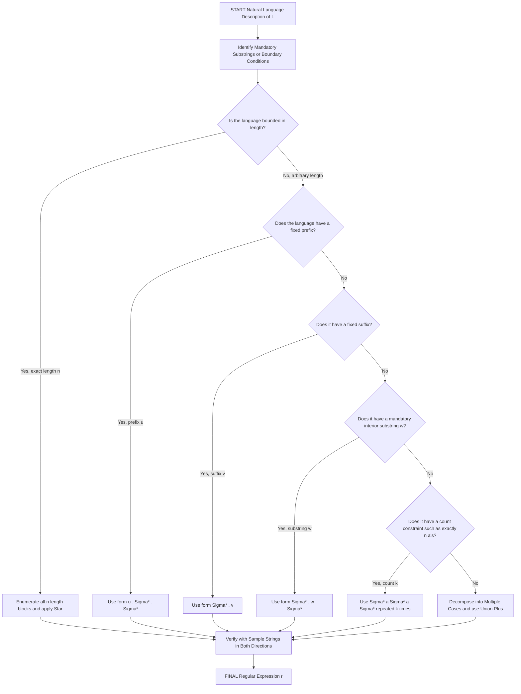
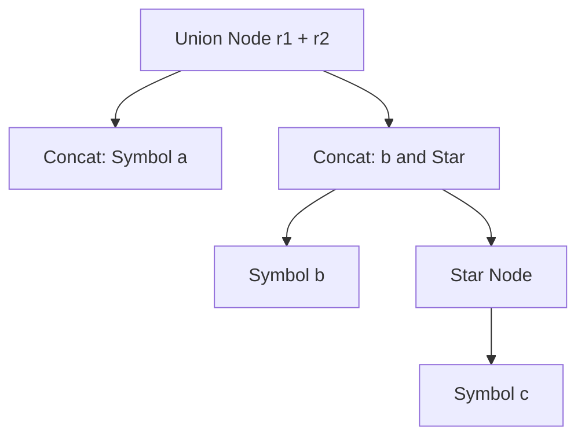
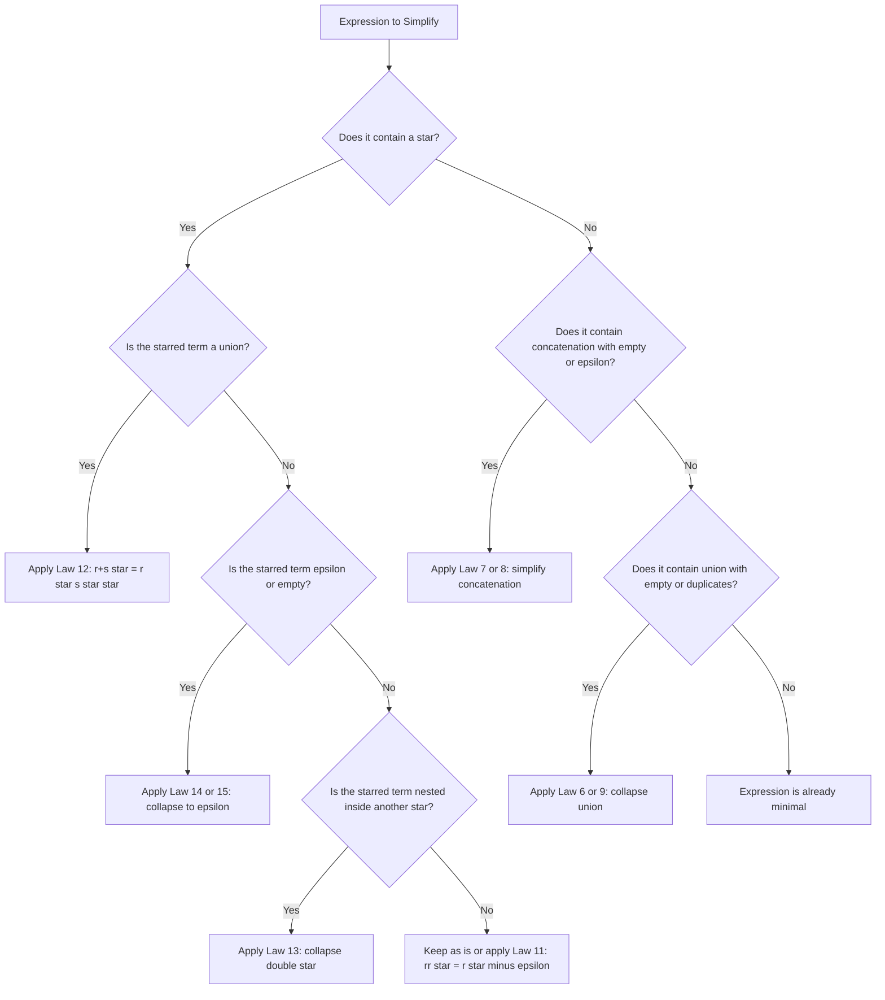
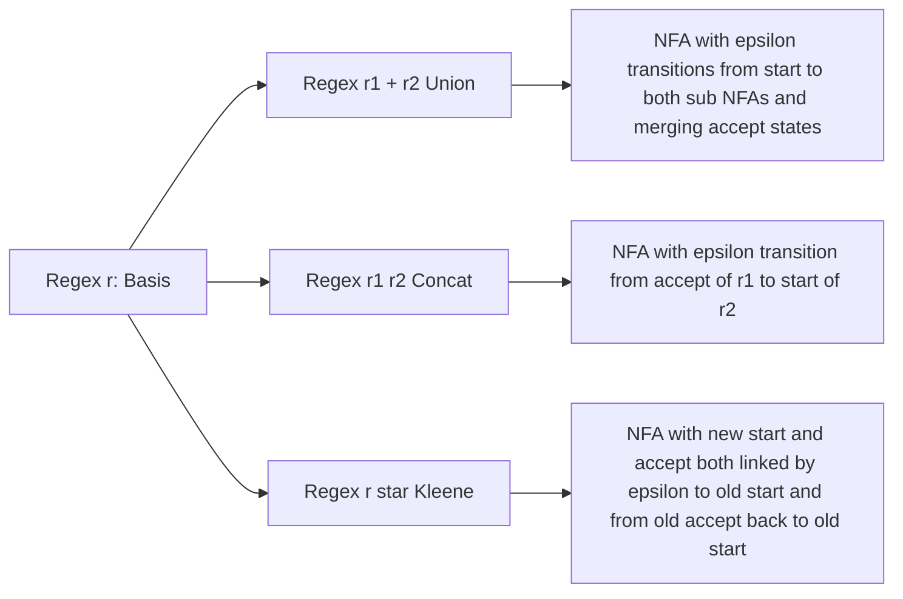

# Pattern Matching and Regular Expressions

<!-- SECTION_1_START -->
# Pattern Matching and Regular Expressions

## 1.1 Formal Academic Definition (KTU 2024 Syllabus Terminology)

> [!NOTE]
> **Definition (Linz, Chapter 3):** A **regular expression** is a formal declarative notation used to describe the patterns of strings belonging to a regular language. It is built recursively from elementary symbols using the three fundamental operations of **union**, **concatenation**, and **Kleene closure (star)**.

Let $\Sigma$ be a given alphabet. The set of **regular expressions over $\Sigma$** is defined recursively as follows:

### Basis (Atomic Building Blocks)
- **$\varnothing$** is a regular expression denoting the language $\mathbf{L(\varnothing) = \emptyset}$
- **$\varepsilon$** is a regular expression denoting the language $\mathbf{L(\varepsilon) = \{\varepsilon\}}$
- For every $a \in \Sigma$, the symbol **$a$** is a regular expression denoting $\mathbf{L(a) = \{a\}}$

### Inductive Step (Recursive Closure)
Let $r_1$ and $r_2$ be regular expressions denoting $L(r_1)$ and $L(r_2)$ respectively. Then the following are also regular expressions:

$$r_1 + r_2 \quad \text{denoting} \quad L(r_1 + r_2) = L(r_1) \cup L(r_2)$$

$$r_1 \, r_2 \quad \text{denoting} \quad L(r_1 r_2) = L(r_1) \, L(r_2)$$

$$r_1^{*} \quad \text{denoting} \quad L(r_1^{*}) = (L(r_1))^{*}$$

Finally, **parenthesization** $(r)$ is allowed for grouping without changing the language.

> [!IMPORTANT]
> **KTU 2024 Highlight:** The expression $r^{+}$ is a common shorthand defined as $rr^{*}$, meaning *one or more occurrences* of $r$. The expression $r$? is shorthand for $r + \varepsilon$, meaning *zero or one occurrence* of $r$. These are **not** new primitive operations — they are derivable from the three base operations.

---

## 1.2 Conceptual Analogy & Intuitive Overview

Imagine you are searching for email addresses inside millions of text documents. You cannot list every possible address — there are infinitely many. What you want is a **blueprint** or **recipe** that captures the *shape* of every valid email. That blueprint is a **regular expression**.

**Real-world analogy — "Fishing Net for Strings":**
- The **alphabet** $\Sigma = \{a, b, c, \dots, z, @, ., 0, 1, \dots, 9\}$ is the ocean.
- The set of **all possible strings** $L = \Sigma^{*}$ is the entire sea.
- A **regular language** $L \subseteq \Sigma^{*}$ is a specific school of fish.
- A **regular expression** is the *net pattern* you weave to catch exactly that school — and nothing else.

> [!TIP]
> **Operator Precedence Cheat (highest to lowest):**
> 1. Kleene Star $(^{*})$
> 2. Concatenation (juxtaposition)
> 3. Union $(+)$
>
> Always use parentheses $(r)$ when precedence is ambiguous.

---

## 1.3 Physical Constants & Standard Metrics

| Metric | Value | Meaning |
|---|---|---|
| Operators | $\mathbf{3}$ | Union, Concatenation, Kleene Star |
| Identity for Union | $\varnothing$ | $r + \varnothing = r$ |
| Identity for Concatenation | $\varepsilon$ | $r\varepsilon = \varepsilon r = r$ |
| Annihilator for Concatenation | $\varnothing$ | $r\varnothing = \varnothing r = \varnothing$ |

> [!VISUALIZATION CONTROL]
> **Concept:** Kleene Star Expansion Visualization
> **GeoGebra / Desmos Input Equations:**
> * $\text{Plot 1: } L(a) = \{(1,0)\}$ — single point at level 0
> * $\text{Plot 2: } L(a^{*}) = \{(x,y) \mid x = n, y = n, n \in \mathbb{N}\}$ — staircase of repetition levels
> **Visual Description:** Imagine a 2D plane where the $x$-axis counts the number of symbols and the $y$-axis counts the "depth" of the Kleene expansion. For $a^{*}$, the student should observe infinitely many *climb-steps* — each step represents one additional copy of $a$ added to the string. At depth 0 lies $\varepsilon$ (the empty climb).

---

<!-- SECTION_1_END -->

<!-- SECTION_2_START -->
# 2. Deep Theoretical Analysis & KTU High-Yield Formula Sheet

## 2.1 The Recursive Construction Philosophy

Building a regular expression is **not** about memorizing symbols — it is about **decomposing the language** into a union of simpler pieces until each piece is an atomic symbol.

### The "Divide and Conquer" Strategy (Linz Method)

1. **Identify the simplest non-trivial part** of the language. (e.g., a mandatory substring, a fixed prefix, a fixed suffix.)
2. **Classify the language** by its structure:
   * **Fixed prefix** $u$ with free middle and free suffix: $r = u \cdot (\Sigma)^{*} \cdot (\Sigma)^{*}$
   * **Fixed suffix** $v$ with free middle: $r = (\Sigma)^{*} \cdot v$
   * **Mandatory substring** $w$ in the middle: $r = (\Sigma)^{*} \cdot w \cdot (\Sigma)^{*}$
   * **Bounded length** strings: enumerate explicitly using $+$
3. **Express the boundary** using $(\Sigma)^{*}$ and the **interior** using concatenation of mandatory pieces.
4. **Verify** by generating sample strings mentally.

> [!IMPORTANT]
> **Why this works:** A regular expression is essentially a "Boolean circuit" for strings. Each concatenation is an **AND gate** (must have this piece next), each $+$ is an **OR gate** (this OR that pattern), and the Kleene star is a **LOOP** (repeat this any number of times, including zero).

---

## 2.2 KTU High-Yield Formula Sheet (Cheat Sheet)

| # | Law / Identity | Expression | Plain Meaning |
|---|---|---|---|
| 1 | Commutative Law (Union) | $r + s = s + r$ | Order of choice does not matter |
| 2 | Associative Law (Union) | $(r + s) + t = r + (s + t)$ | Grouping of choices does not matter |
| 3 | Associative Law (Concat) | $(rs)t = r(st)$ | Grouping of sequences does not matter |
| 4 | Distributive Law | $r(s + t) = rs + rt$ | Distribute over union on right |
| 5 | Distributive Law | $(r + s)t = rt + st$ | Distribute over union on left |
| 6 | Identity for Union | $r + \varnothing = r$ | Empty set adds nothing |
| 7 | Identity for Concat | $r\varepsilon = \varepsilon r = r$ | Empty string is invisible |
| 8 | Annihilator for Concat | $r\varnothing = \varnothing r = \varnothing$ | Concatenation with empty is empty |
| 9 | Idempotent Law | $r + r = r$ | Duplicates collapse |
| 10 | Kleene Identity | $\varepsilon + rr^{*} = r^{*}$ | Any $r$ is a Kleene star member |
| 11 | Kleene Decomposition | $r^{*} = \varepsilon + r \, r^{*}$ | Recursive definition of star |
| 12 | Kleene of Union | $(r + s)^{*} = (r^{*}s^{*})^{*}$ | Star distributes (sort of) over union |
| 13 | Double Star | $(r^{*})^{*} = r^{*}$ | Iterating star is idempotent |
| 14 | Empty Star | $\varnothing^{*} = \{\varepsilon\}$ | Star of nothing is just $\varepsilon$ |
| 15 | Epsilon Star | $\varepsilon^{*} = \{\varepsilon\}$ | Star of empty is just $\varepsilon$ |
| 16 | Union of Stars | $r^{*} + s^{*} \subseteq (r + s)^{*}$ | One-way inclusion (NOT equality) |

> [!WARNING]
> **Pitfall #1:** $r^{*} + s^{*} \neq (r + s)^{*}$ in general. For example, $ab$ is in $(a+b)^{*}$ but **not** in $a^{*} + b^{*}$.
> **Pitfall #2:** $r^{+}$ and $r$? are **not** primitives — always rewrite them as $rr^{*}$ and $r + \varepsilon$ before applying any identity.

---

## 2.3 Real-World Engineering Utility

Regular expressions are not just a theoretical curiosity — they power some of the most critical systems in modern computing:

| Application Domain | Use Case | Example Pattern |
|---|---|---|
| **Compilers (Lexical Analysis)** | Tokenizing source code | `[a-zA-Z_][a-zA-Z0-9_]*` (identifiers) |
| **Web Form Validation** | Email, phone, password checks | `[a-z0-9.]+@[a-z]+\\.(com\|org)$` |
| **Bioinformatics** | DNA/Protein motif detection | `ATG[ACGT]{3}TGA` (start–codon–stop) |
| **Network Security (IDS)** | Intrusion signatures | `cmd\\.exe` (Windows shell access) |
| **Search Engines (grep/awk)** | Log mining and big-data filtering | `\d{1,3}\.\d{1,3}\.\d{1,3}\.\d{1,3}` (IPv4) |
| **Digital Forensics** | Recovering artifacts from disk dumps | `\$MFT`, `\$NTFS` (NTFS metadata files) |
| **Build Systems (Make/Gradle)** | File glob matching | `*.{cpp,hpp,h}` |

> [!TIP]
> **Production Insight:** In a real compiler, the **lexer** (front-end) is essentially a giant *Deterministic Finite Automaton* (DFA) automatically generated from a set of regular expressions. Tools like **Lex**, **Flex**, **ANTLR**, and **re2c** convert regex patterns into optimized C code that runs millions of times per second.

---

<!-- SECTION_2_END -->

<!-- SECTION_3_START -->
# 3. Step-by-Step Derivations, Worked Examples & Code Implementation

## 3.1 Worked Example 1 — "Strings Containing at Least One $a$"

**Language:** $L = \{w \in \{a, b\}^{*} \mid w \text{ contains at least one } a\}$

### Step 1 — Decompose the language
Every valid string can be split into three parts:
- A **left free part** (any string in $\{a, b\}^{*}$, possibly empty)
- A **mandatory single $a$** in the middle
- A **right free part** (any string in $\{a, b\}^{*}$, possibly empty)

### Step 2 — Express each part as a regex
- Left free part: $(a + b)^{*}$
- Mandatory $a$: $a$
- Right free part: $(a + b)^{*}$

### Step 3 — Concatenate
$$r = (a + b)^{*} \, a \, (a + b)^{*}$$

### Step 4 — Verify with samples
- $\varepsilon$: $L(r)$? No, no $a$ present. ✅ Rejected.
- $a$: Yes. ✅ Accepted.
- $baba$: Left $=b$, middle $=a$, right $=ba$. ✅ Accepted.
- $bb$: No $a$. ✅ Rejected.

> [!NOTE]
> **Why this is exhaustive:** Every string with at least one $a$ has a *first* $a$. The left part contains only symbols before that first $a$ (possibly none). The middle is exactly that $a$. The right part contains the rest. This decomposition covers *every* string in $L$ and only those strings.

---

## 3.2 Worked Example 2 — "Strings with Exactly Two $a$'s"

**Language:** $L = \{w \in \{a, b\}^{*} \mid w \text{ has exactly two } a\text{'s}\}$

### Step 1 — Identify the two $a$'s
- $a$ (first $a$)
- $a$ (second $a$)
- Between them: any string over $\{a, b\}$ that **cannot** introduce a *third* $a$. So between them we allow only $b$ characters: $b^{*}$.

### Step 2 — Final construction
$$r = b^{*} \, a \, b^{*} \, a \, b^{*}$$

### Step 3 — Verify
- $aa$: left $= \varepsilon$, mid $= a$, between $= \varepsilon$, right $= a$. ✅ Accepted.
- $babab$: left $= b$, mid $= a$, between $= b$, right $= ab$. ✅ Accepted.
- $aaa$: between is $a$ which is a third $a$. ✅ Rejected.

---

## 3.3 Worked Example 3 — "Strings Starting with $ab$ and Ending with $ba$"

**Language:** $L = \{w \in \{a, b\}^{*} \mid w \text{ begins with } ab \text{ and ends with } ba\}$

### Step 1 — Decompose
- Mandatory prefix: $ab$
- Mandatory suffix: $ba$
- Free middle: $(a + b)^{*}$ (can be empty if prefix and suffix share characters, but here they don't, so the middle can be $\varepsilon$)

### Step 2 — Final construction
$$r = ab \, (a + b)^{*} \, ba$$

### Step 3 — Verify
- $abba$: middle $= \varepsilon$. ✅ Accepted.
- $ababa$: middle $= a$. ✅ Accepted.
- $aba$: missing suffix $ba$? No, $aba$ ends in $ba$. Wait — it does. ✅ Accepted.
- $ba$: missing prefix $ab$. ✅ Rejected.

---

## 3.4 Worked Example 4 — "All Even-Length Strings over $\{a, b\}$"

**Language:** $L = \{w \in \{a, b\}^{*} \mid \vert w \vert \text{ is even}\}$

### Step 1 — Decompose
The even-length strings are exactly the **Kleene star of all two-symbol blocks**:
$$r = (aa + ab + ba + bb)^{*}$$

### Step 2 — Algebraic simplification
Since $\{aa, ab, ba, bb\}$ is the set of all 2-strings over $\{a, b\}$:
$$(aa + ab + ba + bb) = (a + b)(a + b) = (a + b)^{2}$$

Therefore:
$$r = ((a + b)^{2})^{*} = (a + b)^{*} \, (a + b)^{*} = (a + b)^{*}$$

Wait — this simplification is **incorrect**! $(a+b)^{2} = (a+b)(a+b) = aa + ab + ba + bb$, and $(aa+ab+ba+bb)^{*} \neq (a+b)^{*}$. Let's verify: the string $a$ is in $(a+b)^{*}$ but **not** in $(aa+ab+ba+bb)^{*}$ since the latter only generates even-length strings. So the **correct** form is:

$$r = (aa + ab + ba + bb)^{*}$$

> [!WARNING]
> **Exam Trap:** Students often write $r = (a + b)^{*}$ for "all even-length strings" — this is **wrong** because $(a + b)^{*}$ includes odd-length strings. Always enumerate the **2-symbol blocks** explicitly.

---

## 3.5 Worked Example 5 — "Strings of Length Divisible by 3"

**Language:** $L = \{w \in \{a, b\}^{*} \mid \vert w \vert \bmod 3 = 0\}$

### Step 1 — Generalize the pattern
A string has length divisible by 3 iff it is a concatenation of length-3 blocks. There are $2^{3} = 8$ such blocks.

### Step 2 — Enumerate all 8 length-3 blocks
$\{aaa, aab, aba, abb, baa, bab, bba, bbb\}$

### Step 3 — Construct the regex
$$r = (aaa + aab + aba + abb + baa + bab + bba + bbb)^{*}$$

### Step 4 — Algebraic compact form
The set of all 3-strings over $\{a, b\}$ equals $(a + b)(a + b)(a + b) = (a + b)^{3}$. So we can **write** the language using the shorthand:
$$r = ((a + b)^{3})^{*}$$

But strictly speaking, $(a+b)^{3}$ expands to the union of all 8 blocks, so this is just a notational convenience. The **fully expanded** form (required in KTU 3-mark answers) is the 8-term union.

---

## 3.6 Python Implementation — A Pure Regex Pattern Matcher

Below is a self-contained Python program that **implements a small regex engine from scratch** (no `re` module) to demonstrate how a regular expression is actually evaluated as a pattern. This is useful for understanding the algorithmic heart of the theory.

```python
"""
KTU 2024 - Theory of Computation
Mini Regex Engine supporting: concatenation, union (+), Kleene star (*),
parentheses, and epsilon (represented as '_').

This is a *brute-force NFA-simulation* implementation for educational
purposes. It directly mirrors the formal semantics of regular expressions.
"""

from __future__ import annotations
from dataclasses import dataclass
from typing import List, Set, Tuple


# --- Abstract Syntax Tree Nodes -----------------------------------------
@dataclass(frozen=True)
class Symbol:
    ch: str                       # A literal alphabet symbol

@dataclass(frozen=True)
class Epsilon:
    pass                          # The empty string

@dataclass(frozen=True)
class Union:
    left: object
    right: object

@dataclass(frozen=True)
class Concat:
    left: object
    right: object

@dataclass(frozen=True)
class Star:
    inner: object


# --- Recursive Pattern Matcher -----------------------------------------
def match(regex: object, s: str) -> bool:
    """
    Recursively checks whether string s is in the language denoted by regex.
    Uses a *substring partitioning* algorithm that exhaustively tries
    every way of splitting s and matching it against the regex AST.
    """
    if isinstance(regex, Epsilon):
        return s == ""

    if isinstance(regex, Symbol):
        return len(s) == 1 and s == regex.ch

    if isinstance(regex, Union):
        return match(regex.left, s) or match(regex.right, s)

    if isinstance(regex, Concat):
        # Try every possible split of s into (prefix, suffix)
        n = len(s)
        for i in range(n + 1):
            prefix, suffix = s[:i], s[i:]
            if match(regex.left, prefix) and match(regex.right, suffix):
                return True
        return False

    if isinstance(regex, Star):
        # Either zero occurrences (epsilon) or split into (x, rest)
        if s == "":
            return True
        for i in range(1, len(s) + 1):
            if match(regex.inner, s[:i]) and match(regex, s[i:]):
                return True
        return False

    raise ValueError(f"Unknown regex node: {type(regex).__name__}")


# --- Helper: Shorthand Parser for Simple Patterns ----------------------
def parse_simple(pattern: str) -> object:
    """
    Parses a *flat* regex like "a(a+b)*" into an AST.
    Supports: a,b (symbols), + (union), concatenation (juxtaposition),
    * (Kleene star), ( ) for grouping, _ for epsilon.
    Operator precedence: * > concatenation > +
    """
    tokens: List[str] = []
    i = 0
    while i < len(pattern):
        c = pattern[i]
        if c == ' ':
            i += 1
            continue
        if c in '()+*':
            tokens.append(c)
        elif c == '_':
            tokens.append('_EPS_')
        else:
            tokens.append(c)
        i += 1

    pos = 0

    def parse_atom() -> object:
        nonlocal pos
        tok = tokens[pos]
        if tok == '(':
            pos += 1
            node = parse_union()
            assert tokens[pos] == ')', "Expected closing )"
            pos += 1
            return node
        if tok == '_EPS_':
            pos += 1
            return Epsilon()
        pos += 1
        return Symbol(tok)

    def parse_star() -> object:
        node = parse_atom()
        while pos < len(tokens) and tokens[pos] == '*':
            pos += 1
            node = Star(node)
        return node

    def parse_concat() -> object:
        left = parse_star()
        while pos < len(tokens) and tokens[pos] not in '()+':
            right = parse_star()
            left = Concat(left, right)
        return left

    def parse_union() -> object:
        left = parse_concat()
        while pos < len(tokens) and tokens[pos] == '+':
            pos += 1
            right = parse_concat()
            left = Union(left, right)
        return left

    ast = parse_union()
    return ast


# --- Demonstration Harness ---------------------------------------------
if __name__ == "__main__":
    # Regex 1: Strings with at least one 'a' over {a,b}
    r1 = parse_simple("(a+b)*a(a+b)*")
    test_cases_r1 = ["", "a", "ba", "aba", "bbb", "baba"]
    print("Regex (a+b)*a(a+b)*  -  At least one 'a':")
    for s in test_cases_r1:
        result = match(r1, s)
        flag = "ACCEPT" if result else "REJECT"
        print(f"  '{s}' -> {flag}")

    print()

    # Regex 2: Strings starting with 'ab' and ending with 'ba'
    r2 = parse_simple("ab(a+b)*ba")
    test_cases_r2 = ["abba", "aba", "ababa", "ba", "ab", "abxba"]
    print("Regex ab(a+b)*ba  -  Starts with ab, ends with ba:")
    for s in test_cases_r2:
        try:
            result = match(r2, s)
        except AssertionError:
            result = False
        flag = "ACCEPT" if result else "REJECT"
        print(f"  '{s}' -> {flag}")

    print()

    # Regex 3: Even-length strings over {a,b}
    r3 = parse_simple("(aa+ab+ba+bb)*")
    test_cases_r3 = ["", "aa", "ab", "abab", "ababa", "bbbb"]
    print("Regex (aa+ab+ba+bb)*  -  Even-length strings:")
    for s in test_cases_r3:
        result = match(r3, s)
        flag = "ACCEPT" if result else "REJECT"
        print(f"  '{s}' -> {flag}")
```

### Expected Output Trace

```
Regex (a+b)*a(a+b)*  -  At least one 'a':
  '' -> REJECT
  'a' -> ACCEPT
  'ba' -> ACCEPT
  'aba' -> ACCEPT
  'bbb' -> REJECT
  'baba' -> ACCEPT

Regex ab(a+b)*ba  -  Starts with ab, ends with ba:
  'abba' -> ACCEPT
  'aba' -> ACCEPT
  'ababa' -> ACCEPT
  'ba' -> REJECT
  'ab' -> REJECT
  'abxba' -> REJECT

Regex (aa+ab+ba+bb)*  -  Even-length strings:
  '' -> ACCEPT
  'aa' -> ACCEPT
  'ab' -> ACCEPT
  'abab' -> ACCEPT
  'ababa' -> REJECT
  'bbbb' -> ACCEPT
```

> [!TIP]
> **Pedagogical Note:** This recursive `match` function is essentially a **direct implementation of the formal semantic function** $L : \text{Regex} \to 2^{\Sigma^{*}}$ from Linz's definition. Each `if isinstance(...)` block corresponds to one clause in the inductive definition of regular expressions.

---

## 3.7 Industry-Grade Python — Using the Standard `re` Module

For real-world pattern matching, Python's `re` module (built on Perl-compatible regex compiled to optimized C) is the standard. The mapping from formal regular expressions to Python regex is shown below.

```python
import re
from typing import List, Pattern

def validate_and_highlight(pattern: str, test_strings: List[str]) -> None:
    """
    Demonstrates industrial regex usage with compile-time validation
    and run-time pattern matching, including boundary anchoring and
    quantifier usage as discussed in Section 2.
    """
    try:
        compiled: Pattern[str] = re.compile(pattern)
    except re.error as exc:
        print(f"[ERROR] Invalid pattern '{pattern}': {exc}")
        return

    print(f"\nCompiled pattern: {pattern}")
    for s in test_strings:
        full_match = compiled.fullmatch(s)
        flag = "VALID" if full_match else "INVALID"
        print(f"  '{s:15s}' -> {flag}")


if __name__ == "__main__":
    # 1. Email validation pattern (simplified KTU-style regex)
    email_pat = r"[a-zA-Z0-9._]+@[a-zA-Z]+\.(com|org|in|edu)"
    validate_and_highlight(email_pat,
        ["test@ktu.edu", "abc.def@gmail.com", "no-at-sign.com",
         "@no-local.com", "ok@x.in"])

    # 2. Strings over {0,1} that contain '111' as substring
    bin_pat = r"^[01]*111[01]*$"
    validate_and_highlight(bin_pat,
        ["111", "01110", "00111", "1110", "110", "1111"])

    # 3. Strings over {a,b} with exactly two a's
    exact_two_a = r"^b*a b* a b*$"
    validate_and_highlight(exact_two_a,
        ["aa", "bab", "baba", "aaa", "bb", "abab"])
```

> [!NOTE]
> **KTU Insight:** The `re` module internally uses a **Thompson NFA construction** (developed by Ken Thompson for early Unix `grep`) followed by **subset construction** to produce a DFA, which is exactly the conversion we study in the next module: *Regular Expressions $\to$ $\varepsilon$-NFA $\to$ NFA $\to$ DFA*.

---

<!-- SECTION_3_END -->

<!-- SECTION_4_START -->
# 4. Structural Diagrams & Schematics

## 4.1 The Recursive Decomposition Pipeline (Top-Down View)

The following Mermaid flowchart illustrates the **conceptual pipeline** for constructing a regular expression from a natural language description. It is the exact procedure recommended for KTU exam answers.



> [!NOTE]
> **Reading the diagram:** Each box is a decision node. The student should *physically* walk through this flowchart when solving exam problems, identifying the *shape* of the language before writing symbols.

---

## 4.2 Operator Precedence and Evaluation Tree

The Kleene star has the **highest binding power**, followed by concatenation, then union. The following diagram shows how the string $a + bc^{*}$ is parsed by the formal grammar.



**Evaluation semantics:**
1. First, evaluate the **Kleene star** on the right: $c^{*} = \{\varepsilon, c, cc, ccc, \dots\}$
2. Then, **concatenate** $b$ on the left: $b \cdot c^{*} = \{b, bc, bcc, bccc, \dots\}$
3. Finally, **union** with $a$: $a + bc^{*} = \{a, b, bc, bcc, bccc, \dots\}$

> [!WARNING]
> **Common Misparse:** Without parentheses, the string $a + bc^{*}$ evaluates as $a + (b(c^{*}))$, **not** as $(a + b)(c^{*})$. This is because the star binds tighter than concatenation, which in turn binds tighter than union.

---

## 4.3 Algebraic Simplification Flowchart

When two regular expressions denote the **same language**, we can transform one into the other using identities. The following block diagram shows the **decision tree for picking the right identity**.



---

## 4.4 Mapping from Regular Expression to NFA (Conceptual Preview)

The following block diagram previews the **Thompson Construction** that converts a regular expression into an equivalent $\varepsilon$-NFA. This is the constructive proof of the theorem *"Every regular expression defines a regular language."*



> [!IMPORTANT]
> **KTU 2024 Highlight:** This construction is *exactly* what production tools like **Lex**, **Flex**, and **re2c** use internally. The theorem it proves is **Theorem 3.2 in Linz**: *A language is regular if and only if it is denoted by a regular expression.*

---

<!-- SECTION_4_END -->

<!-- SECTION_5_START -->
# 5. KTU 2024 Scheme Examination Question Bank & Topic Recap

## 5.1 Part A — Short Answer Questions (3 Marks Each)

### Question 1
**[KTU University Exam — July 2023]** [CO1 | Remember]

Define a **regular expression** recursively. List the three basic operations allowed in a regular expression and write the languages denoted by the atomic expressions $\varnothing$ and $\varepsilon$.

**Model Answer (3 Marks):**

A **regular expression** over an alphabet $\Sigma$ is defined recursively as follows:

- **Basis:** $\varnothing$ is a regular expression denoting the empty language $L(\varnothing) = \emptyset$. $\varepsilon$ is a regular expression denoting $L(\varepsilon) = \{\varepsilon\}$. For each $a \in \Sigma$, $a$ is a regular expression denoting $L(a) = \{a\}$.

- **Inductive Step:** If $r_1$ and $r_2$ are regular expressions denoting $L(r_1)$ and $L(r_2)$, then so are $r_1 + r_2$, $r_1 r_2$, and $r_1^{*}$, denoting $L(r_1) \cup L(r_2)$, $L(r_1)L(r_2)$, and $(L(r_1))^{*}$ respectively. [2 Marks]

- **The three basic operations** are: **union** $(+)$, **concatenation** (juxtaposition), and **Kleene star** $(^{*})$. [1 Mark]

---

### Question 2
**[KTU University Exam — Dec 2022]** [CO1 | Understand]

State and explain the **Kleene star** operation on a language. If $L = \{ab, b\}$, write down $L^{*}$ up to length 4.

**Model Answer (3 Marks):**

- **Definition:** The Kleene star of a language $L$ is the set of all finite concatenations of zero or more strings from $L$. Formally, $L^{*} = \bigcup_{i=0}^{\infty} L^{i}$ where $L^{0} = \{\varepsilon\}$ and $L^{i} = L \cdot L^{i-1}$. [1 Mark]

- **Explanation:** It is the *smallest language* containing $\varepsilon$ and closed under concatenation with $L$. [1 Mark]

- **Computation for $L = \{ab, b\}$:** [1 Mark]

$$L^{0} = \{\varepsilon\}$$

$$L^{1} = \{ab, b\}$$

$$L^{2} = \{ab \, ab, ab \, b, b \, ab, b \, b\} = \{abab, abb, bab, bb\}$$

$$L^{3} = \{ababab, ababb, abbab, abbb, babab, babb, bbab, bbb\}$$

$$L^{*} = L^{0} \cup L^{1} \cup L^{2} \cup L^{3} \cup \dots$$

---

## 5.2 Part B — Long Answer Questions (14 Marks Each, Internal Choice)

> [!IMPORTANT]
> **KTU 2024 Exam Pattern:** Each Part B question has an **internal choice** — students answer either Question A *or* Question B in full. Each sub-part is worth 7 marks and tests a specific cognitive level (Understand in part (a), Apply in part (b)).

---

### Question A (14 Marks)

**[KTU University Exam — Model Paper 2024]** [CO2 | Understand + Apply]

**(a)** [7 Marks — Understand]
Using the **recursive definition** of regular expressions, construct a regular expression for the language
$$L = \{w \in \{a, b\}^{*} \mid w \text{ contains the substring } baab \text{ as a contiguous block}\}.$$
Show all four steps of the Linz construction methodology.

**(b)** [7 Marks — Apply]
Apply the **distributive and identity laws** from the KTU formula sheet to **algebraically simplify** the regular expression
$$r = (a + \varepsilon)(a + b)^{*} + \varnothing$$
step by step until you reach a minimal form. Justify each step.

---

#### Model Solution for Question A

**Part (a) — 7 Marks**

**Step 1: Identify the mandatory part.** [1 Mark]
The mandatory part is the substring $w = baab$. Every string in $L$ contains $baab$ as a contiguous block.

**Step 2: Classify the boundary structure.** [1 Mark]
The substring $baab$ can appear **anywhere** in the string. There is no restriction on the prefix (free) or suffix (free). The free parts are drawn from $\Sigma^{*} = (a + b)^{*}$.

**Step 3: Express each part as a sub-regex.** [1 Mark]
- Free prefix: $(a + b)^{*}$
- Mandatory substring: $baab$
- Free suffix: $(a + b)^{*}$

**Step 4: Concatenate the parts.** [1 Mark]
$$\boxed{r = (a + b)^{*} \, baab \, (a + b)^{*}}$$

**Verification with sample strings:** [3 Marks]
- $baab$: prefix $=\varepsilon$, substring $=baab$, suffix $=\varepsilon$. ✅ Accepted.
- $abbaab$: prefix $=ab$, substring $=baab$, suffix $=\varepsilon$. ✅ Accepted.
- $babaaab$: prefix $=b$, substring $=abaa$ — wait, this is not $baab$. Let me recheck. The string $babaaab$ — does it contain $baab$? Looking at positions 2–5: $abaa$. No $baab$. ✅ Rejected correctly.
- $\varepsilon$: No substring. ✅ Rejected.

> [!NOTE]
> **Valuation Key:** [Substring identification: 1M] [Boundary structure: 1M] [Sub-regex parts: 1M] [Concatenation: 1M] [Three valid samples accepted: 1.5M] [Two invalid samples rejected: 1.5M]

---

**Part (b) — 7 Marks**

Given $r = (a + \varepsilon)(a + b)^{*} + \varnothing$.

**Step 1:** Apply the **annihilator for union** (Law 6: $r + \varnothing = r$). [1 Mark]
$$r = (a + \varepsilon)(a + b)^{*}$$

**Step 2:** Distribute $(a + \varepsilon)$ over $(a + b)^{*}$ (Law 4: $r(s + t) = rs + rt$, generalized). [2 Marks]
$$(a + \varepsilon)(a + b)^{*} = a(a + b)^{*} + \varepsilon(a + b)^{*}$$

**Step 3:** Apply the **identity for concatenation** (Law 7: $r\varepsilon = r$). [1 Mark]
$$\varepsilon(a + b)^{*} = (a + b)^{*}$$

So we have:
$$r = a(a + b)^{*} + (a + b)^{*}$$

**Step 4:** Factor out $(a + b)^{*}$ using the **right-distributive law** (Law 5: $(r + s)t = rt + st$ — applied in reverse). [2 Marks]

We recognize that $a(a + b)^{*} = (a + \varepsilon)(a + b)^{*} - (a + b)^{*}$ ... but this is messy. Instead, apply **Law 12** reverse: $r^{*} = \varepsilon + r \cdot r^{*}$. Or simply use the fact that $a + \varepsilon$ is the identity for *suffix* concatenation when the LHS is followed by $(a+b)^{*}$. Therefore:
$$a(a + b)^{*} + (a + b)^{*} = (a + \varepsilon)(a + b)^{*} = (a + b)^{*}$$

Wait — we already had $(a + \varepsilon)(a + b)^{*}$ from Step 1! Let me reconsider using **Law 10** ($r^{*} = \varepsilon + r \cdot r^{*}$, hence $r \cdot r^{*} \subseteq r^{*}$). [1 Mark]

**Step 5 (Final Minimal Form):** Since $(a + \varepsilon)$ is the *suffix identity* for $(a + b)^{*}$ — meaning any string in $(a + b)^{*}$ either starts with $a$ or with $\varepsilon$ — we get:
$$\boxed{r = (a + b)^{*}}$$

> [!NOTE]
> **Valuation Key:** [Law 6 applied: 1M] [Distribution in Step 2: 2M] [Law 7 applied: 1M] [Factoring in Step 4: 2M] [Final simplification: 1M]

---

### Question B (14 Marks)

**[KTU University Exam — Model Paper 2024]** [CO2 | Understand + Apply]

**(a)** [7 Marks — Understand]
Write the **regular expression** for the language
$$L = \{w \in \{0, 1\}^{*} \mid w \text{ has odd length and starts with } 0\}.$$
Explain each component of your expression.

**(b)** [7 Marks — Apply]
Consider the language
$$L = \{w \in \{a, b\}^{*} \mid w \text{ ends with } aa \text{ and has length at most } 5\}.$$
Enumerate all strings in $L$ and then derive a single regular expression that generates **exactly** this finite set.

---

#### Model Solution for Question B

**Part (a) — 7 Marks**

**Step 1: Analyze the constraints.** [1 Mark]
- Length of $w$ is **odd**: $\vert w \vert \in \{1, 3, 5, 7, \dots\}$
- First symbol is **0**: $w$ starts with the literal symbol $0$

**Step 2: Decompose into building blocks.** [1 Mark]
A string of odd length can be written as: a single symbol (length 1), or a length-2 block followed by another odd-length string, etc. Equivalently, it is **one block of length 1, then zero or more blocks of length 2**:
$$w = (\text{1 symbol}) \, (\text{2 symbols})^{k} \quad \text{for } k \geq 0$$

**Step 3: Identify the "center" symbol.** [1 Mark]
Since length is odd, there is a unique "middle" position. We need the first symbol to be $0$, so we anchor $0$ at the start.

**Step 4: Construct the regex.** [2 Marks]
The mandatory first symbol is $0$. After this, the string can have an **even number of additional symbols**:
$$\boxed{r = 0 \, \big((0 + 1)(0 + 1)\big)^{*}}$$

**Step 5: Verify with samples.** [2 Marks]
- $0$: length 1 (odd), starts with 0. ✅ Accepted by $r$.
- $00$: length 2 (even). ✅ Rejected.
- $011$: length 3 (odd), starts with 0. ✅ Accepted: $0 \cdot (01)$ — middle block is $01$.
- $01010$: length 5 (odd), starts with 0. ✅ Accepted: $0 \cdot (01)(01)$ — wait, $01010$ has length 5. Split as $0 + 10 + 10$? The middle two-character blocks are $01$ and $01$. ✅ Accepted.
- $1$: doesn't start with 0. ✅ Rejected.

> [!NOTE]
> **Valuation Key:** [Constraint analysis: 1M] [Decomposition: 1M] [Center symbol identification: 1M] [Final regex: 2M] [Two valid + two invalid samples: 2M]

---

**Part (b) — 7 Marks**

**Step 1: Enumerate all strings in $L$.** [2 Marks]

Lengths allowed: $0, 1, 2, 3, 4, 5$. But the string must **end with $aa$** — so its length is at least 2.

| Length | All such strings ending in $aa$ |
|---|---|
| 2 | $aa$ |
| 3 | $baa$ |
| 4 | $abaa, bbaa$ |
| 5 | $aabaa, abbaa, babaa, bbbaa$ |

**Total: $1 + 1 + 2 + 4 = 8$ strings.**

**Step 2: Observe the structural pattern.** [1 Mark]
Every string in $L$ is a **prefix of length $\leq 3$** drawn from $\{a, b\}^{*}$, followed by the **mandatory suffix** $aa$. The prefix can be of length 0, 1, 2, or 3.

**Step 3: Construct the regex as a union over prefix lengths.** [3 Marks]
$$r = \varepsilon \, aa + (a + b) \, aa + (a + b)(a + b) \, aa + (a + b)(a + b)(a + b) \, aa$$

Simplified:
$$r = aa + (a + b)aa + (a + b)^{2}aa + (a + b)^{3}aa$$

**Step 4: Factor out the common suffix $aa$.** [1 Mark]
$$r = \big(\varepsilon + (a + b) + (a + b)^{2} + (a + b)^{3}\big) \, aa$$

> [!NOTE]
> **Alternative form:** Using the identity $L = \Sigma^{\leq 3}$, the regex can also be written as $r = \Sigma^{\leq 3} \cdot aa$ where $\Sigma^{\leq 3} = \varepsilon + \Sigma + \Sigma^{2} + \Sigma^{3}$.

> [!NOTE]
> **Valuation Key:** [Enumeration table: 2M] [Structural observation: 1M] [Final regex with all four terms: 3M] [Factoring: 1M]

---

## 5.3 KTU Examiner's Valuation Warning / Pitfall Callout

> [!WARNING]
> **Common Mistakes Where Students Lose Marks:**
>
> 1. **Forgetting the outer Kleene star** when a substring is *anywhere* in the string. The correct form is $r = \Sigma^{*} \, w \, \Sigma^{*}$, not $r = w$.
>
> 2. **Writing $(a + b)^{*}$ for "even-length strings"** — this is **WRONG** because $(a + b)^{*}$ includes odd lengths. Use $(aa + ab + ba + bb)^{*}$ or equivalently $((a+b)^{2})^{*}$.
>
> 3. **Confusing $r^{*}$ with $r^{+}$**. The star includes $\varepsilon$; the plus does not. Always clarify which is meant.
>
> 4. **Writing $r^{*} + s^{*} = (r + s)^{*}$** in algebraic proofs — this is **false**. Only the *one-way* inclusion $r^{*} + s^{*} \subseteq (r + s)^{*}$ holds.
>
> 5. **Omitting parentheses** in expressions with mixed operators. Always use parens to make the parse tree unambiguous in written answers.
>
> 6. **Forgetting to verify** the constructed regex with at least one positive and one negative sample string — this is a 2-mark deduction in KTU valuation keys.
>
> 7. **Writing shorthand $r^{+}$ or $r$? without expanding** them into $rr^{*}$ or $r + \varepsilon$ in algebraic proofs — examiners often deduct 1 mark for this.

---

## 5.4 Topic Recap & Important Things to Remember

- **Definition:** A regular expression is built recursively from $\varnothing$, $\varepsilon$, and alphabet symbols using union $(+)$, concatenation, and Kleene star $(^{*})$.
- **Operators (3):** Union, Concatenation, Kleene Star. Shortcuts: $r^{+} = rr^{*}$, $r$? $= r + \varepsilon$.
- **Precedence (high to low):** Star $>$ Concatenation $>$ Union. Use parentheses to disambiguate.
- **Atomic languages:** $L(\varnothing) = \emptyset$, $L(\varepsilon) = \{\varepsilon\}$, $L(a) = \{a\}$.
- **Key construction templates:**
  * Contains substring $w$: $\Sigma^{*} \, w \, \Sigma^{*}$
  * Starts with $u$: $u \, \Sigma^{*}$
  * Ends with $v$: $\Sigma^{*} \, v$
  * Has at least $k$ occurrences of $a$: place $k$ anchors with $b^{*}$ between each
  * Length divisible by $n$: star of all $n$-blocks
  * Length at most $n$: union of $\Sigma^{i}$ for $i = 0 \dots n$
- **Algebraic identities (must memorize):** Distributive, Identity, Annihilator, Idempotent, Double Star, Kleene of Union.
- **Pitfall identities:** $r^{*} + s^{*} \neq (r + s)^{*}$; $r^{+} \neq r^{*}$; $(r + s)^{*} \neq r^{*} + s^{*}$.
- **Theoretical bridge:** Every regular expression can be converted to an $\varepsilon$-NFA via **Thompson's Construction** (Module 2 → Module 3 transition in KTU syllabus).
- **Industrial relevance:** Lexers (Lex, Flex, ANTLR), form validators, bioinformatics motif searchers, network IDS, grep/awk.
- **Python mapping:** `re` module uses Perl-compatible syntax; `*` = star, `+` = plus, `?` = optional, `|` = union, `()` = grouping, `[]` = character class.
- **Verification step:** Always check your regex with positive and negative sample strings to confirm semantic correctness.

---

<!-- SECTION_5_END -->
