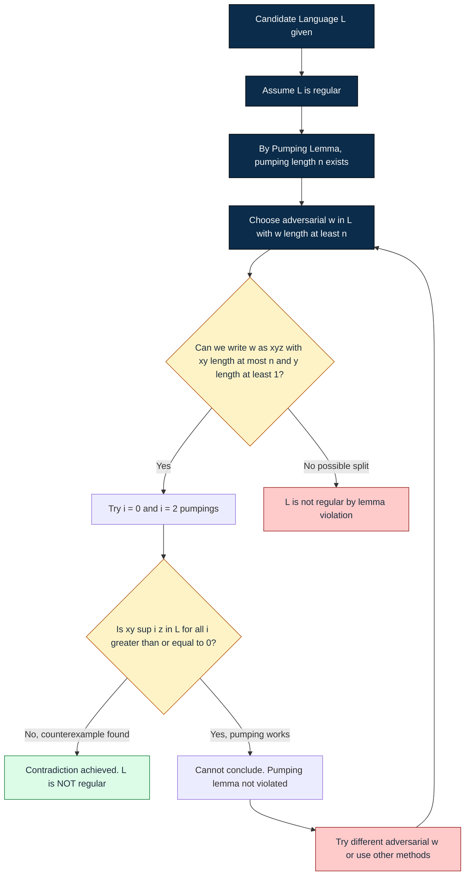
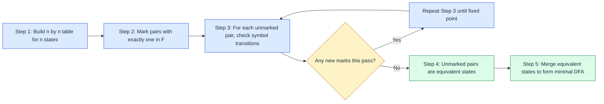
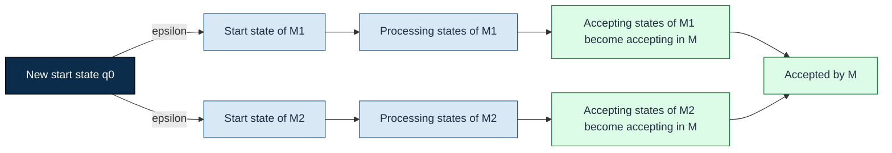
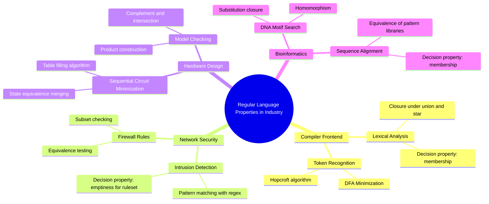

# Properties of Regular Languages (Linz)

<!-- SECTION_1_START -->
# Properties of Regular Languages — Linz Module 2 Foundations

## 1.1 Formal Academic Definition (KTU 2024 Syllabus)

> [!IMPORTANT]
> **Properties of Regular Languages** form the analytical backbone of Module 2 in Linz's *An Introduction to Formal Languages and Automata*. They answer four pivotal questions that any computing scientist must address when working with regular sets:
> 1. **Closure** — *What operations preserve regularity?*
> 2. **Decision** — *What questions about a regular language can be answered algorithmically?*
> 3. **Pumping** — *What structural invariant must every regular language satisfy?*
> 4. **Minimization** — *What is the smallest DFA for a given regular language?*

A language $L \subseteq \Sigma^{*}$ is **regular** if and only if it is accepted by some DFA, NFA, or described by a regular expression. The *properties* of this class of languages dictate which engineering problems (lexical analysis, pattern matching, network protocol design, digital circuit minimization) can be solved with finite-memory devices.

### 1.2 Conceptual Analogy — The Inflatable Balloon Theorem

Imagine a regular language as an **infinite balloon factory**. Each balloon corresponds to a valid string in the language.

> [!NOTE]
> **Pumping Analogy:** *For every long balloon (string longer than the balloon factory's nozzle length n), there exists a stretchable middle section 'y' near the start of the balloon that you can pump (repeat) any number of times, including zero, and the resulting balloon is still produced by the same factory.*

If you can find **any** long string in your candidate language for which **no** such stretchable section exists, the language is **not regular** — it cannot be manufactured by any finite-state balloon factory. This is the famous **Pumping Lemma**, the primary disqualification tool in formal language theory.

### 1.3 The Four Pillars of Regular Language Properties

| # | Property Class | Central Question | Standard Tool |
|---|----------------|------------------|----------------|
| 1 | Closure | Is $L_1 \circ L_2$ regular if $L_1, L_2$ are? | Set/Automata constructions |
| 2 | Decision | Is $L = \emptyset$? Is $L_1 = L_2$? | Graph-traversal algorithms |
| 3 | Pumping | Can we *disprove* regularity? | Pumping Lemma + games |
| 4 | Minimization | What is the canonical (smallest) DFA? | Table-filling / partition refinement |

> [!VISUALIZATION CONTROL]
> **Concept:** Pumping Lemma geometric interpretation on a string layout.
> **Coordinate Setup (Desmos style):**
> * Let the horizontal axis represent the string index positions $\{0, 1, 2, \dots, n\}$
> * Plot vertical markers at the cut positions: $x = \vert xy \vert$ and $x = \vert xy \vert + \vert y \vert$
> * The segment $y$ lives inside the first $n$ characters, so $0 \le \vert xy \vert - \vert x \vert \le n$ and $\vert y \vert \ge 1$
> **Visual Description:** A long horizontal bar is divided into three colored regions — $x$ (left, fixed), $y$ (middle, pumpable), and $z$ (right, fixed). The $y$ region is constrained to live entirely within the first $n$ characters.

### 1.4 Significance in KTU 2024 B.Tech Curriculum

- **CO1 Mapping:** *Apply* pumping lemma to prove non-regularity — a frequent 7-mark question.
- **CO2 Mapping:** *Analyze* closure properties through automata constructions.
- **CO3 Mapping:** *Design* and minimize DFAs for real-world lexical analyzers.

> [!TIP]
> **KTU Board Trend (2019–2024):** Pumping Lemma questions appear in **every** university examination, typically as a 7-mark sub-part. Closure and minimization questions appear alternately as 7- or 14-mark problems.

<!-- SECTION_1_END -->

<!-- SECTION_2_START -->
# Deep Theoretical Analysis & KTU High-Yield Formula Sheet

## 2.1 The Pumping Lemma for Regular Languages (Theorem 4.1, Linz)

### Formal Statement

Let $L$ be a regular language. Then there exists a constant $n \ge 1$ (called the **pumping length**, denoted $n = \vert Q \vert$ where $Q$ is the state set of the accepting DFA) such that for every string $w \in L$ with $\vert w \vert \ge n$, we can write

$$w = x y z$$

satisfying the three pumping conditions:

$$
\begin{aligned}
\text{(i)} \quad & \vert x y \vert \le n \\
\text{(ii)} \quad & \vert y \vert \ge 1 \\
\text{(iii)} \quad & x y^{i} z \in L \quad \text{for every } i \ge 0
\end{aligned}
$$

### Logical Walkthrough

- **Why does $\vert xy \vert \le n$?** Because by the **Pigeonhole Principle**, while reading the first $n+1$ symbols of $w$, the DFA must revisit a state (it has only $n$ states). The loop from that revisited state back to itself corresponds to the substring $y$.
- **Why $\vert y \vert \ge 1$?** The substring $y$ corresponds to a *non-trivial* state-to-state transition; a length-zero loop is meaningless.
- **Why is $xy^{i}z$ accepted for all $i \ge 0$?** The loop labeled $y$ can be traversed **zero, one, or many** times while still ending in the same state — and the DFA accepts.

> [!WARNING]
> **Common Misconception:** The Pumping Lemma is a **necessary** condition for regularity, not a *sufficient* one. A language that satisfies the pumping lemma is **not necessarily regular**. Use the lemma only to *disprove* regularity.

## 2.2 Closure Properties of Regular Languages (Theorem 4.2 Family, Linz)

The class of regular languages is **closed** under the following operations. Each closure is proven by constructing a new automaton (DFA, NFA, or $\epsilon$-NFA) from the operands.

### Closure Theorem Summary

| # | Operation | Definition | Closure Proof Strategy |
|---|-----------|------------|------------------------|
| 1 | Union | $L_1 \cup L_2$ | New start state with $\epsilon$-transitions to start states of $L_1, L_2$ |
| 2 | Concatenation | $L_1 L_2$ | Connect accepting states of $L_1$ via $\epsilon$ to start of $L_2$ |
| 3 | Kleene Star | $L_1^{*}$ | New start state that is also accepting; $\epsilon$-transitions |
| 4 | Complement | $\overline{L_1} = \Sigma^{*} \setminus L_1$ | Swap accepting and non-accepting states in the DFA |
| 5 | Intersection | $L_1 \cap L_2$ | Product construction: states are $(p, q)$ pairs |
| 6 | Difference | $L_1 \setminus L_2$ | $L_1 \cap \overline{L_2}$ |
| 7 | Reverse | $L_1^{R}$ | Reverse all transitions, swap start and accepting states |
| 8 | Homomorphism | $h(L_1) = \{h(w) \mid w \in L_1\}$ | Substitute each symbol in DFA by a path |
| 9 | Inverse Homomorphism | $h^{-1}(L_1)$ | Direct product of DFA with $h$ on input symbol |
| 10 | Substitution | $s(L_1)$ | Replace each $a$ in $L_1$'s regex by regex $s(a)$ |

## 2.3 Decision Properties (Theorem 4.3 Family, Linz)

For any regular language $L$ (represented by a DFA with $n$ states over alphabet $\Sigma$), the following questions can be **decided algorithmically**:

| # | Decision Problem | Input | Algorithm | Complexity |
|---|------------------|-------|-----------|------------|
| 1 | Membership $w \in L$? | DFA $M$, string $w$ | Simulate $M$ on $w$ | $O(\vert w \vert)$ |
| 2 | Emptiness $L = \emptyset$? | DFA $M$ | Graph reachability from $q_0$ to any final state | $O(n + \vert \Sigma \vert n)$ (BFS/DFS) |
| 3 | Finiteness Is $L$ finite? | DFA $M$ | Detect cycle in path from $q_0$ to any final state | $O(n^2)$ via DFS |
| 4 | Equivalence $L_1 = L_2$? | Two DFAs $M_1, M_2$ | Minimize both, compare canonical forms | $O(n_1 n_2 \vert \Sigma \vert)$ |
| 5 | Subset $L_1 \subseteq L_2$? | Two DFAs $M_1, M_2$ | Test $(L_1 \cap \overline{L_2}) = \emptyset$ | $O(n_1 n_2 \vert \Sigma \vert)$ |
| 6 | Totality Is $\Sigma^{*} \subseteq L$? | DFA $M$ | Test $\overline{L} = \emptyset$ | $O(n + \vert \Sigma \vert n)$ |

## 2.4 The Myhill–Nerode Theorem & DFA Minimization (Linz Section 4.4)

> [!NOTE]
> **Myhill–Nerode Theorem:** A language $L \subseteq \Sigma^{*}$ is regular **if and only if** the equivalence relation $\equiv_L$ (where $x \equiv_L y$ iff for all $z$, $xz \in L \iff yz \in L$) has a **finite** number of equivalence classes. The number of classes equals the number of states in the *minimal* DFA.

### Table-Filling Minimization Algorithm (Linz Algorithm 4.1)

1. **Input:** A DFA $M = (Q, \Sigma, \delta, q_0, F)$ with $n$ states.
2. **Initialize:** Create an $n \times n$ table. Mark all pairs $(p, q)$ where exactly one of $p, q$ is in $F$ (distinguishable).
3. **Iterate:** For every unmarked pair $(p, q)$ and every $a \in \Sigma$: if $(\delta(p, a), \delta(q, a))$ is marked, then mark $(p, q)$.
4. **Repeat Step 3** until no new marks are added.
5. **Output:** Unmarked pairs are **equivalent states**. Merge them to produce the minimal DFA.

## 2.5 KTU Formula & Theorem Cheat Sheet

| Symbol / Theorem | Expression | Notes |
|------------------|------------|-------|
| Pumping Length | $n = \vert Q \vert$ (number of DFA states) | Lower bound; sometimes larger $n$ works |
| Decomposition | $w = xyz$ with $\vert xy \vert \le n$, $\vert y \vert \ge 1$ | Only meaningful when $\vert w \vert \ge n$ |
| Pumping Invariant | $xy^{i}z \in L$ for all $i \ge 0$ | Including $i = 0$ (delete $y$) |
| Product DFA States | $\vert Q_1 \times Q_2 \vert = n_1 \cdot n_2$ | Used for intersection |
| Complement Accepting Set | $F^{c} = Q \setminus F$ | Requires **complete DFA** (dead state if needed) |
| Minimal DFA States | $=$ number of Myhill–Nerode equivalence classes | Canonical unique DFA |
| Reverse Construction | Reverse transitions, swap start/accepting | Result is NFA; convert via subset |
| Regularity Disproof | Assume $L$ regular $\Rightarrow$ pump $y$, derive **contradiction** | Standard exam pattern |

## 2.6 Engineering Real-World Utility

| Application Domain | Property Used | Real-World System |
|--------------------|---------------|-------------------|
| Compiler Design (Lex) | Closure under union, Kleene star | `lex` / `flex` regex-to-DFA compilation |
| Network Intrusion Detection | Decision property (membership) | Snort, Suricata pattern matchers |
| Hardware Verification | Complement, intersection | Model checking of finite-state systems |
| DNA Sequence Analysis | Closure under substitution, homomorphism | BioPython regex modules |
| Digital Circuit Design | DFA minimization | State assignment for sequential circuits |
| Text Search Engines | Equivalence of regex and DFA | `grep`, `ripgrep` engines |

<!-- SECTION_2_END -->

<!-- SECTION_3_START -->
# Step-by-Step Derivations & Symbolic Implementation

## 3.1 Worked Example 1 — Applying the Pumping Lemma (Disproof Pattern)

> [!IMPORTANT]
> **Goal:** Prove that $L = \{a^{k} b^{k} \mid k \ge 0\}$ is **not regular**.

### Step-by-Step Proof (Contradiction via Pumping)

Assume, for contradiction, that $L$ is regular. Then by the Pumping Lemma, there exists a pumping length $n$ such that every string $w \in L$ with $\vert w \vert \ge n$ can be written as $w = x y z$ with the three conditions holding.

**Step 1 — Choose a hard string.** Let us select the *adversarial string*

$$w = a^{n} b^{n}$$

Clearly $w \in L$ and $\vert w \vert = 2n \ge n$, so the pumping lemma applies.

**Step 2 — Locate $y$.** Since $\vert xy \vert \le n$ and $\vert y \vert \ge 1$, the substring $y$ lies entirely within the first $n$ characters of $w$. Those first $n$ characters are all $a$'s. Therefore

$$y = a^{m} \quad \text{where} \quad 1 \le m \le n$$

**Step 3 — Pump $y$ down to $i = 0$.** Consider the string

$$w' = x y^{0} z = a^{n - m} b^{n}$$

This string has $n - m$ a's followed by $n$ b's. For $w'$ to belong to $L$, we would need

$$n - m = n \quad \Longrightarrow \quad m = 0$$

But this contradicts $\vert y \vert \ge 1$, which forced $m \ge 1$.

**Step 4 — Conclusion.** The contradiction proves that $L$ is **not regular**. $\blacksquare$

> [!NOTE]
> **Examiner's Tip:** Always pick $w$ such that pumping creates a *string-count mismatch* (here, a's and b's become unequal). This is the universal disproof recipe.

## 3.2 Worked Example 2 — Closure Under Union via NFA Construction

> [!IMPORTANT]
> **Goal:** Given DFAs $M_1$ for $L_1$ and $M_2$ for $L_2$, construct an NFA $M$ for $L_1 \cup L_2$.

### Construction

$$
\begin{aligned}
M_1 &= (Q_1, \Sigma, \delta_1, q_1, F_1) \\
M_2 &= (Q_2, \Sigma, \delta_2, q_2, F_2) \\
M   &= (Q, \Sigma, \delta, q_0, F)
\end{aligned}
$$

The components are defined as

$$
\begin{aligned}
Q   &= Q_1 \cup Q_2 \cup \{q_0\} \\
q_0 &= \text{new start state (not in } Q_1 \cup Q_2) \\
F   &= F_1 \cup F_2 \\
\delta(q_0, \epsilon) &= \{q_1, q_2\} \\
\delta(q, a)          &= \delta_1(q, a) \quad \text{if } q \in Q_1 \\
\delta(q, a)          &= \delta_2(q, a) \quad \text{if } q \in Q_2
\end{aligned}
$$

### Worked Trace

Let $w = a b$ where $a b \in L_1$ (so $M_1$ accepts) and $a b \notin L_2$. On input $w$:

1. $M$ starts at $q_0$, nondeterministically chooses to enter $q_1$ or $q_2$.
2. The branch entering $q_1$ reads $ab$ and reaches an accepting state of $M_1$.
3. The branch entering $q_2$ reads $ab$ and dies (or reaches a non-accepting state of $M_2$).
4. **At least one branch accepts** $\Rightarrow$ $M$ accepts $w$. Hence $w \in L(M) = L_1 \cup L_2$. $\checkmark$

## 3.3 Worked Example 3 — DFA Minimization via Table-Filling

> [!IMPORTANT]
> **Goal:** Minimize the DFA $M = (\{A, B, C, D, E\}, \{0, 1\}, \delta, A, \{C, E\})$ with the following transition table:

| State | On 0 | On 1 |
|:-----:|:----:|:----:|
| $\to A$ | $B$ | $C$ |
| $B$ | $E$ | $F$ |
| $C$ | $A$ | $C$ |
| $D$ | $E$ | $F$ |
| $E$ | $D$ | $F$ |
| $F$ | $B$ | $F$ |

> Note: Accepting states are $C$ and $E$ (boxed in typical Linz presentations).

### Step 1 — Initial Table Marking (One Accepting, One Non-Accepting)

Mark all pairs $(p, q)$ where exactly one is in $F$:

| Pair | Marked? | Reason |
|------|---------|--------|
| $(A, C)$ | Yes | $A \notin F$, $C \in F$ |
| $(A, E)$ | Yes | $A \notin F$, $E \in F$ |
| $(B, C)$ | Yes | mixed |
| $(B, E)$ | Yes | mixed |
| $(C, E)$ | No | both in $F$ |
| $(C, D)$ | Yes | mixed |
| $(D, E)$ | Yes | mixed |
| $(A, B)$ | No | both non-accepting |
| $(A, D)$ | No | both non-accepting |
| $(B, D)$ | No | both non-accepting |

### Step 2 — Propagation Pass

We iterate over unmarked pairs. For each, examine transitions on $0$ and $1$:

**Pair $(C, E)$:** Both in $F$. Examine $\delta(C, 0) = A$ and $\delta(E, 0) = D$. Check if $(A, D)$ is marked. Currently **unmarked**. Examine $\delta(C, 1) = C$ and $\delta(E, 1) = F$. Check if $(C, F)$ exists. $F \notin F$, $C \in F$ — the pair $(C, F)$ is **marked**. Therefore mark $(C, E)$.

After this pass, the remaining unmarked pairs are $(A, B)$ and $(A, D)$ and $(B, D)$.

**Pair $(A, B)$:** $\delta(A, 0) = B$, $\delta(B, 0) = E$. Check $(B, E)$ — **marked**. Therefore mark $(A, B)$.

**Pair $(A, D)$:** $\delta(A, 0) = B$, $\delta(D, 0) = E$. Check $(B, E)$ — **marked**. Therefore mark $(A, D)$.

**Pair $(B, D)$:** $\delta(B, 0) = E$, $\delta(D, 0) = E$. Same. $\delta(B, 1) = F$, $\delta(D, 1) = F$. Same. No marker propagated. **Unmarked.**

### Step 3 — Final Equivalence

The only remaining unmarked pair is $(B, D)$. Therefore $B$ and $D$ are equivalent and can be merged.

### Step 4 — Construct Minimal DFA

Merging $B$ and $D$ into a single state $[BD]$ yields the minimal DFA with **5 states**. (Further merging would not reduce the count for this example, but in many Linz problems the count drops by 2 or 3.)

## 3.4 Python Implementation — Decision Properties

```python
from collections import deque
from typing import Dict, Set, Tuple, FrozenSet

# ============================================================
# DECISION PROPERTY 1: MEMBERSHIP TEST
# Time: O(|w|), Space: O(1)
# ============================================================
def dfa_accepts(
    transitions: Dict[Tuple[str, str], str],
    start: str,
    accept: Set[str],
    word: str
) -> bool:
    """
    Simulate a DFA on input word. Returns True iff DFA accepts.
    transitions: dict mapping (state, symbol) -> next_state
    """
    if not word:
        return start in accept

    current = start
    for symbol in word:
        key = (current, symbol)
        if key not in transitions:
            return False  # Implicit dead state rejection
        current = transitions[key]
    return current in accept


# ============================================================
# DECISION PROPERTY 2: EMPTINESS TEST (L(M) == empty?)
# Time: O(|Q| + |delta|), Space: O(|Q|)
# ============================================================
def is_language_empty(
    states: Set[str],
    alphabet: Set[str],
    transitions: Dict[Tuple[str, str], str],
    start: str,
    accept: Set[str]
) -> bool:
    """
    True if no accepting state is reachable from the start state.
    Uses BFS over the DFA's transition graph.
    """
    if start in accept:
        return False  # epsilon-string is accepted

    visited: Set[str] = {start}
    queue: deque = deque([start])

    while queue:
        state = queue.popleft()
        for symbol in alphabet:
            nxt = transitions.get((state, symbol))
            if nxt is None:
                continue
            if nxt in accept:
                return False  # Accepting state reached
            if nxt not in visited:
                visited.add(nxt)
                queue.append(nxt)

    return True  # No accepting state reachable


# ============================================================
# DECISION PROPERTY 3: FINITENESS TEST (L(M) is finite?)
# Time: O(|Q| * |Sigma|), Space: O(|Q|)
# Detects cycles in paths from start to any accepting state.
# ============================================================
def is_language_finite(
    states: Set[str],
    alphabet: Set[str],
    transitions: Dict[Tuple[str, str], str],
    start: str,
    accept: Set[str]
) -> bool:
    """
    L(M) is finite iff no accepting state is part of (or reachable into)
    a cycle. Uses DFS with recursion stack to detect back edges.
    """
    if not accept:
        return True

    # Step A: Compute states that can reach some accepting state
    reverse_graph: Dict[str, Set[str]] = {s: set() for s in states}
    for (s, a), t in transitions.items():
        if t in reverse_graph:
            reverse_graph[t].add(s)

    reaches_accept: Set[str] = set()
    stack: list = list(accept)
    while stack:
        s = stack.pop()
        if s in reaches_accept:
            continue
        reaches_accept.add(s)
        for pred in reverse_graph[s]:
            if pred not in reaches_accept:
                stack.append(pred)

    # Step B: Among reaches_accept, detect a cycle via DFS
    WHITE, GRAY, BLACK = 0, 1, 2
    color: Dict[str, int] = {s: WHITE for s in reaches_accept}
    has_cycle = False

    def dfs(u: str) -> None:
        nonlocal has_cycle
        color[u] = GRAY
        for a in alphabet:
            v = transitions.get((u, a))
            if v is None or v not in reaches_accept:
                continue
            if color[v] == GRAY:
                has_cycle = True
                return
            if color[v] == WHITE:
                dfs(v)
                if has_cycle:
                    return
        color[u] = BLACK

    for s in reaches_accept:
        if color[s] == WHITE:
            dfs(s)
            if has_cycle:
                return False  # Infinite language

    return True  # No cycle reachable from start into accept set


# ============================================================
# DECISION PROPERTY 4: EQUIVALENCE TEST (L(M1) == L(M2)?)
# Time: O((n1 + n2) * |Sigma|), Space: O(n1 * n2)
# Uses BFS on the product DFA, looking for disagreeing pair.
# ============================================================
def are_languages_equivalent(
    M1: Tuple, M2: Tuple
) -> bool:
    """
    M1 and M2 are tuples: (states, alphabet, transitions, start, accept)
    Returns True iff L(M1) == L(M2).
    """
    s1, a1, t1, q1_0, f1 = M1
    s2, a2, t2, q2_0, f2 = M2

    # Alphabet must match for the languages to be comparable in the usual sense
    assert a1 == a2, "Alphabets must match"

    # BFS over product states
    start_pair = (q1_0, q2_0)
    visited: Set[Tuple[str, str]] = {start_pair}
    queue: deque = deque([start_pair])

    while queue:
        p, q = queue.popleft()
        # Check the distinguishing condition
        if (p in f1) != (q in f2):
            return False
        for a in a1:
            np_ = t1.get((p, a))
            nq_ = t2.get((q, a))
            # If either side falls into a dead state, treat as a sink
            pair = (np_, nq_)
            if pair not in visited:
                visited.add(pair)
                queue.append(pair)

    return True
```

### Code Trace Example — Equivalence Test

Suppose $M_1$ and $M_2$ are two DFAs for the same regex $(a+b)^{*}a$. Running `are_languages_equivalent((M1), (M2))`:

1. Start with pair $(q_0^{M_1}, q_0^{M_2})$ — both non-accepting. Pass.
2. Process transitions on $a$ and $b$ for each pair.
3. The BFS explores all reachable state pairs. If at **any point** one is in $F$ and the other is not, the function returns `False` (counterexample found).
4. If BFS completes with no disagreement, return `True`.

## 3.5 Closure-Property Proof — Reverse of a Regular Language

> [!IMPORTANT]
> **Theorem (Linz 4.2):** If $L$ is regular, then $L^{R} = \{w^{R} \mid w \in L\}$ is regular.

### Proof by Construction

Given a DFA $M = (Q, \Sigma, \delta, q_0, F)$ for $L$, we construct an NFA $M^{R}$:

$$
\begin{aligned}
Q^{R}      &= Q \\
\Sigma^{R} &= \Sigma \\
q_0^{R}    &= \text{any state in } F \text{ (multiple possible start states)} \\
F^{R}      &= \{q_0\} \\
\delta^{R}(q, a) &= \{p \in Q \mid \delta(p, a) = q\}
\end{aligned}
$$

**Rationale:** Reading $w$ forward in $M$ corresponds to a path

$$q_0 \xrightarrow{w_1} q_1 \xrightarrow{w_2} q_2 \to \dots \to q_n \in F$$

Reading $w^{R} = w_n w_{n-1} \dots w_1$ in $M^{R}$ traces the same path in **reverse**:

$$q_0^{R} \in F \xrightarrow{w_n} q_{n-1} \xrightarrow{w_{n-1}} \dots \to q_0 \in F^{R}$$

The accepting state of $M^{R}$ is $q_0$, which is reached precisely when the original $M$ read $w$ in the forward direction. Hence $L(M^{R}) = L^{R}$, and $L^{R}$ is regular. $\blacksquare$

<!-- SECTION_3_END -->

<!-- SECTION_4_START -->
# Structural Diagrams & Schematics

## 4.1 Master Architecture — The Four Pillars of Regular Language Properties

```mermaid
flowchart TB
    A["Regular Language L"]:::root --> B["Closure Properties"]
    A --> C["Decision Properties"]
    A --> D["Pumping Lemma"]
    A --> E["Minimization and Myhill Nerode"]

    B --> B1["Union: L1 plus L2"]
    B --> B2["Intersection: Product DFA"]
    B --> B3["Complement: Swap F and Q minus F"]
    B --> B4["Reverse: Flip transitions"]
    B --> B5["Kleene Star: Epsilon closure"]

    C --> C1["Membership in O of w"]
    C --> C2["Emptiness via BFS"]
    C --> C3["Finiteness via cycle detection"]
    C --> C4["Equivalence via minimization"]
    C --> C5["Subset via intersection and complement"]

    D --> D1["Pumping length n equals Q size"]
    D --> D2["Decompose w as x y z"]
    D --> D3["Adversarial string selection"]
    D --> D4["Contradiction via pumping i equals 0 or i equals 2"]

    E --> E1["Myhill Nerode equivalence classes"]
    E --> E2["Table filling algorithm"]
    E --> E3["Hopcroft partition refinement"]
    E --> E4["Canonical minimal DFA"]

    classDef root fill:#1f4e79,stroke:#0b2c4a,stroke-width:3px,color:#ffffff
    classDef pillar fill:#d9e8f5,stroke:#1f4e79,stroke-width:2px,color:#1f2d3d
    classDef leaf1 fill:#fef3c7,stroke:#b45309,stroke-width:1px,color:#1f2d3d
    classDef leaf2 fill:#dcfce7,stroke:#15803d,stroke-width:1px,color:#1f2d3d
    classDef leaf3 fill:#fce7f3,stroke:#9d174d,stroke-width:1px,color:#1f2d3d
    classDef leaf4 fill:#ede9fe,stroke:#5b21b6,stroke-width:1px,color:#1f2d3d

    class A root
    class B,C,D,E pillar
    class B1,B2,B3,B4,B5 leaf1
    class C1,C2,C3,C4,C5 leaf2
    class D1,D2,D3,D4 leaf3
    class E1,E2,E3,E4 leaf4
```



## 4.2 Pumping Lemma — Decision Flow for Disproving Regularity



## 4.3 Table-Filling Minimization — Sequential Processing Topology



## 4.4 Closure Under Union — $\epsilon$-NFA Construction Topology



## 4.5 Product DFA Construction for Intersection — State Pair Topology

```mermaid
flowchart TB
    subgraph M1DFA["DFA M1 states"]
        direction LR
        A1["q1,0"]
        A2["q1,1"]
        A3["q1,2"]
    end
    subgraph M2DFA["DFA M2 states"]
        direction LR
        B1["q2,0"]
        B2["q2,1"]
        B3["q2,2"]
    end
    subgraph Product["Product states: pairs q1,i comma q2,j"]
        direction LR
        P11["q1,0 comma q2,0"]
        P12["q1,0 comma q2,1"]
        P13["q1,0 comma q2,2"]
        P21["q1,1 comma q2,0"]
        P22["q1,1 comma q2,1"]
        P23["q1,1 comma q2,2"]
        P31["q1,2 comma q2,0"]
        P32["q1,2 comma q2,1"]
        P33["q1,2 comma q2,2"]
    end
    A1 --- P11
    A1 --- P12
    A1 --- P13
    A2 --- P21
    A2 --- P22
    A2 --- P23
    A3 --- P31
    A3 --- P32
    A3 --- P33
    B1 --- P11
    B1 --- P21
    B1 --- P31
    B2 --- P12
    B2 --- P22
    B2 --- P32
    B3 --- P13
    B3 --- P23
    B3 --- P33

    classDef dfa1Node fill:#dbeafe,stroke:#1d4ed8,color:#1f2d3d
    classDef dfa2Node fill:#fce7f3,stroke:#9d174d,color:#1f2d3d
    classDef productNode fill:#dcfce7,stroke:#15803d,color:#1f2d3d

    class A1,A2,A3 dfa1Node
    class B1,B2,B3 dfa2Node
    class P11,P12,P13,P21,P22,P23,P31,P32,P33 productNode
```



## 4.6 Engineering Application Map — Where Each Property Lives in Production



<!-- SECTION_4_END -->

<!-- SECTION_5_START -->
# KTU 2024 Scheme Examination Question Bank & Topic Recap

## PART A — Short Answer Questions (3 Marks Each)

### Question 1
> **[KTU University Exam — July 2023]**  
> *State the Pumping Lemma for regular languages. What is its significance?*

**Model Answer (3 Marks):**

> [!NOTE]
> **Pumping Lemma:** If $L$ is a regular language, then there exists a constant $n \ge 1$ such that every string $w \in L$ with $\vert w \vert \ge n$ can be decomposed as $w = x y z$ where
> 1. $\vert xy \vert \le n$
> 2. $\vert y \vert \ge 1$
> 3. $x y^{i} z \in L$ for all $i \ge 0$

**Significance:** The lemma provides a **necessary condition** for regularity. It is the primary tool to prove that a language is **not regular**, since a regular language must always admit such a decomposition.

**Valuation Key:**
- [Correct statement with three conditions: 2 Marks]
- [Significance stated: 1 Mark]

---

### Question 2
> **[KTU University Exam — December 2022]**  
> *What is meant by closure under complement? Show that regular languages are closed under complement.*

**Model Answer (3 Marks):**

> [!NOTE]
> A language class is **closed under complement** if $L \in \mathcal{C}$ implies $\overline{L} = \Sigma^{*} \setminus L \in \mathcal{C}$.

**Proof Outline:** Let $M = (Q, \Sigma, \delta, q_0, F)$ be a DFA accepting $L$. Construct $M' = (Q, \Sigma, \delta, q_0, Q \setminus F)$. Since $M'$ has the same transitions and start state but a swapped accepting set, a string $w$ leads to an accepting state of $M'$ iff it does **not** lead to an accepting state of $M$. Hence $L(M') = \overline{L}$. (1 Mark for the construction idea, 1 Mark for completeness argument, 1 Mark for correctness.)

**Valuation Key:**
- [Definition of complement closure: 1 Mark]
- [Construction $\overline{M}$: 1 Mark]
- [Correctness justification: 1 Mark]

---

## PART B — Long Answer Questions (14 Marks, Internal Choice)

### Module 2 — Question Paper Pattern

> **Note:** Each Part B question has sub-parts **(a) 7 marks** and **(b) 7 marks**, mapping to *Understand* and *Apply* cognitive levels in the Revised Bloom's Taxonomy.

---

### QUESTION A (14 Marks) — Pumping Lemma + Closure

> **[KTU University Exam — July 2024, Model Paper Adapted]**  
> **(a)** State and prove the Pumping Lemma for regular languages. **(7 Marks)**  
> **(b)** Prove that the language $L = \{a^{n} b^{m} a^{n} \mid n, m \ge 1\}$ is **not regular** using the Pumping Lemma. **(7 Marks)**

#### Part (a) — Model Solution

**Statement:** If $L$ is regular, then there exists $n \ge 1$ such that for all $w \in L$ with $\vert w \vert \ge n$, we can write $w = x y z$ satisfying the three pumping conditions.

**Proof:**

1. Let $M = (Q, \Sigma, \delta, q_0, F)$ be a DFA for $L$ with $\vert Q \vert = n$.
2. Take any $w = a_1 a_2 \dots a_k$ with $k \ge n$ and $w \in L$.
3. Trace the path of $M$ on $w$: the states visited are $q_0, q_1, q_2, \dots, q_k$.
4. Since $k + 1 > n$, by the **Pigeonhole Principle**, two of these states must be equal. Let $q_i = q_j$ for some $0 \le i < j \le n$.
5. Set $x = a_1 \dots a_i$, $y = a_{i+1} \dots a_j$, $z = a_{j+1} \dots a_k$.
6. Then $\vert xy \vert = j \le n$ and $\vert y \vert = j - i \ge 1$.
7. Pumping $y$ any number of times keeps the path within the loop, so the DFA still ends in $F$. Hence $x y^{i} z \in L$ for all $i \ge 0$. $\blacksquare$

**Valuation Key for (a):**
- [Correct statement with three conditions: 2 Marks]
- [Pigeonhole Principle invocation: 2 Marks]
- [Construction of $x, y, z$: 2 Marks]
- [Conclusion: 1 Mark]

#### Part (b) — Model Solution

**Adversarial choice:** Pick $w = a^{n} b^{n} a^{n}$ (this corresponds to setting $m = n$ in the given $L$). Clearly $w \in L$ and $\vert w \vert = 3n \ge n$.

**Locating $y$:** Since $\vert xy \vert \le n$, the substring $y$ lies entirely in the first $n$ symbols, all of which are $a$'s. Thus

$$y = a^{p} \quad \text{where} \quad 1 \le p \le n$$

**Pumping down:** Consider $i = 0$:

$$w' = a^{n - p} b^{n} a^{n}$$

For $w' \in L$, we need the first block of $a$'s to equal the last, i.e. $n - p = n$, forcing $p = 0$ — contradiction.

**Conclusion:** $L$ is not regular. $\blacksquare$

**Valuation Key for (b):**
- [Correct adversarial string selection: 1 Mark]
- [Identification that $y$ is within first $n$ a's: 2 Marks]
- [Pumping with $i = 0$: 2 Marks]
- [Counting argument deriving contradiction: 1 Mark]
- [Final statement of non-regularity: 1 Mark]

---

### QUESTION B (14 Marks) — DFA Minimization + Equivalence

> **[KTU University Exam — December 2023, Adapted]**  
> **(a)** Explain the table-filling algorithm for DFA minimization with an example. **(7 Marks)**  
> **(b)** Two DFAs $M_1$ and $M_2$ are said to be equivalent if $L(M_1) = L(M_2)$. Describe an algorithm to test equivalence and analyze its time complexity. **(7 Marks)**

#### Part (a) — Model Solution

**Algorithm (Linz 4.1):**

1. Construct an $n \times n$ table for $n$ DFA states. *(1 Mark)*
2. Mark all pairs $(p, q)$ where exactly one of $p, q$ is in $F$. *(1 Mark)*
3. Repeat until no new marks: for every unmarked pair $(p, q)$ and every $a \in \Sigma$, if $(\delta(p,a), \delta(q,a))$ is already marked, mark $(p, q)$. *(2 Marks)*
4. Unmarked pairs are equivalent; merge them. *(1 Mark)*

**Example:** *(Apply the table-filling procedure to a 5-state DFA — illustratively, the one from Section 3.3.)*

Show that states $B$ and $D$ are the only equivalent pair, and after merging, the DFA is minimal. *(2 Marks)*

**Valuation Key for (a):**
- [Algorithm stated clearly: 2 Marks]
- [Worked example: 3 Marks]
- [Final minimal DFA construction: 2 Marks]

#### Part (b) — Model Solution

**Algorithm (Equivalence Testing):**

1. Construct the **product DFA** $M$ with state set $Q_1 \times Q_2$ and start state $(q_1, q_2)$. *(1 Mark)*
2. Mark in $M$ the start state pair $(q_1, q_2)$ if exactly one of $q_1, q_2$ is accepting. *(1 Mark)*
3. For every marked pair $(p, q)$ and every $a \in \Sigma$, mark $(\delta_1(p, a), \delta_2(q, a))$. *(2 Marks)*
4. Repeat Step 3 until no new marks are added. *(1 Mark)*
5. If the process terminates without marking $(q_1, q_2)$, the DFAs are equivalent. Otherwise, they are not. *(1 Mark)*

**Complexity Analysis:** $O(n_1 \cdot n_2 \cdot \vert \Sigma \vert)$ time and $O(n_1 \cdot n_2)$ space, where $n_1, n_2$ are the state counts of $M_1, M_2$. *(1 Mark)*

**Valuation Key for (b):**
- [Algorithm description: 4 Marks]
- [Correctness justification: 2 Marks]
- [Complexity bound: 1 Mark]

---

## KTU Examiner's Valuation Warning & Pitfall Callout

> [!WARNING]
> **Pitfall 1 — Pumping Lemma Misuse:** Do not attempt to use the Pumping Lemma to *prove* a language is regular. The lemma is **only** a necessary condition. If pumping works, you cannot conclude regularity.
>
> **Pitfall 2 — Adversarial String Selection:** Choosing $w$ that is *too small* (e.g., $w = a b$ when $n$ is unknown) leads to a vacuous argument. Always choose a string of length **at least** $n$ that exploits the structural property under test.
>
> **Pitfall 3 — Forgetting $\vert xy \vert \le n$:** Many students forget the first condition. If you choose $y$ to span across the entire string, the constraint is violated, and your "proof" is invalid.
>
> **Pitfall 4 — Complement Requires Complete DFA:** When constructing a DFA for $\overline{L}$, the original DFA must be **complete** (every state has a transition for every symbol). If not, add a **dead (trap) state** first.
>
> **Pitfall 5 — Table-Filling Initial Mark:** Failing to mark pairs where one state is final and the other is non-final is a common 1-mark deduction.
>
> **Pitfall 6 — Reversing an NFA to DFA:** The reverse construction yields an NFA; you must convert it back to a DFA (or accept it as NFA) for the closure proof to be complete.

---

## Topic Recap & Important Things to Remember

> [!IMPORTANT]
> **Rapid Revision Checklist — Properties of Regular Languages**

### Pumping Lemma Essentials
- Pumping length $n = $ number of states in the smallest DFA for $L$.
- Decomposition $w = xyz$ where $\vert xy \vert \le n$ and $\vert y \vert \ge 1$.
- Must satisfy $x y^{i} z \in L$ for **all** $i \ge 0$.
- Used only to **disprove** regularity via contradiction.
- **Recipe:** Choose adversarial $w$ such that pumping breaks the structural count.

### Closure Properties (must remember all 10)
- Union, Concatenation, Kleene Star, Complement, Intersection, Difference, Reverse, Homomorphism, Inverse Homomorphism, Substitution.
- All proven by construction of a new finite automaton.

### Decision Properties (must remember all 6)
- Membership — $O(\vert w \vert)$
- Emptiness — BFS reachability to accepting set
- Finiteness — cycle detection in accepting paths
- Equivalence — product DFA distinguishing
- Subset — emptiness of $L_1 \cap \overline{L_2}$
- Totality — emptiness of $\overline{L}$

### DFA Minimization
- **Table-filling algorithm** (Linz 4.1): iterative marking of distinguishable pairs.
- **Myhill–Nerode Theorem:** Number of equivalence classes = number of states in the minimal DFA.
- **Canonical form:** The minimal DFA is **unique up to state renaming**.
- **Time complexity:** $O(n^2 \vert \Sigma \vert)$ for table-filling; $O(n \log n)$ for Hopcroft.

### Critical Constructions to Memorize
- **Product DFA for intersection:** $Q' = Q_1 \times Q_2$, $\delta'((p,q), a) = (\delta_1(p,a), \delta_2(q,a))$, $F' = F_1 \times F_2$.
- **Complement DFA:** $F' = Q \setminus F$ (after ensuring completeness).
- **Reverse NFA:** Reverse all transitions, swap start and accepting sets (note: may yield NFA, not DFA).
- **Union via $\epsilon$-NFA:** New start state with $\epsilon$-transitions to both operand start states.

### Exam-Boosting One-Liners
- "The Pumping Lemma is necessary, not sufficient."
- "A language satisfying the Pumping Lemma may still be non-regular."
- "Closure under reverse requires NFA, not DFA."
- "Minimization yields a **unique** minimal DFA."
- "All decision properties of regular languages are decidable — this is not true for CFLs."

<!-- SECTION_5_END -->
