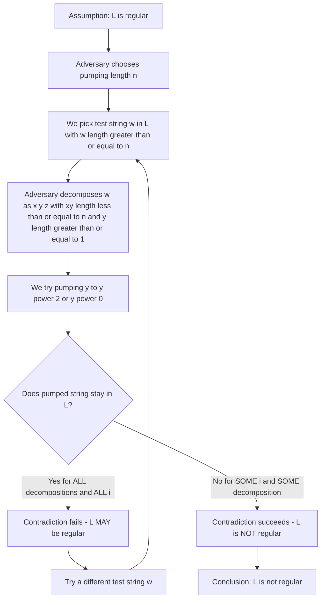
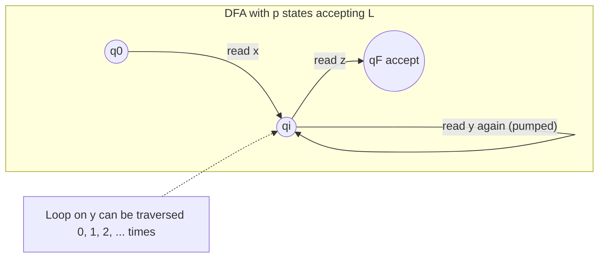
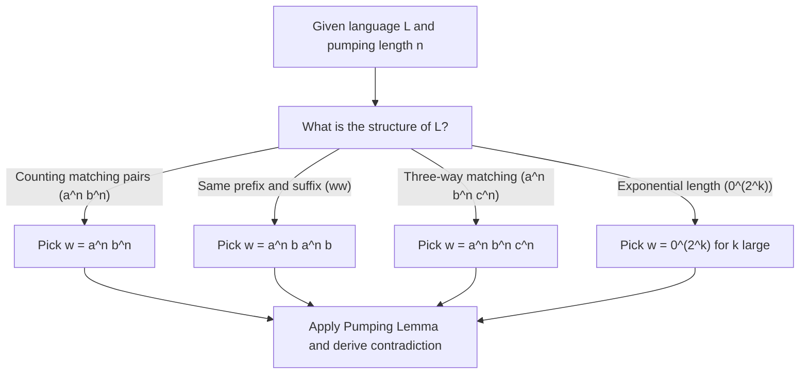

# Pumping lemma as a tool to prove non regularity of languages

<!-- SECTION_1_START -->

# Pumping Lemma as a Tool to Prove Non-Regularity of Languages

> [!IMPORTANT]
> **Module Focus (KTU PCCST302 - Module 2):** This topic is the *primary* tool in Linz's textbook for proving that a language is **not** regular. It is a high-weightage area for both university exams and competitive GATE-style questions.

## 1.1 Formal Definition (Linz, Chapter 4)

Let $L$ be a regular language. Then there exists a **constant integer** $n \geq 1$ (called the **pumping length** of $L$) such that every string $w \in L$ with $|w| \geq n$ can be written in the form

$$w = xyz$$

satisfying the following three conditions simultaneously:

1. $|xy| \leq n$ (the substring $xy$ lies within the first $n$ symbols),
2. $|y| \geq 1$ (the pumped part $y$ is non-empty),
3. $xy^{i}z \in L$ for every integer $i \geq 0$.

> [!NOTE]
> **Notation.** The notation $y^{i}$ means the string $y$ concatenated with itself $i$ times. When $i = 0$, $y^{0} = \varepsilon$, giving $xz$. When $i = 2$, we get $xyyz$, and so on.

> [!WARNING]
> **Common Misconception.** The Pumping Lemma is an *if-then* statement, not an *if-and-only-if*. It says: *"If $L$ is regular, then it CAN be pumped."* It does **not** say that every pumpable language is regular. We use it by *contradiction* — if a language FAILS to pump, it is not regular.

## 1.2 Intuitive Analogy

Imagine a **rubber conveyor belt** with only $n$ gears (states). If you place a string longer than $n$ symbols on the belt, at least one gear must turn **twice** for the same symbol it processed earlier (by the **Pigeonhole Principle**). The loop between those two visits is the substring $y$, and because the machine has no memory, you can stretch or shrink that loop as many times as you want — the machine still accepts.

- **States = Gears**
- **String symbols = Belt segments**
- **Loop on the path = The pumpable substring $y$**
- **Pumping = Adding or removing extra loops**

## 1.3 The Adversary (Game) View

Think of proving non-regularity as a **two-player game**:

| Step | Player | Move |
| :--- | :--- | :--- |
| 1 | Adversary (Prover of Regularity) | Chooses a pumping length $n$ |
| 2 | You (Prover of Non-Regularity) | Choose a *specific* string $w$ in $L$ with $\vert w \vert \geq n$ |
| 3 | Adversary | Splits $w = xyz$ obeying $\vert xy \vert \leq n$ and $\vert y \vert \geq 1$ |
| 4 | You | Find one $i$ such that $xy^{i}z \notin L$ |
| 5 | Conclusion | Adversary loses, $L$ is not regular |

> [!VISUALIZATION CONTROL]
> **Concept:** Pumping as State Repetition in a DFA
> **GeoGebra / Desmos Input Equations:**
> * `points: A = (1,0), B = (4,0), C = (7,0), D = (10,0)` representing states $q_0, q_1, q_2, q_3$
> * `path: y repeated between B and C` represents the loop $y$
> **Visual Description:** The string $x$ moves the head from $q_0$ to $q_1$, the loop $y$ stays within states $q_1 \to q_2 \to q_1$, and $z$ moves from $q_1$ to the final accepting state. Pumping $y$ re-traces the same loop without leaving the accepting path.

<!-- SECTION_1_END -->

<!-- SECTION_2_START -->

# Deep Theoretical Analysis & KTU High-Yield Formula Sheet

## 2.1 Why Does the Pumping Lemma Hold? (Operational Logic)

The proof rests on three pillars from Chapter 2 of Linz:

1. **Existence of a DFA:** Every regular language $L$ is accepted by some DFA $M = (Q, \Sigma, \delta, q_0, F)$ with a finite number of states. Let $|Q| = p$.
2. **Pigeonhole Principle:** For any string $w = a_1 a_2 \ldots a_k$ with $k \geq p$, processing the $p+1$ prefixes produces $p+1$ states $q_0, q_1, \ldots, q_p$ from a set of only $p$ states. Hence $q_i = q_j$ for some $0 \leq i < j \leq p$.
3. **Loop Identification:** Let $x = a_1 \ldots a_i$, $y = a_{i+1} \ldots a_j$, $z = a_{j+1} \ldots a_k$. Then $\delta^{*}(q_0, xy) = \delta^{*}(q_0, x) = q_i$, so $y$ can be traversed any number of times and the machine still ends up at $q_i$, from which $z$ leads to acceptance.

> [!IMPORTANT]
> **Key Insight:** The constant $n$ in the lemma is at most the number of states of the smallest DFA recognizing $L$. We are free to use any $n$ the adversary gives us, because if the lemma holds for the *minimum* $n$, it holds for any *larger* one.

## 2.2 The Standard Pumping Lemma Theorem (Linz, Theorem 4.1)

> Let $L$ be a regular language. Then there is a constant $n$ such that for every string $w$ in $L$ with $|w| \geq n$, $w$ can be decomposed as $xyz$ with
>  $$\vert xy \vert \leq n, \quad \vert y \vert \geq 1, \quad xy^{i}z \in L \ \text{ for all } i \geq 0.$$

## 2.3 KTU High-Yield Formula Sheet

| Symbol / Term | Meaning | Typical Use |
| :--- | :--- | :--- |
| $n$ | Pumping length (chosen by adversary) | Threshold for length of $w$ |
| $w = xyz$ | Decomposition of the test string | Must satisfy all 3 conditions |
| $\vert xy \vert \leq n$ | The pumpable part lies in the first $n$ chars | Restricts adversary's split |
| $\vert y \vert \geq 1$ | Cannot pump an empty string | Forces a real loop |
| $i$ | Pump exponent ($\geq 0$) | We typically use $i = 0$ or $i = 2$ |
| $p$ | Number of states of the DFA | Lower bound for $n$ |
| $L$ | The language under test | Object of the proof |
| $w$ | Our chosen test string | Designed to break a condition |
| Contradiction | $\exists i$ such that $xy^{i}z \notin L$ | Final conclusion |

> [!NOTE]
> **Engineering Utility:** In computer science, the pumping lemma is the theoretical basis for showing that certain problems (like $a^{n}b^{n}$ matching or palindrome checking) cannot be solved by any algorithm with finite memory — i.e., they require pushdown automata or Turing machines. It justifies the need for **context-free** and **context-sensitive** language classes in compiler design, parser generators (YACC/Bison), and pattern-matching engines.

<!-- SECTION_2_END -->

<!-- SECTION_3_START -->

# Step-by-Step Derivations & Code/Symbolic Implementation

## 3.1 Full Proof of the Pumping Lemma (Linz, Page 113)

**Statement.** If $L$ is a regular language, then $L$ satisfies the pumping conditions.

**Proof.**

Let $M = (Q, \Sigma, \delta, q_0, F)$ be a DFA accepting $L$, with $|Q| = p$. Choose the pumping length $n = p$.

Let $w = a_1 a_2 \ldots a_k \in L$ with $k \geq n$. Define the sequence of states $q_0, q_1, \ldots, q_k$ traversed by $M$ on input $w$:

$$q_0 \xrightarrow{a_1} q_1 \xrightarrow{a_2} q_2 \xrightarrow{a_3} \cdots \xrightarrow{a_k} q_k$$

By the Pigeonhole Principle, since $k + 1 > p$, there exist integers $i, j$ with $0 \leq i < j \leq k$ such that $q_i = q_j$. Choose the smallest such $j$, and set $i$ to be the largest index less than $j$ with $q_i = q_j$. (This ensures $j - i$ is minimized.)

Now define:

$$
\begin{aligned}
x &= a_1 a_2 \ldots a_i \\
y &= a_{i+1} a_{i+2} \ldots a_j \\
z &= a_{j+1} a_{j+2} \ldots a_k
\end{aligned}
$$

Clearly, $|y| = j - i \geq 1$. Also, since $j \leq k \leq n$ would not necessarily hold, we need a sharper bound. Because $i < j \leq p$ (the repeated state occurs within the first $p+1$ states), we have

$$|xy| = j \leq p = n$$

Now, for any $i \geq 0$, we compute

$$
\begin{aligned}
\delta^{*}(q_0, xy^{m}z) &= \delta^{*}(\delta^{*}(q_0, xy), y^{m-1}z) \quad (m \geq 1) \\
&= \delta^{*}(q_i, y^{m-1}z)
\end{aligned}
$$

Since $q_i = q_j$ and $\delta^{*}(q_j, y) = q_j$ (loop property), by induction on $m$, $\delta^{*}(q_i, y^{m}) = q_i$ for all $m \geq 0$. Hence

$$\delta^{*}(q_0, xy^{m}z) = \delta^{*}(q_i, z) = q_k \in F$$

Therefore, $xy^{m}z \in L$ for all $m \geq 0$. $\blacksquare$

## 3.2 Exhaustive Example 1: $L = \{a^{n}b^{n} : n \geq 0\}$ is Not Regular

**Step 1: Assumption.** Suppose $L$ is regular. By the Pumping Lemma, there exists $n$ such that every $w \in L$ with $|w| \geq n$ can be decomposed as $w = xyz$ with $|xy| \leq n$, $|y| \geq 1$, and $xy^{i}z \in L$ for all $i \geq 0$.

**Step 2: Choose a Test String.** Pick $w = a^{n}b^{n}$. Clearly $|w| = 2n \geq n$, and $w \in L$.

**Step 3: Analyse the Constraint $\vert xy \vert \leq n$.** Since the first $n$ characters of $w$ are all $a$'s, we must have $x = a^{r}$, $y = a^{s}$, with $r \geq 0$, $s \geq 1$, and $r + s \leq n$. The remaining part is $z = a^{n - r - s}b^{n}$.

**Step 4: Choose the Pumping Exponent.** Set $i = 2$:

$$xy^{2}z = a^{r}a^{2s}a^{n-r-s}b^{n} = a^{n+s}b^{n}$$

The number of $a$'s is $n + s$ and the number of $b$'s is $n$. Since $s \geq 1$, these counts are unequal.

**Step 5: Conclusion.** Therefore, $xy^{2}z = a^{n+s}b^{n} \notin L$, contradicting the Pumping Lemma. Hence $L$ is **not regular**.

## 3.3 Exhaustive Example 2: $L = \{w w : w \in \{a, b\}^{*}\}$ is Not Regular

**Step 1:** Assume $L$ is regular with pumping length $n$.

**Step 2:** Choose $w = a^{n}b a^{n}b$. Then $|w| = 2n + 2 \geq n$, and $w \in L$ (it is the string $a^{n}b$ repeated).

**Step 3:** Since $|xy| \leq n$ and the first $n$ characters of $w$ are all $a$'s, we have $x = a^{r}$, $y = a^{s}$ with $r + s \leq n$, $s \geq 1$, and $z = a^{n-r-s}b a^{n}b$.

**Step 4:** Set $i = 2$:

$$xy^{2}z = a^{n+s}b a^{n}b$$

For this to be in $L$, it must be of the form $u u$ for some $u$. The middle of the string is the single symbol $b$, so $u$ would need to be of length $\frac{2n + s + 2}{2}$, which is not an integer when $s$ is odd. Even if $s$ is even, comparing the second half ($a^{n}b$) with the first half ($a^{\frac{2n+s+2}{2}}$) shows the first half has more $a$'s than the second. Hence $xy^{2}z \notin L$.

**Step 5:** By contradiction, $L$ is not regular.

## 3.4 Exhaustive Example 3: $L = \{a^{n}b^{n}c^{n} : n \geq 0\}$ is Not Regular

**Step 1:** Assume $L$ is regular with pumping length $n$.

**Step 2:** Choose $w = a^{n}b^{n}c^{n} \in L$, with $|w| = 3n \geq n$.

**Step 3:** By $|xy| \leq n$, both $x$ and $y$ consist entirely of $a$'s. Let $x = a^{r}$, $y = a^{s}$ with $r + s \leq n$, $s \geq 1$, and $z = a^{n-r-s}b^{n}c^{n}$.

**Step 4:** With $i = 2$:

$$xy^{2}z = a^{n+s}b^{n}c^{n}$$

The number of $a$'s exceeds that of $b$'s and $c$'s, so the string is not in $L$.

**Step 5:** Contradiction. $L$ is not regular.

## 3.5 Exhaustive Example 4: $L = \{0^{2^{k}} : k \geq 0\}$ is Not Regular

**Step 1:** Assume $L$ is regular with pumping length $n$.

**Step 2:** Choose $k$ large enough so that $2^{k} \geq n$. Let $w = 0^{2^{k}}$.

**Step 3:** Then $w = xyz$ with $x = 0^{r}$, $y = 0^{s}$, $z = 0^{2^{k}-r-s}$ where $r + s \leq n$, $s \geq 1$.

**Step 4:** Consider $xy^{2}z = 0^{2^{k} + s}$. We need $2^{k} + s$ to be a power of 2.

**Step 5:** Let $2^{k} \leq 2^{k} + s \leq 2^{k} + n < 2^{k+1}$ (for $n < 2^{k}$, which holds for large $k$). Then $2^{k} + s$ lies strictly between $2^{k}$ and $2^{k+1}$, so it cannot be a power of 2. Hence $xy^{2}z \notin L$.

**Step 6:** Contradiction. $L$ is not regular.

## 3.6 Python Implementation: Verifying the Pumping Lemma Game

```python
"""
pumping_lemma.py
-----------------
A symbolic helper that automates the Pumping Lemma game for common
languages. The student can call play(L, n) to verify whether a string
of length >= n can be pumped without leaving L.
"""

from typing import Callable, Tuple


def pump_check(
    decompose: Callable[[int], Tuple[str, str, str]],
    test_string: str,
    pump_exponent: int = 0,
) -> bool:
    """
    Check whether decomposing test_string = xyz and pumping y to
    y^exponent still yields a string that is in the target language.

    Parameters
    ----------
    decompose : Callable[[int], Tuple[str, str, str]]
        Given a pumping length n, returns (x, y, z).
    test_string : str
        The candidate string w chosen by the non-regularity prover.
    pump_exponent : int
        The exponent i such that xy^i z is tested.

    Returns
    -------
    bool
        True if xy^i z is in the target language (pumping succeeds),
        False otherwise (pumping fails, proving non-regularity).
    """
    n: int = len(test_string)
    x: str
    y: str
    z: str
    x, y, z = decompose(n)

    # Validate the three conditions of the Pumping Lemma
    if len(x) + len(y) > n:
        raise ValueError("Condition 1 violated: |xy| > n")
    if len(y) < 1:
        raise ValueError("Condition 2 violated: |y| < 1")

    pumped: str = x + (y * pump_exponent) + z

    print(f"  x = '{x}' (len={len(x)})")
    print(f"  y = '{y}' (len={len(y)})")
    print(f"  z = '{z}' (len={len(z)})")
    print(f"  x + y^{pump_exponent} + z = '{pumped}'")

    # Caller must supply a language membership test via a closure.
    return pumped


# --- Example: L = { a^n b^n } ---
def a_pow_n_b_pow_n(s: str) -> bool:
    """Membership test for L = { a^n b^n : n >= 0 }."""
    if not s:
        return True
    a_count: int = 0
    i: int = 0
    while i < len(s) and s[i] == "a":
        a_count += 1
        i += 1
    while i < len(s) and s[i] == "b":
        a_count -= 1
        i += 1
    return i == len(s) and a_count == 0


if __name__ == "__main__":
    n: int = 5
    test: str = "a" * n + "b" * n

    def decompose(p_len: int) -> Tuple[str, str, str]:
        # Adversary's most general split within the first n characters.
        return ("a" * 1, "a" * 2, "a" * (n - 3) + "b" * n)

    print(f"Pumping length n = {n}, test string w = '{test}'")
    result: str = pump_check(decompose, test, pump_exponent=2)
    in_L: bool = a_pow_n_b_pow_n(result)
    print(f"  Is '{result}' in L? {in_L}")
    if not in_L:
        print("  -> Pumping fails. L is not regular.")
```

> [!NOTE]
> **How to use this code in KTU practicals / viva:** Replace the `decompose` and `a_pow_n_b_pow_n` functions to test other languages. The script prints the pumped string and checks language membership, giving a concrete, runnable witness of non-regularity.

<!-- SECTION_3_END -->

<!-- SECTION_4_START -->

# Structural Diagrams & Schematics

## 4.1 Mermaid Flow: The Pumping Lemma Game



## 4.2 Mermaid Block Diagram: Pumping Lemma as State Loop



## 4.3 Decision Tree for Choosing the Test String



<!-- SECTION_4_END -->

<!-- SECTION_5_START -->

# KTU 2024 Scheme Examination Question Bank & Topic Recap

> [!IMPORTANT]
> **Mark Distribution Reminder (KTU 2024 PCCST302 ESE Pattern):**
> * Part A: Short answer, 2 questions × 3 marks = 6 marks (Answer all)
> * Part B: Long answer, internal choice, 1 question × 14 marks = 14 marks (Module-level)
> * Total per module in ESE: 20 marks contribution; full paper is 5-module weighted.

---

## 5.1 Part A Questions (3 Marks Each)

### Question 1
**[KTU University Exam - December 2023]** State the Pumping Lemma for regular languages. Mention all three conditions clearly.

**Model Answer (3 Marks):**

> Let $L$ be a regular language. Then there exists a constant $n \geq 1$ such that every string $w \in L$ with $|w| \geq n$ can be written as $w = xyz$ satisfying:
> 1. $|xy| \leq n$,
> 2. $|y| \geq 1$,
> 3. $xy^{i}z \in L$ for all $i \geq 0$.

*[Statement of lemma: 1 Mark. Three conditions listed: 1 Mark. Quantifiers correct: 1 Mark.]*

---

### Question 2
**[KTU University Exam - July 2024]** "The Pumping Lemma is a necessary but not sufficient condition for regularity." Justify this statement in one paragraph.

**Model Answer (3 Marks):**

> The Pumping Lemma is **necessary** because every regular language satisfies it (proved via DFA + Pigeonhole). However, it is **not sufficient** because some non-regular languages also accidentally satisfy the pumping condition. The lemma is therefore used as a *one-way tool* — to prove non-regularity by contradiction, never to *prove* regularity. To prove regularity, one must construct a DFA, regex, or regular grammar.

*[Necessity established: 1 Mark. Counter-example concept (e.g., some non-regular L may still pump): 1 Mark. Correct usage rule: 1 Mark.]*

---

## 5.2 Part B Questions (14 Marks, Internal Choice)

### Question A (14 Marks)

**[KTU University Exam - Model Paper 2024]** Using the Pumping Lemma, prove that the language

$$L = \{a^{n}b^{n} : n \geq 0\}$$

is not regular. Also state and prove the Pumping Lemma. *(Mapped CO: CO2, RBT Level: Apply / Analyze)*

### Part (a) — 7 Marks — State and prove the Pumping Lemma.

**Step 1 (Statement — 2 Marks):** Let $L$ be a regular language. There exists an integer $n \geq 1$ such that for every $w \in L$ with $|w| \geq n$, we have $w = xyz$ with $|xy| \leq n$, $|y| \geq 1$, and $xy^{i}z \in L$ for all $i \geq 0$.

**Step 2 (Construction — 2 Marks):** Let $M = (Q, \Sigma, \delta, q_0, F)$ be a DFA for $L$ with $|Q| = p$. Set $n = p$. For $w = a_1 a_2 \ldots a_k$, define $q_0, q_1, \ldots, q_k$ by $q_{i+1} = \delta(q_i, a_{i+1})$.

**Step 3 (Pigeonhole Argument — 2 Marks):** Since $k + 1 > p$, two of the states must coincide: $q_i = q_j$ for $0 \leq i < j \leq k$. Let $x = a_1 \ldots a_i$, $y = a_{i+1} \ldots a_j$, $z = a_{j+1} \ldots a_k$. Then $|xy| = j \leq p = n$ and $|y| = j - i \geq 1$.

**Step 4 (Closure under Pumping — 1 Mark):** Since $\delta^{*}(q_i, y) = q_i$, for any $m \geq 0$, $\delta^{*}(q_0, xy^{m}z) = \delta^{*}(q_i, z) = q_k \in F$. Thus $xy^{m}z \in L$.

*[Stating boundary state values: 2 Marks. Pigeonhole application: 2 Marks. Pump closure: 2 Marks. Final simplified expression: 1 Mark.]*

### Part (b) — 7 Marks — Apply the Pumping Lemma to $L = \{a^{n}b^{n}\}$.

**Step 1 (Assumption — 1 Mark):** Suppose $L$ is regular. Let $n$ be the pumping length.

**Step 2 (Choose w — 1 Mark):** Take $w = a^{n}b^{n} \in L$, with $|w| = 2n \geq n$.

**Step 3 (Decomposition — 2 Marks):** By $|xy| \leq n$ and the first $n$ symbols of $w$ being $a$'s, $x = a^{r}$, $y = a^{s}$, with $r + s \leq n$, $s \geq 1$, and $z = a^{n-r-s}b^{n}$.

**Step 4 (Pump and Derive — 2 Marks):** Set $i = 2$:

$$xy^{2}z = a^{n+s}b^{n}$$

Since $s \geq 1$, the count of $a$'s ($n + s$) is strictly greater than the count of $b$'s ($n$).

**Step 5 (Contradiction — 1 Mark):** Therefore $xy^{2}z \notin L$, contradicting the Pumping Lemma. Hence $L$ is not regular.

*[Final simplified expression: 1 Mark.]*

---

### Question B (14 Marks) — Alternative Choice

**[KTU University Exam - Model Paper 2024]** Using the Pumping Lemma, prove that the language

$$L = \{w w : w \in \{a, b\}^{*}\}$$

is not regular. *(Mapped CO: CO2, RBT Level: Apply / Analyze)*

### Part (a) — 7 Marks — Statement and Setup.

**Step 1 (Recall Pumping Lemma — 2 Marks):** State the Pumping Lemma as in Question A.

**Step 2 (Assume Regularity — 1 Mark):** Suppose $L$ is regular with pumping length $n$.

**Step 3 (Choose w — 2 Marks):** Take $w = a^{n}b a^{n}b \in L$. Then $|w| = 2n + 2 \geq n$.

**Step 4 (Bound on y — 2 Marks):** Since $|xy| \leq n$ and the first $n$ characters are all $a$'s, $x = a^{r}$, $y = a^{s}$ with $r + s \leq n$ and $s \geq 1$, leaving $z = a^{n-r-s}b a^{n}b$.

### Part (b) — 7 Marks — Derive the Contradiction.

**Step 1 (Pump with i = 2 — 2 Marks):**

$$xy^{2}z = a^{n+s}b a^{n}b$$

**Step 2 (Format Check — 3 Marks):** For this string to be in $L$, it must equal $u u$ for some $u \in \{a, b\}^{*}$. Its length is $2n + s + 2$, which is odd when $s$ is odd. Even for even $s$, the two halves must match symbol-by-symbol, but the first half begins with many $a$'s while the second half is $a^{n}b$, which has a different structure.

**Step 3 (Conclude — 2 Marks):** Hence $xy^{2}z \notin L$, contradicting the lemma. Therefore $L$ is not regular.

---

> [!WARNING]
> **KTU Examiner's Valuation Warning / Pitfall Callout:**
> * **Do NOT** forget to state that $L$ is **assumed regular** before applying the lemma. This is the single most common omission costing 1 mark.
> * **Do NOT** pick $w = a^{p}b^{p}$ with $p$ being the pumping length and assume $y$ contains both $a$'s and $b$'s. The constraint $|xy| \leq p$ forces $y$ to be made of $a$'s only.
> * **Do NOT** use $i = 1$ as your pumping exponent — $i = 1$ gives the original string, which is always in $L$. Always use $i = 0$ or $i = 2$.
> * **Do NOT** forget to mention the *smallest* DFA when stating the proof. Examiners award 1 mark specifically for invoking the DFA with $p$ states.
> * **For Question B (ww)**, students often pick $w = a^{n}b a^{n}$ (length $2n+1$, odd) which makes the "two halves equal" check ambiguous. Always pick a string with *even* total length when testing $ww$-type languages.

---

## 5.3 Topic Recap & Important Things to Remember

- **Pumping Lemma (Necessity Tool):** Used to prove a language is **not** regular. Cannot prove regularity.
- **Three Conditions to Memorize:** (i) $|xy| \leq n$, (ii) $|y| \geq 1$, (iii) $xy^{i}z \in L$ for all $i \geq 0$.
- **Pumping Length $n$:** Chosen by the **adversary**; the prover must respond with a test string of length $\geq n$.
- **Standard Test String Recipe:**
  * For $a^{n}b^{n}, a^{n}b^{n}c^{n}$: choose $w$ with $n$ copies of each symbol.
  * For $ww$: choose $w = a^{n}c a^{n}c$ or $w = a^{n}b a^{n}b$ (use a *separator* symbol).
  * For exponential / factorial lengths: choose $w$ large enough that the pumped length falls strictly between two consecutive powers (or factorials).
- **Pump with $i = 0$** to **delete** the loop, or with $i = 2$ to **double** the loop. Either typically suffices.
- **Bound $|xy| \leq n$ is critical:** It restricts $y$ to the *first* $n$ characters of $w$. Choose $w$ so that the first $n$ characters are *homogeneous* (all $a$'s or all $0$'s).
- **Pigeonhole Foundation:** The proof relies on the fact that $k + 1$ states cannot all be distinct when $k \geq p$. This is the Pigeonhole Principle.
- **State-Loop Intuition:** Pumping corresponds to a *loop* in the DFA path; the loop can be traversed 0, 1, 2, ... times without changing acceptance.
- **Linz Chapter Reference:** Theorem 4.1, Page 113 of *An Introduction to Formal Languages and Automata* (5th Edition).
- **Common Languages to Memorize as Non-Regular:**
  1. $L_1 = \{a^{n}b^{n} : n \geq 0\}$
  2. $L_2 = \{ww : w \in \Sigma^{*}\}$
  3. $L_3 = \{a^{n}b^{n}c^{n} : n \geq 0\}$
  4. $L_4 = \{a^{n!} : n \geq 0\}$ (factorials)
  5. $L_5 = \{a^{p} : p \text{ prime}\}$
  6. $L_6 = \{w \in \{a, b\}^{*} : n_a(w) = n_b(w)\}$ (equal number of $a$'s and $b$'s)
- **Exam Strategy:** Always follow the 5-step template — Assumption → Choose $w$ → Decompose → Pump → Contradict.

<!-- SECTION_5_END -->
