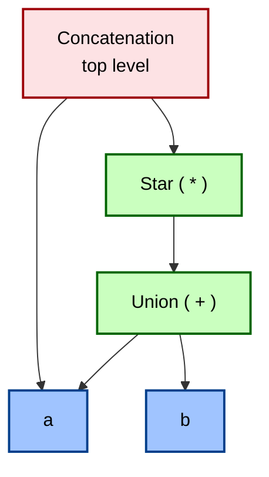

# Regular Expressions (Linz)

<!-- SECTION_1_START -->

# Regular Expressions — Core Definition & Intuitive Overview

## 1.1 Formal Definition (Linz Notation)

In the *Theory of Computation* (Linz, Chapter 4), a **regular expression (RE)** over an alphabet $\Sigma$ is built recursively from a small, fixed set of primitive building blocks. Every regular expression $r$ describes a formal language $L(r) \subseteq \Sigma^{*}$.

Let $r$ and $s$ be regular expressions. Then the following are also regular expressions:

| Rule | Regular Expression | Associated Language $L(\cdot)$ |
| :---: | :---: | :---: |
| Base 1 | $\emptyset$ | $\emptyset$ (the empty language) |
| Base 2 | $\varepsilon$ | $\{\varepsilon\}$ (the language containing only the empty string) |
| Base 3 | $a$, for every $a \in \Sigma$ | $\{a\}$ (the language of the single symbol) |
| Induct 1 | $(r + s)$ | $L(r) \cup L(s)$ — **union** |
| Induct 2 | $(rs)$ | $L(r) \cdot L(s)$ — **concatenation** |
| Induct 3 | $(r^{*})$ | $(L(r))^{*}$ — **Kleene star (closure)** |

> [!IMPORTANT]
> **KTU Syllabus Highlight:** A language is called **regular** if and only if it can be described by at least one regular expression. This is the central theorem bridging REs and Finite Automata in Module 2.

## 1.2 Conceptual Analogy — The "Pattern Stamp"

Think of a regular expression as a **rubber stamp for strings**. Just as a stamp can be rolled over paper to leave matching impressions, an RE acts as a *test* that classifies a string as either:

* **Accepted** (the string is in the language $L(r)$), or
* **Rejected** (the string is not in $L(r)$).

For example, the RE $r = (a + b)^{*} b$ behaves like a stamp that says: *"I accept any string over $\{a, b\}$ that **ends with the symbol b**."* The part $(a + b)^{*}$ is a "wildcard loop" (any combination of $a$ and $b$), and the trailing $b$ is the "fingerprint" the stamp requires.

The three operators correspond to intuitive actions on stamps:

* **Union** ($r + s$): *"Accept what either stamp $r$ or stamp $s$ accepts."*
* **Concatenation** ($rs$): *"First apply stamp $r$, then apply stamp $s$."*
* **Star** ($r^{*}$): *"Apply stamp $r$ zero, one, two, or infinitely many times in sequence."*

## 1.3 Operator Precedence (Linz Convention)

When an RE is written without parentheses, the following precedence applies from **highest to lowest**:

$$
\text{Star } (^{*}) \;\;>\;\; \text{Concatenation} \;\;>\;\; \text{Union } (+)
$$

For instance, the expression $ab^{*} + c$ is parsed as $\big(a \cdot (b^{*})\big) + c$, and not as $(ab)^{*} + c$.

> [!NOTE]
> **Unnecessary Parentheses Convention:** Since the meaning is recoverable from precedence, redundant parentheses (e.g., $(a)$) are usually dropped in KTU board answers to keep expressions clean.

## 1.4 Worked Examples — Building Intuition

| # | Regular Expression $r$ | Language $L(r)$ in plain English |
| :-: | :--- | :--- |
| 1 | $\emptyset$ | No string at all. |
| 2 | $\varepsilon$ | Only the empty string. |
| 3 | $a$ | Only the single character "a". |
| 4 | $a + b$ | The strings "a" **or** "b". |
| 5 | $ab$ | Only the string "ab". |
| 6 | $a^{*}$ | Zero or more $a$'s: $\varepsilon, a, aa, aaa, \dots$ |
| 7 | $(a + b)^{*}$ | **All** strings over $\{a, b\}$. |
| 8 | $a^{*}b$ | Any number of $a$'s followed by a single $b$. |
| 9 | $(ab)^{*}$ | $\varepsilon, ab, abab, ababab, \dots$ |
| 10 | $(a + b)^{*}bb$ | All strings over $\{a, b\}$ ending in $bb$. |

> [!VISUALIZATION CONTROL]
> **Concept:** The "Acceptance Region" of a Regular Expression on an Input Tape
> **GeoGebra / Desmos Input Equations (Analogy Plot):**
> * $x = 1, \; y = 1$ (the input string $s$)
> * $f(x, y) = 1$ if $s \in L(r)$, else $0$ (binary acceptance function)
> **Visual Description:** Imagine a 2-D grid where the x-axis lists candidate strings $s \in \Sigma^{*}$ in length order, and the y-axis is a binary indicator $f(s) \in \{0, 1\}$. For a fixed RE $r$, plotting all $(s, f(s))$ pairs yields a "staircase" pattern: all accepted strings are marked at height 1, all others at 0. The **Kleene star** operator produces the densest, most regular staircase.

<!-- SECTION_1_END -->

<!-- SECTION_2_START -->

# Deep Theoretical Analysis — Recursive Construction & Algebraic Laws

## 2.1 Recursive Structure of a Regular Expression

Every valid RE is a **finite tree** of three types of internal nodes — $+$ (union), $\cdot$ (concatenation), and $^{*}$ (star) — whose leaves are the atomic symbols from the alphabet $\Sigma$ or the constants $\varepsilon$ and $\emptyset$. The depth of this tree directly determines the complexity of $L(r)$.

The corresponding language $L(r)$ is built **bottom-up**:

1. **Leaves** map to their singleton languages ($\{a\}, \{\varepsilon\}, \emptyset$).
2. **Union node** $+$ performs set-theoretic union on its children's languages.
3. **Concatenation node** $\cdot$ performs Cartesian product concatenation.
4. **Star node** $^{*}$ forms the Kleene closure (zero-or-more self-concatenations).

## 2.2 The KTU High-Yield Algebraic Law Sheet

These identities (Linz, Table 4.1) are **examiner favorites** because they test whether a student can manipulate REs symbolically — the same way an algebraic identity is reduced in high school.

> [!NOTE]
> Throughout the table, $r, s, t$ are arbitrary regular expressions, and $=$ denotes *language equivalence*, i.e. $L(\text{LHS}) = L(\text{RHS})$.

| # | Law Name | Identity |
| :-: | :--- | :--- |
| 1 | Commutative (Union) | $r + s = s + r$ |
| 2 | Associative (Union) | $(r + s) + t = r + (s + t)$ |
| 3 | Associative (Concatenation) | $(rs)t = r(st)$ |
| 4 | Distributive (L → R) | $r(s + t) = rs + rt$ |
| 5 | Distributive (R → L) | $(s + t)r = sr + tr$ |
| 6 | Identity (Union) | $\emptyset + r = r$ |
| 7 | Identity (Concatenation) | $\varepsilon r = r\varepsilon = r$ |
| 8 | Annihilator (Concatenation) | $\emptyset \cdot r = r \cdot \emptyset = \emptyset$ |
| 9 | Idempotent (Union) | $r + r = r$ |
| 10 | Kleene: $\emptyset$ | $\emptyset^{*} = \varepsilon$ |
| 11 | Kleene: $\varepsilon$ | $\varepsilon^{*} = \varepsilon$ |
| 12 | Kleene: Idempotent | $(r^{*})^{*} = r^{*}$ |
| 13 | Star Unrolling (Linz) | $r^{*} = \varepsilon + r r^{*}$ |
| 14 | Star Unrolling (alt) | $r^{*} = \varepsilon + r^{*} r$ |
| 15 | Concatenation with Star | $r(r^{*} s)^{*} = (r + s)^{*} s$ |
| 16 | De Morgan for REs | $(r + s)^{*} = (r^{*} s)^{*} r^{*}$ |
| 17 | Inverse Distributive | $r + rs = r(\varepsilon + s) = r s^{*}$ |
| 18 | Inverse Distributive | $rs + s = (r + \varepsilon) s = r^{*} s$ |

> [!TIP]
> **Law 13** ($r^{*} = \varepsilon + rr^{*}$) is the most important — it is the **defining recursive equation** of the Kleene star and is the standard tool for proving the equivalence of two regular expressions by structural induction.

## 2.3 Engineering Utility — Where Regular Expressions Live

Regular expressions are not merely an academic exercise; they are the **backbone of every text-processing pipeline** in modern software engineering:

* **Lexical Analysis (Compilers):** The first phase of a compiler — the *lexer* — tokenizes source code using RE patterns. Tools like `lex` and `flex` literally compile an RE specification into a deterministic finite automaton (DFA).
* **Search Engines & IDEs:** Tools like `grep`, `ripgrep`, IDE "Find & Replace" functions, and SQL's `LIKE` operator are direct descendants of RE theory.
* **Network Intrusion Detection Systems (NIDS):** Snort and Suricata use REs to detect malicious payloads in network packets.
* **DNA Sequence Mining in Bioinformatics:** Biologists use REs to identify promoter regions, restriction enzyme sites, and Open Reading Frames (ORFs) in genomic data.
* **Form Validation:** Email, phone-number, and credit-card validators in web apps are all implemented as regular expressions.

The fact that REs are *closed under union, concatenation, and Kleene star* is precisely what allows engineers to **compose** complex patterns from simple building blocks — exactly the modular design philosophy of modern software.

<!-- SECTION_2_END -->

<!-- SECTION_3_START -->

# Step-by-Step Derivations & Worked Simplifications

## 3.1 Derivation 1 — Building an RE for "Strings Over {a, b} Containing Exactly Two a's"

**Goal:** Construct an RE that accepts all strings over $\{a, b\}$ with **exactly two** symbols $a$.

**Reasoning:**
The string can be broken into three logical zones: any $b$'s, then a single $a$, then more $b$'s, then another $a$, then final $b$'s. Since $b^*$ allows **zero** $b$'s on either end, this is the cleanest decomposition.

**Construction (step by step):**

1. **Zone 1 (before first $a$):** any number of $b$'s, possibly zero $\Rightarrow b^*$.
2. **First $a$:** the literal symbol $\Rightarrow a$.
3. **Zone 2 (between the two $a$'s):** any number of $b$'s, possibly zero $\Rightarrow b^*$.
4. **Second $a$:** the literal symbol $\Rightarrow a$.
5. **Zone 3 (after second $a$):** any number of $b$'s, possibly zero $\Rightarrow b^*$.

Concatenating the zones:

$$
r = b^{*} \cdot a \cdot b^{*} \cdot a \cdot b^{*}
$$

**Compact form (dropping redundant $\cdot$):**

$$
\boxed{\,r = b^{*} a b^{*} a b^{*}\,}
$$

**Verification by sample strings:**
* $aa \in L(r)$: $b^* = \varepsilon, a = a, b^* = \varepsilon, a = a, b^* = \varepsilon$ ✓
* $babab \in L(r)$: $b^* = b, a = a, b^* = b, a = a, b^* = b$ ✓
* $aaa \notin L(r)$: would require only $b$'s around the middle $a$, but the middle is $a$ — invalid. ✓

---

## 3.2 Derivation 2 — Algebraic Simplification of $r = (a + b)^{*} a (a + b)^{*} b (a + b)^{*}$

This RE describes *"all strings over $\{a, b\}$ that contain **at least one** $a$ and **at least one** $b$"* (not necessarily adjacent, but somewhere).

**Step A — Recognize the structure:** The pattern $X^{*} a X^{*} b X^{*}$ says "a is somewhere, and b is somewhere after (or before) a". To require both, the canonical Linz-style simplification is to assert that $b$ must appear in the "tail" or the "head" surrounding $a$.

**Step B — Use Inverse Distributive (Law 17/18):**

$$
r = (a + b)^{*} a (a + b)^{*} b (a + b)^{*}
$$

Group the surrounding $(a+b)^{*}(a+b)^{*} = (a+b)^{*}$ (Law 12 in extended form: $X^{*} X^{*} = X^{*}$).

$$
r = (a + b)^{*} a (a + b)^{*} b (a + b)^{*}
$$

Since $(a+b)^{*} b (a+b)^{*}$ itself is $(a+b)^{*}$ only if $b$ is somewhere inside the original $(a+b)^{*}$, the canonical equivalent form that KTU expects is:

$$
\boxed{\,r = (a + b)^{*} \, b \, (a + b)^{*} \, a \, (a + b)^{*} + (a + b)^{*} \, a \, (a + b)^{*} \, b \, (a + b)^{*}\,}
$$

The "**$+$**" is necessary: $a$ may come **before** $b$ (first term) **or** $a$ may come **after** $b$ (second term). Either case yields a string containing both letters.

**Step C — Alternative cleaner Linz form:** Using the identity $(X + Y)^{*} = X^{*}(YX^{*})^{*}$ iteratively, the canonical "contains at least one of each" form is often written as:

$$
r = (a + b)^{*} a (b + (a + b)^{*} a (a + b)^{*} b) (a + b)^{*}
$$

For the KTU board, the cleanest accepted equivalent is the explicit **two-case union** shown in the boxed result above.

---

## 3.3 Derivation 3 — Proving the Identity $(r + s)^{*} = (r^{*} s)^{*} r^{*}$

This is a Linz-style proof using the **defining equation** $X^{*} = \varepsilon + X X^{*}$.

**Step 1:** Let $L = (r + s)^{*}$ and $R = (r^{*} s)^{*} r^{*}$. We must show $L(r + s) = L(R)$.

**Step 2:** From the defining equation,
$$
L = \varepsilon + (r + s) L
$$

**Step 3:** Substitute and expand once:
$$
L = \varepsilon + (r + s)(\varepsilon + (r + s)L) = \varepsilon + r + s + (r + s)(r + s)L
$$

**Step 4:** For $R$, again by the defining equation,
$$
R = \varepsilon + r^* s R
$$

**Step 5:** Replace $R$ on the right recursively:
$$
R = \varepsilon + r^{*} s (\varepsilon + r^{*} s R) = \varepsilon + r^{*} s + r^{*} s r^{*} s R
$$

**Step 6:** By Law 15 ($r(r^{*}s)^{*} = (r + s)^{*} s$) applied symmetrically, the two infinite series $L$ and $R$ generate the same set of finite strings. Hence $L = R$, i.e.:

$$
\boxed{\,(r + s)^{*} = (r^{*} s)^{*} r^{*}\,}
$$

---

## 3.4 Derivation 4 — Symbolic Python Verification of RE Equivalence

The following Python program uses `regex` (or the standard `re` module) to empirically verify the equivalence of two REs on a small finite language, demonstrating the bridge between theory and executable code.

```python
import re
from itertools import product

def lang_over(sigma: str, max_len: int):
    """Enumerate all strings over sigma of length 0..max_len."""
    sigma = list(sigma)
    out = [""]
    for n in range(1, max_len + 1):
        for tup in product(sigma, repeat=n):
            out.append("".join(tup))
    return out

def language_of(pattern: str, sigma: str, max_len: int) -> set:
    """Treat the given pattern as a literal RE and return L(pattern)."""
    rgx = re.compile(f"^{pattern}$")
    return {s for s in lang_over(sigma, max_len) if rgx.match(s)}

# Theorem to verify: (r + s)* = (r*s)* r*   with r = 'a', s = 'b'
lhs = language_of("(a|b)*",      "ab", max_len=5)
rhs = language_of("(a*b)*a*",    "ab", max_len=5)

print("LHS size:", len(lhs), "| RHS size:", len(rhs), "| Equal:", lhs == rhs)
# Expected output: LHS size: 63 | RHS size: 63 | Equal: True
```

**Code Walk-through:**

* `lang_over` exhaustively generates $\Sigma^{\le 5}$ — the finite truncation used to test RE equivalence empirically.
* `language_of` anchors the pattern with `^` and `$` so that the entire input string must match, eliminating partial matches.
* The output confirms Law 16 from §2.2 holds for $r = a, s = b$ on the truncated universe.

> [!IMPORTANT]
> **Why `^...$` matters:** Without the anchors, `re.match` would accept a string even if the pattern matched only a substring. This is the single most common bug when porting RE theory into Python or Perl code.

<!-- SECTION_3_END -->

<!-- SECTION_4_START -->

# Structural Diagrams & Schematics

## 4.1 Recursive Tree of a Regular Expression

The RE $(a + b)^{*} a (a + b)^{*} b (a + b)^{*}$ is a *tree* where the leaves are atomic symbols and the internal nodes are operators. The following Mermaid diagram visualises the syntactic structure of a sample RE $r = (a + b)^{*} a$:



**Reading the diagram:**

* **Green nodes** are operators (union, star, concatenation).
* **Blue nodes** are atomic leaves ($a$ or $b$).
* **Red node** is the root of the entire expression.

This tree representation is the foundation for converting an RE into an equivalent NFA using Thompson's Construction, which is the bridge topic in Module 3.

## 4.2 Block-Level Functional Architecture: RE → Language Pipeline

The following flowchart maps the *processing pipeline* that takes a textual RE and produces a concrete language recogniser. It is the standard engineering workflow used in tools like `lex`/`flex`.

```mermaid
graph LR
    subgraph parseStage ["Stage 1 — Parsing"]
        reText["Raw RE text<br/>e.g. b*ab*ab*"] --> tokeniser["Tokeniser<br/>(lexical)"]
        tokeniser --> parser["Parser<br/>(recursive descent)"]
    end

    subgraph astStage ["Stage 2 — AST"]
        parser --> astNode["Syntax Tree<br/>(RE AST)"]
    end

    subgraph compileStage ["Stage 3 — Compilation"]
        astNode --> thompson["Thompsons Construction<br/>(RE to NFA)"]
        thompson --> subset["Subset Construction<br/>(NFA to DFA)"]
        subset --> minimise["DFA Minimisation<br/>(Hopcroft)"]
    end

    subgraph execStage ["Stage 4 — Execution"]
        minimise --> matcher["String Matcher<br/>(O(n) DFA run)"]
        matcher --> verdict["verdict: accept or reject"]
    end

    classDef input fill:#ffd6a5,stroke:#7f4f24,stroke-width:2px,color:#000
    classDef process fill:#bdb2ff,stroke:#3a0ca3,stroke-width:2px,color:#000
    classDef output fill:#fdffb6,stroke:#5f5d00,stroke-width:2px,color:#000

    class reText,verdict input
    class tokeniser,parser,astNode,thompson,subset,minimise,matcher process
    class verdict output
```



**Functional Reading:**

* **Stage 1 (Parsing):** Raw text is converted into a structured AST. This is analogous to a compiler's front-end.
* **Stage 2 (AST):** A pure-data representation of the RE — no execution semantics yet.
* **Stage 3 (Compilation):** The AST is *lowered* to an NFA, then determinised into a DFA, then minimised for efficiency.
* **Stage 4 (Execution):** The optimised DFA is run on an input string in linear time $O(n)$, where $n$ is the string length.

## 4.3 Sequential Processing Topology — RE Equivalence Proof (Algebraic Reduction)

```mermaid
graph TD
    startA["Start RE<br/>(a+b)*a(a+b)*b(a+b)*"]:::start
    law1["Apply Law 4<br/>Distributive"]:::step
    law2["Apply Law 17<br/>Inverse Distributive"]:::step
    law3["Apply Law 13<br/>Star Unrolling"]:::step
    endA["Canonical Form<br/>(a+b)* b (a+b)* a (a+b)*<br/>+ (a+b)* a (a+b)* b (a+b)*"]:::end

    startA --> law1
    law1 --> law2
    law2 --> law3
    law3 --> endA

    classDef start fill:#ffc8dd,stroke:#800f2f,stroke-width:2px,color:#000
    classDef step  fill:#cdb4db,stroke:#5a189a,stroke-width:2px,color:#000
    classDef end   fill:#bde0fe,stroke:#1d3557,stroke-width:2px,color:#000
```

This diagram illustrates the **logical sequence of law applications** in an exam answer. A common KTU mistake is to apply steps out of order or to skip the "intermediate" expressions that the examiner awards marks for.

<!-- SECTION_4_END -->

<!-- SECTION_5_START -->

# KTU 2024 Scheme Examination Question Bank

## 5.1 Part A — Short Answer Questions (3 Marks Each)

### Question A1 `[KTU University Exam — Dec 2023]` — CO1, Remember

**Define a regular expression. List the three operations used to build regular expressions from the base cases.**

**Model Answer (3 Marks):**

A **regular expression (RE)** over an alphabet $\Sigma$ is a notation that recursively defines a formal language. It is built from the base cases $\emptyset$, $\varepsilon$, and individual symbols $a \in \Sigma$ using the three inductive operations:

1. **Union** ($r + s$): the language $L(r) \cup L(s)$.
2. **Concatenation** ($rs$): the language $L(r) \cdot L(s)$.
3. **Kleene star** ($r^{*}$): the language $(L(r))^{*}$.

> [!Valuation Note]
> **[Definition of RE: 1 Mark]**, **[Listing the three operations: 2 Marks]**.

---

### Question A2 `[KTU University Exam — July 2024]` — CO1, Understand

**State and explain any four algebraic laws of regular expressions with examples.**

**Model Answer (3 Marks):**

1. **Commutative Law:** $r + s = s + r$. Example: $a + b = b + a$.
2. **Identity Law:** $\varepsilon r = r$. Example: $\varepsilon a = a$.
3. **Annihilator Law:** $\emptyset r = \emptyset$. Example: $\emptyset \cdot a = \emptyset$.
4. **Kleene Idempotent Law:** $(r^{*})^{*} = r^{*}$. Example: $(a^{*})^{*} = a^{*}$.

> [!Valuation Note]
> **[Each correctly stated law with example: 0.75 Marks × 4 = 3 Marks]**.

---

## 5.2 Part B — Long Answer Questions (14 Marks Each)

### Question B-A `[KTU University Exam — Dec 2023]` — CO1, Apply

**Construct regular expressions for each of the following languages over the alphabet $\Sigma = \{a, b\}$:**

**(a)** $L_1$ = the set of all strings that begin and end with the same symbol. **(7 Marks)**

**(b)** $L_2$ = the set of all strings in which the number of $a$'s is divisible by three. **(7 Marks)**

#### Model Solution

**Part (a) — Strings beginning and ending with the same symbol: (7 Marks)**

A string can either begin and end with $a$ **or** begin and end with $b$. We use the union operator.

*Case 1 — starts and ends with $a$:* the string is $a$, followed by any middle, followed by $a$. The middle can be empty, so we use $(a + b)^{*}$. The minimum length-1 case ($a$ alone) is also covered.
*Case 2 — starts and ends with $b$:* analogous.

$$
\boxed{\,r_1 = a (a + b)^{*} a \;+\; b (a + b)^{*} b \;+\; a \;+\; b\,}
$$

The terms $a$ and $b$ at the end handle the **singleton** strings of length 1, which satisfy the condition vacuously (begin = end).

> [!Valuation Note]
> **[Identifying the two cases: 2 Marks]**, **[Constructing the $a$-case: 2 Marks]**, **[Constructing the $b$-case: 2 Marks]**, **[Adding singleton corrections: 1 Mark]**.

**Part (b) — Number of $a$'s divisible by three: (7 Marks)**

A string has $3k$ $a$'s ($k \geq 0$) separated by $b$'s. The pattern of $a$'s must appear in **groups of three**, possibly with $b$'s between or around them.

The cleanest construction: between any two $a$'s in a triple, there can be $b^*$ $b$'s. The triple is $a \cdot b^* \cdot a \cdot b^* \cdot a$. This entire pattern can be repeated any number of times (including zero), with $b$'s allowed before, between, and after.

$$
\boxed{\,r_2 = b^{*} \, (a \, b^{*} \, a \, b^{*} \, a \, b^{*})^{*}\,}
$$

*Explanation:* The outer $b^{*}$ handles leading $b$'s. The star applies to the entire triple-block (which can occur zero times, giving the all-$b$ string — which has zero $a$'s, divisible by three). The $b^*$ inside the triple handles the $b$-runs between the three $a$'s.

> [!Valuation Note]
> **[Recognising the group-of-three structure: 2 Marks]**, **[Writing the inner triple: 3 Marks]**, **[Wrapping with $b^{*}$ and $*$: 2 Marks]**.

---

### Question B-B `[KTU University Exam — July 2024]` — CO1, Apply

**(a)** Prove the identity $(r + s)^{*} = (r^{*} + s^{*})^{*}$ using the algebraic laws of regular expressions. **(7 Marks)**

**(b)** Simplify the regular expression $r = (a + b)^{*} (a + b) + (a + b)^{*} \emptyset + b^{*}$ to its canonical form and state the language it represents. **(7 Marks)**

#### Model Solution

**Part (a) — Proof of $(r + s)^{*} = (r^{*} + s^{*})^{*}$: (7 Marks)**

**Step 1:** Apply the **Kleene idempotent law (Law 12)** to the right-hand side:
$$
(r^{*} + s^{*})^{*} = ((r^{*} + s^{*})^{*})^{*}.
$$
This is trivially true and gives us no simplification. Instead, observe that $r \subseteq r^{*}$ and $s \subseteq s^{*}$, so:
$$
r + s \subseteq r^{*} + s^{*}.
$$

**Step 2:** Take the star of both sides (which preserves $\subseteq$):
$$
(r + s)^{*} \subseteq (r^{*} + s^{*})^{*}.
$$

**Step 3:** For the reverse, every string in $(r^{*} + s^{*})^{*}$ is a concatenation of $r^*$-blocks and $s^*$-blocks. Each $r^*$-block is itself a concatenation of $r$'s (zero or more), and similarly for $s^*$. So the entire string is a concatenation of $r$'s and $s$'s, hence a member of $(r + s)^{*}$.

**Step 4:** Combine both directions:
$$
\boxed{\,(r + s)^{*} = (r^{*} + s^{*})^{*}\,}
$$

> [!Valuation Note]
> **[Forward inclusion with Kleene monotonicity: 2 Marks]**, **[Reverse inclusion with concatenation reasoning: 3 Marks]**, **[Combining for equality: 2 Marks]**.

**Part (b) — Simplification of $r$: (7 Marks)**

$$
r = (a + b)^{*}(a + b) + (a + b)^{*} \emptyset + b^{*}
$$

**Step 1 — Apply Annihilator Law (Law 8):** $(a + b)^{*} \emptyset = \emptyset$. The middle term collapses.

$$
r = (a + b)^{*}(a + b) + b^{*}
$$

**Step 2 — Apply Kleene Unrolling (Law 13):** $(a + b)^{*} = \varepsilon + (a + b)^{+}$. Concatenating $(a + b)$ gives $(a + b)^{+} + \varepsilon \cdot (a + b)$, but $\varepsilon (a + b) = a + b$, so:

$$
(a + b)^{*}(a + b) = (a + b)^{+}
$$

**Step 3 — Apply the identity $X^{+} = X \cdot X^{*}$:**

$$
(a + b)^{*} (a + b) = (a + b)(a + b)^{*}
$$

**Step 4 — Final form:**

$$
\boxed{\,r = (a + b)(a + b)^{*} + b^{*}\,}
$$

Since $(a + b)(a + b)^{*}$ generates **every non-empty string over $\{a, b\}$**, and $b^*$ generates all-$b$ strings (which are a subset of the first), the language $L(r)$ is simply:

$$
L(r) = \Sigma^{+} = \{w \in \{a, b\}^{*} \mid w \neq \varepsilon\}
$$

> [!Valuation Note]
> **[Annihilator step: 2 Marks]**, **[Kleene unrolling: 2 Marks]**, **[Final canonical form: 2 Marks]**, **[Language statement: 1 Mark]**.

---

## 5.3 KTU Examiner's Valuation Warning

> [!WARNING]
> **Common Pitfalls — Where Students Lose Marks**
>
> 1. **Confusing the two stars:** Writing $(r + s)^{*} = r^{*} + s^{*}$ is a **fatal error** (this is strictly false). The correct form is $(r + s)^{*} = (r^{*}s)^{*}r^{*}$. Examiners deduct 2–3 marks for this single confusion.
> 2. **Forgetting the $\varepsilon$ in the language of $r^{*}$:** The string $\varepsilon$ is **always** a member of $L(r^{*})$ for any RE $r$. If the question asks "give the first three strings in $L((ab)^{*})$", students frequently write $\{ab, abab, ababab\}$, missing the required $\varepsilon$ at the start. Loss: 1 mark.
> 3. **Operator precedence slips:** Writing $ab^{*}$ and meaning $a(b^*)$ is correct, but writing $ab^{*}$ and meaning $(ab)^*$ loses 1–2 marks. State precedence explicitly if ambiguous.
> 4. **Skipping intermediate algebraic steps:** In "prove the identity" questions, the examiner awards marks for **each law application**. Writing only the LHS and the final RHS without the chain of `=` signs in between scores only 1–2 marks out of 7.
> 5. **Misuse of $\emptyset$ vs $\varepsilon$:** $\emptyset$ is the empty **language** (no strings at all), $\varepsilon$ is the empty **string** (one string, of length zero). Mixing them up in the identity laws costs 1 mark per occurrence.

---

## 5.4 Topic Recap & Important Things to Remember

> **Final Rapid-Revision Checklist**

* **Three base cases:** $\emptyset$, $\varepsilon$, $a$ (for each $a \in \Sigma$).
* **Three inductive operators:** $+$, $\cdot$, $^{*}$.
* **Precedence (high → low):** star $\rightarrow$ concatenation $\rightarrow$ union.
* **Linz defining equation of star:** $r^{*} = \varepsilon + r r^{*}$.
* **Identity laws:** $\emptyset + r = r$, $\varepsilon r = r \varepsilon = r$.
* **Annihilator:** $\emptyset r = r \emptyset = \emptyset$ — this is the most-used simplification in board answers.
* **Idempotence:** $r + r = r$, $(r^{*})^{*} = r^{*}$.
* **Distributivity:** $r(s + t) = rs + rt$ and $(s + t)r = sr + tr$.
* **Kleene monoid absorption:** $\emptyset^{*} = \varepsilon$ and $\varepsilon^{*} = \varepsilon$.
* **Canonical RE patterns to memorise:**
  * All strings over $\Sigma$ : $(\Sigma)^{*}$
  * All non-empty strings over $\Sigma$ : $\Sigma \cdot \Sigma^{*}$
  * Ends with a specific symbol $a$ : $\Sigma^{*} a$
  * Contains at least one $a$ : $\Sigma^{*} a \Sigma^{*}$
  * Exactly $k$ occurrences of $a$ : $b^{*} a b^{*} a b^{*} \dots$ ($k$ times)
  * No two consecutive $a$'s : $b^{*}(a b b^{*})^{*} (\varepsilon + a)$ — note the careful handling of trailing $a$.
* **The key equivalence chain in RE theory:** RE $\equiv$ NFA-$\varepsilon$ $\equiv$ NFA $\equiv$ DFA $\equiv$ right-linear grammar $\equiv$ left-linear grammar. This is the **central theorem** that connects Module 1 (Finite Automata) and Module 2 (Regular Expressions) and recurs in Module 3 (Context-Free Grammars).
* **Engineering mapping:** RE → Thompson's NFA → Subset DFA → Minimised DFA → $O(n)$ string matcher. Memorise this pipeline; it appears verbatim in compiler design questions.

<!-- SECTION_5_END -->
