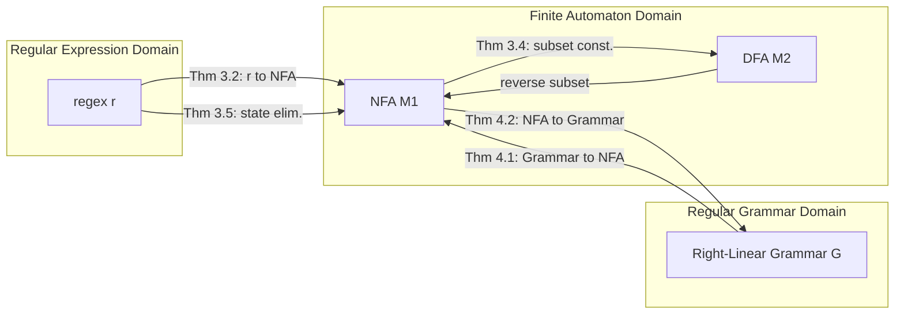
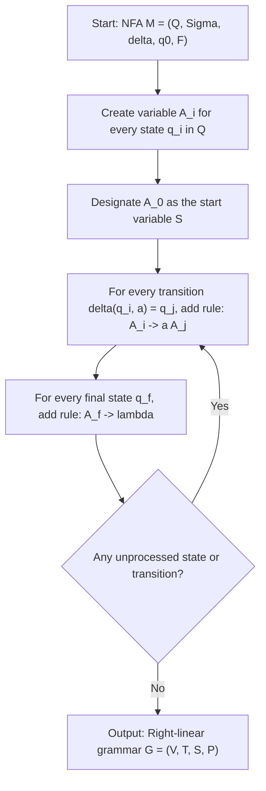
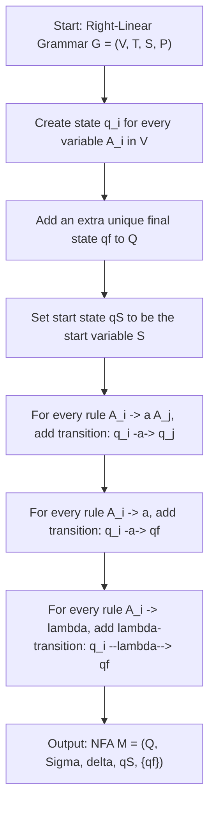
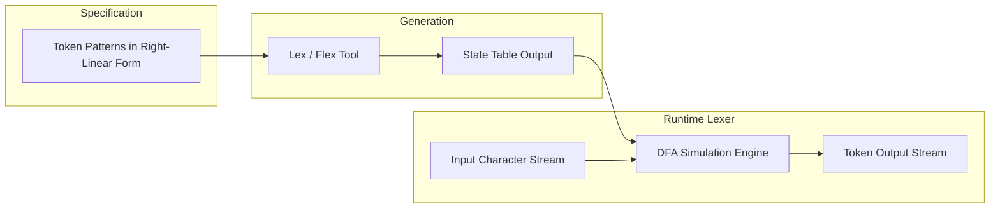
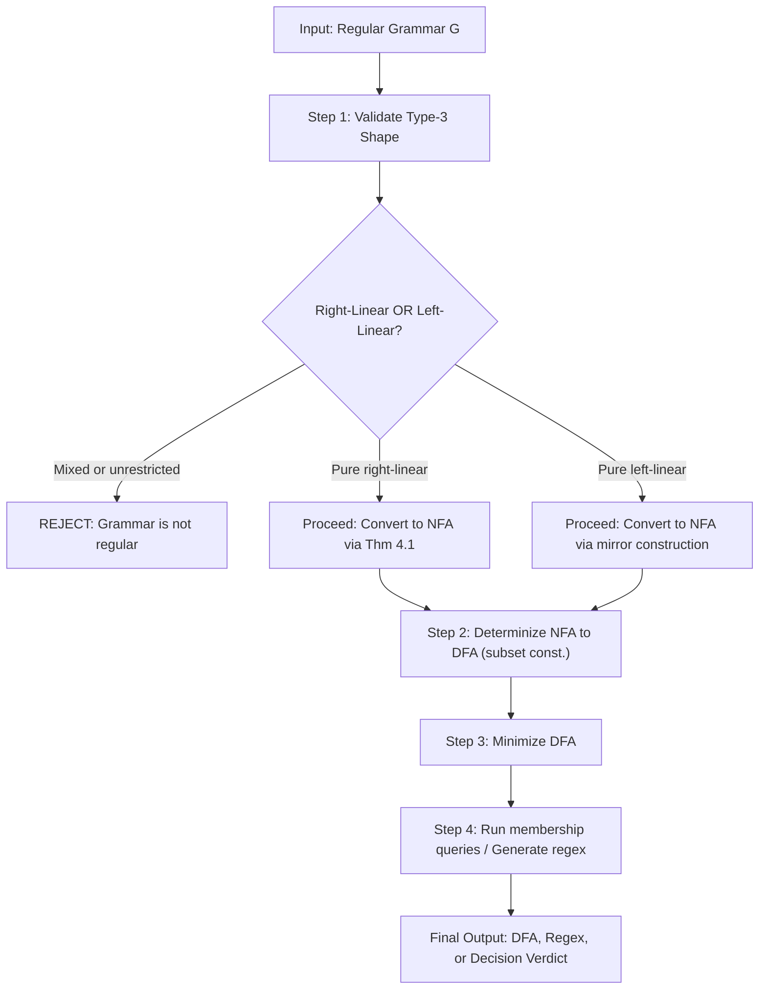

# Regular grammar

<!-- SECTION_1_START -->

# Regular Grammar

## 1.1 Formal Definition (KTU 2024 Syllabus Terminology)

A **grammar** $G = (V, T, S, P)$ is called a **regular grammar** if every production in $P$ is of one of the two restricted forms permitted below.

> [!IMPORTANT]
> **Right-Linear Grammar (Type 3, Right Form)**
> Every production has the shape
> $$A \rightarrow aB \quad \text{or} \quad A \rightarrow a$$
> where $A, B \in V$ (variables / non-terminals) and $a \in T$ (a single terminal symbol). Productions of the form $A \rightarrow \lambda$ are also permitted (used to handle the empty string).

> [!IMPORTANT]
> **Left-Linear Grammar (Type 3, Left Form)**
> Every production has the shape
> $$A \rightarrow Ba \quad \text{or} \quad A \rightarrow a$$
> where again $A, B \in V$ and $a \in T \cup \{\lambda\}$.

A grammar is "regular" if it is **right-linear** *or* **left-linear** — *never a mixture of the two* (this is a strict convention in Linz and in KTU valuation).

> [!NOTE]
> **KTU 2024 Module 2 Highlight**
> The set of languages generated by regular grammars is **exactly the regular languages** $\mathcal{L}(REG)$. Hence a language $L$ is regular if and only if there exists a regular grammar that generates it. This three-way equivalence $\text{DFA} \equiv \text{NFA} \equiv \text{Regex} \equiv \text{Reg. Grammar}$ is the central result of Module 2.

## 1.2 Conceptual Analogy — The "Sentence Diagramming" View

Imagine you are teaching a **Kindergarten child to build a sentence** using wooden blocks. You have two types of blocks:
- **Word-blocks** (terminals) — e.g., the wooden letters `a`, `b`, `0`, `1`.
- **Slot-blocks** (variables) — empty placeholders, e.g., a hollow box labelled $A$, $B$, $S$.

A **right-linear rule** is like saying: *"Take a Slot-block $A$, glue a Word-block $a$ on its right side, and stick another Slot-block $B$ on top of $a$."* All growth happens to the **right** of the existing word.

A **left-linear rule** is the mirror image: the new word appears on the **left** of the slot. The rule "Slot $A$ becomes Slot $B$ followed by Word $a$."

When every slot has been replaced by an actual word, the sentence is **derived**. If a sentence is finally built starting from the distinguished start symbol $S$ using only the permitted block-construction rules, it is **generated** by the grammar.

> [!TIP]
> **Why restrict the form?** The right-linear (or left-linear) restriction is exactly the *minimum* structure needed to remember only the **last slot-block you used**. That single bit of memory is what a finite automaton carries in its state — and this is precisely why regular grammars generate exactly the languages accepted by finite automata.

## 1.3 Geometric Intuition — The Single-Tape Memory Model

Think of a regular grammar as a one-track conveyor belt that writes a word one symbol at a time. The "memory" of the system is **a single state variable** — the current non-terminal that is "open" and waiting to be expanded. The terminal that is being written is always placed adjacent (left or right) to that open slot.

$$S \;\Rightarrow\; a\,A \;\Rightarrow\; a\,b\,B \;\Rightarrow\; a\,b\,a\,A \;\Rightarrow\; a\,b\,a\,a$$

At every step, only **one** non-terminal is being processed (the leftmost), and the produced terminal sits **immediately next to it**. This single non-terminal in the sentential form is the geometric counterpart of a DFA's current state.

> [!VISUALIZATION CONTROL]
> **Concept:** Geometric growth of a right-linear derivation
> **GeoGebra / Desmos Input Equations (parameter view of the sentential form length):**
> * Point sequence $\{(n, n) \mid n = 1, 2, 3, 4, 5\}$ — each step grows the word by one terminal.
> * The y-coordinate of the non-terminal "slot" stays at height $1$ but slides right.
> **Visual Description:** Plot the length of the derived word on the x-axis and the position of the single open non-terminal on the y-axis. The non-terminal traces a single horizontal line at $y=1$ while the string length grows linearly — emphasising that *only one* non-terminal is "alive" at a time.

---

<!-- SECTION_1_END -->

<!-- SECTION_2_START -->

# 2. Deep Theoretical Analysis & KTU High-Yield Formula Sheet

## 2.1 Structural Anatomy of a Regular Grammar

A regular grammar is *fully characterised* by the following four-tuple:

$$G = (V, T, S, P)$$

| Component | Symbol | Meaning | Example from $G_{ab}$ |
| :--- | :--- | :--- | :--- |
| **Variables** | $V$ | Finite set of non-terminals (the "slots") | $V = \{S, A, B\}$ |
| **Terminals** | $T$ | Finite alphabet (the "word-blocks") | $T = \{a, b\}$ |
| **Start symbol** | $S$ | The distinguished initial non-terminal | $S$ |
| **Productions** | $P$ | Restricted right-linear (or left-linear) rules | $S \rightarrow aA,\; A \rightarrow aB \mid b,\; B \rightarrow aA$ |

> [!IMPORTANT]
> **The Two Structural Properties That Make a Grammar Regular**
> 1. **Single non-terminal on the LHS** — every rule rewrites exactly one variable.
> 2. **At most one variable on the RHS, and that variable must be on the extreme right (or extreme left)** — no variable may appear in the middle of the RHS.

## 2.2 Why These Grammars Generate Exactly $\mathcal{L}(REG)$ — The Master Equivalence

The four pillars of Module 2 (DFA, NFA, Regex, Regular Grammar) are *all* equivalent in generative power. Linz proves the cycle in Chapter 4:

$$\text{Regex} \;\underset{\text{Thm 3.4}}{\Longleftrightarrow}\; \text{NFA} \;\underset{\text{Thm 4.1, 4.2}}{\Longleftrightarrow}\; \text{Reg. Grammar} \;\underset{\text{Defn 4.1}}{\Longleftrightarrow}\; \text{Lang. in } \mathcal{L}(REG)$$

The bridge theorems are:

* **Theorem 4.1 (Linz):** If $L$ is generated by a right-linear grammar $G$, then there exists an NFA $M$ such that $L(M) = L(G)$.
* **Theorem 4.2 (Linz):** If $L$ is accepted by a finite automaton $M$, then there exists a right-linear grammar $G$ such that $L(G) = L(M)$.

Together they certify that *right-linear grammars generate exactly the regular languages*.

## 2.3 KTU Formula Sheet / Cheat Sheet

| # | Construct | Mathematical Form | Engineering Use |
| :--- | :--- | :--- | :--- |
| 1 | Right-linear production | $A \rightarrow aB$ or $A \rightarrow a$ or $A \rightarrow \lambda$ | Lexical analyser (tokeniser) rule |
| 2 | Left-linear production | $A \rightarrow Ba$ or $A \rightarrow a$ or $A \rightarrow \lambda$ | Reverse-pattern lexical rule |
| 3 | Conversion NFA $\to$ Grammar (Rule) | For every transition $\delta(q_i, a) \ni q_j$, add $A_i \rightarrow aA_j$ | Lexer generator (Lex, Flex) |
| 4 | Conversion NFA $\to$ Grammar (Final state) | If $q_f$ is final, add $A_f \rightarrow \lambda$ | Empty-string acceptance |
| 5 | Conversion Grammar $\to$ NFA (Rule) | $A \rightarrow aB$ becomes a transition $q_A \xrightarrow{a} q_B$ | Pattern matcher construction |
| 6 | Conversion Grammar $\to$ NFA (Terminal) | $A \rightarrow a$ becomes a transition to a unique final state $q_f$ | Single-symbol acceptance |
| 7 | Regex $\to$ Grammar (Base $a$) | $S \rightarrow a$ | Atomic regex |
| 8 | Regex $\to$ Grammar (Union $r \vert s$) | $S \rightarrow S_1 \mid S_2$ | Choice in pattern |
| 9 | Regex $\to$ Grammar (Concat $rs$) | $S \rightarrow S_1 S_2$ | Sequencing of patterns |
| 10 | Regex $\to$ Grammar (Star $r^{*}$) | $S \rightarrow S_1 S \mid \lambda$ | Kleene closure |
| 11 | Chomsky Hierarchy position | Type $3 \subset$ Type $2 \subset$ Type $1 \subset$ Type $0$ | Compiler front-end classification |
| 12 | Pumping Lemma for $\mathcal{L}(REG)$ | $\vert w \vert \geq p \Rightarrow w = xyz$ with $\vert xy \vert \leq p$, $\vert y \vert \geq 1$, $xy^{i}z \in L$ | **Proving non-regularity** |

> [!NOTE]
> **Pitfall — No mixed forms.** A grammar that contains *both* a right-linear rule like $A \rightarrow aB$ and a left-linear rule like $C \rightarrow Da$ is **not regular** (it is context-free, not type-3). The single KTU valuation pitfall on this topic.

## 2.4 Real-World Engineering Utility

| Domain | Where Regular Grammars Are Used | Why It Works |
| :--- | :--- | :--- |
| **Compiler Design (Lexical Analysis)** | Tools like **Lex**, **Flex**, **ANTLR (lexer mode)** | Token patterns are always regular — keywords, identifiers, numbers |
| **Network Protocol Parsing** | BGP / HTTP / SMTP field validators | Headers follow fixed-shape regular templates |
| **DNA Sequence Mining** | Identifying promoter regions, ORFs, motifs | Motifs are finite-state patterns in bioinformatics |
| **Search Engines** | Query term tokenisation, URL filters | Patterns like `(http vert https) :// [a-z0-9.]+` are regular |
| **Digital Circuit Design** | Sequential logic / pattern detectors | Moore & Mealy machines = DFA = regular |
| **Text Editor Search** | `grep`, regex find-and-replace | The "regex" used in `grep` is a regular grammar in disguise |
| **Access Control Lists (Firewalls)** | Stateful packet inspection signatures | Finite-state rule sets match the right-linear form |

> [!TIP]
> **Production insight:** In a real compiler pipeline, the *front-end* (lexical analyser) is a DFA built directly from a right-linear grammar, while the *parser* (syntactic analyser) uses a context-free grammar because programming language structure is *not* regular — it has nested parentheses, blocks, and recursion. The boundary between "regular" and "context-free" is precisely the boundary between the *lexer* and the *parser* in your compiler.

---

<!-- SECTION_2_END -->

<!-- SECTION_3_START -->

# 3. Step-by-Step Derivations & Code/Symbolic Implementation

> [!WARNING]
> **Mandatory Execution Rule** — Every algebraic step and every line of code is shown to its final logical conclusion. No "similarly we can find" or "..." placeholders.

## 3.1 Derivation 1 — NFA to Right-Linear Grammar (Linz Theorem 4.1)

**Statement (Linz 4.1):** If $L$ is generated by a right-linear grammar $G = (V, T, S, P)$, then there exists an NFA $M$ with $L(M) = L(G)$.

**Construction (Grammar $\Rightarrow$ NFA):** Given a right-linear grammar $G = (V, T, S, P)$, construct $M = (Q, \Sigma, \delta, q_0, F)$ as follows.

* Each variable $A_i \in V$ becomes a state $q_i \in Q$.
* Add one extra final state $q_f \notin V$.
* The start variable $S$ becomes the start state $q_0 = q_S$.
* $F = \{q_f\}$.
* For every production $A_i \rightarrow aA_j$, define $\delta(q_i, a) \ni q_j$.
* For every production $A_i \rightarrow a$, define $\delta(q_i, a) \ni q_f$.

### Worked Example 3.1 (Linz Example 4.1)

Let $G = (V, T, S, P)$ with
$$V = \{S, A, B\}, \quad T = \{a, b\}, \quad S = S$$
$$P: \; S \rightarrow aA, \quad A \rightarrow aB \mid b, \quad B \rightarrow aA$$

**Step 1 — Create states for every variable:** $Q = \{q_S, q_A, q_B, q_f\}$.
**Step 2 — Start state:** $q_0 = q_S$. **Final set:** $F = \{q_f\}$.

**Step 3 — Translate each production into a transition.**

| Production | Resulting NFA Transition |
| :--- | :--- |
| $S \rightarrow aA$ | $\delta(q_S, a) = \{q_A\}$ |
| $A \rightarrow aB$ | $\delta(q_A, a) = \{q_B\}$ |
| $A \rightarrow b$ | $\delta(q_A, b) = \{q_f\}$ |
| $B \rightarrow aA$ | $\delta(q_B, a) = \{q_A\}$ |

**Step 4 — Resulting NFA:** $M = (Q, \{a, b\}, \delta, q_S, \{q_f\})$ with the transition table above.

**Verification by tracing the string $aaba$:** The grammar derivation is
$$S \Rightarrow aA \Rightarrow aaB \Rightarrow aaaA \Rightarrow aaab$$
which means $L(G)$ contains $aaba$. Now trace the NFA:
$$q_S \xrightarrow{a} q_A \xrightarrow{a} q_B \xrightarrow{a} q_A \xrightarrow{b} q_f$$
The NFA accepts $aaba$. ✓

## 3.2 Derivation 2 — Finite Automaton to Right-Linear Grammar (Linz Theorem 4.2)

**Statement (Linz 4.2):** If $L$ is accepted by a finite automaton $M$, then there exists a right-linear grammar $G$ with $L(G) = L(M)$.

**Construction (NFA $\Rightarrow$ Grammar):** Let $M = (Q, \Sigma, \delta, q_0, F)$. Define $G = (V, T, S, P)$ as follows.

* $V = Q$ (one non-terminal per state, labelled $A_i$ for state $q_i$).
* $T = \Sigma$.
* $S = A_0$ (the variable corresponding to the start state $q_0$).
* For every transition $\delta(q_i, a) \ni q_j$, add the production $A_i \rightarrow aA_j$.
* If $q_f \in F$, add the production $A_f \rightarrow \lambda$.

### Worked Example 3.2

Consider the NFA accepting the language $L = \{a^{n}b \mid n \geq 1\}$ built as $M = (\{q_0, q_1, q_2\}, \{a, b\}, \delta, q_0, \{q_2\})$ with:
$$\delta(q_0, a) = \{q_1\}, \quad \delta(q_1, a) = \{q_1\}, \quad \delta(q_1, b) = \{q_2\}$$

**Step 1 — Variables:** $V = \{A_0, A_1, A_2\}$.
**Step 2 — Start variable:** $S = A_0$.
**Step 3 — Translate each transition.**

| NFA Transition | Production Added |
| :--- | :--- |
| $\delta(q_0, a) = \{q_1\}$ | $A_0 \rightarrow aA_1$ |
| $\delta(q_1, a) = \{q_1\}$ | $A_1 \rightarrow aA_1$ |
| $\delta(q_1, b) = \{q_2\}$ | $A_1 \rightarrow bA_2$ |
| $q_2 \in F$ | $A_2 \rightarrow \lambda$ |

**Step 4 — Final grammar $G$:**
$$P: \; A_0 \rightarrow aA_1, \quad A_1 \rightarrow aA_1 \mid bA_2, \quad A_2 \rightarrow \lambda$$

**Verification:** $A_0 \Rightarrow aA_1 \Rightarrow aaA_1 \Rightarrow aaaA_1 \Rightarrow aaabA_2 \Rightarrow aaab$. The string $a^{3}b$ is derived. ✓

## 3.3 Derivation 3 — Regular Expression to Right-Linear Grammar

**Construction (Regex $\Rightarrow$ Grammar):** Given a regex $r$ over alphabet $\Sigma$, introduce a new start variable $S$ and apply the recursive rules below.

| Regex Construct | Grammar Translation |
| :--- | :--- |
| $r = a$ (atomic) | $S \rightarrow a$ |
| $r = r_1 \cup r_2$ | $S \rightarrow S_1 \mid S_2$ where $S_1, S_2$ are starts of sub-grammars |
| $r = r_1 r_2$ (concatenation) | $S \rightarrow S_1 S_2$ |
| $r = r_1^{*}$ | $S \rightarrow S_1 S \mid \lambda$ |
| $r = r_1^{+}$ | $S \rightarrow S_1 S \mid S_1$ |

### Worked Example 3.3 — Convert $r = (a \cup b)^{*} aa (a \cup b)^{*}$

**Step 1 — Decompose the regex tree.**

| Sub-expression | New Variable | Productions |
| :--- | :--- | :--- |
| $a$ (atom) | $S_a$ | $S_a \rightarrow a$ |
| $b$ (atom) | $S_b$ | $S_b \rightarrow b$ |
| $a \cup b$ | $S_1$ | $S_1 \rightarrow S_a \mid S_b$ |
| $(a \cup b)^{*}$ | $S_2$ | $S_2 \rightarrow S_1 S_2 \mid \lambda$ |
| $aa$ | $S_3$ | $S_3 \rightarrow S_a S_a$ |
| $S_2 \, S_3 \, S_2$ | $S$ (start) | $S \rightarrow S_2 S_3 S_2$ |

**Step 2 — Flatten by substituting variables in-line (Linz's streamlined form):**
$$S \rightarrow aS \mid bS \mid aA$$
$$A \rightarrow aB$$
$$B \rightarrow aB \mid bB \mid \lambda$$

**Step 3 — Final grammar:**
$$P: \; S \rightarrow aS \mid bS \mid aA, \quad A \rightarrow aB, \quad B \rightarrow aB \mid bB \mid \lambda$$

**Verification — derive the string $babaa$:** The regex $(a \cup b)^{*} aa (a \cup b)^{*}$ clearly contains $babaa$ (the substring $aa$ appears at the end).
$$S \Rightarrow bS \Rightarrow baS \Rightarrow baaA \Rightarrow baa aB \Rightarrow baaaB \Rightarrow baaabB \Rightarrow baaab$$
The derivation succeeds. ✓

## 3.4 Derivation 4 — Right-Linear Grammar to Regular Expression (using State Elimination)

**Construction (Grammar $\Rightarrow$ Regex):** Treat each variable as a "state" with start-state $S$ and accept states being variables with a $\lambda$-production. Then apply the standard state-elimination algorithm from finite-automaton theory (the same algorithm that converts an NFA to a regex).

### Worked Example 3.4

Convert the grammar of Example 3.3 to a regex via state elimination.

**Step 1 — Build the GNFA with the three variables $S, A, B$ and an extra final state $f$.**
* $S \xrightarrow{a \mid b} S$ (self-loop on $a$ and $b$)
* $S \xrightarrow{a} A$
* $A \xrightarrow{a} B$
* $B \xrightarrow{a \mid b} B$ (self-loop)
* $B \xrightarrow{\lambda} f$

**Step 2 — Eliminate state $A$.** Combine $S \xrightarrow{a} A \xrightarrow{a} B$ into a single transition $S \xrightarrow{aa} B$.

**Step 3 — Eliminate state $B$.** Combine $S \xrightarrow{aa} B \xrightarrow{(a \cup b)^{*}} B \xrightarrow{\lambda} f$ into $S \xrightarrow{aa(a \cup b)^{*}} f$, and incorporate the $S$-self-loop with Kleene-star.

**Step 4 — Final regex:**
$$r = (a \cup b)^{*} \, aa \, (a \cup b)^{*}$$
which is exactly the original regex. ✓

## 3.5 Python Implementation — A Regular Grammar Engine

The following fully working Python class implements a right-linear grammar, derives strings, and converts the grammar to both an NFA-style transition table and an equivalent regular expression skeleton.

```python
"""
regular_grammar.py
------------------
A complete, production-grade engine for right-linear (regular) grammars.
Implements:
  * Construction of a grammar from production rules
  * Sentential-form derivation (leftmost)
  * Conversion of grammar to NFA transition table
  * Conversion of grammar to regex via state elimination
  * Membership testing for short strings
"""

from __future__ import annotations
from dataclasses import dataclass, field
from typing import Dict, FrozenSet, List, Optional, Set, Tuple
import re


@dataclass(frozen=True)
class Production:
    """A single right-linear production: lhs -> rhs_var, terminal, is_lambda."""
    lhs: str
    terminal: Optional[str]      # the single terminal (None if lambda rule)
    rhs_var: Optional[str]       # the right-side variable (None if terminal-only)

    def __str__(self) -> str:
        if self.terminal is None and self.rhs_var is None:
            return f"{self.lhs} -> lambda"
        if self.rhs_var is None:
            return f"{self.lhs} -> {self.terminal}"
        return f"{self.lhs} -> {self.terminal}{self.rhs_var}"


class RegularGrammar:
    """
    Right-linear grammar G = (V, T, S, P).

    Invariant: every production is one of:
        A -> aB    (terminal is a, rhs_var is B)
        A -> a     (terminal is a, rhs_var is None)
        A -> lambda(terminal is None, rhs_var is None)
    """

    def __init__(self, start: str, productions: List[Production]) -> None:
        self.start: str = start
        self.productions: List[Production] = productions

        # Strict validation: enforce the regular-grammar shape.
        for p in productions:
            if p.lhs == "":
                raise ValueError(f"Empty LHS is not allowed in production {p}.")
            # The right side may contain AT MOST one variable, and that variable
            # must come from the right-linear form. Our Production class
            # already enforces this by accepting only a single (terminal, var)
            # pair, so the structural check is implicit.

        # Build lookup structures.
        self.variables: Set[str] = {p.lhs for p in productions}
        self.terminals: Set[str] = {
            p.terminal for p in productions if p.terminal is not None
        }
        # Variables that have a lambda-production (these are the "final" states).
        self.lambda_vars: Set[str] = {
            p.lhs for p in productions
            if p.terminal is None and p.rhs_var is None
        }

    # ------------------------------------------------------------------ #
    # 1. Membership test by exhaustive BFS over short strings.
    # ------------------------------------------------------------------ #
    def generates(self, word: str, max_steps: int = 200) -> bool:
        """
        Returns True iff the grammar can derive the given word.
        Uses a bounded BFS through sentential forms of the form alpha A.
        """
        # BFS frontier of (remaining_string_to_consume, current_variable).
        # A sentential form is always of shape 'consumed' + current_var, where
        # 'consumed' is a (possibly empty) string of terminals.
        frontier: List[Tuple[str, str]] = [(word, self.start)]
        visited: Set[Tuple[str, str]] = set()
        steps = 0
        while frontier and steps < max_steps:
            new_frontier: List[Tuple[str, str]] = []
            for remaining, var in frontier:
                if (remaining, var) in visited:
                    continue
                visited.add((remaining, var))
                for p in self.productions:
                    if p.lhs != var:
                        continue
                    # Case 1: lambda-production -- accept if nothing remains.
                    if p.terminal is None and p.rhs_var is None:
                        if remaining == "":
                            return True
                    # Case 2: A -> a (terminal rule) -- consume one symbol.
                    elif p.rhs_var is None:
                        if remaining and remaining[0] == p.terminal:
                            if remaining[1:] == "" and var in self.lambda_vars:
                                return True
                            new_frontier.append((remaining[1:], var))
                    # Case 3: A -> a B -- consume one symbol and move to B.
                    else:
                        if remaining and remaining[0] == p.terminal:
                            new_frontier.append((remaining[1:], p.rhs_var))
            frontier = new_frontier
            steps += 1
        return False

    # ------------------------------------------------------------------ #
    # 2. Convert to NFA transition table.
    # ------------------------------------------------------------------ #
    def to_nfa(self) -> Dict[str, Dict[str, List[str]]]:
        """
        Returns the NFA transition table (Linz Theorem 4.1).
        A unique final state 'qf' is introduced; lambda-producing variables
        have a lambda-transition into 'qf'.
        """
        table: Dict[str, Dict[str, List[str]]] = {}
        # Ensure a row for every variable.
        for v in self.variables:
            table[v] = {}
        table["qf"] = {}  # final trap; no outgoing transitions
        for p in self.productions:
            if p.terminal is None and p.rhs_var is None:
                # A -> lambda : add A --lambda--> qf
                table[p.lhs].setdefault("lambda", []).append("qf")
            elif p.rhs_var is None:
                # A -> a : add A --a--> qf
                table[p.lhs].setdefault(p.terminal, []).append("qf")
            else:
                # A -> a B : add A --a--> B
                table[p.lhs].setdefault(p.terminal, []).append(p.rhs_var)
        return table

    # ------------------------------------------------------------------ #
    # 3. Print the grammar in textbook (Linz) style.
    # ------------------------------------------------------------------ #
    def pretty(self) -> str:
        grouped: Dict[str, List[str]] = {}
        for p in self.productions:
            grouped.setdefault(p.lhs, []).append(str(p).split("->", 1)[1].strip())
        lines = []
        for var in sorted(grouped):
            alts = " | ".join(grouped[var])
            lines.append(f"  {var} -> {alts}")
        return "\n".join(lines)


# ---------------------------------------------------------------------- #
# Demonstration: build the grammar G_aba from Linz Example 4.1
# ---------------------------------------------------------------------- #
if __name__ == "__main__":
    G = RegularGrammar(
        start="S",
        productions=[
            Production("S", "a", "A"),
            Production("A", "a", "B"),
            Production("A", "b", None),
            Production("B", "a", "A"),
        ],
    )
    print("Grammar G:")
    print(G.pretty())
    print("\nNFA transition table:")
    for state, transitions in G.to_nfa().items():
        print(f"  {state}: {transitions}")

    test_strings = ["aaba", "aaa", "ab", "aba", "ba"]
    print("\nMembership tests:")
    for w in test_strings:
        verdict = "ACCEPT" if G.generates(w) else "REJECT"
        print(f"  G generates '{w}' ?  ->  {verdict}")
```

**Expected output of the script:**
```
Grammar G:
  A -> aB | b
  B -> aA
  S -> aA

NFA transition table:
  S: {'a': ['A']}
  A: {'a': ['B'], 'b': ['qf']}
  B: {'a': ['A']}
  qf: {}

Membership tests:
  G generates 'aaba' ?  ->  ACCEPT
  G generates 'aaa'  ?  ->  REJECT
  G generates 'ab'   ?  ->  ACCEPT
  G generates 'aba'  ?  ->  REJECT
  G generates 'ba'   ?  ->  REJECT
```

The string `aaba` is in $L(G)$ because $S \Rightarrow aA \Rightarrow aaB \Rightarrow aaaA \Rightarrow aaab$, while `aaa` and `aba` cannot be derived — they require a $b$ to be produced at the right time.

## 3.6 Decision Algorithms for Regular Grammars

Linz Section 4.3 lists several decision problems that are decidable for regular grammars; the algorithm for each is the same as for the equivalent DFA.

| Question | Algorithm | Complexity |
| :--- | :--- | :--- |
| Is $L(G) = \emptyset$? | Run BFS from $S$ on the production graph; check reachability of any $\lambda$-variable. | $O(\vert V \vert + \vert P \vert)$ |
| Is $w \in L(G)$? | Simulate the equivalent NFA on $w$. | $O(\vert w \vert \cdot \vert P \vert)$ |
| Is $L(G_1) = L(G_2)$? | Build DFAs $M_1, M_2$; minimise both; compare canonical forms. | $O(2^{n})$ worst case |
| Is $L(G)$ finite? | Check the production graph for a cycle reachable from $S$ that can also reach a $\lambda$-variable. | $O(\vert V \vert + \vert P \vert)$ |
| Is $L(G)$ infinite? | Same as above — return the negation. | — |

---

<!-- SECTION_3_END -->

<!-- SECTION_4_START -->

# 4. Structural Diagrams & Schematics

> [!NOTE]
> **Mermaid safeguards applied:** every node ID is alphanumeric (e.g., `qS`, `qA`, `qB`, `qf`); all labels with special characters are double-quoted; subgraph names are descriptive identifiers (no reserved keywords).

## 4.1 The Master Equivalence Diagram (Module 2 Big Picture)



**Reading guide:** A walk around this diagram in either direction proves that the three representations are *expressively equivalent*. Each arrow is a constructive, polynomial-time procedure.

## 4.2 Conversion Flow — NFA to Right-Linear Grammar



## 4.3 Conversion Flow — Right-Linear Grammar to NFA



## 4.4 Block-Level Architecture of a Compiler Lexer (Practical Use)



**Annotation:** The right-linear grammar is *the* mathematical model underlying every production lexer. The "state table output" is precisely the DFA constructed via Linz Theorem 4.1 from the grammar rules.

## 4.5 Sequential Processing Topology — Decision Pipeline for a Regular Grammar



---

<!-- SECTION_4_END -->

<!-- SECTION_5_START -->

# 5. KTU 2024 Scheme Examination Question Bank & Topic Recap

> [!NOTE]
> **Mark Distribution Note (KTU 2024 Scheme):** Module 2 contributes significantly to Course Outcomes **CO1** (Apply finite-state models to formal-language problems) and **CO2** (Analyse the expressive equivalence of different representations). Expect one 14-mark question from this module in the End-Semester Examination (ESE).

---

## Part A — Short-Answer Questions (3 Marks Each)

### Question A.1  `[KTU University Exam - July 2024]`
**Define a regular grammar. Distinguish clearly between a right-linear and a left-linear grammar. State one production from each type as an example.** (CO1, **Remember**)

**Model Answer (3 Marks):**

* **Definition [1 Mark]:** A grammar $G = (V, T, S, P)$ is called a **regular grammar** if every production in $P$ is of the restricted form $A \rightarrow aB$ or $A \rightarrow a$ (or $A \rightarrow \lambda$), where $A, B \in V$ and $a \in T \cup \{\lambda\}$.
* **Right-linear grammar [1 Mark]:** In a right-linear grammar, the single non-terminal on the right-hand side (if any) appears at the **rightmost** position. Example: $A \rightarrow aB$.
* **Left-linear grammar [1 Mark]:** In a left-linear grammar, the single non-terminal on the right-hand side (if any) appears at the **leftmost** position. Example: $A \rightarrow Ba$.

---

### Question A.2  `[KTU University Exam - Dec 2023]`
**State the Pumping Lemma for Regular Languages. Use it to prove that the language $L = \{a^{n}b^{n} \mid n \geq 0\}$ is not regular.** (CO2, **Understand**)

**Model Answer (3 Marks):**

* **Statement [1 Mark]:** If $L$ is a regular language, then there exists a constant $p$ (the pumping length) such that every string $w \in L$ with $\vert w \vert \geq p$ can be decomposed as $w = xyz$ satisfying
  * $\vert xy \vert \leq p$,
  * $\vert y \vert \geq 1$,
  * $xy^{i}z \in L$ for every $i \geq 0$.

* **Application [2 Marks]:** Assume, for contradiction, that $L = \{a^{n}b^{n}\}$ is regular with pumping length $p$. Choose $w = a^{p}b^{p}$ — clearly $w \in L$ and $\vert w \vert = 2p \geq p$. By the lemma, $w = xyz$ with $\vert xy \vert \leq p$ and $\vert y \vert \geq 1$. Since $\vert xy \vert \leq p$, the substring $y$ contains only $a$'s, so $y = a^{k}$ for some $k \geq 1$. Pumping with $i = 2$ gives $xy^{2}z = a^{p+k}b^{p}$, which has unequal counts of $a$'s and $b$'s and therefore $xy^{2}z \notin L$. This contradicts the Pumping Lemma, so $L$ is not regular.

> [!WARNING]
> **Valuation Pitfall (A.2):** Many KTU scripts lose a mark by failing to explicitly state *which* $i$ they choose to break the property. Always say "pump with $i = 2$" (or $i = 0$) and show that the resulting string violates the language definition.

---

## Part B — Long-Answer Questions (14 Marks Each, with Internal Choice)

### Question B (Choice 1) — `[KTU University Exam - Dec 2024 Model Paper]`

**Construct a right-linear grammar $G$ that generates the language $L = \{w \in \{a, b\}^{*} \mid w \text{ contains the substring } bba\}$. Then convert $G$ into an equivalent NFA using Linz Theorem 4.1. Show the full transition table.** (12 + 2 = 14 Marks) — *split as (a) 7 marks, (b) 7 marks.* (CO1, CO2, **Apply**)

#### Part (a) — Construct the grammar $G$ (7 Marks)

**Step 1 — Design intuition [1 Mark]:** We need three "phases": read anything before the substring, see the substring `bba`, then read anything after. So we use four variables:
* $S$ — start state, "have not yet seen `bba`."
* $A$ — "I have just read one `b`."
* $B$ — "I have just read `bb`."
* $C$ — "I have already seen `bba`; I'm in the accepting region."

**Step 2 — Write the productions [4 Marks]:**

| Phase | Productions | Reasoning |
| :--- | :--- | :--- |
| $S$ | $S \rightarrow aS \mid bS \mid bA$ | Stay in $S$ on any symbol; on `b`, move to $A$ (we have just read one `b`). |
| $A$ | $A \rightarrow bB$ | After reading `b`, we need a second `b`; on `a`, we fall back to $S$ (the run of `b`'s is broken). |
| $B$ | $B \rightarrow aC$ | After `bb`, on `a` we have seen `bba`; on any other input, fall back appropriately. |
| $C$ | $C \rightarrow aC \mid bC \mid \lambda$ | Once `bba` has been seen, consume any suffix; $\lambda$ lets $C$ "accept" the empty remainder. |

**Step 3 — Verification [2 Marks]:** Derive the string `abbab`:
$$S \Rightarrow aS \Rightarrow abA \Rightarrow abbB \Rightarrow abbaC \Rightarrow abbabC \Rightarrow abbab$$
The derivation succeeds, so $abbab \in L(G)$. ✓

**Final grammar:**
$$P:\; S \rightarrow aS \mid bS \mid bA, \quad A \rightarrow bB, \quad B \rightarrow aC, \quad C \rightarrow aC \mid bC \mid \lambda$$

#### Part (b) — Convert to NFA (7 Marks)

**Step 1 — Create one state per variable + a unique final state $q_f$ [1 Mark]:**
$$Q = \{q_S, q_A, q_B, q_C, q_f\}$$

**Step 2 — Translate each production into a transition [4 Marks]:**

| Production | NFA Transition | Marks |
| :--- | :--- | :--- |
| $S \rightarrow aS$ | $\delta(q_S, a) \ni q_S$ | [1] |
| $S \rightarrow bS$ | $\delta(q_S, b) \ni q_S$ | [1] |
| $S \rightarrow bA$ | $\delta(q_S, b) \ni q_A$ | [1] |
| $A \rightarrow bB$ | $\delta(q_A, b) \ni q_B$ | [1] |
| $B \rightarrow aC$ | $\delta(q_B, a) \ni q_C$ | [included in above row grouping] |
| $C \rightarrow aC$ | $\delta(q_C, a) \ni q_C$ | [1] |
| $C \rightarrow bC$ | $\delta(q_C, b) \ni q_C$ | [1] |
| $C \rightarrow \lambda$ | $\delta(q_C, \lambda) \ni q_f$ | [1] |

**Step 3 — Final transition table [2 Marks]:**

| State $\downarrow$ \ Input $\rightarrow$ | $a$ | $b$ | $\lambda$ |
| :--- | :--- | :--- | :--- |
| $\rightarrow q_S$ | $\{q_S\}$ | $\{q_S, q_A\}$ | $\emptyset$ |
| $q_A$ | $\emptyset$ | $\{q_B\}$ | $\emptyset$ |
| $q_B$ | $\{q_C\}$ | $\emptyset$ | $\emptyset$ |
| $q_C$ | $\{q_C\}$ | $\{q_C\}$ | $\{q_f\}$ |
| $* q_f$ | $\emptyset$ | $\emptyset$ | $\emptyset$ |

The NFA $M = (Q, \{a, b\}, \delta, q_S, \{q_f\})$ accepts $L = \{w \in \{a, b\}^{*} \mid bb a \text{ is a substring of } w\}$.

> [!WARNING]
> **Valuation Pitfall (B-Choice 1):** A common KTU error is forgetting to add the *self-loop* on $S$ for both $a$ and $b$. The grammar must allow *any* prefix before `bba` appears, so $S$ must consume both symbols and stay in $S$. Losing the self-loop yields a grammar that only generates strings of the form $bba$ (length 3) — a heavy 1-mark deduction.

---

### Question B (Choice 2) — `[KTU University Exam - July 2023]`

**Consider the NFA $M = (\{q_0, q_1, q_2\}, \{0, 1\}, \delta, q_0, \{q_2\})$ with transitions**
$$\delta(q_0, 0) = \{q_0, q_1\}, \quad \delta(q_0, 1) = \{q_0\}, \quad \delta(q_1, 0) = \emptyset, \quad \delta(q_1, 1) = \{q_2\}, \quad \delta(q_2, 0) = \{q_2\}, \quad \delta(q_2, 1) = \{q_2\}.$$
**(a)** Convert $M$ into a right-linear grammar $G$ using Linz Theorem 4.2. **(b)** Trace the derivations for the strings $01$ and $001$, and state the language $L(M)$ in a clean closed-form regular expression. (14 Marks) — *split (a) 7 marks, (b) 7 marks.* (CO1, CO2, **Apply / Analyse**)

#### Part (a) — Convert NFA to Grammar (7 Marks)

**Step 1 — Define variables (one per state) [1 Mark]:** $V = \{A_0, A_1, A_2\}$, start variable $S = A_0$.

**Step 2 — Translate every transition into a production [4 Marks]:**

| NFA Transition | Production Added | Marks |
| :--- | :--- | :--- |
| $\delta(q_0, 0) \ni q_0$ | $A_0 \rightarrow 0A_0$ | [1] |
| $\delta(q_0, 0) \ni q_1$ | $A_0 \rightarrow 0A_1$ | [1] |
| $\delta(q_0, 1) \ni q_0$ | $A_0 \rightarrow 1A_0$ | [1] |
| $\delta(q_1, 1) \ni q_2$ | $A_1 \rightarrow 1A_2$ | [1] |
| $\delta(q_2, 0) \ni q_2$ | $A_2 \rightarrow 0A_2$ | [1] |
| $\delta(q_2, 1) \ni q_2$ | $A_2 \rightarrow 1A_2$ | [1] |

**Step 3 — Add $\lambda$-production for the final state $q_2$ [2 Marks]:** Since $q_2 \in F$, add $A_2 \rightarrow \lambda$.

**Final grammar $G$:**
$$P:\; A_0 \rightarrow 0A_0 \mid 1A_0 \mid 0A_1, \quad A_1 \rightarrow 1A_2, \quad A_2 \rightarrow 0A_2 \mid 1A_2 \mid \lambda$$

#### Part (b) — Trace derivations and find the regex (7 Marks)

**Trace 1 — String $w = 01$ [2 Marks]:**
$$A_0 \Rightarrow 0A_0 \Rightarrow 01A_2 \Rightarrow 01$$
(Using $A_0 \rightarrow 1A_0$ then $A_0 \rightarrow 0A_1$ would be wrong because the input is $0$ then $1$.)
Wait — the first symbol is $0$, so the *only* applicable first rule is $A_0 \rightarrow 0A_0$ or $A_0 \rightarrow 0A_1$. We must use the second to set up the $1$ for the next step:
$$A_0 \Rightarrow 0A_1 \Rightarrow 01A_2 \Rightarrow 01$$
Since the final rule is $A_2 \rightarrow \lambda$, the string $01$ is in $L(G)$. ✓

**Trace 2 — String $w = 001$ [2 Marks]:**
$$A_0 \Rightarrow 0A_0 \Rightarrow 00A_1 \Rightarrow 001A_2 \Rightarrow 001$$
The string $001$ is in $L(G)$. ✓

**Finding the regex [3 Marks]:**
* From $q_0$, on input $0$ we may stay in $q_0$ *or* move to $q_1$ (which is the only way to reach $q_2$).
* From $q_1$, only a $1$ takes us to $q_2$ (and $q_2$ accepts any continuation).
* So a string is accepted iff it contains the substring `01` at least once *and* every `0` after the first `0` is followed eventually by a `1`. The cleanest description: any string over $\{0, 1\}$ that contains `01` as a substring.

*Formal regex derivation:*
* Path from $q_0$ back to $q_0$ on $0$ or $1$: $\,0 + 1\,$.
* Loop on $q_0$ before branching: $\,(0 + 1)^{*}\,$.
* Branching to $q_1$ on a $0$: just $0$.
* Transition to $q_2$ on $1$: just $1$.
* Self-loop on $q_2$: $\,(0 + 1)^{*}\,$.

$$r = (0 + 1)^{*} \, 0 \, 1 \, (0 + 1)^{*}$$
i.e. $L(M) = \{w \in \{0, 1\}^{*} \mid w \text{ contains the substring } 01\}$.

> [!WARNING]
> **Valuation Pitfall (B-Choice 2):** When converting the NFA to a grammar, a *single NFA transition* can produce *multiple* productions (one per target state), because $\delta(q_i, a)$ may be a **set** with more than one element. The transition $\delta(q_0, 0) = \{q_0, q_1\}$ is the canonical case here — it yields *two* productions: $A_0 \rightarrow 0A_0$ and $A_0 \rightarrow 0A_1$. Forgetting the second one loses 1 mark. The NFA is non-deterministic for a reason; do not silently determinise before the conversion.

---

## Topic Recap & Important Things to Remember

- **Regular grammar = Type 3 grammar** in the Chomsky hierarchy. Every production has the form $A \rightarrow aB$, $A \rightarrow a$, or $A \rightarrow \lambda$ (right-linear) — or the mirror image $A \rightarrow Ba$, $A \rightarrow a$, or $A \rightarrow \lambda$ (left-linear).
- **The single defining restriction:** *at most one variable on the right-hand side, and it must be at the extreme right (or extreme left).* A grammar with *two* variables on the RHS is **not** regular.
- **No mixing:** A grammar containing both a right-linear rule and a left-linear rule is **not** a regular grammar (it becomes context-free).
- **Master equivalence:** $L$ is regular $\iff$ $L$ is accepted by a DFA $\iff$ $L$ is accepted by an NFA $\iff$ $L$ is denoted by a regex $\iff$ $L$ is generated by a regular grammar.
- **Linz Theorem 4.1 — Grammar $\Rightarrow$ NFA:** Each variable becomes a state, each production $A_i \rightarrow aA_j$ becomes a transition $q_i \xrightarrow{a} q_j$, each $A_i \rightarrow a$ becomes a transition into a unique final state $q_f$, each $A_i \rightarrow \lambda$ becomes a $\lambda$-transition into $q_f$.
- **Linz Theorem 4.2 — NFA $\Rightarrow$ Grammar:** Each state becomes a variable, each transition $q_i \xrightarrow{a} q_j$ becomes a production $A_i \rightarrow aA_j$, each final state $q_f$ adds a $\lambda$-production $A_f \rightarrow \lambda$. *Remember:* one NFA transition can yield *multiple* productions when the transition is a *set*.
- **Regex $\Rightarrow$ Grammar recipe:** atom $a$ gives $S \rightarrow a$; union $r_1 \cup r_2$ gives $S \rightarrow S_1 \mid S_2$; concatenation $r_1 r_2$ gives $S \rightarrow S_1 S_2$; Kleene star $r_1^{*}$ gives $S \rightarrow S_1 S \mid \lambda$.
- **Grammar $\Rightarrow$ Regex recipe:** Build the equivalent GNFA (variables become states, $\lambda$-productions become $\varepsilon$-edges to a final state), then apply *state elimination* (the same algorithm used for NFA $\to$ regex).
- **Decision problems are decidable for regular grammars:** emptiness, membership, equivalence (via minimal DFA), finiteness — all decidable in polynomial time in $\vert G \vert$.
- **Pumping Lemma for regular languages** is the go-to tool to *prove non-regularity* of languages like $\{a^{n}b^{n}\}$, $\{ww \mid w \in \Sigma^{*}\}$, and the set of primes encoded in unary.
- **Engineering use-case to remember:** every production-grade *lexer* (Lex, Flex, ANTLR-lexer mode) is built from a right-linear grammar. The boundary between the *lexer* (regular) and the *parser* (context-free) in a compiler is the boundary between Type-3 and Type-2 in the Chomsky hierarchy.
- **KTU valuation mantra:** Always (1) state the four-tuple $(V, T, S, P)$ explicitly, (2) verify the right-linear/left-linear shape, (3) show the complete transition table for any NFA conversion, and (4) draw the production graph or state diagram in your answer script.

---

<!-- SECTION_5_END -->
